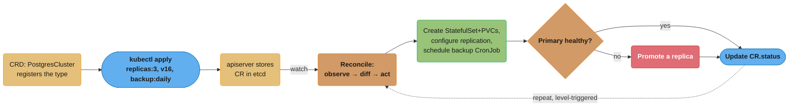
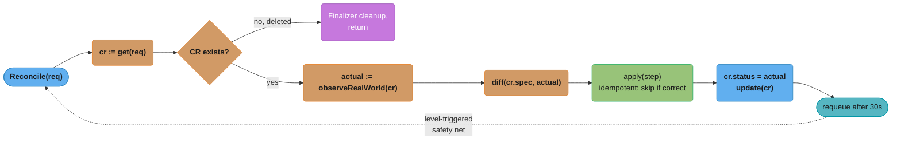
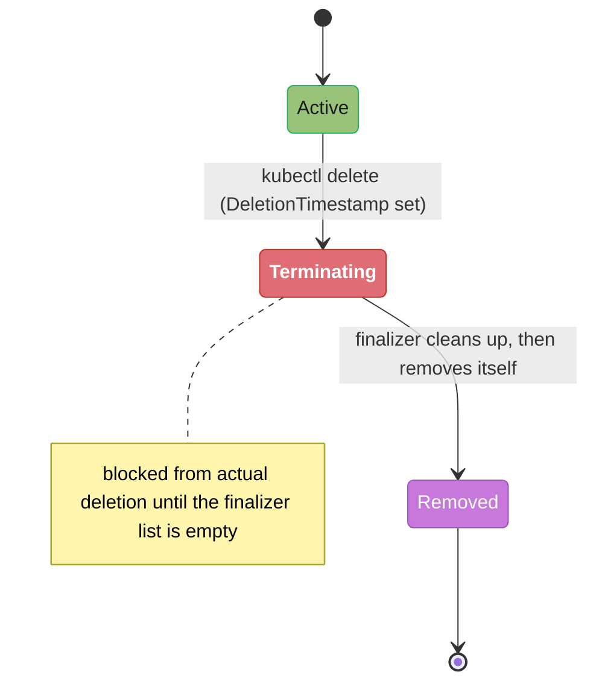
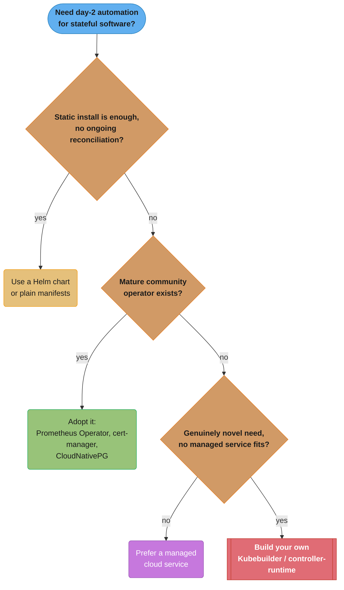
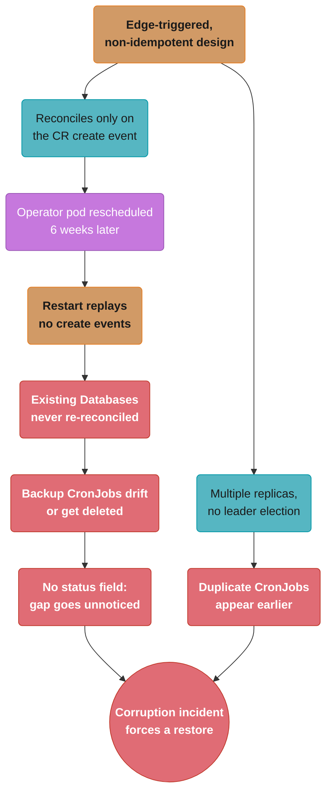

# Kubernetes Operators & CRDs

> Phase 2 — Containers & Kubernetes · Difficulty: Advanced

Kubernetes is extensible: you can teach it new object types (**Custom Resource Definitions**) and write controllers (**operators**) that reconcile them — applying the same "declare desired state, reconcile continuously" model to anything, from databases to certificates to your own platform abstractions. Operators are how complex stateful software (Postgres, Kafka, Prometheus) gets day-2 automation (backups, failover, upgrades) encoded as code.

---

## 1. Concept Overview

Two extension mechanisms work together:

- **CRD (CustomResourceDefinition)** — registers a new API type (e.g., `PostgresCluster`, `Certificate`) with the API server. Users then `kubectl apply` instances (custom resources, CRs) just like built-in objects, with schema validation, `kubectl get`, RBAC, etc.
- **Operator** — a custom controller that **watches** CRs of a type and runs a **reconciliation loop** to make reality match the CR's `spec` (provision a database, request a cert, scale a cluster). It encodes the operational knowledge a human SRE would otherwise apply manually.

This is the **operator pattern**: domain expertise (how to safely back up/upgrade/fail over a specific system) captured as a controller, so day-2 operations become declarative. Built with the **Operator SDK** / **Kubebuilder** (controller-runtime, Go) or in other languages.

---

## 2. Intuition

> **One-line analogy**: A built-in Kubernetes controller is like a thermostat that only knows "temperature." A CRD teaches the building a new dial — say "humidity" — and an operator is the technician who knows exactly how to reach and hold a target humidity (run the humidifier, watch for mold, adjust). You declare "I want 45% humidity"; the operator does everything a human expert would.

**Mental model**: Everything in Kubernetes is already "a desired-state object + a controller that reconciles it" (see [kubernetes_architecture](../kubernetes_architecture/)). Operators just let *you* add new object types and reconcilers using the exact same machinery. The operator watches its CRs, diffs spec vs the real-world state it manages, and takes one corrective step per loop — forever, level-triggered, self-healing.

**Why it matters**: Stateful and complex software needs day-2 operations (backup, restore, failover, rolling upgrade, scaling) that are error-prone by hand. Operators encode that expertise so a `kubectl apply` of a `PostgresCluster` yields a backed-up, HA, auto-failing-over database. They're also how platform teams expose simplified self-service abstractions (a `Database` CR that hides 200 lines of YAML).

**Key insight**: An operator is just a controller running the same reconcile loop the built-in controllers run — `for { observe; diff(spec, status); act }`. There's no new magic. Writing a good operator is mostly about making reconciliation **idempotent** (safe to run repeatedly) and **level-triggered** (acting on current state, not events), exactly like the core controllers.

---

## 3. Core Principles

1. **Extend the API with CRDs.** New types get schema validation, RBAC, and `kubectl` for free.
2. **Operators reconcile CRs.** Same watch → diff → act loop as built-in controllers.
3. **Encode operational expertise.** Backups, failover, upgrades become declarative day-2 automation.
4. **Reconciliation must be idempotent.** Re-running the loop converges to the same state; no duplicate side effects.
5. **Level-triggered, not edge-triggered.** Act on current observed state so missed events/restarts self-heal.
6. **Status reflects reality.** Update the CR's `status` so users and other controllers can observe progress.

---

## 4. Types / Architectures / Strategies

### Extension options

| Mechanism | What it adds | Use |
|-----------|--------------|-----|
| CRD only | New API type, no behavior | Config objects consumed by existing tools |
| CRD + operator | New type + reconciling controller | Day-2 automation (the operator pattern) |
| Aggregated API server | Custom API with its own storage | Rare; advanced extension |
| Admission webhook | Validate/mutate any object | Policy, defaulting (see [policy_as_code_and_compliance](../policy_as_code_and_compliance/)) |

### Operator capability levels (maturity model)

| Level | Capability |
|-------|-----------|
| 1 — Basic install | Provision the app |
| 2 — Upgrades | Patch/minor upgrades |
| 3 — Lifecycle | Backups, failure recovery |
| 4 — Insights | Metrics, alerts, log processing |
| 5 — Autopilot | Auto-scaling, auto-tuning, auto-remediation |

### Build tooling

| Tool | Notes |
|------|-------|
| Kubebuilder / controller-runtime (Go) | Most common; informers, workqueues, reconcilers |
| Operator SDK | Wraps Kubebuilder; also Ansible/Helm operators |
| Metacontroller / kopf (Python) | Lower-barrier operators |

---

## 5. Architecture Diagrams

**CRD + operator**


*A user's `kubectl apply` is stored in etcd and picked up by the operator's watch; the reconcile loop provisions the StatefulSet, promotes a replica on primary failure, publishes `status`, and loops back on a periodic requeue.*

**Reconcile loop (the heart of any operator)**


*The generic shape every operator's `Reconcile` function follows: fetch the CR, exit early if deleted, diff spec against observed reality, apply idempotent steps, publish status, and requeue — the dotted loop-back is the periodic resync that makes this level-triggered and self-healing.*

---

## 6. How It Works — Detailed Mechanics

### Define a CRD

```yaml
apiVersion: apiextensions.k8s.io/v1
kind: CustomResourceDefinition
metadata: {name: postgresclusters.db.example.com}
spec:
  group: db.example.com
  scope: Namespaced
  names: {kind: PostgresCluster, plural: postgresclusters, shortNames: [pgc]}
  versions:
    - name: v1
      served: true
      storage: true
      schema:
        openAPIV3Schema:               # schema validation: rejects bad CRs at admission
          type: object
          properties:
            spec:
              type: object
              required: [replicas, version]
              properties:
                replicas: {type: integer, minimum: 1, maximum: 9}
                version:  {type: string}
                backup:   {type: string, enum: [none, daily, hourly]}
            status:
              type: object
              properties:
                phase: {type: string}
      subresources: {status: {}}        # enables status subresource (separate RBAC/updates)
```

### A user creates an instance

```yaml
apiVersion: db.example.com/v1
kind: PostgresCluster
metadata: {name: orders-db}
spec: {replicas: 3, version: "16", backup: daily}
# kubectl get postgresclusters  -> shows it like any built-in object
```

### The reconciler (controller-runtime, Go — the core idea)

```go
func (r *PGReconciler) Reconcile(ctx context.Context, req ctrl.Request) (ctrl.Result, error) {
    var cr dbv1.PostgresCluster
    if err := r.Get(ctx, req.NamespacedName, &cr); err != nil {
        return ctrl.Result{}, client.IgnoreNotFound(err)   // deleted -> nothing to do
    }
    // 1) Ensure the StatefulSet matches spec.replicas/version (idempotent create-or-update).
    if err := r.ensureStatefulSet(ctx, &cr); err != nil { return ctrl.Result{}, err }
    // 2) Ensure a backup CronJob exists matching spec.backup.
    if err := r.ensureBackup(ctx, &cr); err != nil { return ctrl.Result{}, err }
    // 3) If the primary is down, promote a healthy replica.
    if r.primaryUnhealthy(ctx, &cr) { r.failover(ctx, &cr) }
    // 4) Reflect reality in status so users/other controllers can observe.
    cr.Status.Phase = r.computePhase(ctx, &cr)
    _ = r.Status().Update(ctx, &cr)
    return ctrl.Result{RequeueAfter: 30 * time.Second}, nil  // periodic resync (level-triggered)
}
```

### Finalizers (clean up external resources on delete)

A finalizer gates a CR's deletion behind a lifecycle state, not just a boolean check:


*A CR cannot leave `Terminating` until the operator's cleanup step removes the finalizer — this is exactly what protects the S3 bucket / EBS volumes below from being orphaned.*

```go
// Without a finalizer, deleting the CR could orphan cloud resources (S3 backup bucket, EBS vols).
// A finalizer blocks deletion until cleanup runs:
if cr.DeletionTimestamp != nil {
    r.deleteBackups(ctx, &cr)               // external cleanup
    controllerutil.RemoveFinalizer(&cr, myFinalizer)
    r.Update(ctx, &cr)                       // now the CR is actually deleted
    return ctrl.Result{}, nil
}
```

### Idempotency is the rule

```go
// BROKEN: creates a new backup CronJob every reconcile -> duplicates pile up.
r.Create(ctx, newBackupCronJob(&cr))

// FIX: create-or-update (server-side apply / get-then-update) -> converges, no duplicates.
cj := &batchv1.CronJob{ObjectMeta: metav1.ObjectMeta{Name: cr.Name + "-backup", Namespace: cr.Namespace}}
controllerutil.CreateOrUpdate(ctx, r.Client, cj, func() error { mutate(cj, &cr); return nil })
```

---

## 7. Real-World Examples

- **Prometheus Operator**: CRDs like `Prometheus`, `ServiceMonitor`, `AlertmanagerConfig` let you declare monitoring targets and alerting declaratively; the operator generates the underlying StatefulSets and config (see [observability_metrics_prometheus](../observability_metrics_prometheus/)).
- **cert-manager**: a `Certificate` CR + operator requests, renews, and stores TLS certs from Let's Encrypt/ACME automatically — turning cert lifecycle into day-2 automation (see [networking_for_devops](../networking_for_devops/)).
- **CloudNativePG / Zalando Postgres Operator**: declare a `PostgresCluster`/`postgresql` CR and get HA Postgres with streaming replication, automated failover, backups to S3, and rolling minor upgrades.
- **External Secrets Operator**: an `ExternalSecret` CR syncs secrets from Vault/cloud into Kubernetes Secrets with rotation (see [secrets_management](../secrets_management/)).
- **Crossplane**: CRDs that provision *cloud* infrastructure (RDS, S3) from within Kubernetes — operators as an IaC engine (see [platform_engineering_and_idp](../platform_engineering_and_idp/)).

---

## 8. Tradeoffs

| Decision | Option A | Option B | Key factor |
|----------|----------|----------|-----------|
| Run stateful software | Operator (automated day-2) | Manual StatefulSet | Failover/backup automation vs simplicity |
| Build vs buy operator | Write your own | Use a mature community operator | Niche need vs maintenance burden |
| Extension | CRD + operator | Helm chart (static) | Need reconciliation/day-2 vs one-time install |
| Operator language | Go (controller-runtime) | Python (kopf) / Ansible | Performance/ecosystem vs barrier to entry |
| Abstraction | Custom platform CRDs | Expose raw K8s | Self-service simplicity vs flexibility |

---

## 9. When to Use / When NOT to Use

**Use/build an operator when:** running complex stateful software that needs automated backups/failover/upgrades, or building a platform abstraction (a simple `Database`/`App` CR hiding complexity) for self-service.

**Prefer a mature community operator** over writing your own unless your need is genuinely novel — operators are subtle (idempotency, finalizers, status, leader election) and a buggy operator can destroy data.

**Don't build an operator when:** a Helm chart or plain manifests suffice (no ongoing reconciliation/day-2 logic needed), or a managed cloud service is a better fit than running the software at all.


*Community operators are subtle (idempotency, finalizers, status, leader election) and a buggy one can destroy data, so the decision tree only reaches "build your own" after ruling out a static install, an existing operator, and a managed service.*

---

## 10. Common Pitfalls

**Pitfall 1 — Non-idempotent reconciliation creating duplicates.**

```go
// BROKEN: unconditionally creating child resources each reconcile.
func (r *Reconciler) Reconcile(...) {
    r.Create(ctx, newCronJob(&cr))     // every loop -> another CronJob -> N duplicate backups
}
```

```go
// FIX: create-or-update; the loop converges and re-running is safe.
controllerutil.CreateOrUpdate(ctx, r.Client, cj, func() error { mutate(cj); return nil })
```

**Pitfall 2 — No finalizer; deleting a CR orphans external resources.** Deleting a `PostgresCluster` leaves its S3 backup bucket, cloud volumes, or DNS records behind, leaking cost and creating drift. FIX: add a finalizer that performs external cleanup before allowing deletion.

**Pitfall 3 — Edge-triggered logic that breaks on missed events.** Reacting only to "create" events means a controller restart (which replays nothing) leaves resources unmanaged. FIX: reconcile from current observed state with a periodic resync (`RequeueAfter`), so the controller self-heals after restarts and missed events — the level-triggered model.

---

## 11. Technologies & Tools

| Tool | Purpose |
|------|---------|
| CRD (apiextensions) | Register custom API types |
| Kubebuilder / controller-runtime | Build operators in Go |
| Operator SDK | Scaffolding (Go/Ansible/Helm operators) |
| kopf (Python) / Metacontroller | Lower-barrier operators |
| OperatorHub.io | Discover community operators |
| Prometheus Operator / cert-manager / CloudNativePG | Reference production operators |
| Crossplane | Provision cloud infra via CRDs |
| OLM (Operator Lifecycle Manager) | Install/upgrade operators (OpenShift) |

---

## 12. Interview Questions with Answers

**Q1: What is a CRD and what does it give you?**
A CustomResourceDefinition registers a new API type with the API server, so you can `kubectl apply` instances of it (custom resources) just like built-in objects — with OpenAPI schema validation, `kubectl get`, RBAC, watches, and storage in etcd, all for free. A CRD alone adds a *type*, not behavior; pairing it with a controller (operator) adds the reconciliation logic.

**Q2: What is the operator pattern?**
It's encoding operational/domain expertise as a custom controller that watches custom resources and reconciles them to desired state — applying Kubernetes' "declare + reconcile" model to complex software. Instead of an SRE manually backing up, failing over, and upgrading a database, an operator does it automatically in response to a declarative CR. It captures day-2 operations as code.

**Q3: How does an operator's reconcile loop work?**
The same loop as built-in controllers: it watches CRs (via informers), and on each event (or periodic resync) it reads the CR's `spec`, observes the real-world state it manages, computes the diff, and applies one corrective step — then updates the CR's `status` and requeues. It's level-triggered (acts on current state) and idempotent (safe to re-run), so it self-heals after missed events and restarts.

**Q4: Why must reconciliation be idempotent?**
Because the loop runs repeatedly — on every relevant event and on periodic resyncs — and may re-run after a controller restart. If reconciliation has non-idempotent side effects (e.g., unconditionally creating a child object), you get duplicates and drift. Idempotent reconciliation (create-or-update, skip-if-already-correct) means running it once or a hundred times converges to the same correct state.

**Q5: What is level-triggered vs edge-triggered, and why does it matter for operators?**
Edge-triggered reacts to specific events (the "create" happened); level-triggered acts on the current observed state regardless of which event led there. Operators must be level-triggered: a controller restart replays no events, and watch streams can drop events, so reconciling from current state (with periodic resync) is the only way to reliably converge and self-heal. Edge-triggered operators silently leave resources unmanaged after restarts.

**Q6: What are finalizers and why do operators need them?**
A finalizer is a key on an object that blocks its deletion until removed. Operators use finalizers to perform external cleanup before a CR is deleted — e.g., delete the S3 backup bucket, cloud volumes, or DNS records a `PostgresCluster` created. Without a finalizer, deleting the CR orphans those external resources, leaking cost and creating drift between Kubernetes and the cloud.

**Q7: When should you write your own operator vs use an existing one?**
Use a mature community operator (Prometheus Operator, cert-manager, CloudNativePG) whenever one fits — operators are subtle (idempotency, finalizers, status, leader election, edge cases) and a buggy one can destroy data. Write your own only for genuinely novel needs: a custom platform abstraction, proprietary software with no operator, or organization-specific automation. Building an operator is a real engineering investment to maintain.

**Q8: How do you build an operator?**
Typically with Kubebuilder/controller-runtime (Go), which scaffolds CRD types, a manager, informers, workqueues, and a `Reconcile` method you implement. The Operator SDK wraps this and also supports Ansible/Helm-based operators; kopf (Python) lowers the barrier. You define the CRD schema, implement idempotent reconciliation, manage finalizers, update status, and use leader election so only one replica reconciles at a time.

**Q9: What's the difference between a CRD-with-operator and a Helm chart?**
A Helm chart is a one-time (or upgrade-time) template render — it installs objects but has no ongoing logic. A CRD+operator provides *continuous* reconciliation and day-2 automation: it keeps watching and acting (failover, backup, scaling) long after install. Use a chart when you just need to deploy static manifests; use an operator when the software needs ongoing operational logic.

**Q10: How does an operator report progress, and why does status matter?**
By updating the CR's `status` subresource (e.g., `status.phase: Ready`, conditions, observed replicas). This lets users (`kubectl get pgc`) and other controllers observe the real state without inspecting internals, and enables tools/automation to wait on readiness. The status subresource also allows separate RBAC and avoids spec/status update conflicts. Reflecting reality in status is part of being a good API citizen.

**Q11: What is leader election in an operator and why is it needed?**
When you run multiple operator replicas for availability, only one should actively reconcile at a time — otherwise two controllers fight over the same resources. Leader election (via a Lease object) ensures exactly one replica is the active leader; the others stand by and take over if the leader fails. controller-runtime provides this out of the box; forgetting it causes duplicate, conflicting actions.

**Q12: How do CRDs get schema validation, and why use it?**
A CRD includes an OpenAPI v3 schema; the API server validates every custom resource against it at admission (types, required fields, enums, min/max), rejecting malformed CRs before they're stored or reconciled. This catches user errors early (e.g., `replicas: 0` where minimum is 1) with clear messages, rather than the operator having to defensively handle garbage input at runtime.

**Q13: What do OwnerReferences give you that finalizers don't?**
OwnerReferences let Kubernetes' built-in garbage collector automatically delete child objects when their owner is deleted. A finalizer instead blocks and gates deletion of the *owner itself* until custom cleanup logic runs, so setting `controllerutil.SetControllerReference(&cr, cj, r.Scheme)` on a created CronJob means deleting the parent `Database` CR cascades to delete that CronJob for free with no reconcile code required, while a finalizer handles cleanup the garbage collector cannot do, like deprovisioning an external S3 bucket. In practice you use both: OwnerReferences for in-cluster children, finalizers for anything that lives outside the cluster's own garbage collection.

**Q14: How do you evolve a CRD's schema without breaking existing custom resources?**
Add a new API version to the CRD rather than mutating the existing version's schema in place, and mark exactly one version `storage: true` so etcd has a single source of truth while all served versions remain readable. When the new version's shape genuinely differs from the old one, you provide a **conversion webhook** that the API server calls to translate CRs between versions on the fly, so old and new clients both get a valid object. Skipping this and just editing the schema in place risks the API server rejecting every existing CR the next time it's read or reconciled.

**Q15: Why must an operator's RBAC be scoped to least privilege?**
An operator is a powerful, always-running controller, so a compromised or buggy one with cluster-wide access can modify or destroy far more than its intended scope. Scoping RBAC to exactly the API groups, verbs, and namespaces the reconciler actually touches means a bug or a supply-chain-compromised operator image can only damage what it legitimately needed to manage, not the whole cluster. This is the same least-privilege principle applied to CI tokens, just for a controller that runs continuously rather than a pipeline that runs once.

**Q16: What do the operator capability levels (1-5) actually distinguish?**
The maturity model measures how much day-2 operational knowledge is encoded in the controller, not how well it's built. Level 1 just installs the application, Level 2 adds patch/minor upgrades, Level 3 adds lifecycle operations like backup and failure recovery, Level 4 adds insights such as metrics and alerts, and Level 5 ("autopilot") adds autonomous scaling, tuning, and remediation without human intervention. Most production operators (CloudNativePG, Prometheus Operator) sit at Level 3-4, since reaching Level 5 is rare — autonomous remediation for stateful systems is genuinely hard to get safely right, and a Level 1 operator from OperatorHub still requires you to build your own backup/failover automation around it.

---

## 13. Best Practices

- Make reconciliation **idempotent** (create-or-update) and **level-triggered** (reconcile from current state + periodic resync).
- Use **finalizers** to clean up external resources on CR deletion.
- Maintain an accurate **status** subresource; define meaningful conditions/phases.
- Use **leader election** when running multiple operator replicas.
- Validate CRs with a thorough **OpenAPI schema**; reject bad input at admission.
- Prefer **mature community operators**; only build your own for novel needs.
- Scope the operator's **RBAC to least privilege** (it's a powerful controller).
- Version your CRDs and provide **conversion webhooks** when evolving the schema.

---

## 14. Case Study

### Scenario: A homegrown "backup operator" silently stops protecting databases after a restart

A team wrote a simple operator: when a `Database` CR is *created*, it sets up a backup CronJob. It worked in testing. Months later they discover several production databases have no recent backups — and a restore is needed after a corruption incident.

**BROKEN operator behavior — the failure cascade**


*Two independent design flaws — edge-triggered reconciliation and missing leader election — trace back to the same root cause and converge on the same outcome: weeks of silent backup drift discovered only during a real restore.*

```go
// BROKEN: edge-triggered, non-idempotent, no status, no leader election.
func (r *Reconciler) onCreate(cr *Database) {           // only fires on create events
    r.Create(ctx, newBackupCronJob(cr))                 // duplicates if it ever re-fires
}
```

```go
// FIX: level-triggered idempotent reconcile + status + periodic resync + leader election.
func (r *Reconciler) Reconcile(ctx context.Context, req ctrl.Request) (ctrl.Result, error) {
    var db dbv1.Database
    if err := r.Get(ctx, req.NamespacedName, &db); err != nil {
        return ctrl.Result{}, client.IgnoreNotFound(err)
    }
    // idempotent: ensure the backup CronJob exists and matches spec (create OR update).
    cj := &batchv1.CronJob{ObjectMeta: metav1.ObjectMeta{Name: db.Name + "-backup", Namespace: db.Namespace}}
    if _, err := controllerutil.CreateOrUpdate(ctx, r.Client, cj, func() error {
        applyBackupSchedule(cj, &db); return controllerutil.SetControllerReference(&db, cj, r.Scheme)
    }); err != nil { return ctrl.Result{}, err }

    // reflect reality: did the last backup succeed and when?
    db.Status.LastBackup, db.Status.Phase = r.lastBackupTime(ctx, &db), r.phase(ctx, &db)
    _ = r.Status().Update(ctx, &db)
    return ctrl.Result{RequeueAfter: 10 * time.Minute}, nil  // periodic resync -> self-heals after restarts
}
// main(): mgr started with LeaderElection: true so only one replica reconciles.
```

After the fix, the operator re-reconciles every `Database` on startup and every 10 minutes, recreating any missing/drifted backup CronJob and publishing `status.lastBackup`. The team added an alert on `status.lastBackup` age, so a missing backup pages within an hour instead of being discovered during a restore.

**Outcome:** backup coverage returned to 100% and became self-healing; the `status.lastBackup` field plus an alert turned a silent multi-week gap into a sub-hour detection. The root cause was the two cardinal operator sins — edge-triggered logic and non-idempotent reconciliation — which the level-triggered, idempotent rewrite eliminated.

**Discussion questions:**
1. Why did the edge-triggered design fail specifically after a pod restart, and how does periodic resync fix it?
2. How would `OwnerReferences` (SetControllerReference) have helped the duplicate-CronJob problem and cleanup?
3. What status field + alert would you add to make "this resource isn't being managed" observable, and why is status a first-class part of operator design?

---

**Cross-references:** [kubernetes_architecture](../kubernetes_architecture/) (the reconcile model operators reuse), [kubernetes_workloads_and_objects](../kubernetes_workloads_and_objects/) (the child objects operators manage), [policy_as_code_and_compliance](../policy_as_code_and_compliance/) (admission webhooks as another extension), [platform_engineering_and_idp](../platform_engineering_and_idp/) (Crossplane, custom platform CRDs), [observability_metrics_prometheus](../observability_metrics_prometheus/) (Prometheus Operator).
