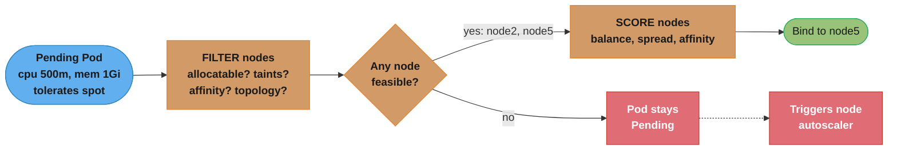
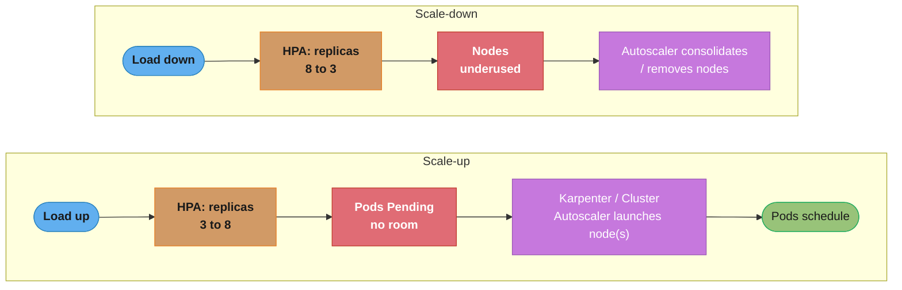
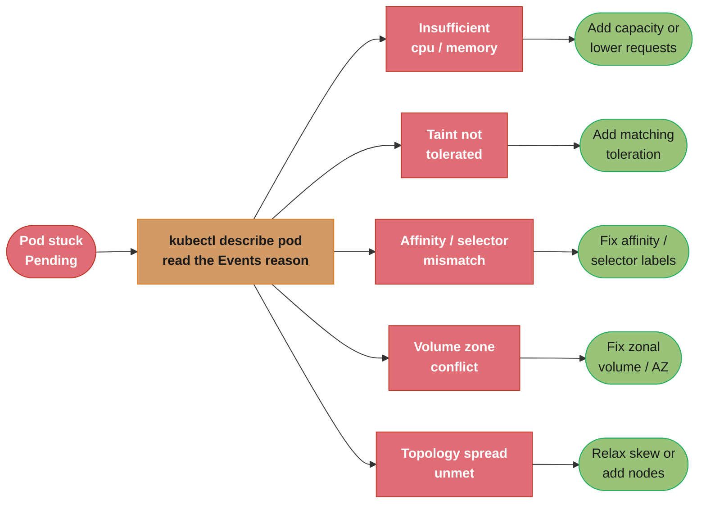
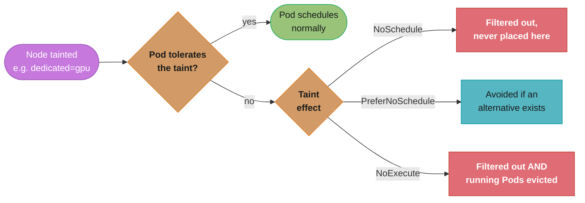
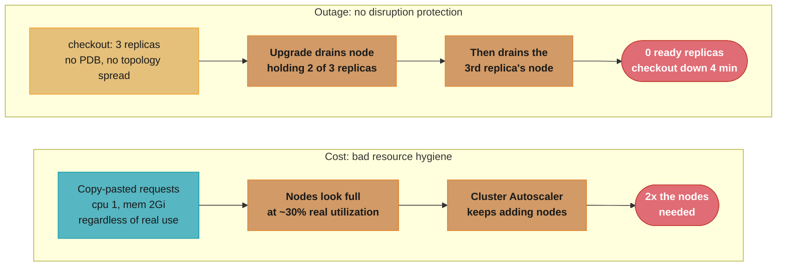

# Kubernetes Scheduling & Autoscaling

> Phase 2 — Containers & Kubernetes · Difficulty: Advanced

Scheduling decides *where* a Pod runs; autoscaling decides *how many* Pods and *how many* nodes exist. Together they determine whether your cluster is reliable (Pods land where they should, survive disruptions) and cost-efficient (you run the minimum capacity for the load). This module covers requests/limits/QoS, affinity/taints/topology, the three autoscalers (HPA, VPA, Cluster Autoscaler/Karpenter), KEDA event-driven scaling, and PodDisruptionBudgets.

---

## 1. Concept Overview

**Scheduling** (placement):
- **Requests/limits** — requests reserve capacity and set QoS; limits cap usage. The scheduler places Pods based on *requests* vs node allocatable.
- **Node affinity / nodeSelector** — constrain Pods to node types (GPU, spot, AZ).
- **Pod affinity/anti-affinity** — co-locate or spread Pods relative to each other.
- **Taints/tolerations** — nodes repel Pods unless the Pod tolerates the taint (dedicate nodes).
- **Topology spread constraints** — spread Pods evenly across zones/nodes for HA.

**Autoscaling** (capacity):
- **HPA (Horizontal Pod Autoscaler)** — scales Pod *replicas* on CPU/memory/custom metrics.
- **VPA (Vertical Pod Autoscaler)** — adjusts Pod *requests/limits* (right-sizing).
- **Cluster Autoscaler / Karpenter** — adds/removes *nodes* when Pods can't schedule / nodes are underused.
- **KEDA** — event-driven scaling (queue depth, Kafka lag, cron) including scale-to-zero.

---

## 2. Intuition

> **One-line analogy**: Scheduling is seating guests at a wedding — you honor dietary needs (resource requests), keep feuding families apart (anti-affinity), reserve the head table (taints), and spread the wedding party across tables (topology spread). Autoscaling is calling the venue to add or remove tables as more or fewer guests RSVP.

**Mental model**: The scheduler is a bin-packer constrained by rules. It filters nodes that *can* hold the Pod (enough requested resources, tolerations match taints, affinity satisfied), then scores the survivors and picks the best. Autoscaling closes the loop: HPA changes how many Pods you ask for, and the node autoscaler changes how many bins exist to hold them. Pending Pods (nothing fits) trigger node scale-up; empty/underused nodes trigger scale-down.

**Why it matters**: Misconfigured requests waste money (over-request) or cause OOMKills/throttling and noisy-neighbor problems (under-request). No anti-affinity/topology spread means all replicas can land on one node — which then dies and takes the whole service down. No PodDisruptionBudget means a node drain (upgrade) can evict every replica at once. Autoscaling tuned wrong either can't keep up with spikes or flaps and burns money.

**Key insight**: The scheduler bin-packs on **requests**, not actual usage. If you under-request, the node looks empty to the scheduler, it over-packs, and real usage causes contention. If you over-request, nodes look full while sitting idle, and you pay for capacity you never use. Requests are the single most consequential number you set.

---

## 3. Core Principles

1. **The scheduler packs by requests.** Set requests close to real usage; they drive placement and QoS.
2. **Spread for availability.** Topology spread + anti-affinity prevent single-node/zone wipeouts.
3. **Taints reserve, tolerations grant access.** Dedicate nodes (GPU, spot) deliberately.
4. **Scale Pods, then nodes.** HPA reacts to load; the node autoscaler reacts to unschedulable Pods.
5. **Right-size continuously.** VPA recommendations; avoid the "everyone requests 1 CPU" anti-pattern.
6. **Protect availability during disruption.** PodDisruptionBudgets bound voluntary evictions.

---

## 4. Types / Architectures / Strategies

### QoS classes (from requests/limits)

| QoS | Condition | Eviction order under node pressure |
|-----|-----------|-----------------------------------|
| Guaranteed | requests == limits, all containers | Evicted last |
| Burstable | requests < limits (or partial) | Middle |
| BestEffort | no requests/limits | Evicted first |

### Autoscaler comparison

| Autoscaler | Scales | Signal | Notes |
|-----------|--------|--------|-------|
| HPA | Pod replicas | CPU/mem/custom/external metrics | Default sync ~15s; needs metrics-server |
| VPA | Pod requests/limits | Historical usage | Recreates Pods to apply (disruptive); don't combine with HPA on same metric |
| Cluster Autoscaler | Nodes (node groups) | Unschedulable Pods / underused nodes | Works within predefined node groups/ASGs |
| Karpenter | Nodes (just-in-time) | Unschedulable Pods | Provisions right-sized nodes directly, fast, consolidation |
| KEDA | Pod replicas (incl. 0) | Queue/Kafka/cron/etc. | Event-driven, scale-to-zero |

### Placement controls

| Control | Purpose |
|---------|---------|
| nodeSelector / node affinity | Pin to node types (GPU, arch, AZ) |
| Pod anti-affinity | Spread replicas off the same node |
| topologySpreadConstraints | Even spread across zones/nodes |
| Taints + tolerations | Reserve nodes for specific workloads |
| PodDisruptionBudget | Limit simultaneous voluntary evictions |

---

## 5. Architecture Diagrams

**Scheduling: filter then score.** The scheduler filters nodes down to the feasible set (enough allocatable resources for the Pod's requests, taints tolerated, affinity/topology satisfied), scores the survivors, and binds the Pod to the winner; if no node is feasible, the Pod stays Pending and triggers the node autoscaler.



**Autoscaling control loops.** HPA and the node autoscaler close the loop in both directions — rising load adds replicas until some can't schedule, which triggers node scale-up; falling load shrinks replicas until nodes sit underused, which triggers consolidation.



**Diagnosing a Pending Pod.** `kubectl describe pod` names the exact blocking reason in its Events, so reading it points straight at the fix instead of guessing (see Q12).



**Taint effects on scheduling.** The three taint effects escalate from a soft preference to a hard block that also evicts Pods already running there (see Q6).



---

## 6. How It Works — Detailed Mechanics

### Requests/limits and HPA

```yaml
# Deployment: requests drive scheduling + QoS; HPA scales replicas on CPU utilization.
resources:
  requests: {cpu: 250m, memory: 256Mi}
  limits:   {memory: 512Mi}            # memory cap; CPU limit omitted to avoid throttling
---
apiVersion: autoscaling/v2
kind: HorizontalPodAutoscaler
metadata: {name: web}
spec:
  scaleTargetRef: {apiVersion: apps/v1, kind: Deployment, name: web}
  minReplicas: 3
  maxReplicas: 20
  metrics:
    - type: Resource
      resource:
        name: cpu
        target: {type: Utilization, averageUtilization: 70}   # % of REQUESTED cpu
  behavior:                              # tame flapping
    scaleDown:
      stabilizationWindowSeconds: 300    # wait 5min before scaling down
```

HPA's CPU utilization is a percentage of the **request**, so if you don't set CPU requests, HPA can't compute utilization and won't scale.

#### The HPA replica formula, decoded

```
desiredReplicas = ceil( currentReplicas * (currentMetricValue / targetMetricValue) )

  skip the change entirely when  | currentMetricValue / targetMetricValue - 1 | <= 0.1
  (the default 10% tolerance band, --horizontal-pod-autoscaler-tolerance)
```

**Read it like this.** "You are running N pods at X% load and you want them at Y% — so scale the pod count by exactly the factor X/Y, and round up."

The key framing is that HPA is not a controller that nudges replicas up or down by one. It computes the *whole* target in a single shot from a ratio, so a metric that doubles produces a replica count that doubles immediately. Everything that stops it from overreacting — the tolerance band, the stabilization window — is bolted on around this one line.

| Symbol | What it is |
|--------|------------|
| `currentReplicas` | Ready pods right now (`3` at start here, capped by `minReplicas: 3` / `maxReplicas: 20`) |
| `currentMetricValue` | Observed metric **averaged across pods** — for CPU, a percentage of the *request*, not of the node |
| `targetMetricValue` | Your `averageUtilization: 70` |
| ratio `current/target` | How far off you are. `>1` means underprovisioned, `<1` overprovisioned |
| `ceil(...)` | Always round up — HPA would rather overshoot by one pod than run hot |
| tolerance `0.1` | Dead band; a ratio inside `0.9 .. 1.1` produces *no* API call at all |

**Walk one example.** The `250m` request means the 70% target is `0.70 x 250m = 175m` of actual CPU per pod. Watch each observed load turn into a replica count:

```
  replicas   observed   target   ratio    |ratio-1|   in band?   ceil(rep x ratio)   action
    10         91%        70%   1.3000     0.3000       no            13           scale to 13
    10         73%        70%   1.0429     0.0429       YES           (11)         do nothing
    10         35%        70%   0.5000     0.5000       no             5           scale to 5
    10        140%        70%   2.0000     1.0000       no            20           scale to 20 (max)
     3         95%        70%   1.3571     0.3571       no             5           scale to 5

  91% of a 250m request = 227.5m actual CPU per pod, against a 175m target.
```

Row two is the row people get wrong in interviews: 73% is *above* the 70% target and the formula says 11 replicas, but `|1.0429 - 1| = 0.0429` sits inside the 10% band, so HPA writes nothing. Without that band a metric jittering around 70% would issue a scale event every 15s sync forever, and each one would restart the 5-minute scale-down stabilization clock. The band is what makes the controller quiet at steady state.

Row four shows the two clamps landing on the same number by coincidence: the formula wants `ceil(10 x 2.0) = 20` and `maxReplicas` is also 20. If load kept climbing to 210%, the formula would ask for 30 and HPA would still stop at 20 — at which point pods run hot and `maxReplicas` is your real capacity limit, not the HPA.

#### What a CPU limit actually is: cgroup quota over period

The Deployment above deliberately omits a CPU limit. The reason is arithmetic in the kernel, not Kubernetes policy:

```
cgroup v2:  cpu.max = "<quota> <period>"

  quota_us = cpu_limit_in_cores x period_us       period_us = 100000  (100ms, the default)
```

**What this actually says.** "Every 100 milliseconds the container gets a fresh budget of CPU-microseconds; when it burns through the budget it is frozen until the next 100ms window starts."

| Symbol | What it is |
|--------|------------|
| `period_us` | The refill window, `100000` us = 100ms. Fixed by default |
| `quota_us` | CPU-microseconds allowed per window, summed over **all** threads |
| `cpu_limit` | Your `limits.cpu`, in cores (`500m` = 0.5 cores) |
| throttling | The freeze that happens when quota runs out mid-window |

**Walk one example.** Three limits, same 100ms period:

```
  limits.cpu     quota_us / period_us     meaning
    250m           25000 / 100000         25ms of CPU per 100ms window
    500m           50000 / 100000         50ms of CPU per 100ms window
    2 (2000m)     200000 / 100000         200ms of CPU per 100ms window -> 2 cores in parallel
```

The trap: a pod limited to `500m` running 4 worker threads burns its 50000us of quota in the first **12.5ms** of the window (4 threads x 12.5ms = 50ms of CPU time), then sits frozen for the remaining 87.5ms. Average utilization reports a comfortable 50%, while p99 latency picks up an ~87ms stall. That is why the config omits `limits.cpu` on the latency path and keeps only the memory cap — memory has no such time-slicing, it is a hard OOM-kill ceiling.

### Topology spread (HA across zones)

```yaml
topologySpreadConstraints:
  - maxSkew: 1
    topologyKey: topology.kubernetes.io/zone
    whenUnsatisfiable: DoNotSchedule      # hard: never let one zone hold too many
    labelSelector: {matchLabels: {app: web}}
  - maxSkew: 1
    topologyKey: kubernetes.io/hostname
    whenUnsatisfiable: ScheduleAnyway     # soft: prefer node spread
    labelSelector: {matchLabels: {app: web}}
```

### Taints/tolerations to dedicate nodes

```bash
kubectl taint nodes gpu-node-1 dedicated=gpu:NoSchedule   # repel everything by default
```

```yaml
# Only Pods that tolerate it (and request a GPU) land on the GPU node:
tolerations: [{key: dedicated, operator: Equal, value: gpu, effect: NoSchedule}]
nodeSelector: {nvidia.com/gpu.present: "true"}
```

### Karpenter (just-in-time, right-sized nodes)

```yaml
# Karpenter provisions nodes that fit pending Pods directly (no fixed node groups),
# blends spot+on-demand, and consolidates underused nodes.
apiVersion: karpenter.sh/v1
kind: NodePool
spec:
  template:
    spec:
      requirements:
        - {key: karpenter.sh/capacity-type, operator: In, values: ["spot","on-demand"]}
        - {key: kubernetes.io/arch, operator: In, values: ["amd64","arm64"]}
  disruption:
    consolidationPolicy: WhenEmptyOrUnderutilized   # pack workloads, remove waste
    consolidateAfter: 30s
```

### KEDA event-driven scale-to-zero

```yaml
apiVersion: keda.sh/v1alpha1
kind: ScaledObject
spec:
  scaleTargetRef: {name: worker}
  minReplicaCount: 0                # scale to ZERO when the queue is empty (cost!)
  maxReplicaCount: 50
  triggers:
    - type: aws-sqs-queue
      metadata: {queueURL: ..., queueLength: "20"}   # 1 replica per 20 messages
```

#### What `queueLength: 20` computes

```
desiredReplicas = clamp( ceil(backlog / queueLength), minReplicaCount, maxReplicaCount )
```

**Put simply.** "Give me one worker for every 20 messages waiting, never fewer than zero and never more than 50."

This is the same ratio shape as HPA — KEDA is in fact an HPA driving an external metric — with one difference that matters enormously for cost: `minReplicaCount: 0`. Plain HPA has a floor of 1, so an idle queue still pays for a pod. KEDA's activation path lets the count reach true zero.

| Symbol | What it is |
|--------|------------|
| `backlog` | `ApproximateNumberOfMessages` polled from SQS |
| `queueLength: 20` | Target backlog **per replica**, not a total. Lower = more aggressive scaling |
| `ceil(...)` | Round up, so a single leftover message still gets a worker |
| `minReplicaCount: 0` | The scale-to-zero floor — the whole reason to reach for KEDA |
| `maxReplicaCount: 50` | Hard ceiling; caps effective throughput and downstream DB load |

**Walk one example.** Follow a queue through a burst and back to idle:

```
  backlog     ceil(backlog / 20)   after clamp[0,50]   note
      0               0                   0            scale to zero, cost = $0
     15               1                   1            a partial batch still gets a worker
     20               1                   1            exactly at target for one replica
     21               2                   2            crossing 20 adds a whole replica
    850              43                  43            burst; well under the ceiling
   1200              60                  50            CLAMPED - backlog keeps growing
```

The last row is the one to design around. At `maxReplicaCount: 50` and 20 messages per replica, the deepest backlog the pool holds at target is `50 x 20 = 1000` messages. Past that, the formula's answer is discarded and queue age starts climbing without any autoscaler event to alert on — so alert on **message age**, not replica count. Raising `maxReplicaCount` is only safe if whatever the workers write to can absorb 50 concurrent writers.

### PodDisruptionBudget (survive drains)

```yaml
apiVersion: policy/v1
kind: PodDisruptionBudget
spec:
  minAvailable: 2                   # during node drains/upgrades, keep >=2 web Pods up
  selector: {matchLabels: {app: web}}
# Without this, draining a node can evict ALL replicas at once -> outage during a routine upgrade.
```

#### The one subtraction a PDB performs

```
disruptionsAllowed = currentHealthy - minAvailable          (floored at 0)

  eviction API admits the request only while  disruptionsAllowed > 0
  percentage form:  minAvailable: "50%"  ->  ceil(0.50 x replicas)   (K8s rounds UP)
```

**The idea behind it.** "Count how many healthy pods I have above my stated floor; that number, and only that number, may be voluntarily evicted right now."

The subtlety worth internalizing is that a PDB never *stops* a drain — it makes the eviction API return 429 and forces `kubectl drain` to block and retry until pods rescheduled elsewhere restore `currentHealthy`. It converts a fast simultaneous eviction into a slow serialized one.

| Symbol | What it is |
|--------|------------|
| `currentHealthy` | Pods matching the selector that are Ready right now |
| `minAvailable: 2` | The floor you promise never to go below |
| `disruptionsAllowed` | The live budget, republished in `status` after every pod state change |
| voluntary disruption | Drains, evictions, Karpenter consolidation — the only things a PDB gates |
| involuntary disruption | Node crash, kernel OOM, spot reclaim — a PDB does **nothing** here |

**Walk one example.** A 3-replica Deployment with `minAvailable: 2` being drained node by node:

```
  step   currentHealthy   minAvailable   disruptionsAllowed   drain request
   1           3               2                 1            ADMITTED, pod evicted
   2           2               2                 0            BLOCKED, drain waits
   3           2 -> 3          2                 1            replacement Ready, ADMITTED again

  Same budget at other replica counts:   6 healthy -> 4 allowed    10 healthy -> 8 allowed
```

Step 2 is the whole point: in the case study below, the upgrade evicted 2 of 3 replicas at once and then the third, because with no PDB `disruptionsAllowed` is effectively unbounded. With the budget in place the drain simply takes longer and checkout never drops below 2 Ready pods.

Note the arithmetic trap at small replica counts. With `replicas: 3`, writing `minAvailable: "50%"` gives `ceil(0.50 x 3) = 2` — the same as `minAvailable: 2`, so `disruptionsAllowed` is 1 and the drain proceeds one pod at a time. But `maxUnavailable: "50%"` on the same 3 replicas would permit 1 eviction too, and if you ever scale to 2 replicas the percentage form pins `minAvailable` at 1 while the fixed `minAvailable: 2` would pin `disruptionsAllowed` at 0 and **block drains forever** — a PDB set at or above your replica count deadlocks every node upgrade in the cluster.

---

## 7. Real-World Examples

- **Karpenter at scale (AWS)**: teams replace Cluster Autoscaler + fixed ASGs with Karpenter to get right-sized, spot-heavy nodes provisioned in seconds and aggressive consolidation — often cutting compute cost 30–50%.
- **KEDA for queue workers**: scale-to-zero workers wake on SQS/Kafka backlog, so idle queues cost nothing and spikes scale to dozens of consumers (see [cloud_cost_optimization_finops](../cloud_cost_optimization_finops/)).
- **Topology spread for HA**: spreading replicas one-per-AZ means a single AZ outage degrades capacity by ~1/3 rather than taking the service down.
- **GPU node pools** tainted `nvidia.com/gpu` so only ML workloads (which tolerate the taint and request GPUs) schedule on expensive accelerators.

---

## 8. Tradeoffs

| Decision | Option A | Option B | Key factor |
|----------|----------|----------|-----------|
| CPU limit | Set (predictable cap) | Omit (no throttling) | Latency-sensitive services often omit |
| Node autoscaler | Cluster Autoscaler (node groups) | Karpenter (just-in-time) | Flexibility/cost vs maturity/simplicity |
| Scaling signal | CPU (simple) | Custom/external (accurate) | Does CPU reflect real load? |
| Spot usage | Heavy spot (cheap) | On-demand (reliable) | Cost vs interruption tolerance |
| VPA + HPA | Separate metrics | Conflict on same metric | Don't scale replicas and requests on the same signal |
| Spread | Hard (DoNotSchedule) | Soft (ScheduleAnyway) | Strict HA vs schedulability |

---

## 9. When to Use / When NOT to Use

**Tune scheduling/autoscaling when:** running cost-sensitive or bursty workloads, multi-AZ HA requirements, mixed node types (GPU/spot/ARM), or large clusters where bin-packing efficiency matters.

**Keep defaults when:** small steady workloads — set sane requests/limits, an HPA with CPU, and topology spread, and don't over-engineer. Avoid combining VPA and HPA on the same metric; avoid CPU limits on latency-critical paths; don't run everything on spot without interruption handling.

---

## 10. Common Pitfalls

**Pitfall 1 — No requests, or copy-pasted requests, breaking the scheduler and HPA.**

```yaml
# BROKEN: no resource requests. Scheduler treats the Pod as ~free -> over-packs nodes ->
# real usage causes contention/OOM; and HPA can't compute CPU% -> never scales.
containers:
  - name: web
    image: web:1.0
    # (no resources)
```

```yaml
# FIX: set requests near real usage (measure with VPA recommendations / metrics).
    resources:
      requests: {cpu: 250m, memory: 256Mi}     # enables correct packing + HPA utilization
      limits:   {memory: 512Mi}
```

**Pitfall 2 — All replicas on one node; node dies; full outage.** Without anti-affinity/topology spread, the scheduler may pack all 3 replicas onto one roomy node. FIX: `topologySpreadConstraints` across zones and hostnames so a single node/AZ loss can't take the whole service down.

**Pitfall 3 — No PodDisruptionBudget during cluster upgrades.** A routine node drain evicts every replica simultaneously, causing an outage mid-upgrade.

```yaml
# FIX: a PDB bounds voluntary disruptions.
kind: PodDisruptionBudget
spec: {minAvailable: 2, selector: {matchLabels: {app: web}}}
# Now `kubectl drain` evicts only down to the budget, never below 2 ready Pods.
```

---

## 11. Technologies & Tools

| Tool | Purpose |
|------|---------|
| metrics-server | CPU/memory metrics for HPA/`kubectl top` |
| HPA (autoscaling/v2) | Replica autoscaling on metrics |
| VPA | Request/limit right-sizing recommendations |
| Cluster Autoscaler | Node scaling within node groups |
| Karpenter | Just-in-time, right-sized node provisioning |
| KEDA | Event-driven + scale-to-zero |
| Prometheus Adapter | Custom/external metrics for HPA |
| Goldilocks | Surfaces VPA recommendations as dashboards |
| `kubectl describe node` | allocatable vs requested, taints |

---

## 12. Interview Questions with Answers

**Q1: How does the scheduler decide where a Pod goes?**
Two phases: filtering (which nodes are feasible — enough allocatable resources for the Pod's *requests*, taints tolerated, node affinity/selectors and topology constraints satisfied) and scoring (rank feasible nodes by resource balance, spread, and affinity preferences). It binds the Pod to the highest-scoring node by setting `nodeName`; the kubelet then starts it. If no node is feasible, the Pod stays Pending and may trigger node autoscaling.

**Q2: Why are requests the most important resource setting?**
The scheduler bin-packs based on requests, not actual usage. Under-request and nodes look empty, so it over-packs and real usage causes contention/OOM/throttling; over-request and nodes look full while idle, wasting money. Requests also determine QoS class and HPA's CPU-utilization denominator. Setting them close to measured real usage is the single highest-leverage tuning decision.

**Q3: Explain QoS classes and their effect.**
Guaranteed (requests==limits for all containers) Pods are evicted last under node memory pressure; Burstable (requests<limits) are in the middle; BestEffort (no requests/limits) are evicted first. QoS controls the kubelet's eviction order and `oom_score_adj`, so latency-critical Pods should be Guaranteed to be the least likely to be killed when a node is squeezed.

**Q4: HPA vs VPA vs Cluster Autoscaler — what does each scale?**
HPA scales the number of Pod replicas based on CPU/memory/custom metrics. VPA adjusts a Pod's requests/limits (right-sizing), recreating Pods to apply changes. Cluster Autoscaler (and Karpenter) add/remove nodes when Pods can't schedule or nodes are underused. They compose: HPA adds Pods, the node autoscaler adds nodes to hold them. Don't run HPA and VPA on the same metric — they fight.

**Q5: How does HPA actually compute the desired replica count?**
`desiredReplicas = ceil(currentReplicas * (currentMetricValue / targetMetricValue))`. For CPU utilization, the metric is a percentage of the *requested* CPU averaged across Pods — which is why CPU requests must be set or HPA can't compute it. The controller syncs ~every 15s and applies a stabilization window (default 5min on scale-down) to avoid flapping.

**Q6: What are taints and tolerations, and a use case?**
A taint on a node repels Pods that don't explicitly tolerate it; a matching toleration on a Pod lets it schedule there. Use them to dedicate nodes: taint GPU nodes `nvidia.com/gpu:NoSchedule` so only GPU workloads (which add the toleration) land there, keeping expensive accelerators free of general Pods. Effects: `NoSchedule`, `PreferNoSchedule`, `NoExecute` (also evicts existing Pods).

**Q7: How do you ensure replicas survive a node or AZ failure?**
Use `topologySpreadConstraints` (and/or Pod anti-affinity) to spread replicas across `topology.kubernetes.io/zone` and `kubernetes.io/hostname`, so no single node or AZ holds too many. With `maxSkew: 1` across zones, an AZ loss degrades capacity by roughly its share rather than taking the service down. Pair with a PodDisruptionBudget to protect against voluntary disruptions.

**Q8: What is a PodDisruptionBudget and when is it essential?**
A PDB limits how many Pods of a set can be *voluntarily* disrupted at once (`minAvailable`/`maxUnavailable`). It's essential during node drains (cluster upgrades, autoscaler scale-down): without it, draining a node can evict all replicas simultaneously and cause an outage during a routine operation. With `minAvailable: 2`, drains block until they can proceed without dropping below 2 ready Pods.

**Q9: Cluster Autoscaler vs Karpenter?**
Cluster Autoscaler scales predefined node groups (ASGs) up/down based on unschedulable Pods and underutilization — simple but constrained to the instance types you pre-defined. Karpenter provisions nodes just-in-time, choosing instance types/sizes that best fit pending Pods directly (no node groups), blends spot/on-demand, and aggressively consolidates — typically faster scale-up and lower cost, at the price of being newer/more complex.

**Q10: What does KEDA add over HPA?**
KEDA enables event-driven scaling on external sources HPA can't natively use — queue depth (SQS/RabbitMQ), Kafka consumer lag, cron schedules, Prometheus queries — and crucially supports scale-to-zero. Idle workers cost nothing and wake on backlog. Under the hood KEDA drives an HPA, translating external triggers into scaling decisions.

**Q11: Why might you omit CPU limits but keep memory limits?**
A CPU limit causes CFS throttling: once a Pod uses its quota within a 100ms period, it's paused, spiking tail latency even when the node has spare CPU. For latency-sensitive services, omitting the CPU limit (keeping the request for scheduling) lets the Pod burst into idle CPU. Memory limits are kept because exceeding memory triggers an OOM kill, and unbounded memory growth can take down a node.

**Q12: A Pod is stuck Pending. How do you diagnose it?**
`kubectl describe pod` shows the scheduler's reason: "Insufficient cpu/memory" (no node has enough requested capacity → node autoscaler should add one, or requests are too high), "node(s) had taint … that the pod didn't tolerate", "didn't match node affinity/selector", "had volume node affinity conflict" (zonal volume mismatch), or "didn't match pod topology spread constraints". The event message points directly at which constraint can't be satisfied.

**Q13: How does VPA differ mechanically from HPA, and why shouldn't they scale the same metric on the same workload?**
VPA right-sizes a Pod's requests/limits from observed historical usage and must recreate the Pod to apply a new value, unlike HPA which just changes replica count without disruption. If both HPA and VPA watch CPU on the same Deployment, they fight: VPA shrinks or grows the request while HPA is simultaneously computing utilization against that same moving target, producing scaling decisions that thrash instead of converging. The fix is to split responsibility — let VPA right-size CPU/memory requests while HPA scales on a different signal such as requests-per-second or queue depth, or run VPA in recommendation-only mode and apply its suggestions manually. Because every VPA update recreates the Pod, it is also inherently disruptive, so avoid tight VPA update loops on latency-sensitive or stateful workloads.

**Q14: What's the difference between a hard (`DoNotSchedule`) and soft (`ScheduleAnyway`) topology spread constraint?**
`DoNotSchedule` blocks placement outright once the configured skew would be exceeded, while `ScheduleAnyway` places the Pod anyway and only prefers a more balanced node. In the module's example, the zone-level constraint uses `DoNotSchedule` with `maxSkew: 1` so no zone can ever hold more than one extra Pod versus the least-loaded zone, guaranteeing the spread but risking a Pod stuck Pending if no zone has room. The hostname-level constraint uses `ScheduleAnyway` so node-level balance is a preference, not a hard requirement, keeping Pods schedulable even when perfect balance isn't achievable. Use `DoNotSchedule` where the availability guarantee (cross-zone HA) matters more than schedulability, and `ScheduleAnyway` where running slightly unbalanced beats leaving a Pod Pending.

**Q15: How do node affinity and Pod anti-affinity differ as placement controls?**
Node affinity constrains which nodes a Pod can land on based on node labels, while Pod anti-affinity constrains placement relative to other Pods, not nodes. Node affinity (and the simpler `nodeSelector`) is a Pod-to-node match — pin to GPU nodes or a specific AZ using node labels — while Pod anti-affinity is a Pod-to-Pod rule that keeps replicas of the same app off the same node or zone, achieving something similar to topology spread constraints but expressed as required/preferred rules against label selectors instead of a numeric skew. Both are evaluated during the scheduler's filter phase alongside taints and resource requests, so a Pod can sit Pending from a failed affinity rule even when plenty of raw CPU and memory is available. Reach for topology spread constraints for even distribution across many replicas, and reserve Pod anti-affinity for specific pairwise rules like never co-locating a primary and its replica.

**Q16: In the case study, why did over-requested resources double the node count even though real CPU utilization was only about 30%?**
The Deployment requested a full CPU and 2Gi of memory per Pod while actually using roughly 250m CPU and 600Mi, so the scheduler packed nodes as if they were nearly full when they were mostly idle. Because the scheduler bin-packs on requests rather than actual usage, each 1-CPU/2Gi request looked three to four times bigger than what the Pod really consumed, so Cluster Autoscaler kept launching new nodes to fit Pods that appeared to need far more than they did, roughly doubling the fleet to about 80 nodes for flat traffic. Right-sizing requests to measured usage (300m CPU / 768Mi) and switching to Karpenter's consolidation cut the fleet to about 40 nodes and raised average utilization from ~30% to ~60%, taking monthly compute cost from 2x baseline down to roughly 1.05x. Always validate requests against VPA-recommended or profiled real usage before trusting the autoscaler's node count to reflect actual demand.

---

## 13. Best Practices

- Set **requests near measured usage** (use VPA recommendations/Goldilocks); they drive packing, QoS, and HPA.
- Keep **memory limits**; be cautious with **CPU limits** on latency-sensitive Pods.
- **Spread replicas** across zones and nodes with topology spread constraints; add **PodDisruptionBudgets**.
- Use **HPA** with a stabilization window to avoid flapping; pick a metric that reflects real load.
- Adopt **Karpenter** for cost-efficient, right-sized nodes; blend spot with interruption handling.
- Use **KEDA scale-to-zero** for bursty/queue workloads to eliminate idle cost.
- **Dedicate special nodes** (GPU/spot) with taints; don't let general Pods squat on them.
- Never run **VPA and HPA on the same metric**.

---

## 14. Case Study

### Scenario: Cloud bill doubled and a routine upgrade caused an outage

A platform team's EKS bill jumps 2x over a quarter while traffic is flat, and a routine Kubernetes version upgrade (which drains nodes) caused a 4-minute outage of the checkout service.

**Two problems, one root cause: bad resource hygiene + no disruption protection.**



```yaml
# BROKEN: over-requested, no spread, no PDB.
spec:
  replicas: 3
  template:
    spec:
      containers:
        - name: checkout
          resources: {requests: {cpu: "1", memory: 2Gi}, limits: {cpu: "1", memory: 2Gi}}  # uses ~250m/600Mi
      # no topologySpreadConstraints, no PDB
```

```yaml
# FIX: right-size requests (VPA-informed), spread across AZs, protect with a PDB,
# and switch node scaling to Karpenter for right-sized, consolidating nodes.
spec:
  replicas: 3
  template:
    spec:
      containers:
        - name: checkout
          resources:
            requests: {cpu: 300m, memory: 768Mi}   # measured headroom over real usage
            limits:   {memory: 1Gi}                 # memory cap; no CPU limit (latency)
      topologySpreadConstraints:
        - {maxSkew: 1, topologyKey: topology.kubernetes.io/zone, whenUnsatisfiable: DoNotSchedule, labelSelector: {matchLabels: {app: checkout}}}
---
apiVersion: policy/v1
kind: PodDisruptionBudget
spec: {minAvailable: 2, selector: {matchLabels: {app: checkout}}}
```

**Outcome metrics:**

| Metric | Before | After |
|--------|--------|-------|
| Node count (flat traffic) | ~80 | ~40 |
| Avg node CPU utilization | ~30% | ~60% |
| Monthly compute cost | 2x baseline | ~1.05x baseline |
| Upgrade-time outage | 4 min | 0 (PDB held 2 replicas; drains waited) |

Karpenter consolidation plus honest requests halved the fleet; the PDB + topology spread made node drains non-disruptive.

### Where the 80-to-40 node count comes from

```
podsPerNode  = min over each resource of  floor( nodeAllocatable / podRequest )
nodeCount    = ceil( totalPods / podsPerNode )
realNodeUtil = podsPerNode x actualUsage / nodeAllocatable
```

**Stated plainly.** "A node holds as many pods as its *tightest* resource allows, and the scheduler measures that against what you asked for, never against what you use."

The `min over each resource` is the part everyone drops. Nodes do not fill up gradually — one dimension binds first and the rest of the node is stranded, invisible, paid for.

| Symbol | What it is |
|--------|------------|
| `nodeAllocatable` | Capacity left after kubelet/system reserves. `8000m` CPU / `32Gi` on an 8-vCPU node |
| `podRequest` | `requests`, the *only* number the scheduler reads |
| `actualUsage` | What the container really burns — `~250m` / `~600Mi` here |
| `min over resources` | CPU or memory, whichever runs out first, is the binding dimension |
| `podsPerNode` | Bin-packing density. Halve the requests and you roughly double this |

**Walk one example.** Same 8-vCPU / 32Gi node, before and after right-sizing:

```
                     BROKEN (cpu 1, mem 2Gi)      FIXED (cpu 300m, mem 768Mi)
  by CPU     floor(8000 / 1000)  =  8 pods    floor(8000 / 300)   = 26 pods
  by memory  floor(32768 / 2048) = 16 pods    floor(32768 / 768)  = 42 pods
  binding    CPU  ->  8 pods/node             CPU  ->  26 pods/node

  real CPU on a full node:
     8 pods x 250m =  2000m of 8000m  =  25%   <- 6000m stranded, billed, idle
    26 pods x 250m =  6500m of 8000m  =  81%
```

CPU binds in both columns, so CPU requests alone set the density: dropping `1000m` to `300m` is a `3.33x` request cut. The fleet only shrank `80 / 40 = 2.0x`, and average utilization rose exactly in step, `60 / 30 = 2.0x` — the same real work packed twice as densely needs half the nodes, which is the consistency check that tells you the numbers are real. The realized `2.0x` lands below the `3.33x` CPU ratio and the `2048 / 768 = 2.67x` memory ratio because DaemonSets and kubelet reserves take a fixed bite out of every node, pods do not divide evenly into node shapes, and topology spread forces some nodes to stay partly empty to keep one replica per AZ. Treat the request ratio as the ceiling on savings, never the forecast.

**Discussion questions:**
1. Why did over-requesting double the node count even though real utilization was 30%? (Scheduler packs on requests, not usage.)
2. How does a PDB interact with `kubectl drain` to prevent the outage?
3. What's the risk of setting requests *too* tight after right-sizing, and how does VPA help calibrate? (Throttling/OOM under spikes; VPA recommends from observed peaks.)

---

**Cross-references:** [kubernetes_workloads_and_objects](../kubernetes_workloads_and_objects/) (requests/limits/QoS, PDB), [linux_and_os_fundamentals](../linux_and_os_fundamentals/) (cgroup throttling/OOM behind limits), [cloud_cost_optimization_finops](../cloud_cost_optimization_finops/) (spot, rightsizing, consolidation), [kubernetes_storage_and_state](../kubernetes_storage_and_state/) (volume topology constraints), [`case_studies/cross_cutting/kubernetes_production_hardening.md`](../case_studies/cross_cutting/kubernetes_production_hardening.md).
