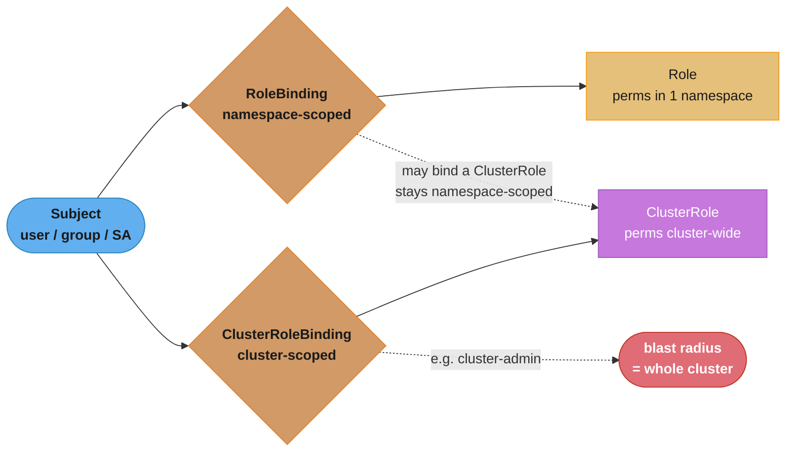
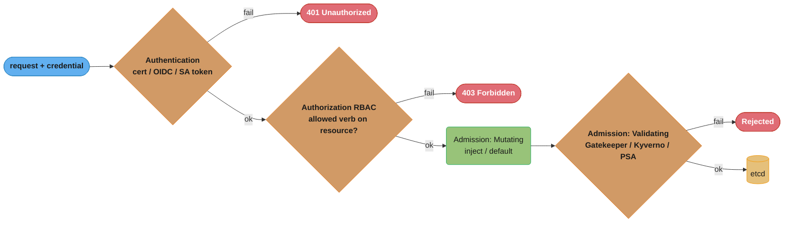
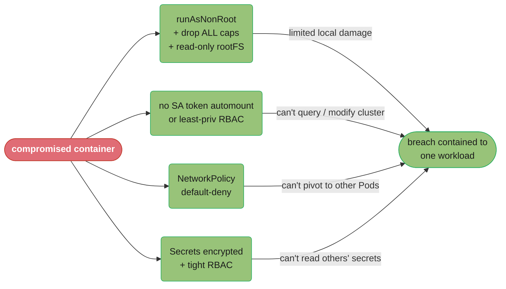
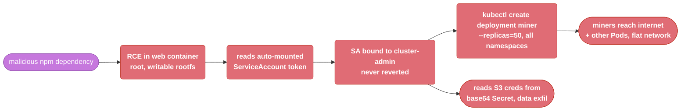
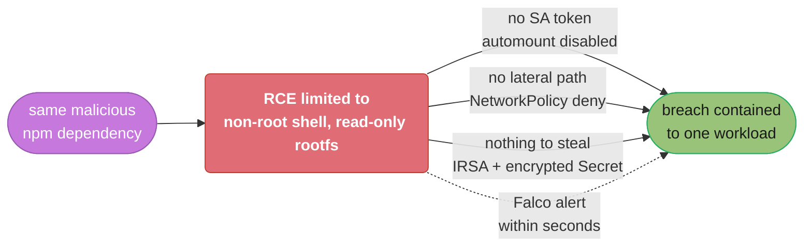

# Kubernetes Security

> Phase 2 — Containers & Kubernetes · Difficulty: Advanced

A Kubernetes cluster is a large attack surface: an API server, thousands of credentials (ServiceAccount tokens), Secrets, a shared kernel across tenants, and a network where everything talks to everything by default. Securing it means defense in depth across four planes — **authentication/authorization (RBAC)**, **workload hardening (Pod Security, securityContext)**, **network segmentation (NetworkPolicy)**, and **secrets + admission control**. This is among the most-tested DevOps interview areas.

---

## 1. Concept Overview

Kubernetes security spans the request lifecycle and the workload runtime:

**Access control (who can do what):**
- **Authentication** — who are you (client certs, OIDC, ServiceAccount tokens). Kubernetes has no built-in user store; identity is external.
- **Authorization (RBAC)** — what you can do, via Roles/ClusterRoles bound to subjects. Default-deny.
- **Admission control** — policy enforcement before persistence (Pod Security Admission, OPA Gatekeeper, Kyverno).

**Workload hardening (what a Pod can do):**
- **securityContext** — non-root, read-only rootfs, dropped capabilities, no privilege escalation, seccomp.
- **Pod Security Standards (PSS)** — Privileged / Baseline / Restricted profiles enforced by Pod Security Admission.

**Network & data:**
- **NetworkPolicy** — segment Pod-to-Pod traffic (default-allow until a policy applies — see [kubernetes_networking](../kubernetes_networking/)).
- **Secrets** — base64-encoded by default; require encryption-at-rest and tight RBAC (see [secrets_management](../secrets_management/)).
- **Supply chain** — image scanning, signing, admission gating (see [devsecops_and_supply_chain_security](../devsecops_and_supply_chain_security/)).

---

## 2. Intuition

> **One-line analogy**: Securing Kubernetes is securing an office building: badges decide who enters (authentication), badge permissions decide which rooms they open (RBAC), the security desk inspects packages before they're allowed in (admission control), each office is locked down so a break-in doesn't spread (securityContext + NetworkPolicy), and the safe is actually locked, not just labeled "private" (encrypted Secrets).

**Mental model**: Assume breach. A container *will* eventually be compromised — your job is to minimize what that buys an attacker. Each layer shrinks the blast radius: a non-root, capability-dropped, read-only container limits what code execution achieves; RBAC scoped to least privilege limits what a stolen ServiceAccount token can do; NetworkPolicy limits lateral movement; encrypted Secrets limit data exfiltration. No single control is sufficient; defense in depth is the model.

**Why it matters**: The default Kubernetes posture is dangerously permissive — Pods run as root, mount a ServiceAccount token, can talk to any other Pod, and Secrets are merely base64. Real breaches (cryptojacking, data theft, cluster takeover) almost always exploit these defaults: an over-privileged ServiceAccount, a root container with a host mount, a Secret readable cluster-wide, or an exposed Kubelet/API.

**Key insight**: The most dangerous Kubernetes credential is the **ServiceAccount token** automatically mounted into every Pod. If a workload is compromised and that token has broad RBAC (or the default has more than it should), the attacker can query/modify the cluster. Disabling auto-mount where unneeded and scoping RBAC to least privilege closes the most common escalation path.

---

## 3. Core Principles

1. **Least privilege everywhere.** RBAC, ServiceAccounts, capabilities — grant the minimum, default-deny.
2. **Assume breach; minimize blast radius.** Non-root, read-only, dropped caps, segmented network.
3. **Identity is external.** No user store; integrate OIDC; ServiceAccounts are workload identities.
4. **Enforce at admission.** Policy-as-code rejects insecure workloads before they run.
5. **Defense in depth.** No single control suffices; layer access, workload, network, and data controls.
6. **Secrets need real protection.** Base64 ≠ encryption; encrypt at rest, restrict RBAC, prefer external stores.

---

## 4. Types / Architectures / Strategies

### RBAC building blocks

| Object | Scope | Binds |
|--------|-------|-------|
| Role | Namespace | Permissions within a namespace |
| ClusterRole | Cluster-wide | Permissions across namespaces / cluster resources |
| RoleBinding | Namespace | Subject → Role (or ClusterRole) in a namespace |
| ClusterRoleBinding | Cluster | Subject → ClusterRole cluster-wide (dangerous if broad) |

Subjects: users, groups (from the authenticator), and ServiceAccounts.

**RBAC object relationships**



Subject → RoleBinding → Role stays namespace-scoped even when the RoleBinding points at a ClusterRole; only a ClusterRoleBinding grants cluster-wide reach, which is why binding it to `cluster-admin` (Pitfall 1, §10) hands over the whole cluster.

### Pod Security Standards (replaced PodSecurityPolicy)

| Profile | Allows | Use |
|---------|--------|-----|
| Privileged | Everything (host access) | Trusted system components only |
| Baseline | Blocks known privilege escalations | Default for most apps |
| Restricted | Hardened: non-root, no caps, seccomp, read-only-ish | Security-sensitive / multi-tenant |

Enforced per namespace via labels (`pod-security.kubernetes.io/enforce: restricted`), with `audit`/`warn` modes for rollout.

### securityContext hardening checklist

| Setting | Hardened value |
|---------|----------------|
| `runAsNonRoot` | `true` |
| `runAsUser` | non-zero UID |
| `allowPrivilegeEscalation` | `false` |
| `readOnlyRootFilesystem` | `true` |
| `capabilities.drop` | `["ALL"]` (add back minimum) |
| `seccompProfile.type` | `RuntimeDefault` |
| `privileged` | `false` (never true for apps) |

---

## 5. Architecture Diagrams

**API request security pipeline** (every kubectl/Pod API call): authentication and RBAC gate the request before mutating and validating admission run; only a passing request is persisted to etcd.



A failure at any gate short-circuits the request — 401, 403, or an admission rejection — before it ever reaches etcd.

**Blast-radius minimization** (assume the container is popped): each hardening control blocks one specific escalation path, so a single compromised container never becomes a cluster-wide breach.



The case study in §14 walks this exact pattern through a real incident.

---

## 6. How It Works — Detailed Mechanics

### Least-privilege RBAC for a workload

```yaml
# A ServiceAccount the app runs as:
apiVersion: v1
kind: ServiceAccount
metadata: {name: orders-sa, namespace: shop}
automountServiceAccountToken: false      # don't mount a token unless the app calls the API
---
# A narrowly scoped Role (read only the configmaps it needs, in its namespace):
apiVersion: rbac.authorization.k8s.io/v1
kind: Role
metadata: {namespace: shop, name: orders-reader}
rules:
  - apiGroups: [""]
    resources: ["configmaps"]
    resourceNames: ["orders-config"]     # even narrower: only this object
    verbs: ["get", "list", "watch"]
---
apiVersion: rbac.authorization.k8s.io/v1
kind: RoleBinding
metadata: {namespace: shop, name: orders-reader-binding}
subjects: [{kind: ServiceAccount, name: orders-sa, namespace: shop}]
roleRef: {kind: Role, name: orders-reader, apiGroup: rbac.authorization.k8s.io}
```

### Hardened securityContext

```yaml
spec:
  securityContext:                       # pod-level
    runAsNonRoot: true
    runAsUser: 10001
    fsGroup: 10001
    seccompProfile: {type: RuntimeDefault}
  containers:
    - name: app
      image: registry/app@sha256:...
      securityContext:                    # container-level
        allowPrivilegeEscalation: false
        readOnlyRootFilesystem: true
        capabilities: {drop: ["ALL"], add: ["NET_BIND_SERVICE"]}  # only if binding <1024
      volumeMounts: [{name: tmp, mountPath: /tmp}]   # read-only rootfs needs writable /tmp
  volumes: [{name: tmp, emptyDir: {}}]
```

### Enforce Pod Security Standards per namespace

```yaml
apiVersion: v1
kind: Namespace
metadata:
  name: shop
  labels:
    pod-security.kubernetes.io/enforce: restricted   # reject Pods that violate Restricted
    pod-security.kubernetes.io/warn: restricted       # warn on apply
    pod-security.kubernetes.io/audit: restricted      # audit-log violations
```

### Encrypt Secrets at rest (they're only base64 by default)

```yaml
# EncryptionConfiguration on the API server: encrypt secrets in etcd with a KMS provider.
apiVersion: apiserver.config.k8s.io/v1
kind: EncryptionConfiguration
resources:
  - resources: ["secrets"]
    providers:
      - kms: {name: aws-kms, endpoint: ...}     # envelope encryption via cloud KMS
      - identity: {}                             # fallback (unencrypted) for migration
```

```bash
# Without this, anyone with etcd access reads secrets trivially:
ETCDCTL_API=3 etcdctl get /registry/secrets/shop/db-password   # base64 -> plaintext
```

### Audit the surface

```bash
kube-bench run                          # CIS Kubernetes Benchmark checks
kubectl auth can-i --list --as=system:serviceaccount:shop:orders-sa  # what can this SA do?
kubectl get clusterrolebindings -o wide | grep cluster-admin         # who is cluster-admin?
```

---

## 7. Real-World Examples

- **Tesla cryptojacking (2018)**: attackers found an unauthenticated Kubernetes dashboard, accessed credentials, and ran cryptomining in the cluster — a textbook lesson in exposed control surfaces and missing authn.
- **Restricted PSS + OPA Gatekeeper/Kyverno** in regulated environments reject any Pod that runs as root, lacks resource limits, or pulls an unsigned image — enforced at admission (see [policy_as_code_and_compliance](../policy_as_code_and_compliance/)).
- **IRSA / Workload Identity**: instead of long-lived cloud keys in Secrets, Pods assume cloud IAM roles via a ServiceAccount-bound OIDC token (EKS IRSA, GKE Workload Identity) — eliminating static credentials.
- **External Secrets Operator + Vault** keeps real secrets out of etcd, syncing them just-in-time with rotation (see [secrets_management](../secrets_management/)).

---

## 8. Tradeoffs

| Decision | Option A | Option B | Key factor |
|----------|----------|----------|-----------|
| Secrets | Native (b64 + encryption-at-rest) | External (Vault/ESO) | Simplicity vs strong protection/rotation |
| Policy enforcement | Pod Security Admission (built-in) | OPA/Kyverno (flexible) | Simple profiles vs custom rules |
| RBAC granularity | Broad roles (convenient) | Least privilege (safe) | Ops friction vs blast radius |
| Multi-tenancy | Namespaces + policy (soft) | Separate clusters (hard) | Cost/overhead vs isolation strength |
| Cloud creds | Static keys in Secrets | IRSA/Workload Identity | Convenience vs no-long-lived-secrets |
| Network | Flat (simple) | Default-deny NetworkPolicy | Simplicity vs lateral-movement defense |

---

## 9. When to Use / When NOT to Use

**Invest heavily when:** multi-tenant clusters, regulated workloads (PCI/HIPAA/SOC2), internet-facing services, or anything running untrusted code. Use Restricted PSS, default-deny NetworkPolicy, external secrets, signed-image admission, and runtime isolation (gVisor/Kata — see [container_runtimes_and_oci](../container_runtimes_and_oci/)).

**Right-size when:** a small single-tenant internal cluster — you still want non-root, dropped caps, encrypted secrets, and least-privilege RBAC (cheap, high-value), but elaborate multi-tenant isolation may be overkill. Never skip the basics: they're the controls real breaches exploit.

---

## 10. Common Pitfalls

**Pitfall 1 — Over-privileged ServiceAccount (or using `cluster-admin`).**

```yaml
# BROKEN: binding the app's SA to cluster-admin "to make it work" -> a popped Pod owns the cluster.
kind: ClusterRoleBinding
subjects: [{kind: ServiceAccount, name: orders-sa, namespace: shop}]
roleRef: {kind: ClusterRole, name: cluster-admin, apiGroup: rbac.authorization.k8s.io}
```

```yaml
# FIX: a narrowly scoped Role + RoleBinding granting only the verbs/resources actually used,
# and disable token auto-mount if the app never calls the API (see §6).
# Verify with: kubectl auth can-i --list --as=system:serviceaccount:shop:orders-sa
```

**Pitfall 2 — Running containers as root with a writable rootfs.** A compromised root container can write anywhere, install tools, and (with a host mount or capability) escalate.

```yaml
# FIX: enforce non-root + read-only + dropped caps (see §6 hardened securityContext),
# and enforce it cluster-wide via Restricted Pod Security Admission so it can't be forgotten.
```

**Pitfall 3 — Treating Secrets as secure because they're "Secrets".** They're base64-encoded, stored plaintext in etcd by default, and readable by anyone with `get secrets` RBAC or etcd access.

```bash
# FIX: enable encryption-at-rest (KMS), tightly scope `get/list secrets` RBAC,
# and move sensitive material to an external store (Vault + External Secrets Operator).
```

---

## 11. Technologies & Tools

| Tool | Purpose |
|------|---------|
| RBAC (Roles/Bindings) | Authorization |
| Pod Security Admission | Built-in PSS enforcement |
| OPA Gatekeeper / Kyverno | Custom admission policy (see [policy_as_code_and_compliance](../policy_as_code_and_compliance/)) |
| kube-bench | CIS Benchmark auditing |
| Trivy / Grype | Image + cluster CVE scanning |
| Falco / Tetragon (eBPF) | Runtime threat detection |
| External Secrets Operator / Vault | Secret management |
| cosign / Sigstore | Image signing + verification |
| IRSA / Workload Identity | Keyless cloud access |
| NetworkPolicy (Calico/Cilium) | Network segmentation |

---

## 12. Interview Questions with Answers

**Q1: How does authentication work in Kubernetes — is there a user database?**
No — Kubernetes has no built-in user store. The API server authenticates requests via external mechanisms: client certificates, OIDC tokens (from an IdP), bearer tokens, or ServiceAccount tokens (for workloads). It extracts a username and groups from the credential and hands those to authorization. "Users" are an external concept; only ServiceAccounts are first-class API objects.

**Q2: Explain RBAC: Role vs ClusterRole, RoleBinding vs ClusterRoleBinding.**
A Role grants permissions within a single namespace; a ClusterRole grants them cluster-wide or for cluster-scoped resources. A RoleBinding grants a Role's (or ClusterRole's) permissions to subjects *within a namespace*; a ClusterRoleBinding grants a ClusterRole cluster-wide. RBAC is default-deny — subjects have no permissions until bound. The dangerous combination is binding broad ClusterRoles (especially `cluster-admin`) to widely-used subjects.

**Q3: Why is the ServiceAccount token the most dangerous default credential?**
By default every Pod auto-mounts its namespace's `default` ServiceAccount token at a known path. If the Pod is compromised, the attacker has that token and can call the API server with whatever RBAC the SA has. If the SA is over-privileged (or `default` was granted broad rights), this is direct cluster escalation. Mitigate by `automountServiceAccountToken: false` where unneeded and scoping every SA's RBAC to least privilege.

**Q4: What is a hardened securityContext?**
`runAsNonRoot: true` with a non-zero `runAsUser`; `allowPrivilegeEscalation: false`; `readOnlyRootFilesystem: true` (with writable `emptyDir` for `/tmp`); `capabilities.drop: ["ALL"]` adding back only what's required (e.g., `NET_BIND_SERVICE`); `seccompProfile: RuntimeDefault`; never `privileged: true`. Together these ensure a code-execution exploit in the container has minimal local power and can't trivially escape.

**Q5: What replaced PodSecurityPolicy and how does it work?**
Pod Security Admission (PSA) with Pod Security Standards (Privileged/Baseline/Restricted), enforced per namespace via labels (`pod-security.kubernetes.io/enforce: restricted`). PSP was removed in 1.25 because it was hard to use and inconsistent. PSA is simpler (three built-in profiles, with `warn`/`audit` modes for safe rollout) but less flexible — for custom rules you layer OPA Gatekeeper or Kyverno.

**Q6: Are Kubernetes Secrets encrypted? How do you actually protect them?**
By default Secrets are only base64-encoded and stored as plaintext in etcd — anyone with `get secrets` RBAC or etcd access can read them. To protect them: enable encryption-at-rest with a KMS provider (envelope encryption) so etcd holds ciphertext; tightly scope RBAC on secrets; and prefer an external store (Vault) via the External Secrets Operator so the sensitive material never lives in etcd at all.

**Q7: How do admission controllers enforce security, and what's the risk?**
After authn/authz, mutating then validating admission webhooks intercept the request before persistence. Validating webhooks (Gatekeeper/Kyverno/PSA) reject non-compliant objects — e.g., Pods running as root, missing limits, or using unsigned images. The risk: a slow or unavailable webhook can block all writes (if `failurePolicy: Fail`) or silently allow violations (if `Ignore`), so webhook latency, availability, and failure policy must be designed carefully.

**Q8: How do you avoid storing long-lived cloud credentials in the cluster?**
Use workload identity federation: EKS IRSA or GKE Workload Identity bind a Kubernetes ServiceAccount to a cloud IAM role via a projected OIDC token. The Pod assumes the role and gets short-lived, automatically-rotated cloud credentials — no static access keys in Secrets to leak. This eliminates the most commonly exfiltrated secret type.

**Q9: How does NetworkPolicy contribute to security?**
By default all Pods can talk to all Pods (flat network), enabling lateral movement after a breach. NetworkPolicy lets you default-deny and explicitly allow only required flows (e.g., api→db on 5432), containing a compromised Pod. It's only enforced if the CNI supports it (Calico/Cilium). Remember to allow DNS egress when default-denying egress (see [kubernetes_networking](../kubernetes_networking/)).

**Q10: What's the difference between Baseline and Restricted Pod Security Standards?**
Baseline blocks known privilege escalations (no host namespaces, no privileged containers, no hostPath) while staying broadly compatible — a sane default for most apps. Restricted is hardened further: requires non-root, drops all capabilities, requires seccomp `RuntimeDefault`, disallows privilege escalation, and restricts volume types — appropriate for security-sensitive or multi-tenant workloads, at the cost of needing apps to be well-behaved.

**Q11: How would you secure a multi-tenant cluster?**
Layer controls: namespace-per-tenant with Restricted PSA; default-deny NetworkPolicy with explicit allows; per-tenant RBAC (no cross-namespace access); ResourceQuotas/LimitRanges to prevent resource starvation; separate node pools or sandboxed runtimes (gVisor/Kata) for untrusted workloads; encrypted secrets with tenant-scoped RBAC; and admission policy (Gatekeeper/Kyverno) enforcing all of it. For strong isolation (hostile tenants), separate clusters beat soft multi-tenancy.

**Q12: How do you detect a compromise at runtime?**
Runtime security tools like Falco or Tetragon (eBPF) watch syscalls/events and alert on suspicious behavior — a shell spawned in a container, writes to sensitive paths, unexpected outbound connections, or privilege escalation attempts. They complement preventive controls (which reduce the chance of breach) by detecting the breaches that get through, feeding alerts into incident response.

**Q13: What is the principle of least privilege in a Kubernetes context, concretely?**
Every identity gets the minimum it needs: ServiceAccounts bound to narrow Roles (specific verbs on specific resources, even `resourceNames`), `automountServiceAccountToken: false` when the app doesn't call the API, containers with dropped capabilities and non-root users, NetworkPolicies allowing only required flows, and no use of `cluster-admin` for workloads. You verify it with `kubectl auth can-i --list --as=<sa>`.

**Q14: How do you audit a cluster's security posture?**
Run `kube-bench` for CIS Benchmark compliance (control-plane and node config); enumerate dangerous bindings (`grep cluster-admin` in ClusterRoleBindings); use `kubectl auth can-i` to test effective permissions; scan images and running workloads with Trivy/Grype; check for Pods running as root/privileged; verify encryption-at-rest and audit logging are enabled; and review NetworkPolicy coverage. Continuous scanning (in CI and runtime) beats point-in-time audits.

**Q15: What's "assume breach" and how does it shape design?**
It's the assumption that a container *will* be compromised, so you architect to minimize what that achieves rather than only trying to prevent it. Concretely: non-root + read-only + dropped caps (limit local damage), least-privilege RBAC + no auto-mounted token (limit cluster access), default-deny NetworkPolicy (limit lateral movement), encrypted/external secrets (limit data theft), and runtime detection (catch what gets through). Defense in depth so no single failure is catastrophic.

---

## 13. Best Practices

- Enforce **Restricted Pod Security** (or Baseline minimum) per namespace; harden every `securityContext` (non-root, read-only, drop caps, seccomp).
- Apply **least-privilege RBAC**; never bind workloads to `cluster-admin`; set `automountServiceAccountToken: false` when unused.
- **Encrypt Secrets at rest** (KMS), scope secret RBAC tightly, prefer **external secret stores** (Vault/ESO).
- Use **IRSA/Workload Identity** instead of static cloud keys.
- **Default-deny NetworkPolicy** with explicit allows (including DNS).
- Enforce policy at admission (**Gatekeeper/Kyverno**): no root, required limits, signed images only.
- **Scan images** (Trivy) and run **runtime detection** (Falco/Tetragon); audit with **kube-bench**.
- For untrusted/multi-tenant workloads, use **sandboxed runtimes** (gVisor/Kata) or separate clusters.

---

## 14. Case Study

### Scenario: A compromised dependency in one service leads to cluster-wide cryptojacking

A node-js service pulls a malicious npm dependency that executes a reverse shell on startup. Within an hour, cryptomining Pods appear across the cluster and the cloud bill spikes. Post-incident analysis traces the escalation path.

**Escalation chain** (BROKEN posture):



One over-privileged binding (step 3) is the pivot: it enables both the cluster-wide miner spread (steps 4-5) and the Secret-read exfiltration attempt (step 6).

```yaml
# BROKEN: the conditions that allowed full escalation.
# - container: runAsUser 0 (root), no dropped caps, writable rootfs
# - ServiceAccount: bound to cluster-admin, token auto-mounted
# - namespace: no Pod Security enforcement, no NetworkPolicy
# - secrets: cloud keys in a plain (b64) Secret, broad get-secrets RBAC
```

```yaml
# FIX: defense in depth so the SAME RCE is contained to one workload.
# 1) Hardened workload (limits local damage):
securityContext:
  runAsNonRoot: true
  runAsUser: 10001
  allowPrivilegeEscalation: false
  readOnlyRootFilesystem: true
  capabilities: {drop: ["ALL"]}
  seccompProfile: {type: RuntimeDefault}
---
# 2) Least-privilege SA, no token mount (limits cluster access):
apiVersion: v1
kind: ServiceAccount
metadata: {name: web-sa, namespace: shop}
automountServiceAccountToken: false       # web never calls the API
# (RBAC: none, or a narrow Role -- definitely NOT cluster-admin)
---
# 3) Namespace enforces Restricted + default-deny egress (limits lateral movement + exfil):
apiVersion: v1
kind: Namespace
metadata:
  name: shop
  labels: {pod-security.kubernetes.io/enforce: restricted}
---
# 4) Cloud creds via IRSA (no static keys to steal) + secrets encrypted at rest + scoped RBAC.
#    Runtime detection (Falco) alerts on "shell spawned in container" / outbound to mining pools.
```

**Outcome:** with the hardened posture, the same compromised dependency yields only a non-root shell in one container with no API token, no network path to other Pods or the internet beyond what's allowed, no readable cloud keys, and a Falco alert firing within seconds. The breach is contained to one workload instead of becoming a cluster takeover — and admission policy (Gatekeeper) would have *rejected* the root container and unsigned image in the first place.

**Contained chain** (HARDENED posture, same RCE):



The same exploit that took over the cluster in the BROKEN chain now dead-ends at three independent controls, with detection as a fourth, parallel layer.

**Discussion questions:**
1. Which single control would have most limited the blast radius, and why isn't relying on it alone sufficient?
2. How does `automountServiceAccountToken: false` break the escalation chain specifically?
3. How would signed-image admission + image scanning (see [devsecops_and_supply_chain_security](../devsecops_and_supply_chain_security/)) have prevented the malicious dependency from running at all?

---

**Cross-references:** [kubernetes_networking](../kubernetes_networking/) (NetworkPolicy segmentation), [secrets_management](../secrets_management/) (Vault, ESO, encryption), [policy_as_code_and_compliance](../policy_as_code_and_compliance/) (Gatekeeper/Kyverno admission), [devsecops_and_supply_chain_security](../devsecops_and_supply_chain_security/) (image scanning/signing), [container_runtimes_and_oci](../container_runtimes_and_oci/) (sandboxed runtimes), [linux_and_os_fundamentals](../linux_and_os_fundamentals/) (capabilities, non-root).
