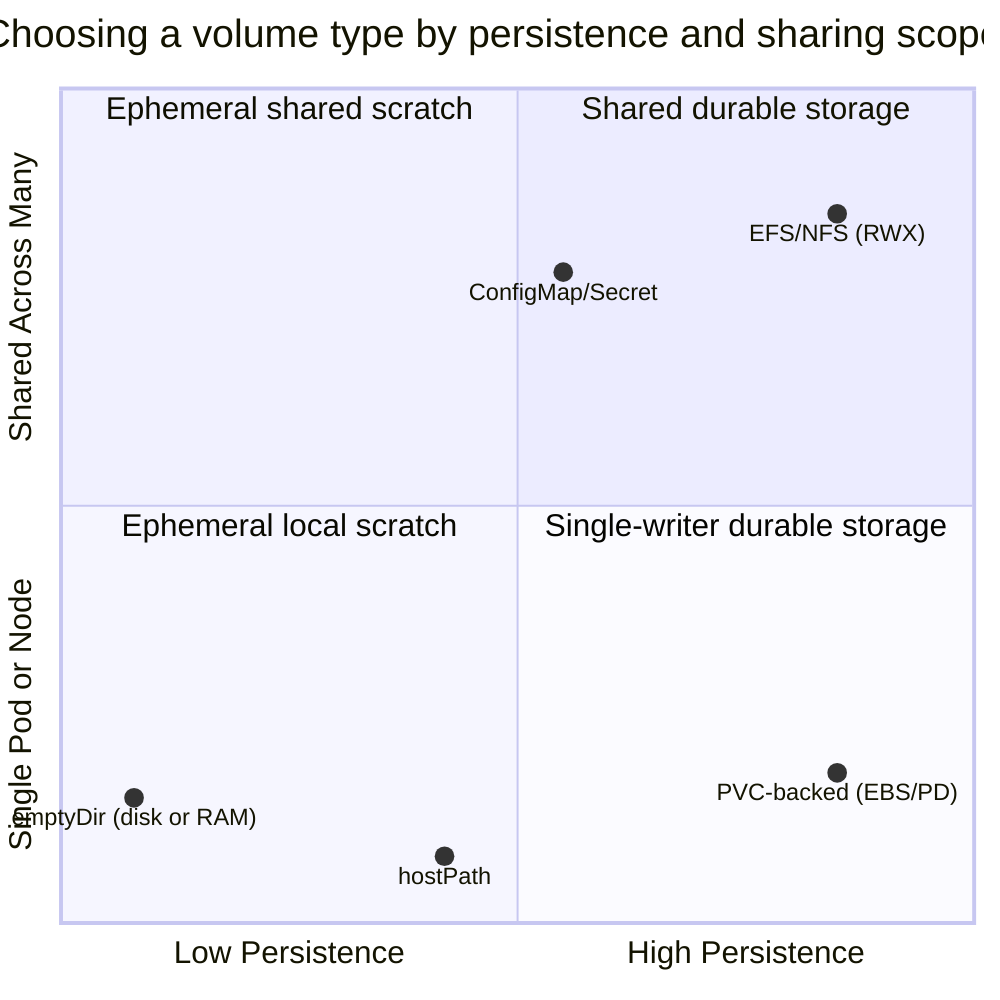
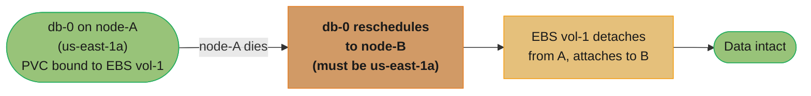
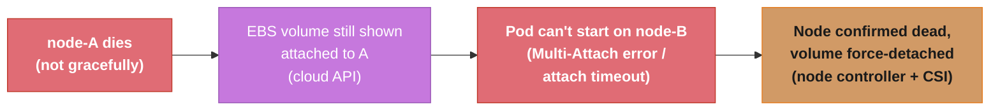
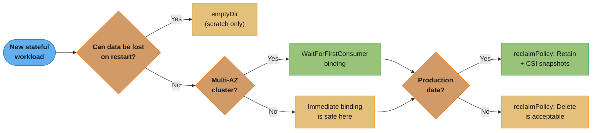

# Kubernetes Storage & State

> Phase 2 — Containers & Kubernetes · Difficulty: Intermediate

Containers are ephemeral; their writable layer vanishes on restart. Running stateful workloads (databases, queues, caches) on Kubernetes requires durable storage that survives Pod rescheduling. The abstractions — Volumes, PersistentVolumes (PV), PersistentVolumeClaims (PVC), StorageClasses, and the CSI driver model — decouple "I need 100 GiB of fast SSD" from the specifics of EBS, GCE PD, or Ceph.

---

## 1. Concept Overview

Kubernetes storage separates *requesting* storage from *providing* it:

- **Volume** — storage attached to a Pod for its lifetime (or the container's). `emptyDir` is ephemeral (dies with the Pod); other types persist.
- **PersistentVolume (PV)** — a cluster resource representing a piece of real storage (an EBS volume, an NFS export). Has a lifecycle independent of any Pod.
- **PersistentVolumeClaim (PVC)** — a Pod's *request* for storage ("100 GiB, ReadWriteOnce"). Kubernetes binds it to a matching PV.
- **StorageClass** — defines a "type" of storage (provisioner, parameters, reclaim policy) and enables **dynamic provisioning**: a PVC referencing a StorageClass auto-creates a PV.
- **CSI (Container Storage Interface)** — the standard plugin API; cloud and storage vendors ship CSI drivers (EBS CSI, EFS CSI, etc.) that provision/attach/mount volumes.

**Access modes** govern sharing: `ReadWriteOnce` (RWO — one node), `ReadWriteMany` (RWX — many nodes, needs a shared FS like EFS/NFS), `ReadOnlyMany` (ROX).

---

## 2. Intuition

> **One-line analogy**: A PVC is a storage *order form* ("I need 100 GiB of fast SSD"); a StorageClass is the *catalog* defining what "fast SSD" means and who fulfills it; a PV is the *delivered unit*; CSI is the *supplier* that actually manufactures and ships it. You order against the catalog and the supply chain handles the rest.

**Mental model**: Pods are cattle, but their *data* may be a pet. A PVC outlives the Pod that uses it — when a StatefulSet Pod (`db-0`) is rescheduled to another node, its PVC (and the underlying EBS volume) detaches from the old node and reattaches to the new one, so the data follows. The binding PVC↔PV is sticky; the Pod↔node binding is not.

**Why it matters**: Get storage wrong and you lose data or wedge a workload. The classic failures: an `emptyDir` "database" that loses everything on restart; an RWO volume that can't move because a Pod with `ReadWriteOnce` is stuck on a dead node (volume still attached); a StatefulSet that won't schedule because its zone-locked EBS volume can't attach to a node in another AZ.

**Key insight**: Most cloud block storage (EBS, GCE PD) is **zone-scoped and single-attach (RWO)**. A Pod using it can only run on a node in the volume's availability zone, and only one node can mount it. This constraint shapes every stateful design decision — topology, failover, and why multi-attach needs a shared filesystem.

---

## 3. Core Principles

1. **Separate request from provision.** PVC (request) binds to PV (real storage), often auto-created via StorageClass.
2. **PVCs outlive Pods.** Data persists across rescheduling; the volume follows the Pod.
3. **Access mode dictates sharing.** RWO = one node; RWX needs a shared/networked filesystem.
4. **Topology constrains scheduling.** Zone-scoped volumes pin Pods to that zone.
5. **Reclaim policy decides deletion.** `Retain` keeps data after PVC deletion; `Delete` destroys the underlying volume.
6. **CSI standardizes the plugin layer.** Provision/attach/mount/snapshot via vendor drivers.

---

## 4. Types / Architectures / Strategies

### Volume types

| Type | Lifetime | Use |
|------|----------|-----|
| `emptyDir` | Pod lifetime (dies with Pod) | Scratch, cache, shared dir between containers |
| `emptyDir` (memory) | Pod lifetime, RAM-backed | Fast tmpfs scratch |
| PVC-backed (EBS/PD CSI) | Independent (persists) | Databases, durable state |
| `hostPath` | Node lifetime | Node agents (DaemonSets); risky for apps |
| ConfigMap/Secret volume | Pod lifetime | Config/cert injection (auto-updates) |
| EFS/NFS (RWX) | Independent | Shared read-write across many Pods |

The six types trade off two independent axes — how long the data survives, and how many Pods can share it at once:



`emptyDir` and `hostPath` sit low on persistence — the first dies with the Pod, the second with the node; PVC-backed volumes buy durability but stay single-writer (RWO); only EFS/NFS reaches the top-right quadrant of durable *and* shared.

### Access modes

| Mode | Meaning | Backed by |
|------|---------|-----------|
| ReadWriteOnce (RWO) | One node read-write | EBS, GCE PD (block) |
| ReadWriteOncePod | Exactly one Pod | CSI (stricter than RWO) |
| ReadWriteMany (RWX) | Many nodes read-write | EFS, NFS, CephFS (shared FS) |
| ReadOnlyMany (ROX) | Many nodes read-only | Shared FS, snapshots |

### Reclaim policies

| Policy | On PVC deletion |
|--------|-----------------|
| Delete (default for dynamic) | Underlying volume destroyed |
| Retain | Volume kept (manual cleanup); protects data |

---

## 5. Architecture Diagrams

**Dynamic provisioning flow**

```mermaid
flowchart LR
    classDef io      fill:#61afef,stroke:#2e86c1,color:#1a1a1a,font-weight:bold
    classDef frozen  fill:#c678dd,stroke:#9b59b6,color:#fff
    classDef train   fill:#98c379,stroke:#27ae60,color:#1a1a1a
    classDef mathOp  fill:#d19a66,stroke:#e67e22,color:#1a1a1a,font-weight:bold
    classDef lossN   fill:#e06c75,stroke:#c0392b,color:#fff,font-weight:bold
    classDef req     fill:#56b6c2,stroke:#0097a7,color:#1a1a1a
    classDef base    fill:#e5c07b,stroke:#f39c12,color:#1a1a1a

    pod([Pod]) --> pvc["PVC data<br/>100Gi · RWO<br/>storageClassName: gp3"]
    pvc --> sc["StorageClass gp3<br/>provisioner: ebs.csi.aws.com<br/>reclaimPolicy: Delete"]
    sc -->|"triggers CSI<br/>provision"| csi["EBS CSI driver<br/>creates 100Gi gp3 volume<br/>in Pod's AZ"]
    csi --> pv["PV<br/>bound to PVC"]
    pv -->|"attach / mount"| node([Node where<br/>Pod is scheduled])

    class pod io
    class pvc req
    class sc,pv base
    class csi mathOp
    class node train
```



A Pod's PVC references a StorageClass, which triggers the CSI driver to provision the real volume in the Pod's AZ; the resulting PV then attaches and mounts to the node the Pod was scheduled on.

**StatefulSet storage follows the Pod**



Because EBS volumes are zone-locked, `db-0` can only reschedule to another node still inside `us-east-1a` — the PVC↔PV binding is what lets `vol-1` follow it there with no data loss.

---

## 6. How It Works — Detailed Mechanics

### StorageClass + PVC (dynamic provisioning)

```yaml
apiVersion: storage.k8s.io/v1
kind: StorageClass
metadata: {name: gp3}
provisioner: ebs.csi.aws.com
parameters: {type: gp3, iops: "3000", throughput: "125"}
reclaimPolicy: Retain                 # keep the EBS volume if the PVC is deleted (data safety)
volumeBindingMode: WaitForFirstConsumer  # delay provisioning until a Pod is scheduled (topology-aware)
allowVolumeExpansion: true            # enables online resize
---
apiVersion: v1
kind: PersistentVolumeClaim
metadata: {name: data}
spec:
  accessModes: [ReadWriteOnce]
  storageClassName: gp3
  resources: {requests: {storage: 100Gi}}
```

`volumeBindingMode: WaitForFirstConsumer` is critical in multi-AZ clusters: it defers creating the EBS volume until the scheduler picks a node, so the volume is created in *that node's* AZ — avoiding "volume in 1a, Pod scheduled to 1b, can't attach."

### Expanding a volume online

```bash
# With allowVolumeExpansion: true, just edit the PVC request upward:
kubectl patch pvc data -p '{"spec":{"resources":{"requests":{"storage":"200Gi"}}}}'
# CSI resizes the EBS volume; the filesystem grows (often online). Shrinking is NOT supported.
```

### Volume snapshots (CSI)

```yaml
apiVersion: snapshot.storage.k8s.io/v1
kind: VolumeSnapshot
metadata: {name: db-snap-2026-06-05}
spec:
  volumeSnapshotClassName: ebs-snapclass
  source: {persistentVolumeClaimName: data-db-0}
# Restore: create a new PVC with dataSource referencing this snapshot.
```

### emptyDir vs persistent (the data-loss trap)

```yaml
# emptyDir: scratch only. Survives container restart, DIES on Pod deletion/reschedule.
volumes: [{name: cache, emptyDir: {}}]

# PVC-backed: survives reschedule. Use for ANY data you can't lose.
volumes: [{name: data, persistentVolumeClaim: {claimName: data}}]
```

### Why a Pod can get stuck on a dead node (RWO)



Resolution can take minutes — the node must be confirmed dead before the volume force-detaches, which is why RWO failover isn't instant.

---

## 7. Real-World Examples

- **Databases as StatefulSets** (Postgres, MySQL) use `volumeClaimTemplates` so each replica gets its own EBS-backed PVC that follows it across reschedules — though many teams prefer managed RDS to avoid this operational surface.
- **Kafka/Elasticsearch** rely on per-broker persistent volumes with `Retain` reclaim policy so a PVC mistake doesn't destroy data.
- **EFS for shared content** (RWX): CMS uploads, ML datasets, or shared model files mounted read-write by many Pods across nodes/AZs.
- **Velero** backs up PVCs (via CSI snapshots) plus Kubernetes objects for disaster recovery (see [disaster_recovery_and_resilience](../disaster_recovery_and_resilience/)).

---

## 8. Tradeoffs

| Decision | Option A | Option B | Key factor |
|----------|----------|----------|-----------|
| State location | Self-run StatefulSet | Managed service (RDS) | Ops burden vs control/cost |
| Access mode | RWO block (EBS, fast) | RWX shared (EFS, flexible) | Single-writer perf vs multi-node sharing |
| Reclaim policy | Retain (data-safe) | Delete (auto-cleanup) | Data protection vs tidiness |
| Binding mode | WaitForFirstConsumer (topology-aware) | Immediate | Multi-AZ correctness vs speed |
| Scratch | emptyDir (fast, ephemeral) | PVC (durable) | Loss-tolerant vs durable |
| Snapshots | CSI snapshots (fast, cloud-native) | App-level dumps (portable) | Speed vs portability/consistency |

---

## 9. When to Use / When NOT to Use

**Use Kubernetes-native storage when:** you must run stateful workloads in-cluster (no managed equivalent, data locality, cost), need shared RWX storage, or want CSI snapshots integrated with your backup tooling.

**Prefer managed services when:** a cloud database/queue fits (RDS, ElastiCache, MSK) — the operational burden of self-running stateful systems on Kubernetes (failover, backups, upgrades, zonal volume constraints) is high. Never use `emptyDir` or `hostPath` for data you can't lose.

---

## 10. Common Pitfalls

**Pitfall 1 — Using `emptyDir` (or no volume) for a database.**

```yaml
# BROKEN: "stateful" workload with ephemeral storage -> all data lost on reschedule/restart.
spec:
  containers:
    - name: postgres
      image: postgres:16
      volumeMounts: [{name: pgdata, mountPath: /var/lib/postgresql/data}]
  volumes: [{name: pgdata, emptyDir: {}}]      # gone the moment the Pod is rescheduled
```

```yaml
# FIX: StatefulSet with a volumeClaimTemplate -> durable, Pod-following PVC.
spec:
  volumeClaimTemplates:
    - metadata: {name: pgdata}
      spec: {accessModes: [ReadWriteOnce], storageClassName: gp3, resources: {requests: {storage: 100Gi}}}
```

**Pitfall 2 — `Immediate` binding in a multi-AZ cluster.** The PV is provisioned in AZ 1a before scheduling, but the scheduler later places the Pod on a node in 1b; the zonal EBS volume can't attach and the Pod is stuck Pending. FIX: `volumeBindingMode: WaitForFirstConsumer` so provisioning waits for the node choice and lands the volume in the right AZ.

**Pitfall 3 — `reclaimPolicy: Delete` on production data.** Someone deletes a PVC (or a `helm uninstall` does), and the underlying EBS volume — with the only copy of the data — is destroyed. FIX: use `Retain` for stateful production volumes, protect PVCs with finalizers/labels, and keep CSI snapshots/backups.

The three pitfalls above are really one triage flow — durability, then topology, then reclaim safety:



The two green outcomes — `WaitForFirstConsumer` and `Retain` — are exactly the fixes from Pitfalls 2 and 3; skip either gate and you land back in one of the failures above.

---

## 11. Technologies & Tools

| Tool | Purpose |
|------|---------|
| EBS / GCE PD / Azure Disk CSI | Block storage (RWO) |
| EFS / Filestore / Azure Files CSI | Shared filesystems (RWX) |
| CSI snapshot controller | Volume snapshots/restore |
| Velero | PVC + object backup/restore, DR |
| OpenEBS / Rook-Ceph / Longhorn | Software-defined storage in-cluster |
| `kubectl get pv,pvc,sc` | Inspect storage bindings |
| local-path-provisioner | Simple local PVs (dev) |

---

## 12. Interview Questions with Answers

**Q1: Explain PV, PVC, and StorageClass.**
A PersistentVolume (PV) is a cluster resource representing real storage with its own lifecycle. A PersistentVolumeClaim (PVC) is a Pod's request for storage (size, access mode). A StorageClass defines a *type* of storage (provisioner + parameters + reclaim policy) and enables dynamic provisioning — a PVC referencing it auto-creates a matching PV via the CSI driver. The separation lets Pods request abstract storage without knowing the backend.

**Q2: Why does a PVC outlive the Pod, and why does that matter?**
The PVC↔PV binding is independent of any Pod, so when a (StatefulSet) Pod is rescheduled, its PVC and the underlying volume detach from the old node and reattach to the new one — the data follows the Pod. This is the whole point of persistent storage: Pods are disposable, but their state survives reschedules, node failures, and restarts.

**Q3: What's the difference between access modes, and what backs each?**
ReadWriteOnce (RWO) allows one node read-write (cloud block storage like EBS/PD); ReadWriteOncePod restricts to a single Pod; ReadWriteMany (RWX) allows many nodes read-write (shared filesystems like EFS/NFS/CephFS); ReadOnlyMany (ROX) is many nodes read-only. Block storage is single-attach (RWO); only networked/shared filesystems support RWX.

**Q4: Why is `volumeBindingMode: WaitForFirstConsumer` important in multi-AZ clusters?**
Cloud block volumes are zone-scoped. With `Immediate` binding, the volume is provisioned (in some AZ) before the Pod is scheduled, and if the scheduler later places the Pod in a different AZ, the volume can't attach and the Pod hangs Pending. `WaitForFirstConsumer` delays provisioning until the scheduler picks a node, then creates the volume in that node's AZ, guaranteeing they match.

**Q5: What does the reclaim policy control, and which should production use?**
It controls what happens to the underlying storage when the PVC is deleted: `Delete` destroys the volume (data gone); `Retain` keeps it for manual recovery. Production stateful workloads should use `Retain` so an accidental PVC deletion (or `helm uninstall`) doesn't irrecoverably destroy data — combined with snapshots/backups.

**Q6: Why can a Pod using an RWO volume fail to move quickly after a node dies?**
The cloud still considers the volume attached to the dead node until the node is confirmed gone and the volume is force-detached, which can take minutes. Until then, a replacement Pod on another node gets a "Multi-Attach" / attach-timeout error because RWO permits only one node. This is why RWO failover isn't instant and why truly HA stateful systems replicate data rather than relying on volume re-attach.

**Q7: What is CSI and why does it matter?**
The Container Storage Interface is a standard plugin API decoupling Kubernetes from storage backends. Vendors ship CSI drivers (EBS, EFS, Ceph) implementing provision/attach/mount/snapshot/expand operations. It means new storage systems integrate without changing Kubernetes core, and features like snapshots and volume expansion are available uniformly across backends that support them.

**Q8: How do you safely run a database on Kubernetes — or should you?**
If you must: use a StatefulSet with `volumeClaimTemplates` (per-Pod PVCs), `Retain` reclaim policy, `WaitForFirstConsumer` binding, anti-affinity across AZs, PodDisruptionBudgets, and CSI snapshots/Velero backups — ideally via a mature operator (e.g., CloudNativePG). But for most teams a managed service (RDS/Cloud SQL) is preferable, because failover, backups, patching, and zonal-volume constraints are substantial operational burden.

**Q9: emptyDir vs persistent volume — when each?**
`emptyDir` is scratch space tied to the Pod's lifetime — fine for caches, temp files, or sharing data between containers in a Pod, but it's destroyed when the Pod is deleted or rescheduled. Use a PVC-backed volume for anything you can't lose. A frequent incident is someone using `emptyDir` for a database and losing all data on the first reschedule.

**Q10: How do volume snapshots and expansion work?**
With a CSI driver supporting them: a `VolumeSnapshot` object triggers the driver to snapshot the underlying volume; you restore by creating a PVC with `dataSource` referencing the snapshot. Expansion requires `allowVolumeExpansion: true` on the StorageClass — you edit the PVC's requested size upward and the driver grows the volume and filesystem (online for many drivers). Shrinking is not supported.

**Q11: What's the risk of `hostPath` volumes?**
`hostPath` mounts a node's filesystem path into the Pod. It ties the Pod to that specific node's data (no portability), bypasses storage abstraction, and is a security risk (a compromised Pod can read/write the host filesystem). It's appropriate for node-level agents (DaemonSets needing `/var/log` or `/proc`) but not for application data.

**Q12: How does storage factor into Kubernetes disaster recovery?**
You back up two things: the Kubernetes objects (manifests/etcd) and the PVC data. Velero captures both — taking CSI snapshots of PVCs and exporting object definitions — enabling restore into a new cluster. Reclaim policy `Retain`, cross-region snapshot copies, and tested restores are the pillars; relying on volume re-attach alone is not DR (see [disaster_recovery_and_resilience](../disaster_recovery_and_resilience/)).

---

## 13. Best Practices

- Never use `emptyDir`/`hostPath` for durable data; use PVC-backed volumes.
- Set `volumeBindingMode: WaitForFirstConsumer` for zonal block storage in multi-AZ clusters.
- Use `reclaimPolicy: Retain` for production stateful volumes; protect PVCs from accidental deletion.
- Enable `allowVolumeExpansion`; plan for growth (you can grow, not shrink).
- Take **CSI snapshots + Velero backups**; test restores regularly.
- Spread stateful replicas across AZs with anti-affinity; add PodDisruptionBudgets.
- Strongly prefer **managed databases** unless you have a clear reason to self-host.
- Use a mature **operator** if you do run stateful systems in-cluster.

---

## 14. Case Study

### Scenario: StatefulSet database Pods stuck "Pending" after a node failure

A self-hosted Postgres StatefulSet (`pg-0..2`) runs across a 3-AZ cluster. A node in `us-east-1a` fails. `pg-0` (which lived there) goes Pending and never recovers; the app loses its primary.

```mermaid
flowchart LR
    classDef io      fill:#61afef,stroke:#2e86c1,color:#1a1a1a,font-weight:bold
    classDef frozen  fill:#c678dd,stroke:#9b59b6,color:#fff
    classDef train   fill:#98c379,stroke:#27ae60,color:#1a1a1a
    classDef mathOp  fill:#d19a66,stroke:#e67e22,color:#1a1a1a,font-weight:bold
    classDef lossN   fill:#e06c75,stroke:#c0392b,color:#fff,font-weight:bold
    classDef req     fill:#56b6c2,stroke:#0097a7,color:#1a1a1a
    classDef base    fill:#e5c07b,stroke:#f39c12,color:#1a1a1a

    setup["Cluster: nodes in 1a/1b/1c<br/>pg-0 PVC bound to EBS vol<br/>in us-east-1a (zonal, RWO)"] --> nodeDies["Node in 1a dies"]
    nodeDies --> reschedAttempt["Scheduler places pg-0<br/>on a node in 1b"]
    reschedAttempt --> cantAttach["EBS vol (1a) can't<br/>attach to a 1b node"]
    cantAttach --> stuckPending["pg-0 stuck Pending<br/>(volume node affinity<br/>conflict)"]

    class setup base
    class nodeDies,cantAttach,stuckPending lossN
    class reschedAttempt mathOp
```



Because the EBS volume is zone-locked, the scheduler's cross-AZ placement is exactly what strands `pg-0` — the fix below makes scheduling and storage topology-aware together.

```yaml
# BROKEN: no AZ spread, Immediate binding, and reliance on volume re-attach for HA.
spec:
  replicas: 3
  volumeClaimTemplates:
    - metadata: {name: data}
      spec:
        accessModes: [ReadWriteOnce]
        storageClassName: gp3-immediate     # Immediate binding, zonal volumes scattered
        resources: {requests: {storage: 100Gi}}
  # no topologySpreadConstraints; HA assumed via volume re-attach (wrong for zonal RWO)
```

```yaml
# FIX: topology-aware binding + spread replicas across AZs + replicate at the DB layer.
# StorageClass:
volumeBindingMode: WaitForFirstConsumer       # volume created in the scheduled node's AZ
---
# StatefulSet:
spec:
  template:
    spec:
      topologySpreadConstraints:               # one replica per AZ
        - maxSkew: 1
          topologyKey: topology.kubernetes.io/zone
          whenUnsatisfiable: DoNotSchedule
          labelSelector: {matchLabels: {app: pg}}
  # + use streaming replication (or an operator like CloudNativePG) so failover promotes
  #   a replica in another AZ -- the data is REPLICATED, not dependent on re-attaching a
  #   single zonal volume.
```

The core lesson: **a single zonal RWO volume is not high availability.** Real HA for stateful systems comes from replicating data across AZs (DB-level replication or an operator that manages failover), not from hoping a zonal volume re-attaches. After the change, an AZ failure promotes a healthy replica in another zone within seconds, and new volumes always provision in the correct AZ.

**Discussion questions:**
1. Why does spreading replicas across AZs require DB-level replication rather than shared storage?
2. When the failed node recovers, what must happen to its old EBS volume, and how do you avoid split-brain?
3. How would a managed RDS Multi-AZ deployment change this calculus entirely? (It handles synchronous standby + failover for you.)

---

**Cross-references:** [kubernetes_workloads_and_objects](../kubernetes_workloads_and_objects/) (StatefulSets, volumeClaimTemplates), [kubernetes_scheduling_and_autoscaling](../kubernetes_scheduling_and_autoscaling/) (topology spread, affinity), [disaster_recovery_and_resilience](../disaster_recovery_and_resilience/) (Velero, snapshots, RPO/RTO), [`../../database/replication_and_high_availability`](../../database/replication_and_high_availability/) (DB-level HA).
