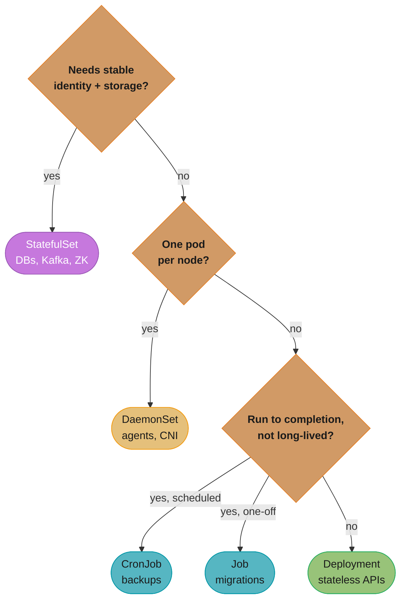
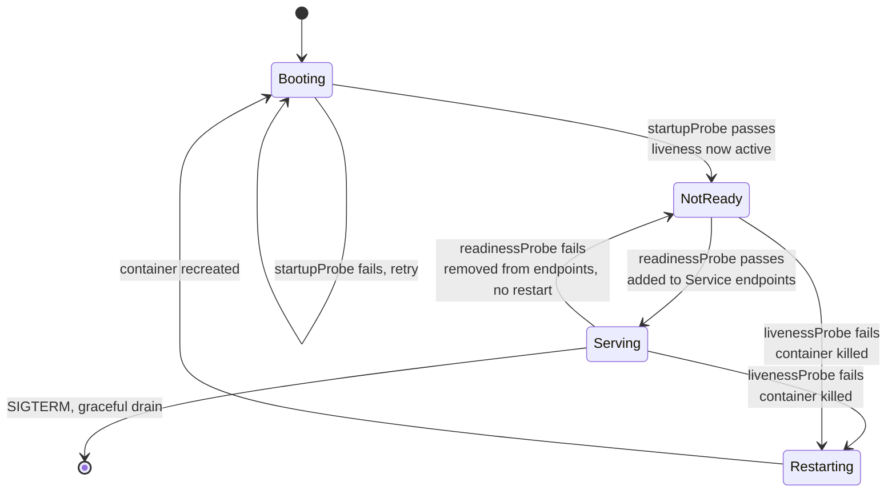
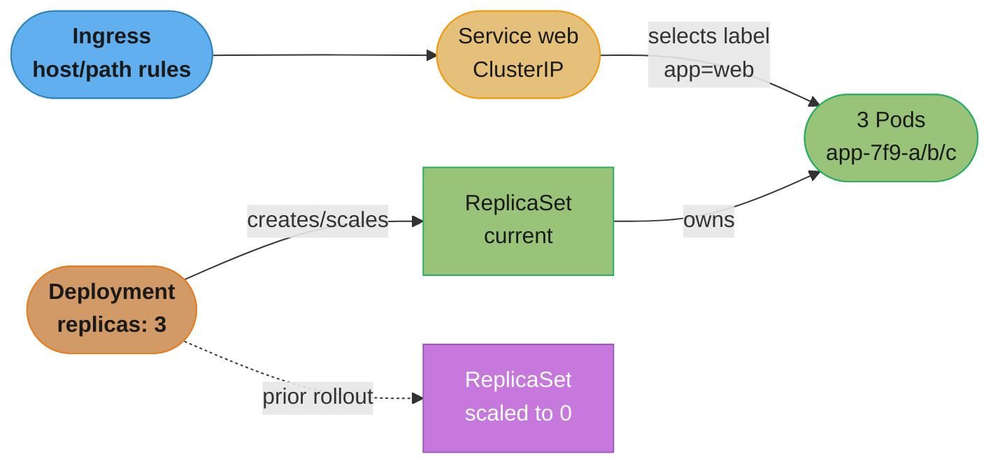
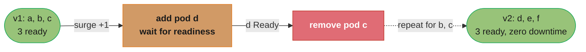
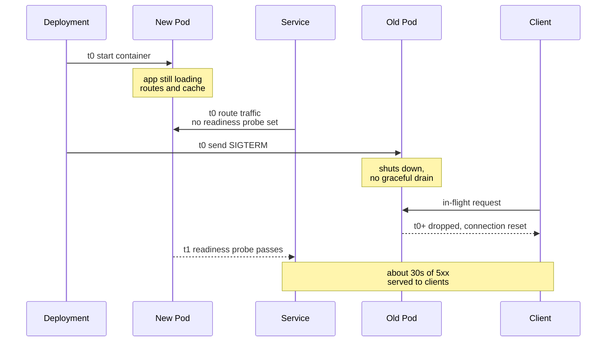

# Kubernetes Workloads & Objects

> Phase 2 — Containers & Kubernetes · Difficulty: Intermediate

If [kubernetes_architecture](../kubernetes_architecture/) explains *how* the cluster works, this module covers *what you actually declare*: Pods, the controllers that manage them (Deployment, StatefulSet, DaemonSet, Job/CronJob), and the objects that connect and configure them (Service, Ingress, ConfigMap, Secret). Choosing the right workload object and configuring probes and update strategy correctly is the difference between a self-healing system and one that drops traffic on every deploy.

---

## 1. Concept Overview

The **Pod** is the atomic unit — one or more containers sharing a network namespace (same IP/localhost) and storage volumes, scheduled together. You almost never create bare Pods; you declare a **controller** that manages Pods for you:

- **Deployment** → manages a **ReplicaSet** → manages stateless Pods, with rolling updates and rollback.
- **StatefulSet** → Pods with stable identity (ordinal names, stable storage, ordered rollout) for databases/brokers.
- **DaemonSet** → exactly one Pod per (matching) node — agents, log shippers, CNI.
- **Job** → run-to-completion Pods; **CronJob** → scheduled Jobs.

Connectivity and config objects:
- **Service** → a stable virtual IP/DNS name load-balancing to a set of Pods (selected by labels).
- **Ingress** → L7 HTTP routing (host/path) to Services, via an ingress controller.
- **ConfigMap / Secret** → inject configuration / sensitive data as env vars or mounted files.

**Labels and selectors** are the glue: controllers and Services find their Pods by label match, not by name.

---

## 2. Intuition

> **One-line analogy**: A Deployment is a manager who's told "keep 3 of these workers staffed and swap them out gracefully when I hand you a new job description." You don't hire/fire individuals; you tell the manager the target and the replacement policy, and they handle churn, sick days (crashes), and shift changes (rollouts).

**Mental model**: You declare intent at the controller level (`replicas: 3`, this image, this update strategy). The controller creates/deletes Pods to match. Pods are cattle, not pets — disposable and replaceable — *except* under StatefulSet, where each Pod has a stable name and disk (a "pet" with identity). Services decouple clients from individual Pods: clients hit a stable name; the Service routes to whichever Pods are currently ready.

**Why it matters**: Picking Deployment vs StatefulSet, setting readiness/liveness probes, and tuning the rollout strategy directly determine whether deploys are zero-downtime and whether failures self-heal. The most common production incidents — traffic to not-yet-ready pods, restart loops, data loss on a "stateless" database — are workload-object misconfigurations.

**Key insight**: Readiness gates *traffic*; liveness gates *restarts*. Confusing the two causes either dropped requests (no readiness probe) or restart storms (liveness probe that's really a readiness check). They answer different questions: "can it serve now?" vs "is it permanently wedged?"

---

## 3. Core Principles

1. **Pods are ephemeral; manage them with controllers.** Never deploy bare Pods to production.
2. **Match the controller to the workload.** Stateless → Deployment; identity/storage → StatefulSet; per-node → DaemonSet; batch → Job/CronJob.
3. **Labels/selectors are the wiring.** Services and controllers find Pods by labels.
4. **Probes encode health.** Readiness for traffic, liveness for restart, startup for slow boots.
5. **Decouple config from image.** ConfigMap/Secret injected at runtime; one image, many environments.
6. **Declare update strategy explicitly.** `maxUnavailable`/`maxSurge` (Deployment) or partition (StatefulSet) control rollout safety.

---

## 4. Types / Architectures / Strategies

### Choosing a workload controller

| Controller | Pod identity | Storage | Update | Use |
|-----------|--------------|---------|--------|-----|
| Deployment | Interchangeable (random suffix) | Shared/none | Rolling, rollback | Stateless apps, APIs |
| StatefulSet | Stable ordinal (`app-0`, `app-1`) | Per-pod PVC, retained | Ordered, partitioned | DBs, Kafka, Zookeeper |
| DaemonSet | One per node | Per-node host paths | Rolling per node | Log/metrics agents, CNI |
| Job | Run to completion | Ephemeral | N/A | Batch, migrations |
| CronJob | Scheduled Jobs | Ephemeral | N/A | Backups, periodic tasks |

The table above lists each controller's properties; the decision tree below walks the same choice as a sequence of yes/no questions — pick the first branch that matches the workload.



### Service types

| Type | Exposure | Use |
|------|----------|-----|
| ClusterIP (default) | Internal virtual IP | Service-to-service |
| NodePort | Port on every node | Dev, behind external LB |
| LoadBalancer | Cloud LB + external IP | Internet-facing (one per Service) |
| Headless (`clusterIP: None`) | DNS to individual pod IPs | StatefulSets, direct pod addressing |
| ExternalName | CNAME to external DNS | Aliasing external services |

### Probe types

| Probe | Question | On failure |
|-------|----------|------------|
| readiness | "Can it serve traffic now?" | Removed from Service endpoints (no traffic) |
| liveness | "Is it permanently broken?" | Container restarted |
| startup | "Has it finished booting?" | Holds off liveness until boot completes |

A pod's three probes gate different transitions: startup delays liveness until boot finishes, readiness gates Service traffic without a restart, and only a liveness failure triggers one.



---

## 5. Architecture Diagrams

**Ownership chain (stateless app).** Traffic flows Ingress to Service to Pods; management flows Deployment to ReplicaSet to those same Pods. The prior rollout's ReplicaSet is retained at zero replicas so rollback is just scaling it back up.



**Rolling update (`maxUnavailable: 0, maxSurge: 1`).** A replacement pod is surged in and must pass its readiness probe before the corresponding old pod is removed, so ready-pod count never drops below 3 — the same zero-downtime mechanic detailed in Q4.



---

## 6. How It Works — Detailed Mechanics

### A production-shaped Deployment

```yaml
apiVersion: apps/v1
kind: Deployment
metadata: {name: web, labels: {app: web}}
spec:
  replicas: 3
  selector: {matchLabels: {app: web}}     # MUST match template labels
  strategy:
    type: RollingUpdate
    rollingUpdate: {maxUnavailable: 0, maxSurge: 1}   # zero-downtime: add before removing
  template:
    metadata: {labels: {app: web}}
    spec:
      containers:
        - name: web
          image: registry/web@sha256:...           # pin by digest
          ports: [{containerPort: 8080}]
          resources:
            requests: {cpu: 100m, memory: 128Mi}    # scheduling + QoS
            limits:   {memory: 256Mi}               # hard memory cap
          readinessProbe:                            # gate TRAFFIC
            httpGet: {path: /healthz, port: 8080}
            periodSeconds: 5
            failureThreshold: 3
          livenessProbe:                             # gate RESTART (looser than readiness)
            httpGet: {path: /livez, port: 8080}
            periodSeconds: 10
            failureThreshold: 6                      # tolerate transient blips
          startupProbe:                              # slow boot: hold liveness until ready
            httpGet: {path: /healthz, port: 8080}
            failureThreshold: 30
            periodSeconds: 5                         # allow up to 150s to start
```

### Config and secrets injected at runtime

```yaml
envFrom:
  - configMapRef: {name: web-config}     # all keys as env vars
  - secretRef:    {name: web-secrets}
volumeMounts:
  - {name: tls, mountPath: /etc/tls, readOnly: true}
volumes:
  - name: tls
    secret: {secretName: web-tls}        # mounted as files (auto-updates on change)
```

A Secret is base64-encoded, **not encrypted by default** — see [kubernetes_security](../kubernetes_security/) and [secrets_management](../secrets_management/) for encryption-at-rest and external secret stores.

### StatefulSet stable identity + storage

```yaml
apiVersion: apps/v1
kind: StatefulSet
metadata: {name: pg}
spec:
  serviceName: pg-headless          # headless Service for stable DNS: pg-0.pg-headless...
  replicas: 3
  selector: {matchLabels: {app: pg}}
  template: { ... }
  volumeClaimTemplates:             # each pod gets its OWN PVC, retained across restarts
    - metadata: {name: data}
      spec: {accessModes: [ReadWriteOnce], resources: {requests: {storage: 100Gi}}}
# pg-0, pg-1, pg-2 keep their names + disks; rollout is ordered (pg-2 -> pg-1 -> pg-0).
```

### CronJob with sane guards

```yaml
apiVersion: batch/v1
kind: CronJob
metadata: {name: backup}
spec:
  schedule: "0 3 * * *"             # 03:00 daily
  concurrencyPolicy: Forbid        # don't overlap runs
  startingDeadlineSeconds: 300     # skip if missed by >5min (don't pile up after downtime)
  jobTemplate:
    spec:
      backoffLimit: 3              # retry up to 3 times
      template: {spec: {restartPolicy: Never, containers: [...]}}
```

---

## 7. Real-World Examples

- **Stateless web/API tiers** run as Deployments behind a ClusterIP Service and an Ingress — the bread-and-butter pattern.
- **Kafka, Postgres, Elasticsearch** run as StatefulSets (or operators) for stable identity and per-pod storage; brokers/replicas need predictable names and retained disks.
- **Datadog/Fluent Bit/Cilium agents** run as DaemonSets — one per node to collect logs/metrics or program networking.
- **Database migrations** run as Jobs in CI/CD before the app Deployment rolls; **nightly backups** as CronJobs.

---

## 8. Tradeoffs

| Decision | Option A | Option B | Key factor |
|----------|----------|----------|-----------|
| App controller | Deployment (simple, fast rollout) | StatefulSet (identity/storage) | Does the workload need stable identity/disk? |
| Rollout | `maxUnavailable: 0, maxSurge: 1` (zero-downtime) | `maxUnavailable: 25%` (faster) | Capacity headroom vs availability |
| Service exposure | LoadBalancer (one per svc, costly) | Ingress (shared L7) | Cost + L7 features |
| Config | ConfigMap env vars | Mounted files (hot-reload) | Reload-without-restart need |
| Liveness probe | Aggressive | Lenient/none | Restart storms vs slow recovery |
| Secret storage | Native Secret (b64) | External store (Vault/ESO) | Security/compliance |

---

## 9. When to Use / When NOT to Use

**Deployment**: stateless services — the default. **StatefulSet**: only when you genuinely need stable network identity, ordered startup, or per-pod persistent storage (DBs, clustered brokers). **DaemonSet**: node-level agents. **Job/CronJob**: batch and scheduled work.

**Avoid:** bare Pods in prod (no self-healing); StatefulSets for stateless apps (slower, more complex rollouts for no benefit); `LoadBalancer` per service when an Ingress would share one (cost). Don't run a heavy database as a StatefulSet if a managed service (RDS) fits — operational burden is real.

---

## 10. Common Pitfalls

**Pitfall 1 — Missing readiness probe → traffic to a not-ready pod.**

```yaml
# BROKEN: no readiness probe. During rollout, the new pod joins the Service the instant
# its container starts — before the app has loaded config/warmed caches -> 5xx to users.
containers:
  - name: web
    image: web:2.0
    # (no readinessProbe)
```

```yaml
# FIX: readiness gates Service membership; pod gets traffic only after /healthz passes.
    readinessProbe:
      httpGet: {path: /healthz, port: 8080}
      periodSeconds: 5
      failureThreshold: 3
# Combined with maxUnavailable: 0, the old pod stays in rotation until the new one is ready.
```

**Pitfall 2 — Liveness probe doing a readiness job → restart storm.** A liveness probe that checks a slow dependency (DB) fails during a transient DB blip, Kubernetes restarts the container, the restart makes things worse, and you get a cascading restart loop. FIX: liveness should check only "is the process itself wedged" (e.g., a simple `/livez`), be lenient (`failureThreshold` high), and use a `startupProbe` for slow boots; dependency health belongs in readiness.

**Pitfall 3 — Selector/label mismatch → Service routes to nothing.**

```yaml
# BROKEN: Service selects app=web but Pods are labeled app=webapp -> 0 endpoints -> connection refused.
kind: Service
spec: {selector: {app: web}}        # pods have labels.app: webapp
```

```bash
# FIX: ensure labels match; verify endpoints exist.
kubectl get endpointslices -l kubernetes.io/service-name=web    # should list pod IPs, not be empty
```

---

## 11. Technologies & Tools

| Tool | Purpose |
|------|---------|
| `kubectl` | Apply/inspect/rollout objects |
| Helm / Kustomize | Template/overlay manifests (see [helm_and_package_management](../helm_and_package_management/)) |
| `kubectl rollout` | `status`, `undo`, `restart`, `history` |
| ingress-nginx / Gateway API | L7 routing (see [kubernetes_networking](../kubernetes_networking/)) |
| External Secrets Operator | Sync secrets from Vault/cloud (see [secrets_management](../secrets_management/)) |
| stakater/Reloader | Restart on ConfigMap/Secret change |
| metrics-server | Powers `kubectl top` and HPA |

---

## 12. Interview Questions with Answers

**Q1: What is a Pod and why not deploy bare Pods?**
A Pod is the smallest deployable unit: one or more containers sharing a network namespace (same IP, localhost) and volumes, always co-scheduled. You don't deploy bare Pods in production because they have no self-healing — if the node dies, the Pod is gone. A controller (Deployment/StatefulSet) recreates Pods to maintain desired count, giving you self-healing, scaling, and rolling updates.

**Q2: Deployment vs StatefulSet — when each?**
Use a Deployment for stateless workloads: Pods are interchangeable (random name suffixes), share/lack storage, and roll out/back freely. Use a StatefulSet when Pods need stable identity (ordinal names like `db-0`), stable per-Pod persistent storage (via `volumeClaimTemplates`), and ordered startup/rollout — i.e., databases, Kafka, Zookeeper. Using a StatefulSet for a stateless app just adds slower, ordered rollouts for no benefit.

**Q3: Readiness vs liveness vs startup probes?**
Readiness answers "can this pod serve traffic now?" — failure removes it from Service endpoints (no restart). Liveness answers "is this pod permanently broken?" — failure restarts the container. Startup answers "has it finished booting?" — it holds off liveness checks until the app is up, preventing slow-starting apps from being killed mid-boot. Conflating readiness and liveness causes either dropped traffic or restart storms.

**Q4: How does a zero-downtime rolling update work?**
With `strategy: RollingUpdate` and `maxUnavailable: 0, maxSurge: 1`, the controller creates one new Pod (surge), waits for its readiness probe to pass, then terminates one old Pod — repeating until all are new. Because old Pods stay in the Service until new ones are Ready (gated by readiness), there's always the full capacity of ready Pods serving traffic, so no requests are dropped.

**Q5: How do Services find their Pods, and what is an EndpointSlice?**
A Service has a label selector; the EndpointSlice controller watches Pods matching that selector and maintains EndpointSlices listing the IPs of *ready* Pods. kube-proxy programs routing from the Service's virtual IP to those Pod IPs. If labels don't match (or no Pods are ready), the EndpointSlice is empty and connections fail — a common "Service routes to nothing" bug.

**Q6: What's the difference between a Secret and a ConfigMap, and is a Secret encrypted?**
Both inject config (as env vars or mounted files), but Secrets are intended for sensitive data and are base64-*encoded*, not encrypted, by default — anyone with read RBAC or etcd access can decode them. For real protection you enable encryption-at-rest for etcd, restrict RBAC, and/or use an external store (Vault) via the External Secrets Operator. ConfigMaps are for non-sensitive config.

**Q7: When do you use a DaemonSet?**
When you need exactly one Pod per node (or per matching node): log shippers (Fluent Bit), metrics/node exporters, CNI agents, security agents. The DaemonSet controller adds a Pod when a node joins and removes it when the node leaves, so coverage tracks the node set automatically.

**Q8: How do CronJobs avoid piling up after downtime or overlapping?**
`concurrencyPolicy: Forbid` (or `Replace`) prevents overlapping runs; `startingDeadlineSeconds` makes Kubernetes skip runs missed by more than the deadline instead of firing a backlog all at once after the control plane was down; `successfulJobsHistoryLimit`/`failedJobsHistoryLimit` cap retained Job objects. Without these, a control-plane outage can trigger a flood of catch-up Jobs.

**Q9: A new pod gets traffic before it's ready and returns 5xx. Why and fix?**
There's no readiness probe (or it's misconfigured), so the pod joins the Service's endpoints as soon as the container process starts — before the app has loaded config/warmed up. Add a readiness probe hitting a real health endpoint; combined with `maxUnavailable: 0`, the old pod keeps serving until the new one reports ready, eliminating the gap.

**Q10: What do `requests` and `limits` do at the object level?**
`requests` reserve resources for scheduling and determine QoS class (Guaranteed if requests==limits for all containers, else Burstable, else BestEffort), influencing eviction order. `limits` are hard ceilings: a CPU limit throttles, a memory limit triggers an OOM kill on breach. They map directly to cgroup settings on the node (see [linux_and_os_fundamentals](../linux_and_os_fundamentals/)).

**Q11: How do you roll back a bad Deployment?**
`kubectl rollout undo deployment/web` reverts to the previous ReplicaSet (Kubernetes keeps old ReplicaSets per `revisionHistoryLimit`). `kubectl rollout history` shows revisions; `--to-revision=N` targets a specific one. Because the old ReplicaSet still exists (scaled to 0), rollback is just scaling it back up and the new one down — fast and safe.

**Q12: What is a headless Service and why do StatefulSets use one?**
A headless Service (`clusterIP: None`) returns the individual Pod IPs via DNS instead of a single virtual IP. StatefulSets pair with one so each Pod gets a stable DNS name (`pg-0.pg-headless.ns.svc`), letting clients address specific members — essential for clustered systems where you must reach a particular replica (e.g., a primary) rather than load-balance across all.

**Q13: Why does the case study need a `preStop` hook in addition to a readiness probe and SIGTERM handling?**
A `preStop` hook bridges the gap between a Pod being marked Terminating and kube-proxy actually removing it from Service endpoints, which is not instantaneous. Without it, the moment a Pod receives SIGTERM it can stop accepting connections while some nodes haven't yet propagated its removal from the EndpointSlice, so a few in-flight requests get routed to a Pod that's already shutting down and are dropped. The module's fix runs `preStop: sleep 10` to hold the container alive and still finishing requests for 10 seconds after Terminating while endpoint removal propagates, inside a `terminationGracePeriodSeconds: 45` window sized longer than the app's slowest in-flight request. Readiness probes only gate new Pods joining traffic and do nothing for a Pod that's leaving, so always pair a `preStop` drain delay with an app that traps SIGTERM and finishes in-flight work rather than relying on either mechanism alone.

**Q14: What are the five Kubernetes Service types and how does each expose Pods?**
ClusterIP (the default) gives an internal-only virtual IP for service-to-service calls, and the other four types build outward from there for different exposure needs. NodePort opens the same port on every node for simple external access, usually behind an external load balancer; LoadBalancer provisions one cloud load balancer with an external IP per Service; a headless Service (`clusterIP: None`) skips the virtual IP entirely and returns individual Pod IPs via DNS, which is what StatefulSets use for stable per-Pod addressing; and ExternalName is just a DNS CNAME to an external hostname with no proxying at all. In production, ClusterIP handles internal traffic, an Ingress fronting ClusterIP (or occasionally LoadBalancer directly) handles internet-facing traffic, and NodePort is mostly a dev/debug tool since it exposes a high port on every node. Pick headless only when clients genuinely need to address a specific Pod rather than any ready replica.

**Q15: Why prefer an Ingress over giving every Service its own LoadBalancer?**
A cloud LoadBalancer Service provisions one external load balancer per Service, while an Ingress shares a single L7 load balancer and controller across many Services' host and path rules. Ten services fronted by ten `LoadBalancer` Services means ten cloud load balancers billed and managed separately, while the same ten services behind one Ingress controller share a single load balancer and route by hostname or URL path, cutting both cost and the number of moving parts to monitor. Ingress also provides L7 features a plain Service can't: path-based routing, host-based virtual hosting, TLS termination, and header-based rules, all configured declaratively per Ingress object. The tradeoff is an extra layer — the ingress controller itself — to operate and secure, so default to Ingress for HTTP(S) services and reserve raw `LoadBalancer` Services for internet-facing TCP/UDP workloads an Ingress controller can't route.

**Q16: How does a plain Job differ from a CronJob, and what does `backoffLimit` control?**
A Job runs Pods to completion a single time when created, while a CronJob is a scheduled wrapper that creates a new Job on a cron schedule. `backoffLimit` caps how many times a failed Pod is retried before the Job itself is marked Failed — the module's backup CronJob sets `backoffLimit: 3`, so a flaky backup gets three attempts before it's treated as a real failure instead of retrying forever. `restartPolicy` on the Pod template must be `Never` or `OnFailure`, never the Deployment default `Always`, since a run-to-completion Pod that restarted forever would never let the Job finish. Jobs are the right primitive for one-off work like a CI/CD database migration that must run exactly once to completion before the app Deployment rolls out, so set `backoffLimit` deliberately rather than leaving it unbounded.

---

## 13. Best Practices

- Manage Pods with controllers; never deploy bare Pods.
- Always set **readiness probes**; use **liveness** sparingly and leniently; add **startup probes** for slow boots.
- Use **`maxUnavailable: 0, maxSurge: 1`** for zero-downtime rollouts of critical services.
- Set **requests and (memory) limits**; aim for Guaranteed QoS on latency-critical pods.
- Keep labels/selectors consistent; verify EndpointSlices are non-empty after changes.
- Inject config via ConfigMap/Secret; pin images by digest; one image across environments.
- Prefer **Ingress** over per-Service `LoadBalancer`; use **PodDisruptionBudgets** to survive node drains (see [kubernetes_scheduling_and_autoscaling](../kubernetes_scheduling_and_autoscaling/)).
- For databases, strongly consider managed services over self-run StatefulSets.

---

## 14. Case Study

### Scenario: Every deploy causes a 30-second burst of 5xx errors

A team's stateless API drops ~2% of requests with 502/504 errors for about 30 seconds during each rolling deploy. Apps are healthy before and after; the errors are purely deploy-correlated.

**Deploy timeline (broken).** With no readiness probe, the Service routes traffic to the new pod the instant its container starts, while the old pod is torn down immediately on SIGTERM with no graceful drain — the gap between the two produces the ~30-second window of 5xx errors.



```yaml
# BROKEN: no readiness gate, aggressive rollout, no graceful shutdown handling.
spec:
  strategy: {type: RollingUpdate, rollingUpdate: {maxUnavailable: 25%}}
  template:
    spec:
      containers:
        - name: api
          image: api:3.1
          # no readinessProbe; no preStop; no terminationGracePeriodSeconds tuning
```

```yaml
# FIX: gate traffic with readiness, surge-don't-shrink, drain on shutdown.
spec:
  strategy:
    type: RollingUpdate
    rollingUpdate: {maxUnavailable: 0, maxSurge: 1}     # add ready pod before removing old
  template:
    spec:
      terminationGracePeriodSeconds: 45                  # > app's max in-flight request time
      containers:
        - name: api
          image: api:3.1
          readinessProbe:                                # only ready pods get traffic
            httpGet: {path: /healthz, port: 8080}
            periodSeconds: 5
            failureThreshold: 3
          lifecycle:
            preStop:
              exec: {command: ["sh","-c","sleep 10"]}    # let LB/endpoints drain before SIGTERM
          # app also traps SIGTERM: stop accepting, finish in-flight, then exit (see linux module)
```

The `preStop sleep` covers the gap between a Pod being marked Terminating and kube-proxy/endpoints actually removing it, so no new requests are routed to a draining pod; readiness ensures the replacement only takes traffic once it's truly up.

**Outcome:** deploy-time 5xx dropped from ~2% to ~0%. The combination — readiness gating, `maxUnavailable: 0`, `preStop` drain, and a SIGTERM-aware app within the grace period — produced genuinely zero-downtime rollouts.

**Discussion questions:**
1. Why is a `preStop` hook needed in addition to SIGTERM handling? (Endpoint removal isn't instantaneous; the sleep bridges the propagation gap.)
2. How does `maxUnavailable: 0` interact with cluster capacity, and when can't you use it? (Needs headroom for the surge pod.)
3. How would you prove zero-downtime in CI before trusting it? (Continuous load during a deploy in staging, asserting 0 5xx.)

---

**Cross-references:** [kubernetes_architecture](../kubernetes_architecture/) (controllers that manage these objects), [kubernetes_networking](../kubernetes_networking/) (Services, Ingress, EndpointSlices), [kubernetes_scheduling_and_autoscaling](../kubernetes_scheduling_and_autoscaling/) (requests/limits/QoS, PDB), [kubernetes_storage_and_state](../kubernetes_storage_and_state/) (PVCs for StatefulSets), [linux_and_os_fundamentals](../linux_and_os_fundamentals/) (SIGTERM, grace period).
