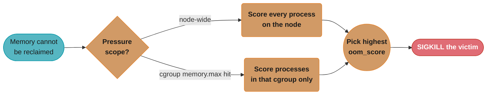
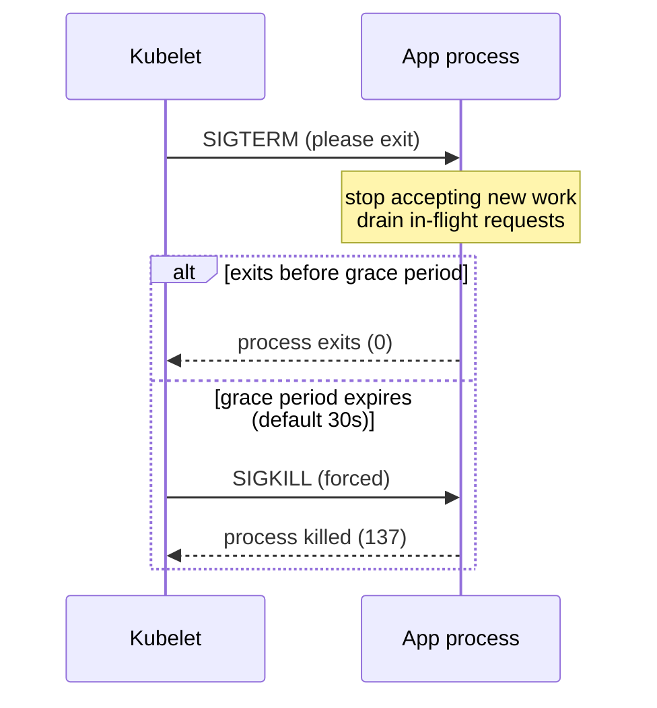
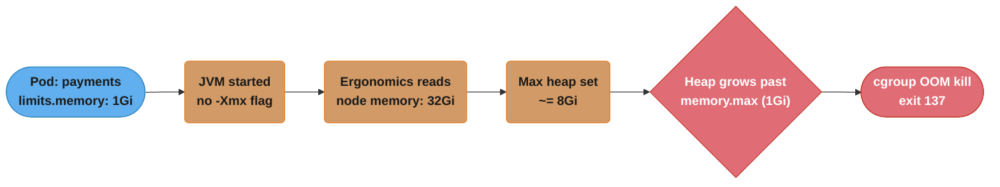

# Linux & OS Fundamentals

> Phase 1 — Foundations · Difficulty: Intermediate

The operating system is the substrate every container, pod, and cloud VM runs on. A senior DevOps engineer who understands processes, signals, file descriptors, cgroups, and namespaces can explain *why* a pod gets OOMKilled, *why* a graceful shutdown hangs, and *why* a "container" is just a process with a restricted view of the kernel — not a virtual machine.

---

## 1. Concept Overview

Linux is a multi-user, multi-tasking, monolithic-kernel operating system. For DevOps the kernel matters because **containers are a kernel feature, not a product**: Docker, containerd, and Kubernetes are orchestration layers over three Linux primitives — **namespaces** (what a process can *see*), **cgroups** (what a process can *use*), and **capabilities** (what a process can *do*).

The kernel manages four resource classes that every production incident eventually traces back to:

- **CPU** — scheduled in time slices by the CFS (Completely Fair Scheduler); cgroup quotas can throttle it.
- **Memory** — virtual memory backed by physical RAM and swap; the OOM killer reaps processes under pressure.
- **I/O** — block devices and the page cache; `iostat`/`iotop` expose saturation.
- **Processes** — created via `fork()`/`exec()`, terminated via signals, reaped via `wait()`.

User space talks to the kernel through **system calls** (`read`, `write`, `openat`, `clone`, `mmap`). Tracing those syscalls (`strace`, `bpftrace`) is how you debug a process whose logs say nothing.

---

## 2. Intuition

> **One-line analogy**: The kernel is the building's facilities management — it owns the power (CPU), the rooms (memory), the plumbing (I/O), and the keys (capabilities); every process is a tenant that must ask facilities for everything via a service desk (system calls).

**Mental model**: A running Linux system is a tree of processes descending from PID 1 (`init`/`systemd`), each with its own virtual address space, file-descriptor table, and set of credentials. The kernel time-slices the CPU among them and gives each the *illusion* of owning the whole machine. A container shrinks that illusion further: the process still runs on the host kernel, but namespaces narrow its view (it sees PID 1 = its own entrypoint) and cgroups cap its consumption.

**Why it matters**: Most production failures are resource failures — out of memory, out of file descriptors, out of PIDs, CPU-throttled, disk full. You cannot diagnose them from application logs; you read them from `/proc`, `dmesg`, `cgroup` files, and `ss`. The engineer who knows where these live resolves incidents in minutes instead of hours.

**Key insight**: "Containerization" is subtractive, not additive. You start with a normal process and *remove* its ability to see/use the rest of the system. Understanding the un-restricted process first makes every container behavior obvious.

---

## 3. Core Principles

1. **Everything is a process or a file.** Devices, sockets, and pipes are file descriptors. A process is an entry in the kernel's task list with an address space and credentials.
2. **Isolation is composed from namespaces.** There are 8 namespace types (PID, NET, MNT, UTS, IPC, USER, CGROUP, TIME). A container is a process placed into a fresh set of them.
3. **Limits come from cgroups.** Control groups (v2 is the modern unified hierarchy) cap CPU, memory, I/O, and PIDs per group. Kubernetes resource limits become cgroup limits.
4. **Signals are the IPC of lifecycle.** SIGTERM (graceful), SIGKILL (forced, uncatchable), SIGHUP (reload) drive every shutdown and restart you operate.
5. **The kernel protects itself with the OOM killer.** When memory is exhausted and cannot be reclaimed, the kernel kills the process with the worst `oom_score` to survive.
6. **Resources are finite and per-namespace.** File descriptors (`ulimit -n`), PIDs (`pids.max`), and memory (`memory.max`) all have ceilings that production workloads routinely hit.

---

## 4. Types / Architectures / Strategies

### The 8 namespace types

| Namespace | Isolates | Container effect |
|-----------|----------|------------------|
| PID | Process IDs | Container's entrypoint becomes PID 1 |
| NET | Network stack (interfaces, routes, ports) | Container gets its own `eth0`, ports |
| MNT | Mount points | Container sees only its own filesystem |
| UTS | Hostname/domain | `hostname` differs from host |
| IPC | System V IPC, POSIX message queues | Isolated shared memory |
| USER | UID/GID mappings | Root in container ≠ root on host |
| CGROUP | cgroup root view | Hides host cgroup hierarchy |
| TIME | Boot/monotonic clocks | (5.6+) per-container clock offset |

### cgroups v1 vs v2

| Aspect | cgroups v1 | cgroups v2 |
|--------|-----------|-----------|
| Hierarchy | Multiple, one per controller | Single unified tree |
| Memory limit file | `memory.limit_in_bytes` | `memory.max` |
| Soft limit | `memory.soft_limit_in_bytes` | `memory.high` (throttle before OOM) |
| Default on modern distros | Legacy | Default (RHEL 9, Ubuntu 22.04+) |
| Kubernetes support | Mature | GA since 1.25 |

---

## 5. Architecture Diagrams

```mermaid
flowchart LR
    classDef io      fill:#61afef,stroke:#2e86c1,color:#1a1a1a,font-weight:bold
    classDef frozen  fill:#c678dd,stroke:#9b59b6,color:#fff
    classDef train   fill:#98c379,stroke:#27ae60,color:#1a1a1a
    classDef mathOp  fill:#d19a66,stroke:#e67e22,color:#1a1a1a,font-weight:bold
    classDef lossN   fill:#e06c75,stroke:#c0392b,color:#fff,font-weight:bold
    classDef req     fill:#56b6c2,stroke:#0097a7,color:#1a1a1a
    classDef base    fill:#e5c07b,stroke:#f39c12,color:#1a1a1a

    subgraph US["User Space"]
        direction TB
        systemd(["systemd (PID 1)"]) --> sshdProc(sshd)
        systemd --> ctrd(containerd)
        ctrd --> shim(container shim)
        shim --> app(["app (PID 1 in ns)"])
    end

    subgraph KS["Kernel Space"]
        direction TB
        sched("Scheduler (CFS)")
        memmgr("Memory mgr<br/>VM + page cache")
        vfs("VFS / block layer")
        net(Network stack)
        nsc("Namespaces + cgroups<br/>+ capabilities")
    end

    app -->|"syscalls:<br/>read / write / clone"| KS
    KS -.->|introspection| procfs(["/proc/PID/"])
    KS -.->|"limits + accounting"| cgroupfs(["/sys/fs/cgroup/"])
    KS -.->|lifecycle| signals(["signals<br/>SIGTERM / SIGKILL"])

    class systemd,app io
    class sshdProc,ctrd,shim train
    class sched,memmgr,vfs,net,nsc mathOp
    class procfs,cgroupfs,signals base
```



User-space processes reach the kernel only through syscalls; the kernel exposes its internal state back out through three interfaces — `/proc`, `/sys/fs/cgroup`, and signals — which is exactly where `strace`, `top`, and `kubectl top` get every number they show.

```mermaid
flowchart LR
    classDef io      fill:#61afef,stroke:#2e86c1,color:#1a1a1a,font-weight:bold
    classDef frozen  fill:#c678dd,stroke:#9b59b6,color:#fff
    classDef train   fill:#98c379,stroke:#27ae60,color:#1a1a1a
    classDef mathOp  fill:#d19a66,stroke:#e67e22,color:#1a1a1a,font-weight:bold
    classDef lossN   fill:#e06c75,stroke:#c0392b,color:#fff,font-weight:bold
    classDef req     fill:#56b6c2,stroke:#0097a7,color:#1a1a1a
    classDef base    fill:#e5c07b,stroke:#f39c12,color:#1a1a1a

    subgraph NP["Normal Process"]
        direction TB
        np1(Sees all PIDs)
        np2(Sees host net)
        np3(Sees host fs)
        np4(Unlimited RAM)
    end

    subgraph CP["Containerized Process"]
        direction TB
        cp1(["PID ns: own tree only"])
        cp2(["NET ns: own eth0"])
        cp3(["MNT ns: own root fs"])
        cp4(["memory.max = 512M"])
    end

    NP -->|"minus namespaces<br/>+ cgroups"| CP

    class np1,np2,np3,np4 base
    class cp1,cp2,cp3,cp4 frozen
```



A "container" is a process with restricted views: namespaces narrow what it can see, cgroups cap what it can use — nothing is added, only subtracted (the Key Insight from §2).

---

## 6. How It Works — Detailed Mechanics

### Process creation: fork + exec

```bash
# A shell running "ls" does roughly this:
#   pid = fork();              // clone the process (copy-on-write address space)
#   if (pid == 0) execve("/bin/ls", argv, envp);  // replace image in child
#   else waitpid(pid, &status, 0);                 // parent reaps the child
```

Containers use `clone()` (the generalized `fork`) with namespace flags:

```c
clone(child_fn, stack, CLONE_NEWPID | CLONE_NEWNET | CLONE_NEWNS | SIGCHLD, arg);
```

### Inspecting a process via /proc

```bash
PID=$(pgrep -n nginx)
cat /proc/$PID/status      | grep -E 'VmRSS|Threads|FDSize'  # memory, thread, fd counts
ls  /proc/$PID/fd          | wc -l                            # open file descriptors
cat /proc/$PID/limits      | grep 'open files'                # soft/hard fd limit
cat /proc/$PID/cgroup                                         # which cgroups it belongs to
readlink /proc/$PID/ns/pid                                    # PID namespace inode
```

### cgroup v2 limits in practice

```bash
# Kubernetes translates "resources: limits: memory: 512Mi, cpu: 500m" into:
cat /sys/fs/cgroup/kubepods.slice/.../memory.max     # 536870912  (512 * 1024^2)
cat /sys/fs/cgroup/kubepods.slice/.../cpu.max        # 50000 100000  (0.5 CPU: 50ms per 100ms)
cat /sys/fs/cgroup/kubepods.slice/.../memory.current # live usage
cat /sys/fs/cgroup/kubepods.slice/.../memory.events  # oom_kill counter
```

`cpu.max = "50000 100000"` means 50 ms of CPU time per 100 ms period = 0.5 cores. Exceed it and the process is **throttled** (paused), not killed — which manifests as latency spikes, not crashes.

**In plain terms.** "A CPU limit is not a speed dial — it is a budget of microseconds you may burn per 100 ms, and when it runs out you are frozen until the next period starts."

```
cores       = quota / period                       both values in microseconds
memory.max  = <Mi value> x 1024 x 1024             Kubernetes Mi is binary, not decimal
```

| Symbol | What it is |
|--------|------------|
| `quota` | First number in `cpu.max` — microseconds of CPU time granted per period |
| `period` | Second number — length of the accounting window, default 100000 us = 100 ms |
| `quota / period` | Effective core count; Kubernetes `500m` means 0.5 of this ratio |
| throttled | Budget spent before the period ended — the task is descheduled until the next one |
| `memory.max` | Hard byte ceiling for the cgroup; breaching it triggers a cgroup-local OOM kill |

**Walk one example.** Kubernetes CPU requests translated into the two numbers in the file:

```
   K8s limit      cpu.max            quota / period        effective cores
      500m        50000 100000       50000 / 100000              0.5
     1000m       100000 100000      100000 / 100000              1.0
     1500m       150000 100000      150000 / 100000              1.5
     2000m       200000 100000      200000 / 100000              2.0
```

Note that `1500m` exceeds one period's wall-clock length — 150 ms of CPU cannot be spent in a 100 ms window by one thread, so a 1.5-core limit is only reachable by a *multi-threaded* process running on two cores at once. A single-threaded app can never exceed 1.0 no matter how high you set the limit.

**Walk the throttling cost.** Now see why pitfall 3 below calls this a tail-latency problem rather than a capacity problem. Take a request that needs 120 ms of CPU work, under the `500m` limit (50 ms per 100 ms period):

```
   period 1    spend 50 ms of budget    ->  70 ms of work left, THROTTLED for 50 ms
   period 2    spend 50 ms of budget    ->  20 ms of work left, THROTTLED for 50 ms
   period 3    spend 20 ms of budget    ->  done, 30 ms of budget unused

   CPU time actually used : 120 ms
   wall-clock elapsed     : 100 + 100 + 20 = 220 ms
   latency inflation      : 220 / 120 = 1.83x
```

The request burned 120 ms of CPU but took 220 ms to answer — the extra 100 ms is pure sitting-still. This is exactly why average CPU utilization can look low (the process is idle two-thirds of the time by force) while P99 latency nearly doubles, and why `container_cpu_cfs_throttled_periods_total` is the metric that gives it away.

**Walk the memory conversion.** The `512Mi` limit at the top of this block:

```
   512Mi  =  512 x 1024 x 1024  =  536,870,912 bytes   <- matches memory.max above
     1Gi  =  1024 x 1024 x 1024 = 1,073,741,824 bytes
```

The section 14 case study's fix leans on the same arithmetic: `-XX:MaxRAMPercentage=75.0` against a `1Gi` limit gives a max heap of `1073741824 x 0.75 = 805,306,368` bytes = **768 Mi**, deliberately leaving `1024 - 768 = 256 Mi` for metaspace, thread stacks, and native allocations — all of which count against `memory.max` but live outside the heap the JVM is capping.

### The OOM killer

When memory cannot be reclaimed, the kernel computes an `oom_score` per process (roughly proportional to memory used, adjusted by `oom_score_adj` in `-1000..1000`) and kills the highest. In a cgroup-limited container, hitting `memory.max` triggers a **cgroup-local** OOM kill even if the node has free RAM:



**What the formula is telling you.** "The OOM killer does not look for the process that caused the problem — it ranks candidates by how much memory each one would free, then kills the biggest."

```
oom_score ~ memory used by the process, then shifted by oom_score_adj (-1000..1000)
victim    = argmax(oom_score) within the scope that hit its ceiling
```

| Symbol | What it is |
|--------|------------|
| `oom_score` | Per-process kill ranking, roughly proportional to its memory footprint |
| `oom_score_adj` | Operator bias, `-1000` to `+1000`; `-1000` makes a process effectively unkillable |
| scope | Either the whole node, or one cgroup — set by *which* ceiling was breached |
| `argmax` | Highest scorer wins the kill; ties broken by the kernel's scan order |

**Walk one example.** Two containers in a 1Gi cgroup, plus the guilty allocator:

```
                       memory used     oom_score_adj     effective ranking
   java (leaking)          820 Mi            0                 highest  <- killed
   sidecar proxy            90 Mi            0                 middle
   log shipper              40 Mi         -998                 lowest, protected
```

Two consequences follow directly. First, "biggest, not guiltiest" means a well-behaved memory-hungry process is killed for a small leaky neighbour's pressure. Second, because the scope is whichever ceiling broke, a cgroup that hits `memory.max` picks its victim *from inside that cgroup only* — the node's remaining free RAM is never consulted.

`oom_score_adj` (`-1000..1000`) shifts the ranking within whichever scope hit its ceiling — the whole node, or just the offending cgroup — which is exactly why a container can be OOM-killed while `kubectl top node` still shows free memory.

```bash
dmesg -T | grep -i 'killed process'
# [Tue ...] Memory cgroup out of memory: Killed process 12345 (java) total-vm:...
```

### Signals and graceful shutdown

```bash
kill -TERM <pid>   # 15: polite "please exit"; app can trap and drain
kill -KILL <pid>   #  9: kernel removes the process; cannot be caught/ignored
kill -HUP  <pid>   #  1: conventionally "reload config" (nginx, haproxy)
```

Kubernetes sends **SIGTERM**, waits `terminationGracePeriodSeconds` (default **30s**), then **SIGKILL**. An app that ignores SIGTERM will always be hard-killed after the grace period — dropping in-flight requests.



Only two outcomes exist: the app traps SIGTERM and exits cleanly, or the grace period elapses and SIGKILL ends it unconditionally — this is why "always trap SIGTERM" (§13) is the single highest-leverage shutdown fix.

---

## 7. Real-World Examples

- **Kubernetes pod eviction**: under node memory pressure the kubelet evicts BestEffort pods first by sending SIGTERM; the underlying mechanism is cgroup accounting plus the OOM killer for limit breaches.
- **Datadog/Prometheus node exporters** read `/proc` and `/sys/fs/cgroup` to produce `node_memory_*`, `container_cpu_cfs_throttled_seconds_total`, etc. — the metrics you alert on are literally these files.
- **systemd as PID 1** on cloud VMs manages service units, restarts, and journald logging; `systemctl` and `journalctl -u <svc>` are the first tools on any EC2 debugging session.
- **gVisor (Google)** and **Kata Containers** trade some of the "shared kernel" model for stronger isolation by interposing a user-space kernel or a lightweight VM — relevant when running untrusted multi-tenant workloads.

---

## 8. Tradeoffs

| Decision | Option A | Option B | Key factor |
|----------|----------|----------|-----------|
| Init in containers | App as PID 1 (simple) | `tini`/`dumb-init` (reaps zombies, forwards signals) | Does the app spawn children / handle SIGTERM? |
| Memory control | `memory.max` hard limit (OOM on breach) | `memory.high` throttle (reclaim pressure) | Tolerate latency vs tolerate kills |
| CPU control | CPU limits (throttling) | CPU requests only (no cap) | Latency-sensitive vs throughput batch |
| Isolation strength | Namespaces (shared kernel, fast) | microVM/gVisor (stronger, overhead) | Trust level of workload |
| Swap | Off (K8s default) | On (zswap/swap accounting) | Predictability vs memory headroom |

---

## 9. When to Use / When NOT to Use

**Reach for OS-level reasoning when:**
- Diagnosing OOMKills, CPU throttling, "too many open files", zombie processes, or hung shutdowns.
- Sizing requests/limits and `ulimit`s for a workload.
- Hardening a container (drop capabilities, run non-root, read-only rootfs).

**Do NOT over-index on it when:**
- The problem is clearly application logic (a 500 from a bad query) — go to app logs/traces first.
- A managed platform abstracts it well; you rarely tune CFS parameters by hand on a managed node pool.

---

## 10. Common Pitfalls

**Pitfall 1 — PID 1 doesn't reap zombies, and ignores SIGTERM.**

```dockerfile
# BROKEN: shell-form CMD makes /bin/sh PID 1; it does NOT forward SIGTERM to your app,
# and a parent process leaves <defunct> zombie children.
CMD npm start
```

```dockerfile
# FIX: exec-form so the app is PID 1 and receives signals directly,
# plus a tiny init to reap zombies and forward signals.
ENTRYPOINT ["/usr/bin/tini", "--"]
CMD ["node", "server.js"]
# Or in Kubernetes: spec.shareProcessNamespace + a proper init, or just exec-form CMD.
```

**Pitfall 2 — "Too many open files" under load.** The default soft `ulimit -n` is often **1024**. A high-connection proxy or DB pool exhausts it and `accept()` returns `EMFILE`.

```bash
# Diagnose:
cat /proc/$(pgrep -n envoy)/limits | grep 'open files'   # 1024  4096
ls /proc/$(pgrep -n envoy)/fd | wc -l                    # 1023  <- at the ceiling
# FIX (systemd unit): LimitNOFILE=1048576   (or pod securityContext / sysctls)
```

**Put simply.** "Every socket is a file descriptor, so a proxy needs at least two descriptors per connection it brokers — one facing the client, one facing the upstream."

```
fds needed ~= (client conns) + (upstream conns) + listeners + log files + epoll fds
EMFILE      when open fds reach the soft limit shown by `ulimit -n`
```

| Symbol | What it is |
|--------|------------|
| soft limit | Enforced ceiling, raisable by the process itself up to the hard limit; often 1024 |
| hard limit | Ceiling only root/systemd can raise; the `4096` in the `limits` output above |
| `EMFILE` | The errno `accept()` returns once the soft limit is hit — new connections refused |
| `LimitNOFILE` | systemd directive that sets both limits for the unit |

**Walk one example.** A proxy fronting 5000 client connections against the default limit:

```
   client-side sockets            5,000
   upstream-side sockets          5,000
   listeners + logs + epoll         ~20
                                 -------
   descriptors required          10,020
   default soft ulimit -n         1,024   <- exceeded ~10x over
   after LimitNOFILE=1048576  1,048,576   <- ~105x headroom
```

The proxy stops at `(1024 - 20) / 2 = 502` brokered connections, not 5000, because each one costs two descriptors — which is why the diagnostic above shows `1023` open fds against a `1024` ceiling and the symptom is refused connections rather than a crash. The fix is deliberately enormous: descriptors are cheap kernel bookkeeping, so there is no reason to set a limit that merely covers today's peak.

**Pitfall 3 — Setting CPU limits on a latency-sensitive service.** A limit of `cpu: 500m` throttles the process every 100 ms period once it spends 50 ms; tail latency spikes appear with `container_cpu_cfs_throttled_periods_total` climbing while average CPU looks low. Often the fix is to set **requests** for scheduling but drop the **limit**.

---

## 11. Technologies & Tools

| Tool | Purpose | When |
|------|---------|------|
| `top` / `htop` / `btop` | Live process + resource view | First glance at load |
| `ps aux` / `pgrep` | Process enumeration/lookup | Find a PID |
| `strace` / `ltrace` | Trace syscalls / library calls | "Why is it stuck?" |
| `bpftrace` / `bcc` | eBPF tracing, low overhead | Production deep-dive |
| `lsof` | List open files/sockets | FD leaks, port owners |
| `ss` (replaces `netstat`) | Socket statistics | Connection states |
| `dmesg` / `journalctl` | Kernel ring buffer / systemd logs | OOM kills, driver errors |
| `systemctl` | Service management | Start/stop/status on VMs |
| `nsenter` | Enter a process's namespaces | Debug a container from the host |
| `vmstat` / `iostat` / `mpstat` | Memory / I/O / per-CPU stats | Saturation triage |

---

## 12. Interview Questions with Answers

**Q1: What actually is a container at the kernel level?**
A container is an ordinary Linux process placed into its own set of namespaces and constrained by cgroups, optionally with reduced capabilities and a pivoted root filesystem. There is no "container" object in the kernel — `docker run` calls `clone()` with `CLONE_NEW*` flags, writes cgroup limits, and `execve()`s the entrypoint. This is why containers share the host kernel and start in milliseconds, unlike VMs.

**Q2: A pod is OOMKilled but `kubectl top node` shows free memory. Why?**
The container exceeded its cgroup `memory.max` (its `resources.limits.memory`), triggering a *cgroup-local* OOM kill independent of node-level free memory. Requests affect scheduling and QoS; limits are a hard ceiling enforced per cgroup. Check `dmesg` for "Memory cgroup out of memory" and `memory.events` `oom_kill` count.

**Q3: Difference between a process's requests and limits, and how do they map to the kernel?**
Requests are a scheduling guarantee (`cpu.weight` / reserved memory used by the scheduler to place the pod); limits are enforcement — `cpu.max` (CFS quota, causes throttling) and `memory.max` (causes OOM kill on breach). Requests never throttle or kill; limits do.

**Q4: SIGTERM vs SIGKILL — why does graceful shutdown sometimes fail?**
SIGTERM (15) is catchable: a well-behaved app traps it, stops accepting new work, drains in-flight requests, then exits. SIGKILL (9) is uncatchable — the kernel destroys the process immediately. Shutdown "fails" (drops requests) when the app ignores SIGTERM or takes longer than `terminationGracePeriodSeconds`, after which Kubernetes escalates to SIGKILL.

**Q5: What does the OOM killer use to choose a victim?**
It computes `oom_score` per process, roughly proportional to memory footprint, adjusted by `oom_score_adj` (`-1000` = never kill, `+1000` = kill first). Under whole-node pressure it kills the highest scorer; under cgroup pressure it kills within the offending cgroup. Kubernetes sets `oom_score_adj` so BestEffort pods die before Guaranteed ones.

**Q6: Why might a process show 100% CPU but the service is slow, vs low CPU but slow?**
High CPU + slow = genuinely CPU-bound (profile the hot path). Low CPU + slow + rising `cpu.cfs_throttled` = CFS throttling against a CPU limit. Low CPU + slow + high iowait (`vmstat`/`iostat`) = blocked on disk/network I/O. The metrics distinguish the three.

**Q7: What is a zombie process and how does it arise in containers?**
A zombie (`<defunct>`) is a terminated child whose exit status hasn't been reaped by its parent via `wait()`. In containers, if PID 1 is a shell or an app that spawns children but never reaps them, zombies accumulate and can exhaust the PID table. Fix: use an init like `tini`/`dumb-init` as PID 1, or `shareProcessNamespace` with a proper init.

**Q8: How do you debug a running container from the host without a shell inside it?**
Use `nsenter --target <host-pid> --mount --net --pid` to enter the container's namespaces with host tools, or `kubectl debug` ephemeral containers. Distroless/scratch images have no shell, so host-side `nsenter`, `crictl`, `strace -p`, and `/proc/<pid>/` inspection are essential.

**Q9: What are Linux capabilities and why drop them?**
Capabilities split root's powers into ~40 units (`CAP_NET_BIND_SERVICE`, `CAP_SYS_ADMIN`, etc.). Dropping all and adding back only what's needed shrinks the blast radius of a compromise — a container that only needs to bind port 80 gets `CAP_NET_BIND_SERVICE` and nothing else. `securityContext.capabilities.drop: ["ALL"]` is the hardened default.

**Q10: cgroups v1 vs v2 — why does it matter for Kubernetes?**
v2 is a single unified hierarchy with better memory pressure control (`memory.high` throttles before `memory.max` OOMs) and accurate accounting. Kubernetes added GA cgroup v2 support in 1.25; on cgroup v2 nodes, memory QoS and the OOM behavior are more predictable. Mismatches between the runtime's expectation and the node's cgroup version cause subtle resource-enforcement bugs.

**Q11: What does `ulimit -n` control and where does it bite in production?**
It's the per-process soft limit on open file descriptors (default often 1024). Sockets are FDs, so high-connection servers (proxies, brokers, DB pools) hit `EMFILE` ("too many open files") and stop accepting connections while CPU/memory look fine. Raise it via systemd `LimitNOFILE` or pod limits, and monitor open FDs against the ceiling.

**Q12: How does the page cache affect "memory usage" readings?**
Linux uses free RAM as page cache for file I/O; tools that report "used" memory including cache look alarming but the cache is reclaimable. `free -m` distinguishes `used` from `buff/cache` and `available`. In cgroups, page cache counts toward `memory.current`, which is why a file-heavy container can approach `memory.max` from cache alone and trigger reclaim.

**Q13: What does the USER namespace isolate, and why is it a key container security boundary?**
The USER namespace remaps UID/GID numbers so a process can be root (UID 0) inside its own namespace while mapping to an unprivileged UID on the host, meaning root in a container is not root on the host. This is what lets rootless container runtimes (Podman, rootless Docker) run without host root privileges at all, shrinking the blast radius if the container is compromised. Without a USER namespace mapping, a container running as UID 0 that escapes its namespace (via a kernel exploit or a misconfigured volume mount) has genuine host root. Combine USER namespace remapping with capability dropping (Q9) for defense in depth rather than relying on either alone.

**Q14: What's the difference between cgroup v2's memory.max and memory.high, and when do you use each?**
memory.max is a hard ceiling that triggers an OOM kill the instant it's breached, while memory.high is a soft throttle that applies reclaim pressure before any kill happens. Setting memory.high below memory.max gives a workload room to shed cache and slow down gracefully instead of being SIGKILLed the moment it spikes, which is valuable for bursty or GC-heavy workloads like the JVM. Kubernetes maps a pod's memory limit to memory.max by default, so relying on memory.high requires deliberate cgroup-level configuration outside the standard resources.limits field. Use memory.max when you need a hard, predictable ceiling, and layer memory.high underneath it when you can tolerate throttling over killing.

**Q15: In the JVM OOMKill case study, why must -XX:MaxRAMPercentage leave headroom below 100%?**
Heap is only part of a JVM container's memory footprint — metaspace, thread stacks, JIT-compiled code, and native/off-heap buffers all consume memory outside the heap that MaxRAMPercentage sizes. At 75% of a 1Gi limit the heap caps around 768Mi, leaving roughly 256Mi for those non-heap consumers so the container doesn't hit memory.max and get cgroup-OOM-killed even though the heap itself never overflows. Setting MaxRAMPercentage close to 100 reproduces the original bug in a different form, since enough headroom disappears that a modest rise in thread count or metaspace still triggers exit 137. Size MaxRAMPercentage with an explicit non-heap budget in mind — thread count x stack size, expected metaspace — not just as "leave some margin."

**Q16: When would you choose gVisor or Kata Containers over standard namespace-based containers?**
Choose gVisor or Kata Containers when running untrusted, multi-tenant workloads that need stronger isolation than a shared kernel provides. gVisor interposes a user-space kernel that intercepts syscalls, and Kata runs each container in a lightweight VM with its own kernel, so a container escape no longer hands an attacker the host kernel directly, at the cost of added syscall-interception or virtualization overhead versus native namespaces/cgroups. This tradeoff matters for platforms like serverless multi-tenant sandboxes or CI runners executing arbitrary customer code, where the isolation strength justifies the performance hit. For trusted, single-tenant workloads such as your own microservices, standard namespace isolation is faster and sufficient.

---

## 13. Best Practices

- **Run as non-root**, drop all capabilities, add back the minimum (`securityContext: runAsNonRoot: true`, `capabilities.drop: ["ALL"]`).
- **Use exec-form `CMD`/`ENTRYPOINT`** so the app is PID 1 and receives SIGTERM; add `tini` if it spawns children.
- **Always trap SIGTERM** in long-running services to drain connections within the grace period.
- **Set memory limits = requests** for predictable QoS (Guaranteed class); be cautious with CPU limits on latency-sensitive paths.
- **Raise `LimitNOFILE`** for connection-heavy services and alert on FD usage approaching the ceiling.
- **Read `/proc` and `/sys/fs/cgroup` first** during resource incidents — they are ground truth, not the application logs.
- **Disable swap on Kubernetes nodes** (or use the swap feature deliberately) for predictable OOM behavior.

---

## 14. Case Study

### Scenario: Java service randomly killed in Kubernetes; node has free RAM

A payments service running OpenJDK in Kubernetes is restarted every few hours with exit code 137 (128 + SIGKILL=9). The on-call engineer sees no application errors and `kubectl top node` shows 40% memory free.



Five hops from a missing `-Xmx` flag to `exit 137` — none of them visible in the application's own logs, which is why the diagnosis path below starts at `dmesg`, not the app.

**Diagnosis path:**

```bash
kubectl describe pod payments | grep -A2 'Last State'
#  Last State: Terminated  Reason: OOMKilled  Exit Code: 137
kubectl exec payments -- cat /sys/fs/cgroup/memory.events
#  oom_kill 4
dmesg -T | grep -i 'cgroup out of memory'
#  Memory cgroup out of memory: Killed process ... (java)
```

```dockerfile
# BROKEN: JVM ignores the cgroup limit, sizes the heap from host RAM.
CMD ["java", "-jar", "app.jar"]
```

```dockerfile
# FIX: modern JDK (11+) is cgroup-aware; let it read the limit and cap the heap fraction.
CMD ["java", "-XX:MaxRAMPercentage=75.0", "-jar", "app.jar"]
# Result: with memory.limit=1Gi, max heap ~= 768Mi, leaving headroom for
# metaspace/threads/native; no more OOMKills.
```

**Outcome metrics:** OOMKills dropped from ~6/day to 0; P99 latency stabilized (no restart-induced cold starts); the fix was a one-line JVM flag once the cgroup mechanism was understood.

**Discussion questions:**
1. Why does `MaxRAMPercentage` need to leave 25% headroom — what else lives in the container's memory besides heap?
2. How would you alert on this *before* the first OOMKill? (Hint: `container_memory_working_set_bytes / container_spec_memory_limit_bytes`.)
3. If the app were Node.js or Python instead of Java, what is the equivalent "sees host memory" trap?

---

**Cross-references:** [containers_and_docker](../containers_and_docker/) (how images become these processes), [kubernetes_scheduling_and_autoscaling](../kubernetes_scheduling_and_autoscaling/) (requests/limits/QoS), [kubernetes_security](../kubernetes_security/) (capabilities, non-root), [`../../backend/async_and_concurrency_patterns`](../../backend/async_and_concurrency_patterns/) (thread/connection sizing).
