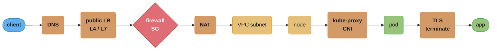
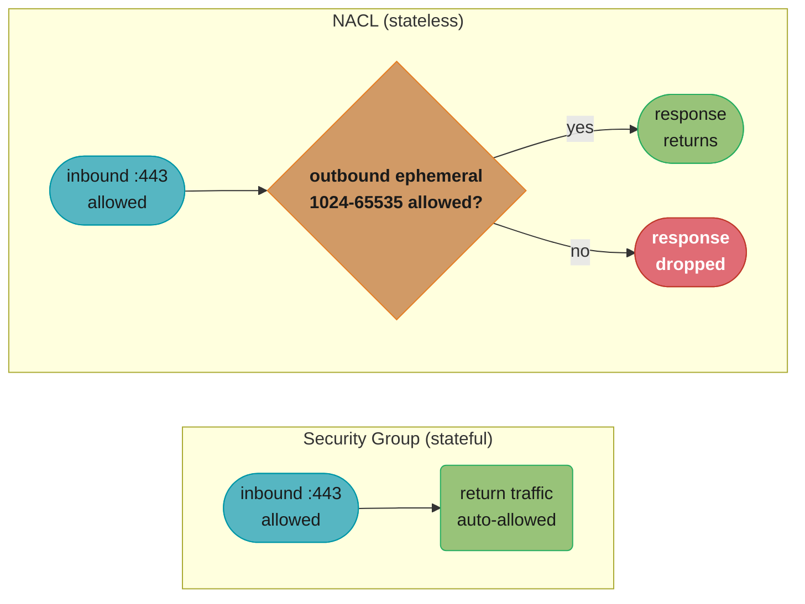
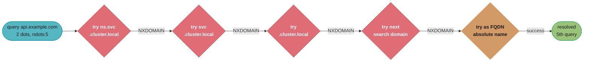
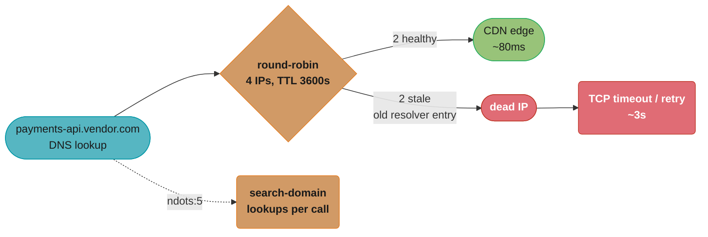

# Networking for DevOps

> Phase 1 — Foundations · Difficulty: Intermediate

Networking is where "it works locally" goes to die. DNS resolution, CIDR planning, NAT, firewall rules, load-balancer health checks, and TLS termination are the layers a DevOps engineer debugs daily. This module covers the operational networking knowledge that underpins VPCs, Kubernetes Services, ingress, and service mesh — focused on *what breaks and how to find it*.

> For the protocol theory (TCP handshake, congestion control, HTTP/2 vs 3), see [`../../backend/tcp_ip_deep_dive`](../../backend/tcp_ip_deep_dive/) and [`../../backend/osi_model_and_networking`](../../backend/osi_model_and_networking/). This module is the *operations* view.

---

## 1. Concept Overview

A packet's journey from client to your container crosses many layers DevOps owns:



Each arrow above is a place a request can silently die — a caching DNS answer, a firewall dropping the port, a NAT exhausting source ports — which is why hop-by-hop diagnosis (Section 6) walks this exact chain.

The operational primitives:
- **DNS** — name → IP resolution; the most common "intermittent" failure source.
- **CIDR / subnetting** — how you carve IP space; over/under-sizing a VPC subnet is a one-way door.
- **NAT** — private hosts reaching the internet via a gateway; SNAT/DNAT and port exhaustion.
- **Firewalls / Security Groups** — stateful allow/deny at instance and subnet level.
- **Load balancing** — L4 (transport, IP:port) vs L7 (application, HTTP-aware); health checks decide what's "in rotation".
- **TLS / mTLS** — encryption and identity; termination point matters for cost, latency, and security.

---

## 2. Intuition

> **One-line analogy**: Networking is the postal system — DNS is the address book, CIDR is how cities/streets are numbered, NAT is the mailroom that rewrites return addresses, firewalls are the security desk, and the load balancer is the receptionist routing visitors to whichever clerk is free.

**Mental model**: Every connection is a 4-tuple (src IP, src port, dst IP, dst port). Each hop may rewrite parts of it (NAT changes src; a load balancer changes dst), inspect it (firewall/SG), or terminate it (TLS, L7 LB). Debugging connectivity means asking, at each hop: *does the packet arrive, is it allowed, and does the return path exist?*

**Why it matters**: Roughly half of "the service is down" incidents are networking: a DNS TTL caching a dead endpoint, a security group missing a port, a health check failing so the LB pulls all targets, a NAT gateway exhausting source ports, an expired TLS cert. None show up in application logs.

**Key insight**: Connectivity is bidirectional. A request arriving doesn't mean the response can return. Asymmetric routing, missing egress rules, and stateful-vs-stateless firewall confusion cause "the request reaches the server but the client times out" — the single most confusing class of network bug.

---

## 3. Core Principles

1. **Name, then number.** Clients resolve DNS first; DNS caching/TTL governs how fast changes propagate.
2. **Plan CIDR for growth.** Subnet sizing and non-overlapping ranges across VPCs/clusters are decided up front and painful to change.
3. **Default deny, explicit allow.** Security groups and NetworkPolicies should allow only what's needed.
4. **Health checks are the source of truth for routing.** An LB only sends traffic to targets passing health checks; a bad check empties the pool.
5. **Terminate TLS deliberately.** Edge termination is simplest; end-to-end/mTLS is most secure; re-encrypt is the middle ground.
6. **Statefulness matters.** Security groups are stateful (return traffic auto-allowed); NACLs are stateless (you must allow both directions).

---

## 4. Types / Architectures / Strategies

### L4 vs L7 load balancing

| Dimension | L4 (e.g., AWS NLB) | L7 (e.g., AWS ALB) |
|-----------|--------------------|--------------------|
| Operates on | IP + port (TCP/UDP) | HTTP/HTTPS (paths, headers, host) |
| Routing | Connection-level | Content-based (path/host rules) |
| TLS | Pass-through or terminate | Terminate, inspect, re-encrypt |
| Latency | Lower (no parsing) | Slightly higher (parses HTTP) |
| Features | Raw speed, static IP, any protocol | Path routing, WAF, sticky sessions, redirects |
| Use | gRPC/TCP, ultra-low-latency, non-HTTP | Web APIs, microservice routing |

### TLS termination strategies

| Strategy | Where TLS ends | Pros | Cons |
|----------|----------------|------|------|
| Edge termination | At the LB | Simple, offloads CPU, central cert mgmt | Plaintext inside the network |
| Pass-through | At the backend | End-to-end encryption | LB can't inspect/route on content |
| Re-encryption | LB terminates, re-encrypts to backend | Inspect + encrypt internally | Double crypto cost |
| mTLS (mesh) | Both ends authenticate | Zero-trust identity | Cert lifecycle complexity |

The table's "Where TLS ends" column is really a question of *where the plaintext segment lives* — visualizing the same client-to-backend path for all four strategies makes that placement immediate:

```mermaid
flowchart TD
    classDef io      fill:#61afef,stroke:#2e86c1,color:#1a1a1a,font-weight:bold
    classDef frozen  fill:#c678dd,stroke:#9b59b6,color:#fff
    classDef train   fill:#98c379,stroke:#27ae60,color:#1a1a1a
    classDef mathOp  fill:#d19a66,stroke:#e67e22,color:#1a1a1a,font-weight:bold
    classDef lossN   fill:#e06c75,stroke:#c0392b,color:#fff,font-weight:bold
    classDef req     fill:#56b6c2,stroke:#0097a7,color:#1a1a1a
    classDef base    fill:#e5c07b,stroke:#f39c12,color:#1a1a1a

    subgraph edge["Edge termination"]
        direction LR
        c1(["client"]) -->|"TLS"| lb1("LB")
        lb1 -->|"plaintext"| be1[["backend"]]
    end

    subgraph pass["Pass-through"]
        direction LR
        c2(["client"]) -->|"TLS"| lb2("LB")
        lb2 -->|"TLS unmodified"| be2[["backend"]]
    end

    subgraph reenc["Re-encryption"]
        direction LR
        c3(["client"]) -->|"TLS"| lb3("LB")
        lb3 -->|"TLS re-encrypted"| be3[["backend"]]
    end

    subgraph mtls["mTLS mesh"]
        direction LR
        c4(["client"]) -->|"mTLS"| lb4("LB")
        lb4 -->|"mTLS"| be4[["backend"]]
    end

    class c1,c2,c3,c4 io
    class lb1,lb2,lb3,lb4 mathOp
    class be1 lossN
    class be2 frozen
    class be3 train
    class be4 base
```



Only edge termination leaves a plaintext hop (red) inside the network — every other strategy keeps the LB-to-backend leg encrypted, which is exactly the "plaintext inside the network" con called out in the table above.

### DNS record types you operate

| Record | Purpose |
|--------|---------|
| A / AAAA | Name → IPv4 / IPv6 |
| CNAME | Alias to another name |
| ALIAS / ANAME (cloud) | CNAME-like at the zone apex (points to ELB) |
| SRV | Service host+port (used by some discovery) |
| TXT | Verification, SPF, ACME challenges |
| NS / SOA | Delegation + zone authority |

---

## 5. Architecture Diagrams

Request path with edge TLS termination and L7 routing:

```mermaid
flowchart LR
    classDef io      fill:#61afef,stroke:#2e86c1,color:#1a1a1a,font-weight:bold
    classDef frozen  fill:#c678dd,stroke:#9b59b6,color:#fff
    classDef train   fill:#98c379,stroke:#27ae60,color:#1a1a1a
    classDef mathOp  fill:#d19a66,stroke:#e67e22,color:#1a1a1a,font-weight:bold
    classDef lossN   fill:#e06c75,stroke:#c0392b,color:#fff,font-weight:bold
    classDef req     fill:#56b6c2,stroke:#0097a7,color:#1a1a1a
    classDef base    fill:#e5c07b,stroke:#f39c12,color:#1a1a1a

    client(["client"]) -->|"DNS: api.example.com<br/>to 203.0.113.10 (ALIAS)<br/>TTL 60s"| alb("ALB L7<br/>terminates TLS")
    alb -->|"/v1/* to TG-A, /v2/* to TG-B<br/>health check /healthz 15s<br/>SG: 8080 from ALB only"| nodes("EC2 / EKS nodes<br/>private subnet")
    nodes -->|"kube-proxy / CNI<br/>routes to pod IP"| pod("pod")
    pod -->|"plaintext in VPC,<br/>or re-encrypt"| app(["app"])
    pod -.->|"egress"| nat("NAT gateway<br/>public subnet")
    nat -->|"SNAT to NAT's EIP,<br/>port pool is finite"| internet(["internet"])

    class client io
    class alb,nat mathOp
    class nodes base
    class pod,app train
    class internet frozen
```



The main request path (solid) ends at the pod; the NAT egress branch (dotted) is a separate flow whose source-port pool — finite per Section 6 — is what exhausts under heavy outbound volume.

---

## 6. How It Works — Detailed Mechanics

### CIDR math (the part interviews probe)

```
10.0.0.0/16   -> 65,536 addresses (10.0.0.0 - 10.0.255.255), mask 255.255.0.0
10.0.1.0/24   -> 256 addresses    (10.0.1.0 - 10.0.1.255)
10.0.1.0/28   -> 16 addresses     (usable fewer: network + broadcast + cloud-reserved)

# /N: the first N bits are the network; 32-N bits are host.
# addresses = 2^(32 - N).  AWS reserves 5 IPs per subnet (.0 .1 .2 .3 and .255).
```

A Kubernetes pitfall: pods need IPs from the VPC (with the AWS VPC CNI). A `/24` per subnet = 256 IPs ≈ ~250 pods. Large clusters exhaust subnet space fast — size for peak pod count, not node count.

### Diagnosing DNS

```bash
dig +short api.example.com            # the A/ALIAS answer
dig api.example.com | grep -A1 'ANSWER SECTION'   # TTL + record
dig @8.8.8.8 api.example.com          # bypass local resolver to test authoritative
# Inside Kubernetes:
kubectl exec pod -- nslookup my-svc.my-ns.svc.cluster.local
cat /etc/resolv.conf                  # search domains, ndots (the K8s ndots:5 trap)
```

### Tracing connectivity hop by hop

```bash
nc -zv db.internal 5432               # is the port open + reachable? (TCP)
ss -tlnp                              # what's listening locally + which PID
traceroute api.example.com            # where does the path die
curl -v https://api.example.com/      # TLS handshake + headers + timing
openssl s_client -connect api:443 -servername api.example.com </dev/null \
  | openssl x509 -noout -dates        # cert validity window (expiry!)
```

### NAT and source-port exhaustion

A NAT gateway SNATs many private hosts behind one public IP. Each outbound connection consumes a source port from the ~64K range *per destination 5-tuple*. Thousands of connections to the *same* external endpoint (e.g., one S3 region, one API) can exhaust ports, causing `connection timed out` on new egress while bandwidth is fine.

```bash
# Symptom: rising egress errors; CloudWatch ErrorPortAllocation > 0 on the NAT GW.
# Fix: VPC endpoints (PrivateLink) for AWS services to bypass NAT, or scale NAT/IPs.
```

### Stateful SG vs stateless NACL (the asymmetric-bug source)



This is exactly where the "request reaches the server but the client times out" bug (Q4) hides: a security group auto-allows the return leg, but a NACL silently drops it unless you add the explicit outbound ephemeral-port rule.

---

## 7. Real-World Examples

- **AWS ALB + ACM + Route 53**: the canonical web stack — Route 53 ALIAS to an ALB, ACM cert for edge TLS, path/host rules to target groups, health checks gating membership.
- **Kubernetes CoreDNS + `ndots:5`**: in-cluster DNS appends search domains; a non-FQDN lookup triggers up to 5 queries before the real one, causing latency — fixed by FQDNs or tuning `ndots`. (See [kubernetes_networking](../kubernetes_networking/).)
- **Cloudflare / CloudFront** at the edge for DNS, CDN, TLS, and DDoS protection before traffic reaches origin.
- **VPC endpoints (PrivateLink)** to reach S3/DynamoDB/ECR without traversing the NAT gateway — both a cost and a port-exhaustion fix.

The `ndots:5` amplification is easier to see than to describe: a 2-dot name is tried against every search domain, in order, before the real lookup ever fires.



Four wasted NXDOMAIN round trips (red) precede the one query that actually succeeds — the exact "several failed lookups before the real one" cost Q9 asks about, fixed by a trailing-dot FQDN that skips straight to the last node.

---

## 8. Tradeoffs

| Decision | Option A | Option B | Key factor |
|----------|----------|----------|-----------|
| LB layer | L4 (speed, any protocol) | L7 (content routing, WAF) | Need HTTP-aware routing? |
| TLS termination | Edge (simple, fast) | End-to-end/mTLS (secure) | Data sensitivity, compliance |
| Egress to AWS services | NAT gateway (simple) | VPC endpoint (cheaper, no port exhaustion) | Volume + cost |
| DNS TTL | Low (fast failover) | High (fewer queries, cheaper) | Failover speed vs query load |
| Subnet sizing | Large /16 (room) | Tight /24 (conservation) | Pod density, future growth |
| Firewall model | SG (stateful, simple) | NACL (stateless, subnet-wide) | Granularity vs simplicity |

---

## 9. When to Use / When NOT to Use

**Apply network reasoning when:** diagnosing intermittent connectivity, planning VPC/subnet layout, choosing LB type, debugging TLS/cert issues, or seeing "request arrives but client times out".

**Defer to platform defaults when:** a managed ingress controller and cloud LB already handle routing/health checks well; don't hand-build what the platform provides unless you have a specific need (e.g., non-HTTP protocols, special routing).

---

## 10. Common Pitfalls

**Pitfall 1 — Health check misconfigured; the LB drains the entire pool.**

```yaml
# BROKEN: health check hits "/" which requires auth -> returns 401 -> all targets "unhealthy"
# -> ALB has zero healthy targets -> 503 to every client, even though apps are fine.
HealthCheckPath: /
Matcher: 200
```

```yaml
# FIX: dedicated unauthenticated health endpoint that reflects real readiness.
HealthCheckPath: /healthz
Matcher: 200
HealthCheckIntervalSeconds: 15
HealthyThresholdCount: 2
UnhealthyThresholdCount: 3   # tolerate transient blips before draining
```

**Pitfall 2 — Expired TLS certificate.** Manual certs expire silently; the site goes hard-down at midnight UTC. FIX: automate issuance/renewal (ACM auto-renews; cert-manager + Let's Encrypt in Kubernetes) and **alert on days-to-expiry < 21**.

**Pitfall 3 — NACL asymmetry.** Someone adds a stateless NACL allowing inbound `:443` but forgets outbound on ephemeral ports; responses are dropped and connections hang with no log. FIX: prefer stateful security groups; if NACLs are required, always allow the ephemeral return range.

---

## 11. Technologies & Tools

| Tool | Purpose |
|------|---------|
| `dig` / `nslookup` | DNS resolution debugging |
| `ss` / `lsof -i` | Listening sockets, connection states |
| `nc` (netcat) | Port reachability test |
| `curl -v` / `httpie` | HTTP + TLS handshake inspection |
| `openssl s_client` | TLS cert/chain/expiry inspection |
| `traceroute` / `mtr` | Path discovery + loss/latency per hop |
| `tcpdump` / Wireshark | Packet capture (last resort, ground truth) |
| ACM / cert-manager | Automated TLS issuance + renewal |
| Route 53 / Cloud DNS | Managed DNS |
| AWS VPC Reachability Analyzer | Path "why is this blocked" analysis |

---

## 12. Interview Questions with Answers

**Q1: A service is intermittently unreachable. Walk through your diagnosis.**
Go hop by hop: `dig` the name (is DNS resolving, is the TTL caching a dead IP?), `nc -zv host port` (is the port reachable?), check the LB's healthy target count (is a failing health check draining the pool?), check security groups/NACLs (is the port and return path allowed?), and `curl -v`/`openssl s_client` for TLS/cert issues. "Intermittent" often means a load balancer with *some* unhealthy targets, or DNS round-robin including a dead endpoint.

**Q2: L4 vs L7 load balancer — when each?**
L4 (NLB) routes on IP:port, is protocol-agnostic, lowest latency, gives a static IP — use for gRPC/TCP, non-HTTP, or ultra-low-latency. L7 (ALB) parses HTTP, enabling path/host routing, header-based rules, WAF, redirects, and sticky sessions — use for web APIs and microservice routing. You often have both: NLB for raw ingress, L7 (ingress controller) inside.

**Q3: Explain CIDR `/24` vs `/16` and a Kubernetes implication.**
`/N` means N network bits, so `2^(32-N)` addresses: `/24` = 256, `/16` = 65,536. With the AWS VPC CNI, each pod takes a real subnet IP, so a `/24` subnet supports ~250 pods. Large clusters exhaust subnet space — you size subnets for peak pod count, and subnet sizing is hard to change later (a one-way door).

**Q4: Why does "the request reaches the server but the client times out"?**
Asymmetric connectivity: the inbound path is allowed but the return path isn't. Common causes — a stateless NACL allowing inbound but not outbound ephemeral ports, a missing egress rule, or asymmetric routing where responses take a path with no return route. Security groups avoid this because they're stateful (return traffic is auto-allowed).

**Q5: Stateful security group vs stateless NACL?**
A security group is stateful: allow inbound on a port and the response is automatically permitted. A NACL is stateless and subnet-wide: you must explicitly allow both inbound *and* the outbound ephemeral-port return traffic. NACLs are coarse-grained guardrails; SGs are the primary instance-level control.

**Q6: Where should you terminate TLS, and what are the tradeoffs?**
Edge termination (at the LB) is simplest, offloads crypto, and centralizes cert management, but traffic is plaintext inside the network. End-to-end/mTLS encrypts the whole path and provides identity (zero-trust) at the cost of cert lifecycle complexity. Re-encryption terminates at the edge for inspection/routing then re-encrypts to the backend — the compliance-friendly middle ground.

**Q7: What is NAT source-port exhaustion and how do you fix it?**
A NAT gateway SNATs many hosts behind one IP; each outbound connection to a given destination consumes a source port from ~64K. Thousands of connections to the *same* endpoint exhaust the pool, so new egress connections fail/time out while bandwidth is unused. Fixes: VPC endpoints (PrivateLink) to reach AWS services without NAT, connection pooling/reuse, or more NAT IPs.

**Q8: How does DNS TTL affect failover, and what's the tradeoff?**
TTL is how long resolvers cache a record. Low TTL (e.g., 30–60s) means failover/changes propagate quickly but generates more queries (and cost); high TTL reduces query load but means clients keep hitting a dead/old IP after a change. For failover-critical records, keep TTL low; for stable records, keep it higher.

**Q9: What's the `ndots:5` problem in Kubernetes?**
CoreDNS injects a `search` list and `ndots:5` into pod `/etc/resolv.conf`. A name with fewer than 5 dots and no trailing dot is tried against each search domain first, so `api.example.com` triggers several failed lookups (`api.example.com.ns.svc.cluster.local`, …) before the real one — adding latency and DNS load. Fix: use FQDNs (trailing dot) for external names or tune `ndots`.

**Q10: How do you debug a TLS handshake failure?**
`openssl s_client -connect host:443 -servername host` shows the presented chain, negotiated protocol/cipher, and validity dates; `openssl x509 -noout -dates` checks expiry. Common failures: expired cert, missing intermediate (incomplete chain), SNI mismatch (`-servername` matters), or protocol/cipher mismatch (old client vs TLS 1.3-only server).

**Q11: What does a health check actually control, and what's a safe configuration?**
The LB only routes to targets passing the health check; a failing check removes a target from rotation. A too-strict check (auth-required path, 1 failure = drain) can empty the whole pool and cause a self-inflicted outage. Safe config: a dedicated unauthenticated `/healthz` that reflects real readiness, a sane interval (10–15s), and an unhealthy threshold > 1 to tolerate transient blips.

**Q12: Why prefer VPC endpoints over routing AWS traffic through a NAT gateway?**
VPC endpoints (Gateway for S3/DynamoDB, Interface/PrivateLink for others) keep traffic on the AWS network without traversing the NAT gateway. Benefits: lower cost (NAT data-processing charges avoided), no source-port exhaustion against high-volume AWS endpoints, and traffic that never leaves the AWS backbone (security/compliance).

---

## 13. Best Practices

- Use a dedicated, unauthenticated `/healthz` for LB health checks; threshold > 1.
- Automate TLS (ACM / cert-manager); alert on `< 21 days` to expiry.
- Prefer stateful security groups; if NACLs are needed, allow return ephemeral ports.
- Size subnets for peak pod/host count up front; avoid overlapping CIDRs across VPCs you may peer.
- Use VPC endpoints for AWS-service egress to dodge NAT cost and port exhaustion.
- Keep failover-critical DNS TTLs low (30–60s); use FQDNs in clusters to dodge `ndots`.
- Default-deny egress where compliance requires; document every allow rule's purpose.

---

## 14. Case Study

### Scenario: Microservice latency spikes to seconds, intermittently, after a DNS change

A service calling an external payments API sees P99 latency jump from 80 ms to 3 s for ~30% of requests. App code, CPU, and memory are unchanged. The payments vendor migrated their endpoint behind a new CDN the day before.



Two of the four round-robin IPs are stale; every request that lands on one of them burns a full 3 s TCP timeout before it can retry — and `ndots:5` (dotted branch) piles on extra search-domain lookups for every single call, healthy or not.

**Diagnosis:**

```bash
dig payments-api.vendor.com               # TTL 3600, includes 2 dead IPs
kubectl exec caller -- nc -zv <dead-ip> 443   # times out
kubectl exec caller -- cat /etc/resolv.conf   # ndots:5, search list adds lookups
```

```python
# BROKEN: a new HTTP client per request -> fresh DNS lookup + connect each time,
# so every call rolls the dice on hitting a stale IP and pays full DNS cost.
import httpx
def charge(payload):
    return httpx.post("https://payments-api.vendor.com/charge", json=payload)  # new conn each call
```

```python
# FIX: reuse a pooled client (keep-alive avoids per-call reconnect + re-resolve),
# add an explicit timeout, and let connection reuse stick to healthy edges.
import httpx
_client = httpx.Client(
    base_url="https://payments-api.vendor.com",
    timeout=httpx.Timeout(2.0, connect=1.0),        # fail fast, don't hang 3s
    limits=httpx.Limits(max_keepalive_connections=50),
)
def charge(payload):
    return _client.post("/charge", json=payload)    # reuses warm conns to healthy IPs
```

Operationally, the team also lowered their resolver cache reliance, used FQDNs to kill the `ndots` amplification, and added a short connect timeout so a dead IP fails in 1 s and retries a healthy one instead of hanging.

**Outcome:** P99 returned to ~90 ms; the connect-timeout + pooling change capped worst-case at ~1.1 s even when a stale IP was hit, and connection reuse naturally favored the healthy edges.

**Discussion questions:**
1. Why did connection pooling reduce the chance of hitting a stale IP? (Warm connections stick to an already-resolved healthy edge.)
2. How would you have caught the stale-IP problem proactively? (Per-destination connect-error metrics, DNS-answer monitoring.)
3. What's the tradeoff of a 1 s connect timeout vs the default? (Faster failover vs risk of clipping a legitimately slow-but-healthy connect.)

---

**Cross-references:** [`../../backend/tcp_ip_deep_dive`](../../backend/tcp_ip_deep_dive/) (handshake, TIME_WAIT), [`../../backend/osi_model_and_networking`](../../backend/osi_model_and_networking/) (layer theory), [kubernetes_networking](../kubernetes_networking/) (CNI, CoreDNS, Services), [cloud_networking_and_cdn](../cloud_networking_and_cdn/) (VPC, PrivateLink, CDN), [secrets_management](../secrets_management/) (TLS cert storage).
