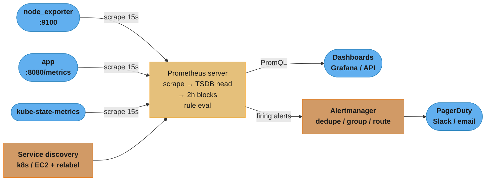
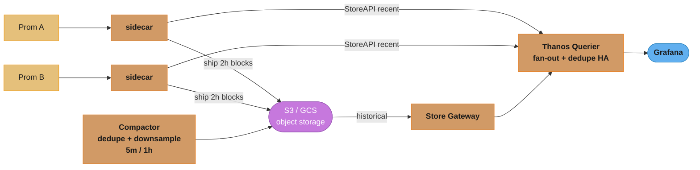
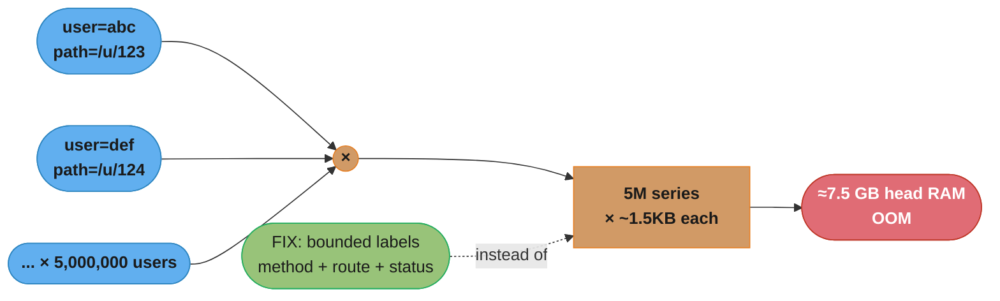
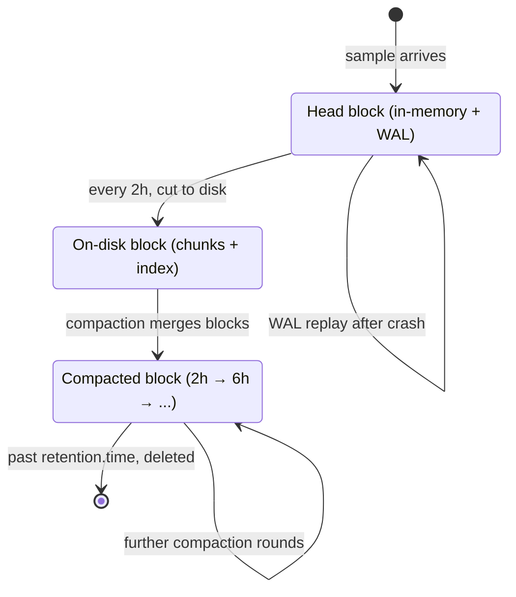
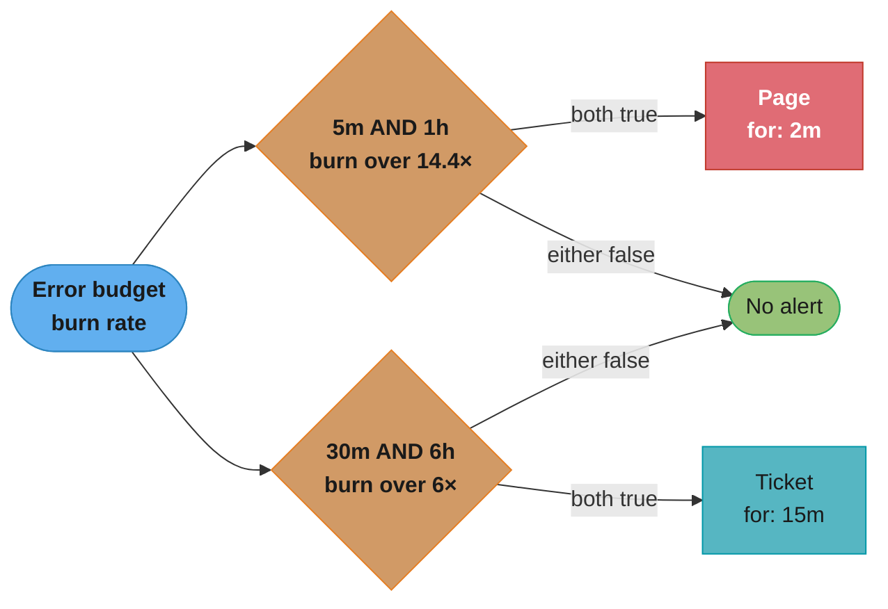
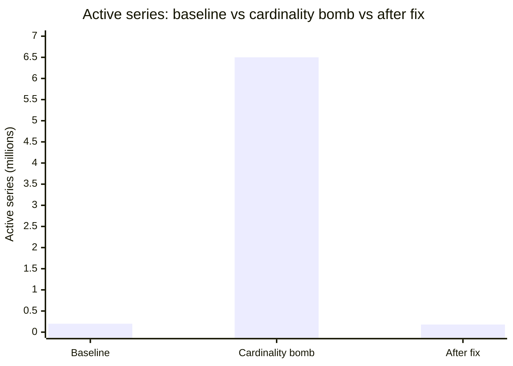

# Metrics & Prometheus

> Phase 6 — Observability & SRE · Difficulty: Advanced

Prometheus is a **pull-based, time-series monitoring system** built around a multi-dimensional data model (metric name + key/value labels), a local TSDB, and a query language (PromQL) for slicing and aggregating that data. It scrapes HTTP `/metrics` endpoints on a fixed interval (default 15s), stores samples locally in 2-hour blocks, evaluates recording and alerting rules, and pushes firing alerts to Alertmanager. It is the de-facto standard for metrics in the cloud-native ecosystem and the metrics backend behind nearly every Kubernetes deployment.

---

## 1. Concept Overview

Prometheus collects **metrics** — numeric measurements sampled over time. A single metric is a *time series*: a stream of `(timestamp, float64)` samples uniquely identified by a metric name and a set of labels, e.g. `http_requests_total{method="GET", path="/api", status="200"}`. Each distinct combination of labels is a separate series; the product of label cardinalities is the dominant driver of memory and cost.

The architecture is deliberately simple and pull-based:

1. **Targets** expose metrics over HTTP at `/metrics` in a text exposition format (client libraries or **exporters** generate this).
2. **Prometheus server** scrapes each target on its `scrape_interval` (default 15s), appends samples to its local TSDB (a `head` block in memory flushed to 2-hour blocks on disk).
3. **Recording rules** precompute expensive expressions on a schedule; **alerting rules** evaluate conditions and emit alerts.
4. **Alertmanager** deduplicates, groups, silences, and routes alerts to receivers (PagerDuty, Slack, email).
5. **PromQL** queries the TSDB ad hoc (Grafana, API) or from rules.

Four metric types: **Counter** (monotonic, only goes up — request counts, errors), **Gauge** (goes up/down — memory, queue depth, temperature), **Histogram** (bucketed observations — latency, emitted as `_bucket`, `_sum`, `_count`), and **Summary** (client-side quantiles — `_sum`, `_count`, plus pre-computed `quantile` labels). Histograms are aggregatable across instances (you can compute a fleet-wide p99); summaries are not (quantiles cannot be averaged).

Prometheus is intentionally **not** a long-term, globally-aggregated, infinitely-scalable store. Single-node retention is bounded by local disk (commonly 15d–90d), and there is no native cross-cluster aggregation or HA dedup. That gap is filled by **Thanos**, **Cortex**, and **Grafana Mimir** — systems that sit alongside Prometheus to provide long-term object-storage retention, global query views, and horizontal scale.

---

## 2. Intuition

> **One-line analogy**: Prometheus is a relentless census taker. Every 15 seconds it knocks on each service's door (`GET /metrics`), writes down the current tallies in a ledger indexed by who-and-what (labels), and keeps the running history so you can later ask "how fast was the error count rising across the whole city at 3am?"

**Mental model**: Think of one giant table where every row is a `(metric, labels, timestamp, value)` sample. A "series" is all rows sharing the same metric+label set. PromQL is SQL-ish over that table but time-aware: `rate()` differentiates counters over a window, aggregation operators (`sum`, `avg`, `by`) collapse the label dimensions you don't care about. Cardinality — the number of distinct series — is the table's row-group count and the thing that blows up your memory.

**Why it matters**: Metrics are the cheapest, highest-fidelity signal for "is the system healthy and how is it trending." Unlike logs (expensive, per-event) or traces (per-request), a metric is a constant-cost aggregate you can keep at high resolution for months and alert on in real time. Almost every SLO, dashboard, and burn-rate alert in this phase is ultimately a PromQL query (see [sre_principles_and_slos](../sre_principles_and_slos/)).

**Key insight**: The single most important operational decision in Prometheus is **what you put in a label**. A label like `user_id` or `request_id` turns one series into millions, and Prometheus holds the head block in memory — high cardinality is the number-one way to OOM a Prometheus server. Labels are for *bounded, low-cardinality dimensions you want to group/filter by*, never for unbounded identifiers.

---

## 3. Core Principles

1. **Pull, not push.** Prometheus scrapes targets; this makes target health observable (`up` metric), simplifies the targets, and centralizes scrape config. Short-lived jobs use the Pushgateway as an exception, not the rule.
2. **Multi-dimensional data model.** A metric name plus labels; you slice and aggregate by label, not by parsing strings.
3. **Cardinality is the budget.** Memory ~ active series; each series costs roughly 1–2 KB of RAM in the head plus per-sample chunk storage. Keep labels bounded.
4. **Counters + `rate()`, not deltas.** Store monotonic counters; compute rates at query time. Counters survive restarts via reset detection in `rate()`/`increase()`.
5. **Recording rules precompute; alerting rules evaluate.** Move expensive/repeated PromQL into recording rules; alert on the cheap precomputed series.
6. **Local-first, then federate/remote-write.** A single Prometheus owns scraping; long-term and global views come from Thanos/Mimir/Cortex via remote-write or sidecar.
7. **Histograms over summaries** when you need fleet-wide aggregatable quantiles.

---

## 4. Types / Architectures / Strategies

### Metric types

| Type | Goes | Use for | Exposition |
|------|------|---------|------------|
| Counter | Up only (resets to 0 on restart) | requests, errors, bytes | `name_total` |
| Gauge | Up and down | memory, queue depth, temperature | `name` |
| Histogram | Bucketed observations | latency, response size | `name_bucket{le}`, `name_sum`, `name_count` |
| Summary | Client-side quantiles | latency when you can't aggregate | `name{quantile}`, `name_sum`, `name_count` |

### Collection strategies

| Strategy | When | Notes |
|----------|------|-------|
| Direct instrumentation | Your own service | Client library exposes `/metrics` (see [../../backend/observability_and_monitoring](../../backend/observability_and_monitoring)) |
| Exporter | Third-party system you can't modify | node_exporter, kube-state-metrics, blackbox_exporter, mysqld_exporter |
| Pushgateway | Short-lived batch jobs | Job pushes before exit; Prometheus scrapes the gateway. Anti-pattern for long-lived services |
| Service discovery | Dynamic targets | Kubernetes SD, EC2 SD, Consul SD; relabeling selects/labels targets |

### Scaling architectures

| Architecture | Solves | Mechanism |
|--------------|--------|-----------|
| Single Prometheus | Small/medium | Local TSDB, bounded retention |
| Functional sharding | Too many targets | Split scrape config across N Prometheus instances by job/team |
| Federation | Cross-Prometheus aggregates | A "global" Prometheus scrapes aggregated series from leaf Prometheis |
| Thanos | Long-term + global query + HA dedup | Sidecar ships TSDB blocks to object storage; Querier fans out; Compactor downsamples |
| Cortex / Mimir | Horizontally scalable multi-tenant | Prometheus `remote_write` into a clustered ingest/query backend |

---

## 5. Architecture Diagrams

**Prometheus core scrape + alert flow**



Targets expose `/metrics`; Prometheus scrapes them every 15s (default `scrape_interval`) directly or via service discovery, evaluates rules, and routes firing alerts to Alertmanager while PromQL serves dashboards straight from the TSDB.

**Thanos long-term + global view (HA + object storage)**



Each Prometheus ships 2h blocks to S3/GCS through a sidecar; the Compactor dedupes and downsamples them (5m/1h), and the Thanos Querier fans out across sidecars (recent data via StoreAPI) and the Store Gateway (historical data from S3) while deduping the HA replica pair before Grafana queries it.

**Cardinality explosion — the core failure mode**



Every unique label combination is a new series: 5M distinct `{path,user}` pairs at ~1.5KB each blow up to ~7.5 GB of head RAM and OOM-kill the server; the fix is dropping unbounded ID labels and keeping only bounded dimensions like `method`/`route_template`/`status`.

### Decoding the cardinality arithmetic

The explosion is not addition, it is a product — and that is the whole reason it surprises people:

```
  series  =  card(label_1) x card(label_2) x ... x card(label_n) x instances
  head RAM  ~=  series x 1.5 KB
```

**What the formula is telling you.** "Adding a label does not add series, it multiplies them — and RAM tracks the series count, not the traffic." A metric's memory cost is therefore set entirely by how many distinct *values* its labels can take, and is completely unrelated to how many requests per second flow through it.

| Symbol | What it is |
|--------|------------|
| `card(label)` | Cardinality: how many distinct values that one label can ever take |
| `instances` | Scrape targets exposing the metric; every pod multiplies the series count again |
| `series` | Distinct `(metric, label-set)` combinations — the thing Prometheus holds in the head |
| `~1.5 KB` | Per-series head-block overhead (labels, index entries, open chunk), not per sample |

**Walk one example.** A single `http_requests_total`, first bounded, then with one ID label added:

```
  BOUNDED labels only
    method   5  (GET POST PUT PATCH DELETE)
    route  200  (templated: /orders/:id/items/:item)
    status   6  (2xx 3xx 4xx 5xx classes + 2 specials)
    pods    20
    series  =  5 x 200 x 6 x 20            =    120,000
    head    =  120000 x 1.5 KB             =    ~180 MB      comfortable

  ADD ONE unbounded label: user_id, 5,000 active users
    series  =  120000 x 5000               = 600,000,000
    head    =  6e8 x 1.5 KB                =    ~900 GB      impossible
```

Note that `user_id` did not need millions of values to be fatal — 5,000 was enough, because it multiplied an already-120,000-series metric. This is why the rule is "bounded dimensions only" rather than "keep cardinality small": there is no safe size for an unbounded label, only a delay before it kills the server.

The reverse direction sizes hardware. The §6 note that 1M active series needs ~1.5 GB of head is the same equation solved for RAM, and the case study in §14 measures `11 GB / 6.5M series = ~1.69 KB per series` in practice — the 1.5 KB estimate plus WAL and query overhead. Budget RAM from `prometheus_tsdb_head_series`, never from request volume.

---

## 6. How It Works — Detailed Mechanics

### Scrape configuration

```yaml
# prometheus.yml
global:
  scrape_interval: 15s          # default; how often to pull each target
  scrape_timeout: 10s           # must be < scrape_interval
  evaluation_interval: 15s      # how often rules run

scrape_configs:
  - job_name: node
    static_configs:
      - targets: ['10.0.1.4:9100', '10.0.1.5:9100']

  - job_name: kubernetes-pods
    kubernetes_sd_configs:
      - role: pod
    relabel_configs:
      # only scrape pods that opt in via annotation
      - source_labels: [__meta_kubernetes_pod_annotation_prometheus_io_scrape]
        action: keep
        regex: "true"
      # use the annotated port
      - source_labels: [__address__, __meta_kubernetes_pod_annotation_prometheus_io_port]
        action: replace
        regex: ([^:]+)(?::\d+)?;(\d+)
        replacement: $1:$2
        target_label: __address__
      # copy the namespace into a label
      - source_labels: [__meta_kubernetes_namespace]
        target_label: namespace
      # DROP a high-cardinality label before ingest (cost control)
      - regex: pod_template_hash
        action: labeldrop

rule_files:
  - /etc/prometheus/rules/*.yml

alerting:
  alertmanagers:
    - static_configs:
        - targets: ['alertmanager:9093']
```

`relabel_configs` runs *before* scrape (target selection/rewriting); `metric_relabel_configs` runs *after* scrape (drop noisy series). Both are the primary cardinality-control levers.

### The TSDB lifecycle



A sample lands in the in-memory head block (backed by a WAL for crash recovery), gets cut to an immutable on-disk block every 2 hours, is progressively compacted into larger blocks, and is finally deleted once it ages past `--storage.tsdb.retention.time`.

Rough sizing: bytes/sample ≈ 1–2 bytes after compression; a series at 15s = 5,760 samples/day. Head RAM ≈ `active_series * ~1.5KB`. So 1M active series ≈ ~1.5 GB head plus query/WAL overhead — plan RAM around series count, not sample count.

**In plain terms.** "RAM is priced per series; disk is priced per series *per scrape*." Two different multipliers on the same series count, which is why the same cardinality decision that OOMs the head also quietly triples your retention bill:

```
  samples/day  =  active_series x (86400 / scrape_interval)
  disk/day     =  samples/day x bytes_per_sample
  head RAM     =  active_series x ~1.5 KB          (independent of scrape_interval)
```

| Symbol | What it is |
|--------|------------|
| `86400 / scrape_interval` | Samples one series produces per day — 5,760 at the default 15s |
| `bytes_per_sample` | Post-compression cost on disk, 1–2 bytes thanks to delta-of-delta + XOR encoding |
| `active_series` | Series receiving samples right now — the driver of both RAM and disk |
| `retention.time` | Days kept before blocks are deleted; multiplies disk, never RAM |

**Walk one example.** 1M active series at the default 15s scrape, 15-day retention:

```
  samples/day  =  1,000,000 x (86400 / 15)  =  1,000,000 x 5,760  =  5.76 billion

  disk/day  at 1.0 B/sample   =  5.76 GB/day    ->  86.4 GB over 15 days
  disk/day  at 1.5 B/sample   =  8.64 GB/day    -> 129.6 GB over 15 days
  disk/day  at 2.0 B/sample   = 11.52 GB/day    -> 172.8 GB over 15 days

  head RAM  =  1,000,000 x 1.5 KB              =  ~1.5 GB   (scrape interval irrelevant)

  halve the scrape rate to 30s: 2,880 samples/day/series -> 4.32 GB/day, RAM UNCHANGED
```

That last line is the practical lever and the common misconception in one place. Scraping less often halves your disk but does nothing for the memory pressure that actually kills Prometheus — only cutting series count does that. Conversely, chasing a cardinality reduction to save disk under-sells the win: it is the one change that helps both terms at once.

### Counters and `rate()` — the reset-safe pattern

```promql
# BROKEN: a raw counter is meaningless to alert on — it only grows.
http_requests_total{status=~"5.."}   # 4,201,883 ... so what?

# RIGHT: per-second rate over a 5m window; rate() auto-corrects counter resets.
rate(http_requests_total{status=~"5.."}[5m])

# error ratio (the SLI numerator/denominator pattern)
sum(rate(http_requests_total{status=~"5.."}[5m]))
  /
sum(rate(http_requests_total[5m]))
```

`rate()` for fast-moving counters and graphs; `increase()` for "how many in this window"; `irate()` only for high-resolution graphs of volatile counters (it uses the last two points and is noisy for alerts).

**Put simply.** "`rate()` draws a straight line through every sample in the window and reports its slope per second; `increase()` reports the same slope multiplied back out over the window." They are one function with two units, which is why `increase(x[5m])` always equals `rate(x[5m]) * 300`.

| Symbol | What it is |
|--------|------------|
| `[5m]` | The range window: how far back the query looks for samples to fit |
| `scrape_interval` | How often a new sample lands — 15s in the config above |
| Samples in window | `window / scrape_interval`; below 2 the function returns nothing at all |
| Reset correction | `rate()` treats any drop in a counter as a restart and adds the pre-drop value back |

**Walk one example.** Why the window is `[5m]` and not `[30s]`, given a 15s scrape:

```
  samples available  =  window / scrape_interval

    [30s] / 15s  =   2 samples   <- the bare minimum; ONE missed scrape leaves 1 -> no data
    [60s] / 15s  =   4 samples   <- the "4x rule" floor: survives a single missed scrape
    [5m]  / 15s  =  20 samples   <- 18 can be lost before the query goes blind

  the 4x rule:  window >= 4 x scrape_interval  ->  4 x 15s = 60s minimum
```

The `[5m]` in every example above is that floor with generous margin. A window at or near `2 x scrape_interval` produces an alert that silently evaluates to empty whenever a scrape times out — and an alert expression returning no data does not fire, so the failure mode is a *missing* page rather than a false one. Widen the window rather than tighten it, and remember the cost: a 5m window also smooths the spike you are trying to catch, which is exactly why the burn-rate alerts below pair a short window with a long one.

### Histogram quantiles

```promql
# p99 request latency from a histogram, aggregated across all instances.
# This is why histograms beat summaries: buckets ARE aggregatable.
histogram_quantile(
  0.99,
  sum by (le) (rate(http_request_duration_seconds_bucket[5m]))
)

# per-route p95
histogram_quantile(
  0.95,
  sum by (le, route) (rate(http_request_duration_seconds_bucket[5m]))
)
```

Define buckets to straddle your SLO threshold (e.g. for a 300ms p99 target, include `le="0.3"`); `histogram_quantile` linearly interpolates within a bucket, so a coarse bucket near the target gives an inaccurate quantile.

**Read it as follows.** "Find which bucket the 99th-percentile request falls into, then guess where inside that bucket it sits by assuming the requests are spread evenly across it." Prometheus never stores a latency value — only counts per bucket — so every quantile it reports is that guess, and the guess is only as good as the bucket boundaries you chose:

```
  rank      =  q x count(+Inf)
  estimate  =  le_lower  +  (le_upper - le_lower) x (rank - cum_lower)
                                                    -------------------
                                                    (cum_upper - cum_lower)
```

| Symbol | What it is |
|--------|------------|
| `le` | "less than or equal to" — a bucket's upper bound; buckets are cumulative, not disjoint |
| `count(+Inf)` | The top cumulative bucket, i.e. every observation — the denominator for the rank |
| `rank` | Which observation, by position, marks the quantile you asked for |
| `cum_lower` / `cum_upper` | Cumulative counts at the boundaries the rank falls between |

**Walk one example.** 10,000 requests, the same p99 query, two different bucket layouts:

```
  WELL-SIZED buckets: le = 0.1, 0.3, 0.5, 1.0, +Inf
    cumulative counts   8000, 9500, 9800, 9950, 10000
    rank      = 0.99 x 10000                          =  9900
    9800 < 9900 <= 9950  ->  lands in bucket (0.5, 1.0]
    estimate  = 0.5 + (1.0 - 0.5) x (9900-9800)/(9950-9800)
              = 0.5 + 0.5 x (100 / 150)               =  0.833 s

  COARSE buckets: le = 0.1, 1.0, +Inf   (same underlying requests)
    cumulative counts   8000, 9950, 10000
    rank      = 9900
    8000 < 9900 <= 9950  ->  lands in bucket (0.1, 1.0]
    estimate  = 0.1 + (1.0 - 0.1) x (9900-8000)/(9950-8000)
              = 0.1 + 0.9 x (1900 / 1950)             =  0.977 s

  same traffic, 17.2% different answer -- decided purely by bucket layout
```

Nothing about the requests changed between those two blocks; only the boundaries did. The interpolation assumes a uniform spread inside the bucket, and real latency inside a wide bucket is anything but uniform — so a 0.9-second-wide bucket makes the "p99" an artifact of the layout. Two practical consequences: put an `le` exactly on your SLO threshold so the question "what fraction is under 300ms?" is answered by a stored count rather than a guess, and keep bucket sets identical across instances, since `sum by (le)` silently produces nonsense when one pod uses different boundaries.

### Recording rules (precompute) and alerting rules (evaluate)

```yaml
# rules/recording.yml — compute once, reuse everywhere (dashboards + alerts)
groups:
  - name: api-aggregations
    interval: 30s
    rules:
      - record: job:http_requests:rate5m
        expr: sum by (job) (rate(http_requests_total[5m]))
      - record: job:http_errors:ratio5m
        expr: |
          sum by (job) (rate(http_requests_total{status=~"5.."}[5m]))
            /
          sum by (job) (rate(http_requests_total[5m]))
```

```yaml
# rules/alerting.yml — alert on the cheap precomputed series
groups:
  - name: api-alerts
    rules:
      - alert: HighErrorRate
        expr: job:http_errors:ratio5m{job="api"} > 0.05   # >5% errors
        for: 10m                                            # sustained, avoids flapping
        labels: {severity: page}
        annotations:
          summary: "API error ratio {{ $value | humanizePercentage }} (>5%)"
          runbook: "https://runbooks/api-high-error-rate"
```

`for:` requires the condition to hold continuously before firing — the standard de-flapping mechanism. Recording-rule naming convention: `level:metric:operation` (e.g. `job:http_errors:ratio5m`).

### Multi-window, multi-burn-rate SLO alert (the production pattern)

```yaml
# Page fast on a severe burn (14.4x over 1h), confirmed on a 5m window;
# ticket on a slower sustained burn (6x over 6h), confirmed on 30m.
# Burn rate = (errors / total) / (1 - SLO). 14.4x burns a 30-day budget in ~2 days at sustained.
groups:
  - name: slo-burn
    rules:
      - alert: ErrorBudgetBurnFast
        expr: |
          (job:http_errors:ratio5m{job="api"} > (14.4 * 0.001))
          and
          (job:http_errors:ratio:rate1h{job="api"} > (14.4 * 0.001))
        for: 2m
        labels: {severity: page}
      - alert: ErrorBudgetBurnSlow
        expr: |
          (job:http_errors:ratio:rate30m{job="api"} > (6 * 0.001))
          and
          (job:http_errors:ratio:rate6h{job="api"} > (6 * 0.001))
        for: 15m
        labels: {severity: ticket}
```

Both checks below are independent AND-gates across a short and a long window; the picture makes that pairing click faster than the YAML alone.



Here SLO = 99.9% so the budget is `1 - 0.999 = 0.001`. Multi-window pairing (short + long) avoids both flapping (short-only) and slow detection (long-only). See burn-rate math in [sre_principles_and_slos](../sre_principles_and_slos/) and routing in [visualization_and_alerting](../visualization_and_alerting/).

**Stated plainly.** "Burn rate 1 means you will spend your entire error budget exactly at the end of the period; burn rate 14.4 means you will spend it 14.4 times faster than that." It converts an error ratio into a deadline, which is what makes the same alert work for a 99.9% and a 99.99% service without retuning thresholds.

```
  burn_rate  =  observed error ratio  /  (1 - SLO)
  budget consumed in a window  =  burn_rate x (window / period)
```

| Symbol | What it is |
|--------|------------|
| `1 - SLO` | The error budget as a ratio — 0.001 for a 99.9% target |
| `burn_rate` | Multiple of the sustainable error rate you are currently running at |
| `period` | The SLO window the budget is defined over — 30 days = 720 hours here |
| `window` | The range the alert measures over (`1h`, `6h`) — the alert's reaction time |

**Walk one example.** Where 14.4 and 6 actually come from, and what they mean in error-rate terms:

```
  period = 30 days = 720 h,  budget = 0.001 (99.9% SLO)

  FAST page: "burn 2% of the budget in 1 hour"
    burn = 0.02 x 720 / 1        =  14.4
    error ratio to trip it       =  14.4 x 0.001  =  0.0144  =  1.44% errors
    time to exhaust at that rate =  720 / 14.4    =  50 h    =  ~2.1 days

  SLOW ticket: "burn 5% of the budget in 6 hours"
    burn = 0.05 x 720 / 6        =  6.0
    error ratio to trip it       =  6.0 x 0.001   =  0.006   =  0.6% errors
    time to exhaust at that rate =  720 / 6       =  120 h   =  5 days

  reference:  burn = 1.0  ->  720 / 1  =  720 h  =  exactly 30 days (by definition)
```

Note that neither number is a latency or an error count — they are both *deadlines*, which is why 14.4 pages and 6 only tickets. A 1.44% error rate leaves you ~2 days from a blown budget and warrants waking someone; 0.6% leaves five days and can wait for business hours. The comment in the YAML above ("14.4x burns a 30-day budget in ~2 days") is that `720 / 14.4 = 50 h` line, and the AND-pairing exists because a 1-hour window alone would fire on any brief 1.44% blip that the long window proves was not sustained.

---

## 7. Real-World Examples

- **Kubernetes monitoring stack (kube-prometheus-stack)**: node_exporter (host metrics), kube-state-metrics (object state: deployments, pods, replicas), cAdvisor (container CPU/memory), and the Prometheus Operator wiring `ServiceMonitor`/`PodMonitor` CRDs to scrape config. This is the default observability install on most clusters.
- **SoundCloud / origin**: Prometheus was built at SoundCloud to monitor a microservices fleet where push-based, host-centric tools (Nagios-era) couldn't model dynamic, dimensional service metrics.
- **Cloudflare**: runs Prometheus at massive scale with functional sharding and long-term storage, and authored tooling for cardinality analysis (`pint` for rule linting).
- **Grafana Labs**: built Mimir (Cortex-derived) to back Grafana Cloud's metrics, ingesting tens of millions of active series per tenant via Prometheus `remote_write`.
- **Thanos at scale**: organizations with many clusters run a Prometheus per cluster with a Thanos sidecar shipping to S3, and a global Thanos Querier giving a single pane across all clusters with 1+ year retention via downsampling.

---

## 8. Tradeoffs

| Decision | Option A | Option B | Key factor |
|----------|----------|----------|-----------|
| Collection | Pull (scrape) | Push (Pushgateway/remote) | Target health visibility vs short-lived jobs |
| Latency metric | Histogram | Summary | Fleet-wide aggregatable quantiles vs cheaper per-instance |
| Long-term storage | Local retention only | Thanos/Mimir/Cortex | Simplicity vs months/years + global view |
| Scale-out | Federation | Remote-write to Cortex/Mimir | Simple aggregates vs full horizontal scale |
| Query cost | Ad-hoc PromQL | Recording rules | Flexibility vs precomputed speed |
| Cardinality | Rich labels | Bounded labels | Query power vs RAM/cost |
| HA | Two identical Prometheis | Single + remote backup | Dedup complexity (Thanos) vs simplicity |

---

## 9. When to Use / When NOT to Use

**Use Prometheus when:** you need metrics for cloud-native/Kubernetes workloads, real-time alerting, SLO tracking, and dashboards; you want a dimensional model and a powerful query language; and your data is numeric aggregates (rates, gauges, latencies). It's the default and integrates with virtually everything.

**Reconsider / pair with something else when:** you need long-term retention or global multi-cluster views (add Thanos/Mimir/Cortex — Prometheus alone is local and bounded); you need per-event/high-cardinality analytics like per-request tracing (use tracing — [observability_tracing_and_otel](../observability_tracing_and_otel/)) or log search ([observability_logging](../observability_logging/)); you need exact event counts with no scrape-interval gaps (metrics are sampled); or you're billing/auditing where every event must be captured losslessly (use logs/events). Prometheus is for *aggregates over time*, not a record of every individual event.

---

## 10. Common Pitfalls

**Pitfall 1 — High-cardinality labels (the canonical Prometheus outage).**

```promql
# BROKEN: unbounded labels create one series per unique value -> millions of series -> OOM.
http_requests_total{user_id="u-8f3a", request_id="r-91c2", path="/orders/8842/items/5"}
#  -> user_id (5M) x request_id (unbounded) x path-with-ids (unbounded) = explosion
#  Prometheus holds the head block in RAM; this OOM-kills the server and loses recent data.
```

```yaml
# FIX 1: never put unbounded IDs in labels. Use a bounded route TEMPLATE.
http_requests_total{method="GET", route="/orders/:id/items/:item", status="200"}

# FIX 2: drop offending labels at ingest with metric_relabel_configs.
metric_relabel_configs:
  - source_labels: [__name__]
    regex: http_requests_total
    action: keep
  - regex: (user_id|request_id)
    action: labeldrop
```

(Per-request identifiers belong in traces/logs, not metrics — see [observability_tracing_and_otel](../observability_tracing_and_otel/).)

**Pitfall 2 — Alerting on a raw counter or using `irate` for alerts.** A counter only increases, so `http_errors_total > 100` fires forever once crossed; and `irate` over a 5m alert window is noisy/flappy. FIX: alert on `rate(...[5m])` (or a recording rule) with a `for:` clause for sustained-condition de-flapping.

**Pitfall 3 — Pushgateway for long-lived services.** Pushing from a long-running service breaks target-health semantics (`up` is meaningless), keeps stale series alive forever (no automatic expiry), and centralizes a SPOF. FIX: scrape long-lived services directly; reserve Pushgateway strictly for short-lived batch jobs and delete the group on completion.

**Pitfall 4 — Mismatched histogram buckets.** Default buckets that don't straddle your SLO threshold make `histogram_quantile` interpolate across a too-wide bucket, so your "p99" is fiction. FIX: choose buckets around your target (`le="0.1","0.3","0.5","1"` for a 300ms SLO) and keep bucket sets consistent across instances so `sum by (le)` is valid.

---

## 11. Technologies & Tools

| Tool | Purpose |
|------|---------|
| Prometheus | Pull-based metrics server, TSDB, PromQL, rule eval |
| Alertmanager | Dedupe/group/route alerts (see [visualization_and_alerting](../visualization_and_alerting/)) |
| node_exporter | Host metrics (CPU, memory, disk, network) |
| kube-state-metrics | Kubernetes object state (deployments, pods, replicas) |
| cAdvisor | Per-container resource usage |
| blackbox_exporter | Probe endpoints (HTTP/TCP/ICMP/DNS) for SLO synthetics |
| Pushgateway | Metrics for short-lived batch jobs |
| Prometheus Operator | ServiceMonitor/PodMonitor CRDs on Kubernetes |
| Thanos | Long-term object storage, global query, HA dedup, downsampling |
| Grafana Mimir / Cortex | Horizontally scalable, multi-tenant remote-write backend |
| pint / promtool | Rule linting, cardinality checks, config validation |
| Grafana | Dashboards over PromQL (see [visualization_and_alerting](../visualization_and_alerting/)) |
| OpenMetrics | Standardized exposition format (CNCF) |

---

## 12. Interview Questions with Answers

**Q1: Why is Prometheus pull-based instead of push-based, and when do you push?**
Prometheus scrapes targets so it can observe target health directly (the synthetic `up` metric is 0 when a scrape fails), keep scrape configuration centralized, and avoid every target needing to know where to send data. Push makes sense only for short-lived jobs that exit before a scrape can reach them — those use the Pushgateway, which Prometheus then scrapes. Use pull for everything long-lived; reserve push for batch jobs.

**Q2: What is cardinality and why does it dominate Prometheus capacity planning?**
Cardinality is the number of distinct time series, which equals the product of label-value combinations for each metric. Prometheus keeps the active series index and head block in memory (roughly 1–2 KB per series), so a label like `user_id` with 5M values creates 5M series and OOM-kills the server. You plan RAM around active series count and aggressively keep labels bounded; per-request identifiers go to traces/logs, not labels.

**Q3: Explain counter vs gauge vs histogram vs summary.**
A counter only increases and resets to zero on restart (requests, errors) — you query its `rate()`. A gauge moves up and down (memory, queue depth). A histogram buckets observations and exposes `_bucket`/`_sum`/`_count`, letting you compute aggregatable quantiles across instances with `histogram_quantile`. A summary computes quantiles client-side, which are cheaper but cannot be aggregated across instances (you can't average percentiles) — prefer histograms for fleet-wide latency.

**Q4: Why use `rate()` on counters, and how does it handle restarts?**
`rate(counter[5m])` computes the per-second average increase over the window, turning a meaningless monotonic value into a trend you can graph and alert on. It automatically detects counter resets (a value dropping to a lower number implies a process restart) and corrects for them, so a service restart doesn't show as a huge negative spike. Use `rate` for alerts/graphs, `increase` for "how many in this window," and avoid `irate` for alerts because it's noisy.

**Q5: What's the difference between recording rules and alerting rules?**
Recording rules precompute a PromQL expression on a schedule and store the result as a new series (named `level:metric:operation`), so expensive queries reused across dashboards and alerts run once instead of per-query. Alerting rules evaluate a boolean condition and, when true for the `for:` duration, emit an alert to Alertmanager. The pattern is: compute the SLI ratio as a recording rule, then write cheap, fast alerting rules on top of that precomputed series.

**Q6: How does the `for:` clause prevent alert flapping?**
`for:` requires the alert expression to remain true continuously for that duration before the alert transitions from pending to firing, so a one-off spike that clears within the window never pages anyone. For example `for: 10m` on a 5% error-rate condition means the error rate must stay above 5% for 10 straight minutes. Combine it with multi-window burn-rate logic for SLO alerts so you get both fast detection on severe burns and de-flapping on transient blips.

**Q7: How do multi-window, multi-burn-rate SLO alerts work?**
You alert when the error-budget burn rate exceeds a threshold over both a long window and a short confirmation window simultaneously, ANDed together. A fast page fires at ~14.4x burn over 1h confirmed by a 5m window (consumes ~2% of a 30-day budget in an hour); a slower ticket fires at ~6x over 6h confirmed by 30m. The long window ensures the burn is real and sustained; the short window ensures you alert promptly and stop alerting quickly once it resolves.

**Q8: How does Prometheus store data, and what limits single-node retention?**
Samples land in an in-memory head block (backed by a WAL for crash recovery), which is cut to immutable 2-hour on-disk blocks and then compacted into larger blocks. Retention is bounded by local disk (`--storage.tsdb.retention.time`, commonly 15–90 days) and there's no native cross-instance aggregation or HA dedup. For long-term and global views you add Thanos (sidecar ships blocks to object storage) or remote-write into Cortex/Mimir.

**Q9: Compare Thanos, Cortex, and Mimir.**
All three add long-term storage and horizontal/global scale on top of Prometheus. Thanos uses a sidecar that ships local TSDB blocks to object storage with a Querier that fans out across sidecars and a Store Gateway, plus a Compactor for dedup and downsampling — minimal change to existing Prometheus. Cortex and its successor Mimir take Prometheus `remote_write` into a clustered, multi-tenant ingest/query system designed for tens of millions of series per tenant; Mimir is the actively-developed, operationally simpler evolution. Choose Thanos for an additive sidecar model, Mimir for a fully clustered remote-write backend.

**Q10: What's the difference between `relabel_configs` and `metric_relabel_configs`?**
`relabel_configs` runs before the scrape and operates on the target's meta-labels — it selects which targets to scrape (`keep`/`drop`) and rewrites target labels like `__address__` and `namespace`. `metric_relabel_configs` runs after the scrape on the resulting samples — it's where you drop noisy or high-cardinality series (`labeldrop`, `drop`) before they hit the TSDB. Together they are your primary cardinality and cost-control levers.

**Q11: How do you compute a p99 latency across all instances of a service?**
Use `histogram_quantile(0.99, sum by (le) (rate(http_request_duration_seconds_bucket[5m])))`: you `rate()` each bucket, `sum by (le)` to aggregate buckets across instances, then interpolate the 99th percentile. This works because histogram buckets are additive across instances, unlike summary quantiles. Make sure your bucket boundaries straddle the SLO threshold, or the interpolation across a too-wide bucket gives an inaccurate quantile.

**Q12: How does Prometheus handle service discovery in Kubernetes?**
`kubernetes_sd_configs` queries the Kubernetes API for pods/services/endpoints/nodes and turns them into targets with `__meta_kubernetes_*` meta-labels. `relabel_configs` then filters to opted-in targets (e.g. `keep` pods with a `prometheus.io/scrape: "true"` annotation), sets the scrape port and path, and copies useful meta-labels (namespace, pod) onto the series. The Prometheus Operator abstracts this with `ServiceMonitor`/`PodMonitor` CRDs so teams declare scraping without editing the central config.

**Q13: What is the `up` metric and why is it useful?**
`up` is a synthetic gauge Prometheus emits per target: 1 if the last scrape succeeded, 0 if it failed. It's the foundation of target-health alerting — `up == 0 for: 5m` tells you a target is down or unreachable, independent of any application metric. Because pull-based scraping owns the connection, `up` is reliable in a way push systems can't replicate (a silent target simply stops being scrapeable).

**Q14: How would you reduce cardinality on an already-overloaded Prometheus?**
First identify the offenders with `topk(20, count by (__name__)({__name__=~".+"}))` and `count by (label)` queries (or `pint`/tsdb tools) to find which metrics/labels dominate. Then drop unbounded labels at ingest with `metric_relabel_configs` `labeldrop`/`drop`, replace ID labels with bounded route templates in instrumentation, and move per-request identifiers to traces/logs. For sustained scale, shard scraping functionally or remote-write into Mimir/Cortex.

**Q15: How do you make Prometheus highly available without duplicate alerts?**
Run two identical Prometheus instances scraping the same targets so a single failure doesn't lose data or alerting; both send to Alertmanager, which deduplicates identical alerts by their label set so on-call gets one page, not two. For HA queries and dedup of the two replicas' data, put Thanos Querier in front (it dedupes by a configured replica label). The pattern is: redundant collection plus Alertmanager dedup for alerts and Thanos dedup for queries.

---

## 13. Best Practices

- **Treat labels as a budget.** Only bounded, low-cardinality dimensions; never `user_id`/`request_id`/raw paths. Use route templates and drop offenders with `metric_relabel_configs`.
- **Store counters, query `rate()`.** Alert on rates/ratios with a `for:` clause, not on raw counters or `irate`.
- **Prefer histograms** for latency so quantiles are aggregatable; size buckets around SLO thresholds.
- **Precompute with recording rules** (`level:metric:operation`) and alert on the cheap precomputed series.
- **Adopt SLO-based, multi-window burn-rate alerts** instead of static thresholds (see [sre_principles_and_slos](../sre_principles_and_slos/)).
- **Plan RAM around active series**; monitor `prometheus_tsdb_head_series` and set cardinality alerts on yourself.
- **Add long-term storage early** (Thanos/Mimir) rather than after you've outgrown local retention; run HA pairs with Alertmanager dedup.
- **Lint rules** with `promtool`/`pint` in CI; instrument apps via standard client libraries (see [../../backend/observability_and_monitoring](../../backend/observability_and_monitoring)).

---

## 14. Case Study

### Scenario: A growing API platform OOM-kills Prometheus and misses an outage

A SaaS company instruments its API with a Prometheus client library. Traffic grows from 1M to 50M requests/day. Engineers, wanting rich dashboards, added `user_id`, `tenant_id`, and the full `path` (with embedded IDs) as labels on `http_requests_total`. After a marketing launch, active series jumped from 200K to 6.5M, Prometheus consumed 11 GB of head RAM, and got OOM-killed every few hours — losing recent data exactly when an incident hit, so the error-rate alert never fired.

```promql
# BROKEN: cardinality bomb + an alert on a precomputed-but-broken series
http_requests_total{user_id="u-8f3a2", tenant_id="t-991", path="/orders/88421/items/5", status="500"}
#  6.5M active series, head RAM 11 GB -> OOMKilled -> WAL replay -> data gaps -> blind during incident
```

```yaml
# FIX 1: cut cardinality at ingest and in instrumentation.
metric_relabel_configs:
  - regex: (user_id|tenant_id)        # drop unbounded labels
    action: labeldrop
# app side: use a bounded route template instead of the raw path
#   http_requests_total{method, route="/orders/:id/items/:item", status}

# FIX 2: precompute the SLI and alert with multi-window burn rate (SLO 99.9%, budget 0.001)
groups:
  - name: api
    rules:
      - record: job:http_errors:ratio:rate5m
        expr: |
          sum by (job) (rate(http_requests_total{status=~"5.."}[5m]))
            / sum by (job) (rate(http_requests_total[5m]))
      - record: job:http_errors:ratio:rate1h
        expr: |
          sum by (job) (rate(http_requests_total{status=~"5.."}[1h]))
            / sum by (job) (rate(http_requests_total[1h]))
      - alert: ErrorBudgetBurnFast
        expr: |
          (job:http_errors:ratio:rate5m{job="api"} > (14.4 * 0.001))
          and
          (job:http_errors:ratio:rate1h{job="api"} > (14.4 * 0.001))
        for: 2m
        labels: {severity: page}
        annotations:
          runbook: "https://runbooks/api-error-budget-burn"
```

```yaml
# FIX 3: add long-term storage + HA so an OOM never blinds you again.
# - run two identical Prometheis; Alertmanager dedups alerts.
# - Thanos sidecar ships 2h blocks to S3; Querier gives a global, deduped view + 1y retention.
```

After the fixes, active series fell from 6.5M to ~180K, head RAM dropped to ~600 MB, and Prometheus stopped OOMing. The multi-window burn-rate alert paged within 2 minutes of the next error spike, and the HA pair plus Thanos meant no data gaps during the incident. The `user_id`/`tenant_id` analytics that motivated the bad labels moved to the logging/tracing pipeline where per-entity breakdowns belong.



The cardinality bomb pushed active series to 6.5M — about 32x the 200K pre-launch baseline; the fix cut that to ~180K, the ~36x drop the team measured, landing even below where they started.

**Outcome:** cardinality dropped ~36x, the server became stable, alerting became SLO-driven and reliable, and the team learned the cardinal rule — labels are for bounded dimensions, identifiers are for logs and traces.

**Discussion questions:**
1. Why did putting `user_id` in a metric label cause an outage, and where should that dimension have lived instead?
2. How does the multi-window burn-rate alert detect a real outage fast while avoiding flapping on transient spikes?
3. What does adding a Thanos sidecar + HA pair buy you that a single longer-retention Prometheus does not?

---

**Cross-references:** [visualization_and_alerting](../visualization_and_alerting/) (Grafana dashboards + Alertmanager routing over these metrics), [sre_principles_and_slos](../sre_principles_and_slos/) (SLIs/SLOs and burn-rate math expressed in PromQL), [observability_logging](../observability_logging/) and [observability_tracing_and_otel](../observability_tracing_and_otel/) (the other two pillars; where high-cardinality per-event data belongs), [../../backend/observability_and_monitoring](../../backend/observability_and_monitoring) (application-level instrumentation with client libraries — owned there), [kubernetes_architecture](../kubernetes_architecture/) (controller/reconcile model and the cluster Prometheus monitors), [cross_cutting/prometheus_cardinality_and_scale](../case_studies/cross_cutting/prometheus_cardinality_and_scale.md) (deep dive on cardinality and scaling).
