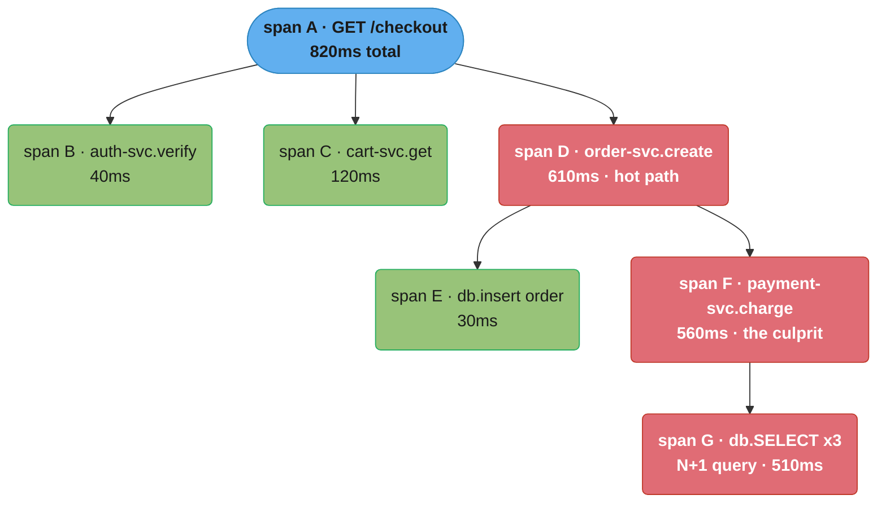
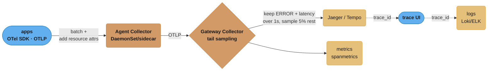
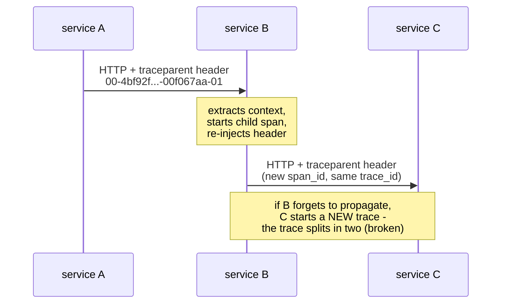
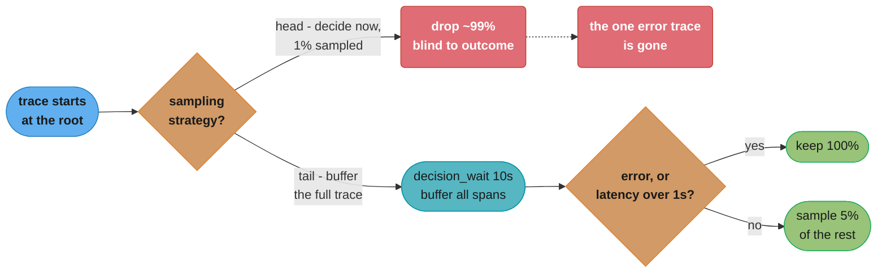
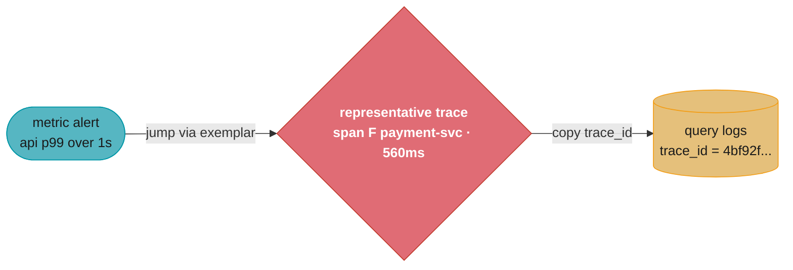
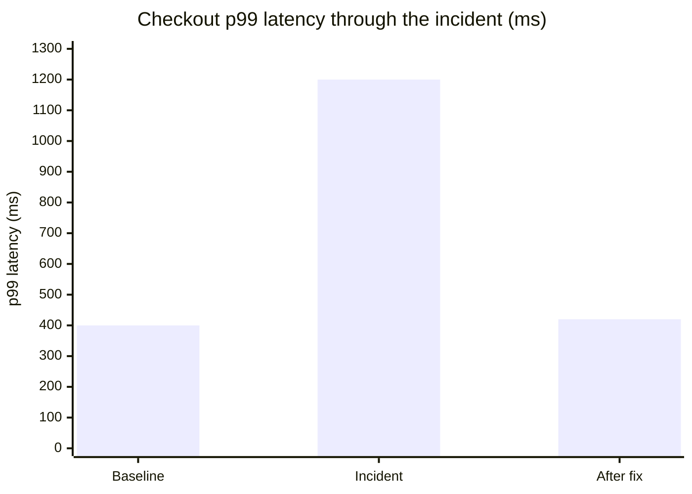

# Distributed Tracing & OpenTelemetry

> Phase 6 — Observability & SRE · Difficulty: Advanced

Distributed tracing follows a **single request as it fans out across many services**, stitching the per-service work into one causally-linked tree (a *trace* of *spans*). It answers the question metrics and logs can't: "for *this specific slow request*, where did the 800ms go?" **OpenTelemetry (OTel)** is the vendor-neutral CNCF standard for generating, collecting, and exporting traces (and metrics and logs) — its SDKs instrument code and its **Collector** receives, processes, samples, and exports to backends like Jaeger or Tempo. This module owns the *platform* side: Collector pipelines, sampling strategy, context propagation, and backends; **application instrumentation** (SDK setup, manual spans) lives in [../../backend/observability_and_monitoring](../../backend/observability_and_monitoring).

---

## 1. Concept Overview

A **trace** represents one request's end-to-end journey. It's a tree of **spans**, where each span is a single unit of work (an HTTP handler, a DB query, an RPC) with a start time, duration, status, and attributes. Spans share a `trace_id` and are linked by `parent_span_id`, so the backend can reconstruct the causal tree and timeline. The key data:

- **trace_id** (16 bytes / 32 hex) — identifies the whole request, propagated across every hop.
- **span_id** (8 bytes / 16 hex) — identifies one span; a child span's `parent_span_id` points at its caller.
- **Context propagation** — the trace context travels across service boundaries via headers, standardized by **W3C Trace Context** (`traceparent: 00-<trace_id>-<span_id>-<flags>`).
- **Attributes / events / status** — key/value metadata (`http.method`, `db.statement`), timestamped events, and OK/ERROR status.

**OpenTelemetry** unifies what used to be fragmented (OpenTracing + OpenCensus). It provides: language **SDKs** that produce spans, an **API** to instrument code, the **OTLP** wire protocol (gRPC/HTTP), automatic instrumentation for common libraries, and the **Collector** — a standalone process that receives telemetry, transforms/samples it, and exports to one or many backends. The Collector decouples your apps from any specific backend: apps speak OTLP; the Collector fans out to Jaeger, Tempo, vendor SaaS, etc.

The defining cost problem in tracing is **volume**: capturing every span on every request at high traffic is expensive to transmit and store. **Sampling** decides which traces to keep. **Head sampling** decides at the start of the trace (cheap, simple, but blind to outcome); **tail sampling** buffers complete traces and decides after seeing the whole thing (keep all errors and slow traces, sample the boring fast ones) — far smarter, done in the Collector.

---

## 2. Intuition

> **One-line analogy**: A trace is a UPS tracking number for a request. The package (request) passes through many facilities (services); each scan (span) records where it was, how long it sat there, and whether it got damaged. At the end you see the whole route and instantly spot the facility where it sat for 800ms.

**Mental model**: Metrics tell you the *rate* of slow requests; logs tell you *what* one event said; a trace tells you the *causal waterfall* of one request — service A waited on B, B made three serial DB calls, the third took 750ms. The trace is a flame-graph across the network. The `trace_id` is the thread that ties everything together, including the logs each service emitted.

**Why it matters**: In a microservices system a single user click can touch 20+ services. When p99 latency degrades, metrics say "the checkout flow is slow" but not *which* hop. Tracing localizes the latency or error to a specific span in a specific service for a specific class of request, turning a multi-team guessing game into a precise diagnosis. It's the only pillar that preserves cross-service causality.

**Key insight**: Tracing's value and its cost both scale with volume, and the resolution is **smart sampling in the Collector, not the app**. Tail sampling (decide after seeing the whole trace) keeps every error and every slow trace while discarding the redundant fast successes — you keep ~100% of the *interesting* traces at a fraction of the volume. And the entire architecture only works if **context propagates unbroken**; one service that drops the `traceparent` header severs the trace into disconnected fragments.

---

## 3. Core Principles

1. **One trace per request; spans form a causal tree** linked by `trace_id` + `parent_span_id`.
2. **Context must propagate unbroken** across every hop (W3C `traceparent`); a single non-propagating service breaks the trace.
3. **Instrument once, export anywhere.** Apps emit OTLP; the Collector decouples them from backends.
4. **Sample deliberately.** Head sampling is cheap and blind; tail sampling is smart and keeps errors/slow traces.
5. **Correlate the pillars.** Put `trace_id` in logs and attach exemplars to metrics for one-click pivots.
6. **Semantic conventions matter.** Use OTel's standard attribute names (`http.*`, `db.*`) so backends and queries are portable.
7. **The Collector is a buffer and policy point** — batching, retries, redaction, sampling, and routing live there, not in apps.

---

## 4. Types / Architectures / Strategies

### Deployment patterns for the Collector

| Pattern | Where it runs | Use for |
|---------|---------------|---------|
| Agent (sidecar/DaemonSet) | Next to each app/node | Local batching, low app latency, add resource attrs |
| Gateway (standalone deployment) | Central cluster service | Tail sampling, fan-out, central policy, egress control |
| Agent → Gateway (two-tier) | Both | Standard production layout: agents collect, gateway tail-samples |

### Sampling strategies

| Strategy | Decision point | Pros | Cons |
|----------|---------------|------|------|
| Head (probabilistic) | Trace start (root) | Cheap, simple, consistent | Blind to outcome; may drop the error trace |
| Rate-limiting head | Trace start | Caps spans/sec | Can drop important traces under load |
| Tail | After full trace buffered (Collector) | Keep all errors/slow; sample fast successes | Needs memory to buffer; routing complexity |
| Parent-based | Inherit root's decision | Keeps a trace whole | Only as good as the root decision |

### Backends

| Backend | Storage | Notes |
|---------|---------|-------|
| Jaeger | Cassandra/Elasticsearch/Badger | Mature, rich UI, CNCF |
| Grafana Tempo | Object storage (S3/GCS) | Cheap (no index beyond trace_id), TraceQL, Grafana-native |
| Zipkin | Cassandra/ES/MySQL | Older, simple |
| Vendor SaaS | managed | Datadog, Honeycomb, Lightstep, New Relic, AWS X-Ray |

---

## 5. Architecture Diagrams

**Distributed trace as a span tree (one request)**



*The 820ms request is a causal span tree, not a flat list: `order-svc.create` (610ms) is the hot path, and inside it `payment-svc.charge` (560ms) is the culprit — a 510ms N+1 (`db.SELECT` x3).*

**OTel two-tier collection pipeline**



*Agents batch spans and tag resource attributes locally; the gateway tier is where tail sampling actually decides — keep everything ERROR or over 1s, sample 5% of the rest — before fanning out to trace, metric, and log backends that all pivot on `trace_id`.*

**Context propagation (the thing that breaks traces)**



*Every hop must extract and re-inject `traceparent`; the moment one service (here B) skips it, the downstream service starts a brand-new root trace and the original trace splits into disconnected fragments.*

---

## 6. How It Works — Detailed Mechanics

### W3C Trace Context — the propagation header

```
traceparent: 00-4bf92f3577b34da6a3ce929d0e0e4736-00f067aa0ba902b7-01
             ^  ^                                ^                ^
          version  trace_id (16 bytes)          parent span_id   flags (01 = sampled)

tracestate: vendor1=value,vendor2=value     # optional, vendor-specific
```

Every service must **extract** this header on inbound requests and **inject** it on outbound calls. Auto-instrumentation handles HTTP/gRPC/messaging clients automatically; manual propagation is only needed for custom transports. (SDK/app wiring is owned by [../../backend/observability_and_monitoring](../../backend/observability_and_monitoring).)

### Collector pipeline (receivers → processors → exporters)

```yaml
# otel-collector-config.yaml — the gateway collector doing tail sampling.
receivers:
  otlp:
    protocols:
      grpc: { endpoint: 0.0.0.0:4317 }
      http: { endpoint: 0.0.0.0:4318 }

processors:
  batch:                          # batch spans to reduce export RPCs
    timeout: 5s
    send_batch_size: 1024
  memory_limiter:                 # protect the collector from OOM
    check_interval: 1s
    limit_mib: 4096
    spike_limit_mib: 1024
  attributes/redact:              # strip PII before export
    actions:
      - { key: http.request.header.authorization, action: delete }
      - { key: user.email, action: delete }
  tail_sampling:
    decision_wait: 10s            # buffer the full trace up to 10s before deciding
    num_traces: 100000
    policies:
      - name: errors              # keep ALL traces containing an error
        type: status_code
        status_code: { status_codes: [ERROR] }
      - name: slow                # keep ALL traces slower than 1s
        type: latency
        latency: { threshold_ms: 1000 }
      - name: sample-rest         # probabilistically keep 5% of the boring ones
        type: probabilistic
        probabilistic: { sampling_percentage: 5 }

exporters:
  otlp/tempo: { endpoint: tempo:4317, tls: { insecure: true } }
  jaeger:     { endpoint: jaeger-collector:4317 }

service:
  pipelines:
    traces:
      receivers: [otlp]
      processors: [memory_limiter, attributes/redact, tail_sampling, batch]
      exporters: [otlp/tempo]
```

`tail_sampling` must run on the **gateway** (not per-agent), because a complete trace's spans may arrive from many agents — only a central collector that receives all of a trace's spans can decide based on the whole trace. This requires routing all spans of a trace to the same gateway instance (load-balancing exporter by `trace_id`).

### What those sampling percentages actually retain

```
head sampling:   kept = total x p
                 errors kept = errors x p          (same blind p)

tail sampling:   kept = errors + (total - errors) x p_rest
                 errors kept = errors              (always 100%)
```

**The idea behind it.** "Head sampling applies one coin flip to every trace alike, so it discards errors at exactly the rate it discards successes; tail sampling splits the population first and only gambles on the half you do not care about."

The whole argument for tail sampling lives in that split. It is not that tail sampling stores less — it usually stores *more* — it is that the stored set is chosen after outcome is known, so retention and diagnostic value stop being the same dial.

| Symbol | What it is |
|--------|------------|
| `total` | Traces produced per day before any sampling |
| `errors` | Traces containing at least one ERROR span — the ones you debug with |
| `p` | Head-sampling probability, applied at the root, blind to outcome |
| `p_rest` | Tail-sampling rate applied only to the boring fast successes |
| `total - errors` | The successful traces, the only population tail sampling gambles on |

**Walk one example.** One million traces a day at the case study's 3% error rate, config values `p = 1%` and `p_rest = 5%`:

```
  total  = 1,000,000
  errors = 1,000,000 x 0.03 =  30,000
  ok     = 1,000,000 - 30,000 = 970,000

  head sampling at p = 1%
    stored      = 1,000,000 x 0.01 = 10,000 traces
    errors kept =    30,000 x 0.01 =    300
    errors LOST =    30,000 -  300 = 29,700   (99% of your evidence)

  tail sampling: keep all errors, 5% of the rest
    stored      = 30,000 + 970,000 x 0.05 = 30,000 + 48,500 = 78,500
    errors kept = 30,000                                      (100%)
    retained    = 78,500 / 1,000,000 = 7.85% of all traces
```

Tail sampling stores `78,500 / 10,000 = 7.85x` more traces than head sampling at 1% — and buys, for that 7.85x, every single one of the 29,700 error traces head sampling threw away. That is the trade the incident in Section 14 lost: the team searched Jaeger for failed checkouts and found almost none, because 1% blind sampling had statistically kept about 300 of 30,000.

**Why `decision_wait` has to exist.** Tail sampling cannot evaluate "did any span error" or "total latency > 1s" until the trace is complete, so the gateway must hold spans in memory until it believes no more are coming — hence `decision_wait: 10s` and the `num_traces: 100000` buffer bound. Drop the wait and you are deciding on a partial trace, which is head sampling wearing a tail-sampling config.

### Head vs tail sampling — why the choice matters



*Head sampling gambles at the root — at 1% it discards ~99% of traces, including the rare one that errored. Tail sampling waits for the full trace (`decision_wait: 10s`) before deciding, so it can keep 100% of errors and slow traces while sampling only 5% of the boring successes.*

```yaml
# BROKEN: head sampling at 1% blindly. The one trace where checkout threw a 500 had a
# 99% chance of being discarded at the root before anyone knew it errored -> you can't debug the incident.
processors:
  probabilistic_sampler:
    sampling_percentage: 1        # decided at trace start, blind to outcome

# FIX: tail sampling keeps 100% of error/slow traces and samples only the fast successes.
#   -> the error trace is ALWAYS kept; volume stays low; debugging is possible.
#   (see tail_sampling policies above)
```

### Generating metrics from spans (spanmetrics)

```yaml
# The collector can derive RED metrics (Rate, Errors, Duration) from spans -
# so you get service-level latency histograms without separate instrumentation.
connectors:
  spanmetrics:
    histogram: { explicit: { buckets: [100ms, 300ms, 1s, 3s] } }
    dimensions: [ { name: http.method }, { name: service.name } ]
# exported as a metric the Prometheus pipeline scrapes -> p99 per service from traces.
```

### Correlating a trace to its logs



*The three-pillar pivot in three hops: a p99-over-1s alert jumps via exemplar to the representative trace, which localizes the 560ms `payment-svc` span (a DB N+1), whose `trace_id` then filters the logs straight to the failing query.*

This three-pillar pivot is the payoff of putting `trace_id` in logs (see [observability_logging](../observability_logging/)) and exemplars on metrics (see [observability_metrics_prometheus](../observability_metrics_prometheus/)).

---

## 7. Real-World Examples

- **Google Dapper**: the 2010 paper that originated production distributed tracing; OpenTelemetry's span model descends from it and from Twitter's Zipkin / Uber's Jaeger lineage.
- **Uber Jaeger**: built to trace requests across thousands of microservices; the canonical open-source tracing backend, donated to CNCF.
- **Grafana Tempo**: stores traces in object storage indexed only by `trace_id` (plus TraceQL search), making trace retention cheap at massive scale — adopters keep far more traces for far less money than index-heavy backends.
- **OpenTelemetry adoption**: the second most active CNCF project after Kubernetes; major vendors (Datadog, Honeycomb, AWS, Splunk) accept OTLP, so teams instrument once and switch backends without re-instrumenting.
- **Tail sampling at high-traffic shops**: companies serving millions of req/s run gateway Collectors with `trace_id`-aware load balancing so all spans of a trace reach the same collector, then tail-sample to keep all errors and ~1–5% of successes.

---

## 8. Tradeoffs

| Decision | Option A | Option B | Key factor |
|----------|----------|----------|-----------|
| Sampling | Head (at root) | Tail (after full trace) | Cost/simplicity vs keeping all errors/slow |
| Collector topology | Agent only | Agent + Gateway | Simplicity vs central policy/tail sampling |
| Backend | Jaeger (indexed) | Tempo (object store) | Rich search vs cheap retention |
| Instrumentation | Auto | Manual spans | Coverage/speed vs control/detail |
| Export | Direct to backend | Via Collector | Coupling vs decoupling/buffering |
| Metrics source | Separate instrumentation | spanmetrics from traces | Accuracy vs fewer moving parts |
| Vendor | OSS (Jaeger/Tempo) | SaaS (Datadog/Honeycomb) | Cost/control vs managed convenience |

---

## 9. When to Use / When NOT to Use

**Use distributed tracing when:** you run microservices or any multi-hop request path, you need to localize latency or errors to a specific service/span, or you're debugging cross-service issues that metrics ("something is slow") and logs (single-service detail) can't resolve. Adopt OpenTelemetry so instrumentation is portable across backends.

**Reconsider / scope it down when:** you run a monolith with no meaningful internal fan-out (tracing adds overhead for little cross-service insight — profiling may serve you better); you can't afford to propagate context everywhere (a broken trace is worse than none); or you try to keep 100% of traces at high volume (cost explodes — use tail sampling). Tracing is for *causality across services per request*, not for aggregate trends (metrics) or per-event search (logs); use all three together, each for its strength.

---

## 10. Common Pitfalls

**Pitfall 1 — Broken context propagation splits the trace.**

```python
# BROKEN: a service makes an outbound call with a raw client that doesn't inject traceparent.
resp = raw_socket_call(downstream_url, payload)   # no trace context forwarded
#  -> the downstream service starts a NEW root trace -> the trace splits into two fragments,
#     and the cross-service latency you wanted to see is invisible.
```

```python
# FIX: use instrumented clients (auto-inject) or manually inject the context.
from opentelemetry.propagate import inject
headers = {}
inject(headers)                       # adds traceparent (+ tracestate)
resp = http_client.post(downstream_url, json=payload, headers=headers)
#  -> downstream extracts context, continues the SAME trace.
```

**Pitfall 2 — Head-sampling away the errors.** Probabilistic head sampling at 1% decides at the root, blind to outcome, so the rare trace that actually errored is almost certainly discarded — you have nothing to debug during the incident. FIX: use tail sampling in the gateway Collector to keep 100% of error and slow traces and sample only the boring successes.

**Pitfall 3 — Tail sampling on per-node agents.** Configuring `tail_sampling` on DaemonSet agents fails because a trace's spans are spread across many nodes; no single agent sees the whole trace, so latency/error decisions are wrong. FIX: tail-sample only on a gateway tier, and route all spans of a given `trace_id` to the same gateway instance via a load-balancing exporter keyed on `trace_id`.

**Pitfall 4 — Leaking PII into span attributes.** Putting full request bodies, auth headers, emails, or SQL with literal values into span attributes leaks sensitive data into a long-retained, widely-readable trace store. FIX: redact in the Collector (`attributes` processor `delete`), follow OTel semantic conventions for what to capture, and never attach raw payloads/secrets to spans.

---

## 11. Technologies & Tools

| Tool | Purpose |
|------|---------|
| OpenTelemetry SDK/API | Generate spans/metrics/logs; auto + manual instrumentation |
| OTLP | Vendor-neutral wire protocol (gRPC/HTTP) for telemetry |
| OpenTelemetry Collector | Receive/process/sample/export; gateway + agent tiers |
| Jaeger | Trace backend + UI (Cassandra/ES storage) |
| Grafana Tempo | Object-storage trace backend, TraceQL, cheap retention |
| Zipkin | Older trace backend |
| W3C Trace Context | Standard propagation headers (`traceparent`/`tracestate`) |
| spanmetrics connector | Derive RED metrics from spans |
| AWS X-Ray / Datadog / Honeycomb / Lightstep | Managed tracing backends (OTLP-compatible) |
| Grafana | Unified trace/metric/log correlation UI |

---

## 12. Interview Questions with Answers

**Q1: What is a trace, a span, and how are they linked?**
A trace is one request's end-to-end journey across services; a span is a single unit of work within it (an HTTP handler, a DB query) with a start time, duration, status, and attributes. All spans in a trace share a `trace_id`, and each child span carries a `parent_span_id` pointing at the span that caused it, so the backend reconstructs a causal tree and timeline. That tree is what lets you see which hop consumed the latency for a specific request.

**Q2: What problem does tracing solve that metrics and logs cannot?**
Tracing preserves cross-service causality for a single request: metrics tell you the *rate* of slow requests and logs tell you what one service said, but neither shows that service A's slowness was caused by service F's N+1 query three hops down. In a 20-service request path, tracing localizes the latency or error to a specific span in a specific service, turning a multi-team guessing game into a precise diagnosis. It's the only pillar that answers "where did the time go for *this* request."

**Q3: What is OpenTelemetry and why did it win?**
OpenTelemetry is the CNCF vendor-neutral standard for generating and collecting telemetry — SDKs/API for instrumentation, the OTLP wire protocol, semantic conventions, and the Collector. It won by merging the previously competing OpenTracing and OpenCensus efforts and by being backend-agnostic: you instrument once and export to Jaeger, Tempo, or any vendor that accepts OTLP, so you're never locked in. That decoupling (instrument once, export anywhere) is its central value proposition.

**Q4: Explain head sampling vs tail sampling and the tradeoff.**
Head sampling decides whether to keep a trace at its start (the root), so it's cheap and simple but blind to outcome — it can discard the one trace that errored. Tail sampling buffers the complete trace and decides after seeing everything, so you can keep 100% of error and slow traces while sampling only the boring fast successes. The tradeoff is that tail sampling needs memory to buffer traces and a gateway tier that receives all of a trace's spans, but it's far smarter for debugging incidents.

**Q5: Why must tail sampling run on a gateway, not on per-node agents?**
A single trace's spans are produced across many nodes/services, so any one DaemonSet agent sees only a fragment and can't evaluate trace-wide conditions like "did any span error" or "total latency > 1s." Tail sampling therefore runs on a central gateway tier that receives all spans of a trace, which requires routing every span with the same `trace_id` to the same gateway instance via a load-balancing exporter keyed on `trace_id`. Otherwise the sampling decision is made on incomplete data and is wrong.

**Q6: How does context propagation work and what breaks it?**
The trace context (trace_id, current span_id, sampling flag) travels across service boundaries in the W3C `traceparent` header; each service extracts it on inbound requests and injects it on outbound calls so children link to parents. It breaks when a service uses a non-instrumented client or custom transport that drops the header — the downstream service then starts a brand-new root trace, splitting one logical request into disconnected fragments. The fix is instrumented clients or manual `inject`/`extract`, verified end-to-end.

**Q7: What does the OpenTelemetry Collector do and why use it instead of exporting directly?**
The Collector is a standalone process with a receivers → processors → exporters pipeline that receives OTLP, then batches, redacts, samples, and exports to one or more backends. Using it instead of exporting directly from apps decouples your code from any specific backend (switch Jaeger→Tempo with zero app changes), centralizes policy (sampling, PII redaction), and provides buffering/retries so a backend outage doesn't block your services. It's the policy and resilience layer of the tracing platform.

**Q8: How do you correlate a trace with logs and metrics?**
Inject the `trace_id` into every log line so you can jump from a span to the exact logs that request emitted, and attach exemplars to latency histograms so a metric spike links to a representative trace. The workflow is: a metric alert points at a service, you open a representative trace to find the slow/failing span, then query logs by that `trace_id` for the precise error and payload. This three-pillar pivot is the core value of unified observability.

**Q9: What are OTel semantic conventions and why follow them?**
Semantic conventions are OpenTelemetry's standardized attribute names and structures — `http.request.method`, `db.system`, `db.statement`, `service.name` — so telemetry is consistent regardless of language or library. Following them means backends, dashboards, and queries are portable and auto-instrumentation produces uniform data you can build generic alerts and span-metrics on. Inventing your own attribute names fragments your data and breaks vendor/tooling integrations.

**Q10: How can you get latency metrics without instrumenting metrics separately?**
The Collector's spanmetrics connector derives RED metrics (Rate, Errors, Duration histograms) from the spans flowing through it, dimensioned by service and operation. You then scrape those as Prometheus metrics, getting per-service p50/p99 latency and error rates "for free" from your traces with one fewer instrumentation path to maintain. The tradeoff is the metrics are only as complete as your sampled spans, so combine with head/tail sampling awareness or use a pre-sampling tap.

**Q11: What's the difference between Jaeger and Tempo?**
Jaeger is a mature CNCF backend that indexes traces in Cassandra or Elasticsearch, giving rich search by service/operation/tags at the cost of running and storing those indexes. Tempo stores traces in cheap object storage (S3/GCS) indexed essentially only by `trace_id` (plus TraceQL search), trading some search richness for dramatically lower storage cost and operational simplicity. Choose Jaeger for rich attribute search, Tempo for cheap retention at scale where you usually arrive with a `trace_id` from a metric/log pivot.

**Q12: What overhead does tracing add and how do you keep it low?**
Instrumentation adds per-span CPU/memory and the network cost of exporting spans, plus storage on the backend — all scaling with request volume. Keep it low by sampling (tail sampling keeps errors/slow but discards most successes), batching exports in the Collector, running an agent tier to offload export work from the app, and avoiding excessive manual spans on hot loops. Done right, overhead is a small single-digit percentage while you still keep 100% of the diagnostically valuable traces.

**Q13: What are the Collector's three deployment patterns, and which is the standard production layout?**
The three patterns are agent (sidecar/DaemonSet), gateway (central deployment), and agent-to-gateway two-tier, which is the standard production layout. Agents run next to each app or node for local batching and low-latency resource-attribute tagging; the gateway is a standalone deployment that owns tail sampling, fan-out, and central policy. Production systems combine both: agents forward everything to a gateway tier via a load-balancing exporter keyed on `trace_id`, because only a component that receives all of a trace's spans can tail-sample correctly. Running agents alone forces you into head sampling, since no single per-node agent ever sees a complete trace.

**Q14: What do the `memory_limiter` and `batch` processors do in a Collector pipeline, and why does their order matter?**
`memory_limiter` protects the Collector from OOM by shedding data once memory exceeds a threshold, while `batch` groups spans into larger exports to cut the number of RPCs. In the example config, `memory_limiter` runs first with a 4096 MiB limit, a 1024 MiB spike allowance, and a 1s check interval, so it can shed load before any expensive processor spends CPU on spans; `batch` runs last with a 5s timeout and 1024-span batches, right before the exporter. Placing `memory_limiter` first is deliberate — it must gate incoming data before `attributes`/redact or `tail_sampling` process spans that would be dropped anyway. Getting the order wrong lets a traffic spike OOM the Collector before the safety valve engages.

**Q15: How do you prevent PII from leaking into trace spans?**
Strip sensitive fields in the Collector's `attributes` processor before export, since spans land in a long-retained, widely-readable trace store. The example pipeline deletes `http.request.header.authorization` and `user.email` via `action: delete` in an `attributes/redact` stage that runs before sampling and export. This redaction is a backstop, not a substitute for careful instrumentation — apps should never attach raw request bodies, auth headers, or literal SQL values as span attributes in the first place. Follow OTel semantic conventions for what's safe to capture so redaction rules stay predictable across services.

**Q16: How does AWS X-Ray fit into an OpenTelemetry-based tracing setup?**
AWS X-Ray is a managed, OTLP-compatible tracing backend, so apps can export standard OTel spans to it through the Collector without vendor-specific SDKs. You add an X-Ray exporter to the same Collector pipeline used for Jaeger or Tempo, so adding or switching to X-Ray is an exporter-config change, not a re-instrumentation effort. X-Ray also integrates natively with Lambda, API Gateway, and ECS/EKS, auto-adding trace headers at the platform level, which can fill gaps in manual instrumentation for AWS-managed compute. Choose X-Ray for tight AWS-service integration with no backend to operate yourself, and Tempo/Jaeger when you need the same OSS backend across clouds or on-prem.

---

## 13. Best Practices

- **Adopt OpenTelemetry + OTLP** so instrumentation is portable; route through a Collector, not direct to a backend.
- **Tail-sample in a gateway tier** to keep 100% of error/slow traces while sampling successes; route by `trace_id`.
- **Verify context propagates end-to-end;** use instrumented clients and test that one trace spans all hops.
- **Follow semantic conventions** (`http.*`, `db.*`, `service.name`) for portable, queryable telemetry.
- **Inject `trace_id` into logs and attach exemplars to metrics** for one-click three-pillar pivots.
- **Redact PII/secrets in the Collector** (`attributes` delete); never attach raw bodies/headers to spans.
- **Derive RED metrics with spanmetrics** to reduce duplicate instrumentation.
- **Keep app instrumentation conventions** consistent (see [../../backend/observability_and_monitoring](../../backend/observability_and_monitoring)).

---

## 14. Case Study

### Scenario: Checkout p99 doubles, and 1% head sampling means the error traces are gone

An e-commerce platform with 18 microservices sees checkout p99 jump from 400ms to 1.2s, and the 5xx rate on `/checkout` climbs to 3%. The team has OTel SDKs but exports directly to Jaeger with 1% probabilistic head sampling. When they search Jaeger for failed checkouts, almost none exist — the 1% root-level sampling discarded ~99% of the error traces. Worse, one service (`recommendations-svc`) uses a hand-rolled HTTP client that drops `traceparent`, so traces split there and the downstream `payment-svc` spans never link to the checkout trace.



*Checkout p99 held at a healthy 400ms baseline, spiked to 1.2s once the incident hit, and settled back to ~420ms only after both the broken propagation and the N+1 query were fixed — 1% head sampling alone would never have surfaced which query to fix.*

```python
# BROKEN 1: non-propagating client splits the trace.
resp = legacy_http.get(f"{rec_url}/recommend")     # no traceparent injected
# BROKEN 2 (config): 1% head sampling discards the error traces before anyone sees them.
#   processors: { probabilistic_sampler: { sampling_percentage: 1 } }
```

```python
# FIX 1: propagate context on every outbound call.
from opentelemetry.propagate import inject
hdrs = {}; inject(hdrs)
resp = http_client.get(f"{rec_url}/recommend", headers=hdrs)   # same trace continues
```

```yaml
# FIX 2: route through a gateway Collector with tail sampling (keep all errors/slow).
service:
  pipelines:
    traces:
      receivers: [otlp]
      processors: [memory_limiter, attributes/redact, tail_sampling, batch]
      exporters: [otlp/tempo]
processors:
  tail_sampling:
    decision_wait: 10s
    policies:
      - { name: errors, type: status_code, status_code: { status_codes: [ERROR] } }
      - { name: slow,   type: latency,     latency: { threshold_ms: 1000 } }
      - { name: rest,   type: probabilistic, probabilistic: { sampling_percentage: 5 } }
```

With propagation fixed, the checkout traces became whole again and immediately showed the waterfall: `payment-svc` span took 900ms, inside which a `db.SELECT` ran three times serially (an N+1). Tail sampling now kept 100% of the 5xx and >1s traces, so the team could open a representative failing trace, copy its `trace_id`, and pull the exact SQL from `payment-svc` logs (`{app="payment-svc"} | json | trace_id="4bf92f..."`). The root cause was a missing batch fetch in the payment path; fixing the N+1 dropped p99 back to ~420ms.

**Outcome:** propagation fixes reconnected the traces, tail sampling guaranteed the error traces were always retained (at ~5% overall volume), and the `trace_id`-to-logs pivot localized the bug to one query in one service within minutes instead of a multi-team day-long hunt. The team standardized on instrumented clients and a gateway Collector across all 18 services.

**Discussion questions:**
1. Why did 1% head sampling make the incident undebuggable, and how does tail sampling fix it without exploding volume?
2. How does a single non-propagating service break tracing for everything downstream of it?
3. Walk through the metric → trace → log pivot that localized the N+1 query.

---

**Cross-references:** [observability_metrics_prometheus](../observability_metrics_prometheus/) (RED metrics, exemplars linking metrics→traces), [observability_logging](../observability_logging/) (correlate via `trace_id`; where high-cardinality detail lives), [visualization_and_alerting](../visualization_and_alerting/) (Grafana trace/metric/log correlation UI), [service mesh — ../../backend/service_mesh_and_service_discovery](../../backend/service_mesh_and_service_discovery) (sidecars can auto-generate spans), [../../backend/observability_and_monitoring](../../backend/observability_and_monitoring) (application instrumentation, SDK setup, manual spans — owned there), [microservices — ../../backend/microservices_fundamentals](../../backend/microservices_fundamentals) (the fan-out tracing illuminates).
