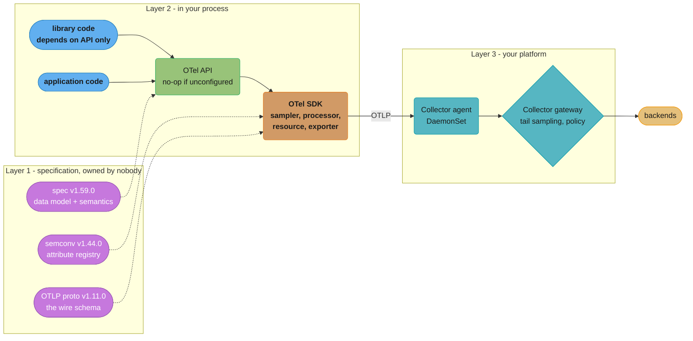
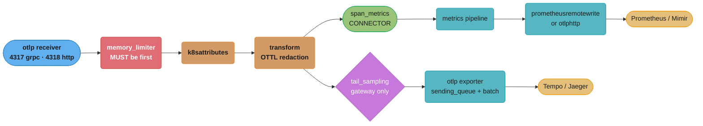
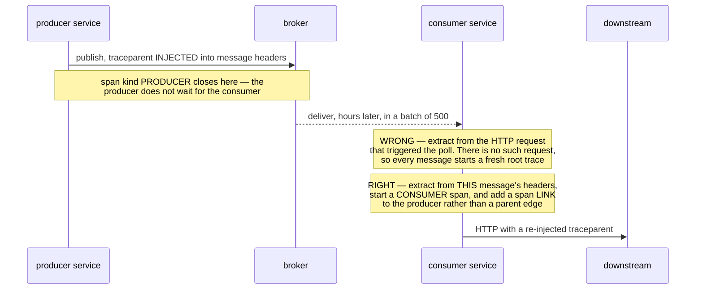
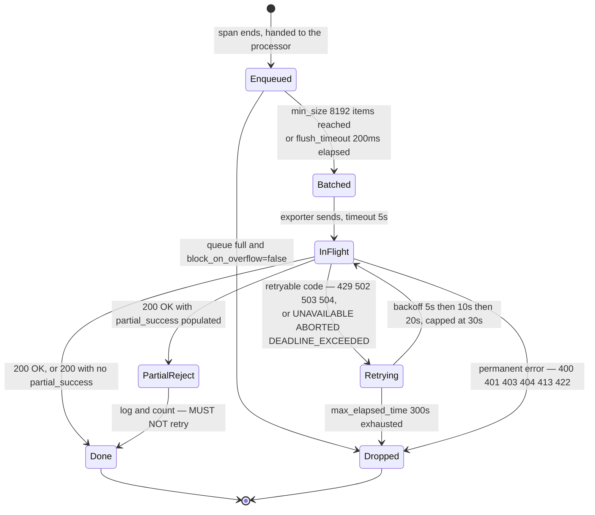
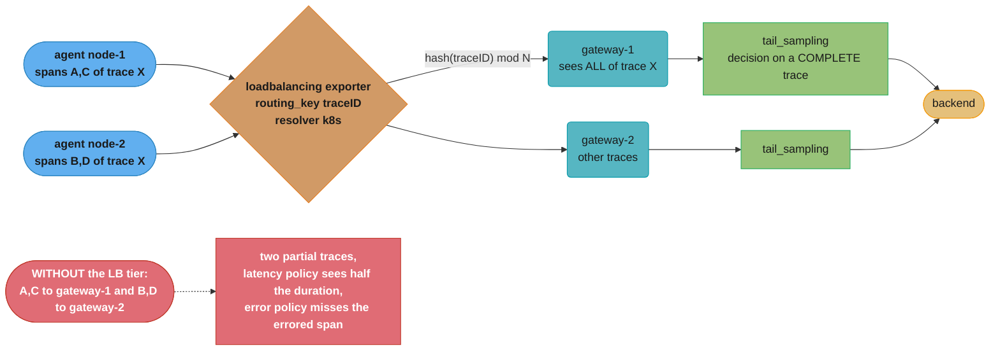
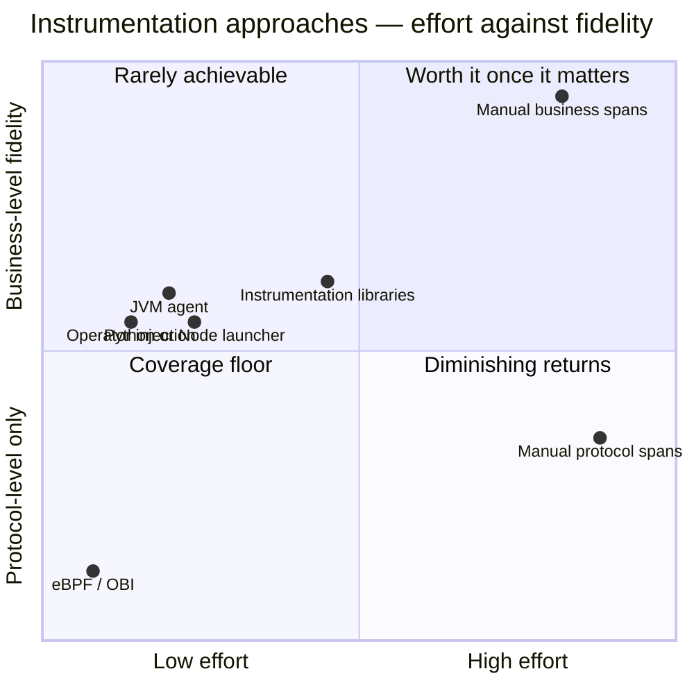

# OpenTelemetry — Deep Dive

> **Version anchor (2026-08-05).** **Specification v1.59.0** (2026-07-10), **OTLP/protobuf v1.11.0** (2026-07-21), **Semantic Conventions v1.44.0** (2026-08-04), **Collector v0.158.0** (2026-08-04), **Java auto-instrumentation v2.30.0** (2026-07-22), **OpenTelemetry eBPF Instrumentation (OBI) v0.10.0** (2026-06-30). OpenTelemetry became a **CNCF graduated project** on **2026-05-11** (TOC vote), announced 2026-05-21 at the Observability Summit — it is the second-highest-velocity project in the CNCF after Kubernetes. Signal maturity is **not uniform** and is the single most common factual error on this topic; the table in §1 is the authority for this page and every claim below is tagged against it.

This page is the **project-level** deep dive that sits under [observability_tracing_and_otel](observability_tracing_and_otel.md). The parent owns the *concept* — what a trace is, why you sample, how a Collector fits a platform. This page owns the *mechanism*: the three-layer split people conflate, each signal's data model field by field, the exact bytes of context propagation, the sampling arithmetic, OTLP's wire behaviour under load, the Collector as a real system with its own failure modes, and the cost economics that decide what you can afford to keep. Application-framework wiring lives elsewhere and is deliberately not repeated here: Micrometer and MDC in [backend/observability_and_monitoring](../../backend/observability_and_monitoring/observability_and_monitoring.md), the Observation API in [spring/observability_and_tracing](../../spring/observability_and_tracing/observability_and_tracing.md), ASGI instrumentation in [fastapi/observability_and_monitoring](../../fastapi/observability_and_monitoring/observability_and_monitoring.md), and GenAI spans in [llm/llm_observability_and_monitoring](../../llm/llm_observability_and_monitoring/llm_observability_and_monitoring.md).

---

## 1. Concept Overview

### The three layers, and why conflating them causes bad decisions

"OpenTelemetry" names three separable things that ship on different cadences, carry different stability guarantees, and are chosen by different people:

| Layer | Artifact | Who chooses it | Cadence | Breaks how |
|---|---|---|---|---|
| **Specification** | prose + protobuf + YAML semantic conventions | nobody, you consume it | spec monthly-ish (v1.59.0), semconv monthly (v1.44.0) | attribute renames, new signal maturity levels |
| **API + SDK** | a per-language pair of artifacts | the *library author* takes the API, the *application owner* takes the SDK | per language, independently | an SDK upgrade changes defaults, samplers, resource detection |
| **Collector** | one Go binary, configured in YAML | the platform team | every ~2 weeks (v0.158.0) | a component's config schema changes at alpha/beta stability |

The mistakes that follow from blurring them are concrete. Teams pin "OpenTelemetry 1.59" and cannot find a Collector with that version, because the Collector's module line is `v0.x` for components and `v1.x` for the stable core and neither tracks the spec. Teams treat the whole project as "stable" because tracing is, then build a product on the profiles signal, which is in **public alpha**. And teams put the SDK dependency into a shared library, which forces a vendor and a version onto every consumer — the exact outcome the API/SDK split exists to prevent.

### What OpenTelemetry actually gives you

Four things, in descending order of how hard they were to obtain any other way:

1. **Semantic conventions.** A published, versioned, machine-readable registry of attribute names. `http.request.method`, `db.query.text`, `service.name`. This is the real product — see §6.29.
2. **A wire protocol.** OTLP: one protobuf schema, three transports, defined retry and throttle behaviour, so every backend can accept the same bytes.
3. **An API/SDK split per language.** A library instruments against an API that is a no-op until an application installs an SDK, so instrumentation costs a consumer nothing.
4. **A processing tier.** The Collector, a single binary that is receiver, transformer, sampler, buffer and fan-out.

Note what is absent: **no storage, no query language, no UI, no alerting.** OpenTelemetry produces and moves telemetry. Jaeger, Tempo, Prometheus, ClickHouse and every commercial backend do the rest. A team that says "we're moving to OpenTelemetry" and means "we're replacing Datadog" has not finished the sentence.

### Signal maturity — the table this page is answerable to

Checked 2026-08-05 against `opentelemetry.io/status`, `opentelemetry.io/docs/specs/status/`, and the component `metadata.yaml` files.

| Signal | Spec / API | SDK | OTLP | Practical reading |
|---|---|---|---|---|
| **Traces** | Stable | Stable | Stable | Complete and under long-term support. Build on it. |
| **Metrics** | Stable | **Mixed** by language | Stable | Data model and API are stable; SDK completeness varies. |
| **Logs** | Stable (**Bridge API**, not an app-facing API) | Stable | Stable | Mature, but the API is deliberately a bridge for Logback / `logging` / Log4j2 — you are not meant to call it directly. |
| **Baggage** | Stable | Stable | n/a — it is a propagation concern, not a signal | Stable, and a footgun (§6.16). |
| **Profiles** | **Development** | **Development** | **Development** — path is `/v1development/profiles` | Public **alpha** since March 2026, Collector support from **v0.148.0**. Do not build a product on it. |

Per-language, as of the status page: **Java** has traces, metrics and logs stable and profiles in development; **Go**, **JavaScript** and **Python** have traces and metrics stable with logs beta or in development; **C++**, **.NET** and **PHP** are stable across the three; **Ruby** and **Erlang/Elixir** have traces stable only; **Rust** is beta across all three; **Kotlin** is in development. "OpenTelemetry is stable" is true of tracing and false as a sentence about the project.

### A short history, because it explains the shape

OpenTracing (2016, an API with no SDK) and OpenCensus (2017, a Google-originated SDK-and-agent with no vendor-neutral API) split the market and neither won. They merged into OpenTelemetry in **2019**. The merger is why the API/SDK separation is so pronounced — it is OpenTracing's thesis — and why the Collector exists at all, since it is OpenCensus's agent with the scope widened. Tracing stabilised first (spec 1.0, 2021), metrics next (2022-2023), logs after that by deliberately choosing to *bridge* existing loggers rather than replace them. Profiles is the first signal designed after graduation and is following the same slow path.

### Disambiguation — five things called "OTel"

- **The OTel SDK** — the per-language implementation you configure in an application.
- **The OTel API** — the no-op-by-default interfaces a library depends on. Different artifact, different guarantee.
- **The OTel Collector** — the Go binary. Two distributions (core, contrib) plus whatever you build with the OpenTelemetry Collector Builder.
- **The OTel Operator** — a Kubernetes operator that manages Collectors *and* injects auto-instrumentation. Separate repo, `v1alpha1`/`v1beta1` CRDs.
- **OpenTelemetry eBPF Instrumentation (OBI)** — Grafana's Beyla, donated in 2025, now an OTel project at v0.10.0. Zero-code instrumentation with no SDK at all.

### Licence and governance

Apache 2.0. CNCF graduated (2026-05-11). Governed by a Governance Committee and a Technical Committee, with per-language and per-domain SIGs; over 2,800 companies have contributed. The consequence that matters operationally: **no single vendor can change the wire format**, which is why every commercial backend accepts OTLP, and why the decoupling argument in §2 is real rather than aspirational.

---

## 2. Intuition

> **One-line analogy.** OpenTelemetry is to observability what SQL was to databases: not the storage, not the engine, not the UI — the *shared language* that made all three swappable. The Collector is the connection pooler that sits between your application and whichever engine you picked this quarter.

**Mental model.** Picture three concentric rings. The innermost is your code, which calls an **API** that does nothing. The middle ring is the **SDK**, installed once per process, which turns those no-ops into real spans, applies a sampler, batches them and pushes bytes at a socket. The outer ring is the **Collector**, a process you own that receives those bytes and is the only place that knows the name of your vendor. Every decision you will want to reverse later — sampling rate, redaction, backend, dual-shipping during a migration — belongs in the outer ring, because the outer ring is the only one you can change without a deploy.

**Why it matters.** Before a shared protocol, changing observability vendors meant re-instrumenting every service, which meant nobody changed vendors, which meant vendors could price accordingly. The unit of lock-in was not the backend, it was the instrumentation. OTel moves the lock-in point outward to a YAML file. That is the entire commercial story, and it is why the semantic conventions matter more than the SDKs — a span with vendor-invented attribute names is portable in principle and useless in practice.

**Key insight.** *The API/SDK split is what makes library instrumentation possible, and library instrumentation is what makes the whole thing work.* If a library had to depend on an SDK, no library would instrument itself, and every application would hand-write spans around its HTTP client. Because the API resolves to a no-op with no SDK installed, a library can emit spans unconditionally and pay nothing when nobody is listening. That is why you get `http.server.request.duration` from a framework you never configured — and why the second-order problem is *cardinality*, not coverage. You will have more telemetry than you can afford long before you have less than you need.

---

## 3. Core Principles

1. **The API is a no-op until an SDK is installed.** Libraries depend on the API; applications install exactly one SDK. Violating this is the single most damaging dependency mistake in the ecosystem.
2. **Instrument once, decide later.** Anything you might want to change without a code deploy belongs in the Collector, not the SDK.
3. **`service.name` is load-bearing.** It is the one resource attribute without which essentially nothing works — no service map, no `spanmetrics` dimension, no Prometheus `job` label. An SDK with no `service.name` reports `unknown_service`.
4. **Semantic conventions are the product.** A span with correct names is queryable by tooling that has never seen your code. A span with invented names is a private log line with extra steps.
5. **Context propagation and instrumentation are different problems.** A service can be perfectly instrumented and still break every trace that passes through it, by failing to inject on the way out.
6. **A sampling decision must be consistent across the whole trace.** Independent per-service coin flips produce fragments, not traces. This is what parent-based sampling and, better, consistent probability sampling exist to guarantee.
7. **Tail sampling requires that one process see every span of a trace.** That is an architectural constraint, not a config option — it forces a `trace_id`-keyed load balancer in front of the gateway tier.
8. **Cardinality is the cost function.** For metrics it is time series; for traces it is index size and query cost. Both are driven by attribute *values*, not attribute count.
9. **Telemetry must degrade, not amplify.** Under backpressure the pipeline should drop with a counter, never block the request path and never retry itself into a second outage.
10. **Maturity is per signal and per component.** "OTel is stable" is a claim about tracing. Check the `metadata.yaml` of every Collector component you depend on.

---

## 4. Types / Architectures / Strategies

### 4.1 The instrumentation taxonomy — six ways a span gets created

| Approach | Mechanism | Code change | Fidelity | Where it fails |
|---|---|---|---|---|
| **Manual** | you call `tracer.startSpan()` | yes | highest — business semantics | nobody writes enough of it |
| **Library-native** | the library itself calls the OTel API | none | high | still rare outside the Go and .NET ecosystems |
| **Instrumentation library** | a separate package wraps/patches a library | one line, or none under an agent | high for protocol spans | version-coupled to the library it patches |
| **Runtime agent** | JVM `-javaagent` bytecode weaving, .NET profiler API | zero, a JVM flag | high | startup cost, class-loader edge cases |
| **Monkey-patching launcher** | `opentelemetry-instrument python app.py`, `--require @opentelemetry/auto-instrumentations-node` | zero, a wrapper command | high | import-order sensitivity |
| **eBPF (OBI)** | kernel uprobes/kprobes, no process attachment | zero, and no restart | **protocol only** — no business spans, limited context propagation | encrypted traffic needs uprobes on the TLS library; requires privileges |

The important distinction is the last column of row six. eBPF gives you spans for a binary you cannot rebuild, which is genuinely valuable, but it observes syscalls and protocol framing — it cannot know that this request is a checkout, and it cannot start a span inside your business logic. Treat OBI as a coverage floor, not a replacement.

### 4.2 The Collector component taxonomy — five kinds, and the one people forget

| Kind | Signature | Examples |
|---|---|---|
| **Receiver** | pulls or accepts data into a pipeline | `otlp`, `prometheus`, `jaeger`, `zipkin`, `filelog`, `kubeletstats`, `hostmetrics` |
| **Processor** | transforms data inside one pipeline | `memory_limiter`, `batch`, `attributes`, `transform` (OTTL), `k8sattributes`, `tail_sampling`, `filter`, `resourcedetection` |
| **Exporter** | sends data out of a pipeline | `otlp`, `otlphttp`, `prometheusremotewrite`, `loadbalancing`, `debug`, `file` |
| **Connector** | **exports from one pipeline and receives into another** | `span_metrics`, `routing`, `forward`, `count`, `servicegraph` |
| **Extension** | capability with no data path | `health_check`, `pprof`, `zpages`, `file_storage`, `oauth2client`, `basicauth` |

**Connectors are the one people forget**, and they are what makes the Collector a graph rather than a set of parallel straight lines. A connector is simultaneously the exporter of pipeline A and the receiver of pipeline B, which is how spans become metrics without leaving the process (§6.28).

### 4.3 Deployment topologies

| Topology | Runs as | Owns | Cannot do |
|---|---|---|---|
| **No Collector** | — | SDK exports straight to the backend | any policy change without a deploy; survives no backend outage |
| **Agent — sidecar** | one container per pod | per-pod resource attributes, local buffer | tail sampling; also multiplies your Collector count by your pod count |
| **Agent — DaemonSet** | one per node | node/pod attribute enrichment (`k8sattributes`), local batching, `filelog` tailing | tail sampling — it sees one node's fragment of each trace |
| **Gateway** | a Deployment, horizontally scaled | tail sampling, redaction, fan-out, egress control, auth | node-local file tailing, per-pod attribution |
| **Agent -> Gateway** | both | the standard production layout | nothing, but it is two tiers to size and operate |

A fourth topology deserves naming because it silently breaks the third: **Gateway with more than one replica and no `loadbalancing` exporter in front.** Spans of one trace land on different replicas, each replica tail-samples a fragment, and every trace-wide policy is evaluated against partial data. See §6.21.

### 4.4 Distributions — core, contrib, and the one you should probably build

| Distribution | Components | Image size | Use when |
|---|---|---|---|
| **core** (`otelcol`) | OTLP in/out, `batch`, `memory_limiter`, `debug`, a handful more | smallest | you only move OTLP |
| **contrib** (`otelcol-contrib`) | everything — hundreds of components | large; a large attack surface and a large config surface | evaluation, and small deployments where nobody will audit it |
| **k8s** (`otelcol-k8s`) | the Kubernetes-relevant subset | middling | DaemonSet/gateway on Kubernetes |
| **custom, built with OCB** | exactly what your YAML references | typically a fraction of contrib | production, once your component list is stable (§6.35) |
| **vendor distributions** | e.g. AWS Distro for OpenTelemetry, Splunk, Grafana Alloy | vendor-curated | you want vendor support for the collection tier itself |

### 4.5 Sampling strategies, ordered by where the decision is made

| Strategy | Decides | Consistent across services? | Sees outcome? | Cost |
|---|---|---|---|---|
| `AlwaysOn` / `AlwaysOff` | SDK, at span start | trivially | no | none |
| `TraceIdRatioBased` | SDK, from the trace-id | **yes, if every service uses the same ratio and the same algorithm** | no | none |
| `ParentBased(root=...)` | SDK; root decides, children inherit | yes, by construction | no | none |
| **Consistent probability** (`ot=th`) | SDK or Collector, composable across stages | **yes, and the retained sample stays statistically correctable** | no | negligible |
| `probabilistic_sampler` processor | Collector, per span or per trace | yes when it reads `ot=th`/`rv` | no | negligible |
| `tail_sampling` processor | Collector gateway, after buffering the trace | n/a — one decision per trace | **yes** | memory + a `trace_id`-keyed LB tier |

Head and tail are not alternatives; the production pattern is both. Head sampling at the SDK caps what you pay to *transmit*; tail sampling at the gateway decides what you pay to *store*.

---

## 5. Architecture Diagrams

### 5.1 The three layers and who owns each



*The dotted edges are the ones with no runtime existence: the spec, the conventions and the protobuf schema constrain what layers 2 and 3 do without being deployed anywhere. Everything a library touches is the green box; everything an operator changes without a deploy is the teal ones.*

### 5.2 The `traceparent` header, byte by byte (ASCII — column alignment is the information)

```
  traceparent  =  version "-" trace-id "-" parent-id "-" trace-flags
                    2 hex     32 hex        16 hex         2 hex     = 55 chars, fixed

  00 - 4bf92f3577b34da6a3ce929d0e0e4736 - 00f067aa0ba902b7 - 01
  ^^   ^^^^^^^^^^^^^^^^^^^^^^^^^^^^^^^^   ^^^^^^^^^^^^^^^^   ^^
  |    |                                  |                  |
  |    |                                  |                  8-bit flag field
  |    |                                  span-id of the CALLER, 8 bytes,
  |    |                                  all-zero is INVALID
  |    trace-id, 16 bytes, all-zero is INVALID
  version: 00 = Level 1. ff is forbidden. An unknown version is parsed
           leniently as long as the first 55 chars match the layout.

  trace-flags, one octet, printed as two lowercase hex digits

  bit    7     6     5     4     3     2     1     0
       +-----+-----+-----+-----+-----+-----+-----+-----+
       |  0  |  0  |  0  |  0  |  0  |  0  |  R  |  S  |
       +-----+-----+-----+-----+-----+-----+-----+-----+
         reserved - vendors MUST set these to zero      |
                                            |           |
                                            |           +-- 0x01 sampled
                                            +-------------- 0x02 random-trace-id
                                                            (Trace Context Level 2)

  01 = sampled, not asserted random      03 = sampled AND random-trace-id
  00 = not sampled                       02 = random-trace-id, not sampled
```

*Everything about propagation follows from this being a fixed-width, lowercase-hex, 55-character string: it is cheap to validate, safe to log, and impossible to extend without a version bump. The `R` bit is the Level 2 addition that makes consistent probability sampling sound (§6.19) — it asserts that the low 56 bits of the trace-id are genuinely random, which is exactly the property a threshold comparison depends on.*

### 5.3 A Collector pipeline graph with a connector



*The connector is the node with two identities: it is the last exporter of the traces pipeline and the first receiver of the metrics pipeline, which is why span-derived RED metrics never leave the process. Note where the `span_metrics` tap sits — **before** `tail_sampling`, so the rates it computes are over all spans rather than over the surviving sample (§6.28 explains why putting it after is the most expensive ordering mistake in this file).*

### 5.4 Propagation across a message queue — and the mistake



*Queues are where propagation goes wrong most often, for two reasons. First, the carrier is the message, not the transport — the poll loop's own context is meaningless and extracting from it is how you get one enormous trace containing every message the consumer ever handled. Second, batch consumption has no single parent: five hundred messages from five hundred traces arrive in one call, so the correct model is one CONSUMER span per message with a **link** to its producer, not a parent edge.*

### 5.5 Consistent probability sampling on the 56-bit line (ASCII — the axis is the point)

```
  R = the low 56 bits of the trace-id, uniform over [0, 2^56)
  T = the rejection threshold, propagated as  tracestate: ot=th:<hex>
  Rule:  KEEP the span if and only if  R >= T

    0                                                              2^56
    |================================================================|
    |<---------------- reject:  R < T --------------->|<--- keep --->|
                                                      T

    ot=th:0        T = 0                    keep 100%     adjusted count 1
    ot=th:8        T = 0x80000000000000     keep 50%      adjusted count 2
    ot=th:f        T = 0xf0000000000000     keep 6.25%    adjusted count 16
    ot=th:fd70a4   T = 0.99 x 2^56          keep ~1%      adjusted count ~100

  th is right-padded with zeros to 14 hex digits, so a short string is a
  coarse threshold and a long one is a precise one. Trailing zeros are
  dropped on the wire, which is why 50% is the single character "8".
```

*This is why the scheme is called *consistent*: `T` travels with the trace, so a second sampling stage downstream can only ever raise the threshold, never re-roll the dice. The retained set therefore stays a correctable sample of the whole population — multiply by the adjusted count and your span-derived counts still estimate the true rate, which is exactly the property naive per-service probabilistic sampling destroys.*

### 5.6 The export path as a state machine



*Two transitions decide whether you lose telemetry under load, and both are easy to misread. `PartialReject` is a **success** at the HTTP layer with data thrown away inside it — retrying it duplicates the accepted portion, which is why the spec forbids it. And `Dropped` from `Enqueued` is the normal, correct behaviour of a healthy pipeline shedding load; the failure mode to fear is the opposite one, `block_on_overflow: true` on a synchronous path, which converts a telemetry backlog into application latency.*

### 5.7 Tail sampling only works behind a trace-id-keyed load balancer



*The failure is silent and it does not look like a bug: the pipeline is healthy, no counter increments, and the traces you get are internally consistent — they are simply the wrong traces. A latency policy on half a trace under-measures the duration, and a `status_code: ERROR` policy on the half without the errored span votes to drop. The red path is what a second gateway replica gives you the moment you scale out and forget the `loadbalancing` tier.*

---

## 6. How It Works — Detailed Mechanics

### 6.1 The API/SDK split, and what it buys a library author

Every language ships **two artifacts**. In Java they are `io.opentelemetry:opentelemetry-api` and `io.opentelemetry:opentelemetry-sdk`; in Python `opentelemetry-api` and `opentelemetry-sdk`; in Go `go.opentelemetry.io/otel` and `go.opentelemetry.io/otel/sdk`. The API artifact contains `Tracer`, `Meter`, `Logger`, `Propagator`, `Context` — interfaces plus a global registry — and **a default implementation that does nothing**.

```java
// A library. Depends on opentelemetry-api ONLY. Never on the SDK.
public final class RetryingHttpClient {
    private static final Tracer TRACER =
        GlobalOpenTelemetry.getTracer("com.acme.http", "4.2.0");   // name + version

    public Response send(Request req) {
        Span span = TRACER.spanBuilder(req.method() + " " + req.routeTemplate())
                          .setSpanKind(SpanKind.CLIENT)
                          .setAttribute("http.request.method", req.method())
                          .setAttribute("server.address", req.host())
                          .startSpan();
        try (Scope ignored = span.makeCurrent()) {
            Response r = doSend(req);
            if (r.status() >= 400) span.setStatus(StatusCode.ERROR);
            span.setAttribute("http.response.status_code", r.status());
            return r;
        } catch (RuntimeException e) {
            span.recordException(e);
            span.setStatus(StatusCode.ERROR, e.getClass().getSimpleName());
            throw e;
        } finally {
            span.end();
        }
    }
}
```

With no SDK on the classpath, `GlobalOpenTelemetry.getTracer(...)` returns a no-op tracer, `startSpan()` returns a `PropagatedSpan` that allocates nothing beyond the immutable context it wraps, and the whole block costs a handful of nanoseconds and no allocation on the hot path. **That is the entire argument.** A library can instrument itself unconditionally, ship the spans to nobody, and impose neither a vendor, an exporter, a version conflict, nor a measurable cost on a consumer who does not want tracing.

What the split costs you: exactly one rule, and it is the rule teams break. **Never put the SDK in a library.** If a shared internal library declares `opentelemetry-sdk` as a compile dependency, every consuming application inherits that SDK version, and two libraries with different SDK versions produce a resolution conflict in a dependency graph the application owner did not create and cannot see. The symptom is a `NoSuchMethodError` at startup in a service whose own build file names OpenTelemetry nowhere.

The corollary rule: **the application configures the SDK exactly once, as early as possible.** Under an agent it is configured before your `main` runs; without one, before any instrumented library is touched, because the global is write-once and a second registration is ignored with a warning most people never read.

### 6.2 The SDK's trace pipeline, component by component

```
  Tracer.startSpan()
        |
        v
  Sampler.shouldSample(parentContext, traceId, name, kind, attributes, links)
        |                        -> RECORD_AND_SAMPLE / RECORD_ONLY / DROP
        v
  Span (a real ReadWriteSpan if recording, PropagatedSpan if DROP)
        |
        | span.end()
        v
  SpanProcessor.onEnd(span)            (a composite; several may be registered)
        |
        +-- BatchSpanProcessor  -> bounded queue -> exporter on a background thread
        +-- SimpleSpanProcessor -> exporter inline (DEV ONLY - it blocks the caller)
        |
        v
  SpanExporter.export(batch)  ->  OTLP over gRPC or HTTP
```

Four things about this pipeline surprise people:

- **`RECORD_ONLY` is a real, distinct outcome.** The span is created, attributes are recorded, and it is *not* exported. It exists so a local-decision sampler can feed span-derived metrics or an in-process debugging buffer without paying export cost. Most deployments never produce it.
- **`DROP` still returns a valid, non-null span** carrying the SpanContext, so `traceparent` still propagates with the sampled bit clear. Sampling never breaks propagation; a downstream service can still make its own recording decision and, critically, still logs the same `trace_id`.
- **`BatchSpanProcessor`'s queue is bounded and drops on overflow** (Java default: 2,048 spans, scheduled delay 5s, max export batch 512, export timeout 30s). Dropping is correct. The counter to alarm on is `otel.sdk.span.processor.spans` with `error.type` set — a nonzero rate means your export path is slower than your span production and no amount of backend capacity will fix it.
- **`SimpleSpanProcessor` exports on the thread that called `end()`.** It is in every quick-start tutorial and belongs in none of them: one slow export becomes one slow request.

### 6.3 The Span, field by field

An OTLP `Span` message is the following, and the field list is worth memorising because every one of them is a query dimension in some backend:

| Field | Type | Notes that matter |
|---|---|---|
| `trace_id` | 16 bytes | all-zero is invalid; Level 2 asserts the low 7 bytes are random |
| `span_id` | 8 bytes | all-zero invalid |
| `trace_state` | string | the W3C `tracestate`, carrying `ot=th:...` among others |
| `parent_span_id` | 8 bytes | empty on a root span. **A root span is not the same as a remote parent** |
| `flags` | uint32 | carries the W3C trace-flags *plus* an `is_remote` bit for the parent |
| `name` | string | **low cardinality or you have destroyed the backend.** `GET /users/{id}`, never `GET /users/8331` |
| `kind` | enum | INTERNAL, SERVER, CLIENT, PRODUCER, CONSUMER — see §6.4 |
| `start_time_unix_nano` / `end_time_unix_nano` | fixed64 | nanoseconds since epoch; duration is derived, never stored |
| `attributes` | KeyValue list | typed: string, bool, int, double, and arrays of those |
| `dropped_attributes_count` | uint32 | **nonzero means the SDK truncated you.** Default limit is 128 attributes |
| `events` | list of (time, name, attributes) | a timestamped point *inside* the span. Exceptions are events, not fields |
| `links` | list of (SpanContext, attributes) | a causal edge that is not a parent edge — see §6.5 |
| `status` | UNSET / OK / ERROR + message | **UNSET is the default and is not "success".** Only set OK when you mean "explicitly, definitively fine" |

Two of those are where production data goes wrong.

**`name` cardinality.** The span name is the primary grouping key in every trace backend and the `span.name` dimension in `span_metrics`. A name templated with an ID produces one group per request. Auto-instrumentation gets this right by using the route template; hand-written spans get it wrong constantly.

**`dropped_attributes_count`.** The SDK applies limits — by default 128 attributes per span, 128 per event, 128 per link, 128 events, 128 links, and no value-length limit unless you set one. When you exceed them the SDK silently truncates and increments this counter. A backend showing spans missing the attribute you just added, with no error anywhere, is almost always this. Tune with `OTEL_SPAN_ATTRIBUTE_COUNT_LIMIT` and `OTEL_SPAN_ATTRIBUTE_VALUE_LENGTH_LIMIT`, and set the value-length limit deliberately — it is the cheapest defence against a 4 MB SQL statement in `db.query.text`.

### 6.4 Span kind, and why backends care

`SpanKind` is not decoration. Backends use it to build service maps, to decide which span is the "entry point" of a service, and to pair a CLIENT span with the SERVER span it caused.

| Kind | Meaning | Paired with | Emitted by |
|---|---|---|---|
| `SERVER` | synchronous inbound request handled here | a remote CLIENT | HTTP/gRPC server instrumentation |
| `CLIENT` | synchronous outbound request, waits for a response | a remote SERVER | HTTP client, DB driver, gRPC stub |
| `PRODUCER` | message dispatched, does **not** wait | a CONSUMER, usually via a link | Kafka/SQS/RabbitMQ producers |
| `CONSUMER` | message received and processed | a PRODUCER | queue consumers |
| `INTERNAL` | in-process work, no remote peer | nothing | your manual business spans |

The consequential mistake is marking a queue publish `CLIENT`. A CLIENT span asserts that its duration includes the peer's work; a PRODUCER span asserts the opposite. Get it wrong and your service map draws a synchronous dependency that does not exist and your latency attribution blames the broker for the consumer's lag.

### 6.5 Links versus parents

A **parent** edge says "this work happened because of that work, and that work is waiting for it." A **link** says "these are causally related but not nested." Use links for:

- **Batch processing** — one span processing 500 messages links to 500 producer contexts. It cannot have 500 parents.
- **Fan-in / join** — a span that resumes after several async branches links to each.
- **Deliberate trace separation** — a long-running job triggered by a request should be its own trace, linked to the request, or your trace becomes a 6-hour waterfall nobody can render.

```python
from opentelemetry import trace
from opentelemetry.trace import Link
from opentelemetry.propagate import extract

tracer = trace.get_tracer("com.acme.consumer", "1.0.0")

def handle_batch(messages):
    links = []
    for m in messages:
        ctx = extract(m.headers)                       # per-message carrier
        sc = trace.get_current_span(ctx).get_span_context()
        if sc.is_valid:
            links.append(Link(sc))
    with tracer.start_as_current_span(
        "process orders batch", kind=trace.SpanKind.CONSUMER, links=links
    ) as span:
        span.set_attribute("messaging.batch.message_count", len(messages))
        for m in messages:
            handle_one(m)
```

Note that links are set **at span creation and are immutable thereafter** in most SDKs — you cannot discover a causal relationship halfway through and add it. That constraint drives the code shape above: extract everything first, then start the span.

### 6.6 Resource — and `service.name`, the one attribute nothing works without

A `Resource` is the immutable set of attributes describing *the entity producing the telemetry*, attached once per SDK and carried once per OTLP `ResourceSpans` envelope rather than once per span. That grouping is why OTLP is compact: 1,000 spans from one process share one copy of a 15-attribute resource.

`service.name` is **required** by the semantic conventions and defaulted to the literal string `unknown_service` (or `unknown_service:<process name>`) when absent. What breaks without it:

- Every trace backend's service list, service map and per-service latency view.
- The `service.name` dimension the `span_metrics` connector adds by default.
- Prometheus's `job` label when metrics arrive over OTLP (§6.37).
- The `loadbalancing` exporter's default routing key for logs and metrics.

Set it, and set `service.namespace`, `service.version` and `service.instance.id` alongside — the last one is what distinguishes two replicas and what Prometheus maps to `instance`.

```bash
# The env-var route. Read by every SDK; also what the Operator injects.
export OTEL_SERVICE_NAME=checkout-api
export OTEL_RESOURCE_ATTRIBUTES="service.namespace=shop,service.version=4.2.0,deployment.environment.name=prod"
```

`OTEL_SERVICE_NAME` wins over a `service.name` inside `OTEL_RESOURCE_ATTRIBUTES`. Note `deployment.environment.name` — the older `deployment.environment` was renamed, and dashboards keyed on the old name go blank after an SDK upgrade that adopts the newer convention.

**Resource detectors** fill the rest automatically: container id, `k8s.pod.name`, `host.name`, `cloud.region`, `telemetry.sdk.*`. On Kubernetes prefer the Collector's `k8sattributes` processor over in-process detection — it queries the API server once per Collector rather than once per pod, and it works for eBPF-produced telemetry that has no SDK to run a detector in.

### 6.7 Instrumentation scope

Every span, metric and log record carries the **name and version of the instrumentation that produced it** — `io.opentelemetry.okhttp-3.0` at `2.30.0-alpha`, not your service. This is the field that lets you answer "which of my 40 instrumentation libraries is producing this garbage span" and "did that duplicate span appear when I upgraded the agent". Pass a stable, package-like name and a real version to `getTracer()`; the common failure is passing `__name__` or the class name, which makes scope as high-cardinality as the code itself and useless as a filter.

### 6.8 The metrics API — seven instruments, three axes

| Instrument | Sync/Async | Monotonic | Default aggregation | Reach for it when |
|---|---|---|---|---|
| `Counter` | sync | yes | Sum | a thing happened: requests, errors, bytes sent |
| `UpDownCounter` | sync | no | Sum | a thing changed by a delta: queue depth via +1/-1, active connections |
| `Histogram` | sync | n/a | ExplicitBucketHistogram | you need a distribution: latency, payload size |
| `Gauge` | **sync** | no | LastValue | you are notified of a new value: a config change, a callback-driven reading |
| `ObservableCounter` | async | yes | Sum | you must poll a cumulative source: `/proc` counters, a JMX total |
| `ObservableUpDownCounter` | async | no | Sum | you must poll a level that can fall: pool size |
| `ObservableGauge` | async | no | LastValue | you must poll a current value: heap used, temperature |

All seven are **Stable** in the Metrics API, including the synchronous `Gauge`, which is newer and still missing from a lot of tutorials.

The axis that actually decides the choice is **sync versus async**: a synchronous instrument is called on the code path where the event happens and can therefore attach the request's attributes and an **exemplar** pointing at the live span; an asynchronous instrument runs its callback at collection time, on the metric reader's thread, with no request context and therefore no exemplar. That is the real reason to prefer `Histogram` over an `ObservableGauge` of "last latency": one gives you a trace to click through to, the other cannot.

The async trap: **a callback is invoked once per collection per registered instrument, and it must report the value, not accumulate it.** Reporting the same attribute set twice from one callback is undefined; doing work with side effects inside a callback runs it on every scrape.

### 6.9 Temporality — delta versus cumulative, and who has to keep state

Every Sum and Histogram carries an `aggregation_temporality`:

- **Cumulative** — successive points share the *same* start timestamp. Point N covers `(T0, TN]`. The value is a running total since process start.
- **Delta** — successive points *advance* the start timestamp. Point N covers `(T(N-1), TN]`. The value is what happened in that window.

```
  cumulative                          delta
  T0 |---------------->| v=100        T0 |----->| v=100
  T0 |----------------------->| v=175 T1        |----->| v=75
  T0 |----------------------------->| v=210 T2         |--->| v=35

  a lost point loses nothing            a lost point loses that window's
  (the next one re-states the total)     counts, permanently
```

The tradeoff is **where the state lives**. Cumulative pushes state into the *sender*: the SDK must hold every time series for the process lifetime, which is memory proportional to cardinality. Delta pushes state into the *receiver*: the backend must remember the previous point to reconstruct a rate, but the sender is stateless and a short-lived process (a Lambda, a batch job, a serverless container) can report meaningfully instead of dying with an unsent partial total.

Practical defaults: the OTLP exporter defaults to **cumulative**; Prometheus is natively cumulative and its OTLP ingestion path supports delta only behind the experimental `otlp-deltatocumulative` feature flag; several commercial backends prefer delta. Set it explicitly with `OTEL_EXPORTER_OTLP_METRICS_TEMPORALITY_PREFERENCE=delta|cumulative|lowmemory` rather than discovering your backend's assumption during an incident. The Collector's `deltatocumulative` and `cumulativetodelta` processors convert between them, at the cost of holding the conversion state that the sender was not holding.

**The single-writer principle** governs all of this: every metric stream must have exactly one logical writer. Two processes reporting the same series with the same attributes produce a sawtooth that is not a bug in either of them. This is why `service.instance.id` exists, and why a Collector that strips it while aggregating from many pods produces nonsense.

### 6.10 Views — the aggregation pipeline and the only cardinality control that works

A **View** rewrites what an instrument produces, at the SDK, before anything is exported. It can rename a metric, change its aggregation, change histogram buckets, and — the important one — **drop attribute keys**.

```python
from opentelemetry.sdk.metrics.view import View, ExplicitBucketHistogramAggregation, DropAggregation

views = [
    # Keep only bounded keys. Everything else - user_id, url with query string,
    # request_id - is dropped BEFORE a time series is ever allocated.
    View(
        instrument_name="http.server.request.duration",
        attribute_keys={"http.request.method", "http.route", "http.response.status_code"},
        aggregation=ExplicitBucketHistogramAggregation(
            boundaries=[0.005, 0.01, 0.025, 0.05, 0.1, 0.25, 0.5, 1.0, 2.5, 5.0, 10.0]
        ),
    ),
    # Turn off a chatty third-party instrument entirely.
    View(instrument_name="db.client.connections.*", aggregation=DropAggregation()),
]
```

Why this and not a Collector-side filter: the Collector filter runs *after* the SDK has already allocated, held and exported the series. A View prevents the allocation. On a service where a stray `user.id` attribute would produce 4 million series, the difference is between a memory-stable process and an OOM.

Since spec v1.36 the SDK also supports an **aggregation cardinality limit**, which caps the number of distinct attribute sets per instrument and folds the overflow into a single point marked `otel.metric.overflow=true`. It is a circuit breaker, not a design: it stops the OOM and tells you loudly that a View is missing.

### 6.11 Exemplars — the metric-to-trace jump

An exemplar is a sample measurement recorded alongside an aggregated point, carrying the `trace_id` and `span_id` that were current when the measurement was taken. It is what turns "p99 is 1.4s" into "here is a 1.4s request, click it".

Two conditions must both hold or you get none, and both are commonly missed:

1. **The measurement must be recorded on a thread with an active recording span.** Asynchronous instruments cannot produce exemplars; neither can a synchronous instrument called outside a span.
2. **The transport must carry them.** OTLP does natively. Prometheus needs the exemplar-storage feature enabled and OpenMetrics exposition on the scrape; the `prometheusremotewrite` exporter forwards them only when the receiving store accepts exemplars.

The default exemplar filter is `trace_based` — record an exemplar only when the current span is sampled. That is usually right, and it is also the reason exemplars vanish when you turn head sampling down: at 1% head sampling, 99% of your latency buckets have nothing to point at. `OTEL_METRICS_EXEMPLAR_FILTER=always_on` restores them at the cost of recording on unsampled requests, which is only useful if something downstream keeps those traces.

### 6.12 The log data model and the Bridge API

An OTel `LogRecord` is: `time_unix_nano`, `observed_time_unix_nano`, `severity_number` (1-24, a numeric scale so `WARN` from Log4j and `warning` from Python compare), `severity_text`, `body` (**any** type — a string, or a structured map), `attributes`, `trace_id`, `span_id`, `flags`, plus the shared Resource and Scope.

`observed_time_unix_nano` is the field nobody notices and everybody needs: it is when the *collection system* saw the record, as distinct from when the application says it happened. When a file-tailing pipeline reads a two-hour-old log line, those two differ by two hours, and a query that filters on the wrong one finds nothing.

The **Logs Bridge API** is the deliberate architectural difference from traces and metrics. There is no application-facing OTel logging API and there is not meant to be one; the API exists for *appenders* — Logback, Log4j2, `logging`, `slog`, Serilog — to feed existing loggers into the OTel pipeline. You keep writing `log.warn(...)`; the appender attaches the active `trace_id` and `span_id` and ships the record over OTLP. This is why the logs signal shipped last and why it feels less opinionated: its job is to not be a logging framework.

Two collection paths exist and they have different failure modes. Direct OTLP export from the appender is lower-latency and preserves structure, but a crashed process loses whatever was buffered. Writing structured JSON to stdout and tailing it with the Collector's `filelog` receiver survives process death, at the cost of a serialise/parse round trip and the timestamp problem above. Most production Kubernetes setups run `filelog` for durability. The rest of the logging pipeline — retention, indexing, Loki versus ELK economics — belongs to [observability_logging](../observability_logging/observability_logging.md).

### 6.13 Context — what it actually is, and why async breaks it

`Context` is an **immutable key-value map** that propagates *within* a process. It is not thread-local storage, though thread-local storage is how most languages attach the current one:

| Language | Attach mechanism | Async gap |
|---|---|---|
| Java | `ThreadLocal` via `Scope` | any executor handoff; fixed by the agent instrumenting `Executor`, or `Context.taskWrapping()` |
| Python | `contextvars` | correct across `await`; breaks across `run_in_executor` and manual threads |
| Go | explicit `context.Context` parameter | cannot break implicitly — but a goroutine given `context.Background()` starts a new trace |
| Node.js | `AsyncLocalStorage` | breaks in code that escapes async hooks, e.g. some native addons and worker threads |
| .NET | `AsyncLocal` | broadly correct |

Go's design is the instructive one. Because context is an explicit parameter, Go *cannot* silently lose it — you either pass it or you visibly do not. Every other language makes propagation invisible, which is why "the trace stops at the thread pool" is a bug report every team files once.

```java
// BROKEN: the task runs on a pool thread with no current context.
// The span it creates is a ROOT span. The trace silently splits.
executor.submit(() -> chargeCard(order));

// FIX 1: wrap the executor once, at construction.
Executor traced = Context.taskWrapping(executor);
traced.execute(() -> chargeCard(order));

// FIX 2: capture and re-attach explicitly, for a one-off.
Context captured = Context.current();
executor.submit(() -> {
    try (Scope ignored = captured.makeCurrent()) {
        chargeCard(order);
    }
});
```

The JVM agent wraps common executors automatically, which is why this bites hand-instrumented services hardest.

### 6.14 Propagation — a different problem from instrumentation

Instrumentation creates spans. **Propagation moves the context across a boundary.** A service can do the first perfectly and none of the second, and the result is worse than no tracing: you get a fleet of well-formed single-service traces that look correct in isolation and describe nothing.

The API is two functions and a carrier:

```python
from opentelemetry.propagate import inject, extract

# OUTBOUND - serialise the current context into the carrier
headers = {}
inject(headers)          # -> {"traceparent": "00-...-...-01", "tracestate": "ot=th:8"}

# INBOUND - deserialise a carrier into a context you then activate
ctx = extract(request.headers)
with tracer.start_as_current_span("GET /orders/{id}", context=ctx, kind=SpanKind.SERVER):
    ...
```

The global propagator is composite and configurable with `OTEL_PROPAGATORS`, default `tracecontext,baggage`. Available values include `b3`, `b3multi` (Zipkin's), `jaeger` (the legacy `uber-trace-id`), `xray`, and `ottrace`. During a migration set several — `OTEL_PROPAGATORS=tracecontext,baggage,b3multi` extracts whichever arrives and injects all of them, which is how you cross a boundary between an OTel service and a Zipkin-instrumented one without a flag day.

### 6.15 `tracestate` — the part with the size limits

`tracestate` is an ordered, comma-separated list of `key=value` pairs that lets multiple tracing systems carry per-vendor state alongside the standard `traceparent`. Format rules that matter operationally:

- **At most 32 list-members.** Beyond that the header is invalid.
- Keys are lowercase alphanumerics plus `_ - * /`, optionally tenant-qualified as `tenant@system`.
- **Implementations must propagate at least 512 characters**, and when they must truncate, they drop members larger than 128 characters **first**, then from the right (oldest last).
- The leftmost member is the most recent writer; a system that mutates its own entry moves it to the front.

OTel's consistent probability sampling lives in this header under the `ot` key (`ot=th:8;rv:abcdef01234567`), which is why an intermediary that strips or truncates `tracestate` silently downgrades your sampling from consistent to independent. That is a real risk: some CDNs, WAFs and API gateways drop unknown headers by default. Verify `tracestate` survives every hop, not just `traceparent`.

### 6.16 Baggage, and why it is a footgun

Baggage is arbitrary application key-value data propagated to *every* downstream service in the trace. It is a separate W3C specification (Candidate Recommendation) with its own header:

```
baggage: user.tier=gold,tenant.id=acme,experiment.arm=b
```

Limits: **at most 64 list-members and at most 8,192 bytes** total. Values are percent-encoded.

The legitimate use is real and narrow: propagate a value the *root* knows and a *leaf* needs, where threading it through every intermediate API would be absurd — a tenant id used for shard routing eight hops down, an experiment arm needed for a downstream decision, a `deployment.environment` tag.

Four reasons it is a footgun:

1. **PII leaks by construction.** Baggage is not automatically added to spans, but the standard first thing everyone does is add a `BaggageSpanProcessor` that copies baggage onto every span — at which point a `user.email` put in baggage by one team is written to the trace store by all forty services. Baggage crosses trust boundaries that span attributes do not.
2. **It leaves your perimeter.** Baggage is injected on *every* outbound HTTP call, including calls to third parties, unless you configure otherwise. Your tenant ids go to your payment provider.
3. **Header size is a real cost.** 8 KB of baggage on every request in a 20-hop fan-out is 160 KB of header traffic per request, and HTTP/2 HPACK only helps for values that repeat. Some proxies cap total header size at 8 KB and will 431 you.
4. **It is not free to parse.** Every hop deserialises and re-serialises it.

The rule: baggage is for **low-cardinality, non-sensitive, routing-relevant** values, capped at a handful of keys, with an explicit allowlist on egress. If you want it on spans, copy only named keys — never all of them.

### 6.17 Propagation across message queues

The carrier is **the message**, not the transport that delivered it. The messaging semantic conventions define where the headers go per broker: Kafka record headers, AMQP message headers, SQS message attributes, Cloud Pub/Sub attributes.

```python
# PRODUCER
headers = {}
with tracer.start_as_current_span("orders publish", kind=SpanKind.PRODUCER) as span:
    span.set_attribute("messaging.system", "kafka")
    span.set_attribute("messaging.destination.name", "orders")
    span.set_attribute("messaging.operation.name", "publish")
    inject(headers)                                  # into the MESSAGE
    producer.send("orders", value=payload,
                  headers=[(k, v.encode()) for k, v in headers.items()])

# CONSUMER - one span per message, linked, NOT parented to the poll
for msg in consumer.poll_batch():
    carrier = {k: v.decode() for k, v in (msg.headers or [])}
    parent_ctx = extract(carrier)                    # from THIS message
    link = Link(trace.get_current_span(parent_ctx).get_span_context())
    with tracer.start_as_current_span(
        "orders process", kind=SpanKind.CONSUMER, links=[link]
    ) as span:
        span.set_attribute("messaging.system", "kafka")
        span.set_attribute("messaging.destination.name", "orders")
        span.set_attribute("messaging.operation.name", "process")
        handle(msg)
```

Two decisions in that snippet are the whole lesson. **`extract` reads the message**, not `request.headers` — there is no request. And the consumer span **links** rather than parents, because a parent edge would make the producer's trace wait for a consumer that might run six hours later, producing a trace whose duration is the queue's lag and whose waterfall no UI can draw.

There is a real design choice here between *link* and *parent*. Parent is defensible for a low-latency request-reply over a queue, where the queue is an implementation detail of a synchronous call. Link is right for everything else. Pick per topic, document it, and never mix within one topic.

### 6.18 Head sampling — and the consistency requirement nobody states

Head sampling happens in the SDK, at span creation, before any I/O. The built-in samplers:

| Sampler | Behaviour |
|---|---|
| `AlwaysOn` / `AlwaysOff` | record everything / nothing |
| `TraceIdRatioBased(p)` | derive the decision deterministically from the trace-id |
| `ParentBased(root, remoteParentSampled, remoteParentNotSampled, localParentSampled, localParentNotSampled)` | if there is a parent, honour its sampled bit; otherwise delegate to `root` |

The default in every SDK is `ParentBased(root=AlwaysOn)`, set by `OTEL_TRACES_SAMPLER=parentbased_always_on`. The usual production change is `OTEL_TRACES_SAMPLER=parentbased_traceidratio` with `OTEL_TRACES_SAMPLER_ARG=0.05`.

**Why `ParentBased` is the outer wrapper and not an alternative.** A bare `TraceIdRatioBased` at every service *happens* to be consistent — same trace-id, same ratio, same function, same answer — but only while every service uses the identical ratio and the identical implementation. The moment one service is at 10% and the rest at 5%, or one is a Ruby SDK whose ratio function differs in a bit, you get partial traces: the middle three services recorded, the caller and callee did not. `ParentBased` removes the question by making exactly one service decide — the one that created the root span.

**Why the ratio must nonetheless match across services.** Even under `ParentBased`, every service is potentially a root: a cron job, a queue consumer, a health check, a request that entered through a gateway that stripped `traceparent`. If those roots use different ratios your retained population is a biased mixture with no single correction factor, and any rate you compute from spans is wrong by an unknown amount.

`TraceIdRatioBased` derives its decision from the **low 8 bytes** of the trace-id in most implementations, which is precisely why Trace Context Level 2's random-trace-id flag matters: if a legacy system generates trace-ids with structure in the low bytes (a timestamp prefix, a counter), the "ratio" is not a ratio.

### 6.19 Consistent probability sampling — `th` and `rv`

This is the mechanism that makes sampling *composable*, and its specification status is **Development** — implemented in several SDKs and in the Collector's `probabilistic_sampler` processor, but not yet stable, and built on W3C Trace Context Level 2, which is itself a **Candidate Recommendation Draft**. Treat it as the direction of travel, not as something to assume is present everywhere.

The design, in three moves:

1. **A trace carries 56 bits of randomness, `R`.** Normally these are the low 56 bits of the trace-id, asserted random by the `0x02` flag. When the trace-id cannot be trusted (a legacy upstream), an explicit `ot=rv:<14 hex>` carries it instead.
2. **A sampler publishes a rejection threshold `T`** as `ot=th:<hex>`, where `T = (1 - p) x 2^56` and the hex is right-padded with zeros to 14 digits.
3. **Keep the span iff `R >= T`.** Since `R` is fixed per trace and `T` travels with it, every stage in the pipeline computes the same comparison.

```
  tracestate: ot=th:8            50% sampling      adjusted count 2
  tracestate: ot=th:f            6.25% sampling    adjusted count 16
  tracestate: ot=th:fd70a4       ~1% sampling      adjusted count ~100
  tracestate: ot=th:0            100%              adjusted count 1
  tracestate: ot=rv:abcdef01234567;th:8   explicit randomness plus threshold

  adjusted count = 2^56 / (2^56 - T)
```

**Why this is better than "the SDK sampled at 5%, so multiply by 20".** Two properties. First, a **later stage can only raise `T`**, never lower it, and it writes the new value back — so after a 5% SDK sampler and a 1% Collector sampler, the surviving spans carry `th` for 1% and the adjusted count is correct without anyone tracking the composition. Second, **span-derived metrics stay unbiased**: the `span_metrics` connector can weight each span by its adjusted count and produce request rates that estimate the true rate rather than the sampled one. Naive per-stage sampling loses both properties, which is the real reason people believe "you can't compute rates from sampled traces".

### 6.20 Tail sampling in the Collector

`tail_sampling` buffers spans by `trace_id`, waits, then evaluates a policy list against the assembled trace. The configuration surface that matters:

| Option | Default | What it costs you |
|---|---|---|
| `decision_wait` | **30s** | every span of every trace is held in memory for this long |
| `num_traces` | **50000** | a circular buffer; when full, the **oldest trace is evicted before its decision**, which is a silent loss |
| `expected_new_traces_per_sec` | 0 | a sizing hint for the internal maps; set it, it materially reduces allocation churn |
| `decision_cache.sampled_cache_size` | 0 (off) | an LRU of "keep" verdicts so late spans of an already-decided trace are kept |
| `decision_cache.non_sampled_cache_size` | 0 (off) | the same for "drop", which stops a late span resurrecting a dropped trace as a new one |
| `sample_on_first_match` | false | decide as soon as one policy votes keep, instead of evaluating all |

Policy types available: `always_sample`, `latency`, `numeric_attribute`, `probabilistic`, `status_code`, `string_attribute`, `trace_state`, `trace_flags`, `rate_limiting`, `bytes_limiting`, `span_count`, `boolean_attribute`, `ottl_condition`, plus the combinators `and`, `not`, `drop`, and `composite` (which allocates a spans-per-second budget across sub-policies).

**The memory arithmetic, with its conditions stated.** Memory held is approximately `arrival_rate_spans_per_sec x decision_wait x average_serialised_span_size`, bounded above by `num_traces` traces. At 50,000 spans/sec, `decision_wait: 30s` and 500 bytes/span, that is `50,000 x 30 x 500 = 750 MB` of span data alone, before Go's allocator overhead and the per-trace bookkeeping — call it 1.5-2x in RSS. That is why the first tuning move on a struggling tail-sampling gateway is to *cut `decision_wait`*, not to add replicas: 30s is the default and most traces complete in under 2s, so 10s usually loses nothing and cuts the buffer by two thirds.

**The eviction trap.** `num_traces` is a hard bound. At 5,000 new traces/sec with `decision_wait: 30s` you need 150,000 slots and the default gives you 50,000, so two thirds of traces are evicted and dropped before their timer fires. Nothing in the config errors. Watch `otelcol_processor_tail_sampling_sampling_trace_removal_age`: if it is materially below `decision_wait`, you are evicting, not deciding.

```yaml
processors:
  tail_sampling:
    decision_wait: 10s
    num_traces: 200000
    expected_new_traces_per_sec: 5000
    decision_cache:
      sampled_cache_size: 200000
      non_sampled_cache_size: 200000
    policies:
      - name: keep-errors
        type: status_code
        status_code: { status_codes: [ERROR] }
      - name: keep-slow
        type: latency
        latency: { threshold_ms: 1000 }
      # An AND policy: only slow requests on the checkout route, not slow health checks.
      - name: slow-checkout-only
        type: and
        and:
          and_sub_policy:
            - name: route
              type: string_attribute
              string_attribute: { key: http.route, values: ["/checkout.*"], enabled_regex_matching: true }
            - name: slow
              type: latency
              latency: { threshold_ms: 500 }
      # Everything else, with a hard ceiling so an incident cannot blow the budget.
      - name: baseline
        type: composite
        composite:
          max_total_spans_per_second: 2000
          policy_order: [rest]
          composite_sub_policy:
            - name: rest
              type: probabilistic
              probabilistic: { sampling_percentage: 5 }
```

### 6.21 The `loadbalancing` exporter — mandatory in front of tail sampling

The `loadbalancing` exporter hashes a routing key and sends to a consistently-chosen backend, so every span of a trace reaches the same gateway.

- **Routing keys:** `traceID` (default for traces), `service`, `resource`, `metric`, `streamID`, `attributes`.
- **Resolvers:** `static` (a fixed host list), `dns` (re-resolves periodically, default 5s), `k8s` (watches `EndpointSlice` objects — needs RBAC), `aws_cloud_map`.
- **Stability:** beta for traces and logs, development for metrics.

```yaml
# On the AGENT tier. Its only job is to route consistently to the gateways.
exporters:
  loadbalancing:
    routing_key: traceID
    protocol:
      otlp:
        timeout: 3s
        tls: { insecure: true }
        sending_queue: { enabled: true, queue_size: 5000 }
    resolver:
      k8s:
        service: otel-gateway.observability
        ports: [4317]
```

Prefer the `k8s` resolver over `dns` on Kubernetes. The DNS resolver re-resolves on a timer and will keep routing to an evicted pod until the next poll; the `k8s` resolver watches `EndpointSlice` and reacts to the change. Either way, **a gateway rollout reshuffles the hash ring**, so traces in flight during a deploy get split across old and new members — which is why a tail-sampling gateway should use a surge-then-drain rollout and why a small `decision_wait` also shortens the window in which a deploy corrupts decisions.

### 6.22 OTLP — the schema shape

OTLP's protobuf is deliberately **three-level and resource-grouped**, and that shape is the reason it compresses well:

```
ExportTraceServiceRequest
└── resource_spans[]                 <- one per (service instance, resource attribute set)
    ├── resource { attributes[] }    <- service.name, k8s.pod.name, host.name ... written ONCE
    ├── schema_url
    └── scope_spans[]                <- one per instrumentation library
        ├── scope { name, version, attributes[] }
        └── spans[]                  <- the actual spans
```

The same nesting exists for metrics (`resource_metrics -> scope_metrics -> metrics`), logs (`resource_logs -> scope_logs -> log_records`) and profiles (`resource_profiles -> scope_profiles -> profiles`). A batch of 1,000 spans from one process carries one copy of a 15-attribute resource, not a thousand — so per-span marginal cost is far below the cost of a single-span export, and gzip on such a batch does well because attribute *keys* repeat verbatim across every span.

Attribute values are a typed `AnyValue` union: string, bool, int64, double, bytes, array, and a kvlist. There is no "any JSON" — a nested object must be an explicit kvlist, which is why some SDKs stringify complex values and why that stringification is where structure gets lost.

### 6.23 OTLP — transports, encodings and size limits

| Transport | Port | Path | Content-Type |
|---|---|---|---|
| **OTLP/gRPC** | 4317 | gRPC services `ExportTraceService` / `ExportMetricsService` / `ExportLogsService` | protobuf, unary |
| **OTLP/HTTP + protobuf** | 4318 | `/v1/traces`, `/v1/metrics`, `/v1/logs`, `/v1development/profiles` | `application/x-protobuf` |
| **OTLP/HTTP + JSON** | 4318 | same paths | `application/json` |

The JSON encoding is protobuf's JSON mapping with four documented deviations: `traceId`/`spanId` are **case-insensitive hex strings**, not base64; enums must be sent as integers; unknown fields are ignored; keys are lowerCamelCase. It exists for browsers and for anything that cannot link protobuf, and it costs roughly 2-3x the bytes for the same payload before compression. Use it in a browser and nowhere else.

**Compression:** `none` and `gzip` are the specified options; the Collector additionally offers `zstd`, `snappy`, `zlib` and `deflate` on both sides, and zstd is the usual win when both ends are Collectors you control. `OTEL_EXPORTER_OTLP_COMPRESSION=gzip` on the SDK.

**Size limits, and the failure they cause:**

| Direction | Default | Spec recommendation |
|---|---|---|
| gRPC request, server side | **4 MiB** | 64 MiB |
| gRPC response, client side | 4 MiB | 4 MiB |
| HTTP request, server side | — | 64 MiB |

The 4 MiB gRPC default is the one that bites. A Collector receiving from an agent that batches aggressively will reject oversized batches with `RESOURCE_EXHAUSTED` (HTTP: `413`), which is a **permanent** error — the batch is dropped, not retried, and the only symptom is a counter. Raise it on the receiver:

```yaml
receivers:
  otlp:
    protocols:
      grpc:
        endpoint: 0.0.0.0:4317
        max_recv_msg_size_mib: 32
      http:
        endpoint: 0.0.0.0:4318
```

and cap the sender's batch so it cannot exceed it — `sending_queue.sizer: bytes` with a `max_size` below the receiver's limit is the direct control.

### 6.24 OTLP — retry, throttling, and the partial-success response

**Retryable.** gRPC: `CANCELLED`, `DEADLINE_EXCEEDED`, `ABORTED`, `OUT_OF_RANGE`, `UNAVAILABLE`, `DATA_LOSS`, and `RESOURCE_EXHAUSTED` **only when the server attached `RetryInfo`**. HTTP: `429`, `502`, `503`, `504`. Everything else is permanent: drop, count, do not retry.

**Throttling.** A server pushes back with gRPC `UNAVAILABLE` plus a `RetryInfo` carrying `retry_delay`, or HTTP `429`/`503` plus `Retry-After` (seconds or an HTTP-date). A client that respects it waits that long; a client that does not is why observability pipelines amplify outages. Absent that header, exponential backoff with jitter.

**Partial success is the subtle one.** The server may return **HTTP 200 / gRPC OK** with a populated `partial_success` field:

```json
{
  "partialSuccess": {
    "rejectedSpans": 148,
    "errorMessage": "148 spans rejected: attribute value exceeds 64KB limit"
  }
}
```

The field names are per-signal: `rejected_spans`, `rejected_data_points`, `rejected_log_records`, `rejected_profiles`. **The client MUST NOT retry** — the request succeeded and the rest of the batch was accepted, so a retry duplicates the accepted portion. The correct handling is to log the `error_message` at warning level and increment a counter, which almost no dashboard has. Silent partial rejection is the most common cause of "we send 10,000 spans/sec and the backend shows 9,400"; check for it before blaming the network.

**Collector-side defaults** (`exporterhelper`, shared by every exporter):

```yaml
exporters:
  otlp/backend:
    endpoint: gateway.observability:4317
    timeout: 5s                       # per attempt
    retry_on_failure:
      enabled: true                   # default true
      initial_interval: 5s
      max_interval: 30s
      max_elapsed_time: 300s          # 0 = retry forever. Do not.
    sending_queue:
      enabled: true                   # default true
      num_consumers: 10
      queue_size: 1000                # in units of `sizer`
      sizer: requests                 # requests | items | bytes
      block_on_overflow: false        # NEVER true on a synchronous path
```

`max_elapsed_time: 0` means "retry forever" and turns a backend outage into an ever-growing queue that ends as an OOM kill. Bound it.

### 6.25 The Collector as a graph, and the two ordering rules

A Collector config declares components and then *wires* them into pipelines. The wiring is a DAG because connectors join pipelines:

```yaml
service:
  extensions: [health_check, file_storage/queue, pprof]
  pipelines:
    traces:
      receivers:  [otlp]
      processors: [memory_limiter, k8sattributes, transform/redact, batch]
      exporters:  [loadbalancing]
    traces/gateway:
      receivers:  [otlp]
      processors: [memory_limiter, tail_sampling, batch]
      exporters:  [otlp/tempo, span_metrics]      # connector as an exporter
    metrics/from-spans:
      receivers:  [span_metrics]                   # the same connector as a receiver
      processors: [memory_limiter, batch]
      exporters:  [prometheusremotewrite]
  telemetry:
    metrics:
      readers:
        - pull: { exporter: { prometheus: { host: 0.0.0.0, port: 8888 } } }
```

Two rules about processor order are load-bearing and everything else is taste:

1. **`memory_limiter` first.** Always. §6.26.
2. **Batching last.** Whatever performs batching goes immediately before the exporter, so every earlier processor sees the smallest unit and the exporter sees the largest.

Beyond those: put **cheap filters early** (a `filter` that drops health-check spans should run before `k8sattributes` enriches them, so you do not pay to enrich data you discard), put **enrichment before anything that keys on the enriched attributes**, and put **redaction before any exporter and before any connector**, or the connector will happily copy the PII into a metric label where it lives forever.

A note on `service.telemetry`: the Collector's own metrics on `:8888` are not optional in production. `otelcol_exporter_send_failed_spans`, `otelcol_exporter_queue_size` versus `otelcol_exporter_queue_capacity`, `otelcol_processor_dropped_spans` and `otelcol_receiver_refused_spans` are the four that tell you whether the pipeline is losing data — and a pipeline that is losing data looks identical, from the application side, to one that is not.

### 6.26 `memory_limiter`, and why its position is load-bearing

The processor checks heap usage every `check_interval` and maintains two thresholds:

- **hard limit** = `limit_mib` (or `limit_percentage` of cgroup memory, Linux only; `limit_mib` wins if both are set)
- **soft limit** = hard limit − `spike_limit_mib` (default: 20% of the hard limit)

Above the soft limit it **returns a non-permanent error to the preceding component**, which for an OTLP receiver becomes a retryable gRPC status back to the sender — real backpressure, not a drop. Above the hard limit it additionally forces a Go GC (with exponential backoff between forced collections, capped by `max_gc_interval_when_hard_limited`, default 30s).

```yaml
processors:
  memory_limiter:
    check_interval: 1s        # the documented recommendation; the default of 0s disables it
    limit_mib: 3200           # ~80% of a 4Gi container limit
    spike_limit_mib: 640      # 20% of the hard limit
```

**Why first.** It works by refusing data at the point of entry so the refusal propagates back to the sender as retryable pressure. Put it after `k8sattributes` and `tail_sampling` and you have already spent CPU enriching, and already allocated the trace buffers, for data you are about to refuse — the OOM happens in the processor you placed in front of the safety valve. There is no error for this ordering; the Collector starts fine and dies under the first traffic spike.

**Sizing rule with the condition attached:** set `limit_mib` to roughly **80% of the container memory limit**, because the limiter measures Go heap and the process also holds stacks, the runtime, and off-heap allocations that the limiter cannot see. On a Collector running `tail_sampling`, budget the buffer from §6.20 (tail sampling) *inside* that 80% or the limiter will be permanently soft-limited and your receivers will look like they are being rate-limited by the network.

### 6.27 `batch` processor versus `sending_queue::batch`

Both exist today. The `batch` processor is **beta** and carries no deprecation notice in its README, but the community's production guidance has moved to exporter-level batching, and it is worth understanding exactly why rather than treating it as fashion.

**The durability argument.** The `batch` processor accumulates in memory and returns success to the receiver *immediately*, before the data has been exported or persisted. A Collector that is SIGKILLed, OOM-killed, or evicted loses everything buffered, and the sender was told it succeeded. That is at-most-once delivery with a cheerful acknowledgement. Exporter-level batching inside `sending_queue` can sit on a **persistent queue** backed by the `file_storage` extension, so the data is on disk before acknowledgement and survives a restart.

**The second argument is retry granularity.** With the `batch` processor, a batch that fails export is retried as a whole by `retry_on_failure`; with `sending_queue`, batching and queueing are the same component, so the queue's items are the unit of both.

```yaml
extensions:
  file_storage/queue:
    directory: /var/lib/otelcol/queue
    timeout: 5s

exporters:
  otlp/backend:
    endpoint: gateway.observability:4317
    sending_queue:
      enabled: true
      storage: file_storage/queue     # persistent: survives restart
      sizer: items                    # count spans, not requests
      queue_size: 500000              # ~ 5,000,000 with the old default x avg batch
      num_consumers: 20
      batch:                          # replaces the batch processor
        flush_timeout: 200ms
        min_size: 8192                # items, given sizer: items
        max_size: 0                   # 0 = unbounded

service:
  extensions: [file_storage/queue]
  pipelines:
    traces:
      receivers: [otlp]
      processors: [memory_limiter, k8sattributes]   # note: no `batch`
      exporters: [otlp/backend]
```

**The migration trap.** Moving batching into `sending_queue` requires setting `sizer: items`, and `queue_size` then counts *items* rather than *requests*. Leaving `queue_size` at its old value silently shrinks the queue by roughly the average batch size — with the default `min_size: 8192`, by nearly four orders of magnitude. A queue that used to hold 1,000 requests now holds 1,000 spans and overflows instantly. Scale `queue_size` when you change `sizer`, and watch `otelcol_exporter_queue_size` against `otelcol_exporter_queue_capacity` after the change.

**Persistent queues are not free.** They put your telemetry pipeline's throughput on the disk's fsync path, they need a real volume (an `emptyDir` defeats the purpose on pod eviction), and they need capacity planning of their own. Use them on the gateway tier, where a loss is a loss for every service at once; the agent tier is usually better off dropping fast.

### 6.28 Connectors and span-to-metric conversion

The `span_metrics` connector derives RED metrics from spans in-process. Note the current identity: **the component type is `span_metrics`; `spanmetrics` is retained as a deprecated type alias.** Stability is **alpha**.

It emits, under the default namespace `traces.span.metrics`:

- `traces.span.metrics.calls` — a counter of spans per dimension set
- `traces.span.metrics.duration` — a histogram of span duration
- `traces.span.metrics.events` — optional, off by default

Default dimensions are `service.name`, `span.name`, `span.kind` and `status.code`; anything else you name is added. Defaults: `metrics_flush_interval: 60s`, `aggregation_temporality: AGGREGATION_TEMPORALITY_CUMULATIVE`, `exemplars.enabled: false`.

```yaml
connectors:
  span_metrics:
    histogram:
      explicit:
        buckets: [5ms, 10ms, 25ms, 50ms, 100ms, 250ms, 500ms, 1s, 2500ms, 5s, 10s]
    dimensions:
      - name: http.request.method
      - name: http.response.status_code
      - name: http.route
    exemplars:
      enabled: true
    metrics_flush_interval: 15s
```

**Three things decide whether this is useful or actively misleading.**

*Where it sits relative to sampling.* Put the connector **before** any sampler and the rates are over all traffic and correct. Put it after tail sampling and `calls` counts only survivors — a service whose errors are all kept and whose successes are 5%-sampled reports a 40% error rate. This is the single most expensive ordering mistake available in a Collector config, because the resulting dashboard is plausible.

*Dimension cardinality.* Every dimension multiplies the series count. `service.name x span.name x span.kind x status.code` is already large; adding `http.route` is usually fine and adding `http.url` is a cardinality bomb, because the URL carries ids. Set `aggregation_cardinality_limit` (the successor to the deprecated `dimensions_cache_size`) as a backstop.

*Duplication.* If your services already emit `http.server.request.duration` from the metrics SDK, span-derived duration is a second, differently-computed answer to the same question, and the two will disagree — span duration includes the instrumentation's own overhead and is bounded by sampling. Pick one per question.

Other connectors worth knowing: `routing` (send data to different pipelines by attribute — the standard mechanism for per-tenant egress), `forward` (join pipelines), `count`, and `servicegraph` (derive a service dependency graph with request/error/duration edges from CLIENT/SERVER span pairs).

### 6.29 Semantic conventions — the actual product, and the migration story

A span with `http.request.method="GET"` is queryable by a dashboard nobody wrote for you. A span with `httpMethod="GET"` is a private string. That difference is the whole value of OTel, and it is the part that changes most often.

**Current stability, checked against semconv v1.44.0:** HTTP is **stable**; database client spans are **stable** (as of v1.33.0); messaging is **in development**; the GenAI conventions have moved to their own repository and **nothing in them is stable**. Others range from stable (exceptions, general attributes, `service.*`) to development (CI/CD, feature flags, object stores).

**Renames that have already caught people:**

| Old | Current |
|---|---|
| `http.method` | `http.request.method` |
| `http.status_code` | `http.response.status_code` |
| `http.url` | `url.full` (client) / `url.path` + `url.scheme` (server) |
| `net.peer.name` | `server.address` |
| `db.system` | `db.system.name` |
| `db.statement` | `db.query.text` |
| `db.operation` | `db.operation.name` |
| `db.sql.table`, `db.cassandra.table`, `db.mongodb.collection`, `db.cosmosdb.container` | `db.collection.name` |
| `db.name`, and several per-database name fields | `db.namespace` |
| `deployment.environment` | `deployment.environment.name` |

**The migration mechanism is `OTEL_SEMCONV_STABILITY_OPT_IN`**, and it is the thing that makes a rename survivable. For the database conventions the accepted values are:

- unset — emit the old conventions (the safe default for an existing deployment)
- `database` — emit only the new stable conventions
- `database/dup` — **emit both**, which is the whole point: you dual-emit, migrate every dashboard, alert and saved query to the new names, verify, then switch to `database`

Instrumentation that starts dual-emitting must keep its existing major version patched for **at least six months** afterwards, which is the window you actually have.

The lesson for anyone writing a dashboard: **query the semconv version you pin, and pin it.** A backend dashboard keyed on `db.statement` goes silently blank when a service upgrades its instrumentation, and the failure looks like "the database instrumentation stopped working".

### 6.30 Cardinality and cost — the honest arithmetic

Storage cost is the easy half, and it is arithmetic you should do before choosing a sampling strategy rather than after receiving an invoice.

```
  Assumptions, all of which you must replace with your own:
    1,000,000 traces/day        20 spans/trace       500 bytes/span serialised
    error rate 3%               object-store compression on a columnar trace store ~5x

  Raw span volume
    20,000,000 spans/day  x 500 B  =  10 GB/day uncompressed  =  2 GB/day stored at 5x

  Head sampling at 5%
    stored          = 0.05 x 10 GB   = 500 MB/day raw, 100 MB/day compressed
    error traces kept = 3% x 5%       = 0.15% of all traces, i.e. 1,500 of 30,000

  Tail: keep 100% of errors + 5% of the rest
    traces kept     = 30,000 + 970,000 x 0.05  = 78,500  (7.85% of traces)
    stored          = 0.0785 x 10 GB = 785 MB/day raw, ~157 MB/day compressed
    error traces kept = 30,000                 (100%)
```

Tail sampling stores about **1.57x** the bytes of 5% head sampling and retains **20x** the error traces. Storage is not where tracing gets expensive.

**Where it does get expensive** is index and query, and that is a cardinality question:

- An **indexed** backend (Jaeger on Elasticsearch, most commercial SaaS) builds an index per searchable attribute. Index size can exceed span size, and a high-cardinality attribute — `user.id`, `request.id`, a URL with query parameters — costs proportionally to its distinct-value count. Commercial pricing is frequently per *indexed custom attribute* precisely because that is the real cost driver.
- An **index-free** backend (Grafana Tempo) stores blocks in object storage keyed by `trace_id` and searches by scanning with bloom filters and TraceQL. Retention is cheap; a broad attribute search is a scan.

Metrics cardinality is harsher because it is permanent: one time series per distinct attribute-value combination, held in memory by the store, for the whole retention. A histogram with 11 buckets times `service x route x method x status` at 40 services, 50 routes, 5 methods and 8 statuses is `40 x 50 x 5 x 8 x 14 series` — over a million series from one instrument. The prevention is a View (§6.10), not a Prometheus relabel rule, because the relabel rule runs after the memory was already spent. The full Prometheus-side treatment lives in [observability_metrics_prometheus](../observability_metrics_prometheus/observability_metrics_prometheus.md) and `case_studies/cross_cutting/prometheus_cardinality_and_scale`.

**When tracing everything is wrong.** Three honest cases. A **monolith with no fan-out** gets more from a continuous profiler than from spans of its own function calls. A **very high-volume, very uniform path** — an ad bidder at 500k rps where every request does the same three things — learns nothing from the millionth identical trace; sample hard and spend the budget on exemplar-linked histograms. And **anything where the span itself dwarfs the work**: instrumenting a 200-nanosecond function produces a span whose creation cost exceeds the thing it measures.

### 6.31 Auto-instrumentation — the JVM agent

`-javaagent:opentelemetry-javaagent.jar` (v2.30.0) attaches before `main`, installs a `ClassFileTransformer` via `java.lang.instrument`, and rewrites bytecode as classes load. Under the hood it uses Byte Buddy: for each of the ~140 supported libraries there is an *instrumentation module* declaring a type matcher (which classes) and advice (bytecode spliced into method entry and exit). When `okhttp3.RealCall` loads, the matcher fires and the advice that starts a CLIENT span is woven in.

Consequences worth knowing:

- **Zero code change, and it also configures the SDK** from `OTEL_*` environment variables and `-Dotel.*` properties. This is why the Operator can instrument a container it knows nothing about.
- **Startup cost is real**: matching and transforming adds a few hundred milliseconds to a few seconds on a large application, which matters for scale-to-zero and for liveness probe initial delays.
- **Classes already loaded are not retransformed**, so anything loaded before the agent attaches is missed — the reason runtime attach (`-XX:+EnableDynamicAgentLoading`, attaching to a live JVM) instruments less than launch-time attach.
- **Suppression logic** stops a manual span and an agent span both wrapping the same call, keyed by span kind; when you see doubled CLIENT spans, that suppression has been defeated, usually by a hand-written span with the wrong kind.
- **`otel.instrumentation.<name>.enabled=false`** turns off one module. Use it rather than removing the agent when one library's instrumentation is noisy or broken.

### 6.32 Auto-instrumentation — Python and Node

Neither has bytecode weaving; both **monkey-patch at import time**.

Python: `opentelemetry-instrument python app.py` runs a launcher that reads entry points from installed `opentelemetry-instrumentation-*` packages, calls each one's `instrument()`, and configures the SDK from `OTEL_*` env vars. Each instrumentation replaces functions on the target module — `requests.Session.request`, `psycopg.Connection.execute`, the ASGI app object.

The failure mode is **import order**. If your module imports and binds a name before the patch is applied (`from requests import get` at module top level, then the launcher patches `requests.Session.request`), the bound reference may bypass the patch. `opentelemetry-instrument` runs before your code, which is why the launcher is more reliable than calling `XInstrumentor().instrument()` from inside `main`. Gunicorn and Uvicorn workers add a second wrinkle: instrument in a `post_fork` hook, because a pre-fork SDK's background export thread does not survive the fork.

Node: `--require @opentelemetry/auto-instrumentations-node/register` hooks CommonJS `require` and, for ESM, uses a loader hook. ESM is the harder case; if instrumentation silently produces nothing in an ESM project, that is the first thing to check.

### 6.33 eBPF instrumentation — OBI

OpenTelemetry eBPF Instrumentation (v0.10.0), formerly Grafana Beyla, attaches eBPF programs to kernel and userspace probe points to produce spans and RED metrics **without touching the process at all** — no restart, no agent, no language support matrix in the usual sense. It covers HTTP/1.1, HTTP/2 and gRPC, several database and messaging protocols, and emits runtime metrics for Go and the JVM. It runs standalone, as a Kubernetes DaemonSet, or as a Collector receiver.

What it genuinely gives you: coverage of binaries you cannot rebuild, third-party images, and languages whose SDK is immature — plus a service map on day one.

What it cannot give you, and this is the part vendors gloss:

- **No business spans.** It sees a socket write, not a checkout.
- **Encrypted traffic needs uprobes on the TLS library.** Statically-linked or unusual TLS stacks are hit-or-miss.
- **Context propagation is limited.** Injecting a `traceparent` into an outbound request from eBPF is genuinely hard; without it, traces fragment at every hop OBI instruments alone.
- **Privileges.** `CAP_BPF`/`CAP_PERFMON` at minimum, often more, and a kernel new enough for the probe types used.

Treat OBI as a floor under coverage and SDK instrumentation as the thing that produces traces you can reason about.

### 6.34 The Kubernetes Operator's injection

The OTel Operator does two jobs: it reconciles `OpenTelemetryCollector` resources into Deployments/DaemonSets/sidecars, and it **injects auto-instrumentation into your pods** via a mutating webhook.

```yaml
apiVersion: opentelemetry.io/v1alpha1
kind: Instrumentation
metadata:
  name: default
  namespace: shop
spec:
  exporter:
    endpoint: http://otel-agent.observability:4318
  propagators: [tracecontext, baggage]
  sampler:
    type: parentbased_traceidratio
    argument: "0.1"
  java:
    env:
      - name: OTEL_INSTRUMENTATION_JDBC_ENABLED
        value: "true"
```

```yaml
# On the POD template - spec.template.metadata.annotations, NOT spec.metadata.
annotations:
  instrumentation.opentelemetry.io/inject-java: "true"
```

Annotation keys per language: `inject-java`, `inject-nodejs`, `inject-python`, `inject-dotnet`, `inject-go`, `inject-apache-httpd`, `inject-nginx`, and `inject-sdk` (configure the SDK via env vars without adding an agent — for services already instrumented in code). Values: `"true"` uses the `Instrumentation` CR named `default` in the same namespace; `"my-instr"` names one; `"other-ns/my-instr"` crosses namespaces; `"false"` opts out.

Mechanically the webhook adds an init container named `opentelemetry-auto-instrumentation` that copies the agent onto a shared `emptyDir`, then sets `JAVA_TOOL_OPTIONS` (or the language equivalent) plus the `OTEL_*` env vars on the app container.

Two traps. **The annotation must be on the pod template**, not on the Deployment's own metadata — putting it in the wrong place is silent, because nothing rejects an unknown annotation. And **Go is different**: it is an eBPF sidecar, not an init container, it needs `instrumentation.opentelemetry.io/otel-go-auto-target-exe`, it requires `privileged: true` and `runAsUser: 0`, it does not support multi-container pods, and it is behind a feature gate.

### 6.35 Building your own distribution with OCB

The OpenTelemetry Collector Builder generates a `main.go` that registers exactly the components you list, then compiles it.

```yaml
# builder-config.yaml
dist:
  name: otelcol-shop
  description: Shop platform collector
  output_path: ./_build
  otelcol_version: 0.158.0

receivers:
  - gomod: go.opentelemetry.io/collector/receiver/otlpreceiver v0.158.0
processors:
  - gomod: go.opentelemetry.io/collector/processor/memorylimiterprocessor v0.158.0
  - gomod: github.com/open-telemetry/opentelemetry-collector-contrib/processor/k8sattributesprocessor v0.158.0
  - gomod: github.com/open-telemetry/opentelemetry-collector-contrib/processor/tailsamplingprocessor v0.158.0
  - gomod: github.com/open-telemetry/opentelemetry-collector-contrib/processor/transformprocessor v0.158.0
exporters:
  - gomod: go.opentelemetry.io/collector/exporter/otlpexporter v0.158.0
  - gomod: github.com/open-telemetry/opentelemetry-collector-contrib/exporter/loadbalancingexporter v0.158.0
connectors:
  - gomod: github.com/open-telemetry/opentelemetry-collector-contrib/connector/spanmetricsconnector v0.158.0
extensions:
  - gomod: github.com/open-telemetry/opentelemetry-collector-contrib/extension/storage/filestorage v0.158.0
  - gomod: go.opentelemetry.io/collector/extension/zpagesextension v0.158.0
```

```bash
ocb --config=builder-config.yaml     # generate, resolve, compile
```

Why bother, when contrib exists and works: **the attack surface and the config surface**. Contrib carries hundreds of components at every stability level, most of which you will never configure and all of which are in the image being scanned for CVEs. A built distribution containing eleven components is a fraction of the size, a fraction of the CVE noise, and — the underrated part — a config that cannot accidentally reference a component you did not intend to run.

The cost is that you now own a build. Every Collector upgrade is a version bump across every `gomod` line plus a compile, and a component whose module path changes breaks your build rather than your config. Most teams should start on contrib and move to OCB once the component list has stopped changing.

### 6.36 Migration — Jaeger and Zipkin

The Collector still ships **receivers** for both: type `jaeger` and type `zipkin`, both **beta** for traces, both present in the core, contrib and k8s distributions. So a fleet still emitting Jaeger Thrift or Zipkin JSON can point at a Collector today and be translated to OTLP with no application change. That is the correct migration order: **Collector first, then instrumentation.**

The **exporters** went the other way. The native Jaeger exporter was removed from Collector distributions after **v0.85.0**, on the grounds that Jaeger accepts OTLP natively — so "exporting to Jaeger" is now an `otlp` exporter pointed at Jaeger's OTLP port. Zipkin exporters are being deprecated across the SDKs for the same reason.

Jaeger's own history matters here: **Jaeger v2 is built on the OpenTelemetry Collector framework** — it is, structurally, a Collector distribution with Jaeger's storage and UI attached. **Jaeger v1 reached end of life in January 2026** after a final release in December 2025. A v1 deployment is unsupported today.

```yaml
receivers:
  jaeger:
    protocols:
      grpc:          { endpoint: 0.0.0.0:14250 }
      thrift_http:   { endpoint: 0.0.0.0:14268 }
      thrift_compact: { endpoint: 0.0.0.0:6831 }
  zipkin:
    endpoint: 0.0.0.0:9411

exporters:
  otlp/jaeger:
    endpoint: jaeger-collector.observability:4317
    tls: { insecure: true }
```

Set `OTEL_PROPAGATORS=tracecontext,baggage,b3multi,jaeger` on the newly-instrumented services during the overlap so a trace can cross between old and new services in either direction.

### 6.37 Migration — Prometheus, and the naming translation that surprises people

Two directions, and they behave differently.

**Prometheus into OTLP.** The Collector's `prometheus` receiver *is* a Prometheus scraper: it takes Prometheus `scrape_configs` almost verbatim, including service discovery, and converts scraped families into OTLP metrics. This is how you get existing exporters (node_exporter, kube-state-metrics, a database exporter) into an OTLP pipeline without touching them.

**OTLP into Prometheus.** Three routes:

1. The **`prometheus` exporter** on the Collector, which exposes a `/metrics` endpoint for Prometheus to scrape. Pull model preserved.
2. The **`prometheusremotewrite` exporter**, pushing to any remote-write endpoint (Prometheus, Mimir, Thanos Receive, Cortex).
3. **Prometheus's own OTLP receiver**, enabled with `--web.enable-otlp-receiver`, serving `POST /api/v1/otlp/v1/metrics`. This is the route that removes the Collector's Prometheus-specific exporter from the picture entirely.

**The translation is where the surprises live**, because OTel's naming rules and Prometheus's are different:

- **Dots become underscores.** `http.server.request.duration` becomes `http_server_request_duration`. Every dashboard written against the OTel name breaks.
- **A unit suffix is appended.** A metric with `unit: "s"` becomes `..._seconds`; `By` becomes `..._bytes`.
- **Monotonic sums get `_total`.** `http.server.requests` (a Counter) becomes `http_server_requests_total`.
- **Resource attributes do not become labels.** They are emitted as a separate `target_info` series, with `service.name` mapped to `job` (prefixed by `service.namespace` when present) and `service.instance.id` mapped to `instance`. To use a resource attribute in a query you join against `target_info` — which is a genuine and widely-disliked ergonomic cost.
- **Delta needs conversion.** Prometheus is cumulative; its embedded delta-to-cumulative path is experimental and behind the `otlp-deltatocumulative` feature flag. The alternative is the Collector's `deltatocumulative` processor.

Prometheus 3.x offers translation strategies to control this: `UnderscoreEscapingWithSuffixes` (the default, full classic-compatible escaping plus suffixes), `UnderscoreEscapingWithoutSuffixes`, `NoUTF8EscapingWithSuffixes` and `NoTranslation` — the last two requiring UTF-8 metric name support, and the two suffix-less ones carrying a documented collision risk, because the suffixes are part of what makes the names unique.

The practical guidance: **pick one naming regime and apply it to the whole estate.** A mixed fleet where half the metrics arrived by scrape and half by OTLP, with different suffix rules, produces two names for the same measurement and dashboards that are right for half your services.

### 6.38 A complete worked deployment

Agent DaemonSet, gateway Deployment behind a `trace_id`-keyed load balancer, span-derived metrics tapped before sampling, redaction before anything leaves.

```yaml
# ---------- AGENT (DaemonSet, one per node) ----------
receivers:
  otlp:
    protocols:
      grpc: { endpoint: 0.0.0.0:4317, max_recv_msg_size_mib: 16 }
      http: { endpoint: 0.0.0.0:4318 }

processors:
  memory_limiter:
    check_interval: 1s
    limit_mib: 400
    spike_limit_mib: 80
  k8sattributes:
    auth_type: serviceAccount
    passthrough: false
    extract:
      metadata: [k8s.namespace.name, k8s.pod.name, k8s.deployment.name, k8s.node.name]
  resourcedetection:
    detectors: [env, system, eks]
    timeout: 2s
  filter/drop-probes:
    error_mode: ignore
    traces:
      span:
        - 'attributes["http.route"] == "/healthz"'
        - 'attributes["http.route"] == "/metrics"'

exporters:
  loadbalancing:
    routing_key: traceID
    protocol:
      otlp:
        timeout: 3s
        tls: { insecure: true }
        sending_queue:
          enabled: true
          sizer: items
          queue_size: 100000
          batch: { flush_timeout: 200ms, min_size: 8192 }
        retry_on_failure: { enabled: true, max_elapsed_time: 120s }
    resolver:
      k8s: { service: otel-gateway.observability, ports: [4317] }

service:
  pipelines:
    traces:
      receivers: [otlp]
      processors: [memory_limiter, filter/drop-probes, k8sattributes, resourcedetection]
      exporters: [loadbalancing]
  telemetry:
    metrics:
      readers: [{ pull: { exporter: { prometheus: { host: 0.0.0.0, port: 8888 } } } }]
```

```yaml
# ---------- GATEWAY (Deployment, N replicas) ----------
receivers:
  otlp:
    protocols:
      grpc: { endpoint: 0.0.0.0:4317, max_recv_msg_size_mib: 32 }

processors:
  memory_limiter:
    check_interval: 1s
    limit_mib: 6400            # ~80% of an 8Gi limit
    spike_limit_mib: 1280
  transform/redact:
    error_mode: ignore
    trace_statements:
      - delete_key(span.attributes, "http.request.header.authorization")
      - delete_key(span.attributes, "user.email")
      - replace_pattern(span.attributes["db.query.text"], "'[^']*'", "'?'")
  tail_sampling:
    decision_wait: 10s
    num_traces: 200000
    expected_new_traces_per_sec: 5000
    decision_cache: { sampled_cache_size: 200000, non_sampled_cache_size: 200000 }
    policies:
      - name: errors
        type: status_code
        status_code: { status_codes: [ERROR] }
      - name: slow
        type: latency
        latency: { threshold_ms: 1000 }
      - name: rest
        type: probabilistic
        probabilistic: { sampling_percentage: 5 }

connectors:
  span_metrics:
    histogram:
      explicit: { buckets: [5ms, 25ms, 100ms, 250ms, 1s, 2500ms, 10s] }
    dimensions:
      - name: http.request.method
      - name: http.response.status_code
      - name: http.route
    exemplars: { enabled: true }
    metrics_flush_interval: 15s
  # Joins the tap pipeline to the sampling pipeline so redaction runs exactly once.
  forward/to-sampling: {}

extensions:
  file_storage/queue: { directory: /var/lib/otelcol/queue }
  health_check: { endpoint: 0.0.0.0:13133 }

exporters:
  otlp/tempo:
    endpoint: tempo-distributor.observability:4317
    tls: { insecure: true }
    sending_queue:
      enabled: true
      storage: file_storage/queue
      sizer: items
      queue_size: 500000
      num_consumers: 20
      batch: { flush_timeout: 500ms, min_size: 8192 }
    retry_on_failure: { enabled: true, initial_interval: 5s, max_interval: 30s, max_elapsed_time: 300s }
  prometheusremotewrite:
    endpoint: http://mimir.observability/api/v1/push
    resource_to_telemetry_conversion: { enabled: false }

service:
  extensions: [file_storage/queue, health_check]
  pipelines:
    # The metric tap runs BEFORE sampling, so rates are over all traffic.
    traces/tap:
      receivers: [otlp]
      processors: [memory_limiter, transform/redact]
      exporters: [span_metrics, forward/to-sampling]
    traces/sampled:
      receivers: [forward/to-sampling]
      processors: [tail_sampling]
      exporters: [otlp/tempo]
    metrics/spans:
      receivers: [span_metrics]
      processors: [memory_limiter]
      exporters: [prometheusremotewrite]
  telemetry:
    metrics:
      readers: [{ pull: { exporter: { prometheus: { host: 0.0.0.0, port: 8888 } } } }]
```

The shape worth internalising: **redaction happens once, early, on the tier that fans out**; **the metric tap is upstream of sampling**; **the durable queue is on the gateway**, where a loss affects every service; and **tail sampling is the only thing that requires the gateway to be the gateway**, which is why the `loadbalancing` exporter sits on the agent rather than anywhere else.

---

## 7. Real-World Examples

- **Jaeger v2 is a Collector distribution.** Uber's tracing backend, donated to the CNCF, was rebuilt on the OpenTelemetry Collector framework — receivers, processors and exporters are the same component model, with Jaeger's storage backends and UI attached. It is the strongest available evidence that the Collector is a general telemetry-processing framework rather than a shipping utility, and it is why "the Jaeger exporter" no longer exists: you point an `otlp` exporter at Jaeger.
- **Grafana Alloy** is a vendor distribution of the same idea — Grafana's collector, which can run OTel Collector components alongside Prometheus and Loki pipeline stages. It is the pattern most vendors now follow: do not fork the protocol, distribute the collector.
- **Grafana Beyla became OpenTelemetry eBPF Instrumentation.** Grafana donated a shipping commercial product to the upstream project in 2025 and continues to ship Beyla as a downstream distribution with commercial support. That donation is a good illustration of the governance argument in §1 — the differentiator moved from "we have eBPF instrumentation" to "we support it", because the instrumentation itself could not stay proprietary once a neutral standard existed.
- **AWS Distro for OpenTelemetry (ADOT)** is a supported build of the upstream Collector with AWS receivers and exporters, plus Lambda layers that bundle the SDK. The Lambda case is instructive on temporality: a function that lives 200ms cannot report cumulative metrics usefully, which is exactly the scenario delta temporality exists for.
- **Prometheus accepting OTLP natively** (`--web.enable-otlp-receiver`) is the clearest sign the protocol won. The project that defined the pull model added a push endpoint for a competitor's wire format, because the format stopped being a competitor's.
- **Tail sampling at high-traffic shops** looks the same everywhere: agent DaemonSets, a `loadbalancing` exporter keyed on `traceID`, a gateway tier sized on `arrival_rate x decision_wait`, and a policy list of the shape "all errors, all slow, a few percent of the rest" — which is the arithmetic in §6.30 arrived at independently by many teams.

---

## 8. Tradeoffs

### 8.1 The decisions that actually get argued about

| Decision | Option A | Option B | The factor that decides it |
|---|---|---|---|
| Export path | SDK straight to backend | SDK to Collector | can you change sampling/redaction/backend without a deploy |
| Collector tiers | agent only | agent plus gateway | do you need tail sampling or central policy |
| Batching | `batch` processor | `sending_queue.batch` with `file_storage` | is losing an in-memory buffer on restart acceptable |
| Sampling point | head in SDK | tail in gateway | can you afford to transmit what you will discard |
| Sampling scheme | `TraceIdRatioBased` | consistent probability (`ot=th`) | do you need to compute unbiased rates from sampled spans |
| Metrics source | SDK instruments | `span_metrics` connector | do you need metrics for unsampled traffic, and can you live with alpha |
| Metric temporality | cumulative | delta | are your processes long-lived, and does your backend want state |
| Instrumentation | SDK + agent | eBPF (OBI) | can you rebuild the binary, and do you need business spans |
| Distribution | contrib image | OCB build | do you own an image-scanning budget or a build pipeline |
| Trace backend | indexed (Jaeger/ES) | index-free (Tempo) | do you arrive with a `trace_id`, or do you search by attribute |
| Log path | OTLP direct from appender | stdout plus `filelog` | is losing the last buffer on crash acceptable |

### 8.2 Head versus tail sampling, quantified

| | Head at 5% | Tail: all errors + 5% | Both: head 50%, tail as stated |
|---|---|---|---|
| Spans transmitted from apps | 5% | **100%** | 50% |
| Spans stored | 5% | 7.85% (at a 3% error rate) | ~7.85% of the 50% seen |
| Error traces retained | 5% of them | **100%** | 100% of what head kept, i.e. 50% |
| Gateway memory | none | `rate x decision_wait x span size` | half of that |
| Requires a `trace_id`-keyed LB tier | no | **yes** | yes |
| Can compute unbiased rates | only with consistent sampling | not from stored spans — tap before the sampler | tap before the sampler |

The middle column's first row is the one people miss: **tail sampling does not reduce the traffic between your applications and your gateway.** It reduces storage. If your problem is egress cost or agent CPU, tail sampling is the wrong tool and head sampling is the right one — and combining them, as the third column does, is how you bound both.

### 8.3 Where a given concern should live

| Concern | SDK | Collector agent | Collector gateway | Backend |
|---|---|---|---|---|
| Cardinality control (metrics Views) | **yes — only place that prevents allocation** | too late | too late | too late |
| Resource attributes | some | **yes, `k8sattributes`** | no — it is too far from the pod | no |
| PII redaction | defence in depth | acceptable | **yes — one place, auditable** | too late by definition |
| Head sampling | **yes** | possible | possible | no |
| Tail sampling | impossible | impossible | **yes** | some backends offer it |
| Retry and buffering | minimal | some | **yes, with a persistent queue** | n/a |
| Fan-out to multiple backends | no | no | **yes** | n/a |
| Business-meaningful spans | **yes, only place** | no | no | no |

### 8.4 Instrumentation approaches positioned



*The bottom-right quadrant is where teams waste the most time: hand-writing spans around HTTP clients and database drivers that an agent would have instrumented correctly and for free. The effort that pays is the top-right — spans that say "cart repriced", "fraud check declined", "inventory reserved", which no agent can ever produce because no agent knows what your system is for.*

---

## 9. When to Use / When NOT to Use

**Use the full OpenTelemetry stack when** you run more than a handful of services; you want the option to change observability vendors; you need one instrumentation story across several languages; or you already have telemetry and want a policy tier between it and a backend. The Collector alone is worth deploying even if every service still uses a vendor SDK, because it is the only place a redaction rule or a backend switch can be a config change.

**Use only part of it when** the rest does not earn its keep. Common and correct partial adoptions: the Collector as a protocol translator in front of an existing Prometheus estate, with no application changes at all; the tracing signal only, leaving metrics on Micrometer or `prometheus_client`; OBI for coverage of a legacy tier while new services use SDKs.

**Do NOT reach for it when:**

- **You have one service and no fan-out.** Application logs and a profiler answer more questions per hour of effort, and a trace of a monolith calling itself is a slow flame graph. Add tracing at the second network hop.
- **You need it stable and the signal is not.** Profiles is in public alpha. The GenAI conventions are in development and attribute names still move. Building a product surface on either means re-doing it.
- **You cannot propagate context across a boundary you do not control.** A partner API that strips headers, a legacy ESB that reframes messages — a trace that breaks in the middle is worse than none, because it looks complete. Fix propagation before you buy retention.
- **The pipeline will be unowned.** A Collector with no memory limit, no queue monitoring and no alert on `otelcol_exporter_send_failed_spans` is an outage waiting for a traffic spike, and it will fail in the middle of the incident it was bought to help with.
- **You are tempted to keep 100% of traces at high volume "for now".** The bill arrives a quarter later and the reaction is always to turn sampling to 1% blindly, which throws away the errors. Decide the sampling design first.

---

## 10. Common Pitfalls

1. **The SDK in a shared library.** An internal library declares `opentelemetry-sdk` as a compile dependency; every consumer inherits its version; two libraries disagree and an unrelated service fails at startup with `NoSuchMethodError`. **Fix:** libraries depend on the API artifact only, and a dependency-convergence rule in the build fails the PR that adds an SDK to a library.
2. **`unknown_service` everywhere.** A service is deployed without `OTEL_SERVICE_NAME` and appears in the backend as `unknown_service:java`, merged with every other service that made the same mistake. Nothing errors. **Fix:** set it in the Deployment template, and add a Collector-side `filter` or an alert on `service.name` matching `unknown_service.*` so the next one is caught in staging.
3. **`memory_limiter` placed after the expensive processors.** The Collector OOMs under a spike; the config is "correct" and the safety valve is in the pipeline. It is simply behind the thing that allocates. **Fix:** `memory_limiter` is always the first processor, and `limit_mib` is ~80% of the container limit.
4. **Tail sampling on the DaemonSet.** Someone enables `tail_sampling` on the agent tier because that is where the config was easiest to change. Every agent sees one node's fragment, every latency policy under-measures, every error policy misses errors on other nodes. **Fix:** tail-sample only on a gateway, behind a `loadbalancing` exporter keyed on `traceID`.
5. **Gateway scaled to two replicas, no load balancer.** The same failure as above, but caused by a routine capacity change rather than a misconfiguration — and it appears weeks after tail sampling was working. **Fix:** the `loadbalancing` tier is not optional the moment the gateway has more than one replica; treat replica count 1 as a config smell, not a safe default.
6. **`num_traces` too small, so traces are evicted before they are decided.** At 5,000 new traces/sec with `decision_wait: 30s` you need 150,000 slots; the default is 50,000. Two thirds are silently dropped. **Fix:** size `num_traces` as `new_traces_per_sec x decision_wait` with headroom, and alarm when `otelcol_processor_tail_sampling_sampling_trace_removal_age` falls well below `decision_wait`.
7. **`span_metrics` placed after the sampler.** RED metrics are computed over survivors. Because tail sampling keeps 100% of errors and 5% of successes, the dashboard reports something near a 40% error rate on a service with a 3% error rate — and it is *stable*, so nobody suspects the pipeline. **Fix:** tap the connector upstream of every sampler.
8. **Partial success ignored.** The backend returns HTTP 200 with `rejectedSpans: 148` on most requests; nothing logs it; a persistent 6% gap between sent and stored is blamed on the network for months. **Fix:** log `error_message` at warning and alert on the rejected-* counters. Never retry a partial success.
9. **`max_elapsed_time: 0`.** Retry forever looks conservative. During a two-hour backend outage the queue grows without bound and the Collector is OOM-killed, losing everything queued, including the data that would have been delivered on recovery. **Fix:** bound it (300s default is reasonable) and pair with a persistent queue if the data genuinely must survive.
10. **`block_on_overflow: true` on a synchronous path.** Someone decides dropping telemetry is unacceptable and makes the queue block. The next backend slowdown becomes application latency and then a cascading timeout — the observability system caused the outage. **Fix:** telemetry drops. Always. Count the drops and alert on them.
11. **Baggage carrying PII, copied onto spans.** A `user.email` in baggage plus a `BaggageSpanProcessor` that copies everything writes that email onto every span in every downstream service, including the ones in a different compliance scope. **Fix:** allowlist the baggage keys copied to spans; never copy all; audit what leaves your perimeter, because baggage is injected on third-party calls too.
12. **Span name cardinality.** `GET /users/8331` as a span name creates one group per user. The backend's aggregation view becomes useless and the `span.name` dimension in `span_metrics` becomes a cardinality bomb in Prometheus as well. **Fix:** route templates in names, ids in attributes.
13. **Silent attribute truncation.** An attribute you just added is missing in the backend, with no error. The SDK's default 128-attribute limit truncated it and incremented `dropped_attributes_count`. **Fix:** check that field before debugging the pipeline; raise the limits deliberately, and set `OTEL_SPAN_ATTRIBUTE_VALUE_LENGTH_LIMIT` so one enormous SQL string cannot blow a batch past the 4 MiB gRPC ceiling.
14. **The trace stops at the thread pool.** A hand-instrumented service submits work to an executor; the task runs with no context and creates a root span; the trace splits and the second half looks like unrelated traffic. **Fix:** `Context.taskWrapping()` in Java, `contextvars`-aware scheduling in Python, and pass `ctx` in Go — and test it, because it never fails in a single-threaded integration test.
15. **`traceparent` survives, `tracestate` does not.** A gateway or WAF strips unknown headers. Traces still connect, so nothing looks broken — but the `ot=th` threshold is gone, so consistent sampling degrades to independent per-service sampling and span-derived rates quietly become wrong. **Fix:** assert on `tracestate` in the same synthetic end-to-end test that asserts on `traceparent`.
16. **Extracting the trace context from the poll instead of the message.** A queue consumer calls `extract` on whatever ambient context exists and produces one gigantic trace containing every message it has ever handled, or a fresh root per message with no link to the producer. **Fix:** the message is the carrier; use links for batches.
17. **A semconv rename blanks a dashboard.** A service upgrades its instrumentation, `db.statement` becomes `db.query.text`, and the database dashboard goes empty. It reads as an instrumentation outage. **Fix:** roll semconv changes with `OTEL_SEMCONV_STABILITY_OPT_IN=<area>/dup`, migrate queries while both names are emitted, then switch to the stable-only value.
18. **`SimpleSpanProcessor` in production.** Copied from a quick-start. Every `span.end()` performs a network export on the request thread; p99 latency tracks the backend's p99. **Fix:** `BatchSpanProcessor`, always, and grep your repos for the simple one.

---

## 11. Technologies & Tools

### 11.1 The project itself

- **OpenTelemetry Specification** — the normative document set (v1.59.0): data model, API semantics, SDK requirements, OTLP.
- **OpenTelemetry SDK/API** — the per-language pair. The API is the no-op-by-default surface libraries depend on; the SDK is the implementation an application installs exactly once.
- **OTLP** — the wire protocol (proto v1.11.0): protobuf over gRPC on 4317, or over HTTP on 4318 as protobuf or JSON.
- **OpenTelemetry Collector** — the Go binary (v0.158.0) in `core`, `contrib` and `k8s` distributions.
- **OpenTelemetry Collector Builder (`ocb`)** — generates and compiles a distribution containing only the components your config names.
- **OpenTelemetry Operator** — Kubernetes operator managing `OpenTelemetryCollector` and `Instrumentation` resources, and injecting auto-instrumentation via a mutating webhook.
- **OpenTelemetry eBPF Instrumentation (OBI)** — v0.10.0, formerly Grafana Beyla; zero-code eBPF instrumentation, standalone or as a Collector receiver.
- **OpenTelemetry Weaver** — the toolchain that generates code and documentation from semantic-convention YAML and checks a telemetry schema for policy violations in CI.
- **Semantic Conventions** — v1.44.0; the attribute registry, versioned independently of the spec.

### 11.2 Collector components named in this page

| Component | Kind | Why it is here |
|---|---|---|
| `otlp` | receiver / exporter | the default in and out, over gRPC on 4317 |
| `otlphttp` | exporter | the same payload over HTTP on 4318 |
| `jaeger` | receiver (beta) | migration in; the matching exporter was removed after v0.85.0 |
| `zipkin` | receiver (beta) | migration in; SDK Zipkin exporters are being deprecated |
| `prometheus` | receiver | scrapes existing exporters into an OTLP pipeline |
| `prometheusremotewrite` | exporter | pushes to Prometheus, Mimir, Thanos, Cortex |
| `filelog` | receiver | tails container logs; survives process death |
| `memory_limiter` | processor | the safety valve; always first |
| `batch` | processor (beta) | still works; superseded in guidance by `sending_queue.batch` |
| `k8sattributes` | processor | pod/namespace/deployment enrichment from the API server |
| `resourcedetection` | processor | cloud, host and container resource attributes |
| `transform` (OTTL) | processor | redaction, rewriting, conditional edits |
| `filter` | processor | drop health checks before you pay to enrich them |
| `tail_sampling` | processor | trace-complete sampling; gateway only |
| `probabilistic_sampler` | processor | head sampling in the Collector; reads `ot=th`/`rv` |
| `loadbalancing` | exporter (beta) | `trace_id`-keyed routing; mandatory in front of tail sampling |
| `span_metrics` | connector (alpha) | RED metrics from spans; type renamed from `spanmetrics` |
| `servicegraph` | connector | dependency graph edges from CLIENT/SERVER pairs |
| `routing` | connector | per-tenant egress: send data to a different pipeline by attribute |
| `forward` | connector | joins pipelines so a shared processor prefix runs exactly once |
| `file_storage` | extension | backs the persistent `sending_queue` |
| `health_check` | extension | liveness and readiness endpoint for the Collector itself |
| `pprof` | extension | Go profiling endpoint, for diagnosing Collector CPU and heap |
| `zpages` | extension | live in-process pipeline introspection pages |

### 11.3 Backends and adjacent tooling

| Tool | Role |
|---|---|
| **Jaeger** (v2) | trace backend built on the Collector framework; ingests OTLP natively. v1 reached end of life in January 2026 |
| **Grafana Tempo** | index-free trace store on object storage, queried with TraceQL |
| **Grafana Alloy** | vendor distribution running OTel Collector components alongside Prometheus and Loki pipelines |
| **Prometheus** (3.x) | metrics store; OTLP receiver behind `--web.enable-otlp-receiver` |
| **Grafana Mimir / Thanos / Cortex** | horizontally scalable Prometheus-compatible stores behind remote write |
| **ClickHouse** | increasingly common OTLP-native store for traces and logs at very high volume |
| **AWS Distro for OpenTelemetry (ADOT)** | AWS-supported Collector build plus Lambda layers |
| **AWS X-Ray / Datadog / Honeycomb / New Relic / Splunk Observability** | managed backends, all OTLP-capable |
| **W3C Trace Context** | the propagation standard. Level 1 is a Recommendation; Level 2, adding the random-trace-id flag, is a Candidate Recommendation Draft |
| **W3C Baggage** | the baggage header standard; Candidate Recommendation, 64 members and 8,192 bytes |

---

## 12. Interview Questions with Answers

**Q: Why are the OpenTelemetry API and SDK separate artifacts, and what breaks when a library depends on the SDK?**
**Short:** The API is a no-op until an application installs an SDK, so a library can instrument itself for free; an SDK in a library forces its version on every consumer.

The API artifact holds `Tracer`, `Meter`, `Logger`, `Propagator` and `Context`, and its default implementation does nothing — `startSpan()` returns a non-recording span that allocates almost nothing. That is what lets a shared library emit spans unconditionally without imposing a vendor, an exporter, or a measurable cost on a consumer who is not tracing. The application, and only the application, installs an SDK and chooses the sampler and exporters. When a library declares the SDK as a compile dependency instead, every consumer inherits that SDK version transitively, and two libraries on different versions produce a resolution conflict in a service whose own build file never mentions OpenTelemetry. The symptom is a `NoSuchMethodError` at startup with no obvious cause. Enforce it in the build: a dependency rule that fails any library module containing `opentelemetry-sdk`.

**Q: Your tail-sampling gateway worked fine, then you scaled it from one replica to three and traces started disappearing — what happened?**
**Short:** Spans of one trace now land on different replicas, so each evaluates trace-wide policies against a fragment; you need a trace-id-keyed load balancer in front.

Tail sampling requires that one process see every span of a trace, because "did any span error" and "was total duration over 1s" cannot be evaluated on a fragment. With one replica that was true accidentally. With three, spans distribute round-robin, so a latency policy under-measures duration and a `status_code: ERROR` policy misses the errored span sitting on another replica — and both votes are "drop". Nothing errors and no counter fires; the traces you keep are internally consistent and simply wrong. The fix is a `loadbalancing` exporter on the agent tier with `routing_key: traceID` and the `k8s` resolver, so `hash(trace_id)` picks the gateway. Treat "gateway replica count is 1" as a config smell rather than a working state, because the failure appears the day someone scales for capacity.

**Q: Your span-derived RED metrics report a 40% error rate on a service you know has a 3% error rate — where is the bug?**
**Short:** The span_metrics connector is downstream of tail sampling, so it counts survivors: 100% of errors and only 5% of successes.

Tail sampling deliberately keeps every error trace and a small fraction of successes. If the metrics tap sits after it, the connector sees 30,000 errors and roughly 48,500 of 970,000 successes, which is an apparent error rate near 38%. The number is stable, plausible and completely wrong, which is why it survives review. Put the connector upstream of every sampler — in a separate `traces` pipeline that receives from the same receiver and forwards on to the sampling pipeline via a `forward` connector, so redaction still runs exactly once. The alternative, if you must sample first, is to weight each span by its adjusted count from `ot=th`, which is one of the concrete reasons to adopt consistent probability sampling.

**Q: Your Collector is OOM-killed under load even though `memory_limiter` is configured — what is wrong?**
**Short:** It is almost always placed after the processors that allocate; memory_limiter only works as the first processor, before enrichment and buffering.

`memory_limiter` works by refusing data at the entry to the pipeline and returning a non-permanent error, which the OTLP receiver turns into a retryable status so the sender backs off. Placed after `k8sattributes` and `tail_sampling`, the enrichment CPU has already been spent and the trace buffers have already been allocated for the data it is about to refuse, so the OOM happens in front of the safety valve. Nothing validates the ordering. Two other causes are worth checking: `check_interval` left at its default of `0s`, which disables checking entirely, and `limit_mib` set at or near the container limit — it measures Go heap, while the process also holds stacks, the runtime and off-heap allocations, so roughly 80% of the container limit is the working rule. On a tail-sampling gateway, the sampling buffer must be budgeted inside that 80%.

**Q: You send 10,000 spans per second and the backend consistently stores about 9,400, with no errors logged anywhere — where did they go?**
**Short:** Almost certainly OTLP partial success — an HTTP 200 whose body carries rejected_spans and an error message that nothing in your pipeline logs.

OTLP allows a server to accept a batch and reject part of it, returning HTTP 200 or gRPC OK with a populated `partial_success` field containing `rejected_spans` (or `rejected_data_points`, `rejected_log_records`) and a human-readable `error_message`. At the transport layer this is a success, so no error handler fires and no retry counter moves. Common causes named in the message are an attribute value over the backend's size limit, an unsupported attribute type, or a per-tenant quota. Critically, the spec forbids retrying it: the rest of the batch was accepted and a retry duplicates that portion. Correct handling is to log the message at warning level and increment a counter, then fix the producer. Check this before blaming the network, and check it before you assume the 4 MiB gRPC limit, which fails differently — as `RESOURCE_EXHAUSTED`, a permanent error.

**Q: Which OpenTelemetry signals are stable today, and which are not?**
**Short:** Traces, metrics, logs and baggage are stable in spec and OTLP; profiles is in public alpha, and per-language SDK completeness varies especially for logs.

Tracing is complete and under long-term support — API, SDK and protocol all stable. The metrics API and data model are stable, though SDK completeness is mixed across languages. Logs are stable at the protocol and SDK level, with the important caveat that the API is deliberately a **Bridge API** intended for appenders such as Logback, Log4j2 and Python's `logging`, not for direct application use. Baggage is stable. Profiles is the outlier: it entered public alpha in March 2026, Collector support landed in v0.148.0, its OTLP path is literally `/v1development/profiles`, and the SIG says not to use it for critical workloads. Per language, Java has all three signals stable; Go, JavaScript and Python have traces and metrics stable with logs behind; Rust is beta across the board. Saying "OpenTelemetry is stable" is true of tracing and false as a statement about the project.

**Q: What is the default `num_traces` in the tail sampling processor and why does it silently drop traces?**
**Short:** The default is 50,000 traces in a circular buffer; once full it evicts the oldest before its decision timer fires, with no error.

`tail_sampling` holds spans in a circular buffer keyed by trace id until `decision_wait` (default 30s) expires. If new traces arrive faster than old ones are decided, the buffer wraps and the oldest trace is evicted *before* being evaluated — it is simply gone, and no policy ever ran. Size it as `expected_new_traces_per_sec x decision_wait` with headroom: at 5,000 new traces/sec and a 30s wait you need 150,000 slots against a default of 50,000, so two thirds vanish. The diagnostic is `otelcol_processor_tail_sampling_sampling_trace_removal_age`; when it sits well below `decision_wait` you are evicting rather than deciding. Also set `expected_new_traces_per_sec`, which sizes the internal maps and materially reduces allocation churn, and consider cutting `decision_wait` to 10s — most traces complete in under two seconds and the buffer shrinks proportionally.

**Q: A queue consumer produces one enormous trace containing every message it has ever handled — what did the developer get wrong?**
**Short:** They extracted the trace context from the consumer's ambient context instead of from each message's headers; the carrier is the message, not the transport.

In a request-driven service the carrier is the inbound HTTP request. In a message consumer there is no inbound request — the poll loop is long-lived, and whatever context is current belongs to the loop, not to any message. Extracting from it parents every message's span to the same long-lived span, producing one trace that grows forever. The producer must `inject` into the message's headers (Kafka record headers, SQS message attributes, AMQP headers), and the consumer must `extract` from that specific message. The second half of the fix is batch shape: 500 messages from 500 traces cannot share a parent, so create one CONSUMER span per message with a **link** to its producer context rather than a parent edge. Links are immutable after span creation, so extract all the contexts first and pass them into the builder.

**Q: You added an attribute to a span, deployed, and it is not in the backend — no errors anywhere. Why?**
**Short:** The SDK's default limit of 128 attributes per span truncated it silently and incremented dropped_attributes_count on the span.

The SDK enforces span limits: by default 128 attributes, 128 events, 128 links, and 128 attributes on each event and link. Beyond the limit the attribute is dropped and `dropped_attributes_count` is incremented — a real field on the span that most backends display and almost nobody looks at. It is the first thing to check when telemetry goes missing, before you debug the Collector or the network, because it costs one glance and rules out an entire class of investigation. Raise the limits with `OTEL_SPAN_ATTRIBUTE_COUNT_LIMIT` if you genuinely need more, but the more valuable knob is `OTEL_SPAN_ATTRIBUTE_VALUE_LENGTH_LIMIT`, which is unset by default: one 4 MB SQL statement in `db.query.text` can push a batch past the 4 MiB gRPC receive limit and cause the whole batch to be rejected as `RESOURCE_EXHAUSTED`.

**Q: Why is baggage considered a footgun, and what are its actual limits?**
**Short:** Baggage propagates to every downstream hop including third parties, is capped at 64 members and 8,192 bytes, and leaks PII the moment anyone copies it onto spans.

Baggage is a separate W3C specification carrying arbitrary key-value data alongside the trace context, limited to 64 list-members and 8,192 bytes total, with values percent-encoded. Its legitimate use is narrow: propagate something the root knows and a leaf needs, such as a tenant id used for shard routing eight hops down. Four hazards follow. It is injected on **every** outbound call, including calls to third parties, so your internal identifiers leave your perimeter. The standard next step everyone takes — adding a span processor that copies baggage onto spans — writes whatever is in it into the trace store for all forty services at once, which is how a `user.email` becomes a compliance incident. Header size is real: 8 KB on every request in a 20-hop fan-out is 160 KB of header traffic, and some proxies reject headers over 8 KB with a 431. And every hop pays to parse and re-serialise it. Keep it to a handful of low-cardinality, non-sensitive, routing-relevant keys, and allowlist what gets copied to spans.

**Q: Traces connect correctly across every hop, but your sampled span counts no longer let you compute request rates — what got stripped?**
**Short:** Something in the path dropped tracestate, so the ot=th threshold is gone and consistent sampling has degraded to independent per-service decisions.

`traceparent` and `tracestate` are two separate headers, and only the first is well known enough that intermediaries preserve it by habit. OpenTelemetry's consistent probability sampling lives in `tracestate` under the `ot` key, as `ot=th:<hex>` and optionally `ot=rv:<hex>`. A CDN, WAF or API gateway configured to drop unknown headers removes it without removing `traceparent`, so traces still stitch together and nothing looks broken — but the threshold that made the retained sample statistically correctable is gone, and each service now samples independently. The result is fragments and rates that cannot be extrapolated. Assert on `tracestate` in the same synthetic end-to-end test that asserts on `traceparent`, and remember the spec's truncation rules: at most 32 list-members, at least 512 characters must be propagated, and members over 128 characters are dropped first.

**Q: Describe the `traceparent` header layout and the two defined bits in its flags field.**
**Short:** It is a fixed 55-character string of version, 32-hex trace-id, 16-hex span-id and 2-hex flags, whose bit 0 is sampled and bit 1 is random-trace-id.

The format is `version-trace-id-parent-id-trace-flags`, all lowercase hex: 2 characters of version (`00` for Level 1; `ff` is forbidden), 32 characters of trace-id (16 bytes, all-zero invalid), 16 characters of parent-id (8 bytes, the caller's span id, all-zero invalid), and 2 characters of flags — 55 characters total, fixed. In the flag octet, bit 0 (`0x01`) is **sampled**, meaning the caller recorded this trace, and bit 1 (`0x02`) is **random-trace-id**, added by W3C Trace Context Level 2 to assert that at least the low 7 bytes of the trace-id were chosen randomly with uniform distribution. All remaining bits are reserved and must be zero. So `01` is sampled, `03` is sampled plus random, `00` is neither. The random flag matters because consistent probability sampling compares a threshold against those low 56 bits, and a trace-id with a timestamp or counter in the low bytes would make the comparison meaningless. Level 1 is a W3C Recommendation; Level 2 is a Candidate Recommendation Draft.

**Q: What is an OTLP partial success response and why is retrying it forbidden?**
**Short:** It is a 200 OK whose body reports how many items the server rejected; retrying would duplicate the items the same request already delivered successfully.

An OTLP server that accepts most of a batch but rejects some items returns a normal success status with a `partial_success` field containing a per-signal rejected count — `rejected_spans`, `rejected_data_points`, `rejected_log_records`, `rejected_profiles` — plus a human-readable `error_message`. Because the request as a whole succeeded, the accepted items are already stored; a retry would send them a second time and double-count everything except the rejected portion. The specification therefore states the client MUST NOT retry. The correct behaviour is to surface the message and count the rejects so the *producer* can be fixed, since the rejection is almost always structural: an oversized attribute value, an unsupported type, a quota. Treat a nonzero rejected counter as a data-quality alert, not a transport alert.

**Q: Why can't tail sampling run on per-node DaemonSet Collectors?**
**Short:** Each agent sees only the spans produced on its own node, so no agent can evaluate trace-wide conditions like total latency or whether any span errored.

A trace's spans are created wherever its services happen to be scheduled, which in a 200-node cluster means spread across many nodes. A DaemonSet agent therefore holds a fragment. A `latency` policy on that fragment measures the duration of the local spans, not the trace; a `status_code: ERROR` policy votes to drop because the errored span is on a different node. Both produce wrong decisions with no error and no counter. Tail sampling belongs on a gateway tier that receives every span of a given trace, which in turn requires consistent routing: a `loadbalancing` exporter keyed on `traceID`, with the `k8s` resolver watching `EndpointSlice` so it reacts to gateway pod churn rather than polling. If you cannot run that tier, use head sampling honestly rather than a tail-sampling config that is quietly deciding on partial data.

**Q: What does the `loadbalancing` exporter do, and what routing keys and resolvers does it support?**
**Short:** It hashes a routing key to pick a consistent backend, supporting traceID, service, resource, metric, streamID and attributes keys with static, DNS, Kubernetes and CloudMap resolvers.

Its job is consistency, not load distribution: it guarantees that all data sharing a key reaches the same downstream Collector. Routing keys are `traceID` (the default for traces, and the one tail sampling needs), `service` (default for logs and metrics, useful for anything aggregating per service), `resource`, `metric`, `streamID` and `attributes`. Resolvers are `static` (a fixed host list), `dns` (re-resolved on a timer, default 5s), `k8s` (watches `EndpointSlice` objects and needs RBAC), and `aws_cloud_map`. Stability is beta for traces and logs and development for metrics. Prefer the `k8s` resolver on Kubernetes, because the DNS resolver keeps routing to an evicted pod until its next poll. Be aware that any gateway rollout reshuffles the hash ring, so traces in flight during a deploy split across old and new members — which is another argument for a short `decision_wait` and a surge-then-drain rollout.

**Q: Explain delta versus cumulative metric temporality, and who has to keep state in each.**
**Short:** Cumulative points restate a running total from a fixed start time and keep state in the sender; delta points cover one window each and keep state in the backend.

With cumulative temporality every point shares the same start timestamp, so point N covers `(T0, TN]` and carries the total since process start. With delta, the start timestamp advances, so point N covers `(T(N-1), TN]` and carries only that window. The consequences are symmetric. Cumulative is robust to a lost point — the next one restates the total — but the sender must hold every time series for the process lifetime, which is memory proportional to cardinality. Delta loses a window permanently if a point is lost, but the sender is stateless, which is what makes it right for short-lived processes such as Lambda functions and batch jobs that would otherwise die holding an unsent total. The OTLP exporter defaults to cumulative; Prometheus is natively cumulative and its delta ingestion is behind the experimental `otlp-deltatocumulative` feature flag. Set `OTEL_EXPORTER_OTLP_METRICS_TEMPORALITY_PREFERENCE` explicitly rather than discovering your backend's assumption during an incident.

**Q: How does consistent probability sampling work, and what do the `th` and `rv` fields mean?**
**Short:** A trace carries 56 bits of randomness R; a sampler publishes a rejection threshold T as ot=th in tracestate; every stage keeps the span if and only if R is at least T.

`th` is a rejection threshold, `rv` is an explicit randomness value used when the trace-id cannot be trusted to be random. Normally `R` is the low 56 bits of the trace-id, which W3C Trace Context Level 2's `0x02` flag asserts are uniformly random. The threshold is `T = (1 - p) x 2^56`, hex-encoded and right-padded with zeros to 14 digits, so 100% sampling is `ot=th:0`, 50% is `ot=th:8`, one-sixteenth is `ot=th:f` and roughly 1% is `ot=th:fd70a4`. Two properties make it worth the complexity. Because `T` travels with the trace, a later stage can only ever raise it, so composing a 5% SDK sampler with a 1% Collector sampler yields a correct end-to-end threshold with nobody tracking the composition. And the adjusted count, `2^56 / (2^56 - T)`, lets span-derived metrics weight each surviving span and estimate true rates — which is why "you cannot compute rates from sampled traces" is only true of naive sampling. The specification is still in Development status.

**Q: Why is the Collector's `batch` processor falling out of favour, and what replaces it?**
**Short:** It acknowledges data to the receiver before anything is durable, so a restart loses the buffer silently; exporter-level sending_queue batching can persist to disk first.

The `batch` processor accumulates spans in memory and returns success to the receiver immediately. A Collector that is OOM-killed, SIGKILLed or evicted loses everything buffered, having already told the sender it succeeded — at-most-once delivery with a confident acknowledgement. The replacement is batching inside `sending_queue` in the exporter, which can be backed by the `file_storage` extension so data is on disk before acknowledgement and survives a restart. It also unifies batching and queueing, so retry granularity matches the batch unit. The processor is still **beta** and carries no formal deprecation notice in its README, so this is a guidance shift rather than a removal, but new gateway configs should use `sending_queue.batch`. Persistent queues are not free: they put throughput on the disk's fsync path and need a real volume, so use them on the gateway where a loss hits every service, and let the agent tier drop fast.

**Q: You moved batching from the `batch` processor into `sending_queue` and the queue now overflows immediately — why?**
**Short:** Batching in the sending queue requires sizer set to items, which changes queue_size from counting requests to counting individual spans.

`sending_queue.queue_size` is measured in the units set by `sizer`, which defaults to `requests`. To batch inside the queue you must set `sizer: items`, at which point a `queue_size` of 1,000 no longer means 1,000 batches — it means 1,000 spans. With the default `batch.min_size` of 8,192 items, the queue cannot even hold one batch, so it overflows on the first burst and every span after that is dropped. The migration rule is to scale `queue_size` by the average batch size when you change the sizer, which is roughly four orders of magnitude at the defaults. Verify after the change by watching `otelcol_exporter_queue_size` against `otelcol_exporter_queue_capacity`; a queue pinned at capacity with a rising drop counter is the signature. The related trap is `block_on_overflow: true`, which converts the overflow into application backpressure and should never be set on a synchronous path.

**Q: Which single resource attribute is load-bearing, and what breaks when it is missing?**
**Short:** service.name — without it the SDK reports unknown_service and the service map, span metrics dimensions and Prometheus job label all collapse.

`service.name` is required by the semantic conventions and defaults to the literal `unknown_service`, optionally suffixed with the process name. Nothing errors; the telemetry arrives and merges with every other misconfigured service under the same name. What breaks: every backend's service list and service map, the default `service.name` dimension the `span_metrics` connector adds, the Prometheus `job` label when metrics arrive over OTLP, and the `loadbalancing` exporter's default routing key for logs and metrics. Set it with `OTEL_SERVICE_NAME`, which takes precedence over a `service.name` inside `OTEL_RESOURCE_ATTRIBUTES`, and set `service.namespace`, `service.version` and `service.instance.id` alongside it — the last is what distinguishes replicas and what maps to Prometheus's `instance`. Add a pipeline-side alert on `service.name` matching `unknown_service` so the next occurrence is caught before it reaches production.

**Q: What is a metrics View, and why is it the only cardinality control that actually works?**
**Short:** A View rewrites an instrument at the SDK before any series is allocated, so dropping an attribute key there prevents the memory cost a Collector filter can only clean up afterwards.

A View matches instruments by name, scope or type and changes what they produce: rename the metric, change the aggregation, set histogram buckets, or restrict `attribute_keys` to an allowlist. The last is the important one. A Collector-side filter or a Prometheus relabel rule runs *after* the SDK has already allocated, held and exported the time series, so the process memory was spent and the export bandwidth was paid; only a View prevents the allocation. On a service where a stray `user.id` attribute would create four million series, that is the difference between a stable process and an OOM. Since spec v1.36 the SDK also supports an aggregation cardinality limit that caps distinct attribute sets per instrument and folds the overflow into one point marked `otel.metric.overflow=true` — treat that as a circuit breaker announcing a missing View, not as a design.

**Q: What is the difference between a span link and a parent, and when must you use a link?**
**Short:** A parent says the caller is waiting on this work; a link records causality without nesting, which is the only option for batches and fan-in joins.

A parent edge asserts containment: the parent's duration includes the child's, and backends render the pair as a nested waterfall. A link asserts relatedness without that claim. Three cases require links. **Batch consumption** — one span processing 500 messages from 500 different traces cannot have 500 parents. **Fan-in** — a span that resumes after several concurrent branches links to each. **Deliberate trace separation** — a six-hour job triggered by a request should be its own trace linked to the request, or you get a trace whose duration is the queue lag and whose waterfall no UI can draw. The practical constraint is that links are set at span creation and are immutable afterwards in most SDKs, so you must gather every context before starting the span. The judgement call is request-reply over a queue, where a parent is defensible because the queue is an implementation detail of a synchronous call — pick per topic and be consistent within it.

**Q: What are the Collector's component kinds, and which one do most people forget?**
**Short:** Receivers, processors, exporters, extensions and connectors — and connectors are the forgotten one that turn the pipeline set into a graph.

Receivers bring data in, processors transform it within one pipeline, exporters send it out, and extensions provide capabilities with no data path such as `health_check`, `pprof`, `zpages` and `file_storage`. A **connector** is simultaneously the exporter of one pipeline and the receiver of another, which is what makes the Collector a DAG rather than a set of parallel straight lines. `span_metrics` is the common example — it consumes a traces pipeline and produces a metrics pipeline without the data leaving the process. Others matter too: `routing` sends data to different pipelines by attribute, which is the standard mechanism for per-tenant egress; `forward` joins pipelines so a shared prefix of processors runs exactly once; `servicegraph` derives dependency edges from CLIENT and SERVER span pairs; `count` turns anything into a metric. If your config duplicates the same three processors across two pipelines, a `forward` connector is the fix.

**Q: Why must `memory_limiter` be the first processor in every pipeline?**
**Short:** It sheds load by refusing data at the pipeline entry so receivers propagate backpressure; behind an expensive processor the allocation has already happened.

Above its soft limit — `limit_mib` minus `spike_limit_mib`, which defaults to 20% of the hard limit — the processor returns a non-permanent error to whatever called it. When that caller is the OTLP receiver, the error becomes a retryable gRPC status and the sender backs off, which is genuine backpressure rather than a drop. Above the hard limit it additionally forces a Go garbage collection. All of that only helps if the refusal happens before the work: put it after `k8sattributes` and the enrichment CPU is already spent, and after `tail_sampling` the trace buffers are already allocated, so the OOM occurs in front of the valve. Nothing validates the ordering and the Collector starts cleanly either way. Set `check_interval: 1s` — the default of `0s` disables checking — and set `limit_mib` to about 80% of the container limit, because the limiter sees only the Go heap.

**Q: What do span kinds mean, and what goes wrong if you mark a queue publish as CLIENT?**
**Short:** CLIENT asserts the span's duration includes the peer's work; PRODUCER asserts it does not, so mislabelling a publish invents a synchronous dependency and misattributes latency.

The five kinds are SERVER (a synchronous inbound request handled here), CLIENT (a synchronous outbound request that waits for a response), PRODUCER (a message dispatched without waiting), CONSUMER (a message received and processed) and INTERNAL (in-process work with no remote peer). Backends use them structurally: to identify a service's entry-point span, to pair a CLIENT with the SERVER it caused, and to build service maps. Marking a Kafka publish as CLIENT tells the backend the producer waited for the consumer, so the service map draws a synchronous edge that does not exist and latency attribution blames the broker for consumer lag. It also breaks the `servicegraph` connector, which pairs CLIENT and SERVER spans and will now try to pair a publish with a consume that happens hours later. Your own manual business spans are almost always INTERNAL; if you are reaching for CLIENT by hand, an instrumentation library probably already emits that span.

**Q: How does the JVM auto-instrumentation agent actually create spans without a code change?**
**Short:** It attaches before main via java.lang.instrument and uses Byte Buddy to splice advice into method entry and exit as target classes are loaded.

The `-javaagent` jar installs a `ClassFileTransformer` before your `main` runs. For each of roughly 140 supported libraries there is an instrumentation module declaring a type matcher — which classes and methods to touch — and advice, which is bytecode spliced into method entry and exit. When `okhttp3.RealCall` loads, the matcher fires and the advice that starts a CLIENT span is woven in. The agent also configures the SDK itself from `OTEL_*` environment variables, which is exactly why the Kubernetes Operator can instrument a container it knows nothing about: it only has to mount the jar and set env vars. Four consequences to know: startup grows by a few hundred milliseconds to a few seconds on a large application; classes loaded before the agent attaches are never retransformed, so runtime attach instruments less than launch-time attach; suppression logic prevents doubled spans and is defeated by a hand-written span with the wrong kind; and `otel.instrumentation.<name>.enabled=false` disables one module rather than forcing you to remove the agent.

**Q: How do Python and Node auto-instrumentation differ from the JVM agent, and what breaks?**
**Short:** Both monkey-patch at import time rather than rewriting bytecode, so import order and fork behaviour decide whether the patch takes effect at all.

`opentelemetry-instrument python app.py` runs a launcher that discovers installed `opentelemetry-instrumentation-*` packages via entry points, calls each `instrument()`, and configures the SDK from environment variables. Each instrumentation replaces attributes on the target module — `requests.Session.request`, `psycopg.Connection.execute`, the ASGI app. Node does the equivalent with `--require @opentelemetry/auto-instrumentations-node/register`, hooking CommonJS `require`, and a loader hook for ESM. Two things break. **Import order**: code that binds a name before patching, such as `from requests import get` at module top level, can hold a reference that bypasses the patch — which is why the launcher, running before your code, is more reliable than calling an instrumentor from inside `main`. **Forking**: with Gunicorn or Uvicorn workers, instrument in a `post_fork` hook, because an SDK created pre-fork has a background export thread that does not survive the fork and its spans go nowhere. For Node, silent zero output in an ESM project is almost always the loader hook.

**Q: What can eBPF instrumentation give you that SDKs cannot, and what can it never give you?**
**Short:** It instruments binaries you cannot rebuild with no restart, but it sees protocols rather than meaning and cannot reliably inject context into outbound calls.

OpenTelemetry eBPF Instrumentation, formerly Grafana Beyla and donated upstream in 2025, attaches kernel and userspace probes to produce spans and RED metrics with no agent inside the process, no code change and no restart. That is genuinely valuable for third-party images, legacy binaries and languages whose SDK is immature, and it gives you a service map on day one. What it cannot do: emit business spans, because it observes a socket write and does not know the request is a checkout; see encrypted payloads without uprobes on the TLS library, which is unreliable for statically-linked or unusual stacks; and reliably **inject** a `traceparent` into outbound requests, which means traces fragment at every hop instrumented only by eBPF. It also needs elevated privileges — `CAP_BPF` and `CAP_PERFMON` at minimum — and a sufficiently recent kernel. Treat it as a coverage floor beneath SDK instrumentation, not as a replacement for it.

**Q: How does the OpenTelemetry Operator inject auto-instrumentation, and what are the two traps?**
**Short:** A mutating webhook adds an init container that copies the agent onto a shared volume and sets the env vars; the traps are annotation placement and Go being a privileged eBPF sidecar.

You create an `Instrumentation` custom resource holding the exporter endpoint, propagators and sampler, then annotate a pod with `instrumentation.opentelemetry.io/inject-java: "true"` (or `-nodejs`, `-python`, `-dotnet`, `-go`, `-apache-httpd`, `-nginx`, or `-sdk` for services already instrumented in code). The value selects the CR: `"true"` uses the one named `default` in the same namespace, `"my-instr"` names one, `"other-ns/my-instr"` crosses namespaces, `"false"` opts out. The webhook injects an init container named `opentelemetry-auto-instrumentation` that copies the agent to a shared `emptyDir`, then sets `JAVA_TOOL_OPTIONS` and the `OTEL_*` variables on the app container. Trap one: the annotation must be on `spec.template.metadata.annotations`, not the Deployment's own metadata — the wrong place is silently ignored because nothing rejects an unknown annotation. Trap two: Go is not an init container at all but an eBPF sidecar requiring `otel-go-auto-target-exe`, `privileged: true`, `runAsUser: 0`, no multi-container pods, and a feature gate.

**Q: Why did the database semantic conventions rename `db.statement`, and how do you migrate without blanking every dashboard?**
**Short:** They stabilised in semconv v1.33.0 with new names, and OTEL_SEMCONV_STABILITY_OPT_IN set to database/dup makes instrumentation emit both while you migrate queries.

Stabilisation forced a consistent naming scheme, so `db.system` became `db.system.name`, `db.statement` became `db.query.text`, `db.operation` became `db.operation.name`, the four per-database table and collection attributes collapsed into `db.collection.name`, and several name fields became `db.namespace`. The same thing happened earlier to HTTP: `http.method` to `http.request.method`, `http.status_code` to `http.response.status_code`, `http.url` to `url.full`, `net.peer.name` to `server.address`. Without a migration mechanism, an SDK upgrade blanks every dashboard keyed on the old name and reads as an instrumentation outage. `OTEL_SEMCONV_STABILITY_OPT_IN` is that mechanism: unset keeps the old names, `database` emits only the new stable ones, and `database/dup` emits **both**, which is the value you actually use — dual-emit, migrate every dashboard, alert and saved query, verify, then switch to the stable-only value. Instrumentation that begins dual-emitting must keep patching its existing major version for at least six months, which defines the window you have.

**Q: What happens to OpenTelemetry metric names when they reach Prometheus?**
**Short:** Dots become underscores, a unit suffix and a _total suffix are appended, and resource attributes land on a separate target_info series instead of becoming labels.

Prometheus's default translation strategy is `UnderscoreEscapingWithSuffixes`. So `http.server.request.duration` with unit `s` becomes `http_server_request_duration_seconds`, a monotonic counter `http.server.requests` becomes `http_server_requests_total`, and a byte-valued metric gains `_bytes`. Resource attributes are the surprising part: they do not become labels on your series. Prometheus emits a `target_info` series carrying them, maps `service.name` to `job` (prefixed by `service.namespace` if present) and `service.instance.id` to `instance`, and expects you to join against `target_info` to filter by anything else — a genuine and widely-disliked ergonomic cost. Prometheus 3.x offers `UnderscoreEscapingWithoutSuffixes`, `NoUTF8EscapingWithSuffixes` and `NoTranslation` as alternatives; the last two need UTF-8 metric-name support and the suffix-less options carry a documented collision risk, since the suffixes are part of what disambiguates names. Delta temporality needs the experimental `otlp-deltatocumulative` feature flag or the Collector's `deltatocumulative` processor. Pick one regime for the whole estate, or you get two names for the same measurement.

**Q: Why do exemplars sometimes not appear, and what are the two conditions for getting them?**
**Short:** The measurement must be recorded on a thread with an active sampled span, and the transport must carry exemplars; asynchronous instruments can never produce them.

An exemplar is a sample measurement stored alongside an aggregated point, carrying the `trace_id` and `span_id` that were current when it was recorded — the thing that turns "p99 is 1.4s" into a clickable 1.4s trace. Condition one is context: a synchronous instrument called inside a recording span can attach one, while an asynchronous instrument runs its callback on the reader's thread with no request context and therefore never can. That is a strong reason to prefer a `Histogram` over an `ObservableGauge` of "last latency". Condition two is transport: OTLP carries exemplars natively, Prometheus needs exemplar storage enabled and OpenMetrics exposition, and `prometheusremotewrite` forwards them only if the receiving store accepts them. The third, less obvious cause is sampling: the default exemplar filter is `trace_based`, so at 1% head sampling 99% of buckets have nothing to point at. `OTEL_METRICS_EXEMPLAR_FILTER=always_on` restores them, but only helps if something downstream keeps those traces.

**Q: Which OTLP responses are retryable, and what message-size limits will you hit?**
**Short:** Retry on 429, 502, 503 and 504 over HTTP or UNAVAILABLE, ABORTED and DEADLINE_EXCEEDED over gRPC; the trap is gRPC's 4 MiB default receive limit.

Over gRPC the retryable codes are `CANCELLED`, `DEADLINE_EXCEEDED`, `ABORTED`, `OUT_OF_RANGE`, `UNAVAILABLE`, `DATA_LOSS`, and `RESOURCE_EXHAUSTED` only when the server attaches `RetryInfo`. Over HTTP they are `429`, `502`, `503` and `504`. Everything else is permanent — drop it and count it. Throttling is explicit: a server returns `RetryInfo` with `retry_delay` over gRPC, or `Retry-After` with a 429 or 503 over HTTP, and a client that ignores it is how an observability pipeline amplifies an outage. On sizes, the gRPC server default is **4 MiB** per request while the spec recommends 64 MiB, and exceeding it yields `RESOURCE_EXHAUSTED` (HTTP `413`), which is permanent — the batch is dropped, not retried, and the only symptom is a counter. Raise `max_recv_msg_size_mib` on the receiver and cap the sender with `sending_queue.sizer: bytes` so the two agree. On the Collector, bound `retry_on_failure.max_elapsed_time`: setting it to 0 means retry forever and turns a backend outage into an OOM.

**Q: Why would you build a custom Collector with OCB instead of running the contrib image?**
**Short:** Contrib carries hundreds of components at every stability level in the image you must scan and patch; an OCB build contains only the components your config names.

The OpenTelemetry Collector Builder reads a manifest with a `dist` block and `gomod` lines for each receiver, processor, exporter, connector and extension you want, generates a `main.go` that registers exactly those, and compiles it. The benefits are size, CVE surface, and a config that cannot reference a component you did not intend to run — the last being underrated, since a contrib deployment will happily start with a component someone added in a hurry. The cost is that you now own a build pipeline: every Collector upgrade is a version bump across every `gomod` line plus a compile, and a component whose module path changes breaks your build rather than your config. Vendor distributions such as AWS Distro for OpenTelemetry and Grafana Alloy are the managed version of the same idea. The sensible progression is contrib while your component list is still changing, OCB once it has settled.

**Q: Head sampling and tail sampling both reduce cost — which reduces what?**
**Short:** Head sampling reduces what your applications transmit; tail sampling reduces only what you store, since every span still travels to the gateway.

Head sampling decides at span creation, so an unsampled span is never created, never serialised and never sent — it cuts application CPU, agent load, egress bytes and storage together. Tail sampling decides after the gateway has assembled the whole trace, which means **100% of spans still cross the network** from every application to the gateway tier; only the write to the backend is reduced. So if your problem is egress cost between availability zones, or agent CPU, or the gateway's own capacity, tail sampling is the wrong instrument. The production answer is usually both: head-sample to a level you can afford to transmit, then tail-sample to a level you can afford to store, which bounds each cost with the tool that actually affects it. Do the arithmetic first: at a 3% error rate, keeping all errors plus 5% of successes stores about 7.85% of traces against 5% for blind head sampling, which is 1.57 times the bytes for 20 times the error traces.

**Q: The sampler returned DROP — why does the SDK still hand you a valid span object?**
**Short:** The span carries the SpanContext, so traceparent still propagates with the sampled bit clear and downstream services and log correlation keep working.

A `DROP` decision produces a non-recording span: it holds the trace id, span id and flags but records no attributes and is never exported. Returning null instead would force every instrumentation site to null-check, and — far worse — would break propagation, because there would be no context to inject into outbound headers. With a valid non-recording span, `traceparent` still goes out with the sampled bit set to 0, so a downstream service can still make its own decision and, crucially, every service still logs the same `trace_id`. That is why log correlation survives aggressive head sampling even when the trace itself does not. The third decision value, `RECORD_ONLY`, is the one most people have never seen: the span records attributes and is not exported, which exists so a local-decision sampler can feed span-derived metrics or an in-process debug buffer without paying export cost.

---

## 13. Best Practices

**Dependency and instrumentation**

- **Libraries depend on the API artifact, never the SDK.** Enforce it with a build rule, because the failure surfaces in someone else's service.
- **Configure the SDK exactly once, as early as possible.** The global is write-once; a second registration is ignored with a warning nobody reads.
- **Set `OTEL_SERVICE_NAME`, `service.version`, `service.namespace` and `deployment.environment.name` in the deployment template**, and alert on `unknown_service` reaching the pipeline.
- **Let auto-instrumentation own protocol spans and write your own only for business meaning.** Hand-writing a span around an HTTP client is effort that an agent already spent.
- **Name spans with route templates, put identifiers in attributes.** The span name is a grouping key in every backend and a `span_metrics` dimension.
- **`BatchSpanProcessor`, never `SimpleSpanProcessor`,** outside a local debugging session.

**Propagation**

- **Test propagation end to end with a synthetic request** that asserts on both `traceparent` **and** `tracestate`, across every hop including queues and third-party gateways.
- **Extract from the message, not from the transport,** in every queue consumer; use links for batches.
- **Wrap executors once** (`Context.taskWrapping`, `contextvars`-aware scheduling, an explicit `ctx` parameter) rather than fixing async context loss per call site.
- **During a migration, set several propagators** — `OTEL_PROPAGATORS=tracecontext,baggage,b3multi,jaeger` — so old and new services interoperate without a flag day.
- **Allowlist baggage keys copied to spans**, and audit what leaves your perimeter.

**Sampling**

- **Decide the sampling design before you buy retention**, not after the first invoice.
- **Use `ParentBased` as the outer sampler** and keep the root ratio identical across every service that can be a root.
- **Tail-sample only on a gateway, always behind a `loadbalancing` exporter keyed on `traceID`.** Replica count 1 is a config smell, not a safe state.
- **Size `num_traces` as `new_traces_per_sec x decision_wait` with headroom**, and cut `decision_wait` before adding replicas.
- **Tap `span_metrics` upstream of every sampler.**

**The Collector**

- **`memory_limiter` first, batching last.** Everything else is taste.
- **Set `check_interval: 1s` and `limit_mib` to ~80% of the container limit.**
- **Bound `retry_on_failure.max_elapsed_time`.** Never `0`, never `block_on_overflow: true` on a synchronous path.
- **Redact once, on the tier that fans out, before any exporter and before any connector.**
- **Scrape the Collector's own `:8888` metrics and alert on four:** `otelcol_exporter_send_failed_spans`, `otelcol_exporter_queue_size` against capacity, `otelcol_processor_dropped_spans`, `otelcol_receiver_refused_spans`.
- **Log OTLP `partial_success` at warning and count the rejects.** Never retry one.
- **Move to an OCB build once your component list stops changing.**

**Conventions, cost and change**

- **Pin the semconv version your dashboards assume**, and roll renames with `OTEL_SEMCONV_STABILITY_OPT_IN=<area>/dup` before switching to stable-only.
- **Control metrics cardinality with SDK Views**, not with a Collector filter or a Prometheus relabel rule — those run after the memory is spent.
- **Read every Collector component's `metadata.yaml` stability line** before depending on it; alpha components change config shape between releases.
- **Do not build product surfaces on the profiles signal or the GenAI conventions** while they are in development.
- **Recompute the sampling arithmetic when traffic changes by an order of magnitude.** A policy set sized for 1M traces/day is not sized for 20M.

---

## 14. Case Study

### Scenario: cutting a 60-service platform's trace bill by 71%, and the three things that broke on the way

A payments platform runs 60 services across three EKS clusters. Instrumentation is a mix: 34 Java services on the OTel JVM agent, 18 Python services on `opentelemetry-instrument`, and 8 Go services with hand-written SDK setup. Every SDK exports **directly** to a commercial SaaS backend over the internet. There is no Collector.

The numbers going in, measured over a 7-day window:

```
  traces/day                 4,200,000
  spans/trace (mean)                24
  spans/day                100,800,000
  serialised span size (p50)      480 B    (15 attributes + a 12-attribute resource)
  raw span volume/day             48 GB
  error rate (traces with >=1 ERROR span)  2.4%   -> 100,800 error traces/day
  head sampling                     none  (100% of traces exported)
  cross-AZ + internet egress      the second-largest line on the observability invoice
```

Three problems, in the order the team felt them. **Cost** — 100% retention of 4.2M traces/day. **Coupling** — a backend migration had been quoted as a 60-service re-instrumentation. **Blind spots** — a partner-facing gateway stripped unknown headers, so every trace entering through it started fresh, and nobody had noticed because the fragments looked like ordinary traces.

### The target design

Agent DaemonSet per node for enrichment and `trace_id`-keyed routing; a gateway Deployment for redaction, tail sampling and fan-out; `span_metrics` tapped **before** the sampler; head sampling at the SDK to bound egress; tail sampling at the gateway to bound storage.

```
  head sampling at 50% (parentbased_traceidratio, 0.5)
    spans transmitted        100,800,000 x 0.50 = 50,400,000/day  ->  24 GB/day egress

  tail sampling at the gateway: all errors, all >1s, 5% of the rest
    traces seen by gateway   4,200,000 x 0.50 = 2,100,000
    error traces seen        100,800 x 0.50   =    50,400   (all kept)
    slow traces (non-error, >1s, measured at 1.1% of traffic)
                             2,100,000 x 0.011 =   23,100   (all kept)
    remainder                2,100,000 - 50,400 - 23,100 = 2,026,500
    5% of remainder                              =  101,325
    traces stored            50,400 + 23,100 + 101,325 = 174,825
                             = 8.3% of what the gateway saw
                             = 4.16% of the original 4,200,000

  stored span volume         48 GB x 0.0416 = 2.0 GB/day  (from 48 GB/day)
  reduction                  95.8% of spans, 71% of the invoice
```

The invoice fell by less than the span count because the fixed platform costs and the metrics line did not move, and because the two Collector tiers are themselves compute. That gap between "95.8% fewer spans" and "71% cheaper" is the number worth remembering when someone promises a proportional saving.

### What broke

**Failure 1 — the error rate that tripled overnight.** The `span_metrics` connector was wired into the gateway's traces pipeline after `tail_sampling`, because that was the natural place to put it in the config file. The morning after rollout, the platform error-rate dashboard read **31%** against a real rate of 2.4%. It was stable, it was consistent across services, and two engineers spent four hours looking for a regression in the payment path before someone noticed the number was arithmetically exactly what you get from `50,400 / (50,400 + 101,325 + 23,100)`.

```yaml
# BROKEN: the connector counts survivors, so it reports the sampling policy,
# not the service. Errors are kept at 100% and successes at 5%.
service:
  pipelines:
    traces:
      receivers: [otlp]
      processors: [memory_limiter, transform/redact, tail_sampling]
      exporters: [otlp/backend, span_metrics]
```

```yaml
# FIX: split the pipeline. Redact once, tap the metrics before the sampler,
# and forward the redacted stream on to the sampling pipeline.
connectors:
  span_metrics: { exemplars: { enabled: true }, metrics_flush_interval: 15s }
  forward/to-sampling: {}

service:
  pipelines:
    traces/tap:
      receivers: [otlp]
      processors: [memory_limiter, transform/redact]
      exporters: [span_metrics, forward/to-sampling]
    traces/sampled:
      receivers: [forward/to-sampling]
      processors: [tail_sampling]
      exporters: [otlp/backend]
    metrics/spans:
      receivers: [span_metrics]
      processors: [memory_limiter]
      exporters: [prometheusremotewrite]
```

**Failure 2 — the gateway scaled, and tail sampling stopped working.** Week three, the gateway was scaled from 1 to 4 replicas for capacity. Nothing errored. Over the next fortnight the team noticed that traces in the backend were often missing their downstream half, and that a known-slow endpoint no longer appeared under the latency policy. Spans were distributing round-robin across four replicas, so each evaluated policies on roughly a quarter of each trace: the latency policy saw a fraction of the duration and voted drop, and the error policy voted drop whenever the errored span happened to land elsewhere.

```yaml
# BROKEN: agents export straight to the gateway Service. kube-proxy load-balances
# per connection, so one trace's spans reach several replicas.
exporters:
  otlp/gateway:
    endpoint: otel-gateway.observability:4317
```

```yaml
# FIX: consistent routing by trace id, resolved from EndpointSlice so it reacts
# to gateway pod churn instead of polling DNS.
exporters:
  loadbalancing:
    routing_key: traceID
    protocol:
      otlp:
        timeout: 3s
        tls: { insecure: true }
        sending_queue: { enabled: true, sizer: items, queue_size: 100000 }
    resolver:
      k8s: { service: otel-gateway.observability, ports: [4317] }
```

The team also cut `decision_wait` from the default 30s to 10s and raised `num_traces` from the default 50,000 to 200,000. At 2,100,000 traces/day the gateway sees roughly 24 new traces/sec cluster-wide at the mean, but peak hour runs 6x that and a deploy-storm burst higher still; the default buffer had been evicting during peaks with no signal other than `sampling_trace_removal_age` sitting at 4s against a 30s wait.

**Failure 3 — the database dashboard went blank.** A routine JVM agent upgrade moved 34 services onto the stable database semantic conventions. `db.statement` became `db.query.text`, `db.system` became `db.system.name`. Every database panel and two alerting rules went silent, which read as "database instrumentation has broken" and triggered a rollback of the agent upgrade before anyone checked the attribute names.

```
  BROKEN: upgrade the agent, dashboards die, roll back, nobody learns anything.

  FIX: OTEL_SEMCONV_STABILITY_OPT_IN=database/dup
       -> instrumentation emits BOTH the old and the new attribute names
       -> migrate 41 dashboard panels and 6 alert rules to the new names
       -> verify both sets agree for one week
       -> switch to OTEL_SEMCONV_STABILITY_OPT_IN=database
       -> delete the old queries
```

The cost of dual-emitting was about 6% more span bytes for the week it ran, which is nothing against a rollback of a fleet-wide agent upgrade.

### The blind spot the migration exposed

With the Collector in place, the team added a synthetic probe that walked a request through the partner gateway and asserted that the receiving service's span had a **remote parent**. It failed immediately: the gateway's header allowlist did not include `traceparent`, so every partner-originated request had been starting a fresh root trace for eighteen months. Fragments look like traces. The only reliable detection is an assertion, which is why "test propagation with a synthetic request" is a best practice and not a nicety. They added `tracestate` to the same assertion, which caught a second gateway stripping it — harmless for connectivity, but it would have silently disabled consistent sampling the moment they adopted it.

### Outcome

| Measure | Before | After |
|---|---|---|
| Spans exported from applications | 100.8M/day | 50.4M/day (head 50%) |
| Spans stored | 100.8M/day | 4.2M/day |
| Trace storage | 48 GB/day raw | 2.0 GB/day raw |
| Error traces retained | 100% | 100% (of the 50% head-sampled) |
| Observability invoice | baseline | **-71%** |
| Backend migration effort | 60 services re-instrumented | one exporter block |
| Partner-originated traces | broken for 18 months, undetected | connected, and asserted in CI |
| Redaction points | 60 codebases | 1 Collector config |
| Time to detect a broken pipeline | never | 4 alerts on the Collector's own metrics |

The lesson the team wrote into its runbook is not about cost. It is that **every one of the three failures was silent and produced plausible output** — a stable error rate, internally consistent traces, an empty dashboard that looked like an outage. None of them threw an error, none incremented a counter that anyone was watching, and two of them were introduced by routine, correct-looking operational changes weeks after the migration "finished". The pipeline needs assertions of its own: a synthetic trace that must arrive whole, a span-derived error rate reconciled against an SDK-derived one, and alerts on the four Collector counters. Telemetry that is wrong is more expensive than telemetry that is absent, because you act on it.

**Discussion questions:**

1. The `span_metrics` connector reported 31% against a real 2.4%. Derive that number from the sampling policy, then explain why weighting spans by their `ot=th` adjusted count would have produced the right answer even downstream of the sampler.
2. Head sampling at 50% halved egress but also halved the error traces retained. Under what traffic and error-rate conditions is that trade wrong, and what would you change instead?
3. The gateway scale-out broke tail sampling silently. Design a check — a metric, an assertion or a test — that would have caught it on the day of the scale-out rather than a fortnight later.
4. Dual-emitting semantic conventions cost 6% more bytes for a week. Construct the case for and against making `<area>/dup` the permanent default across the estate.
5. The partner gateway had been breaking traces for eighteen months. What property of a trace makes a broken one indistinguishable from a correct one, and what is the minimum assertion that distinguishes them?

---

**Cross-references:** [observability_tracing_and_otel](observability_tracing_and_otel.md) (the parent — trace concepts, Collector topologies, backends, sampling strategy at the platform level), [observability_metrics_prometheus](../observability_metrics_prometheus/observability_metrics_prometheus.md) (PromQL, recording rules, exemplar storage, the cardinality budget), [observability_logging](../observability_logging/observability_logging.md) (structured logging, shippers, `trace_id` correlation, retention economics), [visualization_and_alerting](../visualization_and_alerting/visualization_and_alerting.md) (Grafana, the three-pillar pivot UI), [sre_principles_and_slos](../sre_principles_and_slos/sre_principles_and_slos.md) (SLIs computed from span-derived metrics), [kubernetes_workloads_and_objects](../kubernetes_workloads_and_objects/kubernetes_workloads_and_objects.md) (DaemonSet and Deployment shapes for the two Collector tiers), [../../backend/observability_and_monitoring](../../backend/observability_and_monitoring/observability_and_monitoring.md) (Micrometer, MDC, application-level instrumentation), [../../spring/observability_and_tracing](../../spring/observability_and_tracing/observability_and_tracing.md) (the Micrometer Observation API and its OTel bridge), [../../fastapi/observability_and_monitoring](../../fastapi/observability_and_monitoring/observability_and_monitoring.md) (ASGI instrumentation and async context), [../../llm/llm_observability_and_monitoring](../../llm/llm_observability_and_monitoring/llm_observability_and_monitoring.md) (the GenAI semantic conventions, which are still in development), [../../backend/service_mesh_and_service_discovery](../../backend/service_mesh_and_service_discovery/service_mesh_and_service_discovery.md) (mesh sidecars as a second span source), [../../technologies/envoy_proxy/envoy_proxy.md](../../technologies/envoy_proxy/envoy_proxy.md) (the proxy that emits those spans).
