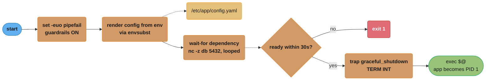
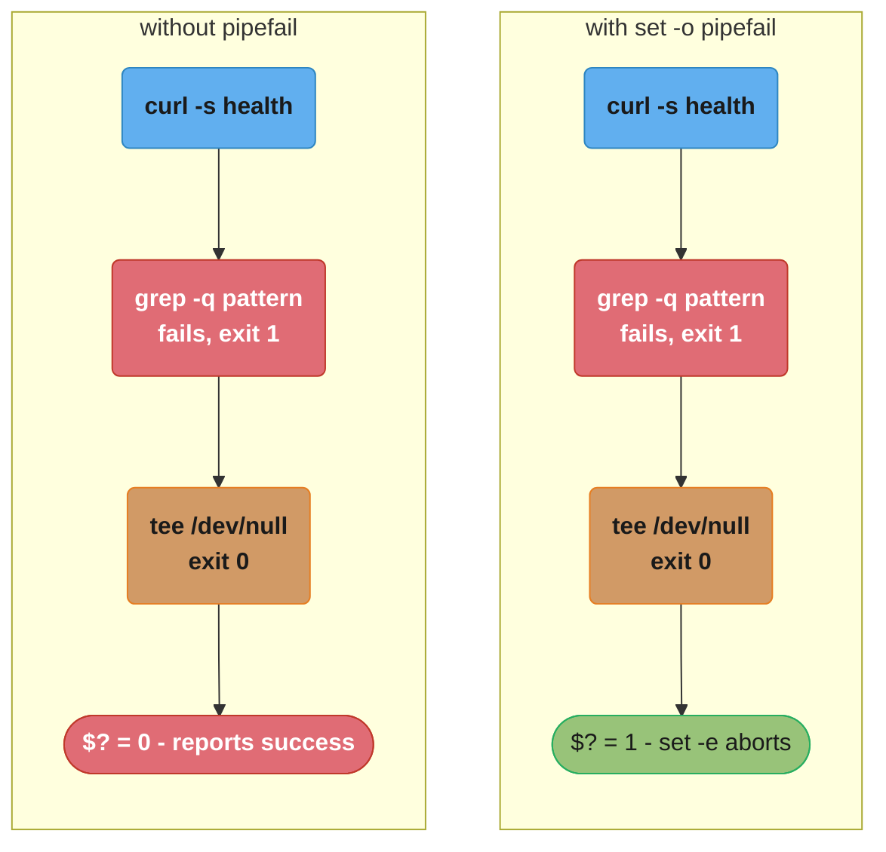
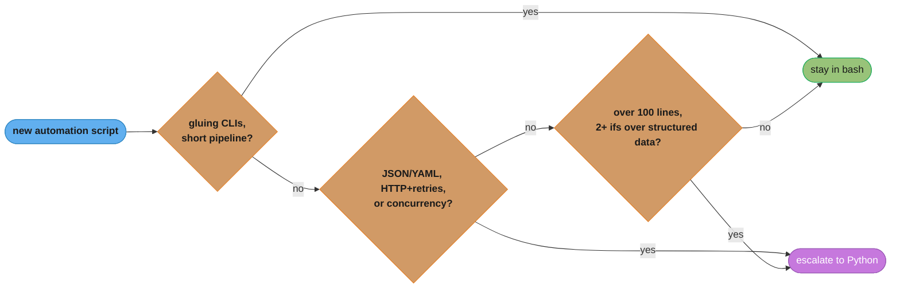

# Shell Scripting & Automation

> Phase 1 — Foundations · Difficulty: Beginner

Shell scripting is the connective tissue of DevOps. Every CI pipeline, container entrypoint, health check, and break-glass runbook step is ultimately a shell command. Writing scripts that are **idempotent**, **fail loudly**, and **handle edge cases** is the difference between automation you trust at 3 a.m. and automation that silently corrupts state.

---

## 1. Concept Overview

The shell (`bash`, `sh`, `zsh`) is both an interactive REPL and a programming language. In DevOps it shows up in three roles:

1. **Glue** — chaining tools (`kubectl … | jq … | xargs …`), wiring CI steps, container `ENTRYPOINT` scripts.
2. **Automation** — provisioning, deployment, backup, and cleanup scripts run by cron, systemd timers, or CI.
3. **Diagnosis** — one-liners that slice logs and `/proc` to answer "what's broken" fast.

The single most important concept is **failure semantics**: by default a shell script keeps running after a command fails, and `$?` (the exit code) of a pipeline is the *last* command's. Production scripts override this with `set -euo pipefail`.

For anything past ~50 lines or needing data structures, JSON, or robust error handling, **Python is the right escalation** — `bash` is for orchestration, not algorithms.

---

## 2. Intuition

> **One-line analogy**: A shell script is an assembly line — each station (command) passes its output to the next; without guardrails, a jammed station lets defective parts roll on undetected to the end.

**Mental model**: A script is a sequence of processes the shell forks and waits on, threaded together by file descriptors (stdin=0, stdout=1, stderr=2) and pipes. Exit code 0 means success; non-zero means failure. The shell's job is to start processes, route their streams, and branch on their exit codes — your job is to make sure a failure anywhere stops the line.

**Why it matters**: A deploy script that doesn't `set -e` will happily run "delete old version" even after "upload new version" failed — taking the service down. Idempotency matters because automation runs repeatedly (retries, cron, re-applied CI): a script must converge to the same end state whether run once or five times.

**Key insight**: Treat scripts like production code — they fail, they're retried, they run unattended. `set -euo pipefail`, quoting, and idempotency are not pedantry; they are the equivalent of input validation and error handling in any other language.

---

## 3. Core Principles

1. **Fail fast and loud.** `set -euo pipefail` turns silent failures into immediate exits.
2. **Quote everything.** `"$var"` prevents word-splitting and globbing disasters (`rm -rf "$dir"/` vs `rm -rf $dir /`).
3. **Be idempotent.** Re-running should not duplicate or break. Check-before-create; use `mkdir -p`, `kubectl apply` (not `create`).
4. **Make output structured and parseable.** Prefer `jq` over `grep|awk|cut` chains for JSON; emit machine-readable status.
5. **Separate orchestration from logic.** Bash orchestrates; complex logic belongs in Python/Go.
6. **Use exit codes as a contract.** 0 = success; document non-zero meanings; `trap` for cleanup.

---

## 4. Types / Architectures / Strategies

| Pattern | Use | Example |
|---------|-----|---------|
| One-liner pipeline | Ad-hoc diagnosis | `kubectl get po -o json \| jq -r '.items[].metadata.name'` |
| Entrypoint script | Container startup (config render, wait-for-deps, exec) | `exec "$@"` at the end |
| Idempotent provisioning | Cloud-init, bootstrap | `command -v docker \|\| install_docker` |
| Wrapper/guard | CI step with retries + cleanup | `trap cleanup EXIT` |
| Escalate to Python | JSON manipulation, API calls, retries with backoff | `boto3`, `requests`, `subprocess` |

### `set` flags decoded

| Flag | Effect |
|------|--------|
| `-e` (errexit) | Exit on any command returning non-zero |
| `-u` (nounset) | Error on use of an unset variable (catches typos) |
| `-o pipefail` | Pipeline returns the first non-zero exit, not the last |
| `-x` (xtrace) | Print each command before running (debugging) |
| `IFS=$'\n\t'` | Safer word-splitting (no space-splitting surprises) |

---

## 5. Architecture Diagrams

*A robust container entrypoint script — guardrails go on first, config and dependency checks happen next, then `exec` hands the process off to the app.*



---

## 6. How It Works — Detailed Mechanics

### A production-grade script skeleton

```bash
#!/usr/bin/env bash
set -euo pipefail
IFS=$'\n\t'

log()  { printf '%s [%s] %s\n' "$(date -u +%FT%TZ)" "$1" "${*:2}" >&2; }
die()  { log ERROR "$*"; exit 1; }

cleanup() { log INFO "cleaning up"; rm -f "${TMP:-}"; }
trap cleanup EXIT          # runs on any exit (success, error, or signal)

TMP="$(mktemp)"
: "${TARGET_ENV:?TARGET_ENV must be set}"   # fail with message if unset

main() {
  log INFO "deploying to ${TARGET_ENV}"
  kubectl apply -f manifests/ --context "$TARGET_ENV" \
    || die "kubectl apply failed"
  kubectl rollout status deploy/app --context "$TARGET_ENV" --timeout=120s \
    || die "rollout did not complete in 120s"
  log INFO "deploy complete"
}
main "$@"
```

### Why `pipefail` matters

```bash
# WITHOUT pipefail: this "succeeds" because grep's exit is masked by the last command.
curl -s https://api.example.com/health | grep -q '"status":"ok"' | tee /dev/null
echo $?   # 0  even if the health string was absent!

# WITH set -o pipefail: the grep failure (exit 1) propagates.
set -o pipefail
curl -s https://api.example.com/health | grep -q '"status":"ok"'
echo $?   # 1  -> script with set -e exits here
```

*How `$?` propagates through the same three-stage pipeline with and without `pipefail` — the middle command's failure is invisible until `pipefail` makes the pipeline report it.*



### jq for JSON (don't parse JSON with grep/awk)

```bash
# Get names of pods not in Running phase:
kubectl get pods -o json \
  | jq -r '.items[] | select(.status.phase != "Running") | .metadata.name'

# Build a JSON payload safely (jq handles escaping):
jq -n --arg env "$TARGET_ENV" --argjson replicas 3 \
  '{environment: $env, replicas: $replicas}'
```

### Idempotency in practice

```bash
# NOT idempotent: appends every run, duplicates the line.
echo "export PATH=$PATH:/opt/bin" >> ~/.bashrc

# Idempotent: only add if absent.
grep -qxF 'export PATH=$PATH:/opt/bin' ~/.bashrc \
  || echo 'export PATH=$PATH:/opt/bin' >> ~/.bashrc
```

### Retry with exponential backoff

```bash
retry() {
  local max=$1 delay=$2; shift 2
  local n=0
  until "$@"; do
    n=$((n+1))
    [ "$n" -ge "$max" ] && return 1
    sleep "$delay"; delay=$((delay*2))
  done
}
retry 5 2 curl -sf https://api.example.com/ready   # 2s,4s,8s,16s backoff
```

#### Decoding `delay=$((delay*2))`

```
delay_k    = initialDelay x 2^(k-1)              (wait before attempt k+1)
sleeps     = max - 1                             (the last failure returns, it never sleeps)
totalWait  = initialDelay x (2^(max-1) - 1)      (geometric series sum)
```

**Stated plainly.** "Wait twice as long after every failure, so a service that is briefly busy gets retried almost immediately while a service that is genuinely down stops being hammered within a few rounds."

The doubling exists to protect the *callee*, not the caller. A fixed 2-second retry from a hundred script instances is a sustained 50 requests/sec against something already struggling — the classic retry storm that turns a blip into an outage. Exponential growth makes the aggregate load decay on its own.

| Symbol | What it is |
|--------|------------|
| `max` (`$1`) | Total attempts, `5` here — not the number of *retries* |
| `initialDelay` (`$2`) | `2` seconds, the first backoff |
| `n` | Attempts made so far; the loop returns `1` once `n >= max` |
| `2^(k-1)` | The doubling factor after `k` failures |
| `until "$@"` | Runs the command first, sleeps only on failure — a healthy service costs 0 seconds |

**Walk one example.** `retry 5 2 curl ...` against a service that never comes back:

```
  attempt   command   n after   sleeps    cumulative wait
     1       fails       1        2 s          2 s
     2       fails       2        4 s          6 s
     3       fails       3        8 s         14 s
     4       fails       4       16 s         30 s
     5       fails       5      none          30 s   -> n >= max, return 1

  totalWait = 2 x (2^4 - 1) = 2 x 15 = 30 s across 5 attempts.
```

**Why one more attempt costs so much.** The total is exponential in `max`, so raising it feels cheap and is not:

```
  max = 3   ->  2 sleeps,  total wait     6 s
  max = 5   ->  4 sleeps,  total wait    30 s
  max = 7   ->  6 sleeps,  total wait   126 s   (over 2 minutes)
  max = 10  ->  9 sleeps,  total wait 1,022 s   (17 minutes)
```

Going from 5 to 10 attempts is a 2x change in the parameter and a **34x** change in wall-clock time. This is why retry loops need a total-deadline cap alongside the attempt count, and why the `--timeout=120s` on the `kubectl rollout status` above matters: without an outer bound, a backoff loop inside a CI job can silently hold a runner for a quarter of an hour.

One thing this implementation omits deliberately worth naming: there is no **jitter**. Every instance that started together retries at exactly 2s, 4s, 8s, 16s, so a fleet of 100 nodes recovering from the same outage arrives in synchronized waves. Production retry helpers randomize each delay (e.g. `sleep $((RANDOM % delay + 1))`) to spread the herd.

---

## 7. Real-World Examples

- **Container `ENTRYPOINT` scripts** render config from env vars (`envsubst`), wait for dependencies, then `exec "$@"` so the app inherits PID 1 and signals.
- **CI pipeline steps** are shell: GitHub Actions `run:` blocks, GitLab `script:`, Jenkins `sh`. They almost always need `set -euo pipefail` (GitHub Actions does NOT set it by default in `run:` — a common cause of "green but broken" jobs).
- **Cloud bootstrap** via EC2 user-data / cloud-init runs shell to install agents and join a cluster; must be idempotent because re-runs happen.
- **Kubernetes liveness/readiness `exec` probes** are commands (`sh -c 'pg_isready -h localhost'`); their exit code is the health signal.

---

## 8. Tradeoffs

| Decision | Bash | Python | Key factor |
|----------|------|--------|-----------|
| Tool gluing / piping | Excellent | Verbose | Bash wins for short pipelines |
| JSON/YAML manipulation | Painful (needs jq/yq) | Native | Python for structured data |
| Error handling | `set -e` + `trap` (coarse) | `try/except` (precise) | Python for complex flows |
| API calls + retries | `curl` + hand-rolled | `requests`/SDKs | Python for real logic |
| Portability/footprint | Everywhere, no deps | Needs interpreter + libs | Bash for minimal images |
| Readability past 100 lines | Degrades | Holds up | Escalate to Python |

---

## 9. When to Use / When NOT to Use

**Use shell when:** orchestrating CLI tools, writing entrypoints/probes, quick log/`/proc` diagnosis, and minimal-dependency bootstrap scripts.

**Escalate to Python/Go when:** you need data structures, robust error handling, JSON/HTTP work, concurrency, or the script exceeds ~100 lines. "If it has more than two `if`s and a loop over structured data, it wants to be Python."

*The escalation call as a decision tree — the same criteria as the tradeoffs table above, applied in the order that catches most scripts fastest.*



---

## 10. Common Pitfalls

**Pitfall 1 — No `set -euo pipefail`; deploy proceeds after a failed build.**

```bash
# BROKEN: build fails, but the script continues and deploys the OLD/empty artifact.
#!/bin/bash
make build              # fails (non-zero) but execution continues
aws s3 cp ./dist s3://releases/ --recursive   # uploads stale/missing files
kubectl rollout restart deploy/app            # ships broken release
```

```bash
# FIX: fail fast.
#!/usr/bin/env bash
set -euo pipefail
make build
aws s3 cp ./dist s3://releases/ --recursive
kubectl rollout restart deploy/app
```

**Pitfall 2 — Unquoted variables cause catastrophic globbing/splitting.**

```bash
DIR=""               # accidentally empty
rm -rf $DIR/*        # BROKEN: expands to "rm -rf /*"  -> deletes root
rm -rf "$DIR"/*      # FIX: with set -u and quoting, empty DIR errors instead of nuking /
```

**Pitfall 3 — Parsing structured output with line tools.** `kubectl get … | grep | awk '{print $3}'` breaks the moment column order or spacing changes. Use `-o jsonpath` / `jq` against a stable schema instead.

---

## 11. Technologies & Tools

| Tool | Purpose |
|------|---------|
| `bash` / POSIX `sh` | The shells themselves (sh for minimal images) |
| `jq` | JSON query/transform — essential for API/`kubectl -o json` |
| `yq` | YAML equivalent of jq |
| `sed` / `awk` | Stream editing, column extraction |
| `xargs` | Build command lines from input, parallelism (`-P`) |
| `envsubst` | Render templates from env vars |
| `shellcheck` | Static linter — catches quoting/`set` bugs in CI |
| `shfmt` | Formatter for consistent style |
| Python (`subprocess`, `requests`, SDKs) | Escalation for real logic |

---

## 12. Interview Questions with Answers

**Q1: What does `set -euo pipefail` do and why is each flag important?**
`-e` exits on any non-zero command so failures don't cascade; `-u` errors on unset variables, catching typos like `$DIR` vs `$DIRR`; `-o pipefail` makes a pipeline fail if *any* stage fails, not just the last. Together they convert silent, dangerous continuation into immediate, debuggable failure — the single most important line in any production script.

**Q2: Why quote variables, and what breaks without it?**
Unquoted `$var` undergoes word-splitting (on `IFS`) and glob expansion. `rm -rf $DIR/*` with an empty `DIR` becomes `rm -rf /*`; a path with spaces becomes multiple arguments. `"$var"` preserves it as a single literal token. The rule: quote unless you specifically want splitting.

**Q3: What makes a script idempotent and why does it matter for automation?**
Idempotent = running it N times yields the same end state as running it once. It matters because automation is retried (CI re-runs, cron, failed-then-resumed deploys). Use `mkdir -p`, `kubectl apply` over `create`, check-before-append, and conditional creation. Non-idempotent scripts duplicate resources or fail on the second run.

**Q4: When should you stop using bash and switch to Python?**
When you need data structures, JSON/YAML manipulation, HTTP calls with retries, concurrency, or precise error handling — or when the script passes ~100 lines. Bash excels at gluing CLIs and short pipelines; beyond that, its lack of real types, error handling, and testing makes Python/Go far safer.

**Q5: How do exit codes flow through a pipeline, and how does `pipefail` change it?**
By default `$?` of `a | b | c` is `c`'s exit code, so a failure in `a` or `b` is hidden. `set -o pipefail` makes the pipeline's exit code the rightmost non-zero one, surfacing upstream failures so `set -e` can act on them.

**Q6: What is `trap` used for in production scripts?**
`trap 'cmd' SIGNAL` registers cleanup/handlers. `trap cleanup EXIT` guarantees temp files are removed and locks released on any exit path; `trap 'graceful_shutdown' TERM INT` lets an entrypoint forward shutdown to the app. It's how scripts stay clean under both success and interruption.

**Q7: Why `exec "$@"` at the end of a container entrypoint?**
`exec` replaces the shell process with the app, so the app becomes PID 1 and receives signals (SIGTERM) directly instead of the shell swallowing them. Without `exec`, the shell stays PID 1, doesn't forward signals, and graceful shutdown breaks.

**Q8: GitHub Actions `run:` steps — what's a subtle failure mode?**
Each `run:` block runs in a shell that, by default, is NOT `set -euo pipefail` for multi-line scripts in the same way you'd expect; a failed command mid-block may not fail the step unless it's the last line, and piped failures are masked. Add `set -euo pipefail` at the top of multi-line `run:` blocks (or set `shell: bash` with explicit flags).

**Q9: How do you parse JSON safely in a shell pipeline?**
Use `jq`: `jq -r '.items[].metadata.name'`. It understands JSON structure, handles escaping, and survives whitespace/order changes that break `grep|awk|cut`. For building JSON, `jq -n --arg`/`--argjson` escapes values correctly, avoiding injection from unescaped input.

**Q10: What is `shellcheck` and where does it fit?**
`shellcheck` is a static analyzer that flags unquoted variables, missing `set` flags, useless `cat`, and dozens of common bugs. Running it as a required CI gate catches the exact classes of error (quoting, exit-code handling) that cause production incidents, before merge.

**Q11: Why can `set -e` combined with `pipefail` abort a script even when `grep` behaves correctly?**
`grep` exits with status 1 when it finds zero matches, which is a normal outcome, not a failure, but `set -e` treats that non-zero as fatal. A bare `count=$(grep -c pattern file.log)` run outside any conditional kills the script the moment zero matches is the best-case result, like "no errors found in today's log" — exactly the outcome you wanted to report as success. Inside an `if grep -q pattern file; then` construct this is harmless because the if context suppresses -e's exit-on-error behavior, but a standalone grep, diff, or cmp (all of which use non-zero for a legitimate "no result" case) isn't protected the same way. Guard any command whose "nothing found" case is expected with an explicit `|| true` or an `if`/`case`, and don't rely on `set -e` alone to distinguish "no results" from "broken."

**Q12: What happens if a script calls `trap` on EXIT more than once, and how does that bite tmpdir cleanup?**
Each call to `trap` on EXIT replaces the previous handler instead of adding to it, so only the last-registered cleanup actually runs. A script that runs `trap 'rm -rf "$TMPDIR1"' EXIT` early on and later `trap 'rm -rf "$TMPDIR2"' EXIT` elsewhere silently drops the first handler, so TMPDIR1 leaks on every single run. This is especially common when a script sources helper libraries that each try to register their own EXIT trap, unknowingly clobbering one another with no error or warning. Register exactly one `trap cleanup EXIT` per script, and have that single cleanup function remove every temp file, directory, and lock the script created, tracked in one array.

**Q13: Why is `for f in $(ls *.log); do ...` dangerous even though it looks idiomatic?**
The unquoted command substitution word-splits its output on whitespace, so a filename like "March 2024.log" becomes two separate loop items. `for f in $(ls *.log)` first expands the glob, then word-splits the command substitution's output again on IFS, breaking on every space, tab, and newline inside a filename, so "March 2024.log" turns into iterations "March" and "2024.log," neither of which exists on disk. The fix is to let the shell glob directly: `for f in *.log; do ... done` preserves each match as one token because globbing, unlike word-splitting, doesn't split on internal whitespace. Never loop over `ls` output — glob directly for simple cases, or use `find ... -print0` piped to a null-delimited read loop for recursive or complex matching.

**Q14: What's a concrete case where a grep-based JSON extraction returns the wrong value that `jq` would get right?**
A minified JSON payload with the same key name nested at two different levels makes a naive `grep -o` extraction pull the wrong occurrence. Given a payload where `status` appears both at the top level and nested inside a `metadata` object, `grep -o` matches whichever occurrence comes first in the raw text, and reformatting or minifying the JSON silently changes which value that is; `jq -r '.status'` instead walks the parsed structure and always returns the correct top-level field, regardless of nesting, whitespace, or where else that key name appears in the document. This class of bug is especially dangerous because it doesn't error — it returns a plausible-looking but wrong value, and nothing downstream signals a problem. Treat any JSON parsed by regex as a latent correctness bug, not a style nit, and require `jq` or a real parser for anything touching API responses.

**Q15: Why should the `retry()` backoff loop add random jitter, not just double the delay each time?**
Pure exponential backoff with no randomness makes many clients retry at the exact same instants, recreating the overload that caused the failures. If 500 clients all failed at once and all back off 2s, 4s, 8s, 16s deterministically, they all retry again at exactly the same wall-clock moments — the classic thundering-herd problem hitting a service that was just starting to recover. Adding jitter, for example sleeping the base delay plus a random amount up to that same delay instead of exactly the delay, spreads those same 500 retries across a window of seconds instead of a single instant. Add jitter by default to any retry loop that calls a shared service rather than a purely local operation — it costs one line and materially reduces cascading-failure risk.

**Q16: How do you tune `shellcheck`'s severity in a CI gate versus a developer's local run?**
`shellcheck` classifies findings into four severities — error, warning, info, and style — and the `-S` flag sets the minimum severity that fails the run. A CI gate typically runs `shellcheck -S warning` so it fails the build on real bugs like unquoted-variable warnings without blocking on pure style nits, while a separate, non-blocking job can run at `-S style` for extra polish suggestions. Individual findings can be suppressed inline with a `# shellcheck disable=SC2034` comment directly above the offending line when a warning is a deliberate false positive. Gate CI at `-S warning` or stricter, and require review of any inline disable comment since it silences a real check rather than fixing it.

---

## 13. Best Practices

- Start every script with `#!/usr/bin/env bash` and `set -euo pipefail`.
- Quote all expansions; use `"${var:?msg}"` to require critical inputs.
- Make scripts idempotent; prefer declarative tools (`apply`) over imperative (`create`).
- Use `trap … EXIT` for cleanup; `exec "$@"` in entrypoints.
- Use `jq`/`yq` for structured data; never parse JSON with `grep`.
- Lint with `shellcheck` and format with `shfmt` in CI.
- Log to stderr with timestamps; keep stdout for machine-readable results.
- Escalate to Python past ~100 lines or when logic gets real.

---

## 14. Case Study

### Scenario: A nightly backup script silently produced empty backups for two weeks

A cron job dumps a database to S3 nightly. After a schema migration renamed a credential env var, backups became 0-byte files — but the job kept exiting 0, so monitoring stayed green. The gap surfaced only when a restore was attempted.

*The silent-failure cascade: pg_dump's bad-credential failure is masked without `pipefail`, so gzip and `aws s3 cp` happily process and upload an empty stream, and the job still exits 0 — a false green in monitoring.*

```mermaid
flowchart LR
    classDef io      fill:#61afef,stroke:#2e86c1,color:#1a1a1a,font-weight:bold
    classDef frozen  fill:#c678dd,stroke:#9b59b6,color:#fff
    classDef train   fill:#98c379,stroke:#27ae60,color:#1a1a1a
    classDef mathOp  fill:#d19a66,stroke:#e67e22,color:#1a1a1a,font-weight:bold
    classDef lossN   fill:#e06c75,stroke:#c0392b,color:#fff,font-weight:bold
    classDef req     fill:#56b6c2,stroke:#0097a7,color:#1a1a1a
    classDef base    fill:#e5c07b,stroke:#f39c12,color:#1a1a1a

    Cron([cron]) --> BackupSh(backup.sh)
    BackupSh --> PgDump(pg_dump<br/>bad creds, empty stdout)
    PgDump -. "no pipefail:<br/>failure masked" .-> Gzip(gzip<br/>empty stream to tiny .gz)
    Gzip --> S3Cp(aws s3 cp<br/>uploads empty .gz)
    S3Cp --> FalseGreen(["exit 0, monitoring shows success"])

    class Cron req
    class BackupSh mathOp
    class PgDump lossN
    class Gzip mathOp
    class S3Cp base
    class FalseGreen lossN
```



```bash
# BROKEN: pipeline masks pg_dump failure; no size check; no verification.
#!/bin/bash
pg_dump "$DB" | gzip | aws s3 cp - "s3://backups/$(date +%F).sql.gz"
```

```bash
# FIX: fail fast, verify non-empty, and post-check the object size.
#!/usr/bin/env bash
set -euo pipefail
: "${DB:?DB connection string required}"
KEY="s3://backups/$(date -u +%F).sql.gz"

tmp="$(mktemp)"; trap 'rm -f "$tmp"' EXIT
pg_dump "$DB" | gzip > "$tmp"                       # failure now aborts (pipefail+errexit)

min_bytes=1048576                                   # expect at least 1 MiB
actual=$(stat -c%s "$tmp")
[ "$actual" -ge "$min_bytes" ] || { echo "backup too small: ${actual}B" >&2; exit 1; }

aws s3 cp "$tmp" "$KEY"
remote=$(aws s3api head-object --bucket backups --key "$(basename "$KEY")" --query ContentLength --output text)
[ "$remote" = "$actual" ] || { echo "upload size mismatch" >&2; exit 1; }
echo "backup OK: ${actual} bytes -> $KEY"
```

### Reading `min_bytes=1048576`

```
1048576 = 1024 x 1024 = 2^20 bytes = 1 MiB

  gate:  actual >= min_bytes           -> proceed
         remote == actual              -> upload verified byte-for-byte
```

**What the formula is telling you.** "A real backup of this database is never smaller than a megabyte, so anything under that is proof of failure even when every exit code says success."

The magic number is not arbitrary and it is not a size limit — it is a **liveness assertion** encoded as arithmetic. Exit codes tell you a command ran; a size floor tells you it produced something. The two checks answer different questions, which is why the fix needs both.

| Symbol | What it is |
|--------|------------|
| `1048576` | `2^20`, one mebibyte. Binary MiB, not the decimal 1,000,000-byte MB |
| `actual` | `stat -c%s` — local size of the gzipped dump, in bytes |
| `remote` | `ContentLength` from `head-object`, the size S3 actually stored |
| `actual >= min_bytes` | Catches the empty-dump class of failure |
| `remote = actual` | Catches truncated or interrupted uploads — a different failure entirely |

**Walk one example.** The two weeks of silent failure, scored against each gate:

```
  scenario                    actual bytes   >= 1,048,576?   remote == actual?   verdict
  healthy nightly dump         48,000,000        YES              YES            uploaded
  bad creds, empty stream              20        NO               --             ABORTS
  dump truncated mid-stream       900,000        NO               --             ABORTS
  full dump, upload cut short  48,000,000        YES              NO             ABORTS

  Under the BROKEN script every one of these rows exits 0.
```

Row two is the actual incident: gzip of an empty stream produces a valid ~20-byte file, so the artifact exists, the upload succeeds, and monitoring is green — for 14 nights. Note `1 MiB = 1,048,576` bytes is about 1.05x a decimal `1 MB`; the distinction is irrelevant at this threshold but matters the moment someone "rounds" the constant to `1000000` and quietly loosens the gate.

**Outcome:** the new script would have failed on night one with a clear error, paging the team instead of producing 14 useless backups. The lesson: **a backup that is never restore-tested and never size-verified is not a backup.**

**Discussion questions:**
1. Why did `set -o pipefail` alone not catch the small-but-valid output? (Empty input still gzips successfully.)
2. How would you add a periodic *restore* test to prove backups are usable, not just present?
3. What monitoring signal beyond "exit code 0" should this job emit? (Hint: backup size and age as metrics.)

---

**Cross-references:** [linux_and_os_fundamentals](../linux_and_os_fundamentals/) (signals, exec, exit codes), [ci_cd_fundamentals](../ci_cd_fundamentals/) (scripts as pipeline steps), [`../../python/stdlib_datetime_and_logging`](../../python/stdlib_datetime_and_logging/) (when to escalate to Python — `subprocess`, structured logging).
