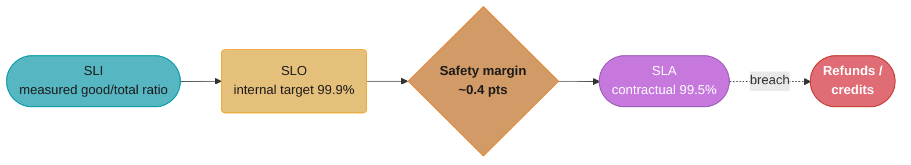
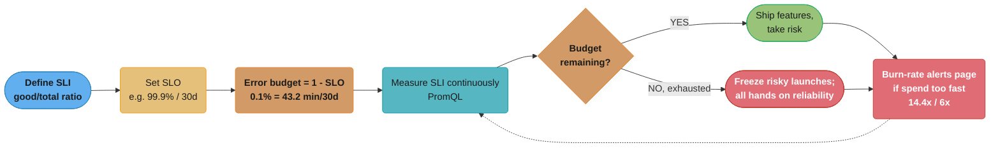
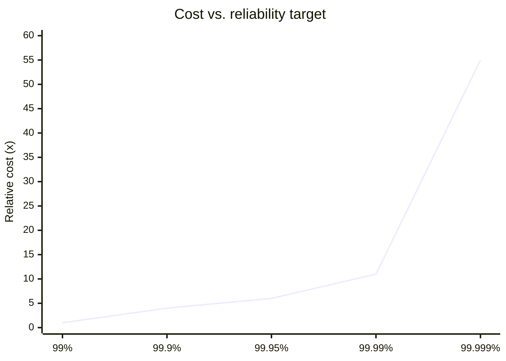
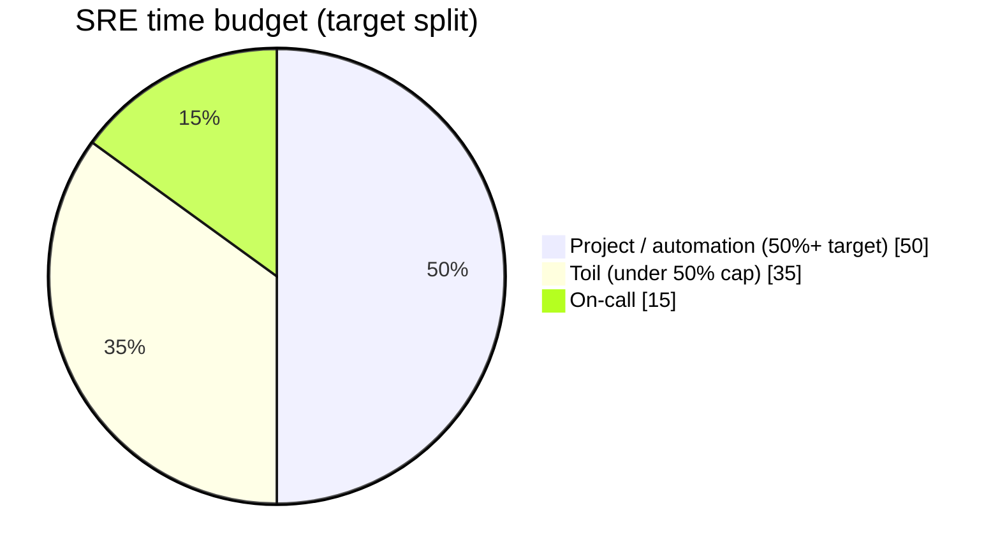
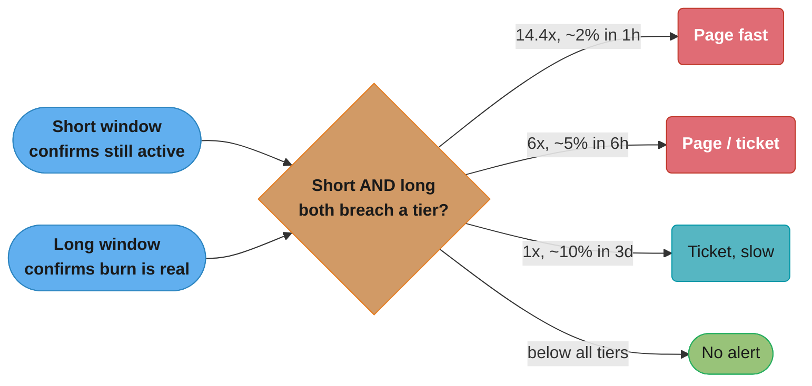
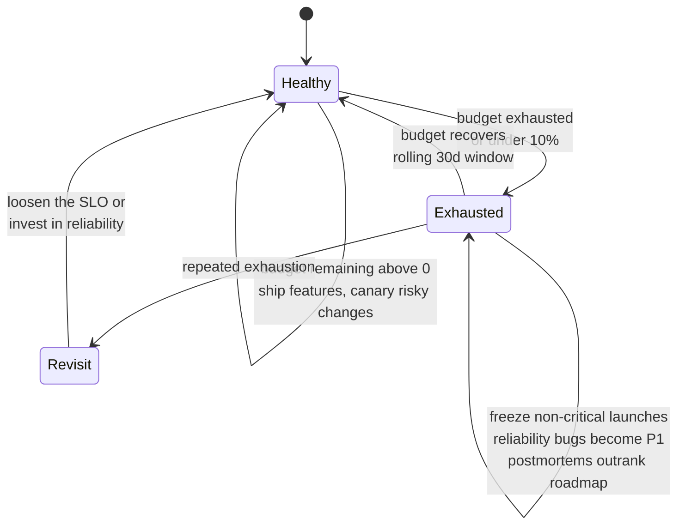

# SRE Principles & SLOs

> Phase 6 — Observability & SRE · Difficulty: Advanced

Site Reliability Engineering (SRE) is **what you get when you treat operations as a software problem** — Google's discipline for running reliable systems at scale by setting explicit reliability targets (SLOs), measuring them with SLIs, spending the resulting **error budget** to balance reliability against feature velocity, capping operational drudgery (**toil**), and automating relentlessly. The core insight: **100% reliability is the wrong target** — it's impossible, ruinously expensive, and unnecessary, because users can't tell the difference between 100% and 99.99%. This module covers SLI/SLO/SLA, error budgets and burn rate, toil, capacity planning, and the Google SRE practices that the industry standardized on.

---

## 1. Concept Overview

SRE rests on a small set of interlocking ideas:

- **SLI (Service Level Indicator)** — a quantitative measure of a service aspect, expressed as a *ratio of good events to total events*: e.g. `proportion of HTTP requests served in < 300ms`, or `proportion of requests that return non-5xx`. SLIs are measured from real telemetry (usually PromQL — see [observability_metrics_prometheus](../observability_metrics_prometheus/)).
- **SLO (Service Level Objective)** — a target value for an SLI over a window: e.g. `99.9% of requests succeed over 30 days`. It's an *internal* goal, deliberately set below 100%.
- **SLA (Service Level Agreement)** — a *contractual* promise to customers with financial consequences (refunds/credits) if breached. The SLA is always *looser* than the SLO (e.g. SLA 99.5%, SLO 99.9%) so you have an internal safety margin before contractual penalties.
- **Error budget** — the allowed unreliability: `error budget = 1 - SLO`. A 99.9% SLO over 30 days permits `0.1% × 30d = 43.2 minutes` of downtime/errors. This budget is *spent* by incidents, risky deploys, and experiments — and when it's exhausted, you stop shipping risk and focus on reliability.
- **Burn rate** — how fast you're consuming the budget relative to "evenly over the window." Burn rate `1x` exactly exhausts the budget at window end; `14.4x` exhausts it in ~1/14.4 of the window. Burn rate drives alerting (see [visualization_and_alerting](../visualization_and_alerting/)).
- **Toil** — manual, repetitive, automatable, reactive operational work that scales linearly with the service and produces no lasting value. SRE caps toil (Google's guidance: ≤ 50% of an SRE's time) so engineers have time to build automation.

The error budget is the keystone: it turns "how reliable should we be?" from an argument between dev (ship fast) and ops (stay stable) into a **shared number**. If budget remains, ship features and take risks. If it's exhausted, the policy freezes risky launches until reliability recovers. Reliability becomes a measurable, negotiable resource, not a vibe.

Other SRE pillars: **eliminating toil through automation**, **blameless postmortems** (see [incident_management_and_oncall](../incident_management_and_oncall/)), **capacity planning** based on demand forecasts and headroom, **release engineering** (canaries, progressive rollout), and **monitoring on the four golden signals** (latency, traffic, errors, saturation).

---

## 2. Intuition

> **One-line analogy**: An error budget is a monthly spending allowance. You don't aim to spend $0 (that means never leaving the house — no features shipped); you get a budget of "acceptable failure" to spend on launches and risk. Spend it wisely and you ship boldly; blow through it early and you're grounded until next month.

**Mental model**: Reliability is a dial, not a switch. Every nine you add (99% → 99.9% → 99.99%) costs exponentially more (redundancy, testing, on-call, slower releases). You pick the *cheapest* number of nines users can't tell apart from perfect, then manage the gap between that target and reality as a budget you spend on velocity.

**Why it matters**: Without SLOs, "is it reliable enough?" is an endless, political argument with no answer, and teams either over-invest in reliability nobody needs (killing velocity) or under-invest and ship outages. SLOs + error budgets make reliability an explicit, data-driven decision and give dev and ops a shared incentive instead of an adversarial one.

**Key insight**: **100% is the wrong reliability target.** Chasing it is infinitely expensive and pointless because the user's own network, device, and ISP already inject more unreliability than the last few nines you'd add. The right target is the *lowest* reliability your users tolerate — and the gap below 100% is a *budget you should actively spend* on shipping features, not a number to minimize.

---

## 3. Core Principles

1. **Set SLOs below 100%.** Pick the reliability users can't distinguish from perfect; the gap is your error budget.
2. **Error budget = (1 − SLO).** It's a shared currency: spend it on velocity when full, freeze risk when empty.
3. **Measure SLIs as good/total ratios** from real telemetry; SLAs are looser, contractual versions of SLOs.
4. **Cap toil (≤ 50%).** Automate repetitive ops work; toil that scales with the service is a bug to fix.
5. **Blameless culture.** Postmortems target systems and processes, not people (see [incident_management_and_oncall](../incident_management_and_oncall/)).
6. **Monitor the four golden signals:** latency, traffic, errors, saturation.
7. **Capacity-plan on forecasts + headroom**, not on last week's peak; plan for organic growth and failover.
8. **Reliability is a feature** with a cost; trade it explicitly against velocity via the error-budget policy.

---

## 4. Types / Architectures / Strategies

### SLI types and how they're measured

| SLI category | Measures | Example | Formula (good/total) |
|--------------|----------|---------|----------------------|
| Availability | Successful requests | non-5xx ratio | `good = non-5xx`, `total = all requests` |
| Latency | Fast-enough requests | p99 < 300ms | `good = requests under threshold` |
| Quality | Correct/full responses | non-degraded | `good = full-quality responses` |
| Freshness | Data recency | pipeline < 5m stale | `good = fresh reads` |
| Coverage | Processed share | 99.9% of records | `good = processed records` |
| Durability | Data not lost | objects intact | `good = retrievable objects` |

### Nines, downtime, and cost

| SLO | Error budget | Downtime / 30 days | Downtime / year | Rough relative cost |
|-----|--------------|--------------------|-----------------| --------------------|
| 99% (two nines) | 1% | 7h 12m | 3.65 days | 1x |
| 99.9% (three nines) | 0.1% | 43.2 min | 8.76 hours | ~3–5x |
| 99.95% | 0.05% | 21.6 min | 4.38 hours | ~6x |
| 99.99% (four nines) | 0.01% | 4.32 min | 52.6 min | ~10x+ |
| 99.999% (five nines) | 0.001% | 25.9 sec | 5.26 min | massive |

**What this actually says.** "Every downtime figure in this table is one multiplication: take the slice of the window you are allowed to fail, and convert it into minutes." The whole table is `downtime = (1 - SLO) x window_length` — there is no second idea hiding in it, which is why you can regenerate any row from memory in an interview.

| Symbol | What it is |
|--------|------------|
| `SLO` | The target success ratio, e.g. `0.999` for three nines |
| `1 - SLO` | The error budget as a *fraction* — the share of the window allowed to be bad |
| `window` | The measurement period, in whatever unit you want the answer: 30 d = 43,200 min, 1 yr = 525,600 min |
| `(1 - SLO) x window` | The error budget as *time* — the "Downtime" columns above |

**Walk one example.** Regenerate three rows of the table from scratch, 30-day window = 43,200 minutes:

```
  SLO        1 - SLO      x 43,200 min       = budget          sanity check
  99%        0.01         0.01   x 43,200    = 432    min      = 7h 12m
  99.9%      0.001        0.001  x 43,200    = 43.2   min      = 43m 12s
  99.99%     0.0001       0.0001 x 43,200    = 4.32   min      = 4m 19s

  Each added nine divides 1 - SLO by 10, so the budget also divides by 10:
     432 min  ->  43.2 min  ->  4.32 min  ->  0.432 min (25.9 sec)
```

The budget shrinks 10x per nine while the cost column climbs roughly 3-10x per nine. That divergence *is* the argument against chasing 100%: you pay exponentially more for a budget that is vanishing toward zero, and past three nines the remaining minutes are smaller than the failure the user's own ISP injects anyway.

### Burn-rate alert windows (Google SRE Workbook, 99.9% SLO)

| Burn rate | Budget consumed | Long window | Short window | Action |
|-----------|-----------------|-------------|--------------|--------|
| 14.4x | ~2% in 1h | 1h | 5m | Page (fast) |
| 6x | ~5% in 6h | 6h | 30m | Page/ticket |
| 1x | ~10% in 3d | 3d | 6h | Ticket (slow) |

**Read it like this.** "Pick how much of the month's budget you are willing to lose before someone wakes up, then work backwards to the multiplier that spends exactly that much in the alert window." The "Budget consumed" column is not decoration — it is the *design input*, and the burn rate is the derived number.

| Symbol | What it is |
|--------|------------|
| `burn rate` | Budget spend speed relative to "evenly across the window". `1x` = on pace to finish the budget exactly at day 30 |
| `long window` | The averaging period the burn rate is measured over. Long enough that a blip cannot trip it |
| `short window` | A second, shorter check on the same threshold. Proves the burn is *still happening right now* |
| `budget consumed` | `burn_rate x (long_window / 30d)` — the share of the whole month's budget spent inside that window |

**Walk one example.** Derive all three rows. A 30-day window is `30 x 24 = 720` hours, so one hour is `1/720` of the budget at `1x`:

```
  tier    burn    long window       consumed = burn x (window / 720h)
  fast    14.4x   1h                14.4 x (1   / 720)  = 0.0200  = 2%
  mid     6x      6h                6    x (6   / 720)  = 0.0500  = 5%
  slow    1x      3d = 72h          1    x (72  / 720)  = 0.1000  = 10%

  Time to fully exhaust a 30-day budget at each rate:
    14.4x  ->  30 / 14.4  =  2.08 days     page immediately
    6x     ->  30 / 6     =  5.00 days     page or ticket
    1x     ->  30 / 1     = 30.00 days     ticket; this is exactly "on pace"
```

Note the slow tier: `1x` is by definition *on budget*, not a failure. It gets a ticket rather than a page because sustaining exactly 1x leaves zero margin for the rest of the month — you will breach the moment anything else goes wrong.

**Why the short window has to exist.** Drop it and the long window alone keeps firing for the full averaging period after the incident is over: a 10-minute outage stays inside the 6-hour average for 6 hours, so the page will not clear even though the service recovered. The short window is what lets the alert resolve promptly, and it is also the reason both conditions are ANDed rather than ORed.

### Toil reduction ladder

| Level | State |
|-------|-------|
| Manual | Human does it every time (pure toil) |
| Documented | Runbook exists; still manual |
| Scripted | One command runs it |
| Self-service | Anyone triggers it safely without SRE |
| Automated | System does it; humans only on exception |

---

## 5. Architecture Diagrams

**SLI, SLO, SLA — how the three terms nest**



The SLA is always set looser than the SLO, so day-to-day reality breaches the internal target long before a contractual, revenue-bearing breach ever happens — the gap between 99.9% (SLO) and 99.5% (SLA) is the safety margin.

**The error-budget loop (the heart of SRE)**



SLIs are measured continuously against the SLO-derived budget: while budget remains, teams ship freely; once it's exhausted, launches freeze until reliability recovers, and burn-rate alerts (14.4x fast, 6x slower) page when the spend rate itself gets dangerous — closing the loop back into measurement.

**Nines vs. cost — why 100% is the wrong target**



Cost compounds steeply as the target climbs another nine, but the user-perceptible gap between 99.9% and 100% is already close to zero — see the nines/downtime/cost table above for the exact per-tier multipliers this curve is drawn from.

**Toil budget**



Google's guidance keeps project/automation work at half or more of an SRE's time; if sustained toil pushes past the 50% cap, that's a signal to hire or automate — toil that scales with the service is treated as a bug, not a fact of life.

**Multi-window, multi-burn-rate alert routing**



A single-window alert either flaps on noise or fires too slowly — pairing a short window (proves the burn is still happening) with a long window (proves it's sustained, not a blip) across the three severity tiers from the burn-rate table above is exactly what the alert config in Section 6 implements.

---

## 6. How It Works — Detailed Mechanics

### Defining an SLI in PromQL

```promql
# Availability SLI: proportion of successful (non-5xx) requests over 30 days.
sum(rate(http_requests_total{job="api", status!~"5.."}[30d]))
  /
sum(rate(http_requests_total{job="api"}[30d]))
# -> e.g. 0.9994  => 99.94% availability over the window

# Latency SLI: proportion of requests faster than 300ms (good = under-threshold bucket).
sum(rate(http_request_duration_seconds_bucket{job="api", le="0.3"}[30d]))
  /
sum(rate(http_request_duration_seconds_count{job="api"}[30d]))
```

### Error budget and budget remaining

```
SLO          = 99.9%  (0.999)
error budget = 1 - SLO = 0.001 (0.1%)
window       = 30 days = 43,200 minutes
budget time  = 0.001 * 43,200 = 43.2 minutes of allowed downtime/errors

budget consumed = (1 - actual_SLI) / (1 - SLO)
  e.g. actual SLI = 99.94% -> (1 - 0.9994)/(1 - 0.999) = 0.0006/0.001 = 0.6 = 60% consumed
budget remaining = 40%   ->  ship with care; you're more than half through.
```

**In plain terms.** "Divide how badly you actually did by how badly you were *allowed* to do; that ratio is the fraction of your budget you have spent." The subtraction from 1 on both sides is what makes it work — you are comparing two *failure* rates, not two success rates, and that is the single most common place this calculation gets botched.

| Symbol | What it is |
|--------|------------|
| `actual_SLI` | The measured good/total ratio over the window, e.g. `0.9994` |
| `1 - actual_SLI` | Observed failure ratio — what you actually spent |
| `1 - SLO` | Allowed failure ratio — the budget, e.g. `0.001` |
| `budget consumed` | `(1 - actual_SLI) / (1 - SLO)`. Above `1.0` means the SLO is already breached |
| `budget remaining` | `1 - consumed`, the headroom you may still spend on risk |

**Walk one example.** Four services on the same 99.9% SLO (budget `0.001` = 43.2 min per 30 days):

```
  service   actual SLI   1 - SLI    / 0.001   consumed   remaining   minutes left
  A         0.99990      0.0001       0.1        10%        90%       38.9 min
  B         0.99940      0.0006       0.6        60%        40%       17.3 min
  C         0.99900      0.0010       1.0       100%         0%        0.0 min
  D         0.99700      0.0030       3.0       300%      -200%       breached 3x over
```

Service A and service B differ by only `0.0005` in raw SLI — a number that looks like rounding noise on a dashboard. Expressed as budget, A has 90% left and B has 40% left. That amplification is the entire reason SRE teams put *budget consumed* on the dashboard instead of the raw availability percentage: the budget view makes a half-basis-point move legible as "you just spent half your month."

Service D shows why the metric is allowed to go negative. Clamping it at 100% would erase the difference between "just missed" and "missed by 3x", which is exactly the signal that tells you whether to freeze launches or to renegotiate the SLO outright.

```promql
# Error budget consumed as a fraction, in PromQL (for a budget dashboard panel).
(
  1 -
  ( sum(rate(http_requests_total{job="api", status!~"5.."}[30d]))
    / sum(rate(http_requests_total{job="api"}[30d])) )
) / (1 - 0.999)
# 0.6 = 60% of the 30-day error budget burned.
```

### Burn rate and where 14.4x comes from

```
burn rate = (observed error ratio) / (error budget fraction)
          = (1 - SLI_window) / (1 - SLO)

A burn rate of 1x consumes the WHOLE budget exactly over the SLO window (30d).
We want to PAGE if a 30-day budget would be gone in ~2 days:
   30 days / 2 days = 15x  ~~  Google uses 14.4x as the canonical fast threshold
   (14.4x over 1h consumes 14.4/720 = 2% of a 30-day budget in that hour).
```

**The idea behind it.** "Burn rate asks: at the speed I am failing right now, how many months' worth of budget would I get through in one month?" It is a pure ratio of two failure rates, so it is dimensionless — which is why one alert rule works identically for a 99.9% and a 99.99% SLO once you plug in the right `1 - SLO`.

| Symbol | What it is |
|--------|------------|
| `SLI_window` | Success ratio measured over the alert window (1h, 6h, ...), not over the full 30 days |
| `1 - SLI_window` | Observed failure ratio in that window |
| `1 - SLO` | The budget fraction, the denominator. `0.001` at 99.9% |
| `burn rate` | The quotient. `1x` = on pace; `14.4x` = burning 14.4 times faster than sustainable |
| `30 / burn_rate` | Days until the whole 30-day budget is gone at this rate |

**Walk one example.** One service, five different hours, SLO 99.9% so the denominator is fixed at `0.001`:

```
  observed errors   / 0.001   burn rate   budget spent this hour   budget gone in
  0.02%  (0.0002)     0.2       0.2x        0.2/720 = 0.028%        150.0 days
  0.10%  (0.0010)     1.0       1.0x        1.0/720 = 0.139%         30.0 days
  0.60%  (0.0060)     6.0       6.0x        6.0/720 = 0.833%          5.0 days
  1.50%  (0.0150)    15.0      15.0x       15.0/720 = 2.083%          2.0 days
  5.00%  (0.0500)    50.0      50.0x       50.0/720 = 6.944%          0.6 days
```

**Where 14.4 comes from, forwards instead of backwards.** The text above derives it from "gone in 2 days" (`30 / 2 = 15`). The cleaner derivation runs the other way: decide you will tolerate spending **2% of the month's budget in a single hour** before paging, then solve for the multiplier. One hour is `1/720` of the window, so `burn x (1/720) = 0.02` gives `burn = 0.02 x 720 = 14.4` exactly. The 14.4 is not a rounded 15 — it is the exact answer to "2% in 1h", and 15 is the rough sanity check.

A 0.2x hour is worth noticing too: burning *below* 1x is how the budget refills on a rolling window. This is the mechanism by which an `Exhausted` service returns to `Healthy` without anyone resetting a counter.

```yaml
# Multi-window, multi-burn-rate alert (canonical SRE pattern). SLO 99.9% -> budget 0.001.
groups:
  - name: slo-burn
    rules:
      - alert: BudgetBurnFast      # page: severe, act now
        expr: |
          (slo:errors:ratio_rate1h > (14.4 * 0.001))
          and (slo:errors:ratio_rate5m > (14.4 * 0.001))
        for: 2m
        labels: { severity: page }
      - alert: BudgetBurnSlow      # ticket: real but slower
        expr: |
          (slo:errors:ratio_rate6h > (6 * 0.001))
          and (slo:errors:ratio_rate30m > (6 * 0.001))
        for: 15m
        labels: { severity: ticket }
```

The short window confirms the burn is *current* (and lets the alert resolve quickly); the long window confirms it's *real* (not a transient blip). Routing of these alerts is owned by [visualization_and_alerting](../visualization_and_alerting/).

**Put simply.** "`14.4 * 0.001` is not a magic constant — it is the burn-rate multiplier times the budget, which turns an abstract burn rate back into a plain error ratio Prometheus can compare against." Every threshold in this file is that same two-factor product, so changing the SLO means editing exactly one number.

| Symbol | What it is |
|--------|------------|
| `slo:errors:ratio_rate1h` | Recording rule: observed *error* ratio averaged over the last 1h (not success ratio) |
| `0.001` | The budget fraction `1 - SLO` for a 99.9% SLO. The one number to change per service |
| `14.4 * 0.001` | The burn threshold re-expressed as an error ratio: `0.0144` = 1.44% errors |
| `and` | Long AND short must both breach. This is the noise filter, not a formality |
| `for: 2m` | Both conditions must hold continuously for 2 minutes before firing |

**Walk one example.** Turn each alert rule into the raw error percentage it actually watches for:

```
  rule              multiplier   x budget    threshold ratio    = errors
  BudgetBurnFast      14.4       x 0.001     = 0.0144            1.44%
  BudgetBurnSlow       6.0       x 0.001     = 0.0060            0.60%

  Same rules if the SLO were tightened to 99.99% (budget 0.0001):
  BudgetBurnFast      14.4       x 0.0001    = 0.00144           0.144%
  BudgetBurnSlow       6.0       x 0.0001    = 0.00060           0.060%
```

Tightening the SLO by one nine makes the page threshold ten times more sensitive automatically, because the multipliers stayed put and only the budget moved. That is the payoff of writing `14.4 * 0.001` rather than the pre-multiplied `0.0144`: the rule stays readable as "14.4x burn" and stays correct after an SLO change.

**What breaks without the `and`.** Keep only the 1h condition and a 3-minute outage stays averaged into the window for a full hour, so the page will not clear long after recovery. Keep only the 5m condition and every deploy blip pages someone at 3am. The conjunction is what buys fast detection and fast resolution at the same time.

### Error-budget policy (the document that gives SLOs teeth)



The policy (signed by eng + product leadership) is a two-mode state machine: budget remaining keeps the team in `Healthy` (ship freely, canary risk), exhaustion (or under 10%) flips it to `Exhausted` (freeze, P1 reliability work), and repeated exhaustion escalates to revisiting the SLO itself rather than living in a permanent freeze.

### Capacity planning math

```
Plan capacity from forecast demand + headroom + failover, not last week's peak.

  required_capacity = peak_demand_forecast / target_utilization  + N+1 failover
  example: forecast peak = 80,000 rps; target utilization = 60% (headroom for spikes/GC)
           per-instance capacity = 2,000 rps
           instances = 80,000 / (2,000 * 0.60) = ~67 instances
           + N+1 (lose one AZ of 3) -> provision 3/2 -> ~100 instances across 3 AZs
  reassess against organic growth (e.g. +30%/yr) and seasonal peaks (Black Friday x3).
```

**Stated plainly.** "Divide forecast peak demand by what one instance can safely carry — not by what it can carry flat out — then buy enough extra that losing a zone still leaves you above the first number." The division by `target_utilization` is the whole trick: it is what converts a raw capacity number into one with headroom already baked in.

| Symbol | What it is |
|--------|------------|
| `peak_demand_forecast` | Future peak load, from growth trends and seasonality. Not last week's peak |
| `per-instance capacity` | What one instance serves at 100% — measured by load test, not guessed |
| `target_utilization` | Fraction of that capacity you plan to actually use, e.g. `0.60`. Headroom for spikes and GC pauses |
| `per-instance x target_utilization` | Safe serving rate per instance, e.g. `2,000 x 0.60 = 1,200 rps` |
| `N+1 failover` | Extra capacity so losing one AZ of 3 still covers the forecast peak |

**Walk one example.** Push the module's own numbers through, then check the failover claim actually holds:

```
  forecast peak                                     80,000 rps
  per-instance capacity                              2,000 rps
  target utilization                                    60%

  safe rate per instance    2,000 x 0.60         =   1,200 rps
  instances needed          80,000 / 1,200       =    66.7   -> 67 instances
  N+1 across 3 AZs          67 x (3 / 2)         =   100.5   -> ~100 instances

  Verify the failover math -- lose one AZ of three:
    surviving instances     100 x (2 / 3)        =    66.7   -> ~67 instances
    surviving safe capacity 67 x 1,200           =  80,400 rps   >= 80,000 rps  ok
```

The `3/2` multiplier is doing precise work: you provision so that the *two* surviving AZs alone equal the 67 instances you needed in the first place. Provision the naive 67 across 3 AZs instead and an AZ loss leaves you 45 instances serving `45 x 1,200 = 54,000` rps against an 80,000 rps peak — a 32.5% shortfall, which is an SLO breach the moment a zone hiccups.

**Why the 60% is not wasted money.** At 100% target utilization the arithmetic gives `80,000 / 2,000 = 40` instances, which looks 40% cheaper. But an instance at 100% CPU has no room to absorb a traffic spike, a GC pause, or a retry storm, so queueing delay climbs sharply and latency SLIs break long before throughput does. The headroom is buying latency-SLI compliance, and the failover multiplier is buying availability-SLI compliance; both are budget items, not padding.

### Toil measurement

```
Track toil as a % of team time (timesheets/ticket tags). Google guidance: keep < 50%.
  toil = manual + repetitive + automatable + reactive + no-lasting-value + O(service growth)
  if a task is done > a few times/month and is automatable -> it's a candidate to kill.
  Goal: every quarter, automate the top toil source so toil trends DOWN as the service grows.
```

---

## 7. Real-World Examples

- **Google SRE**: originated the discipline; the SRE Book and SRE Workbook codified SLIs/SLOs, error budgets, the 50% toil cap, blameless postmortems, and burn-rate alerting that the industry adopted wholesale.
- **Error-budget freeze in practice**: teams that exhaust their budget enact a launch freeze — Google famously halts feature launches for a service until its rolling SLO recovers, which realigns dev incentives toward reliability without a manager mandate.
- **Netflix / chaos + reliability**: pairs SLO-driven reliability with chaos engineering (deliberately injecting failure) to validate that the system meets its SLO under real fault conditions (see [../../backend/chaos_engineering](../../backend/chaos_engineering)).
- **Amazon / two-pizza + operational ownership**: "you build it, you run it" pushes SRE-like ownership to product teams, with on-call and SLOs owned by the service team rather than a separate ops silo.
- **SLO tooling adoption**: companies generate SLOs and burn-rate alerts declaratively with Sloth/Pyrra/OpenSLO, turning an SLO spec into the recording rules + multi-window alert rules automatically.

---

## 8. Tradeoffs

| Decision | Option A | Option B | Key factor |
|----------|----------|----------|-----------|
| SLO target | More nines | Fewer nines | Cost/velocity vs perceived reliability |
| Reliability vs velocity | Freeze on budget exhaustion | Keep shipping | Stability vs feature speed (policy decides) |
| SLI source | Server-side metrics | Client-side / synthetic | Easy/complete vs true user experience |
| Window | Rolling 30d | Calendar month | Smooth signal vs simpler reporting |
| Toil | Tolerate (cheaper now) | Automate (invest) | Short-term cost vs long-term scale |
| Capacity | Just-in-time | Generous headroom | Cost vs spike/failover safety |
| Ownership | Central SRE team | Embedded/you-run-it | Consistency vs team autonomy |

---

## 9. When to Use / When NOT to Use

**Adopt SRE/SLO practices when:** you run user-facing services where reliability matters and is debated, you have enough traffic to measure SLIs meaningfully, and you want a data-driven way to balance reliability against feature velocity. Error budgets are most valuable where dev and ops tension exists and reliability decisions need an objective arbiter.

**Scope it down / reconsider when:** you have so little traffic that ratios are statistically noisy (a handful of requests can't produce a meaningful 99.9% — use coarser windows or simpler health checks); an early-stage product where shipping fast matters far more than a defined reliability target (premature SLOs add ceremony); or internal tools where downtime has trivial cost. Also avoid SLO theater — defining SLOs nobody enforces with an error-budget policy is worse than none, because it signals reliability is measured when it isn't. And never chase five nines on a service whose users would never notice three; that's burning money on unperceivable reliability.

---

## 10. Common Pitfalls

**Pitfall 1 — Targeting 100% (or too many nines).**

```
# BROKEN: "our SLO is 100% availability."
#  -> impossible (deploys, dependencies, the user's own network fail), so the budget is 0,
#     which means you can NEVER ship a risky change and every blip is an SLO breach.
#     Teams either lie about the number or burn out chasing it.
```

```
# FIX: set the SLO to the lowest reliability users can't distinguish from perfect.
#   SLO = 99.9% (43.2 min/30d budget) -> a real budget to spend on velocity.
#   Add nines only where data shows users actually feel the gap.
```

**Pitfall 2 — SLIs that don't reflect user experience.** Measuring availability as "the load balancer health check passed" can read 100% while users get 500s, because the health check doesn't exercise the real path. FIX: measure the SLI on actual user request outcomes (status codes, latency of real traffic), ideally as close to the user as possible (server edge or client/synthetic probes).

**Pitfall 3 — SLOs without an error-budget policy (no teeth).** Defining a 99.9% SLO but never acting when it's breached means the SLO is decoration; nothing changes when reliability degrades. FIX: write and get leadership to sign an error-budget policy that *automatically* triggers a launch freeze and reprioritization when the budget is exhausted — the policy, not a manager, enforces the tradeoff.

**Pitfall 4 — Letting toil grow with the service.** Treating manual operational work (restarts, manual scaling, ticket-driven provisioning) as "just the job" means ops load scales linearly with growth until the team is 100% firefighting and never automates. FIX: measure toil as a % of time, cap it (≤ 50%), and dedicate each quarter to automating the largest toil source so toil trends down as the service grows.

---

## 11. Technologies & Tools

| Tool | Purpose |
|------|---------|
| Prometheus | Measure SLIs; recording rules for budget/burn (see [observability_metrics_prometheus](../observability_metrics_prometheus/)) |
| Sloth / Pyrra | Generate SLO recording + multi-window burn-rate alert rules from a spec |
| OpenSLO | Vendor-neutral SLO specification format |
| Grafana | SLO/error-budget dashboards (see [visualization_and_alerting](../visualization_and_alerting/)) |
| Nobl9 | Managed SLO platform (multi-source SLIs, budgets) |
| Alertmanager / PagerDuty | Route burn-rate alerts to on-call |
| Blackbox exporter / synthetics | Client-side / probe SLIs for true user experience |
| Chaos tools (Gremlin, Chaos Mesh) | Validate SLOs under fault (see [../../backend/chaos_engineering](../../backend/chaos_engineering)) |
| Capacity/forecast tools | Demand forecasting for capacity planning |

---

## 12. Interview Questions with Answers

**Q1: Define SLI, SLO, and SLA and how they relate.**
An SLI is a measured indicator of service quality expressed as a good/total ratio (e.g. fraction of requests under 300ms); an SLO is an internal target for that SLI over a window (e.g. 99.9% over 30 days); an SLA is a contractual promise to customers with financial penalties if breached. They nest: the SLA is set looser than the SLO (e.g. SLA 99.5% vs SLO 99.9%) so you have an internal safety margin and detect trouble before you owe customers refunds. SLIs measure, SLOs target, SLAs commit.

**Q2: What is an error budget and why is it powerful?**
An error budget is the allowed unreliability, computed as `1 − SLO` (a 99.9% SLO gives a 0.1% budget = 43.2 min/30 days). It's powerful because it converts the perennial reliability-vs-velocity argument into a shared number: if budget remains, dev ships features and takes risks; if it's exhausted, the policy freezes risky launches and everyone focuses on reliability. Reliability becomes a measurable, spendable resource that both dev and ops are jointly accountable for, removing the political tug-of-war.

**Q3: Why is 100% reliability the wrong target?**
Because it's effectively impossible (deploys, dependencies, and the user's own device/network all fail), infinitely expensive to approach, and imperceptible to users — they can't tell 100% from 99.99% since their own connection injects more failure than your last nines would remove. Targeting 100% also leaves a zero error budget, so you can never ship a risky change and every transient blip is a "breach." The right target is the lowest reliability your users tolerate, leaving a budget to spend on velocity.

**Q4: How do you choose the right SLO target?**
Start from what users actually perceive and what the business needs: pick the lowest number of nines where users can't distinguish your service from perfect, informed by historical performance and competitor/contract expectations. Validate with data — if dropping from 99.99% to 99.9% produces no measurable change in user behavior or complaints, the extra nine is wasted money. Set the SLO slightly above the SLA for safety margin, and revisit it if you repeatedly exhaust the budget (too strict) or never come close (too loose).

**Q5: What is burn rate, and where does the 14.4x number come from?**
Burn rate is how fast you're consuming the error budget relative to "evenly over the window" — a burn rate of 1x exactly exhausts the budget at the window's end, 2x in half the time, and so on. The 14.4x fast-page threshold comes from wanting to alert when a 30-day budget would be gone in about 2 days (30/2 ≈ 15, rounded to Google's canonical 14.4x), which means in one hour you'd consume ~2% of the budget. You alert on high burn rates over short windows because that's the only way to detect "we'll breach the SLO soon" before it actually happens.

**Q6: Why use multi-window, multi-burn-rate alerts instead of a single threshold?**
A single short window flaps on transient spikes; a single long window detects severe burns far too slowly. Pairing a long window (confirms the burn is real and sustained) with a short confirmation window (ensures it's still happening and lets the alert clear quickly) gives both fast detection on severe burns and low noise. You then set multiple tiers — 14.4x → page fast, 6x → page/ticket, 1x → slow ticket — so severity matches how urgently the budget is being threatened.

**Q7: What is toil and why cap it at 50%?**
Toil is manual, repetitive, automatable, reactive operational work that scales linearly with the service and produces no lasting value — restarts, manual scaling, ticket-driven provisioning. Google caps it at 50% of an SRE's time because if toil consumes everything, the team never builds the automation that would reduce future toil, and ops load grows unbounded with the service. Capping it forces continuous investment in automation so the team's capacity scales sub-linearly with the system.

**Q8: How does the error-budget policy align dev and ops incentives?**
It makes the consequence of unreliability automatic and shared: when the budget is healthy, dev is free to ship fast and take risks (they "own" the budget to spend); when it's exhausted, the policy freezes feature launches and makes reliability bugs top priority for *everyone*, including dev. This removes the adversarial dynamic where ops wants to slow down and dev wants to speed up — both now optimize the same number, and the policy (signed by leadership) enforces the tradeoff without a manager arbitrating each time.

**Q9: What are the four golden signals?**
Latency (how long requests take, split by success/failure since failed-fast differs from succeeded-slow), traffic (demand on the system, e.g. requests/sec), errors (rate of failed requests), and saturation (how full the system is — the resource closest to its limit). Google's SRE book recommends them as the minimal monitoring set for any user-facing service because together they capture user experience and impending capacity problems. They map naturally onto SLIs (latency/errors) and capacity planning (saturation).

**Q10: How do you do capacity planning the SRE way?**
You plan from forecast demand plus headroom plus failover capacity, not from last week's peak: estimate future peak demand (organic growth, seasonal spikes), divide by a target utilization that leaves headroom for bursts/GC (e.g. 60%), and add N+1 redundancy so losing a zone/instance doesn't breach the SLO. For example, an 80k-rps forecast at 60% utilization on 2k-rps instances needs ~67 instances, provisioned to ~100 across three AZs for failover. You reassess regularly against growth and validate with load tests (see [../../backend/load_and_performance_testing](../../backend/load_and_performance_testing)).

**Q11: What's a blameless postmortem and why does it matter for reliability?**
A blameless postmortem analyzes an incident focusing on the systemic and process causes — what made the failure possible and what controls were missing — rather than blaming the individual who triggered it. It matters because blame drives people to hide mistakes and withhold information, which prevents the organization from learning, whereas a blameless culture surfaces the real contributing factors and produces durable fixes. The output is concrete, owned, tracked action items that reduce the chance of recurrence (covered in [incident_management_and_oncall](../incident_management_and_oncall/)).

**Q12: How do you measure an availability SLI in PromQL, and what's a common mistake?**
You compute the ratio of good events to total over the window — e.g. `sum(rate(http_requests_total{status!~"5.."}[30d])) / sum(rate(http_requests_total[30d]))` for request success. The common mistake is measuring something that isn't the user's experience, like a load-balancer health check that passes while real requests fail, which reports a falsely perfect SLI. Measure on actual user-facing request outcomes as close to the user as feasible (edge metrics or synthetic/client probes), and define "good" precisely (which status codes, which latency threshold).

**Q13: When should you NOT define formal SLOs?**
When traffic is too low for ratios to be statistically meaningful (a few requests can't sustain a 99.9% measurement — use coarser windows or simple health checks), when the product is early-stage and shipping speed dwarfs reliability concerns (premature SLOs add ceremony), or for internal/throwaway tools whose downtime costs nothing. Also avoid "SLO theater" — defining SLOs with no enforcing error-budget policy is worse than none because it implies reliability is managed when it isn't. SLOs are worth the overhead only where reliability is genuinely contested and measurable.

**Q14: How do you handle a service that keeps exhausting its error budget?**
First check whether the SLO is realistic — if the service architecturally can't hit it, the SLO may be too strict and should be renegotiated with stakeholders, or the architecture needs reliability investment (redundancy, dependency hardening). Enforce the error-budget policy: freeze risky launches, make reliability bugs P1, and prioritize postmortem action items over the roadmap until the budget recovers. Repeated exhaustion is a signal to either invest in reliability or consciously lower the target — the data forces an explicit decision rather than chronic firefighting.

**Q15: How does SRE differ from traditional ops/DevOps?**
Traditional ops is largely manual and reactive, with reliability as a vague aspiration and a hard org boundary between dev (ship) and ops (stabilize). SRE treats operations as a software problem: it sets explicit reliability targets (SLOs), measures them, manages an error budget that quantifies the velocity-vs-reliability tradeoff, caps manual toil so engineers automate, and runs blameless postmortems. DevOps is the broader cultural movement to break the dev/ops wall; SRE is a specific, prescriptive *implementation* of those principles with concrete practices (error budgets, the 50% toil cap, golden signals) — "class SRE implements interface DevOps."

---

## 13. Best Practices

- **Set SLOs below 100%** at the lowest reliability users can't distinguish from perfect; treat the gap as a budget to spend.
- **Compute error budget = (1 − SLO)** and track *budget remaining* on a dashboard; alert on burn rate, not raw thresholds.
- **Write and enforce an error-budget policy** signed by leadership — freeze risk when the budget is exhausted.
- **Measure SLIs on real user experience** (request outcomes, ideally edge/synthetic), defined precisely (which codes/thresholds).
- **Cap toil ≤ 50%;** measure it and automate the largest source every quarter so it trends down with growth.
- **Monitor the four golden signals;** capacity-plan from forecasts + headroom + N+1 failover, validated by load tests.
- **Run blameless postmortems** with owned, tracked action items (see [incident_management_and_oncall](../incident_management_and_oncall/)).
- **Generate SLOs/alerts as code** (Sloth/Pyrra/OpenSLO) and revisit targets when budgets are chronically over- or under-spent.

---

## 14. Case Study

### Scenario: A team chases 100%, burns out on toil, and still misses its real reliability goal

A payments team set an informal goal of "zero downtime." In practice this meant: no error budget, so every deploy was a fight; on-call manually restarted stuck pods, manually scaled for traffic spikes, and processed provisioning tickets — toil consumed ~80% of the team's time. Despite the heroics, the service still had outages (the real availability was ~99.7%), and dev and ops were in constant conflict over release pace. Nobody could say whether the service was "reliable enough" because there was no defined target.

```
# BROKEN: "100% / zero downtime" goal.
#  - error budget = 0  -> every risky deploy is forbidden in theory, done anyway in practice
#  - toil ~80% (manual restarts/scaling/tickets) -> no time to automate -> toil grows
#  - SLI measured by LB health check (reads 100% while users get 500s)
#  - no error-budget policy -> dev vs ops fight every release; reliability is a vibe, not a number
```

```promql
# FIX 1: define a real, user-facing SLI and a 99.9% SLO (budget = 43.2 min / 30d).
sum(rate(http_requests_total{job="payments", status!~"5.."}[30d]))
  / sum(rate(http_requests_total{job="payments"}[30d]))    # measured on real requests, not LB checks
```

```yaml
# FIX 2: burn-rate alerts replace manual watching (SLO 99.9% -> budget 0.001).
- alert: PaymentsBudgetBurnFast
  expr: |
    (slo:payments:errors_rate1h > (14.4 * 0.001))
    and (slo:payments:errors_rate5m > (14.4 * 0.001))
  for: 2m
  labels: { severity: page }
```

```
# FIX 3: error-budget policy (signed) + toil program.
#  - budget healthy -> ship features with canary; budget exhausted -> freeze launches, P1 reliability.
#  - automate the top toil source each quarter: HPA for autoscaling (kills manual scaling),
#    self-healing/liveness probes (kills manual restarts), self-service provisioning (kills tickets).
#    target: toil from 80% -> under 50% within two quarters.
```

After adoption: the SLI revealed the *true* 99.7% availability (the LB-check metric had been lying), so the team had a concrete gap to close. The error-budget policy ended the release fights — when the budget was healthy dev shipped freely, and when an incident burned it, launches froze automatically and reliability work took priority. Automating the top toil sources (autoscaling, self-healing, self-service provisioning) cut toil from ~80% to ~40%, freeing engineers to build more reliability. Within two quarters real availability rose to 99.92%, comfortably inside the 99.9% SLO with budget to spare for velocity.

**Outcome:** reliability became a measured number instead of a vibe, the dev/ops conflict was resolved by the shared error budget, toil was halved through automation, and the service got *more* reliable while shipping *faster* — the opposite of the "100%" approach's outcome.

**Discussion questions:**
1. Why did chasing "100% / zero downtime" produce *worse* reliability and constant conflict than a 99.9% SLO with an error budget?
2. How did the LB-health-check SLI hide the real reliability problem, and what should the SLI measure instead?
3. How does the error-budget policy resolve the dev-vs-ops tension without a manager arbitrating each release?

---

**Cross-references:** [observability_metrics_prometheus](../observability_metrics_prometheus/) (measure SLIs and compute budget/burn in PromQL), [visualization_and_alerting](../visualization_and_alerting/) (route burn-rate alerts; SLO/error-budget dashboards), [incident_management_and_oncall](../incident_management_and_oncall/) (blameless postmortems, on-call, MTTR/MTTD), [disaster_recovery_and_resilience](../disaster_recovery_and_resilience/) (availability targets drive DR/RTO/RPO), [../../backend/chaos_engineering](../../backend/chaos_engineering) (validate SLOs under injected failure), [../../backend/load_and_performance_testing](../../backend/load_and_performance_testing) (validate capacity plans), [kubernetes_scheduling_and_autoscaling](../kubernetes_scheduling_and_autoscaling/) (autoscaling as toil reduction).
