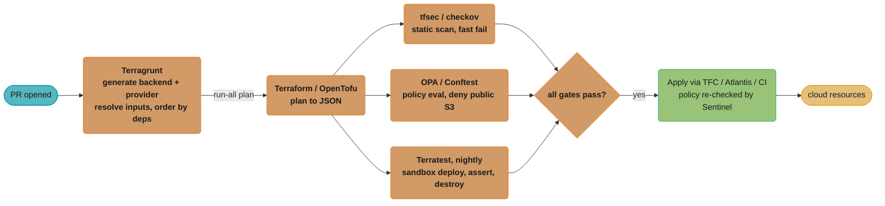
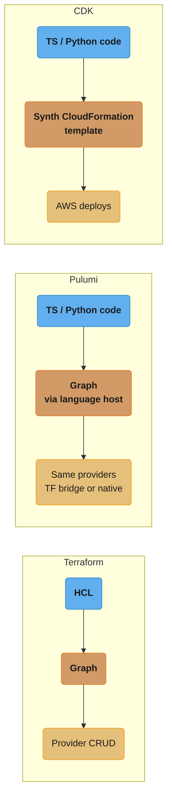
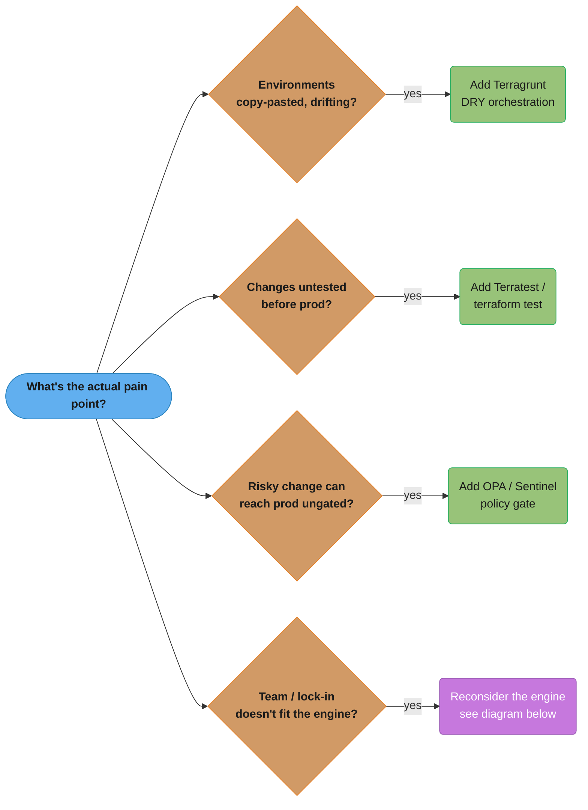
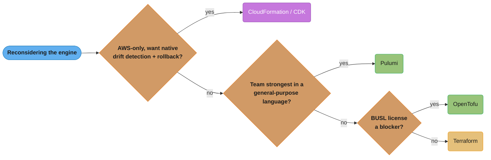

# Terraform Advanced & Alternatives

> Phase 4 — Infrastructure as Code & Config · Difficulty: Advanced

Once core Terraform (see [infrastructure_as_code_terraform](../infrastructure_as_code_terraform/)) is in production, the next problems are organizational, not syntactic: **how do you stay DRY across dozens of environments, test infrastructure before it ships, enforce policy, and pick the right tool from a crowded field** (Terragrunt, Pulumi, CloudFormation/CDK, OpenTofu)? This module covers the wrapper tooling, the IaC alternatives and their tradeoffs, infrastructure testing with Terratest, and policy-as-code with Sentinel and OPA.

---

## 1. Concept Overview

Plain Terraform scales technically but leaks repetition organizationally: every environment repeats a `backend` block, the same provider config, and the same module inputs with minor tweaks. The advanced ecosystem addresses four gaps:

1. **DRY orchestration** — **Terragrunt** wraps Terraform to generate backends/providers and pass inputs, keeping environments to a single source of truth, and runs many states in dependency order.
2. **Alternative engines** — **Pulumi** (real programming languages: TypeScript/Python/Go), **AWS CloudFormation**/**CDK** (AWS-native), and **OpenTofu** (the MPL fork of Terraform) trade off ergonomics, lock-in, and licensing.
3. **Testing** — **Terratest** (Go) and `terraform test` (native, 1.6+) actually deploy infrastructure into a sandbox, assert on it, and tear it down, catching regressions before production.
4. **Policy-as-code** — **Sentinel** (HashiCorp) and **OPA/Conftest** (Rego) evaluate plans against rules ("no public S3 buckets," "only approved instance types") and block non-compliant applies.

The unifying theme: as the *number* of states, teams, and compliance requirements grows, you add layers around the core `plan`/`apply` loop for reuse, safety, and governance.

---

## 2. Intuition

> **One-line analogy**: Core Terraform is a power drill. The advanced ecosystem is the workshop around it — a jig so every cut is identical (Terragrunt), a test rig to check the part before it ships (Terratest), a foreman who rejects unsafe work (Sentinel/OPA), and a choice of drill brands for different jobs (Pulumi, CDK, OpenTofu).

**Mental model**: Terraform answers "what does this one environment look like?" The advanced tools answer "how do I run this across 30 environments without copy-paste, prove it works, prevent dangerous changes, and stay off a single vendor's lock?" Each tool sits at a different layer: Terragrunt above Terraform (orchestration), Terratest beside it (verification), Sentinel/OPA in the pipeline (gating), and the alternatives below it (the engine itself).

**Why it matters**: At scale, copy-pasted Terraform diverges silently — `dev` and `prod` drift apart in config, not just runtime state. Untested infrastructure changes cause outages discovered in production. Ungated applies let one PR open a security hole. The wrong engine bakes in lock-in or fights your team's skills. These tools convert IaC from "works on my laptop" into a governed platform.

**Key insight**: **You don't choose one tool; you compose layers.** A mature shop commonly runs OpenTofu or Terraform *as the engine*, Terragrunt *for DRY orchestration*, Terratest *for verification*, and OPA *for policy* — each solving a distinct problem. The mistake is reaching for an alternative *engine* to fix a problem that's really about orchestration, testing, or policy.

---

## 3. Core Principles

1. **DRY across environments** — define the pattern once; environments supply only their deltas (Terragrunt inputs).
2. **Test infrastructure like code** — provision into a sandbox, assert, destroy; never let prod be the first run.
3. **Shift policy left** — evaluate rules at `plan` time in CI, before any resource is touched.
4. **Pick the engine for the team and lock-in profile** — HCL vs general-purpose language; multi-cloud vs AWS-native.
5. **Keep the blast radius bounded** — many small states orchestrated together beat one giant state.
6. **Reproducibility over cleverness** — pin versions, lock dependencies, and keep generated config deterministic.

---

## 4. Types / Architectures / Strategies

### IaC engines compared

| Tool | Language | Cloud scope | State model | Lock-in / license |
|------|----------|-------------|-------------|-------------------|
| Terraform | HCL | Multi-cloud | Own state file | BUSL (source-available) |
| OpenTofu | HCL | Multi-cloud | Own state file | MPL 2.0 (open source) |
| Pulumi | TS/Python/Go/C#/Java | Multi-cloud | Own state (Pulumi Cloud or self-managed) | Apache 2.0 |
| CloudFormation | YAML/JSON | AWS only | AWS-managed (stacks) | AWS-native |
| AWS CDK | TS/Python/Go/Java | AWS (synth → CFN) | Via CloudFormation | AWS-native |
| CDKTF | TS/Python/Go/Java | Multi-cloud (synth → TF) | Terraform state | Same as TF/OpenTofu |

### Orchestration / DRY tools

| Tool | What it adds over plain Terraform |
|------|-----------------------------------|
| Terragrunt | Generates `backend`/`provider`, passes `inputs`, runs dependency-ordered `run-all`, keeps env config DRY |
| Terraform workspaces | Multiple state files, one config (weaker isolation) |
| Terraform Cloud/Enterprise | Managed remote runs, VCS-driven, built-in Sentinel/RBAC |
| Atlantis | PR-comment-driven plan/apply with locking |

### Testing approaches

| Approach | Mechanism | Cost |
|----------|-----------|------|
| `terraform validate` | Syntax + type check (no deploy) | Free, fast |
| `terraform test` (1.6+) | Native HCL test files, optional real apply | Medium |
| Terratest (Go) | Real deploy → assert → destroy | High (real cloud cost + time) |
| `tflint`/`tfsec`/`checkov` | Static analysis | Free, fast |

### Policy-as-code

| Tool | Language | Integration |
|------|----------|-------------|
| Sentinel | Sentinel DSL | Terraform Cloud/Enterprise (native gating) |
| OPA / Conftest | Rego | CI step on `terraform show -json` plan output |
| `tfsec`/`checkov` | Built-in rules + custom | CI static scan (no plan needed) |

---

## 5. Architecture Diagrams

### Layered IaC platform



A PR's plan fans out to three independent gates — static scan, policy evaluation, and a nightly real-deploy test — and only reaches `apply` once every gate passes and Sentinel re-checks policy one more time.

### Terragrunt DRY layout

One source of truth, many environments: every child directory supplies only its deltas (`cidr`, `dependency`), while the root's `remote_state`/`provider` blocks are inherited, not repeated. This is a literal directory listing, not a topology, so it stays ASCII.

```
  live/
   +- terragrunt.hcl              # root: remote_state, generate provider
   +- prod/
   |   +- vpc/terragrunt.hcl       # source = "../../../modules/vpc", inputs = {cidr=10.2..}
   |   +- eks/terragrunt.hcl       # dependency { config_path = "../vpc" }  -> ordering
   +- dev/
       +- vpc/terragrunt.hcl       # same module, inputs = {cidr=10.1..}
  one module definition; environments differ ONLY by inputs
```

### Pulumi vs Terraform (engine difference)



All three compile down to a provider call, but Pulumi and CDK reach it through a language host and a synth step instead of Terraform's native HCL graph — that extra hop is the entire "engine difference."

---

## 6. How It Works — Detailed Mechanics

### Terragrunt — kill backend/provider duplication

```hcl
# live/terragrunt.hcl  (root, included by every child)
remote_state {
  backend = "s3"
  generate = { path = "backend.tf", if_exists = "overwrite" }
  config = {
    bucket         = "acme-tfstate"
    key            = "${path_relative_to_include()}/terraform.tfstate"  # auto per-dir key
    region         = "us-east-1"
    dynamodb_table = "tf-locks"
    encrypt        = true
  }
}
generate "provider" {
  path      = "provider.tf"
  if_exists = "overwrite"
  contents  = <<EOF
provider "aws" { region = "us-east-1" }
EOF
}
```

```hcl
# live/prod/eks/terragrunt.hcl  (child, DRY)
include "root" { path = find_in_parent_folders() }   # inherit backend + provider
terraform { source = "../../../modules/eks" }         # the reusable module
dependency "vpc" { config_path = "../vpc" }           # wait for vpc, consume its outputs
inputs = {
  cluster_name = "prod"
  vpc_id       = dependency.vpc.outputs.id
  subnet_ids   = dependency.vpc.outputs.private_subnets
}
```

```bash
terragrunt run-all plan    # plan every state, ordered by dependency graph
terragrunt run-all apply   # apply vpc before eks automatically
```

### Native `terraform test` (1.6+)

```hcl
# tests/vpc.tftest.hcl
run "creates_vpc_with_correct_cidr" {
  command = plan                       # plan-only assertion (fast, no real resources)
  variables { cidr = "10.0.0.0/16" }
  assert {
    condition     = aws_vpc.main.cidr_block == "10.0.0.0/16"
    error_message = "VPC CIDR did not match the requested input"
  }
}
```

```bash
terraform test    # runs *.tftest.hcl; `command = apply` would deploy & destroy for real
```

### Terratest — deploy, assert, destroy (Go)

```go
package test

import (
    "testing"
    "github.com/gruntwork-io/terratest/modules/terraform"
    "github.com/stretchr/testify/assert"
)

func TestVpcModule(t *testing.T) {
    opts := &terraform.Options{TerraformDir: "../examples/vpc"}
    defer terraform.Destroy(t, opts)        // ALWAYS clean up the sandbox
    terraform.InitAndApply(t, opts)         // real apply into a test account

    vpcID := terraform.Output(t, opts, "vpc_id")
    assert.Regexp(t, "^vpc-", vpcID)        // assert against live infrastructure
}
```

### OPA / Conftest — gate the plan in CI

```bash
terraform plan -out=tfplan
terraform show -json tfplan > plan.json
conftest test plan.json --policy policy/     # evaluate Rego rules; exit 1 on deny
```

```rego
# policy/s3.rego  -- deny any public S3 bucket
package main

deny[msg] {
  rc := input.resource_changes[_]
  rc.type == "aws_s3_bucket"
  rc.change.after.acl == "public-read"
  msg := sprintf("S3 bucket %q must not be public-read", [rc.address])
}
```

### Sentinel (Terraform Cloud/Enterprise) — native policy

```python
# restrict-instance-types.sentinel
import "tfplan/v2" as tfplan
allowed = ["t3.micro", "t3.small", "m5.large"]

main = rule {
  all tfplan.resource_changes as _, rc {
    rc.type is not "aws_instance" or
    rc.change.after.instance_type in allowed
  }
}
# enforcement level "hard-mandatory" blocks the apply if main is false
```

### Pulumi — IaC in a real language

```python
# __main__.py  (Pulumi, Python) -- loops/conditionals are native language constructs
import pulumi
import pulumi_aws as aws

vpc = aws.ec2.Vpc("main", cidr_block="10.0.0.0/16")
for i, az in enumerate(["us-east-1a", "us-east-1b"]):     # ordinary Python loop
    aws.ec2.Subnet(f"subnet-{az}", vpc_id=vpc.id,
                   cidr_block=f"10.0.{i}.0/24", availability_zone=az)
pulumi.export("vpc_id", vpc.id)
```

---

## 7. Real-World Examples

- **Gruntwork-style Terragrunt monorepo**: a `live/` tree with one `terragrunt.hcl` per state and a shared root generating backends — 40+ states across 4 accounts stay DRY, and `run-all apply` provisions a new account in dependency order.
- **Pulumi at data/ML shops**: teams already fluent in Python prefer Pulumi so infra lives in the same language/tests as the application, using loops and abstractions HCL makes awkward.
- **AWS-only org on CDK**: a team standardizes on AWS CDK (TypeScript) to synthesize CloudFormation, getting IDE autocomplete and type-checking while staying on AWS-native stacks and drift detection.
- **OpenTofu migration after the license change**: organizations uncomfortable with the BUSL swapped the binary to OpenTofu, re-ran `init`, and adopted OpenTofu-only features like client-side state encryption.
- **OPA in the PR pipeline**: a platform team runs Conftest on every plan JSON to block public S3, untagged resources, and oversized instances — see [policy_as_code_and_compliance](../policy_as_code_and_compliance/).

---

## 8. Tradeoffs

| Decision | Option A | Option B | Key factor |
|----------|----------|----------|-----------|
| Engine | Terraform/OpenTofu (HCL) | Pulumi (real language) | Declarative simplicity vs programming power |
| Cloud scope | CloudFormation/CDK (AWS) | Terraform (multi-cloud) | Native integration vs portability |
| License | Terraform (BUSL) | OpenTofu (MPL) | Vendor features vs open governance |
| DRY | Terragrunt | Plain dir-per-env | Less duplication vs fewer moving parts |
| Testing depth | `validate`/`test` (plan) | Terratest (real deploy) | Speed/cost vs real-world confidence |
| Policy engine | Sentinel (TFC-native) | OPA/Conftest (portable) | Tight integration vs tool-agnostic Rego |
| Run platform | Terraform Cloud | Atlantis (self-hosted) | Managed vs control/cost |

---

## 9. When to Use / When NOT to Use



Each pain point maps to one layer, and three of the four are narrow, safe additions on top of the existing engine. Only the fourth — the engine itself not fitting the team or the lock-in profile — ever justifies touching the engine layer; the module's recurring warning is that teams reach for that lever far more often than this diagram says they should.



This sub-decision only applies once the engine is genuinely the bottleneck: AWS-native drift detection favors CloudFormation/CDK, a language/abstraction need favors Pulumi, and a pure licensing objection favors OpenTofu over plain Terraform.

**Use Terragrunt when:** you have many environments/states that share structure and you're tired of copy-pasted backends and inputs — but you're keeping Terraform/OpenTofu as the engine. **Use Pulumi when:** your team is strongest in a general-purpose language and you need real abstractions/loops, or you want infra and app code unified. **Use CloudFormation/CDK when:** you're AWS-only and value native drift detection, stack rollback, and zero extra state to manage. **Use OpenTofu when:** the BUSL license is a concern or you want its open-governance features.

**Reconsider when:** Terragrunt for a single small environment is overhead — plain Terraform is simpler. Pulumi tempts teams into imperative spaghetti; if your infra is genuinely declarative, HCL keeps it honest. CDK/CloudFormation lock you to AWS — avoid if multi-cloud is real. Terratest is expensive (real cloud spend, slow); reserve it for module-level confidence and use `validate`/static analysis for fast PR feedback. Don't switch *engines* to solve a *policy* or *DRY* problem.

---

## 10. Common Pitfalls

**Pitfall 1 — Copy-pasted environments drift apart.**

```hcl
# BROKEN: each env hand-maintains its own backend + provider + module call.
# live/dev/main.tf and live/prod/main.tf are 95% identical copies.
# Someone fixes a tag default in prod, forgets dev -> environments silently diverge,
# and "dev mirrors prod" is now a lie that surfaces during an incident.
terraform { backend "s3" { bucket = "...", key = "dev/vpc.tfstate" /* hand-edited */ } }
module "vpc" { source = "../../modules/vpc", cidr = "10.1.0.0/16" /* + 30 repeated lines */ }
```

```hcl
# FIX: Terragrunt — one root generates backend/provider; children supply only deltas.
include "root" { path = find_in_parent_folders() }      # backend + provider inherited
terraform { source = "../../../modules/vpc" }
inputs = { cidr = "10.1.0.0/16" }                         # the ONLY thing that differs
# A change to the shared root or module applies everywhere -> no silent divergence.
```

**Pitfall 2 — Policy checks run *after* apply (or not at all).** A PR adds a public S3 bucket; nobody notices until a scanner flags it in production. FIX: run OPA/Conftest (or Sentinel in TFC) on the *plan JSON* in CI so the non-compliant change is blocked before any resource exists — shift policy left (see [policy_as_code_and_compliance](../policy_as_code_and_compliance/)).

**Pitfall 3 — Terratest that doesn't clean up.** A test `apply`s real infra and the run fails before teardown, leaking resources that cost money and clutter the account. FIX: always `defer terraform.Destroy(t, opts)` immediately after defining options, run tests in an isolated sandbox account, and add a nightly orphan-resource sweeper.

**Pitfall 4 — Treating Pulumi like a script.** Engineers write imperative code with side effects (API calls, file writes) inside Pulumi programs, breaking the declarative diff model and producing non-deterministic deploys. FIX: keep Pulumi programs pure declarations of resources; push imperative work to providers or separate steps, just as you would with HCL.

**Pitfall 5 — Mixing engines on the same resources.** A team manages a VPC in CloudFormation and then imports it into Terraform too; both tools now think they own it and fight over drift. FIX: one engine owns each resource; if migrating, fully import into the new tool and delete the old stack's management of it.

---

## 11. Technologies & Tools

| Tool | Purpose |
|------|---------|
| Terragrunt | DRY orchestration, generated backends/providers, dependency-ordered runs |
| Pulumi | IaC in TypeScript/Python/Go/C#/Java |
| AWS CloudFormation | AWS-native declarative stacks |
| AWS CDK | Synthesize CloudFormation from real languages |
| CDKTF | Synthesize Terraform from real languages |
| OpenTofu | MPL-licensed Terraform fork (drop-in CLI) |
| `terraform test` | Native HCL test framework (1.6+) |
| Terratest | Go-based real-deploy infrastructure tests |
| OPA / Conftest | Rego policy on plan JSON |
| Sentinel | HashiCorp policy DSL (Terraform Cloud/Enterprise) |
| Atlantis / Terraform Cloud | PR-driven runs, locking, policy |

---

## 12. Interview Questions with Answers

**Q1: What problem does Terragrunt solve that plain Terraform doesn't?**
Terragrunt eliminates the repetition of `backend`, `provider`, and `inputs` blocks across many environments by generating them from a shared root and letting each child supply only its deltas. It also runs many states in dependency order (`run-all`) and wires outputs between them via `dependency` blocks. Use it when you have enough environments/states that copy-paste causes silent divergence; for a single small stack it's unnecessary overhead.

**Q2: Pulumi vs Terraform — when would you pick each?**
Terraform/OpenTofu uses declarative HCL, which keeps infrastructure honest and is easy to review, while Pulumi uses real languages (TypeScript/Python/Go), giving you loops, conditionals, abstractions, and the same test tooling as your app. Pick Pulumi when your team is strongest in a programming language or needs genuine abstraction; pick Terraform when the infra is straightforwardly declarative and you want the larger ecosystem and reviewability. The risk with Pulumi is teams writing imperative spaghetti that breaks the declarative diff model.

**Q3: CloudFormation/CDK vs Terraform — what's the tradeoff?**
CloudFormation is AWS-native with managed stacks, automatic rollback on failure, and built-in drift detection, and CDK lets you synthesize those stacks from real languages — but both lock you to AWS. Terraform is multi-cloud and provider-agnostic with a richer module ecosystem, at the cost of managing your own state and lacking native stack rollback. Choose CloudFormation/CDK for AWS-only shops that value native integration; choose Terraform when multi-cloud or provider breadth matters.

**Q4: What is OpenTofu and why does it exist?**
OpenTofu is a fork of Terraform created after HashiCorp relicensed Terraform from MPL 2.0 to the BUSL in 2023; it's MPL-licensed, Linux Foundation-backed, and a drop-in CLI replacement. Migration is largely swapping the binary and re-running `init`, since HCL/providers/workflow are shared. It has begun shipping its own features (e.g., client-side state encryption, enhanced for_each), so the engines are slowly diverging — choose based on licensing comfort and the specific features each offers.

**Q5: How do you test infrastructure code, and what's the difference between `terraform test` and Terratest?**
`terraform test` (1.6+) runs native HCL `*.tftest.hcl` files with `assert` blocks, defaulting to plan-only checks (fast, free) but able to do real `apply`/destroy; Terratest is a Go framework that always deploys real infrastructure into a sandbox, asserts against it, and tears it down. Use static analysis and `terraform test` plan-mode for fast PR feedback, and reserve Terratest for module-level confidence where you must verify the resource actually works (e.g., the load balancer serves traffic). Always ensure teardown runs even on failure.

**Q6: What is policy-as-code and where in the pipeline does it run?**
Policy-as-code expresses governance rules ("no public S3," "only approved instance types," "all resources tagged") as code evaluated automatically against a Terraform plan. It runs at `plan` time in CI — OPA/Conftest on the plan JSON, or Sentinel natively in Terraform Cloud — so non-compliant changes are blocked before any resource is created. Running it pre-apply (shift-left) is the whole point; catching a public bucket after it's live is a security incident, not a policy check.

**Q7: Sentinel vs OPA — how do they differ?**
Sentinel is HashiCorp's policy DSL, tightly integrated into Terraform Cloud/Enterprise with native enforcement levels (advisory, soft-mandatory, hard-mandatory) on runs; OPA uses the general-purpose Rego language and runs anywhere via Conftest on plan JSON, making it portable across tools (Kubernetes, Docker, CI). Choose Sentinel if you're on Terraform Cloud/Enterprise and want zero-glue integration; choose OPA if you want one policy engine across your whole stack and to avoid vendor lock-in. Many teams pick OPA for portability.

**Q8: How do you keep Terratest from leaking expensive cloud resources?**
Use `defer terraform.Destroy(t, opts)` placed immediately after the options struct so teardown runs even when assertions panic, and run tests in a dedicated sandbox account with strict budget alarms. Add a scheduled orphan-sweeper that deletes test-tagged resources older than a threshold, and keep tests small and parallel-safe. Real-deploy tests cost real money and minutes, so run them on a schedule or for module changes, not on every commit.

**Q9: When does adding these advanced tools become over-engineering?**
When the problem they solve doesn't exist yet: Terragrunt for one environment, Terratest on every commit for a stable module, or a policy engine before you have any policies are all premature. Each tool adds a moving part to learn and maintain, so adopt them in response to a felt pain — divergence, a production surprise, a compliance requirement — not preemptively. The senior move is matching the layer (engine/orchestration/testing/policy) to the actual problem.

**Q10: How does CDKTF differ from AWS CDK?**
AWS CDK synthesizes CloudFormation templates and deploys via AWS, so it's AWS-only and uses CloudFormation state; CDKTF synthesizes Terraform configuration and uses Terraform state and providers, so it's multi-cloud. Both let you write infrastructure in TypeScript/Python/Go/Java with type-checking and IDE support. Choose CDKTF when you want real-language ergonomics but need Terraform's provider breadth and multi-cloud reach; choose AWS CDK when you're committed to AWS-native tooling.

**Q11: How do you safely migrate from Terraform to OpenTofu (or vice versa)?**
Pin the current Terraform version and back up state, then install the OpenTofu binary and run `tofu init` against the same backend — the state format is compatible at the fork point, so existing state is read directly. Run `tofu plan` and confirm it shows no changes (proving parity) before applying anything, and update CI to call the new binary. Watch for version-specific feature divergence as the projects evolve, and migrate one state at a time rather than all at once.

**Q12: How do you compose these tools into one delivery pipeline?**
A typical layered pipeline: Terragrunt resolves backends/inputs and orders states, Terraform/OpenTofu produces a JSON plan, static scanners (`tfsec`/`checkov`) fail fast, OPA/Conftest (or Sentinel) gates on policy, and a nightly Terratest job verifies modules in a sandbox; only after all gates pass does Atlantis or Terraform Cloud apply. Each stage owns a distinct concern — DRY, planning, scanning, policy, verification, execution — so a failure points at exactly one layer. This is the mature shape of a governed IaC platform (see [ci_cd_fundamentals](../ci_cd_fundamentals/) and [policy_as_code_and_compliance](../policy_as_code_and_compliance/)).

---

## 13. Best Practices

- Keep **Terraform/OpenTofu as the engine** and add Terragrunt only when environment duplication causes real divergence.
- **Shift policy left**: run OPA/Conftest or Sentinel on the **plan JSON** in CI, before apply — never audit after the fact.
- Use a **layered pipeline** (DRY → plan → static scan → policy → verify → apply) so each failure maps to one concern.
- Reserve **Terratest for module-level confidence**; always `defer Destroy`, run in a sandbox account, and sweep orphans.
- **One engine per resource** — never let CloudFormation and Terraform both manage the same thing.
- For **Pulumi/CDK, stay declarative**: no imperative side effects inside the program.
- **Pin versions and lock dependencies** in every tool; keep generated config (Terragrunt) deterministic.
- Choose the engine by **team skills and lock-in tolerance**, not hype; document the decision.

---

## 14. Case Study

### Scenario: A scale-up's IaC is unreviewable, untested, and lets a public bucket reach production

A scale-up has 30+ Terraform states across dev/staging/prod, each a hand-maintained copy. A new feature ships an S3 bucket accidentally set to `public-read`; it reaches production and exposes customer exports for 6 hours before a scanner flags it. Meanwhile, a module change that worked in dev breaks in prod because nothing tested it, and `dev` and `prod` configs have quietly diverged in 14 places.

```hcl
# BROKEN: copy-pasted envs, no policy gate, no tests.
# live/prod/storage/main.tf (one of 30 near-duplicate files)
terraform { backend "s3" { bucket = "acme-tf", key = "prod/storage.tfstate" } }
provider "aws" { region = "us-east-1" }            # repeated in all 30 files
resource "aws_s3_bucket" "exports" { bucket = "acme-prod-exports" }
resource "aws_s3_bucket_acl" "exports" {
  bucket = aws_s3_bucket.exports.id
  acl    = "public-read"                            # nobody reviewed/blocked this
}
```

```hcl
# FIX part 1: Terragrunt removes duplication; one root, children supply only deltas.
# live/prod/storage/terragrunt.hcl
include "root" { path = find_in_parent_folders() }  # backend + provider inherited
terraform { source = "../../../modules/storage" }
inputs = { bucket_name = "acme-prod-exports", environment = "prod" }
```

```rego
# FIX part 2: OPA policy blocks public buckets at plan time, before apply.
# policy/s3_public.rego
package main
deny[msg] {
  rc := input.resource_changes[_]
  rc.type == "aws_s3_bucket_acl"
  rc.change.after.acl == "public-read"
  msg := sprintf("%q is public-read; denied by policy", [rc.address])
}
```

```go
// FIX part 3: Terratest proves the module deploys and the bucket is private.
func TestStoragePrivate(t *testing.T) {
    opts := &terraform.Options{TerraformDir: "../examples/storage"}
    defer terraform.Destroy(t, opts)
    terraform.InitAndApply(t, opts)
    acl := terraform.Output(t, opts, "bucket_acl")
    assert.Equal(t, "private", acl)
}
```

The CI pipeline now runs `terragrunt run-all plan` → `tfsec` → `conftest test plan.json` → (nightly) Terratest, and only applies via Atlantis after every gate passes. The public-bucket PR is rejected by OPA before any resource is created; the module is verified in a sandbox before it can reach prod; and the 30 environments share one root and one module, so a fix applies everywhere instead of diverging.

**Outcome:** the public-bucket class of incident became impossible (policy gate blocks it pre-apply), config divergence across environments dropped to zero (single source of truth via Terragrunt), and a broken module is now caught by Terratest in a sandbox instead of in production. The team's mean time to provision a new environment fell from a day of copy-paste to a single `run-all apply`.

**Discussion questions:**
1. Why is blocking the public bucket at `plan` time fundamentally safer than detecting it post-deploy with a scanner?
2. How does Terragrunt's single-root model prevent the 14-way config divergence the team suffered?
3. Terratest costs real money and minutes — how would you decide which modules get Terratest coverage versus only `terraform test` plan-mode?

---

**Cross-references:** [infrastructure_as_code_terraform](../infrastructure_as_code_terraform/) (core Terraform this builds on), [policy_as_code_and_compliance](../policy_as_code_and_compliance/) (OPA/Sentinel governance in depth), [ci_cd_fundamentals](../ci_cd_fundamentals/) (the pipeline these gates live in), [configuration_management](../configuration_management/) (server config alongside provisioning), [secrets_management](../secrets_management/) (keeping secrets out of state and plans), [devsecops_and_supply_chain_security](../devsecops_and_supply_chain_security/) (scanning IaC in the SDLC).
