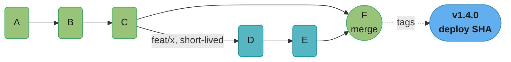
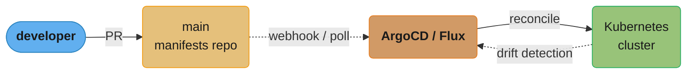
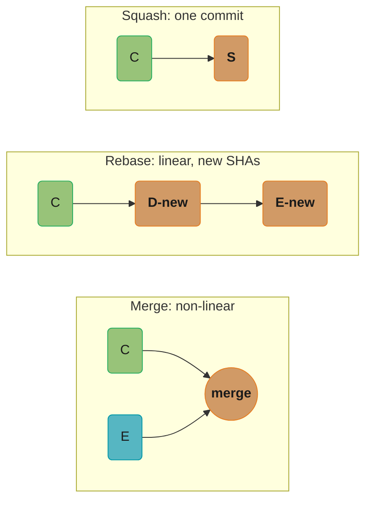
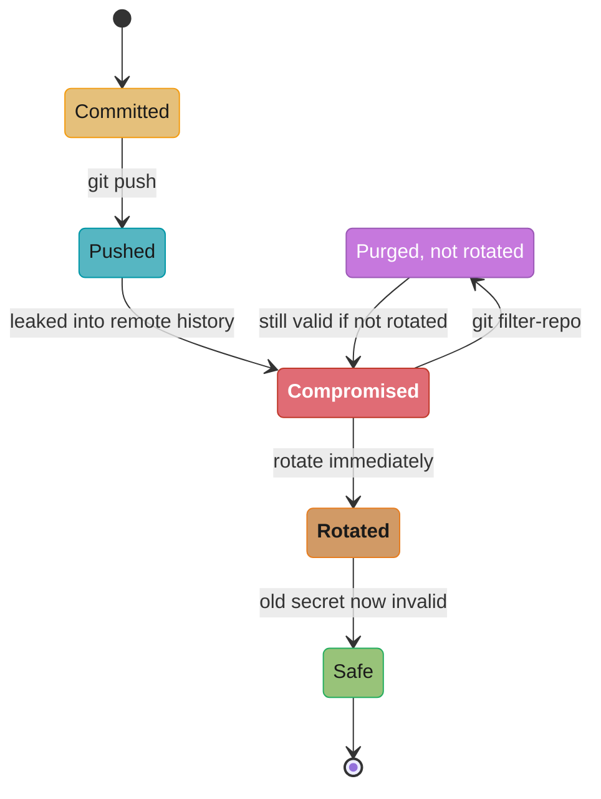
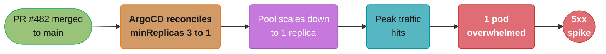

# Version Control & Git Workflows

> Phase 1 — Foundations · Difficulty: Beginner

Git is the source of truth for code, infrastructure (IaC), and — under GitOps — the desired state of production itself. A DevOps engineer must understand Git's internal model well enough to recover from a botched rebase, design a branching strategy that supports continuous delivery, and reason about why "the commit is the deployable unit."

---

## 1. Concept Overview

Git is a **content-addressable filesystem** with a version-control UI on top. Internally it stores four object types — **blobs** (file contents), **trees** (directories), **commits** (snapshots + metadata), and **tags** — each keyed by the SHA-1/SHA-256 hash of its content. Branches are just movable pointers to commits; `HEAD` points to the current branch.

For DevOps, Git matters beyond code:
- **IaC lives in Git** — Terraform, Helm, Kubernetes manifests are versioned and reviewed like code.
- **GitOps makes Git the deployment trigger** — a merge to `main` is what ships (see [gitops_argocd_flux](../gitops_argocd_flux/)).
- **Branching strategy gates delivery velocity** — trunk-based development enables continuous delivery; heavy GitFlow throttles it.
- **The commit is the deployable, auditable, revertible unit** — every artifact, deploy, and rollback traces to a SHA.

---

## 2. Intuition

> **One-line analogy**: Git is a stack of transparent snapshots — each commit is a full photo of the project, layered on its parent; a branch is a sticky note marking which photo you're looking at, and you can always flip back to any earlier one.

**Mental model**: A commit is an immutable snapshot pointing to its parent(s), forming a directed acyclic graph (DAG). You never "change" history — operations like `rebase` and `amend` create *new* commits and move pointers; the old commits linger (recoverable via `reflog`) until garbage-collected. Branches and tags are cheap pointers into this DAG.

**Why it matters**: When a deploy breaks production, "revert to the previous commit and redeploy" is the fastest recovery — but only if your workflow keeps `main` always-deployable and every change is a small, revertible commit. Branching strategy directly determines how fast and safely you can ship and roll back.

**Key insight**: Git history is append-only at heart. "Rewriting history" creates new objects and re-points refs; nothing is truly destroyed until GC. This is why `reflog` can rescue almost any "I lost my work" situation — and why force-pushing shared branches is dangerous (you move a pointer others depend on).

---

## 3. Core Principles

1. **Commits are immutable snapshots in a DAG.** Hash = identity; changing content changes the hash.
2. **Branches/tags are pointers, not copies.** Creating a branch is O(1).
3. **`main` is always deployable** in CD-oriented workflows. Don't merge what you wouldn't ship.
4. **Small, atomic commits** are easier to review, revert, bisect, and cherry-pick.
5. **Never rewrite shared history.** Rebase/amend local branches; never force-push `main`.
6. **The remote is a backup, not the source of truth for *state*** — under GitOps the repo *is* the desired state.

---

## 4. Types / Architectures / Strategies

### Branching strategies

| Strategy | Branches | Release model | Best for |
|----------|----------|---------------|----------|
| **Trunk-based** | Short-lived feature branches → `main` | Continuous; feature flags hide unfinished work | CD, high-velocity teams (the DevOps default) |
| **GitHub Flow** | `main` + feature branches, deploy from `main` | Deploy on merge | Web apps, SaaS |
| **GitFlow** | `main`, `develop`, `feature/*`, `release/*`, `hotfix/*` | Scheduled releases | Versioned/shipped software, multiple supported versions |
| **Release branches** | `main` + `release/x.y` | Long-lived support of versions | Libraries, on-prem products |

Trunk-based + feature flags is the modern DevOps standard because long-lived branches accumulate merge debt and delay integration — the opposite of "continuous".

### Monorepo vs polyrepo

| Aspect | Monorepo | Polyrepo |
|--------|----------|----------|
| Atomic cross-service change | Yes (one commit/PR) | No (coordinate N repos) |
| CI scope | Needs path filters / affected-detection | Naturally scoped |
| Tooling | Bazel/Nx/Turborepo for scale | Standard per-repo CI |
| Access control | Coarser (whole repo) | Per-repo granular |
| Used by | Google, Meta, Uber | Many microservice shops |

---

## 5. Architecture Diagrams

**The commit DAG (trunk-based):**



- C is the base; D and E build on it.
- F is the merge (or squash) commit to `main`.
- Tag `v1.4.0` -> points at F. Deploy artifact built from F's SHA.

**GitOps flow (Git as deployment trigger):**



A merge to `main` is the only deploy trigger: ArgoCD/Flux continuously reconciles the cluster to match Git, and drift detection re-triggers reconciliation if the live state ever diverges.

---

## 6. How It Works — Detailed Mechanics

### What a commit really is

```bash
git cat-file -p HEAD
# tree   a1b2c3...        <- snapshot of the directory
# parent 9f8e7d...        <- previous commit (two parents = a merge)
# author Jane <j@x.io> 1700000000 +0000
# committer ...
#
# feat: add canary rollout step

git cat-file -p a1b2c3    # the tree: blob SHAs + filenames + modes
```

The deployable artifact is built from a specific SHA, so a deploy is fully reproducible: same SHA → same build → same image.

### merge vs rebase vs squash

```bash
# Merge: preserves true history, adds a merge commit (non-linear graph).
git checkout main && git merge feat/x

# Rebase: replays your commits on top of main -> linear history, NEW commit SHAs.
git checkout feat/x && git rebase main      # rewrites feat/x commits

# Squash merge: collapses the branch into one commit on main (clean, atomic).
git merge --squash feat/x && git commit     # common for PR merges
```

**Same starting point (`C` on `main`, feat/x commits `D`,`E`) — three different results:**



Merge keeps both parents and adds a merge commit; rebase discards the old `D`,`E` SHAs and replays fresh ones in a straight line; squash throws away the intermediate commits and lands one atomic commit `S` — same code, three different audit trails.

Rule: rebase/squash *your own* branch before merging; never rebase a branch others have based work on.

### Recovering from disaster with reflog

```bash
# "I rebased and lost commits!"
git reflog                       # shows HEAD's movement history with old SHAs
# 9f8e7d HEAD@{2}: commit: my work
git reset --hard 9f8e7d          # restore to the pre-rebase state
```

### Bisecting to find a bad commit

```bash
git bisect start
git bisect bad                   # current HEAD is broken
git bisect good v1.3.0           # this tag was fine
# Git checks out the midpoint; you test and mark good/bad; O(log n) steps.
git bisect run ./test.sh         # automate: script returns 0=good, 1=bad
```

### Hooks (local automation)

```bash
# .git/hooks/pre-commit (or via pre-commit framework / Husky):
#   run shellcheck, terraform fmt -check, detect-secrets, unit tests
# Server-side hooks (pre-receive) enforce policy centrally; CI is the durable gate.
```

### Tags as release anchors

```bash
git tag -a v1.4.0 -m "release 1.4.0" && git push origin v1.4.0
# Semantic versioning: MAJOR.MINOR.PATCH. CI builds + publishes artifacts on tag push;
# the tag's SHA is the immutable provenance of that release.
```

---

## 7. Real-World Examples

- **GitOps (ArgoCD/Flux)**: a merge to the manifests repo's `main` is the production deploy; rollback = `git revert` + reconcile. Git is the audit log of every production change.
- **Google/Meta monorepos**: billions of lines in one repo with affected-target CI (Bazel) — atomic cross-service refactors in a single change.
- **Conventional Commits + semantic-release**: commit message prefixes (`feat:`, `fix:`, `BREAKING CHANGE:`) drive automated version bumps and changelogs in CI.
- **Trunk-based + feature flags** at high-velocity SaaS (e.g., many CD shops): merge unfinished code behind a flag, ship continuously, enable per-cohort.

---

## 8. Tradeoffs

| Decision | Option A | Option B | Key factor |
|----------|----------|----------|-----------|
| Branching | Trunk-based (CD, fast) | GitFlow (structured releases) | Release cadence; do you ship continuously? |
| Merge style | Merge commit (true history) | Squash/rebase (linear, clean) | Audit fidelity vs readability |
| Repo layout | Monorepo (atomic, shared tooling) | Polyrepo (isolation, simple CI) | Cross-service coupling + tooling maturity |
| History rewriting | Allowed on local branches | Forbidden on shared/main | Collaboration safety |
| Long-lived branches | Release branches (support old versions) | None (always-forward) | Do you support multiple versions in prod? |

---

## 9. When to Use / When NOT to Use

**Trunk-based + feature flags when:** you practice CI/CD, deploy frequently, and want minimal merge debt — the DevOps default.

**GitFlow / release branches when:** you ship versioned software to customers, must support multiple released versions, or have regulatory release gates.

**Monorepo when:** services are tightly coupled, you want atomic cross-cutting changes, and you can invest in affected-target CI tooling. **Polyrepo when:** services are independent, owned by separate teams, with simple per-repo CI.

---

## 10. Common Pitfalls

**Pitfall 1 — Force-pushing a shared branch and erasing teammates' commits.**

```bash
# BROKEN: rebased a shared branch, then force-pushed -> rewrote history others built on.
git rebase main
git push --force origin shared-feature        # teammates' commits now unreachable
```

```bash
# FIX: never force-push shared branches; if you must, use the safe variant that
# refuses to clobber others' work, and rebase only your own local branches.
git push --force-with-lease origin my-own-branch   # aborts if remote moved unexpectedly
# Recovery for victims: git reflog -> git reset --hard <their-old-sha>
```

**Pitfall 2 — Committing secrets.** An API key lands in a commit; even after deletion it lives in history forever and must be treated as compromised.

```bash
# FIX: pre-commit secret scanning (detect-secrets/gitleaks), and if leaked:
# 1) ROTATE the secret immediately (history scrubbing is not enough).
# 2) Purge from history with git filter-repo (rewrites history -> coordinate the team).
```

**Why purging alone isn't enough — the secret's compromise lifecycle:**



Purging history alone loops right back to `Compromised` — the secret is still valid until it's rotated, which is why rotation, not scrubbing, is the mandatory first step.

**Pitfall 3 — Long-lived feature branches.** A branch open for 6 weeks diverges so far that the merge is a multi-day conflict-resolution slog and integration bugs surface late. FIX: short-lived branches (<2 days), merge to trunk continuously, hide incomplete work behind feature flags.

---

## 11. Technologies & Tools

| Tool | Purpose |
|------|---------|
| `git` | The VCS |
| `git reflog` / `bisect` | Recovery; binary-search a regression |
| `git filter-repo` | Rewrite history (purge secrets/large files) |
| pre-commit / Husky | Local hook framework (lint, scan, format) |
| gitleaks / detect-secrets | Secret scanning in CI and hooks |
| Conventional Commits + semantic-release | Automated versioning/changelogs |
| GitHub/GitLab/Bitbucket | Hosting, PRs, protected branches, CODEOWNERS |
| Bazel / Nx / Turborepo | Monorepo affected-target builds |
| `git-lfs` | Large binary file storage |

---

## 12. Interview Questions with Answers

**Q1: What is a Git commit, internally?**
A commit is an immutable object containing a pointer to a tree (the directory snapshot), pointer(s) to parent commit(s), author/committer metadata, and a message — all hashed to produce its SHA. Branches are just movable pointers to commits, and `HEAD` points to the current branch. Changing any content changes the hash, which is why history is content-addressed and tamper-evident.

**Q2: merge vs rebase — when each, and the golden rule?**
Merge preserves true history and creates a merge commit (non-linear graph), good for integrating shared branches. Rebase replays commits onto a new base for linear history but rewrites SHAs. The golden rule: rebase only your *own* unpushed/private branches; never rebase or force-push branches others have based work on, or you erase their reachable history.

**Q3: Why is trunk-based development preferred for CD?**
Short-lived branches merge to `main` continuously, minimizing divergence and merge debt, and keeping `main` always-deployable. Unfinished work hides behind feature flags rather than long-lived branches. This enables frequent, low-risk releases — the essence of continuous delivery — whereas GitFlow's long-lived `develop`/`release` branches batch and delay integration.

**Q4: How do you recover commits after a bad rebase/reset?**
`git reflog` records every movement of `HEAD` (and branch tips) with the old SHAs, even for "rewritten" history, until garbage collection. Find the pre-mistake SHA and `git reset --hard <sha>` (or `git cherry-pick` the lost commits). This is why almost no work is truly lost — Git's objects persist until GC.

**Q5: A secret was committed and pushed. What do you do?**
First, **rotate the secret** — assume it's compromised the moment it hit a remote, because clones and history retain it. Then purge it from history with `git filter-repo` (or BFG) and force-push, coordinating with the team since this rewrites history. Add `gitleaks`/`detect-secrets` as a pre-commit and CI gate to prevent recurrence. Scrubbing without rotating is a false sense of security.

**Q6: Monorepo vs polyrepo tradeoffs?**
Monorepo enables atomic cross-service changes in one commit/PR and shared tooling, but needs affected-target CI (Bazel/Nx) to avoid building everything, and access control is coarser. Polyrepo gives per-service isolation, granular permissions, and naturally scoped CI, but cross-service changes require coordinating multiple PRs/repos. Choose based on coupling and tooling investment.

**Q7: What is `git bisect` and when is it invaluable?**
`git bisect` binary-searches the commit range between a known-good and known-bad commit to find the one that introduced a regression in O(log n) steps. With `git bisect run <script>` it's fully automated — the script's exit code marks each tested commit good/bad. It's the fastest way to localize "it worked last week, broke somewhere since".

**Q8: How does Git underpin GitOps?**
Under GitOps the Git repo holds the *desired state* of the system (manifests/Helm/Terraform); an in-cluster agent (ArgoCD/Flux) continuously reconciles the cluster to match `main`. A merge is the deploy, a `git revert` is the rollback, and the commit history is a complete, signed audit log of every production change — no out-of-band `kubectl apply`.

**Q9: Why are small, atomic commits valuable operationally?**
They are easier to review, revert (`git revert <sha>` cleanly undoes one change), bisect (finer granularity localizes regressions faster), and cherry-pick (port a fix to a release branch). A giant commit mixing ten changes can't be partially reverted and obscures which change caused a regression.

**Q10: What's the difference between `--force` and `--force-with-lease`?**
`--force` overwrites the remote branch unconditionally, potentially erasing commits someone else pushed after your last fetch. `--force-with-lease` only overwrites if the remote is still at the SHA you last saw, aborting if someone else pushed in between — so it protects against clobbering others' work. Even so, reserve force-pushing for your own branches.

---

## 13. Best Practices

- Default to **trunk-based development** with short-lived branches and feature flags.
- Keep `main` always-deployable; protect it (required reviews, status checks, no direct pushes).
- Write small, atomic commits; use Conventional Commits to drive automated versioning.
- Never force-push shared branches; rebase only local/private work; use `--force-with-lease`.
- Scan for secrets in pre-commit and CI; rotate immediately if one leaks.
- Tag releases with semantic versions; build artifacts from the tag's SHA for reproducible provenance.
- Use CODEOWNERS + protected branches to enforce review on infra/IaC paths.
- For monorepos, invest in affected-target CI so you don't rebuild the world on every change.

---

## 14. Case Study

### Scenario: A bad config change reaches prod via GitOps; fast rollback needed

A team runs GitOps: the `infra` repo's `main` is reconciled to the cluster by ArgoCD. A PR tweaking a HorizontalPodAutoscaler `minReplicas` from 3 to 1 (a typo, meant `30`) merges and reconciles. Off-peak it's fine; at peak the service can't scale fast enough and sheds load.



Off-peak the single replica looks fine; the moment traffic peaks, the undersized pool can't absorb it and the 5xx spike is the visible symptom of a config typo three steps upstream.

```bash
# BROKEN approach: hot-patch the live cluster to stop the bleeding.
kubectl patch hpa app -p '{"spec":{"minReplicas":3}}'
#   -> cluster now DIVERGES from Git. ArgoCD detects drift and REVERTS your patch
#      back to minReplicas=1 on the next sync. The fire reignites.
```

```bash
# FIX: fix the source of truth, because Git is the source of truth under GitOps.
git revert <sha-of-PR-482>          # creates a new commit undoing the change
git push origin main                # ArgoCD reconciles -> minReplicas back to 3
#   Recovery is auditable (the revert commit), and there is zero drift.
# For instant relief while the revert merges, ArgoCD can also be told to roll back
# the Application to the previous synced revision (argocd app rollback).
```

**Outcome:** the revert restored `minReplicas: 3` within one sync cycle (~1–3 min), the incident was fully captured in Git history (offending PR + revert), and the postmortem added a policy check (`conftest`/OPA) rejecting HPA configs where `minReplicas < 2` for production services.

**Discussion questions:**
1. Why does hot-patching the cluster fail under GitOps, and what does that teach about "source of truth"?
2. How would a policy-as-code gate (see [policy_as_code_and_compliance](../policy_as_code_and_compliance/)) have blocked this PR pre-merge?
3. When is `argocd app rollback` (revert the live state) preferable to `git revert` (revert the source), and what's the risk of the former?

---

**Cross-references:** [gitops_argocd_flux](../gitops_argocd_flux/) (Git as deployment trigger), [ci_cd_fundamentals](../ci_cd_fundamentals/) (commit → pipeline → artifact), [policy_as_code_and_compliance](../policy_as_code_and_compliance/) (pre-merge gates), [devsecops_and_supply_chain_security](../devsecops_and_supply_chain_security/) (secret scanning, signed commits).
