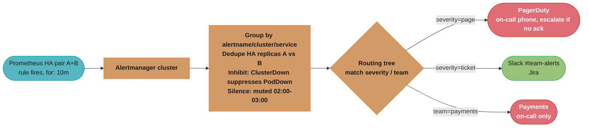
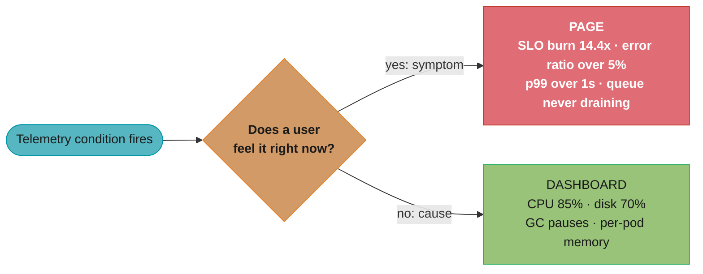
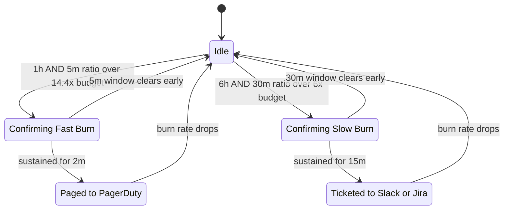

# Visualization & Alerting

> Phase 6 — Observability & SRE · Difficulty: Intermediate

Visualization turns raw telemetry into **dashboards humans can read at a glance**; alerting turns telemetry into **pages that wake the right person at the right time — and only when action is needed**. **Grafana** is the de-facto dashboard layer over metrics/logs/traces; **Alertmanager** (and Grafana Alerting) dedupes, groups, silences, and routes alerts to **PagerDuty/OpsGenie/Slack**. The hardest problem here is not building dashboards — it's **alert quality**: too many alerts cause fatigue and missed incidents; too few mean outages go unnoticed. The modern answer is **SLO burn-rate alerting** instead of static thresholds.

---

## 1. Concept Overview

Two distinct jobs, often conflated:

**Visualization** — dashboards that present metrics (Prometheus), logs (Loki/ELK), and traces (Tempo/Jaeger) in panels: time series, heatmaps, stat tiles, tables. Good dashboards answer a specific question (is the API healthy? is the queue backed up?) and follow conventions like the **RED method** (Rate, Errors, Duration per service) for request-driven systems and the **USE method** (Utilization, Saturation, Errors per resource) for infrastructure. Dashboards are for *investigation and situational awareness*, not for alerting.

**Alerting** — the pipeline that converts a condition (PromQL rule firing) into a human notification:

1. **Detect** — Prometheus (or Grafana) evaluates an alerting rule; when true for the `for:` duration it sends an alert to Alertmanager.
2. **Process** — Alertmanager **groups** related alerts (so 50 pods down = 1 page, not 50), **dedupes** identical alerts from HA Prometheus pairs, applies **inhibition** (a higher-severity alert suppresses dependent lower ones) and **silences** (mute during maintenance).
3. **Route** — a routing tree maps alerts (by labels like `severity`, `team`) to **receivers**: page (PagerDuty/OpsGenie) for urgent, ticket/Slack for non-urgent.
4. **Notify** — the on-call tool escalates per its policy if unacknowledged (see [incident_management_and_oncall](../incident_management_and_oncall/)).

The central tension is **alert fatigue**: an alert that fires without requiring human action trains people to ignore alerts, which eventually causes a real one to be missed. Every alert must be **actionable, urgent (if it pages), and tied to user impact**. The discipline that achieves this is alerting on **SLO error-budget burn rate** — page only when you're consuming the budget fast enough to threaten the SLO — instead of on raw symptoms like CPU > 80%.

---

## 2. Intuition

> **One-line analogy**: A dashboard is the hospital monitor a doctor watches at the bedside; an alert is the code-blue klaxon. You don't want the klaxon firing every time a heart rate ticks up — only when a patient is genuinely crashing. A klaxon that cries wolf gets muted, and then a real arrest is missed.

**Mental model**: Telemetry flows in; dashboards are *pull* (a human looks when they want to know) and alerts are *push* (the system interrupts a human because action is needed now). Alertmanager sits between "a rule fired" and "a human's phone buzzes," collapsing a storm of correlated firings into one meaningful, routed, deduplicated notification.

**Why it matters**: Observability data is worthless if no human notices the right signal at the right time. The quality of your alerts directly determines your MTTD (mean time to detect) and your on-call team's sanity. Alert fatigue is a leading cause of both burnout and missed incidents — paradoxically, *more* alerts make you *less* safe.

**Key insight**: The goal is **the minimum number of pages that still catches every real, urgent, user-impacting problem**. Page on *symptoms users feel* (SLO burn, error rate, latency) — not on *causes* (high CPU, a full disk) which belong on dashboards or tickets. A page must always mean "a human must act now," or it shouldn't be a page.

---

## 3. Core Principles

1. **Page on symptoms, not causes.** Alert on user-visible impact (SLO burn, errors, latency); dashboard the causes.
2. **Every page must be actionable and urgent.** If no immediate human action is needed, it's a ticket, not a page.
3. **Group and dedupe.** One root cause = one page; collapse correlated firings; dedupe HA pairs.
4. **Route by severity and ownership.** `severity=page` → on-call tool; `severity=ticket` → Slack/Jira; per-team trees.
5. **Use SLO burn-rate alerting** (multi-window, multi-burn) over static thresholds to balance fast detection and low noise.
6. **Dashboards answer one question well** (RED/USE), include the SLO and error budget, and link to runbooks.
7. **Inhibit and silence deliberately** — suppress dependent alerts and mute during planned maintenance.

---

## 4. Types / Architectures / Strategies

### Dashboard methods

| Method | For | Signals |
|--------|-----|---------|
| RED | Request-driven services | Rate, Errors, Duration |
| USE | Resources (CPU, disk, network) | Utilization, Saturation, Errors |
| Four Golden Signals (Google SRE) | Services | Latency, Traffic, Errors, Saturation |

### Alert severity tiers

| Severity | Means | Routes to | Response |
|----------|-------|-----------|----------|
| page / critical | User impact now, act immediately | PagerDuty/OpsGenie (24/7) | Wake on-call |
| ticket / warning | Degraded, fix in business hours | Slack/Jira | Triage soon |
| info | Awareness only | Slack channel / dashboard | No action |

### Alertmanager processing stages

| Stage | Purpose |
|-------|---------|
| Grouping | Collapse alerts sharing labels into one notification (`group_by`) |
| Deduplication | Drop identical alerts from HA Prometheus replicas |
| Inhibition | A firing high-severity alert suppresses dependent lower-severity ones |
| Silencing | Mute matching alerts for a window (maintenance) |
| Routing | Match labels → receiver (the routing tree) |

### Burn-rate alert windows (for a 99.9% SLO, 30-day budget)

| Burn rate | Long window | Short window | Budget consumed before page | Severity |
|-----------|-------------|--------------|------------------------------|----------|
| 14.4x | 1h | 5m | ~2% in 1h | page (fast) |
| 6x | 6h | 30m | ~5% in 6h | page/ticket |
| 3x | 1d | 2h | ~10% in 1d | ticket (slow) |

---

## 5. Architecture Diagrams

**Alerting pipeline: rule to Alertmanager to human**



Alertmanager collapses a firing storm into one deduplicated, routed notification: grouping turns 200 `PodDown` alerts into 1 notification, HA dedup turns the A/B replica pair's identical firings into 1 page, and inhibition/silencing suppress the rest before the routing tree sends `severity=page` to PagerDuty, `severity=ticket` to Slack/Jira, and team-scoped alerts to the right on-call.

**Dashboard hierarchy: drill down from overview to root cause**

```mermaid
flowchart LR
    classDef io      fill:#61afef,stroke:#2e86c1,color:#1a1a1a,font-weight:bold
    classDef frozen  fill:#c678dd,stroke:#9b59b6,color:#fff
    classDef train   fill:#98c379,stroke:#27ae60,color:#1a1a1a
    classDef mathOp  fill:#d19a66,stroke:#e67e22,color:#1a1a1a,font-weight:bold
    classDef lossN   fill:#e06c75,stroke:#c0392b,color:#fff,font-weight:bold
    classDef req     fill:#56b6c2,stroke:#0097a7,color:#1a1a1a
    classDef base    fill:#e5c07b,stroke:#f39c12,color:#1a1a1a

    overview(["Overview<br/>RED + SLO + error budget remaining"]) -->|"click a red service"| service(["Service<br/>Rate / Errors / Duration + deploy markers"])
    service -->|"click a latency exemplar"| trace(["Trace<br/>span waterfall for the slow request"])
    trace -->|"trace_id"| logs(["Logs<br/>the exact log lines"])

    class overview io
    class service req
    class trace lossN
    class logs base
```



Each click narrows scope by one level — overview to service to trace to logs — turning a vague "something's slow" into the exact failing span and its logs in three hops (see Q10).

**Symptom vs cause: what earns a page versus a dashboard panel**



The same decision rule from Core Principle 1 drawn as a fork: anything a user would feel right now pages; everything else — the causes an engineer investigates afterward — stays on a dashboard.

---

## 6. How It Works — Detailed Mechanics

### Alertmanager configuration — routing, grouping, inhibition

```yaml
# alertmanager.yml
route:
  receiver: default-slack            # catch-all
  group_by: [alertname, cluster, service]   # collapse correlated firings
  group_wait: 30s                    # wait to batch initial alerts in a group
  group_interval: 5m                 # wait before notifying about NEW alerts in an existing group
  repeat_interval: 4h                # re-page if still firing and unresolved
  routes:
    - matchers: [severity="page"]    # urgent -> PagerDuty
      receiver: pagerduty-critical
      group_wait: 10s                # page faster for criticals
      continue: false
    - matchers: [severity="ticket"]
      receiver: slack-tickets
    - matchers: [team="payments", severity="page"]
      receiver: pagerduty-payments   # team-specific escalation

inhibit_rules:
  # If the whole cluster is down, don't also page for every pod being down.
  - source_matchers: [alertname="ClusterDown"]
    target_matchers: [severity="page"]
    equal: [cluster]

receivers:
  - name: pagerduty-critical
    pagerduty_configs:
      - routing_key: "<integration-key>"
        severity: critical
  - name: slack-tickets
    slack_configs:
      - api_url: "<webhook>"
        channel: "#team-alerts"
        title: "{{ .CommonAnnotations.summary }}"
        text: "{{ .CommonAnnotations.runbook }}"
  - name: pagerduty-payments
    pagerduty_configs: [{ routing_key: "<payments-key>" }]
```

`group_wait` (default 30s) batches the first burst of a group; `group_interval` (5m) paces updates; `repeat_interval` (4h) re-notifies for unresolved alerts. These knobs are the primary anti-fatigue controls.

### SLO multi-window, multi-burn-rate alert rules

```yaml
# Page on a severe burn (14.4x over 1h, confirmed by 5m) and ticket on a slow burn (6x over 6h).
# SLO = 99.9%  ->  error budget = 1 - 0.999 = 0.001 (0.1%).
# Burn rate = (bad / total) / budget.  14.4x burns ~2% of a 30-day budget in 1 hour.
groups:
  - name: slo-burn-api
    rules:
      - alert: APIErrorBudgetBurnFast
        expr: |
          (job:slo_errors:ratio_rate1h{job="api"}  > (14.4 * 0.001))
          and
          (job:slo_errors:ratio_rate5m{job="api"}  > (14.4 * 0.001))
        for: 2m
        labels: { severity: page, team: api }
        annotations:
          summary: "API burning error budget at 14.4x (fast) - {{ $value | humanizePercentage }}"
          runbook: "https://runbooks/api-error-budget-burn"
      - alert: APIErrorBudgetBurnSlow
        expr: |
          (job:slo_errors:ratio_rate6h{job="api"}  > (6 * 0.001))
          and
          (job:slo_errors:ratio_rate30m{job="api"} > (6 * 0.001))
        for: 15m
        labels: { severity: ticket, team: api }
        annotations:
          summary: "API burning error budget at 6x (slow)"
          runbook: "https://runbooks/api-error-budget-burn"
```

The short window (5m/30m) makes the alert clear quickly once the burn stops; the long window (1h/6h) confirms the burn is real before paging. Burn-rate math lives in [sre_principles_and_slos](../sre_principles_and_slos/).



The AND of both windows is what makes this safe: a real 14.4x burn holds true on the 5m window long enough for the 1h window to confirm it too, so it pages in `for: 2m`; a brief blip clears the 5m window before the 1h window ever confirms, so `ConfirmFast` falls back to `Idle` and nobody gets paged.

### A symptom alert vs the cause it replaces

```yaml
# BROKEN: alert on a CAUSE. CPU > 80% pages constantly but often has zero user impact
# (autoscaler handles it, or it's a batch job). Trains on-call to ignore pages.
- alert: HighCPU
  expr: instance:cpu:rate5m > 0.8
  for: 5m
  labels: { severity: page }
```

```yaml
# FIX: alert on the SYMPTOM users feel. Pages only when latency/errors actually degrade.
- alert: APILatencyHigh
  expr: |
    histogram_quantile(0.99, sum by (le) (rate(http_request_duration_seconds_bucket{job="api"}[5m]))) > 1
  for: 10m
  labels: { severity: page }
  annotations: { runbook: "https://runbooks/api-latency" }
# CPU stays on a dashboard for investigation, not as a page.
```

### Grafana panel and alert provisioning (as code)

```yaml
# Provision dashboards/alerts from Git (GitOps for observability - see ../gitops_argocd_flux).
apiVersion: 1
providers:
  - name: 'team-api'
    type: file
    options: { path: /var/lib/grafana/dashboards }
# A panel query (RED - error rate) using the recording rule from Prometheus:
#   expr:  job:http_errors:ratio5m{job="api"}
#   thresholds: green < 0.01, yellow 0.01-0.05, red > 0.05
# Add a deploy annotation source so dashboards mark releases on the timeline.
```

---

## 7. Real-World Examples

- **Google SRE (Golden Signals + burn-rate)**: the SRE Workbook codified alerting on the four golden signals and the multi-window multi-burn-rate pattern that the whole industry now copies — page on user-facing symptoms tied to SLOs, not on resource causes.
- **Grafana + Alertmanager standard stack**: the near-universal open-source pairing — Prometheus rules → Alertmanager routing/dedup → PagerDuty, with Grafana dashboards drilling from overview → service → trace.
- **PagerDuty / OpsGenie escalation**: companies route `severity=page` to an on-call schedule with escalation policies (ack within 5–15 min or escalate to the next responder, then the manager) and quiet `severity=ticket` to Slack.
- **Alert-fatigue cleanups**: teams that cut alert count by 70–90% (deleting non-actionable cause-based alerts, consolidating with grouping, converting most to tickets) routinely report faster real-incident response and lower on-call burnout.
- **Inhibition during regional outages**: when a region goes down, an inhibition rule suppresses the hundreds of dependent per-service alerts so on-call gets the one meaningful "region down" page instead of a pager storm.

---

## 8. Tradeoffs

| Decision | Option A | Option B | Key factor |
|----------|----------|----------|-----------|
| Alert basis | Static thresholds | SLO burn-rate | Simplicity vs noise/impact-alignment |
| Alert target | Symptoms (user impact) | Causes (CPU/disk) | Fewer/meaningful pages vs early-but-noisy |
| Sensitivity | More alerts (catch everything) | Fewer alerts (low fatigue) | Detection coverage vs fatigue/burnout |
| Engine | Alertmanager (Prometheus-native) | Grafana Alerting (unified) | Mature routing vs single pane over many sources |
| Routing | Single catch-all | Per-team severity tree | Simplicity vs ownership/escalation |
| Notification | Page everything urgent | Page critical, ticket the rest | Coverage vs sleep/sanity |

---

## 9. When to Use / When NOT to Use

**Use dashboards for:** investigation, situational awareness, capacity trends, post-incident review, and showing SLO/error-budget status. Use **paging alerts for:** user-impacting, urgent, actionable conditions (SLO burn, error spikes, latency breaches, hard-down components) — anything that genuinely requires a human to act *now*.

**Do NOT page for:** causes without user impact (CPU/memory/disk that the autoscaler or headroom absorbs), predictable noise (deploy blips, batch-job churn), anything you'd just acknowledge and ignore, or conditions where no action is possible. Those belong on dashboards or as tickets. Don't build a dashboard for every metric either — dashboard sprawl is its own fatigue; build dashboards that answer a specific operational question (RED/USE) and delete the rest. If an alert has fired 20 times this month and nobody acted, delete it or convert it to a ticket.

---

## 10. Common Pitfalls

**Pitfall 1 — Paging on causes instead of symptoms (alert fatigue).**

```yaml
# BROKEN: CPU/disk/memory threshold pages. These fire constantly with no user impact;
# on-call learns to swipe them away, then misses the one real page.
- alert: HighMemory
  expr: container_memory_usage_bytes / container_spec_memory_limit_bytes > 0.85
  for: 5m
  labels: { severity: page }
```

```yaml
# FIX: page on the user-visible symptom; keep memory as a dashboard panel / ticket.
- alert: APIErrorBudgetBurnFast
  expr: |
    (job:slo_errors:ratio_rate1h{job="api"} > (14.4 * 0.001))
    and (job:slo_errors:ratio_rate5m{job="api"} > (14.4 * 0.001))
  for: 2m
  labels: { severity: page }
  annotations: { runbook: "https://runbooks/api-error-budget-burn" }
```

**Pitfall 2 — No grouping, so one outage = a pager storm.** Without `group_by`, a node failure that drops 200 pods sends 200 separate pages, drowning the signal and the on-call. FIX: `group_by: [alertname, cluster, service]`, add inhibition rules so a `ClusterDown` suppresses dependent `PodDown` alerts, and tune `group_wait`/`group_interval`.

**Pitfall 3 — Alerts with no runbook and no severity routing.** A page that says only "HighErrorRate" with no link, no severity label, and routed to a generic channel leaves the responder guessing at 3am. FIX: every alerting rule carries a `severity` label, a `summary`, and a `runbook` annotation; the routing tree sends `page` to PagerDuty and `ticket` to Slack (runbooks: see [incident_management_and_oncall](../incident_management_and_oncall/)).

**Pitfall 4 — Forgetting to silence during maintenance.** A planned deploy or DB migration triggers a flood of expected alerts, paging on-call for work they already know about and desensitizing them. FIX: create a scoped Alertmanager silence for the maintenance window/labels (and ideally automate it from the deploy pipeline), then ensure it expires.

---

## 11. Technologies & Tools

| Tool | Purpose |
|------|---------|
| Grafana | Dashboards over metrics/logs/traces; unified Grafana Alerting |
| Alertmanager | Group/dedupe/inhibit/silence/route Prometheus alerts |
| PagerDuty | On-call scheduling, escalation, paging |
| OpsGenie | On-call/escalation (Atlassian) |
| Slack / Microsoft Teams | Non-urgent ticket/notification channels |
| Prometheus alerting rules | Detect conditions, emit alerts (see [observability_metrics_prometheus](../observability_metrics_prometheus/)) |
| Sloth / Pyrra | Generate SLO + burn-rate alert rules from SLO specs |
| Kibana / OpenSearch Dashboards | Log dashboards/alerts for ELK |
| Grafana OnCall | Open-source on-call/escalation |
| Statuspage / Atlassian Statuspage | Public status communication |

---

## 12. Interview Questions with Answers

**Q1: What's the difference between a dashboard and an alert, and when do you use each?**
A dashboard is a *pull* tool — a human looks at it to investigate or maintain situational awareness — while an alert is a *push* tool that interrupts a human because action is needed. Use dashboards for investigation, trends, capacity, and showing SLO/error-budget status (RED/USE methods); use paging alerts only for urgent, user-impacting, actionable conditions. Conflating them (dashboarding what should page, or paging what should be a dashboard) is the root of most observability dysfunction.

**Q2: Why alert on symptoms rather than causes?**
Symptoms (high error rate, latency, SLO burn) are what users actually experience, so alerting on them catches every problem that matters and ignores causes that have no user impact. A cause like CPU > 80% pages constantly even when the autoscaler absorbs it or it's a harmless batch job, training on-call to ignore pages — which eventually causes a real page to be missed. Page on symptoms tied to user impact; keep causes on dashboards for investigation once a symptom alert fires.

**Q3: What is alert fatigue and how do you fight it?**
Alert fatigue is the desensitization that happens when on-call receives frequent non-actionable alerts, so they start ignoring or auto-acking pages and eventually miss a real incident. Fight it by ensuring every page is actionable and urgent, deleting or converting noisy cause-based alerts to tickets, grouping correlated alerts so one outage is one page, using SLO burn-rate alerting instead of static thresholds, and auditing alert-to-action ratios (if nobody acts on an alert, kill it). The counterintuitive truth is that fewer, higher-quality alerts make you safer.

**Q4: How do multi-window, multi-burn-rate SLO alerts work and why are they better than static thresholds?**
They alert when the error-budget burn rate exceeds a threshold over both a long window and a short confirmation window simultaneously — e.g. a fast page at 14.4x burn over 1h confirmed by a 5m window, a slower ticket at 6x over 6h confirmed by 30m. The long window confirms the burn is real (avoiding flapping); the short window makes the alert clear quickly once it resolves and ensures prompt detection of severe burns. They're better than a static threshold because they tie paging directly to the risk of breaching the SLO, balancing fast detection against low noise.

**Q5: What does Alertmanager do between a rule firing and a page?**
Alertmanager groups related alerts so one root cause produces one notification (not 200), deduplicates identical alerts from HA Prometheus replicas, applies inhibition so a higher-severity alert suppresses dependent lower ones, honors silences during maintenance, and routes alerts by label through a tree to the right receiver. The result is that a node failure dropping 50 pods pages on-call once with a meaningful message rather than 50 times. It's the policy layer that turns raw rule firings into sane human notifications.

**Q6: Explain grouping, inhibition, and silencing with examples.**
Grouping collapses alerts sharing labels into a single notification — `group_by: [alertname, cluster]` turns 50 `PodDown` alerts on one cluster into one page. Inhibition suppresses dependent alerts when a parent fires — a `ClusterDown` alert inhibits all the `PodDown` alerts for that cluster so you get the meaningful page only. Silencing mutes matching alerts for a window — you silence a service's alerts during a planned migration so expected noise doesn't page anyone.

**Q7: How do you route alerts to the right people?**
Use a routing tree keyed on labels: `severity=page` goes to the on-call escalation tool (PagerDuty/OpsGenie) for 24/7 paging, `severity=ticket` goes to Slack/Jira for business-hours triage, and team labels (`team=payments`) route to that team's specific on-call. Tune `group_wait`/`group_interval`/`repeat_interval` per route so criticals page fast and unresolved ones re-notify. The escalation policy (ack within N minutes or escalate) lives in the on-call tool (see [incident_management_and_oncall](../incident_management_and_oncall/)).

**Q8: What are the RED and USE methods, and when do you use each?**
RED (Rate, Errors, Duration) is for request-driven services — it tells you how busy a service is, how often it fails, and how slow it is, which maps directly to user experience. USE (Utilization, Saturation, Errors) is for resources like CPU, disk, and network — it tells you how full and stressed the infrastructure is. Use RED for service dashboards and (its symptoms) for alerts; use USE for infrastructure dashboards and capacity investigation, generally not for paging.

**Q9: How do you handle a planned maintenance window without paging everyone?**
Create a scoped Alertmanager silence matching the affected labels (service/cluster) for the maintenance window so expected alerts are muted, ideally automated from the deploy/maintenance pipeline so it's created and expires reliably. This prevents desensitizing on-call with alerts about work they already know about. Make the silence narrow (only the affected components) and time-boxed so unrelated real problems still page during the window.

**Q10: How do dashboards connect to the rest of observability for fast diagnosis?**
A well-built dashboard hierarchy drills down: an overview shows all services' RED metrics and SLO/error-budget status, clicking a degraded service opens its detailed dashboard with deploy markers, and clicking a latency exemplar jumps to the slow request's trace, whose `trace_id` then pulls the exact logs. This metric → trace → log pivot turns a vague "something's slow" into a precise root cause in minutes, which is why dashboards should embed exemplars and runbook links and align with the metrics, traces, and logs pillars (see [observability_metrics_prometheus](../observability_metrics_prometheus/), [observability_tracing_and_otel](../observability_tracing_and_otel/), [observability_logging](../observability_logging/)).

---

## 13. Best Practices

- **Page on symptoms tied to user impact** (SLO burn, errors, latency); dashboard the causes (CPU/disk).
- **Make every page actionable, urgent, and runbook-linked;** convert non-urgent alerts to tickets.
- **Adopt SLO multi-window burn-rate alerts** instead of static thresholds (see [sre_principles_and_slos](../sre_principles_and_slos/)).
- **Group and dedupe** with `group_by` and HA dedup; add inhibition rules to prevent pager storms.
- **Route by `severity`/`team`** to PagerDuty/OpsGenie (page) vs Slack/Jira (ticket); tune the timing knobs.
- **Silence planned maintenance** (ideally automated from the pipeline) and let silences expire.
- **Build RED/USE dashboards that answer one question,** embed SLO/error-budget panels, deploy markers, and exemplars.
- **Provision dashboards and alerts as code** (Git) and audit alert-to-action ratios; delete alerts nobody acts on.

---

## 14. Case Study

### Scenario: On-call gets 400 pages a week and still misses a real outage

A team's Alertmanager pages on every CPU > 80%, memory > 85%, disk > 70%, and per-pod restart — ~400 pages/week, almost all auto-acked. There's no grouping, so a single node failure pages 60 times. When a genuine outage hits (payment service returning 500s for 25 minutes), the page is buried in the noise and nobody notices until customers tweet — MTTD was 25 minutes for a hard-down payment path.

```yaml
# BROKEN: cause-based, ungrouped, un-prioritized pages -> fatigue -> missed real outage.
- alert: HighCPU      # fires constantly, no user impact
  expr: instance:cpu:rate5m > 0.8
  for: 5m
  labels: { severity: page }
- alert: PodRestarted # one node failing pages 60 times
  expr: kube_pod_container_status_restarts_total > 0
  labels: { severity: page }
# alertmanager: no group_by, no inhibition, single catch-all receiver.
```

```yaml
# FIX 1: replace cause alerts with SLO burn-rate symptom alerts.
- alert: PaymentsErrorBudgetBurnFast
  expr: |
    (job:slo_errors:ratio_rate1h{job="payments"} > (14.4 * 0.001))
    and (job:slo_errors:ratio_rate5m{job="payments"} > (14.4 * 0.001))
  for: 2m
  labels: { severity: page, team: payments }
  annotations: { summary: "Payments burning budget 14.4x", runbook: "https://runbooks/payments-burn" }
```

```yaml
# FIX 2: group, inhibit, and route by severity.
route:
  group_by: [alertname, cluster, service]
  group_wait: 30s
  repeat_interval: 4h
  routes:
    - matchers: [severity="page"]
      receiver: pagerduty-critical
      group_wait: 10s
    - matchers: [severity="ticket"]
      receiver: slack-tickets
inhibit_rules:
  - source_matchers: [alertname="ClusterDown"]
    target_matchers: [severity="page"]
    equal: [cluster]
# CPU/memory/disk -> demoted to dashboards + 'ticket' severity, not pages.
```

After the rework, weekly pages dropped from ~400 to ~12, and every remaining page corresponded to a real, actionable, user-impacting condition. Grouping and inhibition collapsed node failures into a single meaningful page. The next time the payment path degraded, the burn-rate alert paged within 2 minutes with a runbook link, and on-call resolved it before customers noticed — MTTD fell from 25 minutes to under 3.

**Outcome:** a ~97% reduction in pages, the elimination of fatigue, and a dramatic MTTD improvement on real incidents — proving that fewer, symptom-based, well-routed alerts catch more real problems than a flood of cause-based ones.

**Discussion questions:**
1. Why did 400 cause-based pages a week make the team *less* likely to catch the real payment outage?
2. How do grouping and inhibition turn a 60-page node-failure storm into a single actionable page?
3. Why is a 14.4x burn-rate symptom alert a better page than a CPU > 80% cause alert?

---

**Cross-references:** [observability_metrics_prometheus](../observability_metrics_prometheus/) (the rules and PromQL behind alerts), [sre_principles_and_slos](../sre_principles_and_slos/) (SLOs and burn-rate math that drive symptom alerts), [incident_management_and_oncall](../incident_management_and_oncall/) (escalation policies, runbooks, what happens after a page fires), [observability_tracing_and_otel](../observability_tracing_and_otel/) and [observability_logging](../observability_logging/) (drill-down targets from dashboards), [gitops_argocd_flux](../gitops_argocd_flux/) (provisioning dashboards/alerts as code).
