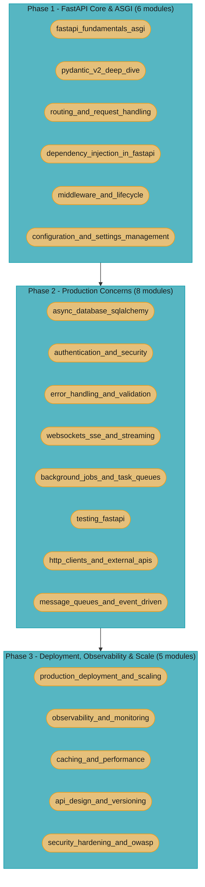

# FastAPI — Senior Engineer & Interview Prep Guide

A comprehensive, one-stop reference for mastering **FastAPI** — from the ASGI protocol and Pydantic v2's Rust validation core, through dependency injection and async SQLAlchemy, to production concerns (authentication, observability, deployment, and OWASP hardening). FastAPI is to Python APIs what Spring Boot is to Java — convention-over-configuration, production-ready defaults, built-in dependency injection, and a strong opinion on how to structure an application. These modules assume familiarity with the [pure-Python fundamentals](../python/README.md) (data model, asyncio, the type system) covered in the Python section.

> **No runtime application** — all content is Markdown with executable-shaped Python 3.11/3.12 + FastAPI code blocks.

---

## 1. Section Overview

This section covers:

- **FastAPI Core & ASGI** — the ASGI 3 protocol (scope/receive/send), Starlette routing, Uvicorn event loop, `lifespan`, auto-OpenAPI; Pydantic v2 (`pydantic-core` Rust backend, `@field_validator`, v1→v2 migration); dependency injection (`Depends`, `yield` deps, caching scopes)
- **Production Concerns** — async SQLAlchemy 2.0, Alembic migrations, N+1 avoidance; JWT/OAuth2 auth; WebSockets/SSE; Celery/ARQ task queues; `httpx`/`aiohttp` clients; `aiokafka` event-driven patterns
- **Deployment, Observability & Scale** — Gunicorn+Uvicorn worker sizing, K8s probes, graceful shutdown; OpenTelemetry tracing; Prometheus metrics; Redis caching; OWASP API Top 10 hardening

**Primary stack:** FastAPI + Python 3.11/3.12, Pydantic v2, SQLAlchemy 2.0. Version tags mark features introduced in earlier or later releases.

---

## 2. Module Table

| # | Module Directory | Phase | Difficulty | Key Topics |
|---|-----------------|-------|-----------|-----------|
| 1 | [fastapi_fundamentals_asgi](fastapi_fundamentals_asgi/fastapi_fundamentals_asgi.md) | 1 — FastAPI Core & ASGI | Intermediate | ASGI vs WSGI, Starlette, Uvicorn, `lifespan`, ASGI 3 scope/receive/send, auto OpenAPI/Swagger |
| 2 | [pydantic_v2_deep_dive](pydantic_v2_deep_dive/pydantic_v2_deep_dive.md) | 1 — FastAPI Core & ASGI | Advanced | Validation, serialization, `@field_validator`/`@model_validator`, `pydantic-core` Rust, v1→v2, `BaseSettings` |
| 3 | [routing_and_request_handling](routing_and_request_handling/routing_and_request_handling.md) | 1 — FastAPI Core & ASGI | Intermediate | Path operations, path/query/body/form params, `APIRouter`, response models, status codes, content neg. |
| 4 | [dependency_injection_in_fastapi](dependency_injection_in_fastapi/dependency_injection_in_fastapi.md) | 1 — FastAPI Core & ASGI | Advanced | `Depends`, sub-dependencies, `yield` deps (setup/teardown), caching/scopes, class-based deps, overrides |
| 5 | [middleware_and_lifecycle](middleware_and_lifecycle/middleware_and_lifecycle.md) | 1 — FastAPI Core & ASGI | Intermediate | Middleware stack order, `BackgroundTasks`, CORS/GZip, custom middleware, exception handler positioning |
| 6 | [configuration_and_settings_management](configuration_and_settings_management/configuration_and_settings_management.md) | 1 — FastAPI Core & ASGI | Intermediate | `pydantic-settings`, 12-factor config, env vars/secrets, layered settings, per-env overrides |
| 7 | [async_database_sqlalchemy](async_database_sqlalchemy/async_database_sqlalchemy.md) | 2 — Production Concerns | Advanced | SQLAlchemy 2.0 async, `AsyncSession`, async engine, pool sizing, Alembic, SQLModel, N+1 avoidance |
| 8 | [authentication_and_security](authentication_and_security/authentication_and_security.md) | 2 — Production Concerns | Advanced | OAuth2 password flow, JWT (PyJWT), scopes, passlib/bcrypt/argon2, OIDC, CSRF/CORS |
| 9 | [error_handling_and_validation](error_handling_and_validation/error_handling_and_validation.md) | 2 — Production Concerns | Intermediate | `HTTPException`, custom exception handlers, `RequestValidationError`, RFC 9457 Problem Details |
| 10 | [testing_fastapi](testing_fastapi/testing_fastapi.md) | 2 — Production Concerns | Intermediate | `TestClient`, `httpx.AsyncClient`, `pytest-asyncio`, `dependency_overrides`, transactional rollback |
| 11 | [websockets_sse_and_streaming](websockets_sse_and_streaming/websockets_sse_and_streaming.md) | 2 — Production Concerns | Advanced | WebSockets, SSE, `StreamingResponse`, Redis pub/sub fan-out, connection registry, backpressure |
| 12 | [background_jobs_and_task_queues](background_jobs_and_task_queues/background_jobs_and_task_queues.md) | 2 — Production Concerns | Advanced | `BackgroundTasks` vs Celery vs ARQ vs Dramatiq, scheduling, idempotency, retries, DLQ |
| 13 | [http_clients_and_external_apis](http_clients_and_external_apis/http_clients_and_external_apis.md) | 2 — Production Concerns | Intermediate | `httpx`/`aiohttp` async clients, connection pooling, retries/backoff, circuit breakers, timeouts |
| 14 | [message_queues_and_event_driven](message_queues_and_event_driven/message_queues_and_event_driven.md) | 2 — Production Concerns | Advanced | `aiokafka`/`aio-pika`, outbox pattern, consumer groups, idempotent consumers |
| 15 | [production_deployment_and_scaling](production_deployment_and_scaling/production_deployment_and_scaling.md) | 3 — Deployment, Observability & Scale | Advanced | Gunicorn+Uvicorn workers, worker tuning, container/K8s, graceful shutdown, ASGI scaling |
| 16 | [observability_and_monitoring](observability_and_monitoring/observability_and_monitoring.md) | 3 — Deployment, Observability & Scale | Advanced | Structured logging, OpenTelemetry tracing, Prometheus metrics, health/readiness probes |
| 17 | [caching_and_performance](caching_and_performance/caching_and_performance.md) | 3 — Deployment, Observability & Scale | Advanced | Redis caching, response/in-process caching, connection pooling, profiling FastAPI, async pitfalls |
| 18 | [api_design_and_versioning](api_design_and_versioning/api_design_and_versioning.md) | 3 — Deployment, Observability & Scale | Intermediate | REST best practices, versioning strategies, cursor pagination, rate limiting, idempotency keys |
| 19 | [security_hardening_and_owasp](security_hardening_and_owasp/security_hardening_and_owasp.md) | 3 — Deployment, Observability & Scale | Advanced | OWASP API Top 10 in FastAPI, injection/SSRF, deserialization risk, secrets handling, pip-audit |

---

## 3. 3-Phase Learning Path

**Dependencies to note:**
- Phase 1 `pydantic_v2_deep_dive` benefits from the Python section's `the_type_system_and_typing` (TypeVar, Protocol, Annotated) — see [../python/the_type_system_and_typing/](../python/the_type_system_and_typing/the_type_system_and_typing.md).
- Phase 1 `dependency_injection_in_fastapi` requires the Python section's async generators (`yield` deps use the async generator protocol) — see [../python/asyncio_and_event_loop/](../python/asyncio_and_event_loop/asyncio_and_event_loop.md).
- Phase 2 `async_database_sqlalchemy` requires Phase 1 DI (session-per-request via `Depends`).
- Phase 2 `authentication_and_security` requires Phase 1 DI + routing (OAuth2 flows modeled as `Depends` chains).
- Phase 3 has no strict ordering within itself; study in parallel once Phase 2 is complete.

---

## Learning Paths

This section is exhaustive by design — 19 modules spanning the full FastAPI request lifecycle, from ASGI internals through production hardening. That is the right depth for a reference and the wrong shape for someone two weeks from an interview. So there are **two ways through it**; the browser learning game's **Study** view surfaces both as a **Full / Interview** toggle (Full is the default).

### Full Path (19 modules)

The complete curriculum in the order above — see [3-Phase Learning Path](#3-3-phase-learning-path). Use it for genuine mastery: every layer of the FastAPI request lifecycle (routing, middleware, configuration, WebSockets/SSE), and the complete production-hardening set (FastAPI-specific testing, external HTTP clients, message-queue consumers, background job queues, API versioning, OWASP hardening). Nothing is dropped.

<!-- study-path-table senior -->
### Senior Path (13 modules)

| # | Module | Files |
|---|--------|-------|
| 1 | [fastapi_fundamentals_asgi](fastapi_fundamentals_asgi/fastapi_fundamentals_asgi.md) | module page only |
| 2 | [pydantic_v2_deep_dive](pydantic_v2_deep_dive/pydantic_v2_deep_dive.md) | 2 files |
| 4 | [dependency_injection_in_fastapi](dependency_injection_in_fastapi/dependency_injection_in_fastapi.md) | 2 files |
| 5 | [middleware_and_lifecycle](middleware_and_lifecycle/middleware_and_lifecycle.md) | module page only |
| 7 | [async_database_sqlalchemy](async_database_sqlalchemy/async_database_sqlalchemy.md) | module page only |
| 8 | [authentication_and_security](authentication_and_security/authentication_and_security.md) | module page only |
| 9 | [error_handling_and_validation](error_handling_and_validation/error_handling_and_validation.md) | module page only |
| 11 | [background_jobs_and_task_queues](background_jobs_and_task_queues/background_jobs_and_task_queues.md) | module page only |
| 12 | [testing_fastapi](testing_fastapi/testing_fastapi.md) | module page only |
| 13 | [http_clients_and_external_apis](http_clients_and_external_apis/http_clients_and_external_apis.md) | module page only |
| 15 | [production_deployment_and_scaling](production_deployment_and_scaling/production_deployment_and_scaling.md) | module page only |
| 16 | [observability_and_monitoring](observability_and_monitoring/observability_and_monitoring.md) | module page only |
| 17 | [caching_and_performance](caching_and_performance/caching_and_performance.md) | module page only |

**Not in this path** (6 of 19, Full Path only): `routing_and_request_handling`, `configuration_and_settings_management`, `websockets_sse_and_streaming`, `message_queues_and_event_driven`, `api_design_and_versioning`, `security_hardening_and_owasp`
<!-- /study-path-table -->

A ruthless cut to what a **senior FastAPI / backend interview** actually probes, anchored on the framework core and the production spine. Same learning order, a strict subset of the Full Path. Each group below says why it earns senior time.

| Group | Why it's tested |
|-------|-----------------|
| FastAPI Core & ASGI | ASGI scope/receive/send, Pydantic v2's Rust core and the v1->v2 migration, and the `Depends` dependency graph — the framework internals every FastAPI-focused interview opens with |
| Production Concerns | Async SQLAlchemy session-per-request and N+1 avoidance, OAuth2/JWT flows, and RFC 9457 error contracts — what shows up the moment a toy API becomes a real service |
| Deployment, Observability & Scale | Uvicorn/Gunicorn worker sizing, graceful shutdown and K8s probes, OpenTelemetry/Prometheus, and Redis caching — the "how does this run at 100k RPS" half of a senior loop |

<!-- study-path-table principal -->
### Principal Path (8 modules)

| # | Module | Files |
|---|--------|-------|
| 7 | [async_database_sqlalchemy](async_database_sqlalchemy/async_database_sqlalchemy.md) | module page only |
| 8 | [authentication_and_security](authentication_and_security/authentication_and_security.md) | module page only |
| 9 | [error_handling_and_validation](error_handling_and_validation/error_handling_and_validation.md) | module page only |
| 11 | [background_jobs_and_task_queues](background_jobs_and_task_queues/background_jobs_and_task_queues.md) | module page only |
| 15 | [production_deployment_and_scaling](production_deployment_and_scaling/production_deployment_and_scaling.md) | module page only |
| 16 | [observability_and_monitoring](observability_and_monitoring/observability_and_monitoring.md) | module page only |
| 18 | [api_design_and_versioning](api_design_and_versioning/api_design_and_versioning.md) | module page only |
| 19 | [security_hardening_and_owasp](security_hardening_and_owasp/security_hardening_and_owasp.md) | module page only |

**Not in this path** (11 of 19, Full Path only): `fastapi_fundamentals_asgi`, `pydantic_v2_deep_dive`, `routing_and_request_handling`, `dependency_injection_in_fastapi`, `middleware_and_lifecycle`, `configuration_and_settings_management`, `websockets_sse_and_streaming`, `testing_fastapi`, `http_clients_and_external_apis`, `message_queues_and_event_driven`, `caching_and_performance`
<!-- /study-path-table -->

A different cut, not senior-plus-extras. The Principal Path probes service-shape judgment rather than framework mechanics: where async actually pays, how a deployment survives a bad release, and which boundaries you refuse to blur. Roughly half of it is material the Senior Path never covers, and it is usually the smaller list -- depth of judgment, not depth of syllabus.

---

## Knowledge-Question Map

The highest-frequency FastAPI *knowledge* questions mapped to the file that answers them. For *system design* ("design X") questions, use the interview-prep shortcuts in [case_studies/case_studies.md](case_studies/case_studies.md).

| Interview question | Where the answer lives |
|--------------------|------------------------|
| How does the ASGI protocol (scope/receive/send) work, and how does it differ from WSGI? | [fastapi_fundamentals_asgi](fastapi_fundamentals_asgi/fastapi_fundamentals_asgi.md) |
| How does Pydantic v2 differ from v1, and why is validation 5-50x faster? | [pydantic_v2_deep_dive](pydantic_v2_deep_dive/pydantic_v2_deep_dive.md) |
| How does FastAPI resolve the `Depends` graph, and how do `yield` dependencies clean up after the response is sent? | [dependency_injection_in_fastapi](dependency_injection_in_fastapi/dependency_injection_in_fastapi.md) |
| How do you avoid N+1 queries in async SQLAlchemy 2.0? | [async_database_sqlalchemy](async_database_sqlalchemy/async_database_sqlalchemy.md) |
| Walk through the OAuth2 password flow and JWT validation in FastAPI. | [authentication_and_security](authentication_and_security/authentication_and_security.md) |
| How do you turn a `RequestValidationError` into an RFC 9457 Problem Details response? | [error_handling_and_validation](error_handling_and_validation/error_handling_and_validation.md) |
| How do readiness probes, graceful shutdown, and OpenTelemetry tracing work together during a zero-downtime rolling update? | [production_deployment_and_scaling](production_deployment_and_scaling/production_deployment_and_scaling.md), [observability_and_monitoring](observability_and_monitoring/observability_and_monitoring.md) |
| How do you cache a FastAPI response in Redis without serving stale data? | [caching_and_performance](caching_and_performance/caching_and_performance.md) |

---

## Study Plan

A 3-week plan over the Senior Path. Each week pairs modules with case studies to rehearse the "design X" format.

| Week | Focus | Modules | Case study |
|------|-------|---------|------------|
| 1 | FastAPI Core & ASGI | [fastapi_fundamentals_asgi](fastapi_fundamentals_asgi/fastapi_fundamentals_asgi.md), [pydantic_v2_deep_dive](pydantic_v2_deep_dive/pydantic_v2_deep_dive.md), [dependency_injection_in_fastapi](dependency_injection_in_fastapi/dependency_injection_in_fastapi.md) | skim [Async Web Scraper](case_studies/design_async_web_scraper.md) (asyncio fundamentals underneath ASGI concurrency), then [ML Inference API with FastAPI](case_studies/design_ml_inference_api_fastapi.md) (`lifespan` model loading, Pydantic-validated payloads) |
| 2 | Production Concerns | [async_database_sqlalchemy](async_database_sqlalchemy/async_database_sqlalchemy.md), [authentication_and_security](authentication_and_security/authentication_and_security.md), [error_handling_and_validation](error_handling_and_validation/error_handling_and_validation.md) | skim [Async Task Queue](case_studies/design_async_task_queue.md) (idempotency/retry patterns production error handling builds on), then [Multi-Tenant SaaS API](case_studies/design_multi_tenant_saas_api.md) (async SQLAlchemy tenant isolation + JWT/RBAC) |
| 3 | Deployment, Observability & Scale | [production_deployment_and_scaling](production_deployment_and_scaling/production_deployment_and_scaling.md), [observability_and_monitoring](observability_and_monitoring/observability_and_monitoring.md), [caching_and_performance](caching_and_performance/caching_and_performance.md) | [Real-Time Chat System](case_studies/design_realtime_chat_fastapi.md) (WebSocket concurrency + backpressure), then [Rate-Limited API with FastAPI](case_studies/design_rate_limited_api_fastapi.md) (Redis caching + `Depends`-injected rate limiter) |

---

## 4. Version Notes

| Library | Version | Key Changes |
|---------|---------|------------|
| Pydantic | 1.x | `@validator`, `.dict()`, `orm_mode = True` in `Config` class |
| Pydantic | 2.0+ (2023) | `@field_validator`, `.model_dump()`, `model_config = ConfigDict(...)`, `pydantic-core` Rust — 5–50x faster |
| FastAPI | 0.95+ | First `lifespan` context manager support |
| FastAPI | 0.100+ | Official Pydantic v2 support |
| FastAPI | 0.110+ | `lifespan` replaces `on_startup`/`on_shutdown` as recommended pattern |
| Starlette | 0.27+ | ASGI 3 protocol standardized; `lifespan` event type |
| SQLAlchemy | 1.4 | Legacy `Query` API + new 2.0-style `select()` statements, both supported |
| SQLAlchemy | 2.0 (2023) | Unified 2.0-style only; `AsyncSession`/`async_engine` stable; typed ORM models |
| SQLModel | 0.0.14+ | Pydantic v2 + SQLAlchemy 2.0 unified models |
| Alembic | 1.13+ | `--autogenerate` with async support via `run_sync` |
| httpx | 0.24+ | `AsyncClient` with connection limits, event hooks |
| anyio | 3.x / 4.x | Backend-agnostic structured concurrency; FastAPI/Starlette use anyio internally |

---

## 5. Case Studies

All 6 case studies live in [case_studies/](case_studies/case_studies.md) and use the 7-section legacy template (Problem Statement, Architecture Overview, Key Design Decisions, Implementation, Python/FastAPI Components Used, Tradeoffs and Alternatives, Interview Discussion Points).

| Case Study | Core Concepts | Difficulty |
|------------|--------------|-----------|
| [Design a Rate-Limited API with FastAPI](case_studies/design_rate_limited_api_fastapi.md) | Token-bucket via Redis Lua, `Depends`-injected rate limiter, async middleware, 429 error handling | Advanced |
| [Design a Multi-Tenant SaaS API](case_studies/design_multi_tenant_saas_api.md) | Async SQLAlchemy tenant isolation, JWT/RBAC, `Depends` scoping, schema-per-tenant pattern | Advanced |
| [Design a Real-Time Chat System with FastAPI](case_studies/design_realtime_chat_fastapi.md) | WebSockets, Redis pub/sub fan-out, connection registry, backpressure, horizontal scaling | Advanced |
| [Design an Async Task Queue System](case_studies/design_async_task_queue.md) | ARQ/Celery/Dramatiq comparison, idempotency, retries + exponential backoff, dead-letter queues | Advanced |
| [Design an Async Web Scraper](case_studies/design_async_web_scraper.md) | asyncio + aiohttp, `Semaphore` rate limiting, producer/consumer, crawl budget/politeness | Intermediate |
| [Design an ML Inference API with FastAPI](case_studies/design_ml_inference_api_fastapi.md) | Async model serving, micro-batching, async Redis cache, `lifespan` model loading, SSE streaming | Advanced |

---

**Prerequisite / see also:** [../python/](../python/README.md) — pure-Python internals (data model, asyncio, the type system) that this section's modules build on.
