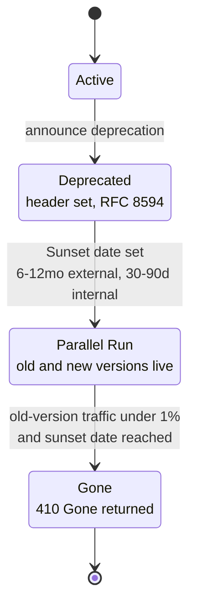
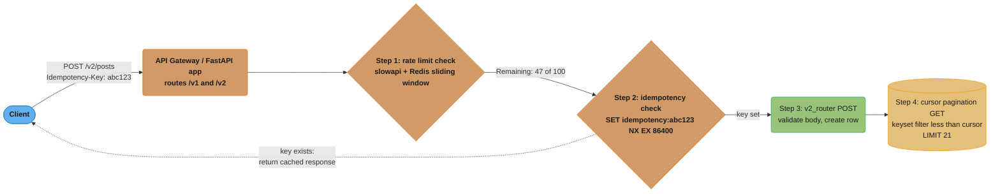
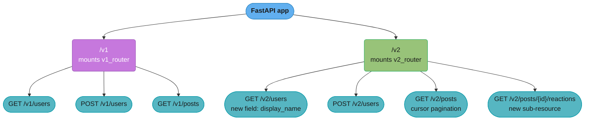
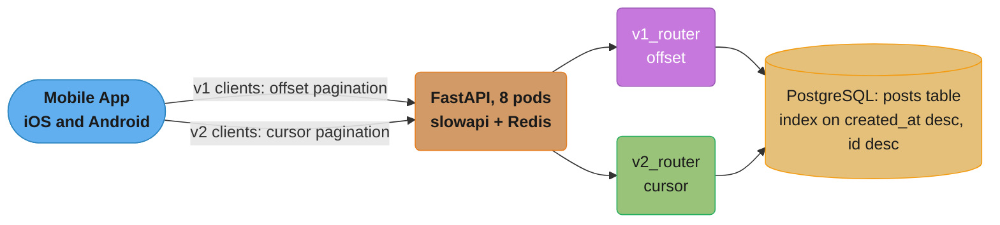

# API Design and Versioning

---

## 1. Concept Overview

An HTTP API is a contract between producer and consumer. How you name resources, assign status
codes, paginate large collections, communicate breaking changes, and enforce rate limits determines
whether that contract is easy to consume, safe to evolve, and stable under load.

FastAPI gives you the raw primitives — `APIRouter`, Pydantic models, dependency injection,
middleware hooks — but the design decisions are yours. This module covers:

- REST resource naming, HTTP method semantics, and status code correctness
- Three versioning strategies (URL path, header, query param) and how to wire each with `include_router`
- Deprecation signalling: `Deprecated` response header, sunset dates, parallel version windows
- Pagination: offset/limit limitations and cursor-based pagination with composite `(created_at, id)` cursors
- Filtering and sorting query models via Pydantic
- Idempotency keys for safe POST retries using Redis `SET NX EX`
- Rate limiting with `slowapi` and `fastapi-limiter`: sliding window, token bucket, response headers
- OpenAPI customisation: `operation_id`, `deprecated=True`, `include_in_schema=False`, SDK generation

Cross-references:
- Router mechanics: `../routing_and_request_handling/README.md`
- Middleware and exception handler ordering: `../middleware_and_lifecycle/README.md`
- Caching and Redis patterns: `../caching_and_performance/README.md`

---

## 2. Intuition

> A public API is like a road system. URL paths are street addresses, HTTP methods are
> traffic rules, status codes are traffic signals, and versioning is how you build a bypass
> without demolishing the old road.

**Mental model:** Every endpoint is a promise to a client. REST gives you a vocabulary
(`GET` = read, `POST` = create, `PUT/PATCH` = mutate, `DELETE` = remove) and a set of
addresses (resource URLs). Status codes are the feedback channel — 2xx means the promise was
kept, 4xx means the client broke the rules, 5xx means the server failed to keep its end.
Versioning is promise management: you can add a new road (`/v2/`) without tearing up the old
one (`/v1/`) until traffic naturally migrates.

**Why it matters:** API consumers write client code against your contract. A breaking change
without versioning forces all consumers to update simultaneously — a coordination nightmare.
Cursor pagination prevents data inconsistency on live feeds. Idempotency keys make payment and
order endpoints safe to retry. Rate limiting prevents a single bad actor from exhausting
capacity for everyone else.

**Key insight:** REST constraints are not aesthetic preferences — they are load-bearing
conventions. A `GET` that mutates state breaks caches. A `200` returned for a creation
confuses clients that expect `201`. A `500` for a bad request hides bugs. Precision here
compounds: every correctly coded status saves hours of client-side debugging.

---

## 3. Core Principles

**Resource naming — nouns, not verbs**

```
# WRONG
GET /getUser/42
POST /createPost
DELETE /deleteComment/7

# RIGHT
GET    /users/42
POST   /posts
DELETE /comments/7
```

Use plural nouns for collections (`/users`, `/posts`). Nest sub-resources when ownership is
clear and nesting depth stays at two levels maximum: `/users/42/posts`. Beyond two levels,
use query parameters instead.

**HTTP method semantics**

| Method | Semantics | Idempotent | Safe |
|--------|-----------|-----------|------|
| GET | Retrieve resource or collection | Yes | Yes |
| POST | Create a new resource | No | No |
| PUT | Replace a resource entirely | Yes | No |
| PATCH | Partially update a resource | No (ideally yes) | No |
| DELETE | Remove a resource | Yes | No |

A `GET /users` with a body is non-standard and breaks proxies. Use query params for filtering.

**Status code precision**

| Code | When to use |
|------|-------------|
| 200 | Successful GET, PATCH, PUT |
| 201 | Successful POST that created a resource |
| 204 | Successful DELETE or PUT with no response body |
| 400 | Malformed request syntax |
| 401 | Missing or invalid credentials |
| 403 | Credentials valid but permission denied |
| 404 | Resource not found |
| 409 | Conflict (duplicate unique field, optimistic lock failure) |
| 422 | Semantically invalid request (FastAPI default for Pydantic failures) |
| 429 | Rate limit exceeded |
| 500 | Unhandled server error |

FastAPI defaults to `200`. Set `status_code=201` on creation endpoints explicitly.

**Idempotency of unsafe methods**

`PUT /orders/99` with the same body twice must produce the same result. `DELETE /orders/99`
called twice must return `204` the first time and `404` (or `204`) the second — never `500`.
Design your handlers to be idempotent for `PUT` and `DELETE` without needing the caller to
think about it.

---

## 4. Types / Architectures / Strategies

### 4.1 Versioning strategies

**URL path versioning** — `/v1/users`, `/v2/users`

```python
from fastapi import APIRouter

v1_router = APIRouter()
v2_router = APIRouter()

app.include_router(v1_router, prefix="/v1", tags=["v1"])
app.include_router(v2_router, prefix="/v2", tags=["v2"])
```

Pros: visible in logs, browser-friendly, proxy-cacheable per version, easy to route in
API gateways. Cons: technically violates REST (a resource has one canonical URL). Chosen by
Google, Stripe, GitHub. Recommended default.

**Header versioning** — `Accept: application/vnd.myapi+json;version=2`

```python
from fastapi import Header, HTTPException

@app.get("/users")
async def get_users(accept: str = Header(default="application/json")):
    version = _parse_version(accept)  # extract version=2 from Accept header
    if version == 2:
        return v2_handler()
    return v1_handler()
```

Pros: single canonical URL, RESTfully correct. Cons: not browser-testable, hard to log,
invisible in links, caches must vary on `Accept`. Used by GitHub API v3.

**Query parameter versioning** — `GET /users?version=2`

Pros: easy to test in browser. Cons: pollutes query namespace, breaks cache keys unless
CDN is configured to vary on the param. Avoid for public APIs.

**Recommendation:** Use URL path versioning for public or partner APIs. Header versioning
for internal microservice contracts where you control both sides.

### 4.2 Deprecation strategy

```
HTTP/1.1 200 OK
Deprecated: true
Sunset: Sat, 01 Jan 2027 00:00:00 GMT
Link: <https://api.example.com/v2/users>; rel="successor-version"
```

Standard practice:
1. Announce deprecation in the `Deprecated` header (RFC 8594) on the old version
2. Set a `Sunset` header 6–12 months out for external APIs, 30–90 days for internal
3. Run both versions in parallel until traffic to old version drops below 1%
4. Return `410 Gone` from old version after sunset date



*The lifecycle only moves forward — a version cannot jump from Active straight to Gone
without first passing through the parallel-run window that gives clients time to migrate.*

### 4.3 Pagination strategies

| Strategy | Good for | Bad for |
|---------|---------|---------|
| Offset/limit | Admin dashboards with stable data | Live feeds, large datasets |
| Cursor-based | Live feeds, infinite scroll, large collections | Random page access |
| Keyset (seek method) | SQL databases with indexed columns | Non-SQL or unindexed data |
| Time-based | Time-series, event streams | Random access by record |

### 4.4 Rate limiting strategies

| Strategy | Description | Burst behaviour |
|---------|-------------|----------------|
| Fixed window | Count requests per calendar window | Allows 2x burst at window boundary |
| Sliding window | Rolling time window | Smooth, no boundary burst |
| Token bucket | Tokens refill at constant rate | Allows bursts up to bucket size |
| Leaky bucket | Queue drains at fixed rate | No bursts, constant output rate |

Token bucket is the most common for APIs (allows short bursts while controlling average rate).
Sliding window log is the most accurate but memory-intensive.

---

## 5. Architecture Diagrams

### Request lifecycle with versioning, rate limiting, and pagination



*Every request passes through rate limiting and an idempotency check before reaching the
handler; a duplicate `Idempotency-Key` short-circuits straight back to the client (dotted
edge) without touching the database, while a fresh key falls through to the handler and, on
`GET`, the keyset-filtered cursor query.*

### URL path versioning router wiring



*`include_router` mounts each version as an independent branch under the same app; v1 (purple,
frozen) keeps serving old clients while v2 (green, active) carries the new field, cursor
pagination, and the new reactions sub-resource.*

---

## 6. How It Works — Detailed Mechanics

### 6.1 APIRouter versioning setup

```python
# routers/v1/posts.py
from fastapi import APIRouter, Depends
from sqlalchemy.ext.asyncio import AsyncSession
from app.db import get_session
from app.models import Post
from sqlalchemy import select

router = APIRouter(prefix="/posts", tags=["posts-v1"])

@router.get("", summary="List posts (v1 — offset pagination)")
async def list_posts_v1(
    offset: int = 0,
    limit: int = 20,
    session: AsyncSession = Depends(get_session),
) -> list[PostResponse]:
    result = await session.execute(
        select(Post).order_by(Post.created_at.desc()).offset(offset).limit(limit)
    )
    return result.scalars().all()
```

```python
# app/main.py
from fastapi import FastAPI
from routers.v1 import posts as v1_posts
from routers.v2 import posts as v2_posts

app = FastAPI(title="MyAPI", version="2.0.0")

app.include_router(v1_posts.router, prefix="/v1")
app.include_router(v2_posts.router, prefix="/v2")
```

Each router gets its own prefix, tag set, and can carry router-level dependencies (e.g., auth).

### 6.2 Cursor-based pagination — BROKEN vs FIX

```python
# BROKEN: offset pagination breaks on real-time data — rows shift between pages
@app.get("/posts")
async def list_posts(
    offset: int = 0,
    limit: int = 20,
    session: AsyncSession = Depends(get_session),
):
    result = await session.execute(
        select(Post).order_by(Post.created_at.desc()).offset(offset).limit(limit)
    )
    return result.scalars().all()
# Problem: new posts inserted between page 1 and page 2 requests shift rows,
# causing duplicates or missed items.
```

```python
# FIX: cursor-based pagination using (created_at, id) composite cursor
from base64 import b64encode, b64decode
from datetime import datetime
import json
from fastapi import Query
from sqlalchemy import select, or_, and_
from app.models import Post
from app.db import get_session

@app.get("/v2/posts")
async def list_posts(
    cursor: str | None = None,
    limit: int = Query(default=20, le=100),
    session: AsyncSession = Depends(get_session),
) -> dict:
    query = select(Post).order_by(Post.created_at.desc(), Post.id.desc()).limit(limit + 1)

    if cursor:
        raw = json.loads(b64decode(cursor.encode()).decode())
        cursor_ts = datetime.fromisoformat(raw["created_at"])
        cursor_id = raw["id"]
        query = query.where(
            or_(
                Post.created_at < cursor_ts,
                and_(Post.created_at == cursor_ts, Post.id < cursor_id),
            )
        )

    posts = (await session.execute(query)).scalars().all()

    next_cursor: str | None = None
    if len(posts) > limit:
        posts = posts[:limit]
        last = posts[-1]
        payload = json.dumps({"created_at": last.created_at.isoformat(), "id": last.id})
        next_cursor = b64encode(payload.encode()).decode()

    return {"posts": posts, "next_cursor": next_cursor}
# Result: page 2 always starts after the exact row that ended page 1,
# regardless of new inserts.
```

**Why `limit + 1`:** Fetch one extra row. If you get it back, there is a next page; strip it
and build a cursor from `posts[-1]`. If you get exactly `limit` rows or fewer, there is no
next page.

**Why composite `(created_at, id)`:** `created_at` alone is not unique — two posts can share
the same timestamp (common under load). Adding `id` (monotonic in Postgres sequences) breaks
ties deterministically.

#### Decoding the pagination arithmetic

The two queries above look equally cheap. They are not, and the difference is a formula:

```
Rows the database must touch to serve page N (page size = limit)

  offset/limit :  rows_scanned(N) = offset + limit = (N - 1) x limit + limit = N x limit
  keyset       :  rows_scanned(N) = limit + 1                (constant, index seek)
```

**Stated plainly.** "Offset makes the database count its way to your page from row one on
every single request; keyset hands it the exact index position to resume from, so page 2,500
costs the same as page 1." Offset cost grows *linearly with page number*; keyset cost is flat.
That single difference is why the section above warns off `OFFSET` past ~10,000 rows.

| Symbol | What it is |
|--------|------------|
| `N` | Which page the client asked for, 1-based. Page 1 is the first `limit` rows |
| `limit` | Page size — `20` in the code above, capped at `100` by `Query(le=100)` |
| `offset` | Rows to skip, `(N - 1) x limit`. Postgres *reads and discards* every one of them |
| `limit + 1` | The keyset fetch. The `+1` is the probe row that answers "is there a next page?" |
| `(created_at, id)` | The composite cursor — the exact row page `N-1` ended on |
| `rows_scanned` | Row-fetch work, not result size. Both return `limit` rows to the client |

**Walk one example.** A 100,000-row feed, `limit = 20`, so `100000 / 20 = 5000` pages:

```
                        offset/limit                 keyset (cursor)
  page    1        1 x 20  =      20 rows          20 + 1 =  21 rows
  page   50       50 x 20  =   1,000 rows          20 + 1 =  21 rows
  page 2500     2500 x 20  =  50,000 rows          20 + 1 =  21 rows   <- OFFSET 50000
  page 5000     5000 x 20  = 100,000 rows          20 + 1 =  21 rows

  Page 2500 alone:  50,020 rows scanned  vs  21 rows  ->  2,382x more work
                    for the identical 20 rows of output.

  Walking the WHOLE feed once, page 1 -> 5000:
    offset :  20 x (1 + 2 + ... + 5000)  =  20 x 5000 x 5001 / 2  =  250,050,000 rows
    keyset :  5000 pages x 21 rows                                =     105,000 rows
    ratio  :  250,050,000 / 105,000                               =  2,381x
```

The offset column is a triangular number — `limit x N(N+1)/2` — so a full crawl is quadratic
in page count while keyset stays linear. This is the real reason cursor pagination wins on
large collections; the consistency-under-insert argument in Pitfall 2 is the *second* reason.

**What the `+1` buys you.** Without the probe row, "is there more?" needs a second query —
a `COUNT(*)` over the whole filtered set, which is exactly the full scan keyset just avoided.
Fetching `limit + 1` answers it for the cost of one extra row: get `21` back and page 2,500
exists; get `20` or fewer and the feed ended.

### 6.3 Filtering and sorting with a Pydantic query model

```python
from pydantic import BaseModel, Field
from fastapi import Depends
from enum import Enum

class SortField(str, Enum):
    created_at = "created_at"
    title = "title"

class PostFilter(BaseModel):
    status: str | None = None
    author_id: int | None = None
    sort: SortField = SortField.created_at
    order: str = Field(default="desc", pattern="^(asc|desc)$")

def parse_post_filter(
    status: str | None = None,
    author_id: int | None = None,
    sort: SortField = SortField.created_at,
    order: str = "desc",
) -> PostFilter:
    return PostFilter(status=status, author_id=author_id, sort=sort, order=order)

@app.get("/v2/posts")
async def list_posts(
    filters: PostFilter = Depends(parse_post_filter),
    session: AsyncSession = Depends(get_session),
):
    query = select(Post)
    if filters.status:
        query = query.where(Post.status == filters.status)
    if filters.author_id:
        query = query.where(Post.author_id == filters.author_id)
    col = getattr(Post, filters.sort.value)
    query = query.order_by(col.desc() if filters.order == "desc" else col.asc())
    return (await session.execute(query)).scalars().all()
```

### 6.4 Idempotency keys with Redis

```python
import hashlib
import json
from fastapi import Header, HTTPException, Request, Response
import redis.asyncio as aioredis

redis_client = aioredis.from_url("redis://localhost:6379", decode_responses=True)
IDEMPOTENCY_TTL = 86_400  # 24 hours

async def idempotency_guard(
    request: Request,
    response: Response,
    idempotency_key: str | None = Header(default=None),
):
    """Dependency: deduplicates POST requests using Redis SET NX EX."""
    if idempotency_key is None:
        return  # key not provided; skip deduplication

    redis_key = f"idempotency:{idempotency_key}"
    existing = await redis_client.get(redis_key)
    if existing:
        cached = json.loads(existing)
        raise HTTPException(
            status_code=cached["status_code"],
            detail=cached["body"],
            headers={"X-Idempotent-Replayed": "true"},
        )
    # Store placeholder so concurrent requests see the key before we finish
    await redis_client.set(redis_key, json.dumps({"status_code": 202, "body": "processing"}), ex=IDEMPOTENCY_TTL)

@app.post("/v2/orders", status_code=201)
async def create_order(
    body: OrderCreate,
    _: None = Depends(idempotency_guard),
    session: AsyncSession = Depends(get_session),
) -> OrderResponse:
    order = Order(**body.model_dump())
    session.add(order)
    await session.commit()
    # Overwrite placeholder with real response
    redis_key = f"idempotency:{body.idempotency_key}"
    payload = json.dumps({"status_code": 201, "body": OrderResponse.model_validate(order).model_dump()})
    await redis_client.set(redis_key, payload, ex=IDEMPOTENCY_TTL)
    return order
```

### 6.5 Rate limiting with slowapi

```python
from slowapi import Limiter, _rate_limit_exceeded_handler
from slowapi.util import get_remote_address
from slowapi.errors import RateLimitExceeded
from fastapi import Request

limiter = Limiter(key_func=get_remote_address, default_limits=["100/minute"])
app.state.limiter = limiter
app.add_exception_handler(RateLimitExceeded, _rate_limit_exceeded_handler)

@app.get("/v2/posts")
@limiter.limit("60/minute")  # per-endpoint override
async def list_posts(request: Request, ...):
    ...
```

`slowapi` attaches `X-RateLimit-Limit`, `X-RateLimit-Remaining`, and `Retry-After` headers
automatically when using Redis as the storage backend. Default storage is in-process
(single-instance only).

For multi-instance deployments use `fastapi-limiter` with Redis directly:

```python
from fastapi_limiter import FastAPILimiter
from fastapi_limiter.depends import RateLimiter
import redis.asyncio as aioredis

@app.on_event("startup")
async def startup():
    r = aioredis.from_url("redis://localhost", encoding="utf-8", decode_responses=True)
    await FastAPILimiter.init(r)

@app.get("/v2/users", dependencies=[Depends(RateLimiter(times=100, seconds=60))])
async def list_users():
    ...
```

### 6.6 OpenAPI customisation

```python
from fastapi import FastAPI

app = FastAPI(
    title="MyService API",
    version="2.1.0",
    description="Production API for MyService. Use /v2 endpoints.",
    contact={"email": "api@myservice.com"},
    license_info={"name": "Apache 2.0"},
)

@app.get(
    "/v1/users",
    tags=["users"],
    summary="List users (DEPRECATED — use /v2/users)",
    operation_id="list_users_v1",
    deprecated=True,                  # shown as crossed out in Swagger UI
    include_in_schema=True,           # still visible; set False to hide entirely
)
async def list_users_v1():
    ...

@app.get(
    "/v2/users",
    tags=["users"],
    summary="List users",
    operation_id="list_users_v2",
    response_description="Paginated list of users with cursor",
)
async def list_users_v2():
    ...
```

Generating a Python SDK from the spec:

```bash
# Install openapi-generator-cli
pip install openapi-python-client

# Generate from running server
openapi-python-client generate --url http://localhost:8000/openapi.json
```

---

## 7. Real-World Examples

**Stripe** uses URL path versioning (`/v1/`) with a twist: breaking changes are released via
a `Stripe-Version` header date (e.g., `Stripe-Version: 2023-10-16`). All accounts are pinned
to a version date at signup. This lets Stripe ship breaking changes without touching the URL.

**GitHub REST API v3** uses `Accept` header versioning:
`Accept: application/vnd.github.v3+json`. GitHub is now migrating toward GraphQL (v4) for
new capabilities rather than a v5.

**Twilio** uses URL path versioning (`/2010-04-01/`) with the date as version identifier,
making the contract stability period explicit.

**Shopify** enforces idempotency keys on all payment and order mutations. Duplicate keys
within 24 hours return the original response. Their documentation warns that missing the key
header on payment endpoints results in a `400`.

**Notion API** paginates all collection responses with cursor pagination. The cursor is
opaque (base64-encoded internal state). `has_more: true/false` replaces `total_count` —
Notion deliberately does not expose total counts because computing them on large workspaces
is expensive.

---

## 8. Tradeoffs

### Versioning strategy comparison

| Strategy | Visibility | Cacheability | REST purity | Client effort | Recommendation |
|---------|-----------|-------------|-------------|--------------|----------------|
| URL path (`/v2/`) | High | Easy (CDN routes by path) | Low (URL = identity) | Low | Default choice |
| Header (`Accept`) | Low | Needs `Vary: Accept` | High | Medium | Internal microservices |
| Query param (`?v=2`) | Medium | Breaks cache keys | Medium | Low | Avoid for production |

### Pagination comparison

| Strategy | Consistency on insert | Random page access | Complexity | Memory |
|---------|----------------------|-------------------|-----------|--------|
| Offset/limit | Poor | Easy (`OFFSET n`) | Low | Low |
| Cursor (keyset) | Excellent | Not possible | Medium | Low |
| Time-based | Good | By timestamp | Low | Low |

### Rate limiting algorithm comparison

| Algorithm | Burst handling | Memory | Implementation | Edge case |
|---------|--------------|--------|---------------|----------|
| Fixed window | Allows 2x burst at boundary | Low | Simple | Thundering herd at window reset |
| Sliding window | Smooth | High (log per request) | Medium | Redis sorted-set cleanup |
| Token bucket | Configurable burst | Low | Medium | Requires refill logic |
| Leaky bucket | No burst | Low | Simple | Adds latency (queuing) |


*Token bucket wins for most APIs because it sits at the same low memory cost as fixed window
but far higher on burst-smoothing — bursts are capped by bucket size instead of doubling at a
window boundary.*

---

## 9. When to Use / When NOT to Use

**Use URL path versioning when:**
- Building a public or partner API with external consumers
- Your API gateway needs to route traffic by version without request inspection
- You want each version visible in logs, metrics, and alerts separately

**Use header versioning when:**
- Both sides of the API are under your control (internal microservices)
- You need a single canonical URL for the resource (e.g., bookmark-friendly)
- You are already using content negotiation extensively

**Use cursor pagination when:**
- Collections grow continuously (social feeds, event logs, audit trails)
- The dataset is large (> 10,000 rows with frequent queries)
- Clients may pause and resume iteration over minutes

**Do NOT use offset pagination when:**
- Data is inserted or deleted between page requests (e.g., social feeds)
- The `OFFSET` value exceeds ~10,000 rows (Postgres `OFFSET 50000` does a full scan)

**Do NOT use rate limiting in the application layer when:**
- You have multiple application instances — use Redis-backed rate limiting or push it to the
  API gateway (Kong, Nginx, AWS API Gateway all support it natively)

**Use idempotency keys when:**
- The operation creates money, sends notifications, or provisions real-world resources
- The client might retry on network timeout before receiving the response

---

## 10. Common Pitfalls

### Pitfall 1: Returning 200 for all responses

```python
# BROKEN: 200 returned for creation confuses clients; 404 response also 200
@app.post("/users")
async def create_user(body: UserCreate, session: AsyncSession = Depends(get_session)):
    user = User(**body.model_dump())
    session.add(user)
    await session.commit()
    return {"ok": True, "user": user}  # status 200 (FastAPI default)

@app.get("/users/{user_id}")
async def get_user(user_id: int, session: AsyncSession = Depends(get_session)):
    user = await session.get(User, user_id)
    if not user:
        return {"error": "not found"}  # status 200 — client cannot detect failure
```

```python
# FIX: explicit status codes + HTTPException for not-found
from fastapi import HTTPException

@app.post("/v2/users", status_code=201)
async def create_user(body: UserCreate, session: AsyncSession = Depends(get_session)):
    user = User(**body.model_dump())
    session.add(user)
    await session.commit()
    return user  # 201 Created

@app.get("/v2/users/{user_id}")
async def get_user(user_id: int, session: AsyncSession = Depends(get_session)):
    user = await session.get(User, user_id)
    if not user:
        raise HTTPException(status_code=404, detail=f"User {user_id} not found")
    return user  # 200 OK
```

### Pitfall 2: Offset pagination on live feeds (data drift)

See Section 6.2 for the full BROKEN/FIX example. The root cause is that SQL `OFFSET n` is
computed at query time, not bound to a stable position. If 5 new rows are inserted before
page 2 is fetched, `OFFSET 20` skips 5 real rows (missed) and the first 5 rows of page 2
were already on page 1 (duplicates). Cursor pagination uses a keyset condition
(`WHERE (created_at, id) < (cursor_ts, cursor_id)`) that is immune to inserts.

### Pitfall 3: Single-instance rate limiting with in-process storage

```python
# BROKEN: slowapi default uses in-memory storage; resets on deploy, fails with multiple workers
from slowapi import Limiter
from slowapi.util import get_remote_address

limiter = Limiter(key_func=get_remote_address)  # in-memory by default
```

```python
# FIX: use Redis storage so limits survive restarts and work across all instances
import redis
from slowapi import Limiter
from slowapi.util import get_remote_address

limiter = Limiter(
    key_func=get_remote_address,
    storage_uri="redis://redis:6379",  # shared across all replicas
)
```

With 4 Gunicorn workers each having an independent in-process counter, a user can send
4× the intended limit (one full limit per worker before hitting the cap). Under Kubernetes
with 10 pods, the multiplier is 10×.

The multiplier has a formula, and it multiplies rather than adds:

```
effective_limit = configured_limit x pods x workers_per_pod
```

**In plain terms.** "Every process that keeps its own counter gets to hand out the full quota
by itself, so your real limit is the configured one times the number of counters." The number
of *counters* — not replicas, not CPUs — is the multiplier, and Redis storage collapses it to
one shared counter, which is why `storage_uri` is the whole fix.

| Symbol | What it is |
|--------|------------|
| `configured_limit` | What you wrote in the decorator — `100/minute` in Section 6.5 |
| `pods` | Kubernetes replicas of the service. Each is a separate memory space |
| `workers_per_pod` | Gunicorn `-w`. Each `UvicornWorker` is a separate OS process |
| `pods x workers_per_pod` | Total independent in-process counters — the actual multiplier |
| `effective_limit` | What an attacker can actually send before being throttled |

**Walk one example.** Using the `100/minute` default limit from Section 6.5:

```
  deployment                        counters      effective limit per minute
  1 pod,  1 worker                   1 x 1 = 1     100 x  1 =   100   (as intended)
  1 pod,  4 workers                  1 x 4 = 4     100 x  4 =   400   (4x, per the text)
  10 pods, 1 worker                 10 x 1 = 10    100 x 10 = 1,000   (10x, per the text)
  10 pods, 4 workers                10 x 4 = 40    100 x 40 = 4,000   (40x -- the real one)

  10 pods x 4 workers is an ordinary production shape. The limit you believe is
  100/min is really 4,000/min: 40x your intended ceiling, silently.

  With storage_uri="redis://redis:6379":
    counters = 1 regardless of pods or workers  ->  effective limit = 100/min
```

Note the two multipliers **compose**. The `4×` and `10×` above are each stated for a single
axis held at one; a realistic deployment runs both at once, and `4 x 10 = 40`. Load-balancer
round-robin makes this trivially exploitable — a client need not even target specific pods,
since spreading requests across them is the default behaviour.

### Pitfall 4: Leaking internal field names through URLs and query params

A URL like `/v1/users?db_user_id=42&internal_status_flag=3` exposes your database schema.
Once a client caches or hardcodes these names, renaming the column becomes a breaking API
change. Use stable, domain-meaningful names (`user_id`, `status=active`) and map them in
the handler layer.

### Pitfall 5: Missing `Deprecated` header on sunset endpoints

Removing `/v1/` without a `Deprecated` header and `Sunset` date is a surprise to clients
with no monitoring. RFC 8594 defines these headers as machine-readable — API clients can
parse them and emit alerts. Not including them means clients find out about the breaking
change via `404` or `410`.

---

## 11. Technologies & Tools

| Tool | Purpose | Notes |
|------|---------|-------|
| `slowapi` | Rate limiting for FastAPI/Starlette | Thin wrapper around `limits` library; supports Redis, Memcached; decorator syntax |
| `fastapi-limiter` | Rate limiting as FastAPI dependency | Redis-only; cleaner integration with `Depends()`; multi-instance safe |
| `redis-py` (async) | Idempotency key storage, rate limit counters | Use `aioredis` API via `redis.asyncio` (bundled since redis-py 4.2.0) |
| `openapi-python-client` | SDK generation from OpenAPI spec | Generates typed async Python client; run against `/openapi.json` |
| `httpx` | Testing versioned endpoints | `TestClient` / `AsyncClient` for integration tests |
| `uvicorn` + `gunicorn` | Multi-worker production serving | Use `UvicornWorker` class; set `-w` to `2 * CPU + 1` |

---

## 12. Interview Questions with Answers

**Q1: What is the difference between 401 and 403?**
401 means the request lacks valid authentication credentials — the server does not know who
you are. 403 means the server knows who you are but you do not have permission to access
the resource. Return 401 when the `Authorization` header is missing or invalid; return 403
when the token is valid but the user lacks the required role. Mixing them leaks information
about whether a resource exists.

**Q2: Why is cursor pagination better than offset pagination for large, live datasets?**
Offset pagination uses `OFFSET n` which is recomputed on each query. If rows are inserted
between page 1 and page 2, the offset shifts rows, causing duplicates or gaps. Cursor
pagination uses a keyset condition (`WHERE (ts, id) < (cursor_ts, cursor_id)`) bound to
the actual last-seen row, making it immune to concurrent inserts. Additionally, `OFFSET 50000`
on Postgres requires scanning and discarding 50,000 rows; keyset pagination uses the index
directly, keeping query latency constant regardless of depth.

**Q3: What makes a composite `(created_at, id)` cursor more reliable than a single `created_at` cursor?**
`created_at` timestamps are not unique — under load, multiple rows can share the same
millisecond. Using `id` (a sequence-generated integer) as a tiebreaker ensures the condition
`(created_at = ts AND id < last_id) OR (created_at < ts)` uniquely identifies a stable
position in the result set, even across ties.

**Q4: How do you implement idempotency for a POST endpoint that creates a payment?**
Accept an `Idempotency-Key` header from the client. On first receipt, attempt to `SET
idempotency:<key> NX EX 86400` in Redis before executing the mutation. If the `SET` returns
`nil` (key exists), return the cached response. If `SET` succeeds, proceed, persist the
result, then overwrite the Redis key with the final response. This covers the race where two
parallel retries arrive simultaneously — both see the key at the same time, but `SET NX` is
atomic so only one proceeds. TTL of 24 hours matches Stripe's and Shopify's standard.

**Q5: What are the trade-offs between URL path versioning and `Accept` header versioning?**
URL path versioning (`/v1/`) is visible in logs, browser-friendly, cacheable by CDN per
path prefix, and simple to route at the gateway layer. Its downside is that it technically
violates REST — the same resource lives at two different URLs. Header versioning keeps a
single canonical URL and is more RESTfully pure, but requires `Vary: Accept` on CDN responses,
is invisible in browser address bars, and harder to route in gateways. For public APIs
(Stripe, GitHub, Twilio), URL path versioning dominates because operational simplicity
outweighs REST purity.

**Q6: What is the sliding window rate limiting algorithm and why does it outperform fixed window?**
A fixed window counts requests in a fixed calendar interval (e.g., 09:00:00–09:01:00). A
request burst at 09:00:59 and another at 09:01:01 consumes two full windows back-to-back,
effectively doubling the allowed rate at the boundary. Sliding window maintains a per-user
sorted set of request timestamps in Redis and counts entries within the last 60 seconds on
each request. It eliminates the boundary burst at the cost of O(log N) Redis operations per
request and O(N) memory per user, where N is the request count in the window.

**Q7: How does FastAPI's `deprecated=True` in a path operation affect clients?**
FastAPI marks the operation in the generated OpenAPI spec with `"deprecated": true`. Swagger
UI renders the endpoint with a strikethrough label. SDK generators (like `openapi-python-client`)
typically add a deprecation warning to the generated method's docstring. The response itself
is unchanged — `deprecated=True` is metadata only. To actively signal deprecation at runtime,
also add a `Deprecated: true` and `Sunset` response header via a middleware or in the handler.

**Q8: How would you prevent a client from calling a POST /orders endpoint twice and charging
a user twice?**
Require an `Idempotency-Key` UUID header. Store it in Redis with `SET NX EX 86400` before
touching the database. If the key already exists, return the original response (from cache)
without re-running the mutation. If the key does not exist, set it as a placeholder, process
the order, store the completed response in Redis, then return it. On the client side, generate
a new UUID per distinct user intent (not per retry) and reuse the same UUID on every retry
for that intent.

**Q9: Your API has 10 replicas. A user has a rate limit of 100 req/min. With in-process
rate limiting, what actually happens?**
Each replica maintains its own counter. The user can send 100 requests to each replica,
making the effective limit 1,000 req/min — 10× the intended limit. The fix is to push all
counter state to a shared Redis instance (`slowapi` with `storage_uri="redis://..."` or
`fastapi-limiter`). The tradeoff is that every request now incurs a Redis round trip
(~0.5–1 ms on a local Redis). For very high-throughput endpoints, use token bucket with a
local refill approximation, syncing to Redis every 100ms instead of per-request.

**Q10: What HTTP status code should you return when a client submits a duplicate order
(same external order reference already exists)?**
`409 Conflict`. The request was valid (400 is wrong — nothing is malformed), the resource
exists (`201` would be wrong), and the server is not to blame (`500` is wrong). Return the
existing resource in the response body alongside the `409` so the client does not need a
second round trip to fetch it.

**Q11: How would you design a REST API for a resource that has a many-to-many relationship,
such as users and teams?**
Model the relationship as a sub-resource: `POST /teams/42/members` to add a user to a team,
`DELETE /teams/42/members/7` to remove them. Avoid deep nesting beyond two levels. For
queries that cross both sides (`"all teams for user 7"`), use a query param on the collection:
`GET /teams?member_id=7`. If membership has its own attributes (join date, role), model it
as a first-class resource: `POST /memberships`, `GET /memberships/{id}`.

**Q12: When should you return `204 No Content` versus `200 OK`?**
Return `204` when the operation succeeded and there is genuinely nothing to return: `DELETE`
of a resource, `PUT` when you do not want to return the updated body, acknowledgement of a
webhook. Return `200` when you return a body — the updated resource after `PUT/PATCH`,
the collection after `GET`, the confirmation object after a `POST` that creates and returns.
Never return `200` with an empty body — that confuses clients that buffer the body expecting
JSON.

**Q13: What is the practical difference between PUT and PATCH, and which one is naturally idempotent?**
PUT replaces the entire resource with the request body while PATCH updates only the fields provided.
PUT is naturally idempotent because sending the same full representation twice produces the same
end state. PATCH is idempotent only if the handler uses set operations rather than increments — a
body like `{"status": "active"}` is safe to retry, but `{"views_delta": 1}` is not. Document which
PATCH fields are safe for clients to retry blindly.

**Q14: How does the token bucket rate-limiting algorithm allow bursts while still enforcing an average rate?**
A token bucket refills at a fixed rate and lets a client spend up to the full bucket capacity in
a single burst. Tokens accumulate at the configured rate (e.g., 60 tokens/minute = 1 token/second)
up to a maximum capacity; each request consumes one token, and requests are rejected once the
bucket empties. This differs from sliding window, which tracks exact request timestamps and never
allows more than the per-window count regardless of spacing. Reach for token bucket when short
bursts are acceptable but the long-run average must stay bounded, such as third-party API quotas.

**Q15: Why does the cursor pagination handler fetch `limit + 1` rows instead of exactly `limit`?**
Fetching one extra row lets the server detect whether a next page exists without running a
separate `COUNT` query. If the query returns `limit + 1` rows, the server strips the last one and
uses it only to confirm `has_more` and build the next cursor; if it returns `limit` or fewer rows,
pagination has reached the end. A separate `COUNT(*)` to compute `has_more` would double the query
cost on every page. This is why the v2 `/posts` handler queries `.limit(limit + 1)` and slices
`posts[:limit]` before returning the response.

**Q16: How does validating the `sort` query parameter with a Pydantic `Enum` prevent SQL injection in an `ORDER BY` clause?**
Restricting `sort` to a Pydantic `Enum` of allowed column names rejects any value that is not an
exact enum member before it reaches SQL. Building `ORDER BY {sort}` by string-formatting a raw
client-supplied column name lets an attacker inject arbitrary SQL through a crafted identifier.
Because FastAPI validates the enum before the handler runs, an invalid value fails with a 422 and
never reaches `getattr(Post, filters.sort.value)`. Never string-format user input directly into a
SQL clause, even for something that looks like a harmless column name.

---

## 13. Best Practices

- **Use nouns for resource URLs, HTTP methods for actions.** Never `GET /deleteUser/42`.
- **Set `status_code` explicitly on every route decorator.** `@app.post("/posts", status_code=201)` prevents the silent `200` default on creations.
- **Default to URL path versioning for public APIs.** `/v1/`, `/v2/` — simple, log-friendly, CDN-routable.
- **Run old and new versions in parallel for at least 30 days (internal) or 6 months (external)** before deprecating.
- **Send `Deprecated: true` and `Sunset` headers** from the first day you want to signal deprecation. Machine-readable per RFC 8594.
- **Never use offset pagination on live collections.** Switch to cursor-based keyset pagination whenever data is written to while being read.
- **Always use a composite cursor `(timestamp, id)`.** Timestamp-only cursors lose rows when two records share the same millisecond.
- **Back rate limit counters with Redis for any multi-instance deployment.** In-process counters are per-replica and multiply the effective limit.
- **Require `Idempotency-Key` on payment, order, and notification endpoints.** TTL of 24 hours is the industry standard.
- **Use `operation_id` on every route.** Without it, OpenAPI generators produce collision-prone names like `list_users_v2_v2_users_get`.
- **Validate sort and filter inputs with Pydantic enums** to prevent SQL injection via `ORDER BY` clauses.
- **Keep `limit` bounded.** Use `Query(default=20, le=100)` — an unbounded `limit` is a slow query waiting to happen.

---

## 14. Case Study

### Scenario: Migrating a social feed API from offset to cursor pagination without downtime

A social platform runs `GET /v1/posts` with offset/limit pagination. The mobile app uses it
for infinite scroll. As the dataset grows to 50 million posts, engineering notices:

- `OFFSET 10000` queries take 400 ms (full sequential scan).
- Users scrolling fast see duplicate posts when viral posts are inserted mid-scroll.
- A/B test shows 12% higher session abandonment on the feed compared to competitors.

The team decides to ship cursor pagination in `/v2/posts` while keeping `/v1/posts` alive.

#### Architecture



*FastAPI fans the same pod fleet out to two routers that share one Postgres index; v1 (purple,
frozen) and v2 (green, active) differ only in query shape — `OFFSET n` versus the keyset
cursor.*

#### v1 router (kept for backward compatibility)

```python
# routers/v1/feed.py
from fastapi import APIRouter, Depends
from sqlalchemy.ext.asyncio import AsyncSession
from sqlalchemy import select
from app.db import get_session
from app.models import Post

router = APIRouter(prefix="/posts", tags=["feed-v1"])

@router.get("", deprecated=True, summary="List posts — offset pagination (deprecated, use /v2/posts)")
async def list_posts(
    offset: int = 0,
    limit: int = 20,
    session: AsyncSession = Depends(get_session),
):
    result = await session.execute(
        select(Post).order_by(Post.created_at.desc()).offset(offset).limit(limit)
    )
    return {"posts": result.scalars().all(), "deprecated": True}
```

#### v2 router (cursor pagination)

```python
# routers/v2/feed.py
from fastapi import APIRouter, Depends, Query
from sqlalchemy.ext.asyncio import AsyncSession
from sqlalchemy import select, or_, and_
from app.db import get_session
from app.models import Post
from base64 import b64encode, b64decode
from datetime import datetime
import json

router = APIRouter(prefix="/posts", tags=["feed-v2"])

@router.get("", summary="List posts — cursor pagination")
async def list_posts(
    cursor: str | None = None,
    limit: int = Query(default=20, le=100),
    session: AsyncSession = Depends(get_session),
) -> dict:
    query = (
        select(Post)
        .order_by(Post.created_at.desc(), Post.id.desc())
        .limit(limit + 1)
    )
    if cursor:
        raw = json.loads(b64decode(cursor.encode()).decode())
        ts = datetime.fromisoformat(raw["ts"])
        last_id = raw["id"]
        query = query.where(
            or_(
                Post.created_at < ts,
                and_(Post.created_at == ts, Post.id < last_id),
            )
        )
    rows = (await session.execute(query)).scalars().all()
    has_more = len(rows) > limit
    if has_more:
        rows = rows[:limit]
    next_cursor = None
    if has_more:
        last = rows[-1]
        payload = json.dumps({"ts": last.created_at.isoformat(), "id": last.id})
        next_cursor = b64encode(payload.encode()).decode()
    return {"posts": rows, "next_cursor": next_cursor, "has_more": has_more}
```

#### Deprecation middleware

```python
# middleware/deprecation.py
from starlette.middleware.base import BaseHTTPMiddleware
from starlette.requests import Request
from starlette.responses import Response
from datetime import datetime, timezone

SUNSET_DATE = "Sat, 01 Jan 2027 00:00:00 GMT"

class DeprecationHeaderMiddleware(BaseHTTPMiddleware):
    async def dispatch(self, request: Request, call_next):
        response: Response = await call_next(request)
        if request.url.path.startswith("/v1/"):
            response.headers["Deprecated"] = "true"
            response.headers["Sunset"] = SUNSET_DATE
            response.headers["Link"] = (
                f'<{request.url.path.replace("/v1/", "/v2/")}>; rel="successor-version"'
            )
        return response

app.add_middleware(DeprecationHeaderMiddleware)
```

#### Results after migration

- `/v2/posts` p99 latency: 12 ms (was 400 ms at depth 500)
- Duplicate post rate: 0% (was ~3% for fast scrollers)
- `/v1/posts` traffic: dropped 95% in 60 days as mobile clients updated
- Memory overhead of cursor: 120 bytes per response (base64-encoded JSON)

#### Discussion Questions

1. **Why not just add an index to `/v1/posts` to fix the performance problem?**
   An index on `(created_at DESC, id DESC)` would help with query latency but does not
   fix the data-drift problem — offset pagination is fundamentally inconsistent on live data
   regardless of index coverage.

2. **A client retries `GET /v2/posts?cursor=<x>` three times. Is this safe?**
   Yes. GET is idempotent and safe. Cursor-based pagination is also deterministic — the same
   cursor always returns the same page as of the query timestamp. No idempotency key needed.

3. **How would you handle the case where a post is deleted between page 1 and page 2?**
   Cursor pagination handles deletions cleanly. If a post is deleted, the keyset condition
   `WHERE (created_at, id) < (ts, id)` simply skips the deleted row — it was never in the
   cursor window. The page length may be shorter than `limit` on the last page, which is
   expected behaviour.

4. **After `Sunset`, what should `/v1/posts` return?**
   Return `410 Gone` with a body pointing to `/v2/posts`. `410` (as opposed to `404`) signals
   that the resource existed and was intentionally removed, not that it was never there.

---
