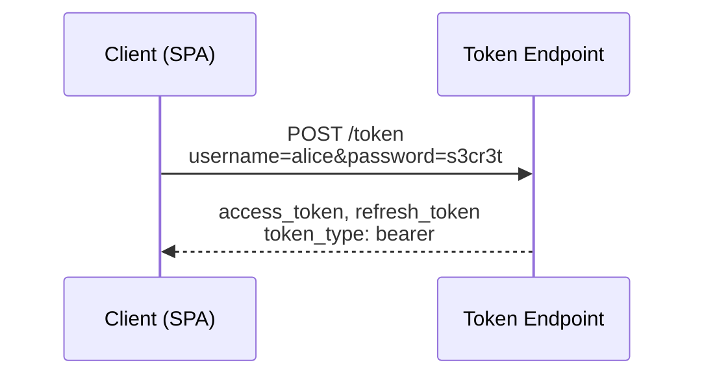
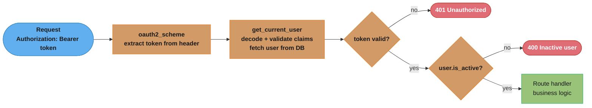
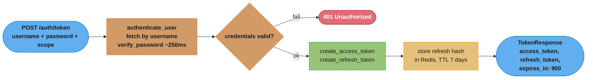
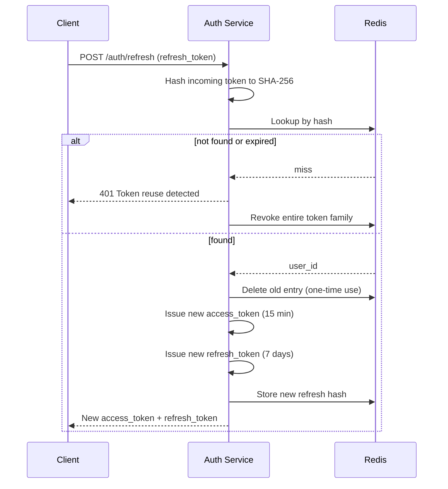
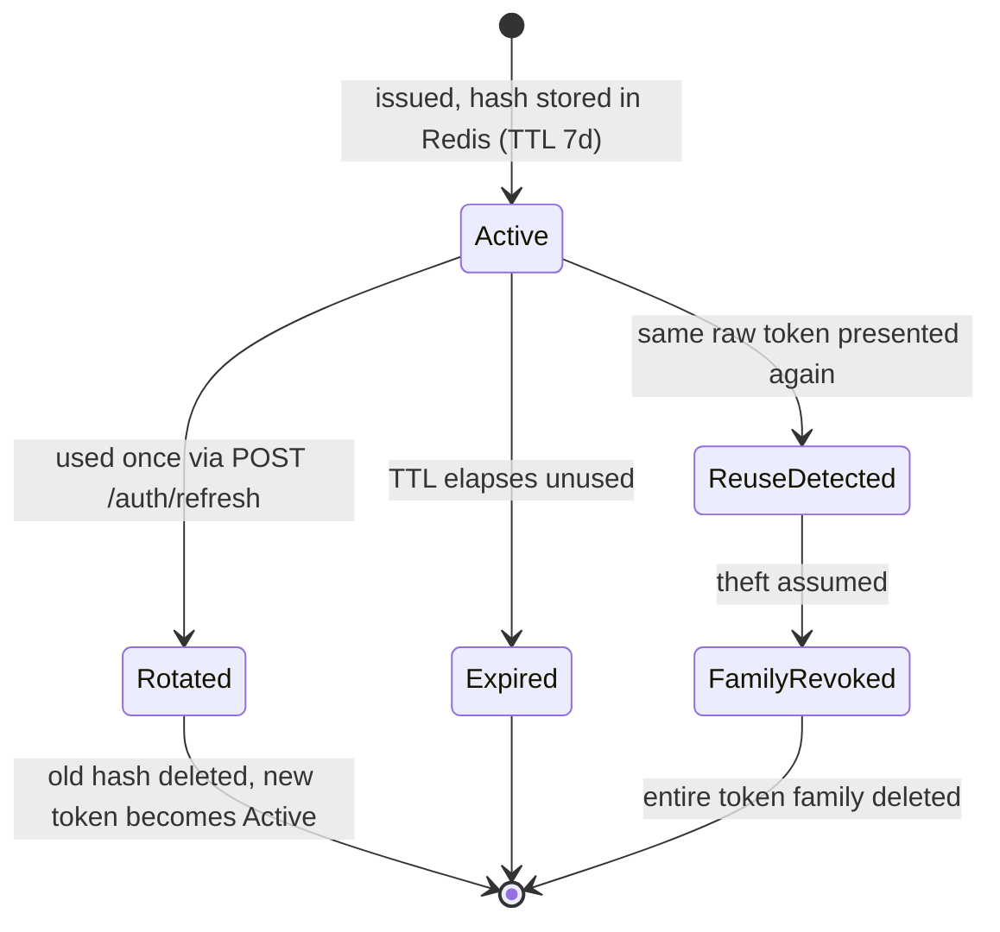
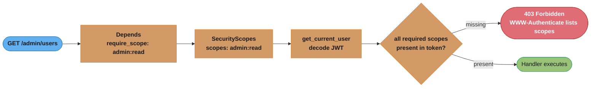
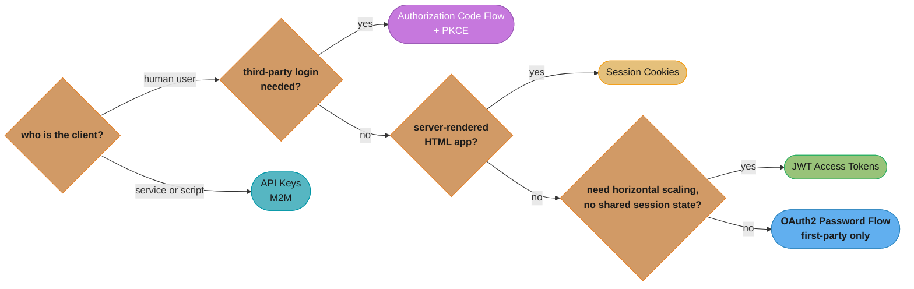
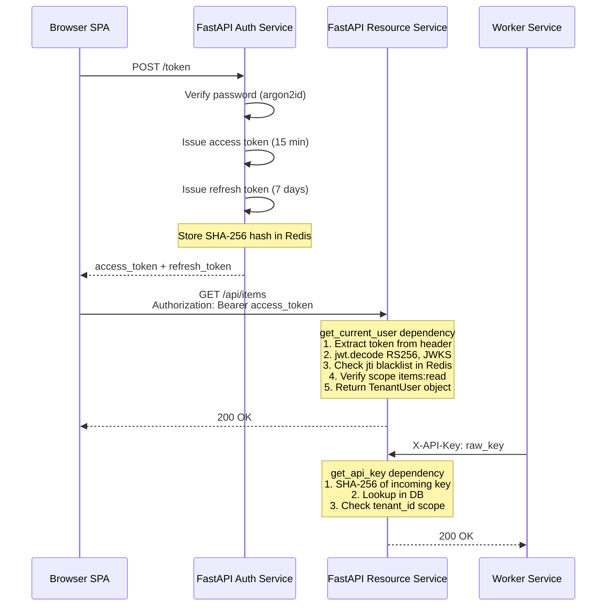

# Authentication and Security

## 1. Concept Overview

Authentication and security in FastAPI covers the full stack of mechanisms for verifying identity and authorizing requests: OAuth2 password flow, JWT issuance and validation, password hashing, refresh token rotation, scope-based authorization, API key schemes, OIDC integration, CSRF protection, and token blacklisting.

FastAPI ships with first-class OpenAPI security scheme support. Declaring `OAuth2PasswordBearer` or `APIKeyHeader` in a `Depends()` chain does two things at once: it enforces the scheme at runtime and documents it in the auto-generated `/docs` UI with a padlock icon. Security is a dependency — not middleware bolted on the side.

Core capabilities covered in this module:

- `OAuth2PasswordBearer` and the token endpoint (`OAuth2PasswordRequestForm`)
- JWT internals: header, payload, signature; `HS256` vs `RS256`
- `python-jose` vs `PyJWT` — differences and selection criteria
- Password hashing: `passlib` + `bcrypt` (cost 12 ≈ 250 ms), `argon2`, `scrypt`
- Refresh token rotation: short-lived access (15 min) + long-lived refresh (7 days)
- Scope-based authorization with `SecurityScopes`
- API key authentication: `APIKeyHeader`, `APIKeyQuery`
- OIDC and third-party OAuth2 (Google, GitHub): authorization code flow
- CSRF protection: SameSite cookies, double-submit cookie pattern
- Token blacklisting with Redis for explicit logout
- Cross-links: `../dependency_injection_in_fastapi/README.md`, `../configuration_and_settings_management/README.md`

Python version: 3.11/3.12. FastAPI version: 0.110+. Pydantic version: v2.

---

## 2. Intuition

> Authentication is a bouncer checking your ID at the door; authorization is the VIP list determining which rooms you can enter once inside.

**Mental model.** Every HTTP request arrives as an anonymous byte stream. Authentication converts it to a principal — a typed Python object representing the caller. Authorization is a second gate: does this principal hold the required scope or role for this specific operation? FastAPI models both as a dependency DAG: `get_current_user` depends on `get_token`, which depends on `oauth2_scheme`; a protected route depends on `get_current_active_user`, which calls `get_current_user`. The chain executes before the handler body runs.

**Why it matters.** A misconfigured authentication layer is the most common entry point for breaches. Weak secrets, missing expiry checks, and predictable tokens are exploited within hours of exposure. Correct implementation requires choosing algorithms deliberately, storing secrets outside code, and handling token lifecycle explicitly.

**Key insight.** JWTs are stateless by design: once issued, you cannot "un-issue" them without a blocklist. That trade-off — stateless speed vs. revocation complexity — shapes every architectural decision in this module.

---

## 3. Core Principles

**1. Defense in depth.** No single mechanism is sufficient. Layer password hashing, short-lived tokens, refresh rotation, HTTPS enforcement, and rate limiting. Each layer limits the blast radius of a breach at any other layer.

**2. Separation of concerns.** Authentication (who are you?) and authorization (what can you do?) are distinct operations. Conflating them produces brittle code. `get_current_user` verifies the token; `require_scope("items:write")` checks permissions. Never merge the two.

**3. Credentials never in code.** Secrets rotate. Hard-coded strings do not. Load `SECRET_KEY`, database passwords, and OAuth2 client secrets from environment variables via `pydantic-settings`. Use `SecretStr` to prevent accidental logging.

**4. Fail closed.** On any validation error — expired token, wrong signature, missing claim — return HTTP 401. Never return a partially authenticated identity. The default FastAPI behavior of raising `HTTPException(status_code=401)` is correct; don't suppress these exceptions.

**5. Time is a security primitive.** JWT `exp` claims, refresh token TTLs, bcrypt work factors, and OIDC `nonce` values are all time-bound. Use `datetime.utcnow()` consistently, or better `datetime.now(tz=timezone.utc)` (Python 3.11+), and verify `exp` on every decode.

---

## 4. Types / Architectures / Strategies

### 4.1 OAuth2 Password Flow

The simplest grant type: the client (typically your own SPA) sends username + password directly to your token endpoint. The server returns an access token (and optionally a refresh token). Suitable for first-party clients only — never use this for third-party integrations.



*The client sends the raw username and password directly to the server's own token endpoint — acceptable only because it is a first-party client the same operator controls.*

### 4.2 Authorization Code Flow (OIDC / Third-Party)

Used for Google/GitHub login. The user is redirected to the provider, authenticates there, and the provider redirects back with a `code`. Your server exchanges the code for tokens at the provider's token endpoint. Never exchange codes client-side.

### 4.3 API Key Authentication

Static long-lived keys issued per client. Simpler than OAuth2, no token refresh needed. Appropriate for machine-to-machine (M2M) scenarios where the client is a trusted service. Keys should be hashed in storage (SHA-256 of the raw key) and rotatable.

### 4.4 JWT Bearer Tokens

Stateless tokens signed by the server. The payload carries claims (`sub`, `exp`, `iat`, `scopes`). Verification requires only the public key (RS256) or shared secret (HS256) — no database round-trip per request. Trade-off: no revocation without a blocklist.

### 4.5 Session Cookies

Server-side sessions stored in Redis or a database. The cookie carries only a session ID. Full revocation is trivial (delete the session). Higher per-request overhead (one Redis lookup). Appropriate for server-rendered HTML apps.

---

## 5. Architecture Diagrams

### JWT Authentication Dependency Chain



*Each dependency runs before the handler body executes; a failed check short-circuits with 401 or 400 rather than letting a partially authenticated identity reach business logic — the fail-closed principle from Section 3.*

### Token Endpoint Flow



*`verify_password` costs about 250 ms at bcrypt cost 12 — the dominant latency on this path — before the endpoint issues both tokens and persists only the refresh token's hash, never the raw value, in Redis.*

### Refresh Token Rotation



*A hash that is not found — already deleted or never issued — is treated as theft: the endpoint revokes the whole token family instead of trusting the single presented token.*

### Refresh Token Lifecycle



*Rotation is what makes reuse detectable: a legitimate refresh always retires the old token into a fresh `Active` one, so a second use of the same raw value can only mean the token already leaked (see Q5 and Q19).*

### Scope-Based Authorization



*A missing scope returns 403, not 401 — the token itself is valid, but the principal lacks permission for this operation (see Pitfall 6).*

---

## 6. How It Works — Detailed Mechanics

### 6.1 JWT Structure

A JWT is three base64url-encoded JSON objects joined by dots:

```
eyJhbGciOiJIUzI1NiIsInR5cCI6IkpXVCJ9   <- header: {"alg": "HS256", "typ": "JWT"}
.
eyJzdWIiOiIxMjMiLCJleHAiOjE3MDAwMDAwMDAsImlhdCI6MTcwMDAwMDAwMCwic2NvcGVzIjpbIml0ZW1zOnJlYWQiXX0
                                          <- payload: {"sub": "123", "exp": ..., "iat": ..., "scopes": [...]}
.
SflKxwRJSMeKKF2QT4fwpMeJf36POk6yJV_adQssw5c  <- signature: HMAC-SHA256(header.payload, secret)
```

The signature is verified on decode. If the payload or header is tampered with, the signature check fails and `jwt.decode()` raises `JWTError`.

Standard claims:
- `sub` (subject): unique identifier, typically user ID or email
- `exp` (expiry): Unix timestamp; `jwt.decode()` raises if current time > exp
- `iat` (issued at): Unix timestamp of creation; use to detect replayed tokens
- `jti` (JWT ID): unique token ID; used for blacklisting individual tokens

### 6.2 HS256 vs RS256

`HS256` (HMAC-SHA256): symmetric — same secret signs and verifies. Simple to set up. Every service that needs to verify tokens must have the secret. Leaked secret compromises all tokens.

`RS256` (RSA-SHA256): asymmetric — private key signs, public key verifies. Services verify with the public key only; the private key stays on the auth server. Required for multi-service architectures and OIDC. Key rotation is possible without service downtime by publishing a JWKS endpoint.

### 6.3 python-jose vs PyJWT

`python-jose` (`jose` package): supports JWS, JWE, JWK, JWKS. Built-in JWKS URL fetching for OIDC. Slightly more complex API. Required for RS256 with JWKS endpoints, JWE encryption, or third-party OIDC.

`PyJWT` (`jwt` package): simpler API, faster, actively maintained (jwt 2.x). Supports HS256, RS256, ES256. Does not bundle JWKS fetching (use `jwcrypto` or `cryptography` separately). Preferred for new projects that only need standard JWT.

```python
# PyJWT 2.x
import jwt
from datetime import datetime, timezone, timedelta

payload = {
    "sub": "user:123",
    "exp": datetime.now(tz=timezone.utc) + timedelta(minutes=15),
    "iat": datetime.now(tz=timezone.utc),
    "scopes": ["items:read"],
}
token = jwt.encode(payload, secret, algorithm="HS256")
decoded = jwt.decode(token, secret, algorithms=["HS256"])

# python-jose
from jose import jwt as jose_jwt
token = jose_jwt.encode(payload, secret, algorithm="HS256")
decoded = jose_jwt.decode(token, secret, algorithms=["HS256"])
```

Both raise on expired or tampered tokens — but under different exception names (`jwt.ExpiredSignatureError` vs `jose.ExpiredSignatureError`). Handle at the dependency boundary.

### 6.4 Password Hashing

`bcrypt` is the baseline. Cost factor 12 produces ~250 ms hash time on a modern server CPU — slow enough to defeat brute force, fast enough for user login. Do not lower cost factor below 12 for public-facing auth.

`argon2` (winner of the Password Hashing Competition) is memory-hard in addition to being CPU-bound. Use `argon2-cffi` via `passlib`. Harder to parallelize on GPU rigs. Preferred for new systems.

`scrypt` is built into Python's stdlib (`hashlib.scrypt`). Similar memory-hardness to argon2. Less commonly used.

```python
from passlib.context import CryptContext

# Create context once at module level
pwd_context = CryptContext(schemes=["argon2", "bcrypt"], deprecated="auto")
# "deprecated=auto" transparently re-hashes bcrypt passwords to argon2 on next login

def hash_password(plain: str) -> str:
    return pwd_context.hash(plain)

def verify_password(plain: str, hashed: str) -> bool:
    return pwd_context.verify(plain, hashed)
    # Constant-time comparison is built into passlib — no timing oracle
```

**In plain terms.** "The cost factor is an exponent, not a dial — each `+1` doubles the work for
everyone, the attacker and your own login endpoint alike." That symmetry is the whole design: you
cannot slow an attacker down without paying the identical tax on every legitimate login.

| Symbol | What it is |
|--------|------------|
| cost | The bcrypt work factor, `12`. Stored inside the hash string, so it travels with it |
| `2^cost` | Key-setup rounds bcrypt performs — `2^12 = 4096` |
| cost `+1` | Exactly 2x the time. `+2` is 4x. The scale is logarithmic in the number you type |
| hash time | Wall-clock per verify, ~250 ms at cost 12 on a modern server CPU |
| `1 / hash_time` | Logins per second one CPU core can complete — the ceiling this imposes |

**Walk one example.** Read the cost ladder off the exponent, anchored to the module's ~250 ms:

```
                 2^cost    relative work    hash time (from 250 ms at cost 12)
  cost 10         1024          1x                 62.5 ms
  cost 11         2048          2x                125   ms
  cost 12         4096          4x                250   ms      <- the recommendation
  cost 13         8192          8x                500   ms
  cost 14        16384         16x               1000   ms      <- users notice this
```

**The throughput ceiling nobody budgets for.** bcrypt is deliberately CPU-bound and cannot be
`await`ed away — it burns a core for the full 250 ms:

```
  one core at 250 ms/hash   ->   1 / 0.250   =   4 logins/second
   4 workers                ->   4 x 4       =  16 logins/second   =    960 logins/minute
   8 workers                ->   8 x 4       =  32 logins/second   =  1,920 logins/minute
  16 workers                ->  16 x 4       =  64 logins/second   =  3,840 logins/minute
```

Two consequences follow directly. First, `/auth/token` is a denial-of-service amplifier: 16 bogus
login attempts per second saturate a 4-worker deployment with garbage passwords, which is the real
reason Best Practice 12 rate-limits that one endpoint rather than trusting bcrypt to absorb it.
Second, moving from cost 12 to cost 14 does not cost "a bit more latency" — it cuts your login
throughput by 4x, from 16 logins/second to 4. Raise the cost factor and re-check the worker count
in the same change.

### 6.5 Broken Secret Storage → Fix

```python
# BROKEN: storing JWT secret in code
SECRET_KEY = "secret"  # In source code — rotatable? No. Guessable? Yes.
ALGORITHM = "HS256"

def create_token(user_id: int) -> str:
    return jwt.encode({"sub": str(user_id)}, SECRET_KEY, algorithm=ALGORITHM)


# FIX: load from settings, use a cryptographically random secret
# Generate a proper secret once:  python -c "import secrets; print(secrets.token_hex(32))"
# Store in environment variable: JWT_SECRET_KEY=<64-char hex>

from datetime import datetime, timezone, timedelta
from pydantic_settings import BaseSettings
from pydantic import SecretStr
import jwt

class Settings(BaseSettings):
    jwt_secret_key: SecretStr      # loaded from JWT_SECRET_KEY env var
    jwt_algorithm: str = "HS256"
    access_token_expire_minutes: int = 15

    class Config:
        env_file = ".env"

def create_access_token(subject: str, settings: Settings) -> str:
    now = datetime.now(tz=timezone.utc)
    expire = now + timedelta(minutes=settings.access_token_expire_minutes)
    payload = {
        "sub": subject,
        "exp": expire,
        "iat": now,
    }
    return jwt.encode(
        payload,
        settings.jwt_secret_key.get_secret_value(),  # SecretStr prevents logging
        algorithm=settings.jwt_algorithm,
    )
```

**Read it like this.** "`exp = iat + lifetime` is not a config value, it is your worst-case breach
window — the maximum time a stolen token keeps working after you have already noticed." Every
argument about 15 minutes versus 7 days is really an argument about that one number.

| Symbol | What it is |
|--------|------------|
| `iat` | Issued-at, a Unix timestamp. Where the window opens |
| `exp` | Expiry, a Unix timestamp. Where the window closes and `jwt.decode()` starts raising |
| `exp - iat` | Token lifetime in seconds — and the exposure window for a stolen copy |
| `leeway` | Clock-skew tolerance the verifier allows, widening the effective window on both ends |
| refresh TTL | The refresh token's own lifetime, `7 days`. The bound on how long a session can be renewed silently |

**Walk one example.** The module's `15 min` access + `7 day` refresh pair, in seconds:

```
  access  : 15 min x 60           =       900 s
  refresh :  7 x 24 x 3600        =   604,800 s

  ratio   : 604,800 / 900         =       672x
```

That `672x` is the number to say out loud. It is why the two tokens get different storage rules and
different transport rules — an attacker who steals the access token owns 900 seconds; one who steals
the refresh token owns 672 times that, unless rotation catches the reuse first.

```
  stolen access token  : usable for at most 900 s, then dead. No action required.
  stolen refresh token : usable for up to 604,800 s -- unless rotation detects the
                         second use and revokes the family (Section 6.8)

  672 = also the number of access tokens one refresh token can mint across its 7 days
        (604,800 / 900), i.e. 672 chances for rotation to notice a theft
```

**Why clock skew has to be small.** Verifiers commonly allow ~30 s of `leeway` so a server whose
clock drifts does not reject valid tokens. Against a 900-second lifetime that is `30 / 900 = 3.3%`
of extra window — negligible. Against a 60-second token it would be 50%, which is why very short
expiries stop being meaningful once skew tolerance is a large fraction of the lifetime. Run NTP and
keep `leeway` under a few percent of `exp - iat`.

### 6.6 Full OAuth2 Password Flow Implementation

```python
from fastapi import APIRouter, Depends, HTTPException, status
from fastapi.security import OAuth2PasswordBearer, OAuth2PasswordRequestForm
from sqlalchemy.ext.asyncio import AsyncSession
from functools import lru_cache
import jwt

router = APIRouter(prefix="/auth", tags=["auth"])

oauth2_scheme = OAuth2PasswordBearer(tokenUrl="/auth/token")

@lru_cache
def get_settings() -> Settings:
    return Settings()

# Token endpoint
@router.post("/token")
async def login(
    form_data: OAuth2PasswordRequestForm = Depends(),
    db: AsyncSession = Depends(get_db),
    settings: Settings = Depends(get_settings),
) -> dict:
    user = await authenticate_user(db, form_data.username, form_data.password)
    if not user:
        raise HTTPException(
            status_code=status.HTTP_401_UNAUTHORIZED,
            detail="Incorrect username or password",
            headers={"WWW-Authenticate": "Bearer"},
        )
    access_token = create_access_token(str(user.id), settings)
    refresh_token = await create_and_store_refresh_token(user.id, redis_client)
    return {
        "access_token": access_token,
        "refresh_token": refresh_token,
        "token_type": "bearer",
        "expires_in": settings.access_token_expire_minutes * 60,
    }

# Auth dependency
async def get_current_user(
    token: str = Depends(oauth2_scheme),
    db: AsyncSession = Depends(get_db),
    settings: Settings = Depends(get_settings),
) -> User:
    credentials_exception = HTTPException(
        status_code=status.HTTP_401_UNAUTHORIZED,
        detail="Could not validate credentials",
        headers={"WWW-Authenticate": "Bearer"},
    )
    try:
        payload = jwt.decode(
            token,
            settings.jwt_secret_key.get_secret_value(),
            algorithms=[settings.jwt_algorithm],
        )
        subject: str | None = payload.get("sub")
        if subject is None:
            raise credentials_exception
    except jwt.ExpiredSignatureError:
        raise HTTPException(
            status_code=status.HTTP_401_UNAUTHORIZED,
            detail="Token expired",
            headers={"WWW-Authenticate": "Bearer"},
        )
    except jwt.PyJWTError:
        raise credentials_exception

    user = await get_user_by_id(db, int(subject))
    if user is None:
        raise credentials_exception
    return user

async def get_current_active_user(
    current_user: User = Depends(get_current_user),
) -> User:
    if not current_user.is_active:
        raise HTTPException(status_code=400, detail="Inactive user")
    return current_user
```

### 6.7 Scope-Based Authorization

```python
from fastapi.security import SecurityScopes

async def get_current_user(
    security_scopes: SecurityScopes,
    token: str = Depends(oauth2_scheme),
    settings: Settings = Depends(get_settings),
) -> User:
    if security_scopes.scopes:
        authenticate_value = f'Bearer scope="{security_scopes.scope_str}"'
    else:
        authenticate_value = "Bearer"

    credentials_exception = HTTPException(
        status_code=status.HTTP_401_UNAUTHORIZED,
        detail="Could not validate credentials",
        headers={"WWW-Authenticate": authenticate_value},
    )
    try:
        payload = jwt.decode(token, settings.jwt_secret_key.get_secret_value(),
                             algorithms=[settings.jwt_algorithm])
        subject: str | None = payload.get("sub")
        token_scopes: list[str] = payload.get("scopes", [])
        if subject is None:
            raise credentials_exception
    except jwt.PyJWTError:
        raise credentials_exception

    # Verify all required scopes are present
    for scope in security_scopes.scopes:
        if scope not in token_scopes:
            raise HTTPException(
                status_code=status.HTTP_403_FORBIDDEN,
                detail=f"Not enough permissions. Required: {security_scopes.scope_str}",
                headers={"WWW-Authenticate": authenticate_value},
            )
    user = await get_user_by_id(db, int(subject))
    if user is None:
        raise credentials_exception
    return user

# Usage: protect a route with specific scopes
from fastapi import Security

@router.get("/admin/users")
async def list_users(
    current_user: User = Security(get_current_user, scopes=["admin:read"]),
) -> list[UserOut]:
    ...
```

### 6.8 Refresh Token Rotation with Redis

```python
import secrets
import hashlib
from redis.asyncio import Redis
from datetime import datetime, timezone, timedelta

REFRESH_TOKEN_TTL_SECONDS = 7 * 24 * 3600  # 7 days

async def create_and_store_refresh_token(user_id: int, redis: Redis) -> str:
    raw_token = secrets.token_urlsafe(32)           # 256 bits of entropy
    token_hash = hashlib.sha256(raw_token.encode()).hexdigest()
    key = f"refresh:{token_hash}"
    await redis.setex(key, REFRESH_TOKEN_TTL_SECONDS, str(user_id))
    return raw_token                                 # return raw; store only hash

async def rotate_refresh_token(
    incoming_raw: str, redis: Redis, settings: Settings
) -> tuple[str, str]:  # (new_access, new_refresh)
    token_hash = hashlib.sha256(incoming_raw.encode()).hexdigest()
    key = f"refresh:{token_hash}"
    user_id_bytes: bytes | None = await redis.get(key)
    if user_id_bytes is None:
        # Token not found or already used — possible reuse attack
        raise HTTPException(
            status_code=status.HTTP_401_UNAUTHORIZED,
            detail="Invalid or reused refresh token",
        )
    user_id = int(user_id_bytes.decode())
    await redis.delete(key)                          # one-time use: delete immediately

    new_access = create_access_token(str(user_id), settings)
    new_refresh = await create_and_store_refresh_token(user_id, redis)
    return new_access, new_refresh
```

**What this actually says.** "A token's strength is `log2(alphabet^length)` bits, and 256 of them
means guessing is not an attack you need to defend against — theft is." The `32` in
`secrets.token_urlsafe(32)` is bytes of raw entropy, not output characters, which is the detail that
trips people up.

| Symbol | What it is |
|--------|------------|
| `32` | Bytes requested from the OS CSPRNG — the entropy source, before encoding |
| `alphabet^length` | Size of the space a guesser must search |
| `log2(...)` | That size expressed in bits, so it fits on a page: `32 x 8 = 256` bits |
| `G` | Attacker guess rate, in attempts per second the API will actually accept |
| `2^(bits-1) / G` | Expected wall-clock time to one successful guess |

**Walk one example.** Where the 256 bits comes from, and what it buys:

```
  raw entropy   : 32 bytes x 8            = 256 bits
  encoded form  : base64url, 6 bits/char  = ceil(256 / 6) = 43 characters
                  ^ the STRING is 43 chars; the ENTROPY is 256 bits. Not the same number.

  search space  : 2^256
  guesses to hit: 2^255
  at G = 10^9 guesses/second (a billion -- no API serves this):
                  2^255 / 1e9  ->  ~1.8e60 years

  stored form   : sha256(raw).hexdigest() = 64 hex chars = 256 bits, one-way
```

**Why the hash, if guessing is already impossible.** The entropy defends against an attacker
*outside* the system; the SHA-256 defends against one *inside* it. A leaked Redis snapshot, a
replica dump, or a debug log of the token store hands over raw tokens if you stored them raw —
storing `sha256(raw)` means the dump is inert, because the lookup path hashes the incoming token and
compares. Note that a plain SHA-256 is correct here and would be wrong for passwords: 256 bits of
CSPRNG output has no dictionary to attack, so the slow-hash reasoning of Section 6.4 does not apply.

### 6.9 Token Blacklisting for Logout

```python
async def logout(
    token: str = Depends(oauth2_scheme),
    redis: Redis = Depends(get_redis),
    settings: Settings = Depends(get_settings),
) -> dict:
    try:
        payload = jwt.decode(
            token,
            settings.jwt_secret_key.get_secret_value(),
            algorithms=[settings.jwt_algorithm],
        )
        jti: str | None = payload.get("jti")
        exp: int | None = payload.get("exp")
        if jti and exp:
            ttl = exp - int(datetime.now(tz=timezone.utc).timestamp())
            if ttl > 0:
                # Store JTI until natural expiry so it cannot be reused
                await redis.setex(f"blacklist:{jti}", ttl, "1")
    except jwt.PyJWTError:
        pass  # Already invalid — nothing to blacklist
    return {"detail": "Successfully logged out"}

# Add blacklist check inside get_current_user:
jti = payload.get("jti")
if jti and await redis.exists(f"blacklist:{jti}"):
    raise credentials_exception
```

### 6.10 API Key Authentication

```python
from fastapi.security import APIKeyHeader

api_key_header = APIKeyHeader(name="X-API-Key", auto_error=False)

async def get_api_key(
    api_key: str | None = Depends(api_key_header),
    db: AsyncSession = Depends(get_db),
) -> APIClient:
    if api_key is None:
        raise HTTPException(status_code=403, detail="API key required")

    # Store SHA-256 of keys in DB, never the raw key
    key_hash = hashlib.sha256(api_key.encode()).hexdigest()
    client = await get_client_by_key_hash(db, key_hash)
    if client is None or not client.is_active:
        raise HTTPException(status_code=403, detail="Invalid or revoked API key")
    return client
```

---

## 7. Real-World Examples

**GitHub REST API.** Uses static API keys (`ghp_...` personal access tokens) for M2M and CLI tooling. Fine-grained tokens (2022) added per-repo scopes. Key storage: SHA-256 hash in the database, never the raw bytes. Token format includes a checksum prefix so accidental exposure is detectable by secret scanning.

**Stripe.** Live/test mode secret keys (`sk_live_...` / `sk_test_...`). Keys are not JWT — they are opaque random strings. Scoped to resources via restricted keys. Stripe's backend validates against a hash in their store. Rotation is handled by creating a new key before revoking the old one to avoid downtime.

**Google OAuth2 / OIDC.** Authorization code flow with PKCE. Returns an ID token (JWT, RS256) signed with Google's rotating public key published at `https://accounts.google.com/.well-known/openid-configuration`. Short-lived access tokens (1 hour) + long-lived refresh tokens. Your FastAPI app fetches the JWKS URL, caches public keys with a TTL, and verifies the ID token locally — no round-trip to Google per request.

**Auth0 / Okta.** Managed OIDC providers that issue RS256 JWTs. FastAPI apps configure `ALGORITHMS = ["RS256"]` and point PyJWT or python-jose at the JWKS endpoint. The provider handles user storage, MFA, session management. Common pattern in SaaS startups to avoid building auth from scratch.

**Discord Bot API.** Bot tokens are static, per-bot credentials. Rate-limited by IP and token. Scoped via OAuth2 bot permissions bitmask, not scopes strings. Rotatable via the developer portal. Demonstrates that OAuth2 "scopes" and permission models vary significantly across providers.

---

## 8. Tradeoffs

| Dimension | JWT (Stateless) | Session Cookie (Stateful) |
|---|---|---|
| Revocation | Requires blocklist (Redis) | Instant (delete session) |
| Scalability | No shared state between nodes | Requires sticky sessions or shared store |
| Token size | ~200-600 bytes in header | ~32 bytes (session ID) |
| DB lookup per request | Zero (stateless verify) | One (session store lookup) |
| Logout complexity | Must track JTI until exp | Delete session row |
| Best for | APIs, SPAs, microservices | Server-rendered HTML, strict logout |

| Algorithm | HS256 | RS256 |
|---|---|---|
| Key type | Shared secret (symmetric) | Public/private key pair (asymmetric) |
| Verification | Any service with the secret | Any service with the public key |
| Key distribution | Secret must stay secret everywhere | Public key distributable freely |
| Rotation | New secret invalidates all tokens | Key rotation without downtime (JWKS) |
| Use case | Single service, internal | Multi-service, OIDC, external consumers |

| Password Algorithm | Work factor | Memory-hard | Recommended cost |
|---|---|---|---|
| bcrypt | CPU-bound | No | 12 (~250 ms) |
| argon2id | CPU + memory | Yes | m=65536, t=3, p=4 |
| scrypt | CPU + memory | Yes | N=2^17, r=8, p=1 |
| PBKDF2-SHA256 | CPU-bound | No | 600000 iterations (NIST 2023) |

---

## 9. When to Use / When NOT to Use



*This traversal distills the Use / Do-not-use guidance below into one path: third-party login always routes to authorization-code-plus-PKCE, server-rendered apps keep session cookies, and the deciding factor between JWT and the password flow is whether the deployment needs to scale horizontally without shared state.*

**Use OAuth2 password flow when:**
- Building a first-party SPA or mobile app that you fully control
- Simplicity is a priority and you do not need third-party login
- You need scope-based permissions on your own API

**Do NOT use OAuth2 password flow when:**
- Integrating third-party applications — use authorization code flow with PKCE
- You cannot protect the client secret (public clients must use PKCE)

**Use JWT access tokens when:**
- Building stateless microservices where shared session state is undesirable
- The API is consumed by third parties who need to verify tokens independently
- Horizontal scaling across many nodes without sticky sessions

**Do NOT use JWT when:**
- You need instant revocation without a Redis blocklist (prefer sessions)
- The token payload carries sensitive PII (JWTs are encoded, not encrypted — use JWE)
- Token size is a concern in header-limited environments

**Use API keys when:**
- The consumer is a server-to-server integration (M2M), not a human user
- Long-lived credentials are acceptable and rotation can be managed by the operator
- Simplicity outweighs fine-grained token claims

**Do NOT use API keys when:**
- End users are authenticating interactively — use OAuth2
- Fine-grained per-request authorization is needed — JWT scopes are more expressive

---

## 10. Common Pitfalls

### Pitfall 1: Algorithm confusion — accepting "none"

```python
# BROKEN: no algorithm allowlist — attacker can send alg: "none"
decoded = jwt.decode(token, secret)   # PyJWT < 2.0 default accepted alg:none

# FIX: always pass explicit algorithms list
decoded = jwt.decode(
    token,
    settings.jwt_secret_key.get_secret_value(),
    algorithms=["HS256"],              # whitelist only — "none" rejected
    options={"require": ["exp", "iat", "sub"]},  # enforce required claims
)
```

The `alg: none` attack: an attacker strips the signature and sets `"alg": "none"` in the header. A library that does not enforce an algorithm allowlist will accept the unsigned token. PyJWT 2.x raises by default, but older versions did not. Always pass `algorithms=["HS256"]` explicitly.

### Pitfall 2: Timing oracle in password comparison

```python
# BROKEN: direct string comparison leaks timing information
def verify_password_broken(plain: str, hashed: str) -> bool:
    import hashlib
    return hashlib.sha256(plain.encode()).hexdigest() == hashed
    # SHA-256 is fast (< 1 ms), vulnerable to brute force AND timing attacks

# FIX: use passlib — internally uses hmac.compare_digest (constant-time)
def verify_password(plain: str, hashed: str) -> bool:
    return pwd_context.verify(plain, hashed)
    # bcrypt/argon2 hash comparison is constant-time by design
```

### Pitfall 3: Refresh token stored in localStorage

Refresh tokens stored in `localStorage` are accessible to any JavaScript on the page, including injected XSS payloads. A single XSS vulnerability allows an attacker to steal the refresh token and maintain persistent access.

Fix: store refresh tokens in `HttpOnly; Secure; SameSite=Strict` cookies. The browser sends them automatically, but JavaScript cannot read them. The trade-off is CSRF exposure — mitigate with the double-submit cookie pattern or CSRF tokens on mutation endpoints.

### Pitfall 4: Missing `exp` claim validation

```python
# BROKEN: decoding without exp check (only relevant for some JWT libs pre-2020)
payload = jwt.decode(token, secret, algorithms=["HS256"],
                     options={"verify_exp": False})  # Never do this in production

# FIX: let the library enforce exp (default behavior in PyJWT 2.x)
payload = jwt.decode(token, secret, algorithms=["HS256"])
# jwt.ExpiredSignatureError raised automatically if exp is in the past
```

### Pitfall 5: Logging tokens or secrets

```python
# BROKEN: logging the Authorization header unredacted
import logging
logger = logging.getLogger(__name__)

@app.middleware("http")
async def log_requests(request: Request, call_next):
    logger.info(f"Headers: {dict(request.headers)}")  # logs Authorization: Bearer <token>
    return await call_next(request)

# FIX: redact security headers before logging
SENSITIVE_HEADERS = {"authorization", "cookie", "x-api-key"}

@app.middleware("http")
async def log_requests(request: Request, call_next):
    safe_headers = {
        k: "***REDACTED***" if k.lower() in SENSITIVE_HEADERS else v
        for k, v in request.headers.items()
    }
    logger.info(f"Headers: {safe_headers}")
    return await call_next(request)
```

### Pitfall 6: Insufficient scope validation raises 401 instead of 403

Returning 401 (Unauthenticated) when the user is authenticated but lacks permission is semantically incorrect and confuses clients. Authentication failed → 401. Authenticated but not authorized → 403. FastAPI's `HTTPException` with `status_code=403` is the correct response when `SecurityScopes` check fails. See Section 6.7 for the correct implementation.

---

## 11. Technologies & Tools

| Tool | Role | Notes |
|---|---|---|
| `PyJWT` (jwt 2.x) | JWT encode/decode | Simpler API, faster, actively maintained; preferred for new projects |
| `python-jose` | JWT + JWK + JWE | Needed for JWKS endpoint fetching, JWE encryption, OIDC flows |
| `passlib[bcrypt,argon2]` | Password hashing | Unified API over bcrypt/argon2/scrypt; transparent rehashing |
| `argon2-cffi` | argon2 hashing | Lower-level argon2 binding; used by passlib internally |
| `cryptography` | RSA/EC key ops | Needed for RS256 key generation and JWKS endpoint |
| `fastapi.security` | OAuth2/APIKey schemes | Built-in — `OAuth2PasswordBearer`, `APIKeyHeader`, `HTTPBearer` |
| `redis.asyncio` | Refresh token store, blocklist | Sub-millisecond TTL operations; `redis-py` 4.x includes async client |
| `authlib` | OAuth2 client / OIDC | Full OAuth2/OIDC client for third-party login flows |
| `Starlette CORS middleware` | CORS | Already in FastAPI; configure `allow_origins` explicitly |

---

## 12. Interview Questions with Answers

**Q1: What is the difference between authentication and authorization?**
Authentication answers "who are you?" — it verifies identity by validating a credential (password, token, certificate). Authorization answers "what can you do?" — it checks whether the authenticated principal has permission to perform a specific action. In FastAPI, `get_current_user` handles authentication; scope checks or role checks handle authorization. Never conflate them in a single dependency.

**Q2: Why use JWTs instead of opaque tokens?**
JWTs are self-contained: the payload carries the user ID, expiry, and scopes, so the verifier needs only the public key or shared secret — no database round-trip per request. Opaque tokens require a lookup against a token store on every request. JWTs are preferred for stateless microservices and high-throughput APIs. The trade-off is revocation: you cannot revoke a JWT without a blocklist, whereas opaque tokens can simply be deleted from the store.

**Q3: What claims should a production access token always include?**
At minimum: `sub` (subject, the user identifier), `exp` (expiry as Unix timestamp), `iat` (issued-at, for detecting replayed tokens), and `jti` (unique token ID, for blacklisting). Optionally `scopes` (a list of granted permissions). Never embed passwords, raw emails, or other PII — JWT payloads are base64-encoded but not encrypted, visible to anyone who intercepts the token.

**Q4: Why is bcrypt's default cost factor 10 inadequate for production auth in 2025?**
Cost factor 10 produces ~100 ms on 2015-era hardware but less than 50 ms on a modern CPU. A bcrypt hash is parallelizable to ~1000 attempts/second per GPU. Cost factor 12 (~250 ms) increases GPU attack cost by 4× over factor 10. For high-security applications, use argon2id (memory-hard) which defeats GPU/ASIC parallelism regardless of cost factor by requiring large amounts of RAM per attempt. The OWASP recommendation as of 2024 is bcrypt cost ≥ 12 or argon2id with m=65536.

**Q5: Explain refresh token rotation and why it detects token theft.**
On each use of a refresh token, the server deletes the old token and issues a new one. If an attacker steals the refresh token and uses it first, the server invalidates it. When the legitimate client later presents the (now invalid) token, the mismatch signals a potential theft — the server should revoke the entire token family (all refresh tokens for that user). This is the "refresh token rotation with reuse detection" pattern. Without rotation, a stolen refresh token grants indefinite access.

**Q6: What is the `alg: none` JWT attack and how does PyJWT 2.x prevent it?**
An attacker strips the JWT signature, sets `"alg": "none"` in the header, and sends it. JWT libraries that do not enforce an algorithm allowlist may accept the unsigned token as valid. PyJWT 2.x raises `InvalidAlgorithmError` if `algorithms` is not explicitly passed to `decode()`. Always pass `algorithms=["HS256"]` (or `["RS256"]` for asymmetric). Never pass `algorithms=jwt.algorithms.get_default_algorithms()` unless you fully understand what it includes.

**Q7: When should you use RS256 instead of HS256?**
Use RS256 when multiple independent services need to verify tokens, or when tokens are consumed by third parties. With RS256, the private key stays on the auth server; services fetch the public key from a JWKS endpoint. A compromised microservice cannot forge tokens because it only has the public key. Use HS256 for single-service applications where the secret can be kept on one server. Never share HS256 secrets across untrusted boundaries.

**Q8: What is `SecurityScopes` and why use it over a plain `Depends`?**
`SecurityScopes` is a FastAPI-specific class injected into dependencies declared via `Security()`. It carries the list of scopes required by the current route, allowing a single `get_current_user` function to handle different permission requirements across routes without duplicating the function. It also generates correct `WWW-Authenticate` response headers listing required scopes, which is part of the RFC 6750 Bearer token spec. A plain `Depends` cannot carry this route-specific scope metadata.

**Q9: How would you implement explicit logout for a JWT-based API?**
Add a `jti` (JWT ID) claim — a UUID — to every issued access token. On logout, compute the remaining TTL from the `exp` claim and store the `jti` in Redis with that TTL as the key expiry. On every authenticated request, check whether the `jti` exists in the Redis blacklist before completing auth. The Redis key auto-expires when the token would have expired naturally, so the blocklist does not grow unboundedly. Logout also revokes the refresh token by deleting it from the refresh token store.

**Q10: What is the difference between `OAuth2PasswordBearer` and `HTTPBearer`?**
Both extract a Bearer token from the `Authorization` header. `OAuth2PasswordBearer` declares an OAuth2 password flow in the OpenAPI spec, which renders a username/password form in `/docs`. `HTTPBearer` is a simpler scheme that just extracts the token and declares a generic HTTP Bearer scheme in OpenAPI — it shows a raw token field in `/docs`. Use `OAuth2PasswordBearer` when you want the interactive `/docs` login form. Use `HTTPBearer` for API key or custom token schemes where the token acquisition flow is external.

**Q11: How do you store API keys securely?**
Never store the raw API key. On issuance, return the raw key to the user once (it will not be shown again — like GitHub personal access tokens). Immediately compute and store `SHA-256(raw_key)`. On each request, compute `SHA-256(incoming_key)` and compare against stored hashes. Use a constant-time comparison (`hmac.compare_digest`) to prevent timing attacks. For rotation: issue a new key, allow a grace period where both are valid, then revoke the old one.

**Q12: Explain the CSRF risk with cookie-based auth and how to mitigate it.**
When using `HttpOnly` cookies for session IDs or refresh tokens, the browser automatically attaches the cookie to same-origin and cross-origin requests. A malicious site can craft a form that submits to your API — the browser includes the cookie, so the request appears authenticated. Mitigation: set `SameSite=Strict` (or `Lax` for OAuth flows requiring redirects). For APIs consumed by SPAs on different origins, use the double-submit cookie pattern: the server sets a non-HttpOnly CSRF token cookie; the client reads it via JavaScript and sends it in a header; the server validates header matches cookie. CSRF does not apply to JWT-in-Authorization-header flows because browsers do not auto-attach custom headers.

**Q13: What is PKCE and when is it required?**
PKCE (Proof Key for Code Exchange, RFC 7636) prevents authorization code interception attacks in public clients (SPAs, mobile apps) that cannot safely store a client secret. The client generates a random `code_verifier`, computes `code_challenge = SHA-256(code_verifier)`, and sends the challenge with the authorization request. When exchanging the code for tokens, the client sends the raw `code_verifier`; the server verifies the hash matches. An attacker who intercepts the code cannot exchange it without the verifier. PKCE is mandatory for SPAs and mobile apps per OAuth 2.1 draft.

**Q14: How does OIDC differ from plain OAuth2?**
OAuth2 is an authorization framework — it issues access tokens that say "you may call this API." It does not define how to get user identity. OIDC (OpenID Connect) is a thin identity layer on top of OAuth2: the token response includes an `id_token` (JWT) containing user claims (`sub`, `email`, `name`, `picture`). Your app verifies the `id_token` signature using the provider's public key from its JWKS endpoint. OIDC also standardizes the discovery endpoint (`/.well-known/openid-configuration`) so you can fetch all configuration automatically.

**Q15: Why should you use `SecretStr` from pydantic for secrets?**
`SecretStr` stores the underlying string value but overrides `__repr__` and `__str__` to return `'**********'`. This means that if a `Settings` object is accidentally logged, printed in a traceback, or serialized to JSON, the secret value is never exposed. The raw value is only accessible via `.get_secret_value()`, which forces an explicit intent to use the secret. This provides a thin but effective defence-in-depth layer against accidental secret leakage in logs.

**Q16: What are the security implications of long-lived JWTs?**
A stolen JWT with a 24-hour or 7-day expiry gives an attacker a large window of access. If you use short-lived access tokens (15 min) with refresh token rotation, the maximum exposure window for a stolen access token is 15 minutes. The attacker cannot silently extend access via the refresh endpoint because they do not have the refresh token (or if they do, rotation detects reuse). Long-lived JWTs are never appropriate for user-facing APIs. Use them only for inter-service calls where the services are in the same trust boundary.

**Q17: How does `passlib`'s `deprecated="auto"` feature work?**
When a `CryptContext` is configured with `schemes=["argon2", "bcrypt"]` and `deprecated="auto"`, the first scheme (`argon2`) is the active scheme. All existing bcrypt hashes are flagged as deprecated. When `pwd_context.verify(plain, hashed)` is called for a bcrypt hash, it returns a tuple `(True, new_hash)` where `new_hash` is the argon2 hash of the same password. The application must detect this case and update the stored hash. This allows zero-downtime algorithm migration: users transparently get argon2 hashes on their next login without ever being logged out.

**Q18: How do you prevent JWT secret leakage via error messages?**
Never include token decoding details in HTTP error responses. The response body should be generic (`"detail": "Could not validate credentials"`) regardless of whether the failure was an expired token, wrong signature, or missing claim. Detailed JWT errors belong in server-side structured logs at DEBUG level — and even then, log the failure reason (e.g., `"jwt_error": "ExpiredSignatureError"`) without logging the raw token. Include a correlation ID in the response so operators can trace the specific request in logs if needed.

**Q19: What is token family tracking and why does it matter for refresh tokens?**
Token family tracking groups all refresh tokens issued in a single login session under a family ID. When a refresh token is presented that has already been used (indicating potential theft), the server invalidates the entire family — all refresh tokens from that login session. Without family tracking, an attacker who steals a refresh token can keep rotating it independently of the legitimate client. With family tracking, the first detected reuse triggers a full session revocation, forcing the legitimate user to log in again. Implement by storing a `family_id` with each refresh token in Redis and using a Lua script to atomically check-and-revoke.

---

## 13. Best Practices

1. **Use `SecretStr` for all secrets in `pydantic-settings`.** Prevents accidental logging. Load from environment variables, never from `.env` files committed to version control.

2. **Always pass `algorithms=["HS256"]` explicitly to `jwt.decode()`.** Prevents algorithm confusion attacks including `alg: none`.

3. **Set bcrypt cost factor to 12 or use argon2id** (`passlib[argon2]`). Measure hash time in your production environment — aim for 200–300 ms for interactive login.

4. **Issue short-lived access tokens (15 min) with refresh rotation.** Never issue access tokens longer than 1 hour for user-facing APIs. Long-lived tokens shift the security model toward API keys and require explicit revocation infrastructure.

5. **Hash API keys before storage using SHA-256.** Return the raw key once on creation; store only the hash. Implement constant-time comparison.

6. **Store refresh tokens in `HttpOnly; Secure; SameSite=Strict` cookies** when the client is a browser SPA. Use Authorization header tokens for mobile/native clients.

7. **Include `jti` in access tokens and implement a Redis blacklist** for logout. Set the Redis key TTL to the remaining `exp` - `now` so the store self-cleans.

8. **Separate 401 from 403 responses clearly.** 401: authentication failure (bad/missing/expired token). 403: authorization failure (valid token, insufficient permissions). This distinction helps clients handle errors correctly.

9. **Enforce HTTPS at the infrastructure level**, not the application level. TLS is required — OAuth2 over plain HTTP is explicitly prohibited by RFC 6749. In FastAPI, add `TrustedHostMiddleware` and redirect HTTP to HTTPS at the load balancer.

10. **Use `require=["exp", "iat", "sub"]` in `jwt.decode` options** to reject tokens missing mandatory claims, even if they have valid signatures.

11. **Rotate signing keys without downtime using JWKS.** For RS256, publish the public key set at a discoverable URL. Maintain `kid` (key ID) in the JWT header. Keep the old public key in the JWKS set for the duration of the longest-lived token after rotation.

12. **Rate-limit the `/auth/token` endpoint.** Brute-force protection is not optional. Even with bcrypt at cost 12, an attacker with a botnet can try common passwords. Use `slowapi` (Redis-backed rate limiter for FastAPI) or a reverse proxy rate limit of 5 requests/minute per IP on auth endpoints.

---

## 14. Case Study

### Secure Multi-Tenant SaaS API Authentication

**Context.** A B2B SaaS platform serves 500 enterprise tenants. Each tenant has multiple user accounts. Users authenticate via the web app (OAuth2 password flow). Internal microservices communicate using API keys. Tenant admins need scoped access to tenant-specific resources. The ops team requires explicit logout (session revocation) for security incident response.

**Architecture.**



*Three independent trust paths converge on the same resource service: the browser presents a short-lived RS256 JWT verified via JWKS, while the worker presents a hashed API key checked against the database — each dependency enforces tenant isolation its own way.*

**Settings module.**

```python
from pydantic import SecretStr
from pydantic_settings import BaseSettings, SettingsConfigDict

class AuthSettings(BaseSettings):
    model_config = SettingsConfigDict(env_prefix="AUTH_", env_file=".env")

    jwt_private_key: SecretStr          # AUTH_JWT_PRIVATE_KEY (PEM, RS256)
    jwt_public_key: str                 # AUTH_JWT_PUBLIC_KEY
    jwt_algorithm: str = "RS256"
    access_token_expire_minutes: int = 15
    refresh_token_expire_days: int = 7
    argon2_time_cost: int = 3
    argon2_memory_cost: int = 65536     # 64 MB
    argon2_parallelism: int = 4
```

**Token creation with RS256.**

```python
import jwt
from cryptography.hazmat.primitives.serialization import load_pem_private_key

def create_access_token(
    subject: str,
    tenant_id: str,
    scopes: list[str],
    settings: AuthSettings,
) -> str:
    now = datetime.now(tz=timezone.utc)
    jti = str(uuid.uuid4())
    payload = {
        "sub": subject,
        "tenant": tenant_id,
        "scopes": scopes,
        "exp": now + timedelta(minutes=settings.access_token_expire_minutes),
        "iat": now,
        "jti": jti,
    }
    private_key_bytes = settings.jwt_private_key.get_secret_value().encode()
    return jwt.encode(payload, private_key_bytes, algorithm="RS256")
```

**Broken dependency with fix — missing tenant scope isolation.**

```python
# BROKEN: scope check does not verify tenant context
async def get_current_user_broken(
    token: str = Depends(oauth2_scheme),
    settings: AuthSettings = Depends(get_auth_settings),
) -> User:
    payload = jwt.decode(token, settings.jwt_public_key, algorithms=["RS256"])
    user = await get_user(payload["sub"])
    return user
    # BUG: user from tenant A could call tenant B's endpoints if they guess the URL

# FIX: inject tenant context and verify match
async def get_current_user(
    security_scopes: SecurityScopes,
    token: str = Depends(oauth2_scheme),
    settings: AuthSettings = Depends(get_auth_settings),
    redis: Redis = Depends(get_redis),
) -> TenantUser:
    credentials_exception = HTTPException(
        status_code=status.HTTP_401_UNAUTHORIZED,
        detail="Could not validate credentials",
        headers={"WWW-Authenticate": f'Bearer scope="{security_scopes.scope_str}"'},
    )
    try:
        payload = jwt.decode(
            token,
            settings.jwt_public_key,
            algorithms=[settings.jwt_algorithm],
            options={"require": ["exp", "iat", "sub", "tenant", "jti"]},
        )
    except jwt.ExpiredSignatureError:
        raise HTTPException(status_code=401, detail="Token expired",
                            headers={"WWW-Authenticate": "Bearer"})
    except jwt.PyJWTError:
        raise credentials_exception

    jti = payload["jti"]
    if await redis.exists(f"blacklist:{jti}"):
        raise credentials_exception

    for scope in security_scopes.scopes:
        if scope not in payload.get("scopes", []):
            raise HTTPException(
                status_code=status.HTTP_403_FORBIDDEN,
                detail=f"Scope required: {scope}",
            )

    user = await get_user_by_id(payload["sub"])
    if user is None or str(user.tenant_id) != payload["tenant"]:
        raise credentials_exception              # tenant mismatch = cross-tenant attack
    return user
```

**Interview discussion questions:**

1. Why use RS256 over HS256 when you control all services?
   RS256 allows independent services to verify tokens without sharing a secret. If one service is compromised, the attacker cannot forge tokens. HS256 would require distributing the shared secret to every service — a single breach compromises all of them.

2. How would you handle key rotation for RS256 without downtime?
   Publish a JWKS endpoint with both the old and new public keys, differentiated by `kid`. New tokens are signed with the new private key and carry the new `kid`. Existing tokens (max 15 min TTL) are still valid because verifiers check `kid` against the JWKS and find the old key. Remove the old public key from JWKS only after all old tokens have expired.

3. What happens if Redis is unavailable during token validation?
   The `jti` blacklist check and refresh token lookup both fail. Choose: fail open (accept the token, risk replayed tokens) or fail closed (return 503). For security-sensitive APIs, fail closed with a circuit breaker. Add a Redis replica and use `redis.asyncio.Sentinel` for HA to reduce the probability of this scenario.

4. How do you scale the token blacklist in a high-traffic scenario?
   Redis with in-memory storage handles millions of `EXISTS` checks per second with sub-millisecond latency. The blacklist stays bounded because keys auto-expire with the token TTL. For extreme scale, add a Bloom filter in front: check the Bloom filter first (possible false positives but zero false negatives); only query Redis on a positive hit. A 10-million-entry Bloom filter takes ~12 MB of memory and adds < 1 µs per check.

---

*Cross-links:*
- Dependency patterns: [`../dependency_injection_in_fastapi/README.md`](../dependency_injection_in_fastapi/README.md)
- Settings management: [`../configuration_and_settings_management/README.md`](../configuration_and_settings_management/README.md)
- Security hardening: [`../security_hardening_and_owasp/README.md`](../security_hardening_and_owasp/README.md)
