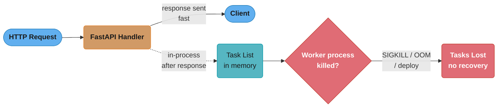
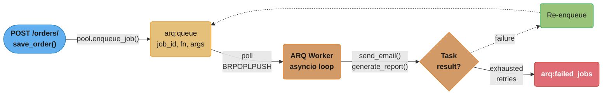
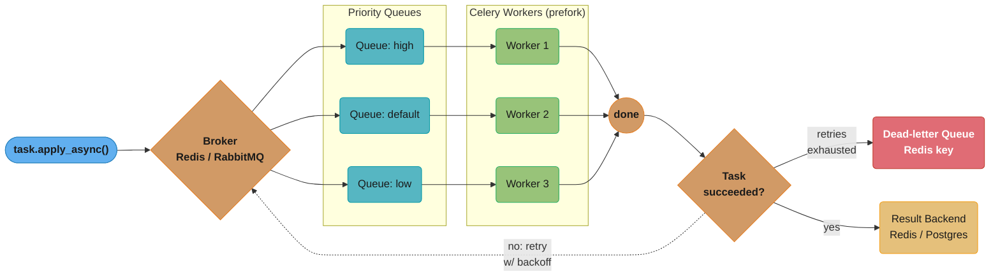
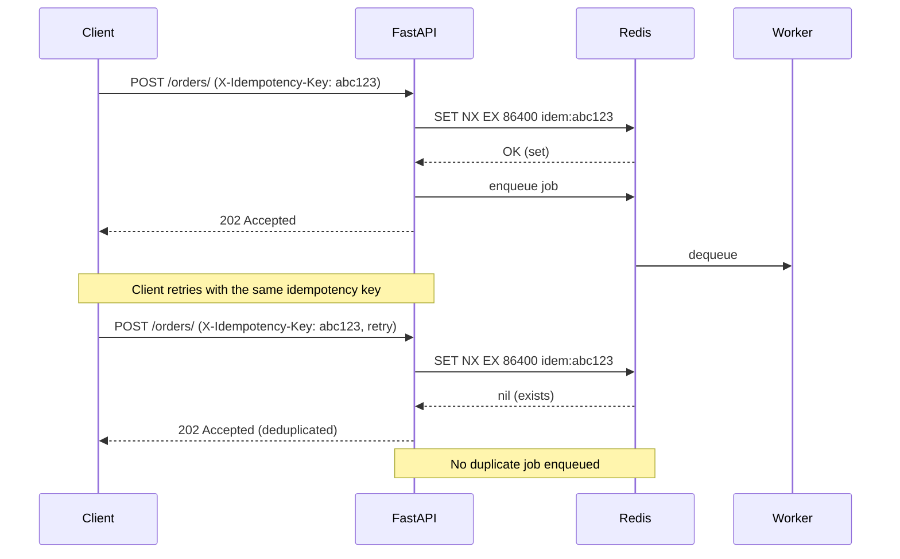
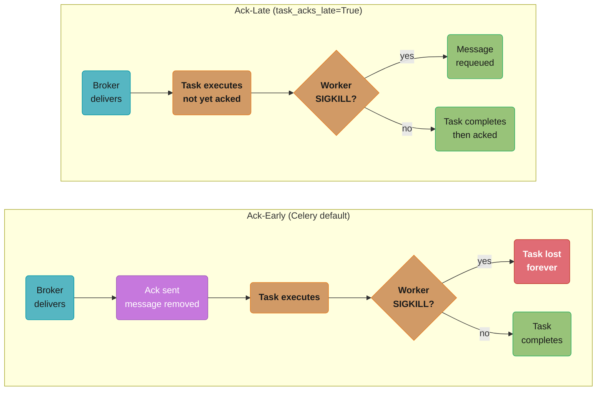
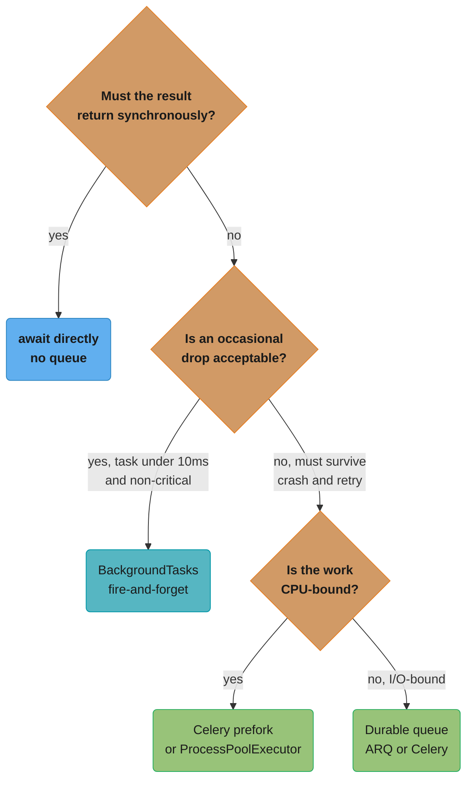
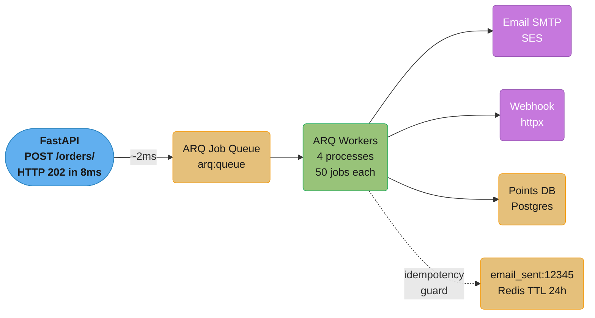

# Background Jobs and Task Queues

> Cross-references: [`../../async_patterns_and_pitfalls/README.md`](../../python/async_patterns_and_pitfalls/README.md),
> [`../message_queues_and_event_driven/README.md`](../message_queues_and_event_driven/README.md),
> [`../../../hld/case_studies/`](../../hld/case_studies/)

---

## 1. Concept Overview

Every non-trivial web service has work that should not happen inside a request/response
cycle: sending emails, resizing images, generating reports, calling slow third-party APIs,
aggregating analytics. Doing this work inline adds latency to the user-facing response,
ties up server threads, and — worst of all — makes the operation non-durable: if the
process crashes mid-execution, the work is silently lost.

Background job systems decouple the trigger (HTTP request) from the execution (worker
process) via a durable intermediary (message broker or database queue). The HTTP handler
places a message and returns immediately; a separate worker process consumes and executes
the message. If the worker crashes, the message stays in the queue and is re-delivered.

This module covers:

- `BackgroundTasks` (FastAPI built-in): in-process, no durability, fire-and-forget only
- **ARQ**: async Redis-backed task queue, native `asyncio`, lightweight
- **Celery**: battle-tested, broker-agnostic (Redis/RabbitMQ), prefork workers, Canvas
- **Dramatiq**: middleware-based, simpler than Celery, broker-agnostic
- Idempotency keys: deduplication under at-least-once delivery
- Retry semantics: at-least-once vs at-most-once vs exactly-once
- Dead-letter queues (DLQ): poison-message handling and monitoring
- Result backends, scheduling (beat/cron), worker concurrency models

Python version baseline: **3.11** (3.12 compatibility noted where relevant).

---

## 2. Intuition

> A restaurant has a kitchen (workers) and a pass-through window (queue). Waiters (HTTP
> handlers) drop tickets through the window and immediately return to serve the next table.
> The kitchen processes tickets in order, retries if a dish is dropped, and never forgets
> a ticket even if a cook goes home mid-shift — because the ticket is pinned to the board.

**Mental model**: The HTTP handler is a fast front-of-house operation. Background jobs are
the back-of-house kitchen. The queue is the physical ticket board: durable, ordered,
visible. Without the board, a crashed cook causes a lost order with no way to know it
happened. With the board, a new cook picks up the same ticket.

**Why it matters**: Silent task loss is one of the hardest production bugs to debug. A
`BackgroundTasks.add_task()` call that looks correct will silently drop work during a
deploy, OOM kill, or Gunicorn worker restart. Real production systems — Stripe, GitHub,
Shopify — use durable queues for every operation that touches money, email, or external
APIs. At Shopify, background jobs process over 3 million tasks per minute during peak sale
events; all of them flow through a durable queue (Resque/Sidekiq equivalent in Ruby, ARQ
or Celery equivalents in Python).

**Key insight**: Durability and idempotency are separate concerns. A durable queue
guarantees at-least-once delivery (the message survives crashes) but does NOT prevent
double execution on retry. Idempotency — making the task safe to run multiple times with
the same result — is your responsibility, implemented at the task level via an idempotency
key in Redis or the database.

---

## 3. Core Principles

1. **Enqueue fast, execute slow**: The HTTP handler must return in under 50ms. Anything
   slower (email delivery, PDF generation, ML inference) belongs in a background worker.

2. **Durability requires an external broker**: In-process solutions (`BackgroundTasks`,
   `asyncio.create_task`) do not survive process restarts. Use Redis, RabbitMQ, or a
   database-backed queue for any work that must complete.

3. **At-least-once is the default**: Most queue systems guarantee at-least-once delivery,
   meaning tasks can and do execute more than once on retry. Design all tasks to be
   idempotent.

4. **Fail loudly into a DLQ**: A task that exhausts retries must land in a dead-letter
   queue, not silently disappear. Silent drops are impossible to monitor and alert on.

5. **Keep tasks small and single-purpose**: A task that does one thing (send one email)
   is easier to retry, monitor, and test than a task that does five things. Compose
   complex workflows with Celery Canvas chains/chords or ARQ job dependencies.

6. **Separate I/O-bound from CPU-bound workers**: ARQ and Celery `eventlet`/`gevent`
   pools excel at I/O-bound tasks (HTTP calls, DB writes). CPU-bound tasks (image
   processing, ML inference) need Celery prefork (real OS processes) or dedicated workers.

---

## 4. Types / Architectures / Strategies

### 4.1 FastAPI `BackgroundTasks`

Built into Starlette/FastAPI. Runs tasks *after* the response is sent, still in the same
worker process and thread pool. Zero setup. Zero durability.

```python
from fastapi import BackgroundTasks

async def send_email(email: str) -> None:
    ...  # runs after response

@app.post("/register")
async def register(email: str, background_tasks: BackgroundTasks):
    background_tasks.add_task(send_email, email)
    return {"status": "ok"}
```

Execution model: Starlette collects tasks into a list and `await`s them sequentially after
`response.send()` completes, inside the same request's coroutine. If the Uvicorn worker
process is killed (SIGKILL from OOM killer, deploy restart), tasks in the list are lost.

Suitable for: audit logging, non-critical webhooks, cache warm-up where occasional drops
are acceptable.

### 4.2 ARQ (async Redis Queue)

ARQ is a Python 3.8+ async task queue backed by Redis. Workers are single async event
loops running many concurrent coroutines. Ideal for FastAPI because both the web layer and
workers speak native `asyncio`.

Key objects:
- `arq.create_pool(RedisSettings(...))` — returns an `ArqRedis` connection pool
- `pool.enqueue_job("function_name", *args, _defer_by=timedelta(seconds=30))` — enqueue
- `WorkerSettings` class — defines `functions`, `on_startup`, `on_shutdown`, `cron_jobs`
- `ctx["redis"]` — shared state passed to every task function

### 4.3 Celery

The most widely deployed Python task queue. Supports Redis, RabbitMQ, Amazon SQS as
brokers. Workers run as separate OS processes (prefork) or coroutines (eventlet/gevent).

Key APIs:
- `@app.task(bind=True, max_retries=3)` — define a task
- `task.apply_async(args=[...], countdown=60, queue="high")` — enqueue with delay
- `task.retry(exc=exc, countdown=2 ** self.request.retries)` — exponential backoff
- Celery Beat — periodic task scheduler (cron-like)
- Canvas: `chain(a.s(), b.s())`, `group(a.s(), b.s())`, `chord(group, callback)` —
  task composition primitives

### 4.4 Dramatiq

Dramatiq is a simpler alternative to Celery. Its killer feature is the middleware
architecture: retry, time limit, dead-letter, and rate-limit are all separate middleware
classes you stack together. It does not have a result backend by default (use
`dramatiq-result` or Redis manually).

```python
import dramatiq

@dramatiq.actor(max_retries=3, time_limit=30_000)
def send_invoice(order_id: int) -> None:
    ...
```

### 4.5 Decision Matrix

| Concern | BackgroundTasks | ARQ | Celery | Dramatiq |
|---|---|---|---|---|
| Durability | None (in-process) | Redis | Redis/RabbitMQ/SQS | Redis/RabbitMQ |
| Async-native workers | Yes (same loop) | Yes | No (eventlet shim) | No |
| Result backend | No | Redis | Redis/DB/RPC | Plugin |
| Periodic scheduling | No | Built-in cron | Celery Beat | APScheduler |
| Task Canvas (chain/chord) | No | No | Yes | group/pipeline |
| Worker concurrency | Coroutine | Coroutine | Prefork/eventlet | Thread/fork |
| Monitoring UI | No | arq-dashboard (3rd party) | Flower | Dramatiq-dashboard |
| Setup complexity | None | Low | High | Medium |
| Best for | Fire-and-forget | Async I/O tasks | Enterprise/complex | Simpler Celery |

---

## 5. Architecture Diagrams

### 5.1 BackgroundTasks (no broker)



The task list lives only in the handler's own process memory, so a worker crash between enqueue and execution drops the work with no trace — the reason `BackgroundTasks` is unsuitable for anything durable.

### 5.2 ARQ Architecture



FastAPI enqueues the job payload into Redis and returns immediately; the ARQ worker polls with a blocking `BRPOPLPUSH`, re-enqueues on failure, and only lands in `arq:failed_jobs` once retries are exhausted.

### 5.3 Celery Architecture



Requests fan out across three priority queues to dedicated prefork worker pools; a failed task retries with backoff back through the broker, and only exhausted retries reach the dead-letter queue, while successes land in the result backend.

### 5.4 Idempotency Key Pattern



The atomic `SET NX EX` check makes the second request with the same `X-Idempotency-Key` a no-op — Redis returns `nil` instead of `OK`, so FastAPI skips the second enqueue and no duplicate job ever reaches a worker.

---

## 6. How It Works — Detailed Mechanics

### 6.1 ARQ Internals

ARQ stores jobs as JSON hashes in Redis under `arq:job:{job_id}`. The worker polls using
`BRPOPLPUSH arq:queue arq:in_progress 1` — a blocking pop that atomically moves the job
ID into an in-progress list. On completion the job ID is removed from `arq:in_progress`.
On crash (worker dies without completing), a health check coroutine re-queues IDs that
have been in `arq:in_progress` longer than `job_timeout`.

```python
# arq worker definition
import asyncio
from arq import cron
from arq.connections import RedisSettings
from redis.asyncio import Redis as ArqRedis


async def send_confirmation_email(ctx: dict, order_id: int) -> str:
    redis: ArqRedis = ctx["redis"]
    # idempotency guard
    key = f"email_sent:{order_id}"
    if await redis.exists(key):
        return f"already sent for order {order_id}"
    # ... send email via SMTP/SES ...
    await redis.set(key, "1", ex=86_400)
    return f"sent for order {order_id}"


async def nightly_report(ctx: dict) -> None:
    # Scheduled via cron
    ...


async def startup(ctx: dict) -> None:
    ctx["http"] = ...  # shared httpx.AsyncClient


async def shutdown(ctx: dict) -> None:
    await ctx["http"].aclose()


class WorkerSettings:
    functions = [send_confirmation_email]
    cron_jobs = [cron(nightly_report, hour=2, minute=0)]
    on_startup = startup
    on_shutdown = shutdown
    redis_settings = RedisSettings(host="redis", port=6379)
    max_jobs = 50          # max concurrent coroutines per worker
    job_timeout = 300      # seconds before a job is considered hung
    keep_result = 3_600    # seconds to keep result in Redis
```

Enqueuing from FastAPI:

```python
from arq.connections import ArqRedis, create_pool, RedisSettings
from fastapi import FastAPI, Depends

app = FastAPI()
redis_pool: ArqRedis | None = None


@app.on_event("startup")
async def startup() -> None:
    global redis_pool
    redis_pool = await create_pool(RedisSettings(host="redis", port=6379))


@app.on_event("shutdown")
async def shutdown() -> None:
    if redis_pool:
        await redis_pool.close()


async def get_redis() -> ArqRedis:
    assert redis_pool is not None
    return redis_pool


@app.post("/orders/", status_code=202)
async def create_order(
    order: OrderCreate,
    redis: ArqRedis = Depends(get_redis),
) -> dict:
    db_order = await save_order(order)
    await redis.enqueue_job("send_confirmation_email", db_order.id)
    return {"order_id": db_order.id, "status": "queued"}
```

### 6.2 Celery Task with Exponential Backoff

```python
from celery import Celery
from celery.exceptions import MaxRetriesExceededError
import httpx
import random

celery_app = Celery(
    "tasks",
    broker="redis://redis:6379/0",
    backend="redis://redis:6379/1",
)
celery_app.conf.update(
    task_serializer="json",
    result_serializer="json",
    accept_content=["json"],
    task_track_started=True,
    task_acks_late=True,              # ack only after successful execution
    worker_prefetch_multiplier=1,     # fairness: fetch one task at a time
    task_reject_on_worker_lost=True,  # re-queue on SIGKILL
)


@celery_app.task(
    bind=True,
    max_retries=5,
    default_retry_delay=60,
    queue="notifications",
)
def send_invoice_email(self, order_id: int, recipient: str) -> None:
    try:
        with httpx.Client(timeout=10) as client:
            client.post(
                "https://api.sendgrid.com/v3/mail/send",
                headers={"Authorization": f"Bearer {SENDGRID_KEY}"},
                json={"to": recipient, "subject": f"Invoice #{order_id}", ...},
            )
    except httpx.HTTPStatusError as exc:
        if exc.response.status_code in (429, 503):
            # exponential backoff with jitter: 2^n * 60s +/- 30s
            delay = (2 ** self.request.retries) * 60 + random.uniform(-30, 30)
            raise self.retry(exc=exc, countdown=int(delay))
        raise  # non-retryable status — goes to DLQ
    except httpx.RequestError as exc:
        raise self.retry(exc=exc, countdown=int((2 ** self.request.retries) * 30))
```

### 6.3 Idempotency Key with Redis `SET NX EX`

```python
import hashlib
from redis.asyncio import Redis
from fastapi import Header, HTTPException


async def check_idempotency(
    idempotency_key: str | None = Header(None, alias="X-Idempotency-Key"),
    redis: Redis = Depends(get_redis),
) -> str | None:
    if idempotency_key is None:
        return None
    # normalize: hash to fixed length to prevent Redis key injection
    safe_key = "idem:" + hashlib.sha256(idempotency_key.encode()).hexdigest()
    # SET NX EX — atomic: set only if not exists, expire in 24h
    acquired = await redis.set(safe_key, "1", nx=True, ex=86_400)
    if not acquired:
        raise HTTPException(status_code=202, detail="duplicate request deduplicated")
    return idempotency_key
```

### 6.4 Dead-Letter Queue Monitoring with Celery

```python
# celeryconfig.py
task_routes = {
    "tasks.send_invoice_email": {"queue": "notifications"},
    "tasks.generate_report": {"queue": "reports"},
}
# Tasks that fail after max_retries go to DLQ queue automatically
# when using task_reject_on_worker_lost=True + task_acks_late=True
# Monitor DLQ:

from celery.app.control import Inspect

def check_dlq(app: Celery) -> list[dict]:
    """Return tasks in the dead-letter queue."""
    i = Inspect(app=app)
    reserved = i.reserved() or {}
    return [t for worker_tasks in reserved.values() for t in worker_tasks]
```

### 6.5 Celery Canvas — Chain and Chord

```python
from celery import chain, group, chord

# Chain: A -> B -> C (sequential, result of A passed to B)
workflow = chain(
    fetch_data.s(order_id=42),
    transform_data.s(),
    upload_to_s3.s(),
)
result = workflow.apply_async()

# Chord: group of parallel tasks -> single callback
report_chord = chord(
    group(
        generate_section.s("revenue"),
        generate_section.s("churn"),
        generate_section.s("acquisition"),
    ),
    assemble_report.s(),  # callback receives list of results
)
report_chord.delay()
```

### 6.6 Retry Semantics Comparison

| Semantic | Guarantee | Implementation | Risk |
|---|---|---|---|
| At-most-once | Task runs 0 or 1 times | Ack before processing | Silent loss on crash |
| At-least-once | Task runs 1+ times | Ack after processing | Duplicate execution |
| Exactly-once | Task runs exactly once | Idempotency key + at-least-once | Complexity cost |

True exactly-once is impossible without distributed transactions. Production systems
implement idempotent at-least-once as the practical equivalent.



Ack-early removes the message from the broker before the handler runs, so a mid-task `SIGKILL` loses it forever; ack-late defers the ack until the handler succeeds, so the same crash just requeues the message — the exact mechanic behind `task_acks_late` (Pitfall 3, Q3).

---

## 7. Real-World Examples

**Stripe**: Uses Sidekiq (Ruby) with Redis for payment retry logic. Equivalent Python
pattern is Celery with `task_acks_late=True` and exponential backoff. Stripe's idempotency
key system (documented in their API) is the canonical reference for the `SET NX EX` pattern.

**GitHub Actions**: Workflow job dispatch is a queue-based system. Each job is a message
in a durable queue. Runner pickup is at-least-once; jobs have idempotency at the
`run_id` level to prevent duplicate action invocations on re-runs.

**Shopify**: Processes over 3 million background jobs per minute during Black Friday using
Resque/Sidekiq. In Python terms: dedicated queues per priority level (`critical`, `high`,
`default`, `low`), separate worker pools per queue, dead-letter queue alerting via PagerDuty.

**Robinhood**: Uses Celery + RabbitMQ for trade confirmation emails and push notifications.
Trade events have a dedicated `trades` queue with higher worker count and lower prefetch
multiplier (1) to ensure fair processing. Notification workers use `eventlet` pool because
all work is I/O-bound (APNS/FCM HTTP calls).

**Discord**: Uses a Redis-backed async queue for notification fan-out. A single message
sent to a 500,000-member server spawns 500,000 individual notification jobs. ARQ-style
async workers handle ~50 concurrent HTTP calls per worker coroutine, running 20 worker
instances for 1,000 concurrent outbound calls total.

---

## 8. Tradeoffs

### 8.1 BackgroundTasks vs Durable Queue

| Dimension | BackgroundTasks | Durable Queue (ARQ/Celery) |
|---|---|---|
| Durability | None — lost on process restart | Persisted in broker |
| Setup | Zero | Redis/RabbitMQ + worker process |
| Latency to execute | ~0ms (same process) | ~1-5ms (Redis roundtrip) |
| Observability | None | Job IDs, result store, Flower |
| Retry | Manual (no built-in) | Built-in with backoff |
| Best for | Audit log, non-critical warmup | Emails, payments, heavy processing |

### 8.2 ARQ vs Celery

| Dimension | ARQ | Celery |
|---|---|---|
| Worker model | Single async loop | Prefork / eventlet / gevent |
| Async-native | Yes | No (requires shim) |
| Task Canvas | No | chain, group, chord |
| Scheduling | Built-in cron | Celery Beat (separate process) |
| Broker support | Redis only | Redis, RabbitMQ, SQS, more |
| Result backend | Redis | Redis, DB, RPC, cache |
| Monitoring | arq dashboard (minimal) | Flower (mature) |
| Lines of config | ~20 | ~100+ |
| Production maturity | Growing | Extremely mature |

### 8.3 Result Backend Tradeoffs

| Backend | Durability | Speed | Storage cost | Best for |
|---|---|---|---|---|
| Redis | Low (TTL expires) | ~0.5ms | Low | Short-lived results, polling |
| PostgreSQL | High | ~5ms | Medium | Audit trail, long-lived results |
| RPC (RabbitMQ) | Medium | ~1ms | Low | Synchronous `.get()` callers |
| None (ignore result) | N/A | Zero overhead | Zero | Fire-and-forget tasks |

---

## 9. When to Use / When NOT to Use



Three questions in sequence — synchronous need, acceptable drop risk, and CPU-vs-I/O-bound — route straight to the right tool from the detailed bullet lists below.

### Use background jobs when:

- Work takes more than ~100ms (email send, PDF generation, image resize, ML inference)
- Work calls external APIs that may be slow or flaky
- Work must be retried on failure (payment confirmation, webhook delivery)
- Work volume exceeds the capacity of a single web worker (fan-out notification, batch export)
- You need scheduling (nightly report, hourly data sync)

### Use `BackgroundTasks` (not a full queue) when:

- The task is truly fire-and-forget AND occasional drops are explicitly acceptable
- Setup overhead of Redis + worker process is not justified (local dev, scripts)
- The task is extremely fast (< 10ms) and non-critical (increment a counter, emit a metric)

### Do NOT use background jobs when:

- The result must be returned synchronously to the client — use `await` directly
- The task is CPU-bound and you are using ARQ (async loops block on CPU work; use
  Celery prefork or ProcessPoolExecutor instead)
- You need sub-millisecond trigger latency — queue overhead adds 1-5ms minimum
- The operation must be transactional with the HTTP request (use DB transactions,
  not a queue — the Outbox pattern bridges both concerns)

---

## 10. Common Pitfalls

### Pitfall 1: Using BackgroundTasks for durable work (most common production mistake)

```python
# BROKEN: task is lost if the Uvicorn worker is killed during a deploy or OOM event.
# The response has already been sent — the task runs after the response,
# still inside the worker process. SIGKILL from the OOM killer drops it silently.
@app.post("/orders/")
async def create_order(order: OrderCreate, background_tasks: BackgroundTasks):
    db_order = await save_order(order)
    background_tasks.add_task(send_confirmation_email, db_order.id)  # LOST on crash
    return db_order
```

```python
# FIX: enqueue to a durable queue. Job persists in Redis even if the web process dies.
# ARQ worker in a separate process picks it up independently.
@app.post("/orders/", status_code=202)
async def create_order(
    order: OrderCreate,
    redis: ArqRedis = Depends(get_redis),
) -> dict:
    db_order = await save_order(order)
    await redis.enqueue_job("send_confirmation_email", db_order.id)  # Persisted in Redis
    return {"order_id": db_order.id, "status": "queued"}


# ARQ worker (separate process, started with: python -m arq tasks.WorkerSettings)
async def send_confirmation_email(ctx: dict, order_id: int) -> None:
    ...  # runs in worker, survives web process restarts
```

### Pitfall 2: Non-idempotent task causes duplicate charges on retry

```python
# BROKEN: Celery retries on network timeout. If the payment API processed the first
# request but the response was lost, the retry creates a duplicate charge.
@celery_app.task(bind=True, max_retries=3)
def charge_customer(self, order_id: int, amount_cents: int) -> None:
    stripe.PaymentIntent.create(amount=amount_cents, currency="usd")  # DUPLICATE CHARGE
```

```python
# FIX: pass idempotency_key to the payment API. Stripe (and most payment processors)
# guarantee that the same idempotency_key returns the same result without re-charging.
@celery_app.task(bind=True, max_retries=3)
def charge_customer(self, order_id: int, amount_cents: int) -> None:
    stripe.PaymentIntent.create(
        amount=amount_cents,
        currency="usd",
        idempotency_key=f"order-{order_id}",  # stable key derived from order ID
    )
```

### Pitfall 3: Celery worker silently drops tasks on SIGKILL without `task_acks_late`

By default Celery acknowledges (removes from broker) the task message *before* executing
the task handler. If the worker is SIGKILL'd mid-execution, the message is already gone.

```python
# BROKEN: default ack_early=True — message acked before task runs
@celery_app.task
def process_payment(order_id: int) -> None:
    ...  # if killed here, message already acked, task silently lost
```

```python
# FIX: configure ack_late globally or per-task
celery_app.conf.task_acks_late = True
celery_app.conf.task_reject_on_worker_lost = True  # re-queue on SIGKILL

@celery_app.task(bind=True, acks_late=True)
def process_payment(self, order_id: int) -> None:
    ...  # message acked only after this returns without exception
```

### Pitfall 4: Blocking CPU work in ARQ async workers

```python
# BROKEN: PIL image processing is CPU-bound. It blocks the asyncio event loop,
# preventing all other concurrent jobs in the worker from running.
async def generate_thumbnail(ctx: dict, image_path: str) -> None:
    from PIL import Image  # CPU-bound
    img = Image.open(image_path)
    img.thumbnail((200, 200))   # blocks event loop for 50-200ms
    img.save(image_path + "_thumb.jpg")
```

```python
# FIX: offload to a thread pool so the event loop is not blocked
import asyncio
from concurrent.futures import ProcessPoolExecutor
from PIL import Image


def _resize_sync(image_path: str) -> None:
    img = Image.open(image_path)
    img.thumbnail((200, 200))
    img.save(image_path + "_thumb.jpg")


async def generate_thumbnail(ctx: dict, image_path: str) -> None:
    loop = asyncio.get_running_loop()
    with ProcessPoolExecutor(max_workers=2) as pool:
        await loop.run_in_executor(pool, _resize_sync, image_path)
    # for truly CPU-bound work use ProcessPoolExecutor, not ThreadPoolExecutor,
    # to bypass the GIL
```

### Pitfall 5: Missing DLQ monitoring causes silent job graveyard

Tasks that exhaust retries drop into `arq:failed_jobs` (ARQ) or a Celery DLQ queue.
Without alerting, a DLQ accumulates thousands of failed jobs over weeks. The first signal
is a customer complaint, not a dashboard alert.

Set up DLQ size alerting: `LLEN arq:failed_jobs > 0` → PagerDuty page, not just a
Slack notification.

---

## 11. Technologies & Tools

| Tool | Broker | Worker Model | Async-native | Canvas | Scheduling | Monitoring |
|---|---|---|---|---|---|---|
| `BackgroundTasks` | None (in-process) | Same coroutine | Yes | No | No | None |
| ARQ | Redis only | asyncio event loop | Yes | No | cron built-in | arq-dashboard |
| Celery | Redis/RabbitMQ/SQS | prefork/eventlet/gevent | No (shim) | chain/group/chord | Celery Beat | Flower |
| Dramatiq | Redis/RabbitMQ | Thread/prefork | No | pipeline/group | APScheduler | dramatiq-dashboard |
| RQ (Redis Queue) | Redis only | Sync prefork | No | No | rq-scheduler | rq-dashboard |
| Huey | Redis/SQLite/file | Sync/async | Partial | pipeline | Built-in | None |

**Broker comparison**:

| Broker | Throughput | Durability | Pub/Sub | Delay queues | Operational cost |
|---|---|---|---|---|---|
| Redis | ~100k msg/s | AOF/RDB (configurable) | Yes | Yes (ZADD) | Low |
| RabbitMQ | ~50k msg/s | Disk-persistent queues | Yes (exchanges) | Via TTL+DLX | Medium |
| Amazon SQS | ~3k msg/s (standard) | Managed, very high | No | DelaySeconds | Zero ops |

---

## 12. Interview Questions with Answers

**Q1: What is the difference between `BackgroundTasks` and a durable task queue like Celery or ARQ?**
`BackgroundTasks` runs after the response in the same process with no persistence — a worker
restart silently drops any queued tasks. Durable queues (Celery, ARQ) persist the task
message in an external broker (Redis, RabbitMQ); workers in separate processes consume
independently, so crashes do not lose work. Use `BackgroundTasks` only for truly
non-critical fire-and-forget work where occasional drops are explicitly acceptable.

**Q2: What is at-least-once delivery and why does it require idempotent tasks?**
At-least-once delivery means the broker guarantees a task message will be delivered to a
worker *at least* once, but may deliver it multiple times on retry after a crash or timeout.
If a task is not idempotent — meaning running it twice produces a different outcome than
running it once — duplicate execution causes bugs like double charges or duplicate emails.
Idempotency (using a stable key such as `order-{order_id}` to detect and skip duplicate
execution) is the application-level complement to at-least-once delivery.

**Q3: How does `task_acks_late=True` improve Celery durability?**
By default Celery acknowledges (removes) the task message from the broker before executing
the task handler. If the worker is killed mid-execution (SIGKILL from OOM killer, deploy),
the message is already gone. With `task_acks_late=True`, Celery acks only after the handler
returns successfully. Combined with `task_reject_on_worker_lost=True`, any task interrupted
by a crash is re-queued. The trade-off is that tasks may run twice if the handler completes
but the ack message is lost, reinforcing the need for idempotency.

**Q4: What is a dead-letter queue and when should you use one?**
A dead-letter queue (DLQ) is a special queue that receives messages that have been
rejected or have exhausted all retries. It prevents poison messages from blocking the main
queue indefinitely and provides a recoverable holding area for investigation. Configure
Celery DLQ via `task_reject_on_worker_lost` + a dedicated DLQ queue name; monitor its
depth with an alert on `LLEN dlq:notifications > 10`. Without a DLQ, failed tasks either
retry forever (starving other work) or disappear silently.

**Q5: How do you implement exponential backoff with jitter in Celery?**
Inside the task handler, catch the retryable exception and call `self.retry(exc=exc,
countdown=...)` where `countdown = (2 ** self.request.retries) * base_delay +
random.uniform(-jitter, jitter)`. The `self.request.retries` counter is 0 on the first
retry, 1 on the second, etc. Jitter (random offset) prevents thundering-herd: without it,
a batch of tasks that all fail simultaneously all retry at the same instant, overwhelming
the downstream service again.

**Q6: Why is ARQ a better fit for FastAPI than Celery for I/O-bound tasks?**
ARQ workers are native `asyncio` event loops. Each worker can run up to `max_jobs=50`
concurrent coroutines without threads, matching FastAPI's async model exactly. A single
ARQ worker handles 50 concurrent HTTP-call tasks with the overhead of one OS thread.
Celery's prefork workers spawn one OS process per concurrency slot; 50 concurrent I/O-bound
tasks would require 50 processes (~50MB each = 2.5GB RAM). For CPU-bound tasks the
calculus reverses: Celery prefork gives true parallelism; ARQ's event loop is single-core.

**Q7: What is the Redis `SET NX EX` pattern and how does it provide idempotency?**
`SET key value NX EX seconds` is an atomic Redis command: set the key only if it does
not exist (`NX`), with a TTL of `seconds` (`EX`). Used as an idempotency check before
enqueuing a job: if `SET NX` returns `nil`, the key already exists, meaning a job with
this idempotency key was already enqueued, so skip re-enqueuing. The TTL ensures the key
expires after the idempotency window (typically 24 hours), preventing the Redis keyspace
from growing unbounded. The atomicity of the command prevents TOCTOU races where two
concurrent requests both check-and-set simultaneously.

**Q8: Explain Celery Canvas — what are chain, group, and chord used for?**
Canvas is Celery's workflow composition API. A `chain(a.s(), b.s())` runs tasks
sequentially, passing the result of `a` as the first argument to `b`. A `group(a.s(),
b.s(), c.s())` runs tasks in parallel and returns a list of results. A `chord(group,
callback)` runs a group in parallel then calls `callback` with the list of results once
all group tasks complete — the standard pattern for fan-out/fan-in. Use chains for
dependent multi-step pipelines, groups for independent parallel work, and chords for
map-reduce patterns (e.g., generate 10 report sections in parallel, then assemble them).

**Q9: What is the worker prefetch multiplier and why should it be set to 1 for long tasks?**
The prefetch multiplier controls how many unacknowledged tasks each worker process fetches
from the broker at once. The default is 4 (fetch 4 tasks per concurrent slot). If one
task takes 10 minutes and another takes 1 second, a worker might hold 3 fast tasks idle
while executing the long task — those 3 tasks are invisible to other free workers. Setting
`worker_prefetch_multiplier=1` ensures each worker fetches only one task at a time,
enabling fair distribution across workers. For homogeneous short tasks, a higher prefetch
improves throughput by reducing broker round-trips.

**Q10: How do you monitor a Celery task queue in production?**
Three layers: (1) **Flower** — the official Celery web monitor, shows active workers,
task rates, success/failure counts, and lets you revoke tasks. Run as a separate process
`celery -A tasks flower --port=5555`. (2) **Prometheus metrics** via `celery-prometheus-
exporter` — exposes queue lengths, task duration histograms, and worker state as metrics
for alerting. (3) **DLQ depth alert** — monitor the DLQ Redis key length; alert if `LLEN
dlq:notifications > 0` for more than 5 minutes, indicating tasks are failing persistently.

**Q11: What is the Outbox Pattern and when is it needed with task queues?**
The Outbox Pattern solves the dual-write problem: you cannot atomically write to a database
and enqueue a message to Redis in a single transaction. If you write the DB row and then
crash before enqueueing, the event is lost. The outbox approach: write both the DB row
and an `outbox_events` row in the *same database transaction*. A separate poller reads
`outbox_events`, enqueues the message to Redis/RabbitMQ, and marks the event as processed.
This guarantees at-least-once delivery even if the application crashes between the DB commit
and the enqueue call. Use it for payment events, user lifecycle events, or anything where
the database state and the queue must stay consistent.

**Q12: How do you gracefully shut down a Celery or ARQ worker during a deployment?**
Send `SIGTERM` (not `SIGKILL`). Celery workers catch `SIGTERM`, stop fetching new tasks,
and wait for current tasks to complete (up to `--time-limit` seconds) before exiting.
ARQ workers behave similarly — the event loop processes its current job batch and exits.
For Kubernetes, set `terminationGracePeriodSeconds` to at least your longest expected task
duration (e.g., 120 seconds), and configure `preStop` hooks to send `SIGTERM` before the
pod is killed. Never send `SIGKILL` to workers directly — it bypasses graceful shutdown
and can leave tasks in an inconsistent state (partially processed, already acked).

**Q13: What is the difference between at-most-once, at-least-once, and exactly-once task delivery?**
At-most-once runs a task zero or one times by acking before processing, so a crash silently
drops it; at-least-once runs it one or more times by acking after processing, so a crash
causes a retry that may duplicate work. True exactly-once delivery is impossible without
distributed transactions across the broker and every side effect the task touches. Production
systems approximate it as idempotent at-least-once — accept the possibility of redelivery and
make replays a no-op with an idempotency key.

**Q14: Why does blocking CPU work inside an ARQ task handler stall unrelated jobs on the same worker?**
An ARQ worker runs one `asyncio` event loop, so a synchronous CPU-bound call like PIL image
resizing blocks that loop for its entire duration, freezing every other concurrent coroutine
on the same worker process. A 50-200ms thumbnail resize means every other job assigned to that
worker's 50-coroutine capacity stalls for the same 50-200ms window. Offload CPU-bound work to
a `ProcessPoolExecutor` via `loop.run_in_executor` so the event loop stays free to service I/O.

**Q15: Why does ARQ ship built-in cron scheduling while Celery requires a separate Beat process?**
ARQ's worker already runs a single async event loop, so its cron scheduler is just another
coroutine registered inside the same process with no extra moving parts. Celery's prefork
worker model has no natural place for a scheduler loop, so Celery Beat runs as an independent
process that periodically pushes scheduled tasks onto the same broker queue the workers consume.
The tradeoff is operational: Celery Beat is a single point of failure that must itself be kept
running and deduplicated across replicas, while ARQ cron scales with the worker fleet automatically.

**Q16: How do you choose a task result backend — Redis, PostgreSQL, RPC, or none?**
Pick the backend based on how long the result must survive and who needs to read it. Redis
gives sub-millisecond result writes but expires results on a TTL, so it suits short-lived
polling from the same request cycle. PostgreSQL costs roughly 5ms per write but persists
indefinitely, making it the right choice for audit trails or results a support team must query
days later. RPC (RabbitMQ) suits callers blocking synchronously on `.get()`, and disabling the
result backend entirely removes all storage overhead for true fire-and-forget tasks.

---

## 13. Best Practices

1. **Never use `BackgroundTasks` for operations that touch money, email, or external APIs
   with financial or compliance implications.** The risk of silent loss is not theoretical;
   it happens on every rolling deploy.

2. **Make all tasks idempotent by default.** Use `order-{order_id}` style keys at the
   idempotency layer. The cost of implementing idempotency upfront is far lower than
   debugging duplicate-execution incidents in production.

3. **Set `task_acks_late=True` and `task_reject_on_worker_lost=True` in all Celery
   deployments.** The default ack-early behavior is the most common source of silent
   task loss in production Celery clusters.

4. **Size your queues by priority, not by task type.** Use `critical`, `high`, `default`,
   and `low` queues with dedicated worker pools. High-priority work (password reset email)
   should never queue behind low-priority bulk exports.

5. **Alert on DLQ depth, not just task failure rate.** A high failure rate with retries
   may be expected during a transient outage; a growing DLQ means retries are exhausted
   and tasks are silently dying.

6. **Use `worker_prefetch_multiplier=1` for task queues with mixed task durations.** The
   default of 4 causes unfair starvation where one long task blocks 3 short tasks on the
   same worker.

7. **Set explicit `job_timeout` / `time_limit` on all tasks.** A task with no timeout can
   run indefinitely, consuming a worker slot forever. Default timeout: 5 minutes for
   standard tasks, 30 minutes for batch jobs.

8. **Test task logic independently of the queue framework.** Extract business logic into
   pure functions and unit test them. The Celery/ARQ decorator is infrastructure; the logic
   inside is the code you care about. Use `task.apply()` (sync) in tests to avoid spinning
   up a broker.

9. **Use separate Redis databases (or a separate Redis instance) for the task broker and
   the application cache.** Mixing them causes cache evictions to drop queued task messages,
   which is a non-obvious and catastrophic failure mode.

10. **Log task start, success, and failure with structured fields including `job_id`,
    `task_name`, `queue_name`, `duration_ms`, and `retry_count`.** This makes debugging
    slow or failing tasks in production tractable without Flower access.

---

## 14. Case Study

### Email Notification System with ARQ and Idempotency

**Scenario**: An e-commerce platform processes 50,000 orders per hour. Each order must
trigger a confirmation email, a warehouse notification webhook, and a loyalty points credit.
Requirements: emails must be delivered at-least-once, no duplicate emails on retry, SLA
of < 30 seconds from order placement to email send, failures must not affect the HTTP
response latency.

#### Architecture



Redis absorbs the write in about 2ms so the HTTP response returns in 8ms total; each of the three fan-out jobs — email, webhook, loyalty points — carries its own idempotency guard so a retried order never double-sends.

#### Implementation

```python
# app/tasks.py — ARQ task definitions
import asyncio
from typing import Any
import httpx
from redis.asyncio import Redis


async def send_order_confirmation(ctx: dict[str, Any], order_id: int) -> str:
    redis: Redis = ctx["redis"]
    http: httpx.AsyncClient = ctx["http"]

    # Idempotency guard — prevents duplicate emails on retry
    idem_key = f"email_sent:{order_id}"
    already_sent = await redis.set(idem_key, "1", nx=True, ex=86_400)
    if not already_sent:
        return f"skipped duplicate: order {order_id}"

    order = await fetch_order(order_id)
    await http.post(
        "https://api.ses.amazonaws.com/v2/email/outbound-emails",
        json={
            "From": "orders@shop.example.com",
            "To": [order["email"]],
            "Subject": f"Order #{order_id} confirmed",
            "Body": render_template("order_confirm.html", order=order),
        },
        timeout=10,
    )
    return f"sent to {order['email']}"


async def notify_warehouse(ctx: dict[str, Any], order_id: int) -> None:
    http: httpx.AsyncClient = ctx["http"]
    idem_key = f"warehouse_notified:{order_id}"
    redis: Redis = ctx["redis"]
    if not await redis.set(idem_key, "1", nx=True, ex=86_400):
        return
    await http.post(
        "https://warehouse.internal/api/orders",
        json={"order_id": order_id},
        timeout=5,
    )


async def credit_loyalty_points(ctx: dict[str, Any], order_id: int) -> None:
    # Database-level idempotency: UNIQUE constraint on (order_id, event='points_credit')
    await db.execute(
        """
        INSERT INTO loyalty_events (order_id, event, points, created_at)
        VALUES (:order_id, 'points_credit', :points, now())
        ON CONFLICT (order_id, event) DO NOTHING
        """,
        {"order_id": order_id, "points": 100},
    )


# Startup/shutdown hooks for shared resources
async def startup(ctx: dict[str, Any]) -> None:
    ctx["http"] = httpx.AsyncClient(
        limits=httpx.Limits(max_connections=100, max_keepalive_connections=20),
        timeout=httpx.Timeout(10.0),
    )


async def shutdown(ctx: dict[str, Any]) -> None:
    await ctx["http"].aclose()


class WorkerSettings:
    functions = [send_order_confirmation, notify_warehouse, credit_loyalty_points]
    on_startup = startup
    on_shutdown = shutdown
    redis_settings = RedisSettings(host="redis", port=6379, database=1)
    max_jobs = 50           # 50 concurrent coroutines per worker process
    job_timeout = 60        # seconds
    keep_result = 3_600     # keep result in Redis for 1 hour
    retry_jobs = True       # re-queue failed jobs
    max_tries = 5           # 5 attempts before dead-letter
```

```python
# app/routes/orders.py — FastAPI route
from arq.connections import ArqRedis, create_pool, RedisSettings
from fastapi import FastAPI, Depends, BackgroundTasks

app = FastAPI()
_redis_pool: ArqRedis | None = None


@app.on_event("startup")
async def lifespan_startup() -> None:
    global _redis_pool
    _redis_pool = await create_pool(RedisSettings(host="redis", port=6379, database=1))


async def get_queue() -> ArqRedis:
    assert _redis_pool is not None, "ARQ pool not initialized"
    return _redis_pool


@app.post("/orders/", status_code=202)
async def create_order(
    order: OrderCreate,
    queue: ArqRedis = Depends(get_queue),
) -> dict:
    db_order = await save_order(order)

    # Enqueue all three tasks independently — each has its own idempotency key
    await asyncio.gather(
        queue.enqueue_job("send_order_confirmation", db_order.id),
        queue.enqueue_job("notify_warehouse", db_order.id),
        queue.enqueue_job("credit_loyalty_points", db_order.id),
    )

    # HTTP response in ~8ms total (save ~5ms + 3 parallel enqueues ~2ms each on Redis)
    return {"order_id": db_order.id, "status": "processing"}
```

#### BROKEN → FIX Recap

```python
# BROKEN: original implementation used BackgroundTasks
# During a rolling deploy, Gunicorn sends SIGTERM to old workers.
# Uvicorn waits up to 30s then sends SIGKILL.
# Any background_tasks not yet executed are silently dropped.
@app.post("/orders/")
async def create_order_broken(order: OrderCreate, background_tasks: BackgroundTasks):
    db_order = await save_order(order)
    background_tasks.add_task(send_order_confirmation, db_order.id)  # DROPPED on deploy
    background_tasks.add_task(notify_warehouse, db_order.id)          # DROPPED on deploy
    return db_order
```

```python
# FIX: switch to ARQ — tasks persisted in Redis, survive all process lifecycle events
@app.post("/orders/", status_code=202)
async def create_order_fixed(
    order: OrderCreate,
    queue: ArqRedis = Depends(get_queue),
) -> dict:
    db_order = await save_order(order)
    await asyncio.gather(
        queue.enqueue_job("send_order_confirmation", db_order.id),
        queue.enqueue_job("notify_warehouse", db_order.id),
    )
    return {"order_id": db_order.id, "status": "processing"}
```

#### Capacity Numbers

- 50,000 orders/hour = ~14 orders/second
- 3 tasks per order = 42 jobs/second
- Each ARQ worker handles 50 concurrent coroutines, each task takes ~200ms (SES call)
- Throughput per worker: 50 / 0.2s = 250 jobs/second
- Required workers for 42 jobs/s: 1 worker with headroom (deploy with 2 for HA)
- Redis memory: each ARQ job JSON blob ~500 bytes; 42 jobs/s with 3600s TTL = ~75MB

#### Discussion Questions

1. Why does the implementation use `SET NX EX` for idempotency instead of a database
   UNIQUE constraint for email sends?
   Database constraints work for idempotency but require a DB write on every task check.
   `SET NX EX` in Redis is O(1) and ~0.3ms versus ~3ms for a DB roundtrip, 10x faster.
   However, for the `credit_loyalty_points` task, a DB UNIQUE constraint is preferable
   because the idempotency guarantee must survive a Redis flush — the DB is the system
   of record for financial data.

2. What happens if the Redis broker goes down between the DB save and the enqueue call?
   The `asyncio.gather` for the three enqueue calls will raise a `ConnectionError`. The
   HTTP route should catch this and return 503 so the client retries. Without the Outbox
   Pattern, there is a window where the order is saved in the DB but no tasks are enqueued.
   For a production system with strict guarantees, implement the Outbox Pattern: write an
   `outbox_events` row atomically with the order insert, and poll it separately.

3. Why run 4 worker processes instead of 1 worker with `max_jobs=200`?
   A single Python process is limited to one CPU core. With 4 processes, you get 4 cores
   of parallel execution for CPU-adjacent work (JSON serialization, template rendering)
   even though each worker's concurrency is event-loop based. Additionally, 4 processes
   provide fault isolation: if one worker crashes (memory leak, OOM), 3 continue serving.
