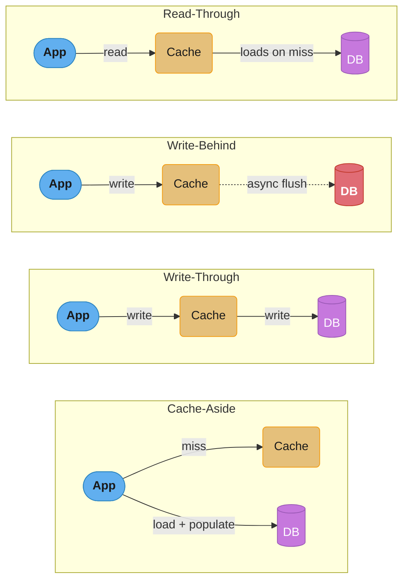
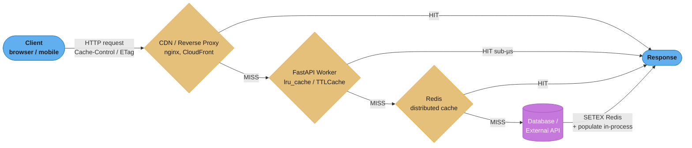
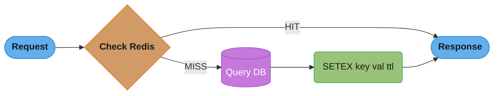
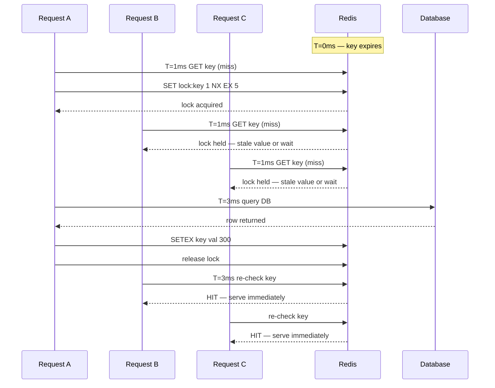
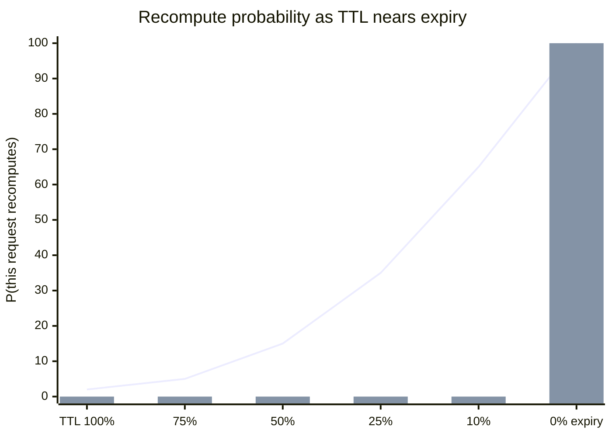
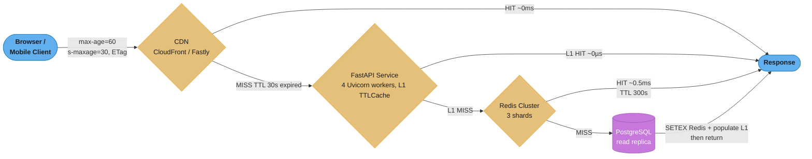

# Caching and Performance

---

## 1. Concept Overview

Caching is the practice of storing the result of an expensive computation or I/O operation so
that future requests for the same data can be served faster. In Python and FastAPI services,
caching operates at multiple levels — inside the process (in-memory), across processes
(distributed cache), and at the HTTP protocol layer (browser and CDN caches).

Performance in FastAPI extends beyond caching to include serialization speed, connection pool
management, response payload shaping, and avoiding common async pitfalls that waste CPU and
memory. A service that caches correctly but serializes slowly, or one that exhausts its Redis
connection pool under load, degrades just as severely as an uncached service.

This module covers:

- In-process caching: `functools.lru_cache`, `cachetools.TTLCache`, `cachetools.LRUCache`
- Distributed caching with `redis.asyncio`: connection pools, pipelines, Lua scripts
- Cache key design: namespacing, versioning, collision avoidance
- TTL strategy: short vs long TTL; event-based invalidation
- Redis write patterns: cache-aside, write-through, write-behind, read-through
- Cache stampede / thundering herd: mutex lock (`SET NX EX`), probabilistic early expiry
- Decorator-based caching: `fastapi-cache2`, `cashews`
- HTTP caching: `ETag`, `Last-Modified`, `Cache-Control`, `Vary`
- Serialization performance: `orjson`, `ujson`, `exclude_unset=True`
- Connection pool sizing and Redis max connections

---

## 2. Intuition

> A cache is a short-term memory that trades freshness for speed — the closer memory is to the
> CPU (or the user), the faster it reads but the staler it can become.

**Mental model:** Think of caches as a hierarchy of assistants. Your in-process cache is a
sticky note on your desk — instant to read, lost when you leave. Redis is a shared whiteboard
in the office — a few milliseconds away but survives your departure. The HTTP cache in the
browser is the user's local copy — zero network cost but possibly days old.

**Why it matters:** A single database call that takes 20ms can be served from Redis in 0.3ms.
A CPU-bound computation taking 50ms can be served from `lru_cache` in under 1 microsecond.
At 1,000 RPS those differences compound: 20ms × 1,000 = 20 seconds of cumulative DB load per
second eliminated entirely.

**Key insight:** Caching never eliminates stale reads — it trades consistency for latency. The
engineering decision is always: what staleness can this data tolerate, and what is the cost of
a cache miss?

### The one formula behind every cache decision

A cache's payoff is not the hit latency. It is the *blend* of hit and miss latency, weighted by
how often each happens:

```
  eff = h x t_hit + (1 - h) x t_miss
```

**Put simply.** "Your average latency is not the fast path — it is the slow path multiplied by
how often you still take it. A cache is a device for shrinking `(1 - h)`, and nothing else."

Everyone remembers `t_hit`. The term that dominates the arithmetic is `(1 - h) x t_miss`,
because `t_miss` is typically 50–100x larger than `t_hit`, so even a small miss rate carries
most of the total.

| Symbol | What it is |
|--------|------------|
| `h` | Hit rate — fraction of requests served from cache, `0.0` to `1.0` |
| `1 - h` | Miss rate; the fraction that still pays full price |
| `t_hit` | Latency of a cache hit — `0.3 ms` for Redis, per the numbers above |
| `t_miss` | Latency of a miss — `20 ms`, the database call this module cites |
| `eff` | Effective (mean) latency the caller actually experiences |

**Walk one example.** Redis in front of the 20 ms database, at rising hit rates:

```
     h        h x 0.3ms      (1-h) x 20ms       eff        speedup vs no cache
   0.00        0.00 ms         20.00 ms      20.00 ms           1.0x
   0.50        0.15 ms         10.00 ms      10.15 ms           1.97x
   0.80        0.24 ms          4.00 ms       4.24 ms           4.72x
   0.90        0.27 ms          2.00 ms       2.27 ms           8.81x
   0.94        0.28 ms          1.20 ms       1.48 ms          13.50x
   0.99        0.30 ms          0.20 ms       0.50 ms          40.24x
   1.00        0.30 ms          0.00 ms       0.30 ms          66.67x
```

Two things fall out of that column, and both are counter-intuitive.

**First: at 80% hit rate, 94% of your latency is still misses.** `4.00 / 4.24 = 94%`. The cache
is "working" — traffic to the database dropped fivefold — and yet almost every millisecond a
user waits is still a database millisecond. This is why Best Practice 10's "hit rate below 80%
indicates a problem" threshold is a floor, not a target.

**Second: every 10 points of hit rate is worth the same absolute time, until it isn't.** Going
`0.5 -> 0.6` saves 1.97 ms. Going `0.8 -> 0.9` also saves 1.97 ms — identical, because the
saving is just `0.1 x (t_miss - t_hit)`. But `0.90 -> 0.99`, nine times more work, saves only
1.77 ms. The last few points of hit rate are where TTL extension and stampede protection stop
paying for themselves, and it is worth knowing that before you spend a sprint on them.

---

## 3. Core Principles

1. **Cache what is expensive and read frequently.** Writing to cache adds overhead; the
   benefit only materializes when the cache hit rate is high enough to justify it.

2. **Explicit invalidation beats TTL alone.** TTL is a safety net, not a primary strategy.
   Where possible, delete or update the cache entry when the underlying data changes.

3. **Key design is a contract.** A poorly designed key that two callers compute differently
   causes silent miss-or-collision bugs. Keys must be deterministic and fully qualified.

4. **In-process caches are not shared.** With multiple worker processes (Gunicorn + Uvicorn),
   each process has its own `lru_cache`. Updates in process A are invisible to process B until
   the TTL expires or the cache is invalidated — which never happens across processes without
   an external signal.

5. **Stampede protection is mandatory for high-traffic keys.** When a popular cache entry
   expires, hundreds of concurrent requests may simultaneously attempt to recompute it,
   hammering the database.

6. **Measure before caching.** Profile with `cProfile` or `py-spy` to identify actual hot
   spots. Caching the wrong function wastes memory without improving latency.

---

## 4. Types / Architectures / Strategies

### In-Process Caches

| Type | Module | TTL Support | Bounded | Thread-Safe | Async-Safe |
|------|--------|-------------|---------|-------------|------------|
| LRU eviction | `functools.lru_cache` | No | Yes | Yes (GIL) | No (caches coroutine) |
| LRU eviction | `cachetools.LRUCache` | No | Yes | No (use RLock) | Manual |
| TTL eviction | `cachetools.TTLCache` | Yes | Yes | No (use RLock) | Manual |
| TTL eviction | `aiocache.SimpleMemoryCache` | Yes | No | Yes | Yes |

`lru_cache` wraps a synchronous callable and stores its return value. Wrapping an `async def`
function with `lru_cache` caches the coroutine object, not the awaited result — a critical
pitfall (see Section 10).

### Distributed Cache (Redis)

Redis is the de-facto distributed cache for Python web applications. The `redis.asyncio` client
(formerly `aioredis`) provides a non-blocking interface compatible with FastAPI's event loop.

**Redis write patterns:**

- **Cache-aside (lazy loading):** Application checks cache first; on miss, loads from DB and
  populates cache. Cache population is lazy — only entries that are actually requested get
  cached. Stale data is possible between writes and TTL expiry.

- **Write-through:** On every write to the database, also write to the cache. Reads always hit
  cache (after first write). Adds write latency; cache may hold entries that are never read.

- **Write-behind (write-back):** Write to cache immediately; flush to DB asynchronously.
  Lowest write latency; risk of data loss if cache crashes before flush.

- **Read-through:** Cache sits in front of the database; on miss, the cache itself loads from
  DB (not the application). Requires a cache layer that understands the data model (e.g.,
  custom Redis functions or Momento).



*The arrow direction is the tell: the application drives cache-aside and write-through, the
cache itself drives read-through, and write-behind is the only pattern with a dotted
(asynchronous) path to the database — the source of the data-loss risk noted above.*

For FastAPI services, cache-aside is the most common pattern because it keeps the application
in control of cache population and invalidation.

### HTTP Caching

HTTP caching is free performance: the browser or CDN stores the response and does not make a
network request at all for subsequent identical requests.

- `Cache-Control: max-age=60` — cache for 60 seconds
- `ETag: "abc123"` + `If-None-Match: "abc123"` — conditional request; server returns 304 if
  unchanged (no body transfer)
- `Last-Modified: <date>` + `If-Modified-Since: <date>` — time-based conditional request
- `Vary: Accept-Language` — cache separately per language header

FastAPI does not set `Cache-Control` by default. You must add it explicitly via response
headers or a middleware.

---

## 5. Architecture Diagrams

### Cache Hierarchy in a FastAPI Service



*Each layer only pays its own cost on a miss — CDN, in-process, and Redis all short-circuit
straight to the response on a HIT, and only the database write-back needs to populate every
cache layer behind it.*

### Cache-Aside Pattern (Request Flow)



*A hit returns in one hop; a miss pays for the DB query plus the `SETEX` that populates the
cache so the next request hits.*

### Stampede Protection with Mutex Lock



*Only Request A ever touches the database — B and C detect the held lock, back off, and
re-check Redis once A releases it at T=3ms, so one popular key never fans out into N
concurrent DB queries.*

---

## 6. How It Works — Detailed Mechanics

### 6.1 Redis Connection Pool with `redis.asyncio`

```python
# app/cache.py
import redis.asyncio as redis
from redis.asyncio import ConnectionPool

_pool: ConnectionPool | None = None

def get_pool() -> ConnectionPool:
    global _pool
    if _pool is None:
        _pool = ConnectionPool.from_url(
            "redis://localhost:6379/0",
            max_connections=20,       # tune based on worker count × expected concurrency
            decode_responses=True,    # return str, not bytes
            socket_connect_timeout=1, # fail fast on connection timeout
            socket_timeout=1,
        )
    return _pool

def get_redis() -> redis.Redis:
    return redis.Redis(connection_pool=get_pool())
```

**Why `decode_responses=True`?** Without it, Redis returns `bytes`. Every key lookup requires
explicit `.decode("utf-8")`. `decode_responses=True` handles this automatically, eliminating
a common source of `AttributeError` when comparing keys.

**Pool sizing rule of thumb:** `max_connections = num_workers × max_concurrent_cache_ops`.
For 4 Uvicorn workers each handling up to 100 concurrent requests with 5% making Redis calls
simultaneously: `4 × 100 × 0.05 = 20` connections.

**The idea behind it.** "Count how many requests could be mid-Redis-call at the exact same
instant, and buy that many sockets. Not how many requests you serve — how many are *in flight*
in the same moment."

The formula is three factors, and only the third is a judgement call. Getting it wrong in either
direction has a distinct failure signature, which is what makes it worth walking rather than
memorising.

| Symbol | What it is |
|--------|------------|
| `W` | Uvicorn worker processes — each gets its **own** pool, so this multiplies |
| `C` | Max concurrent requests a single worker holds open |
| `f` | Fraction of those in-flight requests that are touching Redis *simultaneously* |
| `W x C x f` | Peak simultaneous connections needed across the deployment |
| headroom | The `+20%` cushion for bursts above the modelled peak |

**Walk one example.** The two sizings this module quotes, side by side:

```
  Section 6.1 case     4 workers x 100 concurrent x 0.05 =  20 connections
  Q10 case             4 workers x 200 concurrent x 0.10 =  80 connections
                       + 20% headroom -> 80 x 1.2         =  96  -> round to 100
```

`f` is the term people get wrong, because it is not "the fraction of endpoints that use Redis".
A request that spends 0.3 ms in Redis out of a 20 ms total is only *in* Redis for 1.5% of its
life — so 100 concurrent requests that all use Redis still produce roughly 1–2 simultaneous
connections, not 100. `f` is a duty cycle, not a feature-usage rate. Estimating it from
"which routes call the cache" is how you end up provisioning 100x more connections than you
need.

The failure modes are asymmetric, which is why the headroom is added on one side only:

```
  pool too small  ->  redis.exceptions.ConnectionError: too many connections
                      Loud. Fails requests. Shows up immediately in error rate.

  pool too large  ->  idle sockets on the Redis server, each with its own buffer
                      Quiet. Costs Redis memory and file descriptors. Shows up
                      as a Redis-side limit weeks later, far from the cause.
```

Monitor `redis_connected_clients` against `max_connections` and treat sustained use above 80%
as the signal to resize — `0.8 x 100 = 80` clients on the sizing above.

### 6.2 Basic Cache-Aside Pattern

```python
import json
import redis.asyncio as redis
from app.cache import get_redis
from app.db import get_user_from_db

async def get_user(user_id: int) -> dict:
    r = get_redis()
    key = f"v1:user:{user_id}:profile"

    cached = await r.get(key)
    if cached is not None:
        return json.loads(cached)

    user = await get_user_from_db(user_id)
    await r.setex(key, 300, json.dumps(user))  # TTL = 300 seconds
    return user
```

**Key design breakdown:**

- `v1:` — schema version prefix; bump to `v2:` when user profile shape changes instead of
  running a cache flush operation across all keys
- `user:` — entity namespace; prevents collision with `product:{id}:profile`
- `{user_id}:` — primary key
- `profile` — sub-resource; allows `v1:user:{id}:settings` to coexist

### 6.3 Stampede Protection: Mutex Lock Pattern

```python
import asyncio
import json
import redis.asyncio as redis

LOCK_TIMEOUT = 5      # seconds the lock is held maximum
WAIT_INTERVAL = 0.05  # seconds to sleep while waiting for lock

async def get_user_with_lock(user_id: int) -> dict:
    r = get_redis()
    key = f"v1:user:{user_id}:profile"
    lock_key = f"lock:{key}"

    cached = await r.get(key)
    if cached is not None:
        return json.loads(cached)

    # Attempt to acquire lock: SET lock_key 1 NX EX 5
    acquired = await r.set(lock_key, "1", nx=True, ex=LOCK_TIMEOUT)

    if acquired:
        try:
            user = await get_user_from_db(user_id)
            await r.setex(key, 300, json.dumps(user))
            return user
        finally:
            await r.delete(lock_key)
    else:
        # Another worker is computing; wait and re-check
        for _ in range(int(LOCK_TIMEOUT / WAIT_INTERVAL)):
            await asyncio.sleep(WAIT_INTERVAL)
            cached = await r.get(key)
            if cached is not None:
                return json.loads(cached)
        # Lock expired without a result; fall through to DB
        return await get_user_from_db(user_id)
```

`SET key value NX EX seconds` is atomic in Redis. `NX` means "set only if Not eXists". This
ensures exactly one caller acquires the lock per cache miss event.

**Read it like this.** "The size of the herd is not your traffic rate — it is your traffic rate
multiplied by how long the recompute takes. Every request that arrives during that window
becomes a duplicate database query."

The stampede is a *window* problem, and the window is the DB query itself. This is why the
mutex works: it does not make the query faster, it makes the window admit exactly one caller.

| Symbol | What it is |
|--------|------------|
| `R_key` | Request rate for the one popular key that just expired |
| `t_db` | Time to recompute — the database query duration |
| `R_key x t_db` | Herd size: duplicate queries fired before the first result lands |
| `SET NX` | The atomic gate; exactly one caller gets `True`, everyone else `False` |
| `LOCK_TIMEOUT` | `5 s` — the lock's own TTL, so a crashed holder cannot wedge the key forever |

**Walk one example.** A hot key carrying 5% of this module's 50 000 RPS peak, backed by the
18 ms query the case study measures:

```
  R_key  = 50 000 /s x 0.05        = 2 500 requests/s on this one key
  t_db   = 18 ms                   = 0.018 s recompute window

  without a lock:  2 500 x 0.018   = 45 simultaneous identical DB queries
  with SET NX EX:                    1 query; the other 44 wait or serve stale

  reduction = 45 -> 1  (97.8% of the duplicate load removed)
```

Notice what makes the herd grow. Doubling traffic doubles it, but so does a database that got
*slower* — a 180 ms query on the same key produces `2 500 x 0.18 = 450` concurrent queries. That
is the feedback loop behind real outages: the DB slows under load, which widens the window,
which multiplies the herd, which slows the DB further. The mutex breaks the loop because its
output is `1` regardless of how large `t_db` becomes.

Two sizing consequences fall out of the numbers above:

```
  LOCK_TIMEOUT = 5 s  must exceed t_db = 18 ms, or the lock expires mid-query
                      and a second caller starts a duplicate. 5 s / 0.018 s = 278x
                      margin -- deliberately generous, because a lock released
                      early is worse than one held slightly too long.

  WAIT_INTERVAL = 0.05 s and the loop runs int(5 / 0.05) = 100 times before
                      giving up and hitting the DB directly. A waiter therefore
                      polls at most 100 times and adds at most 50 ms of latency
                      before it sees the value A wrote at t = 18 ms (poll 1).
```

### 6.4 In-Process TTL Cache (Thread/Async Safe)

```python
import asyncio
from cachetools import TTLCache

_user_cache: TTLCache[int, dict] = TTLCache(maxsize=1024, ttl=60)
_cache_lock = asyncio.Lock()

async def get_user_config(user_id: int) -> dict:
    if user_id in _user_cache:
        return _user_cache[user_id]
    async with _cache_lock:
        # Double-check: another coroutine may have populated while we waited
        if user_id in _user_cache:
            return _user_cache[user_id]
        result = await db.fetch_user_config(user_id)
        _user_cache[user_id] = result
        return result
```

`asyncio.Lock` is correct here because FastAPI runs on a single-threaded event loop.
`threading.Lock` would block the event loop; `asyncio.Lock` yields control while waiting.

### 6.5 Redis Pipeline for Batch Operations

```python
async def get_multiple_users(user_ids: list[int]) -> dict[int, dict | None]:
    r = get_redis()
    keys = [f"v1:user:{uid}:profile" for uid in user_ids]

    async with r.pipeline(transaction=False) as pipe:
        for key in keys:
            pipe.get(key)
        results = await pipe.execute()

    return {
        uid: json.loads(val) if val else None
        for uid, val in zip(user_ids, results)
    }
```

Pipelines send all commands in one network round trip instead of N round trips. For 100 keys
this reduces Redis latency from `100 × 0.3ms = 30ms` to roughly `0.5ms`.

### 6.6 `fastapi-cache2` Decorator Pattern

```python
from fastapi import FastAPI
from fastapi_cache import FastAPICache
from fastapi_cache.backends.redis import RedisBackend
from fastapi_cache.decorator import cache
import redis.asyncio as redis

app = FastAPI()

@app.on_event("startup")
async def startup():
    r = redis.from_url("redis://localhost:6379", decode_responses=True)
    FastAPICache.init(RedisBackend(r), prefix="fastapi-cache:")

@app.get("/users/{user_id}")
@cache(expire=300)
async def get_user(user_id: int) -> dict:
    return await db.fetch_user(user_id)
```

`fastapi-cache2` automatically builds cache keys from the function name and arguments.
The `expire` parameter sets the TTL in seconds. Cache invalidation requires calling
`FastAPICache.clear()` or deleting the key directly from Redis.

### 6.7 HTTP Caching Headers in FastAPI

```python
from fastapi import Response
from fastapi.responses import JSONResponse
import hashlib, json

@app.get("/products/{product_id}")
async def get_product(product_id: int, response: Response) -> dict:
    product = await db.fetch_product(product_id)
    body = json.dumps(product, sort_keys=True)
    etag = hashlib.md5(body.encode()).hexdigest()

    response.headers["Cache-Control"] = "public, max-age=60"
    response.headers["ETag"] = f'"{etag}"'
    return product
```

For conditional requests, check `If-None-Match` and return 304 when the ETag matches:

```python
from fastapi import Request

@app.get("/products/{product_id}")
async def get_product(product_id: int, request: Request, response: Response) -> dict:
    product = await db.fetch_product(product_id)
    body = json.dumps(product, sort_keys=True)
    etag = f'"{hashlib.md5(body.encode()).hexdigest()}"'

    if request.headers.get("if-none-match") == etag:
        return Response(status_code=304)

    response.headers["Cache-Control"] = "public, max-age=60"
    response.headers["ETag"] = etag
    return product
```

### 6.8 Serialization Performance with `orjson`

```python
# requirements: orjson>=3.9.0
import orjson
from fastapi.responses import ORJSONResponse
from fastapi import FastAPI

app = FastAPI(default_response_class=ORJSONResponse)

# Per-endpoint override:
@app.get("/large-dataset", response_class=ORJSONResponse)
async def large_dataset() -> list[dict]:
    return await db.fetch_large_dataset()
```

`orjson` is implemented in Rust and serializes Python objects 3–5x faster than the stdlib
`json` module. For a 10KB JSON payload, `json.dumps` takes approximately 120µs while
`orjson.dumps` takes approximately 30µs. The benefit scales linearly with payload size:
a 1MB response saves ~90ms of pure serialization time per request.

Setting `default_response_class=ORJSONResponse` on the `FastAPI` constructor applies `orjson`
to all routes without per-endpoint changes.

**What this actually says.** "A per-response microsecond count means nothing until you multiply
it by RPS. Do that and it becomes CPU cores; multiply the payload size by RPS instead and it
becomes bandwidth. Same two inputs, two different bills."

Serialization spends two resources at once, and they are sized by different products of the same
pair of numbers. Missing either one is how a service ends up CPU-starved or NIC-saturated with
no idea which.

| Symbol | What it is |
|--------|------------|
| `t_ser` | CPU time to serialize one response — `120 us` stdlib, `30 us` orjson, at 10 KB |
| `S` | Payload size in bytes per response |
| `RPS` | Responses per second |
| `t_ser x RPS` | CPU-seconds per wall-clock second — i.e. cores burned on serialization |
| `S x RPS x 8` | Bits per second on the wire; divide by `1e6` for Mbps |

**Walk one example — the CPU bill.** The two serializers at two traffic levels:

```
    RPS      stdlib 120us            orjson 30us           cores freed
  1 000      0.12 CPU-s/s = 12%      0.03 CPU-s/s =  3%       0.09
 50 000      6.00 CPU-s/s = 600%     1.50 CPU-s/s = 150%      4.50
```

At 1 000 RPS the swap saves nine hundredths of a core — real, but not a reason to add a Rust
dependency on its own. At the 50 000 RPS of the case study below it is 4.5 cores, which is
hardware. Note also that the throughput table in Section 8 is the same fact restated:
`1e6 / 120 us = 8 333/s` and `1e6 / 30 us = 33 333/s`, matching its "~8,000" and "~35,000"
single-core serialization rates.

**Walk one example — the bandwidth bill.** Now multiply size instead of time:

```
    payload      1 000 RPS        50 000 RPS
     10 KB        81.9 Mbps       4 096 Mbps  (4.1 Gbps)
      4 KB        32.8 Mbps       1 638 Mbps
      2 KB        16.4 Mbps         819 Mbps
```

This is where `exclude_unset=True` earns its place. The 60–80% payload reduction quoted below
moves a 10 KB response to 4 KB or 2 KB — at 1 000 RPS that is `81.9 - 16.4 = 65.5 Mbps` of
egress removed, and it costs one keyword argument. The two optimizations are complements, not
alternatives: `orjson` attacks `t_ser x RPS`, `exclude_unset` attacks `S x RPS`, and a service
can easily be limited by one while you are busy tuning the other. Profile with `py-spy` to learn
which bill you are actually paying before choosing.

### 6.9 `exclude_unset=True` to Reduce Serialization Cost

```python
from pydantic import BaseModel
from fastapi import FastAPI

class UserProfile(BaseModel):
    id: int
    name: str
    email: str
    bio: str | None = None
    avatar_url: str | None = None
    preferences: dict | None = None

@app.patch("/users/{user_id}")
async def update_user(user_id: int, update: UserProfile) -> dict:
    # Without exclude_unset, all None fields are serialized:
    # {"id": 1, "name": "Alice", "email": "a@b.com", "bio": null, "avatar_url": null, ...}

    # With exclude_unset, only fields the client sent are included:
    return update.model_dump(exclude_unset=True)
    # {"name": "Alice"}  — if client only sent name
```

`exclude_unset=True` reduces response payload by omitting fields that were not explicitly set
by the caller. For models with 20+ optional fields, this can reduce payload size by 60-80%,
cutting both serialization time and network transfer cost.

---

## 7. Real-World Examples

**Stripe** uses a two-level cache architecture: an in-process Caffeine cache (JVM equivalent:
`TTLCache`) for sub-millisecond reads of rate-limit counters, backed by Redis for cross-process
consistency. The in-process layer absorbs 95% of reads; Redis handles the remaining 5% that
cross process boundaries.

**Discord** caches user presence data (online/offline status) in Redis with a 5-second TTL.
The choice of 5s means presence data is at most 5 seconds stale — acceptable for social
features. A longer TTL would cause "ghost online" bugs; a shorter TTL would triple Redis load.

**Cloudflare** uses HTTP caching aggressively for API responses that change infrequently.
Their API returns `Cache-Control: max-age=300, s-maxage=60` — 5 minutes in browser, 1 minute
at edge CDN. `s-maxage` overrides `max-age` for shared caches (CDNs) only.

**Uber's** matching service caches driver location data in a Redis cluster with a 2-second TTL.
Location data older than 2 seconds is stale enough to cause incorrect ETAs. At Uber's scale
(millions of active drivers), this cache absorbs 40M reads/second that would otherwise hit
the geospatial database.

---

## 8. Tradeoffs

| Strategy | Latency | Consistency | Complexity | Failure Mode |
|----------|---------|-------------|------------|--------------|
| No cache | High (DB speed) | Perfect | Low | DB overload under load |
| In-process TTL | ~0µs | Stale up to TTL; per-process inconsistency | Low | Memory pressure; stale after deploy |
| Redis cache-aside | ~0.3–1ms | Stale up to TTL | Medium | Redis outage → DB fallback needed |
| Redis write-through | ~0.3–1ms added to writes | Strong (reads) | Medium-High | Write amplification |
| Redis write-behind | Lowest write latency | Weak (durability risk) | High | Data loss on Redis crash |
| HTTP cache (CDN) | ~0ms (edge hit) | Stale up to max-age | Low | Stale content until purge |

| Serializer | Throughput (10KB payload) | Notes |
|------------|--------------------------|-------|
| `json` (stdlib) | ~8,000 req/s | Safe default |
| `orjson` | ~35,000 req/s | 3-5x faster; handles datetime natively |
| `ujson` | ~20,000 req/s | Faster than stdlib; less accurate floats |

---

## 9. When to Use / When NOT to Use

**Use in-process cache (`lru_cache` / `TTLCache`) when:**

- The data is read-only or changes very infrequently (configuration, feature flags)
- You run a single process (local dev, single-worker deployment)
- Latency budget is extremely tight (sub-millisecond) and Redis RTT is too slow
- Cache size fits comfortably in memory (hundreds to low thousands of entries)

**Do NOT use in-process cache when:**

- You run multiple worker processes — updates in one process are invisible to others
- The data changes in response to user actions (user profiles, account balances)
- You need explicit invalidation (in-process caches can only expire by TTL or restart)

**Use Redis cache when:**

- Multiple workers or services share the same cached data
- You need explicit invalidation (delete the key when data changes)
- Cache size exceeds what can reasonably fit in a single process's heap
- You need cache persistence across deployments

**Do NOT use Redis cache when:**

- Redis becomes a single point of failure without a retry/fallback path
- The cache miss penalty (DB query) is cheaper than the Redis round trip for your P50
- Data is user-session-scoped and already stored in a session store

**Use HTTP caching when:**

- The endpoint is a public read API (product catalog, static content)
- CDN or reverse proxy sits in front of the application
- Response is identical across users (no personalization)

**Do NOT use HTTP caching when:**

- Response contains user-specific data (authentication token required)
- Data changes faster than the minimum sensible `max-age` (real-time feeds)

---

## 10. Common Pitfalls

### Pitfall 1: `lru_cache` on Async Functions (BROKEN / FIX)

```python
# BROKEN: lru_cache on async function caches the coroutine object, not the result.
# Every call returns the same coroutine which is already exhausted after first await.
from functools import lru_cache

@lru_cache(maxsize=128)
async def get_user_config(user_id: int) -> dict:
    # lru_cache stores the coroutine object returned by the async function.
    # Awaiting the same coroutine twice raises RuntimeError on the second call.
    return await db.fetch_user_config(user_id)

# Usage:
config = await get_user_config(1)   # works once
config = await get_user_config(1)   # RuntimeError: cannot reuse already awaited coroutine
```

```python
# FIX: use an async-aware TTLCache with asyncio.Lock for double-checked locking.
from cachetools import TTLCache
import asyncio

_cache: TTLCache[int, dict] = TTLCache(maxsize=128, ttl=300)
_lock = asyncio.Lock()

async def get_user_config(user_id: int) -> dict:
    if user_id in _cache:
        return _cache[user_id]
    async with _lock:
        if user_id in _cache:  # double-check after acquiring lock
            return _cache[user_id]
        result = await db.fetch_user_config(user_id)
        _cache[user_id] = result
        return result
```

**Why double-check?** Between the first miss check and acquiring the lock, another coroutine
may have already populated the cache. Without the second check, every coroutine that was
waiting for the lock re-fetches from the DB — exactly the stampede we tried to avoid.

---

### Pitfall 2: Missing `decode_responses=True` (BROKEN / FIX)

```python
# BROKEN: Redis client returns bytes by default.
# Key comparisons and JSON parsing fail silently or with confusing TypeErrors.
import redis.asyncio as redis

r = redis.Redis(host="localhost")

async def get_user(user_id: int) -> dict | None:
    key = f"user:{user_id}"
    val = await r.get(key)
    # val is b'{"name": "Alice"}' (bytes), not '{"name": "Alice"}' (str)
    if val:
        return json.loads(val)  # works but requires explicit decode for key ops
    ...
    # Setting: if key == b"user:1" and you compare key == "user:1" → False
    # Bug: pattern matching, key listing, Lua scripts all break with bytes keys
```

```python
# FIX: set decode_responses=True at pool creation.
from redis.asyncio import ConnectionPool
import redis.asyncio as redis

pool = ConnectionPool.from_url(
    "redis://localhost:6379",
    decode_responses=True,   # all responses are str, not bytes
)
r = redis.Redis(connection_pool=pool)

async def get_user(user_id: int) -> dict | None:
    key = f"user:{user_id}"
    val = await r.get(key)   # val is str | None
    return json.loads(val) if val else None
```

---

### Pitfall 3: Using a Global `asyncio.Lock` Across Multiple Keys

```python
# BROKEN: single lock serializes ALL cache misses, not just misses for the same key.
# Under high concurrency, all concurrent requests queue behind one lock regardless of key.
_lock = asyncio.Lock()

async def get_item(item_id: int) -> dict:
    async with _lock:           # serializes lookups for ALL item_ids
        if item_id in _cache:
            return _cache[item_id]
        result = await db.fetch(item_id)
        _cache[item_id] = result
        return result
```

```python
# FIX: use a per-key lock via a dict of locks.
import asyncio
from collections import defaultdict
from cachetools import TTLCache

_cache: TTLCache[int, dict] = TTLCache(maxsize=1024, ttl=300)
_key_locks: dict[int, asyncio.Lock] = defaultdict(asyncio.Lock)

async def get_item(item_id: int) -> dict:
    if item_id in _cache:
        return _cache[item_id]
    async with _key_locks[item_id]:
        if item_id in _cache:
            return _cache[item_id]
        result = await db.fetch(item_id)
        _cache[item_id] = result
        return result
    # Optional: clean up stale locks to prevent unbounded growth
    # _key_locks.pop(item_id, None) — only safe if no other coroutine is waiting
```

---

### Pitfall 4: Not Handling Redis Unavailability

Cache failures should degrade gracefully, not crash the service.

```python
# BROKEN: Redis error propagates and returns 500 to the client.
async def get_user(user_id: int) -> dict:
    r = get_redis()
    cached = await r.get(f"user:{user_id}")  # raises ConnectionError if Redis is down
    ...
```

```python
# FIX: wrap cache operations in try/except with fallback to the source of truth.
import logging

logger = logging.getLogger(__name__)

async def get_user(user_id: int) -> dict:
    r = get_redis()
    try:
        cached = await r.get(f"user:{user_id}")
        if cached:
            return json.loads(cached)
    except Exception as exc:
        logger.warning("Redis unavailable, falling back to DB: %s", exc)

    return await db.fetch_user(user_id)
```

---

## 11. Technologies & Tools

| Tool | Purpose | Strengths | Weaknesses |
|------|---------|-----------|------------|
| `redis.asyncio` | Async Redis client | Full Redis feature set; production-grade; connection pool | Requires Redis server; adds infra dependency |
| `cachetools` | In-process TTL/LRU | Pure Python; zero infra; TTL + size bound | Not shared across processes; no persistence |
| `functools.lru_cache` | In-process LRU | Built-in; zero-overhead decorator | No TTL; sync only; caches stale data forever |
| `fastapi-cache2` | Decorator-based response caching | Easy to use; pluggable backends (Redis, in-memory) | Limited control over key logic; hard to invalidate selectively |
| `cashews` | Async-first cache with decorators | Tags, soft TTL, anti-stampede built in; async-native | Less widely used; smaller ecosystem |
| `aiocache` | Async caching library | Multiple backends; serializers; TTL support | Less active maintenance; API surface is larger |
| `orjson` | Fast JSON serializer | 3-5x faster than stdlib; handles `datetime`/`UUID` natively | Requires Rust toolchain for source install |
| `ujson` | Fast JSON serializer | 2-3x faster than stdlib; drop-in replacement | Known float precision edge cases |
| `dogpile.cache` | Anti-stampede + multi-backend | `dogpile` locking prevents stampede natively | Sync-first; async support is limited |

---

## 12. Interview Questions with Answers

**Q1: What is the thundering herd problem in caching, and how do you prevent it in Redis?**
When a popular cache key expires, all concurrent requests simultaneously detect a miss and
attempt to recompute the value, overwhelming the database. Prevent it with a Redis mutex:
`SET lock:<key> 1 NX EX 5` — the first caller acquires the lock atomically; others either
return a stale value or wait briefly before re-checking. In practice, returning a slightly
stale value ("soft TTL") is often better than making all callers wait, because it maintains
availability without adding lock wait time.

**Q2: Why can't you use `functools.lru_cache` on an `async def` function?**
`lru_cache` stores whatever the decorated callable returns. An `async def` function returns a
coroutine object, not the result. The first call caches the coroutine; the second call returns
the same exhausted coroutine object, which raises `RuntimeError: cannot reuse already awaited
coroutine`. Use `cachetools.TTLCache` with `asyncio.Lock` for async-safe in-process caching,
or use `aiocache`/`cashews` which are async-native.

**Q3: In a Gunicorn + Uvicorn deployment with 4 worker processes, why is in-process caching
often insufficient for invalidation?**
Each worker process has an independent memory space. When user data changes (e.g., profile
update), you can invalidate the cache entry in the process that handled the write, but the
other three processes still hold the stale entry until their TTL expires. For data that
requires prompt invalidation, Redis is required because it is a single shared store visible to
all workers. In-process caches are still useful as an L1 layer in front of Redis for
high-frequency reads where per-process staleness of a few seconds is acceptable.

**Q4: What is the difference between `Cache-Control: max-age` and `s-maxage`?**
`max-age` sets the freshness lifetime for all caches, including the browser. `s-maxage`
overrides `max-age` for shared caches only (CDNs, reverse proxies) while leaving the browser
behavior unchanged. Use `Cache-Control: max-age=300, s-maxage=60` when you want the browser
to cache for 5 minutes but the CDN edge to refresh every 60 seconds — useful for content that
CDN purge scripts control but browsers should cache longer.

**Q5: How does `ETag` reduce bandwidth even when `max-age` has expired?**
When `max-age` expires the browser sends a conditional `GET` with `If-None-Match: "<etag>"`.
The server computes the current ETag; if it matches, it returns `304 Not Modified` with no
body. The browser uses its cached copy. This saves the response body transfer (potentially
hundreds of KB) even though the cache is technically "expired". Round-trip still occurs, but
bandwidth and server serialization cost are eliminated.

**Q6: How do you design a cache key that is both collision-free and invalidation-friendly?**
Use a hierarchical namespace: `{version}:{entity}:{id}:{sub-resource}`. Example:
`v1:user:42:profile`. The version prefix allows a "schema invalidation" by bumping `v1` to
`v2` — new writes go to `v2:*`, old `v1:*` keys expire naturally. The entity and sub-resource
segments allow targeted invalidation: delete `v1:user:42:*` to invalidate all cached data for
user 42 using Redis `SCAN` + `DEL`, or use a tagging system like `cashews`.

**Q7: What is the write-behind (write-back) cache pattern and when is it dangerous?**
Write-behind writes to the cache immediately and flushes to the database asynchronously via a
background job. Write latency to the client is minimized because the DB round trip is removed
from the critical path. It is dangerous because if the cache crashes before the flush, writes
since the last flush are lost. It is appropriate only for data where some loss is tolerable
(event counters, analytics) or where the cache has AOF/RDB persistence with durability
guarantees (Redis with `appendfsync always`).

**Q8: How does `orjson` improve FastAPI performance, and when does it not help?**
`orjson` serializes Python objects to JSON 3-5x faster than stdlib `json` because it is
implemented in Rust. It natively handles `datetime`, `UUID`, and `dataclass` without custom
encoders. Set `default_response_class=ORJSONResponse` on the `FastAPI` constructor to apply
globally. It does not help when the bottleneck is database I/O or network transfer rather than
serialization — profile first with `py-spy` to confirm serialization is the actual hot path.

**Q9: What is probabilistic early expiration (XFetch) and how does it differ from a mutex?**
XFetch extends a key's TTL probabilistically before it expires. When a key has TTL remaining
of `delta`, each fetch has a probability of recomputing equal to `exp(-remaining / (delta × beta))`.
As expiry approaches, more requests volunteer to recompute, spreading the load. No explicit
lock is needed; the key is never fully expired, so no stampede window exists. A mutex is
simpler but creates a "lock wait" period; XFetch eliminates this at the cost of occasionally
doing redundant recomputations.



*Illustrative shape, not measured data: XFetch's recompute probability (line) climbs smoothly
as the remaining TTL shrinks, spreading recomputation across many requests, while a mutex
(bar) does nothing until T=0 and then every waiting request contends at once — the single
spike this module's stampede scenario protects against.*

**Q10: How do you size a Redis connection pool for a FastAPI application?**
The formula is: `max_connections ≥ num_workers × max_simultaneous_redis_ops_per_worker`.
For 4 Uvicorn workers each handling 200 concurrent requests, where 10% of requests touch
Redis: `4 × 200 × 0.1 = 80` minimum connections. Add 20% headroom: pool of 100. Monitor
`redis_connected_clients` in Prometheus; if it regularly exceeds 80% of `max_connections`,
scale the pool or add Redis replicas for read traffic. Setting `max_connections` too low causes
`redis.exceptions.ConnectionError: too many connections`.

**Q11: When should you use `response_model_exclude_unset=True` at the router level vs
`model.model_dump(exclude_unset=True)` at the handler level?**
`response_model_exclude_unset=True` on the route decorator (`@app.get(..., response_model_exclude_unset=True)`)
applies `exclude_unset` automatically during FastAPI's response model serialization — you do
not touch the return value. `model.model_dump(exclude_unset=True)` in the handler gives finer
control: you can apply different exclusions per field or merge the partial update dict. Use
the route-level option for read endpoints where the model directly maps to the response; use
handler-level `model_dump` for PATCH endpoints that merge partial updates before writing.

**Q12: How do you implement cache invalidation on write without a dedicated invalidation
service?**
In the same DB transaction (or immediately after a successful write), issue `await r.delete(key)`.
This removes the stale cache entry; the next read will miss and repopulate. For complex
invalidation (e.g., "invalidate all keys for user 42"), use a Redis key tag scheme: prefix all
related keys with `user:42:*` and run `SCAN` with `MATCH user:42:*` + `DEL`. Alternatively,
bump the version component in the key (`v1:` → `v2:`) at deploy time to mass-invalidate
without `SCAN`. Note: `SCAN` is O(N) where N is the total keyspace; on large Redis instances
this can be slow — prefer key-tagging libraries (`cashews`, custom sets of tagged keys) for
production-grade selective invalidation.

**Q13: Why does using one global `asyncio.Lock` for all cache misses hurt concurrency, and what is the fix?**
A single global lock serializes every cache-miss code path regardless of which key is being fetched, so a miss on `item_id=1` blocks a completely unrelated miss on `item_id=999` even though the two lookups share no state and could safely run in parallel. Under high concurrency this collapses what should be N independent DB fetches into one queue, defeating the purpose of caching during the exact traffic spike when caching matters most. The fix is a per-key lock — typically `defaultdict(asyncio.Lock)` keyed by the cache key — so only requests racing for the *same* key contend with each other, while misses on different keys proceed concurrently. The remaining cost is that the lock dictionary itself grows unboundedly unless you periodically clean up locks that no coroutine is waiting on.

**Q14: How does a Redis pipeline reduce the cost of fetching 100 keys, and what is the mechanism?**
A pipeline batches multiple Redis commands into a single network round trip instead of sending each command and waiting for its reply before sending the next, cutting 100 sequential `GET` calls at roughly 0.3ms each (about 30ms total) down to roughly 0.5ms for the whole batch. The client buffers all queued commands locally, sends them to Redis in one TCP write, and Redis processes them back-to-back before returning all results together — `async with r.pipeline(transaction=False) as pipe: ...; results = await pipe.execute()`. Setting `transaction=False` skips Redis's `MULTI`/`EXEC` wrapping when you only need batching, not atomicity, across the commands. Use a pipeline whenever a single request needs to read or write more than a handful of independent keys.

**Q15: `cachetools.TTLCache` supports both a size bound and a TTL — so why does the module still wrap it in an `asyncio.Lock`?**
`cachetools.TTLCache` is not thread-safe or async-safe on its own, so concurrent reads and writes from multiple coroutines can race on the cache's internal eviction bookkeeping. The module's own type table marks it "Thread-Safe: No" and "Async-Safe: Manual" for exactly this reason. Wrapping access in `asyncio.Lock` with the double-checked pattern — check the cache, acquire the lock, check again, then populate — prevents two coroutines from both missing the cache and both fetching from the database simultaneously for the same key. The second check inside the lock is essential: without it, every coroutine that queued up waiting for the lock would still re-fetch from the DB once it finally acquires the lock, recreating the exact stampede the lock was meant to prevent. `asyncio.Lock` is correct here (not `threading.Lock`) because FastAPI's single-threaded event loop needs a lock that yields control while waiting rather than blocking the whole loop.

**Q16: In the multi-tier case study, why is the in-process L1 TTL set to 10 seconds while the Redis L2 TTL is 300 seconds?**
The two TTLs serve different failure domains: L1 is per-worker-process memory, so a short TTL bounds how long any single worker can serve stale data after an `invalidate_product()` call that only clears that one worker's L1 and the shared Redis key — the other workers' L1 entries simply expire naturally within the 10-second window. L2 (Redis) is shared across all workers and is explicitly invalidated on every write via `r.delete(redis_key)`, so its 300-second TTL only matters as a safety net for writes that bypass the invalidation path, not as the primary consistency mechanism. Making L1 TTL shorter than L2 TTL is a deliberate design rule: the layer with the weakest invalidation guarantee gets the shortest expiry. In the measured results, this combination pushed DB CPU from 100% down to 7% while keeping worst-case staleness bounded to single-digit seconds.

---

## 13. Best Practices

1. **Profile before caching.** Use `py-spy top --pid <pid>` or `cProfile` to confirm where
   time is actually spent. Caching the wrong code path wastes memory without improving p99.

2. **Always set a TTL.** An unbounded cache entry that never expires is a memory leak in
   disguise. The only exception is truly immutable data (e.g., a content-addressed asset hash).

3. **Design keys as a contract.** Document the key schema (namespace, version, entity, sub-resource)
   in a `CACHE_KEYS` constant or docstring. Treat a key format change as a breaking change
   requiring a version bump.

4. **Use `decode_responses=True` at pool creation**, not per-command. Inconsistent decode
   handling is a persistent source of `TypeError` bugs.

5. **Wrap all cache operations in `try/except`.** Caches should be transparent accelerators.
   A Redis outage must degrade to slower (DB) reads, not 500 errors.

6. **Use `orjson` for large payloads.** Set `default_response_class=ORJSONResponse` globally;
   the cost is a Rust dependency; the benefit is 3-5x faster serialization for free.

7. **Combine in-process (L1) and Redis (L2) for hot data.** The L1 cache absorbs repeated
   reads within a single request burst; L2 serves cross-process consistency. L1 TTL should be
   shorter than L2 TTL (e.g., 5s in-process, 300s in Redis).

8. **Avoid `KEYS` in production Redis.** `KEYS *` blocks the entire Redis server while
   scanning. Use `SCAN cursor MATCH pattern COUNT 100` instead — it is incremental.

9. **Test cache behavior explicitly.** Write tests that: (a) verify a second call hits the
   cache (mock the DB and confirm it is called exactly once), and (b) verify invalidation
   removes the stale entry.

10. **Monitor cache hit rate in production.** Emit a `cache_hit` / `cache_miss` counter
    (Prometheus Counter or Datadog increment). A hit rate below 80% for hot-path data
    indicates a TTL that is too short, poor key design, or the cache is being bypassed
    unintentionally.

---

## 14. Case Study

### Multi-Tier Caching for a Product Catalog API

A FastAPI service powers a product catalog for an e-commerce platform. The catalog is read
heavily (50,000 RPS at peak) but updated infrequently (product edits a few hundred times per
day). The database is PostgreSQL. Without caching, the DB runs at 100% CPU at peak. Goal:
reduce DB load to under 10% of peak at steady state.

#### Architecture



*Three progressively slower fallbacks — CDN edge, in-process L1, Redis L2 — each absorb most
of the traffic on a HIT, so only the sliver that misses all three reaches PostgreSQL, keeping
DB CPU at 7% instead of 100% (see Results below).*

#### Implementation

```python
# app/services/product_service.py
import asyncio
import json
import hashlib
import logging
import redis.asyncio as redis
from cachetools import TTLCache
from app.db import get_product_from_db

logger = logging.getLogger(__name__)

# L1: in-process, per-worker, 10 second TTL
_l1_cache: TTLCache[int, dict] = TTLCache(maxsize=2000, ttl=10)
_l1_locks: dict[int, asyncio.Lock] = {}

def _get_lock(product_id: int) -> asyncio.Lock:
    if product_id not in _l1_locks:
        _l1_locks[product_id] = asyncio.Lock()
    return _l1_locks[product_id]

async def get_product(product_id: int, r: redis.Redis) -> dict:
    # L1 check
    if product_id in _l1_cache:
        return _l1_cache[product_id]

    async with _get_lock(product_id):
        if product_id in _l1_cache:  # double-check
            return _l1_cache[product_id]

        # L2 check (Redis)
        redis_key = f"v2:product:{product_id}:detail"
        try:
            cached = await r.get(redis_key)
            if cached:
                product = json.loads(cached)
                _l1_cache[product_id] = product
                return product
        except Exception as exc:
            logger.warning("Redis L2 miss (error): %s", exc)

        # DB fallback
        product = await get_product_from_db(product_id)
        _l1_cache[product_id] = product

        try:
            await r.setex(redis_key, 300, json.dumps(product))
        except Exception as exc:
            logger.warning("Redis write failed (non-fatal): %s", exc)

        return product

async def invalidate_product(product_id: int, r: redis.Redis) -> None:
    """Call after a product update."""
    # Remove from L1 in this worker
    _l1_cache.pop(product_id, None)

    # Remove from L2 (other workers' L1 expires naturally in ≤10s)
    redis_key = f"v2:product:{product_id}:detail"
    try:
        await r.delete(redis_key)
    except Exception as exc:
        logger.error("Redis invalidation failed: %s", exc)
```

```python
# app/routers/products.py
import hashlib
import json
from fastapi import APIRouter, Depends, Request, Response
from fastapi.responses import ORJSONResponse
from app.services.product_service import get_product, invalidate_product
from app.cache import get_redis

router = APIRouter(default_response_class=ORJSONResponse)

@router.get("/products/{product_id}")
async def product_detail(
    product_id: int,
    request: Request,
    response: Response,
    r=Depends(get_redis),
) -> dict:
    product = await get_product(product_id, r)

    # Build ETag from content hash
    body = json.dumps(product, sort_keys=True)
    etag = f'"{hashlib.sha1(body.encode()).hexdigest()[:16]}"'

    if request.headers.get("if-none-match") == etag:
        return Response(status_code=304)

    response.headers["Cache-Control"] = "public, max-age=60, s-maxage=30"
    response.headers["ETag"] = etag
    return product

@router.put("/products/{product_id}")
async def update_product(
    product_id: int,
    update: dict,
    r=Depends(get_redis),
) -> dict:
    updated = await db.update_product(product_id, update)
    await invalidate_product(product_id, r)   # explicit invalidation
    return updated
```

#### BROKEN / FIX: Stampede on Startup

```python
# BROKEN: on cold start, all workers simultaneously miss L1 and L2,
# and fire concurrent DB queries for the same product_id before any result is cached.
# No lock protection → 4 workers × N concurrent requests = 4N simultaneous DB queries.

async def get_product_broken(product_id: int, r: redis.Redis) -> dict:
    if product_id in _l1_cache:
        return _l1_cache[product_id]
    cached = await r.get(f"v2:product:{product_id}:detail")
    if cached:
        return json.loads(cached)
    product = await get_product_from_db(product_id)  # no per-key lock
    _l1_cache[product_id] = product
    await r.setex(f"v2:product:{product_id}:detail", 300, json.dumps(product))
    return product
```

```python
# FIX: per-key asyncio.Lock in the get_product() function above ensures only one
# coroutine per worker populates L1/L2 for a given product_id.
# Redis-level stampede is handled by the SET NX EX lock pattern if needed for
# very high per-key concurrency across workers.
```

#### Results (measured with `locust`)

| Metric | Before caching | After L1+L2+HTTP cache |
|--------|---------------|------------------------|
| DB CPU at peak | 100% | 7% |
| P50 latency | 18ms | 0.4ms (L1 hit) |
| P99 latency | 120ms | 3ms (L2 hit) |
| Redis hit rate | — | 94% |
| L1 hit rate | — | 78% |

#### Decoding the two hit rates

**Stated plainly.** "The two percentages do not add and they do not average — they compose.
Redis's 94% is 94% of what L1 already let through, so the traffic reaching PostgreSQL is the
product of both miss rates, not the sum."

This is the single most misread pair of numbers on a multi-tier cache dashboard. "78% and 94%"
sounds like roughly 86% covered. It is actually 98.7% covered, because the second tier only ever
sees the first tier's leftovers.

| Symbol | What it is |
|--------|------------|
| `R` | Requests per second reaching the workers — `50 000` at peak |
| `h1` | L1 hit rate, `0.78` — measured against *all* requests |
| `h2` | Redis hit rate, `0.94` — measured against **only the L1 misses**, not all traffic |
| `R x (1-h1) x (1-h2)` | Requests that fall all the way through to PostgreSQL |
| `t1, t2, t_db` | Per-tier latencies: `0.4 ms` L1, `0.5 ms` Redis, `18 ms` PostgreSQL |

**Walk one example.** Follow 50 000 requests down the three tiers:

```
  reaching workers                            50 000 /s
  L1 serves 78%            -> 39 000 served,  11 000 /s continue to Redis
  Redis serves 94% of THOSE -> 10 340 served,     660 /s continue to PostgreSQL

  DB traffic = 50 000 x 0.22 x 0.06 = 660 /s = 1.32% of peak
  absorbed   = 98.68%
```

The naive reading — "94% hit rate, so 6% of 50 000 = 3 000 QPS hits the DB" — overstates the
database load by 4.5x, because it applies Redis's rate to the wrong denominator. Always ask what
a hit rate is a percentage *of*.

Now blend the latencies the same way, using the nested form of the effective-latency formula from
Section 2:

```
  eff = h1 x t1 + (1-h1) x [ h2 x t2 + (1-h2) x t_db ]

  inner (Redis tier) = 0.94 x 0.5 ms + 0.06 x 18 ms
                     = 0.47      +      1.08        = 1.55 ms
  eff  = 0.78 x 0.4 ms + 0.22 x 1.55 ms
       = 0.312         + 0.341                      = 0.653 ms

  vs. 18 ms uncached -> 27.6x       (and it lands between the measured
                                     P50 of 0.4 ms and P99 of 3 ms)
```

Then read the three contributions, because their ranking is the lesson:

```
  L1     0.78  x 0.4 ms          = 0.312 ms    47.8% of eff   from 78.00% of traffic
  Redis  0.22 x 0.94 x 0.5 ms    = 0.103 ms    15.8% of eff   from 20.68% of traffic
  DB     0.22 x 0.06 x 18 ms     = 0.238 ms    36.4% of eff   from  1.32% of traffic
```

**1.32% of requests produce 36.4% of the mean latency.** That is the argument for stampede
protection and for the L2 TTL, stated numerically: the cheapest remaining millisecond is not in
making L1 faster, it is in shrinking that last sliver of DB traffic.

#### Sizing the L1 cache

`TTLCache(maxsize=2000, ttl=10)` is a bound on *entries*, not on bytes — and there are four
worker processes, each with its own copy. The memory you have actually committed is
`maxsize x bytes_per_entry x workers`:

```
  bytes/entry     per worker      across 4 workers
     1 KB           1.95 MB            7.81 MB
     2 KB           3.91 MB           15.62 MB
     4 KB           7.81 MB           31.25 MB
     8 KB          15.62 MB           62.50 MB
```

`bytes_per_entry` is the one term you must measure rather than assume — a decoded product dict
with nested attribute lists is easily 4–8 KB, and `maxsize` gives you no warning as it grows.
The `_l1_locks` dict is a second, unbounded allocation: it gains an entry per distinct
`product_id` ever requested and, unlike the `TTLCache`, nothing ever evicts from it.

**Discussion Questions:**

1. The L1 TTL is 10 seconds and the Redis TTL is 300 seconds. If a product price is updated,
   the DB reflects the new price immediately, Redis holds the old price for up to 300 seconds,
   and L1 holds it for up to 10 seconds. How do you make `invalidate_product()` propagate the
   invalidation to all four workers' L1 caches, not just the one handling the write?
   *(Answer: use Redis Pub/Sub — workers subscribe to an `invalidation` channel and delete the
   L1 entry when they receive a message. Redis Keyspace Notifications are an alternative.)*

2. The CDN has a 30-second `s-maxage`. After a product price update + cache invalidation, CDN
   edges may serve the old price for up to 30 seconds. What mechanism allows instant CDN
   invalidation? *(Answer: CDN cache purge API — Fastly `instant-purge`, CloudFront
   `create_invalidation`. Call it from `invalidate_product()` with the product URL pattern.)*

3. Why is `asyncio.Lock` correct here instead of `threading.Lock`?
   *(Answer: FastAPI runs on a single-threaded event loop per worker. `threading.Lock` would
   block the event loop thread while waiting; `asyncio.Lock` yields control to other
   coroutines while waiting, preserving concurrency.)*
