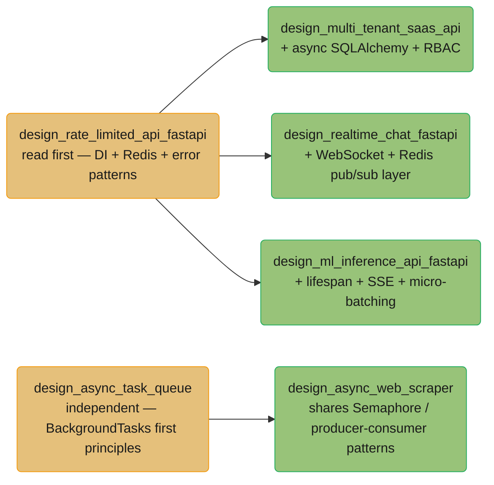

# Python + FastAPI — Case Studies Learning Path

End-to-end system design case studies demonstrating production Python and FastAPI architecture. Each case study follows the 7-section legacy template: Problem Statement, Architecture Overview (ASCII diagram), Key Design Decisions, Implementation (Python code), Python/FastAPI Components Used, Tradeoffs and Alternatives, Interview Discussion Points.

---

## Quick Start

If you only have time for three case studies, read these in order:

1. **[Design a Rate-Limited API with FastAPI](design_rate_limited_api_fastapi.md)** — Foundation case study. Establishes the `Depends`-injected service-layer pattern used by all other FastAPI case studies. Covers Redis Lua atomic check-and-decrement, 429 error handling, and async middleware design.
2. **[Design an Async Task Queue System](design_async_task_queue.md)** — Most commonly asked in distributed systems interviews. Covers ARQ vs Celery decision, idempotency keys, at-least-once semantics, DLQ, and result-backend trade-offs.
3. **[Design an ML Inference API with FastAPI](design_ml_inference_api_fastapi.md)** — Bridges the Python/FastAPI section with the ML and LLM sections. Shows model loading via `lifespan`, micro-batching, and Server-Sent Events streaming. Cross-links `ml/model_serving_and_inference/` and `llm/case_studies/cross_cutting/streaming_at_scale.md`.

---

## Full Learning Path

### Concern 1 — API Design & Rate Limiting

| Case Study | Primary Engineering Concern | What It Teaches |
|------------|----------------------------|----------------|
| [Design a Rate-Limited API](design_rate_limited_api_fastapi.md) | Concurrency control, Redis atomicity | Token-bucket implementation as a `Depends`-injected class; Redis Lua scripts for atomic check-and-decrement (preventing TOCTOU races); 429 response shaping with `Retry-After`; middleware vs dependency injection trade-offs for cross-cutting concerns. |

### Concern 2 — Multi-Tenancy & Authorization

| Case Study | Primary Engineering Concern | What It Teaches |
|------------|----------------------------|----------------|
| [Design a Multi-Tenant SaaS API](design_multi_tenant_saas_api.md) | Tenant isolation, async SQLAlchemy, RBAC | Schema-per-tenant vs row-level-security vs database-per-tenant trade-offs; injecting tenant context through request-scoped `Depends`; JWT RBAC with scope claims; Alembic migrations per tenant; async SQLAlchemy 2.0 session management. |

### Concern 3 — Real-Time & Streaming

| Case Study | Primary Engineering Concern | What It Teaches |
|------------|----------------------------|----------------|
| [Design a Real-Time Chat System](design_realtime_chat_fastapi.md) | WebSockets, pub/sub fan-out, horizontal scaling | WebSocket connection lifecycle in FastAPI; `ConnectionManager` class for registering and broadcasting; Redis pub/sub for multi-pod fan-out (stateless workers); backpressure when a slow consumer falls behind; graceful disconnect and reconnect handling. |
| [Design an ML Inference API](design_ml_inference_api_fastapi.md) | Streaming responses, model serving, caching | `lifespan` context manager for model loading at startup; `StreamingResponse` + SSE for token-by-token streaming; async request coalescing / micro-batching; Redis semantic cache for repeated prompts; async perf profiling. |

### Concern 4 — Async & Background Work

| Case Study | Primary Engineering Concern | What It Teaches |
|------------|----------------------------|----------------|
| [Design an Async Task Queue](design_async_task_queue.md) | Durability, idempotency, retry semantics | ARQ vs Celery vs Dramatiq decision matrix; idempotency key pattern with Redis; at-least-once vs exactly-once semantics; dead-letter queue design; result-backend trade-offs (Redis vs PostgreSQL). |
| [Design an Async Web Scraper](design_async_web_scraper.md) | asyncio concurrency control, rate limiting | `asyncio.Semaphore` for politeness limiting; `aiohttp.ClientSession` connection pooling; producer/consumer with `asyncio.Queue`; crawl budget and robots.txt enforcement; retry with exponential backoff + jitter. |

---

## Dependency Map

**Always read `design_rate_limited_api_fastapi` first.** It establishes the `Depends`-injected service layer pattern that all other FastAPI case studies extend.

---

## Interview Prep Shortcuts

| "Design X" question | Best case study |
|---------------------|----------------|
| Design a rate limiter / API throttler | [design_rate_limited_api_fastapi.md](design_rate_limited_api_fastapi.md) |
| Design a multi-tenant SaaS backend | [design_multi_tenant_saas_api.md](design_multi_tenant_saas_api.md) |
| Design a real-time chat / notification system | [design_realtime_chat_fastapi.md](design_realtime_chat_fastapi.md) |
| Design a job queue / background task system | [design_async_task_queue.md](design_async_task_queue.md) |
| Design a web crawler / async scraper | [design_async_web_scraper.md](design_async_web_scraper.md) |
| Design an ML model serving API | [design_ml_inference_api_fastapi.md](design_ml_inference_api_fastapi.md) |
| How would you build a streaming API? | [design_realtime_chat_fastapi.md](design_realtime_chat_fastapi.md) + [design_ml_inference_api_fastapi.md](design_ml_inference_api_fastapi.md) |
| How would you handle distributed shared state in FastAPI? | [design_rate_limited_api_fastapi.md](design_rate_limited_api_fastapi.md) |
| How would you do zero-downtime deploys? | [design_ml_inference_api_fastapi.md](design_ml_inference_api_fastapi.md) (covers `lifespan` pattern) |
| How would you implement tenant isolation at the DB layer? | [design_multi_tenant_saas_api.md](design_multi_tenant_saas_api.md) |
