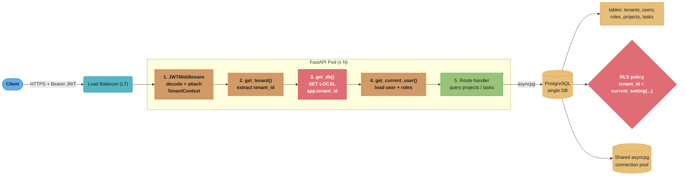
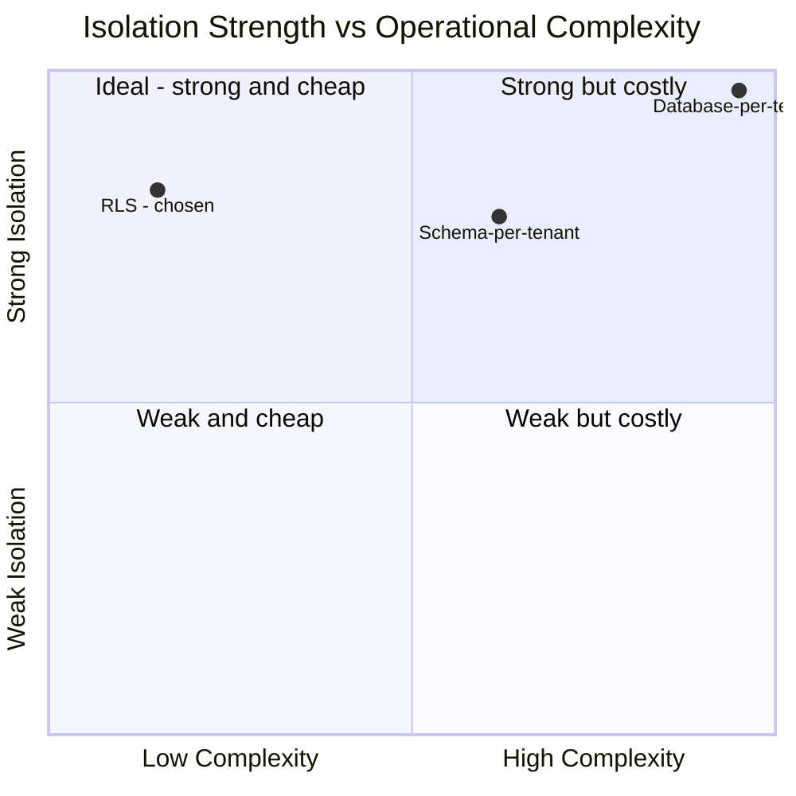
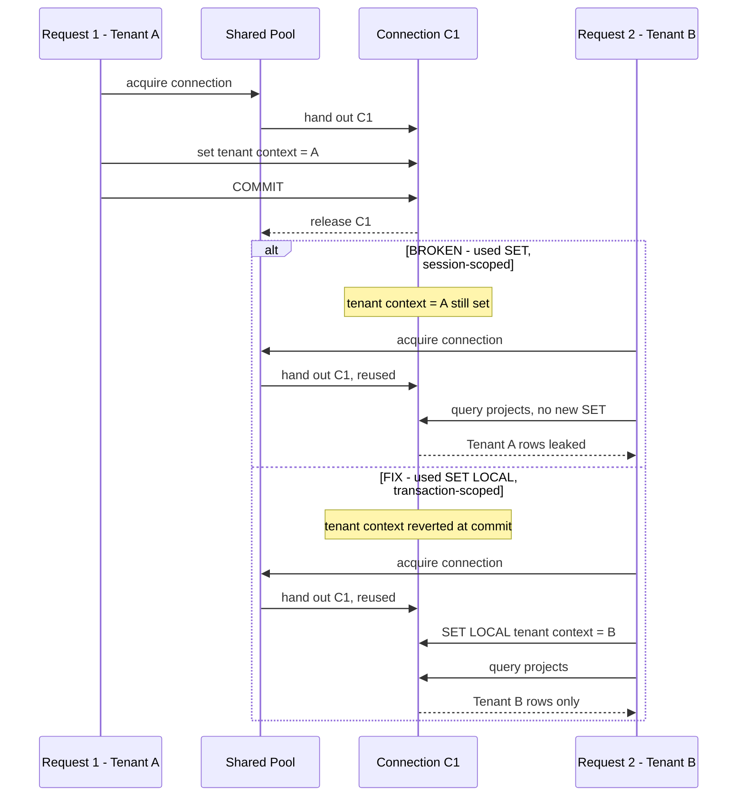

# Design a Multi-Tenant SaaS API with FastAPI

---

## Problem Statement

Design a production-grade multi-tenant SaaS API for a project management tool with the following requirements:

**Functional requirements:**
- 500 tenants (B2B customers), each with their own users, roles, projects, and tasks.
- Users authenticate via JWT; each JWT carries a `tenant_id` claim and a `user_id` claim.
- Users within a tenant have roles: `owner`, `admin`, `member`, `viewer`.
- Tenants must be fully isolated — one tenant must never read or write another tenant's data.
- Support CRUD for projects and tasks, with role-based access control enforced per endpoint.

**Non-functional requirements:**
- 50,000 DAU spread across 500 tenants (~100 active users/tenant on average).
- Peak: 5,000 concurrent requests.
- P99 latency under 120 ms for list endpoints; P99 under 80 ms for read-by-ID.
- One tenant's traffic spike (e.g., a large import job) must not degrade other tenants.
- Single PostgreSQL cluster (multi-schema or RLS); no per-tenant database instances.
- Horizontal scaling: stateless API pods behind a load balancer, shared connection pool.

**Out of scope:**
- Tenant provisioning workflow (signup, billing).
- Cross-tenant admin operations.
- Full-text search (handled by a separate search service).
- Webhooks and async job queues (out of scope for this case study).

---

## Architecture Overview



**Request flow:**
1. Client sends `Authorization: Bearer <JWT>` with every request.
2. `JWTMiddleware` decodes the token, verifies signature, and stores `tenant_id` + `user_id` in `request.state`.
3. `get_db()` opens an `AsyncSession`, then executes `SET LOCAL app.current_tenant_id = '<id>'` so every subsequent query in the transaction is scoped by the RLS policy.
4. `get_current_user()` loads the `User` row and their `Role` for the current tenant.
5. Route handlers query normally; PostgreSQL's RLS policy silently filters all rows to the current tenant.

---

## Key Design Decisions

### 1. Tenant Isolation Strategy: RLS over schema-per-tenant

Three options were considered:

| Strategy | Isolation | Ops Complexity | Pool Sharing | Migration Cost |
|---|---|---|---|---|
| Database-per-tenant | Strongest | Very High (500 DBs) | Impossible | Per-tenant |
| Schema-per-tenant | Strong | High (500 schemas) | Limited | Per-tenant |
| Row-Level Security (RLS) | Strong (DB-enforced) | Low (1 schema) | Full | Single migration |



Plotting the same three strategies on isolation strength vs operational complexity shows RLS alone in the low-complexity, strong-isolation quadrant — schema- and database-per-tenant only buy marginal extra isolation for a much larger jump in ops cost at 500 tenants.

**Decision: RLS with a PostgreSQL session variable.**

PostgreSQL RLS policies run inside the query executor — even a bug in application code cannot bypass them once the session variable is set to a valid tenant. With 500 tenants a schema-per-tenant approach would mean 500 × N tables, making `pg_class` bloat a real operational problem. RLS keeps one schema, one migration path, and allows a fully shared connection pool.

### 2. Tenant Resolution: JWT `tenant_id` claim

Subdomain extraction (`acme.app.io`) requires the reverse proxy to pass the `Host` header and adds failure modes when the API is called directly. JWT claims are present on every request regardless of transport, are verified with the token signature, and cannot be forged by a user with a valid token for a different tenant.

### 3. RBAC: DB-fetched roles via `Depends`

Encoding roles inside the JWT would speed up permission checks but requires token rotation on every role change. For a B2B product where admins frequently adjust member permissions, stale role caches create support incidents. DB-fetched roles via a `Depends` dependency hit an indexed `(tenant_id, user_id)` lookup — typically under 1 ms on a warm connection.

### 4. Connection Pool: Shared `asyncpg` pool with RLS context per transaction

Per-tenant connection pools would require pre-creating 500 min-pools, wasting 500 × `min_size` idle connections. A single shared pool with `SET LOCAL` (transaction-scoped, not session-scoped) guarantees that when a connection is returned to the pool the RLS variable resets automatically at transaction end.

`SET LOCAL` is critical — `SET` (session-scoped) would leak the tenant context to the next request that reuses the connection.

### 5. Alembic Migration: Single migration deploys RLS policies for all tenants

Because all tenant data lives in one schema, a single `alembic upgrade head` applies RLS policies globally. There is no per-tenant migration step.

---

## Implementation

### Database schema and RLS policy setup

```sql
-- migrations/001_create_tables.sql
CREATE TABLE tenants (
    id          UUID PRIMARY KEY DEFAULT gen_random_uuid(),
    name        TEXT NOT NULL,
    created_at  TIMESTAMPTZ DEFAULT now()
);

CREATE TABLE users (
    id          UUID PRIMARY KEY DEFAULT gen_random_uuid(),
    tenant_id   UUID NOT NULL REFERENCES tenants(id),
    email       TEXT NOT NULL,
    hashed_pw   TEXT NOT NULL,
    UNIQUE (tenant_id, email)
);

CREATE TABLE roles (
    id          UUID PRIMARY KEY DEFAULT gen_random_uuid(),
    tenant_id   UUID NOT NULL REFERENCES tenants(id),
    user_id     UUID NOT NULL REFERENCES users(id),
    role        TEXT NOT NULL CHECK (role IN ('owner','admin','member','viewer')),
    UNIQUE (tenant_id, user_id)
);

CREATE TABLE projects (
    id          UUID PRIMARY KEY DEFAULT gen_random_uuid(),
    tenant_id   UUID NOT NULL REFERENCES tenants(id),
    name        TEXT NOT NULL,
    created_by  UUID NOT NULL REFERENCES users(id),
    created_at  TIMESTAMPTZ DEFAULT now()
);

CREATE TABLE tasks (
    id          UUID PRIMARY KEY DEFAULT gen_random_uuid(),
    tenant_id   UUID NOT NULL REFERENCES tenants(id),
    project_id  UUID NOT NULL REFERENCES projects(id),
    title       TEXT NOT NULL,
    assignee_id UUID REFERENCES users(id),
    status      TEXT NOT NULL DEFAULT 'todo'
);

-- Indexes that make the RLS filter cheap
CREATE INDEX ON projects (tenant_id);
CREATE INDEX ON tasks (tenant_id, project_id);

-- Enable RLS
ALTER TABLE projects ENABLE ROW LEVEL SECURITY;
ALTER TABLE tasks    ENABLE ROW LEVEL SECURITY;

-- RLS policies — use current_setting() to read the session variable
CREATE POLICY tenant_isolation_projects ON projects
    USING (tenant_id = current_setting('app.current_tenant_id')::uuid);

CREATE POLICY tenant_isolation_tasks ON tasks
    USING (tenant_id = current_setting('app.current_tenant_id')::uuid);
```

### Application configuration

```python
# app/config.py
from pydantic_settings import BaseSettings


class Settings(BaseSettings):
    database_url: str          # asyncpg DSN
    jwt_secret: str
    jwt_algorithm: str = "HS256"
    jwt_expire_minutes: int = 60
    db_pool_min_size: int = 5
    db_pool_max_size: int = 20

    class Config:
        env_file = ".env"


settings = Settings()
```

### Database engine and session factory

```python
# app/database.py
from sqlalchemy.ext.asyncio import (
    AsyncSession,
    async_sessionmaker,
    create_async_engine,
)
from app.config import settings

engine = create_async_engine(
    settings.database_url,
    pool_size=settings.db_pool_min_size,
    max_overflow=settings.db_pool_max_size - settings.db_pool_min_size,
    echo=False,
)

AsyncSessionLocal = async_sessionmaker(
    bind=engine,
    class_=AsyncSession,
    expire_on_commit=False,
    autoflush=False,
    autocommit=False,
)
```

### SQLAlchemy models

```python
# app/models.py
import uuid
from sqlalchemy import String, ForeignKey, text
from sqlalchemy.dialects.postgresql import UUID
from sqlalchemy.orm import DeclarativeBase, Mapped, mapped_column, relationship


class Base(DeclarativeBase):
    pass


class Tenant(Base):
    __tablename__ = "tenants"
    id: Mapped[uuid.UUID] = mapped_column(UUID(as_uuid=True), primary_key=True, default=uuid.uuid4)
    name: Mapped[str] = mapped_column(String, nullable=False)


class User(Base):
    __tablename__ = "users"
    id: Mapped[uuid.UUID] = mapped_column(UUID(as_uuid=True), primary_key=True, default=uuid.uuid4)
    tenant_id: Mapped[uuid.UUID] = mapped_column(UUID(as_uuid=True), ForeignKey("tenants.id"), nullable=False)
    email: Mapped[str] = mapped_column(String, nullable=False)
    hashed_pw: Mapped[str] = mapped_column(String, nullable=False)


class Role(Base):
    __tablename__ = "roles"
    id: Mapped[uuid.UUID] = mapped_column(UUID(as_uuid=True), primary_key=True, default=uuid.uuid4)
    tenant_id: Mapped[uuid.UUID] = mapped_column(UUID(as_uuid=True), ForeignKey("tenants.id"), nullable=False)
    user_id: Mapped[uuid.UUID] = mapped_column(UUID(as_uuid=True), ForeignKey("users.id"), nullable=False)
    role: Mapped[str] = mapped_column(String, nullable=False)


class Project(Base):
    __tablename__ = "projects"
    id: Mapped[uuid.UUID] = mapped_column(UUID(as_uuid=True), primary_key=True, default=uuid.uuid4)
    tenant_id: Mapped[uuid.UUID] = mapped_column(UUID(as_uuid=True), ForeignKey("tenants.id"), nullable=False)
    name: Mapped[str] = mapped_column(String, nullable=False)
    created_by: Mapped[uuid.UUID] = mapped_column(UUID(as_uuid=True), ForeignKey("users.id"), nullable=False)
    tasks: Mapped[list["Task"]] = relationship("Task", back_populates="project", lazy="select")


class Task(Base):
    __tablename__ = "tasks"
    id: Mapped[uuid.UUID] = mapped_column(UUID(as_uuid=True), primary_key=True, default=uuid.uuid4)
    tenant_id: Mapped[uuid.UUID] = mapped_column(UUID(as_uuid=True), ForeignKey("tenants.id"), nullable=False)
    project_id: Mapped[uuid.UUID] = mapped_column(UUID(as_uuid=True), ForeignKey("projects.id"), nullable=False)
    title: Mapped[str] = mapped_column(String, nullable=False)
    status: Mapped[str] = mapped_column(String, nullable=False, default="todo")
    project: Mapped["Project"] = relationship("Project", back_populates="tasks")
```

### JWT and tenant context

```python
# app/auth.py
import uuid
from datetime import datetime, timedelta, timezone

import jwt
from fastapi import HTTPException, Request, status
from app.config import settings


class TenantContext:
    tenant_id: uuid.UUID
    user_id: uuid.UUID

    def __init__(self, tenant_id: uuid.UUID, user_id: uuid.UUID) -> None:
        self.tenant_id = tenant_id
        self.user_id = user_id


def decode_jwt(token: str) -> TenantContext:
    try:
        payload = jwt.decode(
            token,
            settings.jwt_secret,
            algorithms=[settings.jwt_algorithm],
        )
        return TenantContext(
            tenant_id=uuid.UUID(payload["tenant_id"]),
            user_id=uuid.UUID(payload["sub"]),
        )
    except jwt.ExpiredSignatureError:
        raise HTTPException(status_code=status.HTTP_401_UNAUTHORIZED, detail="Token expired")
    except (jwt.InvalidTokenError, KeyError, ValueError):
        raise HTTPException(status_code=status.HTTP_401_UNAUTHORIZED, detail="Invalid token")


def create_access_token(tenant_id: uuid.UUID, user_id: uuid.UUID) -> str:
    expire = datetime.now(timezone.utc) + timedelta(minutes=settings.jwt_expire_minutes)
    payload = {
        "sub": str(user_id),
        "tenant_id": str(tenant_id),
        "exp": expire,
    }
    return jwt.encode(payload, settings.jwt_secret, algorithm=settings.jwt_algorithm)
```

### BROKEN -> FIX: missing RLS context causes cross-tenant data leak

**BROKEN** — forgetting to set the RLS session variable before querying:

```python
# BROKEN: app/deps_broken.py
from fastapi import Depends, HTTPException, status
from fastapi.security import HTTPAuthorizationCredentials, HTTPBearer
from sqlalchemy import select
from sqlalchemy.ext.asyncio import AsyncSession

from app.auth import decode_jwt, TenantContext
from app.database import AsyncSessionLocal
from app.models import Role, User

bearer = HTTPBearer()


async def get_tenant(
    credentials: HTTPAuthorizationCredentials = Depends(bearer),
) -> TenantContext:
    return decode_jwt(credentials.credentials)


# BROKEN: opens a session but NEVER sets app.current_tenant_id
# PostgreSQL's RLS policy reads current_setting('app.current_tenant_id')
# If the variable is not set, current_setting() raises an error OR
# returns empty string — depending on the missing_ok flag used when
# the policy was created. Either way: either a 500 error on every
# request, or (if missing_ok=true was used) RLS is silently bypassed
# and ALL rows from ALL tenants are returned.
async def get_db_broken():
    async with AsyncSessionLocal() as session:
        yield session  # RLS context never set -- data leak or crash
```

**FIX** — set `app.current_tenant_id` with `SET LOCAL` at transaction start:

```python
# app/deps.py
import uuid
from typing import AsyncGenerator

from fastapi import Depends, HTTPException, status
from fastapi.security import HTTPAuthorizationCredentials, HTTPBearer
from sqlalchemy import select, text
from sqlalchemy.ext.asyncio import AsyncSession

from app.auth import decode_jwt, TenantContext
from app.database import AsyncSessionLocal
from app.models import Role, User

bearer = HTTPBearer()


async def get_tenant(
    credentials: HTTPAuthorizationCredentials = Depends(bearer),
) -> TenantContext:
    return decode_jwt(credentials.credentials)


async def get_db(
    ctx: TenantContext = Depends(get_tenant),
) -> AsyncGenerator[AsyncSession, None]:
    """
    Open a scoped AsyncSession and set the RLS context variable for the
    current tenant using SET LOCAL (transaction-scoped, not session-scoped).

    SET LOCAL resets automatically when the transaction ends, so the
    connection returning to the pool never carries stale tenant context.
    """
    async with AsyncSessionLocal() as session:
        async with session.begin():
            # SET LOCAL is transaction-scoped: automatically cleared on commit/rollback
            await session.execute(
                text("SET LOCAL app.current_tenant_id = :tid"),
                {"tid": str(ctx.tenant_id)},
            )
            yield session
        # Transaction committed; connection returned to pool with clean context


async def get_current_user(
    ctx: TenantContext = Depends(get_tenant),
    db: AsyncSession = Depends(get_db),
) -> tuple[User, str]:
    """Return (User, role_name) for the current request."""
    result = await db.execute(
        select(User).where(
            User.id == ctx.user_id,
            User.tenant_id == ctx.tenant_id,
        )
    )
    user = result.scalar_one_or_none()
    if user is None:
        raise HTTPException(status_code=status.HTTP_401_UNAUTHORIZED, detail="User not found")

    role_result = await db.execute(
        select(Role).where(
            Role.user_id == ctx.user_id,
            Role.tenant_id == ctx.tenant_id,
        )
    )
    role = role_result.scalar_one_or_none()
    if role is None:
        raise HTTPException(status_code=status.HTTP_403_FORBIDDEN, detail="No role assigned")

    return user, role.role


def require_role(*allowed_roles: str):
    """Factory that returns a dependency enforcing a minimum role."""

    async def _check(
        current: tuple[User, str] = Depends(get_current_user),
    ) -> tuple[User, str]:
        _, role = current
        if role not in allowed_roles:
            raise HTTPException(
                status_code=status.HTTP_403_FORBIDDEN,
                detail=f"Requires one of: {allowed_roles}",
            )
        return current

    return _check
```

### Pydantic schemas

```python
# app/schemas.py
import uuid
from pydantic import BaseModel


class ProjectCreate(BaseModel):
    name: str


class ProjectOut(BaseModel):
    id: uuid.UUID
    tenant_id: uuid.UUID
    name: str
    created_by: uuid.UUID

    model_config = {"from_attributes": True}


class TaskCreate(BaseModel):
    title: str
    project_id: uuid.UUID


class TaskOut(BaseModel):
    id: uuid.UUID
    tenant_id: uuid.UUID
    project_id: uuid.UUID
    title: str
    status: str

    model_config = {"from_attributes": True}
```

### Route handlers

```python
# app/routers/projects.py
import uuid
from fastapi import APIRouter, Depends, HTTPException, status
from sqlalchemy import select
from sqlalchemy.ext.asyncio import AsyncSession

from app.deps import get_db, get_current_user, require_role
from app.models import Project, User
from app.schemas import ProjectCreate, ProjectOut

router = APIRouter(prefix="/projects", tags=["projects"])


@router.get("/", response_model=list[ProjectOut])
async def list_projects(
    db: AsyncSession = Depends(get_db),
    current: tuple[User, str] = Depends(get_current_user),
) -> list[ProjectOut]:
    """
    Returns all projects for the current tenant.
    RLS policy on the projects table silently filters to tenant rows only.
    No WHERE tenant_id = ... clause needed in the query itself.
    """
    result = await db.execute(select(Project))
    return [ProjectOut.model_validate(p) for p in result.scalars().all()]


@router.post("/", response_model=ProjectOut, status_code=status.HTTP_201_CREATED)
async def create_project(
    body: ProjectCreate,
    db: AsyncSession = Depends(get_db),
    current: tuple[User, str] = Depends(require_role("owner", "admin", "member")),
) -> ProjectOut:
    user, _ = current
    project = Project(
        tenant_id=user.tenant_id,
        name=body.name,
        created_by=user.id,
    )
    db.add(project)
    await db.flush()
    await db.refresh(project)
    return ProjectOut.model_validate(project)


@router.delete("/{project_id}", status_code=status.HTTP_204_NO_CONTENT)
async def delete_project(
    project_id: uuid.UUID,
    db: AsyncSession = Depends(get_db),
    current: tuple[User, str] = Depends(require_role("owner", "admin")),
) -> None:
    result = await db.execute(
        select(Project).where(Project.id == project_id)
    )
    project = result.scalar_one_or_none()
    if project is None:
        # Could be a different tenant's project — surface as 404, not 403,
        # to avoid leaking the existence of cross-tenant resources.
        raise HTTPException(status_code=status.HTTP_404_NOT_FOUND, detail="Project not found")
    await db.delete(project)
```

### Application factory

```python
# app/main.py
from contextlib import asynccontextmanager
from typing import AsyncGenerator

from fastapi import FastAPI

from app.database import engine
from app.models import Base
from app.routers import projects


@asynccontextmanager
async def lifespan(app: FastAPI) -> AsyncGenerator[None, None]:
    async with engine.begin() as conn:
        await conn.run_sync(Base.metadata.create_all)
    yield
    await engine.dispose()


def create_app() -> FastAPI:
    app = FastAPI(title="Multi-Tenant SaaS API", lifespan=lifespan)
    app.include_router(projects.router)
    return app


app = create_app()
```

---

## Python/FastAPI Components Used

| Component | Role in This Design |
|---|---|
| `HTTPBearer` dependency | Extracts the `Authorization: Bearer` token from every request without custom middleware. |
| `Depends()` chaining | `get_db` depends on `get_tenant`; `get_current_user` depends on both. FastAPI resolves the dependency graph once per request and caches results within the request. |
| `AsyncSession` + `session.begin()` | `async with session.begin()` opens an explicit transaction; `SET LOCAL` inside this block is automatically rolled back if the handler raises an exception, preventing a half-committed RLS context. |
| `text()` from SQLAlchemy | Used to execute raw `SET LOCAL` SQL that has no ORM abstraction. The `text()` construct allows bound parameters (`:tid`) avoiding SQL injection. |
| RLS policies in PostgreSQL | Enforced inside the query executor — immune to application-layer bugs. A miscoded query that omits a `WHERE tenant_id = ...` clause is still safe. |
| `require_role()` factory | Returns a parameterized `Depends` — a clean pattern for expressing endpoint-level RBAC without repeating permission checks in every handler. |
| `model_config = {"from_attributes": True}` | Pydantic v2 setting that allows `model_validate(orm_object)` to work with SQLAlchemy model instances. |
| `lifespan` context manager | Replaces deprecated `on_event("startup")`. Ensures the connection pool is disposed cleanly on shutdown, preventing connection leaks in Kubernetes pod restarts. |
| `mapped_column` + `Mapped[]` | SQLAlchemy 2.0 style — fully typed ORM columns with Python type inference, compatible with mypy. |

---

## Tradeoffs and Alternatives

### RLS vs schema-per-tenant vs database-per-tenant

| Dimension | RLS (chosen) | Schema-per-tenant | Database-per-tenant |
|---|---|---|---|
| Data isolation | DB-enforced, strong | DDL-enforced, strong | Strongest |
| Connection pooling | Full shared pool | Limited (schema switching overhead) | Impossible to share |
| Migration complexity | Single migration | N migrations or dynamic SQL | N migrations + N connections |
| `pg_class` bloat at 500 tenants | None (1 schema) | High (500 × table count) | N/A |
| Noisy neighbour risk | Mitigated by RLS; query planner sees full table | Same | None |
| Tenant onboarding speed | Instant (new row in tenants) | Schema creation required | Database creation required |
| Regulatory isolation (GDPR delete) | `DELETE WHERE tenant_id = ?` | `DROP SCHEMA` | `DROP DATABASE` |
| Cost | Low | Medium | High ($$ per DB instance) |

**Why not database-per-tenant:** At 500 tenants each requiring a minimum 2-CPU / 4 GB PostgreSQL instance, the infrastructure cost is 1000 CPU cores and 2 TB RAM at idle. Connection pooling across 500 databases from a shared PgBouncer tier is operationally complex and adds latency. Chosen only when regulatory requirements mandate full data residency separation.

**Why not schema-per-tenant:** Schema creation on tenant signup adds latency to onboarding. With 500 schemas and 8 tables each, `pg_class` holds 4,000+ rows, degrading planner performance on DDL operations. Alembic does not natively support per-schema migrations without custom scripting.

### `SET LOCAL` vs `SET` (session-scoped)

`SET` persists for the lifetime of the database session (connection). In a connection pool, a connection is reused across many requests. Using `SET` would mean tenant A's context bleeds into tenant B's request on the same connection. `SET LOCAL` is automatically reverted when the transaction ends, making it safe to share connections.



The same pooled connection `C1` is handed to a second, different tenant's request — `SET` leaves tenant A's context on the connection so tenant B's query is silently scoped to the wrong tenant, while `SET LOCAL` reverts at commit so tenant B starts clean.

### JWT claims vs subdomain resolution

Subdomain resolution requires the API gateway to parse the `Host` header and inject a custom `X-Tenant-ID` header, which is an additional hop and trust boundary. JWT claims are self-contained and verified by the token signature — no additional infrastructure required.

---

## Interview Discussion Points

**Q: Why use `SET LOCAL` instead of `SET` for the RLS context variable?**
`SET LOCAL` is transaction-scoped and reverts automatically at transaction end. `SET` is session-scoped and persists on the connection even after it returns to the pool, which would cause the next request reusing that connection to execute under the previous tenant's RLS context — a critical data leak. `SET LOCAL` is the only safe choice in a pooled async environment.

**Q: What happens if a request handler raises an exception before `SET LOCAL` commits?**
The `async with session.begin()` block rolls back the transaction on any unhandled exception, which also reverts `SET LOCAL`. The connection is returned to the pool in a clean state. Even partial writes are rolled back, ensuring atomicity.

**Q: How do you prevent a tenant from enumerating another tenant's resource IDs?**
The 404 response for `DELETE /projects/{id}` is intentional. Returning 403 (Forbidden) would confirm that the resource exists but belongs to another tenant — leaking information. Returning 404 normalizes the response regardless of whether the ID belongs to a different tenant or simply does not exist. This is called "resource existence hiding."

**Q: How does this design scale when a single tenant generates 80% of the traffic?**
RLS filtering happens at the query level; a noisy tenant increases PostgreSQL CPU and I/O but does not affect other tenants' connection availability because the pool is shared. To enforce true per-tenant QoS, add a token-bucket rate limiter at the API gateway keyed on `tenant_id` (extracted from the JWT). This limits burst throughput per tenant before the request reaches the database.

**Q: What is the risk of storing `tenant_id` only in the JWT and not re-validating it in every query?**
The risk is mitigated by RLS. The database enforces `tenant_id` isolation independently of application logic. However, the application still validates that the `user_id` in the JWT belongs to the claimed `tenant_id` (the `User` lookup in `get_current_user` includes `User.tenant_id == ctx.tenant_id`) — preventing a token-swap attack where a valid user forges a `tenant_id` claim.

**Q: How would you implement tenant-scoped rate limiting?**
Use Redis with a sliding window counter keyed on `f"ratelimit:{tenant_id}:{window}"`. Inject it as a FastAPI dependency that runs after `get_tenant()`. Limits can be per-plan (e.g., free tier: 1,000 req/min, pro: 10,000 req/min) stored in a `tenant_config` table and cached in Redis with a short TTL.

**Q: How do you run Alembic migrations without taking downtime?**
RLS policies are `CREATE POLICY` DDL, which in PostgreSQL acquires an `ACCESS SHARE` lock (not a full table lock) on the target table. New columns should use `ADD COLUMN ... DEFAULT NULL` (non-locking in PostgreSQL 11+). The migration runs against the single schema, applies to all tenants simultaneously, and does not require per-tenant steps.

**Q: How would you add a new tenant at runtime?**
Insert a row into `tenants`, create the first user row, assign the `owner` role, and issue a JWT. No schema or database creation is required. The RLS policy already covers the new `tenant_id` because it uses a runtime `current_setting()` check rather than a static list.

**Q: How would you implement tenant-level audit logging?**
Add a PostgreSQL trigger on `projects` and `tasks` that inserts into an `audit_log` table with `(tenant_id, user_id, action, table_name, row_id, changed_at)`. The trigger fires inside the same transaction as the DML, so the audit record is atomically consistent with the data change. For high-volume tenants, partition the `audit_log` table by `tenant_id` hash.

**Q: How do you handle GDPR right-to-erasure for a tenant?**
Issue a `DELETE FROM users WHERE tenant_id = :tid` cascade (foreign key `ON DELETE CASCADE` on all tenant-owned tables), then delete the `tenants` row. Because all data is in a single schema, a single transaction covers the full deletion. Schema-per-tenant would require `DROP SCHEMA` which is irreversible without a backup; database-per-tenant requires decommissioning an entire instance. RLS + single schema makes GDPR erasure a standard parameterized `DELETE`.
