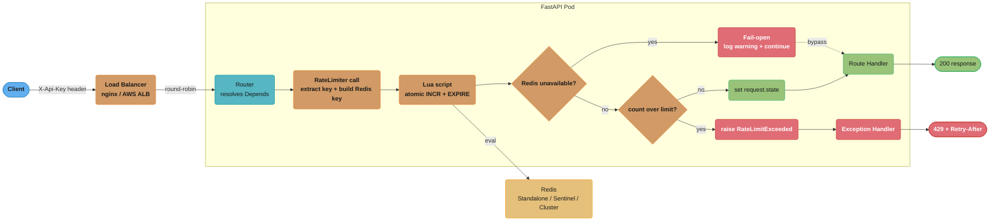
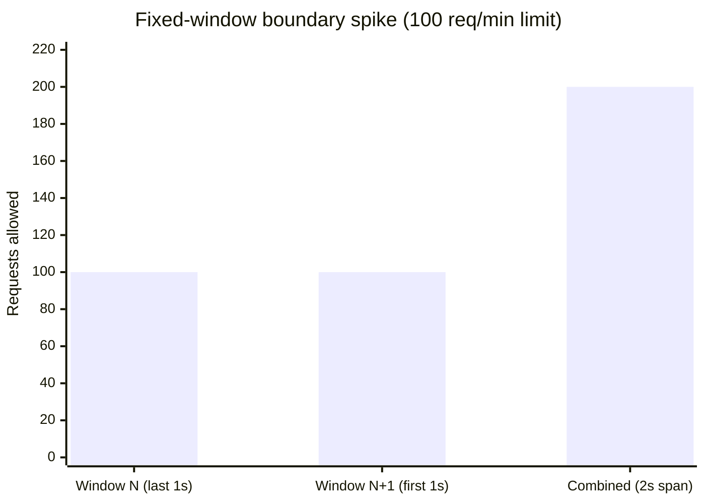
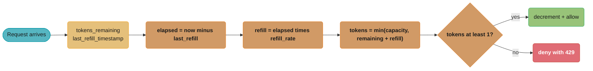

# Design a Rate-Limited API with FastAPI

---

## Problem Statement

Design a production-grade rate limiter for a public API with the following requirements:

**Functional requirements:**
- Limit each API key to 100 requests per minute (sliding window) and 1000 requests per day.
- Enforce limits across all pods in a horizontally scaled deployment — no in-process state.
- Return HTTP 429 with a `Retry-After` header and an RFC 7807 Problem Details error body on limit breach.
- Fail open: if Redis is unavailable, allow traffic rather than blocking the entire API.
- Expose the limiter as a `Depends()`-injected service so individual routes can override their own limits.

**Non-functional requirements:**
- P99 overhead added by the rate-limiter check: under 2 ms at 5000 req/s.
- No single point of failure — Redis Sentinel or Cluster is acceptable; the app must not crash if Redis goes down.
- Limits must be accurate to within ±1 request at bucket boundaries (sliding window, not fixed window).

**Out of scope:**
- IP-based limiting (shown as extension in Interview Discussion Points).
- Rate-limit bypass for internal services (handled at the API gateway layer).
- Persistent audit log of limit breaches.

---

## Architecture Overview

The `RateLimiter` dependency sits between the router and the route handler on every request; the two decision diamonds are what make it a rate limiter — a Redis outage takes the dotted fail-open bypass instead of blocking the 100 req/min and 1000 req/day checks that protect the API.



Each of the two windows gets its own Redis key so the minute and day counters expire independently; every TTL is set to twice the window length so a key can never vanish while it is still the authoritative counter.

```
Redis key layout
-----------------
  rate::{api_key}::minute::{window_start_unix_second}
    - type: string (integer counter)
    - TTL:  120 s  (2x window, allows one full window overlap)

  rate::{api_key}::day::{utc_date_string}
    - type: string (integer counter)
    - TTL:  172800 s (48 h, same 2x-window safety margin)

Example keys
  rate::sk-abc123::minute::1717516260
  rate::sk-abc123::day::2024-06-04
```

---

## Key Design Decisions

**1. Sliding window counter vs token bucket vs fixed window**

A fixed window counter has a well-known boundary spike: a client can fire 100 requests in the last second of minute N and 100 more in the first second of minute N+1 — 200 requests in 2 seconds while staying within both windows. The token bucket eliminates spikes entirely but requires storing per-key float state (last-fill timestamp, token count) and is harder to inspect in Redis. The sliding window counter used here approximates a true sliding window: the key is bucketed to the start of the current 60-second window, and all requests within that window share one counter. This eliminates the boundary spike at the cost of resetting the counter at each exact window boundary (not a continuous roll). For interview purposes, explain this trade-off and note that a sliding window *log* (storing timestamps of every request) gives perfect accuracy but requires O(request-count) Redis memory per key.

Both windows are individually compliant with the 100 req/min rule, yet the client still bursts 200 requests into a 2-second span at the seam between them:



**2. `Depends()` injection vs middleware**

Middleware runs for every request unconditionally. It cannot inspect the resolved route or its declared limits without duplicating the routing logic. `Depends()` injection lets each route specify its own `RateLimiter(limit=10, window=60)` instance; the FastAPI dependency system handles instantiation and caching. The trade-off is that a route that forgets to declare the dependency is unprotected. The recommended pattern is to set the default limiter as a global dependency on the `APIRouter` and allow per-route overrides.

**3. Lua script for atomicity**

The naive implementation does:
```
count = await redis.get(key)
if count >= limit:
    raise 429
await redis.incr(key)
await redis.expire(key, ttl)
```
This is a classic TOCTOU race: two concurrent requests both read `count = 99`, both pass the limit check, and both increment to 100 and 101. The fix is to run GET + INCR + EXPIRE as a single atomic Lua script. Redis is single-threaded in its command execution; a Lua script is a transaction — no other command can interleave.

**4. Fail-open on Redis unavailability**

If Redis is down, the alternative is to fail-closed (return 503 to all traffic). For most public APIs, blocking all traffic because the rate limiter is unavailable is worse than temporarily allowing excess traffic. The implementation catches `redis.exceptions.RedisError` and logs a `WARNING` metric (so an alert fires), then continues to the route handler. Operators can decide to fail-closed by re-raising the exception.

**5. Two independent time windows**

The minute window (100 req/min) prevents burst abuse. The day window (1000 req/day) caps sustained usage. Each is a separate Redis key with its own TTL. Both checks run inside the same `__call__` coroutine. If either limit is exceeded, the 429 response body identifies which window was hit.

---

## Implementation

### Dependencies and models

```python
# requirements: fastapi>=0.111, redis[asyncio]>=5.0, pydantic>=2.0, uvicorn>=0.29

from __future__ import annotations

import time
import logging
from contextlib import asynccontextmanager
from typing import Annotated, AsyncGenerator

import redis.asyncio as aioredis
from fastapi import Depends, FastAPI, HTTPException, Request, Response, status
from fastapi.responses import JSONResponse
from pydantic import BaseModel

logger = logging.getLogger(__name__)
```

### Redis connection pool via `lifespan`

```python
class AppState:
    redis: aioredis.Redis


app_state = AppState()


@asynccontextmanager
async def lifespan(app: FastAPI) -> AsyncGenerator[None, None]:
    """Create the Redis connection pool once at startup; close it on shutdown."""
    pool = aioredis.ConnectionPool.from_url(
        "redis://localhost:6379",
        max_connections=50,
        decode_responses=True,
        socket_connect_timeout=1.0,
        socket_timeout=0.5,
    )
    app_state.redis = aioredis.Redis(connection_pool=pool)
    logger.info("Redis connection pool created (max_connections=50)")
    yield
    await app_state.redis.aclose()
    logger.info("Redis connection pool closed")


app = FastAPI(lifespan=lifespan)
```

### RFC 7807 Problem Details error model and custom exception

```python
class ProblemDetail(BaseModel):
    type: str = "https://example.com/errors/rate-limit-exceeded"
    title: str = "Too Many Requests"
    status: int = 429
    detail: str
    instance: str
    retry_after: int


class RateLimitExceeded(Exception):
    def __init__(self, retry_after: int, detail: str, path: str) -> None:
        self.retry_after = retry_after
        self.detail = detail
        self.path = path


@app.exception_handler(RateLimitExceeded)
async def rate_limit_handler(request: Request, exc: RateLimitExceeded) -> JSONResponse:
    body = ProblemDetail(
        detail=exc.detail,
        instance=exc.path,
        retry_after=exc.retry_after,
    )
    return JSONResponse(
        status_code=status.HTTP_429_TOO_MANY_REQUESTS,
        content=body.model_dump(),
        headers={"Retry-After": str(exc.retry_after)},
    )
```

### Lua script for atomic sliding-window check-and-increment

```python
# Single Lua script executes atomically on the Redis server.
# KEYS[1] = the rate-limit key
# ARGV[1] = the TTL in seconds
# ARGV[2] = the per-window request limit
# Returns: [current_count, limit_exceeded_flag]
#   limit_exceeded_flag = 1 if the NEW count exceeds the limit, 0 otherwise.

RATE_LIMIT_LUA = """
local current = redis.call('INCR', KEYS[1])
if current == 1 then
    redis.call('EXPIRE', KEYS[1], ARGV[1])
end
if current > tonumber(ARGV[2]) then
    return {current, 1}
end
return {current, 0}
"""
```

### BROKEN vs FIX: why two separate Redis calls are not safe

```python
# BROKEN: TOCTOU race between GET and INCR.
# Two requests arriving simultaneously both read count=99, both pass the check,
# both write count=100 and count=101 — one over the limit silently slips through.

async def _check_limit_broken(redis_client: aioredis.Redis, key: str, limit: int, ttl: int) -> bool:
    count_raw = await redis_client.get(key)               # read
    count = int(count_raw) if count_raw else 0
    if count >= limit:
        return True                                        # over limit
    await redis_client.incr(key)                          # write — NOT atomic with the read above
    await redis_client.expire(key, ttl)                   # separate round-trip for TTL
    return False

# FIX: single Lua script — Redis executes it as one atomic operation.
# INCR, conditional EXPIRE, and limit check happen in one server-side transaction.

async def _check_limit_lua(
    redis_client: aioredis.Redis,
    key: str,
    limit: int,
    ttl: int,
) -> tuple[int, bool]:
    """Returns (current_count, is_exceeded)."""
    result: list[int] = await redis_client.eval(  # type: ignore[assignment]
        RATE_LIMIT_LUA,
        1,         # number of KEYS
        key,       # KEYS[1]
        ttl,       # ARGV[1]
        limit,     # ARGV[2]
    )
    current, exceeded = int(result[0]), bool(result[1])
    return current, exceeded
```

### `RateLimiter` dependency class

```python
def _minute_key(api_key: str) -> str:
    window_start = int(time.time()) // 60 * 60   # floor to 60-second boundary
    return f"rate::{api_key}::minute::{window_start}"


def _day_key(api_key: str) -> str:
    from datetime import date
    return f"rate::{api_key}::day::{date.today().isoformat()}"


class RateLimiter:
    """
    FastAPI dependency that enforces per-minute and per-day request limits.

    Usage:
        @router.get("/items", dependencies=[Depends(RateLimiter())])

    Per-route override:
        strict_limiter = RateLimiter(minute_limit=10, day_limit=100)

        @router.get("/sensitive", dependencies=[Depends(strict_limiter)])
    """

    def __init__(
        self,
        minute_limit: int = 100,
        day_limit: int = 1000,
    ) -> None:
        self.minute_limit = minute_limit
        self.day_limit = day_limit

    async def __call__(self, request: Request) -> None:
        api_key: str | None = request.headers.get("X-Api-Key")
        if not api_key:
            raise HTTPException(
                status_code=status.HTTP_401_UNAUTHORIZED,
                detail="X-Api-Key header is required.",
            )

        redis_client: aioredis.Redis = app_state.redis

        try:
            # Check minute window
            m_key = _minute_key(api_key)
            m_count, m_exceeded = await _check_limit_lua(
                redis_client, m_key, self.minute_limit, ttl=120
            )
            if m_exceeded:
                retry_after = 60 - (int(time.time()) % 60)
                # Persist counts in request.state for downstream middleware/logging
                request.state.rate_limit_minute = m_count
                raise RateLimitExceeded(
                    retry_after=retry_after,
                    detail=f"Minute limit of {self.minute_limit} requests exceeded. "
                           f"Retry in {retry_after} seconds.",
                    path=request.url.path,
                )

            # Check day window
            d_key = _day_key(api_key)
            d_count, d_exceeded = await _check_limit_lua(
                redis_client, d_key, self.day_limit, ttl=172800
            )
            if d_exceeded:
                from datetime import datetime, timezone, timedelta
                tomorrow_midnight = (
                    datetime.now(tz=timezone.utc).replace(
                        hour=0, minute=0, second=0, microsecond=0
                    ) + timedelta(days=1)
                )
                retry_after = int(
                    (tomorrow_midnight - datetime.now(tz=timezone.utc)).total_seconds()
                )
                request.state.rate_limit_day = d_count
                raise RateLimitExceeded(
                    retry_after=retry_after,
                    detail=f"Daily limit of {self.day_limit} requests exceeded. "
                           f"Retry in {retry_after} seconds.",
                    path=request.url.path,
                )

            # Attach counts to request.state for optional X-RateLimit-* response headers
            request.state.rate_limit_minute = m_count
            request.state.rate_limit_minute_limit = self.minute_limit
            request.state.rate_limit_day = d_count
            request.state.rate_limit_day_limit = self.day_limit

        except RateLimitExceeded:
            raise  # propagate to the registered exception handler
        except aioredis.RedisError as exc:
            # Fail-open: log and continue; do not block the request
            logger.warning(
                "Redis unavailable for rate limiting — failing open. error=%s", exc
            )
```

### Routes — default limit and per-route override

```python
# Reusable type alias for the injected dependency
RateLimitDep = Annotated[None, Depends(RateLimiter())]

# Stricter limiter for a sensitive endpoint
strict_limiter = RateLimiter(minute_limit=10, day_limit=100)
StrictRateLimitDep = Annotated[None, Depends(strict_limiter)]


@app.get("/api/v1/items", dependencies=[Depends(RateLimiter())])
async def list_items(request: Request) -> dict[str, object]:
    return {
        "items": ["a", "b", "c"],
        "rate_limit": {
            "minute_used": request.state.rate_limit_minute,
            "minute_limit": request.state.rate_limit_minute_limit,
        },
    }


@app.post("/api/v1/admin/reset", dependencies=[Depends(strict_limiter)])
async def admin_reset(request: Request) -> dict[str, str]:
    # 10 req/min, 100 req/day limit applied here
    return {"status": "reset complete"}
```

### pytest: testing with dependency override

```python
# tests/test_rate_limiter.py
from unittest.mock import AsyncMock, MagicMock, patch

import pytest
from httpx import AsyncClient, ASGITransport

from main import app, RateLimiter, app_state


@pytest.fixture
def mock_redis_under_limit() -> AsyncMock:
    """Simulate Redis returning count=1 (under any reasonable limit)."""
    redis_mock = AsyncMock()
    redis_mock.eval = AsyncMock(return_value=[1, 0])   # count=1, exceeded=False
    return redis_mock


@pytest.fixture
def mock_redis_over_limit() -> AsyncMock:
    """Simulate Redis returning count=101 (over the 100 req/min limit)."""
    redis_mock = AsyncMock()
    redis_mock.eval = AsyncMock(return_value=[101, 1])  # count=101, exceeded=True
    return redis_mock


@pytest.mark.asyncio
async def test_request_allowed_under_limit(mock_redis_under_limit: AsyncMock) -> None:
    app_state.redis = mock_redis_under_limit
    async with AsyncClient(
        transport=ASGITransport(app=app), base_url="http://test"
    ) as client:
        response = await client.get(
            "/api/v1/items", headers={"X-Api-Key": "test-key-123"}
        )
    assert response.status_code == 200
    assert response.json()["rate_limit"]["minute_used"] == 1


@pytest.mark.asyncio
async def test_rate_limit_exceeded_returns_429(mock_redis_over_limit: AsyncMock) -> None:
    app_state.redis = mock_redis_over_limit
    async with AsyncClient(
        transport=ASGITransport(app=app), base_url="http://test"
    ) as client:
        response = await client.get(
            "/api/v1/items", headers={"X-Api-Key": "test-key-123"}
        )
    assert response.status_code == 429
    body = response.json()
    assert body["title"] == "Too Many Requests"
    assert "Retry-After" in response.headers
    assert int(response.headers["Retry-After"]) > 0


@pytest.mark.asyncio
async def test_missing_api_key_returns_401() -> None:
    async with AsyncClient(
        transport=ASGITransport(app=app), base_url="http://test"
    ) as client:
        response = await client.get("/api/v1/items")  # no X-Api-Key
    assert response.status_code == 401


@pytest.mark.asyncio
async def test_fail_open_on_redis_error() -> None:
    """If Redis raises, the request must still succeed (fail-open)."""
    import redis.asyncio as aioredis
    broken_redis = AsyncMock()
    broken_redis.eval = AsyncMock(side_effect=aioredis.RedisError("timeout"))
    app_state.redis = broken_redis
    async with AsyncClient(
        transport=ASGITransport(app=app), base_url="http://test"
    ) as client:
        response = await client.get(
            "/api/v1/items", headers={"X-Api-Key": "test-key-123"}
        )
    assert response.status_code == 200
```

---

## Python/FastAPI Components Used

| Component | Role in this design |
|-----------|---------------------|
| `Depends()` | Injects `RateLimiter.__call__` into the route handler; supports per-route limit customization by constructing different `RateLimiter(...)` instances |
| `lifespan` context manager | Creates the `redis.asyncio.ConnectionPool` once at startup and closes it cleanly at shutdown; avoids per-request connection overhead |
| Custom exception handler (`@app.exception_handler`) | Converts `RateLimitExceeded` into a structured 429 JSON response with `Retry-After` header; decouples error shaping from business logic |
| `HTTPException` | Used for the 401 missing-API-key case; FastAPI converts it to a JSON error automatically |
| `Request.state` | Carries per-request metadata (current counts, limits) from the `RateLimiter` to the route handler and to any downstream middleware that wants to add `X-RateLimit-*` response headers |
| `redis.asyncio.Redis` | Non-blocking async Redis client; `eval()` executes the Lua script; `ConnectionPool` is shared across all concurrent requests |
| `BaseModel` (Pydantic v2) | Defines the `ProblemDetail` response schema; `model_dump()` serializes it to a dict for `JSONResponse` |
| `Annotated` type alias | `RateLimitDep = Annotated[None, Depends(RateLimiter())]` — clean, reusable dependency declaration that avoids repeating `Depends(RateLimiter())` on every route |

---

## Tradeoffs and Alternatives

| Dimension | This design | Alternative | When to switch |
|-----------|-------------|-------------|----------------|
| Enforcement point | `Depends()` per route | ASGI middleware | When all routes share identical limits and you want zero risk of a route forgetting to declare the dependency |
| Atomicity | Lua script (`EVAL`) | Redis pipeline with `MULTI`/`EXEC` | Never — `MULTI`/`EXEC` in a pipeline is optimistic, not atomic; Lua is strictly safer |
| State store | Redis (distributed) | In-process `dict` + `asyncio.Lock` | Single-pod deployments only; breaks immediately with a second pod |
| Algorithm | Sliding window counter (fixed boundary) | Sliding window log (true sliding) | When ±1 request accuracy at window boundaries is a hard requirement; log uses O(N) memory per key where N = requests per window |
| Algorithm | Sliding window counter | Token bucket | When burst capacity is a feature, not a bug (e.g., allow 20-request bursts then refill at 1.67 req/s) |
| Fail behavior | Fail-open (allow on Redis error) | Fail-closed (503 on Redis error) | High-security APIs (financial, auth) where an uncontrolled burst is worse than temporary unavailability |

---

## Interview Discussion Points

**Q: Why use a Lua script instead of separate GET + INCR commands?**
The separate approach has a TOCTOU race: two concurrent requests can both read `count = N`, both pass the `N < limit` check, and both increment — writing `N+1` and `N+2` while one of them should have been rejected. The Lua script runs as a single atomic operation on the Redis server (which is single-threaded for command execution), so no other command can interleave. It also saves one network round-trip compared to a GET + INCR + EXPIRE sequence.

**Q: What is the sliding window counter algorithm and how does it differ from a true sliding window log?**
The sliding window counter buckets time into discrete windows (e.g., each 60-second interval). All requests in the same window share one counter. At the exact second a new window starts, the counter resets. A true sliding window log stores the timestamp of every request in a sorted set; to check the limit you count entries from `now - 60s` to `now` and evict the rest. The log gives perfect accuracy but uses O(requests) memory per key and requires two Redis commands (`ZREMRANGEBYSCORE` + `ZCARD`). The counter approximation uses O(1) memory but can allow a small overcount if requests cluster near a window boundary.

**Q: How would you add per-IP limits alongside per-API-key limits?**
Add a second `RateLimiter` variant that keys on `request.client.host` instead of the `X-Api-Key` header. Apply it as an additional dependency or stack both: `dependencies=[Depends(ip_limiter), Depends(key_limiter)]`. The two limiters are independent; either one can trigger a 429. Use separate key namespaces — `rate::ip::{ip}::minute::...` — to avoid collisions.

**Q: What happens if Redis goes down mid-deployment?**
The `except aioredis.RedisError` block in `__call__` catches all connection errors, timeouts, and cluster failures. It logs a warning (which should trigger a PagerDuty alert via your log aggregator) and returns without raising, allowing the request to proceed to the route handler. This means the API stays up but rate limiting is suspended. If you prefer fail-closed, replace the `logger.warning` with `raise HTTPException(status_code=503)`.

**Q: How would you implement burst capacity (token bucket) on top of this?**
Store two values per key: `tokens_remaining` and `last_refill_timestamp`. In the Lua script: compute `elapsed = now - last_refill`; compute `refill = elapsed * refill_rate`; set `tokens = min(bucket_capacity, tokens_remaining + refill)`; if `tokens >= 1`, decrement and allow; otherwise deny. The Lua script must be updated to accept `bucket_capacity` and `refill_rate` as arguments. Token bucket allows short bursts up to `bucket_capacity` while still enforcing a long-run average rate.

The refill arithmetic is three sequential computations feeding one threshold check — easy to skim past in prose, so laid out as steps:



**Q: How do you test a rate limiter reliably in pytest?**
Inject a mock Redis into `app_state.redis` before each test. Use `AsyncMock` with `eval` returning a controlled `[count, exceeded]` tuple. This avoids spinning up a real Redis in CI. For integration tests, use `fakeredis` (an in-process Redis emulator with Lua support) or Testcontainers with a real Redis image. Never rely on `time.sleep` loops in tests — they are flaky; instead mock `time.time` or use `freezegun`.

**Q: How would you add `X-RateLimit-Remaining` and `X-RateLimit-Reset` headers to every successful response?**
Add an ASGI middleware that runs after the `RateLimiter` dependency has populated `request.state`. The middleware calls `await call_next(request)` and then inspects `request.state.rate_limit_minute` and `request.state.rate_limit_minute_limit` to compute `remaining = limit - used`. Set the headers on the `Response` object before returning. The middleware runs globally so all routes get the headers without per-route wiring.

**Q: What is the difference between HTTP 429 and HTTP 503?**
429 (Too Many Requests) means the client has exceeded the rate limit defined by the server's policy — the server is healthy, but this specific client is making requests too frequently. The `Retry-After` header tells the client exactly when it may retry. 503 (Service Unavailable) means the server itself is overloaded or temporarily down — it communicates nothing about the client's behavior. Returning 503 from a rate limiter is technically incorrect; 429 is the proper status code (RFC 6585).

**Q: Why use `RateLimiter` as a class with `__call__` rather than a plain async function?**
A class instance can hold configuration (`minute_limit`, `day_limit`) set at construction time. A plain function has a fixed signature; to parameterize it you need `functools.partial` or a closure factory, both of which are harder to read and introspect. `Depends(RateLimiter(minute_limit=10))` reads as a self-documenting declaration. FastAPI resolves callable instances exactly like coroutine functions.

**Q: If you need rate limiting at 50,000 req/s across 20 pods, does a single Redis instance hold up?**
A single Redis node handles roughly 100,000 simple SET/GET operations per second on commodity hardware. A Lua script is slightly heavier — benchmark at ~60,000–80,000 eval/s. At 50,000 req/s across 20 pods each doing one `eval` call per request, that is 50,000 Redis operations/s — within single-node headroom. For headroom beyond that, shard by API key prefix across a Redis Cluster (use consistent hashing so the same key always lands on the same shard). Avoid cross-slot Lua scripts; ensure each key touches exactly one hash slot.

**Q: How would you handle a Redis Cluster where Lua scripts cannot span multiple keys?**
Each rate-limit key (`rate::{api_key}::minute::...`) is a single key, not a multi-key operation, so there is no cross-slot problem. If you needed to atomically update two keys (e.g., minute key and day key in one script), you would have to use Redis hash tags — `{api_key}` — to force both keys onto the same slot. The current design runs two independent Lua scripts (one per window) and accepts that they are not atomically linked; the practical risk (one window passes, the other fails, leaving a partial increment) is acceptable because each window's counter is independently consistent.
