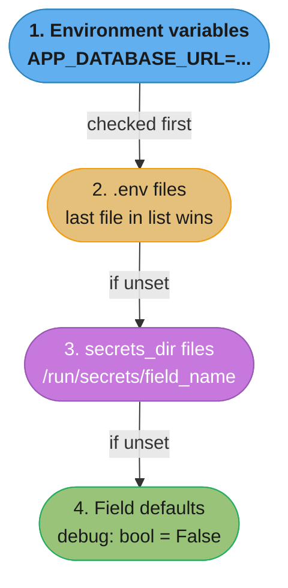
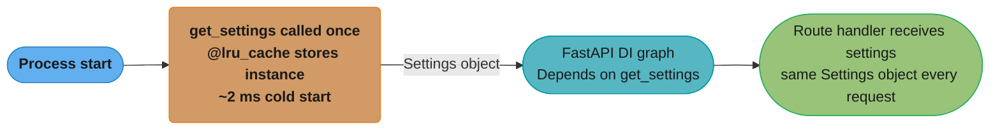
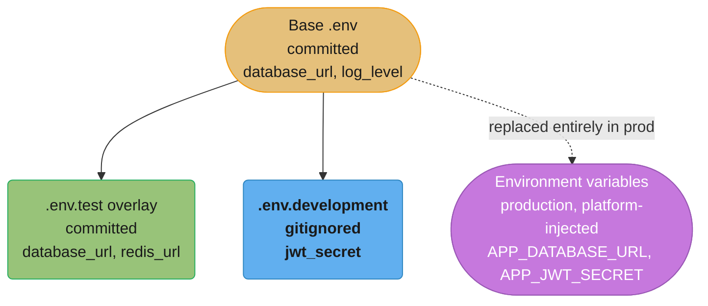
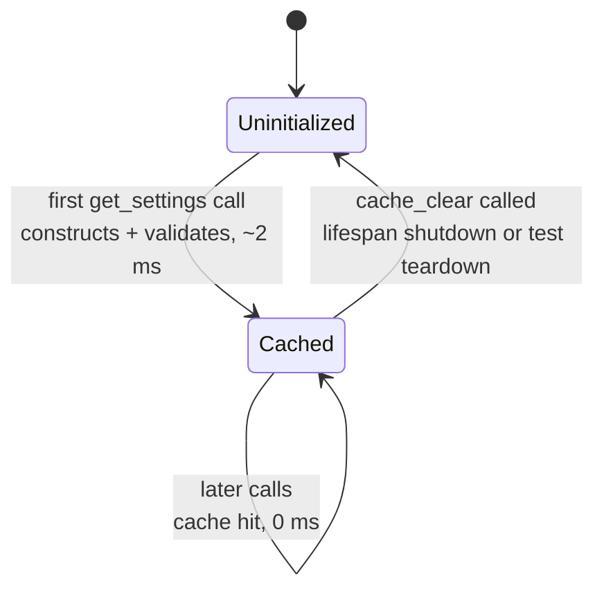
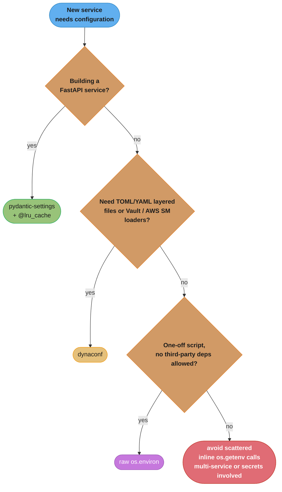
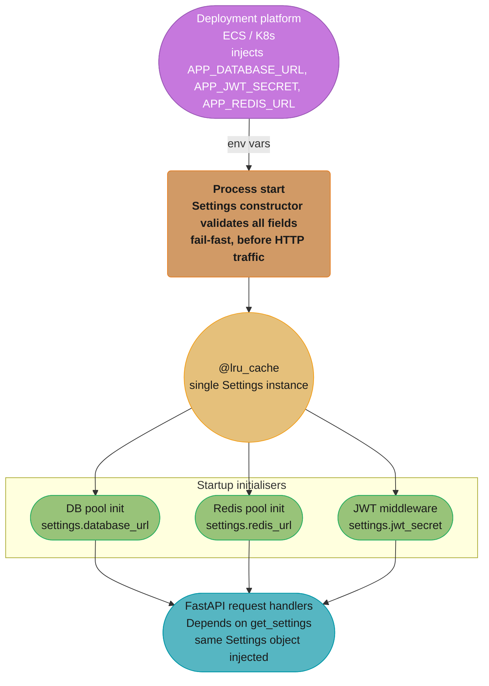

# Configuration and Settings Management

## 1. Concept Overview

Configuration and settings management is the discipline of externalizing all environment-specific values — database URLs, API keys, feature flags, service endpoints — from code into a controlled, validated layer that the application reads at startup.

In Python + FastAPI the canonical solution is `pydantic-settings`, which extends Pydantic v2's `BaseModel` with automatic environment-variable and `.env` file sourcing. Values are type-coerced and validated before the first request is ever served, converting a runtime crash into a startup-time failure with a clear error message.

Core capabilities covered in this module:

- `pydantic-settings` `BaseSettings` — env var sourcing, `.env` files, field validators
- `SettingsConfigDict` — `env_file`, `env_prefix`, `case_sensitive`, `secrets_dir`
- `SecretStr` — opaque secret handling that prevents log leakage
- `@lru_cache` singleton pattern + `Depends(get_settings)` injection
- Layered / per-environment overrides (`.env.development`, `.env.test`, `.env.production`)
- `dependency_overrides` for test-time mock settings
- 12-factor app principles applied to Python
- Fail-fast validation: all required vars checked at startup, not on first use
- Feature flags as typed boolean settings fields
- Alternatives: `dynaconf`, `python-dotenv`, raw `os.environ`

Python version: 3.11/3.12. pydantic-settings: 2.x. FastAPI: 0.110+.

---

## 2. Intuition

> Think of your settings object as the electrical panel in a building: every circuit (database pool, cache client, JWT signer) draws from it. You inspect and verify the panel once when the building opens, not each time someone flips a switch.

**Mental model.** Settings are a validated, typed snapshot of the environment taken once at process startup. Every piece of code that needs a config value reads from that snapshot rather than calling `os.getenv()` inline. The snapshot is immutable for the life of the process.

**Why it matters.** Without centralized validation, a missing `DATABASE_URL` surfaces as an `OperationalError` when the first database query runs — potentially minutes into a production incident. With `BaseSettings`, the process refuses to start entirely, cutting MTTR from hours to seconds.

**Key insight.** `pydantic-settings` layers sources in priority order: environment variables override `.env` file values, which override field defaults. This single rule makes environment-specific overrides trivial: keep a `.env` with safe defaults for local development, and inject real secrets through env vars in production — no code change required.

---

## 3. Core Principles

**Externalize everything environment-specific.** Hostnames, ports, credentials, timeouts, and feature flags all change between environments. Hardcoding any of them forces a code change — and a new deployment — for what is purely operational configuration.

**Validate at startup, not at use.** Missing or malformed config should raise an error before the HTTP server binds to its port. Downstream errors triggered by bad config are harder to diagnose and may be user-visible.

**Never log secrets.** `SecretStr` renders as `**********` in `str()` and `repr()`. Use it for any value that would cause damage if it appeared in a log aggregator.

**One settings object, one instantiation.** A `Settings()` call reads and validates all sources. Creating multiple instances per process wastes I/O and makes test overrides fragile. The `@lru_cache` pattern enforces a single instance per worker process.

**Twelve-factor config.** Store config in the environment, not in the repository. `.env` files are for local development only and must be listed in `.gitignore`. Production values flow through the deployment platform's secret store.

**Type safety over string typing.** A field declared as `int` rejects `"abc"` immediately. A field declared as `AnyUrl` rejects `"not-a-url"` at startup. Prefer specific types over bare `str` wherever semantics allow.

---

## 4. Types / Architectures / Strategies

### 4.1 Flat BaseSettings (simplest)

A single class holds all application settings. Suitable for small services with one environment.

```python
from pydantic_settings import BaseSettings, SettingsConfigDict

class Settings(BaseSettings):
    model_config = SettingsConfigDict(env_file=".env", env_prefix="APP_")
    database_url: str
    redis_url: str
    secret_key: str
    debug: bool = False
```

### 4.2 Nested Settings (medium services)

Group related settings into sub-models. Pydantic-settings flattens them using double-underscore notation in env vars: `APP_DB__HOST=localhost` maps to `settings.db.host`.

```python
from pydantic import AnyUrl
from pydantic_settings import BaseSettings, SettingsConfigDict

class DatabaseSettings(BaseSettings):
    host: str = "localhost"
    port: int = 5432
    name: str = "app"
    user: str = "app"
    password: str = ""

class Settings(BaseSettings):
    model_config = SettingsConfigDict(env_file=".env", env_nested_delimiter="__")
    db: DatabaseSettings = DatabaseSettings()
    redis_url: AnyUrl = AnyUrl("redis://localhost:6379/0")
    debug: bool = False
```

### 4.3 Layered / Per-Environment Settings

Load a base `.env`, then overlay an environment-specific file. The last file in the list wins.

```python
import os
from pydantic_settings import BaseSettings, SettingsConfigDict

ENV = os.getenv("ENV", "development")

class Settings(BaseSettings):
    model_config = SettingsConfigDict(
        env_file=(".env", f".env.{ENV}"),  # later files override earlier ones
        env_file_encoding="utf-8",
    )
    database_url: str
    debug: bool = False
    log_level: str = "INFO"
```

Files on disk:
```
.env                 # shared defaults (committed, no secrets)
.env.development     # local overrides  (gitignored)
.env.test            # test DB, mock secrets (committed, safe values)
.env.production      # empty or absent; real values come from env vars
```

### 4.4 Secrets Directory (Kubernetes / Docker Secrets)

Mount secrets as files at `/run/secrets/`. Point `secrets_dir` at that path; pydantic-settings reads each file as the value of the matching field name.

```python
from pydantic_settings import BaseSettings, SettingsConfigDict

class Settings(BaseSettings):
    model_config = SettingsConfigDict(secrets_dir="/run/secrets")
    database_password: str  # reads from /run/secrets/database_password
    jwt_secret: str         # reads from /run/secrets/jwt_secret
```

### 4.5 dynaconf Alternative

`dynaconf` supports multiple file formats (TOML, YAML, JSON, `.env`), namespaced environments (`[production]` blocks), and a Vault integration out of the box. Heavier dependency than pydantic-settings; best for teams already using TOML-heavy configurations.

---

## 5. Architecture Diagrams

### Settings resolution order (pydantic-settings v2)



Each source is checked in strict priority order top-to-bottom; the first one that supplies a value wins outright, with no merging of list or dict values across layers (see Q4).

### Singleton injection flow in FastAPI



The `~2 ms` construction cost from the priority-resolution walk above is paid once per worker process; every later `Depends(get_settings)` call in the DI graph returns the identical cached object (see Q2).

#### Decoding what `@lru_cache` is worth

"Once per process" versus "once per call" is a difference of one word and several CPU cores:

```
without lru_cache :  construction_ms_per_second = RPS x construct_ms
with lru_cache    :  construction_ms_total      = construct_ms   (once, at first call)

cores_burned = construction_ms_per_second / 1000
```

**What it means.** "Without the cache, every request re-reads the environment, re-parses `.env`,
and re-runs every Pydantic validator — so a 2 ms one-off becomes a 2 ms tax multiplied by your
traffic." The construction cost never changes; only its frequency does, and frequency is the
term the decorator deletes.

| Symbol | What it is |
|--------|------------|
| `construct_ms` | `~2` ms — one `Settings()` call: read env, read `.env`, validate every field |
| `RPS` | Requests per second on this worker process |
| `construction_ms_per_second` | CPU milliseconds per wall-clock second spent rebuilding config |
| `cores_burned` | `construction_ms_per_second / 1000`. Whole CPU cores doing nothing useful |
| `construction_ms_total` | The cached case. A constant, independent of traffic entirely |

**Walk one example.** The `~2 ms` figure at three traffic levels:

```
    RPS      without lru_cache            cores burned      with lru_cache
     100      100 x 2 ms =    200 ms/s      0.2 cores        2 ms, once
   1,000    1,000 x 2 ms =  2,000 ms/s      2.0 cores        2 ms, once
   5,000    5,000 x 2 ms = 10,000 ms/s     10.0 cores        2 ms, once

  One worker at 1,000 req/s for one hour:
    uncached : 1,000 x 3,600 = 3,600,000 constructions x 2 ms = 7,200,000 ms
               = 7,200 CPU-seconds = 2 full cores, permanently
    cached   : 1 construction, 2 ms, at process start

  Cache hit rate over that hour: 3,599,999 / 3,600,000 = 99.99997% hits.
  A 4-worker deployment pays 4 x 2 ms = 8 ms of startup cost in total, forever.
```

**Why it also fixes correctness, not just cost.** An uncached `get_settings()` re-reads
`os.environ` on every call, so a variable changed mid-process would take effect halfway through
a request — two handlers in the same request could disagree about the database URL. The cache
makes configuration immutable for the process lifetime, which is exactly why the test-side fix
is `dependency_overrides` (replace the provider) rather than mutating env vars and hoping.

### Layered environment override diagram



Test and development overlay the base `.env`; production instead replaces it entirely with platform-injected environment variables, the highest-priority source in the resolution order above.

---

## 6. How It Works — Detailed Mechanics

### 6.1 Minimal working settings + FastAPI

```python
# app/config.py
from functools import lru_cache
from typing import Annotated

from fastapi import Depends, FastAPI
from pydantic import AnyUrl, SecretStr
from pydantic_settings import BaseSettings, SettingsConfigDict


class Settings(BaseSettings):
    model_config = SettingsConfigDict(
        env_file=".env",
        env_file_encoding="utf-8",
        env_prefix="APP_",
        case_sensitive=False,
    )

    # Database
    database_url: str  # Required — no default; startup fails if missing

    # Redis
    redis_url: AnyUrl = AnyUrl("redis://localhost:6379/0")

    # Auth
    jwt_secret: SecretStr  # Required; rendered as *** in logs
    jwt_algorithm: str = "HS256"
    access_token_expire_minutes: int = 30

    # Service behaviour
    debug: bool = False
    log_level: str = "INFO"
    allowed_origins: list[str] = ["http://localhost:3000"]

    # Feature flags
    feature_new_onboarding: bool = False


@lru_cache  # Called once per worker process; ~2 ms overhead on first call
def get_settings() -> Settings:
    return Settings()


SettingsDep = Annotated[Settings, Depends(get_settings)]
```

```python
# app/main.py
from fastapi import FastAPI
from app.config import SettingsDep

app = FastAPI()


@app.get("/health")
async def health(settings: SettingsDep) -> dict[str, str | bool]:
    return {
        "status": "ok",
        "debug": settings.debug,
        "log_level": settings.log_level,
    }
```

The `@lru_cache` decorator above turns `get_settings()` into a small state machine — the first call pays the construction-and-validation cost, and every call after that is a free cache hit until something explicitly clears it:



Every request served by the same worker process shares the one `Cached` instance; only a `cache_clear()` call — in the `lifespan` shutdown hook or a test fixture's teardown — resets the cycle so the next call re-validates from scratch.

### 6.2 SecretStr in practice

```python
from pydantic import SecretStr
from pydantic_settings import BaseSettings


class AuthSettings(BaseSettings):
    jwt_secret: SecretStr
    db_password: SecretStr


s = AuthSettings(jwt_secret="mysecret", db_password="hunter2")

# Safe: renders as masked string
print(s.jwt_secret)          # **********
print(repr(s.jwt_secret))    # SecretStr('**********')

# To access the raw value (only when you need it):
raw: str = s.jwt_secret.get_secret_value()
```

### 6.3 Nested settings with double-underscore delimiter

```python
from pydantic_settings import BaseSettings, SettingsConfigDict
from pydantic import AnyUrl


class DBSettings(BaseSettings):
    host: str = "localhost"
    port: int = 5432
    name: str = "app"
    pool_size: int = 10
    pool_timeout: int = 30  # seconds


class RedisSettings(BaseSettings):
    url: AnyUrl = AnyUrl("redis://localhost:6379/0")
    max_connections: int = 50


class AppSettings(BaseSettings):
    model_config = SettingsConfigDict(
        env_nested_delimiter="__",
        env_prefix="APP_",
    )
    db: DBSettings = DBSettings()
    redis: RedisSettings = RedisSettings()
    debug: bool = False
```

Matching env var names:
```
APP_DB__HOST=prod-db.internal
APP_DB__PORT=5432
APP_DB__POOL_SIZE=20
APP_REDIS__URL=redis://cache.internal:6379/0
```

### 6.4 Field validators for derived values

```python
from pydantic import AnyUrl, field_validator, model_validator
from pydantic_settings import BaseSettings, SettingsConfigDict


class Settings(BaseSettings):
    model_config = SettingsConfigDict(env_file=".env", env_prefix="APP_")

    db_host: str = "localhost"
    db_port: int = 5432
    db_name: str = "app"
    db_user: str = "app"
    db_password: str = ""

    database_url: str = ""  # Derived; can be overridden

    @model_validator(mode="after")
    def build_database_url(self) -> "Settings":
        if not self.database_url:
            self.database_url = (
                f"postgresql+asyncpg://{self.db_user}:{self.db_password}"
                f"@{self.db_host}:{self.db_port}/{self.db_name}"
            )
        return self

    @field_validator("log_level", mode="before")
    @classmethod
    def normalise_log_level(cls, v: str) -> str:
        return v.upper()

    log_level: str = "INFO"
```

### 6.5 Testing with dependency_overrides

```python
# tests/conftest.py
import pytest
from fastapi.testclient import TestClient
from app.main import app
from app.config import get_settings, Settings


@pytest.fixture
def mock_settings() -> Settings:
    return Settings(
        database_url="postgresql://localhost/test",
        jwt_secret="test-secret-key",
        debug=True,
    )


@pytest.fixture
def client(mock_settings: Settings) -> TestClient:
    app.dependency_overrides[get_settings] = lambda: mock_settings
    yield TestClient(app)
    app.dependency_overrides.clear()
```

---

## 7. Real-World Examples

**Stripe.** The Stripe Python SDK reads `STRIPE_API_KEY` and `STRIPE_WEBHOOK_SECRET` from environment variables. Their internal services follow a layered pattern: a base config class defines all fields with type annotations, and per-environment subclasses or `.env` overlays set appropriate values. Secret rotation is handled by re-injecting environment variables into the running container without a code deployment.

**GitHub Copilot backend.** Copilot's Python inference services use a settings singleton injected through a DI container. JWT validation parameters (`algorithm`, `audience`, `issuer`) are settings fields so they can differ between staging and production without changing code.

**Notion.** Notion's Python microservices configure connection pool sizes (`db_pool_min`, `db_pool_max`) and cache TTLs as integer settings fields. Defaults are tuned for local development; production values come from the Kubernetes `ConfigMap` and `Secret` objects mounted as environment variables.

**FastAPI itself (in its own test suite).** The FastAPI test suite exercises `dependency_overrides` for settings injection. Every integration test replaces the real settings with an in-memory override pointing at a local SQLite or test Postgres, ensuring no production credentials are needed in CI.

**12-factor SaaS startups.** The majority of FastAPI SaaS boilerplates (FastAPI-Users, Cookiecutter FastAPI, full-stack-fastapi-template) ship with a `BaseSettings` class in `app/core/config.py` using `@lru_cache` and `Depends(get_settings)`. This pattern has become the de facto standard in the ecosystem.

---

## 8. Tradeoffs

| Approach | Startup validation | Secret safety | Test overrides | Complexity | Dependencies |
|---|---|---|---|---|---|
| `pydantic-settings BaseSettings` + `@lru_cache` | Yes — fails before server starts | `SecretStr` available | `dependency_overrides` | Low | `pydantic-settings` |
| Raw `os.environ` / `os.getenv` inline | No — fails at use site | None | `monkeypatch.setenv` | Minimal | stdlib only |
| `python-dotenv` only | No — just loads file | None | Fragile | Very low | `python-dotenv` |
| `dynaconf` | Yes | Vault integration | `settings.configure()` | Medium | `dynaconf` |
| Custom `dataclasses` + manual parsing | Yes (if coded) | Manual | Manual | High | stdlib only |

| Factor | pydantic-settings | dynaconf |
|---|---|---|
| Pydantic integration | Native | Via plugin |
| Multi-format (TOML, YAML, JSON) | `.env` + env vars | Yes |
| Vault / AWS Secrets Manager | Manual | Built-in loaders |
| Nested config | `env_nested_delimiter` | Natural hierarchy |
| Startup overhead | ~2 ms (cold, with @lru_cache = once) | ~5-10 ms |
| Type safety | Full Pydantic v2 | Partial |

---

## 9. When to Use / When NOT to Use

**Use pydantic-settings + @lru_cache when:**
- Building a FastAPI service (the DI integration is first-class)
- You want startup-time validation of all required config
- You need `SecretStr` masking for compliance or log-safety
- Type-safe, IDE-autocomplete-friendly config access is important
- The team is already using Pydantic v2 for request/response models

**Use dynaconf when:**
- Config files are in TOML or YAML and you want layered merging across files
- You need native Vault or AWS Secrets Manager loaders without custom code
- Multiple environments have deep config trees that are awkward to express as env var names

**Use raw os.environ when:**
- Writing a one-off script where startup overhead and type safety are irrelevant
- The deployment target cannot install third-party packages

**Avoid inline os.getenv() calls scattered through the codebase when:**
- The codebase has more than one service or more than a handful of config values
- Tests need to swap config values — monkeypatching `os.environ` in every test is fragile and order-sensitive
- Any secret values are involved — no masking, no audit trail

Collapsing the guidance above into a single decision path:



Reach for `pydantic-settings` by default, drop to `dynaconf` only when the config format itself needs to be TOML/YAML with layered merging, and treat scattered `os.getenv()` calls as the anti-pattern to grow out of once a codebase outgrows a single script.

---

## 10. Common Pitfalls

### Pitfall 1: Module-level Settings() instantiation — no singleton, repeated env reads

```python
# BROKEN: Settings() called at import time of every module that imports this file.
# If two modules import `settings`, Python's module cache means the *same object* is
# reused — but only within one process. Under pytest, module re-imports between test
# sessions can create multiple instances, and there is no single override point.
from pydantic_settings import BaseSettings

class Settings(BaseSettings):
    database_url: str
    secret_key: str

settings = Settings()  # Created at import; no dependency injection hook
```

```python
# FIX: wrap in @lru_cache and expose via Depends() so FastAPI owns the lifecycle.
from functools import lru_cache
from typing import Annotated

from fastapi import Depends
from pydantic import SecretStr
from pydantic_settings import BaseSettings, SettingsConfigDict


class Settings(BaseSettings):
    model_config = SettingsConfigDict(env_file=".env")
    database_url: str
    secret_key: SecretStr


@lru_cache  # One instance per worker process; ~2 ms on first call, 0 ms thereafter
def get_settings() -> Settings:
    return Settings()


# In routes:
async def route(settings: Annotated[Settings, Depends(get_settings)]) -> None:
    db_url = settings.database_url  # Always the same object
```

---

### Pitfall 2: Reading os.environ at import time — KeyError far from root cause

```python
# BROKEN: os.environ["SECRET_KEY"] evaluated when the module is first imported.
# If SECRET_KEY is absent the process raises KeyError at import time with a confusing
# traceback pointing into application code, not into the misconfigured deployment.
import os

SECRET_KEY = os.environ["SECRET_KEY"]          # KeyError if missing
DATABASE_URL = os.environ["DATABASE_URL"]      # Never reached if the line above fails

def sign_token(payload: dict) -> str:
    import jwt
    return jwt.encode(payload, SECRET_KEY, algorithm="HS256")
```

```python
# FIX: declare fields in BaseSettings; pydantic-settings raises a clear
# ValidationError listing every missing field before the server binds to a port.
from pydantic import SecretStr
from pydantic_settings import BaseSettings


class Settings(BaseSettings):
    secret_key: SecretStr  # Missing value → ValidationError with field name
    database_url: str      # All missing fields reported together, not one-by-one


# Startup error output (clear):
# pydantic_core._pydantic_core.ValidationError: 2 validation errors for Settings
#   secret_key  Field required [type=missing]
#   database_url  Field required [type=missing]
```

---

### Pitfall 3: Storing a secret as plain str — it leaks into logs

```python
# BROKEN: jwt_secret is a plain str. When the settings object is logged (e.g., via
# a startup lifecycle hook that prints config), the raw secret appears in stdout,
# log files, and any log aggregator (Datadog, Splunk, CloudWatch).
from pydantic_settings import BaseSettings

class Settings(BaseSettings):
    jwt_secret: str   # "my-production-secret-abc123" visible in logs

s = Settings(jwt_secret="my-production-secret-abc123")
print(s)  # jwt_secret='my-production-secret-abc123'  <-- leaked
```

```python
# FIX: declare the field as SecretStr. Pydantic masks it in all string representations.
from pydantic import SecretStr
from pydantic_settings import BaseSettings

class Settings(BaseSettings):
    jwt_secret: SecretStr

s = Settings(jwt_secret="my-production-secret-abc123")
print(s)                           # jwt_secret=SecretStr('**********')
print(s.model_dump())              # {'jwt_secret': SecretStr('**********')}
# Only expose raw value where the signing library needs it:
raw = s.jwt_secret.get_secret_value()
```

---

### Pitfall 4: Forgetting env_prefix — env var name mismatch silently uses defaults

```python
# BROKEN: model_config sets env_prefix="APP_" but the deployment sets DATABASE_URL
# (no prefix). Pydantic finds no APP_DATABASE_URL, falls back to the field default,
# and connects to localhost:5432 in production. No error is raised.
from pydantic_settings import BaseSettings, SettingsConfigDict

class Settings(BaseSettings):
    model_config = SettingsConfigDict(env_prefix="APP_")
    database_url: str = "postgresql://localhost/dev"  # default used in prod silently
```

```python
# FIX: either remove env_prefix and set DATABASE_URL in the environment, or align
# the prefix with how the deployment platform names its vars.
from pydantic_settings import BaseSettings, SettingsConfigDict

class Settings(BaseSettings):
    model_config = SettingsConfigDict(
        env_prefix="APP_",   # deployment must set APP_DATABASE_URL
    )
    # Remove the default so a missing APP_DATABASE_URL causes a startup error:
    database_url: str
```

---

## 11. Technologies & Tools

| Tool | Type validation | Secret masking | Layered files | Vault / AWS SM | FastAPI DI | Startup fail-fast |
|---|---|---|---|---|---|---|
| `pydantic-settings` 2.x | Full Pydantic v2 | `SecretStr` | Multi-file list | Manual | `Depends()` native | Yes |
| `dynaconf` 3.x | Partial (casting) | Via Vault loader | TOML/YAML/JSON/env | Built-in | Adapter needed | Yes (with validators) |
| `python-dotenv` | None | None | Single file | None | None | No |
| `environs` | `marshmallow` based | None | Single file | None | Adapter needed | Yes |
| Raw `os.environ` | None | None | None | None | `monkeypatch` only | No |
| `confuse` (YAML) | Schema-based | None | YAML hierarchy | None | Adapter needed | Yes |

---

## 12. Interview Questions with Answers

**Q1: Why use pydantic-settings instead of calling os.getenv() inline throughout the codebase?**
Inline `os.getenv()` calls scatter configuration reads across the codebase with no central validation, no type coercion, and no startup-time fail-fast guarantee. `BaseSettings` validates all fields at construction time, so the process refuses to start if any required variable is absent or malformed. This converts a runtime crash mid-request into a deployment failure with a clear error message listing every missing field.

**Q2: What does @lru_cache on get_settings() accomplish?**
`@lru_cache` makes `get_settings()` return the same `Settings` instance on every subsequent call within the same process. Without it, `Settings()` would be constructed on each call, re-reading env vars and `.env` files each time — adding ~2 ms overhead per call and making test overrides fragile. With the cache, pydantic-settings reads and validates configuration exactly once per worker process.

**Q3: How do you override settings in tests without modifying environment variables?**
Use FastAPI's `dependency_overrides` dictionary: `app.dependency_overrides[get_settings] = lambda: Settings(database_url="postgresql://localhost/test", jwt_secret="test")`. The override applies for every request served by the `TestClient` in that test function. Clear it in teardown with `app.dependency_overrides.clear()`. This is cleaner than `monkeypatch.setenv` because it does not mutate the process environment.

**Q4: What is the priority order when pydantic-settings resolves a field value?**
From highest to lowest: (1) environment variable, (2) last `.env` file in the configured list (later files override earlier ones), (3) `secrets_dir` file, (4) field default. A value found at a higher priority layer completely replaces a lower-priority value — there is no merging of list or dict values across layers.

**Q5: Why use SecretStr instead of str for sensitive fields?**
`SecretStr` overrides `__str__` and `__repr__` to return `**********`. This means the value never appears in log output, exception messages, or `model_dump()` by default. The raw value is only accessible via `.get_secret_value()`, making it explicit in code reviews wherever the plaintext is exposed.

**Q6: How do you implement per-environment configuration without environment-specific subclasses?**
Pass a tuple of `.env` file paths to `env_file` in `SettingsConfigDict`. The last file in the tuple takes precedence. Set an `ENV` environment variable to control which overlay is loaded: `env_file=(".env", f".env.{os.getenv('ENV', 'development')}")`. Production typically sets no `.env` overlay at all — all values come from environment variables injected by the deployment platform.

**Q7: What is the double-underscore delimiter for nested settings?**
Setting `env_nested_delimiter="__"` in `SettingsConfigDict` allows pydantic-settings to map `APP_DB__HOST` to `settings.db.host` where `db` is a nested `BaseSettings` sub-model. Without this, nested models must be provided as JSON strings, which is error-prone. The delimiter works for arbitrarily deep nesting: `APP_DB__REPLICA__HOST` → `settings.db.replica.host`.

**Q8: How do you handle secrets mounted as files (Kubernetes Secrets / Docker secrets)?**
Set `secrets_dir` in `SettingsConfigDict` to the mount path (e.g., `/run/secrets`). Pydantic-settings reads the content of `/run/secrets/<field_name>` as the field value, stripping trailing whitespace. This is the Kubernetes-native pattern for consuming `Secret` objects without exposing their values as environment variables (which are visible in `kubectl describe pod` output).

**Q9: What happens if a required field has no value from any source?**
Pydantic raises a `ValidationError` at `Settings()` construction time listing every missing required field. Because `get_settings()` is typically called at startup (via a `lifespan` event or the first request), the process fails before serving any traffic. This is the desired fail-fast behaviour compared to a `KeyError` on the first database call minutes later.

**Q10: How do you validate that a settings field is a valid URL?**
Declare the field as `AnyUrl` (or `PostgresDsn`, `RedisDsn`, etc.) from `pydantic`. Pydantic v2 validates the URL scheme, host, and structure at construction time. `PostgresDsn` additionally checks that the scheme is `postgresql://` or `postgresql+asyncpg://`, providing a more specific error than a bare string field would.

**Q11: How do you expose a subset of settings to the OpenAPI schema without leaking secrets?**
Implement a `PublicSettings` response model with only the non-sensitive fields (e.g., `debug`, `log_level`, `allowed_origins`). Populate it from the full `Settings` object in a `/config` diagnostic endpoint gated behind an admin scope. Never return `SecretStr` fields in any HTTP response — even if they render as `**********`, the field name itself signals what secrets exist.

**Q12: What is the difference between model_config case_sensitive=True and the default?**
By default (`case_sensitive=False`), pydantic-settings matches `APP_DATABASE_URL`, `app_database_url`, and `App_Database_Url` to the `database_url` field. With `case_sensitive=True`, only the exact casing matches. Linux environment variables are case-sensitive by default, so `case_sensitive=False` (the default) is safer on Linux production deployments and avoids a common deployment gotcha where the env var is set in uppercase but the field name is lowercase.

**Q13: Why should a database engine be constructed inside the `lifespan` startup hook rather than at module import time?**
Constructing the engine at import time risks building it before the deployment platform has finished injecting environment variables. Many test runners and process managers set environment variables after the Python interpreter has already imported application modules, so a module-level `Settings()` call can read stale or missing values and bake a wrong connection string into a long-lived engine object. Deferring engine creation to `lifespan` guarantees `get_settings()` runs after the environment is fully populated, and the resulting `OperationalError` failure mode collapses into a clear `ValidationError` at startup instead. Always treat module import order as untrusted and push side-effecting construction into an explicit startup hook.

**Q14: What happens if `env_prefix` is set but the deployment platform injects an unprefixed variable name?**
Pydantic-settings finds no matching prefixed variable and silently falls back to the field's default value with no error raised. A service configured with `env_prefix="APP_"` that expects `APP_DATABASE_URL` but receives a plain `DATABASE_URL` from the platform connects to whatever default is coded — commonly `localhost`, which fails or worse, quietly points at a local resource in production. Because there is no missing-field error to catch, this bug surfaces only through wrong behavior, not a startup crash. Remove defaults from any field whose env var name is uncertain so a mismatch produces a loud `ValidationError` instead of a silent fallback.

**Q15: When should you reach for `dynaconf` instead of `pydantic-settings` in a FastAPI project?**
Choose `dynaconf` when configuration must live in layered TOML or YAML files with native environment sections, or when you need a built-in Vault or AWS Secrets Manager loader without writing custom fetch code. `dynaconf` costs roughly 5-10ms of startup overhead versus `pydantic-settings`' ~2ms, and its FastAPI dependency-injection integration needs a manual adapter rather than the native `Depends()` support pydantic-settings ships with. Default to `pydantic-settings` for a Pydantic-v2-native FastAPI service, and switch only when the config format itself demands file-based hierarchical merging.

**Q16: Why should a derived setting like `database_url` be computed with a `@model_validator(mode="after")` instead of a `@property`?**
A `model_validator` writes the computed value back onto the model instance, so it appears in `model_dump()` and shows up in the startup log line that prints the loaded settings. A `@property` computes the value on each access but never becomes part of the model's serialized state, so a diagnostic log of `settings.model_dump()` would omit it entirely, hiding exactly the value an engineer debugging a wrong connection string needs to see. Prefer `model_validator` for any field whose value is assembled from other fields and needs to be auditable at startup.

---

## 13. Best Practices

**Keep one settings class per service.** Split into sub-models for logical grouping, but keep a single root `Settings` class as the entry point. Multiple unrelated settings singletons in the same service create confusion about which one to inject.

**Set no defaults for required production values.** If `DATABASE_URL` must be present in production, declare it as `database_url: str` with no default. A default of `""` or `"postgresql://localhost/dev"` is silently used in production if the env var is misconfigured.

**Use `model_config` instead of inner `Config` class.** The inner `Config` class is the Pydantic v1 pattern. In pydantic-settings 2.x use `model_config = SettingsConfigDict(...)` at the class body level.

**List `.env` in .gitignore before you write the first line of it.** Add `.env*` to `.gitignore` at project creation. Committed `.env` files with real credentials are among the most common causes of secret leaks.

**Log settings at startup (with SecretStr masking).** Call `logger.info("Settings loaded: %s", settings.model_dump())` in the `lifespan` startup block. This confirms which values were actually loaded in production without leaking secrets, since `SecretStr` renders as `**********` in `model_dump()`.

**Clear the lru_cache in tests.** Call `get_settings.cache_clear()` in test teardown if you mutate environment variables between tests. `dependency_overrides` is cleaner and does not require cache manipulation.

**Use `@model_validator(mode="after")` for derived fields.** Fields that are computed from other fields (e.g., constructing `DATABASE_URL` from `DB_HOST`, `DB_PORT`, `DB_NAME`) should use a `model_validator` rather than a `@property`, so the derived value appears in `model_dump()` and is visible in startup logs.

**Pin pydantic-settings to a minor version in requirements.** Pydantic-settings follows pydantic's release cadence; a minor bump occasionally changes field resolution order. Pin with `pydantic-settings>=2.3,<3.0`.

**Use feature flags as boolean settings fields.** A `feature_new_onboarding: bool = False` field controlled by an env var is a simple, testable feature flag that requires no external service. Migrate to a dedicated flag service (LaunchDarkly, Unleash) only when you need per-user or per-cohort targeting.

---

## 14. Case Study

### Scenario: Multi-environment SaaS API with secret rotation support

A FastAPI service needs to run across three environments — local development, CI test, and production. It connects to Postgres, Redis, and a JWT signing service. Production secrets rotate every 30 days via AWS Secrets Manager; the new value is injected as an environment variable by the deployment pipeline and the service restarts cleanly.

### ASCII Architecture



Deployment-injected environment variables flow through the one validated `Settings` instance into every subsystem that depends on it, so a secret rotation only requires a new env var value and a clean restart — no code change.

### Implementation

```python
# app/config.py
import os
from functools import lru_cache
from typing import Annotated

from fastapi import Depends
from pydantic import AnyUrl, SecretStr, field_validator
from pydantic_settings import BaseSettings, SettingsConfigDict

ENV = os.getenv("ENV", "development")


class Settings(BaseSettings):
    model_config = SettingsConfigDict(
        env_file=(".env", f".env.{ENV}"),
        env_file_encoding="utf-8",
        env_prefix="APP_",
        case_sensitive=False,
    )

    # Required — no defaults; missing value raises ValidationError at startup
    database_url: str
    jwt_secret: SecretStr

    # Optional with safe defaults
    redis_url: AnyUrl = AnyUrl("redis://localhost:6379/0")
    jwt_algorithm: str = "HS256"
    access_token_expire_minutes: int = 30
    debug: bool = False
    log_level: str = "INFO"

    # Feature flags
    feature_new_onboarding: bool = False
    feature_async_notifications: bool = False

    @field_validator("log_level", mode="before")
    @classmethod
    def normalise_log_level(cls, v: object) -> str:
        return str(v).upper()


@lru_cache
def get_settings() -> Settings:
    return Settings()


SettingsDep = Annotated[Settings, Depends(get_settings)]
```

```python
# app/main.py
import logging
from contextlib import asynccontextmanager
from collections.abc import AsyncIterator

from fastapi import FastAPI
from app.config import get_settings, SettingsDep


@asynccontextmanager
async def lifespan(app: FastAPI) -> AsyncIterator[None]:
    settings = get_settings()
    logging.basicConfig(level=settings.log_level)
    logger = logging.getLogger(__name__)
    # SecretStr fields render as *** — safe to log
    logger.info("Settings loaded: %s", settings.model_dump())
    yield
    get_settings.cache_clear()  # Allow clean re-initialisation in tests


app = FastAPI(lifespan=lifespan)


@app.get("/config/public")
async def public_config(settings: SettingsDep) -> dict[str, object]:
    return {
        "debug": settings.debug,
        "log_level": settings.log_level,
        "features": {
            "new_onboarding": settings.feature_new_onboarding,
            "async_notifications": settings.feature_async_notifications,
        },
    }
```

```python
# tests/conftest.py
import pytest
from fastapi.testclient import TestClient
from app.config import get_settings, Settings
from app.main import app


@pytest.fixture(autouse=True)
def clear_settings_cache() -> None:
    get_settings.cache_clear()
    yield
    get_settings.cache_clear()


@pytest.fixture
def test_settings() -> Settings:
    return Settings(
        database_url="postgresql://localhost/test",
        jwt_secret="test-secret-only",
        redis_url="redis://localhost:6379/1",  # type: ignore[arg-type]
        debug=True,
    )


@pytest.fixture
def client(test_settings: Settings) -> TestClient:
    app.dependency_overrides[get_settings] = lambda: test_settings
    with TestClient(app) as c:
        yield c
    app.dependency_overrides.clear()
```

### BROKEN → FIX in this scenario

```python
# BROKEN: database connection pool created at module import using a settings
# object that was also created at module import. If APP_DATABASE_URL is not set
# when the module loads (common in test runners that set env vars after import),
# the connection pool is built with a wrong URL and all queries fail with
# OperationalError pointing deep into SQLAlchemy rather than at the config mistake.

from sqlalchemy.ext.asyncio import create_async_engine
from app.config import Settings

_settings = Settings()  # Constructed at import — env vars may not be set yet
engine = create_async_engine(_settings.database_url)  # Wrong URL possible
```

```python
# FIX: defer engine creation to the lifespan event, by which point get_settings()
# has been called with the fully initialised environment.

from sqlalchemy.ext.asyncio import AsyncEngine, create_async_engine
from fastapi import FastAPI
from contextlib import asynccontextmanager
from collections.abc import AsyncIterator
from app.config import get_settings

_engine: AsyncEngine | None = None


@asynccontextmanager
async def lifespan(app: FastAPI) -> AsyncIterator[None]:
    global _engine
    settings = get_settings()  # Called after env vars are set; validated here
    _engine = create_async_engine(settings.database_url, pool_size=10)
    yield
    if _engine:
        await _engine.dispose()
    _engine = None
```

### Discussion Questions

1. How would you handle secret rotation for `jwt_secret` without a service restart? (Hint: what changes if you remove `@lru_cache` and poll AWS Secrets Manager on each `get_settings()` call, and what are the tradeoffs?)
2. The test fixture calls `get_settings.cache_clear()` in both setup and teardown. Why both? What failure mode does the setup clear prevent?
3. A junior engineer suggests storing `database_url` as `PostgresDsn` instead of `str`. What is gained and what might break?
4. How would you use `dynaconf` to achieve the same layered config pattern if the team wants to store non-sensitive configuration in a committed TOML file rather than `.env` files?
