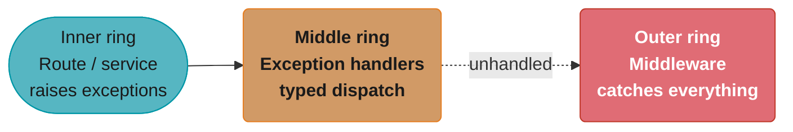
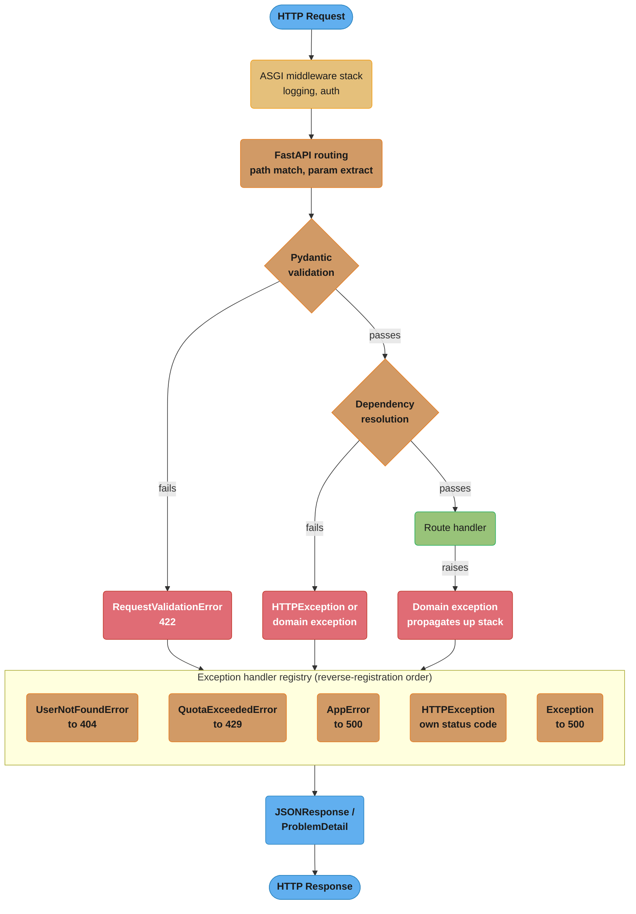
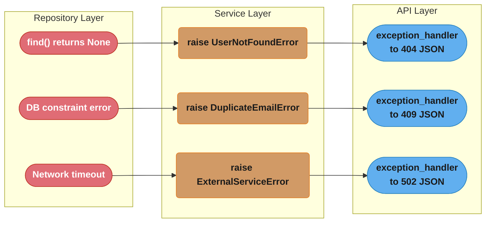
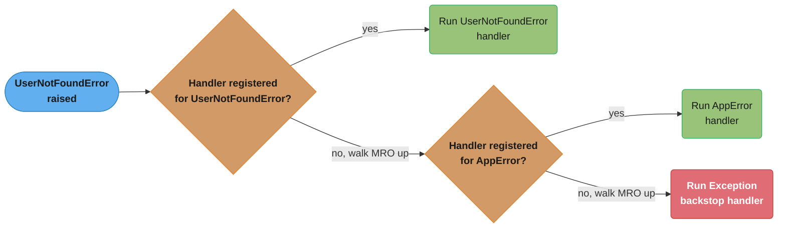
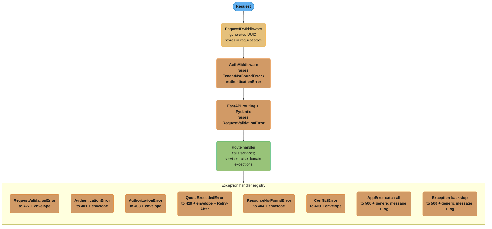

# Error Handling and Validation

---

## 1. Concept Overview

FastAPI's error handling layer sits at the intersection of Pydantic validation, Starlette's
exception machinery, and your own domain logic. When something goes wrong — a missing field,
a non-existent resource, a business rule violation, or an unexpected server fault — the
framework must convert that failure into a well-formed HTTP response with the right status code,
a machine-readable error body, and enough context for the client to diagnose or retry.

Key capabilities this module covers:

- `HTTPException` — when to raise it, what `status_code`, `detail`, and `headers` mean
- Custom domain exceptions and `@app.exception_handler` registration
- `RequestValidationError` — Pydantic v2's 422 response, its `loc`/`msg`/`type`/`url` structure,
  and how to reshape it into your own envelope
- RFC 7807 Problem Details (`application/problem+json`): `type`, `title`, `status`, `detail`,
  `instance` fields and why they matter for API consumers
- Consistent error envelopes: `{"error": {"code": "...", "message": "...", "details": [...]}}`
- Exception handler execution order in Starlette and how middleware interacts with it
- Field-level vs model-level validation with `@field_validator` and `@model_validator`
- The anti-pattern of raising `HTTPException` inside a service layer
- Union discriminated return types for typed error responses
- `status` library vs hardcoded integers

Python version: 3.11/3.12. FastAPI 0.103+. Pydantic v2.

Cross-references:
- Pydantic v2 validators and model internals: `../pydantic_v2_deep_dive/README.md`
- Route parameter extraction and response models: `../routing_and_request_handling/README.md`
- Middleware ordering and ASGI lifecycle: `../middleware_and_lifecycle/README.md`

---

## 2. Intuition

> Error handling in a web API is like an air-traffic control system for failures: every problem
> has a designated flight path — validation errors go to the 422 runway, missing resources go to
> the 404 runway, business rule violations go to the 409 runway, and unexpected faults go to the
> 500 emergency strip. The control tower (exception handler registry) decides which runway each
> failure lands on; the ground crew (response shaping) ensures passengers (clients) receive clear
> instructions about what went wrong.

**Mental model:** Think of error handling as three concentric rings.



Most errors resolve at the middle ring's typed dispatch; only a handler-less exception type or a
panic inside a handler ever reaches the outer ring's middleware backstop.

**Why it matters:** Poorly structured error responses are one of the top API usability complaints.
Clients either parse status codes and guess at the body, or they treat every non-200 as fatal.
RFC 7807 gives a standard contract. Consistent envelopes let frontend teams and API consumers
write a single error-handling path.

**Key insight:** The place where an error is *detected* (service layer, repository, validator)
should be decoupled from the place where it is *translated into HTTP* (exception handler at the
application boundary). Mixing these concerns is the root cause of most error-handling bugs in
FastAPI codebases.

---

## 3. Core Principles

1. **Raise at the domain boundary, translate at the HTTP boundary.** Services raise typed Python
   exceptions. Exception handlers registered on the `FastAPI` app convert them to HTTP responses.

2. **Never let `HTTPException` cross a layer boundary.** Once `HTTPException` appears in your
   service or repository, that layer is coupled to HTTP and cannot be tested or reused without a
   running ASGI app.

3. **One error shape for the whole API.** Pick an envelope format and apply it everywhere,
   including validation errors. Clients should parse one schema.

4. **Validation errors are not server errors.** A 422 Unprocessable Entity means the client sent
   malformed input — it is a 4xx, not a 5xx. Log it at DEBUG, not ERROR.

5. **Machine-readable codes, human-readable messages.** The `code` field in your envelope should
   be a stable string constant (`USER_NOT_FOUND`, `QUOTA_EXCEEDED`). The `message` field can be
   localised. Clients key on `code`; humans read `message`.

6. **RFC 7807 compliance is optional but recommended.** The `application/problem+json` content
   type and its five fields (`type`, `title`, `status`, `detail`, `instance`) are understood by
   standard HTTP tooling, API gateways, and monitoring systems.

7. **Exception handler order is reverse-registration order in Starlette.** The last handler
   registered for a given exception class wins. Always register specific exceptions before
   general ones.

---

## 4. Types / Architectures / Strategies

### 4.1 HTTPException — the built-in escape hatch

`fastapi.HTTPException` is a Starlette exception that FastAPI pre-registers a handler for.
Raising it anywhere in a route handler (including inside dependencies) immediately short-circuits
the call stack and produces a JSON response.

```python
from fastapi import HTTPException
from fastapi import status

raise HTTPException(
    status_code=status.HTTP_404_NOT_FOUND,
    detail="User not found",
    headers={"X-Error-Code": "USER_NOT_FOUND"},  # optional, added to response headers
)
```

Default response body: `{"detail": "User not found"}`.

Use `HTTPException` directly only in thin route handlers when the mapping from failure to HTTP
status is trivial and there is no service layer involved.

### 4.2 Custom exception classes + `@app.exception_handler`

```python
class AppError(Exception):
    """Base class for all domain errors."""
    status_code: int = 500
    error_code: str = "INTERNAL_ERROR"

class UserNotFoundError(AppError):
    status_code = 404
    error_code = "USER_NOT_FOUND"
    def __init__(self, user_id: int) -> None:
        self.user_id = user_id
        super().__init__(f"User {user_id} not found")

class QuotaExceededError(AppError):
    status_code = 429
    error_code = "QUOTA_EXCEEDED"
    def __init__(self, limit: int, used: int) -> None:
        self.limit = limit
        self.used = used
```

Register handlers at the app level:

```python
from fastapi import FastAPI, Request
from fastapi.responses import JSONResponse

app = FastAPI()

@app.exception_handler(AppError)
async def app_error_handler(request: Request, exc: AppError) -> JSONResponse:
    return JSONResponse(
        status_code=exc.status_code,
        content={
            "error": {
                "code": exc.error_code,
                "message": str(exc),
            }
        },
    )
```

Starlette walks exception handlers from the most-recently-registered to the oldest. A handler
registered for `UserNotFoundError` (subclass) will be checked before one registered for
`AppError` (base class) — but only if `UserNotFoundError` was registered after `AppError`.
Safest approach: register the base class handler first, then subclass handlers.

### 4.3 RequestValidationError — Pydantic v2 422 responses

When Pydantic fails to parse the request body, query parameters, or path parameters, FastAPI
raises `fastapi.exceptions.RequestValidationError`. The default handler returns:

```json
{
  "detail": [
    {
      "type": "missing",
      "loc": ["body", "email"],
      "msg": "Field required",
      "input": {},
      "url": "https://errors.pydantic.dev/2.5/v/missing"
    }
  ]
}
```

Pydantic v2 fields in each error item:
- `type` — machine-readable error type (e.g., `"missing"`, `"string_type"`, `"value_error"`)
- `loc` — tuple path from root to the failing field; first element is `"body"`, `"query"`, `"path"`
- `msg` — human-readable English message
- `input` — the input value that failed (may be omitted if sensitive)
- `url` — link to Pydantic docs for this error type (v2 only)

To reshape into your own envelope, override the handler:

```python
from fastapi.exceptions import RequestValidationError

@app.exception_handler(RequestValidationError)
async def validation_error_handler(
    request: Request, exc: RequestValidationError
) -> JSONResponse:
    details = [
        {
            "field": ".".join(str(loc) for loc in err["loc"]),
            "message": err["msg"],
            "type": err["type"],
        }
        for err in exc.errors()
    ]
    return JSONResponse(
        status_code=422,
        content={
            "error": {
                "code": "VALIDATION_ERROR",
                "message": "Request validation failed",
                "details": details,
            }
        },
    )
```

### 4.4 RFC 7807 Problem Details

RFC 7807 defines a standard JSON body for HTTP error responses with Content-Type
`application/problem+json`. The five standard fields:

| Field | Type | Required | Description |
|-------|------|----------|-------------|
| `type` | URI | no | A URI reference that identifies the problem type |
| `title` | string | no | Short, human-readable summary of the problem type |
| `status` | integer | yes | HTTP status code |
| `detail` | string | no | Human-readable explanation specific to this occurrence |
| `instance` | URI | no | URI identifying the specific occurrence (e.g. request ID) |

```python
from fastapi.responses import JSONResponse

def problem_response(
    status: int,
    type_: str,
    title: str,
    detail: str,
    instance: str | None = None,
    **extra: object,
) -> JSONResponse:
    body: dict[str, object] = {
        "type": f"https://api.example.com/problems/{type_}",
        "title": title,
        "status": status,
        "detail": detail,
    }
    if instance:
        body["instance"] = instance
    body.update(extra)
    return JSONResponse(
        status_code=status,
        content=body,
        media_type="application/problem+json",
    )
```

### 4.5 Validation: `@field_validator` vs `@model_validator`

Use `@field_validator` for single-field constraints that depend only on that field's value:

```python
from pydantic import BaseModel, field_validator

class CreateUserRequest(BaseModel):
    email: str
    age: int

    @field_validator("email")
    @classmethod
    def email_must_contain_at(cls, v: str) -> str:
        if "@" not in v:
            raise ValueError("Invalid email address")
        return v.lower()
```

Use `@model_validator` for cross-field constraints:

```python
from pydantic import model_validator
from typing import Self

class DateRangeRequest(BaseModel):
    start_date: str
    end_date: str

    @model_validator(mode="after")
    def end_after_start(self) -> Self:
        if self.end_date < self.start_date:
            raise ValueError("end_date must be after start_date")
        return self
```

Field validators run before model validators. A `@field_validator` error on one field does not
prevent other fields from being validated — Pydantic v2 collects all errors and returns them
together.

---

## 5. Architecture Diagrams

### 5.1 Exception handling pipeline



Three independent failure sources — validation, dependency resolution, and the route handler
itself — all funnel into the same exception handler registry, which is why one envelope shape
can cover every error path shown here.

### 5.2 Layered error translation



Each layer has exactly one job: the repository detects the failure, the service translates it
into a typed exception, and the API layer's exception handler shapes the final status code and
body.

### 5.3 Consistent error envelope

```
{
  "error": {
    "code":    "USER_NOT_FOUND",      <- stable machine-readable constant
    "message": "User 42 not found",   <- human-readable, may be localised
    "details": [                      <- optional list of sub-errors
      {
        "field":   "user_id",
        "message": "No user with this ID exists"
      }
    ],
    "instance": "/requests/req-abc123"  <- optional request trace ID
  }
}
```

---

## 6. How It Works — Detailed Mechanics

### 6.1 HTTPException internals

`HTTPException` inherits from `Exception` (not from Starlette's `HTTPException` in older
versions — in FastAPI 0.95+ they are the same class). FastAPI pre-registers:

```python
# FastAPI registers these two handlers at startup:
app.add_exception_handler(HTTPException, http_exception_handler)
app.add_exception_handler(RequestValidationError, request_validation_exception_handler)
```

The default `http_exception_handler` returns `{"detail": exc.detail}` with the correct
status code and optionally the `headers` you pass. If you register your own handler for
`HTTPException`, it completely replaces the default — you must handle all status codes.

### 6.2 Handler registration order

Starlette stores handlers in a `dict[type[Exception], Callable]`. When an exception is raised,
it walks the MRO of the exception class looking for a registered handler. It does not walk
registration order — it uses the MRO. This means: if you register a handler for `AppError`
and raise `UserNotFoundError(AppError)`, the `AppError` handler fires even if there is no
specific `UserNotFoundError` handler.

Practical consequence: you get subclass dispatch for free via Python's MRO.



Starlette walks the MRO, not registration order — `UserNotFoundError(AppError)` checks for its
own handler first and only falls back to the `AppError` handler, and ultimately the bare
`Exception` backstop, if no more specific handler is registered.

```python
# This setup handles all AppError subclasses with one handler:
@app.exception_handler(AppError)
async def app_error_handler(request: Request, exc: AppError) -> JSONResponse: ...

# And you can override for specific subclasses by also registering them:
@app.exception_handler(UserNotFoundError)
async def user_not_found_handler(request: Request, exc: UserNotFoundError) -> JSONResponse: ...
```

Register the base class handler first (earlier in file / earlier `add_exception_handler` call)
so subclass-specific handlers registered later take precedence in Starlette's internal dict
update semantics.

### 6.3 Middleware vs exception handlers

Middleware wraps the entire ASGI app. An exception that escapes all exception handlers will
be caught by `ServerErrorMiddleware` (always the outermost layer in Starlette) which returns
a plain 500. If you want to log or reshape 500s, add a middleware:

```python
import traceback
import logging

logger = logging.getLogger(__name__)

@app.middleware("http")
async def unhandled_exception_middleware(request: Request, call_next):
    try:
        return await call_next(request)
    except Exception:
        logger.error("Unhandled exception", exc_info=True)
        return JSONResponse(
            status_code=500,
            content={"error": {"code": "INTERNAL_ERROR", "message": "An unexpected error occurred"}},
        )
```

Note: middleware added with `@app.middleware("http")` wraps at the Starlette router level, not
the raw ASGI level. Exception handlers registered with `@app.exception_handler` are checked
before this middleware sees the exception — so the middleware acts as the final backstop.

### 6.4 Pydantic v2 validation error structure

Each item in `RequestValidationError.errors()` is a `dict` with:
- `type`: str — Pydantic error type identifier (e.g. `"string_too_short"`, `"int_parsing"`)
- `loc`: tuple[str | int, ...] — path from request root; first segment is source (`"body"`,
  `"query"`, `"path"`, `"header"`, `"cookie"`)
- `msg`: str — English message
- `input`: any — the value that was rejected
- `ctx`: dict | None — extra context (e.g. `{"min_length": 3}` for `string_too_short`)
- `url`: str — Pydantic docs URL (v2 only)

To strip the `url` field (which reveals your Pydantic version to clients):

```python
@app.exception_handler(RequestValidationError)
async def clean_validation_handler(request: Request, exc: RequestValidationError) -> JSONResponse:
    clean_errors = [
        {k: v for k, v in err.items() if k != "url"}
        for err in exc.errors()
    ]
    return JSONResponse(status_code=422, content={"detail": clean_errors})
```

### 6.5 uvicorn status code breakdown

- **422 Unprocessable Entity** — Pydantic validation failed on the request input. Always a
  client error. Raised by FastAPI before the route handler runs.
- **400 Bad Request** — You explicitly raise `HTTPException(status_code=400, ...)`. Use for
  semantic errors not caught by Pydantic (e.g. business rule violations with user-fixable input).
- **500 Internal Server Error** — An exception escaped all handlers and was caught by
  `ServerErrorMiddleware`. Always a server bug — never intentional.
- **503 Service Unavailable** — You raise it when a downstream dependency is unhealthy.
- **504 Gateway Timeout** — You raise it when an upstream call times out.

---

## 7. Real-World Examples

### 7.1 Stripe API error envelope

Stripe uses a consistent error object:

```json
{
  "error": {
    "code": "card_declined",
    "decline_code": "insufficient_funds",
    "message": "Your card has insufficient funds.",
    "param": "amount",
    "type": "card_error"
  }
}
```

Key lessons: machine-readable `code`, optional sub-code (`decline_code`), identifies the
offending parameter (`param`), and separates error category (`type`) from specific cause
(`code`). This pattern maps directly onto the FastAPI envelope approach.

### 7.2 GitHub API — RFC 7807-style

GitHub v3 returns:

```json
{
  "message": "Validation Failed",
  "errors": [
    {
      "resource": "Issue",
      "field": "title",
      "code": "missing_field"
    }
  ],
  "documentation_url": "https://docs.github.com/rest"
}
```

The `documentation_url` serves the same purpose as RFC 7807's `type` — a stable reference for
the error category. FastAPI apps often add a `docs_url` field pointing to internal API docs.

### 7.3 Google Cloud APIs

Google uses `google.rpc.Status` with `code` (gRPC status code), `message`, and `details`
(list of Any proto messages). The HTTP mapping follows RFC 7807 conventions. For REST,
the body is:

```json
{
  "error": {
    "code": 404,
    "message": "Resource 'projects/my-project' not found",
    "status": "NOT_FOUND"
  }
}
```

The distinction between numeric `code` (HTTP) and string `status` (semantic) mirrors the
FastAPI pattern of having both `status_code` on the response and `error_code` in the body.

---

## 8. Tradeoffs

| Approach | Pros | Cons | Best For |
|----------|------|------|---------|
| `HTTPException` everywhere | Simple, minimal code | Couples service to HTTP, hard to test | Tiny scripts, single-file apps |
| Domain exceptions + handlers | Clean separation, testable services | More files, more ceremony | Any app with a service layer |
| RFC 7807 | Standard, tooling support | Slightly more verbose | Public APIs, B2B integrations |
| Custom envelope (`{"error": {...}}`) | Full control, consistent | Non-standard, clients must know schema | Internal APIs, mobile backends |
| Typed union return (`Result[T, E]`) | No exceptions in signature | Verbose, unusual in Python | High-reliability services |
| Middleware catch-all | Catches everything | Hides error types, hard to customise per exception | Final backstop only |

### Status code selection tradeoffs

| Situation | Code | Rationale |
|-----------|------|-----------|
| Missing required field | 422 | Pydantic handles automatically |
| Field value semantically wrong | 400 | Client must change input |
| Resource not found | 404 | Standard |
| Already exists | 409 | Conflict |
| Insufficient permissions | 403 | Authorization |
| Not authenticated | 401 | Authentication |
| Rate limited | 429 | Must include `Retry-After` header |
| Downstream service down | 502 or 503 | 502 = bad gateway, 503 = overloaded |

---

## 9. When to Use / When NOT to Use

### Use `HTTPException` directly when:

- The route handler is a single function with no injected service layer
- The mapping from failure to HTTP status is obvious and stable
- Writing a quick prototype or internal tool

### Use domain exceptions + exception handlers when:

- Your app has a service layer that is also tested without HTTP (unit tests)
- Multiple routes can produce the same business error
- You want a single place to change how a given error maps to HTTP status
- You are building a public API and need consistent error shapes

### Use RFC 7807 when:

- Building a public or partner-facing API
- Clients are consuming your API programmatically (not just browsers)
- You want standard tooling (API gateways, monitoring systems) to parse errors automatically

### Do NOT:

- Raise `HTTPException` inside repository or service classes
- Return error responses from route handlers instead of raising exceptions (breaks `response_model`)
- Swallow exceptions silently in middleware
- Use different error shapes for different endpoints in the same API
- Return 200 OK with `{"success": false}` in the body — use proper 4xx/5xx status codes
- Log 4xx errors at ERROR level — they are client mistakes, not server faults

---

## 10. Common Pitfalls

### Pitfall 1: HTTPException in the service layer

```python
# BROKEN: raising HTTPException in service layer — couples domain to HTTP
from fastapi import HTTPException
from myapp.models import User

class UserService:
    async def get_user(self, user_id: int) -> User:
        user = await self.repo.find(user_id)
        if not user:
            raise HTTPException(status_code=404, detail="User not found")  # HTTP concern in domain layer
        return user
```

Problems: `UserService` cannot be unit-tested without a running FastAPI app. The service cannot
be reused in CLI scripts or background workers. The error shape is not consistent with other
domain errors.

```python
# FIX: raise domain exceptions in service, translate at API boundary

class UserNotFoundError(Exception):
    def __init__(self, user_id: int) -> None:
        self.user_id = user_id
        super().__init__(f"User {user_id} not found")

class UserService:
    async def get_user(self, user_id: int) -> User:
        user = await self.repo.find(user_id)
        if not user:
            raise UserNotFoundError(user_id)  # Domain exception — no HTTP knowledge
        return user

# Translation happens at the application boundary:
from fastapi import FastAPI, Request
from fastapi.responses import JSONResponse

app = FastAPI()

@app.exception_handler(UserNotFoundError)
async def user_not_found_handler(request: Request, exc: UserNotFoundError) -> JSONResponse:
    return JSONResponse(
        status_code=404,
        content={
            "error": {
                "code": "USER_NOT_FOUND",
                "message": str(exc),
                "user_id": exc.user_id,
            }
        },
    )
```

### Pitfall 2: Swallowing RequestValidationError detail

```python
# BROKEN: overriding the validation handler but losing Pydantic's field details
@app.exception_handler(RequestValidationError)
async def broken_validation_handler(request: Request, exc: RequestValidationError) -> JSONResponse:
    return JSONResponse(
        status_code=400,
        content={"error": "Bad request"},  # All detail is lost — clients cannot fix their input
    )
```

Clients receive no information about which fields failed or why.

```python
# FIX: preserve field-level detail, reshape to your envelope
@app.exception_handler(RequestValidationError)
async def validation_error_handler(request: Request, exc: RequestValidationError) -> JSONResponse:
    details = []
    for err in exc.errors():
        # loc is a tuple like ("body", "items", 0, "price")
        # Join all segments except the source prefix for a friendly field path
        loc_parts = err["loc"]
        source = loc_parts[0] if loc_parts else "unknown"
        field = ".".join(str(p) for p in loc_parts[1:]) if len(loc_parts) > 1 else "unknown"
        details.append({
            "source": source,       # "body", "query", "path"
            "field": field,         # e.g. "items.0.price"
            "message": err["msg"],  # e.g. "Input should be greater than 0"
            "type": err["type"],    # e.g. "greater_than"
        })
    return JSONResponse(
        status_code=422,
        content={
            "error": {
                "code": "VALIDATION_ERROR",
                "message": "Request validation failed",
                "details": details,
            }
        },
    )
```

### Pitfall 3: Registering a catch-all Exception handler that hides 500s

```python
# BROKEN: swallowing all exceptions without logging
@app.exception_handler(Exception)
async def catch_all(request: Request, exc: Exception) -> JSONResponse:
    return JSONResponse(status_code=500, content={"error": "Internal error"})
    # No logging — bugs disappear without a trace
```

Production services will have repeated silent failures with no diagnostic information.

```python
# FIX: log before responding
import logging
import traceback

logger = logging.getLogger(__name__)

@app.exception_handler(Exception)
async def catch_all(request: Request, exc: Exception) -> JSONResponse:
    logger.error(
        "Unhandled exception on %s %s",
        request.method,
        request.url.path,
        exc_info=True,
    )
    return JSONResponse(
        status_code=500,
        content={"error": {"code": "INTERNAL_ERROR", "message": "An unexpected error occurred"}},
    )
```

### Pitfall 4: Using string status codes instead of `status` constants

```python
# BROKEN: magic numbers throughout the codebase
raise HTTPException(status_code=401, detail="Not authenticated")
raise HTTPException(status_code=422, detail="Invalid")

# FIX: use the status module (available in fastapi.status or starlette.status)
from fastapi import status

raise HTTPException(status_code=status.HTTP_401_UNAUTHORIZED, detail="Not authenticated")
raise HTTPException(status_code=status.HTTP_422_UNPROCESSABLE_ENTITY, detail="Invalid")
```

The constants are self-documenting, searchable, and prevent typos like `401` vs `410`.

---

## 11. Technologies & Tools

| Tool / Library | Role | Key Feature | FastAPI Integration |
|---------------|------|-------------|---------------------|
| `fastapi.HTTPException` | Built-in HTTP error | `status_code`, `detail`, `headers` | Pre-registered handler |
| `fastapi.exceptions.RequestValidationError` | Pydantic request failure | `errors()` with loc/msg/type | Pre-registered 422 handler |
| `pydantic.ValidationError` | Model validation failure | Same structure, raised for response models | Starlette catches → 500 |
| `starlette.status` / `fastapi.status` | Status code constants | `HTTP_404_NOT_FOUND`, etc. | Import and use directly |
| `fastapi.responses.JSONResponse` | Shaped error responses | `status_code`, `content`, `media_type` | Used in exception handlers |
| `pydantic.BaseModel` | Error response schemas | Typed error envelopes | Used as `response_model` |
| `structlog` / `logging` | Error logging | Structured log context | Called inside handlers |
| `sentry-sdk` | Error tracking | Automatic 500 capture | `SentryAsgiMiddleware` |
| `opentelemetry-sdk` | Distributed tracing | Span attributes on errors | ASGI auto-instrumentation |

### `status` library constants cheat sheet

```python
from fastapi import status

status.HTTP_200_OK            # 200
status.HTTP_201_CREATED       # 201
status.HTTP_204_NO_CONTENT    # 204
status.HTTP_400_BAD_REQUEST   # 400
status.HTTP_401_UNAUTHORIZED  # 401
status.HTTP_403_FORBIDDEN     # 403
status.HTTP_404_NOT_FOUND     # 404
status.HTTP_409_CONFLICT      # 409
status.HTTP_422_UNPROCESSABLE_ENTITY  # 422
status.HTTP_429_TOO_MANY_REQUESTS     # 429
status.HTTP_500_INTERNAL_SERVER_ERROR # 500
status.HTTP_502_BAD_GATEWAY   # 502
status.HTTP_503_SERVICE_UNAVAILABLE   # 503
```

---

## 12. Interview Questions with Answers

**Q1: What is the difference between `HTTPException` and a custom domain exception in FastAPI?**
`HTTPException` is a Starlette exception that FastAPI's built-in handler converts directly to an
HTTP response — it carries `status_code`, `detail`, and `headers`. A custom domain exception is
a plain Python `Exception` subclass with no HTTP knowledge; you register an `@app.exception_handler`
that translates it to HTTP at the application boundary. Use `HTTPException` for simple cases in
thin route handlers; use custom exceptions when you have a service layer that must remain testable
without HTTP.

**Q2: In what order does Starlette execute exception handlers?**
Starlette resolves handlers by walking the MRO of the raised exception class. If `UserNotFoundError`
subclasses `AppError`, and both have registered handlers, the `UserNotFoundError` handler fires
because it appears first in the MRO. Starlette stores handlers in a plain dict keyed by exception
type; the last `add_exception_handler` call for a given type overwrites the previous one. Register
base class handlers first, subclass handlers after.

**Q3: What does a Pydantic v2 `RequestValidationError` look like and how do you reshape it?**
Each error in `exc.errors()` is a dict with `type`, `loc` (path tuple starting with `"body"`,
`"query"`, etc.), `msg`, `input`, `ctx`, and `url`. Override the handler with
`@app.exception_handler(RequestValidationError)`, iterate `exc.errors()`, extract the fields you
want, and return a `JSONResponse` with your own envelope. Always keep `loc` information so clients
know which field failed.

**Q4: What is RFC 7807 and when should you use it?**
RFC 7807 (Problem Details for HTTP APIs) defines a standard JSON error body with five fields:
`type` (URI identifying the problem type), `title` (short summary), `status` (HTTP status integer),
`detail` (occurrence-specific explanation), and `instance` (URI for this specific error). Use it
for public or partner-facing APIs where standard tooling — API gateways, monitoring dashboards,
client SDKs — can parse errors without custom documentation. Serve it with
`Content-Type: application/problem+json`.

**Q5: Why is it an anti-pattern to raise `HTTPException` inside a service class?**
The service layer becomes coupled to HTTP semantics: it can no longer be instantiated and called
in a unit test without a running ASGI app. It cannot be reused in CLI commands, Celery tasks, or
WebSocket handlers that may have different error-mapping requirements. The fix is to raise typed
domain exceptions in the service and register exception handlers on the `FastAPI` app to translate
them to HTTP responses at the boundary.

**Q6: How do middleware and exception handlers interact in Starlette?**
Exception handlers are registered inside the router (inner ASGI app). Middleware wraps the router.
If an exception handler converts an exception to a `JSONResponse`, the middleware sees a normal
response and does not see the exception. If all exception handlers re-raise or no handler matches,
`ServerErrorMiddleware` (the outermost Starlette layer, always present) catches it and returns a
500. Adding a catch-all `@app.exception_handler(Exception)` overrides `ServerErrorMiddleware` for
unhandled exceptions — which is why you must log inside it.

**Q7: What is the difference between `@field_validator` and `@model_validator` in Pydantic v2?**
`@field_validator` validates a single field in isolation; it receives only that field's value.
`@model_validator(mode="after")` validates after all fields are parsed, receiving the entire model
instance — use it for cross-field constraints (e.g. `end_date > start_date`). Field validators
run first; if multiple fields fail, all errors are collected before model validators run. A
`@model_validator(mode="before")` receives the raw input dict before any field parsing.

**Q8: When does FastAPI return 422 vs 400?**
FastAPI returns 422 Unprocessable Entity automatically when Pydantic fails to parse or validate
the request (missing fields, wrong types, constraint violations). 400 Bad Request must be raised
explicitly with `HTTPException(status_code=400, ...)` or your own domain exception; it is
appropriate for semantic errors that Pydantic cannot catch — for example, a discount code that is
syntactically valid but has already been used.

**Q9: How do you add a custom header to all error responses?**
In your exception handler, pass `headers` to `JSONResponse`:
`JSONResponse(status_code=404, content={...}, headers={"X-Request-ID": request.state.request_id})`.
For global headers across all errors, use middleware that intercepts the response and adds headers,
or override each handler.

**Q10: How do you document error responses in FastAPI's OpenAPI schema?**
Add `responses` to the path operation decorator:
```python
@router.get(
    "/users/{user_id}",
    responses={
        404: {"description": "User not found", "model": ErrorResponse},
        429: {"description": "Rate limit exceeded"},
    },
)
```
FastAPI merges these with the auto-generated 200/422 entries. `model` must be a Pydantic `BaseModel`
so FastAPI can generate the JSON schema for the response body.

**Q11: How do you test exception handlers in FastAPI?**
Use `TestClient` and assert on `response.status_code` and `response.json()`:
```python
from fastapi.testclient import TestClient
client = TestClient(app)

def test_user_not_found():
    response = client.get("/users/99999")
    assert response.status_code == 404
    assert response.json()["error"]["code"] == "USER_NOT_FOUND"
```
To test service-layer errors independently, unit-test the service with `pytest.raises(UserNotFoundError)`.
This is only possible if the service does not raise `HTTPException`.

**Q12: What happens if you raise a `pydantic.ValidationError` (not `RequestValidationError`) inside a route handler?**
`pydantic.ValidationError` is not the same class as `fastapi.exceptions.RequestValidationError`.
If raised inside a route handler (e.g., when manually constructing a Pydantic model for a
response), it will not be caught by FastAPI's default 422 handler and will propagate as an
unhandled exception, resulting in a 500 Internal Server Error. Either catch it inside the handler
and convert it to an `HTTPException`, or register a separate
`@app.exception_handler(pydantic.ValidationError)` handler.

---

## 13. Best Practices

1. **Define a base `AppError` class** with `status_code` and `error_code` attributes. Register a
   single handler for it. Override only for subclasses that need different response shapes.

2. **One error envelope for the entire API.** Use
   `{"error": {"code": str, "message": str, "details": list}}` everywhere — including the
   reshaped `RequestValidationError` handler.

3. **Never pass raw exception messages to clients.** An `HTTPException(detail=str(db_exc))` may
   leak SQL, stack traces, or internal hostnames. Use generic messages in the response body; log
   the full exception server-side.

4. **Use `fastapi.status` constants.** `status.HTTP_404_NOT_FOUND` is readable and searchable;
   `404` is not.

5. **Log 4xx at DEBUG or INFO, 5xx at ERROR.** 4xx errors are client mistakes; 5xx errors are
   server bugs. Mixing levels pollutes alerting thresholds.

6. **Add a `request_id` to every error response.** Generate it in middleware, store it in
   `request.state.request_id`, and include it as `"instance"` in the error envelope. This enables
   correlation across client logs and server logs.

7. **Strip Pydantic's `url` field from validation errors.** The `url` field in Pydantic v2 error
   objects reveals your Pydantic version and points to external documentation. Strip it before
   sending to clients.

8. **Document all error responses in OpenAPI.** Add `responses={404: {"model": ErrorResponse}}`
   to path operations so clients can generate typed SDK clients.

9. **Test exception handlers explicitly.** Write one test per exception handler, asserting both
   the status code and the error body shape.

10. **Never return 200 with an error in the body.** This breaks HTTP semantics, confuses
    monitoring tools, and makes it impossible to use standard retry logic.

---

## 14. Case Study

### Building a Consistent Error Layer for a Multi-Tenant SaaS API

**Scenario:** A B2B SaaS API serves 50 enterprise tenants, each with different subscription
quotas. The API has three service layers (auth, billing, data) and must return machine-readable
errors that customer engineering teams can handle programmatically.

**Requirements:**
- All errors use a single envelope: `{"error": {"code", "message", "details", "instance"}}`
- 422 validation errors use the same envelope with field-level details
- 5xx errors never expose internal details
- Every error response includes a `request_id` for support correlation
- RFC 7807 `Content-Type` for partner integrations

#### Architecture



Every one of the eight registered exception types resolves to the same envelope shape with a
request-scoped `instance` id, so the only thing that varies per error is the status code and
(for quota errors) the `Retry-After` header.

#### Implementation

```python
# errors.py — domain exception hierarchy
from __future__ import annotations
from dataclasses import dataclass, field


class AppError(Exception):
    """Base class for all application errors."""
    status_code: int = 500
    error_code: str = "INTERNAL_ERROR"


class AuthenticationError(AppError):
    status_code = 401
    error_code = "AUTHENTICATION_REQUIRED"


class AuthorizationError(AppError):
    status_code = 403
    error_code = "INSUFFICIENT_PERMISSIONS"

    def __init__(self, action: str, resource: str) -> None:
        self.action = action
        self.resource = resource
        super().__init__(f"Cannot perform '{action}' on '{resource}'")


class ResourceNotFoundError(AppError):
    status_code = 404
    error_code = "RESOURCE_NOT_FOUND"

    def __init__(self, resource_type: str, resource_id: str | int) -> None:
        self.resource_type = resource_type
        self.resource_id = resource_id
        super().__init__(f"{resource_type} '{resource_id}' not found")


class ConflictError(AppError):
    status_code = 409
    error_code = "CONFLICT"


@dataclass
class QuotaExceededError(AppError):
    limit: int
    used: int
    retry_after_seconds: int = 3600
    status_code: int = field(default=429, init=False)
    error_code: str = field(default="QUOTA_EXCEEDED", init=False)

    def __post_init__(self) -> None:
        super().__init__(f"Quota exceeded: {self.used}/{self.limit} used")
```

```python
# middleware.py — request ID generation
import uuid
from starlette.middleware.base import BaseHTTPMiddleware
from starlette.requests import Request
from starlette.responses import Response


class RequestIDMiddleware(BaseHTTPMiddleware):
    async def dispatch(self, request: Request, call_next) -> Response:
        request_id = request.headers.get("X-Request-ID", str(uuid.uuid4()))
        request.state.request_id = request_id
        response = await call_next(request)
        response.headers["X-Request-ID"] = request_id
        return response
```

```python
# exception_handlers.py — unified handler registry
import logging
from fastapi import FastAPI, Request, status
from fastapi.exceptions import RequestValidationError
from fastapi.responses import JSONResponse
from .errors import (
    AppError, QuotaExceededError, ResourceNotFoundError,
    AuthenticationError, AuthorizationError,
)

logger = logging.getLogger(__name__)


def _instance_uri(request: Request) -> str:
    request_id = getattr(request.state, "request_id", "unknown")
    return f"/requests/{request_id}"


def _error_response(
    request: Request,
    status_code: int,
    code: str,
    message: str,
    details: list[dict] | None = None,
    headers: dict[str, str] | None = None,
) -> JSONResponse:
    body: dict = {
        "error": {
            "code": code,
            "message": message,
            "instance": _instance_uri(request),
        }
    }
    if details:
        body["error"]["details"] = details
    return JSONResponse(status_code=status_code, content=body, headers=headers or {})


def register_exception_handlers(app: FastAPI) -> None:
    @app.exception_handler(RequestValidationError)
    async def validation_handler(request: Request, exc: RequestValidationError) -> JSONResponse:
        details = [
            {
                "source": err["loc"][0] if err["loc"] else "unknown",
                "field": ".".join(str(p) for p in err["loc"][1:]) if len(err["loc"]) > 1 else "",
                "message": err["msg"],
                "type": err["type"],
            }
            for err in exc.errors()
        ]
        return _error_response(
            request,
            status_code=status.HTTP_422_UNPROCESSABLE_ENTITY,
            code="VALIDATION_ERROR",
            message="Request validation failed",
            details=details,
        )

    @app.exception_handler(QuotaExceededError)
    async def quota_handler(request: Request, exc: QuotaExceededError) -> JSONResponse:
        return _error_response(
            request,
            status_code=status.HTTP_429_TOO_MANY_REQUESTS,
            code=exc.error_code,
            message=str(exc),
            headers={"Retry-After": str(exc.retry_after_seconds)},
        )

    @app.exception_handler(AppError)
    async def app_error_handler(request: Request, exc: AppError) -> JSONResponse:
        # 5xx AppErrors are server bugs — log them
        if exc.status_code >= 500:
            logger.error("AppError on %s %s", request.method, request.url.path, exc_info=True)
        return _error_response(
            request,
            status_code=exc.status_code,
            code=exc.error_code,
            message=str(exc) if exc.status_code < 500 else "An unexpected error occurred",
        )

    @app.exception_handler(Exception)
    async def backstop_handler(request: Request, exc: Exception) -> JSONResponse:
        logger.error(
            "Unhandled exception on %s %s",
            request.method,
            request.url.path,
            exc_info=True,
        )
        return _error_response(
            request,
            status_code=status.HTTP_500_INTERNAL_SERVER_ERROR,
            code="INTERNAL_ERROR",
            message="An unexpected error occurred",
        )
```

```python
# main.py
from fastapi import FastAPI
from .middleware import RequestIDMiddleware
from .exception_handlers import register_exception_handlers

app = FastAPI()
app.add_middleware(RequestIDMiddleware)
register_exception_handlers(app)
```

#### BROKEN vs FIX — service layer exception

```python
# BROKEN: BillingService raises HTTPException — impossible to test as a unit
from fastapi import HTTPException

class BillingService:
    async def check_quota(self, tenant_id: int, requested_units: int) -> None:
        quota = await self.quota_repo.get(tenant_id)
        if quota.used + requested_units > quota.limit:
            raise HTTPException(  # HTTP knowledge inside the domain service
                status_code=429,
                detail=f"Quota exceeded: {quota.used}/{quota.limit}",
                headers={"Retry-After": "3600"},
            )
```

```python
# FIX: BillingService raises QuotaExceededError — pure Python, testable without ASGI
from .errors import QuotaExceededError

class BillingService:
    async def check_quota(self, tenant_id: int, requested_units: int) -> None:
        quota = await self.quota_repo.get(tenant_id)
        if quota.used + requested_units > quota.limit:
            raise QuotaExceededError(
                limit=quota.limit,
                used=quota.used + requested_units,
                retry_after_seconds=3600,
            )
        # The exception handler in exception_handlers.py adds the Retry-After header

# Unit test — no ASGI, no TestClient needed
import pytest
from unittest.mock import AsyncMock, MagicMock
from .billing_service import BillingService
from .errors import QuotaExceededError

async def test_check_quota_raises_when_exceeded():
    service = BillingService()
    quota = MagicMock(used=90, limit=100)
    service.quota_repo = AsyncMock()
    service.quota_repo.get.return_value = quota

    with pytest.raises(QuotaExceededError) as exc_info:
        await service.check_quota(tenant_id=1, requested_units=15)

    assert exc_info.value.limit == 100
    assert exc_info.value.used == 105
```

#### Discussion Questions

1. Why is the `QuotaExceededError` handler registered separately from the generic `AppError`
   handler, given that `QuotaExceededError` inherits from `AppError`? (Answer: to add the
   `Retry-After` header, which the generic handler does not know about.)

2. The `backstop_handler` for `Exception` will also catch `AppError` if it were not registered.
   In Starlette, which handler fires when both `AppError` and `Exception` are registered? (Answer:
   Starlette walks the MRO — `AppError` handler fires because `AppError` appears before
   `Exception` in the MRO of any `AppError` subclass.)

3. How would you extend this pattern to support i18n — returning error messages in the tenant's
   preferred language? (Answer: store `error_code` as the stable identifier; perform message
   lookup in the exception handler using the tenant's locale from `request.state`.)

4. The `_instance_uri` function returns `/requests/{request_id}`. Per RFC 7807, `instance` should
   be an absolute URI reference. How would you make it fully RFC 7807 compliant? (Answer: prepend
   the API base URL: `f"https://api.example.com/requests/{request_id}"`, ideally read from
   settings.)
