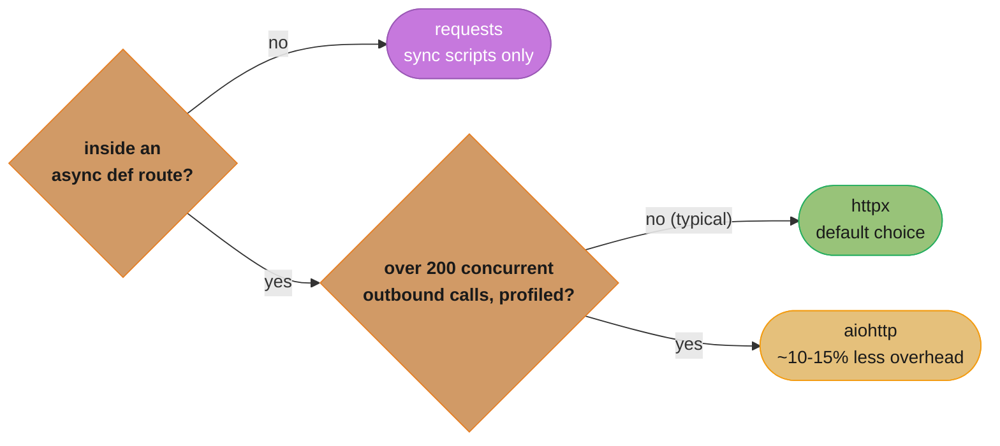
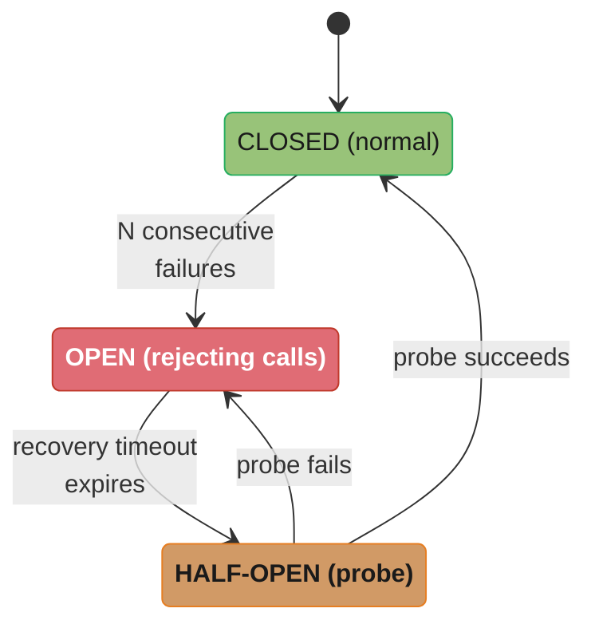
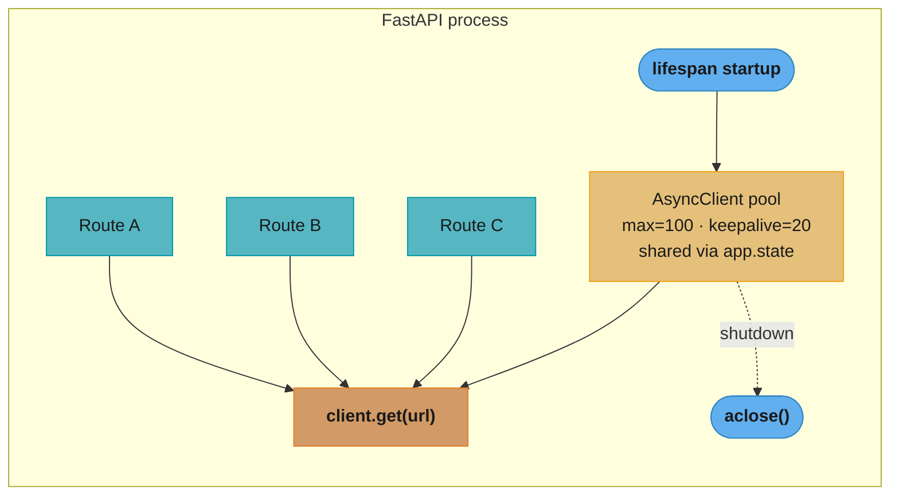
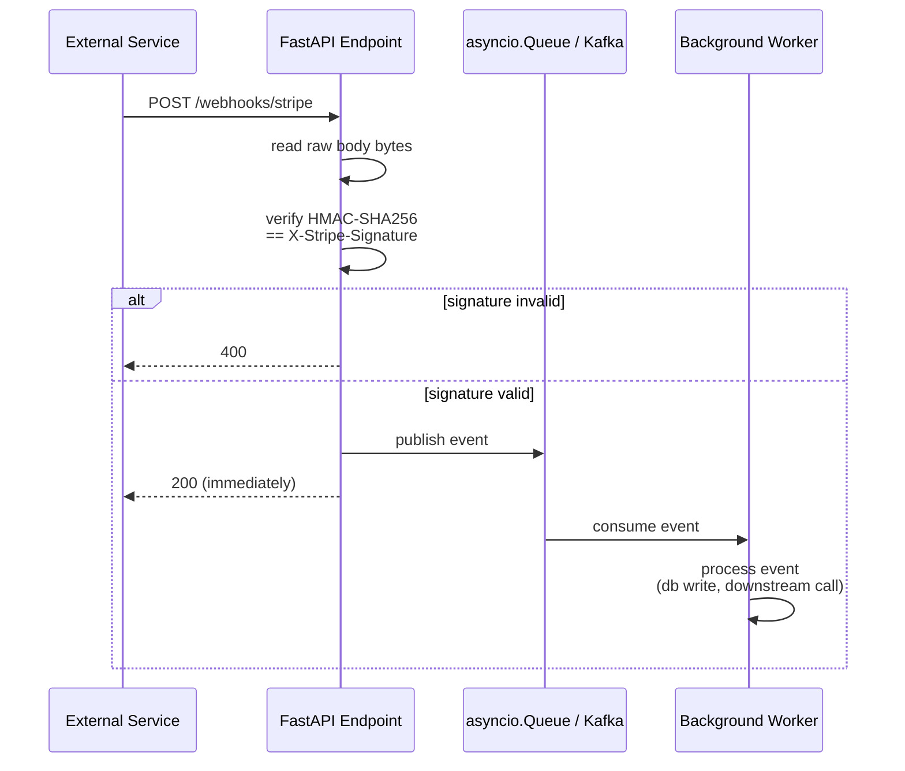
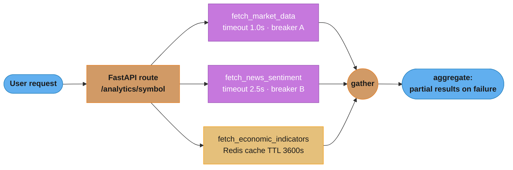

# HTTP Clients and External APIs

---

## 1. Concept Overview

Modern Python services rarely run in isolation. They call payment processors, third-party data
providers, internal microservices, LLM inference endpoints, and storage backends over HTTP.
The quality of that integration — whether it leaks sockets, retries intelligently, or collapses
under downstream latency — determines the production reliability of the entire system.

This module covers:

- `httpx` for synchronous and asynchronous HTTP, including HTTP/2
- `aiohttp` as the async-only alternative optimised for throughput at scale
- Lifespan-managed connection pools — the single most impactful correctness pattern
- Timeout budgets: connect, read, write, and pool-acquire timeouts
- Retry with exponential backoff, jitter, and `Retry-After` header handling
- Circuit breaker pattern: closed, open, half-open states
- Custom `httpx.Auth` for API key, Bearer token, and HMAC signing
- Webhook receipt: HMAC signature verification and async dispatch
- Testing: `respx` and `httpx.MockTransport`

Cross-cutting dependencies: [`../../async_patterns_and_pitfalls/README.md`](../../python/async_patterns_and_pitfalls/README.md)

---

## 2. Intuition

> Calling an external API is borrowing a resource you do not own: the remote server can be slow,
> wrong, or gone — and the network between you and it can fail silently.

**Mental model:** Think of your `httpx.AsyncClient` as a managed thread pool in Java. You create it
once at application start, share it across all requests, and shut it down cleanly when the process
exits. Creating a new client per HTTP call is equivalent to spawning a new OS thread per incoming
request: it works for one request, fails spectacularly at 500 concurrent.

**Why it matters:** In async Python, a mis-managed HTTP client has two failure modes: (1) socket
exhaustion — the OS runs out of file descriptors, (2) event-loop starvation — blocking I/O inside
an `async def` freezes every concurrent coroutine. Both are silent at low load and catastrophic at
peak.

**Key insight:** The retry decision tree is simple — retry on 5xx and connection errors (the remote
is broken), not on 4xx (your request is broken). Retrying a 400 or 401 wastes quota and never
succeeds. The one exception is 429 (rate limited): always retry, but honour the `Retry-After`
header.

---

## 3. Core Principles

1. **One client, many requests.** A single `httpx.AsyncClient` manages a connection pool. Share it
   for the lifetime of the application via FastAPI lifespan. Never create a client inside a route
   handler.

2. **Every timeout is a budget.** Connect timeout guards the TCP handshake. Read timeout guards
   server processing. Write timeout guards upload. Pool-acquire timeout guards saturation.
   Omitting any one of these allows an unlimited hang.

3. **Retry the right errors.** 5xx and network errors are transient and retryable. 4xx errors
   (except 429) are permanent client-side failures — retrying does not fix them.

4. **Back off with jitter.** Retrying all failed requests simultaneously (thundering herd) worsens
   the downstream outage. Add `random.uniform(0, 1)` jitter to spread retry waves.

5. **Fail fast with circuit breakers.** After `N` consecutive failures, stop calling the downstream
   for `T` seconds. This protects your service's thread/coroutine pool from being consumed by
   requests that will time out anyway.

6. **Verify webhook authenticity.** An unauthenticated webhook endpoint is an unauthenticated
   write path into your system. Always verify HMAC signatures before processing.

7. **Test with mock transports.** `respx` and `httpx.MockTransport` let you unit-test retry and
   timeout logic without a live server.

---

## 4. Types / Architectures / Strategies

### 4.1 Client Libraries Compared

| Library | Async | Sync | HTTP/2 | Connection pool | Use case |
|---------|-------|------|--------|-----------------|----------|
| `httpx` | Yes | Yes | Yes | Yes | Default choice: same API sync+async, HTTP/2, good ergonomics |
| `aiohttp` | Yes | No | No (1.x) | Yes | High-concurrency async workloads, slightly lower per-request overhead |
| `requests` | No | Yes | No | Yes | Legacy sync scripts, CLI tools, not for async FastAPI routes |

The three rows above collapse into one decision: pick by call site first, then by measured
throughput — never by preference alone.



`httpx` wins by default because of sync+async parity, HTTP/2, and native FastAPI/Starlette
integration; only move to `aiohttp` once profiling — not intuition — shows it is the bottleneck
(Section 8.1: ~18,000 rps vs ~15,500 rps at 500 concurrent fetches).

### 4.2 Timeout Strategies

**Conservative (external third parties):** `connect=3.0, read=30.0, write=10.0, pool=5.0`

**Aggressive (internal mesh services):** `connect=1.0, read=5.0, write=3.0, pool=2.0`

**Streaming responses (LLM inference):** `connect=3.0, read=None` — read timeout must be `None`
or set to the maximum expected streaming duration (e.g., 120s).

### 4.3 Retry Patterns

- **Fixed backoff:** `sleep(2)` between attempts. Simple, but thundering-herd risk.
- **Exponential backoff:** `sleep(2 ** attempt)`. Spreads retries but all clients still synchronise.
- **Exponential + full jitter:** `sleep(random.uniform(0, 2 ** attempt))`. Recommended default.
- **Decorrelated jitter (AWS style):** `sleep = min(cap, random.uniform(base, sleep * 3))`.
  Better distribution across retries than full jitter.

```mermaid
xychart-beta
    title "Retry delay by attempt (base=1s, cap=2^attempt)"
    x-axis ["attempt 0", "attempt 1", "attempt 2", "attempt 3", "attempt 4"]
    y-axis "delay (seconds)" 0 --> 16
    bar "plain exponential (synchronized spike)" [1, 2, 4, 8, 16]
    bar "full jitter (average wait)" [0.5, 1, 2, 4, 8]
```



Plain exponential backoff synchronises every failed client onto the same spike — at attempt 3
(cap 8s) all 1,000 retrying clients hit the downstream at once. Full jitter (`uniform(0, cap)`)
keeps the same ceiling but halves the average wait and spreads the 1,000 retries across the
full window instead, exactly the distinction Q7 asks about.

### 4.4 Circuit Breaker States



The half-open probe either closes the circuit on success or reopens it immediately with a reset recovery timer on failure — see the `CircuitBreaker` class in Section 6.4 for the exact implementation.

### 4.5 Authentication Patterns

| Pattern | httpx mechanism | Notes |
|---------|-----------------|-------|
| Static API key | `headers={"X-API-Key": key}` on client init | Simplest |
| Bearer token (static) | `httpx.Auth` subclass | Attach `Authorization: Bearer` |
| OAuth2 client credentials | `httpx.Auth` with token refresh | Refresh before expiry |
| HMAC-signed requests | Custom `httpx.Auth` | Add `X-Signature` header in `auth_flow` |
| AWS SigV4 | `httpx-auth` / `aws-requests-auth` | For AWS service calls |

---

## 5. Architecture Diagrams

### 5.1 Lifespan-Managed Client Pool



One `AsyncClient` is created at startup, shared via `app.state` across every route, and closed once at shutdown — the single-pool pattern from Section 6.2 that avoids the per-request socket exhaustion in Section 6.1.

### 5.2 Retry + Circuit Breaker Flow

```mermaid
flowchart LR
    classDef io      fill:#61afef,stroke:#2e86c1,color:#1a1a1a,font-weight:bold
    classDef frozen  fill:#c678dd,stroke:#9b59b6,color:#fff
    classDef train   fill:#98c379,stroke:#27ae60,color:#1a1a1a
    classDef mathOp  fill:#d19a66,stroke:#e67e22,color:#1a1a1a,font-weight:bold
    classDef lossN   fill:#e06c75,stroke:#c0392b,color:#fff,font-weight:bold
    classDef req     fill:#56b6c2,stroke:#0097a7,color:#1a1a1a
    classDef base    fill:#e5c07b,stroke:#f39c12,color:#1a1a1a

    request(["Incoming<br/>request"]) --> cb{"circuit<br/>open?"}
    cb -->|"yes"| reject(["reject 503<br/>immediately"])
    cb -->|"closed /<br/>half-open"| call["httpx.AsyncClient<br/>.get(url, timeout)"]

    call --> status{"response<br/>status?"}
    status -->|"200-299"| success(["return<br/>response"])
    status -->|"5xx / ConnectError"| retryCheck{"attempt<br/>less than max?"}
    status -->|"4xx not 429"| clientErr(["raise<br/>immediately"])
    status -->|"429"| rateLimited["read Retry-After,<br/>sleep"]

    retryCheck -->|"yes"| backoff["sleep(backoff<br/>+ jitter)"]
    retryCheck -->|"no"| exhausted(["record failure,<br/>raise"])

    backoff -.->|"retry"| call
    rateLimited -.->|"retry"| call

    class request io
    class cb,status,retryCheck,call,backoff,rateLimited mathOp
    class reject,clientErr,exhausted lossN
    class success train
```

The circuit breaker gates every call before a single retry is attempted; a 5xx or connection error loops back through backoff+jitter up to the attempt cap, a 429 always retries after honouring `Retry-After`, and any other 4xx raises immediately with no retry.

### 5.3 Webhook Processing Pipeline



Signature verification happens synchronously and the 200 is returned immediately after the event is queued — the background worker's processing time never adds to the webhook's response latency, which is what lets Stripe/GitHub-style senders retire the request quickly.

---

## 6. How It Works — Detailed Mechanics

### 6.1 BROKEN: Per-Request AsyncClient (Socket Exhaustion)

```python
# BROKEN: creating AsyncClient per-request — no connection reuse, socket exhaustion
# Each call opens a new TCP connection and immediately closes it.
# Under 200 rps this exhausts the OS file descriptor limit (~1024 by default).

from fastapi import FastAPI
import httpx

app = FastAPI()

@app.get("/data")
async def get_data():
    async with httpx.AsyncClient() as client:  # New pool per request
        resp = await client.get("https://api.example.com/data")
    return resp.json()
```

### 6.2 FIX: Lifespan-Managed Shared Client

```python
# FIX: shared client in lifespan — one pool, kept-alive connections, correct cleanup

from contextlib import asynccontextmanager
from fastapi import FastAPI, Request, Depends
import httpx

@asynccontextmanager
async def lifespan(app: FastAPI):
    app.state.http_client = httpx.AsyncClient(
        limits=httpx.Limits(
            max_connections=100,          # total open sockets
            max_keepalive_connections=20, # idle keep-alive sockets
            keepalive_expiry=5.0,         # seconds before idle socket closes
        ),
        timeout=httpx.Timeout(
            connect=3.0,   # TCP handshake
            read=30.0,     # server response body
            write=10.0,    # request body upload
            pool=5.0,      # wait for a free connection from the pool
        ),
    )
    yield
    await app.state.http_client.aclose()

app = FastAPI(lifespan=lifespan)

def get_http_client(request: Request) -> httpx.AsyncClient:
    return request.app.state.http_client

@app.get("/data")
async def get_data(client: httpx.AsyncClient = Depends(get_http_client)):
    resp = await client.get("https://api.example.com/data")
    resp.raise_for_status()
    return resp.json()
```

### 6.3 Retry with Exponential Backoff and Jitter

```python
import asyncio
import random
import httpx
from typing import Sequence

RETRYABLE_STATUS = frozenset({500, 502, 503, 504})

async def fetch_with_retry(
    client: httpx.AsyncClient,
    url: str,
    *,
    max_attempts: int = 3,
    base_delay: float = 1.0,
    max_delay: float = 30.0,
    retryable_status: frozenset[int] = RETRYABLE_STATUS,
) -> httpx.Response:
    last_exc: Exception | None = None

    for attempt in range(max_attempts):
        try:
            resp = await client.get(url)

            if resp.status_code == 429:
                retry_after = float(resp.headers.get("Retry-After", base_delay * (2 ** attempt)))
                await asyncio.sleep(retry_after)
                continue

            if resp.status_code in retryable_status:
                raise httpx.HTTPStatusError(
                    f"Server error {resp.status_code}", request=resp.request, response=resp
                )

            resp.raise_for_status()  # raise on 4xx (not retried)
            return resp

        except (httpx.ConnectError, httpx.ReadTimeout, httpx.HTTPStatusError) as exc:
            last_exc = exc
            if attempt == max_attempts - 1:
                break
            # Full jitter: uniform(0, min(cap, base * 2^attempt))
            cap = min(max_delay, base_delay * (2 ** attempt))
            sleep_for = random.uniform(0, cap)
            await asyncio.sleep(sleep_for)

    raise RuntimeError(f"All {max_attempts} attempts failed") from last_exc
```

### 6.4 Circuit Breaker (Manual Implementation)

```python
import asyncio
import time
from enum import Enum, auto
from dataclasses import dataclass, field

class State(Enum):
    CLOSED = auto()
    OPEN = auto()
    HALF_OPEN = auto()

@dataclass
class CircuitBreaker:
    failure_threshold: int = 5       # failures before opening
    recovery_timeout: float = 30.0   # seconds in OPEN before probing
    _state: State = field(default=State.CLOSED, init=False)
    _failure_count: int = field(default=0, init=False)
    _opened_at: float = field(default=0.0, init=False)

    def call_allowed(self) -> bool:
        if self._state == State.CLOSED:
            return True
        if self._state == State.OPEN:
            if time.monotonic() - self._opened_at >= self.recovery_timeout:
                self._state = State.HALF_OPEN
                return True
            return False
        return True  # HALF_OPEN: allow one probe

    def record_success(self) -> None:
        self._failure_count = 0
        self._state = State.CLOSED

    def record_failure(self) -> None:
        self._failure_count += 1
        if self._failure_count >= self.failure_threshold:
            self._state = State.OPEN
            self._opened_at = time.monotonic()

# Usage
breaker = CircuitBreaker(failure_threshold=5, recovery_timeout=30.0)

async def protected_call(client: httpx.AsyncClient, url: str) -> dict:
    if not breaker.call_allowed():
        raise RuntimeError("Circuit open — downstream unavailable")
    try:
        resp = await client.get(url, timeout=5.0)
        resp.raise_for_status()
        breaker.record_success()
        return resp.json()
    except (httpx.ConnectError, httpx.HTTPStatusError) as exc:
        breaker.record_failure()
        raise
```

### 6.5 Custom Auth — Bearer Token with Auto-Refresh

```python
import httpx
import time

class BearerTokenAuth(httpx.Auth):
    """Automatically refreshes token before expiry."""

    requires_request_body = False

    def __init__(self, token: str, expires_at: float) -> None:
        self._token = token
        self._expires_at = expires_at

    def _is_expired(self) -> bool:
        return time.time() >= self._expires_at - 30  # 30s safety margin

    async def _refresh(self) -> None:
        async with httpx.AsyncClient() as c:
            resp = await c.post(
                "https://auth.example.com/token",
                data={"grant_type": "client_credentials", "client_id": "...", "client_secret": "..."},
            )
            resp.raise_for_status()
            body = resp.json()
            self._token = body["access_token"]
            self._expires_at = time.time() + body["expires_in"]

    def auth_flow(self, request: httpx.Request):
        # httpx auth_flow is a sync generator for sync, async generator for async
        if self._is_expired():
            yield from self._async_refresh_flow(request)
        else:
            request.headers["Authorization"] = f"Bearer {self._token}"
            yield request

    async def async_auth_flow(self, request: httpx.Request):
        if self._is_expired():
            await self._refresh()
        request.headers["Authorization"] = f"Bearer {self._token}"
        yield request
```

### 6.6 Webhook HMAC Verification

```python
import hashlib
import hmac
from fastapi import FastAPI, Request, HTTPException
import asyncio

app = FastAPI()
WEBHOOK_SECRET = b"super-secret-key"  # load from environment in production

@app.post("/webhooks/stripe")
async def stripe_webhook(request: Request):
    raw_body = await request.body()
    sig_header = request.headers.get("X-Stripe-Signature", "")

    # Parse t= and v1= from "t=1614556800,v1=abc123"
    parts = dict(kv.split("=", 1) for kv in sig_header.split(",") if "=" in kv)
    timestamp = parts.get("t", "")
    received_sig = parts.get("v1", "")

    payload = f"{timestamp}.".encode() + raw_body
    expected = hmac.new(WEBHOOK_SECRET, payload, hashlib.sha256).hexdigest()

    if not hmac.compare_digest(expected, received_sig):
        raise HTTPException(status_code=400, detail="Invalid signature")

    # Dispatch to background processing; return 200 immediately
    asyncio.create_task(_process_event(raw_body))
    return {"status": "accepted"}

async def _process_event(body: bytes) -> None:
    # Parse and handle the event asynchronously
    import json
    event = json.loads(body)
    # ... handle event type
```

### 6.7 aiohttp for High-Concurrency Workloads

```python
import aiohttp
import asyncio

async def fetch_many(urls: list[str]) -> list[dict]:
    connector = aiohttp.TCPConnector(
        limit=100,              # max simultaneous connections
        limit_per_host=20,      # max per single host
        keepalive_timeout=30,
        enable_cleanup_closed=True,
    )
    timeout = aiohttp.ClientTimeout(total=30, connect=3, sock_read=25)

    async with aiohttp.ClientSession(connector=connector, timeout=timeout) as session:
        tasks = [session.get(url) for url in urls]
        responses = await asyncio.gather(*tasks, return_exceptions=True)
        results = []
        for resp in responses:
            if isinstance(resp, Exception):
                results.append({"error": str(resp)})
            else:
                async with resp:
                    results.append(await resp.json())
        return results
```

---

## 7. Real-World Examples

### 7.1 Stripe Payment Integration (per-call auth + idempotency)

Stripe's Python SDK wraps `httpx` under the hood in newer versions. Key patterns it enforces:
- Idempotency keys (`Idempotency-Key` header) on all `POST` requests — safe to retry without
  duplicate charges.
- Automatic retry on 500/503 with exponential backoff, max 2 retries.
- Read timeout of 80s to accommodate slow payment processor responses.
- Webhook signature verification with timestamp to prevent replay attacks (timestamps older
  than 5 minutes are rejected).

### 7.2 OpenAI API Streaming

OpenAI streaming responses use chunked transfer encoding. The correct `httpx` configuration:
- `timeout=httpx.Timeout(connect=5.0, read=None)` — `read=None` disables read timeout so the
  stream stays open for the full generation.
- Use `client.stream("POST", url, json=payload)` context manager.
- The `aiohttp` `ChunkedEncoding` response iterator performs ~15% better than `httpx` streaming
  at >50 concurrent streams due to lower per-chunk overhead.

### 7.3 Internal Service Mesh (Kubernetes)

Internal calls between FastAPI microservices inside a Kubernetes cluster:
- DNS resolution latency: 1-3ms (CoreDNS). Use `connect=1.0`.
- 99th percentile response time for read paths: <50ms. Use `read=5.0` with alerting at p99 >3s.
- Connection pool: `max_keepalive_connections=50` — HTTP/1.1 keep-alive prevents DNS+TCP overhead
  on every call. Connections reused across ~95% of requests.
- mTLS handled by Envoy sidecar; application layer uses plain HTTP.

### 7.4 GitHub Actions / Webhook Consumers (Idempotent Processing)

GitHub sends webhooks with `X-GitHub-Delivery` (unique UUID per event). Storing this UUID in a
Redis set (TTL 24h) and checking before processing ensures at-least-once delivery semantics are
converted to effectively-once via deduplication. GitHub retries failed webhooks up to 3 times
with increasing delays (30s, 120s, 3600s).

---

## 8. Tradeoffs

### 8.1 httpx vs aiohttp

| Dimension | httpx | aiohttp |
|-----------|-------|---------|
| Sync support | Yes | No |
| HTTP/2 | Yes | No (planned) |
| Throughput (async) | Good | ~10-15% better at >100 concurrent |
| Connection pool | `httpx.Limits` | `TCPConnector(limit=N)` |
| Testing | `respx`, `MockTransport` | `aioresponses` |
| HTTPX 1.0 stability | Stable | Stable |
| Ecosystem | Starlette, FastAPI native | Broader async ecosystem |

**Recommendation:** Use `httpx` as the default. Switch to `aiohttp` only if profiling shows
`httpx` is a bottleneck at >200 concurrent outbound connections per process.

### 8.2 tenacity vs Manual Retry

| | `tenacity` | Manual `asyncio.sleep` |
|-|-----------|----------------------|
| Features | Decorators, callbacks, statistics | Full control |
| Complexity | Low (3 lines) | Medium (20-30 lines) |
| `Retry-After` handling | Custom `wait` function needed | Straightforward |
| Async support | `AsyncRetrying` | Native |
| Observability | Built-in retry stats | Custom |

Use `tenacity` for standard retry patterns. Write manual retry when you need `Retry-After`
header handling or want to integrate retry counters with your metrics system directly.

### 8.3 pybreaker vs Manual Circuit Breaker

| | `pybreaker` | Manual |
|-|-------------|--------|
| State machine | Built-in | Must implement |
| Thread-safe | Yes | Requires `asyncio.Lock` in async |
| Per-host circuits | Not built-in | Easy to add |
| Observability hooks | Listeners | Custom |
| Dependency | External | None |

---

## 9. When to Use / When NOT to Use

### When to use httpx AsyncClient (lifespan-managed)

- Any async FastAPI route that calls an external HTTP API
- Microservice-to-microservice communication
- Webhook delivery (outbound) from your service
- Polling external data sources on a schedule

### When to use aiohttp

- High-concurrency crawlers (>500 concurrent HTTP calls per process)
- Services where you have profiling evidence that `httpx` overhead matters
- When you need fine-grained `TCPConnector` control (e.g., per-host limits)

### When to use requests (sync)

- CLI scripts, data pipelines, scripts running outside an async event loop
- Integration tests where async is unnecessary complexity
- Never inside an `async def` route — it blocks the event loop

### When NOT to create a new client per request

Never. Creating `httpx.AsyncClient()` inside a route handler or per-request function skips
connection pooling entirely. At 100 rps, each request opens and closes its own TCP connection,
consuming 100 file descriptors concurrently and spending 3-10ms on each TCP+TLS handshake.
The OS file descriptor limit (1024 by default on Linux) is exhausted in 10 seconds.

### When NOT to retry

- HTTP 400 Bad Request: your payload is malformed; retrying sends the same broken payload
- HTTP 401 Unauthorized: your credentials are wrong; retrying does not fix authentication
- HTTP 403 Forbidden: you lack permission; retrying does not grant it
- HTTP 404 Not Found: the resource does not exist; retrying does not create it
- HTTP 422 Unprocessable Entity: validation failed; retrying sends the same invalid data

---

## 10. Common Pitfalls

### Pitfall 1: BROKEN — No Timeout Specified

```python
# BROKEN: no timeout — a slow server hangs your coroutine indefinitely.
# Under load, 200 slow downstream calls consume 200 coroutine slots, starving the event loop.

async def fetch(client: httpx.AsyncClient, url: str) -> dict:
    resp = await client.get(url)  # No timeout — hangs forever
    return resp.json()
```

```python
# FIX: explicit per-call timeout (or set default on client creation)
async def fetch(client: httpx.AsyncClient, url: str) -> dict:
    resp = await client.get(
        url,
        timeout=httpx.Timeout(connect=3.0, read=30.0, write=10.0, pool=5.0),
    )
    resp.raise_for_status()
    return resp.json()
```

### Pitfall 2: BROKEN — Retrying 4xx Responses

```python
# BROKEN: treating all non-200 responses as retryable.
# Retrying a 400 wastes quota, delays the caller, and never succeeds.

async def fetch_retried(client: httpx.AsyncClient, url: str, body: dict) -> dict:
    for attempt in range(3):
        resp = await client.post(url, json=body)
        if resp.is_success:
            return resp.json()
        await asyncio.sleep(2 ** attempt)  # retries 400, 401, 403, 404 — pointless
    raise RuntimeError("Failed after 3 attempts")
```

```python
# FIX: only retry on 5xx and network errors; raise immediately on 4xx

async def fetch_retried(client: httpx.AsyncClient, url: str, body: dict) -> dict:
    RETRYABLE = frozenset({500, 502, 503, 504})
    for attempt in range(3):
        try:
            resp = await client.post(url, json=body)
        except (httpx.ConnectError, httpx.ReadTimeout):
            if attempt == 2:
                raise
            await asyncio.sleep(random.uniform(0, 2 ** attempt))
            continue

        if resp.status_code in RETRYABLE:
            if attempt == 2:
                resp.raise_for_status()
            await asyncio.sleep(random.uniform(0, 2 ** attempt))
            continue

        resp.raise_for_status()  # 4xx raises immediately — no retry
        return resp.json()

    raise RuntimeError("Unreachable")
```

### Pitfall 3: BROKEN — Ignoring Webhook Timestamp (Replay Attack)

```python
# BROKEN: verifying signature but not checking timestamp.
# An attacker who captures a valid webhook can replay it indefinitely.

@app.post("/webhooks/payment")
async def webhook(request: Request):
    body = await request.body()
    sig = request.headers.get("X-Signature")
    expected = hmac.new(SECRET, body, hashlib.sha256).hexdigest()
    if not hmac.compare_digest(expected, sig):
        raise HTTPException(400, "Bad signature")
    # No timestamp check — replay attack possible
    return {"ok": True}
```

```python
# FIX: reject events older than 5 minutes (300 seconds)

import time

@app.post("/webhooks/payment")
async def webhook(request: Request):
    body = await request.body()
    parts = dict(kv.split("=", 1) for kv in request.headers.get("X-Signature", "").split(","))
    timestamp = int(parts.get("t", "0"))
    if abs(time.time() - timestamp) > 300:
        raise HTTPException(400, "Stale webhook — possible replay")
    payload = f"{timestamp}.".encode() + body
    expected = hmac.new(SECRET, payload, hashlib.sha256).hexdigest()
    if not hmac.compare_digest(expected, parts.get("v1", "")):
        raise HTTPException(400, "Invalid signature")
    asyncio.create_task(_handle_event(body))
    return {"ok": True}
```

### Pitfall 4: aiohttp Session Created Outside Async Context

```python
# BROKEN: creating aiohttp.ClientSession at module level (outside event loop)
import aiohttp
session = aiohttp.ClientSession()  # RuntimeError: no running event loop

@app.get("/")
async def handler():
    async with session.get("https://...") as resp:
        return await resp.json()
```

```python
# FIX: create inside lifespan or inside the first async call
@asynccontextmanager
async def lifespan(app: FastAPI):
    app.state.session = aiohttp.ClientSession(
        connector=aiohttp.TCPConnector(limit=100),
        timeout=aiohttp.ClientTimeout(total=30),
    )
    yield
    await app.state.session.close()
```

---

## 11. Technologies & Tools

| Tool | Purpose | Async | Notes |
|------|---------|-------|-------|
| `httpx` | HTTP client | Yes + Sync | Default choice; HTTP/2; same API sync/async |
| `aiohttp` | Async HTTP client | Yes | Higher throughput at extreme concurrency |
| `requests` | Sync HTTP client | No | Legacy sync scripts only |
| `tenacity` | Retry library | Yes (`AsyncRetrying`) | Decorator-based, rich policy config |
| `pybreaker` | Circuit breaker | Partial | Sync-friendly; async requires wrapping |
| `respx` | Mock httpx in tests | Yes | Pattern-matching mock for httpx |
| `aioresponses` | Mock aiohttp in tests | Yes | aiohttp counterpart to `respx` |
| `httpx-auth` | Auth extensions | Yes | AWS SigV4, OAuth2, API key helpers |

---

## 12. Interview Questions with Answers

**Q1: Why is creating `httpx.AsyncClient()` inside a route handler a production bug, even if it seems to work in tests?**
Each instantiation creates a new connection pool with zero pre-warmed connections. At 100 rps,
every request incurs a full TCP + TLS handshake (~5-20ms) instead of reusing a keep-alive
connection (~0.1ms). At 200 rps the file descriptor limit (1024 by default) is exhausted —
`OSError: [Errno 24] Too many open files`. Tests pass because test throughput is low. Fix by
creating one shared client in the FastAPI `lifespan` context manager.

**Q2: What are the four timeout types in `httpx.Timeout` and what does each guard against?**
`connect` (default 5s) guards the TCP handshake and TLS negotiation. `read` (default 5s) guards
the time waiting for the server to send a response body. `write` guards the time sending the
request body (important for large uploads). `pool` guards the time waiting to acquire a free
connection from the pool when all `max_connections` slots are occupied. Omitting `pool` causes
indefinite blocking when the pool is saturated.

**Q3: What is the difference between `max_connections` and `max_keepalive_connections` in `httpx.Limits`?**
`max_connections` is the hard cap on total open sockets to all hosts combined. `max_keepalive_connections`
is the number of idle (keep-alive) connections held in the pool waiting for reuse. Once a request
completes, the socket is returned to the keep-alive pool up to this limit; excess sockets are closed.
Setting `max_keepalive_connections=20` with `max_connections=100` means up to 100 simultaneous
requests but only 20 idle sockets held open between requests.

**Q4: Which HTTP status codes should trigger a retry and which should not?**
Retry on: 500 (internal server error — transient), 502 (bad gateway — upstream restarting),
503 (service unavailable — overloaded or deploying), 504 (gateway timeout — upstream slow),
connection errors (`ConnectError`, `ReadTimeout`), and 429 (rate limited — but honour
`Retry-After` header). Do not retry on any other 4xx: 400 (bad request), 401 (auth failure),
403 (forbidden), 404 (not found), 422 (validation error) — these are permanent client-side failures
that will not succeed on retry.

**Q5: Explain the three states of a circuit breaker and the transition conditions.**
CLOSED (normal operation): all calls pass through, failures are counted. If failures reach the
threshold (e.g., 5 in a row), transition to OPEN. OPEN (fail fast): all calls are rejected
immediately without touching the downstream. After `recovery_timeout` seconds, transition to
HALF-OPEN. HALF-OPEN (probe): one call is allowed through. If it succeeds, reset to CLOSED and
clear failure count. If it fails, return to OPEN and reset the timer. The key design insight is
that OPEN protects your service's coroutine pool from being consumed by requests destined to
time out.

**Q6: How do you handle `Retry-After` headers for 429 responses in an async retry loop?**
Read `response.headers.get("Retry-After")`. The value is either a number of seconds
(`"120"`) or an HTTP-date string. Parse it, compute the sleep duration (cap it to your maximum
wait, e.g., 300s), and `await asyncio.sleep(duration)` before retrying. If the header is absent,
fall back to your standard exponential backoff. Do not retry more than 2-3 times on 429 — if
`Retry-After` specifies 3600s, fail the request rather than blocking a coroutine for an hour.

**Q7: What is full jitter and why is it preferred over a plain exponential backoff?**
Plain exponential backoff: `sleep(2 ** attempt)`. All clients that fail at the same instant
retry at the same intervals, creating a synchronised retry wave that may overwhelm a partially
recovered downstream (thundering herd). Full jitter: `sleep(random.uniform(0, min(cap, 2 ** attempt)))`.
Each client picks a random delay within the backoff window, spreading the retry load over time.
At 1000 clients retrying attempt=3 (cap=8s), plain backoff generates a spike at t=8s; full jitter
spreads those 1000 retries uniformly across [0, 8s].

**Q8: How do you test retry logic and timeout handling without a real server?**
Use `respx` for `httpx`. With `respx.mock` as a context manager, register routes with
`respx.get(url).mock(side_effect=[httpx.ConnectError(), httpx.Response(200)])` to simulate
a failure on attempt 1 and success on attempt 2. Verify that the retry function called the URL
exactly twice and returned the correct response. For timeout simulation, use
`httpx.MockTransport` with a custom `handle_async_request` that raises `httpx.ReadTimeout`.
This approach tests retry, backoff calculation, and circuit breaker state without any I/O.

**Q9: Why must HMAC webhook verification use `hmac.compare_digest` instead of `==`?**
String comparison with `==` in Python is short-circuit: it returns `False` as soon as the first
mismatching byte is found. The time taken is proportional to the length of the common prefix.
An attacker can measure response latency to determine how many leading bytes of their forged
signature match the expected value, enabling a timing attack to reconstruct the secret byte-by-byte.
`hmac.compare_digest` always compares all bytes in constant time regardless of where the first
mismatch occurs, preventing timing side-channel attacks.

**Q10: When would you choose aiohttp over httpx for a new service?**
Choose `aiohttp` when profiling shows HTTP client throughput is the bottleneck at >200 concurrent
outbound connections per process. `aiohttp` has ~10-15% lower per-request overhead because it
avoids `httpx`'s HTTP/2 negotiation path and has a more direct integration with the event loop's
`select`/`epoll` calls. Concrete signals: `aiohttp` benchmark at 500 concurrent fetches shows
~18,000 rps vs `httpx` ~15,500 rps on the same hardware. For most services (<100 concurrent
outbound calls), `httpx` is preferable because of its sync+async API parity, HTTP/2 support,
and first-class FastAPI/Starlette integration.

**Q11: How does HTTP/2 multiplexing change connection pool sizing compared to HTTP/1.1?**
HTTP/1.1 supports one in-flight request per connection; to achieve 100 concurrent requests you
need 100 connections. HTTP/2 multiplexes many streams over a single TCP connection; one connection
can carry hundreds of concurrent requests. With `httpx` and HTTP/2 enabled, you can reduce
`max_connections` significantly (10-20 instead of 100) while maintaining the same concurrency,
reducing both memory and OS file descriptor usage. The trade-off is that a TCP-level packet loss
event on that single connection stalls all multiplexed streams simultaneously (head-of-line blocking
at the TCP layer, which HTTP/3/QUIC addresses with per-stream loss recovery).

**Q12: What is the risk of calling `asyncio.create_task` inside a webhook handler and how do you mitigate it?**
`asyncio.create_task` schedules background work but does not track the task. If the task raises
an unhandled exception, it is silently discarded unless a `done_callback` or `asyncio.gather`
captures it. The task also disappears if the process shuts down mid-execution. Mitigations: (1)
store task references — `tasks: set[asyncio.Task] = set(); t = asyncio.create_task(fn()); tasks.add(t); t.add_done_callback(tasks.discard)`,
which prevents garbage collection and surfaces exceptions. (2) For durability, publish to a
persistent queue (Redis, Kafka) and process with a worker that acknowledges only after success.
This survives process restarts.

**Q13: Why does `httpx.Auth` require both a sync `auth_flow` and an `async_auth_flow` generator method?**
`httpx.AsyncClient` and the sync `httpx.Client` share the same `Auth` interface, and Python has no
single generator syntax that works correctly for both blocking and async token refresh. `auth_flow`
is a plain generator used by the sync client, while `async_auth_flow` is an async generator that
can `await` a coroutine (such as `self._refresh()`) before yielding the authenticated request. If
only `auth_flow` is defined, an `AsyncClient` falls back to it and any `await` inside token refresh
logic silently never runs. Implement `async_auth_flow` explicitly whenever the client is async and
the refresh call itself is a network request.

**Q14: Why does the webhook fix reject events whose timestamp is more than 300 seconds old, even though the HMAC signature is valid?**
A valid signature alone only proves the payload was not tampered with, not that it is being seen
for the first time. An attacker who captures one legitimate webhook request can replay the exact
same bytes indefinitely, and since the signature was computed over that unchanged payload it still
verifies. Binding the signature to a timestamp (`payload = f"{timestamp}."+ body`) and rejecting
anything outside a 300-second window means a captured request becomes unusable after five minutes,
bounding the attacker's replay window without requiring server-side request-id tracking.

**Q15: Why does creating `aiohttp.ClientSession()` at module import time raise `RuntimeError: no running event loop`?**
`aiohttp.ClientSession` binds internal resources to the currently running asyncio event loop at
construction time, and no event loop exists yet during module import. Uvicorn only starts the
event loop once the ASGI server begins running the application, which happens after all modules
have already been imported. Create the session inside the `lifespan` context manager, where the
event loop is guaranteed to be running, and store it on `app.state` for handlers to reuse.

**Q16: When does `tenacity` provide a clearer win over a hand-rolled retry loop?**
`tenacity` earns its dependency once retry policy needs to be composed declaratively across
several call sites rather than duplicated by hand in each one. Its `@retry(stop=..., wait=...)`
decorator combines stop conditions, wait strategies, and exception filters in one line, exposes
retry statistics via `.retry.statistics`, and supports async natively through `AsyncRetrying` —
all of which a bespoke `for` loop must reimplement manually. For a single call site with one
simple backoff rule, a manual loop is often easier to read; reach for `tenacity` once more than
two or three call sites need the same consistent policy.

---

## 13. Best Practices

1. **One `AsyncClient` per process, created in lifespan.** Set `max_connections=100`,
   `max_keepalive_connections=20`, `keepalive_expiry=5.0`.

2. **Always set all four timeout dimensions.** Recommended starting values for external APIs:
   `connect=3.0, read=30.0, write=10.0, pool=5.0`. Tune read timeout per API's documented p99.

3. **Retry only 5xx and network errors.** Never retry 4xx (except 429 with `Retry-After`).
   Cap retries at 3 attempts. Use full jitter: `random.uniform(0, min(30, 2 ** attempt))`.

4. **Use a circuit breaker for each distinct downstream.** Threshold 5 failures, recovery 30s.
   Expose circuit state via a `/health` endpoint for observability.

5. **Verify webhook signatures with `hmac.compare_digest`.** Always check the timestamp
   (reject events >300s old). Return 200 immediately and process asynchronously.

6. **Log every retry and circuit state transition.** Include: attempt number, URL, status code,
   sleep duration, circuit state. This is the primary debuggability surface for downstream issues.

7. **Set `httpx.Limits.keepalive_expiry` below the server's idle timeout.** Nginx default idle
   timeout is 75s. Set `keepalive_expiry=60.0` to ensure your client closes idle connections
   before the server does, avoiding `ConnectionResetError` on reuse.

8. **Inject `AsyncClient` via FastAPI `Depends`.** Never access `app.state` directly inside
   business logic — this makes testing require a real `app` object. The `Depends` pattern
   allows `dependency_overrides` in tests.

9. **Use `respx` for unit tests.** Register mock routes at the URL level, not the function level.
   Test the full retry path by returning errors on the first N responses.

10. **Monitor `httpx` pool metrics.** Instrument `limits.max_connections` utilisation with a
    Prometheus gauge. Alert if pool utilisation exceeds 80% — add workers or increase
    `max_connections` before saturation.

---

## 14. Case Study

### Resilient Third-Party Data Aggregator

**Scenario:** A financial analytics FastAPI service fetches data from three external providers
(market data, news sentiment, economic indicators) on every user request. Each provider has
different reliability characteristics: market data is fast (p99 = 80ms) but occasionally spikes
to 10s. News sentiment is slow (p99 = 2s). Economic data rarely changes and can be cached.

**Requirements:**
- Total response budget: 3 seconds
- Individual provider failure must not block the overall response
- Providers are rate-limited: market data 100 rps, news 20 rps

**Architecture:**



Three providers are fetched concurrently inside a 3-second response budget via `asyncio.gather(..., return_exceptions=True)`; market data and news sentiment each sit behind their own circuit breaker, while the rarely-changing economic indicators are served from a 3600s Redis cache.

**Implementation:**

```python
import asyncio
import random
import time
import hashlib
import hmac
from contextlib import asynccontextmanager
from dataclasses import dataclass, field
from enum import Enum, auto

import httpx
from fastapi import FastAPI, Request, Depends, HTTPException

# --- Circuit breaker ---

class CBState(Enum):
    CLOSED = auto()
    OPEN = auto()
    HALF_OPEN = auto()

@dataclass
class CircuitBreaker:
    name: str
    failure_threshold: int = 5
    recovery_timeout: float = 30.0
    _state: CBState = field(default=CBState.CLOSED, init=False)
    _failures: int = field(default=0, init=False)
    _opened_at: float = field(default=0.0, init=False)

    def allow(self) -> bool:
        if self._state == CBState.CLOSED:
            return True
        if self._state == CBState.OPEN:
            if time.monotonic() - self._opened_at >= self.recovery_timeout:
                self._state = CBState.HALF_OPEN
                return True
            return False
        return True

    def success(self) -> None:
        self._failures = 0
        self._state = CBState.CLOSED

    def failure(self) -> None:
        self._failures += 1
        if self._failures >= self.failure_threshold:
            self._state = CBState.OPEN
            self._opened_at = time.monotonic()

cb_market = CircuitBreaker("market-data")
cb_news = CircuitBreaker("news")

# --- Lifespan ---

@asynccontextmanager
async def lifespan(app: FastAPI):
    app.state.client = httpx.AsyncClient(
        limits=httpx.Limits(
            max_connections=100,
            max_keepalive_connections=20,
            keepalive_expiry=60.0,
        ),
        timeout=httpx.Timeout(connect=3.0, read=30.0, pool=5.0),
    )
    yield
    await app.state.client.aclose()

app = FastAPI(lifespan=lifespan)

def get_client(request: Request) -> httpx.AsyncClient:
    return request.app.state.client

# --- Provider fetch helpers with retry ---

RETRYABLE = frozenset({500, 502, 503, 504})

async def _fetch(
    client: httpx.AsyncClient,
    url: str,
    cb: CircuitBreaker,
    timeout: float,
    max_attempts: int = 3,
) -> dict | None:
    if not cb.allow():
        return None  # fast-fail, circuit open

    for attempt in range(max_attempts):
        try:
            resp = await client.get(url, timeout=httpx.Timeout(connect=3.0, read=timeout))
            if resp.status_code in RETRYABLE:
                raise httpx.HTTPStatusError("server error", request=resp.request, response=resp)
            resp.raise_for_status()
            cb.success()
            return resp.json()
        except (httpx.ConnectError, httpx.ReadTimeout, httpx.HTTPStatusError) as exc:
            cb.failure()
            if attempt == max_attempts - 1:
                return None
            await asyncio.sleep(random.uniform(0, min(8.0, 2.0 ** attempt)))
    return None

# --- Route ---

@app.get("/analytics/{symbol}")
async def get_analytics(
    symbol: str,
    client: httpx.AsyncClient = Depends(get_client),
) -> dict:
    market_task = asyncio.create_task(
        _fetch(client, f"https://market.example.com/quote/{symbol}", cb_market, timeout=1.0)
    )
    news_task = asyncio.create_task(
        _fetch(client, f"https://news.example.com/sentiment/{symbol}", cb_news, timeout=2.5)
    )

    results = await asyncio.gather(market_task, news_task, return_exceptions=True)

    market = results[0] if not isinstance(results[0], Exception) else None
    news = results[1] if not isinstance(results[1], Exception) else None

    if market is None and news is None:
        raise HTTPException(503, "All providers unavailable")

    return {
        "symbol": symbol,
        "market": market,
        "news": news,
        "partial": market is None or news is None,
    }
```

**Testing the circuit breaker and retry with respx:**

```python
import respx
import pytest
import httpx

@pytest.mark.anyio
async def test_retries_on_503_then_succeeds():
    cb = CircuitBreaker("test", failure_threshold=10)
    with respx.mock:
        route = respx.get("https://market.example.com/quote/AAPL")
        route.side_effect = [
            httpx.Response(503),
            httpx.Response(503),
            httpx.Response(200, json={"price": 185.0}),
        ]
        async with httpx.AsyncClient() as client:
            result = await _fetch(client, "https://market.example.com/quote/AAPL", cb, timeout=5.0)
        assert result == {"price": 185.0}
        assert route.call_count == 3

@pytest.mark.anyio
async def test_circuit_opens_after_threshold():
    cb = CircuitBreaker("test", failure_threshold=2)
    with respx.mock:
        respx.get("https://market.example.com/quote/AAPL").mock(return_value=httpx.Response(503))
        async with httpx.AsyncClient() as client:
            await _fetch(client, "https://market.example.com/quote/AAPL", cb, timeout=5.0, max_attempts=2)
        assert cb._state == CBState.OPEN
        # Next call should fast-fail without hitting the network
        result = await _fetch(client, "https://market.example.com/quote/AAPL", cb, timeout=5.0)
        assert result is None
```

**Discussion Questions:**

1. The route sets `return_exceptions=True` in `asyncio.gather`. What happens if you omit this flag
   and one provider raises an exception?

   Without `return_exceptions=True`, any exception in any gathered task cancels the others and
   re-raises in the calling coroutine. The user gets a 500 even if two of three providers returned
   data. Setting `return_exceptions=True` converts exceptions to values, enabling partial response
   logic.

2. How would you add request-level tracing (OpenTelemetry) to all outbound HTTP calls without
   modifying each `_fetch` call?

   Attach an `httpx.AsyncClient` with a custom `transport` that wraps the default transport and
   injects `traceparent` / `tracestate` headers from the current OTel span context. Alternatively,
   use the `opentelemetry-instrumentation-httpx` package which patches `AsyncClient.send` to create
   child spans automatically.

3. The economic indicators API is cached in Redis for 3600s. What cache invalidation strategy
   prevents a thundering herd when the TTL expires across thousands of pods simultaneously?

   Use probabilistic early expiry (also called jitter TTL): when the remaining TTL drops below
   `delta = 10s`, each cache read has a probability of `(10 - remaining_ttl) / 10` of treating the
   entry as expired and refreshing. This distributes refresh load across the 10s window before actual
   expiry rather than concentrating it at the expiry instant.
