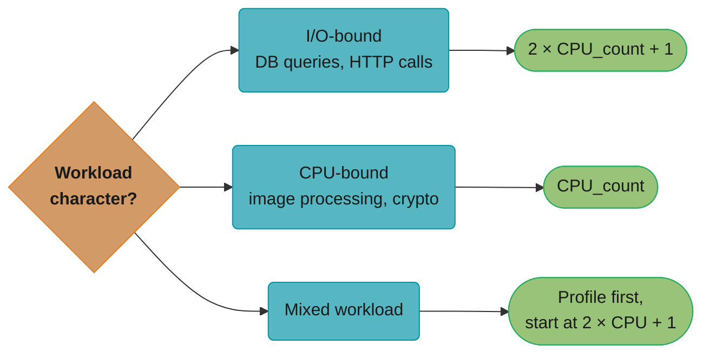
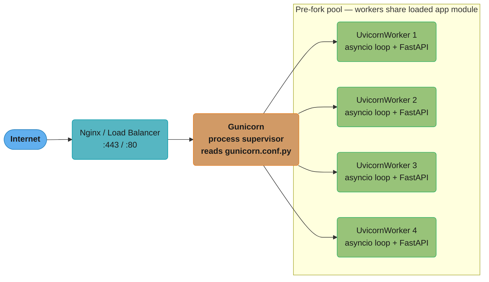
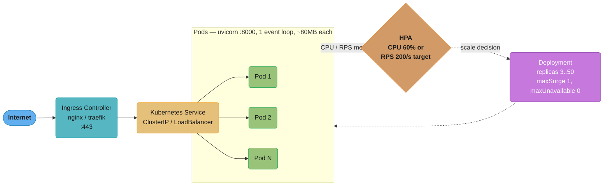
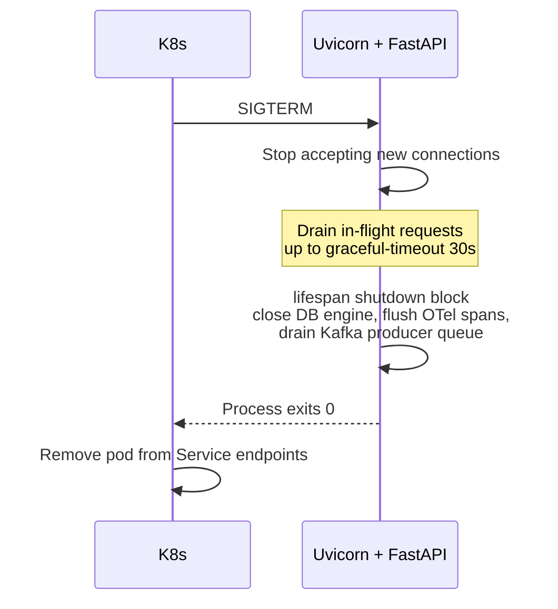
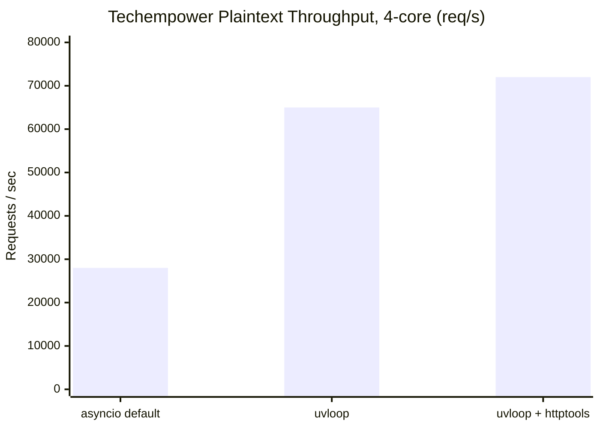
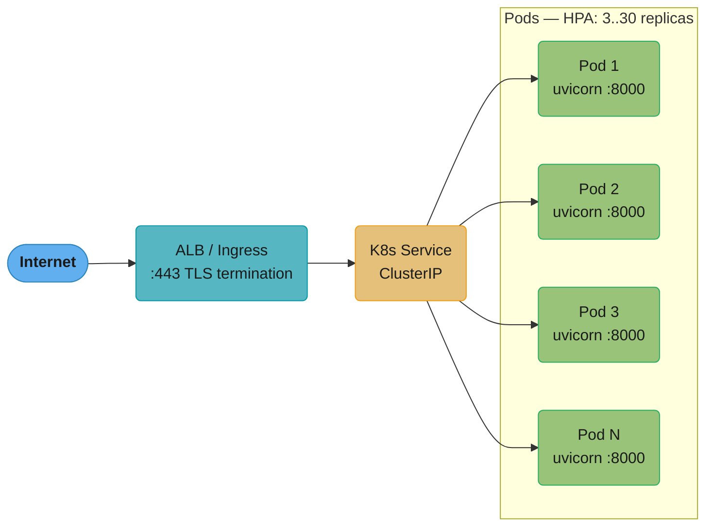

# Production Deployment and Scaling

---

## 1. Concept Overview

Running a FastAPI application locally with `uvicorn app.main:app --reload` works for
development, but production requires a different mental model: process supervision,
horizontal scaling, graceful lifecycle management, container packaging, and Kubernetes
orchestration. This module covers the entire path from a single Uvicorn process to a
production-grade deployment handling thousands of requests per second.

Core topics:

- **Gunicorn + Uvicorn worker model**: process supervision vs ASGI protocol handling
- **Worker sizing formulas**: CPU-bound vs I/O-bound workloads, memory budgeting
- **Graceful shutdown**: SIGTERM handling, `lifespan` cleanup, request draining
- **Container packaging**: multi-stage Dockerfile, non-root user, single-process per container
- **Kubernetes deployment**: Deployment, HPA, readiness/liveness/startup probes, `preStop` hooks
- **Zero-downtime strategies**: rolling updates, blue-green, canary with traffic splitting
- **ASGI performance tuning**: `uvloop`, connection limits, event loop blocking detection

Python baseline for this module: **3.11** (3.12 notes where applicable).

---

## 2. Intuition

> Gunicorn is the restaurant manager who keeps the right number of waiters (Uvicorn workers)
> on the floor and replaces anyone who collapses. Uvicorn is the waiter who understands the
> ASGI menu and serves each table concurrently without blocking.

**Mental model**: Think of deployment as two orthogonal concerns stacked on top of each
other. The _process layer_ (Gunicorn, systemd, Kubernetes Deployment) ensures the right
number of processes are alive and restarts them when they crash. The _protocol layer_
(Uvicorn, the ASGI event loop) handles HTTP/WebSocket protocol parsing, routes requests to
your FastAPI app, and manages concurrency inside a single process. You need both layers — but
not necessarily in the same container.

**Why it matters**: An improperly sized deployment wastes 60-80% of available CPU while
simultaneously dropping requests under load. Workers set too low leave CPU idle; workers set
too high cause memory pressure and GC pauses that increase tail latency. A process without
graceful shutdown drops in-flight requests during every deployment, causing user-visible
errors with no code change needed to reproduce them.

**Key insight**: In Kubernetes, process-level supervision (Gunicorn) and replica-level
supervision (Deployment controller) solve the same problem at different granularities. Running
Gunicorn inside a K8s pod creates invisible sub-processes that the Kubernetes scheduler cannot
see, measure, or route traffic to individually — defeating HPA scaling and making liveness
probes unreliable.

---

## 3. Core Principles

**1. Separate concerns by layer**
Process supervision, ASGI protocol, and application logic each belong to a distinct layer.
Never conflate them.

**2. Match worker count to workload character**
I/O-bound (DB queries, HTTP calls): `2 * CPU_count + 1`. CPU-bound (image processing,
crypto): `CPU_count`. Mixed: profile first, start with `2 * CPU + 1` and tune.



The worker-count formula branches on workload character: I/O-bound services double the CPU count (plus one) to keep the CPU busy while other workers wait on network/DB, CPU-bound services use the raw core count, and mixed workloads start from the I/O-bound formula and get tuned from a profile.

**3. Graceful shutdown is non-negotiable**
Every SIGTERM must drain in-flight requests, run `lifespan` cleanup (close DB pools, flush
metrics), and exit cleanly within `--graceful-timeout` (default 30s).

**4. Single process per container in Kubernetes**
K8s Deployment replicas replace Gunicorn's role in K8s environments. One Uvicorn process per
pod means HPA can measure CPU/RPS per unit of work (the pod) and scale with precision.

**5. Health probes must reflect real readiness**
`readinessProbe` must check that the app is ready to serve traffic (DB pool connected, caches
warm). `livenessProbe` must check that the process is not deadlocked. `startupProbe` grants
slow-starting apps sufficient time without triggering premature liveness restarts.

**6. Zero-downtime requires both application and infrastructure cooperation**
Rolling updates require `maxUnavailable=0`, `preStop` sleep to drain load-balancer connections,
and the app to return HTTP 200 on readiness before Kubernetes routes traffic.

---

## 4. Types / Architectures / Strategies

### 4.1 Process Model Variants

| Deployment Target | Recommended Stack | Notes |
|-------------------|-------------------|-------|
| Bare VM / systemd | Gunicorn + UvicornWorker | systemd provides restart on crash |
| Docker Compose (dev/staging) | Gunicorn + UvicornWorker OR single Uvicorn | Small scale; easy config |
| Kubernetes | Single Uvicorn per pod, HPA for replicas | K8s replaces Gunicorn supervision |
| Serverless (Lambda, Cloud Run) | Single Uvicorn via Mangum adapter | Cold start budget matters |
| Edge (Fly.io machines) | Single Uvicorn or Hypercorn | HTTP/3 where available |

### 4.2 Zero-Downtime Deployment Strategies

**Rolling Update** (default K8s strategy)
- Replace pods one at a time; some old, some new pods serve traffic simultaneously.
- `maxSurge=1, maxUnavailable=0`: new pod starts, passes readiness, old pod terminates.
- Risk: both versions handle traffic simultaneously — requires backward-compatible schemas.

**Blue-Green**
- Run two identical environments (blue=live, green=new). Switch load balancer in one atomic
  step. Rollback = switch back. Cost: 2x infrastructure during transition.

**Canary**
- Route a small percentage of traffic (1-5%) to the new version. Observe error rate and
  latency. Gradually shift weight. Best with Istio/Argo Rollouts traffic splitting.

### 4.3 Uvicorn Worker Class Options

| Worker Class | HTTP Version | Use Case |
|--------------|--------------|----------|
| `UvicornWorker` | HTTP/1.1 + WebSocket | Standard production choice |
| `UvicornH11Worker` | HTTP/1.1 only (h11 parser) | Stricter HTTP compliance, slower |
| Hypercorn worker | HTTP/1.1, HTTP/2, HTTP/3 | HTTP/2 push, QUIC experiments |

---

## 5. Architecture Diagrams

### 5.1 Bare-VM: Gunicorn + Uvicorn Workers



Gunicorn owns SIGTERM handling and respawns any crashed worker; each pre-forked `UvicornWorker` runs its own asyncio event loop and handles roughly 1,000 concurrent connections. Worker count follows `2 * nproc + 1`: a 4-core VM computes to 9 workers at ~80MB each, ~720MB total RAM.

### 5.2 Kubernetes: Single Uvicorn per Pod



Each pod also exposes `/healthz` (livenessProbe — is the process alive?), `/ready` (readinessProbe — is the app ready to serve?), and `/metrics` (Prometheus scrape). The HPA watches per-pod CPU/RPS and the Deployment controller adjusts replica count between 3 and 50 under a `maxSurge=1, maxUnavailable=0` rollout policy.

### 5.3 Graceful Shutdown Sequence



The shutdown handoff runs entirely between Kubernetes and the pod: SIGTERM stops new connections, in-flight requests drain for up to `--graceful-timeout` (30s), then FastAPI's `lifespan` shutdown block releases the DB engine, telemetry, and queue resources before the process exits and the pod leaves the Service endpoint list.

---

## 6. How It Works — Detailed Mechanics

### 6.1 Gunicorn + UvicornWorker Startup

```bash
# gunicorn.conf.py
import multiprocessing

# I/O-bound workload: 2*CPU+1
workers = 2 * multiprocessing.cpu_count() + 1
worker_class = "uvicorn.workers.UvicornWorker"
bind = "0.0.0.0:8000"
graceful_timeout = 30
timeout = 120          # hard kill after 120s if graceful drain stalls
keepalive = 5
preload_app = True     # load app once in master, fork to workers (saves ~50MB per worker)
                       # trade-off: app code runs before fork; thread-unsafe init causes issues
accesslog = "-"        # stdout
errorlog = "-"
loglevel = "info"
```

```bash
# Command-line equivalent (prefer gunicorn.conf.py in production)
gunicorn -w 9 -k uvicorn.workers.UvicornWorker \
    --bind 0.0.0.0:8000 \
    --graceful-timeout 30 \
    --timeout 120 \
    app.main:app
```

`preload_app=True` loads the FastAPI application in the master Gunicorn process before
forking workers. Each worker inherits a copy-on-write snapshot. This saves ~50-100MB RAM
per worker (the app module is not loaded N times) but means any connection (DB pool, Redis)
opened at import time is shared across the fork boundary — which corrupts most connection
pools. Always open connections inside `lifespan`, not at module level.

### 6.2 FastAPI Lifespan for Safe Resource Management

```python
# app/main.py
from contextlib import asynccontextmanager
from fastapi import FastAPI
from sqlalchemy.ext.asyncio import create_async_engine, AsyncSession, async_sessionmaker

engine: create_async_engine | None = None
session_factory: async_sessionmaker | None = None


@asynccontextmanager
async def lifespan(app: FastAPI):
    # --- startup ---
    global engine, session_factory
    engine = create_async_engine(
        "postgresql+asyncpg://user:pass@db/mydb",
        pool_size=10,
        max_overflow=20,
        pool_pre_ping=True,
    )
    session_factory = async_sessionmaker(engine, expire_on_commit=False)
    yield
    # --- shutdown (runs when SIGTERM drains) ---
    await engine.dispose()  # closes all pool connections cleanly


app = FastAPI(lifespan=lifespan)
```

With `preload_app=True`, this lifespan runs once per worker _after_ forking (because
`asynccontextmanager` executes in the async event loop, which is per-worker). The engine and
pool are created safely in each worker's isolated address space.

### 6.3 uvloop for 2-3x Throughput

```python
# app/main.py (bare uvicorn startup, not Gunicorn)
import uvloop
import asyncio

# Install uvloop as the default event loop policy BEFORE app startup
asyncio.set_event_loop_policy(uvloop.EventLoopPolicy())

# When using Gunicorn + UvicornWorker, pass loop="uvloop" in worker config:
# gunicorn.conf.py:
#   worker_class = "uvicorn.workers.UvicornWorker"
#   worker_connections = 1000
# uvicorn uses uvloop automatically when installed: pip install uvicorn[standard]
# "uvicorn[standard]" pulls in uvloop + httptools (faster HTTP parser)
```

**Benchmark numbers** (Techempower plaintext, 4-core):
- asyncio default loop: ~28,000 req/s
- uvloop: ~65,000 req/s (~2.3x)
- uvloop + httptools parser: ~72,000 req/s



uvloop delivers roughly 2.3x the throughput of the default asyncio loop on this benchmark; layering in the httptools HTTP parser adds another step to ~72k req/s, a 2.6x improvement over baseline with zero application code changes.

`uvloop` is a drop-in CPython `asyncio` replacement built on `libuv` (the C event loop
underneath Node.js). It outperforms the pure-Python `asyncio` loop on syscall-heavy I/O.
Install with `pip install uvicorn[standard]`; uvicorn auto-detects and uses it.

### 6.4 Kubernetes Deployment Manifest

```yaml
# k8s/deployment.yaml
apiVersion: apps/v1
kind: Deployment
metadata:
  name: fastapi-app
spec:
  replicas: 3
  selector:
    matchLabels:
      app: fastapi-app
  strategy:
    type: RollingUpdate
    rollingUpdate:
      maxSurge: 1        # one extra pod during rollout
      maxUnavailable: 0  # never remove a pod before replacement is ready
  template:
    metadata:
      labels:
        app: fastapi-app
    spec:
      terminationGracePeriodSeconds: 40  # must exceed preStop sleep + drain timeout
      containers:
        - name: app
          image: myregistry/fastapi-app:v1.2.3
          command: ["uvicorn", "app.main:app",
                    "--host", "0.0.0.0",
                    "--port", "8000",
                    "--workers", "1"]
          ports:
            - containerPort: 8000
          resources:
            requests:
              cpu: "250m"
              memory: "128Mi"
            limits:
              cpu: "1000m"
              memory: "512Mi"
          readinessProbe:
            httpGet:
              path: /ready
              port: 8000
            initialDelaySeconds: 5
            periodSeconds: 5
            failureThreshold: 3
          livenessProbe:
            httpGet:
              path: /healthz
              port: 8000
            initialDelaySeconds: 15
            periodSeconds: 10
            failureThreshold: 3
          startupProbe:          # prevents liveness from killing slow-starting pods
            httpGet:
              path: /healthz
              port: 8000
            failureThreshold: 30  # 30 * 10s = 5 minutes startup budget
            periodSeconds: 10
          lifecycle:
            preStop:
              exec:
                command: ["sleep", "5"]  # drain LB connections before SIGTERM
          envFrom:
            - configMapRef:
                name: fastapi-config
            - secretRef:
                name: fastapi-secrets
```

```python
# app/routes/health.py
from fastapi import APIRouter, HTTPException
from app.main import engine  # the SQLAlchemy engine from lifespan

router = APIRouter()


@router.get("/healthz")
async def liveness():
    """Kubernetes liveness probe: is the process alive and not deadlocked?"""
    return {"status": "ok"}


@router.get("/ready")
async def readiness():
    """Kubernetes readiness probe: is the app ready to serve traffic?
    Fails during startup (before lifespan completes) and during draining.
    """
    if engine is None:
        raise HTTPException(status_code=503, detail="DB pool not initialized")
    try:
        async with engine.connect() as conn:
            await conn.execute(text("SELECT 1"))
    except Exception as exc:
        raise HTTPException(status_code=503, detail=f"DB unreachable: {exc}")
    return {"status": "ready"}
```

### 6.5 Horizontal Pod Autoscaler

```yaml
# k8s/hpa.yaml
apiVersion: autoscaling/v2
kind: HorizontalPodAutoscaler
metadata:
  name: fastapi-hpa
spec:
  scaleTargetRef:
    apiVersion: apps/v1
    kind: Deployment
    name: fastapi-app
  minReplicas: 3
  maxReplicas: 50
  metrics:
    - type: Resource
      resource:
        name: cpu
        target:
          type: Utilization
          averageUtilization: 60   # scale up when average CPU > 60%
    - type: Pods
      pods:
        metric:
          name: http_requests_per_second   # custom metric via Prometheus adapter
        target:
          type: AverageValue
          averageValue: "200"              # scale up when avg RPS per pod > 200
  behavior:
    scaleUp:
      stabilizationWindowSeconds: 0       # react immediately on spike
      policies:
        - type: Pods
          value: 4
          periodSeconds: 60               # add up to 4 pods per minute
    scaleDown:
      stabilizationWindowSeconds: 300     # wait 5m before scaling down (prevents flapping)
```

### 6.6 Multi-Stage Dockerfile

```dockerfile
# --- Stage 1: dependency build ---
FROM python:3.11-slim AS builder

WORKDIR /build

# Install uv for fast dependency resolution
COPY --from=ghcr.io/astral-sh/uv:0.4.10 /uv /usr/local/bin/uv

COPY pyproject.toml uv.lock ./
# Install deps into /build/.venv, no system package pollution
RUN uv sync --frozen --no-dev --no-install-project

# --- Stage 2: runtime image ---
FROM python:3.11-slim AS runtime

# Non-root user: prevents container escape privilege escalation
RUN useradd --uid 1001 --create-home appuser
WORKDIR /app
USER appuser

# Copy only the virtualenv and app source — no build tools in runtime image
COPY --from=builder /build/.venv /app/.venv
COPY --chown=appuser:appuser app/ ./app/

ENV PATH="/app/.venv/bin:$PATH"
ENV PYTHONUNBUFFERED=1        # stdout/stderr unbuffered for container log capture
ENV PYTHONDONTWRITEBYTECODE=1 # no .pyc files in container

EXPOSE 8000

# Single process: K8s Deployment replicas handle horizontal scale
CMD ["uvicorn", "app.main:app",
     "--host", "0.0.0.0",
     "--port", "8000",
     "--workers", "1",
     "--loop", "uvloop"]
```

**Image size impact**: multi-stage build with `python:3.11-slim` base and uv produces a
~180MB image vs ~900MB with a naive `python:3.11` image. Smaller images reduce pull time
during K8s pod scheduling (critical during burst scale-out).

---

## 7. Real-World Examples

**Uber (Michelangelo serving layer)**: Python microservices run as single-process Uvicorn
pods behind an Envoy proxy. Gunicorn is absent — K8s HPA targets `p99_latency` via a custom
Prometheus metric adapter. Worker count inside each pod is 1; horizontal scaling handles
load. Graceful timeout is 60s to accommodate ML model inference that runs up to 45s.

**Stripe (Python API services)**: Multi-stage Docker images with non-root containers are a
hard requirement enforced by CI. `preStop: sleep 10` is standard because Stripe's Envoy
sidecars need 8-10s to drain existing long-poll connections before the pod is removed from
upstream. `startupProbe` is tuned per service based on cold-start benchmarks.

**Notion**: FastAPI services use `UvicornWorker` on bare VMs (their GPU inference nodes
which are outside K8s) and single-process Uvicorn inside K8s. The critical difference: bare
VMs use Gunicorn for crash recovery (systemd would also work); K8s pods use plain Uvicorn
because Kubernetes handles restarts via `restartPolicy: Always`.

**Pydantic (FastAPI ecosystem)**: The pydantic-ai server uses `uvicorn[standard]` which
auto-selects `uvloop` and `httptools`, achieving ~65k req/s plaintext on 4 cores versus
~28k with the default asyncio loop — a 2.3x improvement with zero code changes.

---

## 8. Tradeoffs

### 8.1 Gunicorn vs Single Uvicorn

| Dimension | Gunicorn + UvicornWorker | Single Uvicorn |
|-----------|--------------------------|----------------|
| Crash recovery | Automatic (master respawns workers) | Depends on supervisor (systemd/K8s) |
| Memory use | N * (base app memory) | 1 * (base app memory) |
| K8s HPA visibility | Opaque (N workers behind 1 IP) | Transparent (1 pod = 1 unit) |
| `preload_app` savings | ~50MB per worker saved | Not applicable |
| Startup complexity | gunicorn.conf.py needed | One `uvicorn` command |
| Graceful reload | `kill -HUP $MASTER_PID` | Pod rolling update |

### 8.2 Rolling Update vs Blue-Green vs Canary

| Strategy | Downtime | Rollback Speed | Infrastructure Cost | Risk |
|----------|----------|----------------|---------------------|------|
| Rolling | Zero (if maxUnavailable=0) | Slow (roll forward) | 1x + surge | Schema backward compat required |
| Blue-Green | Zero | Instant (LB switch) | 2x | Full traffic cut-over |
| Canary | Zero | Fast (shift weight to 0%) | 1.1x | Requires traffic splitting infra |

### 8.3 uvloop vs asyncio default

| Dimension | asyncio default | uvloop |
|-----------|----------------|--------|
| Throughput (plaintext) | ~28k req/s | ~65k req/s |
| Latency (p50) | ~1.2ms | ~0.5ms |
| Platform support | All CPython platforms | Linux/macOS (no Windows) |
| Installation | Built-in | `pip install uvloop` |
| Compatibility | Any asyncio code | Drop-in; rare edge cases with subprocess |

---

## 9. When to Use / When NOT to Use

### Use Gunicorn + UvicornWorker when:
- Deploying to bare VMs or Docker Compose without Kubernetes
- You need process-level crash recovery without external supervision
- Running 4+ CPU cores and want to exploit all of them within one host
- `preload_app=True` memory savings matter (large model loaded at startup)

### Use single Uvicorn per pod (K8s) when:
- Running in Kubernetes — always
- You want HPA to accurately measure per-unit CPU/memory
- You want liveness/readiness probes to reflect the process that handles requests
- You want K8s event logs to show individual worker crashes, not silent restarts

### Use rolling update when:
- Your database schema is backward compatible with the previous version
- You can tolerate brief mixed-version traffic during the rollout window
- Infrastructure cost is a constraint (rolling uses ~1x + surge)

### Do NOT use:
- `--reload` flag in production (inotify watch has non-trivial overhead; triggers full reload on any file change including temp files)
- `--workers > 1` inside a K8s container (defeats HPA visibility — see Pitfalls)
- `preload_app=True` with connection pools opened at module level (use `lifespan` instead)
- Blue-green when you cannot afford 2x infrastructure or your DB migration is destructive

---

## 10. Common Pitfalls

### Pitfall 1: Gunicorn inside Kubernetes (double supervision anti-pattern)

```python
# BROKEN: running Gunicorn inside K8s pod
# Dockerfile CMD:
#   CMD ["gunicorn", "-w", "4", "-k", "uvicorn.workers.UvicornWorker", "app.main:app"]
# K8s Deployment replicas: 3
#
# Result: 3 pods * 4 workers = 12 processes
# K8s HPA sees 3 pods, each at ~25% CPU (one worker busy) => HPA thinks load is fine
# HPA does NOT scale because it cannot see the 12 individual worker processes
# One pod crashes => K8s restarts the pod => all 4 workers restart => 4 in-flight requests dropped
# Probe hits pod IP => hits any one of the 4 workers => readiness is inaccurate

# FIX: single Uvicorn process per pod, let K8s HPA handle horizontal scaling
# Dockerfile CMD:
#   CMD ["uvicorn", "app.main:app", "--host", "0.0.0.0", "--port", "8000", "--workers", "1"]
# K8s Deployment replicas: 12  (HPA scales based on real per-pod CPU/RPS)
#
# Now: K8s HPA sees 12 pods at 25% CPU each => scales accurately
# One pod crashes => K8s restarts exactly that pod => 1 in-flight request dropped
# Probe hits pod IP => hits the single Uvicorn process => readiness is accurate
# Gunicorn is still appropriate on bare VMs or outside K8s
```

### Pitfall 2: Opening DB connections at module level with `preload_app=True`

```python
# BROKEN: DB connection opened at module import time
# When preload_app=True, this runs in the master Gunicorn process.
# After fork(), all workers share the same file descriptor for the connection.
# Multiple workers writing to the same socket causes corrupted responses.

from sqlalchemy.ext.asyncio import create_async_engine

engine = create_async_engine("postgresql+asyncpg://user:pass@db/mydb")  # <-- BROKEN

app = FastAPI()

@app.get("/users/{id}")
async def get_user(id: int):
    async with engine.connect() as conn:  # all workers share one pool => corruption
        ...
```

```python
# FIX: open connections inside lifespan, after fork
from contextlib import asynccontextmanager
from sqlalchemy.ext.asyncio import create_async_engine, AsyncEngine

_engine: AsyncEngine | None = None


@asynccontextmanager
async def lifespan(app: FastAPI):
    global _engine
    # This runs AFTER fork in each worker's event loop — safe
    _engine = create_async_engine(
        "postgresql+asyncpg://user:pass@db/mydb",
        pool_size=10,
    )
    yield
    if _engine:
        await _engine.dispose()


app = FastAPI(lifespan=lifespan)
```

### Pitfall 3: Missing `preStop` hook causes dropped requests during rolling update

Without a `preStop` hook, Kubernetes removes the pod from the Service endpoints and sends
SIGTERM simultaneously. Cloud load balancers (ALB, GKE LB) take 3-10 seconds to propagate
the endpoint removal. During this window, the LB continues routing traffic to a pod that has
already started shutting down — resulting in connection refused errors for clients.

```yaml
# BROKEN: no preStop hook
# lifecycle: {}   <-- missing

# FIX: sleep before SIGTERM to let LB drain
lifecycle:
  preStop:
    exec:
      command: ["sleep", "5"]   # 5s > typical LB propagation delay of 3-4s
# terminationGracePeriodSeconds must be > preStop sleep + graceful drain time
# If preStop=5s and drain=30s, set terminationGracePeriodSeconds=40
terminationGracePeriodSeconds: 40
```

### Pitfall 4: Liveness probe too aggressive — restarts healthy pods under load

```yaml
# BROKEN: liveness probe times out under high load, killing healthy pods
livenessProbe:
  httpGet:
    path: /healthz
    port: 8000
  initialDelaySeconds: 5
  periodSeconds: 5
  timeoutSeconds: 1     # 1s timeout during a CPU spike = false positive kill
  failureThreshold: 1   # one failure => restart => cascading pod restarts

# FIX: lenient liveness, strict readiness
livenessProbe:
  httpGet:
    path: /healthz
    port: 8000
  initialDelaySeconds: 15
  periodSeconds: 10
  timeoutSeconds: 5      # 5s timeout tolerates momentary load spikes
  failureThreshold: 3    # 3 consecutive failures = 30s of unresponsiveness before restart

readinessProbe:
  httpGet:
    path: /ready
    port: 8000
  initialDelaySeconds: 5
  periodSeconds: 5
  timeoutSeconds: 3
  failureThreshold: 2    # faster to remove from LB pool if DB is unreachable
```

---

## 11. Technologies & Tools

| Tool | Role | Key Config | Production Notes |
|------|------|------------|-----------------|
| Uvicorn | ASGI server | `--workers 1` in K8s, `--loop uvloop` | `uvicorn[standard]` adds uvloop + httptools |
| Gunicorn | Process supervisor | `workers=2*cpu+1`, `worker_class=UvicornWorker` | Use on bare VMs; skip in K8s |
| uvloop | High-perf event loop | `pip install uvloop`; auto-detected by uvicorn[standard] | Linux/macOS only; 2-3x throughput |
| Docker | Container packaging | Multi-stage, non-root, `PYTHONUNBUFFERED=1` | `python:3.11-slim` base = ~180MB image |
| Kubernetes Deployment | Replica management | `maxSurge=1, maxUnavailable=0` | Rolling update strategy |
| Kubernetes HPA | Autoscaling | CPU 60% target or custom RPS metric | Requires `metrics-server` or Prometheus adapter |
| Argo Rollouts | Advanced deployments | Canary weight, analysis templates | Requires Argo CD integration |
| Hypercorn | Alternative ASGI server | HTTP/2 + HTTP/3 support | Less mature than Uvicorn; use for H2 push |
| uv | Fast dependency management | `uv sync --frozen` in Dockerfile | 10-100x faster than pip for multi-stage builds |

---

## 12. Interview Questions with Answers

**Q1: Why should you NOT run Gunicorn inside a Kubernetes pod?**
Kubernetes cannot see individual Gunicorn worker processes — it only sees the pod IP. This means HPA scales based on the total pod CPU (which is the sum of all worker CPUs), not per-worker load, making scaling decisions inaccurate. Additionally, readiness and liveness probes hit whichever worker happens to respond, not a reliable single process. In K8s, use one Uvicorn process per pod and let the Deployment replica count plus HPA replace Gunicorn's role.

**Q2: What is the worker count formula for an I/O-bound FastAPI service, and why?**
`2 * CPU_count + 1`. The constant 2 accounts for the fact that I/O-bound workers spend most of their time waiting on network/DB — two workers per CPU core keep the CPU busy while others wait. The +1 covers scheduling jitter. For a 4-core machine: 9 workers. For CPU-bound work (image encoding, crypto): use `CPU_count` because adding more workers than cores causes context-switch overhead with no throughput gain.

**Q3: What does `preload_app=True` do in Gunicorn, and what is its risk?**
`preload_app=True` loads the FastAPI application module in the Gunicorn master process before forking workers. Each worker inherits a copy-on-write snapshot, saving ~50-100MB per worker. The risk: any file descriptor (DB connection, socket, file handle) opened at module level before the fork is shared across all workers after the fork. Multiple workers writing to the same socket corrupts data. Mitigation: always open DB connections, Redis clients, and similar resources inside `lifespan`, which runs after forking in each worker's own event loop.

**Q4: Describe the graceful shutdown sequence when Kubernetes sends SIGTERM to a Uvicorn pod.**
(1) `preStop` hook runs (e.g., `sleep 5`) to let the load balancer drain connections. (2) Kubernetes sends SIGTERM to the pod. (3) Uvicorn stops accepting new connections. (4) In-flight requests continue to process up to `--graceful-timeout` (default 30s). (5) FastAPI `lifespan` shutdown block executes: closes DB pool, flushes metrics, cleans up resources. (6) Process exits 0. The `terminationGracePeriodSeconds` on the pod must be greater than `preStop` duration + `graceful-timeout` or Kubernetes sends SIGKILL prematurely.

**Q5: What is the difference between `readinessProbe`, `livenessProbe`, and `startupProbe`?**
`livenessProbe` asks "is this process alive and not deadlocked?" — failure triggers a pod restart. `readinessProbe` asks "is this app ready to serve traffic?" — failure removes the pod from the Service endpoint list without restarting it. `startupProbe` grants the application an extended startup budget before liveness begins checking; it prevents liveness from killing a slow-starting pod (e.g., one that loads a large ML model at startup). Once `startupProbe` succeeds, it stops running and liveness takes over.

**Q6: How does `maxSurge=1, maxUnavailable=0` achieve zero-downtime rolling updates?**
`maxUnavailable=0` means Kubernetes will never terminate an old pod until its replacement is fully ready (passes readinessProbe). `maxSurge=1` allows one extra pod to exist during the rollout (temporarily running `replicas + 1` pods). The sequence: start new pod → wait for readiness → terminate one old pod → repeat. This ensures at least `replicas` pods are serving traffic at all times. The trade-off is a slightly slower rollout and one extra pod's worth of resources during the transition.

**Q7: What throughput improvement does uvloop provide, and how do you enable it?**
`uvloop` provides approximately 2-3x throughput improvement on I/O-heavy workloads. In benchmarks: ~28k req/s with the default asyncio event loop vs ~65k req/s with uvloop on a 4-core machine. Enable it with `pip install uvicorn[standard]`, which includes uvloop and httptools; Uvicorn auto-selects uvloop when available. For bare Python scripts: `asyncio.set_event_loop_policy(uvloop.EventLoopPolicy())`. Limitation: uvloop does not support Windows.

**Q8: What is the purpose of a multi-stage Dockerfile for a Python service?**
A multi-stage Dockerfile separates build-time dependencies (compilers, pip, uv, dev tools) from the runtime image. Stage 1 installs all dependencies and compiles any C extensions. Stage 2 starts from a fresh slim base image and copies only the virtual environment and application source. Result: runtime image contains no build tools, reducing attack surface and image size (typically 180MB vs 900MB). Smaller images reduce K8s pod scheduling time during scale-out events.

**Q9: Why should the container run as a non-root user?**
If an attacker achieves code execution inside the container, a root container maps to UID 0 on the host kernel, enabling potential container escape via kernel vulnerabilities. A non-root user (UID 1001) limits the blast radius: the attacker has no write access to system directories, cannot bind ports below 1024 (bind to 8000+), and cannot escalate privileges. Kubernetes `securityContext.runAsNonRoot: true` enforces this at the cluster level as a defense-in-depth measure.

**Q10: When should you choose blue-green deployment over a rolling update?**
Blue-green is preferable when: (1) your DB migration is destructive (column drop, type change) and you cannot run both old and new code against the same schema simultaneously; (2) you need instant rollback capability (LB switch is sub-second vs minutes for rolling); (3) your integration tests must run against a fully deployed environment before any user traffic is cut over. The cost is 2x infrastructure during the transition window. Rolling updates are preferable when schema changes are additive and infrastructure cost matters.

**Q11: How does HPA scale based on a custom RPS metric instead of CPU?**
Install the Prometheus adapter (`k8s-prometheus-adapter`), which queries Prometheus for a metric like `http_requests_per_second` scraped from your pods' `/metrics` endpoint. Configure the adapter to expose this as an `apiserver` custom metrics API. The HPA manifest references it under `metrics[].type: Pods` with `averageValue: "200"` — meaning scale up when average RPS per pod exceeds 200. This is more accurate than CPU for I/O-bound services where a DB slow query can spike RPS without increasing CPU.

**Q12: What is the `--workers 1` flag for in a K8s Uvicorn command, and what happens if you omit it?**
`--workers 1` instructs Uvicorn to run exactly one worker process per pod. If omitted, Uvicorn defaults to 1 worker, so the effect is the same — but the flag is explicit documentation of intent. If you pass `--workers 4`, Uvicorn forks 4 processes, recreating the double-supervision anti-pattern: K8s sees one pod IP but 4 processes serve traffic, HPA cannot measure individual worker load, and probes become unreliable. In K8s, keep `--workers 1` and control parallelism through replica count.

**Q13: How do ConfigMaps and Secrets differ in Kubernetes, and how do you inject them into FastAPI?**
`ConfigMap` stores non-sensitive key-value pairs (feature flags, log levels, service URLs). `Secret` stores sensitive data (DB passwords, API keys) encoded as base64 and optionally encrypted at rest with KMS. Both are injected into pods via `envFrom` (all keys as env vars) or `env[].valueFrom` (individual keys). In FastAPI, `pydantic-settings` reads env vars with `BaseSettings`, providing type validation and `.env` file fallback for local development. The app code never references ConfigMap or Secret names — it reads from environment variables, keeping it portable. See `../configuration_and_settings_management/README.md` for the full `BaseSettings` pattern.

---

## 13. Best Practices

**Worker sizing**
- Start with `2 * CPU + 1` for I/O-bound FastAPI services; benchmark under realistic load
- Set Kubernetes resource `requests` equal to one worker's steady-state CPU/memory; set `limits` at 4x requests to handle burst
- Target 60% average CPU utilization at HPA threshold — leaving 40% headroom for traffic spikes before new pods are ready (~60-90s for K8s to schedule, pull image, and pass readiness)

**Graceful lifecycle**
- Always use `lifespan` for resource init/cleanup; never open connections at module level
- Set `terminationGracePeriodSeconds` = `preStop` sleep + `graceful-timeout` + 5s safety margin
- `preStop: sleep 5` is the minimum; increase to 10s for services behind cloud LBs (ALB, GKE LB propagation can take 8s)
- Test graceful shutdown by running `kubectl delete pod <name>` during a load test and verifying zero 5xx errors

**Container packaging**
- Always multi-stage; always non-root user; always pin the Python base image tag (`python:3.11.9-slim` not `python:3.11-slim`)
- Set `PYTHONUNBUFFERED=1` so container log drivers capture stdout/stderr without buffering delays
- Use `uv sync --frozen` in CI to reproduce exact dependency versions from `uv.lock`

**Kubernetes deployment**
- `maxSurge=1, maxUnavailable=0` for zero-downtime rolling updates — never use `maxUnavailable=1` on stateful services
- Separate `livenessProbe` (lenient, 5s timeout, 3 failures) from `readinessProbe` (strict, 3s timeout, 2 failures)
- Always set `startupProbe` for services with >10s startup time (ML model loading, large cache warm-up)
- Set resource `requests` and `limits` on every container — unset `requests` makes the pod a BestEffort class, first to be evicted under node pressure

**Performance**
- Use `uvicorn[standard]` in production to get uvloop and httptools automatically
- Never use `--reload` in production; use K8s rolling updates for code changes
- Profile with `py-spy` or `austin` before over-provisioning workers; one blocking sync call in an async route negates all concurrency gains — see `../../async_patterns_and_pitfalls/README.md`

**Observability cross-cutting**
- Emit structured JSON logs with correlation IDs (`request_id`, `trace_id`) from every request; configure `accesslog` in Gunicorn to emit JSON — see `../observability_and_monitoring/README.md`
- Expose `/metrics` (Prometheus format) on a separate internal port to prevent metrics scraping from consuming request worker capacity

---

## 14. Case Study

**Scenario**: A FastAPI-based ML inference service that runs a scikit-learn model per request
is deployed on Kubernetes. It starts as 3 pods behind an ALB. Traffic grows from 50 req/s
to 800 req/s over 6 months. The team needs to get from "it works on my machine" to a
production deployment that scales to 800 req/s with zero-downtime rolling updates and
graceful shutdown.

### Architecture Diagram



Each pod runs `uvicorn app.main:app --workers 1 --loop uvloop` with `250m`/`256Mi` requests and `1000m`/`1Gi` limits, a `readinessProbe` on `/ready` (DB pool + model loaded), a `startupProbe` budget of 5 minutes (`30 * 10s`) for model load, and `preStop: sleep 5`. At 800 req/s (~5ms inference + ~2ms DB per request), 1,000 concurrent connections spread across 10 pods average 100 per pod — about 700ms of work per second per CPU (~70% utilization) — so the 60%-target HPA scales the deployment to roughly 12 pods.

### Implementation

```python
# app/main.py
from contextlib import asynccontextmanager
import pickle
from pathlib import Path

from fastapi import FastAPI
from sqlalchemy.ext.asyncio import create_async_engine, async_sessionmaker, AsyncEngine
from sklearn.pipeline import Pipeline  # type: ignore

from app.config import Settings

settings = Settings()

_engine: AsyncEngine | None = None
_session_factory = None
_model: Pipeline | None = None
_model_ready: bool = False


@asynccontextmanager
async def lifespan(app: FastAPI):
    global _engine, _session_factory, _model, _model_ready

    # Load ML model from disk (can take 2-8s for large models)
    model_path = Path(settings.model_path)
    with model_path.open("rb") as f:
        _model = pickle.load(f)
    _model_ready = True

    # Open DB pool after model loads (avoids holding DB connections during model load)
    _engine = create_async_engine(
        settings.database_url,
        pool_size=10,
        max_overflow=5,
        pool_pre_ping=True,
    )
    _session_factory = async_sessionmaker(_engine, expire_on_commit=False)

    yield  # application serves requests here

    # Shutdown: cleanup in reverse order
    _model_ready = False
    if _engine:
        await _engine.dispose()


app = FastAPI(lifespan=lifespan, title="ML Inference Service")
```

```python
# app/routes/health.py
from fastapi import APIRouter, HTTPException
from sqlalchemy import text
from app.main import _engine, _model_ready

router = APIRouter()


@router.get("/healthz")
async def liveness():
    # Minimal: just confirm the event loop is responsive
    return {"status": "ok"}


@router.get("/ready")
async def readiness():
    if not _model_ready:
        raise HTTPException(status_code=503, detail="model not loaded")
    if _engine is None:
        raise HTTPException(status_code=503, detail="db pool not ready")
    try:
        async with _engine.connect() as conn:
            await conn.execute(text("SELECT 1"))
    except Exception as exc:
        raise HTTPException(status_code=503, detail=f"db: {exc}")
    return {"status": "ready"}
```

```python
# app/routes/predict.py
import asyncio
from fastapi import APIRouter, Depends
from pydantic import BaseModel
import numpy as np
from app.main import _model

router = APIRouter()


class PredictRequest(BaseModel):
    features: list[float]


class PredictResponse(BaseModel):
    prediction: float
    model_version: str


# BROKEN: CPU-bound sklearn predict() called directly in async route
# Blocks the event loop for ~5ms per request.
# At 100 concurrent requests: 100 * 5ms = 500ms event loop stall.
# All other coroutines (health probes, log flushes) are blocked for 500ms.
@router.post("/predict_broken", response_model=PredictResponse)
async def predict_broken(req: PredictRequest) -> PredictResponse:
    arr = np.array(req.features).reshape(1, -1)
    result = _model.predict(arr)  # BROKEN: CPU-bound call blocks event loop
    return PredictResponse(prediction=float(result[0]), model_version="1.0")


# FIX: offload CPU-bound work to a thread pool via asyncio.to_thread()
# The event loop is free to serve other requests while sklearn runs in a thread.
@router.post("/predict", response_model=PredictResponse)
async def predict(req: PredictRequest) -> PredictResponse:
    arr = np.array(req.features).reshape(1, -1)
    # asyncio.to_thread() runs the sync function in the default ThreadPoolExecutor
    result = await asyncio.to_thread(_model.predict, arr)  # FIX: non-blocking
    return PredictResponse(prediction=float(result[0]), model_version="1.0")
```

### Kubernetes Manifests

```yaml
# k8s/deployment.yaml  (abbreviated — full version in §6.4)
spec:
  replicas: 3
  strategy:
    type: RollingUpdate
    rollingUpdate:
      maxSurge: 1
      maxUnavailable: 0
  template:
    spec:
      terminationGracePeriodSeconds: 45
      containers:
        - name: app
          command: ["uvicorn", "app.main:app",
                    "--host", "0.0.0.0", "--port", "8000",
                    "--workers", "1", "--loop", "uvloop"]
          startupProbe:
            httpGet: {path: /healthz, port: 8000}
            failureThreshold: 30   # 30 * 10s = 5 minutes for model load
            periodSeconds: 10
          lifecycle:
            preStop:
              exec:
                command: ["sleep", "5"]
```

### Discussion Questions

1. At what point would you add a second Uvicorn worker (or switch to Gunicorn) inside the pod rather than adding more pods via HPA? Consider model memory footprint, K8s scheduling latency, and inter-pod communication overhead.

2. The ML model is 2GB in RAM. With 12 pods, that is 24GB of model memory. How would you restructure the architecture to share the model across requests without duplicating it 12 times? (Hint: consider a dedicated model-server sidecar or a separate TorchServe/Triton deployment.)

3. Your `startupProbe` allows 5 minutes for model loading, but in practice the model loads in 8 seconds. What is the risk of the wide `failureThreshold`, and how would you tune it?

4. During a rolling update, 30% of requests return HTTP 502 for 10 seconds. What is the most likely cause, and which manifest change would fix it?

---

*Cross-references:*
- `../configuration_and_settings_management/README.md` — `BaseSettings`, ConfigMap/Secret injection
- `../observability_and_monitoring/README.md` — structured logging, Prometheus metrics, OpenTelemetry
- `../../async_patterns_and_pitfalls/README.md` — blocking-in-async detection, `asyncio.to_thread()`
- `../middleware_and_lifecycle/README.md` — `lifespan`, middleware ordering, BackgroundTasks
