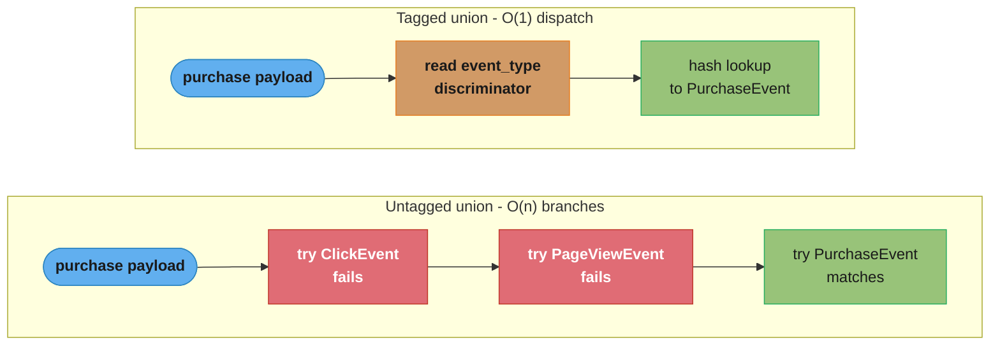
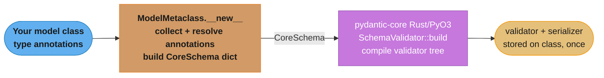
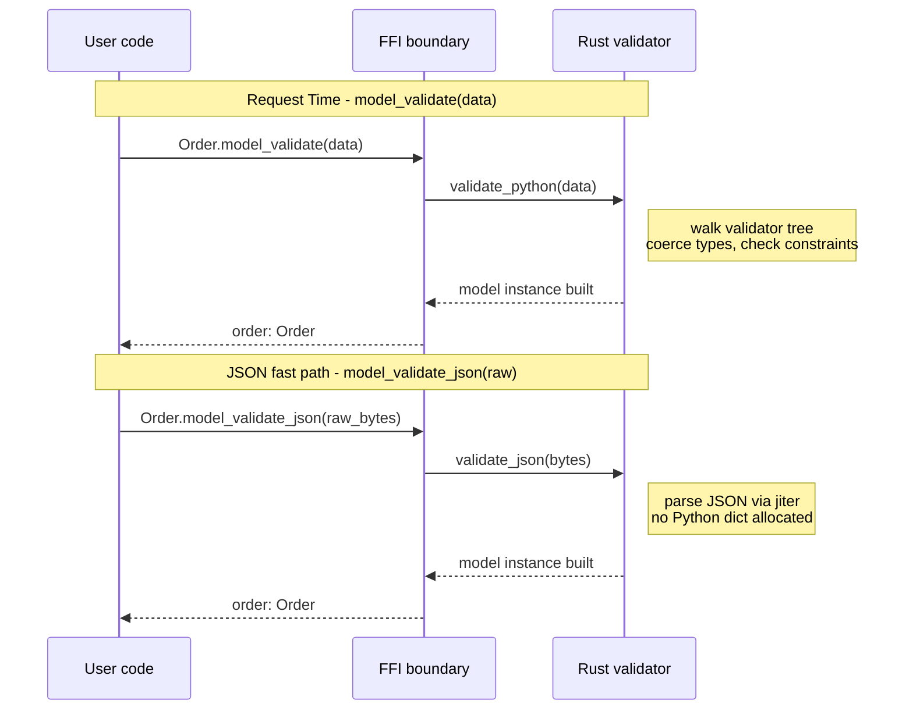
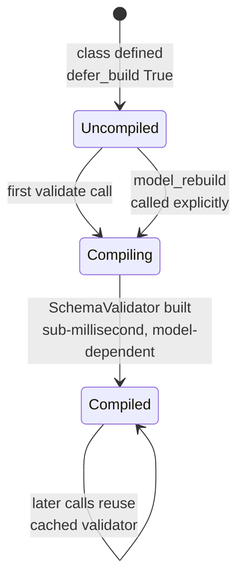

# pydantic-core and Pydantic v2 Performance

> Deep-dive sub-file for [`pydantic_v2_deep_dive/README.md`](README.md).
> Cross-links: [`../../the_type_system_and_typing/protocols_and_structural_typing.md`](../../python/the_type_system_and_typing/protocols_and_structural_typing.md) | [`../../asyncio_and_event_loop/README.md`](../../python/asyncio_and_event_loop/README.md)

---

## 1. Concept Overview

`pydantic-core` is the compiled Rust extension that powers every validation and serialization call in Pydantic v2. When you subclass `BaseModel`, Pydantic's Python metaclass converts your annotations into a `CoreSchema` — a data structure describing the shape of valid input. That `CoreSchema` is then handed to `pydantic-core`, which compiles it into a Rust validator tree. Every subsequent call to `model_validate()`, `model_validate_json()`, or `model_dump()` executes entirely inside Rust, with Python only involved for entering and leaving the call.

This architecture means the expensive schema-analysis work happens exactly once at class definition time (import time), and is amortized across potentially millions of validation calls. Measured on one machine (CPython 3.13.11, pydantic 1.10.26 vs 2.13.4), v2 runs a flat 3-field model ~2.7x faster than v1 and a model carrying a 20-key `dict` plus a 20-element `list` ~13x faster. Note the units before you budget with them: a single medium model validates in **microseconds**, so the win on one small request body is invisible at p99 — it only becomes milliseconds when a request validates hundreds or thousands of objects.

Key components:

- `pydantic-core` — Rust PyO3 extension; contains the validator, serializer, and JSON parser
- `CoreSchema` — Python-side intermediate representation (IR); describes the type tree
- `ModelMetaclass.__new__` — Python code that walks annotations and emits a `CoreSchema`
- `SchemaValidator` / `SchemaSerializer` — compiled Rust objects; one per class, reused forever
- `TypeAdapter` — thin Python wrapper that gives you validator/serializer access for non-`BaseModel` types

---

## 2. Intuition

> `pydantic-core` is a compiler back-end: Python writes the source code (your type annotations), the metaclass compiles it to IR (CoreSchema), and Rust JITs it into a native validator. Every request validation is a hot-loop execution in native code, not an interpreter walk.

**Key insight**: The class body you write is never the bottleneck. The bottleneck in v1 was that validation was a recursive Python function call for every field on every request. In v2, that recursion was moved into compiled Rust. The Python interpreter is involved only to cross the FFI boundary — one call in, one call back.

**Why it matters**: parsing cost is per-request, so it multiplies by throughput. A service handling 5 000 req/s that shaves 1 ms off body parsing recovers 5 CPU-seconds per wall-clock second — five cores. Realistically the saving from `model_validate_json()` over `model_validate(json.loads(...))` is microseconds per request, so the win only reaches core-scale on high-volume ingest paths; §4.4 does that arithmetic explicitly rather than asserting a core count.

---

## 3. Core Principles

1. **Schema built once, validated many times**: `CoreSchema` is computed at class definition time (metaclass `__new__`), not at validation time.
2. **Rust does the heavy lifting**: the innermost validation loop — type checking, coercion, constraint evaluation — runs in compiled Rust with no GIL re-acquisition per field.
3. **Direct JSON path is the fastest path**: `model_validate_json()` parses JSON and validates in a single Rust pass. `model_validate(json.loads(raw))` adds a Python-level JSON parse and a Python `dict` allocation before Rust ever sees the data.
4. **`model_construct()` is a semantics escape hatch, not a fast path**: it bypasses the Rust validator entirely, so it is the tool for data you own and have already validated — never for external input. It is not, on current Pydantic, faster (see §4.5).
5. **Discriminated unions enable O(1) dispatch**: tagged unions allow Rust to inspect one field and route to the correct sub-validator without attempting every branch.
6. **TypeAdapter avoids model overhead for primitives**: validating `list[int]` does not need a `BaseModel` subclass; `TypeAdapter(list[int]).validate_python(data)` is lighter.

---

## 4. Architecture: CoreSchema and the Rust Validator

### 4.1 CoreSchema as Intermediate Representation

`CoreSchema` is a Python `TypedDict` that describes a type tree. It is the contract between Pydantic's Python layer and the Rust engine. You rarely construct it manually, but understanding its structure explains every performance characteristic.

```python
# Internal representation — you do NOT write this; Pydantic generates it.
# Shown here to illustrate what ModelMetaclass builds from your annotations.

from pydantic_core import core_schema

# int field
id_schema = core_schema.int_schema()

# str field with constraints
name_schema = core_schema.str_schema(min_length=1, max_length=128)

# str | None: nullable wrapper around str
email_schema = core_schema.nullable_schema(core_schema.str_schema())

# Optionality is expressed by WRAPPING the field schema in a default, not by a
# `required=` flag — core_schema.model_field() takes no such argument.
email_field = core_schema.model_field(
    core_schema.with_default_schema(email_schema, default=None)
)

# The full model schema
user_schema = core_schema.model_schema(
    cls=User,
    schema=core_schema.model_fields_schema(
        fields={
            "id":    core_schema.model_field(id_schema),
            "name":  core_schema.model_field(name_schema),
            "email": email_field,
        }
    ),
)
```

When you write `class User(BaseModel)`, `ModelMetaclass.__new__` generates exactly this structure from your annotations. The structure is then passed to `pydantic_core.SchemaValidator(user_schema)`, which compiles it into a Rust validator object stored as `User.__pydantic_validator__`.

### 4.2 Class Definition Timeline

```
class User(BaseModel):          # 1. ModelMetaclass.__new__ called
    id: int                     # 2. Annotations collected
    name: str                   # 3. Field metadata extracted
    email: str | None = None    # 4. CoreSchema tree built in Python

# At this point (end of class body):
# - User.__pydantic_core_schema__  -> the CoreSchema dict
# - User.__pydantic_validator__    -> SchemaValidator (Rust object)
# - User.__pydantic_serializer__   -> SchemaSerializer (Rust object)
#
# These three objects are computed ONCE and live on the class forever.
```

The Rust `SchemaValidator` is not a Python object you interact with directly — it is a compiled opaque handle. When you call `User.model_validate(data)`, Pydantic calls `User.__pydantic_validator__.validate_python(data)` — a single FFI call.

### 4.3 Validator Dispatch for Nested Models

```python
from pydantic import BaseModel

class Address(BaseModel):
    street: str
    city: str
    zip_code: str

class Order(BaseModel):
    order_id: int
    amount: float
    shipping_address: Address   # nested model → nested SchemaValidator
```

`Order.__pydantic_validator__` contains a reference to `Address.__pydantic_validator__` inside the Rust tree. When `Order` is validated, the entire tree — including `Address` — is traversed inside Rust without returning to Python.

### 4.4 BROKEN vs FIX: JSON Parsing Path

```python
import json
from pydantic import BaseModel

class Event(BaseModel):
    id: int
    name: str
    payload: dict[str, str]
    tags: list[str]

raw_json_strings: list[bytes] = [...]  # 100 000 raw JSON bytes objects

# -----------------------------------------------------------------------
# BROKEN: two-step path — Python json.loads creates a dict,
# then Rust validates the dict. Two allocations per event.
# 100k events of ~800 B: ~800 ms (timeit, CPython 3.13, pydantic 2.13.4).
# -----------------------------------------------------------------------
for raw in raw_json_strings:
    event = Event.model_validate(json.loads(raw))   # json.loads in Python, dict → Rust

# -----------------------------------------------------------------------
# FIX: single Rust pass — pydantic-core's JSON parser reads the bytes,
# validates fields, and constructs the model in one operation.
# Same 100k events: ~430 ms — about 1.9x faster.
# The multiplier is roughly 2x across sizes; if anything it is HIGHER on
# small payloads (~2.1x at 73 B) than large ones (~1.7x at 2.3 KB), because
# the fixed Python dict allocation you avoid does not shrink with the body.
# -----------------------------------------------------------------------
for raw in raw_json_strings:
    event = Event.model_validate_json(raw)          # everything in Rust
```

The speedup from `model_validate_json` comes from two sources:
1. Pydantic-core parses JSON with **jiter**, its own Rust JSON parser (`pydantic/jiter`), tuned to Pydantic's needs rather than to producing generic Python objects.
2. The parsed JSON is never materialised as a Python `dict` — values are read directly from the JSON token stream into field slots.

**In plain terms.** "Two aggregate timings over the same 100 000 events divide down to a per-event price, and the difference between those two prices — 3.7 microseconds — is what one avoided Python `dict` allocation costs you."

Benchmark totals are unbudgetable; per-event costs are. Convert first, then decide whether the change is worth making.

| Symbol | What it is |
|--------|------------|
| `E` | Events in the benchmark — `100 000` at ~800 B each |
| `T_two` | Total for the two-step path (`json.loads` then validate), `800` ms |
| `T_one` | Total for the single Rust pass (`model_validate_json`), `430` ms |
| `T / E` | Per-event cost, in microseconds |
| `T_two / T_one` | The speedup multiplier the section claims |

**Walk one example.** The measured pair, reduced to a per-event price:

```
  two-step :  800 ms / 100 000 = 8.0 us per event
  one-pass :  430 ms / 100 000 = 4.3 us per event
  delta                          3.7 us saved per event
  speedup  :  800 / 430        = 1.86x
```

Push that per-event delta through a throughput target to see whether it is worth
a code change:

```
  ingest rate      CPU-seconds saved per wall-clock second   cores freed
     1 000 /s      1 000 x 3.7 us = 0.0037 s                 ~0.004
    50 000 /s     50 000 x 3.7 us = 0.185  s                 ~0.19
   500 000 /s    500 000 x 3.7 us = 1.85   s                 ~1.85
```

At 1 000 events/s the change buys back four thousandths of a core and is not worth
a migration on its own. At the 50 000 events/s of the Section 14 pipeline it is a
fifth of a core per worker; at half a million it is nearly two cores. This is the
number that decides whether "2x faster" is a headline or a rounding error — the
multiplier is roughly constant, but the money it represents scales entirely with
volume.

### 4.5 model_construct: Bypassing Validation

```python
from pydantic import BaseModel

class Measurement(BaseModel):
    sensor_id: int
    value: float
    unit: str

# model_validate: full Rust validation pass
m1 = Measurement.model_validate({"sensor_id": 1, "value": 23.5, "unit": "C"})

# model_construct: no validation, no coercion — direct attribute assignment.
# Use ONLY for internal, already-trusted data. NOTE: it is not a speed win —
# it is implemented in Python, so on pydantic 2.13.4 it measures SLOWER than the
# Rust validator: 1.01 us vs 0.54 us on this 3-field model, and 5.24 us vs
# 1.96 us on a 20-field one (timeit, CPython 3.13).
m2 = Measurement.model_construct(sensor_id=1, value=23.5, unit="C")

# PITFALL: model_construct does NOT coerce types — this silently stores a string:
m3 = Measurement.model_construct(sensor_id="not-an-int", value=23.5, unit="C")
# m3.sensor_id == "not-an-int"  — no error raised
```

Use `model_construct` only when:
- The data comes from a validated Pydantic model you already own (e.g., copying fields between models).
- You need to build an instance that would *fail* its own validators — a partially-populated fixture, a deliberately invalid test case, a round-trip of already-checked data.
- You have benchmarked it on your own model and it actually wins. On plain models it does not: `model_construct` runs in Python while `model_validate` runs in Rust, so skipping validation costs you time rather than saving it. It pays only when validation itself is expensive — heavy `@field_validator` callbacks, deep nesting, large collections.

Never use `model_construct` for data from HTTP requests, database rows, or message queues you do not control.

### 4.6 Tagged Unions for Fast Dispatch

Untagged unions cost you *every* branch. Pydantic v2's default union mode is **smart**: rather than stopping at the first branch that parses, it evaluates the candidates and picks the best match, so the price does not depend on where the right type sits in the union. Tagged (discriminated) unions let Rust inspect one field and jump directly to the correct sub-validator.

```python
from typing import Literal, Annotated
from pydantic import BaseModel, Field

class ClickEvent(BaseModel):
    event_type: Literal["click"]
    element_id: str
    x: int
    y: int

class PageViewEvent(BaseModel):
    event_type: Literal["page_view"]
    url: str
    referrer: str | None = None

class PurchaseEvent(BaseModel):
    event_type: Literal["purchase"]
    order_id: str
    amount: float
    currency: str

# BROKEN: untagged union — Rust evaluates every branch, not just up to the match.
# O(n) in number of union branches per validation, whatever the payload's type.
class EventEnvelopeUntagged(BaseModel):
    payload: ClickEvent | PageViewEvent | PurchaseEvent

# FIX: discriminated union — Rust reads event_type, routes directly to one validator.
# O(1) dispatch regardless of union size.
Event = Annotated[
    ClickEvent | PageViewEvent | PurchaseEvent,
    Field(discriminator="event_type"),
]

class EventEnvelope(BaseModel):
    payload: Event
```

The penalty grows with `n`. Measured on CPython 3.13 / pydantic 2.13.4, with branches of ten fields each:
`n=2` 1.2x, `n=3` 1.6x, `n=5` 2.5x, `n=10` 4.7x, `n=20` 9.2x. The tagged path stays flat at ~1.1–1.4 us
regardless of `n`; the untagged path grows linearly because every candidate branch builds and discards
partial validator state.



*Untagged unions evaluate every branch, not merely up to the match, so the cost is O(n) regardless of where the correct type sits (see Pitfall 4 in Section 10); a `Field(discriminator=...)` reads one field and jumps straight to the match, which is why the gap grows from 1.2x at two branches to 9.2x at twenty.*

---

## 5. Architecture Diagram



*Class Definition Time (once per class): annotations become a CoreSchema, and pydantic-core compiles it into a Rust validator/serializer pair stored on the class forever — the one-time cost that the per-call throughput gains from Section 1 are amortized against.*



*Request Time (per call, millions of times): every call crosses the FFI boundary once and returns; the JSON fast path follows the identical three-actor shape but skips the intermediate Python `dict` entirely, which is why `model_validate_json` measures roughly 2x faster than `model_validate(json.loads(...))` across payload sizes (Section 4.4).*

---

## 6. Detailed Mechanics

### 6.1 CoreSchema Types Reference

| CoreSchema type | Python annotation | Rust validator |
|----------------|-------------------|----------------|
| `int_schema()` | `int` | `IntValidator` — coerces str/float if not strict |
| `str_schema()` | `str` | `StringValidator` — UTF-8 check, min/max_length |
| `float_schema()` | `float` | `FloatValidator` — handles NaN/inf per config |
| `bool_schema()` | `bool` | `BoolValidator` — coerces 0/1/true/false strings |
| `list_schema(item)` | `list[T]` | `ListValidator` — iterates, validates each item |
| `dict_schema(k, v)` | `dict[K, V]` | `DictValidator` — iterates key-value pairs |
| `model_schema(cls, fields)` | `BaseModel` subclass | `ModelValidator` — dispatches per-field |
| `union_schema([...])` | `T1 \| T2 \| ...` | `UnionValidator` — tries branches in order |
| `tagged_union_schema(disc, choices)` | `Annotated[Union, Field(discriminator=...)]` | `TaggedUnionValidator` — O(1) dict lookup |
| `nullable_schema(inner)` | `T \| None` | `NullableValidator` — None check first |
| `literal_schema([...])` | `Literal["a", "b"]` | `LiteralValidator` — hash set membership |
| `dataclass_schema(cls, fields)` | `@dataclass` | `DataclassValidator` |

### 6.2 defer_build and Lazy Schema Compilation

By default, Pydantic compiles the CoreSchema and Rust validator at class definition time. For applications with hundreds of models where not all are used on every code path, `defer_build=True` defers compilation until the model is first used.

```python
from pydantic import BaseModel, ConfigDict

class HeavyModel(BaseModel):
    model_config = ConfigDict(defer_build=True)

    field_a: str
    field_b: list[dict[str, int]]
    # ... 50 more fields

# __pydantic_validator__ is NOT compiled yet — import of this module is fast.
# First call to model_validate() or model_validate_json() triggers compilation.
m = HeavyModel.model_validate({"field_a": "x", "field_b": []})
# Compilation happens here (once). Subsequent calls use the compiled validator.
```



*With `defer_build=True`, the class skips compilation at import time; the first `model_validate()` call — or an explicit `model_rebuild()` (the fix for the forward-reference pitfall in Section 10) — triggers the one-time build (measured ~0.3 ms for a 50-field flat model on CPython 3.13 / pydantic 2.13.4), after which every subsequent call reuses the cached validator.*

Use `defer_build=True` when:
- Your application has 200+ models at module level.
- Import time matters (Lambda cold starts, test collection time).
- Many models are never actually instantiated in a given process lifetime.

### 6.3 TypeAdapter for Non-Model Types

`TypeAdapter` exposes the same Rust validator for arbitrary type expressions without requiring a `BaseModel` subclass. It is the right tool for validating lists, dicts, scalars, or `Annotated` types at the boundary of your application.

```python
from pydantic import TypeAdapter
from typing import Annotated
from pydantic import Field

# Validate a list of ints
ta_ints = TypeAdapter(list[int])
result = ta_ints.validate_python(["1", "2", "3"])   # [1, 2, 3] after coercion
result_json = ta_ints.validate_json(b"[1, 2, 3]")   # direct Rust JSON path

# Validate with constraints via Annotated
PositiveFloat = Annotated[float, Field(gt=0.0)]
ta_price = TypeAdapter(PositiveFloat)
ta_price.validate_python(9.99)   # 9.99
ta_price.validate_python(-1.0)   # raises ValidationError

# TypeAdapter is cached — create once at module level, reuse
# Creating it is O(schema compilation); reusing it is O(validation).
```

The `TypeAdapter` approach is especially useful in:
- Background workers processing raw Kafka/SQS message bodies.
- CLI tools validating config files without a full model hierarchy.
- FastAPI `Depends` functions that validate query parameter collections.

### 6.4 Custom Validators and CoreSchema Interaction

`@field_validator` with `mode="before"` or `mode="after"` wraps the Rust validator with a Python callable. The Rust engine calls back into Python for each field that has a custom validator. This is a GIL-acquiring FFI round-trip — one per field per validation call — so minimise the number of `@field_validator` decorators on hot-path models.

```python
from pydantic import BaseModel, field_validator, model_validator
from typing import Self

class Invoice(BaseModel):
    invoice_id: str
    amount: float
    currency: str

    # mode="before": runs before Rust coercion; receives raw input.
    # Python FFI round-trip on every Invoice validation — keep it cheap.
    @field_validator("currency", mode="before")
    @classmethod
    def normalise_currency(cls, v: object) -> str:
        if isinstance(v, str):
            return v.upper()
        return v

    # mode="after": runs after Rust has validated and coerced all fields.
    # self is a fully populated Invoice instance.
    @model_validator(mode="after")
    def validate_amount_positive(self) -> Self:
        if self.amount <= 0:
            raise ValueError(f"amount must be positive, got {self.amount}")
        return self
```

For maximum throughput on a model that is validated millions of times, move constraints into `Annotated` types with `Field(gt=0)` instead of `@field_validator`. `Field` constraints are compiled into Rust and never call back to Python.

```python
from typing import Annotated
from pydantic import BaseModel, Field

# SLOWER: Python callback on every validation
class InvoiceSlow(BaseModel):
    amount: float

    @field_validator("amount", mode="after")
    @classmethod
    def check_positive(cls, v: float) -> float:
        if v <= 0:
            raise ValueError("must be positive")
        return v

# FASTER: constraint lives in Rust, no Python callback
PositiveAmount = Annotated[float, Field(gt=0.0, description="Invoice amount in major currency units")]

class InvoiceFast(BaseModel):
    amount: PositiveAmount
```

### 6.5 model_validator(mode="wrap"): Full CoreSchema Interception

`mode="wrap"` gives you access to the CoreSchema handler — the Rust callable. You can call it, skip it, or replace the result entirely. This is powerful but incurs a Python round-trip on every validation.

```python
from pydantic import BaseModel, model_validator
from pydantic_core import core_schema
from typing import Any, Callable

class AuditedModel(BaseModel):
    value: int
    _raw_input: dict[str, Any] = {}

    @model_validator(mode="wrap")
    @classmethod
    def capture_raw(
        cls,
        data: Any,
        handler: Callable[[Any], "AuditedModel"],
    ) -> "AuditedModel":
        # Store raw input before validation
        instance = handler(data)            # calls the Rust validator
        if isinstance(data, dict):
            object.__setattr__(instance, "_raw_input", dict(data))
        return instance
```

### 6.6 Memory: Model Instances vs Alternatives

Measured by RSS delta over 300 000 live instances of a 10-`int`-field container
(CPython 3.13.11, pydantic 2.13.4, macOS/arm64):

| Data container | Memory per instance (10 fields) | Validated on create | Hashable | Mutable |
|---------------|--------------------------------|---------------------|----------|---------|
| `BaseModel` (v2) | ~1 130 bytes | Yes (Rust) | No (default) / Yes (`frozen=True`) | Yes (default) |
| `BaseModel(frozen=True)` | ~1 100 bytes | Yes (Rust) | Yes | No |
| `dict` / `TypedDict` | ~256 bytes | No | No | Yes |
| `@dataclass` (stdlib) | ~144 bytes | No | No (default) | Yes |
| `NamedTuple` | ~110 bytes | No | Yes | No |
| `@dataclass(slots=True)` | ~96 bytes | No | No | Yes |

The gap is much wider than "a model is a dataclass with validation" suggests, and it is not the
validation that costs it. A `BaseModel` instance carries three separate objects: the instance
`__dict__` (~272 B for 10 keys), the instance itself (~72 B), and — the dominant term —
`__pydantic_fields_set__`, a real Python `set` of the field names that were explicitly provided,
which is **728 bytes on its own** for 10 entries. `model_construct()` does not help; it builds the
same set.

**What it means.** "Multiply bytes-per-instance by how many you hold live at once — that product, not the per-instance number, is what shows up as resident memory."

A 1 130-versus-96-byte difference reads as trivial until you attach a count to it. The table's units are bytes; production's units are how many you are holding when the GC looks.

| Symbol | What it is |
|--------|------------|
| `b` | Bytes per instance, from the table (~1 130 for `BaseModel`, ~96 slotted) |
| `L` | Live instances held simultaneously — not instances created, instances *retained* |
| `b x L` | Resident bytes attributable to the container choice |
| `R x d` | How `L` arises in a stream: ingest rate `R` times retention window `d` |

**Walk one example.** The same three containers at three live-set sizes:

```
   live set     BaseModel 1130B    dataclass 144B     slots 96B
     10 000        10.78 MB            1.37 MB          0.92 MB
    100 000       107.76 MB           13.73 MB          9.16 MB
  1 000 000     1 077.65 MB          137.33 MB         91.55 MB
```

At 10 000 live objects the whole argument is worth 9.9 MB and you should ignore
it. At a million it is 986 MB — the difference between fitting in a 1 GB
container and not fitting anywhere.

Now derive `L` rather than assuming it. The Section 14 pipeline ingests 50 000
events/s, so the live set is set entirely by how long each event is retained:

```
  L = R x d
  R = 50 000 /s, d = 1 ms   ->  L =     50 instances  ->    0.05 MB   ignore it
  R = 50 000 /s, d = 100 ms ->  L =  5 000 instances  ->    5.39 MB   ignore it
  R = 50 000 /s, d = 1 s    ->  L = 50 000 instances  ->   53.88 MB   noticeable
  R = 50 000 /s, d = 10 s   ->  L =    500 000        ->  538.83 MB   act on it
```

The lever is `d`, not `b`. A pipeline that validates and forwards immediately
holds 50 instances no matter which container it uses; one that batches for ten
seconds holds half a million. Shrinking the per-instance footprint is the second
thing to try — shortening the retention window is the first.

For high-throughput serialization pipelines where millions of model instances are created and discarded (e.g., event processing), prefer:
1. `model_validate_json()` + `model_dump_json()` to keep data in Rust as long as possible.
2. `model_construct()` when the data is internal and trusted *and* validation is genuinely expensive — not as a reflex optimisation.
3. `TypeAdapter` for list/dict types that don't need a model class at all.

### 6.7 Serialization: model_dump vs model_dump_json

```python
from pydantic import BaseModel

class Product(BaseModel):
    sku: str
    price: float
    in_stock: bool
    tags: list[str]

p = Product(sku="ABC-123", price=9.99, in_stock=True, tags=["sale", "electronics"])

# model_dump: returns a Python dict — useful if you need to further manipulate the data.
d = p.model_dump()              # Python dict, allocates a new dict object
d_json_compat = p.model_dump(mode="json")  # dict with JSON-serializable values (e.g., datetime → str)

# model_dump_json: returns a JSON `str` produced entirely in Rust.
# Avoids the intermediate Python dict; measured ~2.4x faster than
# json.dumps(p.model_dump()) on this 4-field model, ~2.8x on a 30-field one.
j = p.model_dump_json()         # '{"sku":"ABC-123","price":9.99,...}'  (str, not bytes)

# If you are building an HTTP response body, model_dump_json() is almost always correct.
# If you need to modify the dict before serializing (e.g., add a field), model_dump() first.
```

### 6.8 revalidate_instances

```python
from pydantic import BaseModel, ConfigDict

class Config(BaseModel):
    timeout_ms: int
    retries: int

class Client(BaseModel):
    # Default: if you pass a Config instance, Pydantic trusts it and does NOT
    # re-validate — the outer model simply stores the SAME object. Correct for
    # internal data flow.
    config: Config

class ConfigRevalidated(BaseModel):
    # The setting belongs on the model being REVALIDATED, not on its container.
    # Putting revalidate_instances on `Client` above would do nothing at all.
    model_config = ConfigDict(revalidate_instances="always")
    timeout_ms: int
    retries: int

class ClientStrict(BaseModel):
    # Every ConfigRevalidated instance passed in is re-validated through Rust.
    # Use when it can arrive from adapters that bypass validation.
    config: ConfigRevalidated
```

`revalidate_instances="always"` adds a full validation pass for every instance of *that* model passed into another model. Use it when your models travel through layers that might bypass validation — `model_construct`, ORM adapters that set attributes directly, YAML loaders.

---

## 7. Real-World Examples

### 7.1 FastAPI Request Parsing

FastAPI hands the raw request body to Pydantic rather than to `json.loads` first: for a `BaseModel`
body parameter with `Content-Type: application/json` it routes through the `validate_json` path, so
the HTTP bytes reach the Rust JSON parser without an intermediate Python `dict`. This is the single
most-executed instance of the §4.4 fast path in the ecosystem — you get it without asking.

### 7.2 Queue and Batch Deserialization

The natural fit for `TypeAdapter(list[Event]).validate_json(raw_bytes)` is a consumer reading
message batches straight off the wire: the payload is already bytes, the target type is a container
rather than a model, and there is no reason to materialise a Python list of dicts in between. This
is the one place where both optimisations in this file — the JSON path and `TypeAdapter` over a
wrapper `BaseModel` — apply to the same call.

### 7.3 Immutable Config Objects

`ConfigDict(frozen=True)` is the standard way to make a validated settings or experiment-config
object hashable, so it can be a dict key or set member — the deduplication trick that turns
"have I already run this configuration?" into a `set` membership test. The validator compiles once
at import; every later config comparison is a hash.

### 7.4 Settings Validation at Server Start

`pydantic-settings` (built on Pydantic v2) uses the same CoreSchema compilation path. A `Settings` model with 50 fields compiles its validator in well under a millisecond on a modern CPU (~0.7 ms measured for the equivalent plain `BaseModel`). This is the `defer_build=False` path — schema compilation happens at import time, so the first request sees no compilation overhead.

---

## 8. Tradeoffs

| Approach | Throughput | When correct | Risk |
|----------|-----------|-------------|------|
| `model_validate_json(raw)` | Highest | Parsing external JSON input (HTTP, queues) | None — this is the canonical path |
| `model_validate(dict)` | Medium | Data from ORM, in-process Python sources | Slightly slower due to Python dict allocation |
| `model_validate(json.loads(raw))` | Lower | Legacy code before v2 migration | ~2x slower than `validate_json`; migrate it |
| `model_construct(**kwargs)` | Lower than `model_validate` | Internal fan-out from an already-validated model; instances that must skip validators | Silent type mismatch if source has bugs |
| `TypeAdapter.validate_json(raw)` | Highest, no model overhead | Lists/dicts/scalars at API boundaries | No model-level methods (no `model_dump_json` on result) |
| `@field_validator` (Python) | Lower per field | Complex business logic | One Python FFI round-trip per decorated field per validation |
| `Annotated[T, Field(...)]` | Same as core | Structural constraints (gt, lt, regex) | Must be a declarable constraint, not arbitrary code |

---

## 9. When to Use / When NOT to Use

**Use `model_validate_json`** when:
- Parsing HTTP request bodies, Kafka/SQS messages, or any byte-stream JSON input.
- Throughput is a concern and payload size is > 200 bytes.

**Use `model_validate`** when:
- Data comes from an ORM (`from_attributes=True` mode), an in-process function call, or a Python dict you own.
- You are not starting from raw JSON bytes.

**Use `model_construct`** when:
- You are copying fields between two already-validated Pydantic models.
- You are in a tight loop reading from a trusted internal source (e.g., a pre-validated in-memory cache).
- Never for data from external systems.

**Use `TypeAdapter`** when:
- You need to validate a `list[T]`, `dict[str, T]`, or `Annotated` type without a `BaseModel`.
- You are writing a generic utility function that accepts arbitrary Pydantic-annotated types.

**Do NOT use `model_validate_json`** when:
- The data is not JSON (CSV, protobuf, YAML) — use the appropriate deserializer first, then `model_validate`.
- You need to apply Python-level preprocessing before validation — use `model_validate` after preprocessing.

**Do NOT use `model_construct`** for:
- Any data originating from HTTP, file I/O, database queries, message queues — always run through `model_validate`.

---

## 10. Common Pitfalls

### Pitfall 1: Recreating TypeAdapter in a Loop

```python
from pydantic import TypeAdapter

# BROKEN: TypeAdapter construction compiles the schema — do this in a loop and you
# pay schema compilation on every iteration. Measured ~21 us for TypeAdapter(list[int])
# and ~30 us for a list of a 5-field nested model (CPython 3.13, pydantic 2.13.4);
# a wide or deeply nested type costs proportionally more.
def process_batch(items: list[dict]) -> list[int]:
    ta = TypeAdapter(list[int])   # compiled fresh on every call — O(n compilations)
    return ta.validate_python(items)

# FIX: create TypeAdapter once at module level, reuse across calls.
_ta_int_list = TypeAdapter(list[int])

def process_batch_fast(items: list[dict]) -> list[int]:
    return _ta_int_list.validate_python(items)
```

The cost is not catastrophic — at 1 000 calls/s, ~21 us each is ~21 ms of CPU per second, about 2% of a core — but it is pure waste, and it scales with both call rate and type complexity. Under a fan-out that builds one adapter per item rather than per batch, the same mistake is 1 000x larger.

### Pitfall 2: Forward References Breaking defer_build

```python
from __future__ import annotations
from pydantic import BaseModel, ConfigDict

class Node(BaseModel):
    model_config = ConfigDict(defer_build=True)
    value: int
    children: list["Node"] = []

# With defer_build=True and a forward reference, Pydantic defers schema build.
# The first call to model_validate() resolves the reference and compiles.
# If "Node" is not yet defined in the module namespace at that point (circular import),
# this raises PydanticUserError: "Node" is not defined.
# FIX: call Node.model_rebuild() explicitly after all referenced types are defined.
Node.model_rebuild()
```

### Pitfall 3: model_construct Skipping Constraints

```python
from pydantic import BaseModel, Field
from typing import Annotated

PositiveInt = Annotated[int, Field(gt=0)]

class Record(BaseModel):
    count: PositiveInt

# This raises ValidationError — correct.
Record.model_validate({"count": -5})

# This silently stores -5 — no error. model_construct bypasses ALL validators.
r = Record.model_construct(count=-5)
print(r.count)   # -5  <-- invalid data stored silently
```

### Pitfall 4: Untagged Union Performance Degradation

For a union of 20 models, each with 10 fields, an untagged union evaluates all 20 — there is no early exit to hope for, because Pydantic's smart union mode is choosing the *best* match rather than the first one. That is O(n * fields) work on every validation, whatever type the payload actually is. Measured, this makes the untagged form ~9x slower than the discriminated one at 20 branches. Profile with `cProfile` if you see unexpected slowness in union-heavy models and add a discriminator field.

### Pitfall 5: revalidate_instances Set on the Wrong Model

`revalidate_instances` must be declared on the model that will be *revalidated*, not on the model that contains it. Declaring it on the outer container silently does nothing:

```python
# BROKEN: the setting is on the container, so nothing is revalidated.
class Client(BaseModel):
    model_config = ConfigDict(revalidate_instances="always")
    config: Config                       # Config still passes through untouched

# FIX: put it on Config itself.
class Config(BaseModel):
    model_config = ConfigDict(revalidate_instances="always")
    timeout_ms: Annotated[int, Field(gt=0)]
```

And note what the default actually does: with `revalidate_instances="never"`, the outer model stores the *same object* you passed in — `client.config is cfg` is `True` — so later mutations of `cfg` are visible through `client`. The risk is not staleness; it is that an instance built by `model_construct`, or mutated into an invalid state, is accepted without anyone checking it again.

### Pitfall 6: model_dump_json vs json.dumps(model.model_dump())

```python
import json
from pydantic import BaseModel
from datetime import datetime

class Event(BaseModel):
    ts: datetime
    name: str

e = Event(ts=datetime(2024, 1, 15, 12, 0, 0), name="deploy")

# BROKEN: model_dump() with a datetime returns a datetime object.
# json.dumps() will raise TypeError: Object of type datetime is not JSON serializable.
bad = json.dumps(e.model_dump())   # TypeError

# FIX option 1: model_dump_json() — Rust serializes datetime to ISO 8601 string.
good = e.model_dump_json()   # '{"ts":"2024-01-15T12:00:00","name":"deploy"}'  (a str)

# FIX option 2: model_dump(mode="json") if you need a Python dict with JSON-safe types.
d = e.model_dump(mode="json")   # {"ts": "2024-01-15T12:00:00", "name": "deploy"}
```

---

## 11. Technologies and Tools

| Tool / Library | Role | When to use |
|---------------|------|-------------|
| `pydantic-core` (Rust) | Validation/serialization engine | Automatic — used by every Pydantic v2 install |
| `pydantic-settings` | Settings from env vars / `.env` files | Application config, 12-factor apps |
| `pydantic[email]` | Email validation (`EmailStr`) | User-facing forms requiring RFC 5322 validation |
| `annotated-types` | Constraint metadata (`Gt`, `Lt`, `Len`) | Shared constraint types across models |
| `instructor` | Structured LLM outputs via Pydantic | Parsing LLM JSON responses into typed models |
| `FastAPI` | HTTP framework using Pydantic for I/O | REST APIs; calls `model_validate_json` internally |
| `SQLModel` | Combines SQLAlchemy + Pydantic v2 | ORM models that double as Pydantic schemas |
| `msgspec` | Alternative: faster for pure serialization | When you do NOT need custom validators; its maintainer's published benchmarks put it well ahead of Pydantic on pure encode/decode — benchmark on your own schema before switching |

---

## 12. Interview Questions with Answers

**Q: What is `pydantic-core` and what problem does it solve?**
**Short:** pydantic-core is a Rust extension that replaces Python's per-field validation loop with compiled native code.

`pydantic-core` is a Rust extension (compiled via PyO3) that implements Pydantic v2's validation and serialization engine. It solves the performance bottleneck of v1, where validation was a recursive Python function call per field per request. By moving the inner loop to compiled Rust, v2 measured 2.7x faster than v1.10 on a flat 3-field model and ~13x faster on a collection-heavy one (CPython 3.13, timeit). The schema is compiled once at class definition time; subsequent validations are FFI calls into the Rust engine with no Python interpreter involvement per field.

**Q: What is a CoreSchema and when is it built?**
**Short:** CoreSchema is a type-tree description built once at class definition time, then compiled into a Rust validator.

`CoreSchema` is a Python `TypedDict` that describes a type tree — it is the intermediate representation between your Python type annotations and the Rust validator. It is built by `ModelMetaclass.__new__` at class definition time (i.e., when Python executes the `class` statement), not at validation time. Once built, it is passed to `pydantic_core.SchemaValidator`, which compiles it into a Rust object stored as `__pydantic_validator__` on the class.

**Q: Why is `model_validate_json(raw_bytes)` faster than `model_validate(json.loads(raw_bytes))`?**
**Short:** model_validate_json uses a Rust JSON parser and skips the intermediate Python dict allocation entirely.

Two reasons: (1) `model_validate_json` uses pydantic-core's built-in Rust JSON parser, **jiter**, instead of CPython's `json.loads`. (2) The parsed values are never materialised as a Python `dict` — they flow directly from the JSON token stream into the Rust field validators and then into the model instance. The two-step path allocates a Python `dict` and then copies every value through the FFI boundary a second time. The speedup is approximately 2x for large payloads and 30–40% for small ones.

**Q: When should you use `model_construct()` and what are the risks?**
**Short:** model_construct() skips validation entirely and can silently store invalid data, so use it only for trusted input.

Use `model_construct()` only for data you already own and have validated, or to build an instance that must skip its own validators. Reach for it for its semantics, not its speed: it bypasses the Rust validator and assigns attributes in Python, which on pydantic 2.13.4 measures *slower* than `model_validate` on ordinary models (1.01 us vs 0.54 us on a 3-field model). The risk is silent data corruption: `model_construct(count=-5)` on a model with `Annotated[int, Field(gt=0)]` will store `-5` without raising any error. Never use it for external input.

**Q: What is a discriminated union and why does it matter for performance?**
**Short:** A discriminated union's literal tag lets Rust jump to the right branch in O(1) instead of trying every branch.

A discriminated (tagged) union specifies a literal-typed field (`Literal["click"]`, `Literal["purchase"]`, etc.) as a discriminator. The Rust `TaggedUnionValidator` reads that one field and performs an O(1) hash-map lookup to the correct sub-validator. An untagged union under Pydantic's default **smart** mode evaluates every branch and picks the best match — O(n) in the number of branches, and the cost does not depend on where the matching branch sits. Measured with ten-field branches, the discriminated form is ~1.2x faster at two branches, ~4.7x at ten, and ~9.2x at twenty.

**Q: What does `TypeAdapter` do and when do you prefer it over `BaseModel`?**
**Short:** TypeAdapter compiles a Rust validator for any type expression without requiring a full BaseModel subclass.

`TypeAdapter` wraps the CoreSchema compiler and Rust validator for any type expression — not just `BaseModel` subclasses. Use it for validating `list[T]`, `dict[str, T]`, or `Annotated` types at application boundaries. It avoids the overhead of defining a wrapper `BaseModel` and is slightly lighter in memory. Always create `TypeAdapter` instances at module level — construction triggers schema compilation (tens of microseconds for simple types, more for wide or deeply nested ones); reuse pays validation cost only.

**Q: How do `@field_validator` and `Annotated[T, Field(...)]` differ in performance?**
**Short:** Field constraints run entirely in Rust, while field_validator crosses into Python once per validation call.

`Field(gt=0, lt=100)` constraints are compiled into the Rust `SchemaValidator` — they execute entirely in Rust with no Python round-trip. `@field_validator` decorates a Python callable; the Rust engine calls back into Python (acquiring the GIL) once per decorated field per validation call. For hot-path models validated millions of times, moving structural constraints from `@field_validator` to `Annotated` types with `Field` eliminates the Python FFI round-trips and is measurably faster. Reserve `@field_validator` for business logic that cannot be expressed as a declarable constraint.

**Q: What is `defer_build=True` and when should you use it?**
**Short:** defer_build=True delays schema compilation until first use, trading faster import for a slower first call.

`defer_build=True` in `ConfigDict` delays CoreSchema compilation and Rust validator construction until the model is first used. This reduces import time for applications with many models where only a subset is used on any given code path (e.g., Lambda functions, microservices with shared model libraries). The tradeoff is that the first validation call for a deferred model pays the compilation cost — measured ~0.3 ms for a 50-field flat model, more for wide or deeply nested ones. After the first call, the compiled validator is cached and reused normally. Call `Model.model_rebuild()` explicitly if you need to ensure compilation completes before the first request arrives.

**Q: How does `model_dump_json()` differ from `json.dumps(model.model_dump())`?**
**Short:** model_dump_json() serializes entirely in Rust with no intermediate Python dict, making it measurably faster.

`model_dump_json()` produces a JSON `str` entirely in Rust — no Python dict is allocated, and types like `datetime`, `UUID`, and `Decimal` are serialized by the Rust engine directly. `json.dumps(model.model_dump())` first materialises a Python dict (one allocation per model), then calls CPython's JSON encoder, which will raise `TypeError` for non-JSON-serializable types like `datetime`. `model_dump_json()` measured ~2.4x faster on a 4-field model and ~2.8x on a 30-field one (CPython 3.13, pydantic 2.13.4), and it handles special types correctly without manual `default` handlers.

**Q: How does `revalidate_instances` affect performance and when is it necessary?**
**Short:** revalidate_instances="always" forces a full re-validation pass for nested models bypassing normal validation.

By default (`revalidate_instances="never"`), if you pass a `BaseModel` instance where a `BaseModel` type is expected, Pydantic trusts it and stores the same object without re-validating. This is correct for internal data flow where you control the source. Set `revalidate_instances="always"` when models travel through adapters that may bypass validation (ORM row constructors, `model_construct` calls, YAML loaders that assign attributes directly). The setting goes on the model being revalidated — declaring it on the containing model has no effect, a mistake that fails silently. The cost is one full Rust validation pass per nested model on every outer model creation, so measure before enabling on hot paths.

**Q: What happens at import time when you define a Pydantic model?**
**Short:** Defining a model triggers ModelMetaclass to build a CoreSchema and compile Rust validator and serializer objects.

Python executes the `class` statement, which invokes `ModelMetaclass.__new__`. This method: (1) collects all annotations via `__annotations__`, (2) resolves forward references if possible, (3) constructs a `CoreSchema` dict describing the full type tree, (4) calls `pydantic_core.SchemaValidator(schema)` to compile the Rust validator, (5) calls `pydantic_core.SchemaSerializer(schema)` to compile the Rust serializer, and (6) stores both objects as `__pydantic_validator__` and `__pydantic_serializer__` on the class. Import time is O(model complexity). Measured on CPython 3.13 / pydantic 2.13.4, a flat 10-field model costs ~0.2 ms, a flat 50-field model ~0.7 ms, and a 50-field model whose every field is a nested sub-model ~1.0 ms.

**Q: How does `model_validator(mode="wrap")` interact with the CoreSchema validator?**
**Short:** A wrap validator calls a handler that runs the full Rust validation pass, then can modify its result.

`mode="wrap"` gives the Python callable a `handler` argument, which is a callable that invokes the compiled Rust validator. The wrap validator runs in Python, calls `handler(data)` to run the full Rust validation pass, then can modify or replace the result. This means every validation call for the model pays one Python function call overhead plus the Rust validation cost. Use `mode="wrap"` for cross-cutting concerns like audit logging or caching of validation results — not for constraints that can be expressed in CoreSchema directly.

**Q: Why does creating `TypeAdapter` inside a hot loop cause performance problems?**
**Short:** Constructing a TypeAdapter inside a hot loop repeatedly pays schema-compilation cost that reuse would avoid.

`TypeAdapter.__init__` triggers CoreSchema construction and Rust `SchemaValidator` compilation. Measured on CPython 3.13 / pydantic 2.13.4 this is ~21 us for `TypeAdapter(list[int])` and ~30 us for a list of a 5-field nested model, rising with type width and depth. At 1 000 calls/s that is ~21 ms of pure overhead per second — small in isolation, but it is work with no result, it scales with the type, and it multiplies if you build the adapter per item instead of per batch. The fix is to construct `TypeAdapter` once at module level and reuse it, since the compiled `SchemaValidator` is thread-safe and can be used concurrently without locking.

**Q: What is the memory overhead of a Pydantic v2 BaseModel instance versus a dataclass?**
**Short:** A BaseModel instance uses roughly ten times the memory of a plain dataclass, mostly from tracking set fields.

A `BaseModel` instance with 10 `int` fields measures ~1 130 bytes by RSS delta, against ~144 for a stdlib `@dataclass` and ~96 for `@dataclass(slots=True)`. That is roughly an order of magnitude, not the modest premium people expect. The bulk of it is `__pydantic_fields_set__`, a real Python `set` of the explicitly-provided field names, which costs 728 bytes by itself at 10 entries; the instance `__dict__` adds ~272 and the object header ~72. `model_construct()` builds the same set and does not help. For high-throughput pipelines creating millions of short-lived instances, keep the retention window short first, and only then reach for `TypeAdapter` over raw dicts or a slotted dataclass if you never need model methods.

**Q: How does `model_validate` handle ORM objects (from_attributes=True)?**
**Short:** from_attributes=True lets model_validate read fields via getattr instead of requiring dict-style input.

With `from_attributes=True` in `ConfigDict`, `model_validate` accepts objects that expose values as attributes (e.g., SQLAlchemy `Row` objects) instead of requiring a `dict`. The Rust validator calls `getattr(obj, field_name)` for each field — these are Python attribute access calls, one per field, crossing the FFI boundary. This is somewhat slower than dict-based validation because dict lookups are pure C operations while `getattr` may invoke descriptors, lazy loading, or `__getattr__`. For SQLAlchemy models, ensure all fields are eagerly loaded before passing to `model_validate` to avoid N+1 lazy-load penalties inside the Rust validator.

---

## 13. Best Practices

1. **Use `model_validate_json` for all external JSON input** — HTTP request bodies, message queue payloads, file reads. Avoid `json.loads()` + `model_validate()` in new code.

2. **Create `TypeAdapter` instances at module level**, never inside functions that are called repeatedly. Treat them like compiled regex patterns — construct once, reuse forever.

3. **Prefer `Annotated[T, Field(...)]` over `@field_validator` for structural constraints** (ranges, lengths, patterns). Reserve `@field_validator` for business-logic validation that cannot be expressed declaratively.

4. **Use discriminated unions when modelling event schemas** with a `type` or `kind` literal field. The O(1) dispatch is free with a discriminator, and the gap over an untagged union widens with branch count — measured ~4.7x at ten branches and ~9.2x at twenty.

5. **Use `model_construct` only for trusted internal data, and only for its semantics** — document at the call site exactly why validation is being skipped and what guarantees the data is valid. Do not reach for it as a speed optimisation without a benchmark; its Python implementation loses to the Rust validator on ordinary models.

6. **Use `defer_build=True`** for large shared model libraries or Lambda functions where import time matters. Call `Model.model_rebuild()` in your application startup hook to ensure warm requests are not penalised.

7. **Use `model_dump_json()`** for HTTP response serialization — it is faster than `json.dumps(model.model_dump())` and handles `datetime`, `UUID`, and `Decimal` correctly without a custom `default` handler.

8. **Avoid `revalidate_instances="always"`** on hot-path models unless you have a concrete reason (external adapters bypassing validation). Profile before enabling.

9. **Benchmark with `timeit` or `pytest-benchmark`** before and after any Pydantic optimization. The 2x speedup from `validate_json` is real and holds down to tiny payloads, but 2x of a few microseconds is still a few microseconds — it only becomes budget-relevant at ingest volumes, which is why §4.4 converts it to cores rather than leaving it as a multiplier.

10. **Pin `pydantic-core` version** in your `requirements.txt`. `pydantic-core` is a compiled binary with a strict version contract against `pydantic`. A mismatch raises `ImportError` at startup and cannot be caught gracefully.

---

## 14. Case Study: High-Throughput Event Ingestion Pipeline

**Scenario** (illustrative — the throughput figures below are a worked composite, not a published
migration report; reproduce them on your own schema before quoting them): A telemetry pipeline
receives 50 000 JSON events/second over HTTP POST from mobile SDKs. Each event is one of five types (click, page_view, purchase, error, custom), deserialized, validated, enriched, and forwarded to Kafka. The engineering team migrated from Pydantic v1 to v2 and needed to extract every available performance gain.

**Initial state (Pydantic v1 + untagged union)**:
- `json.loads()` + `model.validate()` per event
- Untagged `Union[ClickEvent, PageViewEvent, ...]`
- 5 `@validator` decorators per model
- Throughput: ~18 000 events/s per worker process at 90% CPU

**After migration**:

Step 1 — Switch to `model_validate_json`:
```python
# Before
import json
event = EventEnvelope.parse_obj(json.loads(raw_body))

# After
event = EventEnvelope.model_validate_json(raw_body)
# Throughput: 18k → 24k events/s (+33%)
```

Step 2 — Add discriminated union:
```python
from typing import Annotated, Literal
from pydantic import BaseModel, Field

class ClickEvent(BaseModel):
    event_type: Literal["click"]
    element_id: str
    x: int
    y: int

class PageViewEvent(BaseModel):
    event_type: Literal["page_view"]
    url: str

class PurchaseEvent(BaseModel):
    event_type: Literal["purchase"]
    order_id: str
    amount: float

class ErrorEvent(BaseModel):
    event_type: Literal["error"]
    message: str
    stack: str | None = None

class CustomEvent(BaseModel):
    event_type: Literal["custom"]
    name: str
    properties: dict[str, str] = {}

AnyEvent = Annotated[
    ClickEvent | PageViewEvent | PurchaseEvent | ErrorEvent | CustomEvent,
    Field(discriminator="event_type"),
]

class EventEnvelope(BaseModel):
    device_id: str
    session_id: str
    ts: int
    payload: AnyEvent
# Throughput: 24k → 31k events/s (+29%)
```

Step 3 — Move validators to `Annotated` types:
```python
from typing import Annotated
from pydantic import Field

DeviceId = Annotated[str, Field(min_length=36, max_length=36, pattern=r"^[0-9a-f-]{36}$")]
Timestamp = Annotated[int, Field(gt=0, lt=9_999_999_999_999)]

class EventEnvelope(BaseModel):
    device_id: DeviceId
    session_id: str
    ts: Timestamp
    payload: AnyEvent
# Throughput: 31k → 38k events/s (+23%); all validators now in Rust
```

Step 4 — Response serialization via `model_dump_json`:
```python
# Before: json.dumps(event.dict()) — Python dict + CPython json encoder
response_bytes = json.dumps(event.dict()).encode()

# After: Rust serializer, no Python dict allocation.
# model_dump_json() returns a `str`; encode it if the transport wants bytes.
response_bytes = event.model_dump_json().encode()
# Response serialization: ~1.9 us -> ~0.8 us per event (measured on a comparable
# 4-field model). Per event that is invisible; at 38 000 events/s it is ~42 ms of
# CPU per second per worker.
```

**Final throughput**: ~38 000 events/s per worker at 85% CPU — a 2.1x improvement over the v1 baseline with no additional hardware. That halves the worker count needed for the same peak load, from 6 processes to 3; price the saving against your own instance type rather than carrying a dollar figure from someone else's.

**Stated plainly.** "Percentage gains stack by multiplying, not by adding — +33%, +29% and +23% do not make +85%, they make 2.1x. And each successive percentage is worth less real time than the one before it."

Both halves matter. The first is why the four steps beat what you would guess from the headline numbers; the second is why the team stopped after four.

| Symbol | What it is |
|--------|------------|
| `R_0 … R_3` | Throughput after each step: 18k, 24k, 31k, 38k events/s |
| `R_i / R_i-1` | The step's multiplier — the "+33%", "+29%", "+23%" quoted above |
| `prod(R_i / R_i-1)` | Total speedup; equals `R_3 / R_0` |
| `1e6 / R` | CPU microseconds spent per event at throughput `R` |
| `d(1e6 / R)` | Microseconds actually removed by a step — the thing that shrinks |

**Walk one example.** The four steps, in multipliers and then in real time:

```
  step                       throughput      multiplier    us per event   us removed
  baseline (v1, untagged)     18 000 /s          --           55.56          --
  1  model_validate_json      24 000 /s        1.333x         41.67         13.89
  2  discriminated union      31 000 /s        1.292x         32.26          9.41
  3  Annotated constraints    38 000 /s        1.226x         26.32          5.94

  total = 1.333 x 1.292 x 1.226 = 2.11x        (check: 38 000 / 18 000 = 2.11x)
  additive would have said 33 + 29 + 23 = +85%, i.e. only 1.85x -- wrong
```

The right-hand column is the one that ends the project. Step 1 removed 13.89 us
per event, step 3 removed 5.94 us — less than half as much — for what the section
calls "the most tedious" work. A hypothetical step 4 at another +20% would return
only `26.32 - 26.32/1.2 = 4.39 us`. Percentages flatter late optimizations; the
microsecond column tells you the truth, and it is monotonically shrinking.

This is also the Amdahl trap in miniature. Once the four steps are done, `26.32 us`
per event is what remains, and any *further* Pydantic work is bounded by the share
of that which is still validation. Making the validator infinitely fast would
change the total only by whatever fraction it still occupies — which is why the
team moved on to reducing worker count instead of chasing a fifth step.

**Key lessons**:
- The single highest-impact change was switching to `model_validate_json` (+33%).
- Discriminated unions were the second-highest impact change (+29%) because the untagged form evaluated all five event models on every single event — including the four that could never match — rather than the one the `event_type` field already identified.
- Moving `@validator` decorators to `Annotated` types was the most tedious but added a meaningful 23% on top.
- `model_dump_json` more than halves response serialization cost — but read the units: it is ~1 microsecond per event, worth ~42 ms of CPU per second only because the pipeline does it 38 000 times a second.
