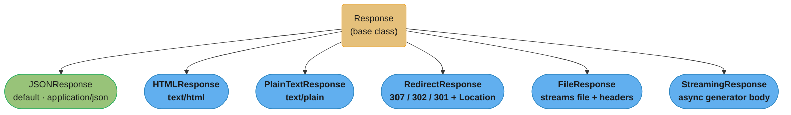
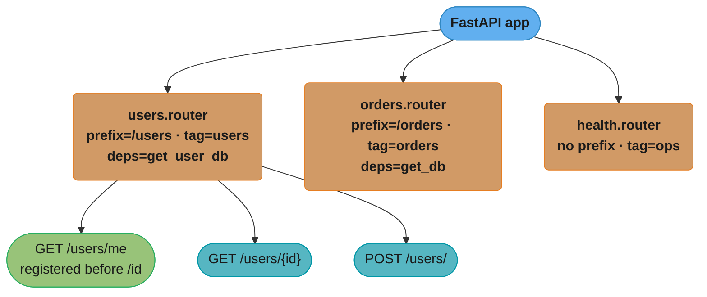
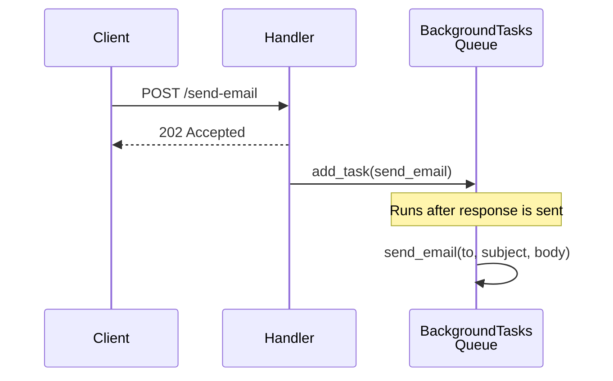
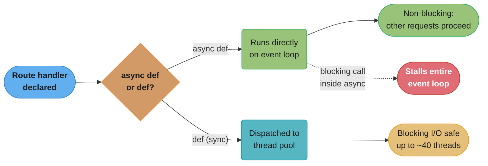
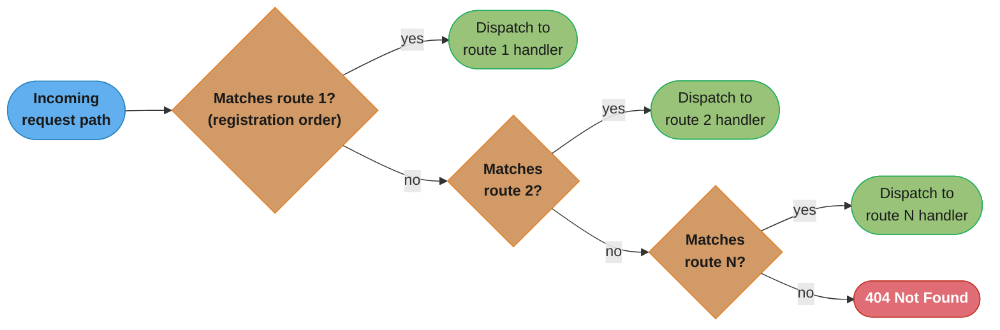
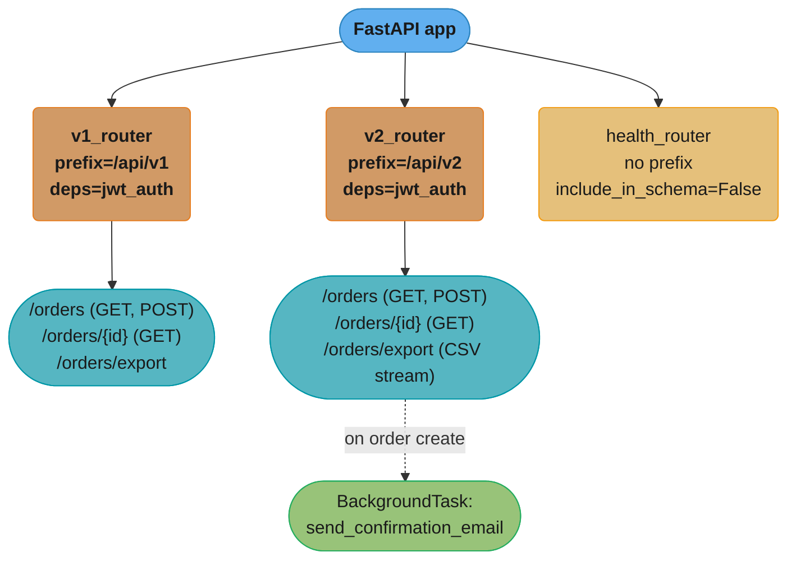

# Routing and Request Handling

---

## 1. Concept Overview

FastAPI's routing layer sits on top of Starlette's `Router` class and transforms Python functions
decorated with HTTP method decorators into fully validated, documented, serialized endpoints. When
a request arrives, FastAPI: matches the path, extracts parameters (path, query, body, header,
cookie), validates them through Pydantic, calls the handler (sync or async), serializes the return
value through a `response_model`, and emits the HTTP response.

Key capabilities this module covers:

- Path operations: all HTTP methods, `response_model`, `status_code`, `tags`, `summary`
- Five parameter sources: path, query, body, header, cookie — with `Annotated` constraints
- `APIRouter` for modular route organisation: prefix, tags, router-level dependencies
- The `Request` and `Response` objects and when you need them directly
- Built-in response classes: `JSONResponse`, `HTMLResponse`, `FileResponse`,
  `StreamingResponse`, `RedirectResponse`
- `BackgroundTasks` for fire-and-forget work without blocking the response
- Route ordering gotchas, OpenAPI customisation, large body handling

Cross-references:
- Dependency injection on route handlers: `../dependency_injection_in_fastapi/README.md`
- ASGI protocol and Starlette internals: `../fastapi_fundamentals_asgi/README.md`
- Pydantic v2 request/response model validation: `../pydantic_v2_deep_dive/README.md`

---

## 2. Intuition

> A FastAPI route is a contract: the decorator declares what the caller must send, Pydantic
> enforces it automatically, and the return annotation declares what the caller will receive —
> no glue code required.

**Mental model:** Think of each route as a typed function signature that doubles as an HTTP
interface. The URL path maps to the function name, path/query parameters map to function
arguments, the request body maps to a Pydantic model argument, and the return value maps to the
response body. FastAPI reads all of this at import time via Python's `inspect` and `typing`
modules, builds the OpenAPI schema once, and then at request time it only needs to
validate + call + serialize — roughly 0.3–0.5 ms per request on a single core.

**Why it matters:** In most Python frameworks (Flask, Django REST Framework), you hand-write
`request.args.get("page", 1)`, cast to `int`, catch `ValueError`, return a 422, update the
docs — every time. FastAPI collapses that entire loop into `page: int = 1` in the function
signature. For senior engineers this matters because it eliminates an entire class of
off-by-one and type mismatch bugs that routinely appear in production APIs.

**Key insight:** `APIRouter` is not just organisational sugar — it is the mechanism that lets
you attach shared dependencies (auth, rate limiting, tenant context) to an entire group of
routes in one line, rather than repeating `Depends(...)` on every handler. Understanding the
difference between router-level dependencies and handler-level dependencies is a common
interview differentiator.

---

## 3. Core Principles

**1. Declare, don't extract.**
Parameters are declared in the function signature. FastAPI introspects them at startup and wires
extraction, coercion, and validation automatically.

**2. Type annotations are the source of truth.**
`user_id: int` in a path parameter means FastAPI will reject non-integer path segments with a
422 before the handler is called. The type annotation also drives the OpenAPI schema — there
is no separate schema definition.

**3. Separation of concerns via `Annotated`.**
Python 3.9+ `Annotated[T, metadata]` separates the type (`T`) from FastAPI-specific constraints
(`Path(ge=1)`, `Query(alias="page_size")`). This keeps the type checker happy while giving
FastAPI rich validation metadata. [3.9]

**4. `response_model` is a filter, not just documentation.**
Setting `response_model=UserOut` tells FastAPI to serialise the return value through `UserOut`,
stripping any extra fields present in an ORM object (like `password_hash`). It is a security
boundary, not just a hint.

**5. `APIRouter` composes, `app` orchestrates.**
Business domains define their own `APIRouter` instances. The top-level `FastAPI` app assembles
them. This mirrors the principle of least knowledge: a `users` router should not know about
`orders` routes.

**6. Sync routes run in a thread pool.**
If you define `def get_user(...)` (sync), FastAPI runs it in `asyncio.to_thread` via
`run_in_executor`. If you define `async def get_user(...)` (async), it runs on the event loop
directly. Never do blocking I/O in an async handler — it stalls every other request.

---

## 4. Types / Architectures / Strategies

### 4.1 HTTP Method Decorators

```
@app.get      @app.post     @app.put
@app.patch    @app.delete   @app.options
@app.head     @app.trace    @app.on_event (deprecated → lifespan)
```

All accept the same keyword arguments:

| Argument | Type | Purpose |
|---|---|---|
| `response_model` | Pydantic model class | Serialise and filter response |
| `status_code` | `int` | Default HTTP status (200, 201, 204…) |
| `tags` | `list[str]` | OpenAPI grouping |
| `summary` | `str` | Short OpenAPI summary |
| `description` | `str` | Long OpenAPI description (Markdown) |
| `response_description` | `str` | OpenAPI description of the response |
| `deprecated` | `bool` | Mark endpoint deprecated in OpenAPI |
| `include_in_schema` | `bool` | Hide from OpenAPI (internal endpoints) |
| `operation_id` | `str` | Override auto-generated operationId |
| `response_class` | Response subclass | Change default response class |
| `responses` | `dict` | Additional OpenAPI response specs |

### 4.2 Parameter Sources

| Source | Declaration | Validation class | Default |
|---|---|---|---|
| Path | `user_id: int` in path string `{user_id}` | `Path(...)` | Required |
| Query | function arg not in path string | `Query(...)` | Optional with default |
| Body | Pydantic model or `Body(...)` | `Body(...)` | Required |
| Header | `Annotated[str, Header()]` | `Header(...)` | Optional |
| Cookie | `Annotated[str, Cookie()]` | `Cookie(...)` | Optional |
| Form | `Annotated[str, Form()]` | `Form(...)` | Required |
| File | `UploadFile` | `File(...)` | Required |

### 4.3 APIRouter Patterns

**Domain router** — one router per domain module:

```
app/
  routers/
    users.py      ← APIRouter(prefix="/users", tags=["users"])
    orders.py     ← APIRouter(prefix="/orders", tags=["orders"])
  main.py         ← app.include_router(users.router)
```

**Versioned router** — nest routers for API versioning:

```
v1_router = APIRouter(prefix="/v1")
v1_router.include_router(users_v1.router)

v2_router = APIRouter(prefix="/v2")
v2_router.include_router(users_v2.router)

app.include_router(v1_router)
app.include_router(v2_router)
```

**Router-scoped dependency** — attach auth to all routes in a router:

```python
router = APIRouter(
    prefix="/admin",
    dependencies=[Depends(require_admin)],
)
```

### 4.4 Response Class Hierarchy

All specific response classes extend the base `Response`; `JSONResponse` is the implicit default
whenever a route returns a `dict` or Pydantic model without setting `response_class`.



---

## 5. Architecture Diagrams

### 5.1 Request Lifecycle

Every request passes through the same nine stages regardless of route: the ASGI server, the
router, FastAPI's dependency resolver, parameter validation, the handler, and serialisation back
into an HTTP response.


### 5.2 APIRouter Assembly

The app assembles three independently defined routers, each with its own prefix, tag, and
dependency list. Within `users.router`, `/users/me` must be registered before `/users/{id}` or
the parameterised route shadows it (see Pitfall 1).



### 5.3 BackgroundTasks Flow

The response is sent to the client as soon as the handler returns; the queued task only runs
afterwards, in the same event loop, so it never blocks or delays the 202 Accepted reply.



### 5.4 Sync vs Async Route Dispatch

Whether a handler is declared `def` or `async def` decides its execution path: sync handlers are
safely offloaded to a thread pool (~40 threads), while async handlers run directly on the event
loop — where a blocking call stalls every other in-flight request (see Pitfall 2).



### 5.5 Route Matching Order — First Match Wins

FastAPI/Starlette is a static router: it tests routes strictly in registration order and
dispatches on the first match, with no specificity scoring — a broader pattern registered
earlier always wins, which is why the route-ordering pitfalls in Section 10 exist at all.



---

## 6. How It Works — Detailed Mechanics

### 6.1 Path and Query Parameters with Annotated

```python
from typing import Annotated
from fastapi import FastAPI, Path, Query, HTTPException
from pydantic import BaseModel

app = FastAPI()


class UserOut(BaseModel):
    id: int
    username: str
    email: str


# Path(ge=1) rejects user_id=0 or negative values with 422 before handler runs.
# Query(alias="page_size") lets callers pass ?page_size=20 while the arg is named per_page.
@app.get("/users/{user_id}", response_model=UserOut, status_code=200)
async def get_user(
    user_id: Annotated[int, Path(ge=1, title="User ID", description="Must be >= 1")],
    per_page: Annotated[int, Query(alias="page_size", ge=1, le=100)] = 20,
) -> UserOut:
    user = await fetch_user(user_id)
    if user is None:
        raise HTTPException(status_code=404, detail=f"User {user_id} not found")
    return user
```

### 6.2 Request Body with Pydantic Model

```python
from pydantic import BaseModel, EmailStr, field_validator
from fastapi import FastAPI

app = FastAPI()


class CreateUserRequest(BaseModel):
    username: str
    email: EmailStr
    age: int | None = None

    @field_validator("username")
    @classmethod
    def username_no_spaces(cls, v: str) -> str:
        if " " in v:
            raise ValueError("username must not contain spaces")
        return v.lower()


class UserOut(BaseModel):
    id: int
    username: str
    email: str


@app.post("/users", response_model=UserOut, status_code=201)
async def create_user(payload: CreateUserRequest) -> UserOut:
    # payload is already validated; payload.username has no spaces and is lowercased
    new_user = await insert_user(payload.username, payload.email, payload.age)
    return new_user
```

### 6.3 Header and Cookie Parameters

```python
from typing import Annotated
from fastapi import FastAPI, Header, Cookie

app = FastAPI()


@app.get("/profile")
async def get_profile(
    # Header() auto-converts X-Request-Id header to x_request_id argument name
    x_request_id: Annotated[str | None, Header()] = None,
    # Cookie() reads from HTTP Cookie header
    session_token: Annotated[str | None, Cookie()] = None,
) -> dict[str, str | None]:
    return {"request_id": x_request_id, "session": session_token}
```

### 6.4 Query List Parameters

```python
from typing import Annotated
from fastapi import FastAPI, Query

app = FastAPI()


@app.get("/items/filter")
async def filter_items(
    # ?tags=a&tags=b&tags=c → tags=["a", "b", "c"]
    tags: Annotated[list[str], Query(min_length=1)] = [],
) -> dict[str, list[str]]:
    return {"tags": tags}
```

### 6.5 APIRouter with Router-Level Dependencies

```python
from fastapi import APIRouter, Depends, HTTPException
from typing import Annotated

# Assume get_current_admin is a dependency that raises 403 if not admin
def get_current_admin() -> dict[str, str]:
    # In practice: validate JWT, check role claim
    ...


router = APIRouter(
    prefix="/admin",
    tags=["admin"],
    dependencies=[Depends(get_current_admin)],  # applied to EVERY route in this router
    responses={403: {"description": "Forbidden"}},
)


@router.get("/stats")
async def admin_stats() -> dict[str, int]:
    return {"total_users": 10_000, "active_today": 1_200}


@router.delete("/users/{user_id}", status_code=204)
async def delete_user(user_id: int) -> None:
    await hard_delete_user(user_id)
```

### 6.6 Direct Request Access

```python
from fastapi import FastAPI, Request
from fastapi.responses import JSONResponse

app = FastAPI()


@app.post("/webhook")
async def webhook(request: Request) -> JSONResponse:
    # Read raw bytes — useful for HMAC signature verification
    raw_body: bytes = await request.body()
    signature = request.headers.get("X-Signature-256", "")
    if not verify_signature(raw_body, signature):
        return JSONResponse(status_code=401, content={"detail": "invalid signature"})

    payload = await request.json()
    # request.state holds per-request data set by middleware
    tenant_id: str = request.state.tenant_id  # set by TenantMiddleware
    await process_webhook(payload, tenant_id)
    return JSONResponse(status_code=202, content={"status": "accepted"})
```

### 6.7 BackgroundTasks

```python
from fastapi import FastAPI, BackgroundTasks

app = FastAPI()


def send_welcome_email(email: str, username: str) -> None:
    # Blocking SMTP call — safe here because it runs AFTER the response is sent.
    # BackgroundTasks uses starlette.background.BackgroundTask which runs in
    # the same event loop iteration after the response is sent, NOT in a thread pool.
    # For true CPU-bound or long-running tasks, use Celery/ARQ instead.
    smtp_client.send(to=email, subject=f"Welcome {username}", body="...")


@app.post("/users", status_code=201)
async def create_user(
    payload: CreateUserRequest,
    background_tasks: BackgroundTasks,
) -> dict[str, str]:
    user = await insert_user(payload)
    # Queues the task — does NOT start it yet
    background_tasks.add_task(send_welcome_email, user.email, user.username)
    # Response is sent first; then send_welcome_email runs
    return {"id": str(user.id), "status": "created"}
```

### 6.8 Custom Response Classes

```python
import io
from fastapi import FastAPI
from fastapi.responses import (
    StreamingResponse,
    FileResponse,
    RedirectResponse,
    HTMLResponse,
)

app = FastAPI()


@app.get("/export/csv")
async def export_csv() -> StreamingResponse:
    async def generate():
        yield "id,name\n"
        async for row in fetch_all_users_cursor():
            yield f"{row.id},{row.name}\n"

    return StreamingResponse(
        generate(),
        media_type="text/csv",
        headers={"Content-Disposition": "attachment; filename=users.csv"},
    )


@app.get("/download/{filename}")
async def download_file(filename: str) -> FileResponse:
    path = f"/data/files/{filename}"
    return FileResponse(path, filename=filename)


@app.get("/old-path")
async def legacy_redirect() -> RedirectResponse:
    return RedirectResponse(url="/new-path", status_code=301)


@app.get("/health-ui", response_class=HTMLResponse)
async def health_ui() -> str:
    return "<html><body><h1>OK</h1></body></html>"
```

---

## 7. Real-World Examples

### 7.1 GitHub Copilot API Gateway Pattern

GitHub's Copilot backend exposes language-completion endpoints through routers scoped to model
versions. Each router has authentication and rate-limiting dependencies attached at the router
level, not per-handler. This means adding a new model version router inherits the full auth stack
automatically. The `response_model` includes `usage` fields (prompt_tokens, completion_tokens)
which are serialised from the raw model output object — FastAPI's field filtering prevents
internal cost-tracking fields from leaking to clients.

### 7.2 Stripe-style Webhook Endpoint

Stripe-style APIs require raw body access to verify HMAC-SHA256 signatures before parsing JSON.
FastAPI's `Request.body()` returns the raw bytes, but there is a caveat: Starlette caches the
body on the `Request` object after the first call to `await request.body()`, so a Pydantic
body argument and a raw `request.body()` call in the same handler do not conflict. In practice,
webhook handlers use `Request` directly and skip the Pydantic body declaration.

### 7.3 Cursor-Paginated List Endpoints (Notion, Linear)

Tools like Notion and Linear use cursor-based pagination. In FastAPI, this maps naturally to a
query parameter `cursor: str | None = None` plus a `limit: int = Query(default=20, le=100)`.
The response model includes a `next_cursor: str | None` field. The cursor is typically a
base64-encoded compound key — FastAPI validates it as a plain `str`, and the service layer
decodes and verifies it.

### 7.4 Multi-Part Form Upload (Hugging Face Hub)

Hugging Face Hub's model upload API accepts multipart form data with both a JSON metadata field
and binary file chunks. FastAPI handles this with `Form(...)` for metadata fields and
`UploadFile` for the binary parts. File objects are streamed via `SpooledTemporaryFile` —
FastAPI does not load the entire file into memory, which matters for 4 GB model weights.

---

## 8. Tradeoffs

| Approach | Pros | Cons | Best for |
|---|---|---|---|
| Handler-level `Depends` | Explicit per-endpoint | Repetitive for large routers | 1-2 routes needing a dep |
| Router-level `dependencies=[]` | DRY; centrally enforceable | Harder to see deps per route | Auth/rate-limit on groups |
| `response_model=` | Auto-serialise + filter | Extra Pydantic pass (~0.05 ms) | Public APIs with sensitive fields |
| Return `dict` (no model) | Zero overhead | No filtering; no schema | Internal/debug endpoints |
| `StreamingResponse` | Low memory for large payloads | No `response_model` support | CSV export, large files |
| `BackgroundTasks` | Simple; no extra infrastructure | Shares event loop; not durable | Lightweight fire-and-forget |
| Celery/ARQ for background | Durable; retryable | Requires broker (Redis/RabbitMQ) | Long-running jobs |
| `Request` body access | Full control; HMAC verify | Bypasses Pydantic validation | Webhook signature check |
| `Annotated` constraints | Clean type signatures | Slightly more verbose | All production endpoints |

---

## 9. When to Use / When NOT to Use

### When to use

- Use `response_model` on any endpoint that returns user data — it is a security filter, not
  just documentation.
- Use `APIRouter` whenever you have more than 3 routes sharing a prefix or a common dependency.
- Use `StreamingResponse` for any response larger than 10 MB (CSV exports, video streams).
- Use `BackgroundTasks` for lightweight post-response work: sending a welcome email, writing
  an audit log, invalidating a cache key. Runs in under 100 ms typically.
- Use `Annotated` with `Path`/`Query`/`Header` constraints for all public-facing parameters —
  it prevents a whole class of validation bugs from ever reaching service logic.
- Use `include_in_schema=False` for internal health-check and debug endpoints that should not
  appear in the OpenAPI UI.

### When NOT to use

- Do not use `BackgroundTasks` for tasks that must survive a process restart, take longer than
  a few seconds, or require retries. Use Celery, ARQ, or a task queue instead.
- Do not return raw ORM objects without a `response_model` — SQLAlchemy models may expose
  lazy-loaded relationships and internal fields.
- Do not put business logic directly in route handlers — keep handlers thin. The handler's job
  is to extract, validate, delegate to a service, and format the response.
- Do not use `Request` body access and a Pydantic body parameter together on the same handler
  unless you are certain the order of access is correct (body() first, then model parse manually).
- Do not define parameterised routes before specific routes sharing the same prefix — FastAPI
  matches in declaration order and the parameterised route will shadow the specific one.

---

## 10. Common Pitfalls

### Pitfall 1: Route Ordering — Specific Route Shadowed by Parameterised Route

```python
# BROKEN: /users/me is shadowed — FastAPI matches /users/{user_id} first
# because it is declared first. "me" matches user_id as a str.
# get_me() is never called.

@app.get("/users/{user_id}")
async def get_user(user_id: str) -> dict:
    return {"user_id": user_id}

@app.get("/users/me")   # Dead code — unreachable
async def get_me() -> dict:
    return {"user": "current"}
```

```python
# FIX: Declare the specific route BEFORE the parameterised route.
# FastAPI evaluates routes in registration order.

@app.get("/users/me")           # Registered first — matched first
async def get_me() -> dict:
    return {"user": "current"}

@app.get("/users/{user_id}")    # Only matches if /users/me did not match
async def get_user(user_id: int) -> dict:  # Also changed to int for type safety
    return {"user_id": user_id}
```

### Pitfall 2: Blocking I/O in an Async Handler

```python
import time
import httpx

# BROKEN: time.sleep() blocks the entire event loop for 2 seconds.
# During those 2 seconds, NO other request can be processed by this worker.
# Under 100 concurrent requests at 50 req/s, uvicorn's single event loop
# can handle ~20k req/s, but a 2-second block reduces effective throughput
# to ~0.5 req/s for the duration.

@app.get("/slow")
async def slow_endpoint() -> dict:
    time.sleep(2)                        # WRONG: blocks event loop
    result = httpx.get("http://api/data")  # WRONG: sync HTTP in async handler
    return {"result": result.json()}
```

```python
import asyncio
import httpx

# FIX: Use async equivalents. asyncio.sleep() yields to the event loop.
# httpx.AsyncClient makes non-blocking HTTP requests.

@app.get("/slow")
async def slow_endpoint() -> dict:
    await asyncio.sleep(2)               # Yields — other requests proceed
    async with httpx.AsyncClient() as client:
        response = await client.get("http://api/data")
    return {"result": response.json()}
```

### Pitfall 3: Duplicate Path Parameter Names (Router + Handler)

```python
# BROKEN: Router has prefix="/orgs/{org_id}" and the handler also declares
# org_id. FastAPI raises a duplicate-parameter error at startup because
# the same name appears twice in the resolved path.

router = APIRouter(prefix="/orgs/{org_id}")

@router.get("/members/{org_id}")  # WRONG: org_id already in router prefix
async def get_member(org_id: int) -> dict:
    ...
```

```python
# FIX: Use distinct names at each level.

router = APIRouter(prefix="/orgs/{org_id}")

@router.get("/members/{member_id}")   # Different name
async def get_member(org_id: int, member_id: int) -> dict:
    # Both org_id and member_id are extracted from the resolved path
    # /orgs/{org_id}/members/{member_id}
    return {"org": org_id, "member": member_id}
```

### Pitfall 4: Missing `await` on `request.body()` Causing Empty Bytes

```python
# BROKEN: body() is a coroutine. Without await, raw_body is a coroutine object,
# not bytes. HMAC verification will always fail silently.

@app.post("/webhook")
async def webhook(request: Request) -> dict:
    raw_body = request.body()          # WRONG: coroutine, not bytes
    sig = request.headers.get("X-Sig")
    if not hmac_verify(raw_body, sig): # always False
        raise HTTPException(401)
    ...
```

```python
# FIX: Always await async methods on Request.

@app.post("/webhook")
async def webhook(request: Request) -> dict:
    raw_body: bytes = await request.body()  # correct
    sig = request.headers.get("X-Sig", "")
    if not hmac_verify(raw_body, sig):
        raise HTTPException(status_code=401, detail="invalid signature")
    payload = await request.json()
    return {"status": "ok"}
```

---

## 11. Technologies & Tools

| Tool / Framework | Routing Style | Validation | Auto Docs | Async Native | Notes |
|---|---|---|---|---|---|
| FastAPI | Decorator + type hints | Pydantic v2 | OpenAPI 3.1 (Swagger + ReDoc) | Yes | ~20k req/s single worker; 0.3–0.5 ms overhead |
| Flask | Decorator + `@app.route` | Manual / marshmallow | Requires flask-apispec | No (Quart for async) | Mature; larger ecosystem; no built-in validation |
| Django REST Framework | `ViewSet` + `Router` | Serializers | Browsable API; DRF-Spectacular | No (WSGI) | Best for teams already on Django |
| Litestar | Decorator + type hints | Attrs / Pydantic | OpenAPI 3.1 | Yes | Faster than FastAPI on benchmarks; smaller community |
| Starlette | Decorator (manual) | None built-in | None | Yes | FastAPI is built on this; use directly for ultra-low overhead |
| aiohttp | `@routes.get` | None built-in | None | Yes | Older async framework; no automatic docs |
| Falcon | `responder` class | None | None | Partial | Extremely low overhead; used by PayPal at scale |

---

## 12. Interview Questions with Answers

**Q1: How does FastAPI determine which function argument gets its value from which HTTP parameter source?**
FastAPI inspects the function signature at startup using Python's `inspect.signature`. Arguments
whose names appear in the path template (e.g., `{user_id}`) are path parameters. Arguments with
a Pydantic `BaseModel` type are treated as JSON body. All others are query parameters by default.
You override the default with `Annotated[T, Header()]`, `Annotated[T, Cookie()]`, etc.
The key practical point is that FastAPI resolves this once at startup, not on every request, so
the per-request cost is just extraction and validation — not reflection.

**Q2: What is the difference between setting a dependency in `APIRouter(dependencies=[...])` vs in each handler's signature?**
Router-level dependencies run for every route in that router but are not injected into the handler
as arguments — they are evaluated purely for side effects (auth check, rate limit, logging).
Handler-level dependencies are injected as arguments and their return value is available inside
the handler. Use router-level for cross-cutting concerns; handler-level when the dependency's
return value is needed. You can mix both: router-level auth + handler-level database session.

**Q3: Why does `response_model` matter for security?**
`response_model` instructs FastAPI to serialise the return value through that Pydantic model,
which means only fields declared on the model are included in the response. If a handler returns
a SQLAlchemy `User` ORM object that has a `password_hash` field and the `response_model=UserOut`
does not include `password_hash`, it is stripped automatically. Without `response_model`, all
fields of the returned object are serialised, potentially leaking internal data.

**Q4: What happens when you define a sync `def` route in FastAPI?**
FastAPI detects synchronous functions at startup and wraps them using
`asyncio.get_event_loop().run_in_executor(None, ...)` (Starlette's `run_in_threadpool`). The
route runs in the default `ThreadPoolExecutor` — by default up to `min(32, os.cpu_count() + 4)`
threads. This means sync routes can make blocking calls safely without stalling the event loop,
but they do consume thread pool capacity. Uvicorn's default is 40 worker threads for sync routes.

**Q5: How does `BackgroundTasks` differ from `asyncio.create_task`?**
`BackgroundTasks` (Starlette) queues callables that Starlette runs after the HTTP response is
fully sent. It integrates with the ASGI lifecycle — cleanup dependencies (yield deps) are torn
down only after background tasks complete. `asyncio.create_task` schedules a coroutine
immediately on the event loop, before the response is sent, and is not aware of the request
lifecycle. For tasks that must not block the response and are lightweight, use `BackgroundTasks`.
For fire-and-forget coroutines that start immediately, use `create_task`. For durable tasks,
use Celery or ARQ.

**Q6: What is the route ordering rule in FastAPI and why does it exist?**
FastAPI inherits Starlette's router which matches routes in registration order — first match wins.
If you register `GET /users/{user_id}` before `GET /users/me`, the string "me" matches
`{user_id}` as a path parameter and `get_me()` is never called. The fix is to always register
specific (non-parameterised) routes before parameterised ones with overlapping prefixes. This is
a static router — there is no specificity scoring unlike some other frameworks.

**Q7: How do you return a 201 status code for a `POST` endpoint?**
Set `status_code=201` in the decorator: `@app.post("/users", status_code=201)`. This is the
default HTTP status for that endpoint. You can still override it dynamically by returning a
`Response` subclass with an explicit `status_code` argument. If you need to return a different
status on some code paths, inject `Response` as a parameter and set `response.status_code`.

**Q8: What is `include_in_schema=False` used for and when would you set it?**
`include_in_schema=False` prevents the route from appearing in the OpenAPI JSON and the Swagger
UI. Use it for: internal health-check endpoints that should not be documented publicly, debug or
introspection endpoints, and endpoints that internal load balancers call but external clients
should not know about. The route still functions — it just does not appear in `/openapi.json`.

**Q9: How do you accept a list of query parameters (e.g., `?tags=a&tags=b`)?**
Declare the parameter as `list[str]` with a `Query` annotation:
`tags: Annotated[list[str], Query()] = []`. FastAPI collects all values for the `tags` key
from the query string and coerces them into a list. Without `Query()`, FastAPI would not know
to collect multiple values and would only capture the first occurrence.

**Q10: How do you handle file uploads in FastAPI?**
Use `UploadFile` as the parameter type, combined with `File()`:
`file: Annotated[UploadFile, File()]`. `UploadFile` wraps a `SpooledTemporaryFile` — small
files are kept in memory (default threshold 1 MB), larger files are spooled to disk. Read the
content with `await file.read()` or stream it with `file.file`. For multipart forms mixing
files and JSON fields, use `Form()` for text fields and `UploadFile` for files. You cannot
mix a Pydantic body model with `File()`/`Form()` in the same handler — use `Form()` for each
field individually.

**Q11: What is the purpose of `Annotated` in parameter declarations?**
`Annotated[T, metadata]` ([3.9]) separates the base type from validation metadata. FastAPI reads
the metadata argument (`Path(...)`, `Query(...)`, etc.) to determine: the parameter source,
validation constraints (`ge`, `le`, `min_length`, `regex`), aliases, deprecation flags, and
OpenAPI descriptions. The type checker only sees `T`, so `Annotated[int, Path(ge=1)]` is treated
as `int` by mypy/pyright. This keeps type annotations valid for static analysis while giving
FastAPI rich runtime metadata.

**Q12: How do you customise the `operationId` in the OpenAPI schema?**
Pass `operation_id="my_custom_id"` to the decorator: `@app.get("/users", operation_id="listUsers")`.
By default FastAPI generates the operation ID from the function name and HTTP method, which
produces IDs like `get_user_users__user_id__get`. Custom operation IDs matter when generating
client SDKs — the operation ID becomes the generated method name. Many teams set
`generate_unique_id_function` on the `FastAPI` instance to control the naming strategy globally.

**Q13: When would you use `StreamingResponse` vs returning a Pydantic model?**
Use `StreamingResponse` when the response body is generated incrementally (database cursor,
file read, LLM token stream) or when the full content would be too large to hold in memory
simultaneously. A 1 GB CSV file exported row by row via an async generator uses constant
memory (~4 KB per yield). Pydantic model responses require the entire object to be in memory
to serialise. `StreamingResponse` cannot use `response_model` — serialisation is your
responsibility inside the generator.

**Q14: How does FastAPI handle the conversion of header names?**
HTTP headers use hyphen-separated names (`X-Request-Id`), but Python identifiers use underscores.
`Header()` automatically converts underscores in the parameter name to hyphens when looking up
the header. So `x_request_id: Annotated[str | None, Header()] = None` looks up `X-Request-Id`
in the request headers. You can disable this with `convert_underscores=False` in `Header()`.
This is a common source of `None` bugs when developers forget the conversion rule.

**Q15: What happens when an `APIRouter` prefix and a route path both declare a path parameter with the same name?**
FastAPI raises a startup error because the resolved path would contain the same parameter name
twice, and it cannot determine which occurrence should populate the handler's argument. A router
mounted with `prefix="/orgs/{org_id}"` combined with a route decorated `@router.get("/members/{org_id}")`
resolves to `/orgs/{org_id}/members/{org_id}`, an ambiguous duplicate. Give the nested resource a
distinct parameter name, such as `{member_id}`, so both values are extractable independently.

**Q16: What is the difference between returning `RedirectResponse(url=..., status_code=301)` and the default `307`?**
`301 Moved Permanently` tells clients and caches the resource has moved for good, so browsers and
CDNs may cache the redirect and, historically, some clients silently rewrite a `POST` into a `GET`
on the follow-up request. `307 Temporary Redirect` (Starlette's default) explicitly preserves the
original HTTP method and body on the follow-up request and is never cached as permanent, making it
the safer default for redirects following a `POST` or `PUT`. Use `301` only for genuinely permanent
resource moves such as the legacy-to-new-path migration in this module's example.

---

## 13. Best Practices

**Declare response models on all public endpoints.**
Every endpoint accessible to external clients should have `response_model=SomeModel`. It acts
as both documentation and a security filter. Use separate `In` and `Out` models when the
create/update payload differs from the read payload.

**Use `Annotated` for all parameter metadata.**
Prefer `Annotated[int, Path(ge=1)]` over the older `user_id: int = Path(ge=1)` style. The
`Annotated` form is cleaner, works better with type checkers, and is the canonical style in
FastAPI 0.95+.

**Put specific routes before parameterised routes.**
Always verify route ordering when two routes share a prefix. A unit test that calls `GET /users/me`
and asserts it does not return a 404 will catch ordering bugs at development time.

**Keep handlers thin.**
A handler should: extract parameters, call a service function, return the result. Business logic,
database queries, and domain validations belong in a service or repository layer. This makes
handlers easy to test without standing up a full HTTP server.

**Use router-level dependencies for cross-cutting concerns.**
Authentication, tenant resolution, rate limiting — these should be on the router, not repeated
on every handler. This reduces the chance of accidentally omitting auth from a new endpoint.

**Mark deprecated endpoints, do not delete them.**
Set `deprecated=True` on the decorator. This appears in the OpenAPI UI and signals to client
teams without breaking existing callers. Remove only after confirming zero traffic.

**Set `operation_id` for SDK-generated clients.**
If you generate TypeScript or Python clients from your OpenAPI spec, set explicit `operation_id`
values. Auto-generated IDs like `read_user_users__user_id__get` are ugly function names in
generated SDKs.

**For large file uploads, stream to object storage.**
Do not buffer large uploads in memory with `await file.read()`. Pipe `file.file` (the raw file
object) directly to S3 via `boto3.upload_fileobj` or stream to disk. Above 10 MB,
`UploadFile.read()` can cause memory pressure on small instances.

**Use `include_in_schema=False` for ops endpoints.**
Internal endpoints (readiness probe, metrics scrape, debug info) should not clutter the developer
docs. Hide them with `include_in_schema=False` on the route or on the router.

---

## 14. Case Study

### Scenario: Multi-Tenant REST API with Versioned Routing

An e-commerce SaaS platform needs to expose a REST API that:
- Supports two API versions: v1 (legacy) and v2 (current)
- Requires JWT authentication on all `/api/` routes
- Allows tenant context to be injected from a subdomain header
- Exports order data as a CSV stream for large datasets
- Sends a confirmation email asynchronously after order creation

### Architecture

Both API versions share the same domain and mount under the same app, each behind its own
JWT-gated router; only `v2_router`'s `create_order` handler queues the confirmation email.



### Implementation

```python
# app/main.py
from fastapi import FastAPI
from app.routers import v1_orders, v2_orders, health

app = FastAPI(title="Commerce API", version="2.0.0")

app.include_router(health.router)
app.include_router(v1_orders.router)
app.include_router(v2_orders.router)
```

```python
# app/routers/v2_orders.py
from typing import Annotated
from fastapi import APIRouter, Depends, Path, Query, BackgroundTasks, HTTPException
from fastapi.responses import StreamingResponse
from pydantic import BaseModel
from app.auth import get_current_user
from app.services import order_service
from app.tasks import send_confirmation_email


class OrderIn(BaseModel):
    product_id: int
    quantity: Annotated[int, Path(ge=1)] = 1  # type: ignore — used as Query below
    notes: str | None = None


class OrderOut(BaseModel):
    id: int
    product_id: int
    quantity: int
    status: str
    created_at: str


router = APIRouter(
    prefix="/api/v2/orders",
    tags=["orders-v2"],
    dependencies=[Depends(get_current_user)],  # JWT auth on ALL routes
    responses={401: {"description": "Unauthorized"}},
)


# IMPORTANT: /export must be declared BEFORE /{order_id} to avoid shadowing
@router.get("/export")
async def export_orders_csv(
    status_filter: Annotated[str | None, Query(alias="status")] = None,
) -> StreamingResponse:
    async def generate_csv():
        yield "id,product_id,quantity,status,created_at\n"
        async for order in order_service.stream_all(status=status_filter):
            yield f"{order.id},{order.product_id},{order.quantity},{order.status},{order.created_at}\n"

    return StreamingResponse(
        generate_csv(),
        media_type="text/csv",
        headers={"Content-Disposition": "attachment; filename=orders.csv"},
    )


@router.get("/{order_id}", response_model=OrderOut)
async def get_order(
    order_id: Annotated[int, Path(ge=1)],
) -> OrderOut:
    order = await order_service.get(order_id)
    if order is None:
        raise HTTPException(status_code=404, detail=f"Order {order_id} not found")
    return order


@router.post("", response_model=OrderOut, status_code=201)
async def create_order(
    payload: OrderIn,
    background_tasks: BackgroundTasks,
    current_user: Annotated[dict, Depends(get_current_user)],
) -> OrderOut:
    order = await order_service.create(
        product_id=payload.product_id,
        quantity=payload.quantity,
        user_id=current_user["sub"],
    )
    background_tasks.add_task(
        send_confirmation_email,
        to=current_user["email"],
        order_id=order.id,
    )
    return order
```

### BROKEN → FIX in Route Registration

```python
# BROKEN: /export is registered after /{order_id}.
# GET /api/v2/orders/export matches order_id="export" — FastAPI tries
# to call get_order(order_id="export"), Pydantic coercion of "export"
# to int fails, returns 422 Unprocessable Entity instead of CSV.

@router.get("/{order_id}", response_model=OrderOut)
async def get_order(order_id: Annotated[int, Path(ge=1)]) -> OrderOut: ...

@router.get("/export")  # Never reached — shadowed by /{order_id} above
async def export_orders_csv() -> StreamingResponse: ...
```

```python
# FIX: Register /export FIRST. Specific literal routes always before
# parameterised ones with the same prefix.

@router.get("/export")               # Registered first — matched for /export
async def export_orders_csv() -> StreamingResponse: ...

@router.get("/{order_id}", response_model=OrderOut)  # Matched only if /export didn't
async def get_order(order_id: Annotated[int, Path(ge=1)]) -> OrderOut: ...
```

### Discussion Questions

1. How would you add rate limiting to only the `POST /orders` route without adding it to `GET`
   routes? (Answer: use handler-level `Depends(rate_limiter)` on the POST handler, rather than
   router-level.)

2. The `export_orders_csv` endpoint currently has no authentication because it is inside a router
   that has `dependencies=[Depends(get_current_user)]`. What would happen if you moved
   `export_orders_csv` to a separate router without copying the dependency? (Answer: the endpoint
   would be publicly accessible — any caller could stream all orders. This is a real production
   security bug pattern.)

3. `BackgroundTasks` calls `send_confirmation_email` synchronously (it is a regular `def`). If
   `send_confirmation_email` takes 500 ms due to SMTP latency, does it block the next request?
   (Answer: yes — Starlette's `BackgroundTask` runs the sync callable in the current event loop
   iteration after the response. For SMTP with 500 ms latency, use `asyncio.to_thread` inside
   the background task, or offload to Celery/ARQ.)
