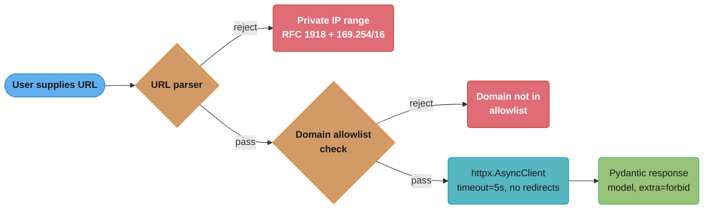
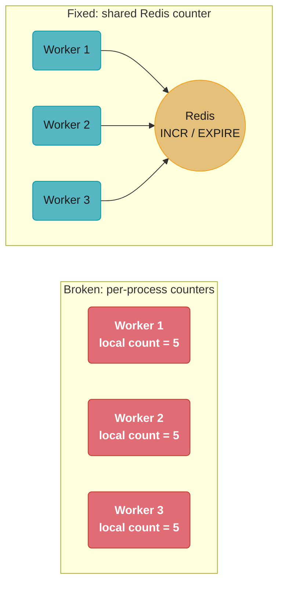
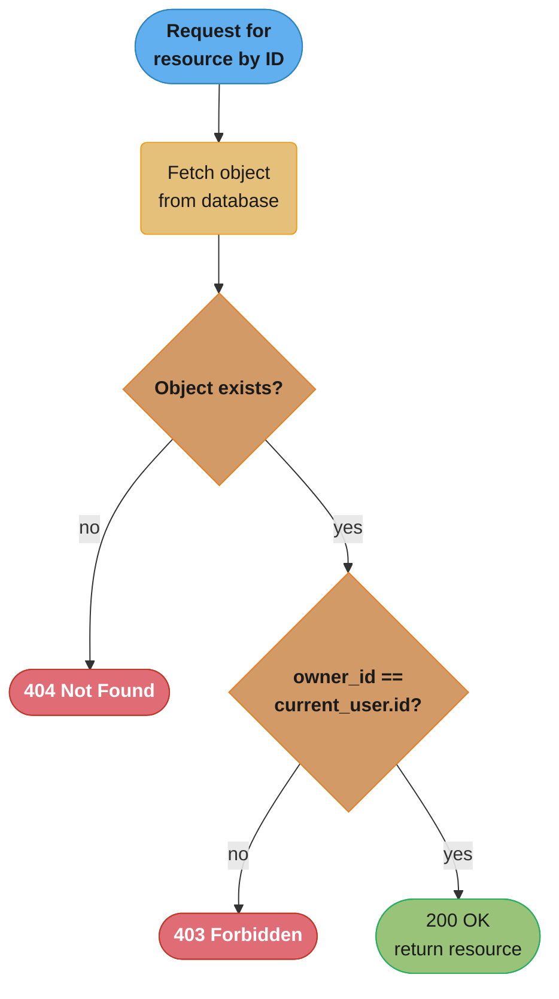

# Security Hardening and OWASP

## 1. Concept Overview

Security hardening in FastAPI is the practice of closing the gap between "authenticated and working" and "production-safe". Authentication proves identity; hardening ensures the rest of the attack surface — authorization logic, resource consumption, input handling, configuration, and third-party data trust — does not hand that identity more power than it should have.

The OWASP API Security Top 10 (2023 edition) is the authoritative catalogue of how real APIs fail in production. Each item maps directly to a FastAPI anti-pattern and a concrete fix. This module works through all ten in order, then covers the supporting mechanisms: SQL injection prevention, deserialization safety, secret management, request size enforcement, security headers, and static analysis tooling.

Key capabilities:

- OWASP API Security Top 10 (2023): BOLA, Broken Authentication, BOPLA, Unrestricted Resource Consumption, Broken Function Level Authorization, Unrestricted Access to Sensitive Business Flows, SSRF, Security Misconfiguration, Improper Inventory Management, Unsafe Consumption of APIs
- SQL injection prevention with SQLAlchemy parameterized queries
- Deserialization safety: `pickle` vs JSON
- Secret management: `SecretStr`, `detect-secrets`, `pip-audit`, `bandit`
- Request size limits and query depth controls
- Security headers via middleware
- Static analysis integration in CI: `bandit`, `safety`, `pip-audit`
- Cross-links: [`../authentication_and_security/README.md`](../authentication_and_security/README.md), [`../error_handling_and_validation/README.md`](../error_handling_and_validation/README.md)

Python version: 3.11/3.12. FastAPI version: 0.110+. Pydantic version: v2.

---

## 2. Intuition

> Security hardening is like building a vault: the front door lock (authentication) is necessary but not sufficient — you also need interior compartments, weight limits, inventory control, and no backdoors through the ventilation system.

**Mental model.** Think of a FastAPI application as a series of gates. The first gate checks identity (authentication). Every subsequent gate checks intent and scope: does this identity have permission for this specific object? Is this request within resource limits? Is the configuration sound? Hardening means none of those inner gates are accidentally left open because the outer gate was passed.

**Why it matters.** BOLA (Broken Object Level Authorization) alone accounts for the majority of API data breach incidents. Attackers do not exploit zero-days in well-maintained APIs — they iterate through integer IDs in paths they are already authenticated to access. A single missing ownership check exposes every resource in the database.

**Key insight.** Authorization is a data problem, not a middleware problem. Middleware can enforce rate limits and headers globally, but object-level authorization must happen inside the route handler after the object is fetched from the database. Middleware has no access to the object's `owner_id`.

---

## 3. Core Principles

**Principle of least privilege.** Every user, service, and token should have access to exactly the resources required for the current operation and nothing else. Default to deny; grant explicitly.

**Defense in depth.** No single control is sufficient. Layer authentication, object-level authorization, rate limiting, input validation, and security headers so that a failure in one layer does not result in full compromise.

**Fail closed.** On ambiguous conditions — missing ownership field, unexpected response shape from a third-party API, unparseable JWT claim — deny the request rather than assuming it is safe.

**No trust in caller-supplied IDs without verification.** Any ID arriving in a path parameter, query string, or request body is attacker-controlled. Fetch the object and verify ownership. Never filter by `owner_id` from the request body; always derive it from the authenticated principal.

**Minimize the response surface.** Return only what the caller is authorized to see. Use Pydantic response models with `exclude_unset=True` to prevent accidentally leaking database fields that the schema has not explicitly exposed.

**Secrets are not configuration.** Secrets (database passwords, API keys, signing keys) must never appear in source code, logs, or error responses. Use `SecretStr` for Pydantic settings fields and inject via environment variables.

---

## 4. Types / Architectures / Strategies

### OWASP API Security Top 10 (2023) — FastAPI Mapping

**API1: Broken Object Level Authorization (BOLA)**

Every route that fetches a resource by ID must verify that the authenticated user owns it or has an explicit grant. This check cannot be done in middleware — it requires the object from the database.

Fix: after `session.get()`, compare `resource.owner_id == current_user.id`. Raise `403` (not `404`) on mismatch to avoid leaking existence. Use `404` only when the object genuinely does not exist for any user.

**API2: Broken Authentication**

Weak tokens, unrotated secrets, missing expiry, tokens accepted over HTTP. Covered in depth in [`../authentication_and_security/README.md`](../authentication_and_security/README.md). Summary: HS256 with a 256-bit secret minimum, 15-minute access token expiry, 7-day refresh token with rotation, HTTPS enforced via `Strict-Transport-Security`.

**API3: Broken Object Property Level Authorization (BOPLA)**

A user updates a field they are not allowed to modify (e.g., `role`, `is_admin`, `plan_tier`) by including it in a PATCH request body. Alternatively, a GET endpoint returns the full database row including internal fields.

Fix: declare explicit Pydantic `UpdateSchema` with only the fields users may modify. Declare explicit `ResponseSchema` for every endpoint with `model_config = ConfigDict(populate_by_name=True)` and use `response_model=ResponseSchema` in the route decorator. Never return ORM objects directly.

**API4: Unrestricted Resource Consumption**

No rate limiting, no request body size cap, no pagination depth limit. A single client floods the API or causes out-of-memory by sending a 500 MB JSON body.

Fix: `SlowAPI` or a Redis-backed token bucket for rate limiting; `app.add_middleware(RequestSizeLimitMiddleware, max_bytes=1_048_576)` (1 MB default); `LIMIT` capped at 100 in query parameters; `max_depth` enforcement on recursive queries.

**API5: Broken Function Level Authorization**

Admin-only endpoints (delete user, change billing plan, view audit log) are protected by authentication but not by role check. Any authenticated user who discovers the endpoint URL can call it.

Fix: a `require_role` dependency that checks `current_user.role in allowed_roles` and raises `403`. Apply it as `Depends(require_role("admin"))` in the route signature, not in middleware.

**API6: Unrestricted Access to Sensitive Business Flows**

Registration, password reset, voucher redemption, and payment endpoints can be automated by bots at scale. No rate limiting specific to business logic.

Fix: IP-based and account-based rate limiting with `slowapi`; CAPTCHA on public registration; behavioral signals (same IP, token arrival velocity) to detect credential stuffing.

**API7: Server Side Request Forgery (SSRF)**

The API accepts a user-supplied URL and fetches it server-side (webhook registration, avatar URL, link preview). An attacker supplies `http://169.254.169.254/latest/meta-data/` (AWS IMDSv1) or `http://internal-service:8080/admin`.

Fix: allowlist of permitted domains; reject private IP ranges (`10.0.0.0/8`, `172.16.0.0/12`, `192.168.0.0/16`, `169.254.0.0/16`); use `httpx` with a 5-second timeout and no redirect follow on user-supplied URLs.

**API8: Security Misconfiguration**

`CORSMiddleware(allow_origins=["*"])` in production, `app = FastAPI(debug=True)` leaking stack traces, verbose error messages exposing internal paths, default admin credentials, open Swagger UI on `/docs` in production.

Fix: explicit `allow_origins` list; `debug=False` in production; custom exception handler returning RFC 7807 `application/problem+json` without internal detail; `app = FastAPI(docs_url=None, redoc_url=None)` in production (or protect `/docs` with auth).

**API9: Improper Inventory Management**

Old API versions (`/v1/`) remain accessible after `/v2/` ships. Shadow endpoints created for testing are never removed. Deprecated endpoints lack sunset headers.

Fix: explicit `APIRouter` versioning with a deprecation schedule; `Deprecated: true` header and `Sunset` header on routes scheduled for removal; CI check that counts public routes and alerts on unexpected additions.

**API10: Unsafe Consumption of APIs**

Third-party API responses are passed directly to the database or returned to the client without validation. A compromised upstream can inject unexpected fields.

Fix: parse every third-party response through a strict Pydantic model with `model_config = ConfigDict(extra="forbid")`. Never `**response.json()` into a database insert. Log validation errors from upstream as anomalies.

---

## 5. Architecture Diagrams

**Request lifecycle with security layers**

```mermaid
flowchart LR
    classDef io      fill:#61afef,stroke:#2e86c1,color:#1a1a1a,font-weight:bold
    classDef frozen  fill:#c678dd,stroke:#9b59b6,color:#fff
    classDef train   fill:#98c379,stroke:#27ae60,color:#1a1a1a
    classDef mathOp  fill:#d19a66,stroke:#e67e22,color:#1a1a1a,font-weight:bold
    classDef lossN   fill:#e06c75,stroke:#c0392b,color:#fff,font-weight:bold
    classDef req     fill:#56b6c2,stroke:#0097a7,color:#1a1a1a
    classDef base    fill:#e5c07b,stroke:#f39c12,color:#1a1a1a

    Client([Client]) -->|"HTTPS<br/>TLS 1.2+"| LB(Load Balancer<br/>/ CDN)
    LB -->|"strip headers<br/>enforce HTTPS"| SecHead(Security Headers<br/>Middleware)
    SecHead --> ReqSize(Request Size Limit<br/>1 MB cap)
    ReqSize --> RateLimit(Rate Limit<br/>IP + account bucket)
    RateLimit --> CORS(CORS Middleware<br/>allow_origins list)
    CORS --> JWT(OAuth2 / JWT<br/>verify sig, expiry, issuer)

    subgraph RH["Route Handler"]
        direction LR
        Fetch(Fetch resource<br/>from DB) --> Own{"Ownership check<br/>BOLA fix"}
        Own --> Role{"Role / scope check<br/>BFLA fix"}
        Role --> Validate(Validate external<br/>API response)
    end

    JWT --> Fetch
    Validate --> Resp(Response Schema<br/>exclude_unset)
    Resp --> ClientOut([Client<br/>JSON / problem+json])

    class Client,ClientOut io
    class LB frozen
    class SecHead,ReqSize,RateLimit,CORS req
    class JWT mathOp
    class Fetch base
    class Own,Role lossN
    class Validate train
    class Resp train
```


*Every request passes through five middleware layers before reaching the route handler; the ownership and role checks (red) run only inside the handler, after the object is fetched, because middleware has no access to `owner_id`.*

**SSRF prevention flow**


*The URL is rejected at the first gate it fails — private IP ranges (including the `169.254.169.254` AWS IMDSv1 target) or a domain outside the allowlist — before `httpx` ever opens a connection.*

---

## 6. How It Works — Detailed Mechanics

### BOLA — Ownership Check

```python
# BROKEN: BOLA — fetching resource by ID without ownership check
@app.get("/invoices/{invoice_id}")
async def get_invoice(
    invoice_id: int,
    current_user: User = Depends(get_current_user),
    session: AsyncSession = Depends(get_session),
):
    invoice = await session.get(Invoice, invoice_id)
    if not invoice:
        raise HTTPException(status_code=404)
    return invoice  # Any authenticated user can read any invoice by guessing IDs

# FIX: always verify ownership (or RBAC) before returning
@app.get("/invoices/{invoice_id}")
async def get_invoice(
    invoice_id: int,
    current_user: User = Depends(get_current_user),
    session: AsyncSession = Depends(get_session),
):
    invoice = await session.get(Invoice, invoice_id)
    if not invoice:
        raise HTTPException(status_code=404)
    if invoice.owner_id != current_user.id and not current_user.is_admin:
        raise HTTPException(status_code=403)  # 403, not 404 — don't leak existence
    return invoice
```

### BOPLA — Response Model Discipline

```python
from pydantic import BaseModel, ConfigDict


class InvoicePublic(BaseModel):
    """Fields the caller is allowed to see — nothing more."""
    model_config = ConfigDict(from_attributes=True)

    id: int
    amount_cents: int
    status: str
    created_at: datetime


class InvoiceUpdate(BaseModel):
    """Fields the caller is allowed to modify — nothing more."""
    amount_cents: int | None = None
    status: str | None = None
    # owner_id, stripe_customer_id, internal_flags are NOT here


# Route uses response_model to strip extra fields at the serialization layer
@router.get("/invoices/{invoice_id}", response_model=InvoicePublic)
async def get_invoice(...):
    ...
```

### Broken Function Level Authorization — Role Dependency

```python
from fastapi import Depends, HTTPException, status
from functools import partial


def require_role(*roles: str):
    """Factory that returns a FastAPI dependency checking role membership."""
    async def _check(current_user: User = Depends(get_current_user)) -> User:
        if current_user.role not in roles:
            raise HTTPException(
                status_code=status.HTTP_403_FORBIDDEN,
                detail="Insufficient role",
            )
        return current_user
    return _check


# Admin-only endpoint
@router.delete("/users/{user_id}", dependencies=[Depends(require_role("admin"))])
async def delete_user(user_id: int, session: AsyncSession = Depends(get_session)):
    ...
```

### Request Size Limit Middleware

```python
from starlette.middleware.base import BaseHTTPMiddleware
from starlette.requests import Request
from starlette.responses import Response


class RequestSizeLimitMiddleware(BaseHTTPMiddleware):
    def __init__(self, app, max_bytes: int = 1_048_576) -> None:  # 1 MB default
        super().__init__(app)
        self.max_bytes = max_bytes

    async def dispatch(self, request: Request, call_next) -> Response:
        if request.headers.get("content-length"):
            content_length = int(request.headers["content-length"])
            if content_length > self.max_bytes:
                return Response(
                    content='{"detail": "Request body too large"}',
                    status_code=413,
                    media_type="application/json",
                )
        return await call_next(request)


app.add_middleware(RequestSizeLimitMiddleware, max_bytes=1_048_576)
```

### Decoding the 1 MB cap

**Stated plainly.** "Read the size the client claims *before* reading the body, and if that number
is bigger than one megabyte, answer `413` and never allocate the memory." The cap is not about
bandwidth — it is a bound on how much RAM one request can force the process to hold at once.

| Symbol | What it is |
|--------|------------|
| `max_bytes` | The ceiling, `1_048_576` = `1024 x 1024` = exactly 1 MiB |
| `content-length` | The byte count the client declares in the header, before any body arrives |
| `413` | "Payload Too Large" — the correct status; `400` hides why the request failed |
| `call_next` | The rest of the stack. Returning before this is what makes the rejection free |
| peak RAM | `max_bytes x concurrent uploads` — the number the cap actually controls |

**Walk one example.** The same 1000 concurrent uploads, capped and uncapped:

```
  uncapped, attacker sends 500 MB bodies
    1000 concurrent x 500 MB  = 500 GB of buffered body   -> OOM kill, instantly

  capped at max_bytes = 1_048_576
    1000 concurrent x 1 MiB   = 1.05 GB                   -> survivable
     500 concurrent x 1 MiB   = 0.52 GB
     100 concurrent x 1 MiB   = 0.10 GB

  cost of a rejected request : parse one header, return 413. No body read, no DB call.
```

The cap converts an unbounded number into a multiplication you can actually plan capacity against.
Note that `content-length` is attacker-supplied: a client that lies about it, or uses chunked
transfer encoding with no `content-length` at all, slips past this check — the ASGI server's own
body limit (Uvicorn `--limit-max-request-size`, or the reverse proxy's `client_max_body_size`) is
the layer that catches those, which is why this middleware is one of several, not the only one.

### Security Headers Middleware

```python
from starlette.middleware.base import BaseHTTPMiddleware


class SecurityHeadersMiddleware(BaseHTTPMiddleware):
    async def dispatch(self, request: Request, call_next) -> Response:
        response = await call_next(request)
        response.headers["X-Content-Type-Options"] = "nosniff"
        response.headers["X-Frame-Options"] = "DENY"
        response.headers["Strict-Transport-Security"] = (
            "max-age=31536000; includeSubDomains; preload"
        )
        response.headers["Content-Security-Policy"] = (
            "default-src 'self'; frame-ancestors 'none'"
        )
        response.headers["X-XSS-Protection"] = "1; mode=block"
        response.headers["Referrer-Policy"] = "strict-origin-when-cross-origin"
        response.headers["Permissions-Policy"] = "geolocation=(), camera=()"
        return response
```

### SSRF Prevention

```python
import ipaddress
import re
from urllib.parse import urlparse

import httpx

ALLOWED_DOMAINS: frozenset[str] = frozenset({"hooks.slack.com", "api.github.com"})

PRIVATE_RANGES = [
    ipaddress.ip_network("10.0.0.0/8"),
    ipaddress.ip_network("172.16.0.0/12"),
    ipaddress.ip_network("192.168.0.0/16"),
    ipaddress.ip_network("169.254.0.0/16"),   # link-local / AWS IMDS
    ipaddress.ip_network("127.0.0.0/8"),
    ipaddress.ip_network("::1/128"),
    ipaddress.ip_network("fc00::/7"),
]


def _is_private_ip(hostname: str) -> bool:
    try:
        addr = ipaddress.ip_address(hostname)
        return any(addr in net for net in PRIVATE_RANGES)
    except ValueError:
        return False  # hostname, not IP — domain check handles it


def validate_webhook_url(url: str) -> str:
    """Raise ValueError if url is not in the domain allowlist or resolves to private IP."""
    parsed = urlparse(url)
    if parsed.scheme not in ("https",):
        raise ValueError("Only HTTPS URLs are permitted")
    if parsed.hostname is None:
        raise ValueError("URL has no hostname")
    if parsed.hostname not in ALLOWED_DOMAINS:
        raise ValueError(f"Domain {parsed.hostname!r} is not in the allowlist")
    if _is_private_ip(parsed.hostname):
        raise ValueError("Private IP ranges are not permitted")
    return url


async def fetch_webhook_target(url: str) -> dict:
    validate_webhook_url(url)  # raises ValueError → HTTP 422 via Pydantic validator
    async with httpx.AsyncClient(timeout=5.0, follow_redirects=False) as client:
        response = await client.get(url)
        response.raise_for_status()
        return response.json()
```

### SQL Injection Prevention

```python
from sqlalchemy import select, text
from sqlalchemy.ext.asyncio import AsyncSession


# BROKEN: raw string interpolation — SQL injection
async def search_users_broken(query: str, session: AsyncSession):
    raw = f"SELECT * FROM users WHERE name LIKE '%{query}%'"
    result = await session.execute(text(raw))  # attacker can inject anything
    return result.fetchall()


# FIX: SQLAlchemy ORM or bound parameters
async def search_users(query: str, session: AsyncSession):
    stmt = select(User).where(User.name.ilike(f"%{query}%"))
    result = await session.execute(stmt)
    return result.scalars().all()

# FIX (raw SQL with bound parameter, when ORM is insufficient):
async def search_users_raw(query: str, session: AsyncSession):
    stmt = text("SELECT id, name FROM users WHERE name ILIKE :pattern")
    result = await session.execute(stmt, {"pattern": f"%{query}%"})
    return result.fetchall()
```

### Safe Deserialization

```python
import json
# BROKEN: pickle deserializes arbitrary Python objects — never use with untrusted data
import pickle

# BROKEN:
data = pickle.loads(untrusted_bytes)  # executes arbitrary Python on __reduce__

# FIX: JSON is safe because it has no code execution semantics
data = json.loads(untrusted_string)  # raises json.JSONDecodeError on malformed input

# FIX for complex types: use Pydantic to validate shape
from pydantic import BaseModel, ValidationError

class WebhookPayload(BaseModel):
    event: str
    resource_id: int

try:
    payload = WebhookPayload.model_validate_json(raw_body)
except ValidationError as exc:
    raise HTTPException(status_code=422, detail=exc.errors())
```

### Secrets via Pydantic Settings

```python
from pydantic import SecretStr
from pydantic_settings import BaseSettings


class Settings(BaseSettings):
    database_url: SecretStr          # never logged as plaintext
    jwt_secret_key: SecretStr
    stripe_api_key: SecretStr

    class Config:
        env_file = ".env"
        env_file_encoding = "utf-8"


settings = Settings()

# Access the value only when needed, explicitly
db_url: str = settings.database_url.get_secret_value()

# str(settings.database_url) → "**********"  (safe to log settings object)
```

### Rate Limiting with SlowAPI

```python
from slowapi import Limiter, _rate_limit_exceeded_handler
from slowapi.util import get_remote_address
from slowapi.errors import RateLimitExceeded

limiter = Limiter(key_func=get_remote_address)
app.state.limiter = limiter
app.add_exception_handler(RateLimitExceeded, _rate_limit_exceeded_handler)

@app.post("/auth/register")
@limiter.limit("5/minute")  # 5 registrations per IP per minute
async def register(request: Request, body: RegisterRequest):
    ...

@app.post("/auth/password-reset")
@limiter.limit("3/hour")    # 3 resets per IP per hour
async def password_reset(request: Request, body: PasswordResetRequest):
    ...
```

**Distributed rate limiting: why in-process counters fail**


*Three workers each capping at `5/minute` in-process still let 15 requests per minute through in total; routing every worker's `INCR`/`EXPIRE` through one Redis instance enforces a single global `5/minute` limit.*

### Reading `5/minute` as token-bucket arithmetic

**In plain terms.** "Give every IP a bucket holding 5 tokens that refills at a steady drip; a
request spends one token, and an empty bucket means `429`." The two halves of the string do
different jobs: the `5` sets the burst you tolerate, the `/minute` sets the rate you allow forever.

| Symbol | What it is |
|--------|------------|
| capacity | Bucket size, `5` — the largest burst a fresh caller can fire at once |
| `r` | Refill rate, `5 tokens / 60 s = 0.0833 tokens/s`, i.e. one token every 12 s |
| cost | Tokens one request spends, `1` |
| tokens | Current bucket contents; the request passes only while `tokens >= 1` |
| `key_func` | What the bucket is keyed on — `get_remote_address` gives one bucket per IP |

**Walk one example.** A scripted registration attack against `@limiter.limit("5/minute")`:

```
  t = 0 s   bucket full                    tokens = 5
            5 requests fired back to back  tokens = 5 - 5 = 0   all 5 accepted (the burst)
            6th request, same instant      tokens = 0           rejected with 429

  refill r = 5 / 60 s = 0.0833 tokens/s   ->   1 token every 12 s

  t = 12 s  tokens = 1    1 request accepted
  t = 24 s  tokens = 1    1 request accepted
  t = 60 s  5 tokens have accrued since t = 0

  burst rate     :   5 requests in the first instant
  sustained rate : 300 requests/hour  (5 x 60), however the attacker paces them
```

**Why the worker count is not a detail.** The sustained rate above is per bucket, and an in-process
bucket exists once per worker. Multiply it out and the limit you configured is not the limit you get:

```
  in-process : 3 workers x 5 tokens/min = 15 requests/min = 900 requests/hour
  shared     : 1 Redis bucket, 5 tokens/min              = 300 requests/hour
                                                            ^^^ a 3x gap, silently

  the gap scales with the worker count -- 8 Uvicorn workers = 8x your intended limit
```

Nothing in the `@limiter.limit("5/minute")` decorator hints at this; the multiplier is the deploy
topology, not the code. That is why `storage_uri=<redis>` is not an optimization but the thing that
makes the number mean what it says.

---

## 7. Real-World Examples

**GitLab (2021) — BOLA via path traversal.** CVE-2021-22205: an unauthenticated endpoint processed ExifTool data from uploaded images. The authentication check existed but applied only after parsing, and ownership was not verified before executing ExifTool. Arbitrary code execution was achieved via a crafted image. Impact: full server takeover on self-hosted instances. Fix: input validation before processing, not after.

**Peloton API (2021) — BOLA on user data endpoint.** The `/api/user/{user_id}/me` endpoint returned private profile data for any user ID. Authentication was required, but ownership was not checked. Any Peloton account holder could enumerate all 4 million user profiles. Fix: `user_id` in the path must equal the authenticated user's ID or require admin scope.

**Parler (2021) — No rate limiting on media endpoints.** Media attachments were served with sequential numeric IDs and no rate limiting. A researcher archived 99.9% of all public posts before the CDN was taken offline. Fix: non-sequential IDs (UUIDs) and download rate limits per IP.

**Optus Australia (2022) — Security misconfiguration.** A customer data API endpoint was accidentally exposed without authentication after a network infrastructure change. Over 9.8 million customer records were exfiltrated. Fix: network-level access controls, regular inventory audits, and automated endpoint exposure monitoring.

**Twitter/X (2022) — BOPLA via bulk user lookup API.** An endpoint that accepted lists of email addresses returned associated user IDs, including private accounts. Mass enumeration allowed correlating email addresses to pseudonymous Twitter accounts. Impact: ~5.4 million accounts exposed. Fix: remove the email-to-user lookup capability for non-owner callers; response model must not include cross-identifier data.

---

## 8. Tradeoffs

| Control | Security Gain | Performance Cost | Developer Friction |
|---|---|---|---|
| Ownership check in every route | Eliminates BOLA | One extra DB comparison per request (~0.1 ms) | High — must be manually applied to every route |
| `response_model` on every route | Eliminates BOPLA | Pydantic serialization ~0.5 ms for 20-field model | Medium — must define a separate public schema |
| Request size limit (1 MB) | Prevents DoS via large body | Negligible | Low — global middleware, set once |
| Rate limiting (Redis) | Prevents brute force and DoS | Redis RTT ~0.5 ms per request | Medium — Redis dependency |
| HTTPS-only SSRF check | Prevents IMDSv1 SSRF | Negligible | Low — utility function |
| `extra="forbid"` on all Pydantic models | Eliminates mass assignment | Negligible | Low — one config line per model |
| Security headers | Defense against XSS, clickjacking | Negligible | Low — single middleware |
| `SecretStr` for all secrets | Prevents accidental log exposure | Negligible | Low — one type change |

---

## 9. When to Use / When NOT to Use

**When to apply all controls described here:** any API that handles user data, financial transactions, PII, health information, or authentication credentials — meaning virtually every production API. The cost of applying these controls is measured in hours of development; the cost of skipping them is measured in breach notifications and regulatory fines.

**When NOT to disable rate limiting:** never in production. The "it will add latency" argument is false for token-bucket implementations backed by Redis with pipelining (overhead under 1 ms).

**When to relax CORS to `allow_origins=["*"]`:** only for fully public read-only APIs that carry no user session, no authentication, and no state-changing endpoints (e.g., a public CDN metadata API). Even then, `allow_methods=["GET"]` and `allow_headers=[]` should still be explicit.

**When `403` vs `404` for missing or unauthorized objects:** return `403` when the object exists but the caller is not authorized. Return `404` only when the object does not exist for any caller. This prevents existence leakage through the distinction.

**When to use UUIDs vs integer IDs for public resource identifiers:** use UUIDs (v7 for sortability) for resources exposed in API paths. Integer IDs are trivially enumerable. UUIDs do not eliminate BOLA but significantly raise the bar for automated enumeration.

**What the formula is telling you.** "The cost of guessing an ID is `2^(random bits)` attempts, so
the only question that matters is how many bits of the identifier an attacker cannot predict." A
sequential integer has effectively zero unpredictable bits — the next ID is the previous ID plus one.

| Symbol | What it is |
|--------|------------|
| `log2(N)` | Bits of entropy in an identifier drawn uniformly from `N` possibilities |
| random bits | Bits an attacker cannot derive from a known ID. UUIDv4: 122. UUIDv7: 74 |
| `2^(bits-1)` | Expected guesses to find one valid ID — half the space, on average |
| `G` | Attacker guess rate, requests per second the API will actually serve |
| `2^(bits-1) / G` | Wall-clock time to a single successful guess |

**Walk one example.** One million invoices, integer IDs vs UUIDv7, at `G = 10^9` guesses/second
(wildly generous — no real API serves a billion requests a second):

```
  sequential integers, 1M rows
    entropy       log2(1,000,000) = 19.9 bits    (and only if IDs were random, which they are not)
    real attack   for id in range(1, 1_000_001)  -- 100% hit rate, no guessing at all

  UUIDv7, 74 unpredictable bits
    guesses to hit   2^73          = 9.4e21
    time at G = 1e9  9.4e21 / 1e9  = 9.4e12 s  = about 299,000 years

  UUIDv4, 122 unpredictable bits
    guesses to hit   2^121         = 2.7e36    -- astronomically further still
```

The gap is not "harder", it is a different category of problem: enumeration stops being a loop and
becomes a search. Note the direction of the guarantee — this only removes the attacker's cheap way
to *find* object IDs. If the ownership check is missing, an attacker who legitimately learns one
UUID (a shared link, a log, a referrer header) still reads that object. Entropy buys you protection
from enumeration, never from a missing authorization check.

**When `extra="forbid"` creates friction:** in internal service-to-service APIs where the schema evolves faster than both services can be deployed simultaneously, `extra="ignore"` (the default) is acceptable. Never use `extra="allow"` in user-facing APIs.

---

## 10. Common Pitfalls

### Pitfall 1: 404 instead of 403 on unauthorized access (BOLA leakage)

```python
# BROKEN: returning 404 for unauthorized resources leaks existence
async def get_document(doc_id: int, current_user: User, session: AsyncSession):
    doc = await session.get(Document, doc_id)
    if not doc or doc.owner_id != current_user.id:
        raise HTTPException(status_code=404)  # attacker knows: if 404, it exists but isn't theirs
    return doc

# FIX: distinguish "not found" from "not authorized"
async def get_document(doc_id: int, current_user: User, session: AsyncSession):
    doc = await session.get(Document, doc_id)
    if not doc:
        raise HTTPException(status_code=404)
    if doc.owner_id != current_user.id and not current_user.is_admin:
        raise HTTPException(status_code=403)  # clear signal: you know it exists, you can't have it
    return doc
```

The broken pattern allows an attacker to iterate IDs: a `404` means "not mine", a `200` means "mine". They enumerate every resource in the database by observing which IDs return `200`.

**BOLA-safe response decision**


*`404` fires only when the object does not exist at all; once it exists, the response is `403` or `200`, never `404` — so an attacker watching status codes cannot tell "not mine" from "does not exist."*

### Pitfall 2: CORS wildcard in production

```python
# BROKEN: any origin can make credentialed requests
from fastapi.middleware.cors import CORSMiddleware

app.add_middleware(
    CORSMiddleware,
    allow_origins=["*"],       # allows any website to send requests with session cookies
    allow_credentials=True,    # credential + wildcard = browsers block, but it signals intent
    allow_methods=["*"],
    allow_headers=["*"],
)

# FIX: explicit origins from configuration
from app.config import settings

app.add_middleware(
    CORSMiddleware,
    allow_origins=settings.cors_origins,   # e.g. ["https://app.example.com"]
    allow_credentials=True,
    allow_methods=["GET", "POST", "PUT", "PATCH", "DELETE"],
    allow_headers=["Authorization", "Content-Type"],
)
```

**Note:** browsers block `allow_origins=["*"]` combined with `allow_credentials=True` at the browser level. The real danger is non-browser clients (scripts, curl) that respect the permissive header and make server-side requests.

### Pitfall 3: Logging secret values via pydantic settings

```python
# BROKEN: settings.model_dump() includes raw secret values
import logging
from app.config import settings

logging.info("Starting with config: %s", settings.model_dump())
# Output: {"database_url": "postgresql://user:hunter2@db:5432/prod", ...}

# FIX: SecretStr renders as "**********" in repr/str
class Settings(BaseSettings):
    database_url: SecretStr  # str(settings.database_url) → "**********"

logging.info("Starting with config: %s", settings)  # safe — SecretStr hides values
# To access: settings.database_url.get_secret_value()  — only where needed
```

### Pitfall 4: Trusting external API data without validation

```python
import httpx

# BROKEN: passing raw external JSON into a database insert
async def sync_from_upstream(order_id: str):
    resp = await httpx.AsyncClient().get(f"https://upstream.example.com/orders/{order_id}")
    data = resp.json()
    # An attacker compromising upstream.example.com can inject is_admin=true, owner_id=1, etc.
    await db.execute(insert(Order).values(**data))

# FIX: parse through a strict Pydantic model first
class UpstreamOrder(BaseModel):
    model_config = ConfigDict(extra="forbid")  # reject any unexpected fields

    order_id: str
    amount_cents: int
    status: str
    created_at: datetime

async def sync_from_upstream(order_id: str):
    resp = await httpx.AsyncClient().get(f"https://upstream.example.com/orders/{order_id}")
    try:
        order = UpstreamOrder.model_validate(resp.json())
    except ValidationError as exc:
        logger.error("Upstream validation failed for order %s: %s", order_id, exc)
        raise
    await db.execute(insert(Order).values(order.model_dump()))
```

---

## 11. Technologies & Tools

| Tool | Purpose | When to Use |
|---|---|---|
| `slowapi` | Rate limiting for FastAPI via `limits` library | Request-level rate limiting with Redis backend |
| `bandit` | Python SAST: detects `subprocess.shell=True`, `pickle.loads`, hardcoded passwords | Run in CI on every PR; zero high-severity findings gate |
| `pip-audit` | Vulnerability scanning of installed packages vs OSV and PyPI Advisory DB | Run in CI; blocks deploy on CRITICAL/HIGH CVEs |
| `detect-secrets` | Pre-commit hook scanning for secrets in source code | Add to `.pre-commit-config.yaml`; run in CI |
| `safety` | Alternative CVE scanner (commercial DB) | Supplement `pip-audit` for broader coverage |
| `python-jose` / `PyJWT` | JWT encode/decode | `python-jose` for JWKS (RS256); `PyJWT` for simpler HS256 |
| `passlib[bcrypt]` | Password hashing with bcrypt cost 12 | User password storage; ~250 ms at cost 12 |
| `pydantic-settings` | Environment variable injection with `SecretStr` | All production configuration |
| `starlette-exceptionhandler` | Custom exception → RFC 7807 JSON responses | Hide stack traces in production |
| `httpx` | Async HTTP client for external API calls | With `timeout=5.0`, `follow_redirects=False` for user-supplied URLs |

---

## 12. Interview Questions with Answers

**Q1: What is BOLA and why is it the most common API vulnerability?**
BOLA (Broken Object Level Authorization) occurs when an API allows a user to access any resource by ID without verifying ownership. It is the most common vulnerability because authentication (checking identity) is often correctly implemented while authorization (checking ownership of the specific object) is forgotten at the route level. Middleware cannot perform this check because it runs before the object is fetched. Every route that fetches a resource by user-controlled ID must explicitly verify `resource.owner_id == current_user.id`.

**Q2: Why should you return HTTP 403 (not 404) when an authenticated user requests a resource they don't own?**
Returning 404 leaks the existence of the resource: an attacker who receives a different error code for "exists but not mine" versus "does not exist" can enumerate all resource IDs in the system. The correct pattern is: return 404 when the object does not exist for any caller; return 403 when it exists but the caller is unauthorized. This is the principle of not leaking more information than necessary.

**Q3: What is BOPLA and how does `response_model` in FastAPI prevent it?**
BOPLA (Broken Object Property Level Authorization) occurs when a user can read or write fields they should not access — for example, reading another user's `stripe_customer_id` or writing to `is_admin`. Declaring a dedicated `ResponseSchema` (for GET) and `UpdateSchema` (for PATCH/PUT) with only the permitted fields, then using `response_model=ResponseSchema` in the route decorator, ensures Pydantic strips unauthorized fields at serialization time. The ORM model may contain 30 fields; the response model exposes 8.

**Q4: How do you prevent SSRF in a FastAPI service that accepts webhook URLs from users?**
Validate the URL before fetching: (1) allow only HTTPS scheme, (2) check the hostname against a domain allowlist, (3) resolve the hostname and reject private IP ranges (`10.0.0.0/8`, `172.16.0.0/12`, `192.168.0.0/16`, `169.254.0.0/16`). Use `httpx.AsyncClient(timeout=5.0, follow_redirects=False)` to avoid redirect-based SSRF bypasses. The most dangerous case is `169.254.169.254` (AWS IMDSv1) which returns cloud instance credentials.

**Q5: What is the security risk of `pickle.loads()` on user-supplied data, and what is the safe alternative?**
`pickle` deserialization executes arbitrary Python code embedded in the byte stream via `__reduce__`. A crafted pickle payload can execute any system command with the application's privileges. The safe alternative is JSON (`json.loads()`), which has no code execution semantics, or Pydantic model validation which enforces schema and type safety on top of JSON. Never deserialize untrusted data with `pickle`, `marshal`, or `yaml.load()` (unsafe loader).

**Q6: How should you configure CORS in a production FastAPI application?**
Set `allow_origins` to an explicit list of permitted origins from configuration (e.g., `["https://app.example.com"]`), never `["*"]`. Set `allow_methods` and `allow_headers` explicitly. The combination of `allow_origins=["*"]` and `allow_credentials=True` is rejected by browsers but signals a configuration error. Credentials (cookies, Authorization header) should only cross origins when the origin is explicitly trusted.

**Q7: How does `SecretStr` from Pydantic protect secrets, and what is the safe way to access the underlying value?**
`SecretStr` stores the value internally but returns `"**********"` from `__repr__`, `__str__`, and `model_dump()`. This prevents accidental logging of database passwords and API keys when printing settings objects or serializing config to JSON. Access the raw value only at the point of use with `.get_secret_value()`, not at import time or in a module-level variable.

**Q8: Why can't rate limiting be implemented purely in application middleware for high-traffic services?**
Application-level middleware runs in a single process. Under multiple Uvicorn workers or horizontal pod scaling, each instance has its own counter. An attacker can bypass per-process rate limits by distributing requests across instances. Production rate limiting requires a shared external store — typically Redis with atomic `INCR`/`EXPIRE` or a token-bucket LUA script — so all instances share the same counter for a given IP or account.

**Q9: What is the difference between authentication and authorization, and why does FastAPI's dependency injection system make authorization easier to implement correctly?**
Authentication establishes who the caller is (verifies the JWT signature and returns the User object). Authorization determines what that caller may do (checks ownership, role, or scope for the specific operation). FastAPI dependencies compose: `current_user = Depends(get_current_user)` handles authentication once; `Depends(require_role("admin"))` handles role authorization; the ownership check inside the route handler handles object-level authorization. Each layer is independently testable and reusable via `dependency_overrides`.

**Q10: How do you handle SQL injection in SQLAlchemy async ORM vs raw SQL?**
SQLAlchemy ORM queries (`.where(User.name == value)`) are always parameterized — the value is never interpolated into the SQL string. For raw SQL, use `text()` with bound parameters: `text("SELECT * FROM users WHERE name = :name")` executed with `{"name": value}`. The dangerous anti-pattern is `text(f"SELECT ... WHERE name = '{user_input}'")` — string interpolation into `text()` bypasses parameterization. The `LIKE`/`ILIKE` pattern uses `.ilike(f"%{value}%")` on the ORM column, which parameterizes the entire pattern string.

**Q11: How would you remove Swagger UI in production without breaking the OpenAPI spec generation?**
Pass `docs_url=None, redoc_url=None` to the `FastAPI()` constructor. This disables the `/docs` and `/redoc` HTML UIs while leaving the `/openapi.json` spec endpoint active. If the spec endpoint must also be restricted, additionally pass `openapi_url=None` or protect it with an `HTTPBasic` dependency. Internal developer portals can mount Swagger UI on a separate path behind VPN or authentication.

**Q12: What tools belong in a Python security CI pipeline and what does each check?**
`bandit` performs static analysis for common Python security issues (hardcoded passwords, `subprocess` shell injection, `pickle.loads`, `eval`, weak cryptography) and runs in under 10 seconds on most codebases. `pip-audit` compares installed packages against the OSV and PyPI Advisory databases and blocks deploys on HIGH/CRITICAL CVEs. `detect-secrets` runs as a pre-commit hook to prevent committing API keys, passwords, and tokens. Together these three cover the supply chain (pip-audit), code patterns (bandit), and accidental secret commits (detect-secrets).

**Q13: What is improper inventory management (OWASP API9) and how do versioned APIRouters address it?**
Improper inventory management means old, forgotten, or shadow API endpoints remain accessible after newer versions ship. Attackers probe `/v1/`, `/v0/`, `/internal/`, `/debug/` paths. The FastAPI fix is explicit `APIRouter` versioning with a deprecation lifecycle: add a `Deprecated: true` header and `Sunset: <date>` header to v1 routes when v2 ships, and remove them on the sunset date. CI can count public routes via `app.routes` and alert on unexpected additions.

**Q14: What is the difference between Broken Function Level Authorization (BFLA) and BOLA?**
BFLA is a missing check on which *operations* a caller's role permits, while BOLA is a missing
check on which *specific object instance* a caller owns. A user can pass BOLA's ownership check
yet still lack the role to call a privileged operation like `DELETE /users/{id}`; the
`require_role("admin")` dependency factory closes that gap by raising `403` when
`current_user.role` is outside the allowed set, wired in via `dependencies=[Depends(require_role("admin"))]`.
Apply BFLA role checks and BOLA ownership checks together — an admin-only delete route still
needs a tenant check if admins are themselves scoped per tenant.

**Q15: Why enforce a request body size limit before the handler runs, and what status code should the rejection return?**
An unbounded request body lets a single client exhaust server memory or disk by streaming a
multi-gigabyte payload into a handler that buffers it. This is a denial-of-service vector
distinct from rate limiting because a single request is enough; the `RequestSizeLimitMiddleware`
example checks `Content-Length` against a 1 MB default cap before `call_next` runs, returning
`413 Payload Too Large` without ever reading the oversized body into memory. Reject at the
middleware layer, before any parsing or database interaction, so an oversized request costs only
a header inspection.

**Q16: Why does using UUIDv7 instead of sequential integer IDs in API paths raise the bar against enumeration attacks?**
A sequential integer ID lets an attacker increment `/invoices/1001` to `/invoices/1002` and
iterate the entire dataset even when authorization checks exist, turning one successful bypass
into a scriptable full-table walk. UUIDv7 values are 128 bits and time-ordered but not
sequentially predictable across resources, so guessing a neighboring valid ID is computationally
infeasible even though the timestamp component is visible. This does not replace an ownership
check — it removes the cheap enumeration path an attacker would otherwise pair with a missed
authorization bug.

---

## 13. Best Practices

- Apply an ownership check in every route that fetches a resource by user-controlled ID. No exceptions. Add a linting rule or base class that enforces this pattern.
- Define separate Pydantic schemas for create, update, and response. Never return ORM model objects directly.
- Use `model_config = ConfigDict(extra="forbid")` on all user-facing and third-party-facing Pydantic models to reject unexpected fields.
- Store all secrets as `SecretStr` in Pydantic settings. Access `.get_secret_value()` only at the callsite that needs it.
- Enforce request body size limits (1 MB default) and pagination depth limits (100 items maximum) via global middleware.
- Run `bandit -r app/ -ll` in CI. Zero high-severity findings are a hard gate. Medium findings require review.
- Run `pip-audit` in CI. CRITICAL and HIGH CVEs block deploy. Subscribe to the PyPA advisory feed.
- Add `detect-secrets` as a pre-commit hook with a baseline file checked into the repository.
- Set `allow_origins` in CORS to an explicit list from environment configuration. Never hardcode `["*"]` in production.
- Disable `/docs` and `/redoc` in production (`docs_url=None, redoc_url=None`). Expose OpenAPI spec only behind VPN or auth if internal developer access is needed.
- Add `X-Content-Type-Options: nosniff`, `X-Frame-Options: DENY`, `Strict-Transport-Security`, and `Content-Security-Policy` headers via a security headers middleware.
- Validate every third-party API response through a strict Pydantic model (`extra="forbid"`) before inserting to the database or returning to the caller.
- Use UUIDs (v7 for sortability) rather than sequential integers for resource IDs in API paths to raise the bar for enumeration attacks.
- Return `403` (not `404`) when an authenticated user requests a resource they do not own.

---

## 14. Case Study

### Secure Multi-Tenant Invoice API

#### Problem

A B2B SaaS invoicing service exposes an API consumed by 2,000 business tenants, each with multiple users. The API was built by a small team under deadline pressure. A security review reveals: BOLA on invoice endpoints, wildcard CORS, no request size limit, stack traces in error responses, and plaintext database credentials in the repository.

#### Architecture

```mermaid
flowchart LR
    classDef io      fill:#61afef,stroke:#2e86c1,color:#1a1a1a,font-weight:bold
    classDef frozen  fill:#c678dd,stroke:#9b59b6,color:#fff
    classDef train   fill:#98c379,stroke:#27ae60,color:#1a1a1a
    classDef mathOp  fill:#d19a66,stroke:#e67e22,color:#1a1a1a,font-weight:bold
    classDef lossN   fill:#e06c75,stroke:#c0392b,color:#fff,font-weight:bold
    classDef req     fill:#56b6c2,stroke:#0097a7,color:#1a1a1a
    classDef base    fill:#e5c07b,stroke:#f39c12,color:#1a1a1a

    Internet([Internet]) -->|"TLS offload"| CF(CloudFlare)

    subgraph App["FastAPI Application"]
        direction LR
        SecHead(Security Headers<br/>Middleware) --> ReqSize(Request Size Limit<br/>1 MB)
        ReqSize --> RateLim(Rate Limit<br/>SlowAPI / Redis)
        RateLim --> CORS(CORS Middleware<br/>explicit list)
        CORS --> Route(["/v2/invoices/:id<br/>GET/PATCH/DELETE"])
        Route --> JWT(JWT dependency)
        JWT --> Handler(Route handler)
        Handler --> Fetch(Fetch Invoice<br/>from PostgreSQL)
        Fetch --> BOLA{"BOLA check<br/>owner_id == user.id?"}
        BOLA --> BFLA{"BFLA check<br/>role in (owner, billing)?"}
        BFLA --> Resp(Return InvoicePublic<br/>response_model)
        Resp --> ExcHandler(Global exception<br/>handler)
    end

    ExcHandler -->|"RFC 7807<br/>problem+json"| ClientOut([Client])
    Fetch -.-> PG(PostgreSQL<br/>invoices, users)
    RateLim -.-> Redis(Redis<br/>rate limit counters)

    class Internet,ClientOut io
    class CF frozen
    class SecHead,ReqSize,RateLim,CORS,Route req
    class JWT,Handler mathOp
    class Fetch,PG,Redis base
    class BOLA,BFLA,ExcHandler lossN
    class Resp train
```


*The BOLA and BFLA checks and the global exception handler (red) are the three controls that keep a tenant-isolation failure from becoming a data breach or a leaked stack trace.*

#### Implementation

```python
# config.py — secrets via SecretStr
from pydantic import SecretStr
from pydantic_settings import BaseSettings


class Settings(BaseSettings):
    database_url: SecretStr
    jwt_secret_key: SecretStr
    cors_origins: list[str] = ["https://app.invoiceapp.com"]
    rate_limit_redis_url: str = "redis://localhost:6379/1"

    class Config:
        env_file = ".env"


settings = Settings()


# schemas.py — explicit response model, no internal fields
from pydantic import BaseModel, ConfigDict
from datetime import datetime


class InvoicePublic(BaseModel):
    model_config = ConfigDict(from_attributes=True)

    id: str         # UUID, not sequential integer
    amount_cents: int
    status: str
    due_date: datetime
    created_at: datetime
    # NOT included: stripe_payment_intent_id, internal_flags, owner_id


class InvoiceUpdate(BaseModel):
    model_config = ConfigDict(extra="forbid")   # reject is_admin, owner_id, etc.

    amount_cents: int | None = None
    due_date: datetime | None = None


# auth.py — ownership and role dependencies
from fastapi import Depends, HTTPException, status
from app.models import User


def require_role(*roles: str):
    async def _check(current_user: User = Depends(get_current_user)) -> User:
        if current_user.role not in roles:
            raise HTTPException(status_code=status.HTTP_403_FORBIDDEN)
        return current_user
    return _check


async def assert_invoice_owner(
    invoice_id: str,
    current_user: User = Depends(get_current_user),
    session: AsyncSession = Depends(get_session),
) -> Invoice:
    invoice = await session.get(Invoice, invoice_id)
    if not invoice:
        raise HTTPException(status_code=404)
    if invoice.tenant_id != current_user.tenant_id:
        raise HTTPException(status_code=403)   # tenant isolation
    if invoice.owner_id != current_user.id and current_user.role not in ("admin", "billing"):
        raise HTTPException(status_code=403)   # user isolation within tenant
    return invoice


# routes.py
from fastapi import APIRouter

router = APIRouter(prefix="/v2/invoices", tags=["invoices"])


@router.get("/{invoice_id}", response_model=InvoicePublic)
async def get_invoice(
    invoice: Invoice = Depends(assert_invoice_owner),
):
    return invoice   # response_model strips internal fields


@router.patch("/{invoice_id}", response_model=InvoicePublic)
async def update_invoice(
    body: InvoiceUpdate,
    invoice: Invoice = Depends(assert_invoice_owner),
    session: AsyncSession = Depends(get_session),
):
    for field, value in body.model_dump(exclude_unset=True).items():
        setattr(invoice, field, value)
    session.add(invoice)
    await session.commit()
    await session.refresh(invoice)
    return invoice


@router.delete("/{invoice_id}", status_code=204)
async def delete_invoice(
    invoice: Invoice = Depends(assert_invoice_owner),
    _: User = Depends(require_role("admin", "billing")),  # BFLA fix
    session: AsyncSession = Depends(get_session),
):
    await session.delete(invoice)
    await session.commit()


# main.py — middleware stack
from fastapi import FastAPI, Request
from fastapi.responses import JSONResponse
from slowapi import Limiter, _rate_limit_exceeded_handler
from slowapi.util import get_remote_address
from slowapi.errors import RateLimitExceeded
from fastapi.middleware.cors import CORSMiddleware
from app.middleware import SecurityHeadersMiddleware, RequestSizeLimitMiddleware
from app.config import settings

app = FastAPI(
    title="Invoice API",
    docs_url=None,       # disable Swagger UI in production
    redoc_url=None,
)

# Security headers
app.add_middleware(SecurityHeadersMiddleware)

# Request size limit: 1 MB
app.add_middleware(RequestSizeLimitMiddleware, max_bytes=1_048_576)

# CORS: explicit origins only
app.add_middleware(
    CORSMiddleware,
    allow_origins=settings.cors_origins,
    allow_credentials=True,
    allow_methods=["GET", "POST", "PUT", "PATCH", "DELETE"],
    allow_headers=["Authorization", "Content-Type"],
)

# Rate limiting
limiter = Limiter(key_func=get_remote_address, storage_uri=settings.rate_limit_redis_url)
app.state.limiter = limiter
app.add_exception_handler(RateLimitExceeded, _rate_limit_exceeded_handler)


# Global exception handler: RFC 7807, no stack traces
@app.exception_handler(Exception)
async def generic_exception_handler(request: Request, exc: Exception) -> JSONResponse:
    return JSONResponse(
        status_code=500,
        content={
            "type": "about:blank",
            "title": "Internal Server Error",
            "status": 500,
            # No exc detail — never expose stack traces
        },
        media_type="application/problem+json",
    )
```

#### BROKEN → FIX Summary Applied in This Case Study

| Issue | BROKEN | FIX |
|---|---|---|
| BOLA | Return invoice without ownership check | `assert_invoice_owner` dependency |
| BOPLA (response) | Return full ORM object | `response_model=InvoicePublic` |
| BOPLA (update) | Accept any field in PATCH body | `InvoiceUpdate` with `extra="forbid"` |
| BFLA | DELETE protected only by auth | `require_role("admin","billing")` |
| Security misconfiguration | `allow_origins=["*"]`, stack traces | Explicit origins, RFC 7807 handler |
| Secret exposure | DB URL in source code | `SecretStr` via env vars |
| Request DoS | No body size limit | `RequestSizeLimitMiddleware` 1 MB |

#### Discussion Questions

1. The `assert_invoice_owner` dependency fetches the invoice from the database, and the route handler also has access to it via the dependency return value. How does this avoid a double fetch?
2. Why is `exclude_unset=True` in `body.model_dump(exclude_unset=True)` important for PATCH semantics beyond security?
3. If the service moves to multi-region (EU and US), how does the Redis rate limit store need to change, and what is the consistency tradeoff?
4. What would you add to the `SecurityHeadersMiddleware` for a service that also serves HTML (not just JSON)?
5. How would you test that the ownership check cannot be bypassed — specifically, what does the pytest fixture setup look like for a test with two users in the same tenant?
