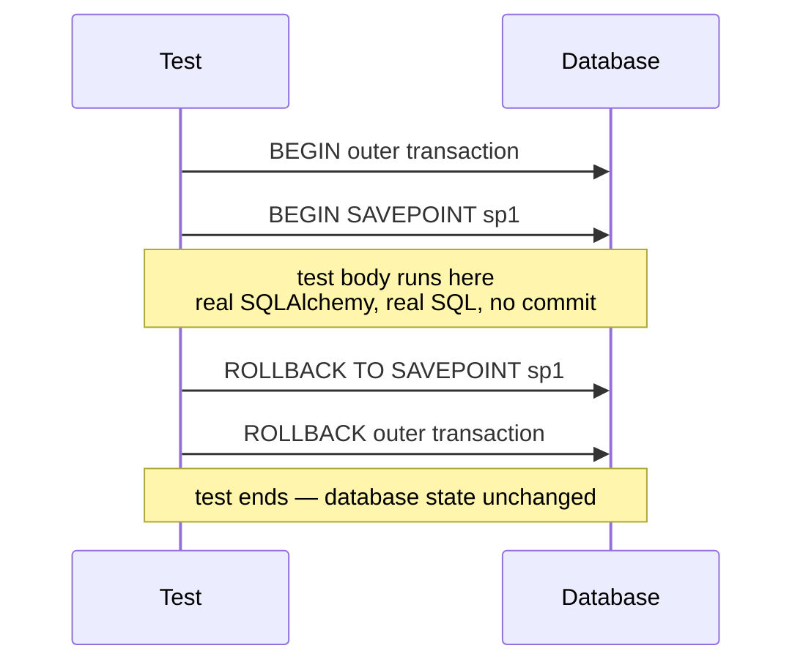
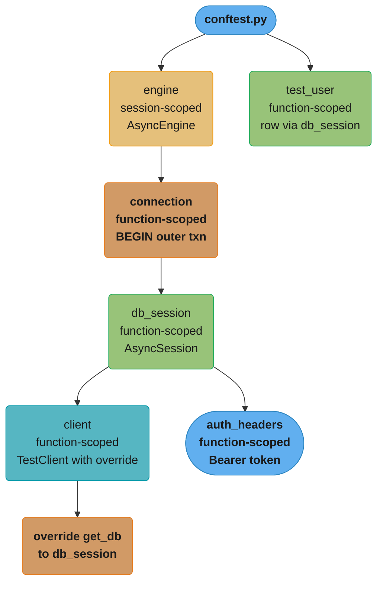
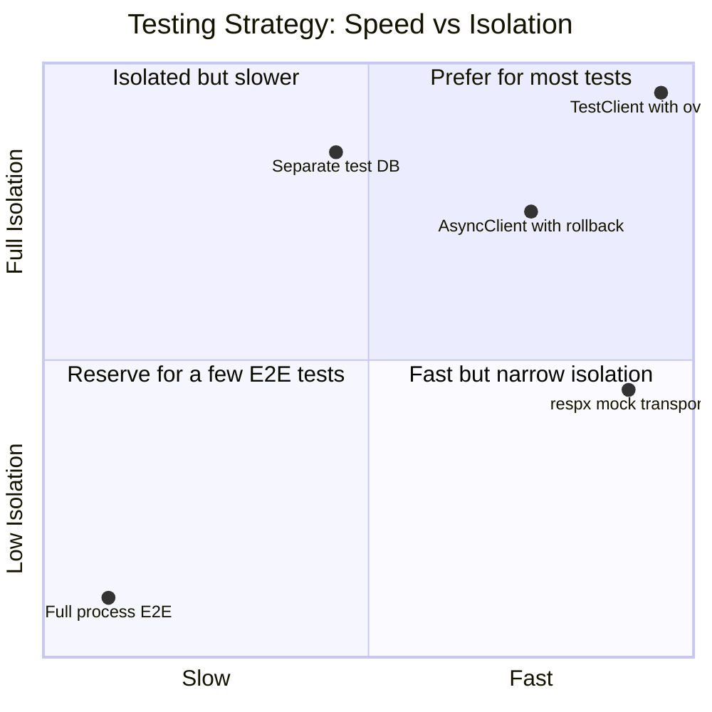
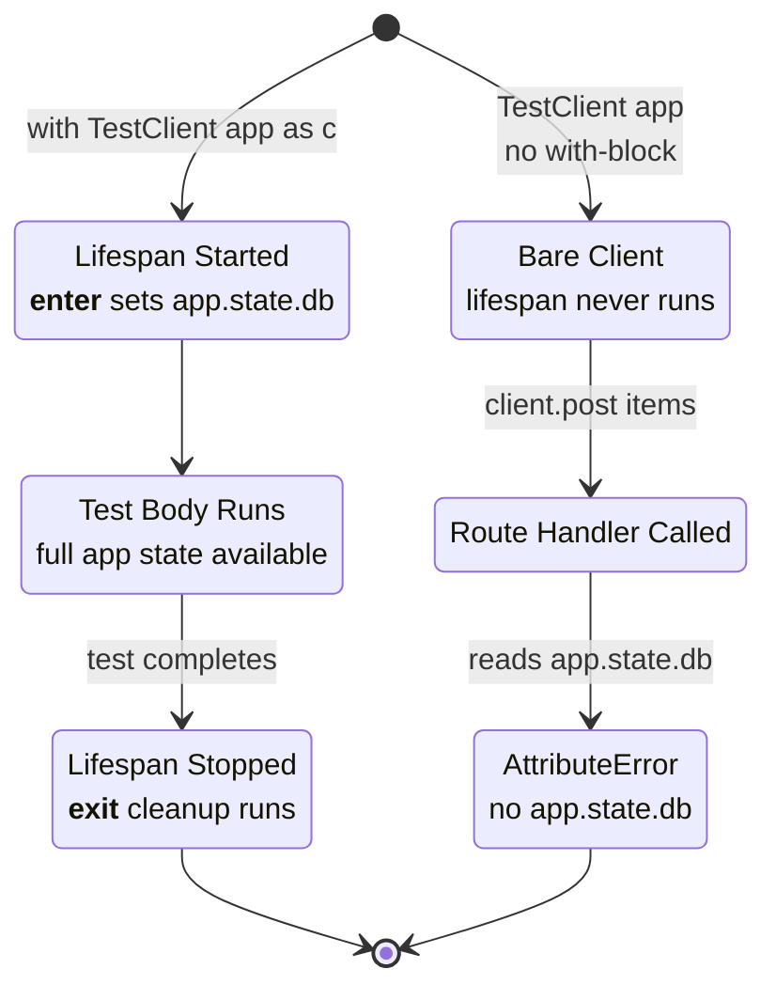

# Testing FastAPI Applications

## 1. Concept Overview

Testing a FastAPI application involves verifying HTTP behaviour, dependency injection wiring, database interactions, background tasks, WebSocket endpoints, and authentication flows — all within a controlled, reproducible environment. FastAPI's test story is built on three complementary layers:

- **`TestClient`** — Starlette's synchronous WSGI-over-ASGI adapter; wraps `httpx.Client` internally; drives the app without a real server; the simplest option for most route tests
- **`httpx.AsyncClient`** — for tests that must `await` the response or that call async fixtures; required when the test body itself is `async def`
- **`pytest` + `pytest-asyncio`** — the test runner and async bridge; `asyncio_mode = "auto"` (or `anyio_mode`) eliminates per-test `@pytest.mark.asyncio` boilerplate
- **`app.dependency_overrides`** — FastAPI's built-in mechanism for swapping any `Depends()` target with a test double at runtime, without patching module globals
- **Transaction rollback strategy** — each test wraps database work inside an uncommitted `AsyncSession`; the session is rolled back after the test; no migration teardown needed

Python version: 3.11/3.12. FastAPI version: 0.110+. Pydantic version: v2. SQLAlchemy version: 2.0+.

---

## 2. Intuition

> Testing a FastAPI app is like running a rehearsal behind a one-way mirror: the app behaves exactly as it would in production, but you control which actors show up — you can swap the real database for an in-memory one, the real auth token for a fixed test identity, and the real external HTTP call for a canned response.

**Mental model.** A FastAPI request goes through a pipeline: middleware → route match → dependency graph resolution → handler → response encoding. Testing that pipeline end-to-end with `TestClient` or `AsyncClient` gives you confidence that every layer cooperates. Dependency overrides let you freeze individual nodes in the dependency graph — injecting predictable values — while leaving the rest of the pipeline real.

**Why it matters.** Mocking at the wrong level (patching module-level globals, monkeypatching `db.execute`) produces brittle tests that break on refactors and miss integration bugs. Overriding via `dependency_overrides` is structural: you replace the contract, not the implementation detail. Tests written this way survive aggressive refactoring.

**Key insight.** The `AsyncSession` rollback strategy makes test isolation virtually free. Each test gets a fresh logical view of the database — no `TRUNCATE`, no re-migration — because the transaction is never committed. The cost is a single `BEGIN` and `ROLLBACK` per test, which is typically under 1 ms.

---

## 3. Core Principles

**1. Test through the HTTP interface.** Route tests should send real HTTP requests (via `TestClient` or `AsyncClient`) and assert on status codes, response bodies, and headers. This tests serialization, validation, and error-handling in one pass.

**2. Override dependencies, do not patch internals.** Use `app.dependency_overrides` to replace `get_db`, `get_current_user`, or `get_settings`. Never reach inside the module to patch `app.db` or `router.db`.

**3. Isolate state with transaction rollback.** Wrap each database test in an uncommitted `AsyncSession` nested inside a `SAVEPOINT`. Roll back after the test. Keep the database schema stable across the entire test run.

**4. Separate unit tests from integration tests.** Unit tests override all I/O dependencies and run without a database process. Integration tests start a real (often in-memory or test-schema) database and exercise the full ORM stack.

**5. Keep fixtures composable.** Small, single-responsibility fixtures — `db_session`, `auth_headers`, `test_user` — compose into larger scenarios without copying setup code.

**6. Run background tasks synchronously in tests.** `TestClient` executes `BackgroundTasks` callbacks synchronously before returning the response, so assertions about side-effects work immediately in sync tests. With `AsyncClient` you need to `await` the task explicitly or use `anyio.from_thread`.

---

## 4. Types / Architectures / Strategies

### 4.1 TestClient (sync)

- Backed by `httpx.Client`; the ASGI app is called synchronously via `anyio.from_thread.run_sync`
- Cannot be used in `async def` test functions without special handling
- Handles lifespan correctly **only when used as a context manager** (see Section 10 for the classic trap)
- Executes `BackgroundTasks` inline before `response` returns — useful for asserting side-effects without `await`

### 4.2 AsyncClient (async)

- Use when: the test itself is async, when testing streaming responses, or when fixtures are async generators
- Requires `pytest-asyncio` (or `anyio`) and `asyncio_mode = "auto"` in `pytest.ini` / `pyproject.toml`
- Does not execute `BackgroundTasks` synchronously — tasks run on the event loop; use `asyncio.sleep(0)` or explicit `await` to flush them
- Lifespan is triggered by `async with AsyncClient(app=app, base_url="http://test") as ac:`

### 4.3 Transaction Rollback Strategy

Wraps each test in a database transaction that is rolled back, not committed:



This is faster than truncating tables and avoids needing a test-specific migration at teardown.

### 4.4 Separate Test DB Strategy

Alternatively: run tests against a separate PostgreSQL database (or SQLite `test.db`) that is created fresh per CI run. Slower but simpler for teams unfamiliar with savepoint mechanics. Suitable when the ORM uses `expire_on_commit=True` and the rollback strategy produces `DetachedInstanceError`.

### 4.5 Dependency Override Strategy

```python
app.dependency_overrides[get_db] = lambda: test_db_session
app.dependency_overrides[get_current_user] = lambda: fake_admin_user
```

Overrides are a plain dict on the `FastAPI` instance. They are applied per-test via a fixture that sets and then deletes the override.

### 4.6 respx / httpx.MockTransport

For routes that call external HTTP services via `httpx`, use `respx` to intercept outbound requests at the transport layer — no monkey-patching needed.

---

## 5. Architecture Diagrams

### Full Test Pyramid

```
                        /\
                       /  \
                      / E2E\       <- Playwright / real server
                     /------\
                    / Integ  \     <- AsyncClient + real DB (test schema)
                   /----------\
                  /   Route    \   <- TestClient + dependency_overrides + rollback session
                 /--------------\
                /  Unit / Service \  <- No HTTP, pure Python, all I/O overridden
               /------------------\
```

### Fixture Dependency Graph (per test)



The `engine` is built once per test session; every fixture beneath it — `connection`, `db_session`, `client`, `auth_headers`, `test_user` — is rebuilt and rolled back per test, which is what keeps tests independent of each other.

### Request Flow in a Route Test

```mermaid
flowchart LR
    classDef io      fill:#61afef,stroke:#2e86c1,color:#1a1a1a,font-weight:bold
    classDef frozen  fill:#c678dd,stroke:#9b59b6,color:#fff
    classDef train   fill:#98c379,stroke:#27ae60,color:#1a1a1a
    classDef mathOp  fill:#d19a66,stroke:#e67e22,color:#1a1a1a,font-weight:bold
    classDef lossN   fill:#e06c75,stroke:#c0392b,color:#fff,font-weight:bold
    classDef req     fill:#56b6c2,stroke:#0097a7,color:#1a1a1a
    classDef base    fill:#e5c07b,stroke:#f39c12,color:#1a1a1a

    TB(["test body"]) --> POST(["TestClient.post<br/>POST /items/"])
    POST --> ASGI("ASGI app<br/>FastAPI")
    ASGI --> MW("Middleware stack<br/>CORS, auth, etc.")
    MW --> RM("Route matching<br/>POST /items/")
    RM --> DEP("Dependency resolution<br/>get_db, get_current_user<br/>both overridden")
    DEP --> HANDLER("Route handler<br/>items.create<br/>inner commit only")
    HANDLER --> ENC("Response encoding<br/>Pydantic v2")
    ENC --> RESP(["Response 201<br/>Created"])
    RESP --> ASSERT(["assert status_code == 201"])

    class TB io
    class POST req
    class ASGI base
    class MW mathOp
    class RM mathOp
    class DEP mathOp
    class HANDLER train
    class ENC mathOp
    class RESP io
    class ASSERT train
```



Middleware, routing, and dependency resolution all run for real; only the two overridden dependencies (`get_db`, `get_current_user`) are swapped, and the handler's `db.commit()` only closes the inner SAVEPOINT — the outer transaction (and the real database) is never touched.

---

## 6. How It Works — Detailed Mechanics

### 6.1 pytest configuration

```ini
# pyproject.toml
[tool.pytest.ini_options]
asyncio_mode = "auto"         # all async def tests run under asyncio automatically
testpaths = ["tests"]
addopts = "--strict-markers --tb=short"
```

With `asyncio_mode = "auto"`, every `async def test_*` function runs under the `asyncio` event loop without needing `@pytest.mark.asyncio`. This is the recommended configuration for FastAPI projects.

### 6.2 Engine and session fixtures

```python
# tests/conftest.py
import pytest
import pytest_asyncio
from sqlalchemy.ext.asyncio import (
    AsyncSession,
    create_async_engine,
    async_sessionmaker,
)
from sqlalchemy.pool import StaticPool
from app.database import Base
from app.main import app
from app.dependencies import get_db

DATABASE_URL = "sqlite+aiosqlite:///:memory:"

@pytest_asyncio.fixture(scope="session")
async def engine():
    eng = create_async_engine(
        DATABASE_URL,
        connect_args={"check_same_thread": False},
        poolclass=StaticPool,  # share single connection across async tasks
    )
    async with eng.begin() as conn:
        await conn.run_sync(Base.metadata.create_all)
    yield eng
    await eng.dispose()

@pytest_asyncio.fixture
async def db_session(engine):
    """
    Each test gets a fresh AsyncSession wrapping a savepoint.
    The outer transaction is rolled back after the test — database
    state is never durably changed.
    """
    async with engine.connect() as conn:
        await conn.begin()                         # outer transaction
        session = AsyncSession(
            bind=conn,
            expire_on_commit=False,               # prevent DetachedInstanceError
        )
        await conn.begin_nested()                  # SAVEPOINT sp1

        yield session

        await session.close()
        await conn.rollback()                      # roll back outer transaction
```

### 6.3 TestClient fixture with dependency override

```python
# tests/conftest.py  (continued)
from starlette.testclient import TestClient

@pytest.fixture
def client(db_session):
    def override_get_db():
        yield db_session

    app.dependency_overrides[get_db] = override_get_db

    # FIX: use TestClient as context manager to trigger lifespan
    with TestClient(app) as c:           # __enter__ runs lifespan startup
        yield c                           # __exit__ runs lifespan shutdown

    app.dependency_overrides.clear()      # never leak overrides between tests
```

### 6.4 AsyncClient fixture

```python
# tests/conftest.py  (continued)
import httpx

@pytest_asyncio.fixture
async def async_client(db_session):
    def override_get_db():
        yield db_session

    app.dependency_overrides[get_db] = override_get_db

    async with httpx.AsyncClient(
        app=app,
        base_url="http://test",
        headers={"Content-Type": "application/json"},
    ) as ac:
        yield ac

    app.dependency_overrides.clear()
```

### 6.5 Auth override

```python
# tests/conftest.py  (continued)
from app.dependencies import get_current_user
from app.models import User

@pytest.fixture
def fake_admin(db_session):
    return User(id=1, email="admin@example.com", role="admin", is_active=True)

@pytest.fixture
def admin_client(db_session, fake_admin):
    app.dependency_overrides[get_db] = lambda: (yield db_session)
    app.dependency_overrides[get_current_user] = lambda: fake_admin

    with TestClient(app) as c:
        yield c

    app.dependency_overrides.clear()
```

### 6.6 Factory fixture

```python
# tests/factories.py
from app.models import Item

async def create_item(
    db: AsyncSession,
    *,
    name: str = "default",
    price: float = 9.99,
    owner_id: int = 1,
) -> Item:
    item = Item(name=name, price=price, owner_id=owner_id)
    db.add(item)
    await db.flush()        # assign PK without committing
    return item
```

```python
# tests/test_items.py
import pytest
from tests.factories import create_item

@pytest.mark.anyio
async def test_get_item_returns_200(async_client, db_session):
    item = await create_item(db_session, name="Widget", price=4.99)
    response = await async_client.get(f"/items/{item.id}")
    assert response.status_code == 200
    assert response.json()["name"] == "Widget"
```

### 6.7 Mocking external HTTP with respx

```python
import respx
import httpx

@respx.mock
def test_enrich_order_calls_pricing_api(client):
    respx.get("https://pricing.internal/v1/price/SKU-42").mock(
        return_value=httpx.Response(200, json={"price": 12.50})
    )
    response = client.post("/orders/", json={"sku": "SKU-42", "qty": 3})
    assert response.status_code == 201
    assert response.json()["total"] == 37.50
```

### 6.8 Testing WebSocket endpoints

```python
from starlette.testclient import TestClient

def test_websocket_echo(client):
    with client.websocket_connect("/ws/echo") as ws:
        ws.send_text("hello")
        data = ws.receive_text()
        assert data == "hello"
```

`TestClient` drives the WebSocket protocol synchronously. The `websocket_connect` context manager handles the upgrade handshake and closes the connection on exit.

### 6.9 Testing BackgroundTasks

```python
# app/routes/orders.py
from fastapi import BackgroundTasks

@router.post("/orders/")
async def create_order(payload: OrderIn, bg: BackgroundTasks, db: AsyncSession = Depends(get_db)):
    order = Order(**payload.model_dump())
    db.add(order)
    await db.flush()
    bg.add_task(send_confirmation_email, order.id)   # async function
    return order
```

```python
# tests/test_orders.py
from unittest.mock import AsyncMock, patch

def test_create_order_enqueues_email(client):
    with patch("app.routes.orders.send_confirmation_email", new_callable=AsyncMock) as mock_email:
        response = client.post("/orders/", json={"item_id": 1})
        assert response.status_code == 201
        # TestClient flushes BackgroundTasks synchronously before returning
        mock_email.assert_called_once_with(response.json()["id"])
```

---

## 7. Real-World Examples

### FastAPI official tutorial pattern

The FastAPI documentation recommends `TestClient` from `starlette.testclient` for simple synchronous tests and `httpx.AsyncClient` with `pytest-asyncio` for async database tests. The official example uses `SQLite` in-memory for CI speed and PostgreSQL for staging.

### Full-stack projects (Tiangolo's full-stack template)

The `full-stack-fastapi-template` (github.com/tiangolo/full-stack-fastapi-template) uses:
- `pytest-asyncio` with `asyncio_mode = "auto"`
- A `PostgreSQL` test database per CI job (separate schema, not rollback strategy)
- `httpx.AsyncClient` for all API tests
- `faker` for generating test data instead of `factory_boy`

### Pydantic v2 integration testing

When testing Pydantic v2 request/response models, assert on `response.json()` directly rather than reconstructing model objects — this verifies the serialized contract, not the Python object.

```python
def test_item_response_schema(client):
    response = client.get("/items/1")
    body = response.json()
    assert set(body.keys()) == {"id", "name", "price", "created_at"}
    assert isinstance(body["price"], float)
```

---

## 8. Tradeoffs

| Strategy | Isolation | Speed | Complexity | Best for |
|---|---|---|---|---|
| `TestClient` + `dependency_overrides` | Full (I/O mocked) | Very fast (< 1 ms/test) | Low | Unit-style route tests |
| `AsyncClient` + rollback session | DB-level | Fast (1–5 ms/test) | Medium | Integration tests with real ORM |
| Separate test DB (truncate) | Full DB | Moderate (10–50 ms/test) | Medium | Teams unfamiliar with savepoints |
| Full process (real server + real DB) | None | Slow (100 ms+/test) | High | E2E smoke tests |
| `respx` mock transport | HTTP boundary | Very fast | Low | Routes that call external APIs |

Plotting the same five strategies on speed against isolation shows why `TestClient` + `dependency_overrides` is the default: it sits in the corner every other strategy trades away.



| Client | Sync/Async test | Lifespan | BackgroundTasks | WebSocket |
|---|---|---|---|---|
| `TestClient` | Sync | Context manager only | Runs synchronously | Yes |
| `httpx.AsyncClient` | Async | `async with` | Does not run synchronously | No (use `websockets` lib) |

---

## 9. When to Use / When NOT to Use

### Use TestClient when:

- The test is `def` (not `async def`) and simplicity matters
- You need to verify `BackgroundTasks` ran synchronously
- Testing WebSocket endpoints
- All external I/O is overridden via `dependency_overrides`

### Use AsyncClient when:

- The test is `async def` and uses async fixtures (e.g., `db_session` as async generator)
- Testing streaming responses (`StreamingResponse`, SSE)
- Using `pytest-asyncio` with async database sessions

### Use the transaction rollback strategy when:

- Tests mutate database state and you want per-test isolation without migration teardown
- The CI database is shared across parallel test workers (`pytest-xdist` requires unique savepoints per worker)

### Do NOT use:

- `app.dependency_overrides` without clearing in teardown — stale overrides from one test corrupt the next
- `scope="session"` for `db_session` — session-scoped sessions accumulate dirty state across tests
- `TestClient` outside a context manager when the app uses `lifespan` — startup never runs (see Section 10)
- `AsyncClient` for WebSocket tests — use `TestClient.websocket_connect`

---

## 10. Common Pitfalls

### BROKEN / FIX 1: TestClient without lifespan context manager

```python
# BROKEN: creating TestClient without lifespan — startup never runs
@pytest.fixture
def client():
    return TestClient(app)      # lifespan __aenter__ is never called

def test_create_item(client):
    response = client.post("/items/", json={"name": "test"})
    # If the route reads app.state.db (set in lifespan), this crashes:
    # AttributeError: 'State' object has no attribute 'db'
```

```python
# FIX: use TestClient as context manager to trigger lifespan
@pytest.fixture
def client(app):
    with TestClient(app) as c:  # __enter__ runs lifespan startup, __exit__ runs shutdown
        yield c
```

The two fixtures put the client on entirely different paths: one never enters the lifespan states at all, the other walks through startup and shutdown exactly like production.



The lifespan context manager was introduced as the recommended pattern in Starlette 0.20+ / FastAPI 0.93+. Before that, startup/shutdown events were separate signals; `TestClient` did not guarantee they fired unless used as a context manager.

### BROKEN / FIX 2: Leaking dependency overrides between tests

```python
# BROKEN: override set but never cleared
@pytest.fixture
def client(db_session):
    app.dependency_overrides[get_db] = lambda: (yield db_session)
    return TestClient(app)      # no cleanup

def test_a(client): ...  # override is active

def test_b():           # no client fixture, but override is still in app.dependency_overrides
    c = TestClient(app)
    response = c.get("/items/")   # unexpectedly hits test_a's db_session — DetachedInstanceError
```

```python
# FIX: always clear overrides in fixture teardown
@pytest.fixture
def client(db_session):
    app.dependency_overrides[get_db] = lambda: (yield db_session)
    with TestClient(app) as c:
        yield c
    app.dependency_overrides.clear()   # runs even if test raises
```

### BROKEN / FIX 3: expire_on_commit=True causes DetachedInstanceError

```python
# BROKEN: default expire_on_commit=True
session = AsyncSession(bind=conn)   # expire_on_commit defaults to True

async def test_read_item(db_session, async_client):
    item = await create_item(db_session)
    await db_session.commit()       # expires all attributes on `item`
    assert item.name == "Widget"    # DetachedInstanceError: Instance is not bound to a Session
```

```python
# FIX: set expire_on_commit=False on the test session
session = AsyncSession(
    bind=conn,
    expire_on_commit=False,   # attributes remain accessible after commit/flush
)
```

### Pitfall 4: Asserting BackgroundTasks ran with AsyncClient

```python
# BROKEN: AsyncClient does not flush BackgroundTasks before response
async def test_order_email(async_client):
    with patch("app.routes.orders.send_email", new_callable=AsyncMock) as m:
        await async_client.post("/orders/", json={"item_id": 1})
        m.assert_called_once()   # FAILS — task may not have run yet
```

```python
# FIX: use TestClient (sync) for BackgroundTasks assertions, or flush manually
def test_order_email(client):    # sync TestClient
    with patch("app.routes.orders.send_email", new_callable=AsyncMock) as m:
        client.post("/orders/", json={"item_id": 1})
        m.assert_called_once()   # passes — TestClient runs tasks synchronously
```

### Pitfall 5: Using scope="session" for db_session

```python
# BROKEN: session-scoped db_session accumulates dirty state
@pytest_asyncio.fixture(scope="session")
async def db_session(engine):
    session = AsyncSession(engine)
    yield session
    await session.close()
    # test_a creates user(id=1); test_b tries to create user(id=1) again → IntegrityError
```

```python
# FIX: function scope for db_session, session scope only for engine
@pytest_asyncio.fixture(scope="session")
async def engine(): ...    # expensive setup, done once

@pytest_asyncio.fixture                # function scope (default)
async def db_session(engine): ...      # fresh session, rolled back per test
```

---

## 11. Technologies & Tools

| Tool | Role | Notes |
|---|---|---|
| `pytest` | Test runner, fixture system | Required; 7.x+ |
| `pytest-asyncio` | Async test support | `asyncio_mode = "auto"` eliminates per-test decorator |
| `anyio` / `pytest-anyio` | Alternative async backend | Use when targeting both `asyncio` and `trio` |
| `httpx` | HTTP client for `AsyncClient` | Already a FastAPI/Starlette dependency |
| `starlette.testclient.TestClient` | Sync HTTP client | Bundled with Starlette; no extra install |
| `respx` | httpx mock transport | Intercepts outbound httpx calls without monkey-patching |
| `factory_boy` | Model factory | Async-compatible via `factory.alchemy.AsyncSQLAlchemyModelFactory`; optional |
| `pytest-cov` | Coverage reporting | `--cov=app --cov-report=term-missing` |
| `sqlalchemy[asyncio]` + `aiosqlite` | Async ORM + in-memory SQLite driver | Fast CI without a PostgreSQL process |
| `faker` | Realistic test data | Useful in factory fixtures |
| `freezegun` | Freeze `datetime.now()` | For testing time-sensitive routes |

---

## 12. Interview Questions with Answers

**Q1: What is the difference between `TestClient` and `httpx.AsyncClient` for FastAPI tests?**
`TestClient` is synchronous — it wraps the ASGI app via `anyio.from_thread.run_sync` and allows `def` test functions. `httpx.AsyncClient` is asynchronous — it must be `await`-ed and is used inside `async def` test functions with `pytest-asyncio`. `TestClient` flushes `BackgroundTasks` synchronously before returning; `AsyncClient` does not. Use `TestClient` for simplicity; use `AsyncClient` when fixtures or assertions require `await`.

**Q2: Why must TestClient be used as a context manager when the app uses lifespan?**
FastAPI's lifespan function runs startup logic inside `__aenter__` and shutdown logic inside `__aexit__`. Constructing `TestClient(app)` directly does not call `__aenter__`, so startup never runs — any state set in `lifespan` (e.g., `app.state.db`) is missing. Using `with TestClient(app) as c:` triggers the lifespan on entry and shuts it down on exit, matching production behaviour exactly.

**Q3: How does `app.dependency_overrides` work and why is it better than `monkeypatch`?**
`dependency_overrides` is a dict on the `FastAPI` instance mapping a dependency callable to a replacement callable. Before each request, FastAPI resolves the dependency graph and substitutes any callable found in `dependency_overrides`. It is better than `monkeypatch` because it operates at the contract level (the function signature FastAPI resolves) rather than the module level (a name in a namespace). The override survives refactors that rename or move the implementation but keep the same dependency function.

**Q4: Explain the transaction rollback strategy for test database isolation.**
Each test acquires a database connection, begins an outer transaction, then begins a `SAVEPOINT` (`BEGIN NESTED`). The test body — including all ORM flushes and even explicit `commit()` calls on the test session — executes within this savepoint. After the test, the fixture rolls back the outer connection, discarding all changes. No rows persist to disk; the schema remains intact. This avoids table truncation or re-migration and keeps each test under 5 ms of overhead.

**Q5: Why set `expire_on_commit=False` on the test AsyncSession?**
By default, SQLAlchemy expires all ORM instance attributes after a `commit()`, forcing a new `SELECT` on next access. In tests, the session is rolled back after the test — the connection is gone — so any lazy-load attempt on an expired attribute raises `DetachedInstanceError`. Setting `expire_on_commit=False` keeps attribute values in memory, safe to access after commit within the test.

**Q6: How do you test an endpoint that sends an email as a BackgroundTask?**
Patch the email function with `unittest.mock.AsyncMock` (for async functions) or `MagicMock` (for sync), then call the endpoint via `TestClient`. Because `TestClient` executes `BackgroundTasks` synchronously before returning the response object, you can call `mock_email.assert_called_once_with(expected_args)` immediately after the response.

**Q7: How would you test a WebSocket endpoint with TestClient?**
Use `client.websocket_connect("/ws/path")` as a context manager. Inside the block, call `ws.send_text()` / `ws.send_json()` to send messages and `ws.receive_text()` / `ws.receive_json()` to read responses. `TestClient` handles the HTTP upgrade handshake internally. Exit the context manager to close the connection and trigger any server-side disconnect handlers.

**Q8: What is `asyncio_mode = "auto"` and when is it needed?**
`asyncio_mode = "auto"` is a `pytest-asyncio` configuration option (set in `pyproject.toml` or `pytest.ini`) that automatically marks every `async def test_*` function and every `async def` fixture for asyncio execution without requiring `@pytest.mark.asyncio` on each one. It is needed whenever tests or fixtures are `async def` — which is the common case in FastAPI applications using async database sessions.

**Q9: How do you mock outbound HTTP calls made by your FastAPI routes?**
Use the `respx` library, which intercepts `httpx` transport at the session level without patching globals. Decorate the test with `@respx.mock` and configure routes with `respx.get(url).mock(return_value=httpx.Response(200, json={...}))`. Any `httpx` call matching the pattern returns the mocked response; unmatched calls raise `respx.MockNotFoundError`, preventing accidental real network calls.

**Q10: What is the danger of using `scope="session"` for `db_session` fixtures?**
A session-scoped database session persists across the entire test run. Tests that insert rows accumulate state — test B sees rows created by test A, and tests that create the same primary key twice get `IntegrityError`. Test order becomes significant, and tests are no longer independent. The engine can be session-scoped (expensive setup once), but the session itself must be function-scoped with the rollback strategy to ensure isolation.

**Q11: How do you override a setting (from pydantic-settings) in a FastAPI test?**
Define a `get_settings` dependency in the app that returns the `Settings` object, then override it in tests:

```python
from app.config import Settings, get_settings

@pytest.fixture
def client_with_test_settings(db_session):
    test_settings = Settings(feature_flag_x=True, rate_limit=9999)
    app.dependency_overrides[get_settings] = lambda: test_settings
    with TestClient(app) as c:
        yield c
    app.dependency_overrides.clear()
```

This avoids environment variable manipulation and keeps settings immutable within the test.

**Q12: How do you measure test coverage and what should you target?**
Run `pytest --cov=app --cov-report=term-missing --cov-fail-under=80`. Target 80–90 % line coverage for the `app/` package. Prioritise covering: route handlers (all status codes), dependency functions (`get_db`, `get_current_user`), error paths (`HTTPException` branches), and Pydantic validation rejections. Do not chase 100 % — generated code (Pydantic model fields, SQLAlchemy columns), migration scripts, and `__main__` blocks add noise without value.

**Q13: How do you handle `pytest-xdist` parallel execution with the rollback strategy?**
Each worker process gets its own database connection and its own savepoint. Because the rollback strategy never commits to shared tables, workers do not interfere. The only risk is if two workers use a sequence that generates the same primary key — avoid hard-coded IDs in factories; use `db.flush()` to let the sequence assign PKs. For the SQLite in-memory engine use `StaticPool` with a single connection; for PostgreSQL use a per-worker schema prefix or a separate test database per worker (`--dist=loadscope` with schema isolation).

**Q14: What breaks when a `dependency_overrides` entry is set in a fixture but never cleared in teardown?**
An uncleared override stays on the shared `FastAPI` app object after the test that set it finishes, so any later test that builds a fresh `TestClient` from the same `app` instance unknowingly inherits it. A second test with no `client` fixture at all can end up hitting the first test's already-closed `db_session`, producing a confusing `DetachedInstanceError` that has nothing to do with the second test's own code. Always pair `app.dependency_overrides[dep] = ...` with `app.dependency_overrides.clear()` in a `yield`-based fixture's teardown so cleanup runs even when the test raises.

**Q15: Why does the SQLite in-memory engine fixture pass `poolclass=StaticPool` instead of using the default connection pool?**
`sqlite+aiosqlite:///:memory:` opens a brand-new, empty database on every new connection, so SQLAlchemy's default pool would hand different async tasks completely separate, unrelated databases. `StaticPool` forces every checkout to reuse the exact same underlying connection for the lifetime of the engine, so the tables created once at fixture setup remain visible to every session used across the test. Always pair an in-memory SQLite engine with `StaticPool` and `connect_args={"check_same_thread": False}` to keep the schema and data consistent across async test code.

**Q16: How would you use `freezegun` to test that an expired JWT is correctly rejected?**
Wrap the token-creation and the request-under-test in separate `freeze_time` contexts so the clock the application reads is deterministic rather than depending on real wall-clock timing. Create the token while frozen at a known issue time, then re-enter `with freeze_time(issue_time + timedelta(minutes=31)):` around the request call for a token whose `exp` claim was set to a 30-minute lifetime, forcing the expiry check to evaluate against a time strictly past the boundary. This avoids the flakiness of `time.sleep(1860)` and makes the boundary condition (`now == exp` vs `now > exp`) exactly reproducible on every CI run.

---

## 13. Best Practices

1. **Always use `TestClient` as a context manager.** `with TestClient(app) as c: yield c` — never construct and return directly.
2. **Clear `dependency_overrides` in fixture teardown**, not in the test body — teardown runs even when the test raises.
3. **Set `expire_on_commit=False`** on every test `AsyncSession` to prevent `DetachedInstanceError`.
4. **Use `db.flush()` instead of `db.commit()`** in factory helpers to assign PKs without breaking the rollback boundary.
5. **Keep fixture scope minimal**: `engine` at `session`, everything else at `function`.
6. **Use `respx` for outbound HTTP** rather than patching `httpx.Client` globals — it is transport-level and survives refactors.
7. **Do not use `AsyncClient` for BackgroundTask assertions** — use `TestClient` or explicitly `await` the task.
8. **Parametrize validation tests**: use `@pytest.mark.parametrize` to cover multiple invalid payloads in one test function.
9. **Assert on `response.json()` keys and types**, not just status codes — this verifies serialization contracts.
10. **Configure `asyncio_mode = "auto"`** in `pyproject.toml` to remove boilerplate; avoid mixing `@pytest.mark.asyncio` with auto mode.
11. **Use `scope="module"` for expensive non-DB fixtures** (e.g., compiled regex, large ML model stubs) to amortize setup cost.
12. **Gate on `--cov-fail-under=80`** in CI; allow `# pragma: no cover` only for genuinely unreachable branches.

---

## 14. Case Study

### Scenario: Testing a multi-tenant item API with async database and auth

The application has:
- `POST /items/` — creates an item, owned by the authenticated user
- `GET /items/{item_id}` — returns item if the caller owns it, else 403
- A `lifespan` that opens a Redis connection for rate limiting

#### Architecture

```
tests/
  conftest.py          ← engine, db_session, client, auth_headers fixtures
  factories.py         ← create_user(), create_item() async helpers
  test_items.py        ← route-level tests using TestClient
  test_items_async.py  ← integration tests using AsyncClient

app/
  main.py              ← FastAPI app with lifespan (Redis)
  dependencies.py      ← get_db, get_current_user, get_settings
  models.py            ← User, Item (SQLAlchemy 2.0)
  routes/items.py      ← POST /items/, GET /items/{id}
```

#### conftest.py

```python
import pytest
import pytest_asyncio
import httpx
from sqlalchemy.ext.asyncio import (
    AsyncSession, create_async_engine, async_sessionmaker,
)
from sqlalchemy.pool import StaticPool
from unittest.mock import AsyncMock, MagicMock, patch

from app.main import app
from app.models import Base
from app.dependencies import get_db, get_current_user, get_settings
from app.config import Settings

DATABASE_URL = "sqlite+aiosqlite:///:memory:"

@pytest_asyncio.fixture(scope="session")
async def engine():
    eng = create_async_engine(
        DATABASE_URL,
        connect_args={"check_same_thread": False},
        poolclass=StaticPool,
    )
    async with eng.begin() as conn:
        await conn.run_sync(Base.metadata.create_all)
    yield eng
    await eng.dispose()

@pytest_asyncio.fixture
async def db_session(engine):
    async with engine.connect() as conn:
        await conn.begin()
        session = AsyncSession(bind=conn, expire_on_commit=False)
        await conn.begin_nested()   # SAVEPOINT
        yield session
        await session.close()
        await conn.rollback()

@pytest.fixture
def fake_user():
    from app.models import User
    return User(id=42, email="alice@example.com", role="user", is_active=True)

@pytest.fixture
def client(db_session, fake_user):
    app.dependency_overrides[get_db] = lambda: (yield db_session)
    app.dependency_overrides[get_current_user] = lambda: fake_user
    app.dependency_overrides[get_settings] = lambda: Settings(redis_url="redis://mock")

    # Mock lifespan Redis connection so no real Redis needed in CI
    with patch("app.main.redis.from_url", return_value=AsyncMock()):
        with TestClient(app) as c:   # triggers lifespan
            yield c

    app.dependency_overrides.clear()

@pytest_asyncio.fixture
async def async_client(db_session, fake_user):
    app.dependency_overrides[get_db] = lambda: (yield db_session)
    app.dependency_overrides[get_current_user] = lambda: fake_user

    async with httpx.AsyncClient(app=app, base_url="http://test") as ac:
        yield ac

    app.dependency_overrides.clear()
```

#### factories.py

```python
from sqlalchemy.ext.asyncio import AsyncSession
from app.models import User, Item

async def create_user(
    db: AsyncSession,
    *,
    email: str = "user@test.com",
    role: str = "user",
) -> User:
    user = User(email=email, role=role, is_active=True)
    db.add(user)
    await db.flush()   # assigns id without committing
    return user

async def create_item(
    db: AsyncSession,
    *,
    name: str = "Widget",
    price: float = 9.99,
    owner_id: int,
) -> Item:
    item = Item(name=name, price=price, owner_id=owner_id)
    db.add(item)
    await db.flush()
    return item
```

#### test_items.py (sync TestClient)

```python
from starlette.testclient import TestClient
from tests.factories import create_item
import pytest

def test_create_item_returns_201(client, fake_user, db_session):
    # arrange — db_session is the same session the route uses (via override)
    response = client.post("/items/", json={"name": "Gadget", "price": 19.99})
    assert response.status_code == 201
    body = response.json()
    assert body["name"] == "Gadget"
    assert body["owner_id"] == fake_user.id
    assert "id" in body

def test_get_item_owned_by_user_returns_200(client, fake_user, db_session):
    import asyncio
    item = asyncio.get_event_loop().run_until_complete(
        create_item(db_session, name="Widget", owner_id=fake_user.id)
    )
    response = client.get(f"/items/{item.id}")
    assert response.status_code == 200
    assert response.json()["name"] == "Widget"

def test_get_item_owned_by_other_returns_403(client, db_session):
    import asyncio
    other = asyncio.get_event_loop().run_until_complete(
        create_item(db_session, name="Other", owner_id=999)
    )
    response = client.get(f"/items/{other.id}")
    assert response.status_code == 403

@pytest.mark.parametrize("payload,expected_detail", [
    ({"name": "", "price": 9.99}, "name"),
    ({"name": "ok", "price": -1.0}, "price"),
    ({}, "name"),
])
def test_create_item_validation(client, payload, expected_detail):
    response = client.post("/items/", json=payload)
    assert response.status_code == 422
    errors = response.json()["detail"]
    assert any(expected_detail in str(e["loc"]) for e in errors)
```

#### test_items_async.py (AsyncClient integration tests)

```python
import pytest
from tests.factories import create_item, create_user

@pytest.mark.anyio
async def test_create_and_read_item(async_client, db_session, fake_user):
    response = await async_client.post(
        "/items/",
        json={"name": "AsyncWidget", "price": 5.00},
    )
    assert response.status_code == 201
    item_id = response.json()["id"]

    response = await async_client.get(f"/items/{item_id}")
    assert response.status_code == 200
    assert response.json()["price"] == 5.00

@pytest.mark.anyio
async def test_item_not_found_returns_404(async_client):
    response = await async_client.get("/items/99999")
    assert response.status_code == 404
```

#### BROKEN / FIX: forgetting to mock the lifespan Redis in TestClient

```python
# BROKEN: TestClient context manager triggers lifespan; lifespan tries real Redis
@pytest.fixture
def client(db_session, fake_user):
    app.dependency_overrides[get_db] = lambda: (yield db_session)
    app.dependency_overrides[get_current_user] = lambda: fake_user
    with TestClient(app) as c:   # lifespan runs: redis.from_url("redis://localhost") — ConnectionRefusedError in CI
        yield c
    app.dependency_overrides.clear()
```

```python
# FIX: mock the Redis client at the module where it is imported
from unittest.mock import AsyncMock, patch

@pytest.fixture
def client(db_session, fake_user):
    app.dependency_overrides[get_db] = lambda: (yield db_session)
    app.dependency_overrides[get_current_user] = lambda: fake_user
    with patch("app.main.redis.from_url", return_value=AsyncMock()) as _:
        with TestClient(app) as c:   # lifespan now uses mock Redis
            yield c
    app.dependency_overrides.clear()
```

#### Discussion Questions

1. Why is the `db_session` fixture function-scoped rather than module-scoped, even though the engine is session-scoped?
2. The `create_item` factory calls `db.flush()` instead of `db.commit()`. What would break if it called `db.commit()` instead?
3. For `test_get_item_owned_by_other_returns_403`, the test inserts a row with `owner_id=999` that is not the authenticated user. How does this test remain isolated from other tests given the rollback strategy?
4. How would you extend the test suite to verify the rate-limiting middleware rejects requests after 100 calls per minute, using the mocked Redis?
5. If a new developer adds `expire_on_commit=True` to the `AsyncSession` in `conftest.py`, which test would fail first, and with what error?
