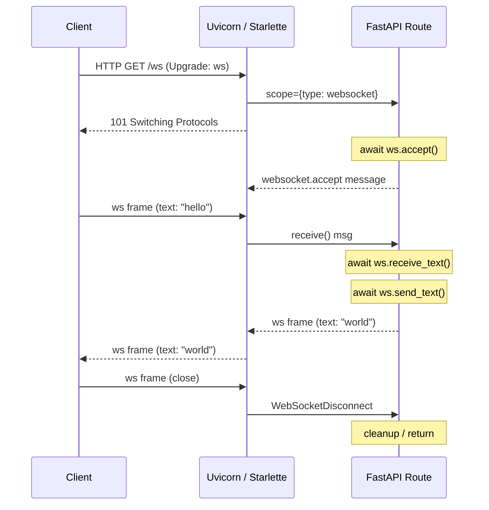
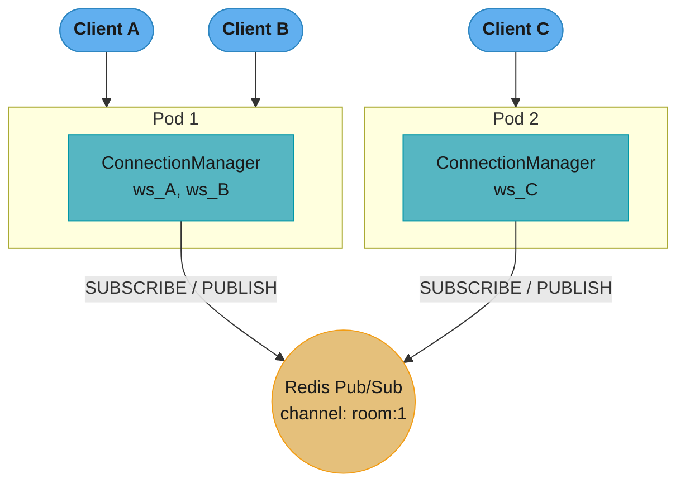
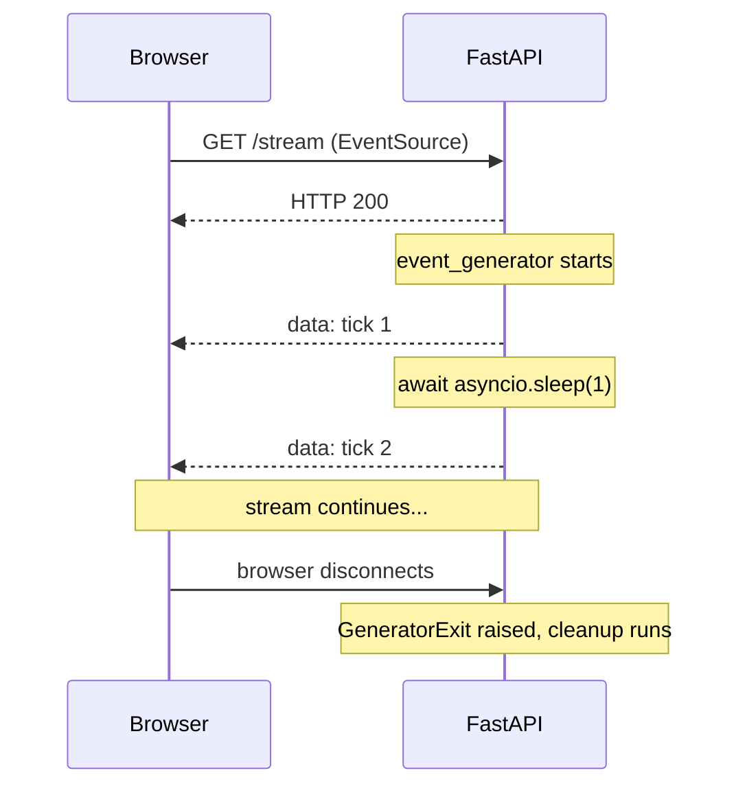
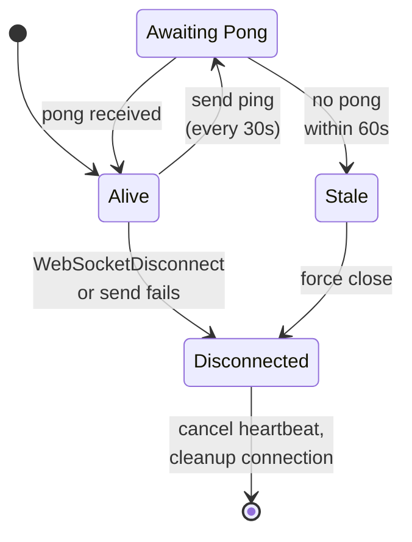
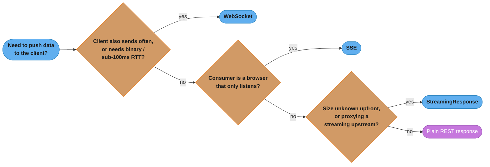
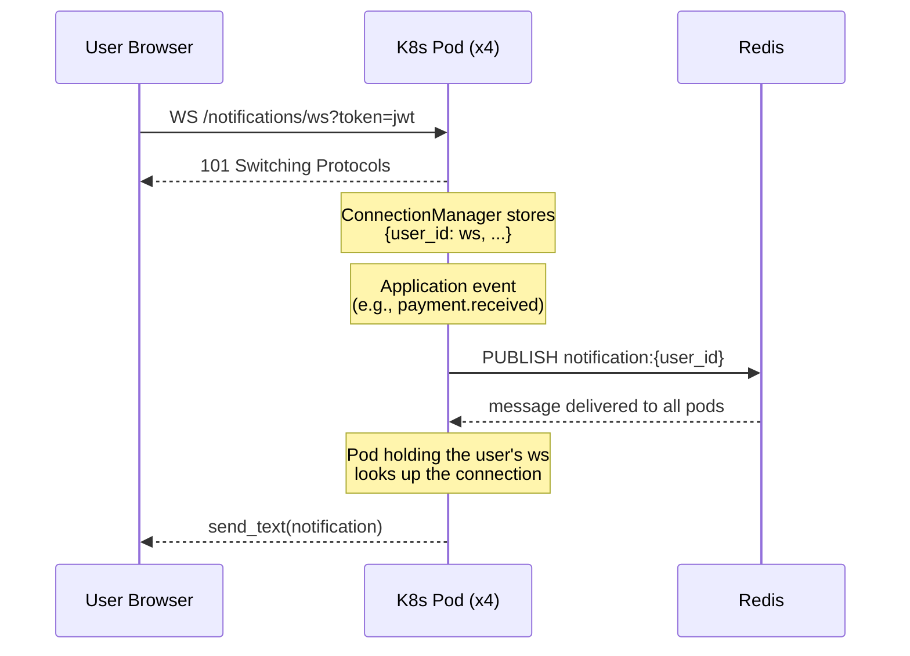

# WebSockets, SSE, and Streaming

---

## 1. Concept Overview

FastAPI supports three push-communication primitives on top of the ASGI protocol:

1. **WebSockets** — full-duplex, persistent TCP connections. Either side can send at any time.
   FastAPI exposes them through the `WebSocket` object; Starlette handles the HTTP Upgrade
   handshake and framing.

2. **Server-Sent Events (SSE)** — unidirectional HTTP streams where the server pushes a series
   of `data:` frames over a single long-lived `Content-Type: text/event-stream` response. The
   browser `EventSource` API handles reconnection automatically.

3. **StreamingResponse** — an ASGI streaming body where an async generator yields chunks as
   they become available. Used for large file downloads, LLM token streaming, and any response
   where the total size is not known at the start.

Key concepts covered in this module:

- WebSocket lifecycle: `accept`, `receive_*`, `send_*`, `close`
- `WebSocketDisconnect` exception and graceful teardown
- `ConnectionManager` class for in-process broadcasting
- Redis pub/sub for multi-pod fan-out
- SSE with `StreamingResponse` and `sse-starlette`'s `EventSourceResponse`
- `StreamingResponse` with async generators
- Backpressure and `asyncio.Queue` buffering
- Heartbeat / ping-pong for stale-connection detection
- JWT authentication in WebSocket connections

Cross-references:
- Async generators and backpressure fundamentals: `../../async_patterns_and_pitfalls/README.md`
- ASGI protocol and Starlette internals: `../fastapi_fundamentals_asgi/README.md`
- Production multi-pod streaming architecture: `../../../llm/case_studies/cross_cutting/streaming_at_scale.md`

---

## 2. Intuition

> A REST endpoint is a vending machine — you put in a coin, get a product, the transaction ends.
> A WebSocket is a telephone call — both parties stay on the line and talk whenever they want.
> SSE is a radio broadcast — the station transmits continuously, listeners tune in and receive.

**Mental model:** HTTP is inherently request-response. Every new message from the server requires
a new HTTP request from the client — polling. WebSockets replace that with a single TCP connection
that stays open indefinitely; either side sends a framed message and the other receives it
immediately. SSE is a middle ground: the client sends one HTTP GET, the server never closes the
response body, and it writes `data:` lines whenever it has something to say.

**Why it matters:** Real-time features — live chat, collaborative editing, notification feeds,
LLM token streaming, stock tickers — are either impossible or extremely inefficient over plain
HTTP polling. WebSockets and SSE eliminate the polling overhead and reduce latency from
`poll_interval / 2` (on average) to single-digit milliseconds.

**Key insight:** WebSockets and SSE are both ASGI-native. Because FastAPI runs on ASGI, neither
requires a separate server or a thread-per-connection model. A single Uvicorn worker can hold
tens of thousands of concurrent WebSocket connections because maintaining an idle connection costs
only one coroutine and a file descriptor — no thread stack.

---

## 3. Core Principles

**1. Protocol upgrade for WebSockets.**
A WebSocket connection starts as an HTTP/1.1 GET with `Upgrade: websocket` and
`Connection: Upgrade` headers. The server responds `101 Switching Protocols`. After that,
the TCP connection speaks the WebSocket framing protocol, not HTTP. FastAPI's `WebSocket`
class encapsulates this entirely.

**2. ASGI message loop.**
Under the hood, Starlette's `WebSocket` wraps the ASGI `receive` and `send` callables.
`websocket.receive_text()` calls `await receive()` and extracts the `bytes` or `text` field.
`websocket.send_text()` calls `await send({"type": "websocket.send", "text": ...})`.

**3. SSE is just a long HTTP response.**
`Content-Type: text/event-stream`, `Cache-Control: no-cache`, and the response body is a
stream of lines in the format:

```
data: <payload>\n\n
event: <event-name>\n
data: <payload>\n\n
id: <last-event-id>\n
retry: <ms>\n\n
```

The browser `EventSource` API parses these lines and fires `message` or named events.

**4. StreamingResponse defers body creation.**
`StreamingResponse(content=async_generator(), media_type="...")` tells Starlette to call
`async for chunk in content` and write each chunk to the socket without buffering the entire
body in memory.

**5. Fan-out requires a shared message bus.**
A `ConnectionManager` that stores `WebSocket` objects in a Python list only knows about
connections on its own process. In a multi-pod deployment, connections are spread across pods.
A shared message bus (Redis pub/sub, Kafka, or a dedicated broker) is required for fan-out.

---

## 4. Types / Architectures / Strategies

### 4.1 WebSocket Communication Patterns

| Pattern | Description | Use Cases |
|---------|-------------|-----------|
| Point-to-point | Server ↔ single client | Private chat, user notifications |
| Room broadcast | Server → all clients in a room | Group chat, multiplayer game |
| Global broadcast | Server → all connected clients | System alerts, ticker |
| Client-to-client relay | Client → server → other client | Signaling for WebRTC |

### 4.2 SSE vs WebSocket Decision Matrix

| Dimension | SSE | WebSocket |
|-----------|-----|-----------|
| Direction | Server → Client only | Bidirectional |
| Protocol | HTTP/1.1 (or HTTP/2) | ws:// / wss:// (custom framing) |
| Browser support | `EventSource` built-in | `WebSocket` built-in |
| Auto-reconnect | Yes (EventSource handles it) | No (must implement manually) |
| Binary support | No (text only) | Yes (text + binary frames) |
| Proxy/CDN support | Easy (plain HTTP) | Needs WS-aware proxy |
| Server complexity | Lower | Higher |
| Use cases | LLM streaming, feeds, notifications | Chat, gaming, collab editing |

### 4.3 StreamingResponse Patterns

| Pattern | Generator yields | Use Case |
|---------|-----------------|----------|
| File streaming | `bytes` chunks (e.g., 64 KB) | Large file downloads |
| LLM token streaming | SSE-formatted text lines | ChatGPT-style responses |
| CSV export | Row strings | Large dataset export |
| Log tailing | Log line strings | Live log viewer |

### 4.4 Multi-Pod Scaling Strategies

| Strategy | How it works | Tradeoffs |
|----------|-------------|-----------|
| Sticky sessions | Load balancer pins client to pod | Simple; single-pod SPOF |
| Redis pub/sub | Pods subscribe; any pod can publish | Strong; adds Redis dependency |
| Kafka fan-out | Topic per room/user | Durable; higher latency |
| In-memory grid (Hazelcast) | Distributed topic across JVM pods | Not idiomatic Python |

---

## 5. Architecture Diagrams

### 5.1 WebSocket Connection Lifecycle



The HTTP `Upgrade` handshake happens exactly once; after `101 Switching Protocols`, the
same TCP connection carries WebSocket frames in both directions until the client closes
it and Starlette raises `WebSocketDisconnect` inside the handler.

### 5.2 Multi-Pod Fan-Out with Redis Pub/Sub



When any pod calls `PUBLISH`, Redis delivers to all subscribers. Each pod then sends the
message to its locally held WebSocket connections.

### 5.3 SSE Flow



The server keeps the HTTP response open and pushes `data:` lines on its own schedule;
when the browser drops the connection, Starlette raises `GeneratorExit` inside the
generator so cleanup code runs.

---

## 6. How It Works — Detailed Mechanics

### 6.1 WebSocket Endpoint

```python
from fastapi import FastAPI, WebSocket, WebSocketDisconnect
import asyncio

app = FastAPI()


@app.websocket("/ws/{client_id}")
async def websocket_endpoint(websocket: WebSocket, client_id: str) -> None:
    await websocket.accept()                      # completes HTTP upgrade
    try:
        while True:
            data = await websocket.receive_text() # blocks until frame arrives
            await websocket.send_text(f"echo: {data}")
    except WebSocketDisconnect:
        # Client closed the connection — clean up resources here
        pass
```

`receive_text()` suspends the coroutine (yields to the event loop) until a text frame
arrives. `send_text()` serializes the string to a UTF-8 WebSocket frame and writes it.
Both are non-blocking from the event loop's perspective.

### 6.2 ConnectionManager for Room Broadcasting

```python
from collections import defaultdict

class ConnectionManager:
    def __init__(self) -> None:
        self._rooms: dict[str, set[WebSocket]] = defaultdict(set)

    async def connect(self, room: str, websocket: WebSocket) -> None:
        await websocket.accept()
        self._rooms[room].add(websocket)

    def disconnect(self, room: str, websocket: WebSocket) -> None:
        self._rooms[room].discard(websocket)
        if not self._rooms[room]:
            del self._rooms[room]

    async def broadcast(self, room: str, message: str) -> None:
        dead: list[WebSocket] = []
        for ws in list(self._rooms[room]):
            try:
                await ws.send_text(message)
            except Exception:
                dead.append(ws)
        for ws in dead:
            self.disconnect(room, ws)


manager = ConnectionManager()


@app.websocket("/rooms/{room_id}/ws")
async def room_endpoint(websocket: WebSocket, room_id: str) -> None:
    await manager.connect(room_id, websocket)
    try:
        while True:
            text = await websocket.receive_text()
            await manager.broadcast(room_id, text)
    except WebSocketDisconnect:
        manager.disconnect(room_id, websocket)
```

### 6.3 SSE with StreamingResponse

```python
from fastapi import Request
from fastapi.responses import StreamingResponse
import asyncio


async def event_generator(request: Request):
    counter = 0
    while True:
        # Stop if client disconnects
        if await request.is_disconnected():
            break
        counter += 1
        yield f"data: tick {counter}\n\n"        # SSE format: data: ... \n\n
        await asyncio.sleep(1)


@app.get("/stream/ticks")
async def stream_ticks(request: Request) -> StreamingResponse:
    return StreamingResponse(
        event_generator(request),
        media_type="text/event-stream",
        headers={
            "Cache-Control": "no-cache",
            "X-Accel-Buffering": "no",             # disable nginx buffering
        },
    )
```

For named events with IDs (enabling browser reconnection from last seen event):

```python
async def sse_generator(request: Request, last_id: int = 0):
    event_id = last_id
    while not await request.is_disconnected():
        event_id += 1
        payload = f"id: {event_id}\nevent: update\ndata: {{\"seq\": {event_id}}}\n\n"
        yield payload
        await asyncio.sleep(0.5)
```

### 6.4 SSE with sse-starlette (recommended)

```python
from sse_starlette.sse import EventSourceResponse


async def numbers(request: Request):
    for i in range(100):
        if await request.is_disconnected():
            break
        yield {"data": str(i), "event": "number", "id": str(i)}
        await asyncio.sleep(0.1)


@app.get("/sse/numbers")
async def sse_numbers(request: Request) -> EventSourceResponse:
    return EventSourceResponse(numbers(request))
```

`EventSourceResponse` handles the `Content-Type`, retry field, and per-message formatting.

### 6.5 StreamingResponse for LLM Token Streaming

```python
import httpx


async def llm_stream(prompt: str):
    async with httpx.AsyncClient(timeout=60) as client:
        async with client.stream(
            "POST",
            "https://api.openai.com/v1/chat/completions",
            json={"model": "gpt-4o", "stream": True, "messages": [{"role": "user", "content": prompt}]},
            headers={"Authorization": f"Bearer {OPENAI_KEY}"},
        ) as resp:
            async for line in resp.aiter_lines():
                if line.startswith("data:") and "[DONE]" not in line:
                    chunk = line[5:].strip()
                    yield f"data: {chunk}\n\n"


@app.get("/chat/stream")
async def chat_stream(prompt: str) -> StreamingResponse:
    return StreamingResponse(llm_stream(prompt), media_type="text/event-stream")
```

### 6.6 Backpressure with asyncio.Queue

When a slow consumer can't keep up, unbounded sends pile up in Starlette's internal send
buffer. For WebSockets, `send_text` will block if the kernel TCP send buffer is full (the
event loop awaits the write). To decouple production from consumption and add a circuit
breaker:

```python
from asyncio import Queue, QueueFull


class BufferedWebSocket:
    """Wraps a WebSocket with a bounded outbound queue."""

    MAX_QUEUE = 100  # drop or disconnect if queue full

    def __init__(self, ws: WebSocket) -> None:
        self._ws = ws
        self._queue: Queue[str] = Queue(maxsize=self.MAX_QUEUE)
        self._sender_task: asyncio.Task | None = None

    async def start(self) -> None:
        self._sender_task = asyncio.create_task(self._sender())

    async def _sender(self) -> None:
        while True:
            msg = await self._queue.get()
            if msg is None:   # sentinel — shut down
                break
            await self._ws.send_text(msg)

    def enqueue(self, msg: str) -> bool:
        """Returns False if queue is full (apply backpressure to producer)."""
        try:
            self._queue.put_nowait(msg)
            return True
        except QueueFull:
            return False

    async def close(self) -> None:
        await self._queue.put(None)  # sentinel
        if self._sender_task:
            await self._sender_task
```

### 6.7 Heartbeat / Ping-Pong

The browser silently drops WebSocket connections through idle firewalls after ~30–90 seconds.
The WebSocket protocol has built-in ping/pong frames; Starlette/ASGI does not expose them
directly, so application-level heartbeats are the pragmatic solution:



The heartbeat task and the receive loop race independently: a missed pong for 60 seconds
(twice the 30-second interval) marks the connection stale and forces the same cleanup
path as an explicit `WebSocketDisconnect`.

```python
@app.websocket("/ws/heartbeat/{client_id}")
async def ws_with_heartbeat(websocket: WebSocket, client_id: str) -> None:
    await websocket.accept()

    async def send_heartbeat() -> None:
        while True:
            await asyncio.sleep(30)
            try:
                await websocket.send_json({"type": "ping"})
            except Exception:
                return  # connection gone

    heartbeat = asyncio.create_task(send_heartbeat())
    try:
        while True:
            msg = await websocket.receive_json()
            if msg.get("type") == "pong":
                continue  # client is alive
            # handle real message
    except WebSocketDisconnect:
        pass
    finally:
        heartbeat.cancel()
```

### 6.8 JWT Authentication in WebSockets

The browser `WebSocket` API does not allow setting custom headers. JWT must be sent as a
query parameter or as the first message after connection:

```python
from fastapi import Query, HTTPException
from jose import jwt, JWTError

SECRET = "change-me"
ALGORITHM = "HS256"


def decode_token(token: str) -> dict:
    try:
        return jwt.decode(token, SECRET, algorithms=[ALGORITHM])
    except JWTError as exc:
        raise HTTPException(status_code=403, detail="Invalid token") from exc


@app.websocket("/ws/secure")
async def secure_ws(
    websocket: WebSocket,
    token: str = Query(...),   # ?token=<jwt>
) -> None:
    try:
        payload = decode_token(token)
    except HTTPException:
        await websocket.close(code=4001)  # custom close code for auth failure
        return

    user_id = payload["sub"]
    await websocket.accept()
    # ...
```

Security note: query params appear in server access logs. For sensitive environments,
accept the connection first, receive the JWT as the first message, then close with 4001 if
invalid. This prevents tokens from leaking into log files.

---

## 7. Real-World Examples

**Slack** uses WebSockets for its real-time messaging API (RTM). Each connection subscribes
to a user-scoped channel. Slack's backend uses a fan-out service (internally called the
Connection Layer) that maintains Redis pub/sub subscriptions per workspace. Connections are
spread across hundreds of pods; a message posted in a workspace triggers a publish to a Redis
channel keyed by `workspace:{id}`, and all pods with active subscribers for that workspace
deliver the event to their local WebSocket connections.

**Vercel's v0 and OpenAI ChatGPT** use SSE (`text/event-stream`) for LLM token streaming.
The frontend uses `EventSource` or the Fetch API with `ReadableStream`. Each token generated
by the model is flushed immediately rather than waiting for the full response, reducing
perceived latency from several seconds to near-instant first-token display.

**GitHub Copilot** streams code completions using HTTP/2 server push in some configurations
and SSE in others. The streaming keeps the IDE's UI responsive for longer completions.

**Figma** uses WebSockets for its live collaborative editing engine. Each client holds an
open WebSocket to a regional gateway. Operational transforms (or CRDTs) are broadcast over
those connections. Figma's gateway layer uses Redis pub/sub to route messages between
users editing the same file from different pods.

**Stripe's dashboard** uses SSE for live webhook delivery status and payment event feeds
inside the dashboard — unidirectional server push over HTTP, no custom WebSocket server needed.

---

## 8. Tradeoffs

### WebSocket vs SSE vs Polling

| Criterion | Long Polling | SSE | WebSocket |
|-----------|-------------|-----|-----------|
| Latency | High (poll interval / 2) | Low (~ms) | Lowest (~ms) |
| Server connections | Many short | Few long-lived | Few long-lived |
| Client→Server messages | Every poll request | New HTTP POST | In-band frame |
| Binary data | No | No | Yes |
| Proxy/firewall compatibility | Excellent | Good (HTTP) | Moderate (needs upgrade) |
| Implementation complexity | Low | Low | Medium |
| CDN caching | Possible | No | No |
| Auto-reconnect | Manual | Built-in | Manual |

### StreamingResponse vs Chunked Transfer

Both use HTTP chunked transfer encoding. `StreamingResponse` is the high-level FastAPI
primitive; raw chunked transfer encoding is what the ASGI server sends on the wire.
`StreamingResponse` adds correct headers and an async iteration loop; there is no lower-level
alternative to use in FastAPI.

### Redis Pub/Sub vs Kafka for WebSocket Fan-Out

| Dimension | Redis Pub/Sub | Kafka |
|-----------|--------------|-------|
| Latency | Sub-millisecond | 5–20 ms |
| Message persistence | None (fire and forget) | Configurable (days) |
| Replay on reconnect | Not supported | Yes (offset seek) |
| Throughput | ~1M msg/s per node | Millions/s per cluster |
| Operational complexity | Low | High |
| Best for | Chat, gaming, notifications | Durable event log, audit, replay |

---

## 9. When to Use / When NOT to Use

The three primitives resolve to a single decision path: bidirectionality and low-RTT
needs point to WebSocket, browser-only listening points to SSE, and an unknown-size or
proxied-upstream body points to StreamingResponse.



### Use WebSockets when:

- The client sends messages to the server frequently (chat, gaming input, collaborative editing)
- You need sub-100ms round-trip latency
- You need binary payloads (audio, video signaling, file transfer)
- The connection duration is measured in minutes to hours

### Use SSE when:

- The server pushes updates and the client only listens (notification feeds, live dashboards)
- You want browser auto-reconnect for free
- Your infrastructure includes HTTP-only proxies or CDNs that don't understand WebSocket upgrades
- You need to stream LLM tokens, log lines, or progress events

### Use StreamingResponse when:

- You are generating large responses lazily (CSV exports, PDF pages, file chunks)
- You are proxying a streaming upstream (OpenAI API, HuggingFace Inference Endpoints)
- The client is not a browser (`curl`, CLI, or programmatic consumer)

### Do NOT use WebSockets when:

- Communication is strictly one-way (use SSE instead — simpler and proxy-friendly)
- Your clients are behind strict corporate firewalls that block non-HTTP protocols
- You are building a REST API where stateless request-response is sufficient
- You have no shared message bus for multi-pod deployments — you will get split-brain fans

### Do NOT use SSE when:

- Clients need to send data back frequently — each send is a new HTTP request
- You need binary payloads
- You are on HTTP/1.1 with many users — each SSE connection holds a TCP connection, and
  browsers cap concurrent connections per domain at 6 (HTTP/1.1); HTTP/2 removes this limit

---

## 10. Common Pitfalls

### Pitfall 1 — In-process ConnectionManager does not scale horizontally

```python
# BROKEN: in-process ConnectionManager doesn't scale horizontally
class ConnectionManager:
    def __init__(self) -> None:
        self.active_connections: list[WebSocket] = []  # local memory only

    async def broadcast(self, message: str) -> None:
        for conn in self.active_connections:
            await conn.send_text(message)
# Pod A's manager has no knowledge of connections on Pod B.
# With 4 pods each holding 25% of connections, only 25% of users
# receive a broadcast from any single pod.
```

```python
# FIX: use Redis pub/sub as the message bus between pods
from redis.asyncio import Redis


async def broadcast_via_redis(channel: str, message: str, redis: Redis) -> None:
    await redis.publish(channel, message)


async def redis_listener(websocket: WebSocket, channel: str, redis: Redis) -> None:
    async with redis.pubsub() as pubsub:
        await pubsub.subscribe(channel)
        async for msg in pubsub.listen():
            if msg["type"] == "message":
                await websocket.send_text(msg["data"])


@app.websocket("/ws/global")
async def global_ws(websocket: WebSocket, redis: Redis = Depends(get_redis)) -> None:
    await websocket.accept()
    listener = asyncio.create_task(redis_listener(websocket, "global", redis))
    try:
        while True:
            data = await websocket.receive_text()
            await broadcast_via_redis("global", data, redis)
    except WebSocketDisconnect:
        listener.cancel()
```

### Pitfall 2 — Not handling WebSocketDisconnect causes resource leaks

```python
# BROKEN: no disconnect handling; connection set grows forever
manager = ConnectionManager()

@app.websocket("/ws/leak")
async def leaky_ws(websocket: WebSocket) -> None:
    await manager.connect("default", websocket)
    while True:
        data = await websocket.receive_text()   # raises WebSocketDisconnect on close
        await manager.broadcast("default", data)
# If the client drops, WebSocketDisconnect is raised, propagates uncaught,
# but the WebSocket object stays in manager._rooms["default"] forever.
# 1000 disconnected clients = 1000 dead WebSocket references.
```

```python
# FIX: always disconnect in a finally block
@app.websocket("/ws/clean")
async def clean_ws(websocket: WebSocket) -> None:
    await manager.connect("default", websocket)
    try:
        while True:
            data = await websocket.receive_text()
            await manager.broadcast("default", data)
    except WebSocketDisconnect:
        pass
    finally:
        manager.disconnect("default", websocket)   # always runs
```

### Pitfall 3 — Blocking code inside a WebSocket handler freezes all connections

```python
# BROKEN: synchronous CPU work inside async WebSocket handler
@app.websocket("/ws/compute")
async def compute_ws(websocket: WebSocket) -> None:
    await websocket.accept()
    while True:
        payload = await websocket.receive_json()
        result = heavy_cpu_computation(payload["data"])   # blocks event loop
        await websocket.send_json({"result": result})
# heavy_cpu_computation runs on the event loop thread.
# While it runs (say, 200 ms), zero other WebSocket handlers can execute.
```

```python
# FIX: offload CPU work to a thread pool
import asyncio

@app.websocket("/ws/compute")
async def compute_ws(websocket: WebSocket) -> None:
    await websocket.accept()
    while True:
        payload = await websocket.receive_json()
        result = await asyncio.to_thread(heavy_cpu_computation, payload["data"])
        await websocket.send_json({"result": result})
```

### Pitfall 4 — SSE not flushing through nginx

By default, nginx buffers proxy responses. An SSE stream appears to the browser as if nothing
is happening, then all events arrive at once when the response ends.

Fix: set `X-Accel-Buffering: no` in the response headers (nginx respects this header) and
add `proxy_buffering off` in nginx config for the SSE route:

```nginx
location /stream/ {
    proxy_buffering off;
    proxy_pass http://backend;
}
```

```python
return StreamingResponse(
    generator(),
    media_type="text/event-stream",
    headers={"X-Accel-Buffering": "no", "Cache-Control": "no-cache"},
)
```

### Pitfall 5 — JWT in query param leaks into access logs

```python
# BROKEN: token visible in URL and server access logs
@app.websocket("/ws/secure")
async def secure_ws(websocket: WebSocket, token: str = Query(...)) -> None:
    payload = decode_token(token)   # token is in the URL
    await websocket.accept()
    # Nginx/Uvicorn logs: GET /ws/secure?token=eyJhbGc... 101
```

```python
# FIX: accept first, receive token as first message, close if invalid
@app.websocket("/ws/secure")
async def secure_ws(websocket: WebSocket) -> None:
    await websocket.accept()                      # accept before auth
    try:
        auth_msg = await asyncio.wait_for(
            websocket.receive_json(), timeout=5.0  # must authenticate within 5 s
        )
        payload = decode_token(auth_msg.get("token", ""))
    except (asyncio.TimeoutError, HTTPException):
        await websocket.close(code=4001)
        return
    # proceed with authenticated session
    user_id = payload["sub"]
    ...
```

---

## 11. Technologies & Tools

| Tool / Library | Role | Notes |
|---------------|------|-------|
| FastAPI / Starlette | WebSocket and StreamingResponse primitives | Built-in, no extra install |
| `sse-starlette` | `EventSourceResponse` with reconnection headers | `pip install sse-starlette` |
| `redis.asyncio` (redis-py v4+) | Async Redis client for pub/sub | Replaces `aioredis` (merged in v4.2) |
| `websockets` | Low-level WebSocket library (Starlette uses it) | Usually indirect dependency |
| `httpx` | Async HTTP client with streaming support | Use for upstream SSE proxy |
| `anyio` | Async primitives; `anyio.create_task_group` | Cleaner task lifecycle than raw asyncio |
| Nginx / Caddy | Reverse proxy — must disable buffering for SSE | Config required |
| Uvicorn | ASGI server; handles WS upgrade | `--ws websockets` flag for WS support |

---

## 12. Interview Questions with Answers

**Q1: What happens at the protocol level when a browser opens a WebSocket connection?**
The browser sends an HTTP/1.1 GET with `Upgrade: websocket`, `Connection: Upgrade`,
`Sec-WebSocket-Key: <base64-nonce>`, and `Sec-WebSocket-Version: 13`. The server replies
`101 Switching Protocols` with `Sec-WebSocket-Accept: <SHA1 of key + GUID>`. After the
101, the TCP socket speaks the WebSocket framing protocol exclusively. Practical implication:
WebSockets cannot be initiated from a plain HTTP/2 stream (though HTTP/2 WebSockets via RFC
8441 exist but are rarely deployed in Python stacks as of 2024).

**Q2: Why does an in-process ConnectionManager fail in a horizontally scaled deployment?**
Each pod holds its own list of WebSocket objects in local heap memory. When a message is
published — say, a chat message — the pod that receives it broadcasts only to connections on
that pod. Connections on other pods receive nothing. Fix: use a shared message bus (Redis
pub/sub is the canonical choice). Every pod subscribes to relevant channels; any pod can
publish; Redis delivers to all subscribers; each pod then pushes to its local connections.

**Q3: How do you authenticate a WebSocket connection in FastAPI?**
Two approaches: (a) JWT in query parameter — simplest but leaks the token into server access
logs. Decoded before `websocket.accept()` is called; close with code 4001 if invalid. (b) JWT
as first message — accept the connection first, `await receive_json()` with a timeout (5 s),
decode the token, close 4001 if invalid. The second approach keeps tokens out of logs and is
preferred for production. The browser `WebSocket` API does not support custom headers, so
the Authorization header approach used in REST APIs is not available.

**Q4: What is the difference between SSE and WebSocket, and when would you choose SSE?**
SSE is unidirectional (server→client only) over HTTP, auto-reconnects, and works through any
HTTP proxy. WebSocket is bidirectional, binary-capable, uses a custom framing protocol, and
requires proxy support for the Upgrade handshake. Choose SSE for notification feeds, LLM
token streaming, and live dashboards where the client only needs to receive. Choose WebSocket
for chat, gaming, and collaborative editing where the client sends messages frequently.

**Q5: What is the StreamingResponse and how does it differ from a normal JSON response?**
A normal FastAPI JSON response serializes the entire Pydantic model to bytes and sends it in
one HTTP response body. `StreamingResponse` accepts an async generator; it writes each chunk
to the socket as it is yielded, without buffering the full body. This is essential when the
total size is unknown at the start (LLM completion, file export) or when reducing time-to-first-
byte matters (streaming the first token of an LLM reply in ~100 ms instead of waiting ~5 s
for the full completion).

**Q6: How would you implement backpressure for a slow WebSocket consumer?**
Wrap the WebSocket in a `BufferedWebSocket` with a bounded `asyncio.Queue(maxsize=N)`. A
dedicated sender task reads from the queue and calls `ws.send_text()`. The producer calls
`queue.put_nowait()`; if `QueueFull` is raised, the producer applies backpressure —
either drops the message, pauses the upstream source, or disconnects the slow client.
Without this, `send_text()` will internally block waiting for the kernel TCP send buffer to
drain, which stalls the event loop task for that connection.

**Q7: How do you detect and handle stale/zombie WebSocket connections?**
Three approaches: (a) Application-level heartbeat — server sends `{"type": "ping"}` every
30 seconds; client replies `{"type": "pong"}`; no pong in 60 seconds → disconnect.
(b) WebSocket protocol ping/pong frames — Starlette does not expose these directly; requires
monkey-patching or a lower-level library. (c) Try/except on `send_text` — catch the
exception, remove connection from the manager, cancel the handler task. The heartbeat approach
is the most reliable and portable.

**Q8: What nginx configuration is required for SSE to work through a reverse proxy?**
Nginx buffers proxy responses by default. An SSE stream will appear frozen to the client
until the response ends, at which point all events arrive simultaneously. Fix: `proxy_buffering
off` in the nginx location block, and set `X-Accel-Buffering: no` in the response headers.
Similarly, Cloudflare's default buffering must be disabled (set `Buffering: no` on the origin
response). Not setting this is the most common SSE production bug.

**Q9: How does the `sse-starlette` library improve on raw StreamingResponse for SSE?**
`EventSourceResponse` from `sse-starlette` automatically sets `Content-Type: text/event-stream`,
`Cache-Control: no-cache`, `X-Accel-Buffering: no`, and the `retry:` field for client
reconnection. It handles dict-format events (`{"data": ..., "event": ..., "id": ...}`) and
formats them as proper SSE lines. Using raw `StreamingResponse` requires manual formatting
of every event as `data: ...\n\n`, handling the ID and event fields, and setting the headers
manually — error-prone boilerplate that `sse-starlette` eliminates.

**Q10: What happens when a WebSocket client disconnects unexpectedly (network drop, browser close)?**
Starlette detects the broken connection when it tries to read the next frame from the socket.
The next call to `receive_text()` / `receive_json()` raises `WebSocketDisconnect`. If the
handler is currently awaiting, it raises immediately. If the handler is executing synchronous
code (e.g., processing a message), the exception is raised at the next `await` point after
the disconnect is detected. Always wrap the receive loop in a `try/except WebSocketDisconnect`
and clean up in a `finally` block.

**Q11: How would you implement a chat room where messages sent to a room are received by all
members, even if they are connected to different pods?**
Use Redis pub/sub with one channel per room (e.g., `chat:room:{room_id}`). When a user sends
a message, the receiving pod publishes it to that channel with `redis.publish(channel, msg)`.
All pods (including the one that published) subscribe to the channel via a long-running
`redis_listener` coroutine. When a message arrives on the subscription, each pod iterates
its local `ConnectionManager` for that room and calls `send_text()` on each WebSocket.
This scales horizontally without sticky sessions.

**Q12: What are the HTTP/2 implications for SSE scalability?**
HTTP/1.1 browsers cap concurrent connections per domain at 6. Since each SSE stream holds
one connection, a single user opening 7 SSE streams on the same domain will queue the 7th.
HTTP/2 multiplexes all streams over one TCP connection, removing this limit entirely.
Uvicorn supports HTTP/2 via the `h2` library (`uvicorn --http h2`). When SSE runs over
HTTP/2, hundreds of SSE streams share a single TCP connection with no browser-side throttling.

---

## 13. Best Practices

1. **Always disconnect in a finally block.** WebSocket handlers should wrap the receive loop
   in `try/except WebSocketDisconnect` and call `manager.disconnect()` in `finally`.
   Otherwise, dead connections accumulate in your manager indefinitely.

2. **Use a shared message bus for multi-pod deployments.** Redis pub/sub is the pragmatic
   choice for most systems. Kafka when you need message replay on reconnect or an audit log.

3. **Set `X-Accel-Buffering: no` on all SSE responses.** Nginx buffering is the most common
   SSE production bug. Make it a default in your SSE response headers.

4. **Bound your connection manager's send queue.** Use `asyncio.Queue(maxsize=100)` per
   connection. Drop or disconnect slow consumers rather than allowing unbounded memory growth.

5. **Authenticate before accepting for JWT-in-query-param, or after accepting for JWT-in-message.**
   For the second approach, always enforce a timeout (5 seconds) on the auth message.

6. **Use application-level heartbeats every 25–30 seconds.** Most firewalls and load balancers
   drop idle TCP connections after 30–90 seconds. A heartbeat keeps the connection alive and
   detects genuinely stale clients.

7. **Prefer `sse-starlette`'s `EventSourceResponse` over raw `StreamingResponse` for SSE.**
   It handles all SSE formatting, headers, and reconnection fields correctly.

8. **Offload CPU-heavy work to `asyncio.to_thread()`.** Any computation taking more than
   ~5 ms inside a WebSocket handler can starve other connections.

9. **Use `asyncio.wait_for()` with a timeout on the first receive.** Clients that connect
   but never send (or never authenticate) hold a file descriptor and a coroutine. Enforce a
   5-second authentication timeout to shed ghost connections.

10. **Test with `websockets` and `httpx` in pytest.** Use `pytest-asyncio` with
    `AsyncClient` for SSE integration tests. For WebSocket tests, Starlette's `TestClient`
    exposes `with client.websocket_connect("/ws")` for synchronous test code.

---

## 14. Case Study

### Live Notification Feed with Multi-Pod Fan-Out

**Scenario:** A SaaS product needs a real-time notification feed. Users see alerts (payment
received, task assigned, mention) the moment they occur. The deployment runs 4 Kubernetes pods
behind a round-robin load balancer. Each pod may hold up to 5,000 concurrent WebSocket
connections. Total target: 20,000 concurrent users.

**Architecture:**



A pod accepts the WebSocket after the JWT handshake, but the event that triggers a
notification can originate on any pod; publishing to Redis lets whichever pod is
actually holding that user's connection deliver it.

**Implementation:**

```python
# notifications/manager.py
from __future__ import annotations
import asyncio
import json
from collections import defaultdict
from fastapi import WebSocket
from redis.asyncio import Redis


class NotificationManager:
    """Per-pod connection store. Uses Redis pub/sub for cross-pod delivery."""

    CHANNEL_PREFIX = "notification"

    def __init__(self) -> None:
        self._conns: dict[str, set[WebSocket]] = defaultdict(set)

    def register(self, user_id: str, ws: WebSocket) -> None:
        self._conns[user_id].add(ws)

    def unregister(self, user_id: str, ws: WebSocket) -> None:
        self._conns[user_id].discard(ws)
        if not self._conns[user_id]:
            del self._conns[user_id]

    async def deliver_local(self, user_id: str, payload: str) -> None:
        """Send payload to all websockets for user_id on this pod."""
        dead: list[WebSocket] = []
        for ws in list(self._conns.get(user_id, [])):
            try:
                await ws.send_text(payload)
            except Exception:
                dead.append(ws)
        for ws in dead:
            self.unregister(user_id, ws)

    @staticmethod
    def channel(user_id: str) -> str:
        return f"{NotificationManager.CHANNEL_PREFIX}:{user_id}"


notification_manager = NotificationManager()
```

```python
# notifications/router.py
from __future__ import annotations
import asyncio
import json
from fastapi import APIRouter, WebSocket, WebSocketDisconnect, Depends, Query
from redis.asyncio import Redis
from .manager import notification_manager
from ..deps import get_redis, decode_token

router = APIRouter()

HEARTBEAT_INTERVAL = 30  # seconds
AUTH_TIMEOUT = 5          # seconds


async def _redis_subscriber(user_id: str, redis: Redis) -> None:
    """Listens on Redis and delivers messages to local websockets for user_id."""
    channel = NotificationManager.channel(user_id)
    async with redis.pubsub() as pubsub:
        await pubsub.subscribe(channel)
        async for msg in pubsub.listen():
            if msg["type"] == "message":
                payload = msg["data"]
                if isinstance(payload, bytes):
                    payload = payload.decode()
                await notification_manager.deliver_local(user_id, payload)


async def _heartbeat(websocket: WebSocket) -> None:
    while True:
        await asyncio.sleep(HEARTBEAT_INTERVAL)
        try:
            await websocket.send_json({"type": "ping"})
        except Exception:
            return


@router.websocket("/notifications/ws")
async def notification_ws(
    websocket: WebSocket,
    redis: Redis = Depends(get_redis),
) -> None:
    # Step 1: accept before auth (keeps token out of logs)
    await websocket.accept()

    # Step 2: authenticate via first message
    try:
        auth_msg = await asyncio.wait_for(
            websocket.receive_json(), timeout=AUTH_TIMEOUT
        )
        payload = decode_token(auth_msg.get("token", ""))
        user_id: str = payload["sub"]
    except (asyncio.TimeoutError, Exception):
        await websocket.close(code=4001)
        return

    # Step 3: register and start background tasks
    notification_manager.register(user_id, websocket)
    subscriber_task = asyncio.create_task(
        _redis_subscriber(user_id, redis)
    )
    heartbeat_task = asyncio.create_task(_heartbeat(websocket))

    try:
        while True:
            msg = await websocket.receive_json()
            if msg.get("type") == "pong":
                continue   # respond to heartbeat
            # clients can send read-receipts, etc.
    except WebSocketDisconnect:
        pass
    finally:
        subscriber_task.cancel()
        heartbeat_task.cancel()
        notification_manager.unregister(user_id, websocket)
```

```python
# notifications/publisher.py
import json
from redis.asyncio import Redis
from .manager import NotificationManager


async def publish_notification(
    user_id: str,
    notification: dict,
    redis: Redis,
) -> None:
    """Called by the application when an event should be sent to a user."""
    payload = json.dumps(notification)
    channel = NotificationManager.channel(user_id)
    await redis.publish(channel, payload)
```

**BROKEN: missed disconnect in concurrent listener**

```python
# BROKEN: subscriber task holds Redis connection open after websocket closes
@router.websocket("/notifications/ws_broken")
async def notification_ws_broken(
    websocket: WebSocket,
    redis: Redis = Depends(get_redis),
) -> None:
    await websocket.accept()
    user_id = "demo"
    notification_manager.register(user_id, websocket)
    subscriber_task = asyncio.create_task(
        _redis_subscriber(user_id, redis)
    )
    # No finally block — if WebSocketDisconnect raises, subscriber_task runs forever.
    while True:
        await websocket.receive_json()
# Redis pubsub connection leaks. After 10,000 disconnects, the Redis
# connection pool is exhausted and new WebSocket connections hang.
```

```python
# FIX: cancel all background tasks in finally block (shown in the full router above)
# subscriber_task.cancel() in finally ensures Redis subscription is released
# on every disconnect, clean or abrupt.
```

**Capacity estimation:**

- 20,000 concurrent users, each holding 1 WebSocket and 1 Redis subscriber coroutine
- Each coroutine stack: ~50 KB → 20,000 × 2 × 50 KB = 2 GB RAM across 4 pods = 500 MB per pod
- Redis pub/sub: 20,000 SUBSCRIBE commands at startup; steady-state messages = notification event rate (e.g., 500 events/s across all users) → 500 PUBLISH/s on Redis, well within Redis's 1M ops/s single-node capacity
- Heartbeat: 20,000 connections × 1 ping/30 s = 667 sends/s — negligible

**Discussion Questions:**

1. How would you add room-level broadcasting (e.g., a Slack channel) in addition to per-user
   notifications? Would you use separate Redis channels per room, or a single channel with
   server-side filtering?

2. A user has the same account open in 3 browser tabs. Each tab has a separate WebSocket
   connection. All three are on the same pod. How does `deliver_local` handle this? What if
   they are on different pods?

3. How would you implement read-receipts — the client sends `{"type": "ack", "id": "notif-123"}`
   and the server marks the notification as read in the database? Where does that logic live
   in the handler?

4. The Redis instance fails. What happens to active WebSocket connections and to new
   notifications published during the outage? How would you add a fallback?

5. A deployment rolls out. New pods start before old pods terminate. A user's WebSocket
   reconnects to a new pod but the old pod's Redis subscriber is still running. For
   30 seconds, the user receives duplicate notifications. How do you prevent this?
