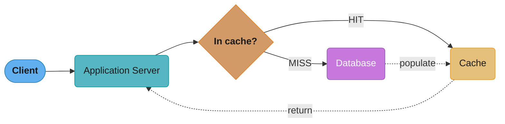
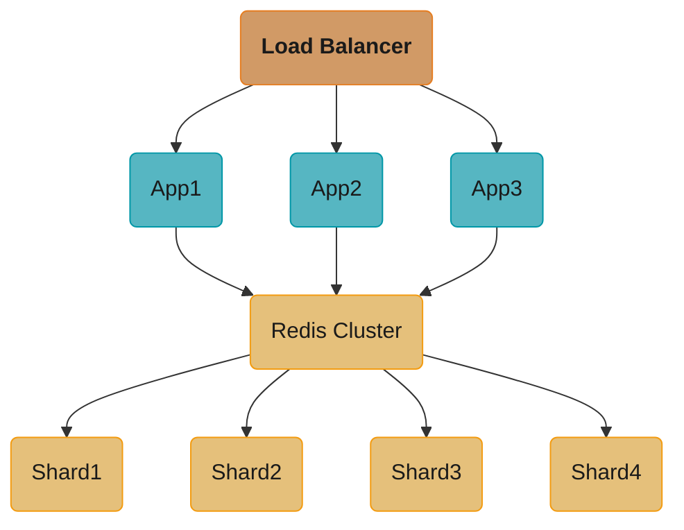
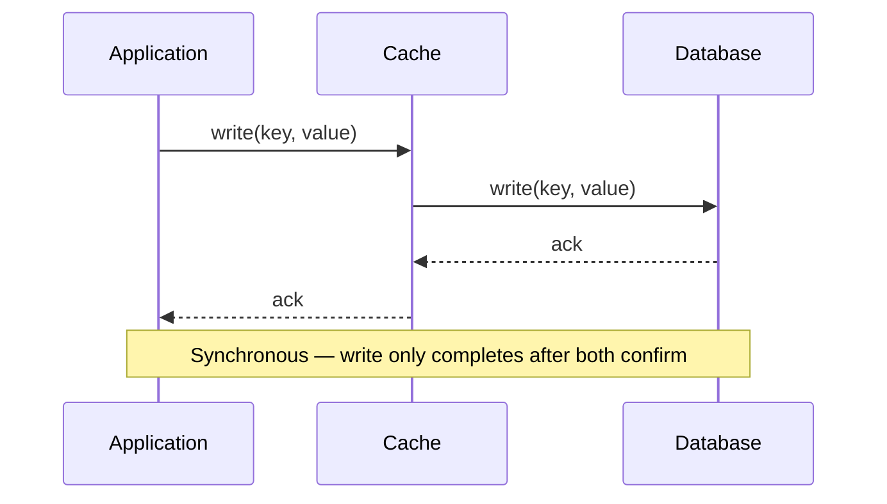
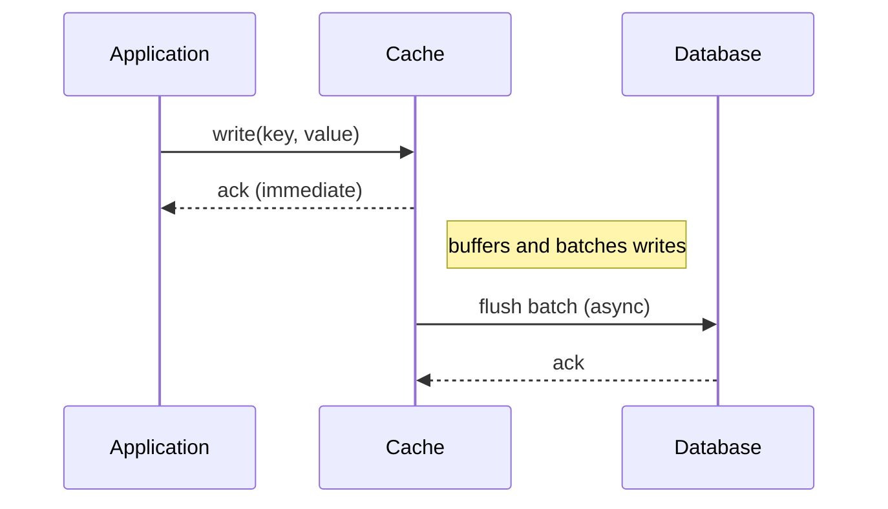
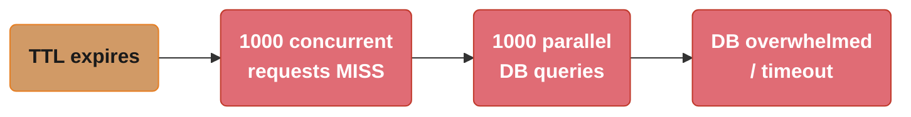
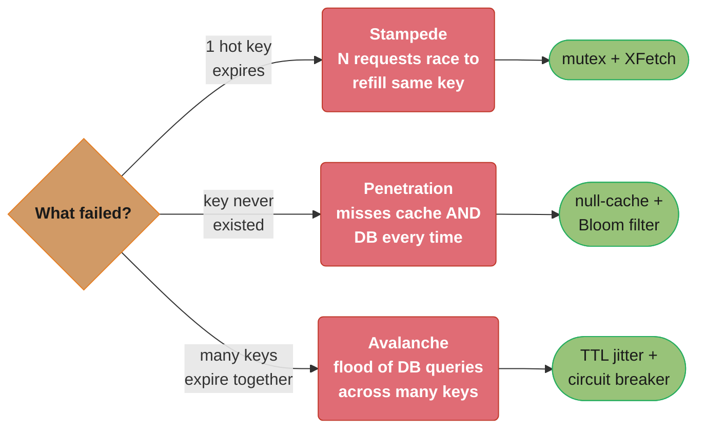
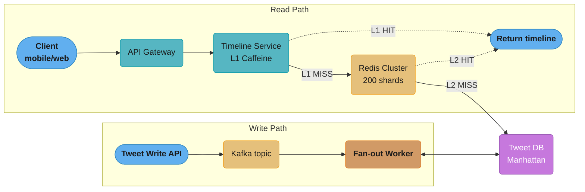
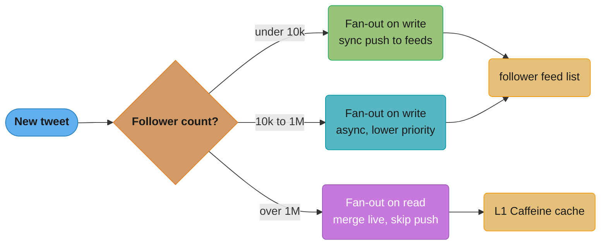

# Caching

## 1. Concept Overview

Caching is the process of storing copies of frequently accessed data in a high-speed storage layer (the cache) so that future requests can be served faster without hitting the slower, authoritative data source. It is one of the most impactful performance optimizations in system design — the difference between a 1ms response and a 100ms response often comes down to whether data was served from cache.

Caches exploit **temporal locality** (recently accessed data will likely be accessed again soon) and **spatial locality** (data near recently accessed data will likely be accessed). They exist at virtually every layer of modern systems: CPU L1/L2/L3 caches, OS page cache, DNS caches, HTTP caches, CDN edge caches, application-level caches, and database query caches.

In distributed systems, caching reduces:
- **Latency**: Serving from memory (microseconds) vs. disk or network (milliseconds)
- **Load**: Fewer requests reaching the database or downstream services
- **Cost**: Fewer compute/storage operations on expensive resources
- **Cascading failures**: A warm cache can shield backends during traffic spikes

---

## Intuition

> **One-line analogy**: Caching is like keeping a notepad of recent answers on your desk — instead of walking to the library (database) for every question, you check the notepad first.

**Mental model**: The database is the library — authoritative, but slow (10-100ms). Redis is the notepad on your desk — limited space, but instant (< 1ms). For data accessed repeatedly (user profiles, product listings, session data), serving from cache eliminates 99% of database load. The challenge: when the notepad gets stale, you need a strategy to know when to update it.

**Why it matters**: Caching is the single highest-leverage optimization in web systems. Moving from no cache to a properly warmed cache can reduce database load by 80-95%, reduce latency from 100ms to 1ms, and dramatically improve throughput. Almost every scalable system relies heavily on caching.

**Key insight**: Cache eviction policy (LRU, LFU) and cache invalidation strategy (TTL, explicit invalidation, write-through) are the two hardest problems. "Cache invalidation" is famously called one of the two hard things in computer science.

---

## 2. Core Principles

- **Cache Hit**: Requested data is found in cache — fast path.
- **Cache Miss**: Data not found in cache — must fetch from the source, then optionally populate the cache.
- **Hit Rate**: `hits / (hits + misses)` — a key metric. Above 90% is typically good.
- **Eviction**: When the cache is full, old entries must be removed to make room for new ones.
- **Expiration (TTL)**: Entries have a time-to-live after which they are considered stale.
- **Invalidation**: Proactively removing or updating a cache entry when the underlying data changes. This is the hard part.
- **Cache Coherence**: Ensuring all cache nodes (in a distributed cache) reflect a consistent view of the data.

> "There are only two hard things in Computer Science: cache invalidation and naming things." — Phil Karlton

---

## 3. Types / Strategies

### 3.1 Cache-Aside (Lazy Loading)

The application is responsible for reading from and writing to the cache. The cache does NOT interact with the database directly.

**Read flow:**
1. Check cache for key.
2. On HIT: return cached data.
3. On MISS: fetch from DB, store in cache, return data.

**Write flow:**
- Write directly to DB. Optionally invalidate or update the cache entry.

**Pros:** Cache only holds data that is actually requested; resilient to cache failures.
**Cons:** Cache miss penalty (3 round trips); risk of stale data if invalidation is missed.

**Best for:** Read-heavy workloads with infrequent writes (e.g., product catalog, user profiles).

---

### 3.2 Write-Through

Every write goes through the cache to the database synchronously.

**Write flow:**
1. Write to cache.
2. Cache writes to DB synchronously.
3. Return success only after DB confirms.

**Pros:** Cache is always consistent with DB; no stale reads after writes.
**Cons:** Write latency doubles; cache holds data that may never be read again (cache pollution).

**Best for:** Write-heavy + read-heavy workloads where consistency is critical (e.g., financial ledgers, inventory).

---

### 3.3 Write-Back (Write-Behind)

Writes go to cache immediately; the cache asynchronously flushes to DB later.

**Write flow:**
1. Write to cache.
2. Return success immediately.
3. Cache batches writes and flushes to DB asynchronously.

**Pros:** Very low write latency; batching reduces DB load.
**Cons:** Risk of data loss if cache crashes before flush; complex consistency guarantees.

**Best for:** High-throughput write scenarios where eventual persistence is acceptable (e.g., analytics counters, session data, shopping cart).

---

### 3.4 Write-Around

Writes bypass the cache and go directly to DB. Cache is only populated on reads (like cache-aside).

**Pros:** Avoids polluting cache with write-once data.
**Cons:** First read after write always results in a cache miss.

**Best for:** Data that is written once and rarely read back immediately (e.g., log files, bulk data imports).

---

### 3.5 Read-Through

The cache sits in front of the database. On a miss, the cache itself fetches from DB and populates itself.

**Read flow:**
1. Application reads from cache only.
2. On MISS: cache fetches from DB, stores data, returns to application.

**Pros:** Application logic is simpler (no cache management code).
**Cons:** First request for any key always misses (can be mitigated with cache warming).

**Best for:** Read-heavy workloads; used by many managed caching solutions.

---

## 4. Eviction Policies

| Policy | Full Name | Evicts | Best For |
|--------|-----------|--------|----------|
| LRU | Least Recently Used | Item accessed least recently | General purpose |
| LFU | Least Frequently Used | Item accessed least often | Long-lived hot-key scenarios |
| FIFO | First In First Out | Oldest inserted item | Simple, predictable workloads |
| MRU | Most Recently Used | Most recently accessed | Streaming, batch scan workloads |
| ARC | Adaptive Replacement Cache | Hybrid LRU + LFU | Adaptive workloads |
| Random | Random | Random item | Low overhead, acceptable hit rate |

**LRU Implementation:** Doubly-linked list + HashMap. O(1) get and put. The list tracks access order; the map provides O(1) lookup. On access, move node to head. On eviction, remove tail.

**LFU Implementation:** Two HashMaps (key→freq, freq→LinkedHashSet of keys) + min-freq tracker. O(1) for all operations.

---

## 5. Architecture Diagrams

### Cache-Aside Pattern



The application checks the cache first; a hit returns immediately, while a miss falls through to the database and then populates the cache so the next request for that key is a hit.

### Distributed Cache Architecture



Every shard is a primary + replica pair; the load balancer fans requests out across stateless app servers that all share the same Redis cluster, so any app node can serve any key.

### Write-Through Flow



The write only returns success once the database has confirmed, so cache and DB are never out of sync — at the cost of doubled write latency.

### Write-Back Flow



The application gets an immediate ack from cache; the database write happens later in an asynchronous batch, so throughput is high but a cache crash before flush loses data.

### Cache Stampede (Thundering Herd)



One hot key's expiry turns into 1000 simultaneous misses and 1000 parallel DB queries — exactly the cascade that mutex locks, XFetch, or TTL jitter (below) are designed to break.

---

## 6. How It Works - Detailed Mechanics

### Consistent Hashing for Cache Sharding
In a distributed cache cluster, requests must be routed to the correct shard. Consistent hashing maps keys to nodes on a ring, minimizing remapping when nodes are added/removed. Virtual nodes improve load distribution.

### Cache Warming
Pre-populating a cache before traffic hits it. Prevents cold-start performance degradation after deployments or cache node restarts. Typically done by replaying recent access logs or pre-fetching known hot keys.

### Cache Stampede Prevention
When a popular cache entry expires, many concurrent requests all miss and hit the backend simultaneously.

Solutions:
1. **Mutex/Lock**: Only one request fetches from DB; others wait. Use distributed locks (Redis SETNX).
2. **Probabilistic Early Expiration (XFetch)**: Before TTL expires, probabilistically refresh the cache with a small chance proportional to how close to expiration.
3. **Background refresh**: Serve stale data while asynchronously refreshing in the background.
4. **Jitter on TTL**: Add randomness to TTLs so entries don't all expire simultaneously.

### Cache Penetration
Requests for keys that NEVER exist in cache or DB (e.g., `user_id=-1`). Attackers can exploit this to bypass cache and hammer the DB.

Solutions:
1. **Cache null values** with a short TTL.
2. **Bloom filter**: Before hitting cache/DB, check if key could possibly exist. Bloom filters have no false negatives — if it says "doesn't exist," it definitely doesn't.

### Cache Avalanche
Many cache entries expire at the same time, causing a flood of DB queries.

Solutions:
1. **TTL jitter**: Randomize expiration times.
2. **Circuit breaker**: Stop forwarding requests to DB if it's struggling.
3. **Multi-level cache**: L1 (local in-process) + L2 (distributed Redis). L1 absorbs the spike.

Stampede, penetration, and avalanche are frequently confused in interviews — the diagram below distinguishes them by trigger condition and fix.



All three look like "the DB got slammed," but the trigger differs — one key (stampede), a key that never existed (penetration), or many keys at once (avalanche) — which is why TTL jitter shows up as a fix for two of the three but not penetration.

---

## 7. Real-World Examples

### Netflix
- Uses **EVCache** (built on Memcached) for session data, user preferences, and metadata.
- Caches at multiple layers: CDN (video chunks), API gateway (rate limiting), microservices (user state).
- Handles ~30 million cache requests per second across thousands of nodes.
- Uses cache-aside with aggressive TTLs for recommendation data.

### Twitter
- **Twemcache** (Twitter's Memcached fork) for timeline caching.
- A single tweet can be fanned out to millions of followers' caches.
- Uses a "flock" approach: pre-computed home timelines cached per user.

### Facebook
- **Memcached** at massive scale (thousands of servers, exabytes of cache).
- **TAO** (The Associations and Objects) — a distributed data store with built-in caching for the social graph.
- Landmark paper: "Scaling Memcache at Facebook" — describes regional pools, cold cluster warmup, and lease-based cache invalidation.

### Amazon
- **ElastiCache** (managed Redis/Memcached) across virtually all AWS services.
- Product pages use cache-aside; pricing uses write-through; cart uses write-back.
- DynamoDB Accelerator (DAX) provides in-memory caching directly in front of DynamoDB.

### Google
- **Bigtable** and **Spanner** have internal caching layers.
- YouTube uses aggressive CDN caching with LRU at edge nodes.
- Gmail uses local browser caching + server-side caching of thread metadata.

---

## 8. Tradeoffs

| Dimension | Caching Benefit | Caching Cost |
|-----------|----------------|--------------|
| Latency | Much lower (memory vs disk) | Added complexity |
| Throughput | Higher (fewer DB hits) | Cache node is a bottleneck if not distributed |
| Consistency | - | Stale reads possible |
| Durability | - | Cache is typically volatile |
| Cost | Reduce DB costs | Cache infra costs |
| Complexity | - | Invalidation, stampedes, penetration |

---

## 9. When to Use / When NOT to Use

### Use When:
- Read-heavy workloads with a well-defined "hot set" of data (Pareto principle: 20% of data = 80% of reads).
- Data is expensive to compute or retrieve (complex joins, API calls, ML inference).
- Tolerable staleness window exists (e.g., displaying follower count 30s stale is fine).
- Rate limiting, session management, leaderboards — all naturally fit caching.

### Do NOT Use When:
- Data changes every request (real-time financial tickers, live sensor streams).
- Every request requires the freshest possible data (medical records, payment processing).
- Data access is uniformly random with no locality (caching provides no benefit).
- Cache size would need to equal dataset size (just use a fast DB).
- Strong consistency is non-negotiable and your invalidation strategy cannot guarantee it.

---

## 10. Common Pitfalls

1. **Over-caching**: Caching data that doesn't benefit (low access frequency, trivial compute cost).
2. **Missing invalidation**: Writing to DB but forgetting to invalidate cache — stale reads persist until TTL.
3. **Race condition on write + invalidate**: Thread A writes DB, Thread B reads stale cache, Thread A invalidates cache, Thread B re-populates with stale value. Use distributed locks or compare-and-swap.
4. **Hot key problem**: A single key receives millions of requests/sec (e.g., celebrity tweet). Single cache shard becomes a bottleneck. Mitigate with local in-process caching or key sharding.
5. **Large values blocking**: Redis is single-threaded; a large serialized object blocks all other operations. Keep values small; use hashing or compression.
6. **Unbounded memory growth**: Forgetting to set TTLs or maxmemory policy leads to OOM.
7. **Caching mutable aggregates**: Caching a user object that contains 50 fields — one field changes, entire object invalidated. Consider caching smaller, more stable sub-objects.

---

## 11. Technologies & Tools

| Tool | Type | Notes |
|------|------|-------|
| **Redis** | In-memory data structure store | Persistence, pub/sub, Lua scripting, cluster mode, streams. De facto standard. |
| **Memcached** | Pure cache | Simpler, multi-threaded, slightly faster for pure caching. No persistence. |
| **Hazelcast** | Distributed in-memory grid | Java ecosystem, supports JCache (JSR-107). |
| **Apache Ignite** | In-memory compute + cache | SQL support, distributed transactions. |
| **Caffeine** | In-process JVM cache | Excellent LRU/LFU implementation for local caching. |
| **Guava Cache** | In-process JVM cache | Google's library, simpler than Caffeine. |
| **Varnish** | HTTP accelerator | Reverse proxy cache for HTTP responses. |
| **AWS ElastiCache** | Managed Redis/Memcached | Auto failover, multi-AZ, cluster mode. |
| **AWS DAX** | DynamoDB Accelerator | Microsecond latency for DynamoDB reads. |
| **CDN (CloudFront, Fastly)** | Edge cache | HTTP-layer caching geographically distributed. |

---

## 12. Interview Questions with Answers

**Q1: What is the difference between cache-aside and read-through caching?**
A: In cache-aside, the application manages cache population — it checks the cache, and on a miss, fetches from DB and writes to cache itself. In read-through, the cache layer handles fetching from DB on a miss transparently. Cache-aside gives more control; read-through simplifies application code.

**Q2: How would you handle a cache stampede?**
A: Use distributed locking (Redis SETNX) so only one request repopulates the cache while others wait or serve stale. Alternatively, use probabilistic early expiration (XFetch) or background refresh with stale-while-revalidate semantics.

**Q3: What is cache penetration and how do you prevent it?**
A: Cache penetration occurs when requests are made for keys that don't exist in the cache or DB (often malicious). Prevention: cache null/empty results with a short TTL, or use a Bloom filter to quickly reject impossible keys before touching the cache or DB.

**Q4: When would you prefer LFU over LRU?**
A: LFU is better when access patterns have long-lived "hot" keys that are not necessarily the most recent (e.g., popular product pages). LRU can evict frequently accessed items if there's a temporary scan workload. LFU resists this. Downside: LFU can be slow to adapt to changing access patterns (frequency counts persist).

**Q5: How does Redis achieve high throughput despite being single-threaded?**
A: Redis uses a single-threaded event loop (I/O multiplexing via epoll/kqueue) avoiding lock contention. Since most operations are O(1) or O(log n) in-memory, CPU is rarely the bottleneck — network I/O is. Redis 6+ added threaded I/O for reading/writing, keeping command processing single-threaded.

**Q6: What is the difference between write-through and write-back?**
A: Write-through: writes go to cache AND DB synchronously — strong consistency, higher write latency. Write-back: writes go to cache only, DB is updated asynchronously — lower latency, risk of data loss.

**Q7: How would you design a cache for a leaderboard?**
A: Use a Redis Sorted Set (ZSET). Member = user ID, score = points. `ZADD`, `ZRANK`, `ZRANGE` are O(log n). For top-N queries, `ZREVRANGE 0 N-1` is O(log n + N). No TTL needed; update in real-time. Persist to DB periodically.

**Q8: What is cache coherence in a distributed cache?**
A: Ensuring all cache nodes have a consistent view when data is updated. Strategies: invalidate all nodes on write, use a versioning/ETag scheme, use a single writer pattern, or accept eventual consistency with short TTLs.

**Q9: How does Facebook handle cache invalidation at scale?**
A: Facebook's McSqueal reads MySQL binlog and invalidates Memcached keys when the underlying database rows change. This decouples invalidation from the write path and ensures eventual consistency across all caches.

**Q10: What is the N+1 caching problem?**
A: When fetching a list of N items, each item requires an individual cache lookup — resulting in N+1 total operations (1 for the list, N for items). Use batch operations (Redis MGET) or cache the entire list as a single key to avoid this.

**Q11: How would you implement rate limiting using a cache?**
A: Use Redis with a sliding window counter. Key = `rate_limit:{user_id}:{window}`. Use INCR + EXPIRE for fixed windows, or a sorted set for sliding windows. Atomic Lua scripts ensure race-condition-free increments.

**Q12: What metrics do you monitor for a cache?**
A: Hit rate, miss rate, eviction rate, memory usage, latency (p50/p99), connection count, replication lag (for read replicas), keyspace size, and slow log for long-running commands.

---

## 13. Best Practices

1. **Set TTLs on everything** — no TTL means data lives forever and you'll run out of memory.
2. **Add jitter to TTLs** — prevents cache avalanche from synchronized expiration.
3. **Use small, focused cache keys** — avoid giant objects; cache the minimal unit needed.
4. **Instrument your cache** — track hit rate per key namespace, not just globally.
5. **Version your cache keys** — `v2:user:{id}` makes schema migrations easy without flushing.
6. **Use connection pooling** — don't create new cache connections per request.
7. **Plan for cache-cold scenarios** — what happens after a restart? Have a warm-up strategy.
8. **Test invalidation logic thoroughly** — write tests that verify stale data cannot persist beyond TTL.
9. **Use read replicas for read-heavy caches** — distribute read load across replicas.
10. **Limit value size** — large blobs slow serialization and block single-threaded caches.

---

## Cross-Perspective: LLD Connections

**LLD View — Design Patterns That Implement Caching**

- **Proxy** — The canonical caching pattern. A `CachingProxy` implements the same interface as the real service, checks the cache on every request, and delegates to the real object only on a cache miss. Transparent to the caller.
- **Decorator** — Wraps a service with a caching layer that can be stacked with other decorators (logging, metrics). Unlike Proxy, Decorator is composable and chosen explicitly by the caller.
- **Strategy** — Cache eviction policies (LRU, LFU, TTL, ARC) are interchangeable strategies. The cache holds a reference to an `EvictionStrategy` that can be swapped at runtime without changing the cache structure.
- **Singleton** — Cache managers and connection pool clients (Redis client) are Singletons — one instance per JVM shared across all request threads to prevent connection storms.

---

**Cross-references:** [backend/caching_strategies_deep_dive](../../backend/caching_strategies_deep_dive/) (cache stampede protection, multi-tier caching, write-behind implementation), [database/database_caching_patterns](../../database/database_caching_patterns/) (DB-level caching and materialized views), [database/in_memory_databases](../../database/in_memory_databases/) (Redis/Memcached internals), [spring/spring_caching](../../spring/spring_caching/) (`@Cacheable`/`@CacheEvict` and Spring's cache abstraction), [llm/llm_caching](../../llm/llm_caching/) (KV-cache and prompt caching for LLM inference).

---

## 14. Case Study: Designing a Cache for a Twitter-Scale Social Feed

### Problem Statement

Build the timeline cache for a Twitter-scale social network.

- **Users:** 500M registered, 200M DAU
- **Content:** 100B tweets stored, 500M new tweets/day
- **Read traffic:** 300k req/sec peak (timeline reads)
- **Write traffic:** 6k tweets/sec average, 150k/sec during major events (World Cup)
- **Latency SLA:** p99 < 100ms for timeline read, p50 < 20ms
- **Followers distribution:** median 200 followers, p99 = 50k, top 1000 accounts each > 1M followers
- **Storage budget:** 50TB Redis cluster across 200 nodes (256GB each)

### Architecture Overview



The read path forks on two cache tiers — an L1 Caffeine miss falls through to the Redis cluster, and only a Redis miss reaches the Manhattan-backed Tweet DB; the write path fans out asynchronously through Kafka, decoupling the write API from the per-follower fan-out cost.

### Key Design Decisions

1. **Hybrid fan-out (write vs read).** Fan-out on write for normal users (< 10k followers): push tweet_id into each follower's `feed:{uid}` sorted set. Fan-out on read for celebrities (> 1M followers): timeline read merges follower's base feed with celebrity tweets fetched live. *Alternative rejected:* pure fan-out-on-write — Justin Bieber posting would queue 100M Redis writes, saturating the cluster.

2. **Celebrity threshold detection.** Author with > 10k followers flagged at write time; > 1M followers skipped from fan-out entirely. *Alternative rejected:* static threshold for all users — sub-celebrities (50k followers) still benefit from pre-computation since their tweets are rare.

3. **Redis sorted sets with tweet_id as score.** ZADD with timestamp-derived score; ZREVRANGEBYSCORE returns latest N tweets in O(log N). Cap each timeline at 800 entries (ZREMRANGEBYRANK). *Alternative rejected:* Redis list (LPUSH/LTRIM) — sorted set allows efficient merge with celebrity tweets by timestamp.

4. **Two-tier caching (L1 Caffeine + L2 Redis).** Hot celebrity tweets cached in JVM-local Caffeine (100MB, 5s TTL). Eliminates ~80% of Redis hits for top 1000 accounts. *Alternative rejected:* Redis-only — single Redis shard holding a celebrity's tweet sees 50k QPS, exceeding the 100k single-key limit.

5. **Jittered TTL + XFetch probabilistic early expiration.** Each timeline cached with TTL = 24h + uniform(-1h, +1h). Reads with `now > expiry - delta * log(rand())` trigger early background refresh. *Alternative rejected:* fixed 24h TTL — after a Redis failover, all 200M entries repopulate simultaneously (stampede).

6. **Write-through invalidation on delete.** Tweet deletion publishes to a `tombstone` Kafka topic; fan-out workers ZREM the tweet from all follower timelines within 2s. *Alternative rejected:* TTL-based eventual cleanup — deleted tweets visible for up to 24h.

7. **Per-key mutex for cache reconstruction.** On L2 miss, use `SET feed:{uid}:lock NX PX 5000` before rebuilding from DB. Other readers serve stale entry or block briefly. *Alternative rejected:* unbounded reconstruction — 1000 concurrent misses on the same key hammer the DB with identical queries.

The hybrid fan-out decision (points 1 and 2 above) in one picture:



Below 10k followers the tweet is pushed synchronously to every follower's feed; between 10k and 1M it is still pushed but asynchronously and lower-priority; above 1M followers (~1000 accounts) fan-out is skipped entirely and the timeline read merges celebrity tweets live from the L1 cache.

### Implementation

Fan-out worker (write path):

```java
@KafkaListener(topics = "tweet-published")
public void onTweet(TweetEvent ev) {
    long authorFollowers = followGraph.countFollowers(ev.authorId());
    if (authorFollowers > CELEBRITY_THRESHOLD) {
        celebrityCache.put(ev.authorId(), ev);          // L1, skip fan-out
        return;
    }
    double score = ev.timestampMs();
    try (var pipeline = redis.pipelined()) {
        followGraph.streamFollowers(ev.authorId()).forEach(followerId -> {
            String key = "feed:" + followerId;
            pipeline.zadd(key, score, String.valueOf(ev.tweetId()));
            pipeline.zremrangeByRank(key, 0, -801);     // cap at 800
            pipeline.expire(key, jitteredTtl());
        });
    }
}

private long jitteredTtl() {
    return 86400 + ThreadLocalRandom.current().nextLong(-3600, 3600);
}
```

Timeline read (XFetch + mutex):

```java
public List<Tweet> getTimeline(long userId) {
    String key = "feed:" + userId;
    CachedFeed cached = redis.getWithTtl(key);
    if (cached != null && !shouldEarlyRefresh(cached)) {
        return mergeCelebrities(userId, cached.tweetIds());
    }
    if (redis.set(key + ":lock", "1", SetParams.setParams().nx().px(5000))) {
        CompletableFuture.runAsync(() -> rebuildAndCache(userId));
    }
    return cached != null
        ? mergeCelebrities(userId, cached.tweetIds())   // serve stale
        : rebuildAndCache(userId);                       // cold miss
}

private boolean shouldEarlyRefresh(CachedFeed c) {
    double delta = 30.0;                                 // beta factor
    double remaining = c.ttlSeconds();
    return remaining < -delta * Math.log(Math.random());
}
```

### Tradeoffs

| Strategy           | Fan-out on Write | Fan-out on Read | Hybrid (chosen)  |
|--------------------|------------------|-----------------|------------------|
| Read latency       | ~5ms             | ~80ms           | ~15ms p50        |
| Write amplification| O(followers)     | O(1)            | O(min(F, 10k))   |
| Storage cost       | High (duplicated)| Low             | Medium           |
| Celebrity scaling  | Broken           | Fine            | Fine             |
| Code complexity    | Low              | Low             | High             |
| Stale window       | None             | None            | Up to 5s         |

### Metrics & Results

- **Cache hit rate:** 96.4% (L1+L2 combined), 88% Redis-only
- **Timeline read p50:** 18ms, p99: 72ms, p99.9: 140ms
- **Fan-out latency:** 95% of followers receive tweet within 1.2s
- **DB read QPS:** reduced from theoretical 300k to 11k (27x reduction)
- **Redis memory:** 38TB used of 50TB budget (74% utilization)
- **Cost:** $180k/month for Redis cluster vs estimated $2.1M/month if served from DB

### Common Pitfalls / Lessons Learned

1. **Synchronized cache expiry stampede.** After a Redis cluster restart, every key was re-loaded with the same default TTL, causing all to expire simultaneously 24h later — a 300k QPS DB spike took out Manhattan for 8 minutes.
   - *Broken:* `redis.expire(key, 86400);`
   - *Fix:* `redis.expire(key, 86400 + ThreadLocalRandom.current().nextLong(-3600, 3600));` plus XFetch early refresh.

2. **Celebrity hot-key on a single Redis shard.** A K-pop star with 100M followers triggered a fan-out that targeted one shard (the followers happened to hash to a hot range), pushing that node to 100% CPU and breaking timeline reads cluster-wide.
   - *Broken:* unconditional fan-out for all authors.
   - *Fix:* `if (followers > 1_000_000) skipFanout(); else fanoutAsync();` plus L1 Caffeine layer on app servers for celebrity content.

3. **Stale tweet count after delete.** Users reported deleted tweets appearing in their timeline for hours. Cache eviction relied on TTL expiry only.
   - *Broken:* `deleteTweet(id); /* cache will expire eventually */`
   - *Fix:* publish to `tombstone` topic, fan-out workers issue `ZREM feed:{uid} {tweetId}` across all affected timelines.

### Interview Discussion Points

**Q: Why sorted set instead of a list?**
A sorted set lets you merge celebrity tweets (fetched separately) with the base timeline by score (timestamp) in a single pass. Lists force you to do an O(N) merge in application code, and inserting an out-of-order tweet costs O(N).

**Q: How do you handle a user who follows 5000 celebrities?**
You cap the celebrity merge: fetch the latest 50 tweets from each celebrity's per-author cache, then take the top 200 by timestamp. Worst case is 5000 GETs, but those keys are L1-cached on every app server, so it's effectively zero Redis traffic.

**Q: Why not use write-through for everyone?**
Write-through synchronously updates cache on every write, blocking the producer. For a viral tweet with 1M followers, the publisher would wait minutes. Fan-out via Kafka makes the write fast (50ms) and the cache update happens asynchronously.

**Q: How would you handle a Redis shard failure?**
Each shard has a replica; Redis Sentinel promotes the replica in ~10s. During failover, timeline reads on affected users fall back to DB reconstruction, protected by the per-key mutex to prevent stampede. The 800-tweet cap keeps reconstruction queries bounded.

**Q: What's the memory cost per user timeline?**
800 tweet IDs at 8 bytes each = 6.4KB raw, ~12KB with sorted-set overhead. 200M active users x 12KB = 2.4TB minimum. We provision 38TB to allow oversize celebrity-merge buffers and inactive user retention (last 30 days).

**Q: How do you decide the celebrity threshold of 10k?**
Empirically: at 10k followers, fan-out completes in < 500ms with our Kafka throughput. Beyond 1M followers, fan-out latency exceeds the user's expected freshness window, and storage cost becomes prohibitive. Between 10k and 1M, fan-out is degraded (async, lower priority) but still pre-computed.

**Q: Could you use Memcached instead of Redis?**
No — Memcached has no native sorted-set type, no atomic ZADD/ZREMRANGEBYRANK, no replication for failover, no Lua scripting for the XFetch logic. You'd end up reimplementing half of Redis in application code.
