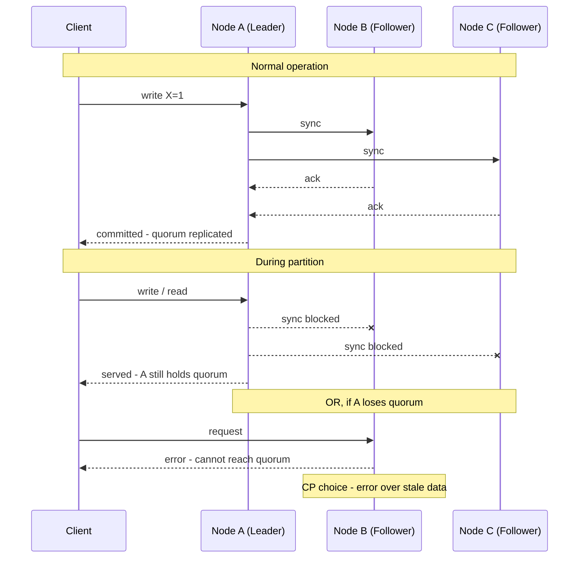
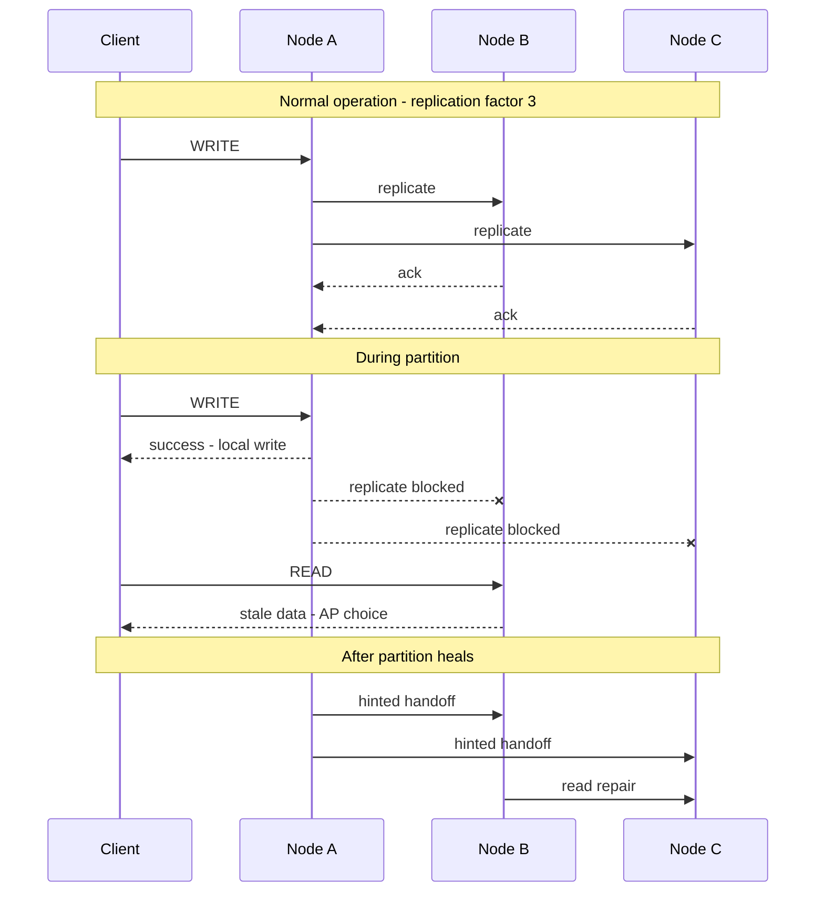
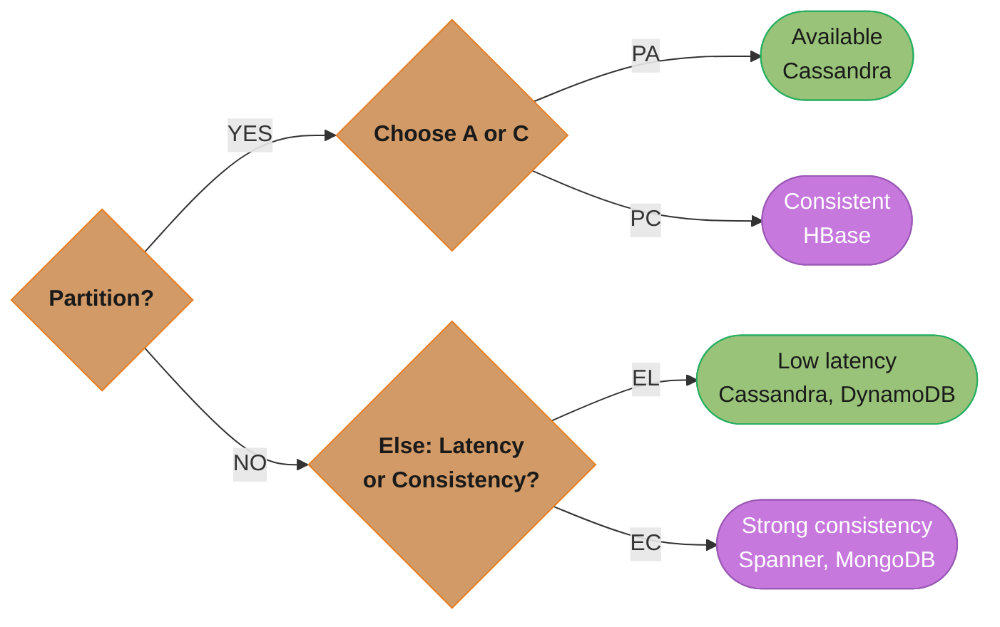
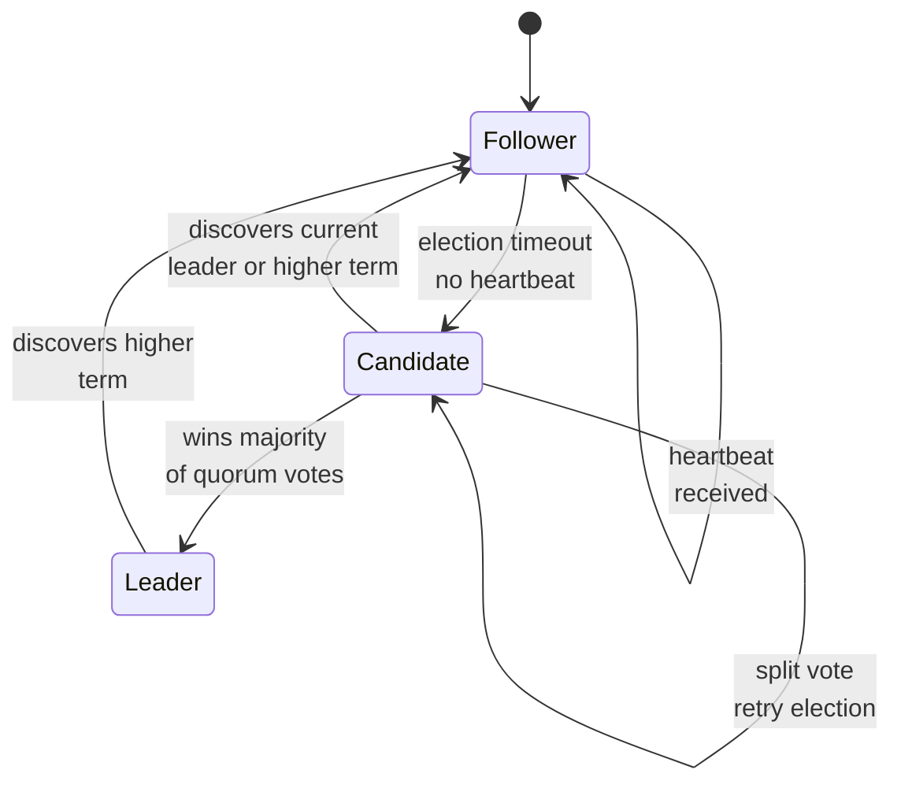
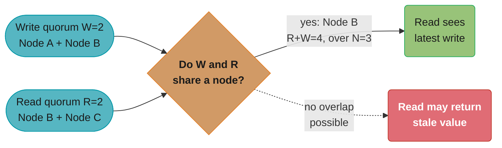
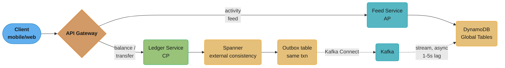

# CAP Theorem

## 1. Concept Overview

The CAP Theorem, proven by Eric Brewer in 2000 and formally proven by Gilbert and Lynch in 2002, states that a distributed data store can only guarantee two of the following three properties simultaneously:

- **Consistency (C)** — Every read receives the most recent write or an error. All nodes see the same data at the same time.
- **Availability (A)** — Every request receives a response (not an error), though it may not contain the most recent write.
- **Partition Tolerance (P)** — The system continues to operate despite an arbitrary number of messages being dropped or delayed by the network between nodes.

The critical insight that is often misunderstood: **network partitions are not optional**. In any real distributed system, network failures will occur. Therefore, partition tolerance is not a choice — it is a requirement. The real tradeoff is always between Consistency and Availability during a partition.

This means the meaningful question is: when a network partition occurs, do you prioritize returning consistent (possibly stale) data or prioritize staying available (even with potentially inconsistent data)?

Why it matters:
- It directly shapes the architecture of every database, cache, and message queue you build on
- It forces explicit decisions about what failure modes are acceptable for your use case
- It explains why distributed systems behave unexpectedly under failure conditions
- Understanding it prevents building systems that promise guarantees they cannot keep

---

## Intuition

> **One-line analogy**: CAP theorem is like a bank during a communication outage — you can either refuse all transactions until the network recovers (Consistency), or keep processing with possibly stale balances (Availability). You can't do both simultaneously.

**Mental model**: In a distributed system, network partitions (nodes losing connection to each other) are inevitable. When a partition occurs, your only choice is: stop serving requests to guarantee consistency (CA databases during partition), or keep serving requests with potentially stale data (AP databases). Partition tolerance is not optional — so the real choice is always between C and A when a partition happens.

**Why it matters**: CAP theorem explains why no distributed database is perfect. Postgres (CP) gives you consistency but may reject requests during failures. DynamoDB (AP) stays available during failures but may serve stale data. Understanding this tradeoff drives every distributed database choice.

**Key insight**: CAP is often misunderstood as "pick any two." The right framing is: "You must tolerate partitions, so you must decide between consistency and availability during a partition." This is why PACELC (extends CAP with latency/consistency tradeoffs during normal operation) is a more complete model.

---

## 2. Core Principles

**Partition Tolerance is Non-Negotiable**
If you have two nodes and a network between them, partitions will happen. Hardware fails, cables are cut, routers crash, cloud availability zones lose connectivity. A system that stops working entirely on a partition is not partition tolerant — and in practice, stopping entirely is often unacceptable.

**The Partition Decision is Binary Under Active Partition**
During a partition, you must choose: do you return possibly stale data (choose Availability) or return an error/wait until nodes reconcile (choose Consistency)?

**Consistency in CAP is Linearizability**
The "C" in CAP specifically means linearizable consistency (also called atomic consistency) — the strongest consistency model. It is not the "C" in ACID (which means something different). Every read sees the effect of every write that completed before it, globally across all nodes.

**Availability in CAP is Total Availability**
Every non-failing node must respond to queries. A system that returns errors for some nodes during a partition is not "available" in the CAP sense.

**Normal Operation vs Partition**
CAP only describes behavior during a partition. During normal operation (no partition), you can have both consistency and availability. The theorem only constrains you when things go wrong.

---

## 3. Types / Strategies

### CP Systems (Consistency + Partition Tolerance)
During a partition, CP systems refuse to return potentially stale data. They may become unavailable (return errors or block) until consistency can be re-established.

**Examples:** HBase, Zookeeper, etcd, MongoDB (with majority write concern), Redis (single-master mode), CockroachDB

**Pattern:** Uses a consensus protocol (Raft, Paxos, Zab) to ensure all writes are acknowledged by a quorum before being considered committed. Reads that cannot be served from a quorum node return an error.

### AP Systems (Availability + Partition Tolerance)
During a partition, AP systems continue serving requests, potentially returning stale data. They resolve conflicts after the partition heals using reconciliation strategies.

**Examples:** Cassandra, DynamoDB, CouchDB, Riak, DNS, most CDN caches

**Pattern:** Uses eventual consistency. Nodes accept writes independently. After partition heals, nodes reconcile via last-write-wins, vector clocks, CRDTs, or application-level merge logic.

### CA Systems (Consistency + Availability, No Partition Tolerance)
Theoretically possible only in a single-node or fully connected system where partitions are impossible. Traditional RDBMS (Postgres, MySQL) on a single node fits here — but the moment you add replication across network boundaries, you re-enter CAP territory.

**Reality:** CA is not a practical distributed system category. It describes single-node systems.

### Consistency Models (Beyond CAP's Binary)

CAP defines linearizability, but real systems operate on a spectrum:

| Model | Description | Example |
|-------|-------------|---------|
| Linearizable (Strong) | All reads see latest write globally | ZooKeeper, etcd |
| Sequential | All operations appear in some sequential order, consistent per-client | Single-leader DB with sync replication |
| Causal | Causally related operations are seen in order | MongoDB causal sessions |
| Read-your-writes | Client always reads its own writes | Sticky sessions, session tokens |
| Monotonic reads | Once a value is seen, older values are never returned | Read from same replica |
| Eventual | Writes will propagate to all nodes eventually | Cassandra, DNS |

---

## 4. Architecture Diagrams

### CAP Triangle

```
                Consistency
                    /\
                   /  \
                  /    \
                 /  CA  \
                / (single \
               /   node)   \
              /             \
             /_______________\
  CP Systems                  AP Systems
(ZooKeeper,               (Cassandra,
 HBase, etcd)              DynamoDB,
                           CouchDB)
         P (Partition Tolerance)
```

### CP System During Partition (ZooKeeper)



*ZooKeeper's ZAB protocol replicates every write to a quorum during normal operation. When the leader can no longer reach that quorum during a partition, it either keeps serving (if it still holds quorum itself) or returns an error rather than risk stale data.*

### AP System During Partition (Cassandra)



*Cassandra accepts the write locally and returns success immediately even while replicas are unreachable; a read from an isolated replica returns stale data rather than an error. Hinted handoff and read repair reconcile all three replicas once the partition heals.*

### PACELC Diagram



*PACELC extends CAP: even outside a partition (the "else" branch), every system still trades latency for consistency. The right two leaves are the everyday, no-partition choice that CAP itself is silent on.*

### Raft / ZAB Leader Election (State Machine)



*The leader-election state machine behind both Raft (etcd) and ZAB (ZooKeeper): a Follower that stops hearing heartbeats becomes a Candidate, which wins the term by quorum vote or reverts to Follower on a split vote or a higher term. This is exactly the mechanism Q6 describes — "if the leader cannot reach a quorum of followers, it steps down and a new election starts" — and the State pattern named in the LLD cross-perspective below.*

---

## 5. How It Works — Detailed Mechanics

### Why Partitions Force a Choice

Consider two nodes, A and B, separated by a network partition:
1. Client writes X=1 to Node A. A cannot replicate to B.
2. Client reads X from Node B.

Options:
- **Return stale X=0** (AP: available, inconsistent)
- **Return error or block** (CP: consistent, unavailable)
- **There is no third option** that satisfies both

### Quorum-Based Consistency

Many CP systems use quorum reads and writes. With N replicas:
- Write quorum W: write must be acknowledged by W nodes
- Read quorum R: read must query R nodes

For strong consistency: `R + W > N`

Example (N=3, W=2, R=2):
- Write: node A and B acknowledge → committed
- Read: query nodes A and B → at least one has the latest write
- During partition where A is isolated: write to B+C (quorum), read from B+C (quorum) — consistent
- If A is the only reachable node (W=2 not met): write fails — CP system says no



*With N=3, W=2, R=2 the write set (Node A + Node B) and read set (Node B + Node C) are forced to overlap at Node B whenever R+W > N — that guaranteed overlap is exactly why a quorum read always sees the latest write.*

### Vector Clocks (AP Conflict Resolution)

Used by DynamoDB (original Dynamo paper), Riak. Each value carries a version vector:
- `{ A: 1, B: 0, C: 0 }` — written by node A
- `{ A: 1, B: 1, C: 0 }` — node B modified A's value

When two conflicting versions are detected (neither dominates the other), the system stores both and returns them to the client for application-level resolution. Amazon shopping cart used this: "add to cart" conflicts were resolved by merging (unioning) the two carts.

### Last-Write-Wins (LWW)

Cassandra's default conflict resolution. Each write has a timestamp. On conflict, the write with the higher timestamp wins.

Risk: clock skew between nodes means older writes can overwrite newer ones. Mitigated by NTP and hybrid logical clocks.

### CRDTs (Conflict-free Replicated Data Types)

Data structures that can be merged without conflict resolution logic:
- **G-Counter**: grow-only counter, merge by taking max of each node's count
- **OR-Set**: observed-remove set, supports add and remove without conflict
- **LWW-Register**: last-write-wins register with logical timestamps

Used by Riak, Redis CRDT mode, collaborative editing tools (like Figma's multiplayer).

### Eventual Consistency Mechanisms

**Anti-entropy / Gossip Protocol:** Nodes periodically exchange state and reconcile differences. Cassandra uses gossip for cluster membership and Merkle trees for data repair.

**Hinted Handoff:** If a target node is down, the write is temporarily stored on another node with a "hint." When the target recovers, hints are replayed.

**Read Repair:** When a read detects inconsistency across replicas (stale data on one), it triggers a background write to bring the stale replica up to date.

---

## 6. Real-World Examples

**Apache Cassandra (AP)** — Designed for active-active multi-datacenter deployments. No single point of failure. Tunable consistency: you can request `QUORUM` reads/writes for stronger guarantees at the cost of availability, or `ONE` for maximum availability. Used by Netflix, Instagram, Apple (for iCloud metadata).

**Apache ZooKeeper (CP)** — Distributed coordination service. Used for leader election, distributed locks, configuration management. Uses ZAB (ZooKeeper Atomic Broadcast) protocol — a Paxos variant. During partition where leader cannot reach quorum, ZooKeeper stops serving requests. Used by Hadoop, Kafka (older versions).

**etcd (CP)** — Uses Raft consensus. Backbone of Kubernetes control plane. All writes go through the Raft leader. Reads can be stale (linearizable reads are more expensive). Prefers consistency over availability.

**Amazon DynamoDB (AP)** — Default: eventual consistency with low latency. Optional: strongly consistent reads (read from a quorum, slower and more expensive). Global Tables (multi-region) are AP — eventual consistency across regions.

**MongoDB (tunable, CP by default with majority)** — With `writeConcern: majority` and `readConcern: majority`, provides linearizable reads. Without it, stale secondary reads are possible. Replica sets use Raft-like election. Sharded clusters add complexity.

**Google Spanner (CP + external consistency)** — Uses TrueTime (GPS + atomic clocks) to assign globally consistent timestamps. Provides external consistency (stronger than linearizability) across globally distributed data. CP, low latency because of hardware-assisted time.

**DNS (AP)** — Classic AP system. DNS records are cached globally with TTL. Changes propagate slowly (eventual consistency). During partition, cached (stale) responses are returned. Availability is prioritized over freshness.

---

## 7. Tradeoffs

### Choosing CP
| Gain | Lose |
|------|------|
| Users always see accurate data | System may return errors or block during partitions |
| Easier to reason about correctness | Lower availability (potentially) |
| Simpler application logic (no conflict resolution) | Higher write latency (quorum coordination) |
| Safe for financial transactions, inventory | Not suitable for always-on global systems |

### Choosing AP
| Gain | Lose |
|------|------|
| System stays up during network failures | Users may see stale or conflicting data |
| Low latency writes (no coordination) | Complex conflict resolution logic |
| Scales horizontally with ease | Harder to reason about correctness |
| Good for social feeds, shopping carts | Risk of data anomalies (e.g., overselling inventory) |

---

## 8. When to Use

**CP Systems:**
- Financial transactions (bank balances, payment processing)
- Inventory systems (you cannot oversell the last item)
- Distributed locks and leader election
- Configuration management (Kubernetes control plane)
- Any system where serving stale data has legal/financial consequences

**AP Systems:**
- Social media feeds, likes, follower counts (stale is acceptable)
- Shopping carts (temporary inconsistency is tolerable)
- DNS, CDN content (cached, eventually consistent is fine)
- Global user-facing systems that must remain online during regional outages
- Metrics and analytics ingestion (high write volume, eventual aggregation)
- Recommendation engines (slight staleness has zero user impact)

---

## 9. When NOT to Use

Do not use a pure AP system for:
- Account balances or anything with strong correctness requirements
- Systems where conflicting writes cannot be automatically merged
- Workflows that require strict ordering (e.g., a state machine with invalid transitions)

Do not use a pure CP system for:
- Systems that must serve traffic even when the majority of nodes are unreachable
- Globally distributed systems where cross-region coordination latency is unacceptable
- High-throughput write workloads where quorum acknowledgment adds too much latency

---

## 10. Common Pitfalls

**Confusing CAP Consistency with ACID Consistency**
ACID's "C" means transactions leave the database in a valid state (referential integrity, constraints). CAP's "C" means all nodes see the same data at the same time (linearizability). Different concepts, same letter.

**Thinking CA is a distributed option**
CA systems only exist as single-node systems. As soon as you have replication over a network, you must handle partitions.

**Treating CAP as binary**
Real systems offer tunable consistency. Cassandra lets you choose `ONE`, `QUORUM`, or `ALL` per operation. MongoDB lets you tune write concern. The tradeoff is a dial, not a switch.

**Ignoring the PACELC extension**
CAP only describes partition scenarios. PACELC adds: Even without a Partition, there is a tradeoff between Latency and Consistency. Spanner chooses consistency + higher latency. DynamoDB chooses low latency + eventual consistency under normal operation.

**Assuming eventual consistency "just works"**
Eventual consistency requires careful application design: idempotent writes, conflict resolution strategies, and handling of read-your-own-writes. Ignoring this leads to data corruption bugs that are hard to reproduce.

**Using LWW without understanding clock skew**
Last-write-wins assumes accurate clocks. In distributed systems, clocks drift. NTP corrections can cause time to jump backward. This means a "later" write can have a lower timestamp and be overwritten by an "earlier" write.

---

## 11. Technologies & Tools

| Category | Technologies |
|----------|-------------|
| CP Databases | HBase, ZooKeeper, etcd, CockroachDB, Spanner, FoundationDB |
| AP Databases | Cassandra, DynamoDB, CouchDB, Riak, Voldemort |
| Tunable | MongoDB, Redis (with Sentinel/Cluster), ScyllaDB |
| Consensus Protocols | Raft (etcd, CockroachDB), Paxos (Spanner), ZAB (ZooKeeper) |
| CRDT Libraries | Akka Distributed Data, Riak Data Types, Automerge |
| Distributed Coordination | ZooKeeper, etcd, Consul |

---

## 12. Interview Questions

**Q1: Explain the CAP theorem in plain language.**
In a distributed system, when a network partition occurs, you can either return consistent data (potentially refusing requests) or stay available (potentially returning stale data). You cannot do both.

**Q2: Is Cassandra CP or AP?**
Cassandra is AP by default. It prioritizes availability and partition tolerance, returning potentially stale data during partitions. However, it offers tunable consistency — requesting `QUORUM` reads and writes effectively makes it behave more like a CP system at the cost of availability.

**Q3: What does "eventual consistency" actually mean?**
If no new updates are made to an item, all reads will eventually return the last written value. There is no guarantee on how long "eventually" takes. The system will converge to a consistent state after partitions heal via mechanisms like gossip, read repair, and hinted handoff.

**Q4: Why is partition tolerance non-negotiable?**
Real networks fail. Packets are dropped, cables are cut, availability zones go down. Any distributed system must handle the case where some nodes cannot communicate with others. A system that simply stops working on a partition is not useful in production.

**Q5: What is the PACELC theorem and how does it extend CAP?**
PACELC: if there is a Partition, choose between Availability and Consistency; Else (no partition), choose between Latency and Consistency. It captures the latency-consistency tradeoff that exists in normal operation, which CAP ignores.

**Q6: How does ZooKeeper handle network partitions?**
ZooKeeper uses the ZAB protocol (leader election + atomic broadcast). If the leader cannot reach a quorum of followers, it steps down and a new election starts. During election, ZooKeeper is unavailable. This is a CP choice: it refuses to serve potentially stale data.

**Q7: How do you implement read-your-own-writes in an AP system?**
Options: (1) Route all reads and writes for a user to the same replica (sticky sessions). (2) Track the write timestamp and refuse to serve reads from replicas that haven't caught up. (3) Use a session token that encodes the write timestamp, and the read includes this as a minimum-version requirement.

**Q8: What are vector clocks and when are they used?**
Vector clocks are a versioning mechanism where each update carries a vector of `{nodeId: counter}` pairs. They allow the system to detect whether two writes are causally related or concurrent. Concurrent writes (neither dominates the other) represent a conflict requiring resolution. Used in DynamoDB's original Dynamo design and Riak.

**Q9: How does Google Spanner achieve CP with low latency globally?**
TrueTime: Google uses GPS receivers and atomic clocks in every datacenter to bound global clock uncertainty to milliseconds. Spanner assigns commit timestamps within the uncertainty bound, ensuring global consistency without waiting for arbitrary clock synchronization. This hardware investment eliminates most of the latency penalty of CP systems.

**Q10: What consistency guarantees does DynamoDB provide?**
By default, reads are eventually consistent (may return stale data). Strongly consistent reads are available (cost 2x read capacity units, slightly higher latency). Transactions (TransactGetItems, TransactWriteItems) provide ACID guarantees within a single region.

**Q11: What is the difference between linearizability and serializability?**
Linearizability is a consistency model for individual operations — once an operation completes, its effect is immediately visible to all future operations (single-object, single-operation scope). Serializability is a transaction isolation level — concurrent transactions produce results equivalent to some serial execution (multi-object, multi-operation scope). Strict serializability combines both.

**Q12: Why is it wrong to describe a CP database as providing "ACID consistency"?**
CAP's "C" and ACID's "C" are different concepts that happen to share the same letter. CAP consistency means linearizability — every node sees the same data at the same time — while ACID consistency means a transaction leaves the database satisfying its defined constraints (foreign keys, checks, uniqueness). Section 10 flags this as the most common CAP misconception. A system can be CAP-consistent (globally agreeing on the latest write) while still violating an ACID invariant if the application logic is buggy, and a single-node database can guarantee ACID consistency without ever facing the CAP tradeoff at all, since it has no partition to survive. Name which "C" you mean explicitly in a design discussion — say "linearizable" or "invariant-preserving" instead of the overloaded word "consistent."

**Q13: With N=3 replicas, how do you configure read/write quorums to guarantee strong consistency?**
Set write quorum W and read quorum R so that R + W > N, which forces every read to overlap the most recent write. With N=3, W=2, R=2 satisfies this since 2+2=4 > 3: Section 5's quorum diagram shows a write to Node A + Node B and a read from Node B + Node C are forced to share Node B, so the read always sees the latest value. If you instead set R=1 to shave read latency, R + W = 3 is no longer greater than N, the overlap guarantee disappears, and a read can land on a replica that has not yet received the write — trading consistency for latency, exactly the "else" branch PACELC describes. Pick the quorum split based on your read/write ratio: a read-heavy workload favors a smaller R for cheaper reads, compensated by a larger W.

**Q14: What is hinted handoff, and how does it differ from read repair?**
Hinted handoff temporarily stores a write meant for an unreachable node on another node, then replays it once the target recovers. Read repair instead fixes a stale replica reactively, when a read happens to detect a mismatch between replicas. Both are eventual-consistency convergence mechanisms used by Cassandra and the original Dynamo design (Section 5): hinted handoff repairs write-path gaps proactively without a client ever noticing, while read repair only fires for keys that are actually read afterward. Neither gives a consistency guarantee alone since a hint can be lost if the coordinator crashes before replay, so combine both with a background anti-entropy process (gossip plus Merkle tree comparison) to bound how long a replica can stay silently stale.

**Q15: What is a CRDT, and why does it eliminate the need for explicit conflict-resolution logic?**
A CRDT (Conflict-free Replicated Data Type) is a data structure whose merge operation mathematically converges to the same result regardless of the order updates arrive in. Section 5 lists three: a G-Counter merges by taking the max of each node's count, an OR-Set supports concurrent add/remove without lost updates, and an LWW-Register uses logical timestamps for last-write-wins at the field level. The shopping-cart case study (§15) uses exactly this pattern — each cart is an OR-Set where concurrent adds from two regions both survive the merge as a union, and a "remove wins" rule keeps a deleted item deleted even if another region concurrently touched it. Reach for a CRDT when conflicting concurrent writes are expected and mergeable, such as counters, sets, or flags — they don't help when resolving a conflict requires business logic, like deciding which of two concurrent balance updates is correct.

**Q16: Why wasn't a Redis distributed lock enough to enforce a non-negative balance invariant on top of an AP database?**
A distributed lock is not a substitute for database-level serializability because it can fail under the same partition the database itself would need to tolerate. The financial-ledger case study's first lessons-learned pitfall hit this directly: during a Redis failover, two concurrent withdrawal requests on the same wallet both acquired what they believed was the lock — a split-brain — and both passed the `balance >= amount` check, producing an overdraft. The fix moved the ledger to Spanner (CP), where `CHECK (balance >= 0)` is enforced transactionally by Paxos consensus rather than by an external lock that can itself partition. Whenever a strong invariant must hold under concurrent writes, enforce it inside the transactional boundary of a CP datastore rather than bolting an application-level lock onto an AP one.

---

## 13. Best Practices

- Explicitly document the consistency model your system provides — never let it be implicit
- Design for the failure case first: what should happen when a partition occurs?
- Use tunable consistency to match the tradeoff to the operation (strong consistency for reads of account balance, eventual for activity feeds)
- Implement idempotent writes in AP systems — replayed writes during reconciliation must be safe
- Monitor replication lag as a leading indicator of consistency issues
- Use CRDTs for data types that need merge semantics (counters, sets, flags)
- Never use wall-clock time as the sole conflict resolution mechanism — add logical clocks
- Test partition scenarios explicitly in staging (use tools like Toxiproxy, Chaos Monkey)
- Keep session affinity for read-your-own-writes guarantees in eventually consistent systems
- Design compensation logic for cases where AP systems allow invalid states (e.g., oversold inventory)

---

## 14. Metrics & Monitoring

| Metric | What It Indicates | Alert Condition |
|--------|-------------------|-----------------|
| Replication Lag | How far behind replicas are | > 5 seconds |
| Consistency Errors | Reads returning stale data (if detectable) | Any non-zero spike |
| Partition Events | Network splits detected by gossip | Any occurrence |
| Quorum Failures | Writes/reads that couldn't meet quorum | > 0.1% of requests |
| Reconciliation Rate | Rate of conflict resolution events | Sustained high rate |
| Hinted Handoff Queue Depth | Backlog of writes waiting to replay | Growing queue |
| Node Availability | % of cluster nodes healthy | < 100% (alert immediately) |
| Read Repair Rate | Background repairs triggered | High rate = high inconsistency |

---

## Cross-Perspective: LLD Connections

**LLD View — Design Patterns That Implement CAP Tradeoffs**

- **Strategy** — Consistency level is a Strategy: eventual, strong, and linearizable consistency are interchangeable behaviors. The datastore holds a `ConsistencyStrategy` reference that can be configured per-operation or per-client.
- **State** — A cluster node transitions through states (Leader → Follower → Candidate in Raft; Normal → Partitioned → Recovering). Each state handles events (heartbeat, vote request, election timeout) differently — a classic State machine where the state drives the response.
- **Observer** — Leader election events and partition detection events are broadcast to Observer subscribers (replication managers, metrics collectors, failover handlers) without tight coupling between the cluster coordinator and its dependents.

---

**Cross-references:** [database/consistency_models_and_consensus](../../database/consistency_models_and_consensus/) (linearizability, quorum reads/writes, Raft), [database/replication_and_high_availability](../../database/replication_and_high_availability/) (sync vs async replication, failover), [database/database_fundamentals](../../database/database_fundamentals/) (ACID vs BASE), [backend/distributed_transactions_and_consistency](../../backend/distributed_transactions_and_consistency/).

---

## 15. Case Study: Designing a Global Shopping Cart

**Problem:** Build a shopping cart system for a global e-commerce platform. The system must handle 100,000 concurrent users across 5 continents. Cart data must never be lost, but brief inconsistency is acceptable.

**CAP Analysis:**
- Partition tolerance: Required (global multi-region deployment guarantees partitions)
- Consistency: "Cart must not be lost" suggests we want to prevent data loss, not necessarily strong consistency
- Availability: Cart operations must work even during regional outages

**Decision: AP with conflict resolution**

**Architecture:**
- Use DynamoDB Global Tables (AP, multi-region replication)
- Cart is keyed by `user_id`
- Each cart item is an OR-Set CRDT: adds and removes are tracked with unique tags

**Conflict Resolution:**
- Two regions accept concurrent writes (user adds item in US, also adds item in EU — both writes succeed)
- On reconciliation, merge by union of all items
- Removes are tracked with "remove wins" semantics: if any region removed an item, it stays removed

**Consistency Guarantees Provided:**
- Read-your-own-writes: Achieved by routing reads to the same region as writes during a session
- Eventual consistency: Both regional writes propagate within seconds after partition heals
- No data loss: AP system writes succeed locally even during partition

**What We Accept:**
- A user checking out during a partition might have a cart that doesn't include items added on another device in the last few seconds — we handle this by requiring a final cart review step before payment
- The payment step uses a CP service (inventory lock + payment processing) — the AP cart feeds into a CP checkout

**Outcome:** Cart is always available, never loses data, eventual consistency is acceptable for the browsing/adding flow. The CP boundary is drawn at checkout, where consistency is critical.

---

## Case Study: Choosing Between CP and AP for a Financial Ledger

### Problem Statement

A FinTech startup (digital wallet, B2C) migrating from a single-region PostgreSQL primary to a distributed database.

- **Users:** 12M wallets, 800k DAU
- **Volume:** 4M ledger writes/day (deposits, withdrawals, transfers), 60M reads/day (balance + activity feed)
- **Peak QPS:** 2200 writes/sec, 14k reads/sec
- **Latency SLA:** balance read p99 < 100ms; transfer commit p99 < 300ms
- **Hard correctness invariants:**
  - Wallet balance must never go negative (overdraft = regulatory violation)
  - No money is created or destroyed (sum of deltas = current balance)
  - Cross-wallet transfers atomic (debit + credit succeed or fail together)
- **Soft requirements:** activity feed, search, transaction history — eventual consistency acceptable (~5s lag OK)
- **Regions:** us-east, us-west, eu-west (regulatory data residency)

### Architecture Overview



*The ledger (Spanner, CP) and activity feed (DynamoDB Global Tables, AP) are separate stores stitched together by an outbox + Kafka Connect bridge — the dotted edges are the asynchronous, eventually-consistent path, matching the outbox pattern described below.*

### Key Design Decisions

1. **Spanner (CP) for the ledger.** TrueTime + Paxos provide external consistency for cross-region transfers. A debit in us-east and credit in eu-west commit as one atomic transaction. *Alternative rejected:* DynamoDB transactions — single-region only; cross-region transfer requires Saga pattern with compensation, hard to keep invariant under partition.

2. **DynamoDB Global Tables (AP) for activity feed.** Reads must be fast and locally available even during inter-region partition. Eventual consistency (1-5s lag) acceptable for feed display. *Alternative rejected:* Spanner for everything — read latency 4x higher, cost ~3x higher, and feed doesn't need strong consistency.

3. **Outbox pattern bridges Spanner -> DynamoDB.** Every Spanner transaction also writes to an `outbox` table in the same transaction; a Kafka Connect job streams outbox rows to DynamoDB. *Alternative rejected:* dual write (write to both) — non-atomic, can leave feed missing entries on partial failure.

4. **Read-your-writes on the feed.** After a transfer, the client receives a feed `lsn` token and includes it on subsequent feed reads; the feed service waits up to 2s for that lsn to be applied. *Alternative rejected:* show stale feed silently — user perceives the transfer as "failed" and retries, causing support load.

5. **CHECK constraint enforces non-negative balance.** Spanner SQL `CHECK (balance >= 0)` rejects writes that would overdraw; application code never bypasses. *Alternative rejected:* application-level check — race window between read and write allows TOCTOU, leading to overdraft under concurrent withdrawals.

6. **Regional read replicas with `EXACT_STALENESS 5s` for non-critical reads.** Account-summary screens (display only) use bounded-stale reads to cut latency from 40ms to 8ms. *Alternative rejected:* always-strong reads — unnecessary cost; user does not perceive 5s staleness on a static summary view.

7. **Explicit accept of higher write latency.** Cross-region transfer p99 is 80ms (Spanner 2PC across 2 regions), accepted as the cost of correctness. *Alternative rejected:* single-region writes with async replication — risk of lost commits on regional failover.

### Implementation

Spanner schema with invariant enforcement:

```sql
CREATE TABLE Wallets (
  wallet_id   STRING(36) NOT NULL,
  user_id     STRING(36) NOT NULL,
  balance     INT64 NOT NULL,
  version     INT64 NOT NULL,                      -- optimistic concurrency
  updated_at  TIMESTAMP NOT NULL OPTIONS (allow_commit_timestamp=true),
  CONSTRAINT balance_non_negative CHECK (balance >= 0),
) PRIMARY KEY (wallet_id);

CREATE TABLE LedgerEntries (
  wallet_id   STRING(36) NOT NULL,
  entry_id    STRING(36) NOT NULL,
  delta       INT64 NOT NULL,
  reason      STRING(64) NOT NULL,
  created_at  TIMESTAMP NOT NULL OPTIONS (allow_commit_timestamp=true),
) PRIMARY KEY (wallet_id, entry_id),
  INTERLEAVE IN PARENT Wallets ON DELETE CASCADE;

CREATE TABLE Outbox (
  outbox_id   STRING(36) NOT NULL,
  event_type  STRING(64) NOT NULL,
  payload     JSON NOT NULL,
  created_at  TIMESTAMP NOT NULL OPTIONS (allow_commit_timestamp=true),
) PRIMARY KEY (outbox_id);
```

Atomic cross-wallet transfer (Java + Spanner client):

```java
public TransferResult transfer(String from, String to, long amount) {
    return spanner.readWriteTransaction().run(tx -> {
        long fromBalance = tx.readRow("Wallets", Key.of(from),
                                      List.of("balance")).getLong(0);
        if (fromBalance < amount) {
            throw new InsufficientFundsException();
        }
        long toBalance = tx.readRow("Wallets", Key.of(to),
                                    List.of("balance")).getLong(0);

        tx.buffer(List.of(
            Mutation.newUpdateBuilder("Wallets")
                .set("wallet_id").to(from)
                .set("balance").to(fromBalance - amount)
                .build(),
            Mutation.newUpdateBuilder("Wallets")
                .set("wallet_id").to(to)
                .set("balance").to(toBalance + amount)
                .build(),
            Mutation.newInsertBuilder("LedgerEntries")
                .set("wallet_id").to(from)
                .set("delta").to(-amount).build(),
            Mutation.newInsertBuilder("LedgerEntries")
                .set("wallet_id").to(to)
                .set("delta").to(amount).build(),
            Mutation.newInsertBuilder("Outbox")
                .set("event_type").to("transfer")
                .set("payload").to(Value.json(buildPayload(from, to, amount)))
                .build()
        ));
        return new TransferResult(/* commit timestamp */);
    });
}
```

### Tradeoffs

| Choice              | DynamoDB only (AP) | Spanner only (CP)  | Hybrid (chosen)         |
|---------------------|--------------------|--------------------|-------------------------|
| Overdraft risk      | Possible           | Impossible         | Impossible (CP ledger)  |
| Write p99 (regional)| 2ms                | 10ms               | 10ms (ledger)           |
| Cross-region write  | Saga (~200ms)      | 80ms atomic        | 80ms                    |
| Read scale          | Excellent          | Good (replicas)    | Excellent (feed via AP) |
| Availability target | 99.999%            | 99.999% in-region  | 99.99% (weakest link)   |
| Monthly cost        | $8k                | $48k               | $19k                    |
| Operational complex.| Low                | Medium             | High (Kafka bridge)     |

### Metrics & Results

- **Overdraft incidents:** 0 (vs 7/month under PostgreSQL with optimistic locking)
- **Transfer commit p99:** 78ms (in-region), 240ms (cross-region us-east <-> eu-west)
- **Feed read p99:** 28ms (DynamoDB local read), 92% within-region
- **Bridge lag (outbox -> DynamoDB):** p50 1.2s, p99 4.8s
- **Cost:** $19k/month total ($14k Spanner + $4k DynamoDB + $1k Kafka)
- **Migration duration:** 9 months (dual-write phase 4 months, cutover 1 month)
- **Reconciliation discrepancies:** 0 cents across $2.3B settled over 6 months

### Common Pitfalls / Lessons Learned

1. **Trying to make an AP system CP with app-level locks.** Initial design used DynamoDB plus a Redis distributed lock per wallet to enforce non-negative balance. During a Redis failover, two concurrent withdrawals on the same wallet both got the lock (split-brain), causing an overdraft.
   - *Broken:* `redisLock(wallet); if (balance >= amount) debit(); release();`
   - *Fix:* moved to Spanner. Distributed locks are not a substitute for database-level serializability; they fail under the same partition the database would tolerate.

2. **Confusing partition tolerance with optional.** Architecture review claimed "we're CA — we don't need partition tolerance because we use a single region." But a single region still has network partitions (rack outage, AZ failure, switch reboot). The first AZ failure caused a 22-minute outage as the leader could not be re-elected.
   - *Broken:* assumed CA system can exist within a single region.
   - *Fix:* in any distributed system, partitions WILL happen. Real choice is CP vs AP during partition. Spanner is CP — it sacrifices availability for consistency during partition.

3. **Eventual consistency for financial totals caused money "disappearance".** Pre-Spanner, the team used Cassandra with last-write-wins. Two concurrent updates to the same wallet from different regions produced LWW conflict; the losing write was silently dropped. $14k of customer balance vanished over 3 months before reconciliation caught it.
   - *Broken:* `cassandra.update(wallet, newBalance);` with LWW resolution.
   - *Fix:* Spanner with `INSERT ... LedgerEntries` + materialized `balance` updated atomically. Lost writes are now impossible because Spanner uses Paxos consensus, not LWW.

### Interview Discussion Points

**Q: Why not use Spanner for everything since it gives strong consistency?**
Cost and latency. Spanner is ~6x more expensive than DynamoDB for equivalent storage; cross-region reads add 50-100ms. Feed reads do not need strong consistency — a 2s stale activity feed is invisible to users, but a 60ms-vs-10ms balance load is not.

**Q: How do you handle a Spanner regional outage?**
Spanner is multi-region by configuration. The `nam3` config replicates across us-east1/us-central1/us-east4. A region loss promotes a replica via Paxos in ~15s; no application action needed. During the failover window, transfers see elevated latency (~500ms) but do not lose commits.

**Q: Why is the outbox needed instead of writing to both directly?**
Atomicity. Writing to Spanner and DynamoDB in app code is two non-atomic operations — if the DynamoDB write fails, the feed misses the entry; if you reverse the order and Spanner fails, the feed shows a fictitious transfer. The outbox couples the secondary write to the primary transaction.

**Q: What CAP letter does the bridge between Spanner and DynamoDB sacrifice?**
The combined system is effectively AP for the feed (DynamoDB) and CP for the ledger (Spanner). The bridge is asynchronous, so during a Kafka outage the feed becomes stale but the ledger remains consistent. We surface the feed lag via a `last_updated_at` field so the client can show "syncing..." UX.

**Q: How do you reconcile the two stores?**
Daily batch job sums all `LedgerEntries` deltas per wallet from Spanner and compares to materialized `Wallets.balance`; any mismatch is a P0 alert. Separately, a feed-completeness job compares Spanner outbox rows vs DynamoDB feed entries — any missing entry is a Kafka lag issue, not a data corruption.

**Q: PACELC says: P→A/C, else L/C. What's your choice in normal operation?**
Else-Latency for the feed (DynamoDB favors latency over consistency in normal operation — 5ms reads from local replica with potential 1s stale). Else-Consistency for the ledger (Spanner favors consistency, accepting 10ms commits over 2ms eventual writes).

**Q: How is this different from event sourcing?**
We use event sourcing for the ledger (`LedgerEntries` is the source of truth; `Wallets.balance` is a materialized projection). The outbox is the event log for downstream consumers. Pure event sourcing would eliminate `Wallets.balance` and recompute on read, but at our QPS (14k reads/sec) the materialized view is essential for latency.
