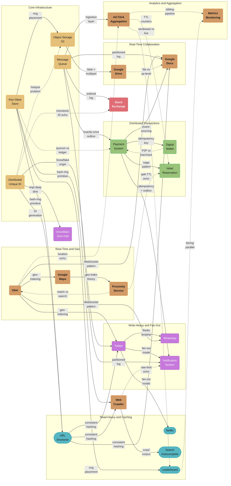

# HLD — Case Studies

Twenty-three end-to-end system design case studies at the high-level architectural overview depth. These are interview-format studies — start with requirements, estimate scale, draw the architecture, then discuss tradeoffs.

Each follows the 11-section principal template: Requirements Clarification, Scale Estimation, High-Level Architecture, Component Deep Dives, Design Decisions & Tradeoffs, Real-World Implementations, Technologies & Tools, Operational Playbook, Common Pitfalls & War Stories, Capacity Planning, and Interview Discussion Points.

---

## Quick Start

If you only have time for three, read these first:

| File | Why |
|------|-----|
| [Design Twitter](design_twitter.md) | Canonical fan-out / feed problem. Teaches the write-vs-read fan-out tradeoff that recurs in every social and notification system. |
| [Design Uber](design_uber.md) | Real-time geo-matching under high write load. Teaches geospatial indexing, quadtrees, and the driver-rider matching loop — the foundation for [Design Google Maps](design_google_maps.md). |
| [Design a URL Shortener](design_url_shortener.md) | The simplest well-scoped system design problem. Best for understanding how to handle 100:1 read-write ratio and ID generation at scale. |

---

## Full Learning Path

Grouped by primary engineering concern:

### Read-Heavy Systems & Caching

| Case Study | Primary Concern | What It Teaches |
|------------|----------------|----------------|
| [Design a URL Shortener](design_url_shortener.md) | Read-heavy with 100:1 read/write ratio, ID generation | Base62 encoding for short IDs, consistent hashing for distributed KV, Bloom filter to avoid DB lookups on 404s, CDN edge caching for 301 redirects, distributed rate limiting for abuse prevention. |
| [Design Netflix](design_netflix.md) | CDN, video streaming, read scalability | Open Connect CDN architecture, adaptive bitrate streaming, 700+ microservice decomposition with Hystrix/Resilience4j circuit breakers, multi-region active-active deployment. |
| [Design Search Autocomplete (Typeahead)](design_search_autocomplete.md) | Sub-100ms prefix lookups under massive read amplification | Trie-based prefix index with precomputed top-K, hot-prefix Redis caching with jittered TTLs and single-flight stampede prevention, sharding by `hash(query)` (not prefix) to avoid hot shards, multi-region replication with per-region trending detection, NFKD query normalization and CJK/locale-aware tokenization. |
| [Design a Leaderboard](design_leaderboard.md) | Real-time ranking at a massive read:write ratio | Redis sorted-set/skip-list internals for O(log N) rank updates; sharding by `hash(playerId)` with a cached global top-N built via k-way merge of per-shard top-K; composite tiebreaker-encoded sort keys for stable ranking; real-time per-shard rank lookups for personal queries vs. cached reads for the global board. |

### Write-Heavy & Fan-Out Systems

| Case Study | Primary Concern | What It Teaches |
|------------|----------------|----------------|
| [Design Twitter](design_twitter.md) | Feed fan-out, write amplification vs read amplification | Fan-out-on-write (push model) vs fan-out-on-read (pull model); celebrity problem; hybrid model; Redis sorted sets for timeline; Snowflake-style distributed ID generation; rate limiting fan-out writes for high-follower accounts. |
| [Design WhatsApp](design_whatsapp.md) | Real-time messaging, end-to-end encryption, online presence | WebSocket connection management at Erlang/OTP scale (2M connections/server); Signal Protocol (X3DH handshake + Double Ratchet) for end-to-end encryption; group fan-out via sender keys; last-seen/online presence via Redis TTL; multi-device sync. |
| [Design a Notification System](design_notification_system.md) | Multi-channel fan-out under third-party provider rate limits | Per-channel Kafka topics (push/SMS/email/in-app); token-bucket rate limiting per provider (FCM/APNs/Twilio/SES); idempotency keys for exactly-once delivery; circuit breakers for provider outages; cost-driven channel selection (push vs SMS economics). |

### Real-Time & Geo-Distributed

| Case Study | Primary Concern | What It Teaches |
|------------|----------------|----------------|
| [Design Uber](design_uber.md) | Real-time geo-matching, location updates, dynamic pricing | Quadtree / geohash / H3 for driver lookup; high-frequency location write load; surge pricing as a feedback loop; trip state machine with LWT/Paxos consistency; multi-region failover for per-city services. |
| [Design Google Maps](design_google_maps.md) | Geospatial indexing, route precomputation, live traffic | Geohash vs. Quadtree vs. S2 vs. H3 tradeoffs; Contraction-Hierarchy-based routing with bidirectional search; live traffic-overlay layered on a precomputed graph; tile-pyramid CDN serving; versioned-URL cache invalidation. |
| [Design a Proximity Service](design_proximity_service.md) | Geo + attribute search at sub-second latency (Yelp/nearby) | Two-phase geo-index + attribute-index search with geohash neighbor-cell expansion; Redis GEO vs. PostGIS vs. Elasticsearch `geo_point` backend tradeoffs; split-TTL caching for "open now" freshness vs. static attributes; dense-vs-sparse adaptive geohash precision; personalization re-ranking layered on top of base ranking. |

### Distributed Transactions & Strong Consistency

| Case Study | Primary Concern | What It Teaches |
|------------|----------------|----------------|
| [Design a Payment System](design_payment_system.md) | Exactly-once charges, double-entry ledger | `Idempotency-Key` for safe retries; saga pattern for multi-step payment flows; outbox pattern for reliable event propagation; double-entry ledger as the system of record; PCI-DSS tokenization; reconciliation against PSP statements. |
| [Design a Digital Wallet](design_digital_wallet.md) | P2P stored-value transfers, optimistic-locking ledger updates | Double-entry ledger as the system of record for wallet balances; optimistic concurrency control (version column + retry) for concurrent debits on the same account; idempotency keys for client-retried transfers; top-up/withdrawal vs. instant P2P transfer state machines; KYC/AML checks — contrasted with [design_payment_system](design_payment_system.md)'s merchant/PSP focus. |
| [Design a Hotel Reservation System](design_hotel_reservation.md) | Inventory consistency under concurrent bookings, overbooking prevention | Inventory model keyed by `(hotel_id, room_type, date)`; hold-with-TTL + atomic decrement to close the search-to-book race; booking saga (search -> hold -> pay -> confirm); search-cache staleness tradeoffs during flash sales; sharding inventory by `hotel_id`/region. |

### Low-Latency Matching & Trading Systems

| Case Study | Primary Concern | What It Teaches |
|------------|----------------|----------------|
| [Design a Stock Exchange](design_stock_exchange.md) | Deterministic order matching at microsecond latency | Price-time priority matching via per-symbol `TreeMap` price levels + FIFO order queues; single-writer-per-symbol matching engine fed by a sequencer/durable log for determinism and crash replay; market-data dissemination fan-out; pre-trade risk checks; order types (market/limit/IOC/FOK). |

### Real-Time Collaboration

| Case Study | Primary Concern | What It Teaches |
|------------|----------------|----------------|
| [Design Google Docs](design_google_docs.md) | Convergent concurrent editing | Operational Transformation vs. CRDTs; the convergence invariant; operation log as event-sourced source of truth; document-to-shard routing via consistent hashing; WebSocket session lifecycle, presence, and cursors. |
| [Design Google Drive](design_google_drive.md) | File-level sync, content dedup, and conflict resolution at scale | Content-addressed chunking with cross-account dedup; metadata tree as adjacency-list + closure table for folder hierarchies; file-level "conflicted copy" resolution contrasted with Google Docs' operation-level CRDT/OT; resumable multipart uploads; dual-counter storage-quota accounting (logical usage vs. chunk reference count); two-phase trash/GC. |

### Large-Scale Crawling & Data Pipelines

| Case Study | Primary Concern | What It Teaches |
|------------|----------------|----------------|
| [Design a Web Crawler](design_web_crawler.md) | Planet-scale graph traversal under per-host politeness constraints | URL frontier with priority + politeness queues; consistent hashing by *domain* (not URL) for frontier sharding — solving load balancing and politeness with one mechanism; scalable/layered Bloom-filter dedup; SimHash near-duplicate detection; frontier checkpointing for crash recovery. |

### Core Infrastructure & Building-Block Services

| Case Study | Primary Concern | What It Teaches |
|------------|----------------|----------------|
| [Design a Distributed Key-Value Store](design_key_value_store.md) | Tunable consistency under partition (AP system) | Consistent-hash ring with virtual nodes; quorum reads/writes (W+R>N); vector clocks vs. last-write-wins; Merkle-tree anti-entropy and read repair; hinted handoff and gossip-based membership. |
| [Design a Distributed Unique ID Generator](design_distributed_unique_id.md) | Globally unique, roughly time-ordered IDs with no central bottleneck | Snowflake 64-bit layout (timestamp/datacenter/worker/sequence); worker-ID allocation via ZooKeeper/etcd ephemeral znodes; clock-skew detection and NTP slew vs. step; the time-ordered-ID hotspotting tradeoff. |
| [Design a Distributed Message Queue](design_distributed_message_queue.md) | Ordered, durable, partitioned event streaming at scale | Topic/partition/offset model and log-structured storage; producer partitioning (key-hash vs. sticky); leader/ISR replication and `acks` tradeoffs; consumer-group rebalancing (eager vs. incremental cooperative); idempotent/transactional exactly-once delivery. |
| [Design Object Storage (S3)](design_object_storage_s3.md) | Durable blob storage at exabyte scale with a separate metadata index | Erasure coding (Reed-Solomon 6+3) vs. 3x replication for an 11-nines durability target; metadata index as a sharded KV store decoupled from blob storage; the S3 Dec-2020 shift to strong read-after-write consistency; hashed-prefix key design to avoid sequential-key hotspots; multipart upload and lifecycle tiering. |

### Analytics & Real-Time Aggregation Pipelines

| Case Study | Primary Concern | What It Teaches |
|------------|----------------|----------------|
| [Design an Ad Click Event Aggregation System](design_ad_click_aggregation.md) | Real-time + batch aggregation of high-volume event streams | Lambda vs. Kappa streaming architecture; tumbling-window aggregation with watermarks for late events; HyperLogLog mergeable sketches for approximate unique counts; multi-region ingestion with regional rollups merged into global numbers; exact (billing-path) vs. approximate (dashboard-path) counting tradeoffs. |
| [Design a Metrics Monitoring System](design_metrics_monitoring.md) | Time-series ingestion, storage, and alerting at massive label cardinality | Metric+labels+timestamp+value data model; cardinality = product of label cardinalities (the `user_id`-label trap); pull (Prometheus) vs. push (Datadog/StatsD) ingestion; Gorilla/TSM columnar compression; 3-tier downsampling/retention (15s/15d -> 5m/90d -> 1h/2y); PromQL-style query fan-out; OK -> PENDING -> FIRING -> RESOLVED alert state machine with a "for" duration to suppress flapping. |

---

## Cross-Cutting / Shared Primitives

Each case study's `## Cross-References` footer points to deep-dive modules in `backend/`, `database/`, `devops/`, and elsewhere in `hld/`. The same primitives recur across studies — read the deep dive once, then recognize the pattern everywhere it resurfaces:

| Primitive | Used By | Role |
|-----------|---------|------|
| [Wide-Column Databases](../../database/wide_column_databases/README.md) | Twitter, Netflix, Uber, URL Shortener, WhatsApp, Distributed Key-Value Store | Primary store for high-write-throughput data: tweets, watch history, trip records, URL mappings, messages, KV-store rows |
| [Kafka Deep Dive](../../backend/kafka_deep_dive/README.md) | Twitter, Netflix, Uber, URL Shortener, WhatsApp, Notification System, Distributed Message Queue | Async pipelines: fan-out delivery, analytics ingestion, location-update streams, offline message queues, per-channel delivery topics, partition/ISR internals |
| [Key-Value Stores (Redis / Wide-Column)](../../database/key_value_stores/README.md) | Twitter, Uber, URL Shortener, WhatsApp, Search Autocomplete, Web Crawler, Distributed Key-Value Store, Distributed Unique ID, Ad Click Aggregation, Leaderboard, Metrics Monitoring, Google Drive | Hot-path cache: timelines, redirect cache, driver-location index, presence, hot-prefix suggestions, crawl metadata + DNS cache, KV-store persistence model, ID-segment reservation, real-time OLAP rollup storage, write-behind leaderboard durability, time-series rollup storage (Metrics Monitoring), chunk/metadata lookups (Google Drive) |
| [Sharding & Partitioning](../../database/sharding_and_partitioning/README.md) | Twitter, Uber, URL Shortener, WhatsApp, Distributed Key-Value Store, Distributed Unique ID, Object Storage, Digital Wallet, Hotel Reservation, Metrics Monitoring, Google Drive | Horizontal scaling strategy for the primary datastore; ID-as-shard-key hotspotting; metadata-index sharding for object storage; account-ID sharding for wallet ledgers (Digital Wallet); `hotel_id`/region sharding for room inventory (Hotel Reservation); shard-by-metric-name for time-series writes (Metrics Monitoring); file-tree metadata sharding (Google Drive) |
| [Caching Strategies Deep Dive](../../backend/caching_strategies_deep_dive/README.md) + [Database Caching Patterns](../../database/database_caching_patterns/README.md) + [Caching (HLD)](../caching/README.md) | Twitter, Netflix, Uber, URL Shortener, Search Autocomplete, Proximity Service, Leaderboard, Hotel Reservation, Google Drive | Cache-aside vs. read-through, stampede prevention, TTL design; split-TTL freshness tiers (Proximity Service) and Top-N cache refresh (Leaderboard); search-result caching with staleness tradeoffs during flash sales (Hotel Reservation) and metadata/folder-tree caching (Google Drive) |
| [Consistency Models & Consensus](../../database/consistency_models_and_consensus/README.md) | Netflix, Uber, WhatsApp, Stock Exchange, Hotel Reservation | Cross-region replication trade-offs, LOCAL_QUORUM vs. strict ordering; strict single-writer ordering for exchange order books (Stock Exchange) and inventory holds (Hotel Reservation) |
| [Fault Tolerance Patterns](../../backend/fault_tolerance_patterns/README.md) | Netflix, Uber, WhatsApp | Circuit breakers, "let it crash" supervision, multi-region failover |
| [Microservices](../microservices/README.md) | Netflix, Uber, WhatsApp | Service decomposition and bounded contexts |
| [Consistent Hashing](../consistent_hashing/README.md) | Twitter, Uber, URL Shortener, Web Crawler, Google Docs, Distributed Key-Value Store, Distributed Message Queue, Object Storage, Leaderboard, Proximity Service, Digital Wallet, Hotel Reservation, Metrics Monitoring | Distributing keys/load across nodes without full reshuffle — frontier sharding by domain (Web Crawler), document-to-shard routing (Google Docs), ring placement (KV Store), partition assignment (Message Queue), metadata-shard placement (Object Storage), `playerId`-based shard placement (Leaderboard), A/B-test bucketing (Proximity Service), account-ID shard placement (Digital Wallet), `hotel_id`/date shard placement (Hotel Reservation), metric-name shard placement (Metrics Monitoring) |
| [Cloud Networking & CDN](../../devops/cloud_networking_and_cdn/README.md) | Netflix, URL Shortener, WhatsApp | Edge delivery for media, redirects, and static assets |
| [CDN](../cdn/README.md) | Google Maps, Object Storage | Tile-pyramid serving with >99% edge cache-hit rate; hot-object GET offload for object storage |
| [Rate Limiting](../rate_limiting/README.md) | Twitter, URL Shortener, Notification System, Search Autocomplete, Ad Click Aggregation, Google Drive | Protecting write paths and third-party providers from abuse and traffic spikes; per-IP/device click-fraud rate limiting; per-account upload/API rate limiting (Google Drive) |
| [Resilience Patterns](../resilience_patterns/README.md) | Notification System, Payment System, Web Crawler, Google Maps, Distributed Key-Value Store, Distributed Message Queue, Proximity Service, Stock Exchange, Metrics Monitoring | Circuit breakers, retries with backoff/jitter, and graceful degradation for provider, host, regional, broker/replica, and search-cluster outages; matching-engine failover and durable-log replay (Stock Exchange); scrape-target and alert-pipeline degradation (Metrics Monitoring) |
| [Observability](../observability/README.md) | Notification System, Google Maps, Distributed Key-Value Store, Distributed Unique ID, Distributed Message Queue, Object Storage, Ad Click Aggregation, Digital Wallet, Stock Exchange, Metrics Monitoring | RED-method metrics, SLI/SLO framing, freshness/lag alerting and runbooks; repair-queue/durability-floor alerting (Object Storage); watermark-lag and discrepancy-% alerting (Ad Click Aggregation); ledger-drift/reconciliation alerting (Digital Wallet); matching-engine latency SLOs (Stock Exchange); the system this case study is itself about (Metrics Monitoring) |
| [Distributed Transactions](../distributed_transactions/README.md) | Payment System, Distributed Key-Value Store, Distributed Message Queue, Ad Click Aggregation, Proximity Service, Digital Wallet, Hotel Reservation | Saga, TCC, outbox pattern, and idempotency keys for exactly-once charges, exactly-once message delivery, exactly-once click counting, and CDC-based listing-update propagation; optimistic-locking transfer retries (Digital Wallet) and the search -> hold -> pay -> confirm booking saga (Hotel Reservation) |
| [Event Sourcing & CQRS](../event_sourcing_cqrs/README.md) | Payment System, Google Docs, Distributed Message Queue, Ad Click Aggregation, Digital Wallet, Google Drive | Operation/event log as the source of truth, with projections and snapshots; raw click events as the append-only log with rollups as projections; append-only ledger entries as the event log (Digital Wallet); the version-manifest chain as a projection over file-edit events (Google Drive) |
| [Security & Auth](../security_and_auth/README.md) | Payment System, Google Maps, Object Storage, Digital Wallet, Google Drive | PCI-DSS tokenization and secrets management; location-data minimization and retention; bucket policies, object ACLs, and request signing; KYC/AML identity verification (Digital Wallet); ACL-inheritance for shared folders (Google Drive) |
| [Search Engines](../../database/search_engines/README.md) | Web Crawler, Search Autocomplete, Google Maps, Proximity Service | Inverted indexes over crawled content, suggestion FSTs, geocoding address tokens, and Elasticsearch `geo_point` queries |
| [Message Queues (HLD)](../message_queues/README.md) | Web Crawler, Google Maps, Distributed Message Queue | URL frontier transport; GPS-ping ingestion for the Traffic Service; the conceptual model this case study implements directly |
| [WebSockets & SSE](../../backend/websockets_and_sse/README.md) | Google Docs, Leaderboard, Google Drive | Real-time bidirectional session management for collaborative editing; push delivery for live-viewed leaderboard screens; sync-event push to connected devices (Google Drive) |
| [Snowflake ID Generator (Java)](../../java/case_studies/design_snowflake_id_generator_java.md) | Twitter, URL Shortener, Distributed Unique ID | Reference implementation for distributed unique ID generation — Distributed Unique ID is its fleet-operations companion |
| [CAP Theorem](../cap_theorem/README.md) | Distributed Key-Value Store | AP-vs-CP framing for tunable-consistency stores |
| [Consensus Algorithms](../consensus_algorithms/README.md) | Distributed Key-Value Store, Distributed Unique ID, Stock Exchange | ZooKeeper/etcd-style coordination for CP metadata and worker-ID allocation; sequencer/leader election for deterministic per-symbol order processing (Stock Exchange) |
| [Storage Engines Internals](../../database/storage_engines_internals/README.md) | Distributed Key-Value Store, Object Storage, Metrics Monitoring | LSM-tree vs. B-tree tradeoffs for the per-node storage engine, applied here to both the KV store and the object-storage metadata index; columnar TSM/Gorilla-style compression for time-series data points (Metrics Monitoring) |
| [Scalability](../scalability/README.md) | Object Storage, Ad Click Aggregation, Leaderboard, Metrics Monitoring | Horizontal scaling and stateless-tier principles applied to the metadata-index gateway tier, stream-processor parallelism, and the global top-K merger fleet; stateless query-fan-out tier for federated PromQL-style queries (Metrics Monitoring) |

---

## Dependency Map

Solid arrows point from the case study that originates a pattern to the one that reuses it; dotted arrows mark a contrast, or an independently-arrived-at echo of the same idea, rather than direct reuse. Key-Value Store and Distributed Message Queue (gold, Core Infrastructure) are the busiest hubs, together feeding their hash-ring, ring-placement, and partitioned-log primitives out to nine other case studies; Stock Exchange (red) sits at the end of two of those chains — it consumes the ordered log and the monotonic-ID need but feeds no pattern back out.

---

## Interview Prep Shortcuts

| "Design X" Interview Question | Best Case Study |
|-------------------------------|----------------|
| Design a URL shortener / TinyURL | [design_url_shortener](design_url_shortener.md) |
| Design a pastebin | [design_url_shortener](design_url_shortener.md) — same read-heavy KV pattern |
| Design Twitter / social feed | [design_twitter](design_twitter.md) |
| Design Instagram feed | [design_twitter](design_twitter.md) — fan-out patterns identical |
| Design WhatsApp / messaging system | [design_whatsapp](design_whatsapp.md) |
| Design Slack | [design_whatsapp](design_whatsapp.md) + channel fan-out from [design_twitter](design_twitter.md) |
| Design Signal / Telegram / a secure messaging app | [design_whatsapp](design_whatsapp.md) — §4 (E2E encryption) and §6 (Comparable Systems table) cover the protocol differences directly |
| Design Uber / Lyft | [design_uber](design_uber.md) |
| Design DoorDash dispatch | [design_uber](design_uber.md) — geo-matching core is the same |
| Design Netflix / YouTube | [design_netflix](design_netflix.md) |
| Design a notification / alerting system | [design_notification_system](design_notification_system.md) |
| Design Stripe / a payment system (merchant charges) | [design_payment_system](design_payment_system.md) |
| Design Venmo / PayPal / a P2P digital wallet | [design_digital_wallet](design_digital_wallet.md) — double-entry ledger + optimistic-locking transfers; see also [design_payment_system](design_payment_system.md) for the merchant/PSP side |
| Design Google Docs / a collaborative editor (Figma, Notion) | [design_google_docs](design_google_docs.md) |
| Design a web crawler / search engine indexing pipeline | [design_web_crawler](design_web_crawler.md) |
| Design typeahead / search autocomplete | [design_search_autocomplete](design_search_autocomplete.md) |
| Design Google Maps / a navigation app | [design_google_maps](design_google_maps.md) |
| Design Yelp / nearby places search | [design_proximity_service](design_proximity_service.md) — geo + attribute search; see also [design_google_maps](design_google_maps.md) §4.4 for geo-index theory |
| Design a distributed cache / key-value store (Redis, DynamoDB, Memcached) | [design_key_value_store](design_key_value_store.md) |
| Design a unique ID generator (Snowflake, distributed counter, ticket server) | [design_distributed_unique_id](design_distributed_unique_id.md) |
| Design a distributed message queue / Kafka / pub-sub system | [design_distributed_message_queue](design_distributed_message_queue.md) |
| Design S3 / a cloud object-storage service (blob layer) | [design_object_storage_s3](design_object_storage_s3.md) |
| Design Dropbox / Google Drive / a file-sync and storage service | [design_google_drive](design_google_drive.md) — content-addressed chunking, dedup, and file-level sync on top of [design_object_storage_s3](design_object_storage_s3.md)'s blob layer |
| Design an ad-click aggregation system / real-time analytics dashboard | [design_ad_click_aggregation](design_ad_click_aggregation.md) |
| Design a leaderboard / real-time ranking system (gaming) | [design_leaderboard](design_leaderboard.md) |
| Design a stock exchange / trading platform / order matching engine | [design_stock_exchange](design_stock_exchange.md) — price-time priority matching, single-writer-per-symbol determinism |
| Design Booking.com / Expedia / a hotel (or flight/event-ticket) reservation system | [design_hotel_reservation](design_hotel_reservation.md) — hold-with-TTL inventory model prevents overbooking |
| Design Datadog / Prometheus / a metrics monitoring and alerting system | [design_metrics_monitoring](design_metrics_monitoring.md) — cardinality control, downsampling tiers, alert state machine |

---

## Back to HLD Section

[HLD Master Index](../README.md)
