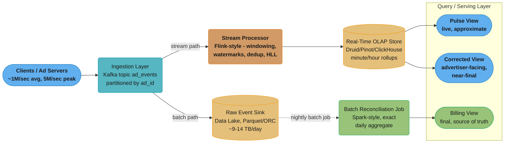
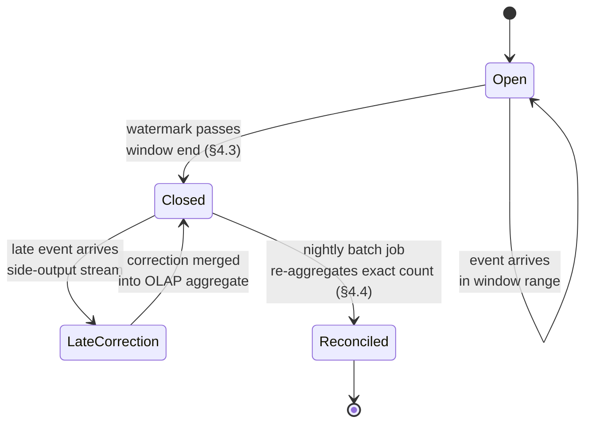
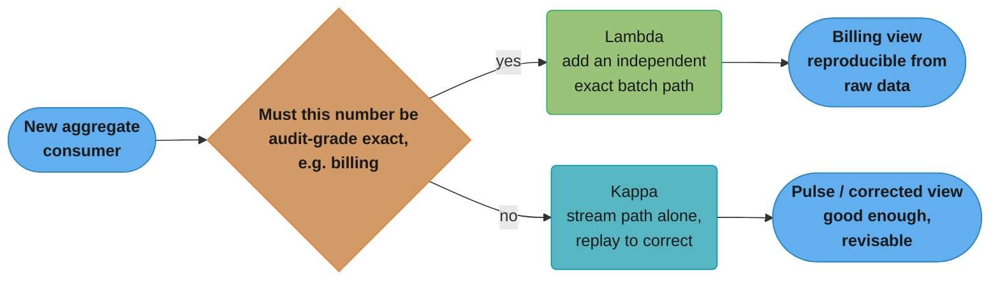
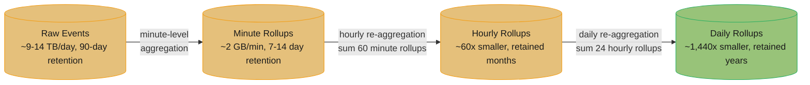
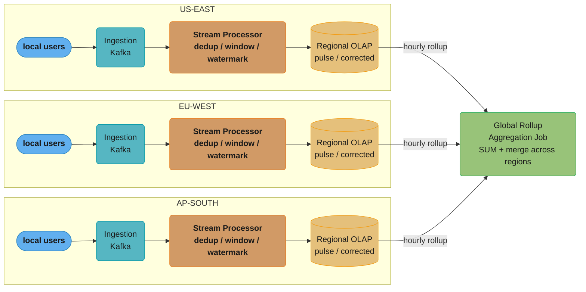

# System Design: Ad Click Event Aggregation

## Intuition

> **Design intuition**: An ad click aggregation system is a tug-of-war between **two clocks that can never agree**. One clock belongs to the advertiser dashboard, which wants a number *now* — "how many clicks has my campaign gotten in the last five minutes?" — even if that number is approximate and might shift slightly later. The other clock belongs to the billing pipeline, which wants a number that is *exact and final* — "how many clicks will I invoice this advertiser for, in a way that will survive an audit?" — even if that number isn't available until hours after the event happened. Every architectural decision in this design (windowing, watermarks, Lambda vs. Kappa, HyperLogLog vs. exact counts) is really an answer to the question: **how much should the fast path know, and how much should we be willing to wait for the slow path to be right?**

**Key insight**: The system must be explicit, at every layer, about which numbers are *provisional* and which are *final* — because at-least-once delivery, late-arriving mobile events, and stream-processing watermarks guarantee that the real-time count and the eventual batch-reconciled count for the same time window **will differ**, typically by 1-5%, and that difference is not a bug to be eliminated but a tradeoff to be managed and clearly labeled. A system that quietly presents a real-time number as if it were the final billed number — or that double-counts a redelivered event because nothing deduplicated it — turns an engineering approximation into a billing dispute, which is the single most expensive failure mode this design exists to prevent (§9).

---

## 1. Requirements Clarification

### Functional Requirements

- **Ingest click and impression events** at very high, bursty volume from ad servers and client SDKs: each event carries `(event_id, event_type, ad_id, advertiser_id, campaign_id, user_id/device_id, timestamp, geo, device_type, placement_id)`.
- **Real-time aggregation**: produce near-real-time counts (clicks, impressions, click-through-rate) broken down by `(ad_id, advertiser_id, time window)` and secondary dimensions (geo, device type, placement), with end-to-end lag in the **seconds-to-low-minutes** range, for advertiser-facing dashboards.
- **Exact batch aggregation for billing**: produce a reconciled, exact daily (and hourly) aggregate per `(ad_id, advertiser_id, ...)` that is the **single source of truth** for what an advertiser is billed — this number must be deterministic and reproducible from raw data.
- **Deduplication / exactly-once counting**: a click that is retried by the client, redelivered by the message broker (at-least-once delivery), or otherwise duplicated must be **counted exactly once** in the billing-grade aggregate.
- **Late-arriving events**: support events that arrive significantly after they occurred — e.g., a mobile app that batches clicks while offline and uploads them hours later — without silently dropping them from the billing aggregate.
- **Rollups at multiple granularities**: minute -> hour -> day rollups, so dashboards can query any granularity without re-scanning raw events.
- **Click-fraud signal surface**: flag suspicious click patterns (e.g., abnormal click-to-impression ratio from a single IP/device) for downstream fraud review — producing *signals*, not making the final fraud-block decision.

### Non-Functional Requirements

- **High throughput, bursty**: sustain **1,000,000 events/sec average**, bursting to **5,000,000 events/sec** during major events (a televised sporting event, a flash sale) — a 5x burst factor (§2).
- **Near-real-time freshness**: dashboards reflect new events within **10-60 seconds** of ingestion for the "pulse" view (§4.3, §4.4).
- **Billing correctness over speed**: the daily reconciled aggregate must be **exact** — no double counting, no silent drops — even if it takes until the following morning to finalize. Correctness here is non-negotiable; latency is negotiable.
- **Bounded discrepancy, clearly surfaced**: the real-time aggregate and the eventual batch aggregate for the same window will differ by a small, bounded percentage (target: **under 2-3%** under normal conditions, §9 War Story 2) — this discrepancy must be measurable and surfaced as a first-class metric (§8), not hidden.
- **High availability for ingestion**: the ingestion layer must never apply backpressure all the way to ad-serving — an ad click event must always be accepted (buffered if needed) even if downstream aggregation is temporarily behind.
- **Long retention for raw events**: raw events are retained in a data lake for **weeks to months** to support reprocessing, audits, and advertiser disputes (§9 edge case, §10).

### Out of Scope

- **Ad serving and targeting** — deciding *which* ad to show a user, bidding, auction mechanics, and the real-time bidding (RTB) protocol are a separate system. This design starts from the moment an impression or click event is *emitted*, not from the decision that produced it.
- **Bidding and budget pacing** — how an advertiser's budget is spent over the course of a day (pacing algorithms) consumes the aggregates this system produces but is itself a distinct optimization/control-loop system.
- **The advertiser-facing dashboard UI/UX** — this design covers the backend aggregation pipeline and the OLAP query layer it feeds; the dashboard is a client of that query layer.

---

## 2. Scale Estimation

### Event Volume and Size

- **Average ingestion**: 1,000,000 events/sec (clicks + impressions combined; impressions typically outnumber clicks 50:1-100:1, but both flow through the same pipeline).
- **Peak ingestion**: 5,000,000 events/sec during a major event — a **5x burst factor** the ingestion and stream-processing tiers must absorb without backpressure reaching ad-serving (§1).
- **Event size**: roughly **500 bytes** per event (event ID, IDs for ad/advertiser/campaign/placement, timestamp, geo, device info, a few flags).
- **Peak ingestion bandwidth**: `5,000,000 events/sec x 500 bytes` = **2.5 GB/sec** at peak, **0.5 GB/sec** average.

### Daily Volume

- At 1M events/sec average: `1,000,000 x 86,400` ~= **86.4 billion events/day**.
- At 500 bytes/event: `86.4B x 500 bytes` ~= **~43.2 TB/day** of raw event data before compression.
- With typical compression for semi-structured event data (3-5x for columnar formats like Parquet/ORC): roughly **~9-14 TB/day** in the data lake (§4.5, §10).

### Aggregation Cardinality

- Active ad campaigns at any time: on the order of **10 million distinct `ad_id`s**.
- Each `ad_id` is aggregated across multiple dimensions: geo (hundreds of regions), device type (a handful), placement (dozens), and time window (per-minute, per-hour, per-day).
- A single minute's worth of aggregation can have `10M ad_ids x ~50 dimension-combinations` = up to **500 million distinct (ad_id, dimension-combo) keys** in the worst case — though in practice the overwhelming majority of `ad_id`s see zero or near-zero traffic in any given minute, so the *actual* number of non-zero aggregate rows per minute is far smaller (commonly in the tens of millions).
- Unique-user/click counting (for reach/frequency metrics) per `ad_id` per day can involve **billions of (ad_id, user_id) pairs** cumulatively — this is the cardinality problem HyperLogLog (§4.5) exists to solve cheaply.

### Storage and Retention

- Raw events (data lake, §4.5): ~9-14 TB/day compressed -> at a **90-day retention** for reprocessing/audit, roughly **~1 PB** of raw event storage.
- Minute-level rollups: far smaller than raw events — roughly `(non-zero aggregate rows per minute) x (~100 bytes/row)`. At ~20M non-zero rows/minute: `20M x 100 bytes` = **~2 GB/minute** -> ~2.9 TB/day for minute-granularity rollups, typically retained for **7-14 days**.
- Hourly and daily rollups are 60x and 1,440x smaller respectively, retained for **months to years** for historical reporting.

---

## 3. High-Level Architecture

This design uses a **Lambda architecture** — parallel batch and stream processing paths over the same raw event source, reconciled at the OLAP layer (justified in §5). The streaming path optimizes for the "fast, approximate" need; the batch path optimizes for the "slow, exact" need.



*Ingestion fans out into the stream path (fast, approximate) and the batch path (slow, exact); both converge at the Query/Serving Layer as three explicitly-labeled views — pulse, corrected, and billing (§4.3, §9 War Story 2).*

### Request / Data Flow

1. **Event emission**: ad servers and client SDKs emit impression and click events as they happen. Each event carries a client-generated `event_id` (UUID), critical for deduplication (§4.1).
2. **Ingestion**: events land on a partitioned, replicated topic (cross-ref [`./design_distributed_message_queue.md`](./design_distributed_message_queue.md)) partitioned by `ad_id` so that all events for a given ad land on the same partition — this is what makes per-`ad_id` windowed aggregation embarrassingly parallel (one stream-processing task per partition).
3. **Stream processing**: a Flink-style stream processor consumes each partition, assigns events to **tumbling time windows** (§4.2), deduplicates by `event_id` within a bounded window (§4.1), and maintains running counts per `(ad_id, advertiser_id, window, dimensions)`. **Watermarks** (§4.3) determine when a window is considered "complete enough" to emit.
4. **Real-time serving**: emitted window aggregates are written to an OLAP store (Druid/Pinot/ClickHouse-style — columnar, optimized for fast group-by/filter queries over time-series data) that backs the dashboard's "pulse" and "corrected" views.
5. **Raw event archival**: every event, regardless of stream-processing outcome, is also durably written to a data lake (object storage, columnar format) — this is both the audit trail and the input to the batch path.
6. **Nightly batch reconciliation**: a batch job (Spark-style) re-reads the prior day's raw events from the data lake, performs **exact** deduplication and aggregation (no windowing approximations, no watermark cutoffs — it has the *entire* day's data, including events that arrived late), and writes the result as the **billing-grade** daily aggregate.
7. **Serving layer**: dashboards query the OLAP store for "pulse" (short watermark, most current) and "corrected" (longer watermark, more complete) numbers; the billing system queries the batch-reconciled daily aggregate exclusively.

### Windowing Diagram: Tumbling Windows and the Watermark Line

```
Event time ------------------------------------------------------------>

  Window [12:00-12:01)   Window [12:01-12:02)   Window [12:02-12:03)
  +------------------+   +------------------+   +------------------+
  | e1 e2 e3    e4    |   | e5  e6     e7     |   | e8   e9          |
  +------------------+   +------------------+   +------------------+
                                                            ^
                                                   Processing time "now" = 12:03:45
                                                            |
   Watermark = "now" - allowed lateness (e.g., 2 min)      |
   Watermark position --------------------------> 12:01:45
                          ^
                          |
              Window [12:01-12:02) CLOSES here:
              watermark (12:01:45) > window end (12:02:00)? NO -> not yet closed
              Window [12:00-12:01) CLOSES here:
              watermark (12:01:45) > window end (12:01:00)? YES -> CLOSED, emitted

   A late event e_late with event_time=12:00:30 arriving at processing
   time 12:03:50 (AFTER window [12:00-12:01) already closed):
     -> side-output to "late events" stream (§4.3)
     -> NOT included in the real-time aggregate for [12:00-12:01)
     -> IS included when the nightly batch job re-aggregates from raw
        events, which has no watermark cutoff
```

The watermark is the system's running estimate of "we are unlikely to see any more events with event-time earlier than this." A 2-minute watermark delay means a window closes (and its aggregate is emitted to the real-time OLAP store) **2 minutes after** its end-time has passed — trading 2 minutes of latency for the ability to absorb up to 2 minutes of event reordering/delay before an event is considered "late" (§4.3, §5).

---

## 4. Component Deep Dives

### 4.1 Event Ingestion and Deduplication

At-least-once delivery (the default for the ingestion topic, cross-ref [`./design_distributed_message_queue.md`](./design_distributed_message_queue.md) §4.5) guarantees no event is silently lost — but it also guarantees that **retries and consumer-group rebalances can redeliver an event the stream processor already counted**. Every event therefore carries a client-generated `event_id` (a UUID, generated once at the point the click/impression is fired, and preserved across retries), and the stream processor maintains a **bounded deduplication cache** keyed by `event_id`.

The cache must be bounded — holding every `event_id` ever seen would grow unboundedly — so it is sized to the **maximum expected redelivery delay** (§9 War Story 1): if redeliveries are expected within at most 10 minutes of the original delivery, a cache covering the last ~15 minutes of `event_id`s (with margin) catches essentially all duplicates the streaming layer will ever see. Anything older is assumed unique (a vanishingly rare false-negative) — and even that residual risk is closed by the batch path's *exact*, full-day deduplication (§4.4), which is why the streaming dedup cache only needs to be "good enough for real-time," not perfect.

```java
package com.rutik.systemdesign.hld.case_studies.adclick;

import java.time.Duration;
import java.time.Instant;
import java.util.LinkedHashMap;
import java.util.Map;
import java.util.concurrent.ConcurrentHashMap;
import java.util.concurrent.atomic.LongAdder;

/**
 * Deduplicates ad click/impression events by event_id before they are
 * folded into windowed aggregate counts (§4.2). Uses a bounded,
 * time-ordered cache so that retried/redelivered events (at-least-once
 * delivery from the ingestion topic) are counted at most once, while
 * memory stays bounded regardless of total event volume.
 *
 * This is the streaming-layer "good enough" defense against
 * double-counting (War Story 1, §9). The nightly batch job (§4.4)
 * performs exact, unbounded deduplication over the full day and is
 * the ultimate source of truth for billing.
 */
public class DeduplicatingAggregator {

    /** event_id -> insertion time. LinkedHashMap preserves insertion
     *  order, which we exploit for cheap expiry of the oldest entries. */
    private final LinkedHashMap<String, Instant> seenEventIds;
    private final Duration dedupWindow;
    private final int maxCacheSize;

    private final Map<AggregateKey, LongAdder> counts = new ConcurrentHashMap<>();

    public DeduplicatingAggregator(Duration dedupWindow, int maxCacheSize) {
        this.dedupWindow = dedupWindow;
        this.maxCacheSize = maxCacheSize;
        // accessOrder=false: pure insertion-order map, used as a ring buffer
        this.seenEventIds = new LinkedHashMap<>(maxCacheSize, 0.75f, false);
    }

    /**
     * Processes one event: if it's a duplicate (event_id seen within the
     * dedup window), it is dropped without incrementing any count.
     * Otherwise, it is recorded as seen and its count is incremented.
     *
     * @return true if the event was counted, false if it was a
     *         detected duplicate and dropped.
     */
    public synchronized boolean process(AdEvent event, Instant now) {
        evictExpired(now);

        if (seenEventIds.containsKey(event.eventId())) {
            return false; // duplicate - drop, do not double-count
        }

        seenEventIds.put(event.eventId(), now);
        if (seenEventIds.size() > maxCacheSize) {
            // Evict the oldest entry (insertion-order iterator's first element)
            var it = seenEventIds.entrySet().iterator();
            if (it.hasNext()) {
                it.next();
                it.remove();
            }
        }

        AggregateKey key = AggregateKey.from(event);
        counts.computeIfAbsent(key, k -> new LongAdder()).increment();
        return true;
    }

    /** Drops cache entries older than the dedup window - keeps the cache
     *  bounded to "recent enough to plausibly be a redelivery". */
    private void evictExpired(Instant now) {
        var it = seenEventIds.entrySet().iterator();
        while (it.hasNext()) {
            var entry = it.next();
            if (Duration.between(entry.getValue(), now).compareTo(dedupWindow) > 0) {
                it.remove();
            } else {
                break; // insertion-ordered: remaining entries are newer
            }
        }
    }

    public long countFor(AggregateKey key) {
        LongAdder adder = counts.get(key);
        return adder == null ? 0L : adder.sum();
    }

    public record AdEvent(String eventId, String adId, String advertiserId,
                           String eventType, Instant eventTime,
                           String geo, String deviceType, String placementId) {
        static AggregateKey keyOf(AdEvent e) { return AggregateKey.from(e); }
    }

    public record AggregateKey(String adId, String advertiserId, String eventType,
                                String geo, String deviceType) {
        static AggregateKey from(AdEvent e) {
            return new AggregateKey(e.adId(), e.advertiserId(), e.eventType(),
                                     e.geo(), e.deviceType());
        }
    }
}
```

**Why insertion-order eviction is sufficient**: because `event_id`s are generated at click time and arrive at the stream processor in roughly chronological order (modulo the bounded reordering watermarks already tolerate, §4.3), the oldest entries in `seenEventIds` are reliably the ones least likely to be referenced by a future redelivery. This lets eviction be O(1) amortized (pop from the front) rather than requiring a full scan or a separate TTL-indexed structure.

### 4.2 Windowing — Tumbling Window Aggregation

**Tumbling windows** divide the event-time axis into fixed, non-overlapping intervals (e.g., one-minute buckets `[12:00:00, 12:01:00)`, `[12:01:00, 12:02:00)`, ...). Every event belongs to exactly one window, determined solely by its `event_time` — this is the simplest windowing strategy and the one this design uses for the core per-minute rollups (§5 compares it against sliding and session windows).

```java
package com.rutik.systemdesign.hld.case_studies.adclick;

import java.time.Duration;
import java.time.Instant;
import java.util.Map;
import java.util.concurrent.ConcurrentHashMap;
import java.util.concurrent.atomic.LongAdder;
import java.util.function.Consumer;

/**
 * Assigns ad click/impression events to fixed-size tumbling windows
 * keyed by (ad_id, dimensions), accumulates per-window counts, and
 * "closes" (emits) a window once the watermark has advanced past its
 * end time (§4.3).
 *
 * One instance of this class runs per stream-processing task, handling
 * the subset of (ad_id) partitions assigned to that task
 * (cross-ref ./design_distributed_message_queue.md §4.2 partitioning).
 */
public class TumblingWindowAggregator {

    private final Duration windowSize;     // e.g., 1 minute
    private final Duration watermarkDelay; // e.g., 2 minutes - allowed lateness

    /** (windowStart, key) -> running count for that window+key */
    private final Map<WindowKey, LongAdder> windowCounts = new ConcurrentHashMap<>();

    /** Tracks the most advanced event-time seen, used to compute the watermark */
    private volatile Instant maxEventTimeSeen = Instant.EPOCH;

    /** Windows already emitted - guards against re-emitting a closed window */
    private final Map<Long, Boolean> emittedWindows = new ConcurrentHashMap<>();

    public TumblingWindowAggregator(Duration windowSize, Duration watermarkDelay) {
        this.windowSize = windowSize;
        this.watermarkDelay = watermarkDelay;
    }

    /**
     * Processes one (already-deduplicated, §4.1) event: assigns it to its
     * tumbling window based on event_time and increments that window's count.
     * Events whose window has already been closed are routed to the
     * late-events callback instead (§4.3).
     */
    public void process(DeduplicatingAggregator.AdEvent event,
                         Consumer<DeduplicatingAggregator.AdEvent> onLateEvent) {
        long windowStart = assignWindow(event.eventTime());

        if (maxEventTimeSeen.isBefore(event.eventTime())) {
            maxEventTimeSeen = event.eventTime();
        }

        Instant watermark = currentWatermark();
        Instant windowEnd = Instant.ofEpochMilli(windowStart).plus(windowSize);

        if (!watermark.isBefore(windowEnd)) {
            // Watermark has already passed this window's end - it was
            // already closed/emitted. This event arrived too late for
            // the real-time aggregate.
            onLateEvent.accept(event);
            return;
        }

        WindowKey key = new WindowKey(windowStart, DeduplicatingAggregator.AggregateKey.from(event));
        windowCounts.computeIfAbsent(key, k -> new LongAdder()).increment();
    }

    /** The watermark: our estimate that we won't see event-times earlier
     *  than (maxEventTimeSeen - watermarkDelay) anymore. */
    public Instant currentWatermark() {
        return maxEventTimeSeen.minus(watermarkDelay);
    }

    /**
     * Called periodically (e.g., every few seconds) by the stream-processing
     * runtime. Emits and removes any window whose end time has fallen
     * behind the current watermark - i.e., the window is "closed".
     *
     * @return aggregates for newly-closed windows, ready to write to the
     *         real-time OLAP store.
     */
    public Map<WindowKey, Long> emitClosedWindows() {
        Instant watermark = currentWatermark();
        Map<WindowKey, Long> closed = new ConcurrentHashMap<>();

        for (var entry : windowCounts.entrySet()) {
            WindowKey key = entry.getKey();
            Instant windowEnd = Instant.ofEpochMilli(key.windowStart()).plus(windowSize);
            if (watermark.isBefore(windowEnd)) {
                continue; // window still open - more events may arrive
            }
            if (emittedWindows.putIfAbsent(key.windowStart(), true) == null) {
                closed.put(key, entry.getValue().sum());
                windowCounts.remove(key);
            }
        }
        return closed;
    }

    /** Assigns an event_time to the start (epoch millis) of its tumbling window. */
    private long assignWindow(Instant eventTime) {
        long windowMillis = windowSize.toMillis();
        long eventMillis = eventTime.toEpochMilli();
        return (eventMillis / windowMillis) * windowMillis;
    }

    public record WindowKey(long windowStart, DeduplicatingAggregator.AggregateKey aggregateKey) {}
}
```

**Tumbling vs. sliding vs. session windows** (full comparison in §5):
- **Tumbling** (used here for minute/hour rollups, §1): fixed, non-overlapping, every event in exactly one window — cheapest to compute and store, the natural fit for "clicks per minute" style metrics.
- **Sliding**: overlapping windows (e.g., "trailing 5-minute click rate, recomputed every 10 seconds") — useful for smoothed dashboard metrics and fraud-rate-of-change detection (§4.6), at the cost of each event contributing to multiple windows.
- **Session**: windows defined by gaps in activity (e.g., "group a user's clicks into a session if no more than 30 minutes pass between them") — not used for the core billing aggregates (which are strictly time-bucketed for invoicing purposes), but relevant for downstream engagement/funnel analytics, which is out of scope (§1).

### 4.3 Watermarks and Late Data

The watermark is the **single dial that trades real-time latency for completeness**. `currentWatermark() = maxEventTimeSeen - watermarkDelay`. A window `[t, t+windowSize)` is considered closed once `watermark >= t+windowSize`, i.e., once `maxEventTimeSeen >= t + windowSize + watermarkDelay`.

- **Short watermark delay (e.g., 30 seconds)**: windows close almost as soon as their end time passes. Dashboards update with very low latency ("pulse" view, §3) — but any event whose `event_time` falls in a window that has already closed is marked **late** and excluded from that window's real-time aggregate. With mobile clients that batch-upload events after being offline, a short watermark means a *meaningful fraction* of events routinely arrive after their window has closed (§9 War Story 2).
- **Long watermark delay (e.g., 10-15 minutes)**: windows stay open longer, absorbing more reordering and delayed delivery before anything is marked late — at the cost of the real-time aggregate itself being 10-15 minutes behind wall-clock time.

**What happens to a late event** (an event whose window has already closed and been emitted, §4.2's `onLateEvent` callback): it is **not dropped** — it is routed to a **side-output "late events" stream**. Two consumers of that stream:
1. A **late-correction merge** process can issue a "correction" to the real-time OLAP store — incrementing the already-emitted aggregate for that window by the late event's contribution (most OLAP stores used here, e.g., Druid/Pinot, support mutable/upsertable segments for exactly this purpose).
2. The **nightly batch job** (§4.4) reads from the raw event data lake directly, which has no watermark concept at all — every event, however late, is present and included in the exact daily aggregate.

This is the core of the "tiered reporting" design that resolves War Story 2 (§9): a short-watermark "pulse" view for monitoring trends in real time, a longer-watermark "corrected" view (further refined by late-correction merges) for advertiser-facing near-final numbers, and the batch-reconciled view as the unconditional final source of truth.

A single window's lifecycle makes the "closed does not mean immutable" subtlety explicit: a window keeps accumulating events while open, closes once the watermark passes its end, and can still be revised by a late-correction merge after closing — only the nightly batch job's exact reconciliation is truly final.



*A window is mutable even after it "closes" — a late-correction merge (§4.3) can still revise its emitted aggregate; only the nightly batch job's reconciliation (§4.4) is the unconditional final state.*

### 4.4 Lambda vs. Kappa Architecture — Why This Design Uses Lambda

**Lambda architecture** (this design, §3) runs two largely independent pipelines over the same raw event source: a **stream path** (§4.2-4.3, optimized for low latency, watermark-bounded, approximate) and a **batch path** (a nightly job re-reading raw events from the data lake, unbounded, exact). The two paths' outputs are reconciled at the serving layer — the stream path's output is "good enough for now," the batch path's output is "the eventually-correct answer."

**Kappa architecture** is the streaming-only alternative: a single stream-processing pipeline, where "batch reprocessing" is achieved by **replaying** the raw event log from an earlier offset through the *same* streaming job (cross-ref [`./design_distributed_message_queue.md`](./design_distributed_message_queue.md) — replay is a first-class capability of a partitioned log). There is no separately-coded batch job; correction is "re-run the stream job over the historical range."

**Why Lambda for this design**: billing-grade correctness has a hard, non-negotiable requirement — the daily aggregate must be **exactly reproducible** from raw data, independent of *any* streaming-layer approximation (watermark cutoffs, dedup-cache sizing, §4.1's bounded cache). A nightly batch job written with simple, unbounded, easy-to-audit logic (read all of yesterday's raw events, group by key, dedup by `event_id` with no cache-size limit, sum) is far easier to verify as "definitely correct" than asserting that a *replayed streaming job* — with its watermarks, bounded caches, and windowing semantics tuned for low latency — produces bit-identical results to a from-scratch exact computation. The operational cost of Lambda (maintaining two codepaths) is real (§5), but for the specific requirement "this number drives invoices," the *simplicity and auditability* of a separate exact batch path outweighs that cost. Kappa remains attractive for the "pulse"/"corrected" views alone, and in fact this design's stream path *is* essentially Kappa-shaped (replay-capable, since it reads from the same partitioned log) — Lambda specifically refers to the *addition* of the independent batch path for billing.

The choice reduces to a single question asked of each consumer of the aggregate:



*Billing answers "yes" and gets the separate, auditable batch path (§4.4); the "pulse"/"corrected" dashboards answer "no" and stay on the cheaper, Kappa-shaped stream path alone (§5).*

### 4.5 Pre-Aggregation, Rollups, and HyperLogLog for Unique Counts

Raw per-event storage doesn't scale for dashboard queries — "show me clicks for `ad_id=X` over the last 30 days, by hour" against 86 billion raw events/day would require scanning an enormous amount of data per query. Instead, the system maintains a **rollup hierarchy**:



Each level is a straightforward `SUM()` over the level below for additive metrics (click counts, impression counts) — this is the standard rollup pattern and is cheap. **Unique-user counts** (and unique-click counts, for reach/frequency metrics) are **not** additive in the same way: `unique_users(hour) != SUM(unique_users(minute) for each minute in hour)`, because the same user can click in multiple minutes within the hour, and naively summing would massively overcount.

**HyperLogLog (HLL)** solves this. HLL is a probabilistic data structure that estimates the cardinality (count of distinct elements) of a multiset using a small, **fixed-size** sketch — critically, HLL sketches are **mergeable**: `HLL(hour) = merge(HLL(minute_1), HLL(minute_2), ..., HLL(minute_60))` produces a sketch whose cardinality estimate is (approximately) the true number of distinct users across the whole hour, correctly accounting for users who appeared in multiple minutes.

**Concrete numbers**: a standard HLL configuration uses **2^14 = 16,384 registers**, each storing a small counter (a few bits) — roughly **12 KB per sketch**, regardless of whether the sketch represents 100 distinct users or 10 billion. At this configuration, the standard error is approximately **2%** (one standard deviation) — for an ad with 50 million unique daily viewers, the HLL estimate is typically within roughly ±1 million of the true value. For the rollup hierarchy above, storing a 12 KB HLL sketch *per `(ad_id, dimension-combo, time-bucket)`* is dramatically cheaper than storing (or being able to reconstruct) the actual set of user IDs, which at billions of `(ad_id, user_id)` pairs (§2) would require many terabytes.

**Where exact counts are still required**: HLL's approximation is acceptable for *reach/frequency* dashboard metrics (an advertiser doesn't need their "estimated unique viewers" to be precise to the user), but **click and impression counts that drive billing must be exact** — these are simple integer sums (additive, no cardinality estimation needed) and go through the exact batch path (§4.4), never HLL. The rule of thumb: **if a number appears on an invoice, it must be an exact sum from the batch path; if a number is a "reach"-style estimate for a dashboard, HLL is appropriate** (§5 tradeoff table).

### 4.6 Click-Fraud Signal Pipeline

A lightweight, **signal-producing** (not decision-making) pipeline runs alongside the main aggregation path, looking for patterns indicative of fraudulent clicks — invalid traffic from bots, click farms, or competitor-driven click fraud:

- **Per-IP/device rate limiting as a signal**: track the rate of click events per `(ip_address, device_id)` over a sliding window (§4.2's sliding-window variant). An IP generating clicks at a rate far exceeding human-plausible interaction (e.g., hundreds of clicks/minute across many different ads) is flagged — this reuses the same token-bucket/sliding-window-counter mechanics as general API rate limiting (cross-ref [`../rate_limiting/README.md`](../rate_limiting/README.md)), applied to a fraud-signal context rather than a request-throttling context.
- **Click-to-impression ratio anomaly detection**: for each `(ad_id, placement_id)`, the stream processor maintains a rolling click-to-impression ratio (CTR). A CTR that suddenly spikes far outside the historical distribution for that placement (e.g., a placement that normally sees 0.5% CTR suddenly sees 40%) is a strong fraud signal — often indicative of an automated clicker hitting a specific placement.
- **Output**: flagged `(ad_id, ip/device, time-window, reason)` tuples are written to a separate "fraud signals" topic, consumed by a downstream fraud-review system (out of scope, §1) that makes the actual block/credit decision. Crucially, **flagged events are still counted** in the real-time and billing aggregates at this stage — fraud-driven exclusions/credits are applied as a *separate, auditable adjustment* on top of the raw counts, never by silently dropping events from the aggregation pipeline itself (an advertiser disputing a fraud-credit decision needs to see both "what was counted" and "what was credited back" as distinct numbers, §11).

### 4.7 Real-Time OLAP Schema and Query Shape

The real-time OLAP store (§3, §4.5 — Druid/Pinot/ClickHouse-style) ingests the stream processor's emitted window aggregates (§4.2) as rows in a **denormalized, time-partitioned fact table**. The schema is deliberately flat — no joins at query time, because joins are the enemy of the sub-second query latency this layer exists to provide:

```
Table: ad_event_rollups_minute
+------------+-------------------+--------+-------------+-----+--------+------------+------------+----------------------+
| window_start (TIME, partition key)        | ad_id  | advertiser_id | campaign_id | geo | device | placement  | click_count| impression_count| unique_user_hll (HLL sketch, §4.5) |
+------------+-------------------+--------+-------------+-----+--------+------------+------------+----------------------+
| 2026-06-11T18:32:00Z                       | a_001  | adv_55        | camp_9      | US  | mobile | feed_top   | 142        | 18,304     | <12KB sketch>        |
| 2026-06-11T18:32:00Z                       | a_001  | adv_55        | camp_9      | DE  | mobile | feed_top   | 31         | 4,012      | <12KB sketch>        |
| 2026-06-11T18:32:00Z                       | a_002  | adv_12        | camp_3      | US  | desktop| sidebar    | 8          | 1,950      | <12KB sketch>        |
+------------+-------------------+--------+-------------+-----+--------+------------+------------+----------------------+
```

A typical dashboard query — "clicks and CTR for `ad_id=a_001`, US, mobile, last 60 minutes, by minute" — is a `GROUP BY window_start` with a `WHERE` filter on the dimension columns, summing `click_count`/`impression_count` and computing `click_count/impression_count` as CTR. Because `window_start` is the partition key, the query touches only the last 60 minutes' worth of segments — a tiny fraction of the table's total retained data (§10) — which is what keeps p99 query latency in the sub-second-to-low-seconds range even as the table grows to tens of terabytes (§10).

**Roll-up materialization happens at write time, not query time**: the hourly and daily tables (`ad_event_rollups_hourly`, `ad_event_rollups_daily`, §4.5) are populated by a periodic job that runs the *same* `GROUP BY` aggregation over the minute table, writing the result as new rows in the coarser-grained table. A query against the hourly table for a 30-day range therefore scans 30 x 24 = 720 hourly rows per `(ad_id, dimension-combo)` rather than 30 x 1,440 = 43,200 minute rows — the rollup hierarchy isn't just a storage optimization (§10), it's the mechanism that keeps long-range dashboard queries fast without the query engine ever touching raw, per-minute granularity for date ranges where that granularity isn't useful.

### 4.8 Multi-Region Ingestion and Global Rollup Aggregation

A global ad platform doesn't route every click and impression through one region's ingestion topic — events are generated by users worldwide, and shipping raw events across an ocean before counting them adds latency the freshness NFR (§1) can't absorb, while raw events carrying IP addresses and device identifiers often must stay within the region where they were generated under data-residency rules (cross-ref [`../security_and_auth/README.md`](../security_and_auth/README.md)). This design runs a **full regional stack** — ingestion topic, stream processor, dedup cache, and regional OLAP store (§3-4.7) — independently in each of a handful of major regions (e.g., US-East, EU-West, AP-South), each serving locally-generated traffic end to end.



**What crosses regions, and what doesn't**: raw events never cross regions — ingestion, dedup (§4.1), windowing (§4.2), and watermarking (§4.3) operate entirely on locally-generated traffic, so a region's own "pulse"/"corrected" dashboards (§4.3) are fully self-contained and immune to cross-region network issues. Only **rollup outputs** (§4.5 — minute/hour/day aggregates, already orders of magnitude smaller than raw events, §10) ship to a global rollup aggregation layer on a schedule (e.g., hourly) rather than per event.

| Aspect | Within-Region (§4.1-4.7) | Cross-Region (Global Rollup, §4.8) |
|---|---|---|
| Unit shipped | Raw events (Kafka) | Hourly/daily rollups only |
| Frequency | Continuous, per-event | Scheduled (e.g., hourly) |
| Dedup | Per-event `event_id` cache (§4.1) | Not needed — each region's rollup is already deduplicated |
| Additive metrics | Tumbling-window sums (§4.2) | `SUM()` across regions |
| Unique-count metrics | Per-region HLL sketch (§4.5) | `merge()` of per-region HLL sketches |
| Failure isolation | A regional outage affects only that region's dashboards | A regional outage marks the global figure "partial," doesn't block other regions |
| Billing | N/A — per-region raw events feed the global batch job directly | Global invoices aggregate raw events across all regions' data lakes (§4.4), bypassing the rollup-merge path entirely |

**Merging regional rollups into global numbers**: for additive metrics, `global_rollup(ad_id, hour) = SUM(regional_rollup(ad_id, hour) for each region)` — a plain sum, since each region's count is already deduplicated within that region (§4.1) and a given user's session is, in the overwhelming majority of cases, served entirely by one region. For unique-user/reach metrics, the same **HLL mergeability** that powers the within-region rollup hierarchy (§4.5) extends across regions: `global_HLL(ad_id, hour) = merge(HLL_us_east, HLL_eu_west, HLL_ap_south)` — and because each sketch is a fixed ~12 KB regardless of region count (§4.5), adding a fourth or fifth region to the merge doesn't change the global job's footprint.

**Worked example — global aggregation for `ad_id=a_001`, one hour**:

| Region | Click Count (additive) | Unique-User HLL Estimate |
|---|---|---|
| US-East | 142,300 | ~98,500 |
| EU-West | 87,150 | ~61,200 |
| AP-South | 203,900 | ~142,000 |
| Naive sum | **433,350** | 301,700 (overcounts) |
| **Global (correct)** | **433,350** (`SUM`) | **~300,500** (`merge`, ~2% error) |

A naive `SUM()` of the three regional unique-user *estimates* (301,700) overcounts the roughly 0.5% of users who clicked the same ad from two regions within the hour (travelers, VPN users, cross-border commuters) — each such user would be counted once per region they appeared in. The HLL `merge()` operation correctly accounts for this overlap, producing a global estimate (~300,500) close to the true deduplicated count. Click counts have no such overlap problem — a single click event belongs to exactly one region's ingestion topic, so `SUM()` is exact for additive metrics at any scale (§4.5's rule: "additive metrics sum, unique-count metrics merge" applies at the cross-region layer too, not just within a region's own rollup hierarchy).

**Why global numbers lag regional numbers, and why that's fine**: the global rollup job runs against each region's *already-closed* hourly rollups (§4.2's `emitClosedWindows()`), so a "total worldwide clicks this hour" figure is at least as stale as the slowest region's watermark-bounded close (§4.3) plus the cross-region shipping interval. For a campaign scoped to one region, this is invisible — the regional pulse/corrected views (§4.3) are unaffected. For a *global* campaign view, the staleness is simply one more tier in the tiered-reporting model (§4.3, §9 War Story 2): regional pulse (seconds) -> regional corrected (minutes) -> global rollup (the shipping interval, e.g., hourly) -> billing (nightly batch, §4.4, exact across all regions' raw data).

**Region outage handling**: if one region's rollups can't ship to the global aggregation layer on schedule, the global job proceeds with the regions that *did* report and marks that hour's global figure "partial — N of M regions reported," rather than blocking entirely (cross-ref [`../cap_theorem/README.md`](../cap_theorem/README.md) — an availability-over-consistency choice for the global *rollup* view specifically; the billing path, §4.4, reconciles each region's raw data independently and is never blocked by another region's outage). Once the degraded region recovers and ships its delayed rollups, the global job re-runs for the affected hours and the "partial" marker clears — the same late-correction-merge mechanism used within a region (§4.3), applied one layer up.

---

## 5. Design Decisions & Tradeoffs

### Lambda vs. Kappa Architecture

| Dimension | Lambda (this design) | Kappa (stream-only + replay) |
|---|---|---|
| Number of codepaths | Two — stream aggregation (§4.2-4.3) and a separate batch job (§4.4) | One — the same streaming job, replayed from an earlier offset for reprocessing |
| Correctness story for billing | Batch job is simple, unbounded, easy to audit as "definitely exact" | Must prove the *same* windowed/watermarked/dedup-bounded job produces bit-identical results on replay — a much harder correctness argument |
| Operational cost | Two codebases to maintain, test, and keep logically consistent | One codebase — lower long-term maintenance burden |
| Reprocessing cost | Batch job re-reads from the data lake (cheap, designed for full scans) | Replaying the stream job re-reads from the partitioned log — expensive if retention is short or replay volume is large |
| Latency of "final" numbers | Bounded by the nightly batch schedule (hours) | Bounded by how long a replay takes (potentially also hours, for a full day's reprocessing) |
| Best fit | Correctness-critical numbers (billing) where the exactness argument matters more than codepath count | Systems where "approximately right, quickly correctable via replay" is acceptable for *all* consumers |

**This design's choice**: Lambda, specifically *because* of the billing NFR (§1). The stream path remains Kappa-shaped internally (it reads from a replayable partitioned log and could itself be replayed for stream-level corrections), but the *addition* of an independent, simple, exact batch path is what gives the billing numbers their auditability guarantee — see §4.4 for the full justification.

### Watermark Delay: Short vs. Long

| Dimension | Short watermark (e.g., 30 sec - 1 min) | Long watermark (e.g., 10-15 min) |
|---|---|---|
| Real-time dashboard latency | Very low — windows close almost immediately | Higher — windows lag wall-clock time by the delay amount |
| Late-event rate | Higher — more events miss their window's close (§9 War Story 2) | Lower — more reordering/delay absorbed before "late" |
| Late-correction merge load | Higher — more corrections to apply after the fact | Lower |
| Best fit | "Pulse" monitoring views where trend direction matters more than precision | Advertiser-facing "corrected" views where near-final accuracy matters more than minute-level freshness |

**This design's choice**: both, via tiered views (§4.3) — a short watermark for "pulse," a longer watermark for "corrected," and the batch path (no watermark at all) for "billing."

### Single-Region vs. Multi-Region Deployment

| Dimension | Single global region | Multi-region (this design, §4.8) |
|---|---|---|
| Event-to-count latency | Higher for users far from the single region (network RTT added before ingestion) | Low for all users — ingestion is local to each region |
| Data-residency compliance | Requires routing/storing data outside its region of origin | Raw events stay within their region of origin (§4.8) |
| Global aggregate freshness | Immediate — one rollup hierarchy, no merge step | Lags by the cross-region shipping interval (§4.8) |
| Operational complexity | One regional stack to operate | N regional stacks plus one global merge job |
| Failure isolation | A single outage affects all users globally | A regional outage affects only that region's contribution to *global* figures (§4.8) |

**This design's choice**: multi-region, driven primarily by the data-residency requirement and the freshness NFR (§1) — the global-aggregate lag this introduces is absorbed by the same tiered-reporting model that already handles within-region watermark lag (§4.3).

### Exact Counts vs. HyperLogLog Approximate Counts

| Dimension | Exact counts (HLL-free) | HyperLogLog approximate counts |
|---|---|---|
| Memory per aggregate | O(cardinality) — can require storing every distinct ID seen | Fixed ~12 KB per sketch regardless of cardinality (§4.5) |
| Accuracy | Perfect | ~2% standard error at the 16,384-register configuration (§4.5) |
| Mergeable across time/dimension rollups | Only by re-scanning the union of underlying ID sets (expensive) | Yes — sketches merge in O(registers), independent of underlying cardinality |
| Appropriate for billing? | Yes — click/impression counts are simple additive sums, always exact (§4.5) | No — never use an approximation for a number that appears on an invoice |
| Appropriate for reach/frequency dashboards? | Technically yes, but storage/compute cost scales with cardinality | Yes — this is HLL's primary use case in this design |

---

## 6. Real-World Implementations

- **Google Ads / DoubleClick**: the canonical large-scale instance of this exact problem — billions of ad impressions and clicks per day, requiring both near-real-time campaign-performance dashboards *and* exact, auditable billing aggregates. Google's internal infrastructure for this class of problem (large-scale streaming aggregation with exactness guarantees) heavily influenced the broader industry's adoption of the Lambda-style "fast approximate view + slow exact view" pattern described in §3-4.
- **Twitter and Apache Druid**: Twitter (now X) originally built **Apache Druid** specifically to power real-time analytics dashboards over high-volume event streams — the "minute/hour rollup, sub-second group-by queries over time-windowed data" access pattern in §4.5 is Druid's core design target, and Druid remains one of the most widely deployed OLAP stores for exactly this kind of ad-analytics workload.
- **LinkedIn and Apache Pinot**: LinkedIn built **Apache Pinot** to serve real-time, user-facing analytics (e.g., "who viewed your profile" style features and ad-campaign dashboards) at sub-second query latency over continuously-ingested event streams — Pinot's "real-time + offline table" model is architecturally a direct parallel to this design's Lambda split between the stream-fed real-time OLAP store and the batch-reconciled offline aggregate (§3).
- **Meta (Facebook) and Scuba**: Meta's internal **Scuba** system is an in-memory, real-time, ad-hoc analytics database used heavily for ad-performance investigation — engineers can slice click/impression data by arbitrary dimension combinations within seconds, illustrating the "fast approximate exploration" half of the real-time-vs-batch tension this design's §3 OLAP layer addresses, at a scale (trillions of rows) that requires aggressive pre-aggregation and sampling.
- **Apache Flink**: the dominant stream-processing engine for this exact pattern — Flink's **watermark** abstraction (§4.3) is a first-class, built-in concept (`BoundedOutOfOrdernessWatermarks`, side outputs for late data), and Flink's windowing API directly implements tumbling/sliding/session windows (§4.2) with exactly the semantics described here. Flink's `TumblingEventTimeWindows` and `allowedLateness()` configuration map almost one-to-one onto `TumblingWindowAggregator`'s `windowSize` and `watermarkDelay` fields in §4.2.

### Adoption at a Glance

| System | Primary Role | Why It's Relevant Here |
|---|---|---|
| Apache Kafka | Ingestion / partitioned event log (§3, §4.1) | The de facto standard for the ingestion layer — cross-ref [`./design_distributed_message_queue.md`](./design_distributed_message_queue.md) |
| Apache Flink | Stream processor (§3, §4.2-4.3) | Watermarks, windowing, and side-output late-data handling are first-class, built-in features |
| Apache Druid / Pinot / ClickHouse | Real-time OLAP store (§3, §4.5) | Optimized for the "rollup + fast group-by over time-windowed data" access pattern |
| Apache Spark | Batch reconciliation job (§4.4) | The standard engine for large-scale exact batch re-aggregation over data-lake storage |
| Object storage (S3-equivalent) | Raw event data lake (§3, §4.4, §10) | Cheap, durable, columnar-format storage for the batch path's input and the audit trail |

---

## 7. Technologies & Tools

| Component | Representative Technologies | Notes |
|---|---|---|
| Ingestion / event log | Apache Kafka, partitioned by `ad_id` | §3, §4.1 — cross-ref [`./design_distributed_message_queue.md`](./design_distributed_message_queue.md) |
| Stream processor | Apache Flink (primary), Spark Structured Streaming | §4.2-4.3 — watermarks and windowing are core Flink concepts |
| Real-time OLAP store | Apache Druid, Apache Pinot, ClickHouse | §3, §4.5 — columnar, time-partitioned, fast group-by/filter |
| Raw event data lake | S3/GCS-equivalent object storage, Parquet/ORC format | §3, §4.4, §10 — input to the batch reconciliation job |
| Batch reconciliation | Apache Spark, occasionally a MapReduce-style job | §4.4 — nightly exact daily aggregate |
| Cardinality estimation | HyperLogLog (often built into the OLAP store, e.g., Druid's `HLLSketch`) | §4.5 |
| Dedup cache | In-memory bounded LRU/LinkedHashMap (per stream task), or an external store (Redis) for cross-task dedup | §4.1 |
| Fraud signal pipeline | Same stream processor, separate Kafka topic for flagged events | §4.6 — cross-ref [`../rate_limiting/README.md`](../rate_limiting/README.md) |

### Build vs. Buy Considerations

| Component | Build | Buy / Managed | This Design's Choice |
|---|---|---|---|
| Ingestion | Self-managed Kafka cluster | Managed Kafka (Confluent Cloud), Kinesis | Either — the partitioning/dedup design (§4.1) is agnostic to self-hosted vs. managed |
| Stream processing | Self-managed Flink cluster | Managed Flink (AWS Managed Service for Apache Flink), Dataflow | Managed reduces operational burden for the watermark/windowing logic, which is otherwise easy to misconfigure (§9) |
| Real-time OLAP | Self-hosted Druid/Pinot/ClickHouse cluster | Managed ClickHouse Cloud, Imply (Druid) | Buy unless query patterns require deep customization — the rollup/dimension model (§4.5) is largely configuration, not custom code |
| Batch reconciliation | Self-managed Spark on the data lake | Managed Spark (EMR, Dataproc, Databricks) | Buy — nightly batch jobs are a textbook managed-Spark use case |

---

## 8. Operational Playbook

### Key Metrics

| Metric | What It Measures | Alert Threshold (Illustrative) |
|---|---|---|
| **Ingestion lag (consumer lag)** | How far behind the stream processor is from the head of the ingestion topic | Page if lag implies > 5 minutes of processing delay (cross-ref [`./design_distributed_message_queue.md`](./design_distributed_message_queue.md) §4.6) |
| **Watermark lag** | `wall_clock_time - currentWatermark()` for each stream task | Page if > 2x the configured `watermarkDelay` sustained for 10+ minutes — indicates the stream is falling behind event-time, not just processing-time |
| **Late-event rate** | Fraction of incoming events routed to the late-events side output (§4.3) | Investigate if > 5% sustained — may indicate the watermark is too short for current traffic patterns (§9 War Story 2) |
| **Real-time vs. batch discrepancy %** | `abs(stream_aggregate - batch_aggregate) / batch_aggregate` for the same `(ad_id, window)`, computed daily after batch reconciliation | Page if > 3-5% for a non-trivial fraction of `(ad_id, window)` pairs — beyond the expected 1-2% baseline (§1, §9) |
| **OLAP query p99 latency** | Dashboard query response time | Page if p99 > 1-2 seconds for standard rollup-level queries |
| **Dedup cache hit rate (duplicate rate)** | Fraction of events identified as duplicates by `DeduplicatingAggregator` (§4.1) | Investigate if it suddenly spikes — often correlates with a consumer-group rebalance or upstream retry storm (§9 War Story 1) |

### Runbook: Stream Processor Backpressure / Consumer Lag Spike

1. **Confirm the spike is genuine traffic, not a processing regression**: check ingestion rate (events/sec) against historical baselines for the current time/day. A 5x spike during a major event (§2) is *expected* and should be absorbed by autoscaling, not treated as an incident on its own.
2. **Check per-partition lag distribution**: lag is rarely uniform. A handful of "hot" `ad_id` partitions (a viral ad campaign suddenly receiving disproportionate traffic) falling behind while others are healthy points to a **partitioning skew** problem, not a cluster-wide capacity problem — the fix is partition-count/key-design review, not blanket scale-out.
3. **Scale out stream-processing task slots** (§10) — this is the immediate mitigation for cluster-wide lag. Confirm the stream processor's autoscaling policy is actually triggering; if not, scale manually.
4. **Watch the watermark lag metric during the recovery**: as the stream processor catches up, `currentWatermark()` should advance back toward `wall_clock_time - watermarkDelay`. If watermark lag *doesn't* recover even after consumer lag does, suspect a stuck/slow partition holding back the global watermark (Flink computes the global watermark as the *minimum* across all input partitions — one slow partition can stall window-closing for everything, §11).
5. **Confirm late-event rate returns to baseline** once lag drains — a sustained elevated late-event rate after recovery suggests the watermark delay itself needs to be re-tuned for the new steady-state traffic pattern, not just that the spike needs to pass.

### Runbook: Real-Time vs. Batch Discrepancy Exceeds Threshold

1. **Identify which `(ad_id, window)` pairs are driving the discrepancy** — is it broad-based (every campaign off by ~2%, consistent with normal late-data patterns, §1) or concentrated in a small number of campaigns/regions (suggesting a specific bug)?
2. **If concentrated**: check whether the affected `ad_id`s/regions correlate with a recent deploy, a specific mobile client version (offline-batching behavior, §9 War Story 2), or a specific geo/timezone (events near a UTC day-boundary can land in different *days'* batch aggregates than the stream path expected, §11 edge case).
3. **Check the dedup cache sizing (§4.1)** against actual observed redelivery delays — if the ingestion layer's redelivery delay (e.g., after a consumer-group rebalance) has grown beyond the dedup cache's window, duplicates will leak into the stream aggregate, inflating it relative to the batch (which dedups exactly, §4.4) — this manifests as the stream number being *higher* than the batch number, the opposite direction from late-data discrepancies (where stream is *lower*).
4. **If the discrepancy is broad-based and within 1-3%**: this may simply be the expected baseline (§1) — confirm against historical discrepancy trends before treating as an incident. The goal of this runbook is to catch *changes* in the discrepancy pattern, not to drive it to zero (which is neither achievable nor the design goal, §11).
5. **Document and communicate**: if a real discrepancy is found and corrected (e.g., a late-correction merge that didn't apply, §4.3), ensure the "corrected" dashboard view (§4.3) reflects the fix, and that the billing aggregate (always batch-sourced, §4.4) was never affected in the first place — the batch path's independence from the stream path's bugs is the entire point of Lambda (§4.4).

### Runbook: Cross-Region Replication Lag / Regional Outage Blocks Global Rollup

1. **Scope the outage**: check whether the affected region's own pulse/corrected dashboards (§4.3) are healthy. If yes, only the cross-region shipping path or the global aggregation job (§4.8) is affected — local users in every region continue to see accurate real-time numbers, and this is not a region-wide incident.
2. **Confirm the "partial" marker**: the global rollup job (§4.8) should mark the affected hour(s) as "N of M regions reported" rather than silently omitting the missing region (which understates the global total without flagging it) or blocking entirely (which would delay every other region's global figures too).
3. **If the regional stream-processing cluster itself is degraded** (not just the shipping path), apply the backpressure runbook above for that region — its recovery is independent of, and should not be gated by, the global aggregation job.
4. **Confirm re-run after recovery**: once the affected region resumes shipping rollups, the global aggregation job must re-run for every hour marked "partial" during the outage — a missed re-run leaves permanently understated global figures for that window, distinct from the (separately monitored, §1) real-time-vs-batch discrepancy.
5. **Verify billing is unaffected**: confirm the affected region's raw-event data lake partition (§10) continued writing normally throughout — the nightly batch job (§4.4) aggregates each region's raw events independently of the global rollup-merge path (§4.8), so a global-rollup outage should never surface as a billing-pipeline issue.

---

## 9. Common Pitfalls & War Stories

### War Story 1: A Consumer-Group Rebalance Double-Counts 3% of a Window's Events — Broken, Then Fixed

**Broken**: An early version of the stream processor relied solely on at-least-once delivery from the ingestion topic (§3) with **no deduplication** — the assumption was that "at-least-once means we might process an event twice, but the probability is low enough not to matter for aggregate counts." Window aggregation simply incremented a counter for every event the stream task received.

**Impact**: During a routine deploy, the stream-processing cluster underwent a consumer-group rebalance (cross-ref [`./design_distributed_message_queue.md`](./design_distributed_message_queue.md) §4.4) that took **~20 minutes** to stabilize — far longer than expected, because the deploy used the eager rebalancing strategy, and a large number of task instances restarted near-simultaneously. During those 20 minutes, multiple stream tasks briefly believed they owned the same partitions, and a meaningful number of events were processed by *two* tasks before the rebalance settled. The result: roughly **3% of events in the affected 20-minute window were counted twice**. Because click counts directly drive advertiser billing (§1), this inflated the billed click count for every campaign with traffic during that window — by the time the discrepancy was noticed (via the real-time-vs-batch comparison, §8), several advertisers had already seen the inflated real-time numbers and one had raised a billing dispute after the (also-affected, at the time) "corrected" view matched the inflated number.

**Fixed**: Two changes, layered:
1. **Idempotent aggregation via `event_id`** (§4.1's `DeduplicatingAggregator`): every event carries a client-generated `event_id`, and the stream processor maintains a bounded dedup cache sized to comfortably exceed the worst observed rebalance duration (the cache window was set to **30 minutes**, with headroom over the 20-minute incident) — any event delivered twice during a rebalance is now silently dropped on its second delivery, with no double-count.
2. **Nightly batch reconciliation as the unconditional billing source of truth** (§4.4): even if a future rebalance scenario somehow exceeded the dedup cache's window and let a duplicate through to the stream aggregate, the nightly batch job's *exact*, unbounded deduplication over the full day's raw events (§4.4) would still produce the correct billed number — the stream-layer double-count would affect only the "pulse"/"corrected" dashboard views (labeled as such, §4.3), never the invoice. This is the concrete payoff of the Lambda architecture decision in §5: a streaming-layer bug class (duplicate processing during rebalances) is *structurally* prevented from reaching billing, rather than requiring the streaming layer to be bug-free.

### War Story 2: An Aggressive Watermark Makes Real-Time Dashboards Under-Report Evening Clicks by 15% — Broken, Then Fixed

**Broken**: The initial stream-processing configuration used a **short watermark delay of 30 seconds** uniformly for all dashboard views — chosen to maximize real-time freshness ("clicks per minute" updating almost instantly). Any event whose `event_time` fell more than 30 seconds behind the stream processor's `maxEventTimeSeen` was treated as late (§4.3) and excluded from the real-time aggregate, routed instead to the late-events side output for eventual batch reconciliation (§4.4) — which, at the time, ran only once nightly.

**Impact**: A significant fraction of the mobile client base used an app that **batches click events while the device is offline or on a poor connection**, uploading the batch once connectivity improves. This is extremely common in the evening (commute home, entering buildings with poor signal, switching from cellular to home WiFi) — a large wave of users would reconnect within a tight window each evening and upload several minutes to tens of minutes' worth of `event_time`-stamped (but late-arriving) click events all at once. With a 30-second watermark, **the overwhelming majority of these batched-upload events arrived after their window had already closed** and were routed to the late-events stream — not reflected in the real-time dashboard at all until the next nightly batch run. The real-time dashboard showed click counts for the evening hours running **roughly 15% below** what the batch job later confirmed as correct. Advertisers monitoring campaign performance in real time saw what looked like a sharp, unexplained evening dip in click activity — several paused or reduced bids on campaigns during exactly the hours those campaigns were *actually* performing normally, based on a dashboard artifact rather than reality. Support escalations followed once advertisers compared the (eventually-updated) next-day numbers against the real-time numbers they'd acted on.

**Fixed**: **Tiered reporting**, replacing the single-watermark design with three explicitly-labeled views (§3, §4.3):
1. **"Pulse" view** (30-second watermark, unchanged): retained for its original purpose — monitoring *trend direction* (is volume going up or down right now), explicitly labeled in the UI as "live, approximate, will be revised."
2. **"Corrected" view** (15-minute watermark): a second stream-aggregation path with a much longer watermark delay, absorbing the vast majority of the offline-batch-upload late events before their windows close — this view is labeled "advertiser-facing, near-final" and is what campaign-performance dashboards default to displaying.
3. **"Billing" view** (nightly batch, §4.4, unchanged but now explicitly the *only* number described as final): labeled "final — used for invoicing."

The UI change — explicitly labeling which number is which, rather than presenting a single unlabeled "click count" — was as important as the watermark-tiering change itself: advertisers reacting to the "pulse" view's known-approximate numbers as if they were final was the proximate cause of the campaign-pausing behavior, and that required a product-level fix (labeling), not just a backend one.

---

## 10. Capacity Planning

### Ingestion Partition Count

- Target sustained throughput: 1,000,000 events/sec average, 5,000,000 events/sec peak (§2).
- Using the ~10 MB/sec/partition rule of thumb from the message-queue design (cross-ref [`./design_distributed_message_queue.md`](./design_distributed_message_queue.md) §2, §10): at 500 bytes/event (§2), one partition handles roughly `10MB / 500 bytes` = **~20,000 events/sec**.
- For peak throughput: `5,000,000 / 20,000` = **~250 partitions minimum** for raw throughput headroom.
- With 2x headroom for burstiness beyond the modeled 5x peak, and to keep per-partition `ad_id` cardinality manageable for the stream processor's per-partition state (§4.2): **~400-500 partitions**, partitioned by `ad_id` (consistent with the message-queue design's keyed-partitioning approach, cross-ref [`./design_distributed_message_queue.md`](./design_distributed_message_queue.md) §4.2).

### Stream Processor Parallelism (Task Slots)

- Each stream-processing task slot handles one (or a small number of) ingestion partitions, performing dedup (§4.1), window assignment (§4.2), and watermark tracking (§4.3) for its assigned `ad_id`s.
- A reasonable per-slot throughput budget, accounting for the dedup cache lookups and per-key counter updates: roughly **15,000-20,000 events/sec/slot** at sustainable CPU utilization — comparable to the per-partition throughput above, so a roughly **1:1 slot-to-partition ratio** at peak (~400-500 slots).
- At average load (1M events/sec, 1/5th of peak), the same fleet runs at ~20% utilization — sized for peak, consistent with the "never apply backpressure to ad-serving" NFR (§1). Autoscaling can shrink the average-load fleet during off-peak hours, but the **partition count itself (400-500) does not shrink** — partition count changes are disruptive (cross-ref [`./design_distributed_message_queue.md`](./design_distributed_message_queue.md) §4.2, §5) and are provisioned for peak from the start.

### Real-Time OLAP Storage for Rollup Retention

- Minute rollups: ~2 GB/minute (§2) -> `2GB x 1440 min/day` = **~2.9 TB/day**. At a 14-day retention for minute-granularity data: **~40 TB**.
- Hourly rollups: ~60x smaller per row-count, but retained far longer (months) — order-of-magnitude **~50-100 GB/month**, retained for 12 months -> **~600 GB - 1.2 TB**.
- Daily rollups: negligible in comparison — low single-digit GB/year, retained indefinitely for historical reporting.
- **Total real-time OLAP footprint**: dominated by the minute-level retention window, roughly **~40-50 TB** for a 14-day "pulse"/"corrected" lookback, comfortably within the storage envelope of a Druid/Pinot/ClickHouse cluster sized for this query volume.

### HyperLogLog Memory Budget

- Per §4.5: each HLL sketch is ~12 KB at the 16,384-register (2^14) configuration, giving ~2% standard error.
- Sketches are maintained per `(ad_id, dimension-combo, time-bucket)` for unique-user/reach metrics. At ~20 million non-zero aggregate rows/minute (§2) that need a unique-count sketch: `20,000,000 x 12 KB` = **~240 GB/minute** if every row maintained its own minute-level sketch indefinitely — clearly too much to retain at minute granularity for 14 days.
- In practice, **HLL sketches are retained primarily at hourly and daily granularity** (where the row count drops by 60x and 1,440x respectively, mirroring the rollup hierarchy, §4.5): hourly HLL storage is roughly `20,000,000/60 x 12KB` ~= **~4 TB/hour-equivalent** for a full pass, but since hourly rows aggregate (not duplicate) minute rows, the actual *stored* hourly sketch count is on the order of `(non-zero ad_ids) x (dimension combos)` ~= low millions of sketches -> **low tens of GB** for a full day's hourly HLL sketches, comfortably bounded regardless of the underlying cardinality being estimated (this fixed-size property, independent of the billions of underlying `(ad_id, user_id)` pairs from §2, is HLL's entire value proposition).

### Multi-Region Capacity

Splitting the global peak (5,000,000 events/sec, §2) across three regions roughly proportional to traffic share:

| Region | Share of Global Peak | Regional Partitions/Task Slots (of the ~400-500 global total) |
|---|---|---|
| US-East | ~40% (~2.0M events/sec) | ~160-200 |
| EU-West | ~30% (~1.5M events/sec) | ~120-150 |
| AP-South | ~30% (~1.5M events/sec) | ~120-150 |

Each region provisions its ingestion partitions and stream-processor task slots independently, sized to *its own* regional peak rather than a fraction of one global cluster — this is what makes a regional outage's blast radius proportional to that region's share of traffic rather than all-or-nothing. The global rollup aggregation job (§4.8) is comparatively tiny: its input is hourly rollups (tens of thousands of non-zero `(ad_id, dimension-combo)` rows per region per hour — several orders of magnitude smaller than the per-region minute-rollup volumes below), so the job typically runs as a single periodic batch merging a few GB of rollup data, negligible next to the regional stream-processing fleets.

### Summary Table

| Component | Sizing Basis | Estimated Footprint |
|---|---|---|
| Ingestion partitions | 5M events/sec peak / ~20K events/sec/partition, 2x headroom | ~400-500 partitions |
| Stream-processor task slots | ~1:1 with partitions at peak | ~400-500 slots |
| Real-time OLAP (minute rollups, 14-day retention) | ~2GB/min x 1440 x 14 | ~40 TB |
| Real-time OLAP (hourly + daily rollups, 12-month retention) | 60x/1,440x smaller per-row, longer retention | ~1-2 TB |
| Raw event data lake (90-day retention) | ~9-14 TB/day compressed x 90 | ~1 PB |
| HLL sketches (hourly/daily granularity) | Fixed ~12KB/sketch x low-millions of distinct (key, bucket) combos | Low tens of GB |

---

## 11. Interview Discussion Points

**Q: Why will the real-time dashboard's click count and the final billing count for the same hour never exactly match, and is that okay?**
A: The real-time count is produced by a watermark-bounded stream pipeline that closes windows after a fixed delay (§4.3) — any event whose `event_time` falls in a window after that window has already closed (most commonly, late-arriving mobile events from offline batching, §9 War Story 2) is excluded from the real-time number but *is* included in the nightly batch job's exact, unbounded aggregation (§4.4), which has no watermark cutoff at all. This produces a small, structural, and expected discrepancy — typically 1-3% (§1, §8) — and yes, it's okay, *provided* it's measured (§8's discrepancy metric), bounded, and the UI clearly labels which number is "live/approximate" versus "final" (§4.3's tiered reporting). What's *not* okay is presenting the real-time number as if it were the final billed number without that labeling — that's the product-level mistake in War Story 2.

**Q: What does a watermark actually control, and what's the failure mode of setting it too short or too long?**
A: A watermark is the stream processor's running estimate of "we won't see event-times earlier than `maxEventTimeSeen - watermarkDelay` anymore" (§4.3) — it controls *when a window closes and is emitted*. Set it **too short** and a large fraction of legitimately-late-but-not-fraudulent events (offline mobile uploads, network retries) get excluded from the real-time aggregate and routed to late-correction, inflating the late-event rate and potentially causing visible dashboard discrepancies (War Story 2, §9). Set it **too long** and the real-time aggregate itself lags wall-clock time by the full delay — a 15-minute watermark means the "real-time" dashboard is structurally 15 minutes behind, which can itself violate a freshness SLA (§1's "10-60 seconds" target). The fix for this tension is not picking one value, but **tiered watermarks for different consumers** (§4.3, §9).

**Q: How do you achieve exactly-once *counting* on top of an at-least-once delivery guarantee?**
A: Two layers (§4.1, §4.4). At the streaming layer, every event carries a client-generated `event_id`, and the stream processor maintains a **bounded deduplication cache** keyed by `event_id`, sized to comfortably exceed the maximum expected redelivery delay (e.g., from a consumer-group rebalance, §9 War Story 1) — a redelivered event is recognized and dropped on its second arrival. This is "good enough" but bounded — the cache can't grow unboundedly. The second layer, and the one that actually backs the "exactly-once" guarantee for billing, is the **nightly batch job** (§4.4), which deduplicates by `event_id` over the *entire* day's raw events with no cache-size limit at all — this is what makes the guarantee unconditional rather than "probably fine."

**Q: Why use HyperLogLog instead of exact counting for unique users/reach metrics?**
A: Because exact unique-counting requires storing (or being able to reconstruct) the actual set of distinct IDs, and that set's size scales with the underlying cardinality — at billions of `(ad_id, user_id)` pairs (§2), exact sets would require many terabytes and wouldn't merge cheaply across rollup levels (`unique_users(hour) != SUM(unique_users(minute))`, §4.5). HLL trades a small, **bounded** error (~2% at the standard 16,384-register configuration, ~12 KB/sketch regardless of cardinality, §4.5) for **fixed-size, mergeable** sketches — `HLL(hour) = merge(HLL(minute_1...60))` is correct and cheap. The hard rule (§4.5): HLL is fine for "estimated reach" on a dashboard, never for a number that appears on an invoice — invoiced click/impression counts are exact additive sums via the batch path (§4.4), not estimates.

**Q: A consumer-group rebalance causes duplicate processing for 20 minutes — what's the blast radius if there's no deduplication?**
A: Every event processed twice during that window gets double-counted in the stream aggregate (War Story 1, §9) — for click events, this directly inflates the real-time *and*, if the rebalance window is shorter than the watermark delay, potentially the "corrected" view's billing-adjacent numbers too. The blast radius is bounded to "dashboard numbers are wrong for that window" *only if* the nightly batch path's exact, independent deduplication (§4.4) is the actual billing source of truth — which is precisely why this design insists on Lambda (§5) rather than trusting the stream path's numbers, bounded-cache dedup and all, to be billing-grade on their own.

**Q: Tumbling vs. sliding vs. session windows — when would you use each here?**
A: **Tumbling windows** (§4.2) — fixed, non-overlapping, one window per event — are used for the core minute/hour/day rollups (§4.5) because billing buckets are inherently fixed time periods; an event belongs to exactly one billing minute. **Sliding windows** are useful for smoothed, continuously-updating metrics like "trailing 5-minute CTR" used in fraud-rate-of-change detection (§4.6) — each event contributes to multiple overlapping windows, which is exactly the smoothing behavior wanted there but would be wasteful (and semantically wrong) for billing buckets. **Session windows** (gap-based) aren't used for the billing/dashboard aggregates at all — they're relevant to downstream engagement/funnel analytics (grouping a user's activity into "sessions"), which is explicitly out of scope (§1).

**Q: Walk through Lambda vs. Kappa for this system — why not just use Kappa and replay for corrections?**
A: Kappa (§4.4) would mean: no separate batch job, and "reprocessing" means replaying the same streaming job from an earlier Kafka offset (cross-ref [`./design_distributed_message_queue.md`](./design_distributed_message_queue.md)'s replay capability). The problem for *this specific* system is that the streaming job's correctness depends on bounded resources tuned for low latency — the dedup cache size (§4.1), the watermark delay (§4.3), windowing semantics. Proving that a *replay* of that same job produces bit-identical, audit-grade results to an unbounded exact computation is a much harder correctness argument than writing a separate, deliberately simple batch job with no such bounds (§4.4). Lambda's two-codepath operational cost (§5) is the price paid for that simpler correctness argument — and for billing specifically, that trade is worth it.

**Q: A major sporting event causes a 5x traffic spike — what breaks first, and how does the design absorb it?**
A: The ingestion partition count and stream-processor task-slot count are provisioned for the 5x peak from the start (§2, §10) — 400-500 partitions/slots versus the ~80-100 that average load alone would require — so raw ingestion shouldn't be the first thing to break. The more likely stress point is **per-key (per-`ad_id`) skew**: a handful of `ad_id`s tied to the event (sponsored placements during the broadcast) can receive *disproportionately* more traffic than their partition was sized for, creating hot partitions even though the cluster-wide average is within capacity (§8's runbook step 2). The mitigation isn't necessarily "add more partitions" (disruptive, §5) — it's recognizing the skew via per-partition lag metrics and, if it's a recurring pattern (predictable high-traffic ads), pre-splitting those specific `ad_id`s across multiple partitions ahead of time.

**Q: An advertiser disputes their billed click count, claiming it's higher than what they observed in their own tracking — how do you investigate?**
A: Start from the **batch-reconciled daily aggregate** (§4.4) — that's the number on the invoice, and it's reproducible: re-run the batch job's deduplication and aggregation over the same raw-event date range (retained for 90 days, §2, §10) and confirm it matches the billed number. If it matches, the dispute is likely about *definition* differences (the advertiser's own tracking may use different dedup windows, attribution windows, or may not count the same event types) rather than a pipeline bug. If it *doesn't* match, check whether a late-correction merge (§4.3) was applied incorrectly, or whether a fraud-credit adjustment (§4.6) was or wasn't applied as expected — and crucially, because fraud-flagged events are *counted* but *separately credited* (§4.6), the dispute resolution should be able to show the advertiser both numbers distinctly: "raw counted clicks" and "fraud credits applied," rather than a single opaque final number.

**Q: How does the system handle an event whose `event_time` is near a UTC day boundary — could it land in different "days" in the stream vs. batch aggregates?**
A: Yes, and this is a real edge case (§8's discrepancy runbook step 2). The stream path assigns an event to a window based on `event_time` and the watermark's view of "now" — an event with `event_time=23:59:58` processed at `00:00:05` the next day is still assigned to the prior day's last window (tumbling windows are defined on `event_time`, not processing time, §4.2). The batch job, reading the full day's partition from the data lake, must use the **same** day-boundary definition (`event_time`-based, UTC) when partitioning raw events for its daily run — if the data lake's raw-event partitioning instead used *ingestion* time (when the event was written to the lake) for some events near midnight, an event could be written to the "wrong" day's partition and excluded from that day's batch run entirely. The fix is consistent **event-time-based partitioning** throughout — both the stream windowing (§4.2) and the data lake's date partitioning (§3, §10) must key off `event_time`, never ingestion/processing time, for day-boundary consistency.

**Q: How would you scale the dedup cache (§4.1) if a single stream task's `ad_id` partition has so much traffic that the in-memory `LinkedHashMap` becomes a bottleneck?**
A: Two options, in order of preference. First, check whether the partition is simply under-provisioned relative to its traffic (§10, §8's skew discussion) — splitting a hot `ad_id` across more partitions reduces the per-task `event_id` volume directly. Second, if the cardinality genuinely can't be split further (a single `ad_id` dominating its partition), the dedup cache's exact-membership check (`LinkedHashMap.containsKey`) can be fronted by a **Bloom filter** — a probabilistic pre-check that can definitively say "definitely not seen" (skip the expensive exact check) but only probabilistically say "maybe seen" (fall through to the exact check). This trades a small false-positive rate (occasionally re-checking an event that wasn't actually a duplicate) for reduced average-case lookup cost on the hot path — and since the *exact* dedup guarantee for billing comes from the batch path regardless (§4.4), a probabilistic pre-filter on the streaming-layer cache doesn't weaken the overall correctness story.

**Q: What's the relationship between this design's "tiered reporting" (§4.3, §9) and how an advertiser dashboard should be built on top of it?**
A: The dashboard should query three distinct, separately-labeled data sources rather than one: the "pulse" view (short-watermark stream aggregate, labeled "live, will be revised") for real-time trend monitoring; the "corrected" view (longer-watermark stream aggregate, labeled "near-final") as the default for campaign-performance review; and the "billing" view (nightly batch aggregate, labeled "final, used for invoicing") for anything finance- or invoice-related. The product mistake in War Story 2 (§9) wasn't a backend bug — the backend numbers were each "correct" for what they represented — it was presenting only one unlabeled number and letting advertisers infer it was final when it wasn't.

**Q: Why is the ingestion topic partitioned by `ad_id` rather than by, say, `advertiser_id` or a random/round-robin key?**
A: Partitioning by `ad_id` (§3, §4.1, §10) keeps every event for a given ad on a single partition, which is what makes per-`ad_id` windowed aggregation (§4.2) and per-`ad_id` deduplication (§4.1) embarrassingly parallel — one stream task owns a deterministic subset of `ad_id`s and never needs to coordinate with other tasks to compute that ad's counts. Partitioning by `advertiser_id` would group an advertiser's many ads onto fewer partitions, creating skew for large advertisers (a single partition handling all of a major brand's hundreds of campaigns) — exactly the hot-partition problem described in §8's backpressure runbook. A random/round-robin key would spread load evenly but would scatter a single `ad_id`'s events across every partition, making per-`ad_id` aggregation require a cross-partition shuffle (a join/merge step) before any window could be closed — reintroducing the coordination cost that keyed partitioning exists to avoid.

**Q: Why does the design insist that fraud-flagged events are still counted in the billing aggregate, with credits applied separately, rather than simply excluding them?**
A: Two reasons (§4.6, §11). First, **auditability**: if fraud-flagged events were silently excluded from the raw counted total, there would be no record of "how many clicks happened" versus "how many clicks were billed" — an advertiser disputing a fraud-credit decision (or a regulator auditing the platform's fraud-detection accuracy) needs both numbers to evaluate whether the fraud system is working correctly, not just the post-adjustment result. Second, **fraud decisions are sometimes reversed** — a flagged pattern might later be confirmed as legitimate (a real promotional campaign driving a CTR spike that looked anomalous, §4.6's CTR-anomaly signal). If the event were already excluded from the counted total, "un-flagging" it would require re-running aggregation; if it was always counted with a separate credit line item, reversing the fraud decision is simply removing the credit — the counted total never needs to change.

**Q: The nightly batch job fails partway through — what's the impact, and how do you recover?**
A: Because the batch job (§4.4) is the *sole* source of truth for billing, a failed or partial run means the prior day's invoices cannot yet be finalized — but it does **not** affect the real-time/"pulse"/"corrected" dashboards (§4.3), which are entirely independent of the batch path (this independence is the point of Lambda, §5). Recovery is straightforward precisely because the batch job is simple and idempotent by design (§4.4): re-run it from scratch over the same date-partitioned raw-event range in the data lake (§10) — since it performs exact, unbounded deduplication by `event_id` over the full input regardless of how many times it's run, a re-run produces the same result as a first successful run (no risk of double-counting from a partial first attempt, as long as the job's *output* table is overwritten/replaced rather than appended-to on each run). The operational playbook (§8) should treat "batch job did not complete by its SLA" as a billing-pipeline delay to communicate proactively, not a data-correctness emergency.

**Q: How does this design's windowing/watermark model compare to a simple "group by hour" SQL query over a database table?**
A: A `GROUP BY hour` query over a database table is computed **on demand**, against data that's already fully present — there's no concept of "the hour isn't done yet" because the query runs after the fact. This design's stream path computes the *same kind of grouping* but **incrementally, as data arrives**, which forces it to answer a question SQL `GROUP BY` never has to: "when is a group's input considered complete enough to emit a result?" — that's exactly what the watermark (§4.3) answers. The tradeoff is real-time availability (the stream path can show an "hour so far" number while the hour is still in progress, impossible for a batch `GROUP BY`) versus the batch path's simplicity (no watermark logic needed at all, because by the time it runs, the day is unambiguously over, §4.4). An interview framing: streaming aggregation is "batch `GROUP BY`, but the input keeps growing while you're computing it" — watermarks are the mechanism for deciding when to stop waiting for more input to a given group.

---

## Cross-References

- **Ingestion layer — partitioned log, partitioning by key, replication, and exactly-once producer semantics (§3, §4.1, §10)** -> [`./design_distributed_message_queue.md`](./design_distributed_message_queue.md)
- **Idempotency keys and the outbox pattern as the general pattern behind exactly-once counting (§4.1, §4.4, §9 War Story 1)** -> [`../distributed_transactions/README.md`](../distributed_transactions/README.md)
- **Raw event log as the append-only source of truth, with rollups as projections (§3, §4.4, §4.5)** -> [`../event_sourcing_cqrs/README.md`](../event_sourcing_cqrs/README.md)
- **Per-IP/device rate limiting and anomaly detection for the click-fraud signal pipeline (§4.6)** -> [`../rate_limiting/README.md`](../rate_limiting/README.md)
- **Watermark lag, discrepancy %, and OLAP query latency as RED-method/SLI metrics with alerting and runbooks (§8)** -> [`../observability/README.md`](../observability/README.md)
- **Partition count and stream-processor parallelism as horizontal-scaling decisions (§10)** -> [`../scalability/README.md`](../scalability/README.md)
- **Real-time OLAP store as a specialized key-value/columnar store for rollup queries (§4.5, §10)** -> [`../../database/key_value_stores/README.md`](../../database/key_value_stores/README.md)
- **Geo/device dimension breakdowns echoing the dimension-based aggregation patterns used for real-time location matching (§4, §2)** -> [`./design_uber.md`](./design_uber.md)
