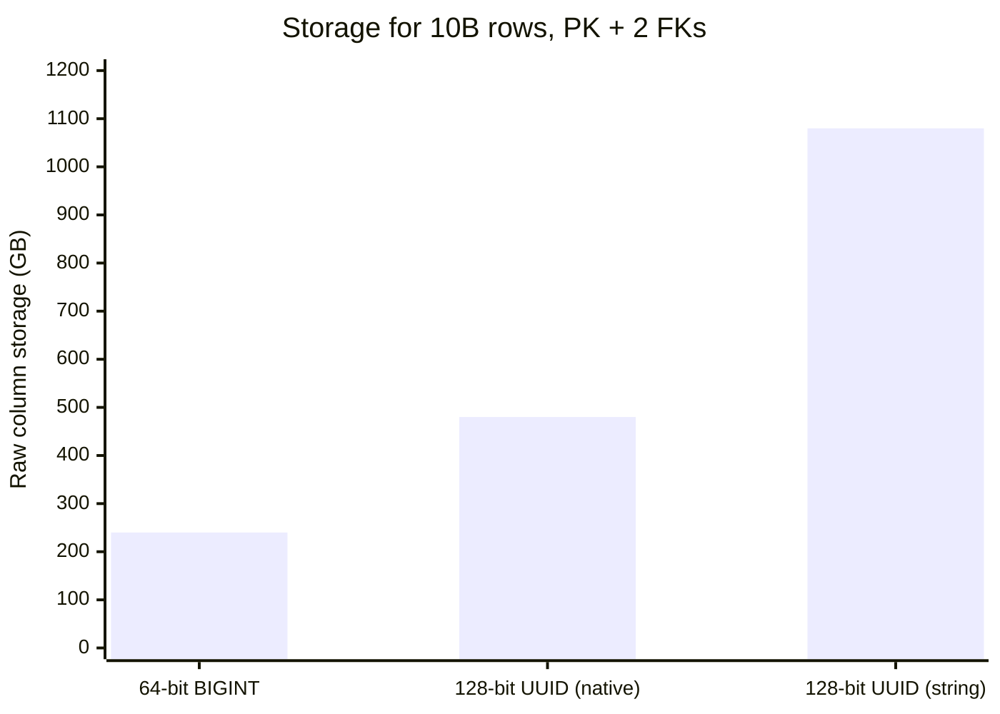
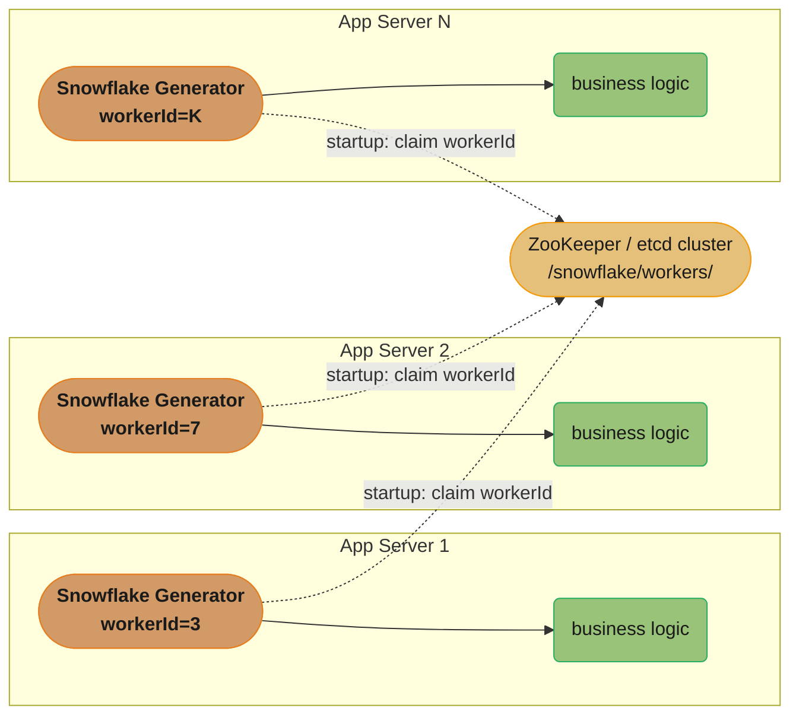
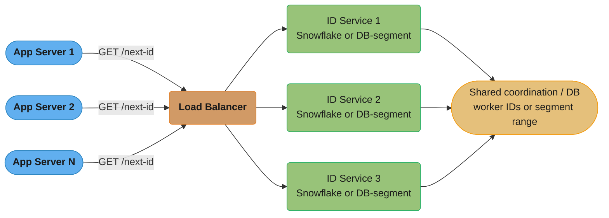
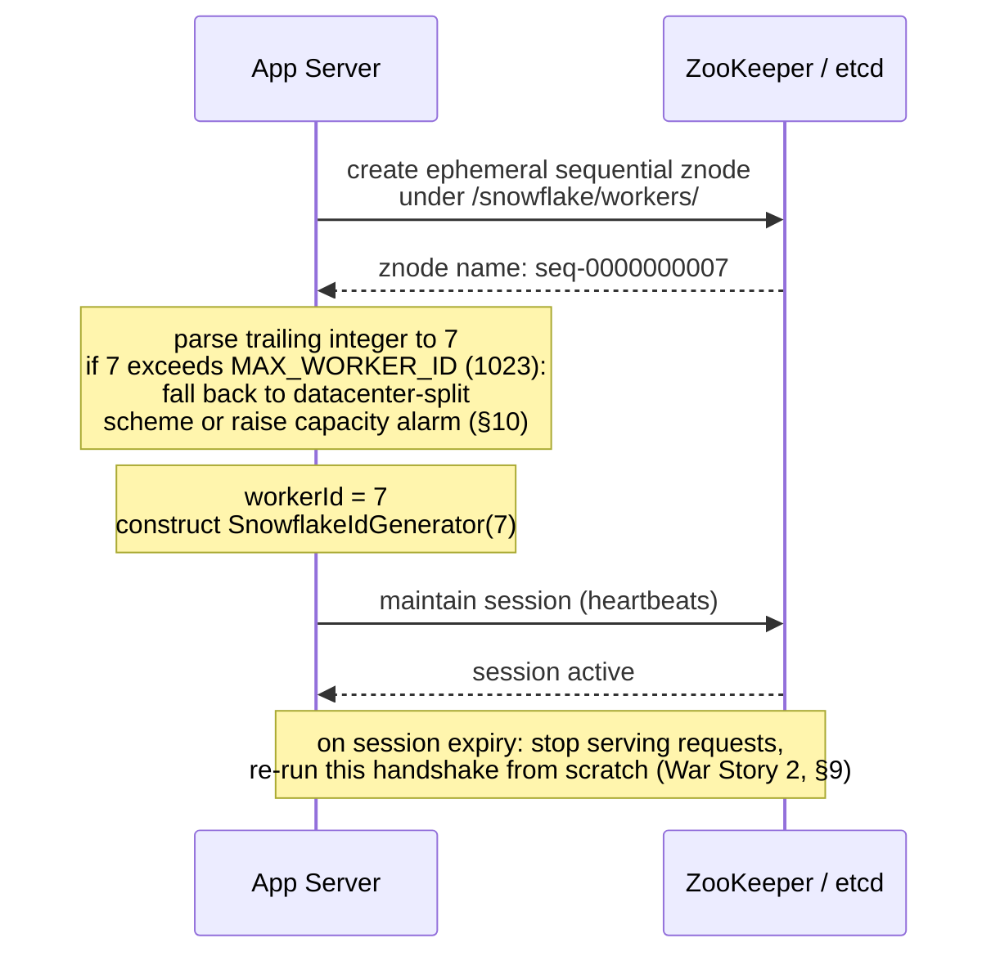
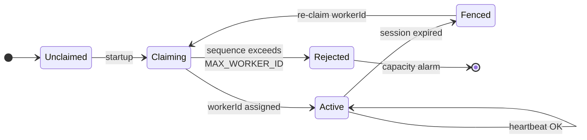
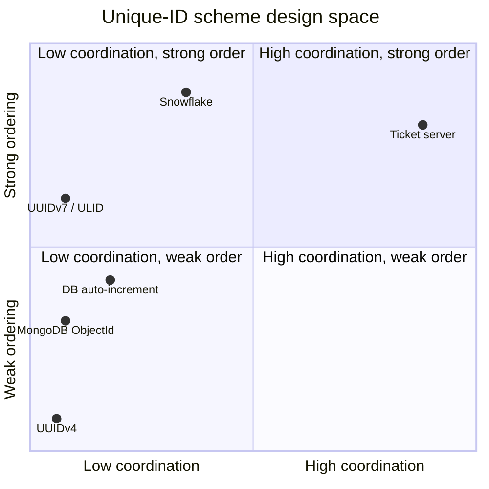
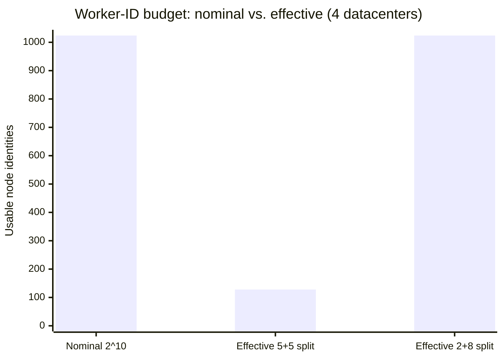

# System Design: Distributed Unique ID Generator

## Intuition

> **Design intuition**: A distributed unique ID generator is what happens when you take the humble `AUTO_INCREMENT` primary key — a single counter, a single lock, a single point of truth — and ask it to survive being run on a thousand machines at once with no shared state and sub-millisecond latency. The classic answer (Twitter's Snowflake, 2010) is to stop trying to coordinate a single counter at all, and instead **encode "who" and "when" directly into the ID itself**: a 64-bit integer becomes a tiny self-describing record — a timestamp, a machine identity, and a per-millisecond sequence number, bit-packed together. Uniqueness no longer requires a network round trip; it falls out of arithmetic, as long as no two machines are ever assigned the same identity at the same moment.
>
> **Key insight**: The entire design reduces to one allocation problem and one clock problem. The allocation problem — "how does each of N nodes get a distinct worker-ID slot without two nodes ever picking the same one" — is solved once, at startup, using a coordination service (ZooKeeper/etcd ephemeral sequential nodes), and is cheap precisely because it happens rarely. The clock problem — "what happens when `System.currentTimeMillis()` doesn't monotonically increase" — is the much harder operational reality, because NTP corrections, VM migrations, and leap-second smears all cause real production clocks to occasionally step backward, and a generator that doesn't detect this will silently mint duplicate or out-of-order IDs. Everything in §4, §8, and §9 of this design exists to make those two problems boring.

---

## 1. Requirements Clarification

### Functional Requirements
- **Generate globally unique IDs** across a fleet of application-server instances (potentially thousands of nodes, across multiple datacenters), with no two nodes ever producing the same ID
- **IDs should be roughly time-sortable** ("K-ordered") — an ID generated later should, in the overwhelming majority of cases, sort numerically greater than one generated earlier, so they double as a creation-time index
- **IDs must be usable as primary keys** directly — fit in a single 64-bit signed integer (a Java `long` / SQL `BIGINT`), positive, with no string formatting required on the hot path
- **Provide a decode/parse utility** — given an ID, recover the approximate generation timestamp and the node that issued it, for debugging and auditing
- **Support very high aggregate throughput** — the fleet as a whole must sustain hundreds of thousands of ID-generation calls per second without any centralized bottleneck

### Non-Functional Requirements
- **No single point of failure** — losing any one node (or even an entire datacenter) must not stop the rest of the fleet from generating IDs
- **No central bottleneck on the hot path** — ID generation must not require a network call, a database round trip, or a lock shared across nodes for every ID; coordination is acceptable only as an infrequent, startup-time or background activity
- **Latency**: ID generation must complete in well under 1ms (realistically, low single-digit microseconds) — it sits on the critical path of every write
- **Availability**: ID generation must continue even during a brief network partition between an application node and the coordination service (ZooKeeper/etcd) — a node that has already been assigned its identity should be able to keep minting IDs offline
- **Clock-skew tolerance**: the system must detect and gracefully handle backward clock movement (NTP corrections, hypervisor live-migration clock jumps) without producing duplicate or non-monotonic IDs from the same node
- **Long lifespan**: the chosen bit layout and epoch must provide decades of headroom before the timestamp field overflows

### The Central Tradeoff (Preview)

Requirement #2 above — time-sortable IDs — is in direct tension with even write distribution. A primary key that is monotonically increasing concentrates **all new writes on the rightmost edge of a B-tree index** (great for index locality and range scans) but also concentrates them on **whichever shard or storage node currently owns that range** (a write hotspot). This tension is not a flaw to be designed away; it is the central tradeoff of the whole problem, revisited concretely in §5 and §9.

### Out of Scope
- **The application-level meaning of the ID** — whether it's a tweet ID, an order ID, or a short-URL key is irrelevant to this design; this case study covers only the *generation* mechanism
- **Cross-organization globally unique identifiers** (e.g., UUIDs meant to be unique across companies/systems that have never communicated) — this design targets uniqueness within one operator's fleet, which is the overwhelmingly common real-world requirement
- **Re-deriving the full bit-packing implementation line-by-line** — the companion file [`../../java/case_studies/design_snowflake_id_generator_java.md`](../../java/case_studies/design_snowflake_id_generator_java.md) is the canonical "how do you implement `nextId()`" deep dive; this file focuses on the **fleet-operations question**: how a thousand instances of that class each get a unique, safe worker ID, and how that fits into a larger system

---

## 2. Scale Estimation

### Fleet Size and Per-Node Throughput

- Assume a fleet of roughly **1,000 application-server instances**, each embedding a Snowflake-style ID generator as a library (deployment model (a) in §3)
- A 64-bit Snowflake layout with a **12-bit sequence field** allows up to `2^12 = 4096` IDs per millisecond per node
- Theoretical per-node ceiling: `4096 IDs/ms x 1000 ms/s` = **4,096,000 IDs/sec/node** (single-threaded, sequence never exhausted)
- **Realistic sustained throughput per node** is far lower than the theoretical ceiling — most services don't need 4M IDs/sec from a single instance, and the `synchronized`/lock-based critical section in the reference implementation (§4.1) caps practical multi-threaded throughput around **1-2 million IDs/sec/node** under heavy concurrent load (lock-handoff overhead dominates well before the sequence counter itself is the limit)

### Cluster-Wide Demand vs. Capacity

- Suppose the actual cluster-wide demand is **500,000 IDs/sec** at peak (e.g., every write to every primary table across every service that uses this generator)
- Spread evenly across 1,000 nodes: `500,000 / 1,000` = **500 IDs/sec/node** — a tiny fraction (about 0.01%) of even the conservative 1-2M/sec/node practical ceiling
- **The conclusion that matters for an interview**: at realistic fleet sizes, ID generation throughput is *never* the bottleneck. The actual constraints are (a) the **worker-ID address space** (only so many distinct identities are available — §10), and (b) **operational correctness** under clock skew and coordination-service hiccups (§8, §9) — not raw IDs/sec

### Worker-ID Address Space

- A 10-bit combined datacenter+worker field allows `2^10 = 1024` distinct node identities
- 1,000 application-server instances comfortably fits within 1024, with ~2.3% headroom — tight enough that **fleet growth past ~1024 nodes is a real, foreseeable capacity event** (§10), not a hypothetical edge case

### ID-Space Lifetime

- A 41-bit timestamp field measured in milliseconds since a custom epoch covers `2^41` ms ~= 2.199 x 10^12 ms ~= **~69.7 years**
- With a custom epoch set at the system's launch date (e.g., 2024-01-01), the field doesn't overflow until roughly **2093** — comfortably longer than almost any system's expected lifetime, but a date that should be written down, monitored, and never forgotten (§8 Runbook 2, §10)

### Coordination Service Load

- Worker-ID allocation (§3, §4.2) happens **once per node lifecycle** — at process startup, and again only if the node's coordination session expires and must be re-established
- For a 1,000-node fleet with typical deployment churn (rolling restarts, autoscaling, a handful of crashes per day), this is on the order of **tens to low hundreds of ZooKeeper/etcd operations per hour** — negligible compared to the coordination service's typical workload (leader election, config watches, service discovery for the same fleet)

### Storage Footprint: Why the ID's Size Matters at Scale

The ID format isn't just a generation-time concern — it's stored in **every row of every table that uses it as a primary key, plus every foreign-key column referencing those rows, plus every index entry on those columns**. At the volumes this design targets, the difference between an 8-byte and a 16-byte (or larger) identifier compounds significantly:

*Table with 10 billion rows, primary key + 2 foreign-key columns referencing it — 8 bytes x 3 columns x 10B rows = 240 GB (64-bit BIGINT); 16 bytes x 3 x 10B = 480 GB (128-bit UUID, native 16-byte type); 36 bytes x 3 x 10B = ~1,080 GB (128-bit UUID, 36-char string):*



*The 36-character string encoding is 4.5x the 64-bit integer's footprint; even a well-stored native 16-byte UUID type is still 2x.*

This is a second, independent reason (beyond B-tree locality, §5) that a 64-bit Snowflake-style ID is attractive at scale: **every byte saved per ID is multiplied by every column that stores a copy of it** — primary keys, foreign keys, and every index entry on each. A 128-bit UUID stored as its canonical 36-character hyphenated string representation (a common mistake — cross-ref the companion file's Pitfall 3) is **4.5x** the raw storage of a 64-bit integer; even a well-stored native 16-byte UUID type is still 2x. At 10 billion rows with a handful of foreign-key references per row (a realistic shape for, e.g., a tweets-and-engagements schema), this difference is measured in **hundreds of gigabytes to terabytes** of additional storage and proportionally more I/O for every index scan that touches these columns.

---

## 3. High-Level Architecture

Two deployment models solve this problem, and most real systems pick one (or, at larger scale, both for different ID types).

**Model (a): Embedded Library — "true Snowflake"**



*ID generation is pure local computation with zero network calls; the coordination service (dotted edges) is touched only at startup and on reconnect, never on the per-ID hot path.*

**Model (b): Dedicated ID-Generation Service — "ticket server"**



*ID generation now costs one extra network round trip per ID (or per batch, if the client pre-fetches a block of IDs at once) — the cost Model (a) exists to avoid.*

### Worker-ID Allocation Handshake (Model (a), Startup)



*The coordination service is contacted once at startup (and again only on reconnect); every other `nextId()` call in between is a pure in-process computation.*

### Request Flow

1. **Startup (Model (a))**: each application-server instance, before accepting traffic, connects to the coordination service and creates an **ephemeral sequential znode** (ZooKeeper) or an equivalent lease-backed key (etcd). The sequence number assigned by the coordination service becomes that instance's `workerId`. The instance constructs its `SnowflakeIdGenerator` with that ID and is now ready to mint IDs without any further coordination.
2. **Steady state (Model (a))**: whenever business logic needs a new unique ID (creating a tweet, an order, a short URL), it calls `generator.nextId()` — a **pure local, in-process computation** (§4.1) taking on the order of tens to hundreds of nanoseconds. No network call, no lock contention with other nodes.
3. **Session loss (Model (a))**: if the instance's session with the coordination service expires (a network partition longer than the session timeout, or a GC pause that misses heartbeats), its ephemeral znode is deleted by the coordination service. The instance must **detect this, stop serving new IDs immediately (self-fencing), and re-run the startup handshake** to claim a (possibly different) workerId — see War Story 2 (§9).
4. **Steady state (Model (b))**: an application server calls a dedicated **ID-generation microservice** over the network (`GET /next-id`), which is itself a small fleet running either the Snowflake algorithm internally (with its own worker-ID allocation, recursively Model (a) one layer down) or a database-segment-based "ticket server" (§4.6). This adds one network round trip per ID (or per batch, if clients request blocks of, say, 1,000 IDs at a time to amortize the cost).
5. **Decoding**: any service holding a raw ID can call `IdInfo.parse(id)` (§4.1, and the full implementation in [`../../java/case_studies/design_snowflake_id_generator_java.md`](../../java/case_studies/design_snowflake_id_generator_java.md)) to recover the generation timestamp and the issuing node — invaluable for on-call debugging ("which node and approximately when was this row created?") without a separate `created_at` column.

### Component Inventory

| Component | Model | Role | Touches the Network? |
|---|---|---|---|
| `SnowflakeIdGenerator` (§4.1) | (a) and (b) | In-process bit-packing core; the only component on the per-ID hot path | No |
| `WorkerIdAllocator` (§4.2) | (a) and (b) | Claims a unique `workerId` at startup via ZK/etcd; self-fences on session expiry | Yes — startup and reconnect only |
| `IdInfo` decoder (§4.1, companion file) | (a) and (b) | Parses a raw ID back into `(timestamp, nodeId, sequence)` for debugging/audit | No |
| ZooKeeper / etcd ensemble (§4.2, §7) | (a) and (b) | Source of truth for worker-ID uniqueness; also typically hosts leader election and service discovery for the same fleet | N/A (it *is* the network dependency) |
| NTP daemon (`chronyd`/`ntpd`, §4.3) | (a) and (b) | Keeps each node's wall clock close to true time; slew vs. step behavior is the crux of §9 War Story 1 | Yes — talks to NTP time servers, independent of the ID-generation path |
| ID-generation microservice (§4.6) | (b) only | Wraps §4.1 + §4.2 (or database-segment allocation) behind an HTTP/gRPC API | Yes — every `nextId()` call from a caller's perspective |
| `id_allocations` table (§4.6) | (b), segment variant only | Backing store for `[max_id, max_id + step]` range reservations | Yes — once per `step` IDs, not per ID |

---

## 4. Component Deep Dives

### 4.1 Snowflake Bit Layout and Core Generator

The canonical 64-bit layout (Twitter's original split, also used by this repo's [Snowflake Java case study](../../java/case_studies/design_snowflake_id_generator_java.md)):

```
 63          22 21     17 16     12 11              0
  |-----------|---------|---------|----------------|
  | 41-bit ts | 5-bit DC | 5-bit W |  12-bit seq    |
  |-----------|---------|---------|----------------|
   bit 63 (sign) is always 0 -> ID is always a positive signed long

 ts  = currentTimeMillis() - CUSTOM_EPOCH_MS
 DC  = datacenter ID   (0-31)
 W   = worker ID       (0-31)        } combined = 10-bit "node ID" (0-1023)
 seq = per-millisecond sequence (0-4095)
```

A condensed version of the generator — the **operationally relevant surface**, i.e., what a fleet-operations engineer needs to reason about when something goes wrong. (For the complete implementation including the lock-free striped variant, virtual-thread pinning fix, and full test seams, see the companion file's §4.1-§4.4.)

```java
package com.rutik.systemdesign.hld.idgen;

/**
 * Fleet-facing Snowflake ID generator. The bit-packing core is identical to
 * the companion implementation in java/case_studies/design_snowflake_id_generator_java.md;
 * this version additionally exposes the hooks that the fleet's startup
 * handshake (§4.2) and operational alarms (§8) depend on.
 */
public final class SnowflakeIdGenerator {

    // Custom epoch: 2024-01-01T00:00:00Z. Gives ~69.7 years of headroom -> overflows ~2093.
    private static final long CUSTOM_EPOCH_MS = 1_704_067_200_000L;

    private static final int TIMESTAMP_BITS  = 41;
    private static final int NODE_ID_BITS    = 10;   // 5-bit datacenter + 5-bit worker
    private static final int SEQUENCE_BITS   = 12;

    private static final int SEQUENCE_SHIFT  = 0;
    private static final int NODE_ID_SHIFT   = SEQUENCE_BITS;                  // 12
    private static final int TIMESTAMP_SHIFT = SEQUENCE_BITS + NODE_ID_BITS;   // 22

    private static final long MAX_NODE_ID    = ~(-1L << NODE_ID_BITS);  // 1023
    private static final long SEQUENCE_MASK  = ~(-1L << SEQUENCE_BITS); // 4095

    // Clock-backward tolerance: small drift (NTP slew) -> wait; large drift -> refuse.
    private static final long MAX_BACKWARD_DRIFT_MS = 5L;

    private final long nodeId;
    private volatile long lastTimestamp = -1L;
    private long sequence = 0L;

    // Operational counters surfaced to the metrics layer (§8).
    private volatile long clockBackwardEvents = 0L;
    private volatile long sequenceExhaustionEvents = 0L;

    public SnowflakeIdGenerator(long nodeId) {
        if (nodeId < 0 || nodeId > MAX_NODE_ID) {
            throw new IllegalArgumentException(
                "nodeId must be 0.." + MAX_NODE_ID + ", got " + nodeId);
        }
        this.nodeId = nodeId;
    }

    public synchronized long nextId() {
        long now = currentTimeMs();

        if (now < lastTimestamp) {
            long driftMs = lastTimestamp - now;
            clockBackwardEvents++; // alert on this counter (§8)
            if (driftMs > MAX_BACKWARD_DRIFT_MS) {
                // Large backward jump (NTP step correction, VM migration, War
                // Story 1, §9): refuse to generate rather than risk reusing a
                // (timestamp, sequence) pair already issued.
                throw new ClockMovedBackwardException(
                    "Clock moved back " + driftMs + "ms (limit " + MAX_BACKWARD_DRIFT_MS + "ms); "
                  + "refusing to generate IDs until the clock catches up");
            }
            // Small drift (typical NTP slew correction): wait it out.
            now = spinUntil(lastTimestamp + 1);
        }

        if (now == lastTimestamp) {
            sequence = (sequence + 1) & SEQUENCE_MASK;
            if (sequence == 0L) {
                sequenceExhaustionEvents++; // alert if this climbs (§8)
                now = spinUntil(lastTimestamp + 1);
            }
        } else {
            sequence = 0L;
        }

        lastTimestamp = now;

        return ((now - CUSTOM_EPOCH_MS) << TIMESTAMP_SHIFT)
             | (nodeId << NODE_ID_SHIFT)
             | sequence;
    }

    private long spinUntil(long targetMs) {
        long ts = currentTimeMs();
        while (ts < targetMs) {
            ts = currentTimeMs();
        }
        return ts;
    }

    protected long currentTimeMs() {
        return System.currentTimeMillis();
    }

    public long clockBackwardEventCount() { return clockBackwardEvents; }
    public long sequenceExhaustionEventCount() { return sequenceExhaustionEvents; }

    public static final class ClockMovedBackwardException extends RuntimeException {
        public ClockMovedBackwardException(String message) { super(message); }
    }
}
```

**The two operational decisions that matter for fleet operations** (the companion file covers the bit arithmetic in full; this is the *behavioral contract* a fleet operator needs to know):

- **Clock-backward detection has two tiers**, not one. A drift of 1-5ms (typical of an NTP slew correction smoothing out a small offset) is absorbed by spinning until the clock catches up — invisible to callers, adds at most a few milliseconds of latency to one unlucky call. A drift greater than the threshold (a step correction after a hypervisor pause, or NTP catching up after being down for minutes) **throws** rather than risk reuse — this is the boundary that War Story 1 (§9) is about.
- **Sequence exhaustion always waits**, never throws. Running out of the 4096-per-millisecond budget is expected under load and is not an error condition — the generator spins (at most ~1ms) until the clock ticks forward and the sequence resets to 0.

### 4.2 Worker-ID Allocation via ZooKeeper/etcd Ephemeral Sequential Nodes

This is the piece that makes the "no central bottleneck" requirement (§1) compatible with "no two nodes share a worker ID." The mechanism leans on a property unique to **ephemeral sequential znodes** (ZooKeeper) or **lease-backed keys with a monotonic revision** (etcd): the coordination service itself guarantees the assigned sequence numbers are unique and monotonically increasing, *without the client needing to coordinate with any other client*.

```java
package com.rutik.systemdesign.hld.idgen;

import org.apache.zookeeper.*;
import org.apache.zookeeper.data.Stat;
import java.util.List;
import java.util.Collections;

/**
 * Claims a unique workerId in [0, 1023] at startup by creating an ephemeral
 * sequential znode under /snowflake/workers/. Re-runs on session expiry
 * (War Story 2, §9).
 */
public final class WorkerIdAllocator implements Watcher {

    private static final String WORKERS_PATH = "/snowflake/workers";
    private static final String NODE_PREFIX   = WORKERS_PATH + "/seq-";
    private static final long MAX_WORKER_ID   = 1023L;

    private final ZooKeeper zk;
    private volatile String myZnodePath;
    private volatile long workerId = -1L;
    private volatile boolean fenced = false; // self-fencing flag, War Story 2

    public WorkerIdAllocator(ZooKeeper zk) {
        this.zk = zk;
    }

    /** Blocks until a workerId is claimed. Idempotent: safe to call again after fencing. */
    public synchronized long claimWorkerId() throws Exception {
        ensureParentExists();

        // CreateMode.EPHEMERAL_SEQUENTIAL: ZK appends a 10-digit, globally
        // monotonic, zero-padded sequence number to our path -- e.g.
        // "/snowflake/workers/seq-0000000007". The node disappears
        // automatically if our session dies (network partition, GC pause
        // past the session timeout, process crash).
        myZnodePath = zk.create(
            NODE_PREFIX, new byte[0],
            ZooDefs.Ids.OPEN_ACL_UNSAFE,
            CreateMode.EPHEMERAL_SEQUENTIAL);

        long rawSeq = parseSequenceNumber(myZnodePath);

        if (rawSeq > MAX_WORKER_ID) {
            // Capacity exhaustion -- see §10. In production this triggers a
            // page, not a silent wraparound: wrapping would let two live
            // nodes share a workerId.
            zk.delete(myZnodePath, -1);
            throw new IllegalStateException(
                "Worker-ID space exhausted: claimed sequence " + rawSeq
              + " exceeds MAX_WORKER_ID=" + MAX_WORKER_ID
              + ". Fleet has grown past 1024 nodes -- see §10 capacity plan.");
        }

        this.workerId = rawSeq;
        this.fenced = false;

        // Startup health check: verify we are the SOLE owner of this znode
        // path -- guards against the race in War Story 2.
        verifySoleOwnership();

        return workerId;
    }

    /** Called by the ZK client library on connection-state changes. */
    @Override
    public void process(WatchedEvent event) {
        if (event.getState() == Watcher.Event.KeeperState.Expired) {
            // Session expired: our ephemeral znode is GONE. Self-fence
            // immediately -- do not serve another ID until re-registered
            // (War Story 2, §9).
            fenced = true;
        }
    }

    public boolean isFenced() {
        return fenced;
    }

    public long currentWorkerId() {
        if (fenced) {
            throw new IllegalStateException("Fenced: session expired, workerId no longer valid");
        }
        return workerId;
    }

    private void verifySoleOwnership() throws Exception {
        List<String> children = zk.getChildren(WORKERS_PATH, false);
        String myNodeName = myZnodePath.substring(WORKERS_PATH.length() + 1);
        long matches = children.stream().filter(c -> c.equals(myNodeName)).count();
        if (matches != 1) {
            throw new IllegalStateException(
                "Sole-ownership check failed for " + myNodeName + ": found " + matches
              + " matching znodes. Refusing to start.");
        }
    }

    private long parseSequenceNumber(String path) {
        String name = path.substring(path.lastIndexOf('-') + 1);
        return Long.parseLong(name);
    }

    private void ensureParentExists() throws Exception {
        Stat stat = zk.exists(WORKERS_PATH, false);
        if (stat == null) {
            zk.create(WORKERS_PATH, new byte[0],
                ZooDefs.Ids.OPEN_ACL_UNSAFE, CreateMode.PERSISTENT);
        }
    }
}
```

**What happens on session expiry/reconnect** (the mechanism behind War Story 2, §9): ZooKeeper ties ephemeral znodes to a **session**, not a TCP connection — a client can briefly lose its TCP connection and reconnect within the session timeout (typically 4-40 seconds, configurable) without losing its ephemeral znode, because the server-side session is still alive. Only when the **session itself** expires (no successful heartbeat for the full session timeout) does the server delete the ephemeral znode. The danger window is the gap between "our session expired and our znode was deleted" and "we notice and stop serving IDs" — if another node claims the now-vacant sequence number (or, worse, if *our* znode is deleted but we haven't yet noticed and keep using the old `workerId`), two live nodes can end up believing they own the same `workerId`. The `fenced` flag and `verifySoleOwnership()` check above are the two halves of the fix.



*The node-identity lifecycle behind §4.2 and War Story 2: a node holds `Active` only while its ZooKeeper session is alive; the moment that session is reported `Expired`, `fenced` flips to true and the node must stop serving IDs before it re-claims a (possibly new) `workerId` — skipping straight from `Active` to a fresh claim without passing through `Fenced` is exactly the bug that let two nodes share `workerId = 412`.*

### 4.3 Clock Skew Handling and NTP

Every Snowflake-family generator's correctness depends on one invariant: **`System.currentTimeMillis()` on a given node never produces a value smaller than a previously-observed value used to mint an ID, except by an amount the generator explicitly tolerates.** Real clocks violate this invariant in two distinct ways, and the operational response differs:

| Clock Behavior | Cause | Typical Magnitude | Generator Response |
|---|---|---|---|
| **Slew (gradual)** | NTP `chronyd`/`ntpd` continuously nudges clock frequency (speeds up or slows down the tick rate) to converge toward true time | Sub-millisecond per second of adjustment | Invisible — clock still monotonically increases, just at a slightly adjusted rate |
| **Step, forward** | NTP applies a large one-time correction when offset exceeds a threshold (default often ~128ms in `ntpd`) | Milliseconds to seconds | Harmless for this generator — a forward jump never violates `now >= lastTimestamp` |
| **Step, backward** | Same mechanism, but correcting a clock that was running *fast* — common after a hypervisor live-migration pause where the VM's clock continued advancing during the pause and NTP corrects it back down on resume | Milliseconds to seconds | **Dangerous** — `now < lastTimestamp`; this is exactly the condition `nextId()` checks for |

**The operational fix deployed on Snowflake-generator hosts** (detailed in War Story 1, §9): configure `chronyd`/`ntpd` to **prefer slewing over stepping** wherever the offset is within a bounded range (e.g., `chronyd`'s `makestep` directive set to a large threshold, or disabled for small offsets), so that the vast majority of corrections are gradual slews the generator never even notices. Step corrections are reserved for genuinely large offsets (which the generator's `MAX_BACKWARD_DRIFT_MS` threshold is deliberately tuned to still catch and refuse on, rather than silently absorb).

A second layer of defense is **monitoring NTP offset and drift per node as a first-class metric** (§8) — a node whose offset is trending toward the step-correction threshold is a *leading indicator* of an imminent clock-backward event, and can be proactively restarted or drained before it ever throws `ClockMovedBackwardException` in production.

### 4.4 Alternative Approaches: UUIDs, ULID/UUIDv7, Database Auto-Increment, Ticket Servers, MongoDB ObjectId

Snowflake is one point in a design space; understanding the alternatives is what an interviewer is really testing.

**UUIDv4 (random)**
A 128-bit value, 122 bits of which are random. Generation is a pure local operation requiring no coordination and no clock — collision probability is astronomically low (the famous "you'd need to generate 1 billion UUIDs per second for 100 years to have a 50% chance of one collision"). The cost: **no ordering whatsoever**. As a database primary key, random UUIDs scatter inserts uniformly across the entire B-tree keyspace — every insert is a likely page miss, and B-tree pages fill and split far more often (roughly 1 split per ~80 inserts on an 8KB-page table vs. ~1 per 4000 for a sequential key, per the companion file's §10).

**UUIDv7 / ULID (time-ordered random)**
Both schemes prepend a millisecond (or finer) timestamp to the high-order bits and fill the remainder with randomness — UUIDv7 is the IETF-standardized variant (RFC 9562, finalized 2024); ULID is an earlier, widely-adopted convention with a similar structure (48-bit timestamp + 80 bits of randomness, base32-encoded as a 26-character string). Both recover most of Snowflake's B-tree-locality benefit (new IDs sort after old ones, at millisecond granularity) **without any coordination step** — there's no worker-ID allocation problem at all, because uniqueness comes from the random tail, not from a machine identity. The cost: at very high throughput, many IDs generated within the same millisecond differ only in their random bits, which is fine for uniqueness but means the decode step (§4.1's `IdInfo.parse`) can't recover *which node* generated a given ID — a property Snowflake's worker-ID field provides "for free" and that is genuinely useful for sharding (§5) and debugging.

**Database auto-increment with step/offset (multi-master MySQL)**
In a multi-master MySQL setup (e.g., N masters in a ring or active-active pair), each master is configured with `auto_increment_increment = N` and a distinct `auto_increment_offset` (1, 2, ..., N). Master 1 generates IDs 1, N+1, 2N+1, ...; master 2 generates 2, N+2, 2N+2, .... This guarantees no collision between masters using nothing but a per-master configuration value — genuinely the simplest possible coordination-free scheme. The costs: (a) it caps the number of masters at a number fixed at configuration time (changing N for an existing cluster requires careful migration), (b) IDs are sequential but *not time-ordered across masters* — master 1's ID 1,000,001 and master 2's ID 1,000,002 could have been generated minutes apart, and (c) it's MySQL-specific, tying the ID scheme to the database technology rather than the application layer.

**Flickr-style ticket servers (pre-Snowflake, 2010)**
Before Snowflake, Flickr's well-known approach used a small set of MySQL "ticket servers," each running a single-row table and the trick:

```sql
REPLACE INTO Tickets64 (stub) VALUES ('a');
SELECT LAST_INSERT_ID();
```

`REPLACE INTO` deletes and re-inserts the row, advancing the auto-increment counter by 1 each time, and `LAST_INSERT_ID()` returns the new value — a clever way to get an atomically-incrementing counter out of a database that wasn't designed to be a dedicated sequence generator. Running two ticket servers with offset auto-increment values (odds on one server, evens on the other) provided redundancy. This is essentially **Model (b)** from §3 with a database as the backing store — it requires a network round trip per ID (or per batch) and the ticket server(s) are a (small, but real) shared dependency, in exchange for extreme simplicity and zero clock dependency.

**MongoDB ObjectId**
A 12-byte (96-bit) identifier with a fixed internal structure: **4-byte timestamp** (seconds since Unix epoch) + **5-byte random value** (unique per process, generated once at startup) + **3-byte incrementing counter** (initialized to a random value, incremented per ObjectId generated by that process). This is structurally a hybrid: the timestamp gives coarse (1-second granularity) time-ordering, the per-process random value plays the role of Snowflake's worker ID but **without any allocation step** (it's randomly generated, with a 40-bit space making collisions between two processes negligible), and the counter plays the role of the sequence field. It's a pragmatic design point: nearly Snowflake's properties, with UUID's "no coordination needed" simplicity, at the cost of a coarser (1-second) timestamp granularity and a non-zero (though tiny) chance of two processes randomly choosing values that, combined with counter overlap, could theoretically collide — accepted as a non-issue at MongoDB's target scale.

### 4.5 Comparative Table: All Approaches

| Approach | Size | Uniqueness Guarantee | Ordering | Coordination Required | Throughput/Node | Collision Risk on Clock Skew |
|---|---|---|---|---|---|---|
| **Snowflake (this design)** | 64 bits | Deterministic (timestamp + node ID + sequence) | Strong (ms-granularity, per-node monotonic) | Once, at startup (worker-ID allocation, §4.2) | ~1-4M/sec (theoretical), ~1-2M/sec realistic | **Yes** if clock steps backward and isn't detected (§4.3, War Story 1) |
| **UUIDv4** | 128 bits | Probabilistic (122 random bits) | None | None | Effectively unlimited (CPU-bound RNG) | None — no clock dependency |
| **UUIDv7 / ULID** | 128 bits | Probabilistic (random tail) + timestamp prefix | Weak-to-moderate (ms granularity, ties broken randomly) | None | Effectively unlimited | None — clock only affects ordering quality, not uniqueness |
| **DB auto-increment, multi-master (step/offset)** | 64 bits (typical) | Deterministic (per-master arithmetic progression) | Per-master sequential; weak cross-master ordering | Static config at cluster setup (fixed N) | Bound by DB write throughput per master | None — no clock dependency |
| **Flickr-style ticket server** | 64 bits (typical) | Deterministic (DB auto-increment) | Sequential (single logical counter, or interleaved odd/even across 2 servers) | Per-ID network round trip (or batch) to ticket server(s) | Bound by ticket-server DB throughput; batching amortizes | None — no clock dependency |
| **MongoDB ObjectId** | 96 bits (12 bytes) | Probabilistic (5-byte random) + deterministic counter | Coarse (1-second granularity) | None | Very high (counter increment) | None — clock only affects ordering granularity |



*The same table, plotted as a design space: Snowflake and UUIDv7/ULID sit in the "strong order, low coordination" quadrant that makes them attractive defaults; the Flickr-style ticket server trades its way into "high coordination" to buy the strongest ordering; UUIDv4, MongoDB ObjectId, and multi-master auto-increment all avoid runtime coordination at the cost of weaker (or no) ordering — no scheme occupies "high coordination, weak order," which is why that combination is rarely chosen on purpose.*

### 4.6 Dedicated ID-Generation Microservice (Model (b)) and Database-Segment Allocation

When Model (a) (embedded library) isn't viable — e.g., a polyglot fleet where not every service's language has a maintained Snowflake library, or a desire to centralize worker-ID management entirely — Model (b) wraps the generator behind an HTTP/gRPC API. Two backing implementations are common:

1. **Snowflake-as-a-service**: a small fleet (e.g., 8-16 instances) of dedicated ID-service nodes, each running the exact algorithm from §4.1, each with its own worker ID allocated via §4.2 — recursively the same problem, just with a much smaller, more stable fleet (8-16 nodes churns its worker-ID allocation far less often than 1,000 application servers).

2. **Database-segment allocation** (the approach behind Meituan's "Leaf-segment" and similar systems): a central table stores, per ID-type, a `max_id` and a `step`. Each ID-service instance, on startup or when its in-memory range is exhausted, does:

```sql
UPDATE id_allocations
   SET max_id = max_id + step
 WHERE biz_type = 'order_id'
RETURNING max_id;
```

This single atomic `UPDATE ... RETURNING` (or `SELECT ... FOR UPDATE` followed by `UPDATE` in databases without `RETURNING`) hands the calling instance an exclusive range `[old_max_id + 1, new_max_id]` — e.g., `step = 1000` gives the instance 1,000 IDs to hand out locally before it needs to go back to the database. This amortizes the database round trip across `step` IDs, trading a small amount of "wasted" ID space (if an instance crashes mid-range, the unused remainder of its range is simply never used — entirely acceptable, since these IDs need not be contiguous, only unique and roughly ordered) for very low average latency. This is **Model (b) with database-segment backing** — it requires no clock-skew handling at all (no timestamp field), at the cost of a coordination dependency on the database for range refills.

### 4.7 Operational Decoder Tool and Cross-Region ID Comparison

§3 step 5 mentioned that any service can call `IdInfo.parse(id)` to recover an ID's generation timestamp and originating node. In practice, this is exposed as a small standalone admin tool — every on-call engineer working with this system eventually needs to answer "when, approximately, was row X created, and which node created it?" without touching the application's normal code paths (which may themselves be down, if that's *why* the on-call engineer is looking at this row in the first place).

```java
package com.rutik.systemdesign.hld.idgen;

import java.time.Instant;
import java.time.ZoneOffset;
import java.time.format.DateTimeFormatter;

/**
 * Standalone CLI decoder -- intentionally has zero dependency on the running
 * application, so it works even when the application (or its coordination
 * service connection) is down. Usage:
 *
 *   java IdDecoderTool 7234582091234918400
 *
 * Output:
 *   raw id        : 7234582091234918400
 *   timestamp     : 2026-06-12T03:14:07.612Z
 *   node id       : 412  (datacenter=12, worker=12)
 *   sequence      : 256
 */
public final class IdDecoderTool {

    private static final long CUSTOM_EPOCH_MS = 1_704_067_200_000L; // must match §4.1 -- single global constant (§5)
    private static final int TIMESTAMP_SHIFT = 22;
    private static final int NODE_ID_SHIFT   = 12;
    private static final long NODE_ID_MASK   = ~(-1L << 10);
    private static final long SEQUENCE_MASK  = ~(-1L << 12);
    private static final long DATACENTER_MASK = ~(-1L << 5);

    public static void main(String[] args) {
        long rawId = Long.parseLong(args[0]);

        long tsMs    = (rawId >> TIMESTAMP_SHIFT) + CUSTOM_EPOCH_MS;
        long nodeId  = (rawId >> NODE_ID_SHIFT) & NODE_ID_MASK;
        long seq     = rawId & SEQUENCE_MASK;
        long worker  = nodeId & DATACENTER_MASK;
        long datacenter = (nodeId >> 5) & DATACENTER_MASK;

        Instant instant = Instant.ofEpochMilli(tsMs);
        String formatted = DateTimeFormatter.ISO_INSTANT
            .withZone(ZoneOffset.UTC)
            .format(instant);

        System.out.println("raw id        : " + rawId);
        System.out.println("timestamp     : " + formatted);
        System.out.println("node id       : " + nodeId
            + "  (datacenter=" + datacenter + ", worker=" + worker + ")");
        System.out.println("sequence      : " + seq);
    }
}
```

**Cross-region comparison example**: suppose two IDs, one minted in datacenter A and one in datacenter B, are compared as part of a cross-region reconciliation job. With the single-global-epoch policy from §5, `idA < idB` reliably means "the row behind `idA` was written first" (modulo the small clock-skew tolerances of §4.3) — the reconciliation job can sort a mixed-region dataset purely by ID and get a globally meaningful chronological order, **without** needing to know which datacenter produced which ID, or to apply any per-datacenter epoch correction. This is the property that §5's "shared global epoch" tradeoff exists to preserve, and it is the kind of property that's invisible when it works and expensive to retrofit when it doesn't — a strong argument for getting it right at the start of a multi-region rollout rather than after IDs from multiple epochs already coexist in production data.

---

## 5. Design Decisions & Tradeoffs

### Time-Ordered IDs vs. Random IDs

| Dimension | Time-Ordered (Snowflake, ULID, UUIDv7) | Random (UUIDv4) |
|---|---|---|
| B-tree / index locality | Excellent — new rows append to the "hot" end of the index, ~1 page split per ~4000 inserts | Poor — inserts scatter across the entire keyspace, ~1 page split per ~80 inserts |
| Write distribution across shards/nodes | **Hotspotting** — if the ID (or a prefix of it) is used as a shard key, all *new* writes land on whichever shard owns the current time range | Even — random IDs distribute uniformly across any hash-based shard scheme |
| Range queries ("most recent N rows") | Trivial — a range scan on the primary key | Requires a separate `created_at` index |
| Debuggability | High — the ID itself encodes approximate creation time and (for Snowflake) originating node | None — opaque |
| Best fit | Primary key for a write-heavy table that is *also* read by recency (feeds, logs, orders) — but see §9 for the shard-key caveat | Primary key for a table sharded by ID hash, or where recency-ordering has no value |

This is the same tension flagged in §1's preview, and it is **not resolved by picking "the right" ID scheme in isolation** — it's resolved by deciding, separately, *whether the ID itself should also be the shard key* (cross-ref [`../../database/sharding_and_partitioning/README.md`](../../database/sharding_and_partitioning/README.md)). If yes, time-ordering becomes a liability (§9's hotspotting discussion); if the shard key is something else entirely (e.g., `user_id`, `tenant_id`), time-ordering in the ID is close to a free win.

### Embedded Library vs. Dedicated Service Deployment

| Dimension | Embedded Library (Model (a)) | Dedicated Service (Model (b)) |
|---|---|---|
| Latency per ID | Tens to hundreds of nanoseconds (in-process call) | One network round trip (~0.5-2ms intra-DC), or amortized via batching |
| Failure blast radius | A single node's failure affects only that node's traffic | The ID service becomes a new dependency for *every* caller — its outage affects everything |
| Operational surface | Worker-ID allocation logic embedded in every service's startup path; every language/runtime needs a library | Worker-ID allocation logic exists in one place; callers need only a thin HTTP/gRPC client |
| Worker-ID churn | High — as many distinct identities as there are application-server instances (§2, §10) | Low — only as many identities as ID-service instances (typically a handful) |
| Best fit | Homogeneous fleet, latency-critical hot paths, teams comfortable maintaining a shared library across languages | Polyglot fleets, teams wanting a single point of operational ownership for ID generation, or database-segment-based allocation (§4.6) which has no per-node identity concept at all |

### Centralized Coordination (ZooKeeper/etcd) vs. Static Config-File Worker-ID Assignment

| Dimension | ZooKeeper/etcd Ephemeral Sequential Nodes (§4.2) | Static Config (env var / config file per instance) |
|---|---|---|
| Operational burden at scale | Low — new instances self-register; no human/CI step to assign an ID | High — every new instance needs a manually (or CI-script) assigned, globally-unique ID baked into its config; a copy-paste error assigns a duplicate (a real, recurring incident class — see the companion file's Pitfall 2) |
| New dependency introduced | Yes — the application now depends on a coordination service being reachable at startup (though not on the hot path, §3) | No additional runtime dependency |
| Handles dynamic fleets (autoscaling) | Yes — naturally; each new instance claims the next available sequence number | Poorly — autoscaling requires either a pre-allocated pool of config templates or a separate ID-assignment automation step, which is itself a form of ad-hoc coordination |
| Failure mode if coordination service is down at startup | New instances cannot start (or must retry/backoff until it recovers) — existing instances are unaffected (§1 availability requirement) | New instances start fine (no dependency) but risk silent duplicate-ID assignment if the static config has *any* error |
| Best fit | Fleets that already run ZooKeeper/etcd for other purposes (leader election, service discovery, Kafka controller — cross-ref [`../consensus_algorithms/README.md`](../consensus_algorithms/README.md)) — the marginal cost of also using it for worker-ID allocation is small | Small, slowly-changing, manually-managed fleets where the operational discipline to keep a config registry correct is feasible |

### Shared Global Epoch vs. Per-Datacenter Epoch and Clock Source

A subtler decision, easy to miss until a multi-region deployment is already in flight: should every datacenter's generators share a single **`CUSTOM_EPOCH_MS` constant**, and should they all derive `now` from the same class of clock source?

| Dimension | Single Global Epoch + NTP Everywhere (recommended) | Per-Datacenter Epoch or Mixed Clock Sources |
|---|---|---|
| Cross-datacenter ID comparability | IDs from any two datacenters can be compared directly — `id_a < id_b` reliably implies "`a` was generated before `b`," modulo normal clock-skew tolerances (§4.3) | Comparing IDs across datacenters with different epochs requires first subtracting out each datacenter's epoch offset before comparison — a frequent source of off-by-epoch bugs in cross-region analytics and merge jobs |
| Operational simplicity | One constant, documented once, baked into every generator regardless of where it runs | Each datacenter's generators (and every tool that decodes IDs from that datacenter) must know which epoch applies — a configuration value that must travel with the ID, which a raw 64-bit integer cannot carry |
| Failure mode if misconfigured | A generator started with the wrong epoch produces IDs that are *shifted* in time relative to the rest of the fleet but remain internally consistent (monotonic, unique given a correct worker ID) — usually caught quickly because decoded timestamps look obviously wrong (e.g., 1970 or far-future dates) | A generator in datacenter B using datacenter A's epoch by mistake can produce IDs that *numerically* fall in a range datacenter A has already used or will soon use — not a uniqueness violation by itself (worker IDs still differ), but it silently breaks the "IDs sort by creation time across datacenters" property that time-ordering exists to provide |
| Clock source | All datacenters run the same NTP configuration (§4.3) against a consistent set of reference time sources (ideally each datacenter has local NTP servers synced to the same upstream stratum-1 sources, not independently-drifting sources) | Different datacenters relying on different, independently-drifting time sources widens the effective cross-datacenter clock-skew bound — two generators in different datacenters could have `lastTimestamp` values that differ by more than either one's own `MAX_BACKWARD_DRIFT_MS`, even though *neither* individually observed a backward jump |

**The practical guidance**: treat `CUSTOM_EPOCH_MS` as a single fleet-wide constant, version-controlled alongside the generator code (exactly as shown in §4.1), never as a per-deployment configuration value — and treat NTP configuration as infrastructure that must be consistent across every datacenter the fleet runs in, not a per-region tuning knob. The handful of bytes saved by a per-datacenter epoch optimization are never worth the cross-region debugging cost.

---

## 6. Real-World Implementations

- **Twitter Snowflake (2010)**: the namesake and origin. Twitter open-sourced Snowflake (originally a Scala service) in 2010 to replace MySQL auto-increment as tweet IDs, which had become a bottleneck and a single point of failure as Twitter scaled past what a single MySQL master could handle for primary-key generation. The original design used ZooKeeper for worker-ID coordination via ephemeral sequential nodes — precisely the §4.2 mechanism. The 41-bit-timestamp + 10-bit-node + 12-bit-sequence layout from Twitter's original implementation has since become the de facto industry-standard split, replicated (with epoch changes) across nearly every implementation discussed below. Cross-ref [`./design_twitter.md`](./design_twitter.md) for how tweet IDs are used as the primary shard key for the timeline-fan-out architecture, and the hotspotting discussion in that file's §5/§9.
- **Instagram's sharded-ID scheme (2012)**: rather than running a separate ID-generation service, Instagram generates IDs **inside PostgreSQL itself** via a `plpgsql` function executed at insert time. The 64-bit ID is composed of a 41-bit millisecond timestamp (custom epoch: 2011-01-01, Instagram's launch year), a **13-bit shard ID** (instead of Snowflake's separate datacenter+worker split — Instagram's sharding scheme uses logical shards mapped many-to-one onto physical PostgreSQL databases), and a 10-bit per-shard, per-millisecond sequence drawn from a PostgreSQL sequence object. The widely-read Instagram engineering blog post ("Sharding & IDs at Instagram") documents this design and is frequently cited as a "Snowflake without a separate service" reference architecture — the shard ID embedded in the ID is later used directly to route reads to the correct physical database, collapsing ID generation and shard routing into one mechanism.
- **Discord Snowflake variant (2015)**: Discord's IDs use the identical 64-bit layout as Twitter's original (41-bit timestamp + 10-bit worker/process + 12-bit sequence) but with a **custom epoch of 2015-01-01** (the date of Discord's first internal message), pushing the overflow date to roughly 2084. Discord's published engineering documentation explicitly notes that the worker-ID field encodes which **internal process** generated a given message/snowflake, which is used operationally to trace a specific ID back to the worker that issued it — directly analogous to this design's §4.1 decode utility.
- **Baidu UidGenerator / Sony Sonyflake (CachedUidGenerator family)**: Baidu's open-source `UidGenerator` (Java) re-derives the Snowflake bit layout but adds a **ring-buffer pre-generation** layer — a background thread continuously fills a lock-free ring buffer with pre-packed IDs, so the hot path is a single `AtomicLong` array-index increment rather than a timestamp read plus bit-packing under a lock. Published benchmarks claim throughput around **6 million IDs/sec on a 4-core machine**, an order of magnitude above the `synchronized` baseline (the companion file's §10 capacity numbers). Sony's `Sonyflake` (Go) takes the opposite tradeoff for a different deployment target (large IoT fleets): a 39-bit timestamp at **10ms resolution** (not 1ms), an 8-bit sequence (255 IDs per 10ms), and a **16-bit machine ID** supporting up to 65,535 nodes — trading per-node throughput for a vastly larger addressable fleet, which matters when "fleet size" means tens of thousands of edge devices rather than thousands of servers.
- **Flickr ticket servers (pre-2010)**: covered in depth in §4.4 — the historically significant predecessor to Snowflake-style approaches, demonstrating that the "encode identity + counter into the ID" idea (Snowflake) and the "centralize a fast atomic counter behind a thin service" idea (ticket servers, Model (b) in §3) were both production-proven solutions to the same underlying problem, arrived at independently by different teams around the same time.
- **MongoDB ObjectId**: covered in §4.4 — included here as the most widely-deployed example of a hybrid scheme that achieves Snowflake-like time-ordering and node-identity encoding **without any allocation step**, by using a randomly-generated per-process identifier instead of a coordinated worker ID. Every MongoDB collection's default `_id` field uses this scheme, making it likely the single most-generated ID format described in this document by raw volume.

---

## 7. Technologies & Tools

| Component | Representative Technologies | Notes |
|---|---|---|
| Embedded Snowflake library (Java) | This repo's [`SnowflakeIdGenerator`](../../java/case_studies/design_snowflake_id_generator_java.md); `java-snowflake` (mtakaki); Baidu `UidGenerator` | §4.1 — Baidu's variant adds ring-buffer pre-generation for ~6M IDs/sec/node |
| Embedded Snowflake library (Go) | `sonyflake`, `bwmarrin/snowflake` | Sonyflake's 10ms-resolution / 16-bit-machine-ID variant targets fleets > 1024 nodes (§10) |
| Worker-ID coordination | Apache ZooKeeper (ephemeral sequential znodes, §4.2); etcd (leases + monotonic revisions) | Cross-ref [`../consensus_algorithms/README.md`](../consensus_algorithms/README.md) for the underlying consensus protocol (ZAB / Raft) backing these guarantees |
| NTP / clock sync | `chronyd` (preferred on modern Linux — supports fine-grained slew control), `ntpd` | §4.3 — `chronyd`'s `makestep` directive controls the slew-vs-step boundary |
| Dedicated ID-generation service (Model (b)) | Meituan Leaf (segment-based + Snowflake-based modes); Baidu UidGenerator as a Spring Boot service | §4.6 — Leaf's "segment" mode is the production-grade version of the `REPLACE INTO` / `UPDATE ... RETURNING` pattern |
| Database-segment allocation backing store | MySQL / PostgreSQL with a single `id_allocations` table | §4.6 — must support atomic `UPDATE ... RETURNING` or `SELECT ... FOR UPDATE` |
| Alternative ID formats | UUIDv4/v7 (language-standard-library `java.util.UUID`, RFC 9562); ULID (`ulid-java` and similar) | §4.4-§4.5 |
| Decode / debug tooling | Custom `IdInfo.parse()` (companion file §4.4); internal admin dashboards that accept a raw ID and display decoded fields | §3 step 5 |

### Build vs. Buy Considerations

| Component | Build | Buy / Open-Source | This Design's Choice |
|---|---|---|---|
| Core Snowflake algorithm | Custom 50-100 line class (§4.1, companion file) | Baidu UidGenerator, `bwmarrin/snowflake`, Meituan Leaf | Build — the algorithm is small, and bespoke clock-skew/alerting hooks (§4.1, §8) are easier to integrate into a custom class than to retrofit onto a third-party library |
| Worker-ID coordination | Custom `WorkerIdAllocator` (§4.2) using an existing ZK/etcd client | N/A — ZK/etcd themselves are the "buy" | Buy ZK/etcd (almost every fleet already runs one for other purposes — leader election, service discovery), build the thin allocator wrapper |
| Dedicated ID service (Model (b)) | Custom microservice wrapping §4.1 + §4.2 | Meituan Leaf (open-source, production-proven at scale) | Either — Leaf is a reasonable starting point if database-segment mode is desired without building it from scratch; a custom thin wrapper is reasonable if only Snowflake-as-a-service is needed |
| Alternative ID format (if Snowflake isn't chosen) | N/A | `java.util.UUID` (UUIDv4/v7, standard library, zero dependencies) | Buy — UUID generation is in every language's standard library; there is essentially never a reason to hand-roll UUID generation |

---

## 8. Operational Playbook

### Key Metrics

| Metric | What It Measures | Alert Threshold (Illustrative) |
|---|---|---|
| **NTP offset per node** | How far this node's clock differs from the reference time source | Warn if > 10ms; page if > 50ms (approaching step-correction territory, §4.3) |
| **NTP drift / frequency error per node** | How fast this node's clock is gaining or losing time relative to the reference | Warn if drift exceeds ~100 ppm sustained — indicates a hardware clock issue, predicts future large corrections |
| **Clock-backward-jump count** (`clockBackwardEvents`, §4.1) | How often `nextId()` observes `now < lastTimestamp` | Page on **any** occurrence of a jump exceeding `MAX_BACKWARD_DRIFT_MS` (i.e., any `ClockMovedBackwardException`) — this is a correctness-threatening event, not a performance one |
| **Sequence-exhaustion rate** (`sequenceExhaustionEvents`, §4.1) | How often a single node issues all 4096 IDs within one millisecond | Investigate if sustained > a few per second on any one node — approaching the per-node throughput ceiling (§2); consider Model (b) batching or sharding traffic across more worker IDs |
| **Worker-ID pool utilization** | `(highest claimed sequence number) / MAX_WORKER_ID` (1023, §10) | Warn at 80% (819/1023); page at 95% (972/1023) — drives the capacity-planning conversation in §10 well before exhaustion |
| **ZooKeeper/etcd session-expiry count** (per node) | How often a node's coordination session expires and must be re-established | Page if any node re-registers more than once per hour — indicates a network-partition or GC-pause pattern worth investigating (War Story 2) |
| **Ephemeral znode count vs. live-instance count** | Sanity check: number of `/snowflake/workers/*` children should equal the number of currently-running instances | Page on mismatch in either direction — fewer znodes than instances means some instance is running unregistered (post-fencing, pre-re-registration); more znodes than instances means stale znodes weren't cleaned up |
| **ID-service P50/P99 latency** (Model (b) only) | End-to-end `/next-id` response time including the network round trip | Page if P99 > 5ms intra-DC — at this layer, latency is dominated by network and queueing, not by `nextId()` itself |
| **Database-segment refill rate** (§4.6, segment variant only) | How often `UPDATE id_allocations ... RETURNING` runs, relative to `step` size | Investigate if refill frequency implies `step` is too small for current throughput (refilling more than once per second per instance suggests increasing `step`) |

### At-a-Glance Operational Dashboard

```
 +----------------------------------------------------------------+
 |  Fleet: id-generator (1,000 nodes)            Last updated: now  |
 +----------------------------------------------------------------+
 |  Worker-ID pool utilization     [###########.......]  812/1023   |
 |                                   (79.4% -- below 80% warn line) |
 |                                                                    |
 |  NTP offset, p99 across fleet    3.2 ms        (warn > 10ms)     |
 |  NTP drift, p99 across fleet     18 ppm        (warn > 100ppm)   |
 |                                                                    |
 |  Clock-backward events (24h)     0             (page on > 0)     |
 |  Sequence-exhaustion events (1h) 4  (node-37)  (investigate > few/sec) |
 |                                                                    |
 |  ZK session expiries (24h)       1  (node-512) (page if > 1/hr/node) |
 |  Ephemeral znode count            1,000        (matches live count -- OK) |
 |                                                                    |
 |  ID-service P50 / P99 (Model b)   0.6ms / 2.1ms (page if P99 > 5ms) |
 +----------------------------------------------------------------+
```

A dashboard like this is the first thing an on-call engineer should check when *any* downstream symptom (duplicate-key errors, write-latency spikes, "IDs out of order") is reported — most incidents in this design (§9) show up here first, often minutes before the downstream symptom is even noticed.

### Runbook: NTP Drift Alert & Clock-Backward Handling

1. **Triage**: when the NTP-offset alert fires for a node, first check whether `clockBackwardEventCount()` (§4.1) has incremented on that node's ID generator. If it hasn't yet, this is a **leading indicator** — act before it becomes a correctness incident.
2. **Check the NTP daemon's status**: `chronyc tracking` (or `ntpq -p` for `ntpd`) — look at the `System time` offset and `Frequency` drift fields. A large, sudden offset often correlates with a recent VM live-migration event (check the hypervisor's migration logs for this host).
3. **If `ClockMovedBackwardException` has been thrown** (i.e., `clockBackwardEventCount() > 0` and the drift exceeded `MAX_BACKWARD_DRIFT_MS`): the node has **stopped generating IDs**. Confirm via the node's health check (it should be reporting unhealthy/not-ready). Do **not** simply restart the process — a restart resets `lastTimestamp` to `-1`, and if the underlying clock is still behind where it was before the jump, the node could mint IDs that collide with IDs it minted *before* the jump. Instead:
   - Wait for the clock to naturally catch back up past `lastTimestamp` (check the exception message for the specific timestamp), **or**
   - If the drift is large and waiting is impractical, drain the node from the load balancer, allow the clock to stabilize (verify via `chronyc tracking` showing offset near zero for several minutes), then restart.
4. **Root-cause and prevent recurrence**: if this correlates with hypervisor migrations, work with infrastructure/platform teams to configure `chronyd`'s `makestep` directive to prefer slewing on these hosts (§4.3) — the goal is for *future* corrections of this magnitude to be smoothed rather than stepped.
5. **Post-incident**: audit any rows written by this node in the affected time window for potential duplicate-key violations (cross-ref War Story 1, §9) — even if the generator correctly refused to mint *new* duplicates, IDs minted in the brief window *before* detection (if `MAX_BACKWARD_DRIFT_MS` was set too leniently) are worth checking.

### Runbook: Worker-ID Pool Exhaustion / ZooKeeper Session Expiry

1. **Pool exhaustion (utilization alert from the table above)**: this is a **capacity-planning event**, not an active incident — see §10 for the full decision tree (datacenter/worker re-split vs. moving to a larger bit budget). The immediate action is to confirm the alert isn't caused by a **leak of stale ephemeral znodes** rather than genuine fleet growth: cross-check the `/snowflake/workers/*` child count against the actual count of running instances (the "ephemeral znode count vs. live-instance count" metric above). A mismatch where znodes > instances suggests a bug in `WorkerIdAllocator` failing to clean up, or — more likely — that ZooKeeper's session-expiry detection is itself lagging (sessions take up to the session-timeout duration to be reaped after a client disappears uncleanly).
2. **Session-expiry alert for a specific node**: confirm the node observed `KeeperState.Expired` (§4.2's `process()` callback) and set `fenced = true`. Check the node's logs for the self-fencing message and confirm it **stopped serving `/next-id` (or equivalent) requests** between the expiry and successful re-registration.
3. **Verify re-registration succeeded**: the node should have called `claimWorkerId()` again and received a **new** sequence number (which may differ from its previous one — this is expected and fine, since the old ephemeral znode is gone). Confirm `verifySoleOwnership()` passed (no exception in the logs).
4. **If re-registration is failing repeatedly**: check ZooKeeper/etcd cluster health directly — a node that can't re-register is effectively down for ID generation, and depending on Model (a) vs (b), this either takes that one application instance out of rotation (Model (a) — acceptable, the rest of the fleet is unaffected) or, if this is an ID-service node in Model (b), reduces the ID service's capacity.
5. **Investigate the root network/GC condition** that caused the session to expire in the first place — a single isolated expiry is normal fleet churn (a rolling deploy, an autoscaling event); a *cluster* of expiries around the same time across many nodes points to a ZooKeeper/etcd-side issue (leader election storm, disk I/O latency on the coordination cluster) worth its own incident review (cross-ref [`../consensus_algorithms/README.md`](../consensus_algorithms/README.md) for ZAB/Raft session and heartbeat internals).

---

## 9. Common Pitfalls & War Stories

### War Story 1: A Hypervisor Migration Causes NTP to Step the Clock Backward — Broken, Then Fixed

**Broken**: An early production deployment of the Snowflake-style generator (§4.1) had `MAX_BACKWARD_DRIFT_MS` set far too high — effectively "never throw," with any backward drift simply absorbed by `spinUntil`. The reasoning at the time was "the clock barely ever goes backward, and when it does it's by a millisecond or two — spinning is fine." NTP was running with default `ntpd` settings, which permit step corrections for offsets beyond a threshold but otherwise allow the system clock to drift freely between corrections.

**Impact**: One of the application-server VMs underwent a **live migration** between physical hypervisor hosts — a routine maintenance operation, invisible to the application. During the migration's brief pause (a few hundred milliseconds where the VM's vCPUs are not scheduled), the VM's clock — which on many virtualization platforms continues to advance based on the guest OS's own tick counter, not wall-clock time — drifted **ahead** of true time by roughly 1.2 seconds. A few minutes later, NTP detected this large offset and applied a **step correction**, snapping the VM's clock backward by 1.2 seconds almost instantaneously. The Snowflake generator on this node, mid-operation, observed `now < lastTimestamp` by approximately 1,200ms — far beyond any "spin it out" tolerance, but because `MAX_BACKWARD_DRIFT_MS` was effectively unbounded, the generator **spun for 1.2 full seconds**, during which every `nextId()` call on that node blocked. Worse, once the spin completed, the generator resumed minting IDs using `(timestamp, sequence)` pairs in a range that **overlapped with IDs it had already minted** in the 1.2-second window before the step correction — because the generator's internal `lastTimestamp` had been set to values that were, in retrospect, 1.2 seconds "in the future" relative to true time, and the post-correction timestamps now fell into that already-used range. Within minutes, the application's database began rejecting inserts with **primary-key duplicate violations** — the same ID, generated by the same node, twice. The 1.2-second application-wide stall (every request touching this node blocked on `nextId()`) was the first symptom; the duplicate-key errors that followed took longer to correlate back to the same root cause, because they appeared on a different service (the database layer) several minutes after the stall.

**Fixed**: Three changes, layered:
1. **`MAX_BACKWARD_DRIFT_MS` set to a small, deliberate value (5ms)** — large enough to absorb routine NTP slew jitter, small enough that any step correction of the kind seen here immediately throws `ClockMovedBackwardException` (§4.1) instead of silently spinning through it. A node that throws is a node that **stops generating IDs and reports unhealthy** — visible immediately, rather than discovered minutes later via downstream duplicate-key errors.
2. **`chronyd` deployed in place of `ntpd`, configured to prefer slewing**: `chronyd`'s `makestep` directive was set so that offsets up to several seconds are corrected via gradual slewing (adjusting the clock's tick rate over tens of seconds to minutes) rather than an instantaneous step — converting the kind of 1.2-second jump seen here into something the generator's normal "spin until clock catches up" path (for *forward* slews; backward slews still respect the 5ms threshold and throw) never even notices as anomalous.
3. **NTP offset and drift promoted to first-class per-node metrics** (§8), with the Runbook's leading-indicator check: a node whose offset is climbing toward the step-correction threshold can be proactively drained and restarted during a maintenance window, rather than discovered only after it throws (or, in the broken version, after it silently corrupts data).

### War Story 2: A ZooKeeper Session Expiry Causes Two Nodes to Claim the Same Worker ID — Broken, Then Fixed

**Broken**: The initial `WorkerIdAllocator` implementation (§4.2) created its ephemeral sequential znode at startup, parsed the assigned `workerId`, and constructed its `SnowflakeIdGenerator` — and then **never checked its ZooKeeper connection state again**. There was no `process(WatchedEvent)` handling for session expiry, no `fenced` flag, and no `verifySoleOwnership()` check.

**Impact**: During a brief network partition between one application-server rack and the ZooKeeper ensemble — lasting about 45 seconds, longer than the configured 30-second session timeout — that rack's instance's ZooKeeper session **expired server-side**, and ZooKeeper deleted its ephemeral znode (`seq-0000000412`). The instance itself, however, had no idea: it had no watch registered for session-state changes, so it continued running, continued serving traffic, and continued calling `generator.nextId()` with `workerId = 412` exactly as before — completely unaware that, from ZooKeeper's perspective, "node 412" no longer existed. Meanwhile, the partition healed, and a routine autoscaling event spun up a brand-new instance around the same time. That new instance ran the startup handshake (§4.2), and because `seq-0000000412`'s znode had just been deleted, ZooKeeper's **next assigned sequence number was 413** — *not* 412, because ZooKeeper's sequence counter for ephemeral sequential nodes under a given path is monotonically increasing and never reused, even after deletions. So far, no collision. The actual collision happened differently: a **second** new instance, started moments later as part of the same autoscaling event, raced the first new instance — both attempted `verifySoleOwnership()`-equivalent logic informally (by eyeballing the children list in a debug log, which the original implementation didn't even do), and due to a **caching bug in the ZK client's children-list cache** (a stale read that hadn't yet observed znode 412's deletion), one of the two new instances computed its workerId by an off-by-one fallback path that — under the specific buggy logic in place at the time — resolved to **412**, the same ID still actively in use by the original (un-fenced) instance whose session had expired but which was still running. Now **two live instances** — the original, zombie-session instance, and the newly-started one — were both calling `nextId()` with `workerId = 412`. Whenever their clocks were within the same millisecond and their sequence counters happened to align (which, at moderate load, occurs regularly), they produced **identical 64-bit IDs**. The database began rejecting roughly 1-in-several-thousand inserts with duplicate-key violations, intermittently, from two different application-server instances — a pattern that took considerable on-call time to correlate, because neither instance's own logs showed anything obviously wrong (each believed it owned `workerId = 412` and had no way to know the other did too).

**Fixed**: Three changes:
1. **Self-fencing on session expiry**: `WorkerIdAllocator.process()` now watches for `KeeperState.Expired` and immediately sets `fenced = true` (§4.2). `currentWorkerId()` throws if `fenced`, and the application's `/next-id` (or in-process) call path checks this flag — a fenced instance **stops generating IDs entirely** rather than continuing to operate on a `workerId` ZooKeeper no longer considers reserved. The instance then re-runs `claimWorkerId()` from scratch, receiving a fresh sequence number.
2. **Shorter session timeouts**: the ZooKeeper session timeout was reduced from 30 seconds to **10 seconds** (still comfortably above typical GC-pause durations on these JVMs, which were profiled at under 200ms p99) — shrinking the window during which a partitioned-but-still-running instance could be operating on a workerId that ZooKeeper has already reclaimed.
3. **Startup health check verifying sole ownership**: `verifySoleOwnership()` (§4.2) is now a mandatory, **blocking** step before an instance marks itself ready to serve traffic — it lists `/snowflake/workers/*`, confirms exactly one child matches the instance's own znode name, and refuses to start otherwise. This converts the kind of "two instances both think they own 412" scenario from a silent data-corruption issue into a **startup failure** that's caught immediately, with the offending instance never accepting traffic in the first place.

### War Story 3: A Database-Segment ID Service Stalls Every `step` Requests Under Load — Broken, Then Fixed

**Broken**: A team adopted the database-segment allocation approach (§4.6) for a Model (b) ID service, with `step = 1000` — each instance, on exhausting its current `[max_id - 999, max_id]` range, runs `UPDATE id_allocations SET max_id = max_id + 1000 WHERE biz_type = 'order_id' RETURNING max_id` to fetch its next range. The initial implementation performed this refill **synchronously, on the request that exhausts the range** — i.e., the 1000th request in each range took the database round-trip hit, while the other 999 were served from in-memory state.

**Impact**: Under steady load, this produced a **periodic latency spike pattern**: P50 latency for `/next-id` was a healthy 0.3ms (in-memory counter increment), but **every 1000th request** took 8-15ms (a full round trip to the segment-allocation database, including its own lock acquisition for the `UPDATE`). At the ID service's throughput of roughly 5,000 requests/sec per instance, this meant a ~10ms spike occurring **5 times per second, on every instance** — individually too brief and too infrequent to trip a naive "P99 > Xms sustained" alert, but collectively enough to produce a **visible "sawtooth" pattern in the downstream callers' own latency histograms**, since whichever caller happened to land on the refill request experienced it directly. Worse, under a traffic *spike* (a flash-sale event doubling request volume), ranges were exhausted twice as fast, so refill round trips happened twice as often — and because all ID-service instances were provisioned with the same `step` and similar traffic shares, their refill events tended to **cluster in time** (all instances exhaust their ranges at roughly the same wall-clock moment under uniform load), producing synchronized bursts of database load on the `id_allocations` table precisely during the highest-traffic moments — a load-amplification feedback loop at the worst possible time.
**Fixed**: Three changes:
1. **Asynchronous, threshold-based pre-fetch**: instead of refilling exactly when the range is exhausted, each instance refills when its remaining range drops below a **threshold** (e.g., 10% of `step` remaining, so at `max_id - 100` for `step = 1000`) — and does so on a **background thread**, not on the request path. By the time the range is genuinely exhausted, the next range is already in hand; the database round trip happens entirely off the critical path.
2. **Per-instance `step` jitter**: each instance's effective `step` was randomized within +/-20% of the nominal 1000 (e.g., 800-1200) at startup. This deliberately desynchronizes refill timing across instances — the "all instances refill at once" clustering became "instances refill at staggered times," smoothing the load on `id_allocations` into a roughly constant background rate instead of periodic bursts.
3. **`step` increased for high-throughput biz types**: for `biz_type`s with sustained throughput above a threshold, `step` was increased to 10,000 — reducing refill frequency by 10x at the cost of "wasting" up to 10,000 IDs if an instance crashes mid-range (judged acceptable, since IDs need not be contiguous, only unique and roughly ordered, §4.6).

---

## 10. Capacity Planning

### Throughput-per-Node, From the Bit Layout

The 12-bit sequence field is the hard per-node-per-millisecond ceiling:

```
Per-node ceiling = 2^12 sequences/ms x 1000 ms/sec = 4,096,000 IDs/sec/node

With synchronized critical section overhead (companion file §10):
Realistic sustained throughput ~= 1,000,000 - 2,000,000 IDs/sec/node
```

For the §2 scenario (1,000 nodes, 500,000 IDs/sec cluster-wide demand, ~500 IDs/sec/node average), the fleet is operating at roughly **0.01-0.05% of its theoretical ceiling** and **0.025-0.05% of its realistic ceiling** — throughput is never the binding constraint at this scale. It *would* become binding only in pathological cases: a single hot tenant or a batch job concentrating all 500,000 IDs/sec onto a handful of nodes rather than spreading across the fleet.

### ID-Space Exhaustion Timeline (41-bit Timestamp)

```
2^41 ms = 2,199,023,255,552 ms
        = 2,199,023,255.552 sec
        = ~25,451 days
        = ~69.7 years
```

With a custom epoch of **2024-01-01**, the 41-bit timestamp field overflows around **2093-09**. This is the date that must be recorded in operational documentation and re-checked periodically (Runbook 4 in the companion file walks through the mitigation options: change the epoch and accept a one-time ordering discontinuity, or expand the timestamp field by borrowing bits from the sequence or node-ID fields, each with its own capacity tradeoff).

### Max Nodes from Worker-ID Bit Width

```
10-bit node ID -> 2^10 = 1024 distinct (datacenter, worker) identities
```

For the §2 fleet of 1,000 nodes, this leaves only **24 spare identities (2.3% headroom)**. This is the binding constraint in practice — long before 500,000 IDs/sec becomes a throughput problem, **fleet growth past ~1,000 nodes becomes a worker-ID-space problem.**

### What Happens When You Need More Than 1024 Nodes

Three options, in increasing order of disruptiveness:

1. **Re-split the datacenter/worker bits**: the 10-bit field is conventionally split 5+5 (32 datacenters x 32 workers), but nothing requires that split. If the fleet operates in, say, only 4 datacenters, re-splitting to **2-bit datacenter + 8-bit worker** (4 datacenters x 256 workers/datacenter = 1024 total — same total, but redistributed) doesn't increase the total but *does* let a single datacenter scale past 32 workers if datacenter count is genuinely small. This requires a **coordinated rollout** — every generator instance must agree on the same split, so it's a fleet-wide deploy, not a per-node change.
2. **Borrow bits from the sequence field**: shrinking the sequence from 12 to 11 bits frees one bit for the node-ID field, doubling the address space to 2048 nodes at the cost of halving per-node-per-ms throughput to 2048 IDs/ms (2,048,000/sec theoretical) — given that §2 established throughput has enormous headroom, this is often the cheapest option in practice. Like option 1, this requires a fleet-wide coordinated change (every node's bit layout must match, or decoding becomes ambiguous).
3. **Move to a larger ID format entirely**: if neither rebalancing nor borrowing sequence bits provides enough headroom (e.g., fleet growth toward tens of thousands of nodes, as in IoT scenarios), adopt a layout in the style of **Sonyflake** (§6) — 10ms timestamp resolution instead of 1ms (trading per-node throughput further down to 25.6K IDs/sec/node, still vastly above typical per-node demand) in exchange for a **16-bit node-ID field supporting 65,536 nodes**. This is the most disruptive option (every consumer of the ID format, including any code that parses timestamps out of IDs, must be updated) but provides headroom for an order-of-magnitude larger fleet.

The decision tree, summarized: **check current utilization against the 1024-node ceiling regularly (§8's "worker-ID pool utilization" metric)**; at 80% utilization, begin planning; prefer option 1 or 2 (both stay within the existing 64-bit format, requiring only a coordinated bit-layout change) unless the fleet's growth trajectory clearly points toward needing option 3's larger address space within a planning horizon.

### Capacity Summary Table

| Resource | Capacity | §2 Demand | Headroom | Binding? |
|---|---|---|---|---|
| Per-node throughput (realistic) | ~1-2M IDs/sec | ~500 IDs/sec/node avg | >99.95% | No |
| Per-node throughput (theoretical) | 4,096,000 IDs/sec | ~500 IDs/sec/node avg | >99.99% | No |
| Worker-ID address space | 1024 identities | ~1,000 nodes | 2.3% | **Yes — primary constraint** |
| Timestamp field lifetime | ~69.7 years from epoch | N/A (operational horizon) | Decades | Not yet — monitor (§8) |
| ZK/etcd coordination ops | Cheap (startup/reconnect only) | Tens-hundreds/hour for 1,000-node fleet | Effectively unlimited | No |

### Worked Example: Allocating the 1024-Identity Budget Across Datacenters

Suppose the fleet from §2 runs across **4 datacenters**, with the conventional 5-bit datacenter + 5-bit worker split (32 datacenters x 32 workers = 1024 total identities). Only 4 of the 32 possible datacenter slots are used, but each used datacenter is still capped at **32 workers** by the 5-bit worker field — so the *effective* usable address space is `4 x 32 = 128` identities, not 1024, even though the bit width nominally allows 1024.



*Only 4 of the 32 possible datacenter slots are in use, so the conventional 5-bit-DC + 5-bit-worker split leaves just 128 of the nominal 1024 identities reachable (4 x 32) — if the fleet needs 1,000 nodes across these 4 datacenters (250/datacenter average), the 32-worker-per-datacenter cap bites at 32 nodes/datacenter, a much tighter ceiling than 1024 suggests. Re-splitting to 2-bit-DC + 8-bit-worker (rightmost bar) recovers the full budget for this topology.*

This is precisely the scenario where **§10's "re-split the bits" option (option 1)** applies: re-splitting to **2-bit datacenter + 8-bit worker** (4 datacenters x 256 workers/datacenter = 1024 total, fully utilized) raises the effective ceiling from 128 to 1024 — an 8x improvement — without changing the total 10-bit budget or touching the timestamp/sequence fields at all. The lesson generalizes: **the binding constraint is rarely the raw bit width in isolation; it's the bit width *combined with* how the datacenter/worker split maps onto the fleet's actual topology.** Always compute the *effective* usable identity count for the actual number of datacenters in use, not the nominal `2^10`.

### Disaster Recovery: Coordination-Service Outage

Because worker-ID allocation (§4.2) happens only at startup/reconnect, a **ZooKeeper/etcd outage does not stop already-running nodes from generating IDs** (§1's availability requirement) — but it does change the blast radius of any *other* event that happens to coincide with the outage:

| Scenario | Effect During Coordination-Service Outage | Effect Once Coordination Service Recovers |
|---|---|---|
| Steady state — no deploys, no crashes | None — every running node already holds a valid `workerId` and continues serving `nextId()` calls normally | None — nodes don't need to re-contact ZK/etcd unless their session expires |
| A node's session expires mid-outage (e.g., due to a GC pause coinciding with the outage) | The node self-fences (§4.2, §9 War Story 2) and **cannot re-register** — it stops generating IDs and should report unhealthy until the coordination service is back | The node re-runs `claimWorkerId()` and resumes |
| A rolling deploy or autoscaling event is in progress when the outage begins | New instances fail `claimWorkerId()` at startup and **do not become ready** — the deploy stalls (a safe failure mode: better to stall than to start with no verified worker ID) | New instances proceed normally once the coordination service responds |
| Coordination service outage combined with a regional failover (an entire datacenter's worth of nodes restart simultaneously) | A large fraction of the fleet could simultaneously fail to claim worker IDs — this is the highest-severity combination, effectively taking that datacenter's ID generation offline until the coordination service recovers | Mass re-registration — expect a burst of `claimWorkerId()` calls; ensure the coordination service's capacity plan (§2) accounts for "every node in a datacenter re-registers within a few minutes" as a real, if rare, load pattern |

The key design point for an interview: **the coordination service's availability requirements are asymmetric** — it needs to be reliable enough that *startup* and *reconnect* paths aren't routinely blocked, but a brief outage that overlaps with *zero* startup/reconnect events is a non-event for ID generation. This is fundamentally different from a design where the coordination service sits on the hot path (Model (b) with every `nextId()` requiring a fresh allocation) — Model (a)'s "coordinate rarely, compute locally" structure is what makes the ID generator itself resilient to the coordination service's own availability profile.

---

## 11. Interview Discussion Points

**Q: Why not just use UUIDs for everything?**
A: UUIDv4 solves uniqueness perfectly with zero coordination, but as a database primary key it scatters inserts randomly across the entire B-tree keyspace — roughly 1 page split per ~80 inserts versus ~1 per 4000 for a sequential key (§4.4, §5), which translates to dramatically higher write amplification at scale. UUIDv4 also carries no time-ordering, so "most recent N rows" requires a separate index. UUIDv7/ULID close most of this gap by prefixing a timestamp (§4.4), and are excellent choices when you want time-ordering *without* any worker-ID coordination — the right answer is "it depends on whether you need the node-identity-encoding property Snowflake provides," not a blanket "never use UUIDs."

**Q: Why not a database auto-increment column?**
A: A single auto-increment counter is a single point of contention and a single point of failure — every insert needs a round trip to whichever database instance owns that counter, and that instance becomes a write bottleneck at high throughput (this was Twitter's original motivation for building Snowflake in 2010, §6). Multi-master auto-increment with step/offset (§4.4) removes the single-point-of-failure issue with zero coordination, but caps the number of masters at a value fixed when the cluster was configured, and produces IDs that are sequential per-master but only weakly ordered across masters.

**Q: What exactly happens when the system clock goes backward?**
A: It depends on the magnitude. A small backward drift (within `MAX_BACKWARD_DRIFT_MS`, typically a few milliseconds — the kind of correction a well-tuned NTP slew produces) causes `nextId()` to spin until the clock catches back up to `lastTimestamp + 1`, adding at most a few milliseconds of latency to one call, invisible to the caller. A large backward drift (an NTP step correction, often following a hypervisor live-migration, §9 War Story 1) exceeds the threshold and the generator **throws** `ClockMovedBackwardException` rather than risk minting an ID with a `(timestamp, sequence)` pair that was already issued before the jump — the node stops generating IDs (and should report unhealthy) until the clock genuinely catches up.

**Q: How many years until a Snowflake ID with a custom epoch overflows?**
A: `2^41` milliseconds is approximately 69.7 years (§10). With a custom epoch set at system launch (rather than the 1970 Unix epoch, which would have overflowed in 2039 if used directly), the overflow date is roughly 70 years after launch — e.g., a 2024 epoch overflows around 2093. The practical guidance: write the overflow date into operational documentation immediately, and set a recurring calendar reminder decades out (the companion file's Runbook 4 recommends an alert ~5 years before overflow) — because the mitigation (changing the epoch or expanding the bit layout) requires a coordinated fleet-wide change that is far easier to plan calmly than to execute in a panic.

**Q: Why are time-ordered IDs sometimes a BAD idea?**
A: Because the same property that makes them excellent as a B-tree primary key — new IDs are numerically larger than old ones — makes them terrible as a **shard key** if the shard key is derived from (or equal to) the ID. Every *new* write, by definition, has the largest ID seen so far, so if shards own contiguous ID ranges, **100% of write traffic concentrates on whichever shard owns the current "leading edge"** — a permanent hotspot that worsens as the dataset grows (cross-ref [`../../database/sharding_and_partitioning/README.md`](../../database/sharding_and_partitioning/README.md)). The fix is *not* to abandon time-ordered IDs, but to **decouple the shard key from the ID** — shard by `user_id`, `tenant_id`, or a hash of the ID, while still using the time-ordered ID as the primary key within each shard for its B-tree benefits.

**Q: What's the actual purpose of the datacenter-ID bits vs. the worker-ID bits?**
A: Both are just subdivisions of a single 10-bit "node identity" space (§4.1) — the split is a convention, not a hard requirement. The conventional 5+5 split assumes a topology of up to 32 datacenters, each running up to 32 worker processes. The *purpose* of having two fields rather than one flat 10-bit field is purely organizational: it lets worker-ID allocation be **scoped per-datacenter** (each datacenter's ZooKeeper/etcd ensemble allocates worker IDs 0-31 independently, with the datacenter ID — assigned once, statically, per datacenter — providing global uniqueness across datacenters without any cross-datacenter coordination). If a fleet has very few datacenters but many workers per datacenter, re-splitting to, say, 2+8 bits (§10, option 1) is a legitimate and sometimes necessary adjustment.

**Q: Walk me through exactly how ZooKeeper's ephemeral sequential znodes guarantee no two nodes get the same worker ID.**
A: `CreateMode.EPHEMERAL_SEQUENTIAL` does two things atomically, server-side: it appends a monotonically-increasing, zero-padded integer to the requested path (the "sequential" part — ZooKeeper's leader assigns this number from a per-parent-znode counter that is itself replicated via ZAB consensus, so two concurrent create requests are guaranteed different numbers, cross-ref [`../consensus_algorithms/README.md`](../consensus_algorithms/README.md)), and it ties the znode's lifetime to the creating client's **session** (the "ephemeral" part — the znode is automatically deleted if the session expires). The client parses the assigned integer suffix as its `workerId`. Because the sequence counter is never reused — even for deleted znodes, the next create still gets a higher number — two clients can never be assigned the same number, regardless of timing or concurrent requests.

**Q: What happens to the sequence counter when it rolls over from 4095 back to 0 within the same millisecond?**
A: The generator detects `sequence == 0` after the `(sequence + 1) & SEQUENCE_MASK` rollover (§4.1) and treats this identically to the clock-skew "wait" path: it spins (`spinUntil(lastTimestamp + 1)`) until the wall clock advances to the next millisecond, at which point `sequence` resets to 0 for that new millisecond and the ID is minted with the new timestamp. This is a **wait, never an error** — exhausting 4096 IDs within a millisecond is an expected high-load condition, not a fault. The maximum added latency is bounded at ~1ms.

**Q: A node's clock is running consistently fast (not a sudden jump, just persistently a few ms ahead) — is this a problem?**
A: Not for uniqueness — a clock that's "fast" relative to true time still moves *forward* monotonically from the generator's perspective, so `now < lastTimestamp` never triggers and IDs remain unique and locally ordered. The practical consequence is purely about cross-node comparison: this node's IDs will appear to have been generated slightly "in the future" relative to IDs from a correctly-synced node for events that actually happened at the same wall-clock instant — a minor distortion of global ordering, generally below the threshold anyone notices, but worth knowing if you're ever debugging "why does this node's IDs always sort slightly ahead of others for events I know were simultaneous." The NTP-offset monitoring from §8 catches this category too, even though it's not an active threat.

**Q: A node's clock is running consistently slow — what's different?**
A: A persistently slow clock is more concerning than a persistently fast one, because it increases the probability that a *future* correction (when NTP eventually steps the clock forward to fix the slowness) is large — and forward steps are harmless (§4.3's table) — but it also means this node's `lastTimestamp` values trail the wall clock, so if NTP ever needs to apply a **backward** correction later (e.g., overcorrecting after a previous forward step, or a subsequent hypervisor event), the node has less "banked" headroom before `MAX_BACKWARD_DRIFT_MS` is breached. The operational response is the same either way: monitor NTP offset/drift per node (§8) and treat sustained non-zero drift, in either direction, as a leading indicator worth investigating before it manifests as a step correction.

**Q: The fleet needs to scale from 1,000 to 1,500 nodes — walk through what breaks and how you'd fix it.**
A: Nothing breaks gradually — it's a hard wall at 1024 worker-ID identities (§10). At 1,000 nodes you have 24 spare identities (2.3% headroom); at 1,500 nodes, the 1,025th node's `claimWorkerId()` call (§4.2) would receive a sequence number exceeding `MAX_WORKER_ID`, and the implementation should **fail that node's startup outright** (as shown in §4.2's `claimWorkerId()`) rather than silently wrapping around to a reused ID. The fix is one of §10's three options: re-split the datacenter/worker bit allocation if the fleet's actual datacenter count is small (option 1), borrow a bit from the sequence field to go from 1024 to 2048 identities at the cost of halving per-node throughput — which §2 established has enormous headroom to spare (option 2), or move to a Sonyflake-style 16-bit node-ID layout for headroom into the tens of thousands (option 3, most disruptive). The §8 "worker-ID pool utilization" metric crossing 80% should trigger this planning *before* the 1500th node's deploy fails.

**Q: How is this design different for the embedded-library model versus the dedicated-service model, operationally?**
A: In the embedded-library model (§3 Model (a)), worker-ID churn scales with the *application-server* fleet size — every deploy, autoscale event, or crash-restart of any of the ~1,000 application instances triggers a `claimWorkerId()` call (§4.2), and the 1024-identity ceiling (§10) is sized against that fleet. In the dedicated-service model (§3 Model (b)), only the small ID-service fleet (perhaps 8-16 instances) needs worker IDs at all — application servers are just HTTP/gRPC clients with no identity of their own — so the 1024-identity ceiling is essentially never a concern, at the cost of adding a network hop (and a new shared dependency) to every ID-generation call. The database-segment variant of Model (b) (§4.6) sidesteps the worker-ID concept entirely, trading it for a different scaling axis (database write throughput for range-allocation `UPDATE`s, amortized by the `step` size).

**Q: How would you test the clock-skew handling without waiting for a real NTP correction?**
A: Make the clock source an injectable seam — the companion file's `protected currentTimeMs()` (overridable in a test subclass) is exactly this. A test harness subclasses the generator, backs `currentTimeMs()` with a manually-controlled clock (e.g., a `LongSupplier` the test advances explicitly), and then: (1) advances the clock normally and confirms monotonically increasing IDs, (2) steps the clock backward by 2ms and confirms the generator spins and recovers transparently, (3) steps the clock backward by more than `MAX_BACKWARD_DRIFT_MS` and confirms `ClockMovedBackwardException` is thrown, and (4) holds the clock fixed across more than 4096 `nextId()` calls and confirms the sequence-exhaustion spin-and-rollover path engages. None of this requires touching the real system clock or NTP configuration.

**Q: Two services both need unique IDs — one for high-volume event logs (read mostly by time range), another for user account IDs (read mostly by direct lookup, never by range). Should they use the same ID scheme?**
A: Not necessarily, and this question is really testing whether the candidate over-generalizes "Snowflake is the answer." Event logs benefit enormously from time-ordered IDs (§5) — range scans by time are the dominant access pattern, and B-tree locality matters at the volumes event logs typically reach. User account IDs are looked up by exact value, essentially never by range, and are typically far lower volume — UUIDv4 (§4.4) is perfectly adequate, and its lack of any encoded information (no node identity, no creation time) is arguably a *feature* for account IDs, which are sometimes exposed externally and ideally shouldn't leak operational metadata (which datacenter/node created this account, and roughly when) the way a Snowflake ID would. The right framing: pick the ID scheme per use case based on the read pattern and what (if anything) the ID is allowed to reveal, not as a single fleet-wide standard applied uniformly.

**Q: A batch job running on 8 parallel worker nodes generates 10 million IDs, then bulk-inserts all of them into a table with a Snowflake-ID primary key. The insert is much slower than expected, and index fragmentation metrics spike. What went wrong?**
A: The IDs themselves are correctly time-ordered *within* each of the 8 nodes, but the **bulk-insert order interleaved IDs from all 8 nodes** — e.g., row 1 might carry node-3's ID for timestamp T, row 2 node-7's ID for timestamp T, row 3 node-3's ID for T+1, and so on, in whatever order the batch job happened to collect results. From the B-tree's perspective, this insert sequence is only "locally" sorted in short runs, not globally — every few rows the next ID jumps to a different node's numeric range, causing page splits at close to the random-UUID rate (§5's "~1 split per ~80 inserts") rather than the time-ordered rate (~1 per ~4000). The fix is **not** to change the ID scheme — it's to sort the 10 million IDs numerically before the bulk insert (or use a bulk-load path like `COPY` followed by a single reindex), restoring the monotonic insert order that gives time-ordered IDs their B-tree benefit in the first place. K-ordering is a property of the *IDs*; realizing its benefit requires the *insertion order* to respect it too.

**Q: How does this design's "no central bottleneck" claim hold up if every one of 1,000 nodes restarts simultaneously — say, during a fleet-wide rolling restart triggered by a critical security patch?**
A: This is the stress-test of the §10 disaster-recovery analysis. Each restarting node runs `claimWorkerId()` (§4.2) independently — there's no shared lock or serialization point between them, so 1,000 concurrent ephemeral-sequential-znode creates are, from ZooKeeper's perspective, 1,000 independent write requests to its leader, each assigned a distinct monotonically-increasing sequence number by ZAB consensus (cross-ref [`../consensus_algorithms/README.md`](../consensus_algorithms/README.md)). The coordination service's *write throughput*, not any per-node coordination logic, is the limiting factor — a healthy ZK/etcd ensemble handles thousands of writes/sec, so 1,000 startup claims complete within seconds, not minutes. The one caveat: if the restart is **not staggered** (a true "everyone restarts in the same instant" rolling restart, rather than the more typical batched rollout of, say, 50 nodes at a time), the brief spike in ZK write load is real and worth confirming the coordination service's capacity plan accounts for it (§10's disaster-recovery table, "mass re-registration" row) — but it remains a **bounded, one-time** cost, not an ongoing bottleneck, which is the property that distinguishes this design from one where coordination sits on the steady-state hot path.

---

## Cross-References

- **Implementation deep dive — full `SnowflakeIdGenerator`, lock-free striped variant, virtual-thread pinning fix, and JMH benchmarks (§4.1, §4.2, §10)** -> [`../../java/case_studies/design_snowflake_id_generator_java.md`](../../java/case_studies/design_snowflake_id_generator_java.md)
- **ZooKeeper/etcd ephemeral-node semantics, sessions, and ZAB/Raft consensus underlying worker-ID allocation (§4.2, §9, §11)** -> [`../consensus_algorithms/README.md`](../consensus_algorithms/README.md)
- **ID-as-shard-key hotspotting and how to decouple shard key from primary key (§5, §11)** -> [`../../database/sharding_and_partitioning/README.md`](../../database/sharding_and_partitioning/README.md)
- **Horizontal scaling and stateless-service principles underlying the embedded-library fleet model (§2, §3)** -> [`../scalability/README.md`](../scalability/README.md)
- **Twitter's use of Snowflake IDs as the tweet primary key and timeline shard key, including the hotspotting tradeoff in production (§5, §6)** -> [`./design_twitter.md`](./design_twitter.md)
- **URL Shortener's distributed-counter and Snowflake-style alternatives for short-key generation (§4.4, §4.5)** -> [`./design_url_shortener.md`](./design_url_shortener.md)
- **NTP offset/drift and clock-backward-jump metrics as part of a broader observability strategy (§8)** -> [`../observability/README.md`](../observability/README.md)
- **Database-segment allocation as a key-value range-reservation pattern (§4.6)** -> [`../../database/key_value_stores/README.md`](../../database/key_value_stores/README.md)
