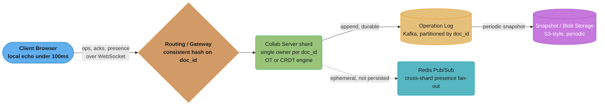
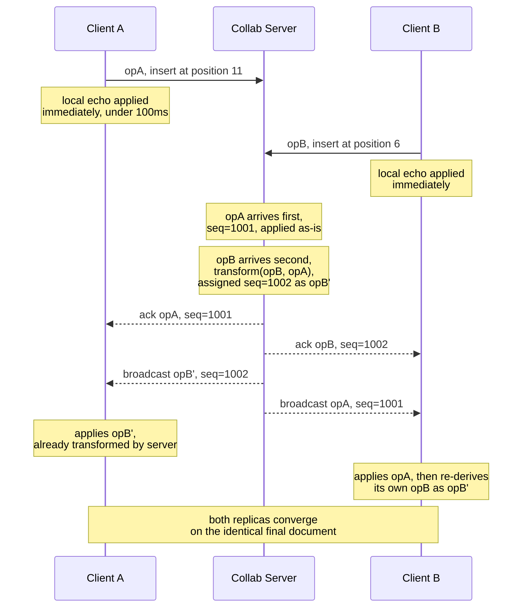
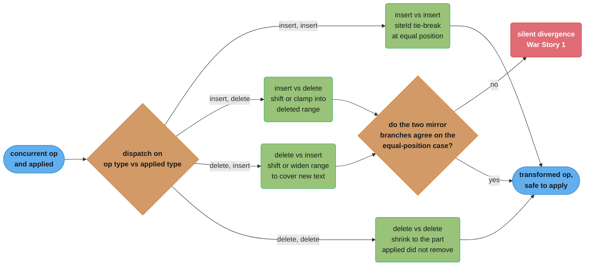
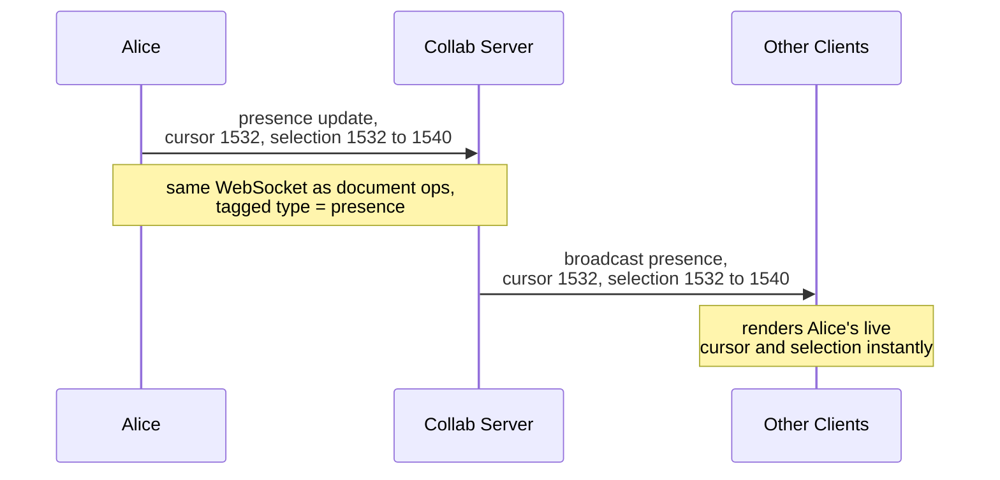
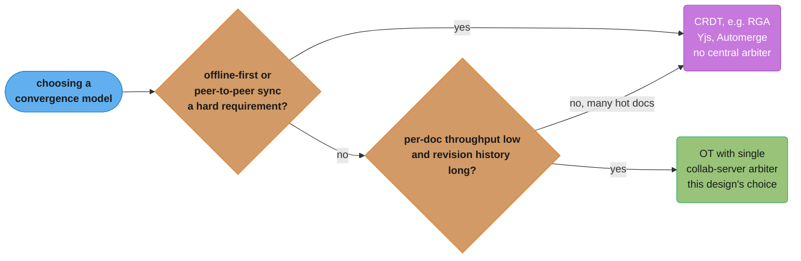
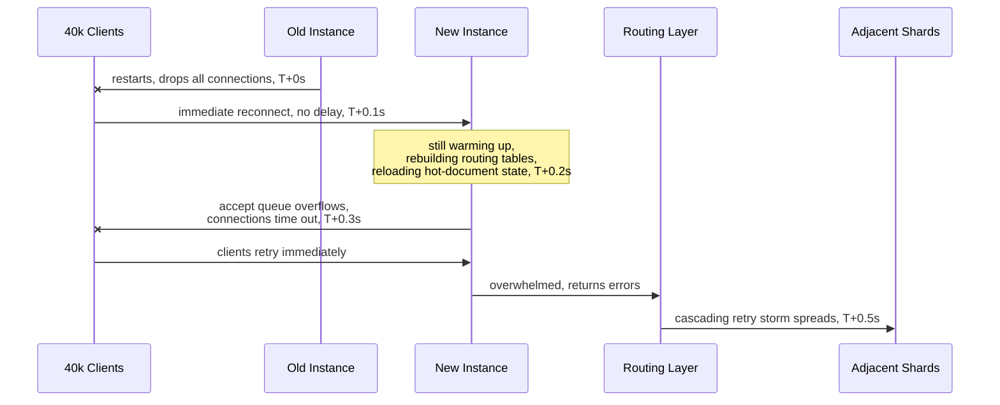

# System Design: Google Docs (Real-Time Collaborative Editor)

## Intuition

> **Design intuition**: A collaborative document editor looks like a CRUD app with a WebSocket bolted on, but the actual hard problem is one of *distributed consensus on a sequence*: when two people type at the same cursor position at the same instant, both edits must be applied, both users must end up looking at the *exact same final text*, and neither user should ever see their own keystroke "rubber-band" backward. This is the canonical Operational Transformation vs. CRDT interview question — and it's hard precisely because the obvious naive approach (just apply each edit as it arrives, in arrival order) silently produces *different* documents on different machines, with no error, no exception, and no easy way to detect the divergence until a user notices their paragraph is garbled.

**Key insight**: The system has exactly one truly hard invariant — **convergence**: every replica (every open browser tab, every offline client that reconnects) must deterministically arrive at the *identical* final document, regardless of the order operations physically arrive over the network. Everything else (cursors, presence, version history, access control) is a relatively standard real-time CRUD problem layered on top of that one invariant. Solve convergence correctly — via Operational Transformation (centralized arbitration + transform functions) or CRDTs (mathematically commutative merge with no central arbiter) — and the rest of the system is "just" event sourcing with a WebSocket front end.

---

## 1. Requirements Clarification

### Functional Requirements
- **Concurrent editing**: Multiple users edit the same document at the same time, with changes visible to all participants in near-real-time.
- **Local echo**: A user's own keystrokes appear instantly (<100ms perceived latency) — never wait for a server round-trip before showing what you typed.
- **Remote convergence**: Other users see your edits within roughly one second, and the document converges to an identical state for everyone.
- **Live presence**: Show other editors' cursor positions and text selections in real time (e.g., "Alice is editing here", colored cursor labels).
- **Offline editing**: A user can keep typing while disconnected; on reconnect, their changes merge into the document without data loss.
- **Version history and revert**: View a timeline of past revisions and restore the document to any prior state.
- **Access control**: Documents have view / comment / edit roles per user (or link-based sharing with a role).

### Non-Functional Requirements
- **Convergence (Strong Eventual Consistency)**: All replicas that have received the same set of operations — in any order — compute the same final document. This is the formal CRDT/OT correctness property and is non-negotiable.
- **Causality preservation**: An operation that depends on text (e.g., "delete characters 10-15") cannot be applied on a replica before the operation that inserted those characters has been applied there. Out-of-order delivery must not violate this.
- **Durability**: No committed edit is lost, even if the collab server process crashes mid-session.
- **Low latency**: <100ms local echo; <1s for an edit to be visible to a remote collaborator under normal network conditions.
- **Scale**: Support documents with thousands of historical revisions and dozens of concurrent editors on the same document without the editing experience degrading.

### Out of Scope
- Rich-media embedding pipeline (image/video upload, transcoding, thumbnailing).
- Full sharing/permissions UI (invite flows, link-sharing settings pages, org-wide policy).
- Export-to-PDF / export-to-other-formats rendering pipeline.

### Clarifying Questions Worth Asking the Interviewer

- **"Plain text or rich text?"** — The answer fundamentally changes the size and complexity of the `transform()` surface area (§4.1, §11). For this design, assume rich text (the realistic Google Docs case), but build the OT/CRDT core on a plain-text model first and note that formatting operations are an extension, not a redesign.
- **"How many concurrent editors should a single document support gracefully?"** — Determines whether the single-collab-server-per-document model (§4.3) is sufficient or whether finer-grained per-block ownership (§6, Notion's model) needs to be part of the initial design.
- **"Does offline editing need to support hours/days of disconnection, or just brief network blips?"** — A few seconds of offline buffering is trivial; hours of offline editing means the reconnect-time `transform()` batch (§4.5) could be transforming dozens of buffered operations against hundreds of server-side operations, which is still tractable but worth calling out as a load consideration.
- **"Is OT or CRDT a hard requirement, or is the interviewer testing whether I can identify and reason about the tradeoff?"** — Usually the latter — most interviewers want to see the convergence problem articulated and a defensible choice made (§5, §11), not a "correct" answer recited from memory.

---

## 2. Scale Estimation

### Concurrency Numbers
- **100M DAU** (daily active users of the broader product, e.g., a Docs-like suite).
- ~1% are *actively editing* a document at any given peak moment → **~1M concurrent editing sessions**.
- Average **~3 concurrent editors per actively-edited document** → 1M / 3 ≈ **~330K actively-edited documents at peak**.

### Operation Throughput
- A user actively typing generates roughly one operation per ~200ms (a keystroke or small batch of keystrokes coalesced by the client) ≈ **~5 ops/sec while actively typing**.
- Realistically, users pause to think, read, scroll, and switch windows — averaged across a session, **~1 op/sec/active-editor** is a more representative sustained rate.
- Aggregate across the fleet: 1M concurrent editors × 1 op/sec ≈ **~1M ops/sec system-wide**.
- **Critical scaling insight**: per-document throughput rarely exceeds a few tens of ops/sec, even with 50 simultaneous editors on one document (50 editors × ~1 op/sec ≈ 50 ops/sec, with realistic bursts to maybe 100-200 ops/sec). This is *exactly* why per-document sharding (one logical owner per `doc_id`) is viable — no single document ever needs more throughput than a single modern server's single CPU core can trivially process.

### Storage
- **Document snapshot size**: average ~50KB (a few thousand words of formatted text plus structural metadata).
- **Operation log growth for an active document**: ~1MB/day of appended operations (each operation is small — tens to low-hundreds of bytes — but they accumulate quickly during active editing sessions).
- **Compaction**: periodically (every N ops or T minutes), the collab server materializes the current document state into a new snapshot and truncates (or archives) the operation log preceding that snapshot, bounding both storage growth and reload-replay time.
- **Fleet-wide storage**: 330K actively-edited documents × ~1MB/day of new ops ≈ **~330GB/day of new operation-log data** system-wide (before compaction discards superseded log segments) — well within the throughput of a sharded event store like Kafka or a log-structured database.
- **Snapshot storage**: assume 1B total documents in the system (most dormant) × 50KB average snapshot ≈ **~50TB** of blob storage for snapshots — trivial for S3-class object storage.

---

## 3. High-Level Architecture



**Routing**: Consistent hashing on `doc_id` (see [Consistent Hashing](../consistent_hashing/README.md)) ensures every client editing the same document connects — directly or via gateway redirect — to the *same* collab-server shard. This single-writer-per-document property is what allows the collab server to assign a simple incrementing global sequence number to every operation without distributed consensus.

**Persistence**: The operation log is the system of record — this *is* event sourcing (see [Event Sourcing & CQRS](../event_sourcing_cqrs/README.md)). The current document is always derivable by replaying the log from the beginning (or, in practice, from the most recent snapshot).

**Presence**: Cursor positions and selection ranges are broadcast over the same WebSocket channel but are explicitly *not* written to the operation log or any durable store — they are transient UI state that becomes meaningless the instant a user disconnects.

### Operation Flow for Two Concurrent Clients

The sequence below shows the end-to-end path for the divergence-prone scenario from §4.1: Client A and Client B both have the document at sequence 1000, and both generate an operation concurrently.



Two details matter here: (1) the collab server is the single point that decides **arrival order** (opA before opB in this example) and therefore which operation gets transformed against which — this is the "single total order" guarantee from §3; and (2) **both clients converge to the same result** because both apply `transform(opB, opA)` — Client A receives the already-transformed `opB'` from the server, while Client B (whose local echo already applied the *untransformed* `opB`) must reconcile by re-deriving `opB'` the same way, which is why the server's broadcast includes enough information (the transformed operation plus its dependency on `opA`'s sequence number) for every replica to arrive at the identical state.

---

## 4. Component Deep Dives

### 4.1 Operational Transformation (OT) Core

#### The Central Problem

Imagine a document containing the text `"Hello world"`. Two users, A and B, are both looking at this same state.

- User A inserts `"!"` at position 11 (end of string) → intends `"Hello world!"`.
- Concurrently, User B inserts `"Wonderful "` at position 6 (before "world") → intends `"Hello Wonderful world"`.

Both operations are generated *against the same base document* but describe positions in that base document. If each replica simply applies both operations **in the order it happens to receive them, using the raw position values**, the two replicas can diverge:

- Replica 1 receives A's op first, then B's op. After A's op: `"Hello world!"`. Applying B's op (insert "Wonderful " at position 6) against this *new* string gives `"Hello Wonderful world!"` — correct.
- Replica 2 receives B's op first, then A's op. After B's op: `"Hello Wonderful world"`. Applying A's op (insert "!" at position 11) against *this* string inserts at index 11, which is now in the middle of "Wonderful " — producing `"Hello Wonde!rful world"` — **wrong, and different from Replica 1**.

**This is the divergence bug.** The fix is *transformation*: before applying a remote operation, transform its position against every operation that was applied locally but that the remote operation's author had not yet seen. `transform(opB, opA)` produces `opB'` — a version of B's operation whose position has been adjusted to account for A's operation having already been applied.

#### Transform Rules for Insert/Delete on a Position Model

A minimal text operation model:

```java
public abstract class Operation {
    final String siteId;   // tie-breaker for same-position concurrent ops
    final long position;

    Operation(String siteId, long position) {
        this.siteId = siteId;
        this.position = position;
    }
}

public final class InsertOp extends Operation {
    final String text;

    InsertOp(String siteId, long position, String text) {
        super(siteId, position);
        this.text = text;
    }
}

public final class DeleteOp extends Operation {
    final int length;

    DeleteOp(String siteId, long position, int length) {
        super(siteId, position);
        this.length = length;
    }
}
```

The transform function below implements `transform(opToTransform, opAlreadyApplied)`: given an operation we are about to apply, and an operation that was already applied locally (which the author of `opToTransform` had not seen), it returns an adjusted copy of `opToTransform` that, when applied AFTER `opAlreadyApplied`, produces the same final document as if the two operations had been applied in the opposite order with their roles in `transform()` swapped.

```java
public final class OperationalTransform {

    /**
     * Transforms `op` so it can be correctly applied AFTER `applied`
     * has already been applied to the document.
     *
     * Both `op` and `applied` were generated against the SAME base
     * document state (i.e., they are concurrent).
     */
    public static Operation transform(Operation op, Operation applied) {
        if (op instanceof InsertOp && applied instanceof InsertOp) {
            return transformInsertInsert((InsertOp) op, (InsertOp) applied);
        } else if (op instanceof InsertOp && applied instanceof DeleteOp) {
            return transformInsertDelete((InsertOp) op, (DeleteOp) applied);
        } else if (op instanceof DeleteOp && applied instanceof InsertOp) {
            return transformDeleteInsert((DeleteOp) op, (InsertOp) applied);
        } else {
            return transformDeleteDelete((DeleteOp) op, (DeleteOp) applied);
        }
    }

    /** Insert vs Insert: shift position right if the applied insert was
     *  at or before our position. Tie-break same-position inserts by
     *  siteId so all replicas pick the SAME ordering deterministically. */
    private static Operation transformInsertInsert(InsertOp op, InsertOp applied) {
        if (applied.position < op.position
                || (applied.position == op.position
                    && applied.siteId.compareTo(op.siteId) < 0)) {
            // The applied insert lands strictly before us, OR at the same
            // position but "wins" the tie-break -> shift our position right
            // by the length of the text it inserted.
            return new InsertOp(op.siteId, op.position + applied.text.length(), op.text);
        }
        // Either applied.position > op.position (no effect on us), or
        // same position and we win the tie-break (we stay put, our text
        // ends up before theirs).
        return op;
    }

    /** Insert vs Delete: if the deletion happened entirely before our
     *  insert position, shift left. If our insert position falls INSIDE
     *  the deleted range, clamp to the start of that range (the deleted
     *  text "around" our insert no longer exists). */
    private static Operation transformInsertDelete(InsertOp op, DeleteOp applied) {
        long deleteEnd = applied.position + applied.length;
        if (applied.position >= op.position) {
            // Deletion starts at or after our insert point -> no shift.
            return op;
        } else if (deleteEnd <= op.position) {
            // Deletion entirely before our insert point -> shift left by
            // the full deleted length.
            return new InsertOp(op.siteId, op.position - applied.length, op.text);
        } else {
            // Our insert point was INSIDE the deleted range -> clamp to
            // the (now-collapsed) start of that range.
            return new InsertOp(op.siteId, applied.position, op.text);
        }
    }

    /** Delete vs Insert: if the insert happened before our delete's start,
     *  shift our range right by the inserted text's length. If the insert
     *  landed INSIDE our delete range, widen our range to also delete the
     *  newly-inserted text (so the user's intent — "delete this region" —
     *  still removes everything currently occupying that region). */
    private static Operation transformDeleteInsert(DeleteOp op, InsertOp applied) {
        if (applied.position <= op.position) {
            return new DeleteOp(op.siteId, op.position + applied.text.length(), op.length);
        } else if (applied.position >= op.position + op.length) {
            // Insert happened after our delete range entirely -> no change.
            return op;
        } else {
            // Insert landed inside our delete range -> widen the delete
            // to also cover the newly inserted text.
            return new DeleteOp(op.siteId, op.position, op.length + applied.text.length());
        }
    }

    /** Delete vs Delete: the trickiest case. Compute the overlap between
     *  the two ranges and shrink/shift `op` so it only deletes the
     *  characters that `applied` did NOT already remove. */
    private static Operation transformDeleteDelete(DeleteOp op, DeleteOp applied) {
        long opEnd = op.position + op.length;
        long appliedEnd = applied.position + applied.length;

        if (appliedEnd <= op.position) {
            // applied range entirely before op range -> shift left.
            return new DeleteOp(op.siteId, op.position - applied.length, op.length);
        }
        if (applied.position >= opEnd) {
            // applied range entirely after op range -> no change.
            return op;
        }

        // Ranges overlap: compute the portion of `op`'s range NOT
        // covered by `applied` (already deleted by the other op).
        long overlapStart = Math.max(op.position, applied.position);
        long overlapEnd = Math.min(opEnd, appliedEnd);
        long overlapLength = overlapEnd - overlapStart;

        long newPosition = op.position;
        if (applied.position <= op.position) {
            // applied starts at/before op -> op's start shifts left by
            // however much of applied's range precedes op's start.
            newPosition = applied.position;
        }
        long newLength = op.length - overlapLength;
        return new DeleteOp(op.siteId, newPosition, Math.max(0, newLength));
    }
}
```

The four branches above collapse into one dispatch decision — the diagram below shows where two of them must mirror each other exactly:



**Reading the diagram**: `insertInsert` and `deleteDelete` are internally self-consistent, but `insertDelete` and `deleteInsert` are *mirror* branches — each handles the same equal-position boundary from the opposite side, and if their tie-break rules disagree, replicas silently diverge. That is exactly the bug in War Story 1 below.

**The same-position insert/insert tie-break is the single most important detail**: every replica must apply the *same* deterministic rule (e.g., compare `siteId` lexicographically) so that when both A and B insert at position 6 concurrently, *every* replica decides "A's text comes first, B's text comes after" — never the reverse on some replicas and the original on others. This is the root cause analyzed in War Story 1 (§9).

---

### 4.2 CRDT Alternative — RGA (Replicated Growable Array)

Operational Transformation requires a central server to assign a total order and run `transform()` against every concurrently-applied operation. An alternative family of algorithms — **Conflict-free Replicated Data Types (CRDTs)** — sidesteps central arbitration entirely: every character (or block) is given a globally unique identifier, and a deterministic comparison function over those IDs defines the document's character order *without any server needing to "decide" anything*.

**RGA (Replicated Growable Array)** is a classic sequence CRDT. Each character is wrapped in an element carrying:

- A unique ID: `(siteId, logicalClock)` — the site that created it, and a Lamport-style logical clock value at creation time.
- A reference to the ID of the element it was inserted *after* (its "left origin").
- A tombstone flag (deleted characters are marked, not physically removed, so concurrent operations referencing them remain well-defined).

```java
import java.util.concurrent.atomic.AtomicLong;

/** Globally unique, totally-ordered identifier for one RGA element. */
public final class RgaId implements Comparable<RgaId> {
    final long logicalClock;
    final String siteId;

    public RgaId(long logicalClock, String siteId) {
        this.logicalClock = logicalClock;
        this.siteId = siteId;
    }

    /** Total order: higher logical clock wins; ties broken by siteId.
     *  Every replica applies this SAME comparison, so ordering of
     *  concurrently-created elements is identical everywhere without
     *  any coordination. */
    @Override
    public int compareTo(RgaId other) {
        if (this.logicalClock != other.logicalClock) {
            return Long.compare(other.logicalClock, this.logicalClock); // higher clock first
        }
        return this.siteId.compareTo(other.siteId);
    }

    @Override
    public boolean equals(Object o) {
        if (!(o instanceof RgaId)) return false;
        RgaId other = (RgaId) o;
        return logicalClock == other.logicalClock && siteId.equals(other.siteId);
    }

    @Override
    public int hashCode() {
        return Long.hashCode(logicalClock) * 31 + siteId.hashCode();
    }
}

/** A single character (or grapheme cluster) in the RGA sequence. */
public final class RgaElement {
    final RgaId id;
    final char value;
    final RgaId leftOrigin; // ID of the element this was inserted after; null = head
    boolean tombstone = false;

    public RgaElement(RgaId id, char value, RgaId leftOrigin) {
        this.id = id;
        this.value = value;
        this.leftOrigin = leftOrigin;
    }
}

/** Per-site logical clock + insert-after operation for an RGA document. */
public final class RgaSite {
    private final String siteId;
    private final AtomicLong logicalClock = new AtomicLong(0);

    public RgaSite(String siteId) {
        this.siteId = siteId;
    }

    /** Generates a fresh, globally-unique ID for a new character,
     *  advancing this site's logical clock (Lamport clock rule). */
    public RgaId nextId() {
        return new RgaId(logicalClock.incrementAndGet(), siteId);
    }

    /** When receiving a remote element, advance our clock to be
     *  greater than the remote element's clock (Lamport "merge" rule) —
     *  this is what prevents the clock-skew issue in War Story 3. */
    public void observeRemoteClock(long remoteClock) {
        logicalClock.updateAndGet(current -> Math.max(current, remoteClock));
    }

    /**
     * Inserts `value` immediately after the element with ID `leftOriginId`
     * (null means "insert at the very beginning of the document").
     *
     * Returns the new element. Insertion position into the underlying
     * list is found by scanning forward from leftOriginId and skipping
     * past any existing elements that should sort BEFORE the new
     * element under RgaId's total order — this is what makes concurrent
     * inserts at the same leftOrigin converge to the same final order
     * on every replica, with no central coordination.
     */
    public RgaElement insertAfter(java.util.List<RgaElement> sequence,
                                   RgaId leftOriginId, char value) {
        RgaId newId = nextId();
        RgaElement newElement = new RgaElement(newId, value, leftOriginId);

        int insertIndex = (leftOriginId == null)
                ? 0
                : indexOf(sequence, leftOriginId) + 1;

        // Skip past any existing elements that share the same leftOrigin
        // and sort BEFORE newId under the total order (this is the
        // standard RGA "concurrent siblings" tie-break).
        while (insertIndex < sequence.size()
                && java.util.Objects.equals(sequence.get(insertIndex).leftOrigin, leftOriginId)
                && sequence.get(insertIndex).id.compareTo(newId) < 0) {
            insertIndex++;
        }

        sequence.add(insertIndex, newElement);
        return newElement;
    }

    private static int indexOf(java.util.List<RgaElement> sequence, RgaId id) {
        for (int i = 0; i < sequence.size(); i++) {
            if (sequence.get(i).id.equals(id)) return i;
        }
        throw new IllegalStateException("Referenced element not found: " + id);
    }
}
```

**Metadata overhead at scale**: each `RgaElement` carries an `RgaId` (8-byte logical clock + a siteId string, typically 16 bytes for a UUID) plus a `leftOrigin` reference (another ~24 bytes) plus a tombstone flag — roughly **40-50 bytes of metadata per character**, on top of the 1-2 bytes for the character itself. For a **1-million-character document** (a genuinely large document — hundreds of pages), that's **~40-50MB of CRDT metadata** versus ~1-2MB of actual text. Tombstones accumulate forever unless garbage-collected (which itself requires knowing no replica still has an in-flight operation referencing the tombstoned element — non-trivial in a system with offline clients).

By contrast, OT's per-operation overhead is just the operation itself (`siteId`, `position`, `text` — tens of bytes), but OT requires every operation to pass through a central server that runs `transform()` against every concurrently-applied operation, which becomes the single-writer bottleneck described in §4.3 (acceptable here because per-document throughput is low — see §2 — but a real constraint at very high per-document concurrency).

---

### 4.3 Collab Server Architecture

- **Single-writer-per-document**: exactly one collab-server shard is the "owner" of a given `doc_id` at any time. All WebSocket connections from clients editing that document are routed (via consistent hashing on `doc_id`) to that shard.
- **Global sequence assignment**: the owning shard maintains an in-memory (and log-backed) monotonic sequence number for the document. Every incoming operation is assigned the next sequence number, transformed (OT) or merged (CRDT) against the current canonical state, applied, appended to the operation log, and broadcast to all connected clients with its assigned sequence number.
- **WebSocket session lifecycle**:
  1. Client connects, authenticates, and sends its `doc_id` and last-known server sequence number (0 for a brand-new session, or the value from local storage for a returning client).
  2. Server replies with: the current document snapshot (or a diff from the client's last-known sequence), plus any operations the client missed.
  3. Client and server exchange operations bidirectionally for the duration of the session.
  4. On disconnect, the server removes the session from its broadcast list; the document continues to exist and accept edits from other connected clients.
- **Sharding by `doc_id`**: consistent hashing (see [Consistent Hashing](../consistent_hashing/README.md)) maps `doc_id` to a collab-server shard. When a shard is added or removed, only the documents whose hash falls in the affected ring segment need to be reassigned — bounding the "blast radius" of a rebalance.

---

### 4.4 Persistence — Operation Log + Snapshots

The operation log is the durable source of truth — a textbook application of **event sourcing** (see [Event Sourcing & CQRS](../event_sourcing_cqrs/README.md) and [Event Sourcing & CQRS — Backend Deep Dive](../../backend/event_sourcing_and_cqrs/README.md)):

```
Operation Log (Kafka topic, partitioned by doc_id):
  seq=1001  InsertOp(site=A, pos=42, text="Hello")
  seq=1002  InsertOp(site=B, pos=47, text=" world")
  seq=1003  DeleteOp(site=A, pos=10, len=3)
  ...
```

- **Why an event log and not "just update a row"?** The log gives you (a) version history for free — any historical state is "replay ops 1..N", (b) the canonical convergence order — every replica that replays the same log segment in the same order ends up in the same state, and (c) auditability — who changed what, when.
- **Snapshotting**: replaying 50,000 operations on every document load would be slow. Every N operations (e.g., every 500) or every T minutes (e.g., every 5 minutes) of active editing, the collab server serializes the current document state to blob storage as a snapshot, tagged with the sequence number it represents. Reload becomes: fetch the latest snapshot, then replay only the (small number of) operations appended since that snapshot's sequence number.
- **Compaction**: once a snapshot at sequence N exists and has been durably written, log segments containing operations with sequence < N can be archived to cold storage or deleted, bounding the *active* log size that must be kept hot.

---

### 4.5 Offline Sync

A client that loses connectivity continues to accept local edits, applying them to its local document copy immediately (local echo) and appending them to a local outgoing buffer tagged with the last server sequence number the client had observed before disconnecting (`baseSeq`).

On reconnect:

1. Client sends its buffered operations plus `baseSeq` to the collab server.
2. The server looks up every operation with sequence number > `baseSeq` that was applied while the client was offline — these are the operations the client "missed" and that are *concurrent* with the client's buffered operations.
3. The server transforms (OT) each buffered client operation against every one of those missed operations, in sequence order — exactly the same `transform()` machinery used for live concurrent edits, just applied to a (potentially large) batch at once.
4. The transformed client operations are applied, assigned new sequence numbers, appended to the log, and broadcast to all currently-connected clients (including the reconnecting one, which now reconciles its local state with the server's canonical sequence numbering).

```
Client baseSeq = 1000 (last server seq known before disconnect)
Client buffered ops (generated offline): [opC1, opC2, opC3]

Server has applied seq 1001..1007 while client was offline (ops from
other users: opS1..opS7)

Reconnect handling:
  for each clientOp in [opC1, opC2, opC3]:
      for each serverOp in [opS1, opS2, ..., opS7]:
          clientOp = transform(clientOp, serverOp)
      apply(clientOp)               // now seq 1008, 1009, 1010
      broadcast(clientOp)
```

This is exactly why **causality preservation** (an NFR from §1) matters: if `opC2` references text inserted by `opC1`, and `opC1` is transformed and applied first, `opC2`'s position references remain valid relative to the post-`opC1` document. Buffered operations must be transformed and applied **in their original relative order**, never reordered relative to each other.

A subtlety worth calling out: the offline client's **local echo already shows the buffered operations applied** to its own copy of the document (that's what made local editing feel instant while offline). When the server replies with the transformed, re-sequenced versions of those same operations, the client must reconcile its local state with the server's canonical state — typically by discarding its local speculative state and re-deriving from the server's authoritative sequence, then re-applying any operations generated *after* the reconnect handshake began (a small window). If the transform during reconnect produced a meaningfully different result than the client's local guess (e.g., because a concurrent delete removed text the client's buffered operation referenced), the user may see a brief "jump" as their view reconciles with the canonical state — rare in practice because most concurrent edits during a short offline window don't overlap the same character ranges, but it is a real, visible edge case that QA should explicitly test.

---

### 4.6 Presence and Access Control

#### Presence (Cursors and Selections)

Presence updates are small, frequent messages — "user X's cursor is now at position N" or "user X has selected range [a, b]" — sent over the same WebSocket connection used for document operations, but tagged with a distinct message type so the collab server never confuses a presence update with a document-mutating operation.



*Presence rides the same WebSocket as document operations but is tagged separately, throttled client-side, and never durably logged.*

Because presence messages are frequent (every cursor move or selection change can generate one) but cheap and disposable, they are typically:
- **Throttled/debounced** client-side (e.g., at most one presence update per 50-100ms even if the user is dragging a selection rapidly) to avoid flooding the WebSocket with redundant updates.
- **Never queued or retried** — if a presence message is dropped due to a transient network blip, the next cursor movement will send a fresh one; there is no "presence backlog" to recover.
- **Cleared on disconnect** — when a client's WebSocket closes, the collab server immediately broadcasts a "user X disconnected" presence event so other clients remove that user's cursor from their view, rather than leaving a stale "ghost cursor" on screen.

When a document's editors are split across multiple collab-server instances (e.g., during a shard rebalance or a brief routing inconsistency), presence updates are fanned out via **Redis Pub/Sub** on a per-`doc_id` channel — each collab-server instance hosting at least one session for that document subscribes to the channel and re-broadcasts incoming presence events to its locally-connected clients. This is the one place in the architecture where cross-shard communication happens on the hot path, and it's intentionally kept to ephemeral, best-effort data only.

#### Access Control (View / Comment / Edit)

Access control is checked at two points:

1. **Connection time**: when a client opens the WebSocket for a document, the collab server (or an auth service it calls) verifies the user's role for that `doc_id` — `viewer`, `commenter`, or `editor` — typically via a short-lived signed token issued by the main application backend (the same backend that renders the document's sharing settings page, out of scope per §1).
2. **Per-operation time**: every incoming operation is checked against the connection's role. A `viewer` connection should never be able to send a mutating `InsertOp`/`DeleteOp` — the collab server rejects such operations outright (and logs the attempt, since a client sending operations its role doesn't permit likely indicates either a bug or a malicious client bypassing UI restrictions). A `commenter` may send comment-thread operations (out of scope for the OT/CRDT core, but conceptually a parallel operation stream anchored to text ranges) but not text-mutating operations.

Role changes (e.g., an editor downgrades a collaborator to viewer mid-session) are pushed to the affected client's connection in real time — the collab server updates its in-memory record of that connection's role and, on the next operation from that client, enforces the new restriction. The client's UI should also react to this push by switching the editor to read-only mode, but the **server-side enforcement is the actual security boundary** — the UI-level restriction is a UX nicety, not the access-control mechanism.

---

### 4.7 Version History and Revert

Because the operation log is the system of record (§4.4), "version history" is not a separately-maintained data structure — it's a *view* over the existing log:

- **Named/checkpoint revisions**: rather than exposing all 50,000 raw operations as "versions" (meaningless to a user), the system periodically creates a **named checkpoint** — e.g., on each user's session disconnect, or every 10-15 minutes of continuous editing, or when a user explicitly clicks "Save a version" — recording `(checkpointId, sequenceNumber, timestamp, authorIds-since-last-checkpoint)`. The revision-history UI lists these checkpoints, not raw operations.
- **Reconstructing a historical state**: given a checkpoint's `sequenceNumber`, the document state at that point is `nearestSnapshotAtOrBefore(sequenceNumber)` replayed forward to exactly `sequenceNumber`. Because snapshots already exist for fast reload (§4.4), this reconstruction reuses the same replay machinery — version history adds essentially no new infrastructure, just a different replay target.
- **Revert as a forward operation**: reverting to a historical checkpoint does **not** delete the operations between that checkpoint and the present — doing so would corrupt the causal history that other replicas (including offline clients who haven't reconnected yet) may still reference. Instead, revert computes a **diff operation**: "transform the *current* document into the *historical* document," expressed as a (potentially large) sequence of insert/delete operations, and appends that diff as new operations at the end of the log with fresh sequence numbers. From every replica's perspective, a revert looks exactly like a very large, ordinary edit — it goes through the same `transform()` pipeline as any other concurrent operation, so a revert that races with another user's concurrent edit is resolved the same way any other conflict is resolved.
- **Storage cost**: named checkpoints themselves store only a `(sequenceNumber, timestamp, metadata)` tuple — a few dozen bytes — not a full document copy. The "thousands of historical revisions" scale target from §1 is therefore a few hundred KB of checkpoint metadata even for a document with a very long edit history, dwarfed by the snapshot and operation-log storage already accounted for in §2.

---

## 5. Design Decisions & Tradeoffs

### OT vs. CRDT — The Central Decision

| Dimension | Operational Transformation (OT) | CRDT (e.g., RGA) |
|---|---|---|
| Authority model | Centralized — one server assigns total order, runs `transform()` | Decentralized — any replica can merge any other replica's state |
| Per-character/op overhead | Small — just the op itself (tens of bytes) | Larger — unique ID + origin reference per character (~40-50 bytes/char) |
| Correctness difficulty | Notoriously hard to get `transform()` right for ALL op-pair combinations, especially with rich-text formatting and embedded objects (tables, images, comments) | Mathematically guaranteed convergence (commutative, associative, idempotent merge) — correctness is a property of the data structure, not hand-written transform logic |
| Offline-first support | Possible but awkward — offline ops must be transformed against potentially large batches on reconnect (§4.5) | Natural fit — any replica can apply any operation in any order and still converge; this is *why* CRDTs are popular for local-first apps |
| Server role | Must be an active arbiter (runs the transform engine) | Can be a "dumb" relay/persistence layer — clients can theoretically sync peer-to-peer |
| Production maturity for rich text | Google Docs has run production OT for over a decade | Yjs and Automerge are mature, but rich-text CRDTs are a younger field than rich-text OT |

**Choice for this design**: OT, with a single collab-server-per-document as the transform arbiter — primarily because (a) per-document throughput is low (§2: tens of ops/sec even at 50 concurrent editors), so the centralization cost is negligible, and (b) the smaller per-operation metadata matters when documents have years of revision history. **However**, note in interviews that CRDTs are the *better* choice when offline-first and peer-to-peer sync are first-class requirements (Figma, Notion's underlying primitives, and most local-first software libraries like Yjs and Automerge use CRDT-family approaches).

The same reasoning collapses into a quick decision guide for this canonical interview question:



**Reading the diagram**: this design lands on OT because per-document throughput stays low even at 50 editors (§2) and revision history is long — exactly the regime where OT's small per-operation overhead outweighs CRDT's per-character metadata tax (§4.2); flip either condition (offline-first, peer-to-peer, or a hot document that needs finer-grained ownership) and CRDT becomes the better default.

### Single Collab-Server-per-Document vs. Fully Peer-to-Peer CRDT Sync

- **Choice**: single logical owner per document (consistent-hash routed).
- **Reason**: simplicity — one place assigns sequence numbers, one place is the "current truth" for a connected client to sync against, one place writes to the operation log.
- **Trade-off**: that shard is a (recoverable, but real) single point of contention for the document during its lifetime — mitigated by fast crash recovery from snapshot + log replay (§4.4, §8). A fully peer-to-peer CRDT model (closer to Figma's approach, see §6) removes this central bottleneck entirely but pushes more complexity into client-side merge logic and makes "what is the current state" a fuzzier question that must be answered for persistence and version history anyway.

### WebSocket vs. Polling

- **Choice**: WebSocket, bidirectional, persistent connection per active editing session.
- **Reason**: presence (cursor positions) and remote operations need push delivery with sub-second latency; polling at a frequency tight enough to feel "live" (e.g., every 200ms) would generate far more request overhead than one persistent connection, and would add up to 200ms of latency to every remote update on top of network RTT.
- **Trade-off**: WebSocket connections are stateful and consume server-side memory/file-descriptors per connection (see §10 capacity planning) — at scale this requires careful per-server connection budgeting and graceful reconnect handling (§9 War Story 2).

### Presence as Ephemeral vs. Persisted State

- **Choice**: cursor/selection presence is broadcast over the live WebSocket channel and held only in collab-server memory (and Redis pub/sub for cross-shard fan-out) — never written to the operation log or any durable store.
- **Reason**: presence is meaningful only while a user is actively connected; persisting it would bloat the operation log with information that becomes stale the instant a tab closes, and would complicate the "replay the log to reconstruct the document" guarantee with data that isn't part of the document at all.
- **Trade-off**: if the collab server crashes, all presence state for that document is lost — but this is the correct behavior, since every connected client also disconnected and will re-announce its presence on reconnect.

---

## 6. Real-World Implementations

- **Google Docs**: The most widely cited production OT system. Its lineage traces directly back to **Jupiter**, the operational-transformation system built for the **Google Wave** project (2009-2010). When Wave was discontinued, its collaborative-editing core was repurposed into what became Google Docs' real-time collaboration engine. Google Docs' OT implementation handles not just plain-text insert/delete but rich formatting operations (bold, italic, font changes), embedded objects (images, comments, suggestions), and structural operations (tables, lists) — each of which requires its own `transform()` rules and pairwise interactions with every other operation type, which is precisely the source of the correctness difficulty noted in §5.
- **Figma**: Uses a custom multiplayer protocol with CRDT-like properties — every object on the canvas (shapes, layers, text) has a unique ID, and property changes are last-writer-wins per property with logical clocks for ordering, which sidesteps much of the complexity of sequence-CRDTs for text because Figma's "document" is fundamentally a tree of independently-addressable objects rather than a single linear text buffer. Figma's server acts as an **authoritative relay and persistence layer** rather than a passive message-passer — it's the source of truth for "what is the current state of this file," similar in spirit to this design's collab server, but the conflict resolution itself leans on CRDT-style commutative merges rather than OT transform functions.
- **Notion**: Implements **block-level CRDTs** — each block (paragraph, heading, to-do item, table row) in a Notion page is its own CRDT-managed unit with its own ID and ordering metadata. This means edits to *unrelated blocks* (e.g., User A editing block 5 while User B edits block 12) never need to be transformed against each other at all — they trivially commute because they touch disjoint CRDT instances. Conflicts only need resolution *within* a single block, which keeps the per-block CRDT simple (closer to a small sequence CRDT over that block's text) while sidestepping document-wide transform complexity.
- **Yjs**: The most widely-used open-source CRDT library for collaborative applications, implementing a YATA-like sequence CRDT (conceptually similar to the RGA in §4.2). Yjs is the engine behind many local-first collaborative apps and editor integrations (ProseMirror, CodeMirror, Monaco bindings) — its design explicitly optimizes for the metadata-overhead concern raised in §4.2 via techniques like delete-set compression and ID range compaction, since naive per-character ID storage at the scale of real documents would otherwise be prohibitive.
- **Automerge**: Another prominent open-source CRDT library (used in local-first projects like Ink & Switch's research prototypes), notable for providing a JSON-document CRDT (not just text sequences) — useful when the "document" being collaboratively edited is structured data rather than a flat text buffer.

### Comparison at a Glance

| System | Conflict-resolution model | Document model | Server's role |
|---|---|---|---|
| Google Docs | OT (Jupiter lineage) | Single linear rich-text buffer with format spans | Active arbiter — runs `transform()`, assigns total order |
| Figma | Custom CRDT-like (last-writer-wins per property + logical clocks) | Tree of independently-addressable canvas objects | Authoritative relay + persistence — central source of truth, but conflict resolution is commutative by construction |
| Notion | Block-level CRDTs | Tree of blocks, each an independent CRDT unit | Persistence + sync relay — most edits to different blocks need no coordination at all |
| Yjs (library) | Sequence CRDT (YATA, RGA-family) | Configurable — text sequences, JSON-like trees | Often a "dumb" relay (e.g., y-websocket) — clients can in principle sync peer-to-peer |
| Automerge (library) | JSON-document CRDT | Arbitrary nested JSON structure | Same as Yjs — sync-agnostic, works over any transport including peer-to-peer |

The throughline across all five: **the harder a system leans toward "the server is just dumb storage/relay," the more the conflict-resolution logic has to be airtight and self-contained on the client** (CRDTs), and conversely, **the more a system centralizes "the server decides the order," the smaller the per-operation overhead can be but the more the server's transform/merge logic becomes a critical, heavily-tested piece of shared infrastructure** (OT). Google Docs' multi-decade investment in its OT engine and Yjs's multi-year investment in CRDT metadata-compaction techniques represent two different places along this spectrum where a team chose to pay down complexity.

---

## 7. Technologies & Tools

| Component | Technology | Why |
|---|---|---|
| Client-server real-time channel | WebSocket | Bidirectional push for ops, acks, and presence with sub-second latency — see [WebSockets & SSE](../../backend/websockets_and_sse/README.md) |
| Collab server | Stateful service (per `doc_id` shard) | Hosts the OT transform engine / CRDT merge logic and assigns global sequence numbers |
| Cross-shard presence fan-out | Redis Pub/Sub | When a document's editors happen to be split across multiple collab-server replicas (e.g., during a rebalance), presence updates need to reach all of them without going through the operation log |
| Operation log / event store | Kafka (partitioned by `doc_id`) | Durable, ordered, replayable append-only log — the event-sourcing backbone, see [Event Sourcing & CQRS](../event_sourcing_cqrs/README.md) and [Event Sourcing & CQRS — Backend](../../backend/event_sourcing_and_cqrs/README.md) |
| Snapshot storage | S3-style blob storage | Periodic full-document snapshots for fast reload and log compaction |
| Routing / sharding | Consistent hashing on `doc_id` | Routes all clients of a document to the same collab-server shard, see [Consistent Hashing](../consistent_hashing/README.md) |
| Reconnect resilience | Jittered exponential backoff | Prevents thundering-herd reconnect storms after deploys, see [Resilience Patterns](../resilience_patterns/README.md) |
| Rich-text CRDT (alternative stack) | Yjs / Automerge | Production-grade sequence/JSON CRDT implementations with metadata-overhead mitigations |

---

## 8. Operational Playbook

### Monitoring

| Metric | What it tells you |
|---|---|
| WebSocket connections per collab-server instance | Capacity headroom — compare against the per-server connection budget (§10) |
| Op-apply latency (p50/p99) | Time from "op received by collab server" to "op applied to canonical state and broadcast" — directly impacts remote-convergence latency |
| Transform-queue depth | Backlog of operations waiting to be transformed against the canonical state — a growing queue on a single hot document signals the single-writer model is becoming a bottleneck for that document |
| Snapshot lag (ops since last snapshot) | If this grows unbounded, document-reload time grows unbounded too |
| Reconnect rate | Spikes indicate network issues or a recent deploy triggering mass reconnects (§9 War Story 2) |
| Operation log consumer lag | If snapshot-writers or analytics consumers fall behind, compaction stalls |

These map onto the standard three pillars (metrics, logs, traces) — see [Observability](../observability/README.md) for the general framework.

### Runbook: Collab-Server Crash

1. Health checks detect the shard is unresponsive; the routing layer marks it down.
2. All WebSocket connections to that shard drop; clients enter reconnect-with-backoff (§9 War Story 2).
3. A new collab-server instance (or an existing peer, depending on the sharding scheme) is assigned ownership of the affected `doc_id` range via the consistent-hash ring.
4. For each affected document: load the most recent snapshot from blob storage, replay operations from the log starting at the snapshot's sequence number, rebuild canonical in-memory state.
5. Reconnecting clients send their `baseSeq`; the server replies with any operations they missed (from the now-rebuilt log/state) and accepts their buffered offline operations per the §4.5 flow.
6. Presence state is naturally rebuilt as clients reconnect and re-announce cursors — no special recovery needed (by design, §5).

### Runbook: Detected Document Corruption

Symptoms: a document fails to deserialize from its snapshot, or replay of the operation log throws (e.g., a delete operation references a range that doesn't exist in the reconstructed state — indicating either a transform bug or a corrupted log segment).

1. **Do not serve the corrupted snapshot to clients** — fail closed, return a "document temporarily unavailable" state rather than a garbled document.
2. Identify the last known-good snapshot (one that deserializes cleanly and whose log-replay to the next snapshot succeeds without error).
3. Revert the document's canonical state to that last known-good snapshot.
4. Operations after that point are either replayed (if they replay cleanly against the reverted state) or, if the corruption is in the operations themselves, quarantined for offline analysis while the document is served from the reverted snapshot — meaning some recent edits may be temporarily lost from the live view but are preserved in the quarantined log segment for manual recovery.
5. File an incident: corruption almost always indicates either (a) a `transform()` bug producing an operation that's invalid against the canonical state, or (b) a non-atomic snapshot write (§9 War Story 4) — both require a code fix, not just data recovery.

---

## 9. Common Pitfalls & War Stories

### Pitfall Summary

| Pitfall | Impact | Fix |
|---|---|---|
| `transform()` missing a tie-break for same-position insert/delete | Documents silently diverge across clients | Deterministic tie-break by `siteId`; exhaustive operation-pair regression suite |
| Mass simultaneous reconnect after deploy | Collab servers overwhelmed, cascading failures | Jittered exponential backoff |
| Wall-clock timestamps for CRDT ordering | "Time travel" — an edit appears before a prior edit due to clock skew | Lamport logical clocks |
| Non-atomic snapshot writes | Crash mid-write leaves an unloadable document | Write to temp path, atomic rename |
| Treating presence as durable state | Operation log polluted with stale cursor data | Presence is ephemeral, broadcast-only, never logged |
| Single collab server per doc with no capacity ceiling | One viral/heavily-collaborated doc starves its shard | Monitor transform-queue depth; consider splitting hot documents (e.g., per-block ownership, à la Notion) |

### War Story 1: The Insert/Delete Divergence Bug (Broken -> Fixed)

**What happened**: Two users, Alice and Bob, were editing adjacent text. Alice deleted a word at position 20 (length 4) at roughly the same instant Bob inserted a new word at position 20. The `transform()` implementation handled `insert/insert` and `delete/delete` pairs correctly (both had explicit tie-break rules), but the `insert/delete` and `delete/insert` cases used an *inconsistent* boundary condition: `transformInsertDelete` treated `applied.position == op.position` as "deletion is after the insert, no shift needed," while `transformDeleteInsert` (the mirror case, run on Bob's replica for Alice's delete against Bob's insert) treated `applied.position == op.position` as "insert is before or at the delete, shift the delete right." These two rules were not mirror images of each other.

**The divergence**:
- On Alice's replica: Bob's insert (transformed via `transformInsertDelete` against Alice's delete) landed in one position.
- On Bob's replica: Alice's delete (transformed via `transformDeleteInsert` against Bob's insert) widened or shifted differently than the symmetric case required.
- Result: Alice's document showed `"...quick brown NEWWORD jumps..."` while Bob's showed `"...quick NEWWORD jumps..."` — the word "brown" was present on one replica and silently deleted on the other. **No error was thrown anywhere** — both replicas believed they had successfully applied all operations.

**Broken code** (the inconsistency, simplified):
```java
// transformInsertDelete: when applied.position == op.position...
if (applied.position >= op.position) {
    return op;  // BUG: treats "==" as "delete is at/after insert, no shift"
}

// transformDeleteInsert: when applied.position == op.position...
if (applied.position <= op.position) {
    return new DeleteOp(op.siteId, op.position + applied.text.length(), op.length);
    // BUG: treats "==" as "insert is at/before delete, shift delete right"
}
```

Both branches fire when positions are equal — but they encode *opposite* assumptions about which operation "wins" the position, with no shared, explicit tie-break.

**Fix**: Define a single, explicit, symmetric tie-break rule for the `position`-equal case across *all four* `transform()` branches, and document it once: **"when an insert and a delete reference the same position, the insert is considered to occur immediately before the delete's start"** (i.e., the inserted text is preserved, and the delete's range shifts right to begin after the inserted text). This rule is then applied consistently in `transformInsertDelete` (insert wins, delete shifts) and `transformDeleteInsert` (mirror: delete shifts right by the insert's length) — both branches now agree on the outcome.

The lasting fix was organizational, not just code: a **regression-test suite of "operation pairs"** was built, exhaustively covering every `(insert/insert, insert/delete, delete/insert, delete/delete)` combination at every relevant position relationship (before, after, at-start, at-end, fully-overlapping, partially-overlapping), asserting that `apply(apply(base, opA), transform(opB, opA))` equals `apply(apply(base, opB), transform(opA, opB))` for every pair — i.e., **convergence is checked as a property, not just spot-tested with a few hand-picked examples**.

### War Story 2: WebSocket Reconnect Storm After Deploy (Broken -> Fixed)

**What happened**: A routine deploy of the collab-server fleet caused every instance to restart within a tight rolling-deploy window (a few seconds apart). Every WebSocket connection to every restarting instance dropped simultaneously. Client code, on detecting a dropped connection, **reconnected immediately** with no delay.

**Broken behavior**:

The result was a multi-minute period where the *deploy itself* (not any underlying capacity shortfall) caused widespread connection failures across the fleet — a self-inflicted thundering herd.

**Fix**: **Jittered exponential backoff** on reconnect (see [Resilience Patterns](../resilience_patterns/README.md)). On disconnect, each client waits `min(maxDelay, baseDelay * 2^attempt) * random(0.5, 1.5)` before reconnecting — the random jitter ensures that even though all 40,000 clients disconnected within the same 100ms window, their reconnect attempts spread across several seconds, smoothing the load spike on the newly-started instance. Combined with a **rolling deploy that staggers restarts** across the fleet (rather than a tight simultaneous window) and a brief **connection-accept rate limit** on freshly-started instances (reject-and-retry-later rather than accept-and-overflow), the same deploy produced a smooth, barely-visible blip in connection counts instead of a multi-minute incident.

### War Story 3: CRDT Clock Skew — "Time Travel" Edits

**What happened**: An early CRDT prototype used **wall-clock timestamps** (`System.currentTimeMillis()`) as the ordering component of each character's unique ID, on the reasoning that "later edits should sort after earlier edits, and wall-clock time is a natural notion of 'later'." A user on a laptop with a misconfigured system clock (set several hours in the past, a surprisingly common occurrence with VMs and dual-boot systems) made an edit. Because that edit's timestamp was *earlier* than edits made minutes before it by other users, the CRDT's ordering rule placed the skewed-clock user's edit **before** those earlier edits in the document — to everyone else, it looked like new text had been inserted retroactively into the *middle* of already-read content, shifting everything after it. Worse, if the skewed clock later "caught up" (NTP sync corrected it), subsequent edits from the same user could leapfrog *forward* past edits other users had just made — visible reordering of recently-typed text, with no user action causing it.

**Fix**: Replace wall-clock timestamps with **Lamport logical clocks**. Each site (client) maintains a monotonically-increasing counter, incremented on every local operation. When a site receives a remote operation carrying a logical-clock value, it updates its own counter to `max(localCounter, remoteCounter) + 1` (or simply `max(localCounter, remoteCounter)` before its own next increment) — guaranteeing that **causally-later operations always have logical-clock values greater than the operations they causally depend on**, regardless of any machine's wall-clock state. The `RgaSite.observeRemoteClock()` method in §4.2 implements exactly this rule. Logical clocks provide no information about *real* elapsed time (two operations with logical clocks 100 and 101 could have been created a millisecond or a year apart) — but for CRDT *ordering* purposes, only the causal/concurrent relationship matters, never wall-clock distance, so this is not a limitation for this use case.

### War Story 4: Snapshot/Log Divergence After a Mid-Write Crash (Broken -> Fixed)

**What happened**: A collab-server instance was writing a periodic snapshot (§4.4) — serializing the in-memory document state to a file in blob storage — when the underlying host was forcibly terminated (spot-instance reclamation) mid-write. The snapshot file at that path now contained a **truncated, partially-written serialization**: the first portion of valid data followed by an abrupt cutoff.

**Broken code** (the original write path):
```java
// BROKEN: writes directly to the canonical snapshot path
OutputStream out = blobStorage.openForWrite("snapshots/" + docId + "/latest.snap");
serializer.writeDocument(out, documentState);  // crash happens HERE
out.close();
```
When the host was killed mid-`writeDocument`, `latest.snap` contained a half-written file. The *next* collab-server instance to take ownership of this document attempted to load `latest.snap`, hit a deserialization error partway through, and — because there was no fallback — the document became **unloadable**. The operation log itself was intact (operations are appended independently of snapshotting), but the reload path had no way to know the snapshot was bad without first failing on it.

**Fix**: **Write to a temporary path, then atomically rename.**
```java
// FIXED: write to a temp object, then atomic rename to the canonical path
String tempPath = "snapshots/" + docId + "/latest.snap.tmp-" + UUID.randomUUID();
OutputStream out = blobStorage.openForWrite(tempPath);
serializer.writeDocument(out, documentState);
out.close();
// Atomic at the blob-storage layer: either the rename fully succeeds
// (latest.snap now points to the complete new file) or it doesn't
// happen at all (latest.snap still points to the previous, complete,
// snapshot). There is no intermediate "half-renamed" state.
blobStorage.atomicRename(tempPath, "snapshots/" + docId + "/latest.snap");
```
With this change, a crash mid-write leaves `latest.snap.tmp-<uuid>` as an orphaned (eventually garbage-collected) temp object, while `latest.snap` continues to point at the *previous, fully-valid* snapshot. The reload path always loads a complete snapshot and replays the (slightly longer, but bounded) tail of the operation log since that snapshot — never a corrupted file. The general principle — **never overwrite a file/object that a reader might be loading concurrently; write-new-then-atomically-swap** — applies to any durable artifact that's periodically rewritten in place.

---

## 10. Capacity Planning

### WebSocket Connections per Collab-Server Instance

The [WhatsApp case study](./design_whatsapp.md) cites Erlang/OTP servers handling **~2M concurrent connections per server** — but that workload is mostly-idle, lightweight chat sessions (~2KB of state per connection). A collaborative-editing WebSocket session is much heavier per connection:

- Each session holds an in-memory reference to the document's current canonical state (or a shard of it), a per-client operation-transform context, presence/cursor state, and buffers for in-flight operations.
- Realistic per-session memory footprint: on the order of tens to low-hundreds of KB (versus ~2KB for WhatsApp's idle chat sessions) — roughly 1-2 orders of magnitude heavier.
- Budget **tens of thousands of WebSocket connections per collab-server instance** (e.g., 20,000-50,000), not millions — a deliberately conservative figure reflecting both the heavier per-session state and the CPU cost of running `transform()` on every operation for every active document hosted on that instance.

### Sizing the Fleet

- 1M concurrent editing sessions (peak, from §2) ÷ 30,000 connections/server (mid-range estimate) ≈ **~34 collab-server instances** at peak — though in practice you'd run substantially more, smaller instances for better fault-isolation (a crashed instance affects fewer documents) and finer-grained autoscaling.
- 330K actively-edited documents at peak, sharded across those instances by consistent hashing on `doc_id` — each instance owns roughly 330K / 34 ≈ **~9,700 documents**, each generating tens of ops/sec at most (§2), comfortably within a single instance's CPU budget for running `transform()`.

### Sharding Strategy

- **Consistent hashing on `doc_id`** (see [Consistent Hashing](../consistent_hashing/README.md)) maps each document to a collab-server shard. Virtual nodes (e.g., 100-200 per physical instance) keep the distribution of documents-per-instance even even as instances are added/removed.
- **Rebalancing cost**: adding or removing one collab-server instance only reassigns the documents in the affected arc of the hash ring (roughly 1/N of all documents, where N is the instance count) — those documents' active sessions reconnect to their new owning shard, reload from snapshot + log replay (§8), and resume. The vast majority of documents/sessions are unaffected.
- **Hot-document mitigation**: if a single document's transform-queue depth (§8) consistently exceeds a threshold — e.g., a document with 50+ simultaneous editors generating bursty traffic — that document can be flagged for a finer-grained ownership model (e.g., Notion's per-block CRDT approach, §6) so that edits to disjoint regions of the document don't all funnel through one transform queue.

### Operation Log Throughput

- ~1M ops/sec aggregate (§2) needs to be absorbed by the operation-log tier (Kafka). Partitioning by `doc_id` means each partition only ever sees the operation rate of the documents hashed to it — with, say, 1,000 partitions, each partition handles on the order of 1,000 ops/sec, comfortably within a single Kafka partition's throughput (Kafka partitions routinely sustain tens of thousands of small messages/sec).
- Each operation is small (tens to ~200 bytes serialized, including the op type, position/range, payload text, site ID, and sequence number). At 1M ops/sec × ~150 bytes average ≈ **~150MB/sec** aggregate write throughput to the log tier — well within a modestly-sized Kafka cluster (a handful of brokers with NVMe storage easily sustain multiple GB/sec of write throughput).
- Retention: hot log segments (since the last snapshot per document) need to be retained until the next snapshot supersedes them — typically minutes to tens of minutes of operations per active document, a small fraction of total log volume at any given time.

### Bandwidth per Session

- A typical operation broadcast to other editors: ~150-300 bytes (operation payload + sequence number + metadata).
- At a sustained ~1 op/sec/active-editor (§2) and an average of ~3 editors/document, each editor receives broadcasts from ~2 other editors — roughly **2 messages/sec × 250 bytes ≈ 500 bytes/sec** of document-operation traffic per session, plus presence traffic (smaller, throttled per §4.6, perhaps another 200-500 bytes/sec during active cursor movement).
- Aggregate: 1M concurrent sessions × ~1KB/sec (operations + presence, generously rounded) ≈ **~1GB/sec** of WebSocket egress at peak — a meaningful but entirely tractable bandwidth figure for a fleet of ~34+ collab-server instances (≈30MB/sec per instance), an order of magnitude below typical 10Gbps NIC capacity per host.

### Cost Envelope (Order-of-Magnitude)

| Component | Sizing | Rough Annual Cost |
|---|---|---|
| Collab-server fleet (~34 instances at peak, run with headroom -> ~60-80) | Memory-heavy instances (tens-of-GB RAM for per-document state caching) | ~$400K/year |
| Operation log (Kafka, ~150MB/sec sustained write, replicated 3x) | Multi-broker cluster with NVMe storage | ~$150K/year |
| Snapshot blob storage (~50TB across ~1B documents) | S3-class object storage | ~$15K/year |
| Redis (cross-shard presence pub/sub) | Small cluster, low-latency | ~$30K/year |
| Routing / gateway layer | Standard load-balancer + gateway fleet | ~$50K/year |
| **Total** | | **~$650K/year** |

This is the same order of magnitude as the [URL Shortener](./design_url_shortener.md)'s ~$600K/year envelope despite a very different workload shape — the URL shortener's cost is dominated by raw read throughput against a cache+DB tier, while this system's cost is dominated by the *stateful, memory-resident* nature of tens of thousands of long-lived WebSocket sessions per server, each holding in-memory document state for fast `transform()` execution.

---

## 11. Interview Discussion Points

### How to Structure a 45-Minute Answer

1. **Requirements** (5 min): concurrent editing with near-real-time sync, live presence, offline editing, version history/revert, access control. Explicitly call out the *convergence* invariant up front — interviewers want to see you identify this as the central problem before diving into architecture.
2. **Scale estimation** (5 min): walk through the numbers explicitly — ~1M concurrent editing sessions, ~330K actively-edited documents, ~1M ops/sec aggregate but only tens of ops/sec per document. The per-document number is the punchline that justifies the sharding approach.
3. **High-level architecture** (5 min): draw the client <-> WebSocket <-> collab-server (sharded by `doc_id`) <-> operation log + snapshot storage diagram. Emphasize the single-writer-per-document property.
4. **OT vs. CRDT deep dive** (12-15 min): this is the section interviewers care most about. Walk through the divergence example (§4.1), show the `transform()` function for at least insert/insert, explain the tie-break rule, then pivot to the CRDT alternative (§4.2) and discuss the metadata-overhead tradeoff. Don't just recite both — pick one and justify it for this specific scale profile.
5. **Persistence and offline sync** (5 min): operation log as event sourcing, snapshotting for fast reload, and how offline reconnect reuses the same `transform()` machinery as live editing.
6. **Presence, access control, version history** (5 min): briefly cover how presence is ephemeral, access control is enforced server-side per operation, and version history is "just" replay-to-a-different-sequence-number plus revert-as-forward-operation.
7. **Trade-offs, failure modes, and wrap-up** (3-5 min): collab-server crash recovery, the WebSocket reconnect-storm pitfall, and a one-line summary of what would change at 10x scale (finer-grained per-block ownership, à la Notion).

**Q: OT vs. CRDT — which would you choose, and why is this the canonical question for this system?**
A: It's the canonical question because it's a genuine, well-studied tradeoff with no universally "correct" answer — OT (Google Docs' approach) centralizes ordering on a server, giving small per-operation overhead but requiring notoriously hard-to-verify `transform()` functions, especially for rich text; CRDTs (Yjs, Automerge, and the basis for Notion's block model) guarantee convergence by construction via commutative merges, at the cost of meaningful per-character metadata overhead (tens of bytes per character, §4.2). For a system with low per-document throughput (this design: tens of ops/sec even at 50 editors) and a long revision history where metadata overhead compounds, OT with a single arbiter server is reasonable; for an offline-first or peer-to-peer system, CRDTs are the better default because they need no central authority to merge.

**Q: Two users insert text at exactly the same character position at the same time — what happens, and how is it resolved deterministically?**
A: Both operations are generated against the same base document state, describing "insert at position 6." Without transformation, applying both naively in arrival order produces different results on different replicas depending on which arrives first. The fix is `transform(opB, opA)`: when the collab server (or a CRDT merge) sees two concurrent inserts at the same position, it applies a deterministic tie-break — e.g., compare `siteId` lexicographically — so that *every* replica decides the same winner, and the loser's text is shifted to appear immediately after the winner's. The critical property is that the tie-break rule is the same function, applied identically, everywhere — see §4.1 and War Story 1 for what happens when two "mirror" transform branches use inconsistent tie-breaks.

**Q: A user edits offline for an hour, then reconnects. How does their work get merged in without conflicts wiping out either side's changes?**
A: The client buffers its local operations while offline, tagged against `baseSeq` — the last server sequence number it had observed before disconnecting. On reconnect, it sends those buffered operations plus `baseSeq` to the collab server, which fetches every operation applied since `baseSeq` (everything that happened concurrently, from the server's perspective) and runs each buffered client operation through `transform()` against each of those server-side operations, in order — exactly the same transform machinery used for live concurrent edits, just applied as a batch (§4.5). The buffered operations must be transformed and applied in their *original relative order* to preserve causality (an op that depends on an earlier buffered op must still see that op's effects).

**Q: How is live cursor/selection presence handled differently from the actual document content?**
A: Presence (cursor positions, text selections, "Alice is typing here" indicators) is broadcast over the same WebSocket channel as document operations but is explicitly **never written to the operation log or any durable store** — it's ephemeral, in-memory state on the collab server (and fanned out cross-shard via Redis Pub/Sub if a document's editors span multiple instances). This is a deliberate design choice: presence is meaningful only while a session is live, and persisting it would pollute the event-sourced operation log — whose entire value is "replay this to get the document" — with information that isn't part of the document at all and becomes instantly stale on disconnect.

**Q: How does the system scale horizontally given that documents need a "single source of truth" for ordering?**
A: By sharding at the *document* level, not within a document — consistent hashing on `doc_id` routes every client editing a given document to the same collab-server shard, which becomes that document's single ordering authority (§3, §10). This works because per-document throughput is low (§2: tens of ops/sec even with 50 concurrent editors) — the "single writer" constraint never becomes a bottleneck for any individual document, while the *fleet* scales horizontally by adding more shards, each independently responsible for a disjoint set of documents.

**Q: What happens if the collab server hosting a document crashes mid-edit? Is any data lost?**
A: No durable data is lost, because every operation is appended to the operation log (Kafka, partitioned by `doc_id`) before being acknowledged — the log, not the collab server's in-memory state, is the source of truth (event sourcing, §4.4). When the shard crashes, connected clients detect the dropped WebSocket and reconnect (with jittered backoff, §9 War Story 2) to whichever instance now owns that `doc_id` per the consistent-hash ring; that instance loads the latest snapshot from blob storage and replays the log from the snapshot's sequence number forward to rebuild canonical state (§8). Clients then resync via their `baseSeq`, exactly as in the offline-reconnect flow (§4.5) — from the client's perspective, a server crash and a network blip look the same.

**Q: How is version history and "revert to a previous version" implemented on top of an operation log?**
A: Because the operation log is the system of record and every operation carries a sequence number, "the document as of revision N" is precisely "replay operations 1 through N (or load the nearest snapshot at or before N, then replay forward to N)." A revision-history UI lists snapshots/sequence ranges (often coalesced into human-meaningful checkpoints, e.g., "every 10 minutes of editing" or "on each session's disconnect"); reverting to revision N means computing that historical document state and then **applying it as a new forward operation** (a large "replace document content with this historical state" op) — appended to the log with a new, later sequence number — rather than literally deleting the operations between N and the present, which would corrupt the causal history other replicas may still reference.

**Q: What ordering/causality guarantees does the system provide, and why do they matter?**
A: The system provides **strong eventual consistency** (all replicas that have received the same set of operations converge to the same document state, regardless of delivery order) and **causal consistency** for dependent operations (an operation that references text — e.g., "delete characters 10-15" — is never applied on a replica before the operation that inserted that text). The collab server's global sequence numbering provides a true total order for the canonical state; clients buffer and apply operations in a way that respects the causal order they were generated in (§4.5), even if network delivery reorders them in transit. Without causal ordering, a delete operation could arrive and be applied before the insert it depends on, referencing a text range that doesn't exist yet — an undefined, error-prone state.

**Q: How does this design change for rich text (bold, italic, embedded images, comments) versus plain text?**
A: The core position-based `transform()` model (§4.1) extends conceptually but multiplies in complexity: instead of just `Insert(pos, text)` and `Delete(pos, len)`, you now have operations like `SetFormat(range, attribute, value)`, `InsertEmbed(pos, objectRef)`, and `AddComment(range, commentId)` — and `transform()` must be defined for *every pairwise combination* of these operation types (format-vs-insert, format-vs-delete, embed-vs-format, etc.), which is exactly why Google Docs' production OT engine — descended from Jupiter (§6) — represents one of the largest and most carefully tested `transform()` implementations in the industry. CRDT approaches handle this by making formatting itself a CRDT (e.g., a "formatting span" CRDT layered over the text sequence CRDT) or, as Notion does, by modeling rich content as a tree of independently-addressable blocks (§6) so that block-level operations (move, indent, change type) and within-block text operations are largely decoupled.

**Q: How would you test that the convergence property actually holds — i.e., that you haven't introduced a divergence bug like War Story 1?**
A: Property-based / exhaustive operation-pair testing: for every pair of operation types `(opA, opB)` generated against the same base document, assert that `apply(apply(base, opA), transform(opB, opA))` produces the *same final document* as `apply(apply(base, opB), transform(opA, opB))` — i.e., applying A-then-B' equals applying B-then-A', which is the formal convergence property. This should be run exhaustively across every `(insert/insert, insert/delete, delete/insert, delete/delete)` combination and across the boundary conditions for each (operations before/after/overlapping/at the exact same position). Beyond unit-level transform tests, **simulation/fuzz testing** — spinning up many simulated clients that generate random concurrent operations against shared documents under randomized network delay/reordering, then asserting all replicas converge to identical final states — catches integration-level issues that pairwise unit tests miss (e.g., interactions across three or more concurrent operations).

**Q: A single document has 50 simultaneous editors, far more than the "average 3" from your scale estimate. How does the system handle this hot spot?**
A: At 50 editors × ~1 op/sec average (with bursts higher), the document generates on the order of 50-200 ops/sec — still well within a single collab-server instance's processing capacity for running `transform()` (§2's whole point is that per-document throughput stays low even at high editor counts). The main risks are (a) the **transform-queue depth** metric (§8) climbing if `transform()` calls start taking longer than the inter-arrival time of new operations — monitored and alerted on — and (b) **broadcast fan-out cost**: every applied operation must be sent to all 50 connected clients, so broadcast cost scales with editor count even though transform cost doesn't. If a document consistently runs hot, the long-term mitigation is finer-grained ownership — e.g., splitting the document into independently-CRDT-managed blocks (Notion's model, §6) so that edits to disjoint sections of the document don't all serialize through one transform queue.

**Q: Why route by `doc_id` with consistent hashing instead of, say, round-robin load balancing across collab servers?**
A: Round-robin would send different clients editing the *same* document to *different* collab-server instances, each of which would have to independently maintain (and keep in sync with each other) the canonical state and sequence numbering for that document — reintroducing the exact multi-writer coordination problem that routing-by-`doc_id` is designed to avoid. Consistent hashing on `doc_id` (§3, §10, [Consistent Hashing](../consistent_hashing/README.md)) guarantees all clients of a given document land on the same shard, making that shard the natural single ordering authority for the document, with the added benefit that adding/removing shards only reassigns ~1/N of documents rather than requiring a global remap.

**Q: How would you extend this design to support comments and suggested edits ("Suggesting mode"), which are common follow-up questions?**
A: Comments and suggestions can be modeled as a **parallel, secondary operation stream anchored to ranges in the primary text**, rather than as mutations to the text itself — a comment is `AddComment(range, commentId, body)`, and the underlying text the comment is anchored to continues to be edited normally via the OT/CRDT pipeline, with the comment's anchor range transformed alongside regular operations (the same `transform()` machinery that adjusts an `InsertOp`'s position when a concurrent edit shifts the document also adjusts a comment anchor's range). "Suggesting mode" edits are similar: a suggested insertion/deletion is recorded as a *proposed* operation with an associated author and status (pending/accepted/rejected) rather than being immediately applied to the canonical text — accepting a suggestion is then just applying its underlying operation through the normal pipeline, while rejecting it discards the proposed operation without ever mutating canonical state. Both extensions reuse the existing transform/ordering infrastructure; they add new operation *types*, not new *infrastructure*.

### Numbers to Remember

- 100M DAU -> ~1% concurrently editing -> **~1M concurrent editing sessions** at peak.
- ~3 concurrent editors/document on average -> **~330K actively-edited documents** at peak.
- ~1 op/sec/active-editor sustained -> **~1M ops/sec aggregate**, but **tens of ops/sec per document even at 50 editors** — the number that justifies per-document sharding.
- Document snapshot: ~50KB average; operation log growth: ~1MB/day per active document.
- CRDT metadata overhead: ~40-50 bytes/character (RGA-style ID + origin + tombstone) vs. OT's tens-of-bytes-per-operation with no per-character tax.
- WebSocket connections per collab-server instance: tens of thousands (20K-50K), an order of magnitude below WhatsApp's ~2M/server because each session holds heavier in-memory document state.
- Target latency: <100ms local echo, <1s remote convergence.
- Total infra cost: ~$650K/year at this scale — comparable order of magnitude to the [URL Shortener](./design_url_shortener.md), but cost-driven by stateful memory-resident sessions rather than read throughput.

---

## Cross-References

- **Operation log as event-sourced source of truth (§4.4, §4.1)** -> [`../event_sourcing_cqrs/README.md`](../event_sourcing_cqrs/README.md), [`../../backend/event_sourcing_and_cqrs/README.md`](../../backend/event_sourcing_and_cqrs/README.md)
- **Document-to-shard routing via consistent hashing (§3, §10)** -> [`../consistent_hashing/README.md`](../consistent_hashing/README.md)
- **Jittered exponential backoff for reconnects (§9 War Story 2)** -> [`../resilience_patterns/README.md`](../resilience_patterns/README.md)
- **WebSocket session lifecycle and protocol details (§4.3, §7)** -> [`../../backend/websockets_and_sse/README.md`](../../backend/websockets_and_sse/README.md)
- **Connection-density comparison for capacity planning (§10)** -> [`./design_whatsapp.md`](./design_whatsapp.md)
