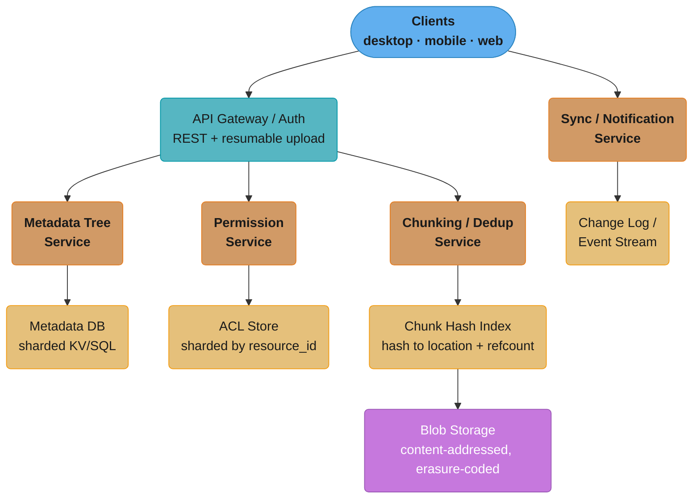
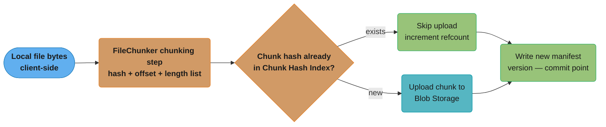
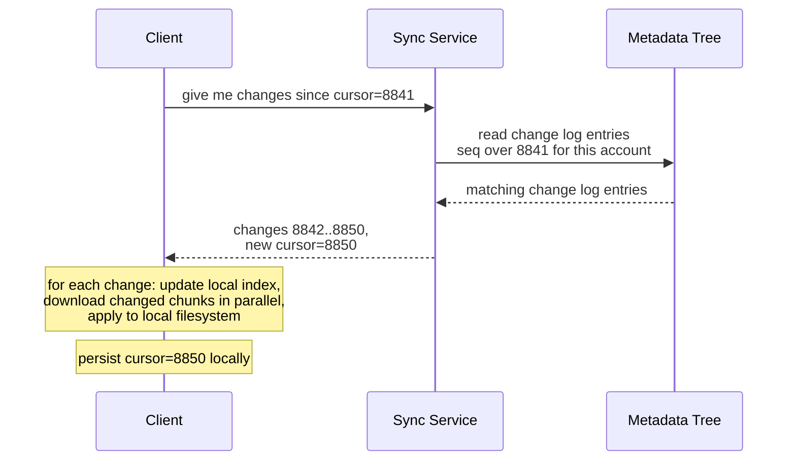
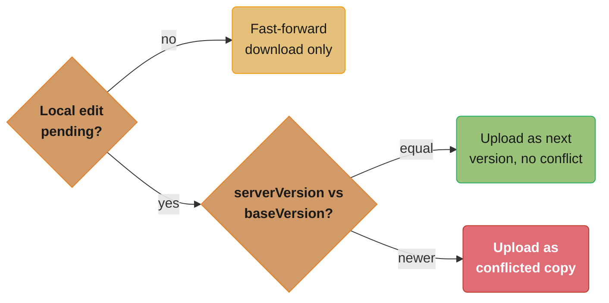
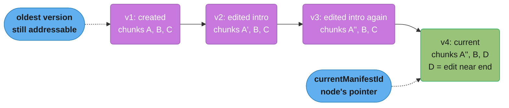
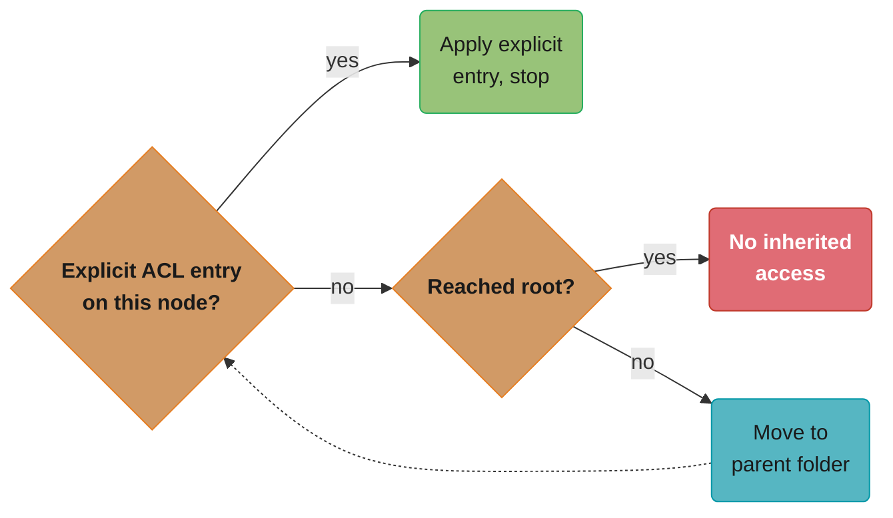
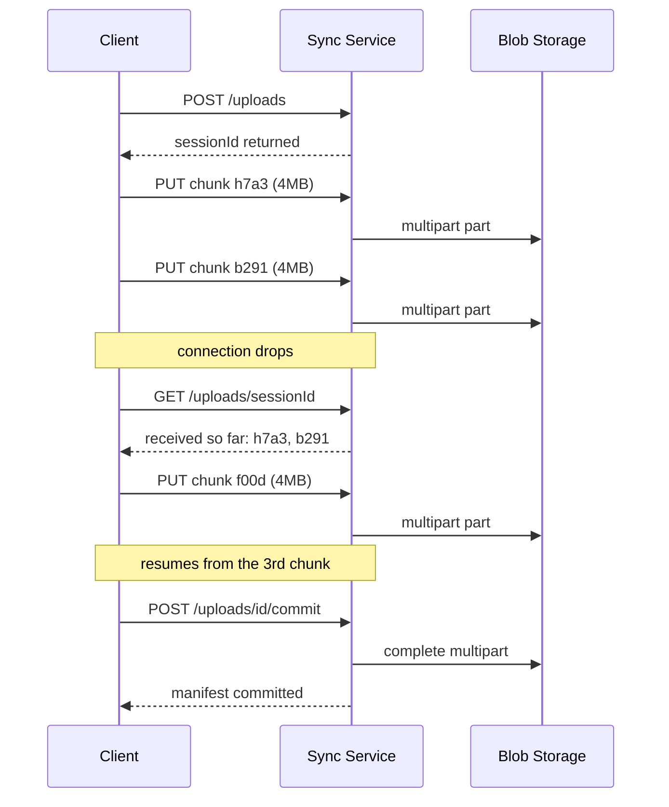

# System Design: Google Drive

## Intuition

> **Design intuition**: Google Drive is two systems wearing one UI: underneath is a **dumb, durable blob store** — content-addressed chunks of bytes, replicated or erasure-coded, that don't know or care what a "file" or "folder" is (cross-ref [`./design_object_storage_s3.md`](./design_object_storage_s3.md)) — and on top of that is a **smart, mutable, hierarchical metadata tree** that knows everything: which chunks make up which version of which file, who owns it, who it's shared with, where it sits in a folder hierarchy, and what it looked like five edits ago. The blob layer almost never changes once a chunk is written — it is, in effect, append-only. The metadata tree changes constantly: every rename, move, share, permission change, sync cursor advance, and "restore version 12" is a metadata-only write. Almost every interesting problem in this case study — sync, sharing, versioning, deduplication, conflict resolution — lives in the metadata tree, not in the bytes.

**Key insight**: The single hardest tradeoff is **how much intelligence to push into the chunking layer versus the metadata layer**. If a file is chunked at a fixed 4MB boundary, a single-byte edit at the start of a 1GB file shifts every subsequent byte and invalidates every chunk hash after the edit point — destroying the dedup and incremental-sync benefits the chunking scheme exists to provide. Content-defined chunking (boundaries determined by the data itself, via a rolling hash) fixes this at the cost of variable chunk sizes and a heavier chunking computation on the client. Meanwhile, the metadata tree has its own hard problem: two devices edit the *same file* while offline, and both reconnect — this is a coarser-grained cousin of the concurrent-editing problem Google Docs solves with Operational Transformation (cross-ref [`./design_google_docs.md`](./design_google_docs.md)), but Drive resolves it at the *file* level (last-writer-wins plus a "conflicted copy," §4.4) rather than the *character/operation* level, because most files in Drive (PDFs, images, zip archives, spreadsheets edited by desktop apps) have no well-defined merge operation below the level of "two whole versions now exist."

---

## 1. Requirements Clarification

### Functional Requirements

- **Upload / download files**: store arbitrary files (0 bytes to many GB) under a user's account, addressable by a file ID, with support for resumable uploads/downloads of large files
- **Folder hierarchy**: organize files into a tree of folders, supporting create, rename, move (including moving a folder with its entire subtree), and delete
- **Sync across devices**: a desktop/mobile client maintains a local mirror of (some subset of) a user's Drive; changes made on one device propagate to all other signed-in devices within seconds
- **Sharing and permissions**: share a file or folder with another user (or via a public link) as `viewer`, `commenter`, or `editor`; permissions on a folder are inherited by its contents unless explicitly overridden
- **Version history**: every saved change to a file creates a new version; users can view a list of past versions and restore any of them, without losing the ability to "redo" back to the current version
- **Search**: find files by name, content (for text-extractable formats), owner, and metadata (file type, last-modified date, shared-with-me)
- **Offline access**: a user can mark files/folders for offline availability; the client caches their bytes locally and queues edits made while offline for upload on reconnect

### Non-Functional Requirements

- **Massive scale**: design for roughly **1 billion users**, with **hundreds of millions of daily active users (DAU)**
- **Durability**: file bytes must meet the same **11-nines durability** bar as the underlying object store (cross-ref [`./design_object_storage_s3.md`](./design_object_storage_s3.md) §1) — losing a user's files is an unacceptable failure mode regardless of how rarely it happens
- **Low-latency metadata operations**: listing a folder's contents, renaming a file, or checking a permission must complete in tens of milliseconds — these are by far the highest-frequency operations (§2) and must never be gated on blob-storage latency
- **Sync freshness**: a change made on Device A should be visible (as a sync event) on Device B within **a few seconds** under normal connectivity, without polling so aggressively that it burns mobile battery/data
- **Bandwidth efficiency**: editing one paragraph of a 50MB document must not re-upload all 50MB — only the changed portion of the file should traverse the network (§4.1, the entire reason Dropbox built a block-level sync protocol)
- **Storage efficiency**: identical content uploaded by different users (a popular PDF, a shared stock photo, a common installer) should be stored once on disk, not once per uploader (§4.1)
- **Consistency for metadata**: a rename, move, or permission change must be immediately visible to that same user's other sessions and to anyone the file is shared with — the metadata tree needs read-after-write consistency even though the underlying blobs can lag slightly behind

### Out of Scope

- **Real-time co-editing of a single document's content** — that is Google Docs' problem (Operational Transformation / CRDTs over a live document model, cross-ref [`./design_google_docs.md`](./design_google_docs.md)). This design covers Drive as a *file container* — Docs/Sheets/Slides files happen to live in Drive's metadata tree, but their *content* is edited through a completely different subsystem (§6).
- **The blob storage engine itself** — erasure coding, placement groups, storage-node durability math, and the metadata-index sharding model for the underlying object store are covered in depth in [`./design_object_storage_s3.md`](./design_object_storage_s3.md) and are cross-referenced rather than re-derived here.
- **Malware/virus scanning and DLP (data loss prevention) pipelines** — real products run uploaded content through scanning pipelines before making it shareable; this is an important but largely orthogonal pipeline bolted onto the upload path, not a core architectural concern of sync/sharing/versioning.

---

## 2. Scale Estimation

### Users and Storage Footprint

- **1 billion total users**, **300 million DAU** (a realistic ~30% DAU/total ratio for a productivity tool used a few times a week by most users, daily by a smaller "power user" core)
- Average storage used per user: **~5 GB** (heavily skewed — most users are well under their free quota of 15GB, a smaller fraction of paid users hold hundreds of GB to multiple TB)
- Total storage under management: `1,000,000,000 x 5 GB` ~= **5 exabytes (5,000 PB)** of logical data before any dedup savings

### File Size Distribution

| Size Band | Example Files | Approx. Share of File *Count* | Approx. Share of Logical *Bytes* |
|---|---|---|---|
| < 100 KB | Docs/Sheets/Slides (Google-native, stored as structured data, not blobs), config files, small images | ~55% | ~2% |
| 100 KB - 5 MB | Photos, PDFs, presentations, small spreadsheets | ~30% | ~15% |
| 5 MB - 100 MB | High-res photos/scans, large presentations, audio files | ~12% | ~28% |
| 100 MB - 1 GB | Videos, design files, datasets | ~2.5% | ~25% |
| > 1 GB | Backups, VM images, raw video, large datasets | ~0.5% | ~30% |

The practical consequence (mirrors §2 of [`./design_object_storage_s3.md`](./design_object_storage_s3.md)): the **largest 0.5% of files by count account for ~30% of total bytes**, and the **chunking pipeline** (§4.1) is what makes both ends of this distribution efficient — tiny files become single-chunk objects with near-zero overhead, while multi-GB files are split into thousands of independently-addressable, independently-resumable, independently-deduplicatable chunks.

### Operation Volume

- **Metadata operations** (list folder, get file metadata, check permission, rename, move) dominate request *volume*: estimate **2 billion metadata reads/day** and **200 million metadata writes/day** across the fleet -> roughly **23,000 metadata reads/sec average** and **2,300 metadata writes/sec average**, with peaks (business-hours concentration) of **3-4x average**, i.e., roughly **90,000 reads/sec and 9,000 writes/sec at peak**
- **Metadata read:write ratio is roughly 10:1** — every "open Drive," "list this folder," "load file properties," and sync-cursor poll is a read; only an actual edit, rename, move, share, or new version is a write
- **Sync events**: with 300M DAU and an average sync client checking for updates (via push notification or long-poll, §4.3) roughly once every few seconds while active, plus periodic background syncs for idle clients -> on the order of **5-10 million sync-check operations/sec** at peak across the fleet — almost all of which resolve to "no changes since your cursor" and are answered from the metadata tree without touching blob storage
- **Upload/download volume**: roughly **50 million file uploads/day** and **500 million file downloads/day** (a ~10:1 read:write ratio consistent with most content-serving systems) -> ~580 uploads/sec average, ~5,800 downloads/sec average, both ~3-4x at peak

### Chunking and Dedup Numbers (Preview — full detail in §4.1)

- Chunk size: **4 MB** average (content-defined chunking produces a distribution centered on this target, §4.1)
- At 5 EB logical data / 4MB average chunk size ~= **~1.25 trillion chunks** before dedup
- Real-world cross-user dedup ratios for consumer cloud storage are commonly cited in the **20-30%** range (popular shared documents, software installers, stock media, and — critically — **multiple copies of the same file uploaded by the same user** to different folders) -> realistic **effective storage after dedup: ~3.5-4 EB**, a savings of roughly **1-1.5 EB** at this scale
- Chunk-hash metadata: each chunk's SHA-256 hash is 32 bytes; at 1.25 trillion *unique-after-dedup* chunks (~1 trillion after a 20% dedup ratio), the **chunk-hash index** alone is on the order of `1,000,000,000,000 x (32 bytes hash + ~40 bytes location/refcount metadata)` ~= **~72 TB** — itself a serious distributed-index problem, addressed by the same sharded-KV approach as the object store's metadata index (cross-ref [`./design_object_storage_s3.md`](./design_object_storage_s3.md) §4.1)

---

## 3. High-Level Architecture



Clients talk to two front doors — the API Gateway for CRUD/upload and the Sync/Notification Service for change events — and every downstream service owns its own store, keeping the hot metadata path decoupled from the durable blob path.

### Request Flow

1. **Upload**: the client (or the chunking pipeline running client-side, §4.1) splits the file into content-defined chunks, computes a SHA-256 hash per chunk, and asks the **Chunking/Dedup Service** which chunks already exist in the **Chunk Hash Index**. Only *new* chunks are actually uploaded to **Blob Storage** (cross-ref [`./design_object_storage_s3.md`](./design_object_storage_s3.md)). Once all chunks are durable, the **Metadata Tree Service** writes a new versioned chunk-list manifest for the file (§4.5) — this metadata write is the commit point; the upload isn't "done" from the user's perspective until the manifest points to it.
2. **Download**: the client requests a file's metadata (chunk-list manifest) from the **Metadata Tree Service**, then fetches each chunk directly from **Blob Storage** by its content hash — chunks can be fetched in parallel, out of order, and resumed independently if interrupted.
3. **Browse / list folder**: the overwhelming majority of requests (§2's 10:1 read:write ratio) are reads against the **Metadata Tree Service** — "what's in this folder," "what's this file's name/size/modified-date" — answered entirely from the **Metadata DB** without ever touching blob storage. This is why the metadata tree has its own caching layer (cross-ref [`../caching/README.md`](../caching/README.md)).
4. **Sync**: each client holds a **cursor** (a logical timestamp / sequence number) representing "the last change I've seen." The **Sync/Notification Service** either pushes a "something changed past your cursor" notification (via a persistent connection, cross-ref [`../../backend/websockets_and_sse/README.md`](../../backend/websockets_and_sse/README.md)) or the client periodically polls; either way, the client then asks the Metadata Tree Service for "all changes since cursor X," applies them locally, downloads any new/changed chunks, and advances its cursor (§4.3).
5. **Share**: granting access writes an ACL entry to the **Permission Service**, scoped to a specific metadata-tree node (file or folder). The shared item then appears in the recipient's metadata tree as a reference to the *same underlying node* — no blobs or metadata are duplicated (§4.4).
6. **Version restore**: the **Metadata Tree Service** looks up a prior chunk-list manifest for the file (manifests are append-only and versioned, §4.5) and writes it as the *new current* manifest — a metadata-only operation; no chunk is re-uploaded, because the chunks referenced by the old manifest are still in Blob Storage (they're only garbage-collected once *no* manifest, current or historical-within-retention, references them).

---

## 4. Component Deep Dives

### 4.1 Chunking, Content-Addressed Storage, and Deduplication

The foundational question: **how do we turn an arbitrary file into a set of immutable, content-addressed pieces that can be individually deduplicated, individually re-synced, and individually downloaded in parallel?**

#### Fixed-Size vs. Content-Defined Chunking

**Fixed-size chunking** (split every N bytes, e.g., 4MB) is simple but has a fatal flaw for sync: inserting or deleting even **one byte** near the start of a file shifts every byte after it, so every chunk boundary after the edit point moves — every subsequent chunk gets a different hash, even though most of the file's *content* is unchanged. A single-character edit at the top of a 1GB file would, under fixed-size chunking, invalidate ~250 chunks (at 4MB each) instead of the 1-2 chunks that actually contain the edit.

**Content-defined chunking (CDC)** solves this by choosing chunk boundaries based on the *content itself*, using a rolling hash (e.g., a Rabin fingerprint or Buzhash) over a sliding window of bytes. A boundary is declared wherever the rolling hash's low N bits equal a fixed pattern — purely a function of the local bytes, independent of position in the file. The practical effect: inserting a byte shifts the rolling-hash window forward by one position, but **as soon as the window slides past the inserted byte, the hash sequence "resynchronizes"** with what it would have been without the insertion — so only the chunk(s) containing the edit change; everything before and after converges back to the original chunk boundaries.

```java
package com.rutik.systemdesign.hld.case_studies.drive;

import java.security.MessageDigest;
import java.security.NoSuchAlgorithmException;
import java.util.ArrayList;
import java.util.List;

/**
 * FileChunker splits a file's bytes into content-defined chunks using a
 * rolling-hash boundary rule (a simplified Rabin-Karp-style rolling hash),
 * computes a SHA-256 content hash per chunk, and produces an ordered
 * "chunk-list manifest" representing one version of the file.
 *
 * Content-defined chunking means a small edit near the START of a large
 * file only changes the chunk(s) containing the edit -- everything after
 * the edit "resynchronizes" to the same boundaries as before, because
 * boundary decisions depend only on a local window of bytes, not on
 * absolute file position.
 */
public class FileChunker {

    private static final int MIN_CHUNK_SIZE = 2 * 1024 * 1024;   // 2 MB floor
    private static final int TARGET_CHUNK_SIZE = 4 * 1024 * 1024; // 4 MB target average
    private static final int MAX_CHUNK_SIZE = 8 * 1024 * 1024;   // 8 MB ceiling
    private static final int WINDOW_SIZE = 64;                    // rolling-hash window in bytes

    // Boundary mask tuned so that, on average, ~1 in (TARGET_CHUNK_SIZE) byte
    // positions satisfies (rollingHash & MASK) == 0 -- i.e., chunk boundaries
    // occur, on average, every TARGET_CHUNK_SIZE bytes, but their EXACT
    // position depends only on local content.
    private static final long BOUNDARY_MASK = (TARGET_CHUNK_SIZE - 1);

    /**
     * Splits `fileBytes` into content-defined chunks and returns an ordered
     * manifest: a list of (offset, length, sha256Hash) tuples describing
     * one version of the file. This manifest IS the unit that the metadata
     * tree (§4.2) versions (§4.5) -- the bytes themselves are uploaded
     * separately, keyed by hash, and deduplicated against the chunk hash
     * index (this method does not perform the dedup lookup itself).
     */
    public ChunkListManifest chunk(byte[] fileBytes) {
        List<ChunkRef> chunks = new ArrayList<>();
        int start = 0;
        long rollingHash = 0;

        for (int i = 0; i < fileBytes.length; i++) {
            rollingHash = updateRollingHash(rollingHash, fileBytes, i);
            int currentLength = i - start + 1;

            boolean atBoundary = (rollingHash & BOUNDARY_MASK) == 0;
            boolean mustSplit = currentLength >= MAX_CHUNK_SIZE;
            boolean canSplit = currentLength >= MIN_CHUNK_SIZE;

            if (mustSplit || (atBoundary && canSplit) || i == fileBytes.length - 1) {
                int end = i + 1; // exclusive
                byte[] chunkBytes = java.util.Arrays.copyOfRange(fileBytes, start, end);
                String hash = sha256Hex(chunkBytes);
                chunks.add(new ChunkRef(hash, start, chunkBytes.length));
                start = end;
                rollingHash = 0; // boundary resets the rolling window
            }
        }
        return new ChunkListManifest(chunks, fileBytes.length);
    }

    /**
     * Simplified rolling hash: a Buzhash-style accumulation over the last
     * WINDOW_SIZE bytes. Production systems (e.g., rsync, Dropbox's block
     * server, restic, Borg) use carefully-tuned variants (Rabin fingerprints,
     * Buzhash, or Gear) chosen for speed and boundary-distribution quality --
     * the principle (boundary = function of local content) is what matters
     * for this case study, not the exact polynomial.
     */
    private long updateRollingHash(long previousHash, byte[] data, int index) {
        long shifted = (previousHash << 1) | (previousHash >>> 63); // rotate
        long incoming = data[index] & 0xFF;
        if (index >= WINDOW_SIZE) {
            long outgoing = data[index - WINDOW_SIZE] & 0xFF;
            shifted ^= rotateLeft(outgoing, WINDOW_SIZE % 64);
        }
        return shifted ^ incoming;
    }

    private long rotateLeft(long value, int bits) {
        return (value << bits) | (value >>> (64 - bits));
    }

    private String sha256Hex(byte[] data) {
        try {
            MessageDigest digest = MessageDigest.getInstance("SHA-256");
            byte[] hash = digest.digest(data);
            StringBuilder sb = new StringBuilder(hash.length * 2);
            for (byte b : hash) sb.append(String.format("%02x", b));
            return sb.toString();
        } catch (NoSuchAlgorithmException e) {
            throw new IllegalStateException(e);
        }
    }

    /** One chunk's identity (content hash) and position within the file. */
    public record ChunkRef(String sha256Hash, long offset, int length) {}

    /** An ordered list of chunks representing one version of a file's bytes. */
    public record ChunkListManifest(List<ChunkRef> chunks, long totalSize) {
        public int chunkCount() {
            return chunks.size();
        }
    }
}
```

#### The Dedup Pipeline



Most re-chunked hashes already exist in the index, so only the genuinely new chunks touch Blob Storage — this is the mechanism behind editing one paragraph and uploading only a chunk or two (§4.1's headline efficiency property).

The key efficiency property: when a user edits one paragraph of a 50MB document, the **client re-chunks the file locally**, computes hashes for all chunks, and the *vast majority* of those hashes are unchanged from the previous version (because CDC resynchronizes around the edit) — the dedup lookup against the Chunk Hash Index returns "already exists" for nearly all of them, and only the 1-2 chunks actually touched by the edit are uploaded. This is the architectural mechanism that satisfies the §1 NFR "editing one paragraph must not re-upload all 50MB" — and it is the same mechanism, applied per-user, that produces the cross-user dedup savings estimated in §2.

#### Cross-File and Cross-User Dedup

Because chunks are addressed purely by `sha256(bytes)`, **the Chunk Hash Index has no concept of "owner"** — if two different users upload byte-identical files (a popular conference PDF, a stock company logo, a software installer both downloaded from the same vendor), their chunk hashes collide, and the second uploader's chunks are never physically duplicated in Blob Storage; only a refcount increments. This is the source of the **20-30% dedup ratio** estimated in §2. The privacy implication is subtle but important: dedup at the storage layer must **never leak whether another user has the same content** — the dedup check happens server-side, the refcount is invisible to clients, and a chunk's *existence* in the index reveals nothing about *who* uploaded it (cross-ref [`../security_and_auth/README.md`](../security_and_auth/README.md) for the broader principle that storage-layer optimizations must not become a side-channel).

### 4.2 The Metadata Tree

If chunking answers "how are bytes stored," the metadata tree answers "what does this user's Drive *look like*" — and it is, by volume (§2's 10:1 read:write ratio), the busiest part of the system.

#### Data Model: Adjacency List with `parent_id`

Each file or folder is a **node** in a tree:

| Field | Purpose |
|---|---|
| `nodeId` | Globally unique, immutable identifier — never reused even after delete |
| `parentId` | The containing folder's `nodeId` (null for "My Drive" root) |
| `name` | Display name — mutable; renaming is a single-field update |
| `type` | `FILE` or `FOLDER` |
| `ownerId` | The account that owns this node (for billing/quota purposes) |
| `currentManifestId` | Pointer to the current version's chunk-list manifest (§4.5) — null for folders |
| `createdAt`, `modifiedAt`, `size` | Standard metadata, `size` derived from the current manifest |
| `trashedAt` | Soft-delete marker — non-null means "in trash," subject to a retention-window GC |

**Why `parent_id` (adjacency list) over materialized path**: a materialized path (`/Documents/Work/Q3/report.docx` stored as a literal string column) makes "list children of X" a prefix-match query and "show full path" trivial, but makes **renaming or moving a folder an operation whose cost is proportional to the size of the subtree** — every descendant's path string must be rewritten. With `parent_id`, **renaming or moving a folder is a single-row update** — only the moved folder's own `parentId` (or `name`) changes; every descendant's `parentId` still points to the same (unmoved, unrenamed) folder `nodeId`, so the *effective* path of every descendant changes implicitly without writing a single descendant row. This is the concrete reason "moves are metadata-only operations, regardless of subtree size" holds: moving a 10,000-file folder and moving a single file are both **one row update** in the adjacency-list model.

The cost is that "list the full path to root" or "list every descendant of folder X" requires walking the tree — either recursively (a chain of `parentId` lookups, bounded by tree depth, which in practice rarely exceeds a few dozen levels) or via a denormalized **closure table** / **ancestor index** that's eagerly maintained for fast "all descendants" queries (used heavily by the Permission Service, §4.4, to answer "does this user have access to this deeply-nested file via an ancestor share").

```
Adjacency-list tree (parent_id), illustrating a move:

BEFORE:                          AFTER moving "Q3/" under "Archive/":
My Drive (root)                  My Drive (root)
 |- Documents/                    |- Documents/
 |   |- Work/                     |   |- Work/  (Q3's parentId now
 |   |   |- Q3/  <-- moving this  |   |       points to Archive,
 |   |   |   |- report.docx       |   |       NOT rewritten itself)
 |   |   |   |- budget.xlsx       |
 |- Archive/                      |- Archive/
                                   |   |- Q3/   <-- ONE row updated:
                                   |       |- report.docx   Q3.parentId = Archive.id
                                   |       |- budget.xlsx   report.docx and budget.xlsx
                                                             rows are UNTOUCHED -- their
                                                             parentId still = Q3.id
```

#### Sharding the Metadata Tree

At the scale in §2 (1B users, 200M+ metadata writes/day), the metadata tree is **sharded by a key derived from the owning account** (cross-ref [`../../database/sharding_and_partitioning/README.md`](../../database/sharding_and_partitioning/README.md)) — every node a given user owns lives in the same shard, so "list my Drive root," "list folder X's children" (where X is owned by the requester), and "get my recent files" are almost always **single-shard queries**. The hard case is **shared files**: a node owned by User A but shared with User B must be reachable from User B's "Shared with me" view without that node living in User B's shard. This is resolved by storing **share references** — lightweight pointer records, keyed by the *recipient's* shard, that point at `(ownerShard, nodeId)` — rather than copying or re-sharding the underlying node (§4.4 covers this in depth).

### 4.3 Sync Protocol

A sync client (desktop or mobile) maintains:

1. A **local index**: a database mapping local file paths to `(nodeId, manifestId/version, lastSyncedHash)` — essentially a local cache of the relevant slice of the metadata tree plus a record of which chunks are already present on disk.
2. A **cursor**: an opaque, monotonically-increasing token representing "the last change this client has processed" — conceptually a position in a per-account **change log** (cross-ref [`../event_sourcing_cqrs/README.md`](../event_sourcing_cqrs/README.md)), which is an append-only stream of `(timestamp, nodeId, changeType, newManifestId/newParentId/newName, ...)` records produced by every metadata write.

#### Delta Sync Loop



The client's only job on each cycle is to compare cursors and pull the delta — the push notification is just a wake-up nudge (§4.3) that triggers this exact round-trip.

**Push vs. poll**: rather than the client polling "anything new?" every few seconds (battery- and bandwidth-expensive at 300M DAU, §2), the **Sync/Notification Service** holds a long-lived connection per active client (long-poll or a persistent websocket, cross-ref [`../../backend/websockets_and_sse/README.md`](../../backend/websockets_and_sse/README.md)) and pushes a lightweight "something changed for your account, your cursor is now stale" signal the instant a metadata write occurs. The client then performs **one** delta-sync round-trip to fetch the actual changes — the push is just a "wake up and ask" nudge, not the payload itself. Idle clients (laptop closed, app backgrounded) fall back to periodic polling on reconnect, using the same cursor-based delta mechanism — there is exactly **one** sync algorithm regardless of how the client was notified to run it.

**Local edits while online**: a local file-system watcher detects a changed file, runs it through the **FileChunker** (§4.1), performs the dedup-check-and-upload pipeline, and writes a new manifest version — this *is* a metadata write, which appends to the same per-account change log that other devices' sync loops are reading from. A device's own changes therefore flow back to it (filtered out by comparing `originatingDeviceId`) the same way another device's changes do — there's no separate "echo suppression" mechanism beyond that filter.

### 4.4 Conflict Resolution — File-Level, Not Operation-Level

§1 explicitly scopes out character-level concurrent editing (Google Docs' problem). Drive's conflict is coarser: **two devices have the same file offline, both make changes, both reconnect.**

#### Version Vectors and the "Conflicted Copy"

Each device tracks, per file, the **manifest version it last synced** (`baseVersion`). On reconnect:

- **Fast-forward (no conflict)**: if the server's current manifest version for the file is still `baseVersion` (nobody else changed it while this device was offline), the device's new manifest becomes the next version — a simple linear append, no conflict.
- **Divergence (conflict)**: if the server's current manifest version is *newer* than `baseVersion` — meaning another device (or the same user from a different device) already pushed a new version while this device was offline — the device's locally-edited version cannot simply become "the next version," because that would silently discard the intervening edit. Drive's resolution: **both versions are kept**. The server's current version remains the file's "real" version under its original name; the reconnecting device's version is uploaded as a **new file** with a name like `report (conflicted copy 2026-06-12).docx`, placed in the same folder.



This is `SyncConflictResolver.resolve()` (below) as a decision tree: a conflicted copy is created only when there is a real pending edit and the server has moved past this device's `baseVersion` — never from a stale re-check with nothing to push, which is exactly the gate War Story 2's bug skipped.

```java
package com.rutik.systemdesign.hld.case_studies.drive;

import java.util.Objects;

/**
 * SyncConflictResolver compares a device's locally-known file state
 * (the version it last successfully synced, "baseVersion") against the
 * server's current version for that file, and decides whether the
 * device's pending local edit can fast-forward cleanly or must be
 * uploaded as a "conflicted copy."
 *
 * This is FILE-LEVEL conflict resolution -- the unit of conflict is
 * "this whole file's bytes," not an individual character/operation
 * (contrast with design_google_docs.md's CRDT/OT model, which resolves
 * conflicts at the character/operation granularity because a text
 * document has a well-defined notion of "merge these two edits").
 * Most file types in Drive (binary formats, PDFs, zips, images, videos)
 * have no such well-defined merge -- "keep both, let the user reconcile"
 * is the only generally-correct option.
 */
public class SyncConflictResolver {

    /**
     * @param baseVersion     the manifest version this device last synced
     *                        for this file (its "I started from here")
     * @param serverVersion   the server's CURRENT manifest version for
     *                        this file at the moment of reconnect
     * @param localEditPending true if this device has an unsynced local
     *                          edit to upload
     */
    public Resolution resolve(long baseVersion, long serverVersion, boolean localEditPending) {
        if (!localEditPending) {
            // Nothing to push -- just fast-forward the local copy to
            // whatever the server has (a plain delta-sync download, §4.3).
            return Resolution.fastForwardDownload();
        }

        if (serverVersion == baseVersion) {
            // No one else changed the file while we were offline.
            // Our pending edit becomes the next version -- a clean,
            // linear append. No conflict.
            return Resolution.uploadAsNextVersion(baseVersion + 1);
        }

        if (serverVersion > baseVersion) {
            // Someone else (possibly this same user, from another device)
            // pushed a newer version while we were offline. Our edit was
            // made against a now-STALE base -- uploading it as "the next
            // version" would silently overwrite their change.
            //
            // Resolution: keep BOTH. The server's current version stays
            // as-is under the original name. Our locally-edited version
            // is uploaded as a NEW file -- a "conflicted copy" -- so no
            // user's edits are ever silently lost.
            return Resolution.uploadAsConflictedCopy();
        }

        // serverVersion < baseVersion should be impossible (manifest
        // versions are monotonically increasing and server-assigned) --
        // defensively treat as a fast-forward-download + retry.
        return Resolution.fastForwardDownload();
    }

    public record Resolution(Action action, Long newVersionNumber) {
        public static Resolution fastForwardDownload() {
            return new Resolution(Action.FAST_FORWARD_DOWNLOAD, null);
        }
        public static Resolution uploadAsNextVersion(long nextVersion) {
            return new Resolution(Action.UPLOAD_AS_NEXT_VERSION, nextVersion);
        }
        public static Resolution uploadAsConflictedCopy() {
            return new Resolution(Action.UPLOAD_AS_CONFLICTED_COPY, null);
        }
    }

    public enum Action { FAST_FORWARD_DOWNLOAD, UPLOAD_AS_NEXT_VERSION, UPLOAD_AS_CONFLICTED_COPY }

    @Override
    public String toString() {
        return Objects.toString(this);
    }
}
```

**Why "keep both" instead of last-writer-wins overwrite**: a pure last-writer-wins policy (whichever device reconnects second simply overwrites) is *simpler* but **silently destroys data** — the first device's edits vanish with no error, no notification, and no way to recover them short of version history (§4.5), which the user may not think to check until much later. "Conflicted copy" trades a small UX cost (the user now has two files and must manually reconcile/delete one) for the much larger guarantee that **no edit a user believes was saved is ever silently lost**. This mirrors the convergence-above-all principle from [`./design_google_docs.md`](./design_google_docs.md) §"Key insight" — but where Google Docs achieves convergence by *merging* (every replica ends up with the same single document), Drive achieves the no-data-loss guarantee by *forking* (every edit ends up *somewhere*, even if that means two files instead of one). Both are valid resolutions to "don't lose work"; the right one depends on whether the content type has a meaningful merge operation.

### 4.5 Version History as an Append-Only Manifest Chain

Because every edit produces a **new chunk-list manifest** (§4.1) rather than mutating an existing one, version history falls out almost for free:



Chunk B never changes across all four versions and is simply referenced again by each manifest instead of being recopied — this is why version history is nearly free once chunks are content-addressed.

- **Each manifest is a complete, immutable description of one version** — a list of `(chunkHash, offset, length)` tuples. Chunks shared between versions (B and C above never changed) are referenced by *both* manifests' chunk lists — there is no "diff" stored; the dedup mechanism (§4.1) means an unchanged chunk simply appears in multiple manifests with no duplication of bytes.
- **Restoring a previous version** (e.g., "restore v2") is implemented exactly like a metadata-tree move (§4.2): the node's `currentManifestId` pointer is updated to point at v2's manifest, and a **new version (v5) is appended that is a copy of v2's chunk list** — restore is itself a forward-moving operation (never a destructive rewind), which (a) preserves v3 and v4 in history for "undo the restore," and (b) requires **zero chunk re-upload**, since v2's chunks are all still in Blob Storage (they were never garbage-collected, because v2's manifest still referenced them until — and even after — v4 became current).
- **Retention and GC**: a chunk becomes garbage-collection-eligible only when **no manifest within the retention window** (e.g., 30 days of version history, or "forever" for paid tiers with longer retention) references it. This is a reference-counted GC problem structurally identical to the object store's tombstone-and-sweep approach (cross-ref [`./design_object_storage_s3.md`](./design_object_storage_s3.md) §4.6), with the added wrinkle that a chunk's refcount spans **both** "how many manifests reference it" **and** "how many *different users'* files reference it" (§4.1's cross-user dedup) — a chunk is only deleted from Blob Storage when its global refcount across the entire Chunk Hash Index drops to zero.

### 4.6 Sharing and Permissions

#### ACL Model

Every metadata-tree node (§4.2) can have an **ACL** — a list of `(principal, role)` pairs, where `principal` is a user, a group, or "anyone with the link," and `role` is `viewer`, `commenter`, or `editor`. ACLs are stored in a separate **Permission Service / ACL store**, keyed by `nodeId`, rather than inline on the node — this keeps the (hot, frequently-read) metadata-tree records small and lets permission checks be cached and invalidated independently of metadata-tree reads (cross-ref [`../../database/database_caching_patterns/README.md`](../../database/database_caching_patterns/README.md)).

#### Inherited vs. Explicit Permissions

- **Inherited**: by default, a file's effective permissions are the **union of explicit ACL entries on the file itself and on every ancestor folder up to the root**. Sharing a folder with `editor` access grants `editor` access to every file and subfolder inside it, including ones added *after* the share was created — because the check walks the `parentId` chain (§4.2) at query time, not at share time.
- **Explicit override**: a specific file inside a shared folder can have its *own* ACL entry that is **more restrictive** than the inherited one (e.g., a folder shared as `editor` with a team, but one sensitive file inside it explicitly restricted to `viewer` for everyone except the owner) — explicit entries on a node take precedence over inherited entries from ancestors for that principal.



The nearest explicit entry wins: this general ancestor walk is exactly what the worked trace below executes for Bob and `report.docx`, stopping at "Work/" because that is the first ancestor with an explicit entry.

```
Permission check for (userId=Bob, nodeId=report.docx, action=EDIT):

  1. Look up explicit ACL entries on report.docx for Bob -> none found
  2. Walk parentId chain: report.docx -> Q3/ -> Work/ -> Documents/ -> root
  3. At "Work/", find ACL entry: (Bob, editor) -- granted when the folder
     was shared
  4. No MORE-RESTRICTIVE explicit entry on report.docx itself for Bob
  5. RESULT: Bob has EDIT access to report.docx, via inheritance from "Work/"

  -- This check is the same regardless of whether report.docx existed
     at the time "Work/" was shared -- it's evaluated at READ time by
     walking ancestors, which is why files added to a shared folder
     later are automatically accessible without any additional share
     action.
```

The ancestor walk in step 2 is the operation the **closure table / ancestor index** mentioned in §4.2 exists to make fast — without it, checking access to a deeply-nested file requires `O(depth)` sequential lookups; with it, "all ancestor folder IDs of node X" is a single indexed query.

#### Shared Items in the Recipient's Tree

When User A shares a file with User B, the file does **not** get copied into User B's metadata-tree shard, and its chunks are **not** duplicated in Blob Storage. Instead, a lightweight **share reference** — `(recipientId=B, sharedNodeId=fileX, ownerShard=A's shard)` — is written to a "Shared with me" index that's queried (and shard-local to B) when B opens their "Shared with me" view. Resolving the share reference into displayable metadata (name, size, owner, last-modified) requires one cross-shard lookup into A's shard for `fileX`'s node record — a small, bounded fan-out (one lookup per shared item displayed), not a data-duplication problem. If A later revokes the share (removes the ACL entry), B's share reference becomes a dangling pointer that resolves to "access denied" on the next permission check (§4.6) — the reference itself can be lazily cleaned up, but the **ACL check at read time is the actual enforcement point**, exactly as in [`./design_google_docs.md`](./design_google_docs.md) §4.6's "server-side enforcement is the actual security boundary" principle.

### 4.7 Resumable Uploads, Storage Quota, and Trash

#### Resumable/Multipart Uploads for Large Files

A 2GB video cannot be uploaded as one HTTP request without risking a full restart on any network blip — and on a mobile connection, a multi-minute upload *will* be interrupted. Because §4.1 already splits every file into independent 4-8MB chunks before upload, the chunk boundary doubles as the resumability boundary: the client opens an **upload session** (`POST /uploads -> {sessionId}`), then uploads each chunk as its own multipart-upload part against Blob Storage's [multipart upload API](./design_object_storage_s3.md) (§4.1), tagged with that chunk's content hash.



Because the chunk boundary already doubles as the resumability boundary, reconnecting only has to diff two small hash lists — it never re-uploads a chunk the server already acknowledged.

On resume, the client calls `GET /uploads/{sessionId}` to learn which chunk hashes the session has already durably received, diffs that against its local chunk list (§4.1), and uploads only the remainder — an interrupted upload of a 2GB file loses at most one in-flight 4-8MB chunk, not the whole transfer. The session itself is a row in the metadata database with a TTL (e.g., 7 days); an abandoned session's already-uploaded chunks are still content-addressed and reference-counted (§4.1), so they aren't wasted if the same file is uploaded again later — they're simply orphaned until garbage collection (below) reclaims them.

#### Storage Quota Enforcement: Logical Size, Not Deduplicated Size

Deduplication (§4.1) means the *physical* bytes Blob Storage stores for a popular file (a viral PDF uploaded by 10,000 users) are a tiny fraction of the *logical* bytes those 10,000 accounts believe they're using. Quota enforcement deliberately ignores this distinction: each account's quota usage is the **sum of the logical sizes of every chunk referenced by that account's manifests**, regardless of whether those chunks are physically shared with other accounts. Charging the deduplicated (shared) size instead would make one account's quota depend on whether *other, unrelated* accounts happen to have uploaded the same bytes — a privacy leak (it would let an account infer that a file it uploaded already existed elsewhere) and a fairness problem (quota could fluctuate based on strangers' uploads). The **per-account quota counter** is therefore maintained independently of the **per-chunk reference count** (§4.1): uploading a file increments both the account's logical-usage counter (by the file's full size) and each new chunk's reference count (by 1, or not at all if the chunk already existed) — two separate counters serving two separate concerns (billing fairness vs. physical storage reclamation).

#### Trash and Garbage Collection

Deleting a file is a **two-phase, soft-then-hard delete**, mirroring the reference-counting lifecycle from §4.1. Phase 1 ("move to Trash") sets a `deletedAt` timestamp on the metadata-tree node and excludes it from normal directory listings via a query filter — the node, its ACLs (§4.6), and its manifest chain (§4.5) are all left intact, so "Restore from Trash" is a single metadata write (clear `deletedAt`) with no Blob Storage interaction. Phase 2 (permanent deletion) runs as a background job ~30 days later: it decrements the reference count on every chunk in the node's manifest chain, and **only chunks whose reference count reaches zero** are queued for physical deletion from Blob Storage — a chunk shared with another user's file, or referenced by an older version still in this file's own version history (§4.5), survives. This is the same reference-counted garbage-collection model §4.1 uses for ordinary chunk cleanup; Trash is simply a 30-day delay inserted before the decrement happens, giving users a recovery window without holding every deleted byte forever.

---

## 5. Design Decisions & Tradeoffs

### Fixed-Size vs. Content-Defined Chunking

| Dimension | Fixed-Size Chunking (e.g., flat 4MB) | Content-Defined Chunking (CDC, §4.1) |
|---|---|---|
| Chunk boundary determination | Byte offset modulo chunk size — purely positional | Rolling hash over local content — boundary is a property of the bytes |
| Effect of inserting 1 byte near file start | Every subsequent chunk's boundary shifts -> every subsequent chunk hash changes -> entire rest of file looks "new" | Only the chunk(s) containing the insertion change; boundaries "resynchronize" shortly after |
| Implementation complexity | Trivial — `offset / chunkSize` | Moderate — rolling-hash computation over every byte of input |
| Chunk size variance | Exactly uniform (except final chunk) | Variable, bounded by min/max (§4.1: 2-8MB, target 4MB) |
| Best fit | Append-only or rarely-edited files (logs, archives, write-once backups) | General-purpose file sync where small in-place edits to large files are common — this design's choice |

### File-Level Conflict Resolution vs. Operation-Level (OT/CRDT)

| Dimension | File-Level (this design, §4.4) | Operation-Level OT/CRDT (Google Docs, [`./design_google_docs.md`](./design_google_docs.md)) |
|---|---|---|
| Unit of conflict | Whole file (a manifest version) | Individual character/operation |
| Requires a defined "merge" operation for the content type? | No — works for any file type (binary, PDF, video, zip) | Yes — only meaningful for structured content with a transform/merge function (text, JSON-like documents) |
| Resolution on conflict | Both versions kept; loser becomes a "conflicted copy" | Both edits merged into one converged document via `transform()`/CRDT merge |
| User-visible cost | A duplicate file the user must manually reconcile | None — usually invisible, the document just "has both edits" |
| Server statefulness required | Stateless beyond version-number comparison (§4.4) | Stateful — a collab server is the active arbiter per document (cross-ref Google Docs §3) |
| This design's choice | **File-level, "conflicted copy"** — Drive's files are predominantly opaque binary blobs (photos, PDFs, videos, zips) with no general merge semantics | Google-native Docs/Sheets/Slides *files* live in Drive's metadata tree, but their *content* is edited via the OT/CRDT pipeline, not Drive's file-sync conflict path (§6) |

### Strong vs. Eventual Consistency for the Metadata Tree

| Dimension | Eventually Consistent Metadata | Strongly Consistent Metadata (this design) |
|---|---|---|
| Rename/move visibility | Other sessions/devices might briefly see the old name/location | Immediately visible everywhere — the same strong-read-after-write argument as [`./design_object_storage_s3.md`](./design_object_storage_s3.md) §4.4, applied to the metadata tree instead of the object-existence pointer |
| Permission-change propagation | A revoked share might still grant access for a window | Revocation is immediately enforced on the next permission check (§4.6) |
| Write latency | Lower | Slightly higher — metadata writes go through a quorum-committed path |
| This design's choice | — | **Strong** — metadata operations are low-volume relative to blob reads (§2) and security-sensitive (permission changes), so the latency cost of strong consistency is both affordable and necessary |

### Storing Google-Native Docs/Sheets/Slides vs. Uploaded Files in the Same Tree

| Dimension | Uploaded Binary Files (PDFs, photos, videos) | Google-Native Docs/Sheets/Slides |
|---|---|---|
| Content storage | Chunked, content-addressed, in Blob Storage (§4.1) | Structured data (operation log + snapshots) in the Docs/Sheets backend (cross-ref [`./design_google_docs.md`](./design_google_docs.md) §4.4) — NOT chunked into Drive's Blob Storage |
| Versioning model | Manifest chain (§4.5) | Operation-log replay to any sequence number (Google Docs §4.7) |
| Conflict model | File-level "conflicted copy" (§4.4) | Operation-level OT/CRDT convergence (Google Docs §4.1-§4.2) |
| Metadata-tree representation | A node with `currentManifestId` pointing to Blob Storage chunks | A node with a `docId` pointing to the Docs backend — Drive's tree stores the *reference*, not the content |
| This design's choice | Both node types coexist in the **same metadata tree** (§4.2) — folders, sharing, and permissions work identically regardless of which backend a file's content lives in; only the `type`-specific content pointer and conflict-resolution path differ |

---

## 6. Real-World Implementations

- **Dropbox's Block Server and "Magic Pocket"**: Dropbox's original sync architecture chunked files into ~4MB **blocks**, hashed each block, and synced only changed blocks — explicitly to solve the "editing a large file shouldn't re-upload the whole thing" problem (§4.1, War Story 1). In **2016**, Dropbox migrated the vast majority of its block storage off Amazon S3 onto its own custom-built storage system, **Magic Pocket**, citing both cost control at exabyte scale and the ability to tune the storage layer (erasure coding, placement, hardware) specifically for their block-access patterns — a real-world instance of the "build vs. buy" tradeoff for the blob layer that [`./design_object_storage_s3.md`](./design_object_storage_s3.md) §7 discusses generally.
- **Google Drive and Docs/Sheets/Slides integration**: a Google Doc *is* a node in Drive's metadata tree (same folder hierarchy, same sharing/permissions model, same "recent files" list) but its *content* is edited through an entirely different backend — the Operational Transformation collab-server architecture of [`./design_google_docs.md`](./design_google_docs.md). This is the real-world version of §5's "same tree, different content backend" tradeoff: a user dragging a Google Doc into a shared folder is purely a Drive metadata operation (§4.2), while typing into that same Doc is purely a Docs operation — the two systems share *only* the metadata tree and permission model.
- **Box's enterprise permission and compliance model**: Box's permission system extends the inherited-vs-explicit ACL model (§4.6) with enterprise-specific overlays — classification labels, retention policies, and legal-hold flags that can override even an `editor`'s ability to permanently delete a file, plus detailed audit logs of every permission check (not just every permission *change*). This reflects a real product tradeoff: consumer Drive optimizes the ACL model for "share quickly, inherit by default," while Box's enterprise customers need the same underlying tree-and-ACL primitives (§4.2, §4.6) augmented with compliance metadata that can be queried independently of the file's actual access permissions.
- **OneDrive's Files On-Demand**: rather than syncing every file's full bytes to every device (the naive interpretation of "sync"), OneDrive's Files On-Demand creates **placeholder files** in the local filesystem — entries that look like real files (correct name, size, icon) but whose content is fetched from Blob Storage **on first access**, with the local cache evicting bytes for files not recently used. This is the client-side analog of §4.1's chunking: instead of "sync everything, dedupe chunks," it's "sync metadata for everything, fetch chunks lazily" — both techniques reduce bytes moved, applied at different layers (server-side dedup vs. client-side laziness).
- **Apple iCloud Drive**: uses a similar chunked-and-encrypted sync model, with the notable distinction that for end-to-end-encrypted data categories, **chunk hashes are computed over encrypted content** — meaning Apple's servers cannot perform cross-user dedup for that data (encryption with per-user keys makes identical plaintext produce different ciphertext), a direct illustration of the tension between §4.1's cross-user dedup savings and end-to-end encryption (cross-ref [`../security_and_auth/README.md`](../security_and_auth/README.md)): you can have server-side dedup, or you can have the server never seeing plaintext, but a naive implementation can't fully have both for the same data.

### Sync Architecture Comparison at a Glance

| Provider | Chunking Strategy | Conflict Model | Notable Client-Side Optimization |
|---|---|---|---|
| Google Drive (this design) | Content-defined, ~4MB target | File-level, "conflicted copy" for binary files; OT/CRDT for native Docs/Sheets/Slides (§5) | Selective sync (choose folders to mirror locally) |
| Dropbox | Fixed-size ~4MB blocks (block server), custom storage (Magic Pocket, 2016+) | File-level, "conflicted copy" with `(user's conflicted copy DATE)` naming — the original motivating example for §4.4's model | Block-level diff sync was Dropbox's signature 2008-era innovation |
| Box | Chunked upload via API, enterprise storage backends | File-level, with compliance overlays (legal hold, retention) on top of the base ACL model | Audit logging of permission checks, not just changes |
| OneDrive | Chunked upload, server-side dedup within a tenant | File-level, "conflicted copy" | Files On-Demand — placeholder/virtualization, lazy chunk fetch |
| Apple iCloud Drive | Chunked, with E2E-encrypted chunk hashes for protected data categories | File-level, "conflicted copy" | Dedup disabled for E2E-encrypted categories (§6) |

---

## 7. Technologies & Tools

| Component | Representative Technologies | Notes |
|---|---|---|
| Blob storage (chunks) | S3-class object storage / custom (Magic Pocket-style) erasure-coded storage | §3, §4.1 — cross-ref [`./design_object_storage_s3.md`](./design_object_storage_s3.md) for the durability/erasure-coding layer |
| Chunk hash index | Sharded KV store, key = `sha256(chunk)`, value = `{location, refcount}` | §4.1 — ~72TB at 1T unique chunks (§2); same sharded-KV pattern as [`./design_key_value_store.md`](./design_key_value_store.md) |
| Metadata tree DB | Sharded relational or wide-column store, sharded by owning account | §4.2 — cross-ref [`../../database/sharding_and_partitioning/README.md`](../../database/sharding_and_partitioning/README.md) |
| Ancestor/closure index | Denormalized "all ancestors" table, maintained on move/rename | §4.2, §4.6 — makes permission-inheritance checks O(1) instead of O(depth) |
| Permission/ACL store | Sharded KV, key = `nodeId`, cached aggressively | §4.6 — cross-ref [`../../database/database_caching_patterns/README.md`](../../database/database_caching_patterns/README.md) |
| Change log / sync cursor stream | Append-only per-account event log (Kafka-style or log-structured store) | §4.3 — cross-ref [`../event_sourcing_cqrs/README.md`](../event_sourcing_cqrs/README.md) |
| Push notifications for sync | Persistent websocket / long-poll gateway | §4.3 — cross-ref [`../../backend/websockets_and_sse/README.md`](../../backend/websockets_and_sse/README.md) |
| Metadata-tree read cache | In-memory cache (Redis-class) for hot folders, recent files, ACL lookups | §4.2, §4.6 — cross-ref [`../caching/README.md`](../caching/README.md) |
| Native-doc content backend | Operational Transformation collab servers + operation log | §5, §6 — cross-ref [`./design_google_docs.md`](./design_google_docs.md) |

### Build vs. Buy Considerations

| Component | Build | Buy / Open-Source | This Design's Choice |
|---|---|---|---|
| Blob storage layer | Custom erasure-coded storage (Magic Pocket-style) | S3-compatible object storage (cross-ref [`./design_object_storage_s3.md`](./design_object_storage_s3.md) §7) | Buy at moderate scale; build only once exabyte-scale cost (Dropbox's 2016 rationale, §6) justifies the investment |
| Chunking / CDC implementation | Custom rolling-hash chunker tuned to the file-size distribution (§2) | Reference implementations exist (e.g., the algorithms behind `rsync`, `restic`, `borg`) | Build — the chunking parameters (min/max/target size) and dedup-index integration are bespoke and central to §1's bandwidth/storage NFRs |
| Metadata tree DB | Custom sharded service over a relational/wide-column store | Managed sharded SQL/NoSQL offering | Either — the schema and ancestor-index design (§4.2) are the bespoke part; the underlying sharded-storage mechanics are well-served by existing systems (cross-ref [`./design_key_value_store.md`](./design_key_value_store.md)) |
| Sync transport (push notifications) | Custom websocket/long-poll gateway | Managed push-notification or websocket-gateway service | Buy the transport, build the cursor/change-log semantics on top — the transport is commodity, the "what changed since cursor X" logic is the bespoke part |

---

## 8. Operational Playbook

### Key Metrics

| Metric | What It Measures | Alert Threshold (Illustrative) |
|---|---|---|
| **Metadata read/write p99 latency** | End-to-end latency for folder listing, rename, permission check | Page if p99 > 200ms sustained — directly threatens the §1 "tens of milliseconds" NFR |
| **Sync lag (cursor age)** | Time between a metadata write and the affected devices' cursors advancing past it | Page if median sync lag > 30 seconds — threatens the "a few seconds" freshness NFR (§1) |
| **Chunk dedup hit rate** | Fraction of upload-time chunk hashes that already exist in the Chunk Hash Index | Investigate if hit rate drops sharply for a cohort of users — may indicate a chunking-algorithm regression producing non-deterministic boundaries (different chunk hashes for identical content) |
| **Conflicted-copy creation rate** | Number of "conflicted copy" files created per hour, fleet-wide | Investigate sustained increases — often correlates with a sync-client bug causing devices to repeatedly diverge (War Story 2) |
| **Chunk Hash Index hot-shard rate** | Requests/sec to the busiest chunk-hash-index shard vs. cluster average | Investigate if any shard exceeds ~5x average — popular-content chunks (a viral shared file) can hotspot a single hash bucket |
| **Garbage-collection backlog (orphaned chunks)** | Chunks with refcount=0 awaiting reclaim | Alert if backlog grows faster than the GC sweep rate — directly impacts storage cost (§2's dedup savings shrink if GC falls behind) |

### Runbook: Sync Lag Spike for a Region

1. Check whether the **Sync/Notification Service's** push-delivery layer (persistent connections) is healthy for the affected region — a regional websocket-gateway outage looks like "sync lag" to users but is actually a notification-delivery failure, not a metadata-write slowdown.
2. If push delivery is healthy, check the **per-account change log's** consumer lag (cross-ref [`../observability/README.md`](../observability/README.md)) — if the change log itself is backed up, metadata writes are happening but devices can't discover them.
3. If both are healthy, check **Metadata DB write latency** for the affected shard range — a single overloaded metadata shard (e.g., from a hot-folder write pattern) can delay the change-log append itself, which delays every downstream sync notification for accounts on that shard.
4. Confirm resolution by watching the median sync-lag metric return to baseline; spot-check a sample of affected accounts' cursors to confirm they've caught up to the current change-log head.

### Runbook: Dedup Hit-Rate Drop

1. Confirm the drop is **not** simply "a burst of genuinely-new content" (e.g., a viral event causing many users to upload similar-but-not-identical photos/videos — expected to have a *lower* dedup rate than steady-state, not a bug).
2. Check whether a recent client release changed the **chunking algorithm's parameters** (rolling-hash window size, boundary mask, min/max chunk size, §4.1) — even a minor tuning change produces **completely different chunk boundaries** for the same files, meaning every client on the new version computes different hashes than clients on the old version for otherwise-identical content, tanking the *apparent* dedup rate until the old-version client population ages out.
3. If a chunking-parameter change is confirmed as the cause, this is **expected, temporary** degradation — chunking-parameter changes must be versioned (tag manifests with the chunking-algorithm version used) and rolled out with the explicit expectation of a transient dedup-rate dip, not treated as an incident requiring rollback (rolling back mid-transition would create a *third* set of incompatible boundaries).

---

## 9. Common Pitfalls & War Stories

### War Story 1: Fixed-Size Chunking Saturates Upload Bandwidth on Every Small Edit — Broken, Then Fixed

**Broken**: An early version of the sync client used **fixed-size 4MB chunking** — every file was split at exact 4MB byte boundaries, and a chunk's hash was computed over `fileBytes[i*4MB : (i+1)*4MB]`. For files under 4MB (the majority by count, §2), this was harmless — a small file is a single chunk regardless of chunking strategy. The problem was **large files edited incrementally** — design files, video projects, and database-style files (e.g., a `.accdb` or large spreadsheet) that applications routinely rewrite with small insertions near the beginning or middle of the file.

**Impact**: A user working on a 200MB video-editing project file made a small edit — adding a 30-second clip near the start of the timeline, which inserted roughly 2MB of new data at byte offset ~5MB. Because every chunk boundary after byte 5MB was now at a different absolute file offset than before, **every one of the file's ~50 chunks from offset 5MB onward computed a different hash** than the previous version — even though the actual *content* of those chunks (the video frames themselves) was byte-for-byte identical, just shifted in position. The sync client, seeing ~48 of 50 chunk hashes as "new" (not found in the local "last synced" manifest), queued all 48 chunks — roughly **192MB** — for upload. On a typical home upload connection (a few Mbps), this took **over an hour** for a 2MB content change, saturated the connection for every other application on the network, and — because the user made several more small edits during that hour, each one re-triggering the same near-full-file re-chunk-and-upload — the sync client never actually caught up, appearing to be permanently "syncing" with no visible progress. Support tickets described "Drive uses all my bandwidth and never finishes" specifically from users working with large media-project files, while users only editing documents and photos (whose edits are typically appends or small in-place changes near the *end* of a file, where fixed-size chunking happens to degrade less badly) saw no issue — which initially made the problem look client- or file-type-specific rather than a fundamental chunking-algorithm issue.

**Fixed**: Replaced fixed-size chunking with **content-defined chunking** (§4.1's `FileChunker`) using a rolling hash over a sliding window of bytes, with chunk boundaries determined by local content rather than absolute offset. Re-chunking the post-edit 200MB file now produces: a handful of chunks covering the inserted 2MB region (new, must upload), and then — critically — **the rolling hash resynchronizes within one window's width (64 bytes in the reference implementation) past the insertion point**, so every chunk boundary from roughly offset 5MB+64bytes onward lands at the *same content-relative position* as in the previous version, producing the *same hashes*. The upload for the same 2MB edit dropped from ~192MB (48 chunks) to roughly **4-6MB** (1-2 chunks covering the actual new content, plus at most one chunk on each side whose boundary shifted slightly) — a **30-40x reduction**, and the dominant factor in making "sync large files with small incremental edits" tractable at all. This is, concretely, **Dropbox's actual stated rationale for building a block-level sync protocol** (§6) — the failure mode described here is not hypothetical, it's the canonical motivating example for content-defined chunking in every production file-sync system.

### War Story 2: Two Devices Stuck in an Infinite Conflicted-Copy Loop — Broken, Then Fixed

**Broken**: An early version of the sync client's conflict-resolution logic (§4.4) had a subtle bug in how it updated `baseVersion` after creating a conflicted copy. The intended flow: when a device detects `serverVersion > baseVersion` with a pending local edit, it (a) uploads its edit as a conflicted copy (a *new* file, new `nodeId`), and (b) updates its local record for the *original* file's `baseVersion` to `serverVersion` (fast-forwarding past the conflict, since the conflicted copy is now a separate file with its own version history). The bug: step (b) was implemented as "set `baseVersion` to `serverVersion`" **on the conflicted copy's record**, not the original file's record — leaving the *original* file's local `baseVersion` unchanged.

**Impact**: Consider two devices, A and B, both offline, both editing the same file. On reconnect: Device A (reconnects first) finds `serverVersion == baseVersion` (no one else has pushed yet) and fast-forwards cleanly — its edit becomes the new server version, say v6. Device B (reconnects shortly after) finds `serverVersion(v6) > baseVersion(v5)` and creates a conflicted copy of *its* edit — call it `report (conflicted copy).docx` at v1. So far, correct. But due to the bug, **Device B's local record for the *original* `report.docx` still shows `baseVersion=v5`**, not v6. On Device B's *next* sync cycle (seconds later), it re-evaluates `report.docx`, sees `serverVersion(v6) > baseVersion(v5)` **again** — but this time, Device B has no actual pending edit to `report.docx` (its edit was already siphoned off into the conflicted copy). However, the buggy conflict-check ran unconditionally, not gated on "is there actually a pending local edit" — so it created **another** conflicted copy, `report (conflicted copy 2).docx`, from its (stale, unchanged) local cache of v5. This repeated on every sync cycle — every few seconds — because `baseVersion` for the original file was *never* advanced to v6 on Device B. Within an hour, the user's folder contained **hundreds of `report (conflicted copy N).docx` files**, each identical (all derived from the same stale v5 snapshot), consuming storage quota and chunk-hash-index entries (though deduplicated against each other, §4.1, so the *storage* impact was small — the **metadata-tree row count and "conflicted copy" notification spam** were the visible damage). Worse, on a *shared* file, Device B's flood of conflicted-copy creations also triggered change-log entries and sync-notification pushes (§4.3) to every other device with access to the folder — turning one buggy device into a sync-storm generator for an entire shared workspace.

**Fixed**: Two changes:
1. **Correct `baseVersion` update scope**: after creating a conflicted copy, the device's local record for the **original file** (not the conflicted copy) is updated to `baseVersion = serverVersion` — fast-forwarding the original file's local state to match the server, so the *next* sync cycle correctly evaluates "no pending edit, nothing to do" for that file.
2. **Gate conflict detection on an actual pending edit**: the conflict-check in `SyncConflictResolver.resolve()` (§4.4) only fires `UPLOAD_AS_CONFLICTED_COPY` when `localEditPending == true` — a file with no locally-modified bytes since the last successful sync can *never* produce a conflicted copy, regardless of how the server's version number compares to the local `baseVersion`. This is a structural fix, not just a bug patch: it makes "create a conflicted copy" require *evidence of actual divergent work*, closing off an entire class of conflict-detection-without-a-conflict bugs, not just this specific one.

As a defense-in-depth measure, a **rate limit on conflicted-copy creation per file per device per hour** (cross-ref [`../rate_limiting/README.md`](../rate_limiting/README.md)) was added — if a device attempts to create more than a small number of conflicted copies of the same file within a short window, subsequent attempts are rejected with an error surfaced to the client (rather than silently creating more files), which would have turned this incident from "hundreds of files over an hour" into "a handful of files plus a visible error" even before the root cause was understood.

---

## 10. Capacity Planning

### Metadata Database Sizing

- Estimate **5 billion total nodes** (files + folders) across 1B users (§2) — averaging 5 nodes/user is conservative for active users and accounts for the long tail of near-empty accounts
- Each node record (`nodeId`, `parentId`, `name`, `type`, `ownerId`, `currentManifestId`, timestamps, `size`) is roughly **200-300 bytes** -> `5,000,000,000 x 250 bytes` ~= **~1.25 TB** of core node data
- Manifest chain storage (§4.5): assume an average of **10 versions/file** retained (most files have few edits; some have hundreds — 10 is a conservative blended average), each manifest entry (a list of chunk references) averaging **~2KB** for a file with ~50 chunks -> `5B files x 10 versions x 2KB` ~= **~100 TB** of manifest data — an order of magnitude larger than the node table itself, reflecting that version history, not the tree structure, dominates metadata storage
- With 3x replication for the metadata DB (favoring cheap-repair replication over erasure coding for small, latency-critical records — same rationale as [`./design_object_storage_s3.md`](./design_object_storage_s3.md) §5's metadata-index choice): `(1.25 + 100) TB x 3` ~= **~304 TB** raw metadata storage
- At ~2TB usable capacity per metadata-DB node (fast SSDs, latency-critical): `304 TB / 2 TB` ~= **~150 metadata-DB nodes**

### Chunk Hash Index Sizing

- From §2: **~1 trillion unique chunks** after a ~20% cross-user dedup ratio, each index entry ~72 bytes (32-byte hash + ~40 bytes location/refcount metadata) -> `1,000,000,000,000 x 72 bytes` ~= **~72 TB**
- With 3x replication (same latency-critical rationale as the metadata DB): `72 TB x 3` ~= **~216 TB**
- At ~2TB/node: `216 TB / 2 TB` ~= **~108 chunk-hash-index nodes** — comparable in scale to the metadata DB fleet, confirming §2's framing that the chunk hash index is "itself a serious distributed-index problem"

### Blob Storage Sizing

- Logical data: **5 EB** (§2)
- After ~20-30% cross-user + cross-version dedup (§2, §4.1): effective unique-bytes ~= **3.5-4 EB**
- Erasure-coded at 1.5x overhead (6+3 scheme, cross-ref [`./design_object_storage_s3.md`](./design_object_storage_s3.md) §4.2): raw storage = `3.75 EB (midpoint) x 1.5` ~= **~5.6 EB**
- For comparison, **without** dedup: `5 EB x 1.5` = 7.5 EB — dedup saves roughly **~1.9 EB** of raw storage at this scale, the single largest capacity-planning lever in this entire design

### Sync Fleet Sizing

- Peak sync-check volume: **5-10 million/sec** (§2)
- Each sync check (cursor comparison against the change log, returning either "no changes" or a small delta) costs roughly **1-2ms** of server-side work for the common "no changes" case
- Required concurrent sync-handling capacity (Little's Law): `7.5M/sec x 1.5ms` ~= **~11,250 concurrent sync-request handlers** at peak
- At ~500 concurrent requests/instance (lightweight, mostly cache-hit reads against the change log): `11,250 / 500` ~= **~23 instances** for sync-check handling alone — small relative to the metadata-DB and chunk-hash-index fleets, because the *vast* majority of sync checks resolve to "no changes" from a hot cache (cross-ref [`../caching/README.md`](../caching/README.md)) without touching the underlying change-log store

### Summary Table

| Component | Sizing Basis | Estimated Footprint |
|---|---|---|
| Metadata DB (nodes + manifests) | 5B nodes + 50B manifest versions, 3x replication | ~304 TB, ~150 nodes |
| Chunk hash index | ~1T unique chunks x ~72 bytes, 3x replication | ~216 TB, ~108 nodes |
| Blob storage (chunks) | ~3.75 EB unique bytes x 1.5x erasure-coding overhead | ~5.6 EB |
| Sync-check handling fleet | ~7.5M checks/sec x ~1.5ms, mostly cache-hit | ~23 instances |
| Dedup savings (vs. no dedup) | 5 EB x 1.5x vs. 3.75 EB x 1.5x | ~1.9 EB raw storage saved |

### Bandwidth Estimation

- **Download egress** (dominant traffic): ~5,800 downloads/sec average (§2), files averaging ~2MB (weighted by the size distribution in §2, where most *downloaded* files skew toward the smaller, more-frequently-accessed end) -> `5,800 x 2MB` ~= **~11.6 GB/sec** ~= **~93 Gbps** at average, **~280-370 Gbps at peak** (3-4x)
- **Upload ingress**: ~580 uploads/sec average, but post-dedup (§4.1) only a fraction of each upload's chunks actually transfer — assume an effective **50% reduction** from the dedup pipeline (new files contribute fully, but edits to existing files contribute only changed chunks) -> roughly `580 x 2MB x 0.5` ~= **~580 MB/sec** ~= **~4.6 Gbps** at average
- **Sync metadata traffic**: 7.5M sync-checks/sec (§2, peak) at ~200 bytes/check (cursor + small delta or "no changes" response) -> `7.5M x 200 bytes` ~= **~1.5 GB/sec** ~= **~12 Gbps** — small relative to blob egress, but latency-sensitive (§1's "a few seconds" freshness NFR) in a way raw bandwidth numbers don't capture

| Traffic Type | Direction | Peak Bandwidth |
|---|---|---|
| Blob download egress | Outbound to clients | ~280-370 Gbps |
| Blob upload ingress (post-dedup) | Inbound from clients | ~4.6 Gbps (avg), higher at peak |
| Sync/cursor metadata | Bidirectional | ~12 Gbps |

---

## 11. Interview Discussion Points

**Q: A user edits one paragraph of a 50MB document — what actually gets uploaded, and why?**
A: Only the chunk(s) containing the edit, typically a few MB total — not the whole 50MB file. The client re-runs content-defined chunking (§4.1) on the edited file; because chunk boundaries are determined by local content via a rolling hash, not by absolute byte offset, every chunk before and after the edit "resynchronizes" to the same boundaries as the previous version and produces the *same* hash. The dedup check against the Chunk Hash Index finds those unchanged chunks already present, skips uploading them, and only the 1-2 chunks actually covering the edited paragraph are new and get uploaded. War Story 1 shows what happens with *fixed-size* chunking instead — a 30-40x bandwidth blowup for the same edit.

**Q: Two devices edit the same file while both are offline, then both reconnect — what happens, and why doesn't the system just pick one and discard the other?**
A: The reconnecting device compares its locally-known `baseVersion` against the server's current manifest version (§4.4's `SyncConflictResolver`). If they match, its edit fast-forwards cleanly as the next version — no conflict. If the server's version is *newer* (someone else, including the same user from another device, already pushed while this device was offline), the device's edit is uploaded as a **new file** — a "conflicted copy" — rather than overwriting the server's current version. The reason for not picking-one-and-discarding: most file types in Drive (PDFs, videos, zips, images) have no well-defined "merge" operation, so silently discarding either side's edit risks silently destroying work the user believes is saved. "Keep both, let the user reconcile" trades a small UX cost (a duplicate file) for a hard data-loss guarantee.

**Q: How is this different from how Google Docs handles two people editing at the same time?**
A: Google Docs resolves conflicts at the **operation/character level** via Operational Transformation or CRDTs (cross-ref [`./design_google_docs.md`](./design_google_docs.md)) — both users' keystrokes are merged into one converged document, invisibly, because text has a well-defined notion of "apply both edits." Drive's file-sync conflict resolution (§4.4) operates at the **whole-file level** — it compares manifest *versions*, not individual bytes, and its only tools are "fast-forward" or "keep both as separate files." A Google Doc *file* lives in Drive's metadata tree (folder, sharing, permissions all work the same way), but its *content* is never subject to Drive's file-level conflict resolution — it's edited exclusively through the Docs OT pipeline (§5, §6).

**Q: Renaming a folder with 100,000 files in it — how long does that take, and why?**
A: It's a **single metadata-tree row update** (§4.2) — the folder's `name` field changes, nothing else. Because the metadata tree uses an adjacency-list model (`parentId` pointers), every file inside the folder still has `parentId` pointing at the same (now-renamed) folder `nodeId` — their *effective* path changes implicitly without any of their own rows being touched. This is in sharp contrast to a materialized-path model, where renaming a folder would require rewriting a path string in all 100,000 descendant rows. The same argument applies to *moving* a folder (changing its `parentId`) — also a single-row update regardless of subtree size.

**Q: Why does deduplication happen at the chunk level instead of the whole-file level?**
A: Whole-file dedup (hash the entire file, dedupe identical files) only catches *exact* file duplicates — two users uploading byte-identical PDFs. Chunk-level dedup (§4.1) catches that case too (every chunk matches), **plus** the much more common case of *partial* overlap — two versions of the same file differing by one edited paragraph, or two different files that happen to share a large embedded asset (e.g., the same company logo embedded in dozens of different presentations). Chunk-level dedup is a strict superset of whole-file dedup's benefit, at the cost of needing the chunk-hash index (§2: ~72TB) instead of a simpler whole-file hash index.

**Q: A chunk's reference count drops to zero — when is it actually safe to delete the bytes from Blob Storage?**
A: Only when **no manifest, across any user's files, within any retention window** references that chunk hash (§4.5, §4.6). Because chunks are content-addressed and globally deduplicated (§4.1), a single chunk can be referenced by many different files belonging to many different users *and* by multiple historical versions of each of those files. The GC sweep (mirroring [`./design_object_storage_s3.md`](./design_object_storage_s3.md) §4.6's tombstone-and-sweep approach) only reclaims a chunk once its global refcount — decremented whenever a manifest referencing it ages out of its retention window or is permanently deleted — reaches zero.

**Q: How does sharing a folder make its (future) contents accessible without re-sharing every time a file is added?**
A: Permission checks walk the `parentId` ancestor chain **at read/check time** (§4.6), not at share time. A share is just an ACL entry on the folder's node. When a new file is later added inside that folder, the permission check for that file walks up to the shared folder and finds the existing ACL entry — the file is accessible immediately, with zero additional sharing action, because the check is evaluated against the *current* tree structure every time, not against a snapshot taken when the share was created.

**Q: Why is the metadata tree sharded by owning account rather than, say, by `nodeId` hash?**
A: Sharding by owning account means almost all of a user's own operations — listing their Drive root, browsing their folders, renaming their own files — are **single-shard queries** (§4.2), which matters enormously given the metadata tree's 10:1 read-heavy traffic (§2). Sharding by `hash(nodeId)` would scatter a single user's files randomly across shards, turning every "list my folder" into a multi-shard fan-out. The cost of account-based sharding is the **shared-file case** — a file owned by User A but shared with User B requires a cross-shard lookup when B views it — but shared-file views are a small fraction of total traffic compared to "browse my own Drive," so concentrating the cost there is the right tradeoff (§4.2, §4.6).

**Q: What happens if the chunking algorithm itself changes (e.g., a tuning update to the rolling-hash parameters) — does that break dedup for existing files?**
A: It doesn't *break* anything (existing chunks and manifests remain valid and addressable forever), but it **temporarily tanks the apparent dedup hit rate** (§8's runbook) — clients on the new chunking version compute different chunk boundaries, and therefore different hashes, for files whose content hasn't actually changed, compared to clients still on the old version. The fix is operational, not architectural: version-tag manifests with the chunking-algorithm version used, expect a transient dedup-rate dip during the rollout window as the old-version client population ages out, and never roll back mid-transition (which would create a third incompatible boundary scheme rather than resolving the dip).

**Q: A file is shared with 10,000 people (a viral public link) — does anything in this design break at that scale?**
A: Two things need attention. First, the **Chunk Hash Index** entry for that file's chunks becomes extremely hot — many users' "open this shared file" triggers reads against the same chunk-hash-index shard, which is the "hot-shard rate" metric in §8's operational playbook; the mitigation is the same as any hot-key problem — aggressive caching of hot chunk locations (cross-ref [`../caching/README.md`](../caching/README.md)). Second, the **"Shared with me" index** (§4.6) now has 10,000 share-reference rows pointing at one node — read-heavy but not write-heavy (the share itself is one ACL entry; the 10,000 references are created once each when each user first accesses the link, not all at share-creation time), so it scales as a read-caching problem rather than a write-amplification problem.

**Q: How would version history work if a file is restored to an old version, and then someone wants to "undo" that restore?**
A: Restoring to version N is implemented as **appending a new version** (say v15) whose chunk list is a copy of v2's chunk list (§4.5) — it is never a destructive rewind that deletes v3 through v14. Because v3-v14 still exist as manifests in the chain, "undo the restore" is simply restoring to v14 (or whatever was current immediately before the restore) — exactly the same forward-append operation, just pointing at a different prior manifest. This is why restore requires zero chunk re-upload in either direction: every manifest in the chain remains a complete, valid, immutable description of some past version, and "restoring" is always just "make this old, still-fully-intact manifest the new current pointer, recorded as a new version."

**Q: How does offline editing interact with the chunk-hash dedup check — does a client need network access to even chunk a file?**
A: Chunking (§4.1) is a purely local, client-side computation — splitting bytes and computing SHA-256 hashes requires no network access. What *does* require connectivity is the **dedup lookup** against the Chunk Hash Index and the actual chunk upload. An offline client chunks its edited file locally, queues the resulting manifest (with all chunk hashes computed) in its local outgoing buffer, and on reconnect performs the dedup-check-and-upload pipeline (§4.1) for that queued manifest — exactly the same pipeline as an online edit, just deferred. The conflict-resolution check (§4.4, comparing `baseVersion` to `serverVersion`) also only happens at reconnect time, which is why the "conflicted copy" outcome is fundamentally an offline-reconnect phenomenon.

**Q: At 1 billion users and 5 exabytes of logical data, what's the single biggest lever on total storage cost, and why?**
A: Deduplication (§4.1, §10) — the difference between storing 5 EB and storing ~3.5-4 EB of unique bytes before erasure coding is even applied, which translates to roughly **1.9 EB of raw storage** saved after the 1.5x erasure-coding overhead (§10) — by far the largest single number in the capacity-planning table. This is also why the **Chunk Hash Index** (§2, §10: ~216TB with replication, ~108 nodes) — despite being "just an index" — is sized comparably to the entire metadata-DB fleet: it is the mechanism that makes the 1.9 EB savings real, and any degradation in its hit rate (§8's runbook) directly and immediately increases raw storage consumption.

**Q: A user uploads a 2GB video on a flaky mobile connection and the app is killed by the OS halfway through — what's lost?**
A: At most one in-flight chunk (§4.7) — typically 4-8MB, a few seconds of upload time. Because §4.1 already splits the file into independently-addressable, content-hashed chunks before upload begins, each chunk is uploaded as its own multipart-upload part (§4.7) against an **upload session** that persists server-side. On relaunch, the client calls `GET /uploads/{sessionId}` to learn which chunk hashes the session already has durably, diffs that against its local chunk list, and resumes from the first missing chunk — it never re-uploads bytes the server already acknowledged. This is the same chunk boundary doing double duty: in §4.1 it's the unit of deduplication, in §4.7 it's the unit of resumability.

**Q: Two accounts upload byte-identical files, so the chunks are deduplicated and physically stored once — whose storage quota gets charged, and for how much?**
A: **Both** accounts are charged the **full logical size** of the file, independently (§4.7) — quota accounting is deliberately decoupled from the physical reference-counted storage in §4.1. If quota instead reflected deduplicated (shared) size, one account's bill would depend on whether a *different, unrelated* account had uploaded the same bytes — which leaks information across accounts (account A could probe whether a specific file already exists in the system by uploading it and observing whether its quota usage increases by the full size or by ~0) and creates an unfair, non-deterministic billing model. The two counters — per-account logical usage and per-chunk physical reference count — are updated together on upload but serve entirely different purposes and can diverge arbitrarily (a chunk referenced by 10,000 accounts has a reference count of 10,000 and contributes to 10,000 separate quota totals from one physical copy).

---

## Cross-References

- **Blob storage backend — erasure coding, durability, metadata-index sharding model for chunks (§3, §4.1, §10)** -> [`./design_object_storage_s3.md`](./design_object_storage_s3.md)
- **File-level conflict resolution contrasted with operation-level CRDT/OT convergence (§4.4, §5, §11)** -> [`./design_google_docs.md`](./design_google_docs.md)
- **Sharing/ACL model, encryption, and dedup-vs-privacy tradeoffs (§4.6, §6)** -> [`../security_and_auth/README.md`](../security_and_auth/README.md)
- **Metadata-tree sharding by owning account (§4.2, §10)** -> [`../../database/sharding_and_partitioning/README.md`](../../database/sharding_and_partitioning/README.md)
- **Push-notified delta sync over persistent connections (§4.3)** -> [`../../backend/websockets_and_sse/README.md`](../../backend/websockets_and_sse/README.md)
- **Metadata-tree and permission-check read caching (§4.2, §4.6, §8)** -> [`../caching/README.md`](../caching/README.md)
- **Chunk hash index and ACL store as sharded KV stores (§4.1, §4.6, §7)** -> [`../../database/key_value_stores/README.md`](../../database/key_value_stores/README.md)
- **Per-account change log as an event-sourced sync primitive (§4.3)** -> [`../event_sourcing_cqrs/README.md`](../event_sourcing_cqrs/README.md)
- **Conflicted-copy creation rate limiting (§9 War Story 2)** -> [`../rate_limiting/README.md`](../rate_limiting/README.md)
