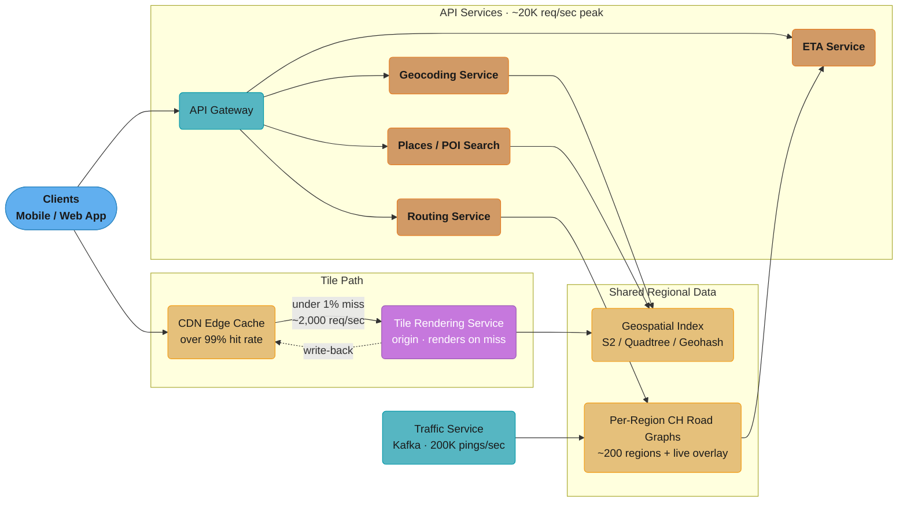
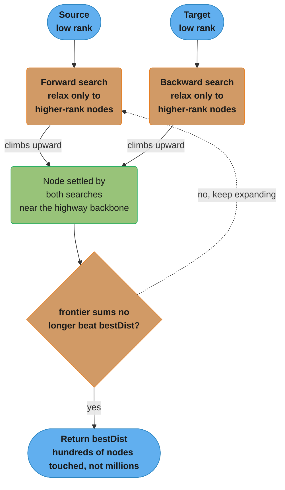
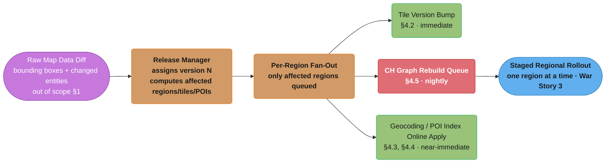
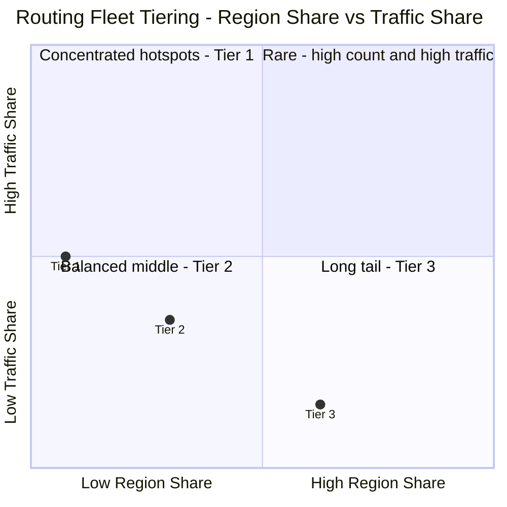

# System Design: Google Maps (Geospatial & Navigation Service)

## Intuition

> **Design intuition**: Google Maps is two systems wearing one UI: a **read-heavy spatial content-delivery system** (rendering and serving billions of map tiles, which behaves almost exactly like a CDN-backed static-asset service) bolted onto a **write-heavy, latency-sensitive graph-routing system** (turn-by-turn navigation over a 600-million-node road graph that must answer "shortest path" queries in milliseconds while traffic conditions change every minute). The unifying thread between both halves is **spatial indexing** — every subsystem, from "which tile covers this pixel" to "which POIs are near this point" to "which road segment did this GPS ping pass through," is fundamentally a question of "what is near what," answered by a 2D-to-1D space-filling-curve trick (geohash, S2, or H3) that turns a geometry problem into a string-prefix or integer-range problem a database already knows how to index.

**Key insight**: The hardest tradeoff in this system is **precomputation vs. freshness** for routing. A road network with 600M nodes can't run Dijkstra's algorithm from scratch on every "get directions" request — that's O((V+E) log V) over hundreds of millions of edges, far too slow for an interactive product. So the system precomputes shortcuts (Contraction Hierarchies) that make queries blazing fast — but precomputation assumes edge weights are stable, and **traffic makes edge weights change every minute**. The entire routing architecture (§4.5-§4.7, and War Story 4 in §9) exists to reconcile "precompute for speed" with "traffic changes constantly" via a live overlay layer checked at query time, with full re-preprocessing relegated to an offline nightly job.

---

## 1. Requirements Clarification

### Functional Requirements
- **Map tile rendering**: serve pre-rendered or on-demand raster/vector map tiles for any region at any zoom level, for display in web/mobile clients
- **Geocoding**: forward geocoding (convert a free-text address like "1600 Amphitheatre Pkwy, Mountain View, CA" into a `(lat, lng)` coordinate) and reverse geocoding (convert a `(lat, lng)` into a human-readable address)
- **Places / POI search ("nearby search")**: given a location and a category (e.g., "coffee shops"), return nearby points of interest ranked by relevance and distance
- **Routing with turn-by-turn directions**: given a source and destination, compute the best route (by travel time, accounting for current traffic) and return a sequence of turn-by-turn instructions
- **Real-time ETA**: given a route (or just source/destination), return an estimated time of arrival reflecting current traffic conditions, updated continuously as the user travels

### Non-Functional Requirements
- **Massive scale**: design for roughly 1 billion daily active users (DAU) globally
- **High tile-cache hit rate**: greater than 99% of tile requests should be served from CDN edge caches, not the tile-rendering origin
- **Low routing latency**: a "get directions" request should return a route in well under a second, even though it searches a graph with hundreds of millions of edges
- **Traffic freshness**: live traffic conditions should be reflected in routing and ETA within 1-2 minutes of the underlying GPS data being collected
- **High availability**: the service is used for real-time navigation (including emergencies) — tile serving and routing must degrade gracefully, never hard-fail

### Out of Scope
- **Raw map-data collection and imagery** — satellite/aerial imagery acquisition, street-view photography, and the map-editing pipeline that produces the road graph and POI database are treated as external inputs to this system, not designed here
- **Turn-by-turn voice navigation UI/UX** — the client-side experience of voice prompts and lane guidance is a client concern; this design covers the backend services that produce the route and ETA data the client renders
- **Transit (bus/train) routing** — multi-modal transit routing uses a schedule-based, time-expanded graph model and is a related but distinct system from the road-network routing covered here

---

## 2. Scale Estimation

### Traffic Volume
- **1 billion DAU**, each generating roughly **5 map-related requests/day** (opening the app, panning/zooming, a couple of searches) -> 5 billion requests/day
- 5,000,000,000 / 86,400 sec/day ~= **58,000 requests/sec average**
- Peak traffic (commute hours, concentrated in a handful of timezones at any given moment) runs roughly **3-4x average** -> ~**200,000 requests/sec peak**
- The overwhelming majority of this traffic is **tile requests** (every pan/zoom/scroll fetches new tiles). At a >99% CDN cache-hit rate (an explicit NFR), the **Tile Rendering Service** origin sees less than 1% of this -> roughly **2,000 requests/sec at peak**

### API Call Volume (Geocoding / POI / Routing / ETA)
- Estimate "real" backend API calls (as opposed to tile fetches) at roughly **500 million/day**
- 500,000,000 / 86,400 ~= **5,800 requests/sec average** -> roughly **20,000 requests/sec peak**
- This volume splits across geocoding, places search, routing, and ETA-refresh requests; routing and ETA are the most latency-sensitive of the four

### Road Graph Size
- Global road network: roughly **600 million nodes** (intersections and shape points) and **700 million edges** (road segments)
- Node storage: ~20 bytes/node (lat, lng as 4-byte floats plus a few flags/IDs) -> 600M * 20 bytes ~= **12 GB**
- Edge storage: ~32 bytes/edge (source/target node IDs, length, base speed, road class, flags) -> 700M * 32 bytes ~= **22.4 GB**
- **Total road graph: ~34.4 GB** — small enough to fit in memory on a single large machine, but partitioned across roughly **200 regions** for locality and fault isolation -> roughly **172 MB/region average**

### POI / Places Data
- Roughly **200 million POIs** worldwide (businesses, landmarks, addresses), each ~200 bytes (name, category, coordinates, rating, hours) -> 200M * 200 bytes ~= **40 GB** — fits comfortably in memory per-region with replication

### Tile Storage
- Excluding empty-ocean tiles (which compress to near-nothing or aren't stored), roughly **500 million distinct stored tiles** across all zoom levels worldwide, each ~20 KB (compressed raster/vector tile) -> 500M * 20 KB ~= **~10 TB** of tile storage sitting behind the CDN as the origin's tile store

### Live Location / Traffic Ingestion
- A meaningful fraction of the 1B DAU share location while navigating; estimate **200,000 location pings/sec** flowing into the Traffic Service via Kafka — the firehose that powers live traffic overlays (§4.6)

---

## 3. High-Level Architecture



Clients split across two independent paths — a read-heavy tile path (CDN-backed, over 99% cache hit) and a write-light API path (four services that all share the same S2 geospatial index and per-region CH road graphs, §4.1-§4.7).

### Request Flow

1. **Tile loading** (the bulk of traffic): the client requests tiles for the visible viewport at a given zoom level (`z/x/y` coordinates, §4.2). Over 99% are served directly from CDN edge caches. The under-1% that miss hit the **Tile Rendering Service**, which queries the **Geospatial Index** (§4.1) for map data covering that tile's bounding box, renders it, returns it to the client, and seeds the CDN cache for subsequent requests.
2. **Geocoding**: as the user types an address or place name, requests route through the **API Gateway** to the **Geocoding Service** (§4.3), which performs forward geocoding (text -> coordinates) using an inverted index over address components, with the geospatial index as a secondary filter for reverse geocoding.
3. **Nearby search**: tapping a category ("restaurants near me") routes to the **Places/POI Search** service (§4.4), which uses the geospatial index to find POIs within a bounding region, then ranks by distance and relevance.
4. **Get directions**: source and destination route to the **Routing Service** (§4.5), which loads the relevant region's precomputed Contraction Hierarchy graph, applies the **Traffic Service's** live edge-weight overlay (§4.6), and returns a route plus turn-by-turn steps.
5. **Live ETA updates**: while navigating, the client periodically polls the **ETA Service** (§4.7), which recomputes time-to-destination from the current position, the precomputed route, and the latest traffic overlay — without re-running full route search unless the user has deviated from the route.

Underpinning all of this is the **Geospatial Index** (§4.1) — a region-sharded spatial data structure (S2 cells in production Google Maps) that every read path uses to answer "what's near this point" efficiently.

---

## 4. Component Deep Dives

### 4.1 Geospatial Indexing — Geohash, Quadtree, S2, and H3

The foundational problem every other component depends on: given a `(lat, lng)` coordinate, quickly answer "what map data, POIs, or road segments are near this point?" Doing this efficiently requires turning 2D coordinates into something a standard index (a B-tree, a hash map, a sorted range) can search — which means **linearizing 2D space into 1D** while preserving locality, so that nearby points usually map to nearby keys.

#### Geohash

Geohash interleaves the bits of latitude and longitude into a single integer, then encodes that integer in base32. Each successive bisection of the lat/lng ranges adds one bit; alternating between longitude and latitude bits produces a Z-order (Morton) curve.

```java
public class GeohashEncoder {
    private static final String BASE32 = "0123456789bcdefghjkmnpqrstuvwxyz";

    public String encode(double lat, double lng, int precision) {
        double[] latRange = {-90.0, 90.0};
        double[] lngRange = {-180.0, 180.0};
        StringBuilder geohash = new StringBuilder();
        boolean isEvenBit = true; // start by bisecting longitude
        int bit = 0;
        int charBits = 0;

        while (geohash.length() < precision) {
            if (isEvenBit) {
                double mid = (lngRange[0] + lngRange[1]) / 2;
                if (lng >= mid) {
                    charBits = (charBits << 1) | 1;
                    lngRange[0] = mid;
                } else {
                    charBits = charBits << 1;
                    lngRange[1] = mid;
                }
            } else {
                double mid = (latRange[0] + latRange[1]) / 2;
                if (lat >= mid) {
                    charBits = (charBits << 1) | 1;
                    latRange[0] = mid;
                } else {
                    charBits = charBits << 1;
                    latRange[1] = mid;
                }
            }
            isEvenBit = !isEvenBit;

            if (++bit == 5) {
                geohash.append(BASE32.charAt(charBits));
                bit = 0;
                charBits = 0;
            }
        }
        return geohash.toString();
    }
}
```

Each additional character of precision roughly halves the cell size along one axis:

| Geohash length | Approx. cell width x height |
|---|---|
| 1 | ~5,000 km x 5,000 km |
| 3 | ~156 km x 156 km |
| 5 | ~4.9 km x 4.9 km |
| 6 | ~1.2 km x 0.61 km |
| 8 | ~38 m x 19 m |

Geohash's appeal is simplicity: two points sharing a long common prefix are *probably* close together, so "find things near me" becomes "find rows whose geohash starts with this prefix" — a query any string-indexed store (or even a sorted array with binary search) can answer. Its well-known flaw is **boundary discontinuity**: two points a few meters apart, straddling a cell boundary (especially across the 0-degree longitude/latitude lines or the international date line), can have completely different geohash prefixes despite being neighbors. War Story 1 (§9) walks through this failure and its fix.

#### Quadtree

A quadtree recursively subdivides 2D space into four quadrants, but — unlike geohash's fixed-precision grid — only subdivides where data density requires it. A region with 10,000 POIs gets subdivided many times; an empty ocean region stays a single large node.

```java
public class QuadTreeNode {
    private static final int MAX_POINTS = 4;
    private final BoundingBox boundary;
    private final List<Poi> points = new ArrayList<>();
    private QuadTreeNode[] children; // NW, NE, SW, SE, or null if leaf

    public QuadTreeNode(BoundingBox boundary) {
        this.boundary = boundary;
    }

    public void insert(Poi poi) {
        if (!boundary.contains(poi.lat(), poi.lng())) {
            return;
        }
        if (children == null && points.size() < MAX_POINTS) {
            points.add(poi);
            return;
        }
        if (children == null) {
            subdivide();
        }
        for (QuadTreeNode child : children) {
            child.insert(poi);
        }
    }

    private void subdivide() {
        double midLat = (boundary.minLat() + boundary.maxLat()) / 2;
        double midLng = (boundary.minLng() + boundary.maxLng()) / 2;
        children = new QuadTreeNode[]{
            new QuadTreeNode(new BoundingBox(midLat, boundary.maxLat(), boundary.minLng(), midLng)), // NW
            new QuadTreeNode(new BoundingBox(midLat, boundary.maxLat(), midLng, boundary.maxLng())), // NE
            new QuadTreeNode(new BoundingBox(boundary.minLat(), midLat, boundary.minLng(), midLng)), // SW
            new QuadTreeNode(new BoundingBox(boundary.minLat(), midLat, midLng, boundary.maxLng()))  // SE
        };
        for (Poi existing : points) {
            for (QuadTreeNode child : children) {
                child.insert(existing);
            }
        }
        points.clear();
    }

    public void rangeQuery(BoundingBox query, List<Poi> results) {
        if (!boundary.intersects(query)) {
            return;
        }
        if (children == null) {
            for (Poi poi : points) {
                if (query.contains(poi.lat(), poi.lng())) {
                    results.add(poi);
                }
            }
            return;
        }
        for (QuadTreeNode child : children) {
            child.rangeQuery(query, results);
        }
    }

    public record Poi(String id, double lat, double lng) {}

    public record BoundingBox(double minLat, double maxLat, double minLng, double maxLng) {
        public boolean contains(double lat, double lng) {
            return lat >= minLat && lat <= maxLat && lng >= minLng && lng <= maxLng;
        }
        public boolean intersects(BoundingBox other) {
            return minLat <= other.maxLat() && maxLat >= other.minLat()
                && minLng <= other.maxLng() && maxLng >= other.minLng();
        }
    }
}
```

A quadtree's `rangeQuery` naturally adapts its traversal depth to data density: a "nearby restaurants" query in dense Manhattan descends many levels, while the same query in rural Montana terminates after one or two. The cost is that quadtree cells are **not a fixed, globally-shared addressing scheme** — two independently-built quadtrees (say, one per region) won't agree on cell boundaries, which complicates merging or comparing indexes across shard boundaries.

#### S2 (Google's Production Choice)

S2 projects the sphere onto the six faces of a cube, then maps each face to a 2D grid traversed by a **Hilbert curve** (rather than geohash's Z-order curve) and encodes the result as a 64-bit cell ID. Two properties make S2 the production choice for Google Maps:

- **Hilbert curves have better locality than Z-order curves**: adjacent cells on a Hilbert curve are *always* adjacent in the linear ordering (geohash's Z-order curve has the "jump" discontinuities behind War Story 1)
- **The cube-face projection avoids the worst pole and date-line distortion** that a single flat lat/lng grid suffers — each of the 6 faces is a relatively well-behaved square

S2 cells form a strict hierarchy (a level-`k` cell divides into exactly 4 level-`(k+1)` cells, like a quadtree, but on a *globally consistent* grid), so a point's containing cell at any level can be computed independently by any service without coordination — critical for a system sharded across roughly 200 regions (§2).

#### H3 (Uber's Hexagonal Grid)

H3 (cross-ref [`./design_uber.md`](./design_uber.md)) tiles the sphere with **hexagonal** cells instead of square ones. The key property hexagons have that squares don't: every neighbor of a hexagonal cell is **equidistant from its center** (a square cell's edge-adjacent neighbors are closer than its corner-adjacent neighbors). For a system whose core query is "find nearby drivers/riders" (Uber's dispatch problem), this uniformity means "expand search to the ring of 6 neighboring cells" behaves the same in every direction — no axis-aligned bias. Google Maps doesn't need this property as acutely (its core queries are tile/POI/road-graph lookups, not real-time proximity matching of two moving populations), which is part of why S2 (square/Hilbert-based) rather than H3 (hexagonal) is its production choice — see §5 for the full comparison table.

#### Which Index for Which Subsystem

- **Tile pyramid (§4.2)**: addressed by `z/x/y`, itself a Z-order-curve-like scheme — no separate spatial index needed
- **Geocoding (§4.3)**: inverted index on address text, with S2 cell IDs as a secondary spatial filter
- **Places/POI search (§4.4)**: S2 cell ID as the primary shard/partition key, with in-memory quadtree-style refinement within a cell for the final ranking pass
- **Road graph (§4.5)**: partitioned by region (roughly aligned to coarse S2 cell boundaries) for the ~200-region split from §2

### 4.2 Tile Pyramid and CDN-Backed Tile Serving

The visible map is served as a **tile pyramid**: at zoom level `z`, the world is divided into a `2^z x 2^z` grid of square tiles, each addressed by `(z, x, y)` and rendered as a fixed-size image (typically 256x256 px) or a vector-tile payload. Zoom level 0 is a single tile covering the entire world; zoom level 10 has `2^10 x 2^10` = ~1 million tiles; zoom level 18 (building-level detail) has `2^18 x 2^18` ~= 68.7 billion tiles globally.

**Pre-rendering vs. on-demand** is a tradeoff between storage cost and latency, and the system uses both:
- **Zoom levels 0-14** (country/region/city views): pre-rendered for the entire world and pushed into the ~10 TB tile store from §2. These are the highest-traffic tiles (most users start zoomed-out), so pre-rendering guarantees the >99% CDN hit rate even on a cold cache.
- **Zoom levels 15-20** (street/building-level): rendering every tile at this resolution globally is combinatorially infeasible (the tile count grows as `4^z`). These are rendered **on-demand** on first request and cached at the CDN edge with a long TTL — in practice, only a small fraction of the world is ever viewed at this zoom (dense urban cores), so the effective storage footprint stays manageable.

**Versioned tile URLs** (`/tiles/v{version}/{z}/{x}/{y}.png`) are the cache-invalidation strategy: when underlying map data changes (a new road opens, a building is added), the affected tiles get a new version number baked into their URL. The CDN never needs an explicit purge — old-version URLs simply stop being requested and age out via normal TTL, while new-version URLs are naturally-distinct cache misses that populate fresh. War Story 3 (§9) covers what happens without this scheme.

### 4.3 Geocoding Service

**Forward geocoding** (address text -> `(lat, lng)`): the input address is tokenized into structured components (street number, street name, city, state/province, postal code) using a address-parsing grammar tuned per country/locale. Each token is looked up in an **inverted index** (cross-ref [`../../database/search_engines/README.md`](../../database/search_engines/README.md)) mapping tokens to candidate address records; candidates are intersected across tokens, ranked by match quality (exact street-number match beats interpolated, exact city match beats "did you mean"), and the top candidate's coordinates are returned. For "123 Main St" where only "100 Main St" and "200 Main St" are known endpoints of a street segment, the coordinate is **interpolated** linearly along the segment's geometry — this is why a geocoded address can be off by a building or two on long blocks.

**Reverse geocoding** (`(lat, lng)` -> address text): the input point is mapped to its containing S2 cell (§4.1), and the geospatial index returns the road segments and address-range polygons indexed under that cell. The system finds the nearest segment to the point (typically within a few meters for urban areas), then interpolates the address number along that segment based on the point's position — the inverse of the forward-geocoding interpolation. Because S2 cells are globally consistent, this lookup is a single indexed range query regardless of which of the ~200 regions the point falls in.

### 4.4 Places/POI Search ("Nearby Search")

A nearby-search request — `(lat, lng, radius, category)`, e.g., "coffee shops within 1km" — is answered in two stages:

1. **Candidate retrieval**: compute the S2 cell covering `(lat, lng)` at a level whose cell size is comparable to `radius`, then query the POI index for that cell **and its ring of neighboring cells** (the same neighbor-expansion technique used to fix War Story 1's geohash boundary bug, §9) to avoid missing POIs just across a cell boundary. The POI index (§2: ~200M POIs, ~40GB, replicated per-region in memory) returns all POIs in the candidate cells matching the requested category.
2. **Ranking**: candidates are scored by a combination of **haversine distance** from `(lat, lng)` and a relevance signal (rating, popularity, how well the name/category matches the query), then the top-K are returned.

This is structurally the same "find entities near a point, ranked by distance plus a secondary score" problem as Uber's nearby-driver matching (cross-ref [`./design_uber.md`](./design_uber.md)), but the access pattern differs in one important way: Uber's index churns constantly (driver locations update every few seconds), favoring H3's uniform-neighbor hexagons for cheap incremental updates, while Google Maps' POI index is comparatively static (a restaurant doesn't move), favoring S2's hierarchical cells which double as the tile and geocoding index — one spatial index serving three subsystems instead of three separate ones.

### 4.5 Routing Service — Contraction Hierarchies

Plain Dijkstra (or A*) over a graph with 700M edges touches potentially millions of nodes per query — at 20,000 routing requests/sec peak (§2), that's computationally infeasible for an interactive product. **Contraction Hierarchies (CH)** solve this with an offline preprocessing step that makes online queries touch only a few hundred to a few thousand nodes, a 1,000x-or-more reduction.

#### Preprocessing: Node Ordering and Contraction

CH preprocessing assigns every node a **rank** (an integer from 0 to N-1) representing a global "importance" order, then **contracts** nodes one at a time in increasing rank order. To contract node `v`:

1. Temporarily remove `v` from the graph
2. For every pair of `v`'s neighbors `(u, w)` where the shortest path from `u` to `w` previously went *through* `v`, insert a **shortcut edge** `u -> w` with weight equal to `weight(u,v) + weight(v,w)` — this preserves the shortest-path distance between `u` and `w` even though `v` is gone
3. Permanently remove `v`, leaving the shortcut edges in its place

The order in which nodes are contracted matters enormously. The standard heuristic is **edge difference**: `(shortcuts that would be added) - (edges that would be removed)` if `v` were contracted next. Low-edge-difference nodes (cul-de-sacs, residential side streets — contracting them adds few or no shortcuts) are contracted first; high-edge-difference nodes (major highway interchanges, which sit on many shortest paths) are contracted last and end up with the highest ranks. Intuitively, **a node's rank ends up correlating with road importance** — highway nodes naturally end up "on top" of the hierarchy, which is exactly the property the query algorithm exploits.

#### Query: Bidirectional Upward Search

Given the CH-augmented graph (original edges plus shortcuts) and each node's rank, a query runs **two simultaneous Dijkstra searches** — forward from the source, backward from the destination on the reverse graph — with one critical restriction: **each search only relaxes edges leading to a higher-rank node than the current one.** Both searches are forced to "climb" toward the highest-ranked nodes (the highway backbone) and never need to "descend" again. They meet somewhere in the middle — typically at or near the highway segments connecting the source and destination regions — and the shortest path is `min` over all settled nodes of `forwardDist[node] + backwardDist[node]`.



The forward search (from the source) and backward search (from the destination) each relax only edges toward a higher-rank node, so both frontiers are forced to climb toward the highway backbone and meet near the top; the search terminates the instant neither frontier's remaining distance could beat the best meeting distance found so far (`bestDist` in `ContractionHierarchyRouter`, §4.5).

```java
public class ContractionHierarchyRouter {
    private final Graph graph;       // CH-augmented graph: original edges + shortcuts
    private final int[] nodeRank;    // contraction order; higher = more "important"

    public ContractionHierarchyRouter(Graph graph, int[] nodeRank) {
        this.graph = graph;
        this.nodeRank = nodeRank;
    }

    public RouteResult shortestPath(int source, int target) {
        PriorityQueue<NodeDist> forwardPq = new PriorityQueue<>(Comparator.comparingDouble(NodeDist::dist));
        PriorityQueue<NodeDist> backwardPq = new PriorityQueue<>(Comparator.comparingDouble(NodeDist::dist));
        Map<Integer, Double> forwardDist = new HashMap<>();
        Map<Integer, Double> backwardDist = new HashMap<>();
        Map<Integer, Integer> forwardPrev = new HashMap<>();
        Map<Integer, Integer> backwardPrev = new HashMap<>();
        Set<Integer> forwardSettled = new HashSet<>();
        Set<Integer> backwardSettled = new HashSet<>();

        forwardPq.add(new NodeDist(source, 0.0));
        forwardDist.put(source, 0.0);
        backwardPq.add(new NodeDist(target, 0.0));
        backwardDist.put(target, 0.0);

        double bestDist = Double.POSITIVE_INFINITY;
        int meetingNode = -1;

        while (!forwardPq.isEmpty() || !backwardPq.isEmpty()) {
            if (!forwardPq.isEmpty()) {
                NodeDist cur = forwardPq.poll();
                if (forwardSettled.add(cur.node())) {
                    if (backwardSettled.contains(cur.node())) {
                        double total = cur.dist() + backwardDist.get(cur.node());
                        if (total < bestDist) {
                            bestDist = total;
                            meetingNode = cur.node();
                        }
                    }
                    for (Edge e : graph.outgoingEdges(cur.node())) {
                        if (nodeRank[e.to()] > nodeRank[cur.node()]) { // upward only
                            double newDist = cur.dist() + e.weight();
                            if (newDist < forwardDist.getOrDefault(e.to(), Double.POSITIVE_INFINITY)) {
                                forwardDist.put(e.to(), newDist);
                                forwardPrev.put(e.to(), cur.node());
                                forwardPq.add(new NodeDist(e.to(), newDist));
                            }
                        }
                    }
                }
            }
            if (!backwardPq.isEmpty()) {
                NodeDist cur = backwardPq.poll();
                if (backwardSettled.add(cur.node())) {
                    if (forwardSettled.contains(cur.node())) {
                        double total = cur.dist() + forwardDist.get(cur.node());
                        if (total < bestDist) {
                            bestDist = total;
                            meetingNode = cur.node();
                        }
                    }
                    for (Edge e : graph.incomingEdges(cur.node())) { // reverse graph
                        if (nodeRank[e.from()] > nodeRank[cur.node()]) { // upward only
                            double newDist = cur.dist() + e.weight();
                            if (newDist < backwardDist.getOrDefault(e.from(), Double.POSITIVE_INFINITY)) {
                                backwardDist.put(e.from(), newDist);
                                backwardPrev.put(e.from(), cur.node());
                                backwardPq.add(new NodeDist(e.from(), newDist));
                            }
                        }
                    }
                }
            }
            // Stopping condition: once both frontiers exceed the best meeting
            // distance found so far, no shorter meeting point remains
            double forwardMin = forwardPq.isEmpty() ? Double.POSITIVE_INFINITY : forwardPq.peek().dist();
            double backwardMin = backwardPq.isEmpty() ? Double.POSITIVE_INFINITY : backwardPq.peek().dist();
            if (forwardMin + backwardMin >= bestDist) {
                break;
            }
        }

        return RouteResult.unpack(meetingNode, bestDist, forwardPrev, backwardPrev, graph);
    }

    public record NodeDist(int node, double dist) {}
    public record Edge(int from, int to, double weight, boolean isShortcut, int viaNode) {}
}
```

Two details matter for correctness in practice:

- **Shortcut unpacking**: the path returned by the search above is expressed in terms of the CH-augmented graph, which includes synthetic shortcut edges that each represent *two or more* original edges. `RouteResult.unpack()` recursively expands each shortcut edge back into its constituent original edges (each shortcut stores its `viaNode`, the contracted node it replaced) — this is what produces the actual turn-by-turn segment list returned to the client.
- **Live traffic overlay** (§4.6): the weights used in `e.weight()` above are not static. At query time, the router checks whether any edge on the candidate path has a live traffic-overlay weight (§4.6) that differs from its precomputed free-flow weight, and if so uses the overlay weight. The CH structure (which nodes are "upward" of which) doesn't change — only edge *weights* do — so the search algorithm above is unaffected; only the numbers it reads change. War Story 4 (§9) covers the case where traffic changes are large enough that this overlay alone isn't sufficient.

**OSRM** (Open Source Routing Machine, §6) is the reference open-source implementation of this exact CH preprocessing-plus-bidirectional-query approach, and is a useful concrete artifact to point to in an interview when discussing implementation feasibility.

### 4.6 Traffic Service

The Traffic Service ingests **200,000 GPS pings/sec** (§2) from devices that are actively navigating or have location-sharing enabled, and turns that raw firehose into **per-road-segment congestion factors** that §4.5 and §4.7 consume.

1. **Ingestion**: each ping (`deviceId, lat, lng, timestamp, speed, heading`) lands on a Kafka topic partitioned by geographic region (cross-ref [`../message_queues/README.md`](../message_queues/README.md)), so that all pings for a given region's road graph land on the same partition and can be processed by a consumer co-located with that region's CH graph.
2. **Map-matching**: raw GPS coordinates have 5-10 meters of error, which is often larger than the gap between two parallel roads (e.g., a highway and its frontage road). Map-matching snaps each ping to the most probable road segment by combining (a) proximity — which segments pass within the GPS error radius of the point — and (b) **heading consistency** — a ping moving at 60mph heading due north is matched to a north-bound segment, not a perpendicular cross-street it happens to be near. A short sliding window of consecutive pings from the same device improves matching confidence (a single ping might be ambiguous; five consecutive pings tracing a consistent line almost always aren't).
3. **Per-segment speed aggregation**: map-matched pings are grouped by `segmentId` and aggregated over a **rolling 1-2 minute window** into a mean observed speed per segment. This window is the dominant contributor to the "traffic freshness within 1-2 minutes" NFR from §1 — shrinking it further trades freshness for noisier (lower-sample-count) estimates, especially on low-traffic roads.
4. **Congestion factor**: each segment's observed speed is divided by its **free-flow speed** (the static speed used as the CH base graph's edge weight, §4.5) to produce a congestion factor in `(0, 1]` — `1.0` means free-flow, `0.3` means the segment is moving at 30% of its normal speed (heavy congestion). These factors are written to a fast key-value overlay store, keyed by `segmentId`, with a short TTL — segments with no recent pings (rural roads at 3am) age out of the overlay and the router falls back to the static free-flow weight.

### 4.7 ETA Service

The ETA Service combines two inputs that change at very different rates: the **CH base graph's free-flow travel times** (static, updated only by nightly re-preprocessing, §4.5) and the **Traffic Service's live congestion factors** (updated every 1-2 minutes, §4.6).

For a route that is a sequence of segments `s_1, s_2, ..., s_n`, the ETA is:

```
ETA = sum over i of (freeFlowTime(s_i) / congestionFactor(s_i))
```

A segment with `congestionFactor = 0.5` (moving at half its normal speed) contributes *twice* its free-flow travel time to the total. Segments with no entry in the live overlay (stale or never-populated) default to `congestionFactor = 1.0` (free-flow) — or, when freshness drops below the SLA, to a **historical-typical-traffic model** keyed by `(segmentId, dayOfWeek, hourOfDay)` as a better-than-free-flow fallback (War Story 2, §9).

While the user is actively navigating, the client periodically reports its current position, and the ETA Service **recomputes only the remaining portion of the route** (segments not yet traveled) using the latest congestion factors — this is a cheap re-sum over the existing route's segment list, not a new CH search. A full re-route is only triggered if the client's position deviates from the precomputed route by more than a small threshold (indicating the user took a different turn than instructed), at which point the Routing Service (§4.5) runs a fresh `shortestPath` query from the new position.

---

## 5. Design Decisions & Tradeoffs

### Geospatial Index: Geohash vs. Quadtree vs. S2 vs. H3

| Dimension | Geohash | Quadtree | S2 | H3 |
|---|---|---|---|---|
| Cell shape | Square (lat/lng grid) | Square (adaptive) | Square (cube-face + Hilbert curve) | Hexagon |
| Boundary discontinuity | Severe (Z-order curve "jumps", War Story 1) | Moderate (per-tree boundaries differ across shards) | Minimal (Hilbert curve preserves locality) | Minimal (uniform hexagon adjacency) |
| Globally consistent grid | Yes (fixed precision levels) | No (each tree's subdivisions are local) | Yes (fixed cell hierarchy, computable independently) | Yes (fixed cell hierarchy) |
| Neighbor uniformity | No (edge vs. corner neighbors differ) | No | No (square cells) | Yes — all 6 neighbors equidistant |
| Adapts to data density | No (fixed cell size per precision) | Yes (subdivides only where dense) | Partial (variable cell levels) | Partial (variable resolutions) |
| Best for | Simple prefix-indexed lookups, prototypes | Static datasets with uneven density (in-cell POI refinement) | Production planet-scale tile/geocode/POI indexing | Real-time proximity matching of moving entities |
| Used in this design | No — illustrative baseline (War Story 1) | Conceptual basis for in-cell POI refinement (§4.4) | **Yes — primary index (§4.1)** | No (cross-ref [`./design_uber.md`](./design_uber.md)) |

### Routing: Precomputed Contraction Hierarchies vs. On-the-Fly Dijkstra/A*

| Dimension | Plain Dijkstra / A* per query | Contraction Hierarchies (this design) |
|---|---|---|
| Query latency at planet scale | Seconds — millions of nodes potentially touched | Milliseconds — hundreds to low-thousands of nodes touched |
| Preprocessing cost | None | Hours, offline, per region; repeated when graph *topology* changes |
| Handling live traffic | Trivial — update edge weights, re-run search | Requires a live overlay layer checked at query time (§4.5, §4.6); large changes need re-preprocessing (War Story 4) |
| Memory overhead | None beyond the base graph | Shortcut edges roughly double the edge count in practice |
| Best fit | Small graphs, infrequent queries, or constantly-restructuring graphs | High query volume (20K/sec peak) over a graph whose *structure* is stable but whose *weights* fluctuate |

### Tile Serving: Pre-Rendering vs. On-Demand

| Dimension | Pre-render (zoom 0-14) | On-demand (zoom 15-20) |
|---|---|---|
| Storage cost | Bounded — full world coverage fits the ~10TB tile store (§2) | Pre-rendering fully would be combinatorially infeasible (`4^z` tile growth) |
| First-request latency | Always a CDN hit (pre-seeded) | First request per tile is a cache miss, hits Tile Rendering Service |
| Update propagation | Versioned-URL bump + re-render (§4.2) | Naturally re-rendered on next cache-miss after TTL expiry |
| Dominant use case | Zoomed-out views — the majority of traffic | Dense urban exploration at street-level detail |

---

## 6. Real-World Implementations

- **Google Maps and the S2 Geometry Library**: Google open-sourced the S2 library used internally not just by Maps but by Earth, Search's local results, and Fusion Tables — the cube-face/Hilbert-curve cell scheme described in §4.1 is the actual production indexing scheme, not a simplification for this case study.
- **Uber and H3**: Uber open-sourced its H3 hexagonal grid system specifically because square-grid (geohash-style) indexes produced uneven results for its core "find nearby drivers" query (cross-ref [`./design_uber.md`](./design_uber.md)) — the same boundary-discontinuity and neighbor-uniformity issues discussed in §4.1 and §5, but for a real-time, high-churn dataset rather than Maps' comparatively static POI/road data.
- **OSRM (Open Source Routing Machine)**: the reference open-source implementation of Contraction-Hierarchy-based routing (§4.5), used as the routing backend for several consumer navigation apps and widely cited in routing-algorithm literature as the baseline CH implementation.
- **GraphHopper**: another open-source CH-based routing engine, built on OpenStreetMap data, illustrating that the road-graph data source (proprietary map data vs. OpenStreetMap) is decoupled from the routing algorithm — the same CH preprocessing and bidirectional-search approach applies regardless of data provenance.
- **Waze**: crowd-sourced traffic incidents (accidents, police, hazards reported directly by drivers) supplement the GPS-ping-derived congestion factors of §4.6 — since Waze is owned by Google, this is a real example of a *secondary* traffic-signal source feeding the same overlay structure described in §4.6, alongside the primary GPS-ping pipeline.
- **Mapbox**: a vector-tile pipeline with the same `z/x/y` tile-pyramid addressing and versioned-asset cache-busting strategy described in §4.2, demonstrating that the tile-serving half of this design generalizes well beyond Google's specific stack.

### Spatial Index Adoption at a Glance

| Index | Primary Adopter | Cell Shape | Why That Adopter Chose It |
|---|---|---|---|
| Geohash | Many early location-based services (legacy systems, simple APIs) | Square (Z-order) | Simplicity — encodes to a sortable string usable as a primary key in any database, at the cost of the boundary issues in §4.1/War Story 1 |
| Quadtree | In-memory spatial libraries, game engines, GIS tools | Square (adaptive) | Adapts to uneven point density without a fixed global grid — good for a single dataset, weaker for cross-shard consistency |
| S2 | Google (Maps, Earth, Search local results) | Square (cube-face + Hilbert) | Best locality properties of any square-grid scheme, globally consistent hierarchy — fits a planet-scale, multi-subsystem index (§4.1) |
| H3 | Uber (dispatch, surge pricing, ETA) | Hexagon | Uniform neighbor distance for real-time proximity matching of two moving populations (cross-ref [`./design_uber.md`](./design_uber.md)) |

---

## 7. Technologies & Tools

| Component | Representative Technologies | Notes |
|---|---|---|
| Geospatial index | S2 Geometry Library; wide-column store (Bigtable-style) keyed by S2 cell ID | §4.1 — primary index shared by tiles, geocoding, and POI search |
| Tile store + CDN | Object storage (S3/GCS-equivalent) behind a global CDN | §4.2 — origin for the <1% CDN miss path |
| Road graph storage | In-memory CH graphs per region, custom compact binary format or Protocol Buffers | §4.5 — ~172MB/region average (§2) |
| Geocoding index | Inverted index (Elasticsearch-style) over address tokens | §4.3 — cross-ref [`../../database/search_engines/README.md`](../../database/search_engines/README.md) |
| POI / Places store | Wide-column store sharded by S2 cell, in-memory replica per region | §4.4 — ~40GB total (§2) |
| Traffic ingestion | Kafka (200K pings/sec) + stream processor (windowed aggregation) | §4.6 — cross-ref [`../message_queues/README.md`](../message_queues/README.md) |
| Live traffic overlay | Low-latency key-value store with short TTL, keyed by `segmentId` | §4.6, §4.5 |
| Routing engine | Custom CH implementation in production; OSRM/GraphHopper as open-source references | §4.5 |

### Build vs. Buy Considerations

| Component | Build | Buy / Open-Source | This Design's Choice |
|---|---|---|---|
| Spatial index | Custom S2-based service shared across subsystems | PostGIS, Elasticsearch geo-queries | Build — S2 is shared by tiles, geocoding, and POI search (§4.1); a generic geo-database would need three separate integrations instead of one |
| Routing engine | Custom CH implementation with live-overlay integration | OSRM, GraphHopper (§6) | Build for production (the traffic-overlay coupling in §4.5/§4.6 is bespoke), but OSRM/GraphHopper are reasonable starting points for an MVP or as an interview reference implementation |
| Tile rendering + CDN | Custom renderer, in-house CDN | Mapbox tile pipeline, commodity CDN | Buy the CDN (§4.2) — CDN is a commodity; build the renderer, since it's tightly coupled to the proprietary geospatial index |
| Traffic ingestion | Custom Kafka cluster + stream processor | Managed streaming platform | Either — the aggregation architecture (§4.6) is agnostic to self-hosted vs. managed infrastructure; the *aggregation logic* is the bespoke part regardless |

---

## 8. Operational Playbook

### Key Metrics

| Metric | What It Measures | Alert Threshold (Illustrative) |
|---|---|---|
| **Tile cache hit rate** | Fraction of tile requests served from CDN edge vs. origin | Page if < 99% sustained over 5 minutes — directly threatens the NFR from §1 |
| **Tile Rendering Service origin QPS** | Load reaching the origin | Page if sustained > ~3,000/sec (50% above the ~2,000/sec planned peak from §2) |
| **Routing P50 / P99 latency** | End-to-end `shortestPath` response time | Page if P99 > 1 second |
| **Traffic overlay freshness** | Age of the most recent congestion-factor update per region | Page if > 5 minutes stale (well past the 1-2 minute SLA from §1) — this is the leading indicator for War Story 2 |
| **Kafka consumer lag (Traffic Service)** | Backlog of unprocessed GPS pings | Page if lag implies > 5 minutes of processing delay |
| **ETA accuracy (predicted vs. actual)** | Mean absolute error between predicted ETA and observed arrival time | Investigate if mean error exceeds ~10% of trip duration, region-by-region |

### Runbook: Traffic Freshness Alert (Kafka Consumer Lag)

1. Check Kafka consumer-group lag for the Traffic Service's topic partitions, broken down by region — lag is rarely uniform; a single region's consumers falling behind (e.g., due to a regional traffic spike in ping volume) is the common case.
2. If lag is isolated to one region, scale out that region's consumer group (more partitions/consumers) — this is the immediate mitigation.
3. While lag is elevated, the affected region's overlay entries age past their TTL and the router/ETA service fall back to the historical-typical-traffic model (§4.7, War Story 2) — confirm this fallback is actually engaging (check the "fallback activated" counter) rather than silently serving stale free-flow estimates.
4. Once lag drains, verify the overlay repopulates and the fallback rate returns to baseline before closing out.

### Runbook: Tile Cache Hit-Rate Drop

1. Check whether the drop correlates with a recent map-data update and tile-version bump (§4.2) — a version bump *should* cause a temporary, gradual increase in cache misses as old-version URLs age out, but a hit-rate drop that is sudden and severe (rather than gradual) suggests something else.
2. Check for a CDN configuration change (cache-control headers, TTL settings) that may have been deployed alongside the map-data update — the two are often bundled into one release, making it easy to miss that a CDN config regression, not the version bump itself, caused the drop.
3. If the drop is isolated to specific zoom levels (15-20, the on-demand tier), check Tile Rendering Service health directly — an on-demand-tier outage looks like a "cache miss" to the CDN but is actually an origin failure.
4. Roll back the CDN config change (not the tile-version bump, which is generally not reversible without re-introducing the original cache-invalidation problem) if it's identified as the cause.

---

## 9. Common Pitfalls & War Stories

### War Story 1: A Geohash Prefix Boundary Hides the Nearest Coffee Shop — Broken, Then Fixed

**Broken**: An early prototype of the Places/POI index (§4.4) used geohash prefixes (§4.1) directly as the lookup key — "find POIs near `(lat, lng)`" was implemented as "find POIs whose geohash shares the same N-character prefix as `(lat, lng)`'s geohash."

**Impact**: A user standing within meters of the equator — say at `lat = -0.0001, lng = 36.8`, just south of the line — computed a geohash beginning with one prefix, while a coffee shop at `lat = 0.0001, lng = 36.8`, **8 meters away** but just north of the equator, had a geohash beginning with a *completely different* prefix. This is the geohash boundary discontinuity from §4.1 in its sharpest form: bisecting latitude at `0.0` flips the highest-order latitude bit, which cascades into the leading characters of the base32 encoding being entirely different even though the underlying bisection-by-bisection difference is a single bit. The prefix-match query for the user's location returned **zero results** for a coffee shop that was, in effect, across the street. Support tickets described this as "Maps says there's nothing nearby" in locations that were demonstrably full of businesses — and the pattern correlated suspiciously with the equator, the prime meridian, and other axis-aligned boundaries, which was the clue that eventually identified the root cause.

**Fixed**: Replaced single-prefix lookup with **9-cell neighbor expansion** (the technique referenced in §4.4): compute the geohash cell containing `(lat, lng)`, compute its 8 geographically adjacent cells at the same precision (N, S, E, W, and the 4 diagonals), query the POI index for all 9 cells, merge and deduplicate the results, compute the true haversine distance from `(lat, lng)` to each candidate, and sort by that distance. The fix costs a constant 9x more index lookups per query — negligible given the in-memory, per-region POI index (§2: ~40GB total) — and eliminates the boundary blind spot entirely, because any point within `radius` of `(lat, lng)` is guaranteed to fall within the center cell or one of its 8 neighbors. In production, S2 (§4.1) generalizes this same "center cell plus ring of neighbors" pattern, but the underlying fix — *never trust a single cell's contents to be complete near a boundary* — is identical regardless of which spatial index is used.

### War Story 2: Kafka Consumer Lag Makes ETAs 3x Too Optimistic During a Regional Spike — Broken, Then Fixed

**Broken**: The initial Traffic Service (§4.6) had no freshness check on the live congestion-factor overlay. When the overlay had no recent entry for a segment — either because the segment genuinely had no traffic, or because the pipeline producing entries had fallen behind — the ETA Service (§4.7) silently defaulted to `congestionFactor = 1.0` (free-flow), treating "no data" and "no congestion" as the same thing.

**Impact**: During a major regional event, two things happened simultaneously: actual road congestion spiked to multiples of normal, *and* the volume of GPS pings from attendees' phones spiked well beyond the Traffic Service's provisioned Kafka consumer capacity for that region, pushing consumer lag to over 20 minutes. As overlay entries for the region's segments aged past their TTL faster than the lagging pipeline could refresh them, the ETA Service's "no data" fallback kicked in for a large fraction of the region's road segments — at the **exact moment** those segments were experiencing their worst congestion of the year. Tens of thousands of users navigating through the area received ETAs predicting 15 minutes for trips that took 45, with no indication anything was wrong. The issue self-resolved roughly 40 minutes later as consumer lag drained, but by then the day's commute was already a wash and the discrepancy had been widely noticed.

**Fixed**: Three changes:
1. **Freshness as a first-class metric**: the Traffic Service now tracks, per region, the maximum age of any segment's congestion-factor overlay entry, with the alert threshold from §8's runbook (>5 minutes stale) firing well before the 1-2 minute SLA from §1 is meaningfully violated at scale.
2. **Better fallback than free-flow**: when overlay freshness degrades past the threshold, the ETA Service falls back not to `congestionFactor = 1.0` but to a **historical-typical-traffic model** keyed by `(segmentId, dayOfWeek, hourOfDay)` — during a known-busy period (rush hour, a recurring large event), the historical model predicts meaningfully worse-than-free-flow conditions even with zero live data, which is a far better approximation than assuming an empty road.
3. **Lag-driven autoscaling**: the Traffic Service's Kafka consumer group now autoscales based on consumer lag (cross-ref [`../observability/README.md`](../observability/README.md)), so a regional ping-volume spike triggers additional consumer capacity for that region's partitions before lag accumulates to a freshness-impacting level.

### War Story 3: A Map-Data Update Triggers a 100x Origin Traffic Spike — Broken, Then Fixed

**Broken**: Before versioned tile URLs (§4.2) existed, tile URLs were stable (`/tiles/{z}/{x}/{y}.png`), and a map-data update — say, a country-wide road-network refresh affecting roughly 50 million tiles across all zoom levels — triggered an explicit CDN cache-invalidation (purge) call for every affected tile URL.

**Impact**: Two failure modes compounded. First, issuing 50 million invalidation calls in a tight loop overwhelmed the CDN's invalidation control plane, delaying full propagation across edge nodes by several hours — during which different edge nodes served *different* (some stale, some fresh) versions of the same tile to different users, a visible map-data inconsistency. Second, and far more severe: once invalidated, all 50 million tiles became simultaneous cache misses. Within minutes, the Tile Rendering Service origin — provisioned for the <1% miss traffic of roughly 2,000 requests/sec (§2) — was hit with a spike exceeding **200,000 requests/sec**, effectively the *entire* affected region's tile traffic bypassing the CDN at once, a roughly 100x overload. The origin fleet fell over under the load, returning errors and timeouts, and the affected country experienced a visible "map tiles fail to load" outage for nearly an hour while the origin fleet was emergency-scaled.

**Fixed**: Versioned tile URLs (§4.2). A map-data update increments the version segment for affected tiles (`/tiles/v1235/{z}/{x}/{y}.png` instead of `/tiles/v1234/{z}/{x}/{y}.png`). Old-version URLs remain valid in the CDN cache (still correct for any client that hasn't refreshed its tile references) and simply age out via normal TTL — no bulk purge, no invalidation API calls at all. New-version URLs are organically-distinct cache misses that populate gradually, one tile at a time, as individual clients request them — never as a synchronized stampede. As a second layer of protection, version rollouts are **staggered by region**: one region's version bump completes and its origin miss-rate returns to baseline before the next region's rollout begins, so even the gradual, organic miss-rate increase from a version bump is never aggregated across multiple regions simultaneously.

### War Story 4: A Bridge Closure Outpaces Nightly CH Re-Preprocessing — Broken, Then Fixed

**Broken**: The initial live-overlay design (§4.6) modeled all traffic effects as a multiplicative `congestionFactor` applied to a segment's free-flow weight — there was no representation for an edge becoming **completely impassable**. Full structural changes to the road graph (a bridge permanently closing, a new road opening) were handled exclusively by the nightly full CH re-preprocessing job (§4.5).

**Impact**: A major bridge underwent emergency closure for safety inspection, announced and effective the same morning. The live overlay could reduce the bridge segment's effective speed via `congestionFactor`, but `congestionFactor` has a practical floor (representing "crawling, but still moving") — it had no value meaning "do not route here at all." The Routing Service continued returning routes that crossed the now-closed bridge, weighted as merely "very congested" rather than impossible, sending navigating users toward a route that physically could not be completed. The fix — removing the bridge's edges from the CH graph and re-running preprocessing — was scheduled for that night's batch job, roughly **14 hours later**. For the entire intervening window, every route through that corridor was wrong, with drivers discovering the closure only upon arrival.

**Fixed**: Extended the live overlay (§4.6) with a binary **"closed" state** per edge, distinct from (and overriding) `congestionFactor`. At query time, the bidirectional CH search (§4.5) checks the overlay for each candidate edge; if an edge is marked closed, the search treats it as having infinite weight and is forced to find an alternative path through the existing precomputed graph — the CH node-rank structure doesn't need to change for this, only the weight of one edge, so the search remains both correct and fast (the "fast path" continues to apply for the overwhelming majority of queries that don't intersect the closure). The nightly full CH re-preprocessing job still runs to permanently retire shortcut edges that depended on the now-closed bridge — but this is now a **structural optimization** (keeping the precomputed graph lean over time), not a **correctness requirement**, since the overlay check provides correctness immediately at query time.

### Map Data Ingestion Pipeline: Connecting the War Stories

Every subsystem in §4.1-§4.7 eventually has to absorb a **map-data update**: a new road opens, a business closes, a speed limit changes, a one-way restriction is added. The out-of-scope data-collection pipeline (§1) produces these as a **diff** — a set of bounding boxes plus the changed entities within them — and this section describes how that diff propagates through tiles, the road graph, and the geocoding/POI indexes. This is the architectural thread connecting War Story 3 (tile versioning) and War Story 4 (CH overlay vs. re-preprocessing): both war stories are really about **the same underlying fact**, that different subsystems can safely absorb updates at very different speeds, and the pipeline must respect that rather than forcing everything onto one timeline.



A single map-data diff fans out to three independent update paths at three different speeds — immediate tile-version bumps, near-immediate index updates, and a nightly-batch CH road-graph rebuild — matching each subsystem's blast radius (§9's "why four speeds" table). Only the CH-rebuild path gates the staged, region-by-region rollout that War Story 3 made mandatory after its 100x origin traffic spike.

```java
public class MapDataReleaseManager {
    private final RegionIndex regionIndex;          // maps a diff's bounding boxes to affected regions
    private final TileVersionStore tileVersions;    // current version number per (z, x, y) tile
    private final ChRebuildQueue chRebuildQueue;     // nightly-batch queue, keyed by region (§4.5)
    private final PoiIndexUpdater poiIndexUpdater;   // online apply (§4.4)
    private final GeocodingIndexUpdater geocodingIndexUpdater; // online apply (§4.3)
    private final RolloutScheduler rolloutScheduler; // staged per-region cutover (War Story 3)

    public ReleasePlan planRelease(MapDataDiff diff) {
        long version = tileVersions.nextVersion();
        Set<RegionId> affectedRegions = regionIndex.regionsCoveredBy(diff.boundingBoxes());
        Set<TileCoordinate> affectedTiles = computeAffectedTiles(diff.boundingBoxes());

        for (TileCoordinate tile : affectedTiles) {
            tileVersions.bump(tile, version); // §4.2 -> new /tiles/v{version}/z/x/y URL
        }
        return new ReleasePlan(version, affectedRegions, affectedTiles, diff);
    }

    public void applyRelease(ReleasePlan plan) {
        // Speed 1 (immediate): tile version bumps already happened in planRelease().
        // New URLs are organic cache misses (§4.2) - nothing to "push".

        // Speed 2 (near-immediate): geocoding + POI indexes are read-mostly and
        // tolerate online updates - apply the diff directly, region by region.
        for (RegionId region : plan.affectedRegions()) {
            poiIndexUpdater.applyDiff(region, plan.diff());
            geocodingIndexUpdater.applyDiff(region, plan.diff());
        }

        // Speed 3 (nightly batch): structural road-graph changes require CH
        // re-preprocessing (§4.5). Until the rebuild completes, the live
        // overlay's "closed"/"new edge" flags (War Story 4) bridge the gap.
        for (RegionId region : plan.affectedRegions()) {
            chRebuildQueue.enqueue(region, plan.diff());
        }

        // Speed 4 (staged, hours): CDN/version cutover proceeds one region at
        // a time, each gated on the previous region's miss-rate returning to
        // baseline before the next begins (War Story 3).
        rolloutScheduler.scheduleStaged(plan.affectedRegions());
    }

    private Set<TileCoordinate> computeAffectedTiles(List<BoundingBox> boxes) {
        Set<TileCoordinate> tiles = new HashSet<>();
        for (BoundingBox box : boxes) {
            for (int zoom = 0; zoom <= MAX_ZOOM; zoom++) {
                tiles.addAll(TilePyramid.tilesCovering(box, zoom));
            }
        }
        return tiles;
    }

    public record ReleasePlan(long version, Set<RegionId> affectedRegions,
                               Set<TileCoordinate> affectedTiles, MapDataDiff diff) {}
}
```

### Why Four Different Speeds Is a Feature, Not a Bug

| Subsystem | Update Latency | Why This Speed Is Safe |
|---|---|---|
| Tile versions (§4.2) | Immediate (next cache miss) | A stale tile is purely cosmetic — worst case, a user sees an old road layout for one more cache cycle |
| Geocoding / POI index (§4.3, §4.4) | Near-immediate (online apply) | These indexes are read-mostly and were already designed for incremental updates; staleness here means a new business doesn't show up in search for a few minutes |
| CH road graph (§4.5) | Nightly batch, bridged by live overlay | A *structural* error here (routing through a closed road) is the highest-severity failure mode (War Story 4) — the overlay provides immediate correctness while the slow, expensive re-preprocessing catches up |
| CDN regional rollout (§4.2, War Story 3) | Staged over hours | Deliberately slow — this is the one update path where moving *too fast* (all regions simultaneously) is what causes an incident (War Story 3), not a benefit being traded away |

The unifying principle: **update latency should be inversely proportional to blast radius, except where a fast-but-cheap safety net (the live overlay) exists to cover the gap for the slowest path.** A system that applied all four updates at the same speed would either be unacceptably slow for cosmetic changes (tiles) or unacceptably risky for structural ones (the road graph) — matching speed to risk, with the overlay as an explicit bridge for the one case where "slow but eventually correct" isn't good enough on its own, is what makes the four-speed design coherent rather than arbitrary.

---

## 10. Capacity Planning

### Tile Rendering Service Origin

- Peak miss traffic: ~2,000 requests/sec (§2 — under 1% of the ~200,000 req/sec peak)
- Per-tile render cost: roughly 50ms of CPU time (querying the geospatial index for the tile's bounding box, then rasterizing or encoding the result)
- Required concurrent render capacity: 2,000 req/sec * 0.05 sec/render ~= **100 concurrent renders in flight** (Little's Law: concurrency = arrival rate x service time)
- With 2x headroom for burstiness and render-time variance (some tiles, especially dense urban ones, take longer than the 50ms average): ~**200 concurrent render slots**
- At roughly 10 render threads per machine: ~**20 machines globally**, distributed across regions proportional to traffic share rather than centralized — a render request for a Tokyo tile shouldn't cross an ocean to reach its origin

### Road Graph and Routing Fleet — Regional Tiering

Not all ~200 regions (§2) carry equal routing/API traffic (~20,000 req/sec peak). Traffic concentrates heavily in dense metro areas, so a flat "N nodes per region" allocation would either starve Tier-1 cities or massively over-provision rural coverage. A three-tier model:

| Tier | Example Regions | Region Count | Share of Routing Traffic | Avg Req/sec per Region | Routing Nodes per Region |
|---|---|---|---|---|---|
| Tier 1 (major metro) | Tokyo, New York, London, Sao Paulo, Mumbai | ~15 | 50% | ~667 req/sec | 6-8 |
| Tier 2 (mid-size metro) | regional capitals, secondary cities | ~60 | 35% | ~117 req/sec | 2-3 |
| Tier 3 (rural / low-density) | remaining global coverage | ~125 | 15% | ~24 req/sec | 1-2 (sometimes pooled across adjacent regions) |



Just 15 Tier-1 regions (7.5% of the roughly 200 total) carry 50% of routing traffic, while 125 Tier-3 regions (62.5% of the total) carry only 15% — the concentration that makes a flat per-region node allocation wrong in both directions (§10).

- Each routing node holds that region's CH-augmented graph in memory — ~172MB average base graph (§2), roughly doubling to **~345MB** once shortcut edges are included (§5) — plus its slice of the POI index (~200MB average) and geocoding index, comfortably within a single modest instance's RAM.
- Tier 1's 6-8 nodes per region serve two purposes: headroom (each individual CH query is sub-millisecond, but request handling, the live-overlay lookup §4.6, and response serialization add real overhead at 667 req/sec) and **fault isolation** — losing 1 of 8 nodes in Tokyo is a 12.5% capacity hit, while losing 1 of 1-2 nodes in a Tier 3 region is a 50-100% hit, which is acceptable there only because Tier 3's absolute traffic is low enough that a brief failover doesn't threaten the global P99 latency SLO.
- Total routing fleet: `(15 x 7) + (60 x 2.5) + (125 x 1.5)` ~= `105 + 150 + 187.5` ~= **~440 routing nodes globally**

### Traffic Service Consumer Sizing

- Total ingestion: 200,000 GPS pings/sec (§2)
- Each consumer instance — performing map-matching (§4.6) plus windowed per-segment aggregation — handles roughly 5,000 pings/sec at sustainable CPU utilization
- Baseline: `200,000 / 5,000` = **40 consumer instances**
- War Story 2's autoscaling fix provisions a baseline of ~40, with burst capacity to ~60-80 during known high-volume periods (regional events, holiday travel) — sized so that lag-based alerts (§8) have headroom to fire and trigger scale-out *before* overlay freshness (§4.6) actually degrades past the SLA

### POI/Places and Geocoding Index Sizing

- POI index: ~40GB total (§2), replicated per-region -> ~200MB/region average — small enough to live alongside the CH graph on each routing node (§4.4 uses this co-location for nearby-search queries)
- Geocoding inverted index: address records outnumber POIs by roughly an order of magnitude, though each entry is smaller (tokens + coordinates vs. full POI metadata) — budget on the same order of magnitude as the POI index, roughly 150-250GB total. Unlike the POI index, this is **sharded** (not fully replicated) across a dedicated geocoding fleet, sized independently of the routing fleet since text-search access patterns (§4.3) differ substantially from the routing fleet's spatial-graph access patterns

### Tile Storage and CDN Edge Cache

- Origin tile store: ~10TB (§2) in object storage — the *complete* global tile corpus, but no single CDN edge POP needs to cache all of it
- Each CDN edge POP caches the **regionally-relevant working set**: for a metro-area POP, the tiles covering that metro (plus a buffer) across all zoom levels — a small fraction of the global 10TB, commonly tens to low-hundreds of GB per POP
- The >99% hit-rate target (§1) is effectively a **per-POP** target. A POP whose region hasn't had a recent map-data update trends toward >99.9% in steady state; a POP whose region is mid-rollout (War Story 3, §9) sees a temporarily elevated — but bounded, thanks to the staggered-rollout fix — miss rate as new-version tile URLs organically replace old ones

### Bandwidth Estimation

- **CDN tile egress** (dominates total bandwidth): at 200,000 req/sec peak (§2) and ~20KB/tile average, total egress = `200,000 x 20KB` ~= 4 GB/sec ~= **~32 Gbps globally at peak** — spread across every CDN POP worldwide, so no single POP carries this full load.
- **Tile Rendering Service origin egress**: at the <1% miss rate (~2,000 req/sec) and the same ~20KB/tile, origin egress = `2,000 x 20KB` ~= 40 MB/sec ~= **~320 Mbps** — three orders of magnitude below total CDN egress, a concrete illustration of how much load the >99% hit rate absorbs.
- **API responses** (geocode/POI/route/ETA): ~20,000 req/sec peak (§2), response payloads averaging ~3KB (a turn-by-turn route response is the largest of these) -> `20,000 x 3KB` ~= 60 MB/sec ~= **~480 Mbps** at peak.
- **GPS ping ingestion** (Kafka, inbound): 200,000 pings/sec (§2) at roughly 50 bytes/ping (compactly encoded `deviceId, lat, lng, timestamp, speed, heading`) -> `200,000 x 50 bytes` ~= 10 MB/sec ~= **~80 Mbps** inbound — modest compared to tile-serving egress.

| Traffic Type | Direction | Peak Bandwidth |
|---|---|---|
| CDN tile egress (all POPs combined) | Outbound to clients | ~32 Gbps |
| Tile Rendering Service origin egress | Outbound (CDN miss only) | ~320 Mbps |
| API responses (geocode/POI/route/ETA) | Outbound to clients | ~480 Mbps |
| GPS ping ingestion (Kafka) | Inbound from clients | ~80 Mbps |

The roughly 100x gap between CDN egress (~32 Gbps) and origin egress (~320 Mbps) is the same >99% hit-rate effect expressed in bandwidth terms rather than request-rate terms — and it's the reason tile serving, despite generating the overwhelming majority of *requests*, is not the dominant cost driver for the origin infrastructure that this team actually operates day-to-day (the CDN itself is typically a managed/third-party cost, §7's Build vs. Buy).

### Summary Table

| Component | Sizing Basis | Estimated Footprint |
|---|---|---|
| Tile Rendering Service origin | ~2,000 req/sec peak x ~50ms/render, 2x headroom | ~200 concurrent render slots, ~20 machines |
| Routing fleet | ~20K req/sec peak across ~200 regions, 3-tier distribution | ~440 nodes globally |
| Road graph (CH-augmented, in-memory) | ~200 regions x ~345MB with shortcuts | ~69GB total, ~345MB/region |
| POI / Places index | ~200M POIs x ~200 bytes, replicated per-region | ~40GB total, ~200MB/region |
| Geocoding index | Order-of-magnitude larger than POI index, sharded | ~150-250GB total, dedicated fleet |
| Traffic Service consumers | 200K pings/sec / ~5K pings/sec/consumer | ~40 baseline, autoscale to ~60-80 |
| Tile store (origin, object storage) | ~500M stored tiles x ~20KB | ~10TB |
| CDN edge cache (per POP) | Regional working set of the tile corpus | Tens to low-hundreds of GB/POP |

### Cold-Start: Bootstrapping a New Region

When map coverage launches in a new country or region, the incremental update pipeline (§4.8) doesn't apply — every subsystem starts from zero, on a compressed timeline:

1. **Road graph and CH preprocessing**: raw road-network data for the new region is loaded, and full CH preprocessing (§4.5) runs once for the entire region's graph. For a region near the §2 average (~172MB base graph), full preprocessing on a dedicated batch cluster takes on the order of **tens of minutes to a few hours** — notably *more* than the nightly *incremental* re-preprocessing referenced in §4.5 and War Story 4, because incremental re-preprocessing only re-contracts the subgraph affected by a diff, while a cold start contracts the entire graph from an unordered initial state.
2. **Tile pre-rendering**: zoom levels 0-14 (§4.2) are rendered in a batch job. A country-sized region has on the order of 500K-1M tiles across those zoom levels; at 200 parallel render workers (§10's Tile Rendering Service sizing) and ~50ms/tile, `1,000,000 tiles x 0.05 sec / 200 workers` ~= **250 seconds, roughly 4 minutes** — tile pre-rendering is, perhaps counter-intuitively, the *fastest* part of a regional cold start.
3. **POI and geocoding index population**: bulk-loaded into the new region's index shard (§4.3, §4.4) via bulk-insert APIs — typically faster per-record than the steady-state incremental "online apply" path (§4.8), since bulk loads avoid per-diff overhead.
4. **Traffic Service cold start**: no historical data exists for the `(segmentId, dayOfWeek, hourOfDay)` historical-typical-traffic model (War Story 2's fallback). The new region operates on **live overlay data only** (§4.6) until enough history accumulates — typically a few weeks — to populate the historical model. During this window, the region has *no* fallback for live-overlay staleness, making the freshness alerting from §8 especially important for newly-launched regions.
5. **Routing fleet provisioning**: a new region is initially assigned to one of the three tiers (§10) based on a *traffic forecast*, not observed traffic. Under-provisioning is the more common launch mistake — launch-day curiosity traffic frequently exceeds steady-state forecasts by a wide margin, so a region forecast as Tier 2 is often provisioned at Tier-1 capacity for the first 1-2 weeks post-launch, then scaled down once steady-state traffic patterns emerge.

### Disaster Recovery: Regional Routing-Fleet Failure

Tile serving and geocoding degrade gracefully under partial failure almost for free — any CDN POP can serve any cached tile, and the geocoding index is replicated (§4.1). The routing fleet is the harder case, because **each region's CH graph is specific to that region** — an adjacent region's routing nodes hold a *different* graph and cannot transparently absorb another region's queries the way a CDN POP can serve an arbitrary tile.

| Failure | Detection | Mitigation | Degraded Behavior |
|---|---|---|---|
| Single routing node fails | Load-balancer health check | Traffic redistributes across the region's remaining nodes | None visible if within headroom (Tier 1: losing 1 of 7-8 nodes) |
| Entire region's routing fleet fails | Circuit breaker trips for the region (cross-ref [`../resilience_patterns/README.md`](../resilience_patterns/README.md)) | Failover to cold-standby replica nodes holding the same region's CH graph snapshot, provisioned in an adjacent AZ/region | Reduced capacity (e.g., 2 standby nodes vs. 6-8 primary) — higher latency and lower throughput for that region until primary capacity is restored |
| Live-overlay store unavailable | Overlay lookups time out or error | Router falls back to free-flow weights, or the historical-typical-traffic model where available (War Story 2) | Routes remain topologically correct; ETAs are less accurate |
| Geospatial index shard down | Index queries for affected S2 cells fail | Serve from a replica shard (the index is replicated, §4.1) | None, given replication factor >= 2 |

The key design point for an interview: **cold-standby CH graph replicas, not cross-region overflow, are what make regional routing-fleet failure recoverable in bounded time.** Because a CH graph snapshot is a static, precomputed artifact (§4.5) — not something that needs to be regenerated under failure pressure — keeping a small number of pre-loaded standby nodes per region is cheap insurance against the multi-hour cost of regenerating a CH graph from scratch (§10's cold-start preprocessing time) during an active incident.

### Privacy and Data Retention for Location Pings

The 200,000 location pings/sec (§2) feeding the Traffic Service (§4.6) are, individually, highly sensitive: a stream of `(deviceId, lat, lng, timestamp)` tuples is a precise record of where a specific device has been. The retention design separates **raw pings** (sensitive, short-lived) from **aggregated segment speeds** (the actual product of the Traffic Service, far less sensitive):

| Data | Contains a Device Identifier? | Retention | Used By |
|---|---|---|---|
| Raw GPS ping | Yes (rotating pseudonymous ID) | Minutes — only as long as the rolling aggregation window (§4.6) plus a small reprocessing buffer | Map-matching and per-segment aggregation (§4.6) |
| Aggregated per-segment speed | No | Weeks to months | Live overlay (§4.6), historical-typical-traffic model (War Story 2) |
| Account-linked route history (opt-in features) | Yes (tied to account, not device) | User-controlled | Out of scope (§1) — a distinct, account-scoped feature, not part of the Traffic Service |

The pseudonymous `deviceId` is dropped entirely at the aggregation boundary — the aggregated data has no path back to an individual device or user. This split (cross-ref [`../security_and_auth/README.md`](../security_and_auth/README.md) for the broader data-minimization and retention principles) is what allows the operationally valuable, low-risk historical model to be retained for weeks-to-months without retaining the high-risk raw ping stream for anywhere near that long.

---

## 11. Interview Discussion Points

**Q: A user reports "no results" for a nearby search even though they're standing next to several businesses — what's the most likely cause, and how do you fix it?**
A: The most likely cause is the geohash (or naive cell-prefix) boundary problem from War Story 1 — the user's location and the nearby businesses fall into adjacent cells whose prefixes (or keys) don't share a common substring, so a single-cell prefix-match query misses them entirely. The fix is to always query the user's cell **plus its full ring of 8 neighboring cells**, merge results, and rank by true haversine distance rather than cell membership — this guarantees correctness for anything within `radius` of the user regardless of which side of a cell boundary it falls on. The deeper lesson for an interview: any spatial index built on a fixed-grid linearization (geohash, S2, H3 alike) has this failure mode at *some* boundary, and "query neighbors too" is the universal fix, not a geohash-specific patch.

**Q: Why precompute routes with Contraction Hierarchies instead of running Dijkstra or A* per request?**
A: Plain Dijkstra/A* over a 600M-node, 700M-edge global road graph can touch millions of nodes per query — at 20,000 routing requests/sec (§2), that's computationally infeasible for sub-second responses. CH preprocessing (§4.5) does the expensive work once, offline, by contracting nodes in an importance order and inserting shortcut edges, so that an online query's bidirectional search only ever "climbs" toward important roads and touches a few hundred to a few thousand nodes — a 1,000x-or-greater reduction. The tradeoff (§5) is that CH assumes edge weights are relatively stable, which is why §4.6's live overlay and §9's War Story 4 exist — precomputation buys speed at the cost of needing a separate mechanism for handling change.

**Q: How do you update routing for a road closure without waiting for a full CH re-preprocessing run?**
A: You don't update the CH structure at all for a transient closure — you mark the affected edge as **closed** in the live overlay (§4.6) and check that overlay at query time (§4.5). The bidirectional search treats a closed edge as having infinite weight, forcing it to find an alternative path through the existing precomputed graph; the node-rank hierarchy itself doesn't change, so the search remains both correct and fast. War Story 4 (§9) is the cautionary tale of what happens without this: routes continued through a closed bridge for the ~14 hours until the next nightly re-preprocessing run. Full re-preprocessing still runs nightly, but as a structural cleanup (retiring now-irrelevant shortcuts), not as the correctness mechanism.

**Q: Live traffic data is stale for an entire region due to a pipeline issue — what does the system do, and what's the wrong way to handle it?**
A: The wrong way is what War Story 2's broken version did: silently treat "no data" as "no congestion" (`congestionFactor = 1.0`), which produced ETAs that were 2-3x too optimistic during the region's worst congestion of the year. The correct approach is twofold — track per-region overlay freshness as a first-class metric with an alert well before the 1-2 minute SLA is meaningfully violated (§8's runbook), and when freshness does degrade, fall back to a **historical-typical-traffic model** keyed by `(segmentId, dayOfWeek, hourOfDay)` rather than to free-flow. A historical model that "knows" Tuesday at 8am is usually congested is a far better estimate during a data outage than assuming an empty road.

**Q: A map-data update needs to refresh 50 million tiles — how do you push that update without taking down the Tile Rendering Service origin?**
A: You don't push it at all in the sense of invalidating existing cache entries — you use **versioned tile URLs** (`/tiles/v{N}/{z}/{x}/{y}.png`, §4.2). Old-version URLs remain valid and cached, aging out via normal TTL; new-version URLs are organically-distinct cache misses that populate one tile at a time as clients request them, never as a synchronized stampede. War Story 3 (§9) shows what happens with the naive alternative — explicitly invalidating 50 million CDN entries simultaneously caused a 100x origin traffic spike (from ~2,000 to over 200,000 req/sec) and an hour-long outage. As a second layer of protection, version rollouts are staggered region-by-region.

**Q: Geohash, Quadtree, S2, or H3 — which would you pick for a planet-scale maps service, and why?**
A: S2, which is also Google's actual production choice (§4.1, §6). Geohash is simple but suffers severe boundary discontinuities from its Z-order curve (War Story 1). A quadtree adapts well to data density but isn't a globally-consistent grid, complicating a system sharded across ~200 regions (§2). H3's hexagonal cells give uniform neighbor distances, which is ideal for Uber's constantly-churning driver-location index (cross-ref [`./design_uber.md`](./design_uber.md)), but Google Maps' POI/road/tile data is comparatively static — S2's Hilbert-curve-based hierarchy gives the best locality of any square-grid scheme *and* serves as a single shared index across tiles, geocoding, and POI search (§4.1's "which index for which subsystem" breakdown), which a hexagonal grid wouldn't simplify further for this access pattern.

**Q: How does CH preprocessing decide which nodes to contract first, and why does that order matter?**
A: Nodes are contracted in increasing order of **edge difference** — `(shortcuts that contracting this node would add) minus (edges that would be removed)`. Low-edge-difference nodes (residential side streets and cul-de-sacs, where contraction adds few or no shortcuts) are contracted first; high-edge-difference nodes (major highway interchanges, which sit on many shortest paths) are contracted last and end up with the highest ranks (§4.5). This order matters because the query algorithm's "only relax to higher-rank nodes" rule depends on it — if highway nodes didn't naturally end up at the top of the hierarchy, the bidirectional search wouldn't reliably "climb" toward them, and the dramatic node-touch reduction wouldn't materialize.

**Q: In the bidirectional CH search, how do the forward and backward searches "meet," and when does the algorithm stop?**
A: Both searches maintain their own settled-node sets and distance maps; whenever a node is settled by one direction and was already settled by the other, the sum of the two distances is a candidate for the shortest path, and the minimum such sum across all such nodes is tracked as `bestDist` (§4.5's `ContractionHierarchyRouter`). The algorithm stops once the sum of the two frontiers' minimum remaining distances (`forwardPq.peek().dist() + backwardPq.peek().dist()`) is no longer less than `bestDist` — at that point, no undiscovered meeting point could possibly produce a shorter path, so further search is provably wasted work. This early-termination condition is what keeps the "few hundred to a few thousand nodes touched" bound tight in practice.

**Q: How would you scale the Geocoding Service to handle a sudden 10x spike in search-as-you-type traffic?**
A: Forward geocoding (§4.3) is built on an inverted index over address tokens — the same scaling techniques as full-text search apply (cross-ref [`../../database/search_engines/README.md`](../../database/search_engines/README.md)): shard the index by token or by region, replicate read-heavy shards, and add a caching layer for common partial-address prefixes (which overlaps significantly with the typeahead problem covered in [`./design_search_autocomplete.md`](./design_search_autocomplete.md)). Reverse geocoding (the other half of §4.3) scales differently — it's an S2-cell lookup (§4.1), so scaling it is really scaling the shared geospatial index, which is already replicated per-region for the routing and POI use cases (§4.4, §10) and absorbs additional read load cheaply.

**Q: How does this design relate to Uber's "find nearby drivers" problem?**
A: Both are fundamentally "find entities near a point, ranked by distance plus a secondary score" queries (§4.4) — Google Maps for static POIs, Uber for moving drivers (cross-ref [`./design_uber.md`](./design_uber.md)). The difference is index churn: a restaurant's location is written once and read millions of times, while a driver's location is rewritten every few seconds. That difference in write-amplification is precisely why Uber adopted H3's hexagonal grid — uniform-distance neighbor rings make incremental "remove from old cell, add to new cell" updates cheap and unbiased — while Google Maps' comparatively static POI data lets it use S2, whose hierarchical cells double as the shared tile/geocoding/POI index (§4.1, §5).

**Q: How is the road graph partitioned for a global service, and what determines a partition's boundary?**
A: The road graph is partitioned into roughly 200 regions (§2), each with its own CH-preprocessed graph (~172MB base, ~345MB with shortcuts, §10) loaded in memory by that region's routing fleet. Partition boundaries roughly follow coarse S2 cell boundaries (§4.1) so that the routing partitioning, the geospatial index partitioning, and the POI/geocoding partitioning all align — a query for a point in region R can resolve its spatial index, POI data, *and* routing graph from the same regional shard. The hard cases are routes that cross a partition boundary (e.g., an international border); these require either a higher-level "inter-region" graph layer connecting regions' boundary nodes, or routing the query to both regions' fleets and stitching the results — a detail worth flagging in an interview as a known complexity even if not fully designed here.

**Q: Why does the >99% CDN cache-hit rate matter so much for this system specifically?**
A: Because the gap between "99%" and, say, "95%" is the difference between the Tile Rendering Service origin seeing ~2,000 req/sec versus ~10,000 req/sec (§2) — a 5x difference in required origin capacity for what looks like a small percentage change. Tile traffic dominates total request volume (200,000 req/sec peak vs. ~20,000 req/sec for all "real" API calls combined), so the CDN hit rate is effectively the single biggest lever on origin infrastructure cost and on blast radius during incidents — War Story 3's hour-long outage was, fundamentally, a sudden collapse of this hit rate from >99% to near 0% for one region's tiles.

**Q: How do you find the nearest gas station when there might be none within the first cell you check?**
A: The same 9-cell (or ring-of-neighbors) expansion from War Story 1 and §4.4 — but if the first ring still returns nothing (a real possibility in sparse rural areas), the search **expands outward ring by ring** (the next ring of cells surrounding the first ring, and so on) until either a result is found or a maximum-radius cutoff is hit. Because S2/geohash cells form a hierarchy (§4.1), this ring expansion can also step *up* a level to a coarser cell size if repeated fine-grained expansion isn't converging — trading precision for guaranteed termination. The practical guidance: a "nearby search" should never be implemented as a single fixed-cell query without an expansion fallback, because data density varies by orders of magnitude between a city center and open countryside.

**Q: Walk through what happens for a reverse-geocoding request — converting GPS coordinates into a street address.**
A: The input `(lat, lng)` is mapped to its containing S2 cell (§4.1), and the geospatial index returns the road segments and address-range polygons indexed under that cell (§4.3). The system computes the nearest road segment to the point — typically within a few meters in urban areas — and then **interpolates** an address number along that segment based on the point's relative position between the segment's two known endpoint addresses (e.g., between "100 Main St" and "200 Main St"). This is the mechanical inverse of forward geocoding's interpolation (§4.3), and it's why a reverse-geocoded address can occasionally be off by a building or two on unusually long blocks — the interpolation assumes uniform address spacing along the segment, which isn't always true.

**Q: An entire region's routing fleet goes down — what happens to in-progress navigation sessions for users in that region?**
A: Detection happens via a circuit breaker tripping for the region (§10, cross-ref [`../resilience_patterns/README.md`](../resilience_patterns/README.md)), and traffic fails over to **cold-standby nodes** that already hold a copy of that region's CH graph snapshot — at reduced capacity (e.g., 2 standby nodes vs. 6-8 primary) but without needing to regenerate the graph, which would otherwise take the hours-scale preprocessing time from §4.5/§10's cold-start analysis. Users already navigating continue receiving ETA updates from the ETA Service (§4.7), which only needs the *existing* route's segment list and live congestion factors — not a fresh CH search — so in-progress navigation degrades far more gracefully than a fresh "get directions" request would during the same outage.

**Q: A new country launches Maps coverage for the first time — what's the bottleneck in getting it live?**
A: Counter-intuitively, it's **not** tile rendering — pre-rendering zoom levels 0-14 for a country-sized region (~500K-1M tiles) takes only about 4 minutes at typical parallelism (§10's cold-start analysis). The bottleneck is **CH preprocessing** (§4.5): contracting an entire region's road graph from an unordered initial state takes tens of minutes to a few hours, an order of magnitude longer than the *incremental* re-preprocessing used for steady-state updates (§4.8, War Story 4), because cold-start preprocessing has no prior contraction order to build on incrementally. A secondary risk is **under-provisioning the routing fleet** based on a traffic forecast — launch-day curiosity traffic routinely exceeds steady-state forecasts, so new regions are commonly over-provisioned by one tier (§10) for the first 1-2 weeks.

---

## Cross-References

- **Geospatial indexing as a sharding/partitioning key (§4.1, §4.4, §4.5, §10)** -> [`../consistent_hashing/README.md`](../consistent_hashing/README.md)
- **CDN-backed tile serving and the >99% hit-rate target (§3, §4.2, §10, War Story 3)** -> [`../cdn/README.md`](../cdn/README.md)
- **Live traffic overlay and historical-fallback as a caching problem (§4.6, §4.7, War Story 2)** -> [`../caching/README.md`](../caching/README.md)
- **Inverted index for forward geocoding (§4.3, §11)** -> [`../../database/search_engines/README.md`](../../database/search_engines/README.md)
- **Nearby-entity matching contrasted with Uber's H3-based driver dispatch (§4.1, §4.4, §6, §11)** -> [`./design_uber.md`](./design_uber.md)
- **Kafka-based GPS ping ingestion for the Traffic Service (§4.6, §10)** -> [`../message_queues/README.md`](../message_queues/README.md)
- **Circuit breakers and graceful degradation for regional routing-fleet failure (§10)** -> [`../resilience_patterns/README.md`](../resilience_patterns/README.md)
- **Location-data minimization and retention policy (§10)** -> [`../security_and_auth/README.md`](../security_and_auth/README.md)

