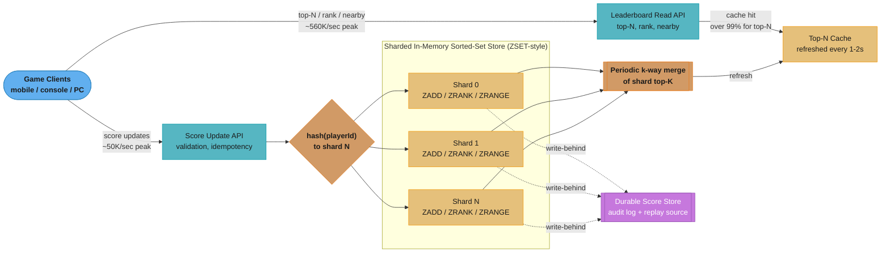
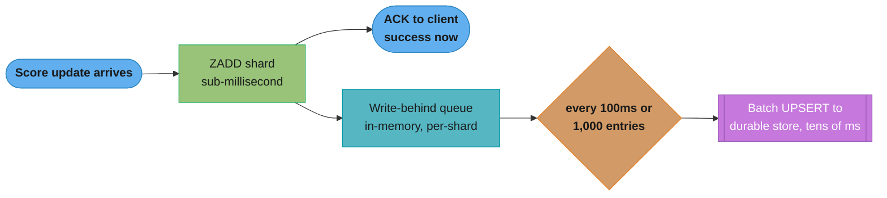
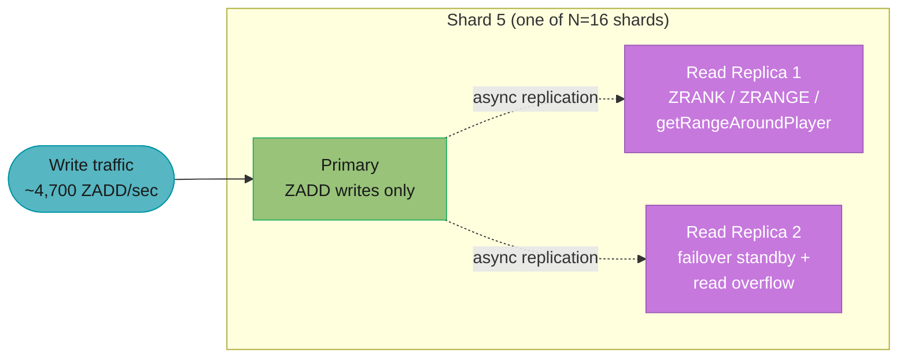
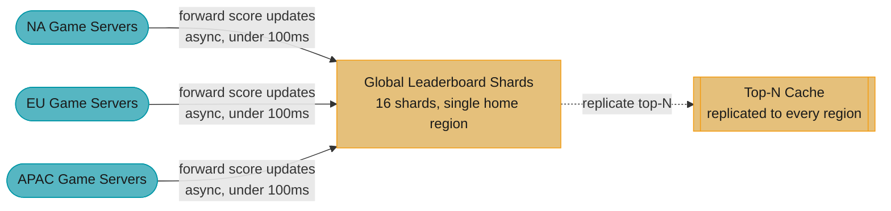
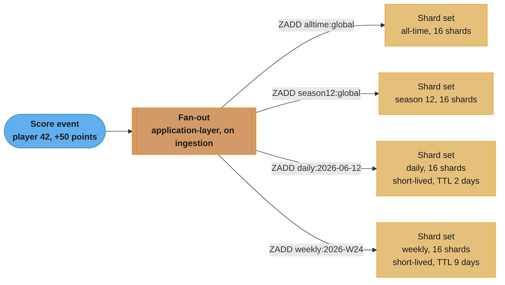
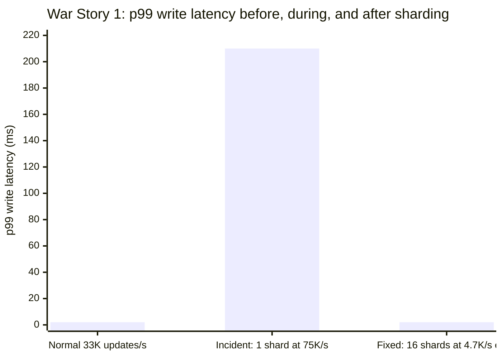
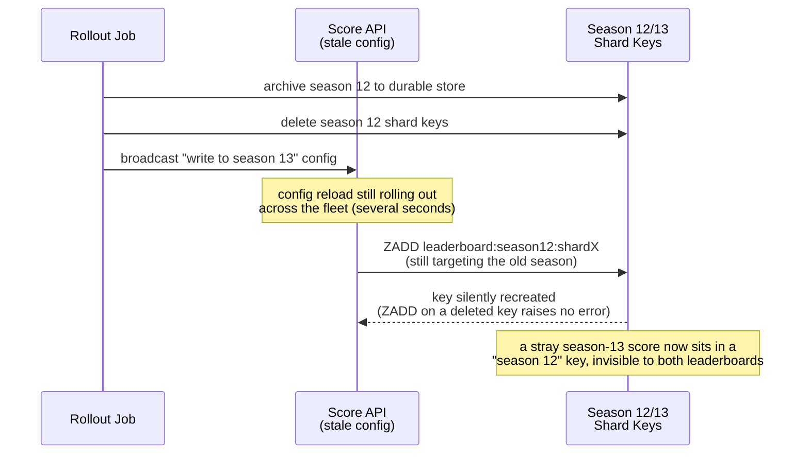

# System Design: Leaderboard

## Intuition

> **Design intuition**: A leaderboard is fundamentally **one sorted collection that two very different audiences hammer simultaneously**: writers (every player whose score just changed) need their update reflected in the ordering within seconds, and readers (everyone viewing the "Top 100" or checking "where do I rank") need that ordering returned in single-digit milliseconds at enormous read volume. The data structure that makes both sides cheap is a **sorted set backed by a skip list** — `O(log N)` insert/update and `O(log N)` rank lookup, with `O(log N + M)` range scans for "give me the top M" or "give me the M players around rank R." Redis's `ZSET` is the textbook embodiment of this structure, which is why it is the default answer to "design a leaderboard" in nearly every systems interview.
>
> The deeper story is what happens when **one sorted set isn't enough** — when 100 million players' scores can't fit on one node, or when 50,000 score updates per second during a tournament finale all converge on the same in-memory structure and turn it into a hotspot. The entire architecture beyond "use a ZSET" exists to answer: **how do you shard a sorted set without losing the property that made it useful — a single, globally ordered ranking?**

**Key insight**: A leaderboard's hardest problem is not storing scores — it's **maintaining a total order across a sharded dataset while serving sub-100ms top-K and per-player rank queries at write rates that would overwhelm any single node**. Every technique in this design — sharding by consistent-hash of player ID (§4.2), k-way merging per-shard top-Ks into a global top-K (§4.2), encoding tiebreakers directly into the sort key so ties never produce ambiguous orderings (§4.3), and caching the global top-N with a short refresh interval (§5) — is a different facet of the same tradeoff: **exact, real-time, globally-ordered ranking is expensive; approximately-fresh, sharded, locally-exact ranking is cheap**, and a production leaderboard always lands somewhere on that spectrum rather than at either extreme.

This same tension — exact-but-expensive versus approximate-but-cheap — reappears in nearly every section that follows, so it is worth holding onto as the thread connecting them.

---

## 1. Requirements Clarification

### Functional Requirements

- **Submit/update a player's score**: `updateScore(playerId, leaderboardId, scoreDelta or newScore)` — applied either as an absolute set (e.g., "current total XP") or an incremental delta (e.g., "+50 points for this kill"), depending on the game's scoring model
- **Get the global top-N leaderboard**: `getTopN(leaderboardId, n)` — returns the top `n` players (commonly `n = 10, 50, 100`) ordered by score descending, with deterministic tie-breaking
- **Get a player's rank and nearby ranks**: `getRank(playerId, leaderboardId)` returns the player's current position (1-indexed) in the global ordering; `getRangeAroundRank(playerId, leaderboardId, windowSize)` returns the `windowSize` players immediately above and below the player ("show me players around my rank")
- **Per-game / per-season / time-windowed leaderboards**: a player participates in multiple simultaneous leaderboards — an **all-time** leaderboard, a **seasonal** leaderboard (resets every season), and **time-windowed** leaderboards (**daily**, **weekly**) that reset on a fixed schedule
- **Deterministic tie-breaking**: when two players have identical displayed scores, a documented tiebreaker rule (commonly: the player who *reached* that score first wins the tie, i.e., earlier achievement timestamp ranks higher) must produce a **stable** ordering — the same two tied players must always appear in the same relative order across repeated queries
- **Leaderboard reset / season rollover**: at a season boundary, the active leaderboard is archived (for historical "Season 12 Top 100" displays) and a fresh, empty leaderboard begins accepting scores for the new season

### Non-Functional Requirements

- **Near-real-time rank updates**: a score update should be reflected in `getRank` and `getTopN` results within **1-2 seconds** — players expect to see their rank change immediately after a match ends, not minutes later
- **Very high write QPS during peak events**: score updates can spike to **tens of thousands per second** during double-XP weekends, tournament finales, or new-season launches — the write path must not degrade catastrophically under this load
- **Extremely high read QPS for top-N**: the "Top 100" view is the single most-viewed screen in many games, often refreshed every few seconds by every active client — this is the most heavily-cacheable read in the system and must be served from cache, not computed per-request
- **Scale to 100M+ players** per major leaderboard (a global all-time leaderboard for a hit game), with **5M+ concurrent players** during peak hours
- **Bounded staleness for global rank, exact correctness for personal rank**: a player's *own* rank, after their *own* score update, should reflect that update immediately (read-your-writes for the player's own data); the *global* top-N can tolerate a few seconds of staleness in exchange for cacheability. Mechanically, this read-your-writes guarantee is achievable *without* any session-affinity or sticky-routing tricks: because a player's score update is routed by `hash(playerId)` to exactly one owning shard (§4.2), and a subsequent `getRank(playerId)` for that *same* player is routed by the *same* hash to the *same* shard, the read always lands on the shard that just processed the write — there is no cross-shard replication lag to wait out for a player's own data, only for their visibility in the cross-shard top-N merge
- **Durability**: a score, once acknowledged, must survive a cache-node crash — the in-memory ranking structure is a performance layer over a durable system of record, not the system of record itself

### Out of Scope

- **Anti-cheat / score-validation logic** — detecting impossible score jumps (e.g., a player's score increasing by 10x the theoretical maximum per match) is a separate fraud-detection pipeline; this design assumes scores arriving at the leaderboard service have already passed game-server-side validation
- **Friend leaderboards / social graph filtering** — "show me my rank among just my friends" requires intersecting the global leaderboard with a friends list, a join this design treats as a downstream feature built on top of the primitives here, not a core architectural concern
- **Matchmaking and skill rating (ELO/MMR/TrueSkill)** — a leaderboard *displays* a ranking derived from scores; the algorithms that *compute* skill ratings for matchmaking purposes are a related but distinct system (cross-ref [`./design_uber.md`](./design_uber.md) for an analogous "separate the display layer from the computation layer" pattern in a different domain)

---

## 2. Scale Estimation

### Player Population

- **100 million monthly active players (MAP)** across the game's global all-time leaderboard
- **Peak concurrent players: 5 million** during evening peak hours across all timezones combined
- Of those 5M concurrent, assume roughly **20% are actively completing matches/rounds** that trigger score updates at any given moment -> **1M "actively scoring" players** at peak

### Score Update (Write) Volume

- **Average**: each actively-scoring player triggers a score update roughly every **30 seconds** (one match/round/kill credited) -> `1,000,000 / 30` ~= **33,000 score updates/sec average** during normal peak
- **Event peak** (double-XP event, tournament finale, new-season launch): update frequency roughly doubles and the "actively scoring" population grows by ~50% -> `1,500,000 / 20` = **~75,000 updates/sec**, rounded to the working figure of **50,000 updates/sec** for steady high-event load with bursts toward 75K
- Each score-update message is small: `playerId` (8 bytes), `leaderboardId` (4 bytes), `scoreDelta or newScore` (8 bytes), `timestamp` (8 bytes), `tiebreakerMeta` (8 bytes) ~= **~40 bytes** -> at 50,000/sec, **~2 MB/sec** of write traffic — trivial in bandwidth terms; the bottleneck is **per-operation overhead** (skip-list insert/update + rank computation), not payload size

### Read (Query) Volume

- **Top-N reads**: every active client polls or refreshes the "Top 100" view roughly every **10 seconds**. At 5M concurrent -> `5,000,000 / 10` = **500,000 top-N requests/sec** at peak. Because the top-100 list changes relatively slowly (most of the 100M players are nowhere near the top), this is **almost entirely cacheable** — a cached response served to all 500K req/sec collapses the actual backend query rate to near-zero between cache refreshes
- **Player-rank lookups** ("what's my rank?"): roughly **10% of concurrent players** check their own rank per 10-second window -> `500,000 / 10` = **50,000 rank-lookup requests/sec** — much less cacheable than top-N (each player's rank is a distinct query), so this load lands closer to the live data structure
- **"Players around my rank" queries**: a smaller fraction, roughly **2% of concurrent players** per window -> `100,000 / 10` = **10,000 requests/sec**

### Storage Footprint

- **100M players x ~80 bytes/entry** in the sorted-set structure (player ID 8 bytes + composite score key 8 bytes + skip-list pointer overhead ~64 bytes, §4.1) ~= **~8 GB** for one global leaderboard's in-memory ranking structure
- **Durable score history** (for audit, analytics, and cache-recovery replay, §4.5): each score update written as a row of roughly **64 bytes** (playerId, leaderboardId, score, timestamp, tiebreaker) — at 50,000 updates/sec sustained for an 8-hour peak event, `50,000 x 64 bytes x 28,800 sec` ~= **~92 GB/event** of append-only history, comfortably handled by a log-structured durable store (§4.5)
- **Multiple concurrent leaderboards per player**: all-time + current season + daily + weekly = **4 leaderboards**, each holding up to 100M entries -> total in-memory footprint across all leaderboard types ~= `4 x 8 GB` = **~32 GB** for the full set of "live" leaderboards, before sharding

### Read/Write Ratio and the Caching Implication

- Combining the read figures above: `500,000 (top-N) + 50,000 (rank) + 10,000 (nearby)` = **560,000 reads/sec** against **~50,000-75,000 writes/sec** -> a read:write ratio of roughly **8:1 to 11:1** at peak
- The ratio alone understates the actual skew: of the 560,000 reads/sec, **~89% (500,000) are top-N reads that are answered by a single shared cache entry per leaderboard type** — meaning the *backend query rate* the sharded store must actually serve is closer to `50,000 (rank) + 10,000 (nearby)` = **60,000 direct-to-shard reads/sec**, plus a trivial trickle of top-N cache-miss/refresh queries (one query per leaderboard type per refresh cycle, §4.2)
- This is the architectural justification for splitting "global top-N" (cached, §5) from "personal rank" (live, §3): **a single cached top-N response absorbs 500,000 req/sec for the cost of one merge every 1-2 seconds**, while personal-rank and nearby-rank queries — which cannot be shared across players — scale with the sharded store's per-shard `ZRANK`/`ZRANGE` throughput (§10)

### Bandwidth Estimation

- **Score-update ingest**: 50,000-75,000 updates/sec x ~40 bytes/update (§2 above) ~= **2-3 MB/sec inbound** — negligible
- **Top-N response egress**: 500,000 req/sec x ~3KB (a top-100 response with player names, scores, and ranks serialized) ~= **1.5 GB/sec ~= 12 Gbps** at peak — this is the dominant bandwidth consumer, and it is **entirely served from the Top-N Cache** (§3), making it a cache-tier/CDN-edge cost rather than a sharded-store cost
- **Rank-lookup response egress**: 50,000 req/sec x ~200 bytes (a single player's rank, score, and a small "nearby" snippet) ~= **10 MB/sec ~= 80 Mbps** — three orders of magnitude below the top-N egress, illustrating again how heavily top-N dominates total traffic despite personal-rank being the "harder" query computationally
- **"Players around my rank" response egress**: 10,000 req/sec x ~1KB (10-11 entries with names/scores) ~= **10 MB/sec ~= 80 Mbps**

| Traffic Type | Direction | Peak Bandwidth |
|---|---|---|
| Score-update ingest | Inbound | ~2-3 MB/sec |
| Top-N response egress (cached) | Outbound | ~12 Gbps |
| Rank-lookup response egress | Outbound | ~80 Mbps |
| "Around my rank" response egress | Outbound | ~80 Mbps |

The ~150x gap between top-N egress (~12 Gbps) and rank-lookup egress (~80 Mbps) mirrors the >99% CDN-hit-rate effect in [`./design_google_maps.md`](./design_google_maps.md) §10 expressed in a different domain: **the single highest-volume query is also the single most cacheable one**, so the infrastructure that actually has to "think" (the sharded sorted-set store, §4.1-§4.2) carries a small fraction of the system's total bandwidth despite being its most architecturally interesting component.

---

## 3. High-Level Architecture



Writes hash by `playerId` into one of `N` shards while reads split between the Top-N Cache (over 99% hit rate) and the sharded store directly; a periodic k-way merge refreshes the cache and every shard write-behinds asynchronously to the durable store.

### Write Path

1. A game-server event (match end, kill credited, level completed) produces a `ScoreUpdate(playerId, leaderboardId, scoreDelta, achievementTimestamp)` message, sent to the **Score Update API**.
2. The API validates the update (player exists, leaderboard is active, delta is within sane bounds) and computes the **composite sort key** (§4.3) encoding `(score, tiebreaker)` into a single sortable value.
3. The update is routed by `hash(playerId)` to one of `N` **shards** (§4.2), each an independent sorted-set instance. `ZADD shard:leaderboard:<id>:<shardIdx> <compositeKey> <playerId>` updates that player's position in `O(log M)` where `M` is the shard's entry count.
4. The write is **acknowledged to the client** as soon as the in-memory ZADD completes (sub-millisecond) — durability to the backing store happens **asynchronously** via write-behind (§4.4), decoupling client-perceived latency from durable-store write latency.
5. A background process periodically (every 1-2 seconds) recomputes the **global top-N** by querying each shard's local top-K and k-way-merging the results (§4.2), refreshing the **Top-N Cache**.

### Read Path

1. **Top-N requests** hit the Top-N Cache first — at >99% hit rate (the cache is refreshed every 1-2 seconds regardless of read volume, so it absorbs the full 500K req/sec from §2 without touching the sharded store).
2. **Player-rank requests** (`getRank(playerId)`) are routed by `hash(playerId)` to the player's owning shard, which computes the player's **local rank within its shard** via `ZRANK` in `O(log M)`. The player's **global rank** is then estimated as `localRank + sum(shard.countAboveCompositeKey for all other shards)` (§4.2) — either computed on-demand (more accurate, more expensive) or approximated from the periodically-refreshed merge state (cheaper, slightly stale).
3. **"Players around my rank"** queries first resolve the player's local rank (step 2), then issue a `ZRANGE` query for a window of ranks around that position on the owning shard (§4.4) — for players not near a shard boundary, this is sufficient; for players near the global top/bottom of their shard, the window may need to pull a few entries from an adjacent shard's extremes.

---

## 4. Component Deep Dives

### 4.1 Skip-List-Backed Sorted Set — ZADD, ZRANK, ZRANGE Internals

Redis's `ZSET` is implemented as a combination of a **hash table** (mapping member -> score, for `O(1)` score lookups) and a **skip list** (an ordered linked-list structure with multiple "levels" of forward pointers, giving `O(log N)` search, insert, and delete while maintaining sorted order). A skip list is the data structure that makes a leaderboard's three core operations all cheap simultaneously:

- **`ZADD key score member`** — `O(log N)`: insert or update a member's score. If the member already exists, its node is removed and reinserted at the position corresponding to its new score — both removal and insertion are `O(log N)` because the skip list's level structure lets the search skip large portions of the list.
- **`ZRANK key member`** — `O(log N)`: returns the 0-indexed position of `member` in the sorted order. The skip list tracks a **span** at each level — the number of nodes a forward pointer "skips over" — so computing a rank is a single top-down traversal summing spans, without walking every element.
- **`ZRANGE key start stop`** — `O(log N + M)` where `M` is the number of elements returned: traverse to the `start` rank in `O(log N)`, then walk the bottom-level linked list for `M` elements.

```
Skip list for a leaderboard shard (scores shown, higher = better rank):
Level 3:  HEAD ----------------------------------> [9500] ----------> NIL
Level 2:  HEAD --------------> [8700] -----------> [9500] ----------> NIL
Level 1:  HEAD ----> [6200] -> [8700] -> [9100] --> [9500] -> [9800] -> NIL
Level 0:  HEAD -> [5000] -> [6200] -> [7400] -> [8700] -> [9100] -> [9500] -> [9800] -> NIL
                  (rank 7)   (rank 6)  (rank 5) (rank 4) (rank 3)  (rank 2)  (rank 1)

ZRANK "player_at_9100" -> traverse Level 3 (skip past 9500, overshoots) ->
                          drop to Level 2 (land at 8700, span=4) ->
                          drop to Level 1, walk to 9100 -> accumulate span -> rank 5
```

#### Java: `SkipListLeaderboard` — A Working In-Memory Implementation

The following implements the core operations of a single-shard leaderboard using a skip-list-like structure (Java's `ConcurrentSkipListMap`, which provides the same `O(log N)` ordered-map guarantees as Redis's internal skip list, plus thread-safety for concurrent updates):

```java
package com.rutik.systemdesign.hld.case_studies.leaderboard;

import java.util.ArrayList;
import java.util.List;
import java.util.Map;
import java.util.concurrent.ConcurrentHashMap;
import java.util.concurrent.ConcurrentSkipListMap;

/**
 * Single-shard leaderboard backed by a skip-list-ordered map (composite sort
 * key -> playerId) plus a reverse hash map (playerId -> composite key) for
 * O(log N) update-by-player-id. Mirrors the semantics of Redis ZADD/ZRANK/
 * ZRANGE/ZREVRANGE on a ZSET.
 */
public class SkipListLeaderboard {

    // Ordered descending: highest composite key (best rank) first.
    private final ConcurrentSkipListMap<Long, String> byScore =
            new ConcurrentSkipListMap<>((a, b) -> Long.compare(b, a));

    // playerId -> current composite key, so we can remove the old entry on update.
    private final Map<String, Long> playerKeys = new ConcurrentHashMap<>();

    /**
     * Inserts or updates a player's composite sort key (score + tiebreaker
     * encoded together, see CompositeScoreKey). O(log N).
     */
    public void addOrUpdate(String playerId, long compositeKey) {
        Long previous = playerKeys.put(playerId, compositeKey);
        if (previous != null) {
            byScore.remove(previous);
        }
        byScore.put(compositeKey, playerId);
    }

    public void remove(String playerId) {
        Long previous = playerKeys.remove(playerId);
        if (previous != null) {
            byScore.remove(previous);
        }
    }

    /**
     * Returns the 0-indexed global rank of {@code playerId} within this
     * shard, or -1 if not present. O(log N) via headMap().size() on the
     * skip-list-backed map.
     */
    public int getRank(String playerId) {
        Long key = playerKeys.get(playerId);
        if (key == null) {
            return -1;
        }
        // headMap(key, false) returns all entries strictly "better" than key
        // (since the map is ordered descending, headMap = higher scores).
        return byScore.headMap(key, false).size();
    }

    /** Returns the top {@code n} (playerId, compositeKey) pairs. O(log N + n). */
    public List<Entry> getTopN(int n) {
        List<Entry> result = new ArrayList<>(n);
        for (var e : byScore.entrySet()) {
            if (result.size() >= n) break;
            result.add(new Entry(e.getValue(), e.getKey()));
        }
        return result;
    }

    /**
     * Returns up to {@code windowSize} entries above and below the given
     * player's rank (inclusive of the player). O(log N + windowSize).
     */
    public List<Entry> getRangeAroundPlayer(String playerId, int windowSize) {
        int rank = getRank(playerId);
        if (rank < 0) {
            return List.of();
        }
        int start = Math.max(0, rank - windowSize);
        int count = windowSize * 2 + 1;
        List<Entry> result = new ArrayList<>(count);
        int skipped = 0;
        for (var e : byScore.entrySet()) {
            if (skipped++ < start) continue;
            if (result.size() >= count) break;
            result.add(new Entry(e.getValue(), e.getKey()));
        }
        return result;
    }

    public int size() {
        return byScore.size();
    }

    public record Entry(String playerId, long compositeKey) {}
}
```

`ConcurrentSkipListMap.headMap(key, false).size()` is documented as `O(log N)` for `NavigableMap` implementations backed by a skip list (the structure tracks subtree/span sizes at each level), matching Redis's `ZRANK` complexity. The `getRangeAroundPlayer` and `getTopN` methods both pay an `O(log N)` cost to locate the starting position and then `O(M)` to walk `M` elements — exactly the `O(log N + M)` bound Redis documents for `ZRANGE`.

#### Memory Layout

Each skip-list node carries: the member ID (8 bytes for a numeric player ID), the score/composite-key (8 bytes), a backward pointer, and a variable number of forward pointers (one per level the node participates in — most nodes are level 1, a geometrically-decreasing fraction reach higher levels). Redis's real-world overhead per ZSET entry is commonly cited around **80-100 bytes** including the hash-table side's entry — consistent with the §2 estimate of ~8GB for 100M entries.

### 4.2 Sharding Strategy and Global Top-K Merge

A single sorted set holding **100M entries** and absorbing **50,000 ZADD/sec** is workable on one well-provisioned node in isolation — but it concentrates *all* write traffic for *every* player onto *one* node, and a single Redis instance has a practical ceiling somewhere in the **low hundreds of thousands of ops/sec** depending on payload size and persistence settings. War Story 1 (§9) walks through what happens when that ceiling is approached during a real event. The fix is **sharding by `hash(playerId)` into `N` independent sorted sets** (cross-ref [`./design_key_value_store.md`](./design_key_value_store.md) §4.1 for the consistent-hashing mechanics that decide which shard owns which player — the same ring-with-virtual-nodes approach applies here, with `playerId` as the hash key).

Sharding solves the write-hotspot problem but introduces a new one: **no single shard knows the global top-K**, because each shard only sees `1/N` of the players, chosen by hash, not by score — the globally-best player could be on any shard, and a shard's "top 10" is only the top 10 *of its own slice*. The fix is a **k-way merge**: each shard exposes its own local top-K (`K >= globalTopN` to guarantee correctness — see the worked argument below), and a merger periodically pulls all `N` shards' local top-K lists and merges them into the global top-N.

**Why local `K` must be `>= N` (the global top-N size) — worked example**: suppose `globalTopN = 100` and there are `4` shards. If each shard only exposed its local top-25, and (by bad luck) **60 of the true global top-100** happen to hash onto a single shard, that shard's top-25 contains only 25 of "its" 60 qualifying players — the merge would be **missing 35 players** that genuinely belong in the global top-100, because they never made it into any shard's reported set. Setting each shard's local `K = globalTopN = 100` guarantees that **even in the worst case** (all 100 global-top-100 players land on one shard), that shard reports all 100 of them, and the merge is provably correct. In practice, with `playerId`-hash sharding and `N` shards, the *expected* number of global-top-100 players on any one shard is `100/N`, but the worst case — not the expected case — is what determines correctness, which is why `K = globalTopN` (not `globalTopN / N`) is the right per-shard fetch size.

#### Java: `GlobalTopKMerger`

```java
package com.rutik.systemdesign.hld.case_studies.leaderboard;

import java.util.ArrayList;
import java.util.List;
import java.util.PriorityQueue;

/**
 * Merges each shard's local top-K leaderboard entries into a single global
 * top-N using a k-way merge over a min-heap, analogous to merging N sorted
 * lists. Each shard's local list is already sorted descending by composite
 * key (best first); local K must be >= globalN for correctness (see prose).
 */
public class GlobalTopKMerger {

    private final List<SkipListLeaderboard> shards;

    public GlobalTopKMerger(List<SkipListLeaderboard> shards) {
        this.shards = shards;
    }

    /**
     * Returns the global top-N entries across all shards, merged in
     * descending composite-key order. Runs in O(N_shards * log N_shards +
     * globalN * log N_shards) using a min-heap of per-shard cursors.
     */
    public List<SkipListLeaderboard.Entry> mergeTopN(int globalN) {
        // Each shard contributes its local top-globalN (worst-case-correct, see prose).
        List<List<SkipListLeaderboard.Entry>> localTopK = new ArrayList<>(shards.size());
        for (SkipListLeaderboard shard : shards) {
            localTopK.add(shard.getTopN(globalN));
        }

        // Max-heap by composite key: we want the *highest* key first, so use
        // a heap ordered descending and track each shard's read cursor.
        PriorityQueue<Cursor> heap = new PriorityQueue<>(
                (a, b) -> Long.compare(b.currentKey(), a.currentKey()));

        for (int shardIdx = 0; shardIdx < localTopK.size(); shardIdx++) {
            List<SkipListLeaderboard.Entry> list = localTopK.get(shardIdx);
            if (!list.isEmpty()) {
                heap.add(new Cursor(shardIdx, 0, list));
            }
        }

        List<SkipListLeaderboard.Entry> merged = new ArrayList<>(globalN);
        while (!heap.isEmpty() && merged.size() < globalN) {
            Cursor cursor = heap.poll();
            merged.add(cursor.list.get(cursor.index));
            if (cursor.index + 1 < cursor.list.size()) {
                heap.add(new Cursor(cursor.shardIdx, cursor.index + 1, cursor.list));
            }
        }
        return merged;
    }

    /**
     * Approximates a player's global rank by adding the player's local rank
     * on its owning shard to the count of entries on OTHER shards whose
     * composite key beats the player's. This requires each shard to expose
     * a "count entries above key K" operation (O(log N) via headMap, §4.1).
     */
    public long approximateGlobalRank(int ownerShardIdx, long playerCompositeKey, int localRank) {
        long globalRank = localRank; // 0-indexed local rank on the owning shard
        for (int i = 0; i < shards.size(); i++) {
            if (i == ownerShardIdx) continue;
            globalRank += shards.get(i).countAboveKey(playerCompositeKey);
        }
        return globalRank;
    }

    private record Cursor(int shardIdx, int index, List<SkipListLeaderboard.Entry> list) {
        long currentKey() {
            return list.get(index).compositeKey();
        }
    }
}
```

`countAboveKey` (referenced above) is a one-line addition to `SkipListLeaderboard`: `byScore.headMap(key, false).size()` — the same `O(log N)` `headMap` operation `getRank` already uses, just against an arbitrary key rather than a player's own key.

**Cost of the merge at scale**: with `N = 16` shards and `globalN = 100`, each merge pulls `16 x 100 = 1,600` entries (a few hundred KB) and runs a 16-way merge bounded at 100 output elements — on the order of **single-digit milliseconds**. Running this merge **every 1-2 seconds** (§3) and caching the result means the 500,000 req/sec top-N read load (§2) never touches this computation directly — it's entirely absorbed by the Top-N Cache.

### 4.3 Tiebreaker-Encoded Composite Sort Keys

Two players who both have **10,000 points** are, from the player's perspective, "tied" — but the leaderboard must still produce *some* total order between them, and that order must be **stable**: the same pair of tied players must rank in the same relative order on every query, forever (until one of their scores changes), or the leaderboard appears to "flicker" (War Story 2, §9). The standard rule — "whoever reached the score first ranks higher" — requires the **score** to dominate the ordering but the **achievement timestamp** to break ties, and the cleanest way to implement this is to **pack both values into a single sortable integer** so the sorted-set comparison (a simple integer comparison) handles both at once, with no secondary comparison step.

#### Bit-Packing Scheme

A 64-bit composite key is split into a **high bits** region for the score and a **low bits** region for the tiebreaker:

```
Composite Key (64 bits, unsigned):
+----------------------------------------------+------------------------+
|              Score (40 bits)                  |  Tiebreaker (24 bits)  |
|        max value: 2^40 - 1 ~= 1.0995 x 10^12  |  max: 2^24 - 1 = ~16.7M |
+----------------------------------------------+------------------------+
   bits 63..24                                     bits 23..0
```

- **Score (high 40 bits)**: supports scores up to ~1.1 trillion — far beyond any realistic game score, with headroom for cumulative-XP-style scores that grow over a player's lifetime.
- **Tiebreaker (low 24 bits)**: encodes the achievement timestamp **inverted and truncated** — because the sorted set orders by composite-key descending (highest = best rank), and the rule is "earlier timestamp wins ties," the tiebreaker bits must be **larger for earlier timestamps**. This is achieved by computing `tiebreakerBits = MAX_24_BIT - (secondsSinceLeaderboardEpoch & MAX_24_BIT)` — an earlier timestamp (smaller `secondsSinceEpoch`) produces a *larger* `tiebreakerBits` value, which sorts higher within the same score band. `2^24` seconds is ~194 days — within one season (commonly 60-90 days), this provides second-level tiebreaker resolution without collision.

#### Worked Example

Two players both reach **10,000 points**, at different times within the current season:

| Player | Score | Achievement Time (sec since season epoch) | Tiebreaker bits = `16,777,215 - time` | Composite Key = `(score << 24) \| tiebreaker` |
|---|---|---|---|---|
| Alice | 10,000 | 100,000 (reached it earlier) | `16,777,215 - 100,000` = `16,677,215` | `(10,000 << 24) \| 16,677,215` = `167,772,160,000 + 16,677,215` = `167,788,837,215` |
| Bob | 10,000 | 150,000 (reached it later) | `16,777,215 - 150,000` = `16,627,215` | `(10,000 << 24) \| 16,627,215` = `167,772,160,000 + 16,627,215` = `167,788,787,215` |

`167,788,837,215 > 167,788,787,215` -> **Alice's composite key is larger -> Alice ranks above Bob**, correctly reflecting "Alice reached 10,000 points first." A single `ZADD` with this composite key and a single descending sort handles both score comparison and tie-breaking — `ZRANGE` never needs a secondary sort pass, and two tied players' relative order is **fixed at write time**, eliminating the non-determinism that causes rank flicker (War Story 2, §9).

```java
package com.rutik.systemdesign.hld.case_studies.leaderboard;

/** Packs (score, achievementTime) into a single sortable long, descending-order-correct. */
public final class CompositeScoreKey {
    private static final int TIEBREAKER_BITS = 24;
    private static final long TIEBREAKER_MASK = (1L << TIEBREAKER_BITS) - 1; // 16,777,215

    /**
     * @param score              non-negative score, must fit in (64 - TIEBREAKER_BITS) = 40 bits
     * @param secondsSinceEpoch  seconds since the leaderboard's season epoch
     */
    public static long encode(long score, long secondsSinceEpoch) {
        long tiebreaker = TIEBREAKER_MASK - (secondsSinceEpoch & TIEBREAKER_MASK);
        return (score << TIEBREAKER_BITS) | tiebreaker;
    }

    public static long decodeScore(long compositeKey) {
        return compositeKey >>> TIEBREAKER_BITS;
    }
}
```

### 4.4 Time-Windowed Leaderboards — Key-Naming with TTL vs. Sliding Window

Daily, weekly, and seasonal leaderboards (§1) need their own independent rankings that **reset on a schedule**. Two approaches:

**Key-naming with TTL-based expiry** — each time window gets its own sorted-set key, e.g., `leaderboard:daily:2026-06-12`, `leaderboard:weekly:2026-W24`, `leaderboard:season:12`. A new key is created at the start of each window (the first score update of the day creates `leaderboard:daily:2026-06-12` via `ZADD`), and the *previous* day's key is left to expire via a TTL (e.g., 48 hours, long enough for "yesterday's leaderboard" displays) or is archived to the durable store (§4.5) before expiring.

- **Pro**: trivially simple — "today's leaderboard" is just "the sorted set named with today's date," no special data structure
- **Pro**: old windows don't need active cleanup beyond TTL — Redis expires them automatically
- **Con**: a player's score must be written to **multiple keys simultaneously** (daily + weekly + seasonal + all-time = 4 `ZADD` calls per score update) — write amplification proportional to the number of concurrent windows
- **Con**: at the exact boundary (midnight), there's a brief window where "today's" key doesn't exist yet — the first `ZADD` of the new day implicitly creates it, which is safe in Redis (operations on a non-existent key create it) but means a `getTopN` query for "today" issued in the first millisecond of a new day returns an empty leaderboard, not an error — correct, but worth handling explicitly in the client UI ("no scores yet today")

**Sliding-window data structure** — a single persistent structure where each entry carries a timestamp, and queries filter to "entries within the last 24 hours" at read time (e.g., a sorted set keyed by `(timestamp, playerId)` with a separate score lookup, or a time-bucketed structure like the one in [`./design_ad_click_aggregation.md`](./design_ad_click_aggregation.md) §4.2's tumbling/sliding window discussion).

- **Pro**: no write amplification — one write updates one structure, and "daily" is a *query-time* filter, not a separate copy
- **Con**: "daily leaderboard rank" becomes a query over a filtered subset, which **breaks the simple `ZRANK` `O(log N)` guarantee** — ranking requires either re-aggregating the filtered subset (expensive) or maintaining a separate derived structure anyway (which is just the key-naming approach by another name)
- **Con**: a "true sliding window" (continuously rolling 24-hour window, not midnight-aligned) rarely matches what players expect — players think of "today's leaderboard" as calendar-day-aligned, not "my last 24 hours," so the sliding-window's main theoretical advantage (no reset discontinuity) doesn't match the product requirement

**This design uses key-naming with TTL** for daily/weekly/seasonal leaderboards specifically *because* the write amplification (4 `ZADD`s instead of 1) is cheap relative to score-update volume (§2: ~40 bytes/update, four `ZADD`s of ~40 bytes is still trivial bandwidth), while the read-side simplicity — every leaderboard type supports the full `ZRANK`/`ZRANGE`/`getTopN` API identically, with zero special-casing — is worth far more given the read volume from §2 (500K+ req/sec). The **season rollover** (§1) is then just: stop writing to `leaderboard:season:12`, archive it to the durable store as "Season 12 Final Standings," and begin `leaderboard:season:13` with the first score update of the new season.

### 4.5 Write-Path Durability — Async Write-Behind and Crash Recovery

The in-memory sorted-set shards (§4.2) are the **performance layer** — they answer the 50,000 writes/sec and 560,000 reads/sec from §2 with sub-millisecond and low-single-digit-millisecond latencies respectively. But memory is volatile: a shard-node crash without a durability mechanism loses every score update since the last persistence checkpoint. The durable store (a wide-column or relational store, partitioned by `(leaderboardId, season)`) is the **system of record**.

**Write-behind**: when a score update is acknowledged to the client (immediately after the in-memory `ZADD`, §3), the update is also appended to an in-memory **write-behind queue**. A background process drains this queue in **batches** (e.g., every 100ms or every 1,000 entries, whichever comes first) and writes them to the durable store as a batch `INSERT`/`UPSERT`. This decouples client-perceived write latency (sub-millisecond, bounded by the in-memory `ZADD`) from durable-store write latency (tens of milliseconds for a batched disk write) — the client never waits for the disk write.



The in-memory `ZADD` acknowledges the client in sub-millisecond time; the durable write happens asynchronously off a write-behind queue that flushes every 100ms or 1,000 entries, whichever comes first, so disk latency never blocks the client.

**Recovery on cache restart**: when a shard node restarts (planned maintenance or crash recovery), its in-memory sorted set is empty. The recovery process:

1. Query the durable store for **all current scores** for this shard's player range (`WHERE hash(playerId) % N = shardIdx AND leaderboardId = ? AND season = ?`)
2. For each row, recompute the composite key (§4.3) and `ZADD` it into the freshly-started shard
3. Once the replay completes, mark the shard **ready** and resume accepting traffic

**Replay time estimate**: a shard holding `100M / 16 shards` ~= **6.25M entries**, replayed at a bulk-load rate of roughly **50,000 `ZADD`s/sec** (bulk loading is typically faster than steady-state mixed read/write traffic, since there's no read contention) -> `6,250,000 / 50,000` = **125 seconds, just over 2 minutes** per shard. During this window, the shard should be marked unavailable and its traffic either queued or served stale-but-available from a replica (§8's runbook covers this explicitly) — a 2-minute gap in one shard's data would otherwise produce visibly incomplete top-N merges (§4.2) for that window.

**The write-behind queue's bounded-loss window**: if a shard crashes **before** its write-behind queue drains, any updates sitting in that queue (at most 100ms or 1,000 entries' worth) are lost — they were acknowledged to clients but never reached the durable store. This is a deliberate, bounded tradeoff: at 50,000 updates/sec system-wide, a 100ms window represents at most ~5,000 updates across all shards, or ~300 updates for a single 16-shard system — a small, bounded blast radius in exchange for not blocking every write on a synchronous disk round-trip. Systems requiring zero write loss would instead make the durable-store write **synchronous** before acknowledging the client — directly trading the sub-millisecond write latency for the durable store's latency (tens of milliseconds), which §5 covers as a design tradeoff.

### 4.6 "Players Around My Rank" — Efficient Windowed Rank Queries

"Show me the 5 players above and below me" is one of the most frequently-hit personalized queries (§2: ~10,000 req/sec). Naively, this looks like it requires knowing the player's exact global rank (an expensive cross-shard computation, §4.2) and then scanning from there — but in practice it decomposes into a cheap **local** operation for the overwhelming majority of players:

1. **Locate the player's shard** via `hash(playerId)` — `O(1)`.
2. **Compute the player's local rank** on that shard via `ZRANK` (`O(log M)` where `M` is the shard size, §4.1).
3. **`ZRANGE` a window around the local rank**: `ZRANGE shard (localRank - 5) (localRank + 5)` — `O(log M + 11)`, returning the 11 entries (5 above, the player, 5 below) on **this shard**.
4. **Boundary case**: if the player's local rank is within 5 of the shard's top or bottom, the window needs entries from an **adjacent shard's extremes** — fetch the bottom-5 of the shard "above" (in the global ordering) or the top-5 of the shard "below," and splice. Because shard assignment is by `hash(playerId)` (not by score range), "adjacent shard" here means adjacent in a **per-leaderboard sorted view of shard score-ranges**, which the merger (§4.2) already maintains as a byproduct of its periodic top-K merge — the merger can additionally track each shard's *minimum* composite key (not just its top-K maximums), giving an O(1) lookup for "which shard holds the next-lower-ranked entries."

This means **the common case (player not near a shard boundary) never triggers cross-shard communication** — a single shard answers the query with two `O(log M)` operations. Only the rare case (player happens to be near the score-boundary between two shards' local rankings) requires a second shard lookup, and even that is a single point query, not a scan.

**Important distinction**: this "nearby ranks" query returns the player's **local** rank-window, which may differ slightly from their **global** rank-window if other shards have many entries clustered near the player's score. For a leaderboard UI, this distinction is rarely visible — "players near my rank" showing locally-adjacent scores (which differ from the player's score by at most a handful of points in a 100M-player leaderboard with fine-grained scores) satisfies the product intent even if the displayed "rank numbers" are local approximations rather than exact global ranks. Systems requiring exact global rank numbers in this view pay the `approximateGlobalRank` cost from §4.2's `GlobalTopKMerger` once (for the center player) and display the local window's *relative* ordering with that one global-rank anchor.

### 4.7 Shard High Availability — Primary/Replica Layout and Read Scaling

Each of the `N` shards from §4.2 is a **single point of failure** for the ~6.25M players hashed onto it (§10) unless it's replicated. The standard layout mirrors Redis's own primary/replica model: each shard is a **primary** instance handling all `ZADD` writes plus a small number of **read replicas** (typically 1-2) that asynchronously stream the primary's write stream and serve `ZRANK`/`ZRANGE`/`getRangeAroundPlayer` reads (§4.6).



All `ZADD` writes land on the primary alone to keep composite-key ordering consistent (§4.3); both read replicas stream the primary's write log asynchronously and absorb `ZRANK`/`ZRANGE` read traffic plus failover standby duty.

**Why writes don't go to replicas**: routing `ZADD` only to the primary keeps the composite-key ordering (§4.3) and the skip-list structure (§4.1) consistent at a single source of truth — if writes could land on any replica, two replicas could independently reposition the same player's entry in slightly different orders relative to concurrent updates from other players, producing exactly the kind of cross-replica ordering divergence that caused War Story 2's flicker before the tiebreaker fix. Centralizing writes on the primary means **replication lag** (commonly single-digit milliseconds for same-region async replication) is the *only* source of read/write divergence, and it's bounded and monitored (§8).

**Read-replica staleness and the personal-rank guarantee**: §3's "a player's own rank reflects their own write immediately" guarantee is delivered by **routing a player's own `getRank` request to the shard's primary** (or to a replica known to have caught up past that player's last write's replication offset) rather than to an arbitrary replica — a few milliseconds of replication lag would otherwise mean a player who just scored could briefly see their *old* rank on a lagging replica, directly violating the read-your-writes NFR from §1. Global top-N reads (§4.2) and "players around my rank" for players *other than the requester* (§4.6) are insensitive to this lag and freely load-balance across all replicas.

**Failover**: if a shard's primary fails, one of its read replicas is promoted to primary (standard Redis Sentinel or Cluster failover, typically completing in a few seconds). During the failover window, `ZADD` writes for that shard's players are either buffered (§8's runbook, step 2) or briefly rejected; reads continue uninterrupted from the remaining replica(s). Because each shard holds only `~6.25M / 100M` ~= **6.25%** of the global leaderboard (§10), a single shard's brief failover affects only that slice of players' write availability — the other 15 shards (in a 16-shard layout) are entirely unaffected, which is the same fault-isolation argument made for Tier-1 routing nodes in [`./design_google_maps.md`](./design_google_maps.md) §10, applied here to leaderboard shards instead of regional routing fleets.

### 4.8 Multi-Region Players, Single Global Ranking

A 100M-player game (§2) has players distributed across every major region — North America, Europe, Asia-Pacific, and beyond — each connecting to a regional game-server cluster for **latency-sensitive gameplay** (matchmaking, real-time combat). The leaderboard, however, is **inherently global**: "Top 100" means top 100 *worldwide*, not top 100 per region. This creates a tension between "keep the hot path regional" (the usual multi-region playbook, cross-ref [`./design_key_value_store.md`](./design_key_value_store.md) §4.8's `LOCAL_QUORUM` framing) and "the ranking structure is one global total order."

The resolution mirrors §4.8's spirit but inverts which side is "local": **score-update ingestion is regional** (a player's score update is received by their nearest regional game-server cluster, minimizing the latency-sensitive gameplay-to-leaderboard round trip), but the **sharded sorted-set store itself is a single global deployment** — each of the 16 shards (§4.2) lives in one "leaderboard home region," and regional game-server clusters forward score updates to that home region asynchronously.



Score-update ingestion stays regional (each cluster forwards asynchronously to the one home-region shard set), while the read-heavy Top-N Cache is replicated outward so the highest-volume query never crosses a region boundary.

**Why this split is acceptable**: the score-update path (§3, §4.5) already tolerates the in-memory `ZADD` being asynchronous relative to durable-store persistence — adding "the `ZADD` itself is one extra inter-region hop away from the originating game server" is a **bounded, similar-magnitude latency addition** (commonly 20-100ms cross-region), which is well within the §1 "near-real-time, within 1-2 seconds" NFR for rank updates. In contrast, the **Top-N Cache** (§3, §4.2) — the highest-volume read (§2: 500K req/sec) — is **replicated to read-only caches in every region**, so the 89% of read traffic that's top-N reads never crosses a region boundary; only the comparatively rare cache-refresh queries (one per leaderboard type per 1-2 second cycle, §10) originate from the home region's merger and replicate outward.

**A player's personal rank** (§3's read-your-writes guarantee) is the one query genuinely sensitive to the cross-region hop: a player in APAC whose score update is still in flight to the NA-home-region shards, querying their own rank *immediately* after scoring, could see their pre-update rank if the query is answered before the update arrives. This is addressed the same way many multi-region systems handle "did my own write land yet" — the client-side SDK that submitted the score update tracks a local "pending update" flag and either (a) optimistically reflects the expected rank change in the UI before the server confirms it, or (b) the rank-lookup request carries a "wait for at least this update" token that the home-region shard can check against its applied-update log before responding. Either approach is a standard read-your-writes pattern for cross-region writes, not specific to leaderboards — the leaderboard-specific insight is simply recognizing **which of the system's queries (personal rank) are sensitive to this and which (global top-N) are not**, and designing the regional topology around that split rather than trying to make everything equally "global" or equally "regional."

### 4.9 One Score Update, Many Leaderboards — Fan-Out on Write

§1's functional requirements describe a player participating in **multiple simultaneous leaderboards**: an all-time leaderboard, a current-season leaderboard, a daily leaderboard, and a weekly leaderboard — and potentially per-game-mode variants of each. A single `updateScore(playerId, +50)` event therefore isn't a single `ZADD`; it's a **small, fixed-size fan-out** of `ZADD` operations, one per leaderboard the player is a member of.



One score event fans out into a small, constant number of `ZADD` calls (3-5 leaderboards), each landing on its own independently-keyed, independently-expiring shard set, so a failure in one leg never blocks or rolls back the others.

This fan-out is **small and constant-factor** — typically 3-5 leaderboards per score event, each a single `ZADD` (`O(log M)`, §4.1) — so it multiplies the §2 write QPS (50K/sec peak) by a small constant (3-5x), landing well within the per-shard headroom established in §10's shard-count derivation (which already assumed some multiplier). The key design choice is **doing the fan-out once, at ingestion**, rather than letting each leaderboard type independently subscribe to a raw score-event stream — a single ingestion-tier service (stateless, horizontally scalable per [`../scalability/README.md`](../scalability/README.md)) knows "this player is in season 12, and today is 2026-06-12, and this week is 2026-W24" and issues exactly the right `ZADD` calls, rather than every downstream leaderboard re-deriving that membership independently.

**Partial-failure handling**: if 3 of the 4 `ZADD`s in the fan-out succeed and the 4th (say, the daily leaderboard) fails transiently, the system does *not* roll back the other three — each leaderboard is an independent sorted set, and a missing entry on the daily leaderboard is a **self-healing gap**: the write-behind durability layer (§4.5) retries the failed `ZADD`, and even in the worst case, the daily leaderboard (TTL = 2 days, §4.4) simply expires and is rebuilt fresh the next day, bounding the blast radius of any one fan-out leg's failure to "at most one short-lived leaderboard, for at most one day." This is a deliberate consequence of the time-windowed leaderboards (§4.4) being **independently-keyed, independently-expiring** sorted sets rather than views derived from the all-time leaderboard — independence costs a small constant-factor write multiplier but buys exactly this kind of fault isolation.

---

## 5. Design Decisions & Tradeoffs

### In-Memory Sorted Set vs. Database-Backed Leaderboard with Materialized Views

| Dimension | In-Memory Sorted Set (Redis ZSET, this design) | Database + Periodic Materialized-View Refresh |
|---|---|---|
| Write latency | Sub-millisecond (`ZADD`, §4.1) | Tens of milliseconds (transactional `UPDATE` + index maintenance) |
| Read latency for top-N | Sub-millisecond from cache, low-single-digit-ms uncached (§4.2) | Depends on materialized-view refresh interval — instant if cached, but the *view itself* may be minutes stale |
| Rank-lookup (`ZRANK`) | `O(log N)`, milliseconds | Requires a `COUNT(*) WHERE score > ?` or a precomputed rank column — `O(N)` or requires its own index maintenance |
| Memory bound | Entire leaderboard must fit in RAM (~8GB per 100M-entry leaderboard, §2) — sharding (§4.2) required beyond single-node RAM | Disk-bound — scales to leaderboards far larger than any single node's RAM without sharding |
| Update staleness | Near-real-time (seconds, per NFR) | Bound by materialized-view refresh interval — commonly minutes |
| Operational complexity | Requires sharding + merge logic (§4.2) for very large leaderboards | Simpler at the storage layer, but the materialized-view refresh job is its own operational surface |
| Best fit | Real-time competitive leaderboards where "my rank changed seconds ago" matters (this design's NFRs) | Leaderboards where near-real-time isn't required — e.g., a "top contributors this month" page refreshed hourly |

### Single Global Sorted Set vs. Sharded + Merge

| Dimension | Single Global Sorted Set | Sharded (by `hash(playerId)`) + Merge (§4.2, this design) |
|---|---|---|
| Write throughput ceiling | Bounded by one node's sustainable `ZADD` rate (low hundreds of thousands ops/sec) — War Story 1's failure mode | Scales linearly with shard count — `N` shards each handle `total/N` writes |
| Hot-key / hotspot risk | Every write touches the same node — a write hotspot by construction during high-traffic events | Writes spread across `N` independent nodes by `hash(playerId)` — no single node sees disproportionate write load (absent pathological hash skew) |
| Global top-N accuracy | Always exact — one structure, one `ZRANGE` | Requires periodic k-way merge (§4.2) — global top-N is as fresh as the last merge cycle (typically 1-2 seconds stale) |
| Global rank accuracy | Always exact — one `ZRANK` call | Either an exact but expensive cross-shard sum, or an approximation from the last merge cycle (§4.2's `approximateGlobalRank`) |
| Operational complexity | Minimal — one structure to operate, back up, and recover | Higher — `N` independent shards, a merger process, and shard-rebalancing logic if `N` changes (cross-ref [`./design_key_value_store.md`](./design_key_value_store.md) §4.1 for consistent-hashing rebalancing) |
| Best fit | Leaderboards small enough that one node's throughput and memory suffice (e.g., a per-guild leaderboard with thousands of members) | The global, 100M-player leaderboard from §2 — sharding is not optional past a certain write-QPS and memory threshold |

### Real-Time Rank Updates vs. Periodically-Refreshed Cached Ranks

| Dimension | Real-Time (compute rank on every request) | Periodically-Refreshed Cache (this design's default for top-N, §4.2) |
|---|---|---|
| Freshness | Always current as of the moment of the query | As current as the last refresh cycle (1-2 seconds, §3) |
| Cost under high read QPS | Every one of the 500K req/sec (§2) top-N requests recomputes the merge — computationally infeasible | The merge runs once per cycle regardless of read volume — reads are O(1) cache lookups |
| Cost under high write QPS | Every write potentially invalidates cached ranks for many players — cache-invalidation storms | Writes don't trigger any cache work — the next scheduled refresh picks up all writes since the last cycle |
| User-perceived correctness | A player who just scored sees their new rank reflected *instantly* in top-N | A player who just scored sees their *own* rank update instantly (read-your-writes via the owning shard's `ZRANK`, §3) but the *global top-N cache* may lag by up to one refresh cycle |
| This design's choice | Used for **personal rank lookups** (§3, read-your-writes guarantee) | Used for **global top-N** (§3, the highest-read-volume query) — the 1-2 second staleness is imperceptible for a "Top 100" display that few players are *in*, while the cost savings are enormous |

The practical synthesis: **a player's own rank is always real-time** (their write goes to their owning shard, and a subsequent `ZRANK` on that same shard reflects it immediately — no cross-shard merge needed for a player to see their *own* position move), while **the global top-N list** — which 99.9999% of players are not part of, and which changes relatively slowly even during high-write-volume events — is refreshed on a cycle. This split is what makes the NFRs in §1 ("near-real-time" for personal rank, "high QPS, cacheable" for top-N) simultaneously achievable without contradiction.

### Shard Count: Few Large Shards vs. Many Small Shards

Given a fixed total write QPS and player count, the number of shards `N` is itself a tunable parameter with its own tradeoff curve — §10 derives `N=16` from the §2 numbers, but it's worth understanding *why* neither "fewer, larger shards" nor "more, smaller shards" dominates unconditionally.

| Dimension | Fewer, Larger Shards (e.g., `N=4`) | More, Smaller Shards (e.g., `N=64`) |
|---|---|---|
| Per-shard write QPS | Higher — closer to the single-node ceiling, less headroom before War Story 1 recurs | Lower — more headroom per shard, but more total shards to operate |
| Per-shard memory | Larger (`9GB/4` ~= 2.25GB/shard) — still small relative to modern instance RAM | Smaller (`9GB/64` ~= 140MB/shard) — many shards could be co-located on fewer physical nodes |
| Hash-skew / hotspot probability (War Story 1, §8) | **Higher** — fewer "buckets" means a higher probability that a small set of high-traffic players (tournament finalists) collide on the same shard | **Lower** — more buckets reduce collision probability, but never to zero (birthday-paradox-style — even 64 buckets can have collisions among a handful of finalists) |
| Global top-K merge cost (§4.2) | Lower — fewer shards to query and merge (`N x globalN` entries fetched) | Higher — `64 x 100` = 6,400 entries fetched per merge cycle vs. `4 x 100` = 400 — still cheap in absolute terms, but scales linearly with `N` |
| Operational surface (replicas, monitoring, failover) | Smaller — fewer primary/replica groups to manage (§4.7) | Larger — `64` primary/replica groups vs. `4`, each independently monitored |
| Rebalancing cost if `N` changes | Smaller absolute number of shards to redistribute, but each redistribution moves a *larger* fraction of data | Larger absolute number of shards, but consistent hashing (§4.2, cross-ref [`./design_key_value_store.md`](./design_key_value_store.md) §4.1) means each individual shard's data movement is smaller |

`N=16` (§10) sits in a middle zone deliberately: it provides **4-6x headroom** below the per-shard write ceiling (enough to absorb War Story 1-style spikes without immediately recurring), keeps the merge cost (`16 x 100` = 1,600 entries/cycle) trivial, and keeps the operational surface (16 primary/replica groups, §4.7) manageable for a single on-call team. The general heuristic: **pick the smallest `N` that gives comfortable write-QPS headroom**, since every other cost in the table above (merge cost, operational surface) grows with `N`, while only the hash-skew-collision *probability* meaningfully improves with larger `N` — and that probability is more directly addressed by the pre-emptive checks in §8's runbook than by blindly increasing `N`.

---

## 6. Real-World Implementations

- **Redis ZSET commands as the textbook building block**: `ZADD key score member` (insert/update), `ZRANGE key start stop [REV]` (range by rank, with `REV` for descending), `ZRANK key member [WITHSCORE]` (get rank, optionally with score in one round-trip), and `ZREVRANGE key start stop` (legacy descending-range syntax predating the `REV` flag) are the literal API surface this design's `SkipListLeaderboard` (§4.1) mirrors. Redis documents `ZADD` and `ZRANK` as `O(log N)` and `ZRANGE` as `O(log N + M)` — the exact complexities this design relies on throughout §4.
- **Mobile and online games (general architecture pattern)**: large-scale mobile games with global leaderboards (the pattern publicly discussed for titles in the scale class of Candy Crush, Clash of Clans, and Fortnite) commonly combine a **per-shard or per-region in-memory ranking tier** (handling the real-time write volume from local player populations) with **periodic global aggregation** for "world leaderboard" views — precisely the shard-plus-merge structure in §4.2. Regional sharding additionally aligns with these games' regional matchmaking and data-residency requirements, giving the sharding decision a second justification beyond pure throughput.
- **HackerRank / LeetCode / Kaggle (coding-platform leaderboards)**: competitive-programming and data-science platforms rank participants by a primary metric (problems solved, score, model accuracy) with **submission time as the tiebreaker** — structurally identical to §4.3's composite-key scheme, where "submission time" plays the role of the achievement timestamp. These platforms also showcase **per-contest time-windowed leaderboards** (§4.4) alongside an all-time/global ranking, the same multi-leaderboard-per-player structure as §1's daily/weekly/seasonal requirement.
- **Steam (game achievement and leaderboard APIs)**: Steam's Leaderboards API (`ISteamUserStats`) provides per-game leaderboards with operations directly analogous to `ZADD` (`UploadLeaderboardScore`), `ZRANGE` (`DownloadLeaderboardEntries` with a global or "around user" range type), and supports multiple leaderboards per game (one per map, mode, or difficulty) — a real-world instance of §1's "per-game leaderboard" requirement, with the "around user" range type matching §4.6's "players around my rank" query exactly.
- **Stock-market "most active" / trending-tickers lists**: a "top 20 most-traded stocks today" or "trending tickers" feature applies the identical top-K + rank-lookup pattern outside gaming — `score` is trading volume or price-change percentage (recomputed continuously), the "leaderboard" resets daily (§4.4's key-naming-with-TTL pattern maps directly: `trending:2026-06-12`), and the read pattern (a small, heavily-cached top-20 list viewed by enormous numbers of users) mirrors §2's top-N read-volume dominance almost exactly. This is a useful interview talking point for demonstrating that "leaderboard" is a *general ranking-and-query pattern*, not a gaming-specific structure.

### Adoption at a Glance

| System / Pattern | Ranking Primitive | Tiebreaker Strategy | Time-Windowing | Notable Detail |
|---|---|---|---|---|
| Redis ZSET (generic) | Skip list + hash table (§4.1) | Lexicographic by member at equal score (default) — must be overridden via composite keys (§4.3) | Key-naming with TTL (§4.4) | The reference implementation nearly every production leaderboard either *is* or is benchmarked against |
| Mobile/online games (Candy Crush / Clash of Clans / Fortnite class) | Sharded in-memory ranking, regional-then-global merge (§4.2) | Achievement timestamp or submission order | Daily/weekly/seasonal event leaderboards alongside all-time | Regional sharding doubles as both a throughput fix and a data-residency/matchmaking-locality fix |
| HackerRank / LeetCode / Kaggle | Database-backed with cached top-N (§5's DB-backed alternative for contest-scale leaderboards) | Earliest correct submission time wins ties | Per-contest leaderboard + all-time profile ranking | Smaller player counts per contest make the DB-backed alternative from §5 viable without sharding |
| Steam Leaderboards API | Per-game, per-leaderboard sorted structure with a "Friends" and "Around User" range type | Configurable (ascending for lap times, descending for scores) | One leaderboard object per map/mode/difficulty | "Around User" range type is a first-class API parameter — directly productizing §4.6 |
| Stock "most active" / trending lists | Continuously-recomputed top-K over a streaming volume metric | Not typically needed (volume is rarely exactly tied) | Daily reset via key-naming (§4.4) | Demonstrates the pattern's applicability entirely outside gaming/competition contexts |

---

## 7. Technologies & Tools

| Component | Representative Technologies | Notes |
|---|---|---|
| Sharded sorted-set store | Redis Cluster (ZSET per shard), Aerospike sorted maps | §4.1, §4.2 — primary ranking structure |
| Top-N cache | Redis (separate key from the live ZSETs) or an application-level cache (Caffeine, Memcached) | §3, §5 — refreshed every 1-2s by the merger |
| Durable score store | Wide-column store (Cassandra/DynamoDB-style) or relational (Postgres) partitioned by `(leaderboardId, season)` | §4.5 — cross-ref [`../../database/key_value_stores/README.md`](../../database/key_value_stores/README.md) |
| Write-behind queue | In-process queue (per-shard) or a lightweight Kafka topic for durability of the queue itself | §4.5 |
| Shard placement | Consistent-hash ring with virtual nodes, `playerId` as the hash key | §4.2 — cross-ref [`./design_key_value_store.md`](./design_key_value_store.md) §4.1 |
| Global top-K merger | Stateless worker process, scheduled every 1-2s | §4.2 |
| Time-windowed key management | TTL-based key expiry (native to Redis) | §4.4 |

### Build vs. Buy Considerations

| Component | Build | Buy / Open-Source | This Design's Choice |
|---|---|---|---|
| Sorted-set ranking engine | Custom skip-list implementation (§4.1's `SkipListLeaderboard` as a reference) | Redis ZSET (battle-tested, exact complexity guarantees documented) | Buy — Redis ZSET's `ZADD`/`ZRANK`/`ZRANGE` are precisely the operations needed, with years of production hardening; custom skip-list code is a reasonable *interview* artifact but not a production choice |
| Sharding / shard placement | Custom consistent-hash ring | Redis Cluster's built-in hash-slot sharding (16,384 slots, similar in spirit to virtual nodes) | Either — Redis Cluster's hash slots solve the same problem as §4.2's `hash(playerId)` sharding with less custom code, at the cost of less control over shard-to-node assignment granularity |
| Global top-K merge | Custom k-way merge worker (§4.2's `GlobalTopKMerger`) | No off-the-shelf equivalent — this is inherently bespoke to the sharding decision | Build — this is the one genuinely bespoke component; everything else in this design is assembling existing primitives |
| Durable store | Custom append-only log + compaction | Managed wide-column store (DynamoDB, Cassandra-as-a-service) | Buy — §4.5's write-behind and replay logic is bespoke, but the underlying storage engine should not be |

### Client Delivery: Polling vs. Push for Rank Updates

The Top-N cache (§3) and personal-rank lookups (§4.6) are read endpoints — but *how* a client learns "your rank just changed" shapes the read load these endpoints see:

| Delivery Model | Mechanism | Read Load Characteristics | Best Fit |
|---|---|---|---|
| **Client polling** | The game client calls `getTopN` / `getRank` on a fixed interval (e.g., every 5-10s while a leaderboard screen is open) | Predictable, bounded load — `concurrent_viewers / poll_interval` req/sec; dominates §2's 500K req/sec top-N estimate | Default choice — simple, stateless, works with the Top-N cache (§3) as-is |
| **Server push (WebSocket/SSE)** | The leaderboard service pushes a delta ("your rank moved from 1,204 to 1,198") to subscribed clients when their shard's merge cycle (§4.2) detects a change | Eliminates redundant polling reads, but requires a persistent-connection fleet (cross-ref [`../../backend/websockets_and_sse/README.md`](../../backend/websockets_and_sse/README.md)) sized for concurrent viewers, not request rate | Leaderboard screens with high "dwell time" (a tournament finale's live leaderboard) where many clients watch the same screen for minutes |
| **Hybrid** | Push for the *currently-viewed* leaderboard screen only; poll (or fetch-on-navigation) for off-screen leaderboards | Push fleet sized only for "leaderboard screen currently open," typically a small fraction of concurrent players | Most mobile games — matches the §2 observation that the top-N view, while extremely popular, is not *permanently* on-screen for most players |

This is a client-architecture decision layered **on top of** the read path (§3) rather than a replacement for it — push notifications still originate from the same Top-N cache and per-shard `ZRANK` results; they simply change *when* a client pulls a value it would otherwise have polled for.

---

## 8. Operational Playbook

### Key Metrics

| Metric | What It Measures | Alert Threshold (Illustrative) |
|---|---|---|
| **Score-update p99 latency** | End-to-end time from `ScoreUpdate` API receipt to `ZADD` acknowledgment | Page if p99 > 10ms — directly threatens the "near-real-time" NFR from §1 |
| **Top-N cache hit rate** | Fraction of top-N reads served from the refreshed cache vs. a cold/expired entry | Page if < 99.9% sustained — a drop here means the merger (§4.2) is falling behind |
| **Shard-merge cycle latency** | Time for the `GlobalTopKMerger` (§4.2) to complete one full cycle across all shards | Page if > 5 seconds (2.5x the 1-2s target refresh interval) — indicates a slow or unresponsive shard |
| **Durable-store write-lag** | Age of the oldest unflushed entry in the write-behind queue (§4.5) | Page if > 1 second sustained — indicates the durable store can't keep up with write volume, risking a larger crash-loss window |
| **Per-shard write QPS variance** | Standard deviation of `ZADD`/sec across shards — detects hash-skew hotspots | Investigate if any single shard exceeds 2x the mean — may indicate a "celebrity" player ID or a hash-function issue |
| **Replay duration on shard restart** | Time for a restarted shard to finish replaying from the durable store (§4.5) | Page if > 5 minutes (more than 2x the §4.5 estimate of ~125s) — indicates durable-store read throughput degradation |

### Runbook: Hot Leaderboard Shard During a Tournament Finale

1. **Identify the hot shard** via the per-shard write QPS metric above — during a tournament finale, write traffic concentrates among a small set of finalist players, and if multiple finalists happen to hash to the same shard (a realistic occurrence with only `N=16` shards and a handful of finalists), that shard can see write QPS several multiples of the per-shard average even while the *aggregate* system-wide QPS stays within capacity.
2. **Confirm it's a hash-distribution issue, not a systemic one**: check whether *other* shards are at normal load — if only one shard is hot while others are idle, this is the finalist-clustering scenario, not a capacity problem requiring more shards.
3. **Short-term mitigation — read replica for the hot shard**: if the hot shard is *read*-saturated (many players checking finalist ranks), promote a read replica to absorb `ZRANK`/`ZRANGE` traffic, leaving the primary free for `ZADD` writes.
4. **If write-saturated**: this is harder to mitigate live, since `hash(playerId)` placement is fixed for the duration of the event — the practical fix is **pre-emptive**: before a known high-stakes event (a scheduled tournament finale), specifically check whether any of the known finalists' player IDs hash to the same shard, and if so, temporarily re-shard just those players to dedicated shards for the event's duration (a manual, rare intervention, not a steady-state mechanism).
5. **Post-event**: record the finalist player IDs and their shard assignments — if hash-clustering of high-traffic players recurs across multiple events, consider increasing `N` (more, smaller shards reduce the probability of any given pair colliding) or moving to a placement scheme that actively load-balances known-high-traffic IDs rather than relying on hash uniformity alone.

### Runbook: Durable-Store Replay After Cache Node Failure

1. **Detect the failure**: the shard's health check fails (no response to `ZADD`/`ZRANK` within the timeout) — the load balancer routing to that shard marks it unavailable, and the per-shard write-behind queue for that shard stops draining (writes destined for it should be buffered or rejected, not silently dropped — see step 2).
2. **In-flight writes during the outage**: score updates that would have hashed to the failed shard are either (a) queued in a durable, replayable buffer (a Kafka topic keyed by shard, for instance) until the shard recovers, or (b) rejected with a retriable error to the caller — option (a) is preferred since it avoids client-visible errors during a transient outage, at the cost of those players' rank updates being delayed until replay completes.
3. **Bring up the replacement shard**: start a fresh shard instance (empty in-memory state) and begin the **replay** described in §4.5 — query the durable store for all entries in this shard's player-ID range, recompute composite keys (§4.3), and `ZADD` them in bulk.
4. **Monitor replay duration** against the ~125-second estimate (§4.5) — if replay is taking significantly longer, check durable-store read throughput (a common cause is the replay query competing with the *ongoing* write-behind flush traffic from other healthy shards hitting the same durable-store partition).
5. **Drain the buffered writes** from step 2 into the now-recovered shard, in **timestamp order** (to ensure composite-key tiebreakers, §4.3, remain correct — replaying out of order could cause a later-arriving-but-earlier-timestamped update to be overwritten by an earlier-arriving-but-later-timestamped one if applied naively).
6. **Mark the shard ready** and resume normal routing. Trigger an out-of-cycle global top-K merge (§4.2) immediately after, rather than waiting for the next scheduled cycle — the merger's cached top-N may have been serving stale/incomplete data (missing this shard's contributions) for the entire outage-plus-replay duration.

### Runbook: Season Rollover Cutover

1. **Pre-rollover check**: confirm the new season's leaderboard keys (`leaderboard:season:13:shard*`, §4.4) do not already exist with unexpected data — a clean slate is the precondition for the sequencing guarantees in War Story 3's fix.
2. **Step 1 — repoint the write path**: roll out the Score Update API configuration change directing new writes to season 13's keys. **Do not proceed to step 3 until 100% of API instances confirm the new config is active** (War Story 3's primary fix) — check the API fleet's config-version metric, not just "rollout initiated."
3. **Step 2 — archive season 12**: once step 2's confirmation gate passes, run the archival job that snapshots each shard's `leaderboard:season:12:shard*` contents to the durable store as "Season 12 Final Standings."
4. **Step 3 — tombstone, don't delete**: rename season 12's shard keys to an `:archived:` namespace with a multi-day TTL (War Story 3's second fix) rather than issuing `DEL` — this ensures any stray late writes land on an obviously-named, monitored key rather than silently recreating a "live-looking" key.
5. **Grace-period monitoring**: for the 60 seconds following cutover, watch for any writes landing on `leaderboard:season:12:*` keys (War Story 3's third fix) — any such write indicates an API instance that missed the step-2 config update, and should trigger immediate investigation of that instance's config-reload health.
6. **Post-rollover validation**: confirm `leaderboard:season:13:shard*` keys show nonzero entry counts within the first few minutes of the new season (sanity check that writes are landing on the new keys at all) and that the global top-K merge (§4.2) produces a non-empty, sensible top-N for season 13 before declaring the rollover complete.

---

## 9. Common Pitfalls & War Stories

The three incidents below share a common shape: each one passed code review and worked correctly under normal load and normal conditions, and each one failed only when a specific *operational* condition — a promotional event, a tie at scale, a season boundary — exposed an assumption that held everywhere else but broke at exactly that moment. Reading these in order (write-path scaling, ordering correctness, and lifecycle/rollover) roughly mirrors the order in which a leaderboard system tends to encounter them as it matures from prototype to production.

### War Story 1: A Global Leaderboard Becomes a Write Hotspot During a Double-XP Event — Broken, Then Fixed

**Broken**: The initial implementation used a **single global Redis ZSET** (`leaderboard:alltime`) holding all 100M players' composite keys (§4.3). In normal operation, at the §2 average of ~33,000 updates/sec, this single instance handled the load comfortably — `ZADD`'s `O(log N)` cost against `N=100M` (`log2(100,000,000)` ~= 27) is still sub-millisecond, and 33,000 sub-millisecond operations/sec is well within a single Redis instance's documented throughput.

**Impact**: The game ran a **1-hour double-XP event**. Every player's score updates *doubled in frequency* (more frequent kill/match-end triggers) *and* the population of actively-scoring players grew, pushing system-wide update volume toward the §2 event-peak figure of **~75,000 updates/sec** — all directed at the same single ZSET on the same single node. Redis is **single-threaded for command execution** — every `ZADD` on `leaderboard:alltime`, regardless of which player it's for, executes serially on that one thread. At 75,000 ops/sec with `O(log N)` skip-list maintenance plus the overhead of the hash-table side-structure update (each `ZADD` is actually a hash-table upsert *and* a skip-list reposition), the single-threaded command-processing loop's headroom evaporated. **p99 write latency went from ~2ms to over 200ms** as `ZADD` commands queued behind each other; clients with a 100ms request timeout began **timing out**, retrying, and adding *more* load to the same overloaded thread — a classic retry-amplification spiral. Players experienced score updates that appeared to "hang" for seconds during the event's first 20 minutes, and a fraction of score updates were lost entirely when retries also timed out and callers gave up.

**Fixed**: Sharded the leaderboard into **16 independent ZSETs** (`leaderboard:alltime:shard0` through `shard15`), partitioned by `hash(playerId) % 16` (§4.2). Each shard now handles `75,000 / 16` ~= **~4,700 updates/sec** — comfortably within a single Redis instance's single-threaded throughput, restoring p99 write latency to the original ~2ms range. The **global top-N** is no longer a single `ZRANGE` — it's the periodic 16-way merge from §4.2, run every 1-2 seconds and cached. **Global rank lookups** similarly became "local rank on owning shard, plus approximate cross-shard adjustment" (§4.2's `approximateGlobalRank`). The tradeoff explicitly accepted: the global top-N and global rank are now **up to 1-2 seconds stale** relative to the absolute latest writes — a small, imperceptible cost in exchange for a write path that no longer collapses under event-driven load spikes. Critically, **a player's own rank** (computed via their owning shard's `ZRANK`, §3) remained real-time throughout — the staleness is confined entirely to the *global, cross-shard* views.



A single global ZSET holds its ~2ms p99 at the normal 33,000 updates/sec average, but the same node blows past 200ms once event-peak traffic hits 75,000 updates/sec on one instance; sharding into 16 shards (~4,700 updates/sec each) restores the original ~2ms without reducing total system throughput.

### War Story 2: Tie-Breaking Inconsistency Causes a Leaderboard "Flicker" — Broken, Then Fixed

**Broken**: The initial leaderboard stored **only the raw score** as the `ZSET` member's score value — `ZADD leaderboard:alltime 10000 "player_alice"` and `ZADD leaderboard:alltime 10000 "player_bob"` for two players who both reached 10,000 points. Redis's documented behavior for `ZSET` members with **equal scores** is to order them **lexicographically by member name** — `"player_alice"` sorts before `"player_bob"` purely because `'a' < 'b'`, with no relationship to *when* either player reached 10,000 points.

**Impact**: This produced two distinct problems. First, the lexicographic tiebreak was **semantically meaningless** — it had nothing to do with the documented tiebreaker rule ("earlier achievement wins"), so two tied players' relative order was essentially arbitrary from a game-design perspective, determined by their player-ID strings rather than their play history. Second, and more visibly: the **client-side rendering** of the leaderboard performed its own secondary sort — when the UI received a `ZRANGE` result containing tied scores, a client-side sort step (intended to apply "nicer" formatting, e.g., grouping by score band) occasionally **re-ordered tied entries differently** depending on the order they arrived in the response, which in turn depended on which Redis replica served the read (replicas can have microsecond-scale internal ordering differences for equal-score members during concurrent updates). The net effect: **two players with identical, unchanged scores would appear in swapped relative order on successive page loads** of the same leaderboard. Players filed support tickets along the lines of "my rank keeps going up and down with no score change" and "I passed [other player] and then they passed me back, but neither of us played a match" — a "flicker" that, while cosmetically minor, eroded trust in the leaderboard's correctness and generated a steady trickle of confused support tickets during every period with a lot of players clustered at round-number scores (10,000, 25,000, 50,000 — common milestone scores where many players' totals coincide).

**Fixed**: Replaced the raw-score `ZSET` value with the **composite sort key** from §4.3 — `(score << 24) | tiebreakerBits`, where `tiebreakerBits` is derived from the achievement timestamp such that **earlier timestamps produce larger composite keys** (and thus higher ranks) within the same score band. After this change, **`player_alice` and `player_bob` from the broken example above no longer have equal `ZSET` scores at all** — their composite keys differ in the low 24 bits even though their *displayed* scores (recovered via `decodeScore`, §4.3) are identical. `ZRANGE` now has a single, deterministic total order with **zero ties at the storage layer** — every query, from every replica, in every order, returns the same relative ordering for "tied" players, because they aren't actually tied in the underlying sorted structure. The client-side secondary sort was removed entirely (it's now not just unnecessary but actively wrong, since it could re-introduce the lexicographic-tiebreak problem on top of an already-correctly-ordered result). The broader lesson, applicable to any "sort by X, break ties by Y" requirement: **encode Y into the same sort key as X whenever the value space permits** (§4.3's bit-packing), rather than relying on the storage layer's incidental tie-handling behavior (lexicographic-by-member, insertion-order, or anything else implementation-specific) to coincidentally match the product's tiebreaker semantics.

### War Story 3: A Season Rollover Race Leaves Stale Scores Visible on the New Leaderboard — Broken, Then Fixed

**Broken**: The season-rollover process (§4.4) was implemented as a single coordinated step at the rollover instant: at `00:00:00` on the new season's first day, a scheduled job (a) archived `leaderboard:season:12`'s contents to the durable store, (b) deleted the in-memory `leaderboard:season:12` ZSETs across all 16 shards, and (c) signaled the Score Update API to begin writing to `leaderboard:season:13`. The job assumed these three steps were effectively instantaneous and atomic from the client's perspective.

**Impact**: Step (c) — the signal telling the Score Update API to switch target keys — propagated to the API's fleet of instances via a configuration update that took **several seconds** to roll out across all instances (a standard rolling-config-reload, not a synchronized atomic switch). During that multi-second window, **some API instances were still writing score updates to `leaderboard:season:12`'s shard keys** — keys that step (b) had *already deleted* on those shards moments earlier. In Redis, `ZADD` on a deleted key **silently recreates it** — there is no error. The result: a handful of `leaderboard:season:12:shard*` keys were **resurrected**, each containing a small number of "Season 13" score updates that had been misrouted to the old season's now-archived key. Players who scored in the first few seconds of Season 13 saw their score **not appear on the new Season 13 leaderboard at all** (their write went to the resurrected old key, invisible to any Season 13 query), while the archived "Season 12 Final Standings" snapshot (taken in step (a), *before* these stray writes arrived) didn't include them either — the updates existed nowhere a player or query could find them. Support tickets described "my Season 13 score reset to zero even though I played a match right at midnight."



The three rollover steps were assumed atomic, but the config broadcast telling the API fleet to target season 13 took several seconds to propagate; any instance still mid-rollout that received a score update during that window silently resurrected the just-deleted season-12 key, losing the update from both leaderboards.

**Fixed**: Three changes, each addressing a different layer of the race:
1. **Sequencing, not simultaneity**: the rollover now happens in a strict order with explicit completion gates — first, the Score Update API's config rollout to "write to season 13" completes and is **confirmed across 100% of instances** (via a readiness check, not a fire-and-forget broadcast); only *after* that confirmation does the archival-and-delete step for season 12 run. This guarantees no API instance is still targeting season 12 by the time season 12's keys are touched.
2. **Tombstone instead of delete**: rather than deleting `leaderboard:season:12`'s shard keys outright, they are renamed (e.g., `leaderboard:season:12:archived:shard*`) with a multi-day TTL — if any stray write *did* still land on the old key name (belt-and-suspenders against the next unforeseen race), it would land on a key that's clearly marked archived and excluded from both "current season" and "final standings" queries, surfacing as an obviously-wrong-named key in monitoring rather than silently corrupting either dataset.
3. **Grace-period dual-write**: for the first 60 seconds after a season boundary, the Score Update API writes each update to **both** the new season's key and (defensively) checks whether the old season's key still exists and, if so, logs an alert — turning "stray writes to the old season" from a silent data-loss bug into a loud, immediately-actionable signal during the highest-risk window.

The broader lesson: **a multi-step operation that "looks atomic" (archive, delete, repoint) almost never is, once each step is distributed across a fleet** — and Redis's "operations on a nonexistent key recreate it" behavior (the same property that makes §4.4's "first write of the day creates today's key" convenient) becomes a **landmine** when a delete and a still-in-flight write race against each other. The fix pattern — confirm each step's completion across the fleet before starting the next, and prefer renaming/tombstoning over deleting — generalizes to any rollover or migration that spans multiple stateful components.

---

## 10. Capacity Planning

### Memory Footprint for a 100M-Entry Sorted Set

- Per-entry overhead in a Redis ZSET: the skip-list node (member pointer, score, backward pointer, forward pointers across levels — averaging slightly more than 1 pointer per node due to the geometric level distribution) plus the companion hash-table entry (member -> score, for O(1) score lookups) — commonly **~80-100 bytes/entry** in practice for Redis with modest key sizes
- At **100M entries x 90 bytes** (midpoint estimate) ~= **~9 GB** for one global leaderboard's in-memory structure — consistent with the §2 estimate
- With **4 concurrent leaderboard types** per player (all-time, season, daily, weekly — §4.4) at full 100M-entry scale each: `4 x 9 GB` = **~36 GB** total in-memory footprint, before sharding
- **Daily and weekly leaderboards are typically much smaller than 100M** in practice — only players who were active *that day/week* have entries (a "daily" leaderboard for a 100M-MAP game might realistically hold 5-20M entries, since not all 100M players are active every single day). Budgeting the full 36GB as a worst-case ceiling is conservative; steady-state footprint is commonly **40-60% of this ceiling**, in the **~15-22GB** range

### Shard Count for the §2 Write QPS

- Target: sustain **75,000 updates/sec** (event peak, §2) with headroom
- A single Redis instance's sustainable `ZADD` throughput against a multi-million-entry ZSET, accounting for the hash-table-plus-skip-list dual update and realistic payload sizes, is conservatively **~20,000-30,000 ops/sec** with comfortable latency headroom (well below the point where p99 latency degrades, per War Story 1's failure threshold)
- `75,000 / 20,000` = **3.75**, round up and add headroom for uneven hash distribution (War Story 1's finalist-clustering scenario) -> **`N = 16` shards** gives `75,000 / 16` ~= **~4,700 updates/sec/shard** — roughly **4-6x headroom** below the per-shard ceiling, absorbing both normal load variance and the hash-skew scenarios from §8's runbook
- Per-shard memory: `9 GB / 16` ~= **~560 MB/shard** for the all-time leaderboard — comfortably fits in memory alongside the daily/weekly/seasonal shards on the same node (total per-node footprint across all 4 leaderboard types' shards: roughly `36GB / 16` ~= **~2.25 GB/shard-node**, leaving ample headroom on any modern instance type)

### Top-N Cache TTL / Refresh Interval

- Target staleness for the global top-N: **1-2 seconds** (§1 NFR, §4.2)
- The k-way merge itself (§4.2) costs single-digit milliseconds for `N=16` shards and `globalN=100` — the refresh interval is **not** bound by merge computation cost, it's a **product decision** about acceptable staleness vs. merge-worker resource consumption
- At a **1-second refresh interval**, the merge worker performs `16 shards x getTopN(100)` = 1,600 entry fetches/sec — trivial load on each shard (each shard's `getTopN(100)` is `O(log M + 100)`, microseconds)
- **Recommended: 1-second refresh** for the all-time and seasonal leaderboards (highest read volume, §2's 500K req/sec), with daily/weekly leaderboards refreshed on a **2-second** cycle (lower read volume, slightly more staleness-tolerant) — this asymmetry lets the merge-worker fleet prioritize the highest-traffic leaderboard types without doubling total merge work

### Durable-Store Write-Behind Batch Size and Lag Budget

- Write-behind batches every **100ms or 1,000 entries**, whichever comes first (§4.5)
- At the event-peak 75,000 updates/sec system-wide, a 100ms window contains `75,000 x 0.1` = **7,500 updates** — exceeding the 1,000-entry threshold, so batches are dominated by the **entry-count trigger**, flushing roughly every `1,000 / 75,000` seconds ~= **~13ms** during peak
- At this flush rate, the durable store receives roughly **75 batches/sec system-wide** (each ~1,000 entries, ~64KB at §2's ~64-bytes/entry), or **~4.8 MB/sec** of batched write traffic — well within the sustained write throughput of a properly-provisioned wide-column store
- **Lag budget**: the durable-store write-lag metric (§8) should stay under **1 second** — at the ~13ms peak flush interval, normal lag is on the order of tens of milliseconds; sustained lag approaching 1 second indicates the durable store itself is the bottleneck (not the write-behind queue's batching logic), and is the trigger for the §8 alert

### Read-Replica Sizing for the Personal-Rank and Top-N Read Load

- Per-shard read load (§2): `50,000 rank-lookups/sec / 16 shards` ~= **~3,125 rank-lookup req/sec/shard**, plus `10,000 nearby-rank req/sec / 16` ~= **~625 req/sec/shard** — combined, roughly **~3,750 read req/sec/shard** that must land on a primary or a caught-up replica
- A single Redis instance comfortably sustains **tens of thousands of `ZRANK`/`ZRANGE` ops/sec** (these are read-only, lock-free against the skip list once the structure is stable) — so even the primary alone has headroom for the ~3,750 req/sec/shard figure above. The **1-2 read replicas per shard** (§4.7) are therefore sized less for raw throughput and more for **availability** (failover targets) and **isolation** (so a burst of "around my rank" queries from one shard's player population doesn't compete with that shard's write-acknowledgment latency, which directly feeds the §1 NFR)
- Total read-replica fleet: `16 shards x 2 replicas` = **32 replica instances**, each holding the same ~560MB-per-leaderboard-type footprint as its primary (§10's per-shard memory figure) — replica memory cost roughly **doubles** the primary fleet's memory footprint but does not add to write-path resource consumption, since replicas never receive `ZADD` traffic (§4.7)

### Cold Start: Bootstrapping a New Leaderboard Type

When a game adds a new leaderboard type mid-season (e.g., a new "Weekend Challenge" leaderboard introduced as a limited-time event), the system starts from zero for that leaderboard, on a compressed timeline:

1. **Shard provisioning**: the new leaderboard type reuses the existing **16-shard topology** (§10) — no new sharding decision is needed, since `hash(playerId) % 16` is leaderboard-type-agnostic; only a new set of 16 empty ZSET keys (`leaderboard:weekend_challenge:shard0..15`) needs to exist
2. **Initial population**: unlike the all-time leaderboard (which has 100M historical entries to potentially backfill), a new time-windowed leaderboard typically starts **genuinely empty** — the first `ZADD` for each player happens naturally as they earn their first score in the new mode, so there is no bulk-load step analogous to §4.5's replay
3. **Top-N merge onboarding**: the `GlobalTopKMerger` (§4.2) needs a new merge-cycle configuration entry for `leaderboard:weekend_challenge` — at **16 shards x getTopN(100)** = 1,600 entries/cycle (§10's earlier estimate), adding one more leaderboard type to the merger's rotation is a **linear, small** addition to its total workload (each additional leaderboard type adds the same ~1,600-entries/cycle cost, regardless of how many leaderboard types already exist)
4. **The actual bottleneck is read-path warm-up, not write-path or merge-path**: the Top-N Cache (§3) for `leaderboard:weekend_challenge` doesn't exist until the first merge cycle completes (1-2 seconds after the first score update of the event) — for the first 1-2 seconds of a new leaderboard type's life, top-N requests either return "no data yet" or fall through to an uncached on-demand merge. At the scale of a "new mode just launched" traffic spike, this brief uncached window is the only meaningfully different behavior from steady-state, and it self-resolves within the normal merge-cycle latency

### Disaster Recovery: Multi-Shard Failure Scenarios

| Failure | Detection | Mitigation | Degraded Behavior |
|---|---|---|---|
| Single shard's primary fails | Health check timeout on `ZADD`/`ZRANK` (§8) | Replica promotion (§4.7), typically completing in a few seconds | That shard's ~6.25% of players see brief write unavailability (buffered or retried); reads continue from remaining replicas |
| Single shard's primary **and** all replicas fail (rare, e.g., an AZ outage affecting co-located replicas) | Health checks fail for the entire shard | Restore from durable store via the §8 replay runbook (~125 sec/shard, §4.5) | That shard's players are entirely unavailable for ~2 minutes; global top-N merge (§4.2) temporarily excludes this shard's contributions — the merger should detect a missing shard and either retain the last-known top-K from that shard (stale but non-empty) or explicitly flag the merge as incomplete, rather than silently treating the shard's contribution as "empty" (which would incorrectly demote that shard's top players from the global top-N) |
| Top-N Cache unavailable | Cache reads error or miss universally | Fall back to an on-demand merge (§4.2) computed synchronously for the request — slower (single-digit ms instead of cache-speed) but correct | Elevated top-N read latency (still well under 100ms) until the cache layer recovers |
| Durable store unavailable | Write-behind queue (§4.5) grows unbounded | In-memory shards continue serving reads/writes normally (durable store is not on the hot path, §3) — write-behind queue buffers in memory up to a configured limit, then either spills to local disk or sheds the oldest entries with an alert | No client-visible impact in the short term; **replay-on-restart (§4.5) is unavailable** for any shard that crashes during this window — this failure mode's real risk is a *compound* failure (durable store down + a shard crash) rather than the durable-store outage alone |
| Consistent-hash ring metadata diverges across API instances (rare misconfiguration) | A's writes for player X land on shard 3, B's reads for player X query shard 7 | Centralize ring topology in a shared config store (cross-ref [`../consistent_hashing/README.md`](../consistent_hashing/README.md)) with versioned, atomically-applied updates — never let individual API instances independently compute shard assignment from a locally-cached, potentially-stale ring | Players intermittently appear to have "no score" or "wrong rank" depending on which API instance serves their request — this is the sharding-layer analog of War Story 3's config-rollout race, and the same "confirm fleet-wide before proceeding" principle applies |

### Summary Table

| Component | Sizing Basis | Estimated Footprint |
|---|---|---|
| All-time leaderboard (in-memory) | 100M entries x ~90 bytes | ~9 GB |
| All 4 leaderboard types (in-memory, worst case) | 4 x 9 GB | ~36 GB ceiling, ~15-22 GB steady-state |
| Shard count | 75K updates/sec peak / ~20K sustainable/shard, +headroom | 16 shards |
| Per-shard memory (all-time) | 9 GB / 16 shards | ~560 MB/shard |
| Top-N merge cost | 16 shards x top-100 fetch, every 1-2s | Single-digit ms/cycle |
| Durable-store write-behind | ~75 batches/sec x ~64KB | ~4.8 MB/sec |
| Shard replay on restart | 6.25M entries/shard @ ~50K ZADD/sec bulk | ~125 sec/shard |

**Reading this table against §1's NFRs**: the ~9GB-per-leaderboard memory footprint and ~560MB-per-shard sizing confirm the design fits comfortably on commodity memory-optimized instances (a single modern instance can hold dozens of shards' worth of data, though spreading shards across instances is preferred for the fault-isolation argument in §4.7); the "single-digit ms/cycle" merge cost confirms the 1-2 second top-N refresh interval (§5) is dominated by the *scheduling interval itself*, not by computation — the merge could run every 100ms without becoming a bottleneck, but doing so would not improve the player-facing experience enough to justify the proportional increase in cross-shard read traffic. And the ~125-second shard replay time bounds the **worst-case unavailability window** for the ~6.25% of players on a single failed-and-recovering shard (§4.7, §9's War Story 1 runbook) — well within typical incident-response SLOs for a non-payment-critical read path.

---

## 11. Interview Discussion Points

**Q: Why is Redis ZSET the default answer here, and when does it stop being enough?**
A: A ZSET's skip-list-plus-hash-table structure gives `O(log N)` `ZADD`/`ZRANK` and `O(log N + M)` `ZRANGE` (§4.1) — exactly the operations a leaderboard needs (update score, get rank, get top-N), all on one well-tested, single-node primitive. It stops being enough at two thresholds: **memory** (a 100M-entry ZSET is ~9GB, §10 — beyond a single node's comfortable RAM once you add multiple leaderboard types) and **write throughput** (a single Redis instance's single-threaded command loop tops out around 20,000-30,000 sustained `ZADD`/sec with good latency, §10 — War Story 1 shows what happens past that). Both thresholds are solved the same way: sharding (§4.2).

**Q: How do you compute a global top-K when the leaderboard is sharded?**
A: Each shard exposes its own local top-K via `ZRANGE`/`getTopN` (§4.1), where **local K must equal the global N** (not `globalN/N_shards`) — otherwise a worst-case hash distribution that clusters many true-top-N players on one shard would cause that shard to under-report (§4.2's worked example). A merger process periodically (every 1-2 seconds) pulls all shards' local top-N and runs a k-way merge using a min/max-heap over per-shard cursors (§4.2's `GlobalTopKMerger`), producing the global top-N in `O(N_shards x globalN x log N_shards)`. The result is cached (§3) so the high read volume never triggers a fresh merge.

**Q: Why does naive tie-breaking cause "rank flicker," and how do you fix it?**
A: If the sort key is just the raw score, two players with identical scores are "tied" at the storage layer, and the storage layer's incidental tiebreak (Redis: lexicographic by member name) has no relationship to the product's documented tiebreaker rule ("earlier achievement wins") — worse, that incidental ordering can appear to change across requests if combined with client-side re-sorting or replica-level ordering differences (War Story 2). The fix is to **encode the tiebreaker into the same sort key as the score** (§4.3's bit-packing: `(score << 24) | invertedTimestamp`) so that two "displayed-tied" players have **different** underlying sort keys — there are no actual ties left for any layer to handle inconsistently, and the ordering becomes fixed at write time.

**Q: How do you answer "show me the 5 players around my rank" efficiently?**
A: Locate the player's shard via `hash(playerId)`, get their **local rank** via `ZRANK` (`O(log M)`), then `ZRANGE` a small window around that local rank (`O(log M + windowSize)`) — both operations stay on a single shard for the common case (§4.6). Only when the player's local rank is within `windowSize` of their shard's boundary does the query need to splice in a few entries from an adjacent shard's extremes, which the top-K merger (§4.2) can pre-compute as a byproduct of tracking each shard's min/max composite keys. This means the vast majority of "nearby ranks" queries (§2: ~10,000/sec) never involve cross-shard communication.

**Q: How do you scale write throughput when one global sorted set becomes a bottleneck?**
A: Shard by `hash(playerId)` into `N` independent sorted sets (§4.2, cross-ref [`./design_key_value_store.md`](./design_key_value_store.md) §4.1 for the consistent-hashing mechanics) — Redis's single-threaded command loop means write throughput scales roughly linearly with shard count, since each shard's commands execute on independent Redis instances/threads. War Story 1 walks through the concrete failure (p99 latency 2ms -> 200ms+ at 75K ops/sec on one instance) and fix (16 shards, ~4,700 ops/sec/shard, restoring 2ms p99).

**Q: What's the time complexity of ZADD, ZRANK, and ZRANGE, and why?**
A: `ZADD` and `ZRANK` are both `O(log N)` — the skip list's multi-level forward pointers let both insertion/repositioning and rank computation (via per-level span tracking) avoid a full linear scan (§4.1). `ZRANGE key start stop` is `O(log N + M)`: `O(log N)` to navigate to the `start` rank, then `O(M)` to walk the bottom-level list for the `M` requested elements. These bounds are what make a leaderboard's three core operations all sub-millisecond-to-low-millisecond even at 100M entries (`log2(100M)` ~= 27).

**Q: How do you design time-windowed (daily/weekly/seasonal) leaderboards?**
A: Use **key-naming with TTL-based expiry** (§4.4) — each window gets its own sorted-set key (`leaderboard:daily:2026-06-12`), created implicitly on the first write of that window and expired/archived after the window closes. Each score update writes to multiple keys (daily + weekly + seasonal + all-time) — a small write-amplification cost (4x `ZADD` calls, each ~40 bytes, §2) that's trivial compared to the simplicity win: every leaderboard type supports the identical `ZRANK`/`ZRANGE`/`getTopN` API with zero special-casing. The alternative — a single sliding-window structure with query-time filtering — breaks the `O(log N)` `ZRANK` guarantee and doesn't match how players think about "today's" leaderboard (calendar-day-aligned, not "my last 24 hours").

**Q: A player's score changes while the global top-K merge is in progress — what happens?**
A: The merge (§4.2) reads a **snapshot-like view** of each shard's top-K at the moment it queries that shard — if a player's score changes on shard 5 *after* shard 5 has already been read for this merge cycle but *before* the cycle completes, that update simply **won't be reflected until the next cycle** (1-2 seconds later, §4.2). This is the staleness the design explicitly accepts for global top-N (§5's tradeoff table). Critically, the player's **own** `ZRANK` on their owning shard reflects the update **immediately** (§3's read-your-writes guarantee) — only the *global, merged* view lags, which is invisible to a player checking their own rank.

**Q: How does a leaderboard reset at a season boundary without losing historical data?**
A: The season's sorted-set key (e.g., `leaderboard:season:12`) is **archived** to the durable store (§4.5) as "Season 12 Final Standings" — a snapshot of every player's final composite key and rank — and then either left to TTL-expire or explicitly deleted from the in-memory tier. A fresh, empty `leaderboard:season:13` begins accepting `ZADD`s with the first score update of the new season (§4.4) — no special "reset" operation is needed beyond starting to write to a new key name. Players querying "Season 12 results" after the rollover are served from the durable archive, not the (now-deleted) live ZSET — a different code path than live leaderboard queries, but a much lower-traffic one.

**Q: What happens if a player's score *decreases* — is that supported?**
A: Yes — `ZADD` simply repositions the member to its new composite-key value (§4.1), regardless of whether that value is higher or lower than before; the skip list doesn't care about direction, only relative order. The product question is *whether* decreases should be allowed at all: for cumulative-XP-style scores, a decrease might represent a penalty (anti-cheat rollback, a disconnection penalty) and is legitimate; for "personal best" style leaderboards (e.g., fastest lap time, where lower is better — note the sort *direction* itself differs), a "decrease" in the underlying score is actually an *improvement* and the composite-key encoding (§4.3) would need its high-bits ordering inverted accordingly. Either way, the mechanics are identical — only the application-level interpretation of "did this update represent an improvement" changes.

**Q: How do you handle a player who appears in the global top-K merge twice, or not at all, due to a race between shard updates and the merge cycle?**
A: A player can never appear **twice** — each player belongs to exactly one shard by `hash(playerId)` (§4.2), and a shard's `getTopN` returns each member at most once. A player **can** transiently be **missing** from a merge cycle's output if their score crossed into top-N territory on their shard *after* that shard was already read for the current cycle — they'll appear in the *next* cycle (1-2 seconds later). This is the same staleness window discussed above, not a distinct correctness bug — the merge is never "wrong," only "as of `T-1to2sec`."

**Q: Why not just use a database with an index on `score` and run `ORDER BY score DESC LIMIT 100` for the top-N?**
A: This works for small leaderboards or low read volume, but at the §2 scale (500K top-N req/sec), even a perfectly-indexed `ORDER BY ... LIMIT` query executed half a million times per second would require either an enormous read-replica fleet or a caching layer in front of it — at which point you've reconstructed the Top-N Cache (§3) anyway, just with a slower path to populate it. The bigger issue is **`ZRANK`-equivalent rank lookups**: "what's my rank" via SQL requires `SELECT COUNT(*) FROM leaderboard WHERE score > ?`, which is `O(N)` (or requires a maintained rank column, which itself requires `O(N)` updates whenever a score change shifts other players' ranks) — there's no SQL-native equivalent to a skip list's `O(log N)` rank computation (§5's comparison table).

**Q: Two players are tied at the exact same achievement timestamp (down to the second) — does the tiebreaker scheme still work?**
A: The 24-bit tiebreaker (§4.3) has **1-second resolution** — two players reaching the same score in the same second would produce the **same composite key**, reintroducing a tie at the storage layer. In practice this is handled by extending the tiebreaker's precision (e.g., using milliseconds and a 34-bit tiebreaker field, adjusting the score field's bit-width accordingly) or by adding a final, guaranteed-unique tiebreaker (player ID itself) as a third encoding tier — the bit-packing approach (§4.3) generalizes to as many tiebreaker levels as needed, as long as the total fits within the sort key's bit width and each level's range is sized to avoid realistic collisions.

**Q: How would you support "friend leaderboards" (rank among just my friends) without redesigning the core system?**
A: This is explicitly out of scope (§1) for the core design, but the primitives here compose naturally: fetch the player's friend list (from a separate social-graph service), look up each friend's composite key via the owning shards' hash-table side-structure (`ZSCORE`-equivalent, `O(1)`), and sort the resulting small list (typically tens to low-hundreds of friends) in application code — no leaderboard-side changes needed, because "friend leaderboard" is a **client-side aggregation over a small number of point lookups**, not a new ranking structure. This is a good example of recognizing when a feature *doesn't* need to touch the core sharded ranking system at all.

**Q: What's the failure mode if the shard count `N` needs to change (e.g., from 16 to 32 shards)?**
A: Changing `N` changes `hash(playerId) % N` for every player — without consistent hashing, this remaps nearly every player to a different shard simultaneously, requiring a full data redistribution. The mitigation is the same consistent-hashing-with-virtual-nodes approach used in [`./design_key_value_store.md`](./design_key_value_store.md) §4.1: adding shards only remaps `~1/N_new` of the keyspace rather than nearly all of it. For a leaderboard specifically, a resharding event is also a natural opportunity to do it **at a season boundary** (§4.4) — since seasonal leaderboards reset anyway, the new season can simply launch on the new shard count, with only the all-time leaderboard requiring an online migration.

**Q: How would you extend this design to support a "percentile" display — e.g., "you're in the top 5% of players"?**
A: Percentile is a derived statistic from two numbers the design already produces cheaply: the player's global rank (`approximateGlobalRank`, §4.2) and the total player count (`size()` summed across shards, §4.1). `percentile = 100 * (1 - rank / totalPlayers)` — for a player ranked 500,000th out of 100M, that's `100 * (1 - 0.005)` = 99.5th percentile, i.e., "top 0.5%." The only subtlety is *which* `totalPlayers` to use: the count of players who have *ever* recorded a score on this leaderboard (a stable denominator, simple to compute) versus the count of players *currently active this season* (a more meaningful but constantly-shifting denominator) — most products use the former for stability and recompute it on the same cycle as the Top-N cache refresh (§5), since percentile, like global rank, tolerates a few seconds of staleness.

---

## Cross-References

The leaderboard's core building blocks — sharded sorted sets, consistent-hash placement, cache-refresh cycles, and write-behind durability — each have a dedicated deep dive elsewhere in this repository; the links below map each one back to the section of this case study where it's applied.

- **Consistent-hash sharding by `playerId` for shard placement and resharding (§4.2, §10, §11)** -> [`./design_key_value_store.md`](./design_key_value_store.md)
- **General consistent-hashing ring and virtual-node mechanics (§4.2)** -> [`../consistent_hashing/README.md`](../consistent_hashing/README.md)
- **Redis/wide-column durable store for write-behind and replay (§4.5, §7)** -> [`../../database/key_value_stores/README.md`](../../database/key_value_stores/README.md)
- **Cache-aside and TTL-based refresh patterns for the Top-N cache (§4.4, §5)** -> [`../../database/database_caching_patterns/README.md`](../../database/database_caching_patterns/README.md)
- **General caching strategy and staleness tradeoffs (§5, §8)** -> [`../caching/README.md`](../caching/README.md)
- **Horizontal scaling and stateless-service principles applied to the merger fleet (§4.2, §10)** -> [`../scalability/README.md`](../scalability/README.md)
- **Time-windowed/tumbling-window aggregation, contrasted with leaderboard key-naming-with-TTL (§4.4)** -> [`./design_ad_click_aggregation.md`](./design_ad_click_aggregation.md)
- **WebSocket/SSE push delivery for live-viewed leaderboard screens (§7)** -> [`../../backend/websockets_and_sse/README.md`](../../backend/websockets_and_sse/README.md)

