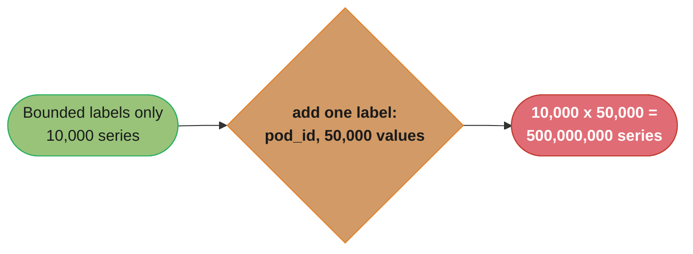
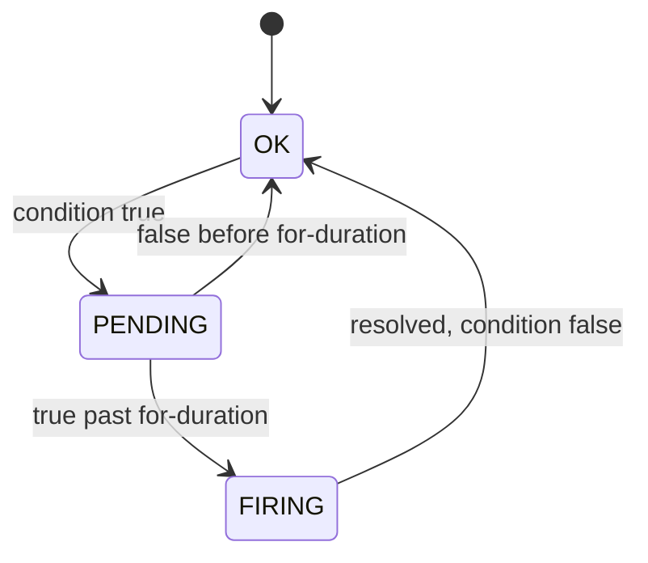
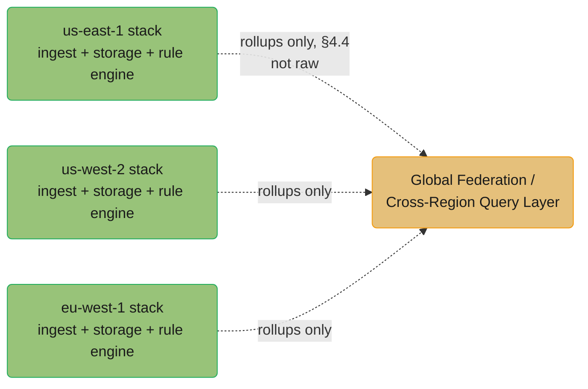
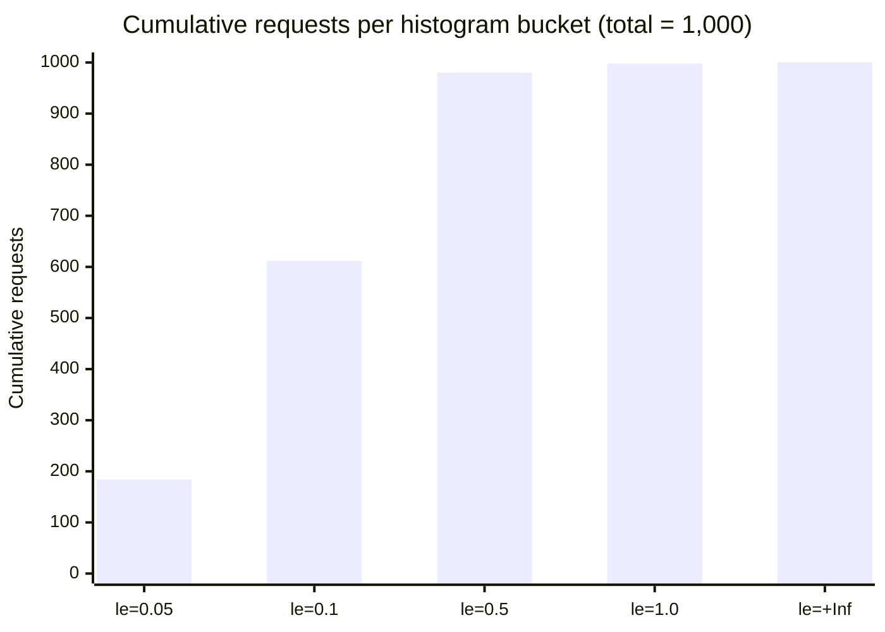

# System Design: Metrics Monitoring and Alerting System

## Intuition

> **Design intuition**: A metrics monitoring system is itself a database — but one optimized for exactly one brutal write pattern and one narrow read pattern, and nothing else. The write pattern: every second, tens of thousands of independent producers each emit a handful of monotonically-increasing or slowly-varying numbers, each stamped with "now." The read pattern: "give me the last N hours of *this exact* metric, aggregated into buckets, as fast as possible, so a human (or an alert rule) can decide if something is on fire." A generic relational database is catastrophically bad at both: it wasn't built to absorb millions of tiny timestamped inserts per second, and it wasn't built to scan months of rows just to compute one number per minute. Every architectural choice in this design — the columnar, time-partitioned storage engine; the downsampling/retention tiers; the pull-vs-push ingestion debate — exists because "store a number with a timestamp and some labels, then later ask for a windowed aggregate of it" is a different problem from "store a row and look it up by primary key," and treating it as the same problem is how teams end up running a TSDB on top of Postgres until it falls over.

**Key insight**: **Cardinality is the load-bearing wall of this entire system.** A metric name plus its set of label *values* defines one unique time series — and the number of time series is the *product* of each label's cardinality, not the sum. A metric with `service` (30 values), `endpoint` (50 values), and `status_code` (10 values) is 15,000 series — trivial. Add one label whose value is a raw user ID, request ID, or pod-ephemeral container hash with a million possible values, and that same metric becomes 15 billion series — an instant TSDB outage. Nearly every other design decision here (the data model in §4.1, the storage engine in §4.3, the alerting rule engine in §4.6, and both war stories in §9) is either a direct consequence of managing cardinality or a mechanism for surviving the moment someone doesn't.

---

## 1. Requirements Clarification

### Functional Requirements

- **Metric ingestion**: accept numeric, timestamped data points from tens of thousands of independent sources (application instances, hosts, containers, network devices), each point identified by a metric name plus a set of key-value labels (dimensions)
- **Time-series storage and retention**: durably store ingested points, retaining high resolution for a short window and progressively coarser (downsampled) resolution for long-term trend analysis
- **Query language for aggregation**: support a query language (PromQL-style) that can filter by label, compute rates from counters, aggregate (`sum`, `avg`, `max`, `min`) across label dimensions, and compute histogram quantiles (p50/p95/p99)
- **Dashboards**: serve the query layer to a dashboarding tool (Grafana-style) for human-facing visualization — time-series graphs, single-stat panels, heatmaps
- **Alerting rule engine**: periodically evaluate user-defined rules ("fire if `error_rate > 1%` for 5 minutes") against the query layer, manage alert lifecycle state (OK -> PENDING -> FIRING -> RESOLVED), and hand firing alerts to a notification/routing layer
- **Alert notification routing**: deduplicate, group, and silence alerts before they reach humans, then fan out to the appropriate on-call channel (cross-ref [`./design_notification_system.md`](./design_notification_system.md))
- **Service discovery for scrape targets** (pull model): automatically discover which instances exist and should be scraped, without manual per-instance configuration

### Non-Functional Requirements

- **Massive, sustained write throughput**: design for **10 million data points/sec** ingested across the fleet at steady state, with the ability to absorb 2-3x bursts during incidents (when error-related metrics spike in lockstep across many services)
- **Bounded, predictable cardinality**: the number of *active* time series (series that have received a point in the last retention window) must stay within a known budget — roughly **50-100 million active series** for a large-scale deployment — because cardinality, not raw point volume, is what determines memory footprint and query cost
- **Low write-to-queryable latency**: a data point should be queryable within **10-30 seconds** of being emitted — alerting depends on this freshness
- **Fast queries over recent data**: a dashboard query over the last 1-6 hours at 15s resolution must return in **well under 1 second**; a query over 30 days at 1-hour resolution must return in a few seconds
- **Alert evaluation latency**: rules are evaluated on a fixed interval (commonly **every 15-60 seconds**), and a sustained threshold breach must result in a fired alert within roughly `evaluation_interval + for_duration` (§4.6)
- **High availability of the monitoring system itself**: the monitoring system must remain operational (or degrade gracefully with clear signals) even when the systems it monitors — and even its own infrastructure — are partially down; "who alerts when the alerting system is down" is a first-class concern (§8, cross-ref [`../resilience_patterns/README.md`](../resilience_patterns/README.md))

### Out of Scope

- **Logs and distributed traces** — this design covers the *metrics* pillar only. The conceptual relationship between metrics, logs, and traces (and when to reach for each) is covered in [`../observability/README.md`](../observability/README.md); this case study is the concrete system that *implements* the metrics pillar of that framework
- **APM-style code-level profiling** (flame graphs, continuous profiling) — a related but architecturally distinct system with its own sampling and storage model
- **The dashboarding UI itself** — Grafana-style query-federation and visualization is treated as a client of this system's query API, not designed here

---

## 2. Scale Estimation

### Ingestion Volume

- **10,000 application/host instances**, each exposing roughly **1,000 distinct time series** (a typical instrumented service: RED metrics per endpoint, JVM/runtime metrics, USE metrics for connection pools, custom business metrics) -> **10 million active time series** from this layer alone
- Each instance is scraped (or pushes) every **15 seconds** -> `10,000,000 series / 15 sec` ~= **~667,000 points/sec** from this layer
- Add infrastructure-level metrics (node exporters, network devices, Kubernetes object metrics, container-level cAdvisor stats) at a comparable order of magnitude, plus higher-cardinality application metrics (per-customer or per-shard breakdowns kept *intentionally* bounded, §4.1) -> total steady-state ingestion of roughly **5-10 million points/sec**
- During an incident, error-rate and latency-histogram series across many services spike simultaneously (more histogram buckets touched, more alert-adjacent series actively changing) — a **2-3x burst** to **15-25 million points/sec** is the capacity-planning target (§10)

### Cardinality Budget

- **Active series target: 50-100 million.** At 10 bytes/sample on disk after compression (§4.3's Gorilla-style encoding) and one sample every 15 seconds: `100,000,000 series x (86,400/15) samples/day x 10 bytes` ~= **~5.8 TB/day** of raw 15-second-resolution data before any downsampling
- A single careless label change is the dominant cardinality risk: adding a label with **N** unique values to a metric with **M** existing series multiplies it to `M x N` — a metric with 10,000 series gaining a `pod_id` label with 50,000 distinct (ephemeral) values becomes **500 million series** from one metric alone, exceeding the entire fleet's budget (War Story 1, §9)

### Storage Sizing by Retention Tier

| Tier | Resolution | Retention | Bytes/sample (compressed) | Series | Storage |
|---|---|---|---|---|---|
| Raw | 15s | 15 days | ~1.3 bytes (Gorilla, §4.3) | 100M | `100M x (86400/15) x 15 x 1.3B` ~= **~1.0 TB** |
| Rollup 1 | 5m | 90 days | ~2 bytes (less compressible, fewer repeats) | 100M | `100M x (86400/300) x 90 x 2B` ~= **~5.2 TB** |
| Rollup 2 | 1h | 2 years | ~2 bytes | 100M | `100M x (86400/3600) x 730 x 2B` ~= **~3.5 TB** |

- **Total steady-state storage: roughly 10 TB** across all three tiers for 100M active series — small compared to the raw 5.8 TB/day figure above precisely *because* downsampling (§4.4) discards resolution that long-range queries never need
- Without downsampling, retaining 15-second resolution for 2 years would be `100M x (86400/15) x 730 x 1.3B` ~= **~284 TB** — a ~28x blowup, which is why retention tiers are not an optimization but a load-bearing design decision

### Alert Rule Evaluation Load

- A large deployment commonly runs **5,000-20,000 active alert rules**, each evaluated every **30-60 seconds**
- At 10,000 rules evaluated every 30 seconds: `10,000 / 30` ~= **~333 rule evaluations/sec**, each a PromQL-style query against the most recent window of data — a small fraction of total query load, but **latency-sensitive**: a slow evaluation directly delays alert firing

### Query Volume (Dashboards)

- A few thousand engineers viewing dashboards, each dashboard issuing 10-30 panel queries on load and refreshing every 15-30 seconds -> on the order of **5,000-15,000 queries/sec** at peak (most served from in-memory recent-data caches, §4.5)

---

## 3. High-Level Architecture

```mermaid
flowchart LR
    classDef io      fill:#61afef,stroke:#2e86c1,color:#1a1a1a,font-weight:bold
    classDef frozen  fill:#c678dd,stroke:#9b59b6,color:#fff
    classDef train   fill:#98c379,stroke:#27ae60,color:#1a1a1a
    classDef mathOp  fill:#d19a66,stroke:#e67e22,color:#1a1a1a,font-weight:bold
    classDef lossN   fill:#e06c75,stroke:#c0392b,color:#fff,font-weight:bold
    classDef req     fill:#56b6c2,stroke:#0097a7,color:#1a1a1a
    classDef base    fill:#e5c07b,stroke:#f39c12,color:#1a1a1a

    AppA(["App Instance A<br/>/metrics endpoint"])
    AppB(["App Instance B<br/>/metrics endpoint"])
    Host(["Host / Node exporter<br/>/metrics endpoint"])
    Scrape("Scrape Manager / Agent Fleet<br/>service discovery + scrape")
    Ingest("Ingestion / Write-Ahead Layer<br/>shard by series ID, §4.3")
    Storage("Time-Series Storage Engine<br/>TSM / Gorilla columnar, §4.3")
    Rollup("Downsampling / Rollup Pipeline<br/>tumbling windows, §4.4")
    Query("Query Layer<br/>PromQL fan-out + merge, §4.5")
    Dash(["Dashboards<br/>Grafana-style"])
    Alert("Alerting Rule Engine<br/>OK to PENDING to FIRING, §4.6")
    Notify(["Alertmanager-style<br/>Notification Layer"])

    AppA -.->|"scrape every 15s"| Scrape
    AppB -.->|"scrape every 15s"| Scrape
    Host -.->|"scrape every 15s"| Scrape
    Scrape -->|"write path<br/>10M+ pts/sec"| Ingest
    Ingest --> Storage
    Storage -->|"streaming agg"| Rollup
    Rollup -.->|"writes rollups<br/>back to storage"| Storage
    Storage -->|"query path"| Query
    Query --> Dash
    Query -->|"eval every<br/>15-60s"| Alert
    Alert -->|"FIRING alert"| Notify

    class AppA,AppB,Host io
    class Scrape,Rollup,Query mathOp
    class Ingest req
    class Storage base
    class Dash,Notify io
    class Alert lossN
```



### Request / Data Flow

1. **Instrumentation**: every application instance exposes its current metric values via a client library (Prometheus client, Micrometer, StatsD) — counters, gauges, and histograms accumulate in-process between scrapes/pushes
2. **Ingestion** (§4.2): either a central scrape manager *pulls* `/metrics` from each discovered target every 15 seconds (Prometheus model), or each instance *pushes* metrics to a local agent that batches and forwards them (StatsD/Datadog model) — both converge on the same write path
3. **Write-ahead and sharding**: incoming points are hashed by series ID (metric name + sorted label set, §4.1) onto storage shards, buffered briefly (§4.3's `TimeSeriesWriteBuffer`), and appended to the storage engine's per-series chunks
4. **Storage** (§4.3): points land in time-partitioned, columnar chunks using delta-of-delta timestamp encoding and XOR-based value encoding (Gorilla-style) — a generic row store would be 10-50x larger and far slower for the range-scan read pattern this system needs
5. **Downsampling** (§4.4): a streaming rollup pipeline continuously aggregates raw 15s data into 5-minute and 1-hour buckets using the same tumbling-window mechanics as [`./design_ad_click_aggregation.md`](./design_ad_click_aggregation.md) §4.2, writing the coarser tiers alongside the raw tier
6. **Querying** (§4.5): a PromQL-style query is parsed, decomposed into per-shard, per-time-partition sub-queries, executed in parallel, and merged — `rate()`, `sum by (label)`, and histogram quantile functions are applied either at merge time or pushed down to shards
7. **Alerting** (§4.6): the rule engine runs the same query layer on a fixed cadence, tracks each rule's alert state machine, and on a sustained breach (past the `for` duration) hands a firing alert to the notification layer
8. **Notification** (cross-ref [`./design_notification_system.md`](./design_notification_system.md)): an Alertmanager-style component deduplicates, groups, and silences alerts before routing to paging/chat channels — the same multi-channel fan-out problem as a general notification system, specialized for alert semantics (grouping by labels, inhibition rules)

---

## 4. Component Deep Dives

### 4.1 Data Model — Metric Name, Labels, and the Cardinality Multiplication Problem

A single data point is the tuple:

```
metric_name{label1="value1", label2="value2", ...} = value @ timestamp
```

For example:

```
http_requests_total{service="checkout", endpoint="/cart", status="500", region="us-east-1"} = 8421 @ 1718200000
```

The **combination of label values** — not the metric name alone — defines a unique **time series**. `http_requests_total` is a metric *family*; each distinct `{service, endpoint, status, region}` combination is a separate series with its own append-only stream of `(timestamp, value)` pairs. This is why cardinality is **multiplicative, not additive**:

```
cardinality(metric) = |services| x |endpoints| x |status codes| x |regions|
                     = 30        x 50          x 10            x 4
                     = 60,000 series for ONE metric name
```

Adding a fifth label with `K` distinct values multiplies the total by `K`. This is the single most important number in the entire system, because:

- **Memory**: most TSDBs (Prometheus, M3DB, InfluxDB) keep an in-memory index mapping label sets to series IDs, and per-series metadata (a few KB each) for every *active* series — 60,000 series at a few KB is trivial; 60 million is not
- **Query cost**: `sum by (service) (http_requests_total)` must touch *every* series matching the metric name before grouping — query cost scales with the cardinality of the metric being queried, not the cardinality of the *output*
- **Write cost**: every active series needs its own append target in storage (§4.3) — more series means more concurrent write streams, more index entries, more chunk files

**The rule that prevents disaster**: a label is safe if its cardinality is **bounded and known in advance** — `status_code` (≈10), `http_method` (≈7), `region` (a handful), `service_name` (tens to low hundreds). A label is dangerous if its cardinality is **unbounded or grows with the business** — `user_id`, `request_id`, `email`, `session_token`, `pod_name` (in environments with frequent pod churn), or raw error messages interpolated into a label value. High-cardinality *identifiers* belong in logs or traces ([`../observability/README.md`](../observability/README.md) §6.5), where they're stored per-event rather than multiplied into the time-series index — War Story 1 (§9) is what happens when this rule is violated.



One additional unbounded label is enough to jump a metric from a safe, bounded series count to a series count that alone exceeds the entire fleet's cardinality budget (§2) — exactly the mechanism behind War Story 1 (§9).

### 4.2 Ingestion — Pull (Scrape) vs. Push (Agent)

Two fundamentally different ingestion models dominate production systems, and the choice shapes everything downstream.

**Pull-based (Prometheus-style scraping)**: a central scrape manager maintains a list of targets (via service discovery — Kubernetes API, Consul, EC2 tag-based discovery) and, every `scrape_interval` (commonly 15s), issues an HTTP GET to each target's `/metrics` endpoint. The target's client library exposes its *current* counter/gauge/histogram values in a text exposition format; the scraper parses this and writes the resulting points to storage.

```
GET http://10.0.4.17:9100/metrics

# HELP http_requests_total Total HTTP requests
# TYPE http_requests_total counter
http_requests_total{endpoint="/cart",status="200"} 184230
http_requests_total{endpoint="/cart",status="500"} 412
# HELP http_request_duration_seconds Request latency
# TYPE http_request_duration_seconds histogram
http_request_duration_seconds_bucket{endpoint="/cart",le="0.1"} 102934
http_request_duration_seconds_bucket{endpoint="/cart",le="0.5"} 181200
http_request_duration_seconds_bucket{endpoint="/cart",le="+Inf"} 184642
```

**Push-based (StatsD / Datadog agent-style)**: each application instance sends individual metric events (`increment counter X`, `record gauge Y = 5`, `record timing Z = 42ms`) over UDP or a local socket to a co-located agent. The agent aggregates these in short windows (commonly 10s) and forwards pre-aggregated values to a central ingestion endpoint.

| Dimension | Pull (Prometheus) | Push (StatsD / Datadog agent) |
|---|---|---|
| Discovery | Central scraper must know every target — requires service discovery integration | Targets push to a known endpoint — no central target list needed |
| Firewall/NAT complexity | Scraper needs network path *to* every target (harder across VPC boundaries, serverless) | Targets need a path *out* to the agent/endpoint — usually easier (egress is less restricted) |
| Client-side aggregation | Client library accumulates state; scrape reads a snapshot — no aggregation needed in transit | Agent aggregates raw events into rolled-up values before forwarding — reduces network volume |
| Bursty load on ingestion | Smooth — scrapes are scheduled and staggered by the scraper | Can be bursty — many instances may emit at correlated times (e.g., all on the same cron) |
| "Is the target even up?" signal | Implicit — a failed scrape *is* a signal (`up == 0`) | No implicit signal — a dead target simply stops sending, indistinguishable from "nothing happened" without a separate heartbeat |
| Serverless / ephemeral workloads | Awkward — a function that lives for 200ms may not exist long enough to be scraped | Natural fit — push-and-exit |
| Used in this design | **Primary path** — for long-lived services with stable network topology | **Secondary path** — for ephemeral/serverless workloads and client-side/business metrics where push's "fire and forget" model fits better |

This design uses **pull as the primary ingestion path** for the bulk of infrastructure and service metrics (the `up` signal alone is operationally valuable — a target that can't be scraped is itself an alertable condition), with a **push-based gateway** (a Pushgateway-style intermediate target that *is* scraped) for short-lived batch jobs that don't live long enough to be scraped directly.

### 4.3 Storage Engine — Why a Generic KV/Relational Store Fails, and What Replaces It

At 5-10 million points/sec (§2), a generic relational database (one row per point: `(series_id, timestamp, value)`) fails on three axes simultaneously:

1. **Write amplification**: a B-tree index on `(series_id, timestamp)` means every insert is a random-ish write into the index — at 10M inserts/sec, the index itself becomes the bottleneck, and index pages for "hot" recent timestamps thrash constantly
2. **Storage size**: a naive row is `8 bytes (series_id) + 8 bytes (timestamp) + 8 bytes (value) + row overhead` ~= 30-40 bytes/point. At 10M points/sec that's 300-400 MB/sec, ~26-35 TB/day *before* any retention beyond raw — compare to the ~1 TB/15-days figure in §2 achieved via compression
3. **Read pattern mismatch**: "give me the last 6 hours of `cpu_usage{host="x"}` at 15s resolution" is a sequential scan of one series' time range — a row-oriented index optimized for point lookups and arbitrary `WHERE` clauses does this far less efficiently than a format that stores each series' values **contiguously and compressed**

**The fix — time-partitioned, columnar, chunked storage** (the TSM engine in InfluxDB, the chunk format in Prometheus's local TSDB, M3DB's storage layer): data is organized into **chunks**, each covering a fixed time range (e.g., 2 hours) and containing, for each series active in that range, a compressed byte stream of `(timestamp, value)` pairs. Two compression techniques (Gorilla, from Facebook's in-memory TSDB paper) exploit the specific structure of time-series data:

- **Delta-of-delta timestamp encoding**: timestamps within a series arrive at a roughly constant interval (every 15s). Instead of storing each timestamp (8 bytes), store the *delta from the previous delta* — if the interval is perfectly regular, this delta-of-delta is **zero**, encodable in a single bit. Real-world jitter produces small non-zero deltas, still encodable in a handful of bits.
- **XOR value encoding**: many metrics (CPU%, queue depth, gauge values) change slowly between consecutive samples. XOR-ing consecutive float64 values produces a result with many leading/trailing zero bits when the values are close — store only the differing bit range plus its position. A constant value compresses to **1 bit per sample**.

Combined, Gorilla-style encoding achieves roughly **1.3-2 bytes/sample** for typical metrics — a 15-20x reduction versus the naive 30-40 byte row, which is exactly the gap between the §2 "naive" estimate (~284 TB for full-resolution 2-year retention) and the actual ~10 TB total footprint.

```
Chunk for series http_requests_total{service="checkout",...}, time range [12:00:00, 14:00:00):

  Header: series_id, start_time=12:00:00, num_samples=480
  Timestamps (delta-of-delta bitstream): 0 0 0 0 1 0 0 0 ... (mostly 0 bits -> ~15s cadence)
  Values (XOR bitstream):     [full f64] 0001 0 0001 0 0...  (small deltas -> few bits/sample)

  Compressed size: ~480 samples x ~1.5 bytes/sample ~= ~720 bytes for 2 hours of data
  (vs. ~480 x 30 bytes = ~14,400 bytes uncompressed -- ~20x reduction)
```

### 4.4 Downsampling and Retention Tiers — The Rollup Pipeline

Storing every series at 15-second resolution forever is both unaffordable (§2's 284 TB figure) and unnecessary — nobody queries "CPU usage at 15-second resolution from 18 months ago" for a trend dashboard; they query "what did CPU usage look like, hour by hour, over the last 6 months." The **rollup pipeline** progressively aggregates raw data into coarser tiers, each retained longer than the one below it:

```mermaid
flowchart LR
    classDef io      fill:#61afef,stroke:#2e86c1,color:#1a1a1a,font-weight:bold
    classDef frozen  fill:#c678dd,stroke:#9b59b6,color:#fff
    classDef train   fill:#98c379,stroke:#27ae60,color:#1a1a1a
    classDef mathOp  fill:#d19a66,stroke:#e67e22,color:#1a1a1a,font-weight:bold
    classDef lossN   fill:#e06c75,stroke:#c0392b,color:#fff,font-weight:bold
    classDef req     fill:#56b6c2,stroke:#0097a7,color:#1a1a1a
    classDef base    fill:#e5c07b,stroke:#f39c12,color:#1a1a1a

    Raw("Raw tier<br/>15s res, 15d retention")
    Agg1("Tumbling 5-min window<br/>avg / max / p99")
    Rollup1("Rollup tier 1<br/>5m res, 90d retention")
    Agg2("Tumbling 1-hour window<br/>avg / max / p99")
    Rollup2("Rollup tier 2<br/>1h res, 2y retention")

    Raw --> Agg1 --> Rollup1 --> Agg2 --> Rollup2

    class Raw,Rollup1,Rollup2 base
    class Agg1,Agg2 mathOp
```



A query's time range determines which tier it reads from: a 1-hour dashboard panel reads the raw tier; a 30-day panel reads rollup tier 1; a 1-year capacity-planning panel reads rollup tier 2. The query layer (§4.5) selects the tier automatically based on the requested range and resolution.

**`TimeSeriesWriteBuffer` — batching, rollup, and the chunked write path**:

```java
package com.rutik.systemdesign.hld.case_studies.metrics;

import java.util.*;
import java.util.concurrent.ConcurrentHashMap;

/**
 * Buffers incoming raw data points per series and, on flush, both
 * (a) appends the raw points to the raw-tier chunk writer, and
 * (b) folds each point into the in-progress 5-minute rollup bucket
 *     for that series, emitting a completed rollup row once the
 *     bucket's tumbling window closes.
 *
 * This is the write-side analog of design_ad_click_aggregation.md's
 * TumblingWindowAggregator (§4.2) -- "events" here are raw samples,
 * and the rollup functions are avg/max/p99 instead of counts.
 */
public class TimeSeriesWriteBuffer {

    /** One raw sample: a single (timestamp, value) for one series. */
    public record Sample(String seriesId, long timestampMillis, double value) {}

    /** A completed rollup row, ready to write to the rollup tier. */
    public record RollupRow(String seriesId, long bucketStartMillis,
                             double avg, double max, double p99, long count) {}

    /** Per-series, per-bucket accumulator for the in-progress rollup window. */
    private static final class BucketAccumulator {
        long bucketStart;
        long count;
        double sum;
        double max = Double.NEGATIVE_INFINITY;
        // Reservoir sample of recent values for p99 estimation -- a fixed-size
        // sample is sufficient for an approximate quantile at this scale,
        // mirroring how histogram buckets approximate quantiles in PromQL.
        final double[] reservoir;
        int reservoirSize = 0;
        final java.util.Random rng = new java.util.Random(42);

        BucketAccumulator(long bucketStart, int reservoirCapacity) {
            this.bucketStart = bucketStart;
            this.reservoir = new double[reservoirCapacity];
        }

        void add(double value) {
            count++;
            sum += value;
            if (value > max) max = value;
            if (reservoirSize < reservoir.length) {
                reservoir[reservoirSize++] = value;
            } else {
                int idx = rng.nextInt((int) count);
                if (idx < reservoir.length) reservoir[idx] = value;
            }
        }

        RollupRow toRollupRow(String seriesId) {
            double[] sorted = Arrays.copyOf(reservoir, reservoirSize);
            Arrays.sort(sorted);
            double p99 = sorted.length == 0 ? Double.NaN
                : sorted[(int) Math.min(sorted.length - 1, Math.ceil(0.99 * sorted.length) - 1)];
            double avg = count == 0 ? Double.NaN : sum / count;
            return new RollupRow(seriesId, bucketStart, avg, max, p99, count);
        }
    }

    private final long rawFlushIntervalMillis;
    private final long rollupBucketMillis; // e.g., 5 minutes
    private final int reservoirCapacity;

    /** Raw points awaiting flush to the chunk writer. */
    private final List<Sample> pendingRaw = new ArrayList<>();

    /** seriesId -> current rollup bucket accumulator. */
    private final Map<String, BucketAccumulator> rollupBuckets = new ConcurrentHashMap<>();

    private final ChunkWriter chunkWriter;
    private final RollupSink rollupSink;

    public TimeSeriesWriteBuffer(long rawFlushIntervalMillis, long rollupBucketMillis,
                                  int reservoirCapacity, ChunkWriter chunkWriter, RollupSink rollupSink) {
        this.rawFlushIntervalMillis = rawFlushIntervalMillis;
        this.rollupBucketMillis = rollupBucketMillis;
        this.reservoirCapacity = reservoirCapacity;
        this.chunkWriter = chunkWriter;
        this.rollupSink = rollupSink;
    }

    /** Ingests one raw sample -- called from the scrape/push handler hot path. */
    public void ingest(Sample sample) {
        synchronized (pendingRaw) {
            pendingRaw.add(sample);
        }

        long bucketStart = (sample.timestampMillis() / rollupBucketMillis) * rollupBucketMillis;
        rollupBuckets.compute(sample.seriesId(), (seriesId, acc) -> {
            if (acc == null || acc.bucketStart != bucketStart) {
                if (acc != null) {
                    // Previous bucket's window has closed -- emit its rollup.
                    rollupSink.write(acc.toRollupRow(seriesId));
                }
                acc = new BucketAccumulator(bucketStart, reservoirCapacity);
            }
            acc.add(sample.value());
            return acc;
        });
    }

    /** Periodically called (e.g., every rawFlushIntervalMillis) to flush
     *  buffered raw points into a compressed chunk (§4.3 Gorilla-style). */
    public void flushRaw() {
        List<Sample> toFlush;
        synchronized (pendingRaw) {
            if (pendingRaw.isEmpty()) return;
            toFlush = new ArrayList<>(pendingRaw);
            pendingRaw.clear();
        }
        // Group by series so the chunk writer can append each series'
        // points contiguously -- this is what makes delta-of-delta /
        // XOR encoding effective (§4.3).
        Map<String, List<Sample>> bySeries = new HashMap<>();
        for (Sample s : toFlush) {
            bySeries.computeIfAbsent(s.seriesId(), k -> new ArrayList<>()).add(s);
        }
        for (var entry : bySeries.entrySet()) {
            entry.getValue().sort(Comparator.comparingLong(Sample::timestampMillis));
            chunkWriter.appendCompressed(entry.getKey(), entry.getValue());
        }
    }

    /** Abstraction over the columnar chunk storage (§4.3). */
    public interface ChunkWriter {
        void appendCompressed(String seriesId, List<Sample> orderedSamples);
    }

    /** Abstraction over the rollup-tier writer (§4.4). */
    public interface RollupSink {
        void write(RollupRow row);
    }
}
```

**Why `avg`/`max`/`p99` and not just `avg`**: a rollup that only stores the average discards exactly the information an on-call engineer needs during an incident — "was there a brief spike to 100% even though the 5-minute average looks like 40%?" Storing `avg`, `max`, and an approximate `p99` per bucket (the reservoir-sampling approach above mirrors how histogram-based quantiles work in PromQL) lets long-range dashboards show *both* the smooth trend (`avg`) and the worst-case behavior (`max`/`p99`) without retaining raw resolution.

### 4.5 Query Layer — Fan-Out, Merge, and PromQL-Style Aggregation

A query like:

```promql
histogram_quantile(0.99,
  sum by (le, service) (
    rate(http_request_duration_seconds_bucket{service="checkout"}[5m])
  )
)
```

is evaluated in stages that map directly onto the storage layout from §4.3-4.4:

1. **Series resolution**: the label matchers (`service="checkout"`) are resolved against the series index to a concrete set of series IDs — this is the step where an unbounded label (War Story 1) would explode the candidate set
2. **Time-partition fan-out**: the requested time range (`[5m]` plus the query's overall evaluation range) maps to one or more chunks (§4.3) per series, potentially spread across multiple storage shards — each shard executes `rate()` over its local chunks for the series it owns and returns partial per-series rate vectors
3. **Merge**: the query coordinator merges partial results from all shards into a single set of per-series rate vectors
4. **`sum by (le, service)`**: the merged per-series vectors are grouped by the remaining labels (`le`, `service`) and summed — this is where high-cardinality labels *not* in the `by` clause are collapsed away
5. **`histogram_quantile(0.99, ...)`**: the summed per-`le`-bucket rates are interpolated to estimate the 99th-percentile latency — this is an approximation based on which histogram bucket boundaries (`le` = "less than or equal to") the data falls into, not an exact quantile over raw samples

The key architectural point: **a query's cost is driven by the cardinality of the series it must touch *before* aggregation, not by the cardinality of its output.** `sum by (service) (some_metric)` over a metric with 10 million series still has to read and sum 10 million series' worth of data to produce 30 output rows (one per service) — this is why §4.1's cardinality discipline matters even for queries whose *results* look small.

**Caching**: because dashboards repeatedly issue near-identical queries (the same panel, refreshed every 15-30s), the query layer caches recent query results keyed by `(query string, time range, step)` — a dashboard auto-refreshing a "last 1 hour" panel mostly re-requests data it already has, plus one new 15-second slice, and a well-designed cache serves the overlapping portion from memory (cross-ref [`../../database/key_value_stores/README.md`](../../database/key_value_stores/README.md) for the caching-layer primitives).

### 4.6 Alerting Rule Engine — State Machine, "for" Duration, and Notification Fan-Out

An alert rule is, structurally, a query plus a threshold plus a debounce duration:

```yaml
- alert: HighErrorRate
  expr: |
    sum by (service) (rate(http_requests_total{status=~"5.."}[5m]))
    /
    sum by (service) (rate(http_requests_total[5m]))
    > 0.01
  for: 5m
  labels:
    severity: page
  annotations:
    summary: "{{ $labels.service }} error rate above 1% for 5m"
```

The rule engine evaluates `expr` against the query layer (§4.5) every `evaluation_interval` (e.g., 30s). The result is a boolean per matching label set (`{service="checkout"}`, `{service="payments"}`, ...). The critical piece — and the most commonly *missing* piece in broken alert configurations (War Story 2, §9) — is the **`for` duration**: the condition must be true continuously for `for` before the alert transitions to `FIRING`. Without it, a single 30-second blip that crosses the threshold and immediately recovers fires and resolves an alert in one evaluation cycle — exactly the flapping behavior `for` exists to prevent.

```java
package com.rutik.systemdesign.hld.case_studies.metrics;

import java.time.Duration;
import java.time.Instant;
import java.util.HashMap;
import java.util.Map;
import java.util.function.Consumer;

/**
 * Evaluates a single threshold-based alert rule against the query layer
 * on a fixed cadence, tracking per-label-set alert state through the
 * OK -> PENDING -> FIRING -> RESOLVED lifecycle. The "for" duration
 * debounces transient breaches so a brief blip never fires an alert
 * (War Story 2, §9).
 */
public class AlertRuleEvaluator {

    public enum State { OK, PENDING, FIRING }

    /** One alert instance per distinct label set returned by the query
     *  (e.g., one per {service=...} for a rule grouped by service). */
    private static final class AlertInstance {
        State state = State.OK;
        Instant breachStartedAt; // when the condition first became true (PENDING start)
    }

    private final String alertName;
    private final Duration forDuration;
    private final QueryEvaluator queryEvaluator; // §4.5 query layer client
    private final String promQlExpr;
    private final double threshold;

    private final Map<LabelSet, AlertInstance> instances = new HashMap<>();

    public AlertRuleEvaluator(String alertName, String promQlExpr, double threshold,
                               Duration forDuration, QueryEvaluator queryEvaluator) {
        this.alertName = alertName;
        this.promQlExpr = promQlExpr;
        this.threshold = threshold;
        this.forDuration = forDuration;
        this.queryEvaluator = queryEvaluator;
    }

    /**
     * Runs one evaluation cycle. For each label set the query returns,
     * advances that label set's state machine and invokes the
     * appropriate callback on FIRING / RESOLVED transitions.
     */
    public void evaluate(Instant now, Consumer<FiringAlert> onFiring, Consumer<LabelSet> onResolved) {
        Map<LabelSet, Double> results = queryEvaluator.evaluate(promQlExpr, now);

        // Evaluate breaches for label sets present in this cycle's results.
        for (var entry : results.entrySet()) {
            LabelSet labels = entry.getKey();
            boolean breached = entry.getValue() > threshold;
            AlertInstance instance = instances.computeIfAbsent(labels, k -> new AlertInstance());

            switch (instance.state) {
                case OK -> {
                    if (breached) {
                        instance.state = State.PENDING;
                        instance.breachStartedAt = now;
                    }
                }
                case PENDING -> {
                    if (!breached) {
                        instance.state = State.OK;
                        instance.breachStartedAt = null;
                    } else if (Duration.between(instance.breachStartedAt, now).compareTo(forDuration) >= 0) {
                        instance.state = State.FIRING;
                        onFiring.accept(new FiringAlert(alertName, labels, entry.getValue(),
                                instance.breachStartedAt, now));
                    }
                    // else: still PENDING, not yet past `for` -- no action.
                }
                case FIRING -> {
                    if (!breached) {
                        instance.state = State.OK;
                        instance.breachStartedAt = null;
                        onResolved.accept(labels);
                    }
                    // else: still FIRING -- the notification layer (§3)
                    // handles repeat-notification suppression, not this engine.
                }
            }
        }

        // Label sets that disappeared entirely from this cycle's results
        // (e.g., the series stopped reporting) and were FIRING/PENDING
        // should not stay stuck -- treat absence as "not breached".
        for (var entry : instances.entrySet()) {
            if (!results.containsKey(entry.getKey()) && entry.getValue().state != State.OK) {
                if (entry.getValue().state == State.FIRING) {
                    onResolved.accept(entry.getKey());
                }
                entry.getValue().state = State.OK;
                entry.getValue().breachStartedAt = null;
            }
        }
    }

    /** Abstraction over the query layer (§4.5) -- returns one value per
     *  distinct label set the expression's `by`/`without` clause groups on. */
    public interface QueryEvaluator {
        Map<LabelSet, Double> evaluate(String promQlExpr, Instant evalTime);
    }

    public record LabelSet(Map<String, String> labels) {}

    public record FiringAlert(String alertName, LabelSet labels, double value,
                               Instant breachStartedAt, Instant firedAt) {}
}
```

**State machine summary**:



**Routing, deduplication, and silencing**: a `FIRING` alert is handed to an Alertmanager-style component that **groups** alerts by a configurable label set (so 50 services simultaneously breaching the same SLO during a shared dependency outage produce *one* grouped notification, not 50 pages), **deduplicates** repeat firings of the same alert instance (don't re-page every evaluation cycle while still firing — re-notify on a longer interval, e.g., every 4 hours, unless the alert resolves and re-fires), and respects **silences** (a maintenance window suppresses specific label-matched alerts without disabling the underlying rule). The actual multi-channel delivery — paging vs. Slack vs. email, provider rate limits, on-call schedule routing — is the same fan-out problem covered in [`./design_notification_system.md`](./design_notification_system.md); this system's responsibility ends at "here is a deduplicated, grouped, routable alert object."

### 4.7 Multi-Region Federation and High Availability

A single monitoring stack — one ingestion tier, one storage cluster, one rule engine — is a single point of failure for the *entire observability surface*, which is precisely the blind spot §8's "who pages when the pager is down" runbook addresses. Production deployments at the scale described in §2 run **per-region monitoring stacks**, each independently capable of ingesting, storing, querying, and alerting on that region's services, plus a **global federation layer** that aggregates a curated subset of series for cross-region dashboards and global SLOs:



Two properties make this work:

- **Regional alerting never depends on the global layer.** Each regional stack evaluates its own alert rules (§4.6) against its own local storage — a federation-layer outage degrades *global* dashboards and cross-region rules only, never a region's ability to page on-call for that region's own incidents. This is the single most important availability property of the whole architecture: the system that's supposed to detect "region X is down" cannot itself live only in region X.
- **Federation moves rollups, not raw data.** Shipping every region's full 15-second-resolution raw tier (§2's ~667 GB/day/region at full scale) to a central federation point would recreate the exact write-throughput problem §4.3 exists to avoid, just one layer up. Instead, only the 5-minute and 1-hour rollup tiers (§4.4) — already 1-2 orders of magnitude smaller — are federated, which is sufficient for cross-region trend dashboards and SLO burn-rate calculations (cross-ref [`../observability/README.md`](../observability/README.md) §6.3) without re-creating a global single point of failure for raw data.

This mirrors the regional-stack-plus-global-rollup structure in [`./design_ad_click_aggregation.md`](./design_ad_click_aggregation.md) §4.8 — both designs converge on "evaluate locally, federate only aggregates" for the same underlying reason: a global component that everything depends on for *correctness* is acceptable (eventual global dashboards), but a global component that everything depends on for *detection* is not (every region must be able to alert on itself).

### 4.8 Histograms: Why `histogram_quantile()` Is an Approximation, Not an Exact Percentile

§4.5's example query used `histogram_quantile(0.99, ...)` over a metric named `http_request_duration_seconds_bucket` — it's worth being explicit about what that metric actually contains and why. A histogram metric, as exposed by a client library, is **not** a single value but a *family* of cumulative counters, one per bucket boundary (`le`, "less than or equal to"):

```
http_request_duration_seconds_bucket{le="0.05"}  184  # requests <= 50ms
http_request_duration_seconds_bucket{le="0.1"}   612  # requests <= 100ms
http_request_duration_seconds_bucket{le="0.5"}   980  # requests <= 500ms
http_request_duration_seconds_bucket{le="1.0"}   998  # requests <= 1s
http_request_duration_seconds_bucket{le="+Inf"} 1000  # all requests
```

Each bucket is itself a counter (subject to `rate()` like any other counter, §11). `histogram_quantile(0.99, ...)` finds which `le` bucket contains the 990th request (99% of 1000) and **linearly interpolates** within that bucket's range to estimate the p99 latency — it does not have access to the individual 1,000 raw latency values, only the counts per predefined bucket boundary. This has two direct consequences for the rest of the design:

- **Bucket boundaries are a cardinality decision made at instrumentation time** (§4.1): each `le` value is itself a label value, so a histogram with 10 bucket boundaries contributes 10x the series of an equivalent counter or gauge. Choosing bucket boundaries that don't bracket the actual latency distribution (e.g., all boundaries under 100ms for an endpoint that's usually 200-500ms) produces a `histogram_quantile` estimate that's accurate to "somewhere above the highest bucket," which is nearly useless
- **An alternative, client-side-aggregated "summary" metric type** (which computes exact quantiles in-process and exposes them directly, e.g., `http_request_duration_seconds{quantile="0.99"}`) avoids the interpolation-accuracy tradeoff entirely, but cannot be meaningfully aggregated *across* instances — you cannot average two services' p99 values and get a fleet-wide p99 (percentiles don't compose under averaging). Histograms, because the underlying bucket *counts* are additive, can be summed across every instance and *then* have `histogram_quantile` applied once — which is why this design's `sum by (le, service)` in §4.5 sums bucket counts before computing the quantile, not the other way around



The 990th request (99% of the 1,000 total) falls between the `le=0.5` bucket (980) and the `le=1.0` bucket (998), so `histogram_quantile(0.99, ...)` linearly interpolates within that gap rather than reading an exact stored value.

---

## 5. Design Decisions & Tradeoffs

### Ingestion: Pull vs. Push

| Dimension | Pull (scrape) | Push (agent) |
|---|---|---|
| Operational signal for "target is down" | Built-in (`up == 0` on scrape failure) | Requires a separate heartbeat/liveness mechanism |
| Network topology requirements | Scraper needs a path to every target | Targets need egress to the agent/endpoint |
| Best fit | Long-lived services, Kubernetes/VM fleets with service discovery | Ephemeral/serverless, client-side/mobile, environments where inbound scraping is blocked |
| This design's choice | **Primary** for infra + service metrics | **Secondary**, via a push-gateway intermediate target |

### Storage Engine: Columnar/Chunked TSDB vs. Generic Relational/KV Store

| Dimension | Relational (Postgres-style row store) | Columnar, time-partitioned, chunked TSDB (this design, §4.3) |
|---|---|---|
| Write throughput at 10M points/sec | B-tree index thrashing becomes the bottleneck | Append-only per-series streams, no per-write index maintenance |
| Storage size | ~30-40 bytes/point | ~1.3-2 bytes/point (Gorilla-style, §4.3) |
| Range-scan query ("last 6h of series X") | Index lookup + row fetches, scattered I/O | Sequential read of one series' contiguous compressed chunk |
| Schema flexibility for new labels | Requires schema/column changes or sparse columns | Labels are part of the series identity (index), not columns — no schema migration |
| Best fit | Low-volume, ad-hoc-query-heavy workloads | The metrics write/read pattern at any non-trivial scale |

### Retention: Single Resolution Forever vs. Tiered Downsampling

| Dimension | Single resolution (15s) forever | Tiered downsampling (this design, §4.4) |
|---|---|---|
| Storage for 100M series, 2 years | ~284 TB (§2) | ~10 TB total across 3 tiers (§2) |
| Long-range query cost | Scans full-resolution data even for a 1-year chart | Reads the appropriately coarse tier — orders of magnitude fewer points |
| Information loss for old data | None | `avg`/`max`/`p99` per bucket retained (§4.4) — enough for trend + worst-case, not enough to reconstruct sub-bucket spikes |
| Best fit | Short-term debugging only, unaffordable past days/weeks | Any system with multi-month+ retention requirements |

### Alerting: Stateless Threshold Check vs. Stateful "for"-Duration Debounce

| Dimension | Stateless (`if value > threshold: fire`) | Stateful with `for` (this design, §4.6) |
|---|---|---|
| Behavior on a 1-evaluation-cycle blip | Fires AND resolves within seconds — pages on-call for a non-issue | Stays in `PENDING`, never fires — correctly ignored |
| Behavior on a sustained outage | Fires immediately (lower MTTA for genuine incidents) | Fires after `for` duration (e.g., 5 min) — small added latency, but eliminates flapping |
| Implementation complexity | Trivial — one comparison per evaluation | Requires per-label-set state tracking across evaluation cycles |
| Best fit | Never, in production — flapping risk is too high (War Story 2, §9) | All production alert rules |

---

## 6. Real-World Implementations

- **Prometheus**: the reference implementation of the pull-based architecture described throughout this case study — a central server scrapes `/metrics` endpoints on a configurable interval, stores data in a local, time-partitioned, chunked TSDB (the exact Gorilla-derived format §4.3 describes), evaluates alerting rules via its own rule engine, and ships firing alerts to **Alertmanager** (§4.6's grouping/dedup/silencing component, by name). Prometheus also supports `remote_write` to ship samples to a long-term storage backend (often M3DB, Thanos, or Cortex/Mimir) for retention beyond a single server's local disk — directly addressing the retention-tiering need from §4.4 at a scale beyond what one Prometheus instance's local TSDB can hold.
- **Datadog**: the canonical agent-based **push** architecture — a per-host Datadog Agent collects system and application metrics (via integrations and DogStatsD, a StatsD-compatible protocol) and pushes pre-aggregated data to Datadog's backend. Datadog's **billing model is built around tag (label) cardinality** — each unique combination of tags on a "custom metric" is billed, which is the commercial expression of exactly the cardinality-multiplication math in §4.1; teams that add a `user_id` tag to a custom metric see their bill scale with active users, not just with metric count.
- **M3DB (Uber)**: a horizontally-scalable, Prometheus-remote-write-compatible TSDB built by Uber specifically because a single Prometheus instance's local storage couldn't hold Uber's metric volume or survive node failure. M3DB shards series across a cluster (consistent-hashing-based placement, cross-ref [`../consistent_hashing/README.md`](../consistent_hashing/README.md)) and implements its own compressed block storage derived from the same Gorilla encoding ideas (§4.3) — illustrating that "scale out the storage engine while keeping the Prometheus query/alerting ecosystem" is a well-trodden path rather than a from-scratch redesign.
- **InfluxDB**: built around the **TSM (Time-Structured Merge) tree** storage engine — conceptually similar to an LSM-tree (cross-ref [`../../database/storage_engines_internals/README.md`](../../database/storage_engines_internals/README.md)) but specialized for time-series: in-memory write buffers ("WAL" + cache) are periodically compacted into immutable, time-shard-partitioned, compressed files on disk. InfluxDB popularized "tags" (indexed labels) vs. "fields" (unindexed values) as an explicit schema-level distinction — a design-level acknowledgment that not every value needs to participate in the cardinality-bearing index.
- **Grafana**: the dominant **query-federation and visualization layer** — a single Grafana instance can query Prometheus, M3DB/Mimir, InfluxDB, Elasticsearch, and many other data sources through a common dashboarding UI, with PromQL (or each backend's native query language) embedded per-panel. Grafana itself stores no metric data; it is purely the query/render layer described in §4.5's consumer side.
- **Netflix Atlas**: an **in-memory, dimensional time-series** platform built because Netflix's metric volume and query patterns (especially around very-high-cardinality, short-retention operational data) didn't fit well-established TSDB assumptions. Atlas trades very long retention for extremely fast, in-memory aggregation over recent data — a deliberate choice to optimize for the "what's happening right now, sliced any way I want" query pattern over the "show me a 2-year trend" pattern, the inverse emphasis from this case study's tiered-retention default.

### Pull vs. Push, Storage Engine, and Cardinality Handling — Comparison Table

| System | Ingestion Model | Storage Engine | Cardinality Handling |
|---|---|---|---|
| Prometheus | Pull (scrape) | Local chunked TSDB, Gorilla-derived (§4.3) | Single-node index — operator must control cardinality manually; `remote_write` offloads long-term storage |
| Datadog | Push (Agent + DogStatsD) | Proprietary, horizontally distributed | Billed per unique tag combination — cardinality is a direct cost signal to customers |
| M3DB | Pull (Prometheus-compatible `remote_write` target) or push | Distributed, sharded compressed blocks (consistent hashing) | Cluster-wide sharding spreads cardinality load; still bounded by per-shard memory |
| InfluxDB | Push (line protocol) or pull (Telegraf) | TSM tree (LSM-like, time-sharded) | Explicit tags-vs-fields split — only tags are indexed/cardinality-bearing |
| Netflix Atlas | Push | In-memory dimensional store | Short retention by design trades cardinality tolerance for query speed on recent data |

---

## 7. Technologies & Tools

| Component | Representative Technologies | Notes |
|---|---|---|
| Instrumentation / client libraries | Prometheus client libraries, Micrometer, OpenTelemetry Metrics SDK | Expose `/metrics` (pull) or emit to a local agent (push), §4.2 |
| Scrape / agent layer | Prometheus server, Datadog Agent, Telegraf, OpenTelemetry Collector | §4.2 — service-discovery-driven target lists for pull |
| Time-series storage | Prometheus local TSDB, M3DB, InfluxDB (TSM), VictoriaMetrics, Thanos/Cortex/Mimir | §4.3-4.4 — chunked columnar storage with retention tiers |
| Query layer | PromQL engine (Prometheus, Thanos Querier, Mimir) | §4.5 — fan-out/merge across sharded, time-partitioned storage |
| Dashboards | Grafana | §4.5 consumer — federated queries across data sources |
| Alerting | Prometheus rule engine + Alertmanager | §4.6 — rule evaluation + grouping/dedup/silencing |
| Alert delivery | PagerDuty, Opsgenie, Slack, SMS/email providers | cross-ref [`./design_notification_system.md`](./design_notification_system.md) |

### Build vs. Buy Considerations

| Component | Build | Buy / Managed | This Design's Choice |
|---|---|---|---|
| Scrape/ingestion fleet | Self-managed Prometheus/agent fleet | Managed (Grafana Cloud, Datadog, Amazon Managed Prometheus) | Either — the §4.2 architecture is agnostic; managed offerings remove the operational burden of running the storage tier at the §2 scale |
| Long-term storage | Self-hosted M3DB/Thanos/Mimir cluster | Managed long-term-storage backends for Prometheus `remote_write` | Buy for most teams — running a horizontally-scaled TSDB is itself a significant operational commitment (§8) |
| Alerting rule engine | Prometheus rules + Alertmanager (self-hosted) | Managed Alertmanager-compatible services | Either — the rule semantics (§4.6) are now a de facto standard regardless of host |
| Dashboards | Self-hosted Grafana | Grafana Cloud, vendor-native dashboards (Datadog) | Buy unless deep customization or multi-vendor federation (§4.5) is required |

---

## 8. Operational Playbook

### Key Metrics (Monitoring the Monitoring System)

| Metric | What It Measures | Alert Threshold (Illustrative) |
|---|---|---|
| **Active series count** | Total cardinality currently being ingested/stored | Page if it grows by >20% week-over-week without a corresponding capacity-plan update — leading indicator of War Story 1 |
| **Ingestion rate (points/sec)** | Write throughput against the storage tier | Page if sustained > 80% of provisioned capacity (§10) |
| **Scrape success rate / `up` metric** | Fraction of scrape targets successfully scraped each cycle | Page if < 99% sustained — a drop here means *other* alerts may be silently based on stale data |
| **Sample ingestion lag** | Time between a sample's timestamp and when it becomes queryable | Page if > 60s sustained — directly threatens the §1 freshness NFR for alerting |
| **Rule evaluation duration** | Wall-clock time to evaluate each alert rule | Page if any rule's evaluation duration exceeds the evaluation interval — rules are falling behind |
| **Alertmanager notification latency** | Time from `FIRING` transition to notification dispatched | Page if > 1 minute — directly affects MTTA |
| **Query p99 latency** | Dashboard/API query response time | Investigate if p99 > 2-3 seconds for standard 6h/15s-resolution queries |
| **Storage disk usage / compaction backlog** | Headroom before the storage tier fills or falls behind on compaction | Page if disk usage > 80% or compaction backlog grows unbounded |

### Runbook: Sudden Active-Series-Count Spike

1. Identify which metric name(s) are driving the spike — most TSDBs expose a "top metrics by series count" diagnostic; a single metric jumping from thousands to millions of series is the War Story 1 signature
2. Identify which label is responsible — compare the label set of the offending metric before and after the spike (often correlates with a recent deploy that added a new label)
3. **Immediate mitigation**: apply a relabeling/drop rule at the ingestion layer (§4.2) to strip the offending label *before* it's written to storage — this stops further cardinality growth without requiring a code rollback, though it does not retroactively shrink already-written series
4. **Root-cause fix**: revert or fix the instrumentation change that introduced the unbounded label (§4.1) — the relabel rule from step 3 is a stopgap, not a permanent fix, since it silently drops information that may be needed elsewhere
5. Monitor active-series count return to baseline; confirm query and ingestion latency recover

### Runbook: Alert Evaluation Lag / Rules Falling Behind

1. Check rule evaluation duration against the evaluation interval — if evaluations are taking longer than the interval, rules queue up and alert latency grows unbounded
2. Identify whether the slowdown is **query-layer-wide** (storage tier under load, §4.3-4.5 — check ingestion rate and disk I/O) or **specific to a subset of rules** (a small number of expensive queries, often `histogram_quantile` over very-high-cardinality histograms, or `sum by` clauses over metrics with runaway cardinality, §4.1)
3. For query-layer-wide slowdowns: this is itself an incident in the monitored systems' blast radius — alerting may be delayed for *everything* simultaneously; escalate per the "monitoring the monitor" principle (§8's Disaster Recovery discussion)
4. For specific expensive rules: consider precomputing them as **recording rules** (the rule's expression is evaluated and stored as its own time series on a regular cadence, decoupling expensive aggregation from the alerting evaluation's latency budget)

### Disaster Recovery: Who Pages When the Pager System Is Down?

The monitoring and alerting system is, definitionally, the thing that's supposed to detect when something is down — which creates an obvious blind spot when *it* is the thing that's down. Mitigations (cross-ref [`../resilience_patterns/README.md`](../resilience_patterns/README.md)):

| Failure | Detection | Mitigation |
|---|---|---|
| Storage tier unavailable (writes failing) | Ingestion-layer write buffer (§4.3) fills and starts dropping; ingestion-layer's *own* health metrics must be shipped to a **separate, independent** monitoring stack | A small, independently-deployed "meta-monitoring" instance watches the primary stack's health and pages directly — deliberately simple and low-cardinality, so it has a much smaller blast radius than the system it watches |
| Alert rule engine down | Rules stop evaluating — no new alerts fire, but existing `FIRING` alerts also stop re-notifying | Meta-monitoring stack alerts on "rule engine evaluation count == 0 for N minutes" as its own independent rule |
| Alertmanager-style notification layer down | Alerts compute correctly but never reach on-call | A heartbeat/dead-man's-switch alert (a rule that *always* fires, routed through the same notification path) — if on-call stops receiving the heartbeat, the notification path itself is down, independent of whether any real alert condition exists |
| Entire monitoring region down | No metrics, no alerts, no dashboards for that region | Multi-region monitoring stacks, each independently capable of alerting on its own region plus a degraded view of others (cross-ref [`../scalability/README.md`](../scalability/README.md) for the general multi-region redundancy pattern) |

The **dead-man's-switch** pattern deserves emphasis: a rule that always evaluates true, always fires, and is routed through the full notification pipeline on a known cadence (e.g., every 5 minutes) — if on-call *stops* receiving it, every other alert in the system should be considered untrustworthy until the pipeline is restored.

---

## 9. Common Pitfalls & War Stories

### War Story 1: A `user_id` Label Takes Down the TSDB — Broken, Then Fixed

**Broken**: A team instrumented a new checkout-flow metric, `checkout_step_duration_seconds`, with labels `{step, payment_method, user_id}` — the `user_id` label was added "for debugging," with the intent of letting an engineer filter to a specific user's checkout flow during investigations. The metric had previously existed with just `{step, payment_method}` — roughly `8 steps x 5 payment methods` = 40 series. Code review approved the change; nobody flagged the new label, because in isolation "add a label for debugging" sounds harmless.

**Impact**: Within hours of the deploy reaching production traffic, the TSDB's active series count for this single metric went from 40 to **over 12 million** (roughly the platform's daily active user count) — `40 x 300,000+ distinct user_ids seen per scrape interval`. The TSDB's in-memory series index, sized for the platform's existing ~50 million total active series across *all* metrics, absorbed this new metric's 12 million series on top of the existing baseline, pushing memory usage past the instance's limit. The TSDB began OOM-killing and restarting on a loop — and because it restarted mid-write repeatedly, both **ingestion and querying failed platform-wide** for roughly 40 minutes, including the dashboards and alert rules that would normally have surfaced the checkout service's *own* problems. The on-call engineer's first signal wasn't a `checkout_step_duration_seconds` alert — it was "every dashboard in the company is blank and every alert rule is erroring."

**Fixed**: Three layers, ordered by immediacy:
1. **Immediate mitigation**: a relabeling rule was applied at the ingestion layer (§4.2) to drop the `user_id` label from `checkout_step_duration_seconds` before it reached storage — this stopped further cardinality growth within one scrape interval, though the millions of already-created series remained in the index until they aged out of the active window
2. **Root-cause fix**: the instrumentation change was reverted; the debugging use case it was meant to serve ("find this specific user's checkout flow") was redirected to **traces** (cross-ref [`../observability/README.md`](../observability/README.md) §6.5) — a trace can carry a `user.id` span attribute without multiplying the metric-series count, because traces are stored per-request, not aggregated into a time series
3. **Process fix**: a pre-merge CI check was added that estimates the cardinality impact of any new or modified metric label (by checking the label's value cardinality against a registry of "known bounded" label names) and fails the build if a label name matches a denylist pattern (`*_id`, `*_uuid`, `email`, `token`) without an explicit override — turning "did anyone notice this label is unbounded" from a code-review judgment call into an automated gate

### War Story 2: An Alert Rule Without a "for" Duration Pages On-Call Every 90 Seconds — Broken, Then Fixed

**Broken**: An alert rule was written to catch elevated error rates on the `payments` service:

```yaml
- alert: PaymentsErrorRateHigh
  expr: |
    sum(rate(http_requests_total{service="payments",status=~"5.."}[1m]))
    /
    sum(rate(http_requests_total{service="payments"}[1m]))
    > 0.05
  # no `for:` field -- defaults to firing immediately on any breach
  labels:
    severity: page
```

The `for` field was omitted — the author's mental model was "if the error rate is above 5%, page immediately; every second of delay is a second of customer impact." The rule was evaluated every 30 seconds.

**Impact**: The `payments` service had a recurring, benign pattern: a downstream dependency's connection pool briefly saturated for 20-40 seconds during traffic ramp-up each morning, causing a short burst of `503`s that pushed the 1-minute error rate just over 5% before self-resolving as the pool's idle connections cycled in. This had been happening for months with no customer impact (retries absorbed it) and no one had noticed. With the new rule, every morning's brief blip caused the rule to transition `OK -> FIRING` the instant the 1-minute rate crossed 5%, immediately notify on-call, then transition back to `OK` 30-90 seconds later when the rate dropped back below threshold (also notifying "resolved"). Because the underlying condition oscillated around the 5% line for several minutes during the ramp-up window, the rule **flapped 8-12 times** each morning — each transition generating a page-and-resolve pair. On-call received **16-24 pages within a 10-minute window, every single morning**, for a condition that had never once required action. Within two weeks, the on-call engineer had configured a phone-level "mute" for the alert's notification sound during that time window — meaning that the one morning the underlying condition *was* a real, sustained outage (the dependency's pool exhaustion didn't recover after 90 seconds, for once), the muted alert went unnoticed for **35 minutes**, well past the point where automated retries were masking real customer impact.

**Fixed**:
1. **Added `for: 5m`** — the condition must hold continuously for 5 minutes before `FIRING`. The benign 20-40 second morning blips never reach `PENDING` for long enough to fire; a genuinely sustained outage still fires within `evaluation_interval + 5m` ~= ~5.5 minutes, an acceptable MTTA tradeoff for eliminating the flapping entirely
2. **Split into two rules with different severities**: a `for: 2m` rule at `severity: ticket` (investigate during business hours — catches genuinely-elevated-but-not-yet-critical patterns) and the `for: 5m` rule at `severity: page` (genuinely actionable) — this mirrors the two-window burn-rate alerting pattern from [`../observability/README.md`](../observability/README.md) §6.3, applied to a simple threshold rather than an SLO burn rate specifically
3. **Removed the phone-level mute** once the flapping stopped being the dominant noise source — the mute had been masking the *real* signal along with the noise, and its removal was only safe once the noise itself was eliminated at the source

---

## 10. Capacity Planning

### Ingestion Tier Sizing

- Steady-state: **5-10 million points/sec** (§2); incident burst: **15-25 million points/sec**
- A single ingestion-shard process handles roughly **200,000-300,000 points/sec** at sustainable CPU (parsing exposition format, hashing series IDs, writing to the buffer, §4.3)
- Baseline shard count: `10,000,000 / 250,000` ~= **~40 shards** for steady-state average
- Provisioned for the 2-3x burst: `25,000,000 / 250,000` ~= **~100 shards** — sized for incident-time load, since incidents are precisely when monitoring must *not* degrade (consistent with the "never apply backpressure to the thing measuring the outage" principle, §8)

### Storage Tier Sizing

- From §2: **~10 TB total** across raw (15s/15d), rollup-1 (5m/90d), and rollup-2 (1h/2y) tiers for 100M active series
- Write path: 10 TB / 15 days (raw tier churn) ~= **~667 GB/day** of new raw-tier data, plus rollup writes (smaller, derived) — well within the sequential-write throughput of modern SSD-backed storage nodes when spread across the ~40-100 ingestion shards
- A single storage node, holding a shard of series with its associated chunk files, comfortably handles **low-single-digit millions of active series** at this compression ratio — `100,000,000 / 2,000,000` ~= **~50 storage nodes** for the active-series budget, with replication factor 2-3 for durability -> **~100-150 storage nodes total**

### Alert Rule Engine Sizing

- **10,000 active rules** (§2), evaluated every 30s -> `10,000 / 30` ~= **~333 evaluations/sec**
- Each evaluation is a bounded-range query (typically 5-15 minutes of recent data) against the query layer — at a budget of ~5ms/evaluation (served largely from the recent-data cache, §4.5), `333 x 5ms` ~= **~1.7 seconds of evaluation work/sec**, comfortably parallelizable across a small dedicated rule-evaluator fleet (4-8 instances) with significant headroom for evaluation-time variance and recording-rule precomputation

### Query Layer Sizing (Dashboards)

- **5,000-15,000 queries/sec** at peak (§2), the large majority served from the recent-data cache (§4.5) for repeated dashboard-refresh queries
- Cache-miss queries (novel time ranges, ad-hoc exploration during an incident) fan out across the ~50-150 storage nodes — incident-time query volume often spikes *simultaneously* with the ingestion burst (§2's 2-3x factor), so the query-serving tier is sized with similar incident-time headroom rather than steady-state averages

### Scrape / Network Bandwidth Sizing

- A typical `/metrics` exposition-format response for an instance with ~1,000 series (§2) is roughly **80-150 KB** uncompressed (metric names, label sets, and values as text), commonly compressed to **15-30 KB** in transit
- At 10,000 instances scraped every 15 seconds: `10,000 x 25 KB / 15 sec` ~= **~16.7 MB/sec** (~133 Mbps) of scrape traffic at steady state — modest in absolute terms, but concentrated on the scrape manager's ingress, which is why large deployments shard the scrape manager itself across multiple instances by target-hash, rather than running one central scraper for the entire fleet
- Push-based paths (§4.2's secondary path) add a comparatively small, steady UDP/local-socket stream per host to its co-located agent — bandwidth here is dominated by the agent-to-ingestion hop after client-side pre-aggregation, not by the original per-event traffic

### Summary Table

| Component | Sizing Basis | Estimated Footprint |
|---|---|---|
| Ingestion shards | 25M points/sec burst / ~250K points/sec/shard | ~100 shards |
| Storage nodes | 100M active series / ~2M series/node, replication 2-3x | ~100-150 nodes |
| Total storage | 3-tier retention (15s/15d, 5m/90d, 1h/2y) for 100M series | ~10 TB |
| Alert rule evaluators | 10K rules / 30s, ~5ms/eval | 4-8 instances with headroom |
| Query-serving capacity | 5K-15K queries/sec peak, mostly cache-served | Sized for incident-time co-occurrence with ingestion burst |

---

## 11. Interview Discussion Points

**Q: What is "cardinality" in a metrics system, and why is it the most dangerous number in the whole design?**
A: Cardinality is the number of unique label-value combinations for a metric — and it's *multiplicative* across labels, not additive (§4.1): a metric with 30 services, 50 endpoints, and 10 status codes is 15,000 series, but adding one label with a million possible values (a user ID, a pod hash) multiplies the *entire* metric to 15 billion series. It's dangerous because nearly every cost in the system — memory for the series index, query cost (which scales with input series touched, not output rows), and write-path concurrency — scales with active series count, and a single careless label can multiply that count by orders of magnitude in one deploy (War Story 1, §9). The fix is a hard rule: label cardinality must be bounded and known in advance; unbounded identifiers belong in traces or logs, not metric labels.

**Q: An alert rule has no `for` duration — what happens, and why is this one of the most common production mistakes?**
A: Without a `for` duration, the alert fires the instant the condition is true on a single evaluation cycle, and resolves the instant it's false again — so any brief, self-resolving blip (a 20-second connection-pool hiccup, a single slow scrape) produces a fire-and-resolve pair, and if the underlying value oscillates around the threshold, the rule can flap dozens of times in minutes (War Story 2, §9). It's common because the instinct "page immediately, every second counts" feels correct in isolation, but ignores that *real* sustained incidents can tolerate a few minutes of debounce far better than on-call can tolerate dozens of pages for non-issues — and the second-order effect (on-call muting the alert) means the *next* genuine incident on that rule goes unnoticed. The fix is always: add `for: Nm` (commonly 2-5 minutes), and if sub-minute detection is genuinely required, use a separate, more carefully-tuned rule rather than removing `for` from the general-purpose one.

**Q: Why can't you just store metrics in a regular relational database?**
A: Three compounding reasons (§4.3): write throughput (a B-tree index on `(series_id, timestamp)` thrashes under 10M+ inserts/sec — there's no good place to put a "new" row that doesn't perturb existing index pages), storage size (a naive 30-40 byte row vs. ~1.3-2 bytes/sample with Gorilla-style delta-of-delta timestamp and XOR value encoding — a 15-20x difference that determines whether multi-year retention is feasible at all), and read-pattern mismatch (the dominant query — "the last N hours of series X" — wants one series' values stored *contiguously and compressed*, which a row-oriented table optimized for arbitrary `WHERE` clauses doesn't provide). A purpose-built TSDB exploits the fact that timestamps are nearly-regular and values change slowly — properties a generic store has no way to leverage.

**Q: Walk through what happens end-to-end when a counter increments in an application until that increment shows up on a dashboard.**
A: The client library increments an in-process counter immediately (§4.2) — no network call yet. On the next scrape cycle (every 15s for pull-based ingestion), the scrape manager issues a GET to the instance's `/metrics` endpoint and receives the counter's current cumulative value. That value, with its timestamp, is hashed by series ID onto an ingestion shard, buffered briefly (§4.3's `TimeSeriesWriteBuffer`), and appended to that series' chunk in compressed form. In parallel, the value folds into the in-progress 5-minute rollup bucket for that series (§4.4). A dashboard panel querying `rate(my_counter[5m])` triggers the query layer (§4.5) to read the relevant chunk(s), compute the per-second rate from the counter's delta over the window, and return it — typically within the 10-30 second freshness window from §1, dominated by the scrape interval plus a small ingestion-to-queryable lag.

**Q: Why is `rate()` needed for counters, and what breaks if you graph a raw counter value directly?**
A: A counter only ever increases (or resets to 0 on process restart) — graphing its raw value produces an ever-climbing line whose *slope* is the interesting signal, but the absolute value itself is meaningless (it depends on how long the process has been running). `rate()` computes the per-second average increase over a window, automatically handling counter resets (a sudden decrease is interpreted as a reset, not a negative rate) — this converts "cumulative total requests since process start" into "requests per second right now," which is the actual quantity an SLO or dashboard cares about. Graphing the raw counter directly is a common mistake that produces a chart that's technically accurate but operationally useless — it can't show "did traffic spike" without mental differentiation by the viewer.

**Q: How does a query like `sum by (service) (http_requests_total)` execute across a sharded, time-partitioned storage layer?**
A: First, the label matcher resolves to the set of series matching `http_requests_total` (potentially millions, §4.1) across all shards that own pieces of that series space. Each shard independently reads its local chunks (§4.3) for the requested time range and returns its partial series' values. The query coordinator merges these partial results, then performs the `sum by (service)` grouping — collapsing all labels *except* `service` by summing values across series that share the same `service` label. The critical cost point (§4.5): the work done *before* the `sum by` — resolving and reading every matching series — scales with the metric's full cardinality, regardless of how few distinct `service` values exist in the output. A metric with 10 million series producing 30 summed output rows still costs "read 10 million series," not "read 30 rows."

**Q: Why does this design use three retention tiers instead of one resolution forever?**
A: Because the cost of full resolution forever is prohibitive (~284 TB vs. ~10 TB for 100M series over 2 years, §2) and because nobody's *query pattern* needs 15-second resolution for data from 18 months ago — long-range dashboards want hour-by-hour trends, not second-by-second noise. The tiers (15s/15d, 5m/90d, 1h/2y, §4.4) are produced by a streaming rollup pipeline using the same tumbling-window mechanics as click-event aggregation (cross-ref [`./design_ad_click_aggregation.md`](./design_ad_click_aggregation.md) §4.2) — each tier stores `avg`/`max`/`p99` per bucket, preserving enough information for both trend lines and "was there a spike" questions without retaining every raw sample. The query layer automatically picks the tier matching the requested range/resolution (§4.5).

**Q: Pull-based (Prometheus) vs. push-based (Datadog agent) ingestion — what's the real tradeoff, and when would you pick each?**
A: The headline tradeoff is operational, not about raw throughput (§4.2, §5): pull gives you a free "is this target even alive" signal (`up == 0` on scrape failure is itself alertable) and is the natural fit for long-lived services behind service discovery, but requires the scraper to have network access *to* every target — awkward across firewalls, NAT, or serverless. Push flips this — targets only need egress, which is usually easier, and ephemeral/serverless workloads that don't live long enough to be scraped can still emit metrics before exiting — but you lose the implicit liveness signal (a dead target just silently stops sending, indistinguishable from "nothing happened" without a separate heartbeat) and push-based agents typically pre-aggregate client-side, trading some flexibility for reduced network volume. Most large deployments run both: pull as the default for the service fleet, push (via a gateway that's *itself* scraped) for short-lived jobs.

**Q: A team wants to add a new label to an existing metric — what questions should you ask before approving it?**
A: First: what is this label's cardinality, and is it bounded and known in advance, or does it grow with users/requests/time (§4.1)? Second: what's the *current* cardinality of this metric, since the new total is multiplicative — adding a 10-value label to a 1,000-series metric is 10,000 series (fine); adding the same label to a 10-million-series metric is 100 million (likely blows the entire fleet's budget, §2). Third: is this label actually needed for *aggregation/filtering* (a legitimate metric-label use case) or for *identifying a specific entity* (a trace/log use case, §4.1)? War Story 1 (§9) is the canonical outcome of skipping this review — and the process fix that followed (an automated cardinality-estimate CI check) exists precisely because "ask a human in code review" doesn't scale as a control.

**Q: How do you alert on "the alerting system itself is down"?**
A: You can't rely on the same system to alert on its own failure — if the rule engine or notification pipeline is down, rules relying on it won't fire either. The standard pattern is a **dead-man's-switch**: a rule that is *always* true, always fires, and is routed through the full notification pipeline on a fixed cadence (e.g., every 5 minutes, §8). On-call doesn't act on these notifications under normal conditions — but if they *stop arriving*, that's the signal that the alerting pipeline itself has failed, independent of whether any real condition exists. This is paired with an independently-deployed, low-cardinality "meta-monitoring" stack that watches the primary stack's own health metrics (ingestion rate, rule evaluation count, notification latency, §8) and pages through a separate path entirely.

**Q: What's the difference between a `PENDING` and `FIRING` alert state, and why does the rule engine need both?**
A: `PENDING` means the alert's condition has been true for *less* than the configured `for` duration — it's a candidate that hasn't yet proven it's sustained rather than transient. `FIRING` means the condition has been continuously true for at least `for` and the alert has been (or is about to be) handed to the notification layer (§4.6). The two-state distinction is what implements debounce: without `PENDING` as an intermediate state, you'd either fire on every single breach (no debounce, War Story 2) or have to retroactively decide "was this actually sustained" after the fact (can't notify in real time). `PENDING` lets the engine track "how long has this been true" per label set across evaluation cycles, transitioning to `FIRING` — and triggering notification — only once that duration crosses the threshold.

**Q: Two services both depend on a shared database that goes down, and 50 alert rules fire simultaneously across those services — what happens to on-call?**
A: Without grouping, on-call receives 50 separate pages within seconds of each other — a textbook alert-storm that obscures the actual root cause (the shared database) behind 50 symptom-level notifications (§4.6, cross-ref [`../observability/README.md`](../observability/README.md) §10 War Story 2 on alert fatigue). The Alertmanager-style notification layer's **grouping** mechanism collapses alerts sharing a configured label set (e.g., group by `cluster` or by a shared `dependency` label if rules are annotated with it) into a single notification listing all 50 affected services — on-call sees "50 services affected, common factor: database X" as one actionable page, not 50. **Inhibition rules** can additionally suppress lower-severity alerts when a related higher-severity one is already firing (e.g., suppress per-service "high latency" alerts while the "database down" alert for the same cluster is firing) — both mechanisms exist specifically to turn "everything broke at once" from 50 pages into 1.

**Q: How would you design the alerting for a metric that legitimately has high cardinality, like per-customer SLA tracking for 10,000 enterprise customers?**
A: Don't put `customer_id` as an unbounded label on a high-volume metric (§4.1's rule) — instead, restructure the problem. One approach: a **separate, lower-volume metric** specifically for SLA tracking, emitted at a coarser interval (per-minute rather than per-request) and only for the bounded set of *enterprise* customers (10,000 is large but bounded and known — still worth budgeting explicitly, but not "unbounded"). Alert rules can then be templated per customer (or per SLA tier) against this dedicated metric, rather than trying to slice a high-volume request-level metric by customer at query time. The underlying principle: when a dimension is high-but-bounded and business-critical enough to alert on individually, give it its own purpose-built, lower-volume metric rather than adding it as a label to an already-high-volume one — isolating the cardinality cost to the place that actually needs it.

**Q: What does "10-30 second freshness" actually bound, and what's on the critical path to it?**
A: It bounds the time from "a data point's timestamp" to "that point is queryable by the alerting rule engine and dashboards" (§1, §4.2-4.3). The critical path is: scrape interval (up to 15s of inherent delay — a point generated right after a scrape won't be collected until the *next* one), plus ingestion-shard buffering/flush latency (§4.3's `TimeSeriesWriteBuffer`, typically a few seconds), plus any replication-before-ack durability step. Alert evaluation freshness compounds with this: a rule evaluated every 30s against data that's up to 30s stale means a sustained breach might not be *visible* to the rule engine for up to (scrape interval + ingestion lag + evaluation interval) — which is why the `for` duration (§4.6) is chosen relative to this combined latency, not in isolation; a `for: 1m` rule on data that's already 45 seconds stale by the time it's evaluated has a much smaller real debounce margin than the configuration alone suggests.

---

## Cross-References

- **Three pillars (metrics/logs/traces), RED/USE methods, SLI/SLO/error-budget framing, and cardinality fundamentals (§1, §4.1, §6.5)** -> [`../observability/README.md`](../observability/README.md)
- **Tumbling-window streaming aggregation as the downsampling/rollup pipeline's mechanical foundation (§4.4)** -> [`./design_ad_click_aggregation.md`](./design_ad_click_aggregation.md)
- **LSM-tree/columnar storage-engine internals underlying TSM/Gorilla-style chunked storage (§4.3)** -> [`../../database/storage_engines_internals/README.md`](../../database/storage_engines_internals/README.md)
- **Series-ID and time-based sharding/partitioning for the storage and query layers (§4.3-4.5, §10)** -> [`../../database/sharding_and_partitioning/README.md`](../../database/sharding_and_partitioning/README.md)
- **Alert deduplication, grouping, silencing, and multi-channel notification fan-out (§4.6)** -> [`./design_notification_system.md`](./design_notification_system.md)
- **Circuit breakers, graceful degradation, and "who alerts when the alerting system is down" (§8)** -> [`../resilience_patterns/README.md`](../resilience_patterns/README.md)
- **In-memory caching for recent-range query results at the query layer (§4.5)** -> [`../../database/key_value_stores/README.md`](../../database/key_value_stores/README.md)
- **Horizontal scaling of ingestion shards and storage nodes (§10)** -> [`../scalability/README.md`](../scalability/README.md)
