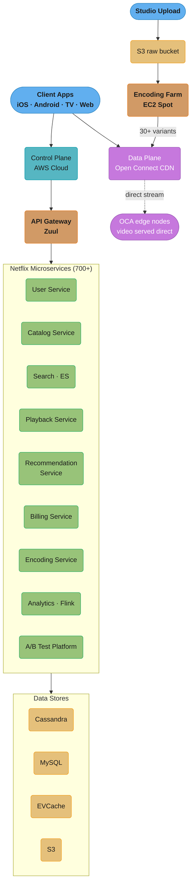
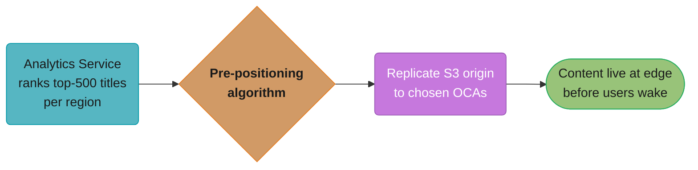
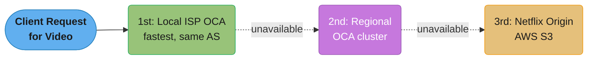
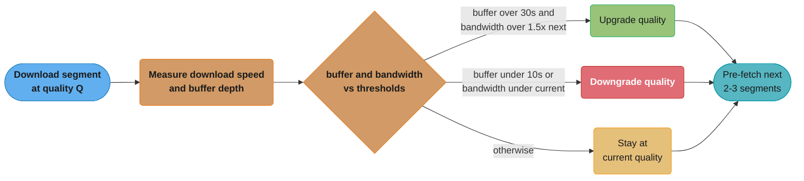
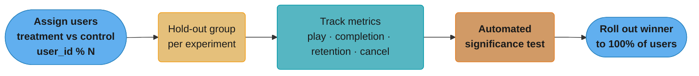
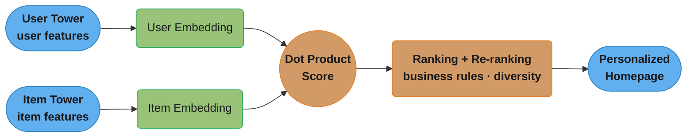
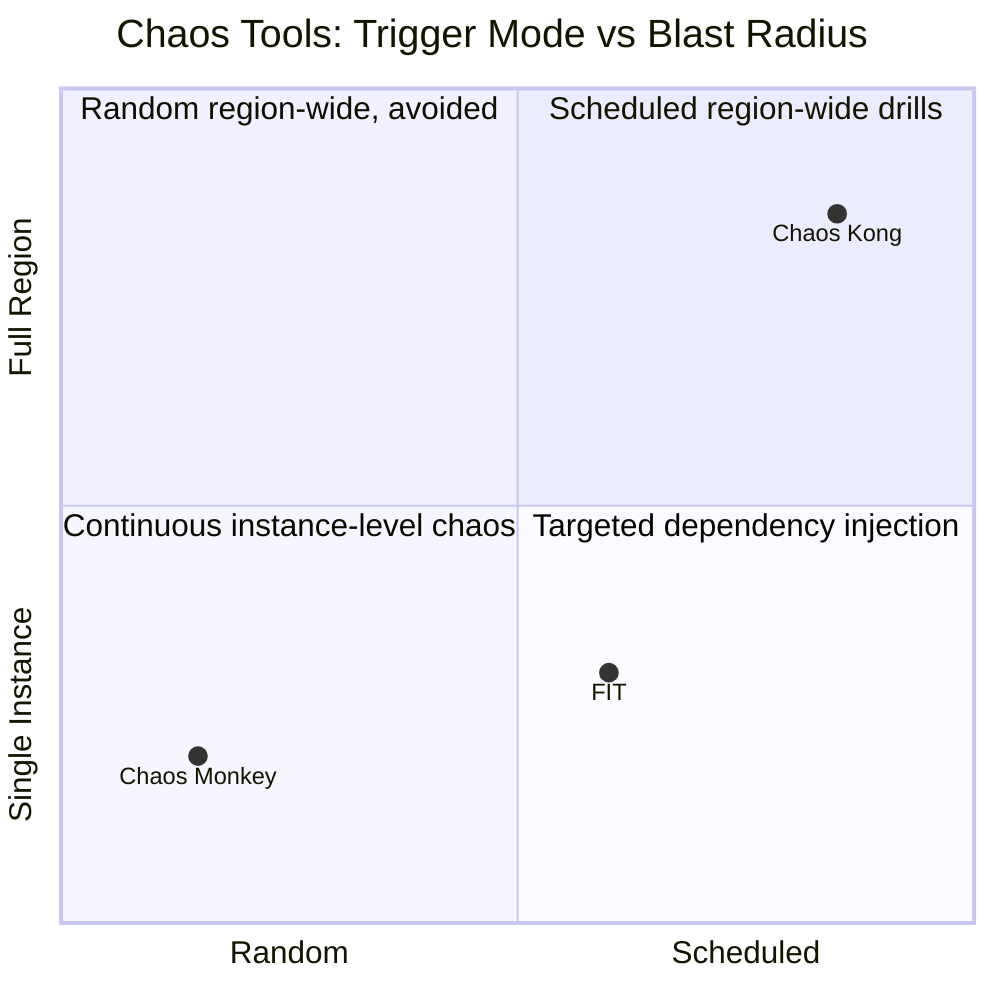
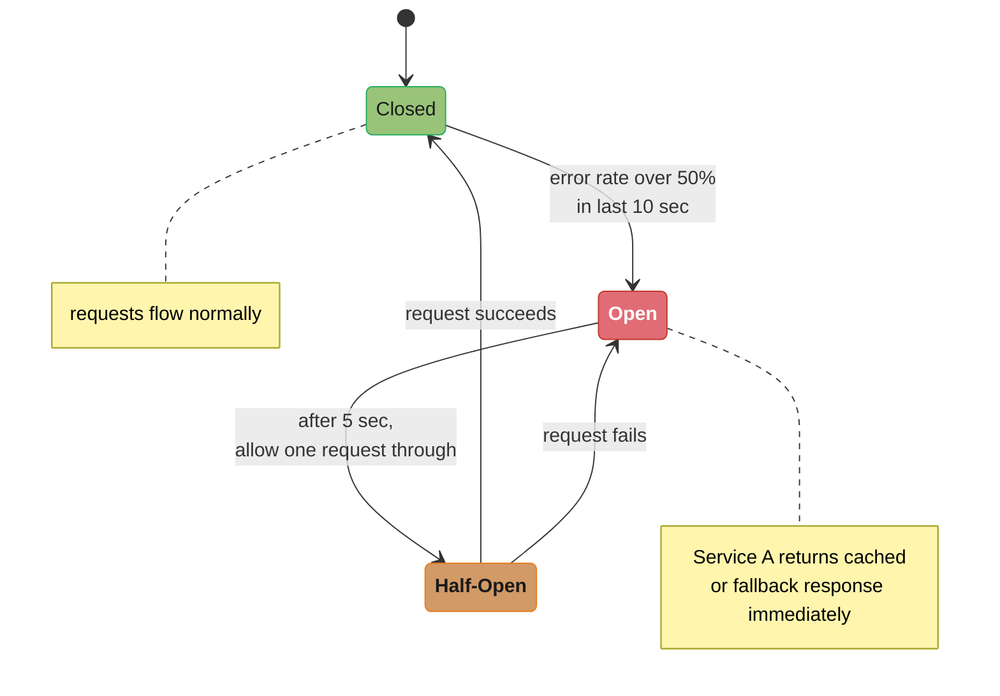
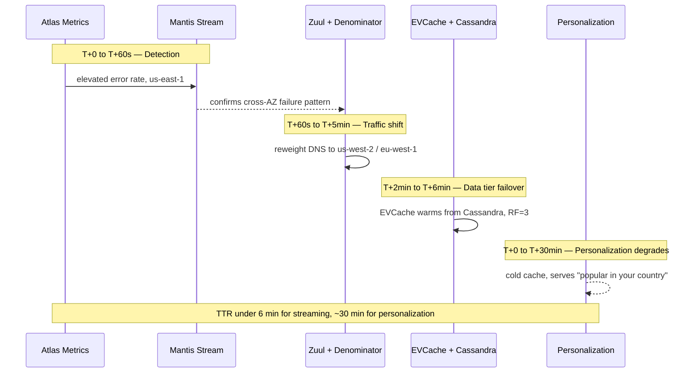

# System Design: Netflix

## Intuition

> **Design intuition**: Netflix's central challenges are video delivery at global scale (solved by Open Connect CDN — Netflix's own 800+ PoP network) and personalized recommendations (ML-driven, multi-factor ranking). 90% of Netflix traffic is video bytes; CDN architecture is the dominant engineering concern.

**Key insight**: Netflix solved the CDN problem by building their own: Open Connect appliances (ISP-co-located servers) pre-populate with popular content during off-peak hours. Most Netflix video is served from within your ISP's network, never touching the internet backbone. This is why Netflix streams 4K reliably where YouTube struggles.

---

## 1. Requirements Clarification

### Functional Requirements
- **Stream Video**: Users can stream movies and TV shows on-demand with smooth playback
- **Browse and Search**: Users can browse catalog, search by title/genre/actor, view details
- **Recommendations**: Personalized content recommendations on the home screen
- **Upload (Admin)**: Content team can upload new movies/shows (not end-user uploads)
- **Billing**: Subscription management, payment processing, plan tiers (Basic, Standard, Premium)
- **User Profiles**: Multiple profiles per account (kids, adults), separate watch history
- **Continue Watching**: Resume playback from where user left off
- **Download**: Offline viewing on mobile (Premium plan)

### Non-Functional Requirements
- **High Availability**: 99.99% uptime — video must always be streamable
- **Low Latency Startup**: Video should start playing within 2 seconds of pressing play
- **Adaptive Quality**: Seamlessly adjusts video quality based on available bandwidth
- **Global Scale**: Serve users across 190+ countries
- **Fault Tolerant**: A single server/region failure should not interrupt active streams
- **Scalability**: Handle 10M+ concurrent streams at peak

### Out of Scope
- Live streaming (Netflix is primarily on-demand)
- Social features (sharing, reviews)
- Content licensing and DRM key management details

---

## 2. Scale Estimation

### Users and Traffic
- 200M paid subscribers globally
- Peak concurrent streams: **10M simultaneous streams**
- Average stream bitrate: 5 Mbps (1080p)
- Peak bandwidth: 10M * 5 Mbps = **50 Tbps** (Netflix is ~15% of global internet traffic)
- Requests per second (API): 200M DAU / 86,400 sec * avg 10 API calls = ~23K API RPS

### Content Library
- ~15,000 titles in the catalog
- Each title encoded in ~30+ quality variants (resolution + codec combinations)
- Average movie: 2 hours at highest quality (4K HDR) = ~50 GB per variant
- 15,000 titles * 30 variants * 10 GB avg per variant = **4.5 PB** for video content
- Plus thumbnails, metadata, subtitle files: additional ~100 TB

### Storage Growth
- Netflix adds ~500 new titles/month
- Each new title: 500 titles * 30 variants * 10 GB = **150 TB/month** new content

### CDN Cache
- 80/20 rule: 20% of content accounts for 80% of views
- Top 1,000 titles need to be aggressively cached at edge nodes
- Each Open Connect Appliance (OCA): 100-200 TB SSD storage

---

## 3. High-Level Architecture


Client traffic splits at the top into a control plane (API + microservice logic on AWS) and a data plane (Open Connect CDN serving video bytes directly from ISP-embedded OCAs); the upload path runs encoding asynchronously on the side and feeds finished variants into the data plane.

---

## 4. Component Deep Dives

### Content Delivery and Open Connect CDN

### Why Netflix Built Their Own CDN
- **Cost**: Paying commercial CDNs (Akamai, Cloudflare) for 50 Tbps = billions/year
- **Control**: Full control over cache eviction, pre-positioning, routing decisions
- **Performance**: Co-locate hardware inside ISPs — video travels fewer network hops
- **Custom Hardware**: Optimized for large sequential reads (video streaming), not general web assets

### Open Connect Appliances (OCA)
- Custom hardware servers installed **inside ISP data centers** at no cost to ISPs
- ISPs benefit: traffic stays local, lower transit costs, better user experience
- Each OCA: 100 TB to 200 TB of SSD + high-speed NICs (100 Gbps)
- There are thousands of OCAs in over 1,000 cities globally

### Content Pre-Positioning
Netflix does not wait for a cache miss to populate edge nodes — they **proactively push content**:


Runs nightly at off-peak hours (2-4 AM local); by the time users wake up the content is already at the edge.

**Benefits:**
- Near-zero cache miss rate for popular content
- Origin S3 is rarely hit during peak hours
- Completely eliminates buffering for popular titles

### Routing: Steering Service
- When a client initiates playback, it contacts Netflix's **Steering Service**
- Steering Service returns an ordered list of OCA IPs to try
- Selection criteria: geographic proximity, OCA health, available bandwidth, network path quality
- Client tries OCAs in order; falls back to next if connection fails

### CDN Fallback Hierarchy

Each hop is tried only if the previous one is unavailable; roughly 95% of Netflix's bytes resolve at the first hop (local ISP OCA), so the origin S3 fallback is rarely exercised.

---

### Adaptive Bitrate Streaming

### Protocols Used
- **MPEG-DASH** (Dynamic Adaptive Streaming over HTTP): Used for most platforms
- **HLS** (HTTP Live Streaming): Required for Apple devices (iOS, macOS, Apple TV)
- Both work the same way: divide video into small chunks (2-10 second segments)

### Quality Ladder
Netflix encodes each title at multiple quality levels:

| Profile | Resolution | Video Bitrate | Audio |
|---------|-----------|--------------|-------|
| 240p    | 426x240   | 235 kbps     | 64 kbps |
| 360p    | 640x360   | 375 kbps     | 64 kbps |
| 480p    | 854x480   | 750 kbps     | 128 kbps |
| 720p    | 1280x720  | 2 Mbps       | 192 kbps |
| 1080p   | 1920x1080 | 4.3 Mbps     | 256 kbps |
| 1080p+  | 1920x1080 | 5.8 Mbps     | 320 kbps |
| 4K HDR  | 3840x2160 | 15.6 Mbps    | 640 kbps |

### How the Client Selects Quality

The client maintains a **bandwidth estimator** that measures download speed of recent chunks:


The switch happens chunk-by-chunk, not stream-wide — each 2-10 second segment can land at a different quality than the one before it.

### Manifest File (MPD/M3U8)
The client first downloads a **manifest file** that lists all available quality variants and chunk URLs:
```
#EXTM3U
#EXT-X-STREAM-INF:BANDWIDTH=2000000,RESOLUTION=1280x720
https://oca1.netflix.com/title123/720p/chunk_001.m4s
#EXT-X-STREAM-INF:BANDWIDTH=5000000,RESOLUTION=1920x1080
https://oca1.netflix.com/title123/1080p/chunk_001.m4s
```

---

### Video Transcoding Pipeline

### The Problem
A 2-hour movie in raw studio format (ProRes 4K) = **1-2 TB**. It must be:
- Encoded into 30+ quality variants
- Multiple codecs: H.264, H.265 (HEVC), AV1, VP9
- Subtitles embedded or as separate tracks
- Audio in multiple languages
- All of this before the title can go live

### Pipeline Architecture

```mermaid
flowchart LR
    classDef io      fill:#61afef,stroke:#2e86c1,color:#1a1a1a,font-weight:bold
    classDef frozen  fill:#c678dd,stroke:#9b59b6,color:#fff
    classDef train   fill:#98c379,stroke:#27ae60,color:#1a1a1a
    classDef mathOp  fill:#d19a66,stroke:#e67e22,color:#1a1a1a,font-weight:bold
    classDef lossN   fill:#e06c75,stroke:#c0392b,color:#fff,font-weight:bold
    classDef req     fill:#56b6c2,stroke:#0097a7,color:#1a1a1a
    classDef base    fill:#e5c07b,stroke:#f39c12,color:#1a1a1a

    Studio([Studio Delivery]) --> Raw(S3 Raw<br/>Content Bucket)
    Raw --> Valid(Validation Service<br/>integrity · format · metadata)
    Valid --> Sched(Job Scheduler<br/>splits into parallel jobs)
    Sched -->|"100s of jobs<br/>in parallel"| Farm(Encoding Farm<br/>EC2 Spot + FFmpeg)
    Farm --> QVal(Quality Validation<br/>PSNR · VMAF scores)
    QVal --> Enc(S3 Encoded<br/>Content Bucket)
    Enc --> CDN([CDN Distribution<br/>OCA push or on-demand])

    class Studio,CDN io
    class Raw,Enc base
    class Valid,QVal mathOp
    class Sched req
    class Farm train
```

Spot instances (60-90% cheaper, §5) run the encoding stage; the whole pipeline completes before a title ever reaches Open Connect.

### Per-Scene Encoding Optimization
Netflix's innovation: **Variable Bitrate Encoding per Scene Complexity**
- Simple scenes (static backgrounds, talking heads) = lower bitrate needed
- Complex scenes (action, explosions, rapid motion) = higher bitrate needed
- Netflix analyzes each scene independently and allocates bitrate accordingly
- Result: Better quality at same or lower average bitrate vs. fixed-bitrate encoding

### Codec Strategy
- **H.264 (AVC)**: Universal compatibility, older devices
- **H.265 (HEVC)**: 40% better compression than H.264, newer devices
- **AV1**: 30-40% better than HEVC, royalty-free, used for mobile (battery efficient)
- Netflix encodes all titles in all supported codecs for device-specific serving

---

### Recommendation System

### Why Recommendations Matter
- Netflix's homepage shows 40+ rows of personalized content
- 80% of watched content comes from recommendations (not search)
- Improving recommendations directly increases retention

### Collaborative Filtering
- **User-based**: "Users similar to you watched X"
- **Item-based**: "Users who watched A also watched B"
- Uses matrix factorization (SVD, ALS) to decompose user-item interaction matrix
- Input signals: watch history, ratings, search queries, time of day, device

### Content-Based Filtering
- Tags each title with attributes: genre, actors, director, tone, pacing
- Recommends titles with similar attribute vectors to user's history
- Good for new users (cold start) where collaborative filtering lacks data

### Deep Learning Models
- Netflix uses neural collaborative filtering (NCF) and transformer-based models
- Input: user embedding + item embedding → predicted rating/engagement score
- Trained on billions of viewing interactions

### A/B Testing at Scale
Netflix runs **hundreds of A/B tests simultaneously**:

Example experiment — "Does showing trailers autoplay increase click rate?": result was +10% click rate, so it rolled out to 100% of users.

### Personalized Thumbnails
- The same title shows different thumbnails to different users
- ML model predicts which thumbnail a user will click based on:
  - Their watch history (action lover → action scene thumbnail)
  - Demographic signals
- System tests 10-20 thumbnail candidates per title and learns optimal per user segment

### Two-Tower Architecture for Recommendations

The two towers are trained independently and only meet at the dot product, so user and item embeddings can be precomputed and served from a vector index rather than recomputed per request.

---

### Database Architecture

### Cassandra (User Activity, Viewing History)
- Stores: viewing history, pause/resume positions, ratings, interactions
- Why: high write throughput, multi-region replication, no complex joins
- Write-heavy: every play event, pause, skip generates a write
- Schema example:
```sql
CREATE TABLE viewing_history (
    user_id     UUID,
    content_id  UUID,
    profile_id  UUID,
    watched_at  TIMESTAMP,
    position_sec INT,        -- resume point in seconds
    completed   BOOLEAN,
    PRIMARY KEY ((user_id, profile_id), watched_at, content_id)
) WITH CLUSTERING ORDER BY (watched_at DESC);
```

### MySQL (Billing, Subscriptions)
- ACID transactions required for financial data
- Schema: users, subscriptions, payments, invoices, plans
- Replicated with read replicas for reporting
- Sharded by user_id at large scale
- Why not NoSQL: billing requires strong consistency (you cannot double-charge)

### EVCache (Netflix's Memcached Wrapper)
- Distributed cache across all AWS regions
- Stores: session tokens, user preferences, computed recommendation lists, rate limits
- Netflix built EVCache as a wrapper around Memcached that:
  - Replicates cache writes to multiple zones automatically
  - Handles zone failover transparently
  - Provides metrics and circuit breaker integration

### S3
- Raw video files (originals)
- Encoded video chunks (before CDN distribution)
- Thumbnails and artwork
- Model artifacts (recommendation models)
- Log archives

### Apache Kafka
- Event bus for all user activity events (play, pause, search, click)
- Feeds: analytics pipeline, recommendation model training, billing events
- 700B+ events/day

---

### Chaos Engineering

### Philosophy
Netflix operates on the premise: **"Everything will fail — build systems that work despite failures"**

### Chaos Monkey
- Tool that **randomly terminates EC2 instances** in production during business hours
- Forces engineers to design services that automatically recover
- If a service goes down and takes the site with it, that's a design flaw exposed proactively

### Chaos Kong
- Terminates an **entire AWS availability zone**
- Tests that Netflix can survive a full AZ outage
- Run periodically, not randomly

### Failure Injection Testing (FIT)
- Injects: latency, errors, resource exhaustion into service dependencies
- Example: inject 500ms latency into recommendation service call from homepage
- Ensures the homepage degrades gracefully (shows generic rows) instead of failing entirely

Netflix's three fault-injection tools occupy different points on a blast-radius x trigger-mode map — Chaos Monkey attacks single instances continuously and randomly, FIT targets one dependency deliberately, and Chaos Kong simulates a full-region loss on a monthly schedule, never randomly, given the stakes:



### Circuit Breaker Pattern (Hystrix)

Fallback for a recommendation-service failure specifically: return a generic "Top 10 Most Popular" list, so the user sees a degraded but functional homepage rather than an error.

---

### Microservices Architecture

### Scale
- Netflix operates **700+ microservices**, each independently deployable
- Teams own their services end-to-end (you build it, you run it)
- Services communicate via REST/gRPC over Netflix's internal service mesh

### Key Services
| Service | Responsibility |
|---------|---------------|
| Playback Service | DRM license, OCA selection, manifest generation |
| Catalog Service | Title metadata, availability by region |
| User Service | Account management, profiles |
| Recommendation Service | Personalized content ranking |
| Search Service | Full-text search |
| Streaming Service | Video chunk delivery via OCA |
| Billing Service | Subscription, payment, invoicing |
| Analytics Service | Event ingestion and processing |
| A/B Test Service | Experiment assignment and measurement |
| Encoding Service | Video transcoding job management |

### Service Discovery (Eureka)
- Netflix's open-source service registry
- Each service instance registers itself on startup with IP, port, health endpoint
- Clients query Eureka to find available instances of a dependency
- Eureka is replicated across all regions for availability

### API Gateway (Zuul)
- Single entry point for all client API calls
- Handles: authentication, rate limiting, routing, A/B test assignment
- Filters applied per request (auth check, device type detection, request logging)

---

### Search

### Requirements
- Search by title, actor, director, genre, description
- Multi-language support (190 countries, dozens of languages)
- Near-instant results with typo tolerance
- Personalized ranking (your recently watched genres rank higher)

### Architecture
- **Elasticsearch** cluster with per-language analyzers
- Index per language for proper stemming and tokenization (English vs. Japanese vs. Arabic behave differently)
- Each document:
```json
{
  "content_id": "tt1234567",
  "title": "Stranger Things",
  "title_en": "Stranger Things",
  "title_es": "Cosas más extrañas",
  "description": "In a small town...",
  "genres": ["sci-fi", "thriller", "horror"],
  "cast": ["Millie Bobby Brown", "Winona Ryder"],
  "year": 2016,
  "rating": 8.7,
  "tags": ["supernatural", "80s", "kids"]
}
```

### Ranking Signals
1. Text relevance score (BM25 from Elasticsearch)
2. Title popularity (global view count)
3. User personalization (user's genre preferences)
4. Recency (newly added content gets a boost)
5. Regional availability (only show available content)

---

## 5. Design Decisions & Tradeoffs

### Own CDN vs. Commercial CDN
- **Choice**: Build Open Connect (own CDN)
- **Reason**: At Netflix's scale, commercial CDN costs are prohibitive; custom hardware optimized for video
- **Trade-off**: Massive upfront investment in hardware, ISP relationships, and engineering

### Cassandra vs. MySQL for Viewing History
- **Choice**: Cassandra for viewing history, MySQL for billing
- **Reason**: Viewing history is write-heavy, append-only, no transactions needed; billing requires ACID
- **Trade-off**: Two different database systems to operate

### MPEG-DASH vs. HLS
- **Choice**: Support both
- **Reason**: MPEG-DASH is the open standard (Netflix prefers it), but HLS is mandatory for Apple devices
- **Trade-off**: Increased encoding and CDN storage cost (maintain both formats)

### Spot Instances for Encoding
- **Choice**: AWS EC2 Spot instances for encoding farm
- **Reason**: 60-90% cost savings; encoding is interruptible (can checkpoint and restart)
- **Trade-off**: A Spot interruption delays a title's encoding; mitigated by checkpointing

### Microservices vs. Monolith
- **Choice**: 700+ microservices
- **Reason**: Independent deployability, team autonomy, fault isolation, polyglot persistence
- **Trade-off**: Massive operational complexity; distributed tracing, service mesh, and observability investment required

---

## 6. Real-World Implementations

Netflix's actual production stack (from public engineering blog posts, conference talks, and the Netflix Tech Blog) validates the architectural choices above:

- **Open Connect** — Netflix's purpose-built CDN: ~15,000 custom FreeBSD storage appliances (OCAs), each holding up to 280 TB, donated to ISPs and embedded directly in their networks. ~95% of Netflix's bytes never touch the public internet.
- **Cassandra** — Stores viewing history, ratings, and "my list" — write-heavy, append-mostly data with no cross-row transactions, sharded with `NetworkTopologyStrategy` and RF=3 per region.
- **EVCache** — Netflix's Memcached-based caching layer, deployed as a thin read-through cache in front of Cassandra to absorb hot-title read spikes.
- **Hystrix / Resilience4j** — Circuit-breaker libraries wrapping every inter-service call; when a downstream (e.g., personalization) is slow, the circuit opens and a fallback (e.g., "Recently Watched" instead of "Top Picks for You") is served instantly instead of hanging.
- **Zuul** — The edge API gateway that all client requests pass through, handling auth, routing, and dynamic traffic shifting during failover.
- **Spinnaker** — Netflix's open-sourced continuous-delivery platform; every deploy goes through canary analysis (1% traffic, automated metric comparison) before ramping to 100%.
- **Chaos Monkey / Chaos Kong** — Chaos Monkey randomly terminates production instances daily; Chaos Kong simulates the loss of an entire AWS region monthly. Both are scheduled, expected events, not incidents.
- **Atlas / Mantis** — Atlas is Netflix's in-house time-series metrics platform (handles billions of metrics); Mantis is a real-time stream-processing platform used to detect anomalies (like the SPS metric in §8) within seconds.

**Comparable systems for cross-reference:**
- **YouTube/Google** solves CDN distribution with Google Global Cache (GGC) — conceptually similar to Open Connect (ISP-embedded boxes), but layered on Google's existing global backbone rather than built from scratch.
- **Twitch** (live streaming) faces a fundamentally different problem: near-zero pre-positioning is possible because content is generated in real time, so its CDN strategy leans on transcoding-at-the-edge and low-latency HLS rather than overnight pre-positioning.
- **Disney+/Hulu** run on commercial CDNs (Akamai, Fastly, CloudFront) rather than building their own — a legitimate "buy vs. build" answer for a company without Netflix's decade-plus head start and traffic volume to justify the capex.

---

## 7. Technologies & Tools

| Component | Technology | Why |
|---|---|---|
| CDN / content delivery | Open Connect Appliances (custom FreeBSD) | ISP-embedded, near-zero marginal egress cost at 21 TB/sec peak |
| Viewing history, ratings, "my list" | Cassandra (multi-region, RF=3) | Write-heavy, append-only, no cross-row transactions, linear scalability |
| Billing and subscriptions | MySQL | ACID transactions required for financial data |
| Hot-read caching | EVCache (Memcached-based) | Absorbs read spikes for popular titles in front of Cassandra |
| Object storage | S3 | Source masters, encoded variants, analytics archives |
| Event streaming | Apache Kafka | Watch-event ingestion for analytics and recommendation training |
| Edge gateway | Zuul | Auth, routing, dynamic traffic shifting during regional failover |
| Service discovery | Eureka | Client-side service registry for the 700+ microservice fleet |
| Fault tolerance | Hystrix / Resilience4j | Circuit breakers + fallback UI when a dependency degrades |
| Continuous delivery | Spinnaker | Canary analysis -> automated gradual rollout |
| Metrics and anomaly detection | Atlas + Mantis | Billions of time-series metrics; sub-second anomaly detection (SPS) |

---

## 8. Operational Playbook

### Multi-Region and Global Deployment

**Three-Region Active-Active**
- **us-east-1** (Virginia): primary historically; serves Americas.
- **us-west-2** (Oregon): active failover for Americas; pre-warmed for instant takeover.
- **eu-west-1** (Dublin): serves EMEA.
- **ap-southeast-1** (Singapore): serves APAC (added later).
- Each region has a full microservice stack + Cassandra replicas; no single region is critical.

**Cross-Region Cassandra Replication**
- Cassandra `NetworkTopologyStrategy` with RF=3 in each region.
- Writes use **LOCAL_QUORUM** (2/3 local replicas) for low latency.
- Cross-region async replication; typical lag 50-200ms.
- Read repair and hinted handoff keep eventual consistency strong.

**Open Connect: ISP-Embedded CDN**
- Netflix offers OCAs (custom-built FreeBSD storage servers, ~280 TB each) to ISPs **for free**.
- ISPs install them in their head-ends; Netflix traffic never traverses the public internet for that ISP's subscribers.
- ~95% of Netflix's bytes are served from OCAs; only 5% from AWS-backed fill clusters at internet exchanges.
- Pre-positioning: new content is pushed to OCAs during off-peak hours (3-6 AM local), based on predicted demand from the recommendation system.

**Per-Title Encoding (Dynamic Optimizer)**
- Traditional CDN: fixed bitrate ladder (e.g., 235/375/560/750/1050/1750/2350/3000 kbps) applied to all titles.
- Netflix's innovation: **per-title encoding**. The dynamic optimizer analyzes each title scene-by-scene and picks the optimal bitrate ladder per scene.
- A high-motion action scene needs more bits; a static dialog scene needs few. Result: **~20% bandwidth reduction** for equivalent quality.
- Stranger Things season premiere encoded with 27 thumbnail variants tested via A/B for click-through rate optimization.

**Data Residency**
- EU subscriber PII (email, payment, viewing history) stored only in eu-west-1.
- Catalog is global; recommendations are a global model but personalized per region.

### Deployment and Alerting

**Critical Alerts**

| Metric | Threshold | Why |
|---|---|---|
| SPS (Starts Per Second) deviation from forecast | > 20% | Best leading indicator of system health |
| Play start failure rate | > 0.1% | Direct revenue impact |
| Rebuffer ratio | > 0.5% | Streaming quality degradation |
| Hystrix open circuit count | > 100 services | Cascading failure forming |
| Cassandra p99 read | > 50ms | Cache miss path slow |
| Open Connect cache hit ratio | < 90% | Bandwidth bill spiking; possibly origin attack |
| EVCache hit ratio | < 95% | Cassandra load about to spike |

**Deployment Strategy**
- **Spinnaker pipelines**: every commit auto-deploys to a canary cluster (1% traffic) for 1 hour, then gradual ramp.
- **Red/black deployment** (Netflix's term for blue/green): new ASG launched in parallel; traffic flipped via ELB; old ASG kept for 30 min for fast rollback.
- **Chaos Monkey** randomly kills instances in production daily; **Chaos Kong** simulates full-region loss monthly. If your service can't survive these, it's not production-ready.
- **A/B testing** is the default: every new feature, ranking algorithm, even UI element is gated behind an experiment.

**On-Call Runbook: SPS Drop Detected**
1. Look at Atlas dashboards: which region(s) is the drop in?
2. Check upstream services: Zuul errors? Authentication failures? CDN issues?
3. Check downstream: Cassandra latency? DRM service? Image service for box art?
4. If region-localized: consider preemptive failover via Denominator (DNS reweighting).
5. If global: roll back recent deployments via Spinnaker (one click).

**On-Call Runbook: Open Connect Capacity Crisis at an ISP**
1. Check OCA fleet health for that ISP in the steering dashboard.
2. If an OCA is unhealthy: re-route via steering.
3. If aggregate ISP bandwidth is saturated (e.g., during a big launch): coordinate with the ISP to provision more OCAs.
4. Activate AWS-backed fill as overflow.

### Evolution and Future Improvements

**At 10x Scale (2.4B Subscribers — Hypothetical)**
- Open Connect would need ~150,000 OCAs globally; logistics of physical deployment dominate.
- AV1 (or successor) adoption critical for bandwidth: ~30% reduction over H.265.
- Recommendation training would move to on-device personalization (TFLite/Core ML) for privacy + freshness.
- Cassandra would be replaced by FoundationDB or similar (Cassandra's gossip overhead doesn't scale past ~5,000 nodes per cluster).

**Technical Debt**
- Java 8 legacy services still present in some corners (most migrated to Java 17/21 with virtual threads).
- Hystrix is deprecated upstream; migration to Resilience4j ongoing.
- Custom CDN steering (in-house) competes with mature solutions (Cloudflare, Akamai); a build-vs-buy tradeoff continually re-evaluated.
- Erlang/Elixir for some legacy systems (e.g., the original Roku integration) — limited talent pool.

**Future Capabilities**
- **Cloud Gaming integration**: streaming gameplay requires <50ms latency end-to-end; current CDN architecture is optimized for one-way video and needs WebRTC for interactive use cases.
- **Interactive content (Black Mirror: Bandersnatch successor)**: requires player-side state machine and dynamic stream switching at decision points.
- **Live streaming at scale**: Netflix's first major live event (Chris Rock special, 2023) revealed gaps in their VOD-optimized architecture. Migration to low-latency HLS / DASH-LL is in progress.
- **Generative AI for content**: AI-generated dubbing (preserving original actor voice), automated trailer generation, personalized thumbnails per user.
- **On-device personalization**: move recommendation inference to the client to reduce server cost and improve privacy.

---

## 9. Common Pitfalls & War Stories

### Pitfall Summary

| Pitfall | Impact | Fix |
|---|---|---|
| Relying on a commercial CDN at Netflix's scale | Bandwidth bill becomes the dominant cost line | Build Open Connect: ISP-embedded OCAs at near-zero marginal egress |
| Treating video startup as "good enough at 5s" | Users abandon if startup > 2 sec | OCA proximity routing + pre-positioned content + adaptive bitrate |
| No fallback for new users with no history | Cold-start users get poor/empty recommendations | Content-based filtering + popularity-based fallback rows |
| On-demand instances for encoding farm | Encoding cost dominates compute spend | EC2 Spot instances (60-90% cheaper) with checkpoint/restart |
| No tiering for cold catalog content | High origin S3 load on cache miss | Tiered caching + pre-positioning ahead of new releases |
| Single hot-table reads against Cassandra | Read overload on popular-title rows | EVCache read-through cache in front of Cassandra |
| No regional failover plan | A single AWS region outage takes down the service | Multi-region active-active + monthly Chaos Kong drills |

### War Story 1: Full AWS Region Loss (Chaos Kong Drill)
**Scenario**: us-east-1 becomes unavailable (real-world precedent: the September 2015 DynamoDB outage that took down half of AWS for hours). Netflix's "Chaos Kong" simulates this monthly.

**Response sequence**:
1. **Detection** (T+0 to T+60s): Atlas metrics show elevated error rates from us-east-1; Mantis (real-time event stream) confirms cross-AZ failure pattern.
2. **Traffic shift** (T+60s to T+5min): Zuul (edge gateway) and Denominator (multi-CDN DNS abstraction) reweight traffic to us-west-2 and eu-west-1. DNS TTLs are 60s; most clients shift within 2 min.
3. **Data tier failover** (T+2min to T+6min): EVCache (Memcached fork) clusters in healthy regions warm from Cassandra; Cassandra remains available because it's multi-region replicated with RF=3 per region.
4. **Personalization degradation** (T+0 to T+30min): Recommendation models for users normally served from us-east are cold in other regions. Users see "popular in your country" lists rather than personalized rows for ~30 minutes.

The four phases overlap rather than run strictly one-after-another — traffic is already shifting while data-tier warm-up is still in progress, and personalization stays degraded long after streaming has recovered:



**TTR**: < 6 minutes for streaming traffic to fully shift; ~30 minutes for personalization quality to fully recover. **Zero stream interruption** for currently-playing sessions (the video chunks come from Open Connect, not AWS).

### War Story 2: Open Connect Appliance (OCA) Failure at an ISP
**Scenario**: A Comcast head-end's OCA fails during peak hours; 100K subscribers' streams need a new source.

**Behavior**:
- Each client periodically reports its current CDN endpoint to the steering service.
- Steering re-routes affected clients to:
  1. A neighboring OCA in the same ISP (lowest preference change).
  2. A regional OCA in the IX (Internet Exchange Point).
  3. AWS-hosted fill servers (S3-backed) as last resort.
- ABR (adaptive bitrate) algorithm on the client detects throughput change and drops bitrate if necessary to avoid rebuffer.

**TTR**: <30 seconds for new client connections; existing streams continue from chunk buffer (~30s ahead) and seamlessly re-bind to new origin.

### War Story 3: Cassandra Region-Wide Slow-Down
**Scenario**: Compaction storm or GC pause on a Cassandra cluster causes p99 reads to spike from 5ms to 500ms.

**Behavior**:
- Hystrix circuit breakers (or its successor Resilience4j) open on the calling service.
- Fallback paths kick in: serve from EVCache stale data, or serve a default UI ("Recently Watched" instead of personalized "Top Picks").
- Cassandra heals: typically within 5–15 minutes for transient compaction storms.

**TTR**: User-visible impact zero for cacheable paths; some advanced personalization features may show fallback UI for 10–15 min.

### War Story 4: License Server (DRM) Outage
**Scenario**: Widevine license server cluster experiences a failure; new playback sessions cannot decrypt content.

**Behavior**:
- Existing streams continue (license is cached client-side for the session duration, typically 1-24 hours).
- New streams fail at the license-acquisition step with a clear error code.
- DRM service is regionally replicated; failover via DNS within 2 minutes.
- For Netflix's revenue impact: DRM is on the critical path for *new* play starts (~10K/sec at peak); 2-minute outage = ~1.2M failed play starts.

**TTR**: 1–3 minutes via regional failover.

### War Story 5: Encoding Pipeline Stalls
**Scenario**: A new title is uploaded but the encoding pipeline (built on Spinnaker + custom orchestrator) stalls due to a bug in the dynamic-optimizer service.

**Behavior**:
- Title remains in "ingest pending" state; not visible in catalog.
- Existing titles unaffected.
- On-call engineer rolls back the dynamic-optimizer deployment; reprocesses the title.

**TTR**: 1–4 hours for fix + reprocess; user impact is *delayed* availability, not stream failure.

---

## 10. Capacity Planning

### Streaming Bandwidth
- **238M subscribers**, average concurrent viewers at peak ~10% = **~24M concurrent streams**.
- Bitrate mix: 30% mobile (1.5 Mbps), 40% HD (5 Mbps), 25% 4K (15 Mbps), 5% 4K HDR (25 Mbps).
- Weighted average: ~7 Mbps per stream.
- **Peak aggregate bandwidth**: 24M × 7 Mbps = **168 Tbps** ≈ **21 TB/sec** of egress.
- This is why Open Connect exists: serving this from AWS at $0.05/GB would cost **~$2.7M/hour** = **$1.6B/month** in egress alone. Open Connect pushes 95%+ of this to ISP-embedded boxes at near-zero marginal cost.

### Content Storage
- ~17,000 titles in catalog.
- Each title encoded into ~120 variants (multiple codecs × bitrate ladders × audio tracks × languages × HDR/SDR).
- Avg title size all variants: ~3 TB.
- **Total catalog size**: 17,000 × 3 TB = **~50 PB**.
- Cached on **15,000+ OCAs globally**; not every OCA has the full catalog (popularity-tiered: top 1% titles on every OCA, long tail on regional/AWS-backed fills).

### Metadata Storage (Cassandra)
- User profile, watch history, ratings, queue: ~5KB/user.
- 238M × 5KB = ~1.2 TB of hot metadata.
- With RF=3 across 3 regions: ~11 TB total.
- Watch event log (every play/pause/seek for analytics): 50 events/user/day × 238M × 200 bytes = **~2.4 TB/day** → 870 TB/year, sampled and archived to S3.

### Compute Footprint
- Microservices: ~1,000 services running ~100,000 EC2 instances at peak (auto-scaled down off-peak).
- Encoding fleet: ~300,000 vCPU-hours/day burst on EC2 Spot (60–90% cheaper) for new title encoding.
- Recommendation training: ~5,000 GPU-hours/day on GPU instances.

### Cost Envelope
- Compute on AWS: **~$1B/year** (publicly disclosed AWS spend).
- Open Connect (capex): ~15,000 OCAs at ~$30K each amortized over 5 years = **~$90M/year capex**, plus ~$50M/year colocation/power.
- Content licensing/production: $17B/year (separate from infra; included for context).
- Total infra: **~$1.2B/year** for serving 238M subscribers = ~$5/subscriber/year.

---

## 11. Interview Discussion Points

### How to Structure a 45-Minute Answer
1. **Clarify requirements** (5 min) — streaming, upload, recommendations, billing, search.
2. **Scale estimation** (5 min) — 200M+ users, ~24M concurrent streams, ~21 TB/sec peak bandwidth, PB-scale storage.
3. **High-level architecture** (5 min) — control plane vs. data plane separation.
4. **Content delivery deep dive** (10 min) — Open Connect CDN, pre-positioning, OCA routing.
5. **Adaptive streaming** (5 min) — DASH/HLS, quality ladder, client algorithm.
6. **Transcoding pipeline** (5 min) — parallel encoding, EC2 Spot, quality validation.
7. **Database and recommendations** (10 min) — Cassandra/MySQL/EVCache split, two-tower ranking, A/B testing.

**Q: What's the central engineering challenge for Netflix, and why does it dominate the architecture?**
A: Delivering ~21 TB/sec of video egress globally without bandwidth becoming the company's largest cost line. Open Connect exists specifically to solve this; nearly every other architectural decision — recommendations, transcoding, multi-region failover — is secondary to "how do we move video bytes cheaply and reliably." If asked to prioritize where to spend your design time, content delivery should get roughly half of it.

**Q: Why did Netflix build its own CDN instead of using a commercial one (Akamai, CloudFront)?**
A: At Netflix's volume (~21 TB/sec peak), commercial CDN egress pricing (~$0.05/GB) would cost roughly $1.6B/month, versus near-zero marginal cost for ISP-embedded OCAs that Netflix gives away for free (§10). The trade-off is enormous upfront capex — custom hardware, ISP relationship management, and global logistics for ~15,000 appliances — plus an entire engineering org dedicated to CDN operations. This is only justified at Netflix's traffic volume; smaller streaming services correctly use commercial CDNs (see §6).

**Q: Why two databases (Cassandra + MySQL) instead of one?**
A: Viewing history, ratings, and "my list" are write-heavy and append-mostly with no need for cross-row transactions — a strong fit for Cassandra's linear scalability. Billing and subscriptions need ACID guarantees (a payment must not be partially applied), which Cassandra deliberately doesn't provide, so MySQL handles that. The cost is operating two database systems with different consistency models, backup strategies, and on-call runbooks — accepted because using one database for both would either compromise billing correctness or cripple viewing-history scalability.

**Q: Explain adaptive bitrate streaming beyond "it adjusts quality" — what's actually happening?**
A: The encoding pipeline produces a "quality ladder" — the same content encoded at multiple bitrate/resolution combinations (235 kbps up to 25 Mbps for 4K HDR), broken into 2-10 second chunks described in a manifest (MPD for DASH, M3U8 for HLS). The client continuously measures its actual download throughput and buffer health, then requests the next chunk at whichever quality level it estimates it can download faster than it plays back — switching up or down chunk-by-chunk, not stream-wide. Per-title encoding (§8) takes this further: the ladder itself is tuned per title, and even per scene, rather than being one fixed ladder for the whole catalog.

**Q: How does Netflix prepare for a hit show launch with millions of simultaneous new viewers?**
A: The recommendation/marketing systems generate a demand forecast before release, which feeds the Open Connect pre-positioning pipeline — encoded variants are pushed to OCAs during off-peak hours (3-6am local) in proportion to predicted regional demand, so the bytes are already sitting on ISP-embedded hardware close to viewers when the show drops. The encoding fleet (EC2 Spot) and microservice auto-scaling groups pre-scale based on the same forecast. The signal that a launch is going well or poorly is the SPS metric (§8) — a sudden SPS deviation from forecast is the first thing on-call checks.

**Q: How does Netflix achieve 99.99% uptime despite running 700+ microservices?**
A: Primarily through designed-in failure tolerance, not failure avoidance: every inter-service call is wrapped in a circuit breaker (Hystrix/Resilience4j) with a fallback response — for example, generic "Top Picks" instead of personalized rows if the recommendation service is slow — so one degraded service doesn't cascade. Multi-region active-active means a full region loss, simulated monthly via Chaos Kong, results in a traffic shift rather than an outage (War Story 1 in §9). The cultural piece matters as much as the technical: Chaos Monkey randomly kills production instances daily, so "my service might lose an instance any minute" is a baseline assumption every team designs for, not an edge case.

**Q: A new title's encoding pipeline stalls — walk through detection and recovery.**
A: The title sits in "ingest pending" state and simply doesn't appear in the catalog — existing titles and currently-playing streams are completely unaffected, because encoding is decoupled from serving (War Story 5 in §9). On-call is alerted via the pipeline's own health metrics (titles stuck in a state longer than expected), traces the stall to the failing stage — often the dynamic-optimizer service doing per-title analysis — and rolls back the recent deployment via Spinnaker before reprocessing the title. TTR is 1-4 hours, slow by Netflix standards, but the user-visible impact is *delayed availability* of one title, not a service disruption.

**Q: Why does Netflix support both MPEG-DASH and HLS instead of standardizing on one?**
A: MPEG-DASH is the open, codec-agnostic standard Netflix prefers internally, but Apple devices (iOS, Safari, AppleTV) only support HLS at the OS level — there's no way around that platform requirement. Supporting both means encoding and storing two manifest formats, and sometimes different segment formats, for every title — roughly doubling CDN storage and encoding-pipeline complexity along that dimension. This is a "the platform constraint isn't yours to negotiate" trade-off — recognizing when a technical decision is externally mandated rather than a design choice is itself a signal of seniority.

**Q: How would you design the recommendation system, at a high level?**
A: It blends collaborative filtering (users who watched X also watched Y), content-based filtering (similar genre/cast/themes — used for cold-start users with no history), and a deep-learning two-tower architecture: one tower embeds the user's history/context, the other embeds candidate titles, and the dot product of the two embeddings produces a ranking score. Personalization extends beyond row ordering to the artwork itself — the same title shows different thumbnail images to different users based on which image historically drove the highest click-through for similar viewers, validated via continuous A/B testing. Roughly 80% of what users watch comes from these recommendations, which is why this subsystem gets equal billing with the CDN in interviews.

**Q: Why use EC2 Spot instances for the encoding fleet, when Spot instances can be reclaimed at any time?**
A: Encoding is naturally interruptible and checkpointable — if a Spot instance is reclaimed mid-job, the encoder resumes from the last completed scene/segment rather than restarting the whole title, so a reclaim costs minutes, not hours. The 60-90% cost saving on a fleet that burns ~300,000 vCPU-hours/day is enormous in absolute dollars, while the downside (an occasional reclaim-and-resume) is invisible to users since encoding happens well ahead of a title's release. This is the general pattern for when Spot makes sense: the workload must be stateless-or-checkpointable and off the user-facing latency path.

**Q: How does a DRM (license server) outage affect users, and why is the blast radius limited?**
A: Licenses are cached client-side for the session duration (1-24 hours), so anyone already watching is completely unaffected by a license-server outage — only *new* play starts fail at the license-acquisition step. At ~10K new-play-starts/sec at peak, even a 2-minute regional DRM outage means roughly 1.2M failed play starts before the regionally-replicated DRM service fails over via DNS (TTR 1-3 minutes, War Story 4 in §9). The architectural lesson: separating "is this session allowed to keep playing" (cached, resilient) from "is this new session allowed to start" (live dependency) limits the blast radius of a DRM outage to new starts only.

**Q: At 10x Netflix's current scale (2.4B subscribers), what breaks first?**
A: Open Connect's physical logistics — deploying and maintaining ~150,000 OCAs globally (vs. ~15,000 today) becomes a hardware-supply-chain and ISP-relationship problem before it's a software problem. Cassandra's gossip protocol doesn't scale cleanly past ~5,000 nodes per cluster, so the metadata tier would need to move to something like FoundationDB or a hierarchical Cassandra topology. On the bandwidth side, codec efficiency becomes the lever that matters most — moving from H.265 to AV1 (or its successor) yields ~30% bandwidth reduction, which at 10x scale is the difference between a feasible and infeasible egress bill even with Open Connect absorbing most of it.

### Numbers to Remember
- 200M-238M subscribers, ~24M concurrent streams at peak
- Peak egress: ~21 TB/sec (168 Tbps), ~95% served from Open Connect OCAs
- ~17,000 titles, ~120 encoded variants each, ~50 PB total catalog
- 700+ microservices, ~100,000 EC2 instances at peak
- Per-title encoding: ~20% bandwidth reduction vs. a fixed bitrate ladder
- Spot instances: 60-90% cheaper than on-demand for encoding (~300K vCPU-hours/day)
- Total infra cost: ~$1.2B/year (~$5/subscriber/year)
- ~80% of viewing comes from recommendations

---

## Cross-References

- **CDN architecture and edge caching** -> [`../cdn/README.md`](../cdn/README.md), [`../../devops/cloud_networking_and_cdn/README.md`](../../devops/cloud_networking_and_cdn/README.md)
- **Cassandra / wide-column metadata storage** -> [`../../database/wide_column_databases/README.md`](../../database/wide_column_databases/README.md)
- **EVCache read-through caching in front of Cassandra** -> [`../../backend/caching_strategies_deep_dive/README.md`](../../backend/caching_strategies_deep_dive/README.md), [`../../database/database_caching_patterns/README.md`](../../database/database_caching_patterns/README.md)
- **700+ microservices, Eureka/Zuul** -> [`../microservices/README.md`](../microservices/README.md), [`../../backend/microservices_fundamentals/README.md`](../../backend/microservices_fundamentals/README.md)
- **Hystrix/Resilience4j circuit breakers** -> [`../../backend/fault_tolerance_patterns/README.md`](../../backend/fault_tolerance_patterns/README.md), [`../../spring/spring_cloud_patterns/README.md`](../../spring/spring_cloud_patterns/README.md)
- **Cross-region Cassandra replication (LOCAL_QUORUM)** -> [`../../database/replication_and_high_availability/README.md`](../../database/replication_and_high_availability/README.md), [`../../database/consistency_models_and_consensus/README.md`](../../database/consistency_models_and_consensus/README.md)
- **Watch-event streaming for analytics/training** -> [`../../backend/kafka_deep_dive/README.md`](../../backend/kafka_deep_dive/README.md)

