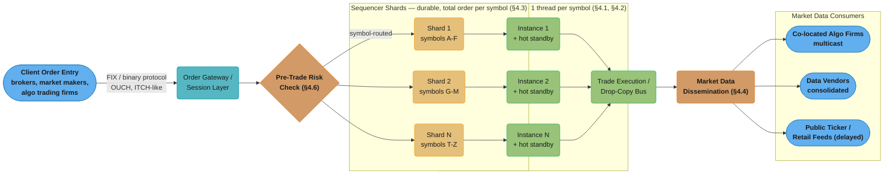
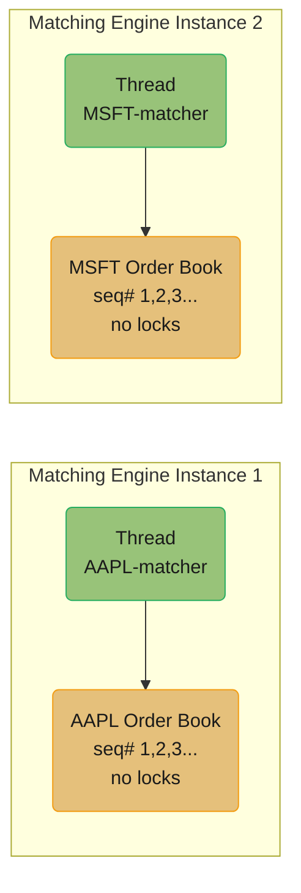
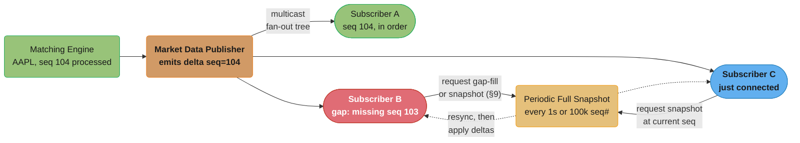
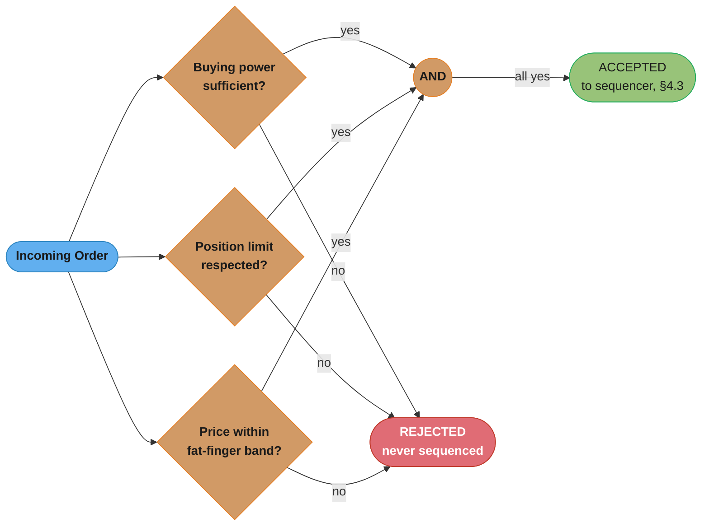
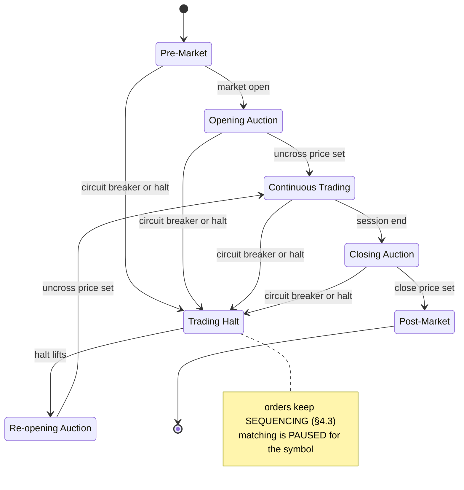
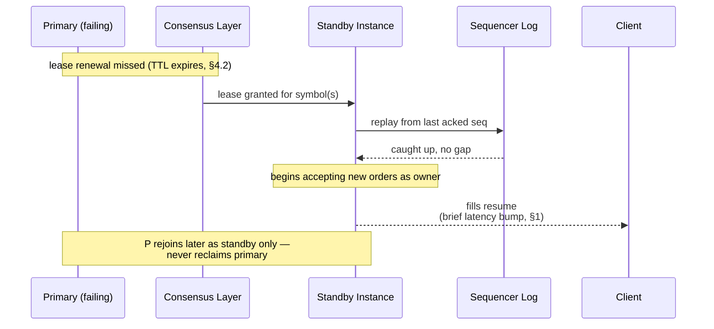

# System Design: Stock Exchange

## Intuition

> **Design intuition**: A stock exchange is, at its core, **a single auctioneer standing in front of a crowd, for each stock separately**. For any given symbol — say AAPL — there is exactly one "person" (the matching engine instance) who decides, in a strict order, who gets to trade with whom and at what price. Every buyer and seller shouts their order to that one auctioneer; the auctioneer processes shouts **one at a time, in the exact order received**, matching a new shout against the standing offers already on the board (price-time priority), and immediately announces the result. The auctioneer never multitasks across two simultaneous shouts for the same stock — if it did, two people could "win" the same trade, or the same share could be sold twice. The system scales not by giving AAPL's auctioneer more helpers, but by giving **every symbol its own dedicated, single-threaded auctioneer**, running in parallel with every other symbol's auctioneer. Fairness and determinism for a single symbol matter more than raw parallelism within that symbol — which is the opposite of almost every other system in this repository, where the instinct is "add more threads/replicas to go faster."

**Key insight**: The entire architecture is shaped by one non-negotiable constraint — **for a single symbol, there must be one and only one totally-ordered sequence of events, processed by one logical thread of execution, at any point in time** — combined with one brutal performance target — **that single thread must process each order in low single-digit microseconds**, because every market participant is racing every other participant to be first in the queue at a given price. Everything else in this design exists to serve those two facts without contradicting them: a durable sequencer/log gives the single-writer thread a replayable source of truth (so "single-threaded" doesn't mean "fragile"); symbol-sharding across many matching-engine instances gives you parallelism *across* symbols without violating single-writer-per-symbol *within* a symbol; and the market-data fan-out is built as a completely separate, asynchronous, best-effort pipeline so that publishing trades to 50,000 subscribers never adds a single nanosecond of latency to the matching hot path.

---

## 1. Requirements Clarification

### Functional Requirements

- **Order submission and cancellation**: clients (brokers, market makers, algorithmic trading firms, retail-order routers) submit new orders — **limit**, **market**, **stop**, **IOC** (Immediate-or-Cancel), and **FOK** (Fill-or-Kill) — and can cancel or modify resting (unfilled) orders.
- **Order matching**: incoming orders are matched against resting orders in the order book according to **price-time priority** (best price first; among orders at the same price, earliest-submitted first), producing zero, one, or many **trade executions** per incoming order.
- **Market data dissemination**: the exchange publishes a real-time feed of order-book state — both a **full snapshot** (periodic) and an **incremental delta feed** (every order add/cancel/modify/trade) — to thousands of downstream consumers (trading firms, data vendors, the exchange's own public ticker).
- **Pre-trade risk checks**: every order is checked against the submitting firm's risk limits (buying power, position limits, max order size, fat-finger price bands) **before** it reaches the matching engine.
- **Trade reporting and clearing handoff**: every executed trade is reported to a **trade reporting facility** (regulatory tape) and handed off to a clearinghouse for settlement (T+1/T+2) — this design treats clearing/settlement as a downstream consumer of the trade log, not something the matching engine itself performs.
- **Market state management**: the exchange supports distinct **trading sessions** — pre-market, continuous trading, closing auction, and **trading halts** (circuit breakers, single-stock halts, market-wide halts) — each of which changes how the matching engine processes (or refuses) incoming orders.

### Non-Functional Requirements

- **Ultra-low, deterministic latency**: matching-engine processing time for a single order must be in the **low single-digit microseconds** at p50, with a **p99.9 under ~50 microseconds** for the core match step (excluding network transit) — see §10 for the full latency budget.
- **Strict ordering and determinism**: for a given symbol, the sequence of trades produced from a given sequence of input orders must be **100% reproducible** — replaying the same input log must produce byte-identical output, a hard requirement for regulatory audit and disaster recovery.
- **Zero data loss for accepted orders**: once an order is acknowledged as "accepted," it must survive a matching-engine crash — durability comes from a write-ahead sequencer log (§4.3), not from the matching engine's in-memory state.
- **Extremely high throughput, highly skewed**: the system must sustain **millions of orders/sec cluster-wide** across thousands of symbols, but traffic is **massively skewed** — a handful of high-volume symbols (AAPL, TSLA, SPY-tracking ETFs) can each see hundreds of thousands of messages/sec, while most symbols see only a handful per second.
- **Fairness**: price-time priority must be enforced exactly — no participant may be matched ahead of an earlier-arrived order at the same price, regardless of which network path, data center, or co-location rack they're connected through (beyond the physical realities of speed-of-light transit, which is itself a regulated/managed concern, §6's IEX discussion).
- **High availability with bounded failover**: a matching-engine instance failure must fail over to a hot standby within a few hundred milliseconds to a few seconds, with **zero silent order loss** and a well-defined recovery point (§4.3, §8).

### Out of Scope

- **Clearing, settlement, and custody** — the multi-day T+1/T+2 process of finalizing ownership transfer and cash movement between counterparties via a central clearinghouse is a separate regulated system that *consumes* this exchange's trade log as input, not something the matching engine performs.
- **Order routing / smart order routers (SOR)** — the client-side or broker-side logic that decides *which* exchange or dark pool to send an order to (often splitting a single parent order across multiple venues) is a distinct system; this design covers a single venue's matching core.
- **Market surveillance and regulatory reporting systems** (e.g., detecting spoofing, layering, wash trading) — these consume the same order/trade event stream this design produces, but the detection logic itself is a separate analytics system, not part of the matching engine.

### API Shape — What "Submit an Order" Actually Looks Like

Concretely, the functional requirements above translate to a small, latency-critical client-facing surface — deliberately tiny, because every additional round trip or field on this surface is on the hot path for every order:

```
Order Entry surface (binary protocol over a persistent session, §7):
  newOrder(NewOrderRequest{clientOrderId, symbol, side, type, price, qty,
                           timeInForce}) -> Ack{exchangeOrderId, sequenceNum, status: ACCEPTED | REJECTED}
  - ACCEPTED means: passed risk checks (§4.6) AND durably sequenced (§4.3)
  - REJECTED means: failed risk checks - never reaches the sequencer,
    never consumes a sequence number (§4.6)
  - "status" here is NOT "filled" - a separate execution report follows
    asynchronously once the matching engine actually processes the order

  cancelOrder(CancelRequest{exchangeOrderId}) -> Ack{sequenceNum, status}
  modifyOrder(ModifyRequest{exchangeOrderId, newPrice?, newQty?}) -> Ack{sequenceNum, status}

Execution Report stream (asynchronous, pushed to the client over the
same session):
  ExecutionReport{exchangeOrderId, execType: NEW | PARTIAL_FILL | FILL |
                  CANCELED | REJECTED, fillPrice?, fillQty?, leavesQty,
                  sequenceNum}
  - Every state transition an order goes through (§4.1, §4.5) produces
    one of these - a single aggressive order can produce many
    PARTIAL_FILL reports (§11) before a final FILL or a NEW (resting)
```

Every later design decision is, at its core, a statement about what this tiny surface guarantees under load and failure — `newOrder()`'s `ACCEPTED` is §4.3's durability guarantee, the gap between `ACCEPTED` and the first `ExecutionReport` is §10's acceptance-vs-fill latency split, and the strict ordering of `ExecutionReport`s for a symbol across *all* clients is §4.1/§4.2's price-time priority made externally visible.

---

## 2. Scale Estimation

### Symbol Universe and Order Volume

- A major equities exchange lists roughly **8,000-11,000 symbols** (common stock, ETFs, preferred shares). For estimation, assume **~10,000 active symbols**.
- Peak cluster-wide order message rate (new orders + cancels + modifies): **~5,000,000 messages/sec** during volatile market opens/closes — this is the combined input to all sequencers (§4.3) across all symbols.
- Traffic is **power-law distributed**: the top ~100 symbols (large-cap tech, major ETFs like SPY/QQQ) account for roughly **40-50%** of total message volume, while the long tail of ~9,000 symbols shares the remainder, many seeing under 10 messages/sec even at peak.
- Order-to-trade ratio is high — for liquid symbols, **only 1-3% of order messages result in an execution**; the rest are orders that rest, get modified, or get canceled (high-frequency market-making strategies constantly requote).

### Per-Symbol Throughput Targets

- A single-symbol matching engine instance for a top-100 symbol must sustain **~50,000-200,000 messages/sec** sustained, with bursts to **500,000+ messages/sec** during news events.
- At 200,000 msgs/sec, the average inter-arrival time is **5 microseconds** — the matching engine's per-order processing budget (§10) must be comfortably under this to avoid queueing.

### Order Book Depth

- A liquid symbol's order book commonly holds **500-5,000 resting orders** spread across **20-100 distinct price levels** on each side (bid/ask) during continuous trading.
- Each order record is small: order ID (8 bytes), side (1 bit), price (4-8 bytes, fixed-point), quantity (4-8 bytes), timestamp/sequence number (8 bytes), participant ID (4-8 bytes) — roughly **40-64 bytes/order**. A 5,000-order book is therefore **~250-320 KB** — comfortably L2/L3-cache-resident on a modern CPU, which is precisely why matching-engine latency targets are measured in nanoseconds-to-low-microseconds rather than milliseconds.

### Market Data Fan-Out

- The **incremental delta feed** for a single liquid symbol can emit **50,000-100,000 messages/sec** during volatile periods (every order add/cancel/modify/execution is a delta message).
- Cluster-wide, the **consolidated market-data feed** (all symbols combined) can reach **10-20 million messages/sec** at extreme peak (e.g., U.S. equities' SIP — Securities Information Processor — feeds have historically peaked well above 10 million messages/sec across all listed symbols).
- This feed fans out to **thousands of direct subscribers** (proprietary trading firms via co-located multicast feeds) plus **millions of indirect consumers** (retail brokerage platforms consuming a consolidated, latency-delayed feed) — see §4.4.

### Sequencer / Durable Log Throughput

- Every accepted order must be durably sequenced (§4.3) before matching. At 5,000,000 msgs/sec cluster-wide and ~100 bytes/message (order fields plus sequencing metadata), raw sequencer write throughput is **~500 MB/sec cluster-wide** — well within the sustained sequential-write throughput of modern NVMe (multiple GB/sec), reinforcing that the bottleneck is **per-message processing latency**, not aggregate bandwidth.

### Capacity Summary

| Metric | Value |
|---|---|
| Active symbols | ~10,000 |
| Peak cluster-wide order messages/sec | ~5,000,000 |
| Peak messages/sec for a top-100 symbol | 200,000 sustained, 500,000+ burst |
| Order-to-trade ratio (liquid symbols) | 1-3% |
| Order book depth (liquid symbol) | 500-5,000 resting orders, 20-100 price levels/side |
| Per-order book memory footprint | ~250-320 KB (liquid symbol) |
| Matching-engine per-order latency target | low single-digit microseconds (p50), <50us (p99.9) |
| Market-data delta feed (one liquid symbol) | 50,000-100,000 msgs/sec |
| Consolidated market-data feed (all symbols) | 10-20 million msgs/sec at peak |
| Sequencer write throughput (cluster-wide) | ~500 MB/sec |

---

## 3. High-Level Architecture



Each stage fans out across symbol shards (~10,000 symbols cluster-wide, §2) while every individual symbol stays on exactly one path end to end; the numbered Request Flow below walks each hop in the same left-to-right order.

### Request Flow

1. **Order entry**: a client (broker, market maker) submits an order over a low-latency binary protocol (FIX, or proprietary binary protocols like Nasdaq's OUCH) to the **Order Gateway**, which validates protocol-level correctness and assigns an exchange-side order ID.
2. **Pre-trade risk check** (§4.6): the order is checked in-memory against the submitting firm's buying power, position limits, and price-band ("fat finger") rules. Rejected orders never reach the sequencer or matching engine — this check must complete in **sub-microsecond** time to avoid adding to the hot-path latency budget.
3. **Sequencing** (§4.3): the order is written to a durable, totally-ordered, per-symbol log (conceptually a Kafka-style partition, one partition per symbol or symbol-shard) — this is the order's permanent, replayable record and the basis for the matching engine's determinism guarantee.
4. **Matching** (§4.1, §4.2): the single-threaded matching engine instance that owns this symbol reads the next sequenced order, applies price-time-priority matching against the in-memory order book, and produces zero or more trade executions plus a (possibly modified) resting order.
5. **Execution reporting**: fills, partial fills, acks, and cancels are reported back to the originating order gateway (and the contra-side's gateway) over the drop-copy bus, and trades are pushed to the trade reporting facility.
6. **Market data fan-out** (§4.4): every state change to the order book (new resting order, cancel, modify, trade) is published as an incremental delta on the market-data feed, sequence-numbered for gap detection, with periodic full snapshots for late-joining subscribers.

---

## 4. Component Deep Dives

### 4.1 Order Book Data Structure — Price-Time Priority Matching

The order book for a single symbol is two sorted collections of **price levels** — one for bids (buy orders), one for asks (sell orders) — where each price level holds a **FIFO queue** of orders at that exact price. The book is conceptually:

```
ASKS (sell side) - sorted ascending by price (best ask = lowest price, at top)
  101.05  -> [Order#812 (200 sh, t=10:31:05.001234)]
  101.04  -> [Order#799 (500 sh, t=10:31:04.998001), Order#803 (100 sh, t=10:31:05.000110)]
  101.02  -> [Order#777 (1000 sh, t=10:31:04.500000)]
  -------- SPREAD --------
  101.00  -> [Order#770 (300 sh, t=10:31:04.100000), Order#781 (200 sh, t=10:31:04.700500)]
  100.99  -> [Order#765 (1500 sh, t=10:31:03.900000)]
  100.98  -> [Order#750 (800 sh, t=10:31:03.000000)]
BIDS (buy side) - sorted descending by price (best bid = highest price, at top)
```

**Price-time priority** means: when matching an incoming order, always match against the **best price** first (lowest ask for a buy, highest bid for a sell); among orders at that best price, match against the **earliest-arrived** order first (FIFO within the level). This is the formalization of "first come, first served at a given price" — an order resting at $100.99 since 09:30:00 trades before an order resting at $100.99 since 09:30:01, even if the second order is for a much larger quantity.

**Worked example**: a new **limit buy order for 1,200 shares at $101.04** arrives.

1. Best ask is $101.04 (the book's lowest ask price <= the buy's limit price, so a match is possible).
2. At $101.04, the FIFO queue has Order#799 (500 sh) first, then Order#803 (100 sh).
3. Match against Order#799 first: trade for **500 shares @ $101.04**. Order#799 is fully filled and removed from the book. Incoming order has 700 sh remaining.
4. Match against Order#803 next: trade for **100 shares @ $101.04**. Order#803 fully filled and removed. Incoming order has 600 sh remaining.
5. The $101.04 price level is now empty and removed from the ask side. Best ask becomes $101.05.
6. $101.05 > the buy's limit of $101.04, so no further match is possible — the remaining **600 shares rest on the bid side at $101.04** as a new resting order, appended to the end of the (currently empty) $101.04 bid-side FIFO queue.

Two trade executions were produced (500 sh and 100 sh, both @ $101.04), and the incoming order's remainder became a new resting bid.

#### Implementation — `TreeMap`-Based Price Levels with FIFO Queues

```java
package com.rutik.systemdesign.hld.case_studies.exchange;

import java.util.ArrayDeque;
import java.util.ArrayList;
import java.util.Comparator;
import java.util.Deque;
import java.util.List;
import java.util.TreeMap;

/**
 * Single-symbol limit order book implementing price-time-priority
 * matching. Designed to be driven by EXACTLY ONE thread per symbol
 * (single-writer-per-symbol, §4.2) - no internal locking.
 *
 * Price levels are stored in TreeMaps (red-black trees) ordered so
 * that the BEST price for each side is always the first entry:
 *  - asks: ascending order (lowest ask = best ask = firstEntry)
 *  - bids: descending order (highest bid = best bid = firstEntry)
 *
 * Each price level is a FIFO queue (ArrayDeque) of resting orders,
 * preserving time priority within a price.
 */
public final class OrderBook {

    public enum Side { BUY, SELL }
    public enum OrderType { LIMIT, MARKET, IOC, FOK }

    public static final class Order {
        final long orderId;
        final Side side;
        final OrderType type;
        final long limitPriceTicks; // fixed-point price in ticks (e.g., cents or 1/10000)
        long remainingQty;
        final long sequenceNum;     // assigned by the sequencer (§4.3) - global time order

        public Order(long orderId, Side side, OrderType type,
                      long limitPriceTicks, long qty, long sequenceNum) {
            this.orderId = orderId;
            this.side = side;
            this.type = type;
            this.limitPriceTicks = limitPriceTicks;
            this.remainingQty = qty;
            this.sequenceNum = sequenceNum;
        }
    }

    public record Trade(long restingOrderId, long incomingOrderId,
                         long priceTicks, long quantity, long sequenceNum) {}

    // Bids: highest price first -> reverse natural ordering
    private final TreeMap<Long, Deque<Order>> bids = new TreeMap<>(Comparator.reverseOrder());
    // Asks: lowest price first -> natural ordering
    private final TreeMap<Long, Deque<Order>> asks = new TreeMap<>();

    /**
     * Processes one incoming order against the book and returns the
     * trades it generated. If the order (or its remainder) doesn't
     * fully match, it is added to the book as a resting order -
     * UNLESS it is IOC or FOK (§4.5), in which case any unfilled
     * remainder is discarded (IOC) or the entire order is rejected
     * up-front if it cannot be fully filled (FOK).
     */
    public List<Trade> process(Order incoming, long nextSequenceNum) {
        List<Trade> trades = new ArrayList<>();

        if (incoming.type == OrderType.FOK && !canFullyFill(incoming)) {
            return trades; // FOK: reject entirely, nothing rests, no partial trades
        }

        TreeMap<Long, Deque<Order>> contraSide = (incoming.side == Side.BUY) ? asks : bids;

        while (incoming.remainingQty > 0 && !contraSide.isEmpty()) {
            var bestLevel = contraSide.firstEntry();
            long bestPrice = bestLevel.getKey();

            if (!priceCrosses(incoming, bestPrice)) {
                break; // best contra price no longer satisfies incoming's limit
            }

            Deque<Order> queue = bestLevel.getValue();
            while (incoming.remainingQty > 0 && !queue.isEmpty()) {
                Order resting = queue.peekFirst();
                long fillQty = Math.min(incoming.remainingQty, resting.remainingQty);

                trades.add(new Trade(resting.orderId, incoming.orderId,
                        bestPrice, fillQty, nextSequenceNum++));

                incoming.remainingQty -= fillQty;
                resting.remainingQty -= fillQty;

                if (resting.remainingQty == 0) {
                    queue.pollFirst(); // fully filled resting order leaves the book
                }
            }
            if (queue.isEmpty()) {
                contraSide.remove(bestPrice); // price level now empty
            }
        }

        // Remainder handling
        if (incoming.remainingQty > 0) {
            if (incoming.type == OrderType.MARKET
                    || incoming.type == OrderType.IOC
                    || incoming.type == OrderType.FOK) {
                // Market/IOC/FOK: never rest on the book - cancel the remainder
                incoming.remainingQty = 0;
            } else {
                addToBook(incoming);
            }
        }
        return trades;
    }

    /** True if the incoming order's limit price would trade at bestPrice. */
    private boolean priceCrosses(Order incoming, long bestContraPrice) {
        if (incoming.type == OrderType.MARKET) return true; // market orders cross any price
        return incoming.side == Side.BUY
                ? incoming.limitPriceTicks >= bestContraPrice
                : incoming.limitPriceTicks <= bestContraPrice;
    }

    /** Adds a resting (unfilled or partially-filled) limit order to its side's book. */
    private void addToBook(Order order) {
        TreeMap<Long, Deque<Order>> side = (order.side == Side.BUY) ? bids : asks;
        side.computeIfAbsent(order.limitPriceTicks, p -> new ArrayDeque<>()).addLast(order);
    }

    /**
     * FOK pre-check: walks the contra side WITHOUT mutating the book
     * to determine whether the incoming order's full quantity could
     * be filled at its limit price. Necessary because FOK must be
     * all-or-nothing - no partial trades are ever emitted for FOK.
     */
    private boolean canFullyFill(Order incoming) {
        TreeMap<Long, Deque<Order>> contraSide = (incoming.side == Side.BUY) ? asks : bids;
        long remaining = incoming.remainingQty;
        for (var entry : contraSide.entrySet()) {
            if (!priceCrosses(incoming, entry.getKey())) break;
            for (Order resting : entry.getValue()) {
                remaining -= resting.remainingQty;
                if (remaining <= 0) return true;
            }
        }
        return remaining <= 0;
    }

    /** Best bid/ask for market-data snapshots (§4.4) - O(1) via TreeMap.firstEntry(). */
    public Long bestBidPrice() {
        var entry = bids.firstEntry();
        return entry == null ? null : entry.getKey();
    }

    public Long bestAskPrice() {
        var entry = asks.firstEntry();
        return entry == null ? null : entry.getKey();
    }
}
```

**Why `TreeMap` (red-black tree) for price levels**: insertion, deletion of an empty level, and "find best price" are all **O(log P)** where P is the number of distinct price levels (typically 20-100, §2) — effectively O(1) in practice for the depths involved, and `firstEntry()`/`firstKey()` give O(1) access to the best price without a scan. The alternative — a flat array indexed by price tick — is **faster** (true O(1) for everything) when the tick range is small and dense, which is why the highest-performance production engines often use **array-indexed price ladders** for liquid symbols (a fixed-size array covering a price band around the current market, with overflow handling for prices outside the band) rather than a tree. `TreeMap` is the right choice for an interview-level design because it handles **sparse, unbounded price ranges** (illiquid symbols, or a symbol that gaps 20% overnight) without any pre-sizing, at the cost of a constant-factor slower lookup than a pre-sized array — see §5 for the full comparison.

### 4.2 Single-Writer-Per-Symbol — Why the Matching Engine Must Be Sequential

The order book above has **zero internal synchronization** — no locks, no atomics, no `volatile` fields. This is not an oversight; it is the central design decision of the whole system, and it is only safe because of an invariant enforced one layer up: **for any given symbol, exactly one thread, in exactly one process, processes that symbol's orders, one at a time, in sequence-number order, ever.**



Both threads run concurrently with zero shared state — this is where the system's parallelism comes from: thousands of symbols (~10,000, §2), each single-threaded, spread across many instances and cores.

**Why not multi-thread a single symbol's order book?** Two incoming orders for AAPL arriving within the same microsecond could, in a naively-parallelized design, be processed by two different threads. Even with perfect locking around the `TreeMap` (eliminating data races), **the relative order in which the two threads acquire the lock determines which order is treated as "first"** — and that order determines price-time priority, which determines who gets filled. Lock-acquisition order is not deterministic and not reproducible: replaying the exact same two input messages could produce a different fill outcome on a different run, or even on the same run with different OS thread-scheduling jitter. This violates the **strict ordering/determinism NFR (§1)** outright — a regulator asking "prove that Order A was correctly filled ahead of Order B because A arrived first" cannot be answered if "first" was decided by a lock race. Single-writer-per-symbol sidesteps the entire class of problem: there is no race to resolve, because there is only one thread touching that symbol's book.

**Symbol sharding for cluster-wide parallelism**: with ~10,000 symbols (§2) and a single CPU core comfortably handling one symbol's matching thread (even a top-100 symbol's 200,000 msgs/sec is far below what a dedicated core can process at microsecond-level per-order cost), the cluster partitions the symbol universe across many matching-engine instances — e.g., symbols A-F on instance 1, G-M on instance 2, etc. (§3's diagram). Each instance runs one thread per symbol it owns. The partitioning scheme itself can be as simple as a static alphabetical or hash-based assignment, refined to account for the power-law traffic skew (§2) — e.g., the top 100 symbols each get a **dedicated** instance (or even a dedicated core within an instance), while the long tail of low-traffic symbols are bin-packed many-per-instance.

**Symbol ownership and failover via leader election**: "exactly one thread, ever" must hold even across a matching-engine instance crash — if instance 1 crashes while owning AAPL, instance 1's hot standby (or a designated failover instance) must become the **sole** new owner of AAPL, with a guarantee that the crashed instance 1 cannot somehow "come back" and process AAPL orders concurrently with the new owner (a classic **split-brain** scenario). This is exactly the problem leader election solves: each symbol (or symbol-shard) has a **lease** or **leader term**, coordinated via a consensus protocol (cross-ref [`../consensus_algorithms/README.md`](../consensus_algorithms/README.md)) — typically Raft-based, with etcd/ZooKeeper-style ephemeral leases in practice. A matching-engine instance must hold a valid, unexpired lease for a symbol before processing any of that symbol's sequenced orders; the lease has a short TTL (hundreds of milliseconds) and must be actively renewed, so a crashed instance's lease expires quickly and a standby can safely acquire it, with the consensus layer guaranteeing **at most one valid lease holder per symbol at any instant** — the same fencing-token principle used to prevent split-brain in any leader-elected system.

### 4.3 Sequencer / Durable Event Log — Determinism and Replay

Before any order reaches a matching engine, it passes through the **sequencer**: a durable, append-only, totally-ordered log, conceptually identical to a single partition of the Kafka-style log described in [`./design_distributed_message_queue.md`](./design_distributed_message_queue.md) — one partition per symbol (or per symbol-shard, for low-traffic symbols sharing a partition).

```
Sequencer log for partition "AAPL" (durable, replicated, append-only):

  seq#:  100        101        102         103         104        ... 
         [BUY 100sh @101.04]  [CANCEL #98]  [SELL 50sh @101.05]  [BUY MKT 200sh]

  - Every message gets a monotonically increasing sequence number
    the instant it is durably appended (replicated to >=2 replicas
    before ack, same acks=all model as the message-queue case study).
  - The matching engine consumes seq# 100, 101, 102, ... IN ORDER,
    exactly once, applying each to the in-memory order book.
  - The sequence number IS the "time" in price-time priority - not
    a wall-clock timestamp, which can drift or be non-monotonic
    across machines.
```

**Why sequence first, then match — not the reverse**: if the matching engine mutated its in-memory book *before* the order was durably logged, a crash between "matched" and "logged" would lose the trade entirely — the book's new state would never have existed anywhere durable. By sequencing first, the matching engine's in-memory state becomes a **pure function of the sequencer log**: `bookState(N) = fold(matchingLogic, initialState, log[0..N])`. This gives two critical properties:

1. **Deterministic replay**: to recover from a crash, a new matching-engine instance loads the last durable **snapshot** of the order book (a periodic checkpoint, say every 100,000 sequence numbers or every few seconds) and replays the sequencer log from that snapshot's sequence number forward — re-applying the exact same matching logic to the exact same ordered inputs reproduces the exact same book state and the exact same trades. This is the disaster-recovery mechanism (§8) and the regulatory-audit mechanism (§1) simultaneously.
2. **Decoupled durability from matching speed**: the sequencer's "durable append" (replicated write, §10's latency budget) and the matching engine's "in-memory match" (§4.1, nanoseconds-to-low-microseconds) are two different operations with two different latency profiles. The order is **acknowledged as accepted** the moment it's durably sequenced (durability guarantee met) — the matching engine then processes it from the log at its own (much faster) pace, and the **fill/trade acknowledgment** comes slightly later. Clients distinguish "my order was accepted by the exchange" (sequencer ack) from "my order was filled" (matching-engine ack) — two different latency numbers, both tracked in §10.

**Relationship to the partitioned-log case study**: the sequencer-per-symbol model is structurally identical to "one Kafka partition per key, with strict ordering guaranteed only within a partition" from [`./design_distributed_message_queue.md`](./design_distributed_message_queue.md) §1 and §4.1 — the symbol *is* the partition key, the sequence number *is* the offset, and the matching engine *is* a consumer group of exactly one consumer (enforcing the single-writer invariant from §4.2). The replication/ISR/`acks=all` model from that case study's §4.3 applies directly: an order is "sequenced" only once it's been replicated to a quorum, so a sequencer-node failure doesn't lose accepted-but-unprocessed orders.

### 4.4 Market Data Dissemination — Snapshot + Delta with Sequence Numbers

Every mutation to a symbol's order book (a new resting order, a cancel, a modify, a trade execution) is published as an **incremental delta message** on that symbol's market-data feed, carrying the **same sequence number** assigned by the sequencer (§4.3) — this is the thread that ties the matching engine's internal state directly to what subscribers see.



Subscriber A stays current, Subscriber B has detected a gap (missing seq#103) and must resync from the periodic snapshot rather than silently continuing, and Subscriber C is a fresh connection bootstrapping the same way — the mechanism that keeps the 10-20 million msgs/sec consolidated feed (§2) correct despite dropped UDP packets.

**Sequence numbers for gap detection**: each subscriber tracks the last sequence number it successfully processed for a symbol. If a delta arrives with `seq = lastSeq + 1`, it's applied directly (O(1) — apply one price-level/order change to the subscriber's local book copy). If `seq > lastSeq + 1`, the subscriber has **missed one or more messages** (a dropped UDP multicast packet is the common cause for the highest-throughput feeds) — it must **stop trusting its local book**, request either a targeted replay of the missing sequence range or a fresh full snapshot, and only resume applying deltas once it has reconstructed a consistent state at a known sequence number. **Never silently continuing past a gap** is the critical correctness property — an out-of-date local order book that *looks* internally consistent (no error, just stale) is far more dangerous than an explicit "I am behind, catching up" state, because a trading algorithm acting on a stale book makes decisions based on prices and depth that no longer exist. War Story 2 (§9) is exactly this failure mode.

**Snapshot + delta is a bandwidth/latency tradeoff, not redundancy for its own sake**: pure delta-only would require every subscriber to replay from sequence 0 (the entire trading day) to bootstrap — infeasible. Pure snapshot-only (publish the full book on every change) would multiply the **10-20 million msgs/sec** consolidated feed (§2) by the average book size (hundreds of price levels) — many orders of magnitude too much bandwidth. The combination lets a subscriber bootstrap cheaply (one snapshot) and then track changes cheaply (tiny deltas), which is the same snapshot+changelog pattern used by the log-compaction discussion in [`./design_distributed_message_queue.md`](./design_distributed_message_queue.md) §4.7, applied to order-book state instead of key-value state.

**Fan-out mechanism**: at the scale of thousands of direct (co-located) subscribers and 10-20 million msgs/sec, point-to-point TCP delivery to every subscriber is infeasible — production exchanges use **UDP multicast** (every subscriber joins a multicast group per symbol-range/channel; the network fabric, not the exchange's servers, replicates the packet to every subscriber) so that publishing cost is **independent of subscriber count**. The tradeoff is that UDP provides no delivery guarantee — hence the sequence-number-based gap detection above is not an optional nicety, it is the **entire reliability mechanism** for the feed.

### 4.5 Order Types — How Each Interacts with the Book

| Order Type | Behavior | Interaction with `OrderBook.process()` |
|---|---|---|
| **Limit** | Specifies a maximum buy price / minimum sell price. Matches against the contra side while the price crosses; any unfilled remainder **rests on the book** at the limit price. | `incoming.type == LIMIT` -> falls through to `addToBook()` if `remainingQty > 0` after matching. |
| **Market** | No price limit — matches against the best available contra price(s) until fully filled or the book on that side is exhausted. **Never rests** — an unfilled remainder (book exhausted) is canceled. | `priceCrosses()` returns `true` unconditionally for market orders; remainder is discarded, never added to book. |
| **Stop** | Dormant until the market price crosses a trigger price, at which point it's converted into a **market** (stop-market) or **limit** (stop-limit) order and submitted to the book. The matching engine (or a layer just above it) watches trade-price updates and triggers stops when the last-trade price crosses the stop price. | Not directly processed by `OrderBook.process()` until triggered — the trigger check happens on every trade execution (`Trade.priceTicks` crossing the stop price), after which the resulting market/limit order enters the normal flow. |
| **IOC (Immediate-or-Cancel)** | Matches as much as immediately possible against the book; **any unfilled remainder is canceled immediately** rather than resting. | Same matching loop as limit, but remainder handling discards rather than calls `addToBook()` — identical code path to market-order remainder handling in the reference implementation. |
| **FOK (Fill-or-Kill)** | Must be filled **completely and immediately**, or **not at all** — no partial fills are ever produced. | `canFullyFill()` pre-check walks the contra side without mutating it; if the full quantity cannot be filled at the limit price, the order is rejected before any trades are generated. |

The reference `OrderBook.process()` implementation in §4.1 directly encodes Limit, Market, IOC, and FOK; Stop orders are a thin layer above it (a watcher that converts a dormant stop into one of the other four types upon trigger).

### 4.6 Pre-Trade Risk Checks — Fast, In-Memory, Before the Sequencer

Every order must pass **pre-trade risk checks** before it is sequenced (§3's flow, step 2) — checking that the submitting firm has sufficient **buying power** (cash/margin available to cover the order's notional value), hasn't exceeded a **position limit** (max shares/contracts of a given symbol the firm is permitted to hold), and that the order's price isn't wildly outside the current market (a **"fat finger" price band** — e.g., reject an order priced more than 10% away from the last trade, which would otherwise be a likely typo like "$1,000.00" instead of "$100.00").

**Why these checks must be in-memory and fast**: the entire latency budget for "accept this order" is in the tens-of-microseconds range (§10). A risk check that requires a database round-trip (even a fast one, ~1ms) would be **10-100x the entire rest of the budget** — completely dominating end-to-end latency and defeating the purpose of a microsecond-class matching engine downstream. Production risk-check services therefore maintain an **in-memory, continuously-updated view** of each firm's current buying power and positions — updated synchronously as fills occur (a fill immediately decrements available buying power and updates the position) — so that a risk check is a handful of in-memory comparisons (`orderNotional <= availableBuyingPower`, `currentPosition + orderQty <= positionLimit`, `abs(orderPrice - lastTradePrice) / lastTradePrice <= maxDeviationPct`), each on the order of tens of nanoseconds.



All three checks run in parallel, in-memory, at roughly 50-200 ns each (§10); a single failure rejects the order before it ever reaches the sequencer, while three passes hand it forward for durable sequencing.

**Placement relative to the sequencer**: risk checks happen **before** sequencing (§3), not after — a rejected order should never consume a sequence number or be visible to the matching engine at all, because sequence numbers are part of the permanent, auditable record (§4.3) and a rejected order was never "accepted" in the first place. This placement also means risk-check rejections don't compete with matching-engine throughput — they're filtered out of the pipeline entirely before the single-writer-per-symbol bottleneck (§4.2) is even reached.

**Order cancels and modifies follow the same fast-path/slow-path split**: a cancel request also passes through the risk-check layer (trivially — canceling can only *reduce* a firm's exposure, so cancels are effectively always approved) and the sequencer, gets its own sequence number, and is processed by the matching engine in-order like any other message (§4.3's log shows `[CANCEL #98]` at seq#101 as an ordinary log entry). A **modify** (cancel-replace) is conceptually two operations — cancel the existing order, then submit a new order — but critically, a modify that **reduces** quantity without changing price is commonly implemented as an in-place mutation that **preserves the order's original time priority** (it doesn't go to the back of the FIFO queue), while a modify that **increases** quantity or **changes price** is treated as a full cancel-replace that **loses time priority** (the "new" order goes to the back of its price level's queue, or to a new price level entirely). This distinction — "does this modification preserve queue position?" — is itself a price-time-priority rule, and getting it wrong (e.g., letting a price-improving modify keep its old time priority) is a subtle but real fairness bug.

### 4.7 Trading Sessions and Halts — Market-State Transitions

The matching engine doesn't run in one mode all day — it transitions through distinct **market states**, and each state changes what `OrderBook.process()` (§4.1) is permitted to do with incoming sequenced messages:



A trading halt is reachable from any session state and never interrupts the audit trail — the sequencer keeps numbering orders straight through the halt (§4.3), and lifting the halt routes through a re-opening auction rather than resuming continuous trading directly.

**Why halts are a matching-engine concern, not just an "outage"**: a trading halt is a **deliberate, orderly pause** — distinct from an unplanned outage (§8's failover runbook) in one critical way: during a halt, the sequencer (§4.3) **keeps accepting and sequencing** new orders, cancels, and modifies (preserving the audit trail and each order's true arrival sequence), but the matching engine **does not process them against the book** until the halt is lifted. This means a halt is invisible to the durability/audit story — every message still gets a sequence number — but very visible to the matching story — the book's state is frozen at the halt's start. When the halt lifts (often via a re-opening auction — a single batch match, structurally identical to the closing-auction mechanism discussed in §11, but run mid-day using the order book as it stood *before* the halt plus everything queued *during* the halt), all the orders that arrived during the halt are processed in their original sequence order, exactly as if they'd arrived during continuous trading — the halt doesn't reorder anything, it only delays processing.

**Circuit breakers as automated halt triggers**: a **single-stock circuit breaker** (e.g., "halt trading in this symbol for 5 minutes if its price moves more than 10% in 5 minutes") is implemented as a check the matching engine (or a thin supervisory layer watching its trade output, the same layer that watches for stop-order triggers in §4.5) performs after every trade: if the new last-trade price, compared against a reference price from N minutes ago, exceeds the configured band, the symbol's market state transitions to `HALTED` and the matching engine stops processing new sequence numbers for that symbol (while the sequencer continues accepting them, per above) until the halt timer expires or a human operator intervenes. **Market-wide circuit breakers** (halting an entire exchange, triggered by a broad index move) are the same mechanism applied to every symbol simultaneously, typically orchestrated by a separate market-state-coordination service rather than each matching-engine instance deciding independently — coordinated market-wide halts must transition all ~10,000 symbols (§2) to `HALTED` consistently, which is itself a small-scale instance of the "every node must agree on a state transition" consensus problem (cross-ref [`../consensus_algorithms/README.md`](../consensus_algorithms/README.md)).

---

## 5. Design Decisions & Tradeoffs

### Order Book Storage: `TreeMap`/Red-Black Tree vs. Array-Indexed Price Ladder

| Dimension | `TreeMap` (Red-Black Tree) — §4.1's reference | Array-Indexed Price Ladder |
|---|---|---|
| Best-price lookup | O(1) amortized (`firstEntry()`) | O(1) always (fixed index) |
| Insert/remove a price level | O(log P), P = distinct price levels (20-100, §2) | O(1) — direct array index |
| Memory for sparse/illiquid symbols | Proportional to actual levels in use — no waste | Must pre-size for the symbol's plausible price range — wasteful for illiquid symbols, risky if the price gaps outside the pre-sized band |
| Memory for liquid symbols at a tight, stable price band | Slightly higher per-entry overhead (tree node pointers) | Extremely cache-friendly — contiguous memory, predictable access pattern |
| Behavior on a large overnight price gap | Handles gracefully — tree simply has entries far from the old price | Requires either a very wide pre-sized band (mostly-empty array) or a fallback/resize path |
| Typical use | Reference implementations, illiquid/long-tail symbols, interview-level designs | Highest-throughput production engines for top-volume symbols with a known, narrow trading range |

**This design's choice**: `TreeMap`-based price levels (§4.1) as the general-purpose, correctness-first reference — it handles the full ~10,000-symbol universe (§2) including illiquid long-tail symbols without per-symbol tuning. Production systems for the highest-volume symbols often layer an array-indexed "hot band" around the current market price on top of a tree-based fallback for prices outside that band — getting array-like speed for the 99.9% case (orders near the current market) while the tree handles the rare far-from-market order without a special code path.

### Single-Writer-Per-Symbol vs. Lock-Based Concurrent Order Book

| Dimension | Single-Writer-Per-Symbol (this design, §4.2) | Lock-Based Concurrent Book (multiple threads, shared `TreeMap` + locks) |
|---|---|---|
| Determinism / replay | Guaranteed — one sequence, one outcome | Not guaranteed — lock-acquisition order varies run-to-run |
| Fairness (price-time priority correctness) | Exact — sequence number defines "time" unambiguously | Subtle violations possible — two orders arriving "simultaneously" can be reordered by scheduler jitter |
| Per-symbol throughput ceiling | Bounded by one core's per-order processing cost (still far above any real symbol's needs, §2) | Theoretically higher, but contention on hot price levels (the best bid/ask, touched by nearly every order) serializes most operations anyway |
| Implementation complexity | Simple — no locks, no atomics, easiest to reason about and test | Complex — must prove absence of races on every shared structure, and prove the *fairness* properties hold despite concurrency |
| Cluster-wide parallelism | From symbol sharding (§4.2) — thousands of symbols, each single-threaded, run concurrently | From within-symbol concurrency — but contention limits actual speedup, and correctness risk is high |
| War story | N/A — this is the fix | War Story 1 (§9) — exactly this approach, and why it was abandoned |

**Why this isn't a close call**: a single CPU core processing one symbol's orders at low-single-digit-microsecond cost can sustain **far more** throughput than even the busiest real symbol requires (§2's 200,000-500,000 msgs/sec peak vs. a modern core's capability of low millions of simple operations/sec). There is no real-world symbol whose *single-threaded* ceiling is the binding constraint — so the concurrency-control complexity and determinism risk of a lock-based book buys essentially nothing in practice while costing everything in correctness risk. The only place genuine parallelism is needed is **across** symbols, which symbol sharding provides for free, without any shared mutable state at all.

### Durable Sequencer-First vs. Match-First-Then-Log

| Dimension | Sequence-then-match (this design, §4.3) | Match-then-log (in-memory match first, async durability) |
|---|---|---|
| Crash between match and durability | Impossible to lose a trade — it was never "matched" until durably sequenced | A crash before the async log write loses a trade that clients may have already been notified about |
| Acknowledgment latency | Order-accepted ack waits for sequencer durability (replication, §10) | Order-accepted ack can be near-instant (in-memory), but is a **lie** if a crash follows before durability catches up |
| Replay / audit | Trivial — replay the log from any snapshot (§4.3) | Requires the matching engine's in-memory state itself to be the source of truth, which cannot be replayed after a crash |
| Regulatory acceptability | Standard — matches how real exchanges are required to operate (immutable, sequenced audit trail) | Effectively a non-starter for a regulated venue |

**This design's choice**: sequence-then-match is not really a "tradeoff" so much as a **regulatory and correctness baseline** — the alternative isn't a viable design for a real exchange, which is why it's framed here primarily to make explicit *why* the sequencer exists rather than to present it as one option among equals.

### Market Data Fan-Out: UDP Multicast vs. Per-Subscriber TCP

| Dimension | UDP Multicast (this design, §4.4) | Per-Subscriber TCP Connections |
|---|---|---|
| Publishing cost as subscriber count grows | Constant — the network fabric (switches) replicates one packet to N subscribers; the publisher sends it once | Linear in subscriber count — the publisher must serialize and send N copies, or maintain N separate send buffers/backpressure states |
| Delivery guarantee | None — packets can be dropped under load (§9, War Story 2) | Guaranteed, in-order delivery per connection (TCP) |
| Reliability mechanism | Application-layer: sequence numbers + snapshot/gap-fill (§4.4) | Built into the transport — but TCP's own retransmission can introduce **head-of-line blocking** (one slow subscriber's TCP window stalls *that subscriber's* stream, which is actually a desirable isolation property compared to multicast, where a network-wide congestion event affects everyone) |
| Latency under normal conditions | Lowest — no per-subscriber connection state, no retransmission overhead | Slightly higher — connection/congestion-control overhead, though negligible for well-provisioned links |
| Scales to thousands of co-located subscribers | Yes — this is multicast's core design purpose | Practically difficult — thousands of TCP connections from one publisher process is a real operational burden (file descriptors, per-connection buffers, fan-out CPU cost) |
| Failure isolation | Poor — a network-wide multicast issue (congestion, misconfiguration) affects all subscribers simultaneously (War Story 2) | Good — one subscriber's slow consumption doesn't directly affect another's |

**Why this design chose multicast despite the reliability cost**: the consolidated market-data feed's **10-20 million msgs/sec at peak** (§2) fanning out to **thousands of direct subscribers** makes the linear-publishing-cost problem of per-subscriber TCP a non-starter — even at a conservative 2,000 subscribers, per-subscriber TCP would multiply publisher-side send volume by 2,000x, an entirely different (and far larger) capacity-planning problem than the ~8 Gbps multicast figure in §10. The reliability gap multicast opens up is real (War Story 2), but it's a gap that can be **closed at the application layer** (sequence numbers, snapshots, gap-fill, §4.4) at a bounded, well-understood cost — whereas the publishing-cost problem of per-subscriber TCP at this fan-out ratio has no equivalently clean application-layer fix. The retail/indirect consumer tier (millions of users via brokerage apps, §3) is a different story: those consumers go through an intermediary (the brokerage's own infrastructure) that itself subscribes to the multicast feed and re-serves it over whatever protocol (often WebSocket/HTTPS) is appropriate for that much larger, much less latency-sensitive audience — multicast's reach is to the *intermediary* tier, not directly to retail.

---

## 6. Real-World Implementations

| Exchange / System | Matching Engine | Notable Latency / Throughput Claim | Matching Algorithm Notes |
|---|---|---|---|
| **Nasdaq (INET)** | INET matching engine (originated from the Island ECN acquisition, now Nasdaq's core platform) | Historically cited round-trip (order-in to ack-out) latencies in the **sub-100-microsecond** range | Price-time priority (FIFO) as the baseline, as described in §4.1 — the textbook reference implementation for price-time matching at production scale |
| **NYSE (Pillar)** | Pillar — NYSE's unified trading platform (replaced several legacy platforms across NYSE's family of exchanges) | Designed to bring all NYSE-family exchanges onto one common, low-latency technology stack with consistent microsecond-class performance | Supports multiple matching algorithms per product (price-time on most listings; price-size/pro-rata variants are used on certain NYSE American options products) |
| **CME Globex** | Globex — CME's electronic trading platform for futures/options/derivatives | Product-class-dependent matching algorithms, each tuned for that product's market microstructure | Uses **FIFO** for many futures products, but **pro-rata** (allocating fills proportionally to order size at a price level, rather than strictly by arrival time) for certain interest-rate and other products where large resting size at the best price is common — a direct departure from pure price-time priority described in §4.1, included here as the canonical example of "price-time priority is the default, not the only option" |
| **Binance (spot matching engine)** | Custom in-house matching engine | Publicly claimed throughput on the order of **~1.4 million orders/sec** for its core matching engine | Standard price-time priority per trading pair (the crypto-exchange analog of "per symbol"); the scale claim illustrates that the single-writer-per-symbol model (§4.2) comfortably supports throughput far beyond typical equities-symbol volumes when the "symbol" count and per-symbol depth are both smaller than a major equities venue's |
| **IEX** | IEX matching engine, notable for its **"speed bump"** | Every order and every outbound message passes through a deliberate **350-microsecond delay** (implemented as a coiled length of fiber-optic cable — literally adding physical distance) | The speed bump doesn't change the matching algorithm itself (still price-time priority) — it changes the *information environment* the matching engine operates in, specifically to neutralize a class of latency-arbitrage strategies (§9 discusses the broader "fairness vs. speed" framing this exemplifies) |
| **London Stock Exchange (Millennium Exchange)** | Millennium Exchange (MillenniumIT platform, acquired and operated by LSEG) | Cited average order-to-trade latency in the low tens of microseconds, among the fastest major venues outside the U.S. | Price-time priority, with the same continuous-trading/auction session model (§4.7) as described in this design — included to illustrate that the architecture described here is not U.S.-specific; the same partitioned-symbol, single-writer matching model underlies major venues across regions |

**Cross-cutting observation**: every row in this table uses **price-time priority as either the default or a major component** of its matching logic (§4.1) — the variation is in (a) how aggressively sub-100-microsecond latency is pursued and measured, and (b) whether a secondary allocation rule (pro-rata, at CME) or a deliberate latency-equalization mechanism (IEX's speed bump) is layered on top of the price-time baseline for specific products or fairness goals. None of these systems abandon the single-writer-per-symbol/single-instrument sequential-processing model (§4.2) — it is, as far as public technical disclosures indicate, universal across this class of system.

### The Co-Location and Latency-Arms-Race Context

Every row in the table above operates inside an ecosystem where the **physical placement of a participant's servers relative to the matching engine** is itself a latency variable — a server in the same data-center rack as the matching engine has a network round-trip measured in low single-digit microseconds or less, while a server even a few miles away adds tens of microseconds purely from speed-of-light propagation delay over fiber. Exchanges sell **co-location** (rack space inside or adjacent to the data center housing the matching engine) precisely because participants are willing to pay substantially for this latency advantage — and exchanges go to considerable lengths to ensure **fairness among co-located participants**, including equalizing cable lengths from the matching engine to every co-location cage (a participant whose cable happens to be 10 meters shorter than a competitor's has a measurable, real advantage at microsecond scales, so exchanges standardize cable lengths or otherwise compensate for the difference).

This context is what makes IEX's speed bump (§6's table) make sense as a design choice rather than a curiosity: **co-location already means "speed" is partly a function of money and physical proximity, not just algorithmic cleverness** — a speed bump applied uniformly to all participants (regardless of how much they spent on co-location or cable-length optimization) is a way of saying "this venue's matching decisions will not be influenced by *who* can react fastest to information that exists *outside* this venue." It's a direct, if unusual, design response to the same fairness NFR (§1) that motivates single-writer-per-symbol (§4.2) and strict sequence-number-based ordering (§4.3) — all three mechanisms are, at root, about making "who goes first" a function of well-defined, auditable rules rather than of infrastructure advantages.

---

## 7. Technologies & Tools

| Component | Representative Technologies | Notes |
|---|---|---|
| Matching engine core | Custom C++/Java/Rust, often with manually-managed memory pools and lock-free data structures for the hot path | §4.1, §4.2 — the `TreeMap`-based Java reference here trades some raw speed for clarity; production engines frequently hand-roll array-indexed price ladders (§5) |
| Sequencer / durable log | Kafka-style partitioned log (one partition per symbol/shard), or a custom low-latency replicated log (chain replication, Raft-backed log) | §4.3 — cross-ref [`./design_distributed_message_queue.md`](./design_distributed_message_queue.md) for the partition/offset/ISR model this builds on |
| Leader election / symbol ownership | Raft (etcd), ZooKeeper-style ephemeral leases | §4.2 — cross-ref [`../consensus_algorithms/README.md`](../consensus_algorithms/README.md) |
| Order entry protocol | FIX (Financial Information eXchange) for general connectivity; proprietary binary protocols (e.g., OUCH-style) for lowest-latency direct connections | §3 — binary protocols avoid FIX's text-parsing overhead on the hot path |
| Market data protocol | Proprietary binary feeds (e.g., ITCH-style full-depth feeds), UDP multicast transport | §4.4 |
| Risk engine | In-memory key-value store (custom or Redis-like) holding per-firm buying power/positions, updated synchronously on fills | §4.6 |
| Clock synchronization | PTP (Precision Time Protocol) for sub-microsecond clock sync across matching-engine and gateway hosts | Needed for accurate latency measurement (§10) and for timestamp fields in regulatory reporting, even though sequence numbers — not wall-clock time — define matching order (§4.3) |
| Observability | Custom nanosecond-resolution tracing through the order-entry-to-execution path; standard metrics/tracing stacks for everything outside the hot path | cross-ref [`../observability/README.md`](../observability/README.md) |

### Build vs. Buy Considerations

| Component | Build | Buy / Vendor | This Design's Choice |
|---|---|---|---|
| Matching engine core | Fully custom, hand-tuned for the symbol universe and latency targets | Vendor matching-engine platforms exist (e.g., licensed exchange-technology stacks) | Build — the matching engine *is* the product differentiator for an exchange; latency and determinism guarantees (§1) are not something to outsource |
| Sequencer / durable log | Custom low-latency replicated log, or adapted Kafka-style infrastructure | Managed streaming platforms (cross-ref [`./design_distributed_message_queue.md`](./design_distributed_message_queue.md) §7) | Build for the lowest-latency tier (top symbols); a Kafka-style log is a reasonable starting point for an MVP or for lower-traffic symbol shards |
| Market data fan-out | Custom UDP multicast publisher | Third-party market-data distribution vendors for *redistribution* (not the primary feed) | Build the primary feed (latency-critical, §4.4); vendors are downstream consumers/redistributors, not part of the primary path |
| Risk engine | Custom in-memory risk service | Vendor pre-trade risk platforms exist | Either — risk-check *logic* (§4.6) is largely standardized (buying power, position limits, price bands); the integration constraint is latency, which a co-located vendor product can sometimes meet |

---

## 8. Operational Playbook

### Key Metrics

| Metric | What It Measures | Alert Threshold (Illustrative) |
|---|---|---|
| **Matching-engine per-order latency (p50/p99/p99.9)** | Time from "order dequeued from sequencer" to "match result produced" (§10) | Page if p99.9 > 50 microseconds sustained — directly threatens §1's core NFR |
| **Sequencer append-to-ack latency** | Time for an order to be durably replicated and acknowledged (§4.3) | Page if p99 exceeds the venue's published "order acceptance" SLA |
| **Matching-engine queue depth (per symbol)** | Backlog of sequenced-but-not-yet-matched orders for a symbol | Page if backlog implies > 1ms of processing delay for any top-100 symbol — an early signal the single thread is falling behind |
| **Market-data feed sequence-number gap rate** | Frequency of subscribers detecting `seq > lastSeq + 1` (§4.4) | Investigate if gap rate for any symbol exceeds baseline — rising gap rate during normal (non-volatile) conditions indicates a publisher or network issue, not subscriber-side packet loss alone |
| **Symbol-ownership lease renewal latency** | Time for the active matching-engine instance to renew its per-symbol lease (§4.2) | Page if renewal latency approaches the lease TTL — risk of an unwanted failover |
| **Pre-trade risk-check latency** | In-memory risk-check duration (§4.6) | Page if p99.9 exceeds tens of nanoseconds-to-low-microseconds — any DB-backed check creeping into this path is a regression |
| **Trade-to-tape latency** | Time from trade execution to regulatory trade-reporting facility receipt | Must meet regulatory SLA (often single-digit milliseconds) — distinct from, and looser than, the matching-engine latency budget |

### Runbook: Matching-Engine Queue Depth Growing for a Specific Symbol

1. Confirm whether the symbol is experiencing a genuine volume spike (news event, index rebalance) by checking incoming order rate against the symbol's historical peak (§2) — a queue growing under 2-3x normal peak volume suggests a processing-time regression, not a volume problem.
2. If it's a processing-time regression, check for **GC pauses** (if running on a managed-runtime matching engine) or **page faults / cache misses** (if the order book's working set, §2's ~250-320KB, has grown abnormally — e.g., an illiquid symbol suddenly receiving an enormous number of price levels from a quoting algorithm gone wrong).
3. If it's a genuine volume spike on a symbol not provisioned for top-100 treatment (§4.2's sharding), consider an **emergency symbol-ownership migration** — using the leader-election mechanism (§4.2, cross-ref [`../consensus_algorithms/README.md`](../consensus_algorithms/README.md)) to move the symbol to an instance with spare per-core capacity. This is a last resort: migration itself requires a brief pause (snapshot + handoff, §4.3) and is operationally risky mid-trading-day.
4. If queue depth crosses a threshold that risks violating the exchange's published latency SLA for that symbol, escalate toward a **single-stock trading halt** (a market-state transition, §1) — halting is the circuit breaker of last resort that protects fairness (no participant should be filled off a backlog that's processing orders out of "real time" relative to when other venues are quoting) at the cost of availability for that symbol.

### Runbook: Market-Data Feed Gap-Rate Spike

1. Determine whether the gap rate spike correlates with a volume spike (§2 — higher message rate means higher absolute packet rate on the same network capacity, increasing the *probability* of a dropped UDP packet even at a constant drop *rate*) versus a step-change unrelated to volume (suggesting a network/publisher issue).
2. Check the **market-data publisher's** own outbound queue/buffer metrics — if the publisher itself is falling behind the matching engine's output rate (not just network drops downstream), every subscriber sees gaps simultaneously, which is the signature of a publisher-side issue rather than per-subscriber network loss.
3. Confirm the **snapshot cadence** (§4.4) is keeping up — if snapshots are also delayed, subscribers experiencing gaps cannot recover by requesting a snapshot either, compounding the outage. Snapshot generation should be decoupled (different thread/process) from delta publishing precisely so a slow snapshot generator doesn't also slow the delta path.
4. If the root cause is sustained network capacity exhaustion (not a transient blip), this is the trigger for War Story 2's fix (§9) — verify the gap-detection-and-resync logic is actually engaging for affected subscribers, rather than subscribers silently operating on stale book state.

### Runbook: Matching-Engine Instance Failover



No orders are lost in this handoff because the durable sequencer log (§4.3), not the crashed primary's in-memory state, is authoritative — the standby only has to prove it has replayed up to the last acknowledged sequence number before it starts accepting new orders.

1. Detection: the consensus layer (§4.2, cross-ref [`../consensus_algorithms/README.md`](../consensus_algorithms/README.md)) observes a failed lease renewal for one or more symbols owned by the failed instance.
2. A standby instance — which has been continuously consuming the same sequencer log (§4.3) and applying it to its own in-memory book replica, staying within a few sequence numbers of the primary — acquires the now-expired lease(s) for the affected symbol(s).
3. The new owner confirms it has processed the sequencer log up to the last sequence number the old primary is known to have acknowledged (or replays any small gap from the durable log) before accepting new orders for that symbol — closing any window where "new owner" and "old owner" could both believe they own the symbol.
4. New orders for the affected symbol(s), which were durably sequenced (§4.3) but possibly not yet matched by the failed primary, are processed by the new owner in their original sequence order — no orders are lost, though clients may observe a brief increase in **acceptance-to-fill latency** during the handoff window (target: hundreds of milliseconds to a few seconds, §1).
5. Post-incident: the failed instance, once restored, rejoins as the new standby (never resuming as primary for symbols it lost ownership of without going through the same lease-acquisition process as any other instance) — this asymmetry (a recovered node never auto-reclaims leadership) is what prevents flapping.

---

## 9. Common Pitfalls & War Stories

### War Story 1: Per-Symbol Lock Contention Produces Non-Deterministic Fills — Broken, Then Fixed

**Broken**: An early version of the matching engine was built for horizontal scalability the "obvious" way — a pool of worker threads, with each symbol's order book protected by its own lock (a `synchronized` block around the `TreeMap` operations in §4.1's `OrderBook`). Any of N worker threads could pick up the next order for any symbol from a shared work queue, acquire that symbol's lock, process the order, and release the lock. This looked like a clean design: locks were fine-grained (per symbol, not global), so symbols didn't contend with each other, and the thread pool could be sized to match available cores.

**Impact**: Two orders for the same symbol — Order A and Order B — arrived at the gateway within microseconds of each other and were dispatched to Worker Thread 1 and Worker Thread 2 respectively, with Order A sequenced (§4.3) *before* Order B (A had the lower sequence number — A genuinely arrived first). Both threads attempted to acquire AAPL's lock at nearly the same instant. On one run, Thread 1 won the lock first and processed A before B — correct, matching the sequence order. On a **replay of the exact same input log** (for disaster-recovery testing), Thread 2 happened to win the lock race first and processed B before A — **producing different trades than the original run**. For two resting orders at the identical price, this meant the wrong order was matched first — a direct price-time-priority violation, and a non-reproducible one: the same inputs produced different outputs depending on OS thread-scheduling, which is precisely the determinism guarantee from §1 being violated. The bug was caught during a routine DR replay test (the "audit trail" didn't match the original day's executions) rather than in live trading — but it meant that **every prior day's executions could not be proven correct under replay**, a finding serious enough to trigger an emergency architecture review before the system went live.

**Fixed**: Single-writer-per-symbol (§4.2) — eliminated the lock entirely by ensuring exactly one thread ever processes a given symbol's orders, in strict sequence-number order, with no other thread ever touching that symbol's `OrderBook`. The thread-pool-with-shared-work-queue model was replaced with **static (or leader-elected, §4.2) symbol-to-thread ownership** — a thread's "work queue" is just "the next sequence number for the symbols I own," consumed strictly in order. Replay determinism became trivially true (no lock-acquisition order exists to vary), and the fix had a pleasant side effect: removing lock acquisition/release from the hot path also **reduced p99.9 latency**, because lock contention (even uncontended `synchronized` blocks have non-zero cost, and contended ones can suffer OS-level context-switch costs) was itself a latency-tail contributor. The lesson generalizes well beyond exchanges: **whenever "the order of two concurrent operations affects the result," concurrency control that resolves the order non-deterministically (a lock race) is a correctness bug, not a performance detail** — the fix is almost always to make the ordering decision **before** the concurrent stage (here, at the sequencer) and have the concurrent stage simply execute a pre-decided order.

### War Story 2: Market-Data Fan-Out Falls Behind During a Volatility Spike, Subscribers Trade on Stale Books — Broken, Then Fixed

**Broken**: The market-data publisher (§4.4) was built to publish delta messages to a UDP multicast group as fast as the matching engine produced them, with each subscriber's client library maintaining a local copy of the order book by applying deltas in the order received — but the original client library **did not check sequence-number continuity**. It simply applied whatever delta arrived next to its local book, on the (usually true) assumption that UDP multicast on a well-provisioned co-location network rarely drops packets.

**Impact**: During a major volatility event (an unexpected macro announcement), message rates for several high-profile symbols spiked well beyond their normal peak (§2's "burst to 500,000+ msgs/sec" scenario for top symbols, compounded across many symbols simultaneously rather than one). The aggregate multicast traffic briefly exceeded the network fabric's provisioned capacity for a subset of subscriber ports, causing **bursts of dropped UDP packets** — exactly the condition the gap-detection design (§4.4) exists to handle, except this client library predated that design. Subscribers whose packets were dropped continued applying *subsequent* deltas to a book that was now missing some updates — for example, a delta saying "cancel order #X at price $150.00" was dropped, so the subscriber's local book still showed that resting order as live, even though it had actually been canceled (and the price level might have moved significantly since). Trading algorithms reading these stale local books made decisions — submitting orders priced relative to a best-bid/ask that no longer existed — based on a book that *looked* perfectly normal (no errors, no gaps visible to the algorithm) but was **silently wrong**. Several firms' algorithms submitted orders that, from the *actual* current book's perspective, were far off-market — some of which were caught by **other participants'** pre-trade risk checks (§4.6) rejecting clearly-erroneous-looking counter-orders, but not all. The exchange had to work with affected firms after the fact to identify and, in some cases, unwind trades that resulted from decisions made on stale book state — a "busted trade" process that is operationally expensive and reputationally costly regardless of fault attribution.

**Fixed**: Mandatory **sequence-number continuity checking** in the reference client library (§4.4) — a delta arriving with `seq != lastSeq + 1` immediately puts the local book into a `STALE` state, which the client library surfaces explicitly to the consuming application (not silently — a hard state transition the application must check). While `STALE`, the library automatically requests the next periodic full snapshot (or a targeted gap-fill replay, if the publisher offers one) and does not transition back to `LIVE` until it has applied a snapshot or contiguous delta sequence bringing it back to current. Separately, the publisher side was re-architected so that **snapshot generation is decoupled from delta publishing** (a dedicated thread/process, §8's runbook) — ensuring that even during a delta-publishing backlog, snapshots remain available for subscribers to resync against, rather than the snapshot generator itself falling behind in lockstep with the thing subscribers need it to recover from. The broader lesson: **a feed with no explicit "I might be wrong" signal is worse than a feed that occasionally and visibly says "I don't know right now"** — silent staleness is the failure mode that causes real financial harm, while explicit staleness merely causes a brief, bounded gap in a subscriber's view, which well-designed downstream algorithms can (and must) handle by pausing rather than acting on uncertain state.

---

## 10. Capacity Planning

### Matching-Engine Latency Budget (Per Order, Hot Path)

The "order accepted to fill acknowledged" path decomposes into stages, each with its own budget — the sum must stay within the **p99.9 < 50 microseconds** target from §1 for the matching step itself, with end-to-end (network-inclusive) targets being correspondingly larger:

| Stage | Typical Latency | Notes |
|---|---|---|
| Order gateway parse (binary protocol) | ~100-500 ns | Binary protocols (§7) avoid text parsing; this is largely memory layout/deserialization cost |
| Pre-trade risk check (§4.6) | ~50-200 ns | In-memory comparisons only — any external call here breaks the budget by 1-2 orders of magnitude |
| Sequencer append + replication ack (§4.3) | ~1-10 microseconds | Dominated by network round-trip to replica(s); the largest single component of the "acceptance" latency |
| Matching-engine dequeue + book update (§4.1) | ~100ns - 2 microseconds | Depends on price-level depth and whether the price level requires a tree rebalance (rare — most operations touch existing levels) |
| Execution report generation + gateway send | ~100-500 ns | Symmetric with order-gateway parse |
| **Total (acceptance to fill ack)** | **~2-15 microseconds** | Sequencer replication dominates; matching itself is a small fraction of total latency — which is *why* §4.3 separates "accepted" (waits for sequencer) from "filled" (matching-engine speed) as two distinct client-visible events |

### Per-Instance Sizing

- A single matching-engine instance, running one thread per symbol it owns, can comfortably host **dozens to low-hundreds of low-traffic symbols** on a multi-core machine (one core per symbol-thread, with cores to spare for OS/networking/market-data-publishing threads) — or **one to a handful of top-100 symbols**, each pinned to a dedicated core for latency isolation (avoiding cross-symbol cache pollution and scheduling jitter on the hottest symbols).
- For ~10,000 symbols (§2) with the power-law skew (top ~100 symbols dedicated, remaining ~9,900 bin-packed): roughly **100 dedicated "top symbol" cores** plus **9,900 symbols / ~50 symbols-per-core (conservative bin-packing for low-traffic symbols)** ~= **~200 cores** for the long tail -> on the order of **~300 matching-engine cores total**, comfortably fitting on a few dozen multi-core machines, **before** accounting for hot-standby replicas (§4.2, §8) which roughly **double** this footprint for failover readiness.

### Sequencer Throughput and Storage

- Cluster-wide sequencer write throughput: ~500 MB/sec (§2) — at 3x replication (matching the durability model from [`./design_distributed_message_queue.md`](./design_distributed_message_queue.md) §2), total disk-write throughput across sequencer replicas is **~1.5 GB/sec**, well within modern NVMe sequential-write capability per node, spread across the sequencer fleet.
- A full trading day's sequencer log (6.5 hours of continuous trading at average rates, with the ~500MB/sec figure representing *peak*, not sustained-average): assuming an average rate roughly 20% of peak (~100MB/sec sustained), `100MB/sec x 23,400 sec` ~= **~2.3TB/day logical**, x3 replication ~= **~7TB/day physical** — multi-day retention for replay/audit (§4.3, §1) on the order of **tens of TB**, easily handled by the same tiered-storage approach (hot local disk + object storage for older days) described in [`./design_distributed_message_queue.md`](./design_distributed_message_queue.md) §4.7.

### Market Data Fan-Out Bandwidth

- Consolidated feed at 10-20 million msgs/sec peak (§2), with each delta message roughly **20-50 bytes** (sequence number, symbol ID, price, quantity, side, message type — a deliberately compact binary format): `20,000,000 x 50 bytes` ~= **1 GB/sec ~= ~8 Gbps** at the absolute extreme peak, for the primary multicast feed.
- This is the bandwidth the **network fabric** must replicate to each subscriber via multicast — critically, this 8 Gbps figure is **per-subscriber-port** in effect (multicast replication means every subscriber receives the full feed for the channels/symbol-ranges they subscribe to), not divided by subscriber count — which is precisely why War Story 2's network-capacity exhaustion is a per-port/per-switch capacity-planning problem, not a "total bandwidth out of the data center" problem.

### Cold Start: Beginning-of-Day Book Reconstruction

Unlike most of the systems in this repository, this exchange's matching engines do **not** carry order-book state across a day boundary by default — at the end of each trading session, all resting orders that weren't marked "good-til-canceled" (GTC) are purged, and even GTC orders are typically re-validated (re-checked against the submitting firm's current risk limits, §4.6) before the next session opens. "Cold start" here means **the start of the trading day**, not a recovery from failure (§8's failover runbook covers that):

1. **GTC order reload**: orders flagged as good-til-canceled are reloaded from a persistent order-management store (distinct from the sequencer log, §4.3 — this is a longer-lived "current open orders" index) and re-submitted through the **same pre-trade risk check and sequencer path** (§3) as any new order, receiving fresh sequence numbers for the new trading day. This matters for an interview answer: GTC orders do **not** retain their *previous day's* time priority — they re-queue at the back of their price level for the new day, ordered by the sequence in which they were reloaded (commonly: in the order they were originally placed, to approximate fairness, but this is a policy decision, not a technical constraint).
2. **Opening auction** (§4.7): rather than processing reloaded GTC orders one-by-one in continuous-trading mode (which would create artificial, reload-order-dependent price-time priority among orders that were all "already there" before the market opened), the exchange runs an **opening auction** — a single batch match (the same uncross-price mechanism as the closing auction, §11) across all orders present at the open, producing one opening trade price and a clean continuous-trading book immediately afterward. This sidesteps the fairness question in (1) almost entirely: because the auction matches based on price and aggregate size rather than strict arrival order, the precise reload sequence of GTC orders has limited effect on the auction's outcome (it can still matter for tie-breaking among orders at the auction price, which is why reload order is still a documented, deterministic policy rather than left to chance).
3. **Symbol-ownership (re-)establishment**: each matching-engine instance re-acquires its leases (§4.2) for the symbols it's assigned at the start of the day — this is the same lease-acquisition mechanism as mid-day failover (§8), just exercised as a matter of routine startup rather than in response to a failure, which is a useful property: **the failover path is exercised every single day**, not just during incidents, so it doesn't atrophy.

### Disaster Recovery: Full Data-Center Failure

§8's failover runbook covers a **single matching-engine instance** failing within a data center, with a hot standby in the same facility taking over within hundreds of milliseconds to a few seconds. A **full data-center failure** (power, network, or facility-level event affecting the primary site entirely) is a different, larger-blast-radius scenario:

| Failure Scope | Recovery Mechanism | Recovery Time Target | Data-Loss Exposure |
|---|---|---|---|
| Single matching-engine instance (§8) | In-DC hot standby acquires lease (§4.2) | Hundreds of ms - few seconds | None — sequencer log is the source of truth |
| Sequencer replica (single node) | Remaining ISR-equivalent replicas continue serving; replacement replica catches up (cross-ref [`./design_distributed_message_queue.md`](./design_distributed_message_queue.md) §4.3) | None visible — `min.insync.replicas` already tolerates this | None |
| Entire primary data center | Failover to a **geographically separate DR site** holding a continuously-replicated copy of the sequencer log and periodic order-book snapshots (§4.3) | Minutes — the DR site's matching engines replay the log from the last snapshot forward before accepting new orders | Bounded by cross-site replication lag — **any orders sequenced at the primary but not yet replicated to the DR site at the moment of failure** are the exposure window, which is why cross-site replication for the sequencer, unlike in-DC replication, is necessarily asynchronous (synchronous cross-region replication would add the cross-region round-trip — commonly tens of milliseconds — to *every* order's acceptance latency, violating §1's microsecond budget) |

**The honest tradeoff**: in-region replication can be synchronous and zero-loss because the round-trip is small enough to fit the latency budget (§10's latency table — low single-digit microseconds total, of which sequencer replication is the dominant 1-10us). Cross-region replication cannot be synchronous without destroying that budget, so a full-DC failure necessarily has a **non-zero, but bounded and measurable**, data-loss window — typically the last few milliseconds to low seconds of order flow, depending on cross-site replication lag at the moment of failure. This is disclosed, regulated, and planned for explicitly (a full-DC failure triggers a market-wide halt at the DR site while the exact recovery point is determined and communicated, rather than silently resuming as if nothing happened) — it is a fundamentally different, and much rarer, event than the in-DC failover of §8, and the design does not pretend otherwise.

### Summary Table

| Component | Sizing Basis | Estimated Footprint |
|---|---|---|
| Matching-engine cores (primary) | ~100 dedicated cores (top-100 symbols) + ~200 cores (long tail, bin-packed) | ~300 cores |
| Matching-engine cores (incl. hot standby) | 2x primary for failover readiness (§4.2, §8) | ~600 cores |
| Sequencer write throughput | ~500MB/sec peak cluster-wide, x3 replication | ~1.5 GB/sec physical write |
| Sequencer log retention | ~2.3TB/day logical (sustained-average estimate), x3 replication | ~7TB/day physical |
| Market-data primary feed bandwidth | 10-20M msgs/sec x ~20-50 bytes/msg | ~8 Gbps at extreme peak |
| Order-book memory (per liquid symbol) | 500-5,000 resting orders x ~40-64 bytes | ~250-320 KB |

---

## 11. Interview Discussion Points

**Q: Two orders for the same symbol arrive almost simultaneously from different network paths — how do you guarantee one is processed before the other, consistently, every time?**
A: The sequencer (§4.3) is the single source of truth for "what arrived first" — every order is durably appended to a per-symbol log and assigned a monotonically increasing sequence number the instant it's accepted, and the matching engine processes strictly in sequence-number order. "Simultaneous" from a network-transit perspective doesn't matter; whichever order is durably sequenced first (by however small a margin) is, by definition, first — there is no secondary tie-break needed because sequence numbers are strictly ordered with no ties. War Story 1 (§9) is what happens when this decision is deferred to a lock-acquisition race at the matching stage instead of being made once, upfront, at the sequencer.

**Q: Why can't you just add more threads to a single symbol's matching engine to get more throughput?**
A: Because "more threads for one symbol" reintroduces a non-deterministic ordering decision (lock-acquisition order) into a system whose core correctness property is a deterministic, replayable total order (§1, §4.2). War Story 1 shows the concrete failure: the same input log replayed twice produced different trades. The saving grace is that this tradeoff costs nothing in practice — a single core's per-order processing budget (low single-digit microseconds, §10) gives far more per-symbol throughput than any real symbol needs (§2's 200,000-500,000 msgs/sec peak for the busiest symbols), so parallelism is obtained for free by giving each of ~10,000 symbols its own single thread (§4.2), not by parallelizing within one symbol.

**Q: A matching-engine instance crashes mid-trading-day — walk through recovery.**
A: A hot-standby instance, which has been continuously consuming the same sequencer log and applying it to its own in-memory book replica (§4.3, §8), detects the primary's lease has expired via the consensus layer (cross-ref [`../consensus_algorithms/README.md`](../consensus_algorithms/README.md)) and acquires ownership of the affected symbol(s). It confirms its replayed state is current up to the last sequence number the old primary is known to have processed (replaying any small gap from the durable log if needed), then begins accepting new orders for that symbol. No orders are lost — they were durably sequenced regardless of the primary's state — though clients may see a brief (hundreds of milliseconds to low seconds, §1) increase in acceptance-to-fill latency during the handoff. The crashed instance, once restored, rejoins only as a standby, never reclaiming primary status without going through lease acquisition again — preventing flapping and split-brain.

**Q: What's the difference between "order accepted" and "order filled" latency, and why does the design deliberately separate them?**
A: "Accepted" means the order has been durably sequenced (§4.3) — replicated to a quorum, guaranteed not to be lost even if the matching engine crashes — which takes roughly 1-10 microseconds, dominated by replication round-trip (§10). "Filled" means the matching engine has actually processed the order against the book and produced a trade (or rested it), which on top of acceptance adds only ~100ns-2us of matching-step latency (§10). The separation exists because durability (a replication-bound operation) and matching (a CPU/memory-bound operation) have fundamentally different latency profiles, and conflating them would force every order's "accepted" ack to wait for the *slower* of the two — when in fact a client benefits from knowing "your order is durably recorded and cannot be lost" slightly before knowing "and here's what happened to it."

**Q: A subscriber's local order-book copy starts disagreeing with the exchange's actual book during a busy period — what went wrong and how do you prevent it?**
A: The most likely cause is a dropped market-data packet (UDP multicast, §4.4) that the subscriber's client library failed to detect via sequence-number continuity — exactly War Story 2. The subscriber kept applying *later* deltas to a book that was missing an earlier update, producing a book that looks internally consistent but is silently wrong. The fix is mandatory sequence-number gap detection: any `seq` arriving out of the expected order immediately marks the local book `STALE`, triggering a resync via the next snapshot (or a gap-fill replay) before the subscriber resumes trusting its local state — explicit, visible staleness is dramatically safer than silent staleness, because downstream trading algorithms can (and must) pause on `STALE` rather than act on wrong data.

**Q: Why does the order book use a `TreeMap` (red-black tree) for price levels instead of a simple sorted array or a hash map?**
A: A hash map has no concept of order, so "find the best price" (the single most frequent operation, §4.1) would require a full scan — unacceptable. A sorted array gives O(1) best-price access but O(n) insertion/deletion of price levels in the general case (shifting elements). A `TreeMap` (red-black tree) gives O(1) amortized best-price access via `firstEntry()` and O(log P) insertion/removal of a price level, where P is the number of distinct price levels — typically 20-100 for a liquid symbol (§2), so O(log P) is effectively a small constant. The further refinement many production engines make (§5) is an **array-indexed price ladder** for a narrow "hot band" around the current market price, falling back to a tree (or simply rejecting/special-casing) for prices far outside that band — getting array-like O(1) for the overwhelming majority of activity while still handling the full price range correctly.

**Q: How would you handle a single resting order that's large enough to absorb an incoming order's entire quantity, versus an incoming order large enough to sweep through multiple price levels?**
A: Both are handled by the same matching loop in §4.1's `OrderBook.process()` — the outer `while` loop walks price levels from best to worst (while the incoming order's limit price still "crosses" that level), and the inner `while` loop walks the FIFO queue within a level. A large resting order absorbing a smaller incoming order simply results in one trade at one price level, with the resting order's `remainingQty` reduced but not removed (it stays at the front of its FIFO queue, preserving its time priority for the next incoming order). A large incoming order sweeping multiple levels produces multiple trades, potentially at multiple different prices — each trade is reported individually (this is why a single aggressive order can generate dozens of execution reports), and the loop naturally terminates either when the incoming order is fully filled or when the next best price no longer crosses the incoming order's limit (at which point any remainder rests, per §4.5's order-type rules).

**Q: Walk through what happens for a Fill-or-Kill (FOK) order that cannot be fully filled.**
A: Before any trades are generated, `canFullyFill()` (§4.1) walks the contra side of the book — without mutating it — summing available quantity at crossable price levels until either the incoming order's full quantity is covered (return `true`) or the walk exhausts crossable levels without covering it (return `false`). If `false`, the entire order is rejected immediately: zero trades, nothing rests on the book, and the client receives a reject (not a partial fill). This pre-check is necessary because FOK's defining property — "fill completely or not at all" — cannot be enforced by the normal incremental matching loop alone, which would otherwise happily generate partial trades before discovering the remainder can't be filled; FOK requires knowing the outcome *before* committing any state change.

**Q: How does a stop order interact with the order book, given that the order book in §4.1 only models limit/market/IOC/FOK?**
A: A stop order is **dormant** — it is not in the order book at all (it doesn't occupy a price level or consume time priority) until a triggering condition is met: the last-trade price crosses the stop's trigger price. The matching engine (or a thin layer monitoring its trade output) watches every `Trade` it produces (§4.1's `Trade` record); when a trade's price crosses a pending stop order's trigger price, that stop order is converted into a market order (stop-market) or limit order (stop-limit) and submitted through the **normal** `process()` path, with a **new** sequence number reflecting when it was triggered (not when it was originally placed) — its time priority starts at the moment of triggering, not at the moment the dormant stop was placed.

**Q: What's the role of `min.insync.replicas`-style guarantees (from the message-queue case study) in the exchange's sequencer, and what happens if you set it too low?**
A: The sequencer (§4.3) directly reuses the `acks=all` / `min.insync.replicas` model from [`./design_distributed_message_queue.md`](./design_distributed_message_queue.md) §4.3 — an order is only acknowledged as "accepted" once a quorum of sequencer replicas have durably written it, guaranteeing it survives any single-replica failure. If `min.insync.replicas` were set too low (e.g., 1, meaning only the leader's local write is required), a leader crash immediately after acknowledging an order — before any follower replicates it — would **lose an order the client was told was accepted**, a direct violation of §1's "zero data loss for accepted orders" NFR. This is precisely why the durability knob that's a per-topic *business tradeoff* in a general message queue (loss-tolerant telemetry vs. correctness-critical order events) has only one acceptable answer for an exchange's sequencer: the strongest available durability setting, full stop.

**Q: A symbol experiences an unexpected 20% price gap overnight (e.g., due to news) — what, if anything, breaks in the order-book design?**
A: With the `TreeMap`-based price levels from §4.1, nothing breaks structurally — a red-black tree handles arbitrary, sparse key ranges natively; the book simply has no entries near the old price and new entries appear near the new price, with `firstEntry()`/best-price lookups working identically regardless of the gap's size. This is precisely the scenario where an **array-indexed price ladder** (§5) would need special handling — if the array was sized for a "normal" price range around yesterday's close, a 20% gap could place the new market price outside the pre-sized band entirely, requiring either a very wide (mostly wasted) array or a fallback path. The `TreeMap` reference design's robustness to this scenario, at the cost of being somewhat slower than an array in the common case, is exactly the tradeoff articulated in §5.

**Q: How would you extend this design to support a closing auction (a single batch-match at market close) rather than continuous trading?**
A: A closing auction is a fundamentally different matching mode applied to the *same* order book and sequencer infrastructure: instead of matching each incoming order immediately against the book (continuous trading, §4.1), orders submitted during a pre-close "auction collection" window are **accumulated without matching** — they're still sequenced (§4.3) for audit purposes, but the matching engine defers processing. At the close, a single **batch match** computes the price that maximizes executable volume (the "uncross" price) across all accumulated orders, then executes all crossing orders at that single price. This is a market-state transition (§1) — the matching engine's *mode* changes, but the underlying single-writer-per-symbol (§4.2), sequencer-first (§4.3), and price-time-priority-within-a-price-level (§4.1) primitives are reused, not replaced; the auction is best understood as "continuous matching with the match step deferred and batched," not a separate system.

**Q: Why is IEX's 350-microsecond "speed bump" interesting from a system-design perspective, given that it makes the exchange slower?**
A: It's a deliberate illustration that **this design's NFRs (§1) explicitly rank fairness/determinism above raw speed** — IEX's speed bump doesn't change the matching algorithm (still price-time priority, §6) but changes the *information latency* every participant experiences equally, specifically to neutralize strategies that exploit being marginally faster than the exchange's own market-data dissemination (a participant could otherwise see a price change at another venue, race the exchange's own slower feed, and trade against stale quotes on IEX before IEX's matching engine itself reacted). From a pure throughput/latency-minimization standpoint, the speed bump is a regression; from the standpoint of "the system's actual goal is a fair, orderly market — not a leaderboard for who has the fastest network card" — it's a feature. The broader interview point: **identify what the NFRs are actually optimizing for** before assuming "lower latency is always better" — for this class of system, the answer is genuinely more nuanced than for, say, a search-autocomplete system.

**Q: How would you test that a change to the matching engine doesn't violate price-time priority or determinism?**
A: Leverage the sequencer-first architecture's replay property (§4.3) directly: capture a real (or synthetically generated) sequencer log from production, replay it through both the old and new matching-engine versions starting from the same snapshot, and assert the resulting trade sequences are **byte-identical** for any inputs where behavior shouldn't have changed, and assert the *specific*, intended differences for inputs that exercise the changed logic. Because the matching engine is a pure function of `(snapshot, ordered log)` (§4.3), this kind of replay-diff testing is exact — not statistical — which is a direct benefit of having designed determinism in from the start (§1) rather than retrofitting it. This is also the same mechanism used for disaster-recovery validation (§8) and regulatory audit (§1), so the testing infrastructure and the production-recovery infrastructure are, deliberately, the same code path.

**Q: A symbol's price moves 12% in 3 minutes and a single-stock circuit breaker fires — what happens to orders that are in flight at that exact moment?**
A: The sequencer (§4.3) keeps accepting and sequencing every order, cancel, and modify for the halted symbol exactly as during continuous trading — the halt only stops the *matching* step (§4.7), not the durability/audit path. Any order already past the risk check and into the sequencer at the moment of the halt gets a sequence number and waits in the log; the matching engine simply pauses consuming new sequence numbers for that symbol. When the halt lifts — typically via a re-opening auction (§4.7, structurally the same uncross mechanism as the closing/opening auction in this section) — every order that arrived during the halt is processed in its true sequence order, as part of the auction's batch match. Nothing is lost and nothing is silently reordered; the only externally visible effect is that fills for orders submitted during the halt are delayed until the re-opening auction runs.

**Q: Why can't the exchange just reload yesterday's order book at the start of today and resume continuous trading immediately?**
A: Two reasons, both covered in §10's cold-start discussion. First, most resting orders aren't good-til-canceled (GTC) and are intentionally purged at end-of-day — reloading "yesterday's book" would resurrect orders the submitting firms never intended to leave working overnight. Second, even for the GTC orders that *do* carry over, reloading them one-by-one in continuous-trading mode would create a new, reload-order-dependent time priority among orders that were all "equally already there" before the market opened — an arbitrary and unfair tie-break. The opening auction (§4.7, §10) sidesteps this: it's a single batch match across everything present at the open, computing one fair opening price based on aggregate supply/demand rather than an artificial reload sequence, after which continuous trading resumes with a clean, unambiguous book.

---

## Cross-References

- **Partitioned-log model for the sequencer — per-symbol partitions, offsets, and `acks=all` replication (§4.3, §10)** -> [`./design_distributed_message_queue.md`](./design_distributed_message_queue.md)
- **Leader election and symbol-ownership leases for matching-engine failover (§4.2, §8, §11)** -> [`../consensus_algorithms/README.md`](../consensus_algorithms/README.md)
- **Order ID / trade ID generation for sequence numbers and exchange-assigned order IDs (§4.3)** -> [`./design_distributed_unique_id.md`](./design_distributed_unique_id.md)
- **Microsecond-scale latency SLOs, p99.9 tracking, and the acceptance-vs-fill latency split (§8, §10)** -> [`../observability/README.md`](../observability/README.md)
- **Graceful degradation via trading halts and matching-engine failover (§8, §9)** -> [`../resilience_patterns/README.md`](../resilience_patterns/README.md)
- **Strict ordering and replay determinism as a consensus/consistency problem (§1, §4.3, §11)** -> [`../../database/consistency_models_and_consensus/README.md`](../../database/consistency_models_and_consensus/README.md)
