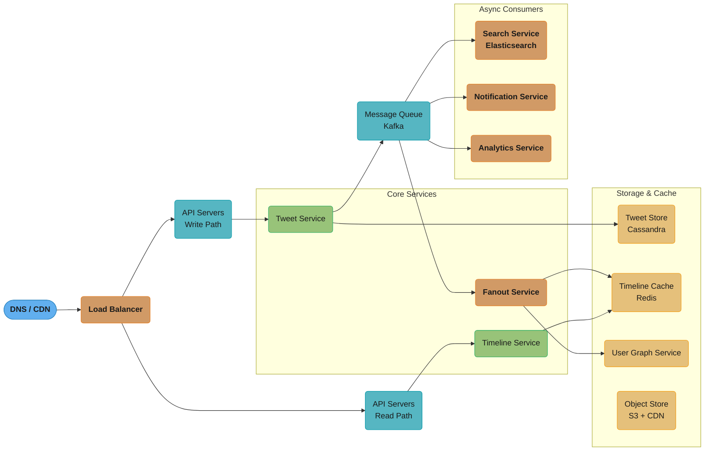
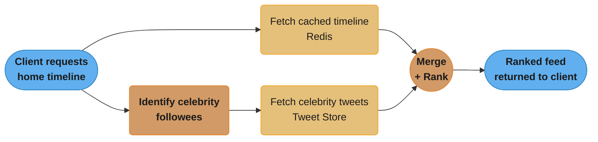
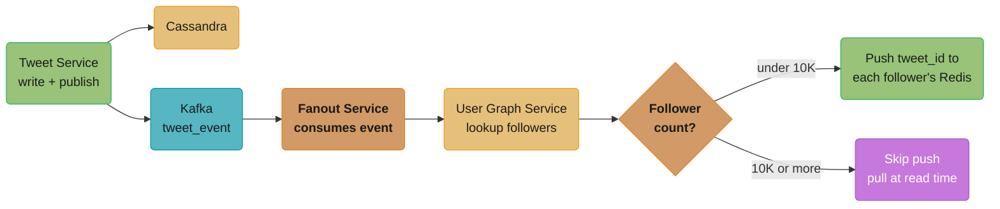
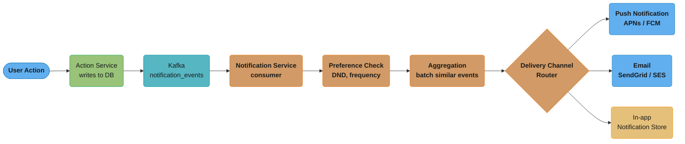
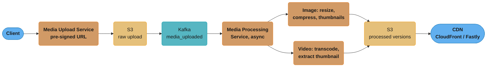

# System Design: Twitter/X

## Intuition

> **Design intuition**: Twitter's core challenge is the "fan-out problem" — when a celebrity with 10M followers tweets, you can't query all their followers' feeds on read (too slow). You must precompute (fan-out on write) or find a hybrid. The feed generation architecture is the heart of Twitter's system design.

**Key insight**: The split between fan-out-on-write (precompute timelines for each follower) and fan-out-on-read (merge feeds at query time) isn't binary — Twitter uses both. Regular users: fan-out-on-write (fast read). Celebrities with millions of followers: fan-out-on-read (writing to 10M feeds per tweet is too expensive). The hybrid approach handles the full range.

---

## 1. Requirements Clarification

### Functional Requirements
- **Tweet**: Users can post tweets (text up to 280 chars, images, videos, links)
- **Follow**: Users can follow/unfollow other users
- **Home Timeline**: Users see a feed of tweets from people they follow, in reverse-chronological or ranked order
- **User Timeline**: View all tweets by a specific user
- **Like / Retweet / Reply**: Engagement actions on tweets
- **Trending Topics**: Display top trending hashtags and keywords globally or by region
- **Notifications**: Notify users of likes, retweets, mentions, new followers
- **Search**: Full-text search over tweets, users, hashtags

### Non-Functional Requirements
- High availability (99.99% uptime — users expect the feed to always load)
- Low read latency (home timeline < 200ms p99)
- Eventual consistency is acceptable (a tweet may take a few seconds to appear in all followers' feeds)
- Durable tweet storage (tweets must not be lost once posted)
- Horizontally scalable (must handle global traffic spikes)

### Out of Scope
- Direct messages (separate system)
- Ads serving
- Content moderation pipeline

---

## 2. Scale Estimation

### Users and Traffic
- 300M Daily Active Users (DAU)
- Average user follows 200 people, has 200 followers
- 100M tweets posted per day
  - 100M / 86,400 sec ~ **1,200 writes/sec** (peak ~3x = 3,600/sec)
- Read-to-write ratio: **1000:1** (Twitter is extremely read-heavy)
  - Read QPS: 1,200 * 1,000 = **1.2M reads/sec** at steady state
  - Peak reads: ~3-5M reads/sec

### Storage
- Tweet text: 280 chars ~ 300 bytes
- Tweet metadata (user_id, timestamps, counters): ~200 bytes
- Total per tweet: ~500 bytes
- 100M tweets/day * 500 bytes = **50 GB/day** of tweet data
- 5-year tweet storage: 50 GB * 365 * 5 ~ **90 TB**

### Media Storage
- ~10% of tweets include an image (~1 MB avg), ~2% include video (~5 MB avg)
- Image: 10M * 1 MB = 10 TB/day
- Video: 2M * 5 MB = 10 TB/day
- Total media: ~20 TB/day
- 5-year media: **36 PB** (requires CDN and tiered storage)

### Timeline Fanout
- Average user has 200 followers
- 1,200 writes/sec * 200 followers = **240,000 timeline insertions/sec**
- Celebrity with 10M followers: 1 tweet = 10M insertions (fanout problem)

---

## 3. High-Level Architecture


*Write path (blue-to-teal) lands tweets in Cassandra and hands off to the Fanout Service via Kafka; read path resolves through the Timeline Service straight to the Redis cache. Search/Notification/Analytics are all async Kafka consumers off the same event stream — none sit in the request-response critical path.*

---

## 4. Component Deep Dives

### Feed Generation (The Core Problem)

This is the most important design decision for Twitter. The challenge: when a user opens their home timeline, how do we assemble the feed of tweets from all people they follow?

### Option A: Pull Model (Fanout on Read)
- When user requests their timeline, query tweets from all followees in real time
- Merge and sort results

**Pros:**
- No wasted computation for inactive users
- Perfect for celebrities (no massive fanout)

**Cons:**
- High read latency (must query N followees and merge)
- Expensive at scale (300M users * 200 follows = massive fan-in)
- Not suitable for real-time feel

### Option B: Push Model (Fanout on Write)
- When a user tweets, immediately push the tweet_id into each follower's timeline cache
- Timeline read = single cache lookup

**Pros:**
- Extremely fast reads (O(1) cache hit)
- Simple read path

**Cons:**
- Celebrity problem: 1 tweet from a user with 10M followers = 10M cache writes
- Wasted writes for inactive users
- Increased write latency for popular users

### Option C: Hybrid Model (Twitter's Actual Approach)
- **Normal users (< 10K followers)**: Use push model — fanout on write
- **Celebrities (>= 10K followers)**: Use pull model — excluded from push fanout

**At Read Time (Hybrid merge):**
1. Fetch pre-computed timeline from Redis (contains tweets from non-celebrity followees)
2. Identify which followees are celebrities
3. Fetch recent tweets from each celebrity directly from tweet store
4. Merge and rank all results
5. Return to client

**Why this works:**
- A user follows ~5 celebrities on average — only 5 extra fetches at read time
- 99% of accounts are non-celebrity, so fanout is bounded
- Celebrities' tweets are cached individually (hot data anyway)


*This is the read-time half of the hybrid model: the precomputed Redis timeline and a handful of live celebrity fetches (~5 per user, per "Why this works" above) run in parallel and converge at a single merge-and-rank step before the response goes back to the client.*

### Fanout Service Implementation

*The fan-out worker runs asynchronously off Kafka: it writes the tweet durably, then branches on follower count — the green push path for normal accounts, the purple skip-and-pull-later path for celebrities (the same threshold discussed in Option C above).*

---

### Timeline Storage

### Redis Sorted Set (Hot Timelines)
- Key: `timeline:{user_id}`
- Value: tweet_id (as member)
- Score: tweet timestamp (Unix epoch in milliseconds)
- **Why sorted set**: efficient range queries, automatic ordering, O(log N) insert

```
ZADD timeline:user123 1700000001000 tweet_abc
ZADD timeline:user123 1700000002000 tweet_def
ZREVRANGE timeline:user123 0 19  -- get latest 20 tweets
```

- Store only last **800 tweet_ids** per user in Redis (trim with ZREMRANGEBYRANK)
- Memory: 800 tweet_ids * 8 bytes * 300M users = **1.92 TB RAM** (use Redis Cluster)
- Only maintain timelines for users active in last 7 days (lazy eviction)

### Cassandra (Persistent Timeline Storage)
- For users whose Redis cache has expired or for historical scrolling
- Partition key: user_id
- Clustering key: tweet_id (descending)
- Allows efficient range scans per user

```sql
CREATE TABLE user_timeline (
    user_id     UUID,
    tweet_id    BIGINT,    -- Snowflake ID (time-ordered)
    created_at  TIMESTAMP,
    PRIMARY KEY (user_id, tweet_id)
) WITH CLUSTERING ORDER BY (tweet_id DESC);
```

---

### Tweet Storage

### Schema (Cassandra)
```sql
CREATE TABLE tweets (
    tweet_id    BIGINT PRIMARY KEY,   -- Snowflake ID
    user_id     UUID,
    content     TEXT,
    media_url   TEXT,
    reply_to    BIGINT,               -- null if original tweet
    retweet_of  BIGINT,               -- null if original tweet
    like_count  COUNTER,
    retweet_count COUNTER,
    created_at  TIMESTAMP
);
```

### Why Cassandra for Tweets?
- Write-heavy workload fits Cassandra's LSM-tree storage
- Horizontal scalability across multiple data centers
- Tunable consistency (write with QUORUM, read with ONE for speed)
- No complex joins needed for tweet lookup
- Built-in TTL support for ephemeral data

### Tweet ID: Snowflake
Twitter's Snowflake generates 64-bit unique IDs:
```
[41 bits: timestamp ms] [10 bits: machine id] [12 bits: sequence]
```
- Time-sortable without additional index
- Distributed generation without coordination
- 41 bits of timestamp = 69 years of IDs

---

### User Graph

### Data Model
- Need to answer: "Who does user X follow?" and "Who follows user X?"
- Both queries needed for timeline fanout and follower notifications

### Storage Options

**Option A: RDBMS (follows table)**
```sql
CREATE TABLE follows (
    follower_id UUID,
    followee_id UUID,
    created_at  TIMESTAMP,
    PRIMARY KEY (follower_id, followee_id)
);
```
- Works at small scale, poor at 300M+ relationship queries

**Option B: Redis Set**
```
following:{user_id}  -> SET of user_ids this user follows
followers:{user_id}  -> SET of user_ids following this user
```
- O(1) membership check (SISMEMBER)
- O(N) full list retrieval for fanout
- Memory-intensive but fast

**Option C: Graph Database (Neo4j)**
- Natural fit for social graph traversal
- Useful for "People You May Know" feature
- Higher operational complexity

**Recommendation**: Redis for hot graph data (fast fanout), backed by Cassandra/MySQL for persistence. For advanced social features (mutual friends, recommendations), use a graph DB or dedicated graph processing (Apache Giraph).

---

### Trending Topics

### Requirements
- Top-K trending hashtags/topics in the last 1 hour, per region
- Update frequency: every 5 minutes is acceptable

### Approach: Sliding Window Counter + Top-K

**Step 1: Count hashtag occurrences**
- Each tweet is published to Kafka
- Stream processing (Apache Flink or Kafka Streams) counts hashtag occurrences
- Use a **sliding window** of 1 hour with 5-minute buckets (12 buckets)

**Step 2: Distributed counting**
- Partition Kafka by hashtag for parallelism
- Each partition processor maintains a count map
- Periodically flush counts to a central aggregator

**Step 3: Top-K Selection**
- Use a **min-heap of size K** to maintain top-K items efficiently
- Or use Count-Min Sketch for approximate counting with low memory

```
Count-Min Sketch:
- Probabilistic data structure for frequency estimation
- Uses d hash functions, w-wide array
- Overestimates but never underestimates
- Space: O(d * w), much smaller than exact counting
```

**Step 4: Storage and Serving**
- Store trending results in Redis with TTL
- `trending:{region}` -> sorted set of (hashtag, score)
- Refresh every 5 minutes via a cron job or stream processor output

```mermaid
flowchart LR
    classDef io      fill:#61afef,stroke:#2e86c1,color:#1a1a1a,font-weight:bold
    classDef frozen  fill:#c678dd,stroke:#9b59b6,color:#fff
    classDef train   fill:#98c379,stroke:#27ae60,color:#1a1a1a
    classDef mathOp  fill:#d19a66,stroke:#e67e22,color:#1a1a1a,font-weight:bold
    classDef lossN   fill:#e06c75,stroke:#c0392b,color:#fff,font-weight:bold
    classDef req     fill:#56b6c2,stroke:#0097a7,color:#1a1a1a
    classDef base    fill:#e5c07b,stroke:#f39c12,color:#1a1a1a

    firehose(["Tweet Firehose"]) --> kafkaPart(Kafka<br/>partitioned by hashtag)
    kafkaPart --> streamCount(Stream Processing<br/>sliding window count)
    streamCount --> aggregator(Central Aggregator<br/>flush counts)
    aggregator --> topK(Top-K Selection<br/>heap / Count-Min Sketch)
    topK --> redisTrending(Redis<br/>trending:region, TTL)
    redisTrending --> api(["Trending API<br/>per region"])

    class firehose,api io
    class kafkaPart req
    class streamCount,aggregator,topK mathOp
    class redisTrending base
```


*The four steps above form one pipeline: hashtag partitioning gives counting parallelism, the sliding window bounds memory to 12 buckets, and only the winning top-K survive into the Redis-served, per-region result set.*

---

### Search

### Requirements
- Full-text search over tweets
- Search by user, hashtag, keyword
- Results should be near real-time (new tweets indexed within seconds)

### Architecture
- **Elasticsearch** cluster for tweet indexing
- Kafka consumer indexes new tweets into Elasticsearch asynchronously
- Each tweet document:
```json
{
  "tweet_id": "123456",
  "user_id": "user_abc",
  "content": "Hello world #tech",
  "hashtags": ["tech"],
  "created_at": "2024-01-01T00:00:00Z",
  "like_count": 10
}
```

### Sharding in Elasticsearch
- Shard by time (monthly indices) for efficient time-range queries
- Alias `tweets_current` points to current month's index
- Older indices are tiered to warm/cold nodes

### Ranking
- Default: recency + engagement score
- Personalized: boost tweets from accounts user interacts with
- Trending: boost tweets with rapidly growing engagement

---

### Notifications

### Types
- Like, Retweet, Reply, Mention, New Follower, Direct Message

### Pipeline

*Every like/retweet/reply/mention/follow event flows through the same Kafka topic; the router fans out to whichever channels the user's preferences allow, batching similar events ("X and 5 others liked your tweet") before delivery.*

### Notification Store
```sql
CREATE TABLE notifications (
    user_id     UUID,
    notif_id    BIGINT,     -- Snowflake
    type        TEXT,
    actor_id    UUID,
    target_id   BIGINT,     -- tweet_id or user_id
    read        BOOLEAN,
    created_at  TIMESTAMP,
    PRIMARY KEY (user_id, notif_id)
) WITH CLUSTERING ORDER BY (notif_id DESC);
```

---

### Media Upload

### Upload Flow

*The client uploads directly to S3 via a pre-signed URL (bypassing the app servers for the heavy bytes); processing is fully async off a Kafka event, and the CDN is the only thing that ever talks to end users for media reads.*

### CDN Strategy
- Cache media at edge nodes close to users
- Immutable content (once uploaded, media never changes) — set long TTL (1 year)
- Use content-addressed URLs (hash of content = URL) to prevent cache poisoning

---

### Sharding Strategy

### Tweet Table Sharding
- **Shard key: tweet_id (Snowflake)**
- Since Snowflake IDs are time-ordered, naive range sharding creates hot spots (all new tweets go to same shard)
- Solution: use **consistent hashing** on tweet_id to distribute evenly

### User Table Sharding
- **Shard key: user_id (UUID)**
- UUID is already random — consistent hashing distributes evenly

### Timeline Cache Sharding (Redis Cluster)
- Redis Cluster handles sharding automatically using hash slots
- `timeline:{user_id}` key hashes to one of 16,384 slots
- Each Redis node owns a range of slots

### Avoiding Cross-Shard Queries
- Never query "tweets by user across all shards" — use a secondary index (user_id → [tweet_ids]) stored in a separate lookup table
- All tweet lookups by tweet_id are single-shard (shard is determined by tweet_id)

---

## 5. Design Decisions & Tradeoffs

### Consistency vs. Availability
- **Choice**: Eventual consistency for timelines
- **Reason**: A tweet appearing 1-2 seconds late in a follower's feed is acceptable; downtime is not
- **Implementation**: Cassandra with QUORUM writes, ONE reads

### Push vs. Pull for Timeline
- **Choice**: Hybrid (push for normal users, pull for celebrities)
- **Reason**: Pure push fails for celebrities (10M writes); pure pull is too slow for reads
- **Trade-off**: Read path complexity increases (must identify celebrities and merge)

### Redis Timeline Cache Size (800 tweets)
- **Choice**: Cap at 800 tweet_ids per user
- **Reason**: Users rarely scroll back more than 800 tweets; beyond that, serve from Cassandra
- **Trade-off**: Cold reads for deep scroll (rare but slower)

### Elasticsearch for Search (vs. Solr or custom)
- **Choice**: Elasticsearch
- **Reason**: Managed, scalable, real-time indexing, rich query DSL
- **Trade-off**: Operationally complex, eventual consistency with main tweet store

---

## 6. Real-World Implementations

Twitter/X's actual production stack (from public engineering blog posts and conference talks) validates the architectural choices above:

- **Manhattan** — Twitter's in-house distributed key-value store (Dynamo-style, tunable consistency) stores tweets, timelines, and the social graph. It replaced a sharded MySQL fleet around 2014 specifically to absorb fan-out write volume that MySQL couldn't shard cleanly.
- **Redis Cluster** — Precomputed home timelines (the "fan-out on write" result) live in Redis as sorted sets keyed by `user_id`, scored by `tweet_id` (itself time-sortable via Snowflake), capped at 800 entries per user.
- **Snowflake** — Twitter's open-sourced 64-bit ID generator (41-bit timestamp + 10-bit machine ID + 12-bit sequence) gives every tweet a globally unique, roughly time-sortable ID — eliminating a centralized auto-increment counter at 100K+ writes/sec.
- **Earlybird** — A custom Lucene-based real-time search index that ingests the full tweet firehose and serves search with seconds-level freshness — built because off-the-shelf search engines of that era couldn't meet the real-time indexing SLA. Smaller systems with the same requirement today usually reach for Elasticsearch/OpenSearch directly (as recommended in §5).
- **Kafka / EventBus** — Powers the fan-out pipeline (tweet created -> fan-out workers -> per-follower timeline writes) and cross-datacenter replication via MirrorMaker.
- **Finagle** — Twitter's open-sourced RPC framework (Scala, built on Netty) handles inter-service communication across the hundreds of microservices in the fan-out and timeline-read paths.

**Comparable systems for cross-reference:**
- **Instagram** faces the same celebrity fan-out problem at similar scale and uses a comparable hybrid push/pull model with Cassandra for the social graph.
- **LinkedIn's** feed (built on the open-sourced Venice + Voldemort key-value stores) precomputes feeds with a pull fallback for high-follower accounts — the same hybrid idea under a different name.
- **Facebook's** News Feed moved *away* from pure fan-out-on-write toward a primarily pull/rank-at-read-time model (TAO + aggregator services) as the graph grew — the opposite tradeoff from Twitter's hybrid. "It depends on your read/write ratio and follower-count distribution" is a legitimate, defensible interview answer.

---

## 7. Technologies & Tools

| Component | Technology | Why |
|---|---|---|
| Tweet & timeline storage | Manhattan (Dynamo-style KV store) | Tunable consistency, horizontal scale to ~1.16M fan-out writes/sec |
| Precomputed home timelines | Redis Cluster (sorted sets) | Sub-millisecond reads of the last 800 tweet_ids per user |
| Unique ID generation | Snowflake (64-bit, time-sortable) | Decentralized ID generation at 100K+ IDs/sec without coordination |
| Search indexing | Earlybird (Lucene) / Elasticsearch | Near-real-time full-text search over the tweet firehose |
| Fan-out pipeline | Kafka + custom fan-out workers | Durable, replayable queue between "tweet created" and "timeline updated" |
| Inter-service RPC | Finagle (Scala/Netty) | High-throughput async RPC across hundreds of microservices |
| Media storage | S3-compatible blob store + CDN | PB-scale image/video storage with edge caching |
| Cross-region replication | Kafka MirrorMaker | Async tweet replication between us-east-1 and eu-west |
| Trending computation | Count-Min Sketch + Kafka Streams | Approximate frequency counting at firehose volume without per-term counters |

---

## 8. Operational Playbook

### Multi-Region and Global Deployment

**Active-Active Architecture**
- Twitter operates primarily from **us-east-1** and **eu-west** (Dublin), with smaller PoPs in APAC.
- Both regions serve reads and writes; tweets replicate asynchronously.

**GDPR Data Residency**
- EU users' PII (email, phone, IP logs) stored in EU DCs only.
- Tweets themselves are public content — replicated globally for low-latency reads.
- DMs are stored in the originating user's home region; cross-region DM has slightly higher latency (~50ms vs. <10ms).

**Replication Lag**
- Tweet write -> global visibility: **2-5 seconds typical**, 10s p99.
- Acceptable because Twitter UX doesn't promise read-your-writes globally (it does promise it within the user's home region via stickiness).

**Conflict Resolution**
- Tweet content is immutable (no edits historically; edit feature added in 2022 with version vectors).
- Retweet/like counters: eventually consistent via CRDT counter (G-counter).
- Username availability: globally coordinated via consensus (etcd/ZooKeeper).

**Cross-Region Failover**
- Route 53 health checks every 10s; failover DNS TTL of 60s.
- Full us-east-1 loss: traffic shifts to us-west and EU within 2-5 minutes.
- Recent unreplicated tweets (~5 sec window) may be temporarily invisible until restored from snapshot.

### Deployment and Alerting

**Critical Alerts**

| Metric | Threshold | Response |
|---|---|---|
| Tweet write p99 latency | > 500ms | Page on-call; check Manhattan + Snowflake |
| Fan-out lag (write -> visible in followers' timelines) | > 30s | Check Kafka backlog, scale workers |
| Home timeline read p99 | > 200ms | Redis health + Manhattan hydration latency |
| Earlybird indexing lag | > 60s | Search shows stale results; scale indexers |
| Fan-out service error rate | > 0.1% | Often signals celebrity-tweet thundering herd |
| CDN cache hit rate (images) | < 90% | Check origin egress; possible cache pollution attack |

**Deployment Strategy**
- **Canary**: 0.1% of traffic for 1 hour -> 1% for 2 hours -> 10% for 4 hours -> 100%.
- **Auto-rollback** triggers: error rate >0.5% above baseline, latency p99 >20% above baseline.
- **Feature flags** via internal "Decider" service: enable per-country, per-user-bucket, gradually ramp.
- Deployments are continuous: ~50 deploys/day across the microservice fleet at peak.

**On-Call Runbook: Fan-Out Service Backlog**
1. Check Kafka consumer lag: `kafka-consumer-groups --describe --group fanout-workers`.
2. If lag > 5 min and growing: a celebrity tweet may be amplifying. Look at recent high-follower tweets.
3. Mitigation: temporarily lower the fan-out cap (e.g., from 100K to 10K) to shed load.
4. Scale workers: HPA based on Kafka lag metric typically auto-scales, but a manual bump may be needed.
5. Verify Manhattan write latency isn't the actual bottleneck.

**On-Call Runbook: Timeline Reads Returning Empty**
1. Reproduce with a known test account.
2. Check Redis cluster: `INFO replication` — is the user's shard healthy?
3. If shard is down: failover to replica (usually automatic via Sentinel).
4. If shard is empty (cache lost): trigger rebuild from Manhattan; user sees fallback timeline.
5. Long-term: enable Redis AOF persistence to avoid full rebuilds.

### Evolution and Future Improvements

**At 10x Scale (3B MAU, 5B tweets/day)**
- Manhattan would need re-sharding to 10K+ nodes; gossip overhead becomes prohibitive. Migration to a hierarchical sharding scheme (region -> shard -> micro-shard).
- Fan-out economics break down further: a pure pull-model timeline (Facebook News Feed style) with aggressive caching would replace push-based fan-out for all users, not just celebrities.
- Earlybird search would migrate to a distributed inverted-index store like Apache Pinot or ClickHouse for sub-second analytical queries.

**Technical Debt**
- **Legacy Rails monolith remnants**: some admin tooling and internal dashboards still hit a Rails app from 2010. Slow migration to Scala/JVM.
- **Manhattan's lack of secondary indexes**: forces denormalization everywhere; modern alternative would be FoundationDB or TiKV.
- **Fan-out heuristic constants** (10K-follower threshold) are hand-tuned; an ML-based dynamic threshold per user behavior would improve efficiency.

**Future Capabilities**
- **Edit window beyond 30 min**: requires versioned tweet storage and view-time resolution; trade-off with retweet semantics (does a retweet show v1 or v2?).
- **Long-form posts (Notes, 4000+ chars)**: requires different ranking signals because dwell-time is the engagement metric vs. instant scroll.
- **End-to-end encrypted DMs**: full rollout requires key management infrastructure similar to WhatsApp's.
- **AI-generated timeline ranking**: move from heuristic + simple ML to LLM-based "explainable" ranking ("why am I seeing this tweet?").

---

## 9. Common Pitfalls & War Stories

### Pitfall Summary

| Pitfall | Impact | Fix |
|---|---|---|
| Fan-out on write for everyone | 1 celebrity tweet -> 10M+ Redis writes, fan-out backlog | Hybrid model: pull celebrities (>10K followers) at read time |
| Unbounded timeline cache | Slow cache misses, memory pressure | Cap at 800 tweet_ids/user; pre-warm Redis on login |
| Sharding tweets by `user_id` | Write hotspot on a single shard for active users | Shard by Snowflake `tweet_id` (encodes time + machine), not `user_id` |
| Naive trending counters | High CPU, lock contention at firehose volume | Count-Min Sketch + Kafka Streams approximate counting |
| Synchronous search indexing | New tweets not searchable for minutes | Async Kafka consumer feeding Earlybird/Elasticsearch |
| All media on hot storage | PB-scale storage cost runaway | Tiered S3 (hot/warm/cold) + CDN edge caching |
| One socket per user, no multiplexing | Millions of idle connections exhaust file descriptors | Connection multiplexing + horizontal scaling of the WebSocket gateway tier |

### War Story 1: Timeline Redis Cluster Master Loss
**Scenario**: A Redis master holding ~5% of users' precomputed home timelines crashes (process kill, hardware failure, OOM from a hot key).

**Behavior**:
- Sentinel detects master failure in 10–15 seconds (configurable failover-timeout).
- A replica is promoted; client libraries (Jedis/Lettuce with Sentinel support) re-resolve the master endpoint.
- Writes that hit the failed master in the gap window are buffered in the fan-out service's local in-memory queue with retry.
- Stale reads possible during the 30s window: a user might miss a tweet posted right before failover.

**TTR**: 30–45 seconds for full read/write recovery. Tweet itself is never lost (durable in Manhattan/MySQL); only the precomputed timeline index needs rebuild.

**Mitigation at scale**: Sharded Redis with replication factor 2 (1 master + 2 replicas per shard); failover impacts only ~0.5% of users at any moment.

### War Story 2: Timeline Cache Cold Start (Thundering Herd)
**Scenario**: Entire Redis tier restarted after a config change or OS patch. All ~300M home timeline caches are empty. Each user login triggers a full fan-out reconstruction.

**Cost of rebuild per user**: Fetch latest 800 tweets from followees (avg 200 followees × 4 recent tweets each via Manhattan) → ~10ms per user.

**Behavior without mitigation**:
- 1M users/sec attempt to load home timelines.
- Each triggers a Manhattan read storm: 1M × 200 = 200M reads/sec → 6× normal load → Manhattan latency explodes → cascading failure.

**Mitigation**:
- **Warm-up procedure**: Pre-rebuild timelines for top 10% most-active users *before* restoring traffic (1 hour batch job using Hadoop/Spark).
- **Request coalescing**: If 1000 requests for the same user's timeline arrive within a 100ms window, only one rebuild executes; others wait on the resulting promise.
- **Graceful degradation**: Serve "last known good" timeline from a backup Cassandra cache (1-hour stale), then async-refresh.

**TTR**: 30–60 minutes to fully warm cache for active users; passive users warm on first login.

### War Story 3: Manhattan KV Store Hot Partition (Celebrity Tweet)
**Scenario**: An A-list celebrity (100M followers) tweets. The fan-out service writes the tweet ID to 100M home timeline indexes. The Manhattan shards holding those indexes get hammered.

**Behavior**:
- Manhattan shards holding the celebrity's followers see a 100× write spike.
- p99 latency on those shards jumps from 5ms to 200ms.
- Fan-out backlog grows; lag visible in "tweet appears in followers' timelines" metric.

**Mitigation**:
- **Hybrid timeline**: For users with >10K followers, *don't* push on write. Pull on read instead.
- For users in the 1K–10K range: fan-out with rate limiting (max 50K writes/sec per tweet).
- For sub-1K users: immediate fan-out.

**TTR**: Tweets from celebrities are visible to followers within 5–30 seconds (vs. <1s for normal users). Acceptable tradeoff.

### War Story 4: Cross-DC Network Partition
**Scenario**: WAN link between US-East and EU-West fails. Twitter serves traffic from both DCs with cross-region replication.

**Behavior**:
- EU users continue to read tweets; new tweets posted in EU replicate locally but not to US.
- US users miss EU-originated tweets until partition heals (asymmetric visibility).
- Fan-out service queues cross-DC fan-outs in Kafka MirrorMaker; drained on recovery.

**TTR**: User-visible eventual consistency: typically 1–5 minutes after partition heal for full convergence.

### War Story 5: Snowflake ID Generator Clock Skew
**Scenario**: NTP failure causes one Snowflake node's clock to drift backwards by 100ms.

**Behavior**:
- Snowflake refuses to generate IDs while the clock is behind its last-generated timestamp (prevents duplicate IDs).
- That node returns errors for the drift duration (100ms).
- Clients retry against a different Snowflake instance.

**TTR**: < 1 second user-visible; node self-heals when clock catches up.

---

## 10. Capacity Planning

### Tweet Storage
- **500M tweets/day** × 280 chars (~ 1KB after metadata: user_id, timestamp, mentions, hashtags, media refs) = **500 GB/day** raw.
- With RF=3 replication: **1.5 TB/day**.
- Annual: 500 GB × 365 = **~180 TB/year** raw, **~540 TB/year** replicated.
- 10-year retention: **~5.4 PB**.
- Manhattan compression (LZ4 ~2×): **~2.7 PB** physical.

### Read Throughput
- **300K reads/sec** average; 1M reads/sec peak.
- Each timeline read = 1 Redis GET (3 ms p99) + 20 Manhattan reads for tweet content (hydration).
- Redis fleet: 300K req/sec / 100K req/sec/node = **3 Redis nodes** for timeline indices, plus replicas → ~20 nodes for HA.
- Manhattan fleet: 300K × 20 = **6M reads/sec** hydration → ~200 Manhattan nodes.

### Fan-Out Cost
- 500M tweets/day, avg 200 followers/tweet (long tail dominated by small accounts).
- **Total fan-out writes/day**: 500M × 200 = **100B writes/day** = ~1.16M writes/sec average.
- Without celebrity pull-model: would be ~10× more (top accounts have 100M+ followers).
- Fan-out service: 1.16M/sec ÷ 10K writes/sec/worker = **~120 fan-out workers** + 50% headroom.

### Search Indexing (Earlybird)
- All 500M tweets/day indexed in real-time into Lucene-based Earlybird shards.
- Each tweet generates ~50 index terms (tokens + hashtags + entities).
- **Index writes/day**: 500M × 50 = 25B postings/day = 290K postings/sec.
- Earlybird hot tier holds 7 days of tweets in memory: 7 × 500GB = **3.5 TB RAM** spread across shards.

### Media Storage
- 25% of tweets have media: 125M media uploads/day.
- Avg size 500KB (mostly images, some video) = **62.5 TB/day** ingest.
- Annual: ~23 PB; long-term archived to cold storage at ~$0.005/GB-month.

### Cost Envelope
- Manhattan (~200 nodes), Redis (~20), Earlybird (~50), fan-out workers (~120), GQL/REST API tier (~500), edge cache (~100) ≈ **~1000 nodes** at $25K/year fully loaded = **$25M/year compute**.
- Bandwidth egress: ~3 PB/day client traffic at $0.01/GB blended (heavy CDN offload) = **~$110M/year**.
- Media storage (hot + cold): ~$15M/year.

---

## 11. Interview Discussion Points

### How to Structure a 45-Minute Answer
1. **Clarify requirements** (5 min) — confirm scale, in-scope features (post, follow, timeline, search, notifications), and consistency expectations.
2. **Estimate scale** (5 min) — DAU, tweets/day, read:write ratio, storage growth.
3. **Draw the high-level architecture** (5 min) — services, datastores, queues, CDN.
4. **Deep-dive the fan-out problem** (15 min) — this is THE Twitter problem; spend most of your time here.
5. **Database and sharding** (5 min) — schema, KV vs. relational, shard key choice.
6. **Bottlenecks and mitigations** (5 min) — celebrity problem, cache strategy, hot shards.
7. **Trade-offs** (5 min) — be explicit about what you chose and why, not just what's possible.

**Q: What's the single hardest problem in this design, and why does almost every architectural decision trace back to it?**
A: It's the fan-out problem — delivering one tweet to up to 100M followers' home timelines without either a write storm (fan-out-on-write for celebrities) or a too-slow read-time merge (fan-out-on-read for everyone). Every major decision in this design — the hybrid push/pull model, Snowflake IDs, Redis as a precomputed index, the celebrity threshold — exists to manage this one trade-off. If asked "what would you change at 10x scale," the answer almost always traces back to how this threshold and the underlying fan-out mechanism would need to adapt.

**Q: Why hybrid push/pull instead of pure fan-out-on-write or pure fan-out-on-read?**
A: Pure push fails for celebrities — a single tweet from a 100M-follower account would trigger 100M Redis writes, overwhelming the fan-out pipeline (see War Story 3 in §9). Pure pull fails for normal users — every timeline read would require fetching and merging tweets from ~200 followees in real time, too slow for a 200ms p99 SLA. The hybrid model pushes for accounts under ~10K followers (the vast majority) and pulls-and-merges at read time for accounts above that threshold. The cost is read-path complexity: the timeline service must identify "celebrity" followees, fetch their recent tweets separately, and merge-sort them into the precomputed feed.

**Q: Why Snowflake IDs instead of a database auto-increment column or a UUID?**
A: A centralized auto-increment counter becomes a single point of contention at 100K+ writes/sec — every insert needs a round trip to whatever service owns the counter. Snowflake generates IDs locally on each node by combining a 41-bit timestamp, a 10-bit machine ID, and a 12-bit per-millisecond sequence, giving globally unique IDs with zero coordination. The bonus property — IDs are roughly time-sortable — means "most recent N tweets" is a range scan on the ID itself, no separate timestamp index needed. A random UUID solves uniqueness but loses sortability, forcing a separate (and expensive) timestamp index.

**Q: Why is tweet and timeline storage a wide-column/KV store (Manhattan/Cassandra) instead of a relational database?**
A: The dominant access pattern is "give me the last N tweet_ids for this user_id" — a single-key range scan, which KV/wide-column stores serve natively without joins. A relational schema would need a `tweets` table joined against a `follows` table for every timeline read, and at 1.16M fan-out writes/sec, foreign-key constraints and transactional guarantees on every insert would collapse the write path. The trade-off is giving up multi-row ACID transactions and ad-hoc joins — acceptable here because timelines tolerate eventual consistency (a tweet appearing 1-2 seconds late is fine) and there's essentially one query shape to optimize for.

**Q: What's the difference between a "home timeline" and a "user timeline," and why does conflating them break the design?**
A: A user's **timeline** is the list of tweets *they posted* — a simple, append-only, single-partition query. Their **home timeline** is the merged feed of tweets from everyone *they follow* — the output of the fan-out process, precomputed and cached in Redis. Conflating the two is a common mistake: if storage is designed assuming "fetch a user's timeline" covers the home feed too, the design has accidentally become a pure pull system and missed the fan-out problem entirely, which is the actual point of this question.

**Q: Why reach for Elasticsearch (or Twitter's own Earlybird) instead of building a custom inverted index for search?**
A: Full-text search with near-real-time indexing, relevance scoring, and a rich query DSL is a solved problem — Elasticsearch/OpenSearch handle tokenization, ranking (BM25), and horizontal sharding out of the box, and integrate with Kafka for the async indexing pipeline this design already needs. Twitter built Earlybird in-house because, at the time, no open-source engine met their real-time indexing SLA at firehose volume — but that was a build-vs-buy call driven by scale most systems never reach. Proposing a custom inverted index *before* justifying why Elasticsearch can't meet the requirement is a red flag for over-engineering.

**Q: A tweet from a 50M-follower account just went viral. Walk through what happens to your system and how you mitigate it.**
A: Without mitigation, the fan-out service would attempt ~50M Redis writes for that single tweet, spiking Manhattan shard latency from 5ms to 200ms+ and backing up the Kafka fan-out queue (War Story 3 in §9). Because the account exceeds the celebrity threshold (>10K followers), the fan-out worker skips the push entirely — followers' timeline services instead pull this tweet at read time and merge it into their precomputed feed. For accounts in the 1K-10K range, fan-out writes are rate-limited (max 50K/sec) rather than an all-or-nothing cutoff, smoothing the spike. The practical effect: celebrity tweets reach followers in 5-30 seconds instead of <1 second — an explicit, documented trade-off rather than a cascading failure.

**Q: How would you shard the social graph (followers/following) at this scale?**
A: Store the graph as an adjacency list — `(user_id, follower_id)` and `(user_id, followee_id)` — sharded by `user_id`, so "who does X follow" and "who follows X" are each single-shard range scans. The asymmetry is the hard part: a normal user has ~200 followees but a celebrity has 100M followers, so "who follows X" for a celebrity can't live on one shard — it needs its own sub-sharding (e.g., bucketed by follower_id range) purely for accounts above the celebrity threshold. Read replicas absorb the read-heavy "who do I follow" queries that drive fan-out and timeline merges.

**Q: How do you guarantee a push notification is delivered exactly once, even if the notification service crashes mid-send?**
A: True exactly-once delivery is impossible across a network boundary, so the design targets *effectively-once*: the notification service consumes from Kafka with at-least-once semantics and generates a deterministic idempotency key (e.g., `hash(tweet_id, recipient_id, notification_type)`) before calling the push provider (APNs/FCM). A dedup table (Redis with a multi-hour TTL) records keys already sent; if the consumer crashes and reprocesses the same Kafka offset, the dedup check short-circuits the duplicate send. Push providers themselves are at-least-once too, so the client app also de-duplicates by notification ID before displaying.

**Q: How would you design retweets without duplicating tweet storage?**
A: A retweet is stored as a new row with its own Snowflake `tweet_id`, but its body is just a reference: `{type: "retweet", original_tweet_id: <id>, retweeted_by: <user_id>}`. The fan-out process treats it like any other tweet — pushed/pulled into followers' timelines — but the timeline-hydration step fetches the *original* tweet's content via `original_tweet_id` and renders it with a "Retweeted by X" wrapper. This keeps tweet content single-sourced (no copy-on-retweet); a viral retweet chain is just N small reference rows, not N copies of the original payload.

**Q: The basic design uses reverse-chronological timelines. How would you evolve toward a ranked ("algorithmic") feed?**
A: Reverse-chronological is just a Redis sorted set scored by `tweet_id` (which is time-sortable) — ranking replaces that score with a relevance score from a model. The change is in the read path: instead of returning the raw sorted-set range, the timeline service sends the candidate tweet_ids (still fetched the same way) to a ranking service that scores them using engagement signals (author affinity, recency, predicted likelihood of like/reply) and re-sorts before returning. Fan-out doesn't change — the design still precomputes *candidates* via the hybrid push/pull model; ranking is a re-sort applied at read time on top of that candidate set, exactly how production feed-ranking systems are layered on top of the same fan-out infrastructure.

**Q: Where does the "10K followers" celebrity threshold come from, and what happens if it's set wrong?**
A: It's an empirically-tuned constant balancing two costs: set it too low, and too many "almost-celebrity" accounts fall into the slower pull path, degrading their followers' timeline latency; set it too high, and a 9,999-follower account going viral still triggers a ~10K-write fan-out storm per tweet. In production this is a hand-tuned heuristic (called out as technical debt in §8) — at 10x scale, the fix is making it dynamic per-account based on observed follower growth rate and tweet frequency, computed by an offline ML job that periodically reclassifies accounts.

### Numbers to Remember
- 300M DAU, 100M tweets/day (500M at the capacity-planning scale used in §10)
- 1,200 writes/sec average, 1.2M reads/sec average (1000:1 read:write ratio)
- Average 200 followees per user
- Celebrity threshold: 10K followers triggers the pull-based path
- Redis home timeline cache: capped at 800 tweet_ids per user
- Snowflake ID: 64 bits = 41-bit timestamp + 10-bit machine ID + 12-bit sequence
- Tweet storage: ~2.7 PB physical after RF=3 replication and compression, at 10-year retention

---

## Cross-References

- **Manhattan / wide-column tweet storage** -> [`../../database/wide_column_databases/`](../../database/wide_column_databases/README.md), [`../../database/key_value_stores/`](../../database/key_value_stores/README.md)
- **Fan-out pipeline on Kafka** -> [`../../backend/kafka_deep_dive/`](../../backend/kafka_deep_dive/README.md)
- **Redis timeline cache + cold-start mitigation** -> [`../../backend/caching_strategies_deep_dive/`](../../backend/caching_strategies_deep_dive/README.md), [`../../database/database_caching_patterns/`](../../database/database_caching_patterns/README.md)
- **Sharding the tweet/social-graph stores** -> [`../../database/sharding_and_partitioning/`](../../database/sharding_and_partitioning/README.md), [`../../hld/consistent_hashing/`](../consistent_hashing/README.md)
- **Snowflake ID generator implementation** -> [`../../java/case_studies/design_snowflake_id_generator_java.md`](../../java/case_studies/design_snowflake_id_generator_java.md)
- **Rate-limiting fan-out writes for near-celebrity accounts** -> [`../rate_limiting/README.md`](../rate_limiting/README.md)

