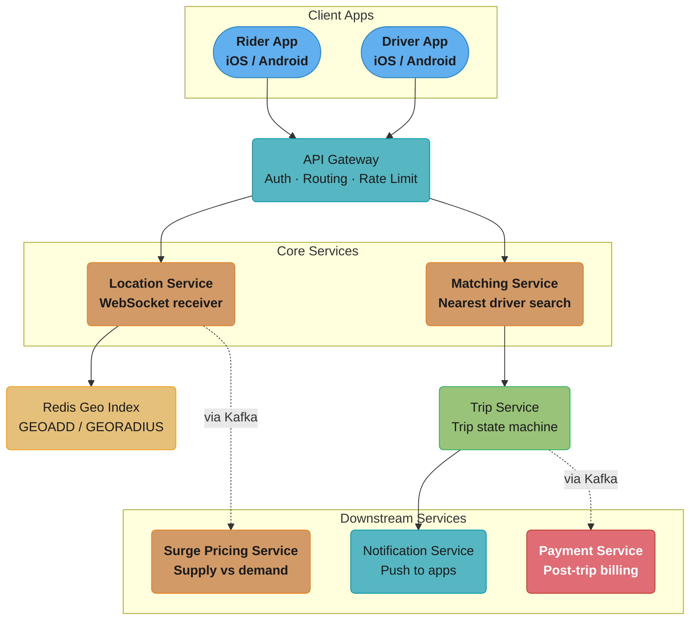
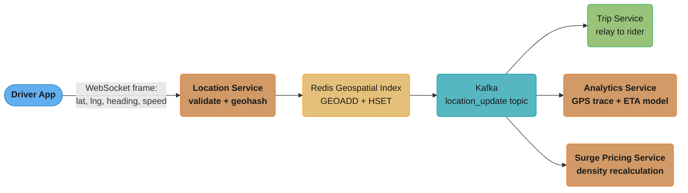
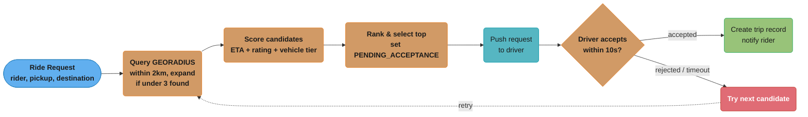
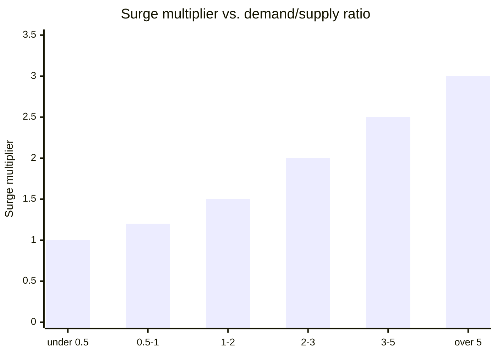
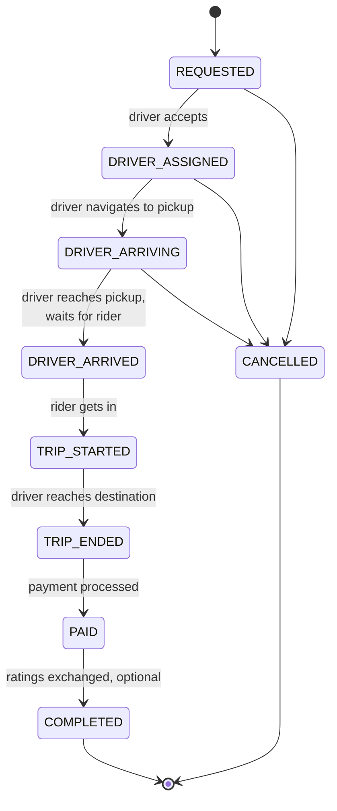
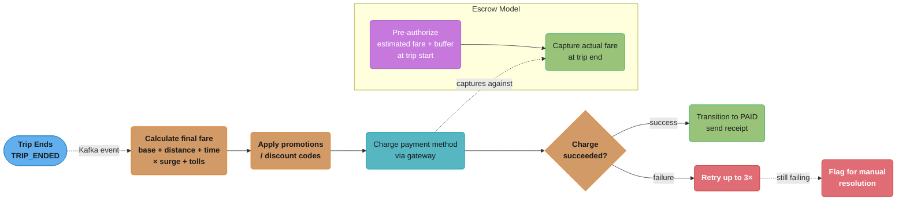
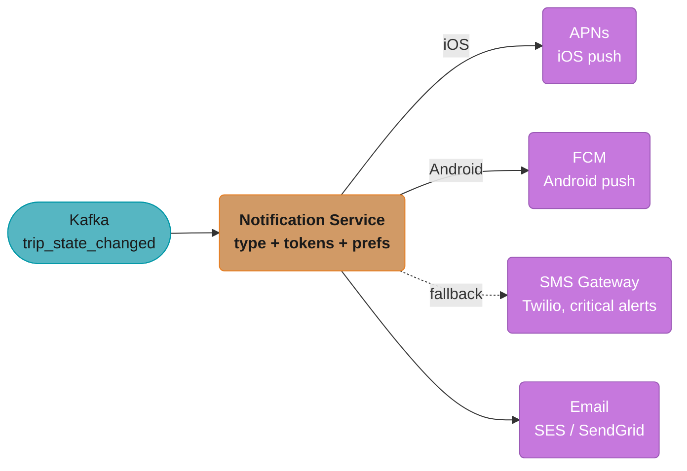
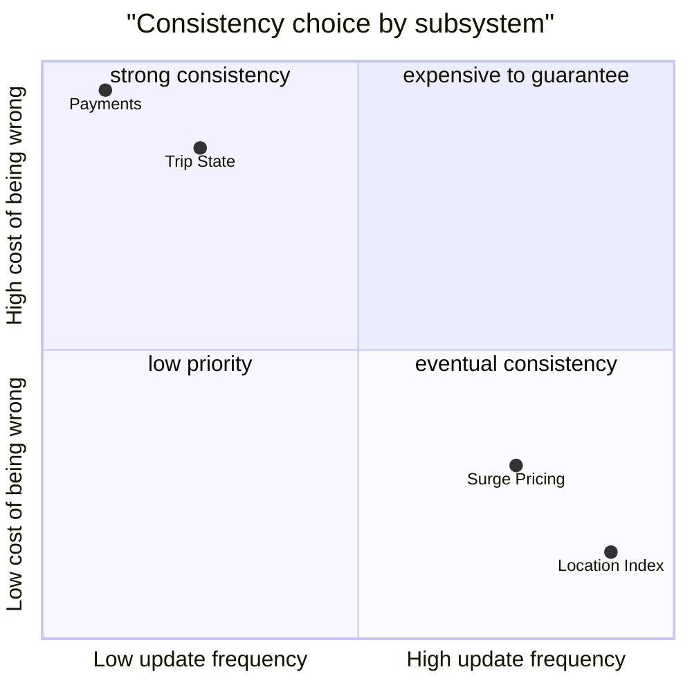

# System Design: Uber

## Intuition

> **Design intuition**: Uber's core challenge is real-time geospatial matching at scale — matching millions of driver locations (updating every 4 seconds) to millions of ride requests, with sub-second response time. The key data structures are geohashing (for proximity queries) and the dispatch algorithm (ETA-based matching).

**Key insight**: The matching problem is fundamentally a nearest-neighbor search in a constantly changing dataset. Geohashing divides the world into hierarchical grid cells — finding nearby drivers means querying the driver's cell + neighboring cells, then ranking by ETA. This makes proximity queries O(1) instead of O(N) where N = total drivers.

---

## 1. Requirements Clarification

### Functional Requirements
- **Request Ride**: Rider opens app, enters destination, sees fare estimate, requests ride
- **Match Driver**: System finds nearest available driver and assigns them to the ride
- **Real-time Tracking**: Both rider and driver can see each other's location on a live map
- **Payment**: Automatic payment at trip end via stored card (cashless in most markets)
- **Rating**: Both rider and driver can rate each other after trip completion
- **Surge Pricing**: Dynamic pricing based on real-time supply/demand in an area
- **Trip History**: Users can view past trips with details and receipts
- **Driver Registration**: Drivers can register, go online/offline, accept/reject rides

### Non-Functional Requirements
- **Low Latency**: Driver match must happen within 5 seconds of request
- **High Availability**: 99.99% uptime — a failed ride request has direct revenue impact
- **Real-time**: Location updates must reflect within 1-2 seconds on both screens
- **Consistency**: Trip state must be consistent (a trip cannot be assigned to two drivers)
- **Durability**: Payment records must be durable and accurate
- **Globally Distributed**: Must work in 70+ countries with local regulations

### Out of Scope
- Uber Eats (food delivery)
- Uber for Business (corporate accounts)
- Driver onboarding and background checks

---

## 2. Scale Estimation

### Users and Traffic
- 25M rides per day globally
- 5M active drivers (some fraction online at any time; assume 1M drivers online at peak)
- 75M monthly active riders
- Peak concurrent active trips: ~500K

### Location Update Load (Most Critical)
- Online drivers send location every **4 seconds**
- 1M online drivers / 4 sec = **250K location writes/sec**
- Riders in active trips also send location: ~500K / 4 sec = ~125K more
- **Total: ~375K location updates/sec** (often cited as ~1.25M in peak scenarios globally including all regions)

### Matching QPS
- 25M rides / 86,400 sec = ~290 ride requests/sec
- Each request triggers a nearby driver search = 290 geospatial queries/sec

### Storage
- Trip record: ~500 bytes
- 25M trips/day * 500 bytes = **12.5 GB/day** of trip data
- GPS trace for a trip (every 4 sec for 20 min avg): 300 points * 16 bytes = 4.8 KB per trip
- 25M * 4.8 KB = **120 GB/day** of GPS trace data
- 5-year storage: ~220 TB for trips + GPS data

---

## 3. High-Level Architecture



Rider and Driver apps enter through the same API Gateway tier, which fans out to the two hot-path services (Location, Matching); Location Service owns the Redis geo index and feeds Surge Pricing asynchronously via Kafka, while Matching Service hands off to Trip Service, which in turn drives Notification and Payment (also async, via Kafka).

---

## 4. Component Deep Dives

### Real-time Location Tracking

### Why WebSocket (Not REST Polling)
- REST polling (driver app calls `/update_location` every 4 sec): works but creates overhead per request (TCP handshake, HTTP headers, auth check)
- **WebSocket**: persistent TCP connection, send data with minimal overhead
- At 1M drivers: 1M open WebSocket connections to Location Service servers
- Each connection server handles ~50K connections → need ~20 connection servers

### Location Update Pipeline


Every location ping lands in Redis first, then fans out from a single Kafka topic to the three independent consumers that each need it for a different reason — relay, analytics, and surge — instead of the driver app writing to each directly.

### Geohash for Spatial Indexing

Geohash encodes a lat/lng coordinate into a short string:
```
Precision 6: ~1.2 km × 0.6 km cell   (good for city-level density)
Precision 7: ~150m × 75m cell         (good for street-level matching)

Example: New York Times Square
  Lat: 40.7580, Lng: -73.9855
  Geohash: dr5ru7
```

How Uber uses geohash for matching:
1. Rider requests ride at lat/lng → convert to geohash (precision 7)
2. Look up available drivers in same geohash cell
3. If fewer than N drivers found, expand to neighboring cells (8 neighbors at same precision)
4. If still not enough, reduce precision by 1 (larger cell) and search again

### Redis Geospatial Commands
```bash
# Driver goes online / updates location
GEOADD drivers_available -73.9855 40.7580 "driver_abc"

# Find drivers within 2km of rider
GEORADIUS drivers_available -73.9850 40.7575 2 km ASC COUNT 10

# Response: [driver_abc (0.3km), driver_xyz (0.8km), driver_def (1.4km)]

# Remove driver when they go offline or get matched
ZREM drivers_available "driver_abc"
```

### Handling 375K Location Updates/Sec
- Partition location updates by geographic region (continent/country) across Redis clusters
- Each Redis instance handles a geographic partition
- Use Redis Cluster for horizontal scaling
- Location data in Redis has TTL (expire driver after 30 sec of no update = went offline)

---

### Driver-Rider Matching

### Matching Algorithm


A rejection or a 10-second timeout doesn't fail the request — it loops back to the ranked candidate list and tries the next driver, so the rider only sees a failure if the whole candidate pool is exhausted.

### Preventing Double-Booking
- Driver status stored in Redis with compare-and-swap (CAS):
```bash
# Atomic: only set to PENDING if currently AVAILABLE
SET driver:abc:status PENDING NX EX 15
# NX = only set if Not eXists (not already set)
# EX 15 = expire in 15 seconds (auto-release if no response)
```
- If two matching requests race to claim the same driver, only one will succeed (Redis is single-threaded for commands)

### Supply-Demand Balancing
- If demand > supply in an area: raise surge multiplier to incentivize more drivers to come online
- If supply > demand: lower surge, potentially prompt idle drivers to move to higher-demand zones
- Matching service factors in supply-demand balance when ranking candidates

---

### Surge Pricing

### Goal
Dynamically adjust prices to balance supply (drivers) and demand (ride requests) in real time.

### Calculation
```
For each geohash cell (precision 6, ~1 km²) every 5 minutes:

  available_drivers = count of AVAILABLE drivers in cell
  pending_requests  = count of unmatched ride requests in last 5 min in cell

  demand_supply_ratio = pending_requests / max(available_drivers, 1)

  surge_multiplier:
    ratio < 0.5  → 1.0x (no surge)
    ratio 0.5-1  → 1.2x
    ratio 1-2    → 1.5x
    ratio 2-3    → 2.0x
    ratio 3-5    → 2.5x
    ratio > 5    → 3.0x (cap at 3x in most markets)
```

The same ratio-to-multiplier mapping, plotted as a step function, makes the flat-then-climbing shape easier to read than the table alone:



The multiplier stays flat at 1.0x while supply keeps pace with demand, then steps up in five increments and hard-caps at 3.0x in most markets — a deliberate ceiling so surge never becomes unbounded during extreme demand spikes.

### Implementation
- Surge Pricing Service subscribes to location updates and ride request events from Kafka
- Maintains a counter per geohash cell in Redis
- Runs a scheduled job every minute to recalculate surge per cell
- Stores current surge: `HSET surge:dr5ru 1.5`
- API Gateway reads surge multiplier before showing fare estimate to rider

### Rider Experience
- Rider sees surge multiplier and must explicitly confirm ("Prices are 2.0x higher than normal. Confirm?")
- This confirmation creates a price lock (guaranteed fare won't increase during trip)

---

### Trip State Machine

### States


### State Transitions (Trip Service)
- Each state transition is an atomic write to the database
- Kafka event emitted on each transition (consumers: notification service, billing service, analytics)
- Invalid transitions are rejected (e.g., cannot go from REQUESTED to TRIP_STARTED directly)

```python
# Trip state transition (pseudocode)
def transition_trip(trip_id, new_state, actor_id):
    trip = db.get_trip(trip_id)
    if not is_valid_transition(trip.state, new_state):
        raise InvalidTransitionError
    trip.state = new_state
    trip.updated_at = now()
    db.save_trip(trip)  # atomic write
    kafka.emit("trip_state_changed", {trip_id, new_state, actor_id})
```

---

### Database Design

### Redis (Hot Data — Active Trips and Driver Locations)
```
driver:{driver_id}         HASH: {lat, lng, heading, status, last_update}
trip:{trip_id}             HASH: {rider_id, driver_id, state, pickup, dest, fare}
drivers_available          Geo sorted set (GEOADD)
surge:{geohash}            STRING: surge multiplier
driver:{driver_id}:status  STRING: AVAILABLE | PENDING | ON_TRIP (with TTL)
```

### Cassandra (Trip History — Write-Heavy, Distributed)
```sql
-- Primary trip records
CREATE TABLE trips (
    trip_id     UUID PRIMARY KEY,
    rider_id    UUID,
    driver_id   UUID,
    status      TEXT,
    pickup_lat  DOUBLE,
    pickup_lng  DOUBLE,
    dest_lat    DOUBLE,
    dest_lng    DOUBLE,
    fare        DECIMAL,
    distance_km DOUBLE,
    duration_sec INT,
    surge       DOUBLE,
    created_at  TIMESTAMP,
    ended_at    TIMESTAMP
);

-- For rider's trip history (lookup by rider)
CREATE TABLE trips_by_rider (
    rider_id    UUID,
    trip_id     UUID,
    created_at  TIMESTAMP,
    fare        DECIMAL,
    PRIMARY KEY (rider_id, created_at, trip_id)
) WITH CLUSTERING ORDER BY (created_at DESC);

-- For driver's trip history (lookup by driver)
CREATE TABLE trips_by_driver (
    driver_id   UUID,
    trip_id     UUID,
    created_at  TIMESTAMP,
    fare        DECIMAL,
    PRIMARY KEY (driver_id, created_at, trip_id)
) WITH CLUSTERING ORDER BY (created_at DESC);

-- GPS trace (high write volume)
CREATE TABLE gps_traces (
    trip_id     UUID,
    recorded_at TIMESTAMP,
    lat         DOUBLE,
    lng         DOUBLE,
    speed       FLOAT,
    heading     FLOAT,
    PRIMARY KEY (trip_id, recorded_at)
) WITH CLUSTERING ORDER BY (recorded_at ASC);
```

### PostgreSQL (User and Driver Profiles)
```sql
CREATE TABLE users (
    user_id         UUID PRIMARY KEY,
    phone           VARCHAR(20) UNIQUE,
    email           VARCHAR(255),
    name            VARCHAR(100),
    rating          DECIMAL(3,2),  -- e.g., 4.87
    ride_count      INTEGER,
    created_at      TIMESTAMP,
    payment_method  UUID REFERENCES payment_methods(id)
);

CREATE TABLE drivers (
    driver_id       UUID PRIMARY KEY,
    user_id         UUID REFERENCES users(user_id),
    license_no      VARCHAR(50),
    vehicle_id      UUID REFERENCES vehicles(vehicle_id),
    status          TEXT,          -- OFFLINE | AVAILABLE | ON_TRIP
    rating          DECIMAL(3,2),
    total_trips     INTEGER,
    approved_at     TIMESTAMP
);

CREATE TABLE vehicles (
    vehicle_id      UUID PRIMARY KEY,
    driver_id       UUID,
    make            VARCHAR(50),
    model           VARCHAR(50),
    year            INTEGER,
    plate           VARCHAR(20),
    tier            TEXT           -- UberX | UberXL | UberBlack
);
```

---

### Payment Processing

### Flow


The escrow subgraph runs on a separate timeline from the main flow: pre-authorization happens back at trip start, and the charge step at trip end simply captures against that existing hold rather than opening a new authorization.

### Why Escrow/Pre-authorization?
- Rider may have insufficient funds → catch this upfront, not after the trip
- Protects driver from unpaid trips
- Allows dynamic fare adjustments (surge that increases during trip is absorbed by buffer)

---

### Notifications

### Notification Types and Channels
| Event | Recipient | Channel |
|-------|-----------|---------|
| Driver found | Rider | Push notification |
| Driver arriving | Rider | Push notification |
| Ride request | Driver | Push notification + in-app alert |
| Trip started | Rider | Push notification |
| Payment receipt | Rider | Push notification + Email |
| Surge pricing active | Nearby riders | Push notification |

### Implementation


One event fans out to four independent channels; SMS is reached only as a fallback path for critical alerts rather than every notification, which is why its edge is dashed.

---

### Maps and ETA

### Map Data Options
- **Google Maps Platform**: accurate, global coverage, expensive at scale
- **Mapbox**: cheaper, customizable, good for display
- **In-house (Uber's approach)**: Uber built their own mapping stack (H3, OSRM, custom routing)

### Uber H3: Hexagonal Grid System
- Uber divides the globe into hexagonal cells at multiple resolutions
- Hexagons (vs. squares/geohashes) have uniform distance to all 6 neighbors
- Used for: surge pricing zones, driver supply analysis, heat maps, demand prediction

```
Resolution 7: ~5 km² hexagons  → surge pricing zones
Resolution 9: ~0.1 km² hexagons → matching radius
Resolution 11: ~25 m² hexagons  → precise driver positioning
```

### ETA Calculation
- Short distances: OSRM (Open Source Routing Machine) with local road graph
- Traffic-aware: Uber collects real-time GPS data from all active drivers to build live traffic model
- Machine learning ETA model:
  - Features: origin, destination, time of day, day of week, weather, historical travel times
  - Trained on millions of historical trips
  - Continuously updated as new trip data arrives

---

## 5. Design Decisions & Tradeoffs

### Geohash vs. H3 for Spatial Indexing
- **Choice**: Redis geospatial (internally uses sorted set with geohash) for matching; H3 for analytics/surge
- **Reason**: Redis GEORADIUS is battle-tested and fast; H3 is better for analytical use cases
- **Trade-off**: Two spatial indexing systems to maintain

### WebSocket vs. HTTP Long Polling for Location
- **Choice**: WebSocket
- **Reason**: Lower overhead, true bidirectional, essential for real-time tracking
- **Trade-off**: Stateful connections (connection servers hold state); harder to scale horizontally

### Cassandra vs. PostgreSQL for Trip History
- **Choice**: Cassandra for trip history, PostgreSQL for profiles
- **Reason**: Trip data is high write volume, immutable, geographically distributed; profile data has complex queries and relationships
- **Trade-off**: Two databases, different query patterns

### Strong Consistency for Trip State
- **Choice**: Use Cassandra Lightweight Transactions (LWT) for trip state transitions (at the cost of latency)
- **Reason**: A trip double-assigned to two drivers is a terrible user experience; correctness is critical here
- **Trade-off**: LWT adds ~10ms latency to state transitions (uses Paxos internally)

Zooming out, the same strong-vs-eventual question recurs across every subsystem in this design — plotting how often each one changes against the cost of getting it wrong shows why trip state and payments land in the strong-consistency corner while the location index and surge pricing don't:



Trip state and payments sit in the upper-left: they change only a handful of times per trip, but a wrong answer is a correctness failure, which is why they pay the ~10ms LWT/Paxos latency tax. The location index and surge multiplier sit in the lower-right: they change every few seconds, so a stale read for a moment is a suboptimal match, not a broken one.

### Pre-authorization vs. Post-payment
- **Choice**: Pre-authorize at trip start, capture at trip end
- **Reason**: Prevents unpaid trips, gives rider upfront commitment
- **Trade-off**: Temporary hold on rider's account; some payment methods don't support pre-authorization

---

## 6. Real-World Implementations

### Uber's Actual Stack

- **H3 (Hexagonal Hierarchical Geospatial Indexing System)**: Uber open-sourced H3 in 2018. It tessellates the globe into hexagonal cells across 16 resolutions (resolution 0 ~ 1,107 km edge length down to resolution 15 ~ 0.5 m). DISCO uses H3 resolution 8-9 (~0.1-0.7 km²) for nearby-driver lookups and resolution 7 (~5 km²) for surge-pricing zones. Hexagons have uniform 6-neighbor adjacency with no corner cases — the reason Uber moved off pure geohash.
- **DISCO (Dispatch Optimization)**: Uber's matching service. Combines a fast geospatial candidate lookup (H3 ring search, < 10ms) with a scoring pass that factors in driver rating, vehicle type, and ETA — and, for batched dispatch in dense cities, a small assignment-problem solver (similar in spirit to the Hungarian algorithm) that matches several drivers to several riders simultaneously rather than greedily one-at-a-time.
- **Schemaless / Docstore**: Uber's original "Schemaless" datastore (2014) was a key-value abstraction sharded across MySQL instances, append-only with JSON blobs — it powered trip storage for years. Uber later built **Docstore**, a custom distributed database on top of MySQL and RocksDB, to replace Schemaless with stronger consistency guarantees and lower operational overhead.
- **Ringpop**: Uber's open-source library for building scalable, fault-tolerant services using consistent hashing plus a SWIM gossip protocol for membership — used to shard stateful pieces of DISCO across a cluster without a central coordinator.
- **TChannel -> gRPC**: Uber originally built TChannel, a custom RPC protocol with built-in multiplexing and tracing. Most services have since migrated to gRPC for ecosystem compatibility, while keeping the same tracing philosophy: every RPC carries trace context into Jaeger, which Uber also created and open-sourced.
- **Kafka**: Backbone for location-update ingestion, trip-event streaming, and feeding the data warehouse and fraud-detection pipelines — one of the largest Kafka deployments in the industry (trillions of messages/day across all use cases).
- **M3**: Uber's open-source metrics platform, purpose-built for the extremely high cardinality of per-city, per-driver, per-H3-cell metrics that a naive Prometheus deployment would choke on.
- **Mezzanine**: Uber's internal payments platform, abstracting dozens of country-specific payment processors, currencies, and regulatory regimes behind a single "charge the rider, pay the driver" API.

### Comparable Systems for Cross-Reference

- **Lyft**: Solves the same core dispatch problem at smaller scale, but leans on AWS managed services (DynamoDB, Kinesis) rather than mostly self-built infrastructure, and uses Envoy-based service mesh (Lyft created Envoy) for inter-service communication — the same Envoy that became the data plane for Istio.
- **DoorDash**: A structurally similar dispatch problem (match a Dasher to a delivery), with an added two-sided matching constraint (restaurant prep time) that rider-matching doesn't have. DoorDash's dispatch system uses a similar real-time geospatial index plus an ML ETA model.
- **Grab (Southeast Asia)**: Faces extremely dense, GPS-unreliable urban environments (Jakarta, Manila), so Grab invests heavily in map-matching — snapping noisy GPS traces onto road segments — a problem Uber also solves but with lower relative GPS noise in its core US/EU markets.

---

## 7. Technologies & Tools

| Component | Technology | Why |
|---|---|---|
| Geospatial indexing | H3 (Uber open-source) | Hexagonal grid: uniform 6-neighbor adjacency, multi-resolution, no geohash corner cases |
| Driver location stream | WebSocket + Kafka | Persistent low-latency client connection feeding a durable, replayable ingestion pipeline |
| Hot driver index | Redis Cluster (GEO commands) | Sub-millisecond GEORADIUS queries for "nearest N drivers" |
| Matching/dispatch | DISCO (custom service) | Combines geospatial candidate search with a scoring/assignment solver |
| Trip storage | Schemaless / Docstore (MySQL-based) | High write throughput, horizontal sharding, append-only history |
| User profiles | PostgreSQL / MySQL | Relational queries and ACID guarantees for account data |
| Surge computation | Kafka Streams | Real-time supply/demand aggregation per H3 cell, refreshed every 60s |
| Service mesh / RPC | TChannel -> gRPC, Ringpop | RPC with built-in tracing; consistent-hash membership for stateful sharding |
| Payments | Mezzanine + per-country processors | Single internal API abstracting dozens of payment rails and currencies |
| Tracing & metrics | Jaeger, M3 | Distributed tracing across hundreds of microservices; high-cardinality metrics at city/H3-cell granularity |

---

## 8. Operational Playbook

### Multi-Region and Global Deployment

#### Per-City Domain Boundary
- Uber's elegant insight: each city is largely a self-contained system.
- A trip in San Francisco doesn't need to know about a trip in Singapore.
- Each city has its own DISCO instance, surge calculator, driver pool — all sharded by `city_id`.
- This sharding made geographic expansion linear in cost rather than O(N²) coordination overhead.

#### Active-Active Regional Architecture
- 3-4 super-regions (Americas, EMEA, APAC, India).
- Each region hosts the cities geographically near it.
- Failover plan: if one region's DC fails, traffic re-routes to the nearest region (with latency penalty: ~100ms vs <20ms in-region).
- Driver/rider sessions migrate to backup region; in-flight trips continue (driver app re-binds to backup gateway).

#### Cross-Region Replication
- Trip events: replicated via global Kafka (~1-5 sec lag) for analytics + fraud.
- User profile updates: async replication via Schemaless cross-DC.
- Payments: routed to specific payment processors per country; transaction records replicated to global ledger.

#### Data Residency
- **China (Didi era)**: Uber China was operationally separate; data in China only.
- **EU GDPR**: Trip data of EU users stored in EU.
- **India**: Recent regulations require local storage; Uber operates Mumbai DC.
- **Brazil**: LGPD compliance requires local data residency for PII.

#### Conflict Resolution
- Trip state machine is single-writer (only the driver's home region writes to a trip).
- User profiles: last-writer-wins with vector clock detection.
- Pricing surge: computed independently per region; no conflicts.

### Deployment and Alerting

#### Critical Alerts
| Metric | Threshold | Why |
|--------|-----------|-----|
| Match success rate | < 95% (per city) | Riders failing to find drivers; revenue + UX hit |
| Match latency p99 | > 1s | DISCO bottleneck or driver index stale |
| Location update lag (Kafka) | > 10s | Driver locations stale; bad matches |
| Trip creation error rate | > 0.5% | Schemaless or payment service issue |
| Surge calculation lag | > 2 min | Stale pricing; demand spikes uncaptured |
| Cross-region replication lag | > 30s | Fraud detection blind spots |
| Payment authorization failure | > 1% | Provider issue or fraud spike |
| ETA accuracy MAPE | > 15% | ML model drift; affects trust |

#### Deployment Strategy
- **City-by-city canary**: Deploy new matching algorithm in one mid-tier city (e.g., Pittsburgh) for 1 week before global rollout.
- **uDeploy / Spinnaker pipelines**: blue/green deployments; automatic rollback on SLO violation.
- **Feature flags via Flipr**: enable per-city, per-user-bucket; emergency kill switches for new features.
- **Shadow mode**: New matching algorithm runs alongside production, results compared offline before traffic shift.

#### On-Call Runbook: Match Success Rate Drop in a City
1. Check supply/demand dashboard for that city: is there a real-world event (concert, weather)?
2. Check DISCO instance health: any pods crashing, OOM?
3. Check driver count online: did drivers go offline en masse (app crash from bad deploy)?
4. If algorithmic: roll back recent matching changes.
5. If supply issue: enable "incentive" notifications to nearby drivers.

#### On-Call Runbook: Location Update Lag Spike
1. Check Kafka cluster: broker down? Disk full? Consumer lag growing?
2. Check H3 indexer service: GC pause? CPU saturation?
3. If single broker: rebalance partitions to healthy brokers.
4. If global: scale out indexer fleet; auto-scaler may need manual nudge.

### Evolution and Future Improvements

#### At 10x Scale (50M Drivers, 250M Rides/Day)
- Location ingestion at 12.5M updates/sec would require migrating from Kafka to a custom UDP-based fan-in (Kafka adds too much overhead per message).
- DISCO would need to be split: a fast-path "nearby driver lookup" (sub-10ms) + slow-path "optimal assignment" (50ms with ML scoring).
- Schemaless replacement: TiKV or FoundationDB for global ACID transactions on trip data.
- Surge calculation moves from per-minute to per-second granularity using stream processing (Flink with incremental aggregates).

#### Technical Debt
- **Schemaless**: clever in 2014, but eventually-consistent semantics now constrain product features (e.g., showing real-time trip status across devices).
- **Tchannel RPC** (Uber's RPC framework): being phased out in favor of gRPC, but long migration.
- **Per-city sharding** breaks down for cross-city trips (long-distance rides, intercity routes). Hacks accumulate.
- **Maps stack**: Uber built much of its own mapping (Movement, traffic predictions) to avoid Google Maps fees; maintaining this is expensive.

#### Future Capabilities
- **Multimodal trips**: Single booking combining ride + bike + transit. Requires unified routing across providers.
- **Autonomous vehicles**: Robotaxi integration changes the supply model (no "driver going offline"; vehicles always available subject to range).
- **Aerial mobility (Uber Elevate, sold to Joby)**: 3D routing, vertiport scheduling.
- **Predictive pre-positioning**: ML predicts where demand will surge; nudges drivers toward those zones before requests arrive.
- **Driverless matching**: Real-time bidding marketplace between rider and driver (drivers see fare + ETA + rating, choose to accept or pass).

---

## 9. Common Pitfalls & War Stories

### Pitfall Summary

| Pitfall | Impact | Fix |
|---|---|---|
| 375K location updates/sec hitting a single Redis node | Write hotspot, dropped location updates | Geo-partitioned Redis Cluster, partition by region/H3 cell |
| Naive "find nearest driver" via SQL `ORDER BY distance` | Full table scan, multi-second latency | Pre-built geospatial index (H3 + Redis GEO), GEORADIUS < 1ms |
| Two riders assigned the same driver | Driver shows up to wrong rider, trip cancellation | Atomic claim via Redis SET NX or Schemaless compare-and-swap |
| Surge price recomputed synchronously per request | Stale or inconsistent multiplier shown to riders | Kafka Streams continuous aggregation per H3 cell, 1-minute refresh, cached |
| Trip state updated without coordination | Inconsistent trip state across driver/rider apps | Cassandra LWT / Schemaless CAS, optimistic locking |
| Payment captured before trip confirmed complete | Revenue loss on cancelled trips, rider disputes | Pre-authorization at trip start, capture at trip end, retry with backoff |
| No pre-provisioned capacity for known peak events | Cascading overload on New Year's Eve / major events | Horizontal auto-scaling + pre-provisioned capacity playbooks |

### War Story 1: Driver Location Service Outage

**What happened**: The location-ingestion service — consuming roughly 1.25M location pings/sec via Kafka at peak — failed in a region during a high-demand window.

**Impact**:
- DISCO's Redis GEO + H3 index went stale within seconds of the outage.
- Matching fell back to **last-known location with a staleness flag**: drivers whose last update was more than 30 seconds old were deprioritized but still matchable.
- Riders saw less accurate ETAs — the app showed each driver's last-known position, not their current one — and a handful of "dispatched" drivers turned out to be farther away than estimated.
- Driver apps buffered location updates locally (max 5 minutes of buffer) and replayed them once the ingestion service recovered.

**Fix**: Stateless ingestion pods restarted within 30-60 seconds; a full H3 index resync from Kafka replay took 2-3 minutes to fully recover index freshness.

**Lesson**: A geospatial "nearest driver" index is a derived cache, not a source of truth. Every consumer — matching, ETA display, surge calculation — needs an explicit staleness threshold and a documented degraded-mode behavior, or an index outage silently becomes a correctness bug (the wrong driver shown as "closest").

### War Story 2: Schemaless / MySQL Shard Failure (Trip Data)
**Scenario**: One of Uber's Schemaless shards (built on sharded MySQL) loses its master. Schemaless uses semi-sync replication with at least 1 replica acked.

**Behavior**:
- Failover orchestrator (Uber's "Herb" or open-source Orchestrator) promotes a replica within 30–60s.
- In-flight writes are retried by the application layer (idempotent via trip UUID).
- New trip creations in the affected shard pause for ~1 min.
- Reads continue from replicas during the gap (read-only mode).

**TTR**: 60–90 seconds for write recovery; no data loss due to semi-sync.

### War Story 3: Surge Pricing Calculation Service Down
**Scenario**: The surge service (recomputes supply/demand ratio per H3 cell every minute) fails.

**Behavior**:
- Fallback: **freeze last computed surge multipliers** for up to 10 minutes.
- After 10 min stale: revert to no-surge baseline (1.0×) in all cells.
- Revenue impact during outage: potentially significant during peak demand events (e.g., concert end, storm).
- Riders see flat pricing; drivers may receive fewer high-paying trips.

**TTR**: 5–15 minutes for service restart + recomputation backfill.

### War Story 4: Geohash Boundary Edge Case (Pre-H3 Pitfall)
**Scenario**: A driver is 1 meter on the "wrong side" of a geohash boundary. The naive geohash lookup misses them, even though they're the closest driver.

**Original problem**:
- Geohash cells are rectangular and non-uniform near the poles.
- Boundary search required querying 9 cells (target + 8 neighbors), still missing diagonal neighbors at corners.

**Fix with H3**:
- H3 uses hexagons; each hex has exactly 6 neighbors.
- "Overlapping rings" search: query the target hex + ring-1 (6 neighbors) + ring-2 (12 more) = 19 hexes covers ~10km radius.
- Boundary effects nearly eliminated; uniform area per hex (resolution 9 = ~0.1 km²).

### War Story 5: Cross-Region Kafka Replication Lag
**Scenario**: Global Kafka mirror lag spikes; trip events in one region don't appear in the data warehouse / fraud detection pipeline in another region.

**Behavior**:
- Real-time fraud detection sees only local events; cross-region fraud patterns (e.g., a driver creating fake trips from multiple cities) detected with delay.
- Analytics dashboards show stale data; revenue numbers lag.
- Operational impact: low (trips still complete); analytical impact: medium.

**TTR**: Depends on lag root cause (network, broker capacity). Typically 5–30 min.

### War Story 6: Driver Double-Booking Race Condition
**Scenario**: Two rider requests come in simultaneously; both DISCO instances independently select the same driver.

**Prevention**:
- Each driver has a row in Schemaless with a `current_trip_id` and version column.
- Assignment uses a compare-and-swap (CAS): `UPDATE drivers SET current_trip_id=X WHERE driver_id=Y AND current_trip_id IS NULL`.
- Loser of the race retries with a different driver candidate.

**TTR**: <500ms re-match latency; user sees no impact.

---

## 10. Capacity Planning

### Location Updates Ingestion
- **5M drivers globally, ~1.5M online at peak**, each pinging every 4 seconds.
- **Updates/sec**: 1.5M ÷ 4 = **~375K updates/sec average**, **~1.25M/sec at peak** (during morning/evening commute spikes).
- Update payload: ~200 bytes (lat, lng, heading, speed, accuracy, timestamp, driver_id, signed token).
- **Bandwidth**: 1.25M × 200 = **250 MB/sec ingestion** at peak.
- Kafka cluster: 1.25M events/sec / 50K/sec/broker = **~25 brokers** + replication factor 3 + headroom = **~80 brokers**.

### Trip Storage (Schemaless / MySQL)
- **25M rides/day** × ~5KB/trip (route polyline, timestamps, pricing, ratings) = **125 GB/day** raw.
- With RF=3 across multiple DCs: **375 GB/day**.
- Annual: **~135 TB/year**; 7-year regulatory retention: **~1 PB**.
- Sharded by trip_id hash across ~100 MySQL shards.

### Matching Service (DISCO) Throughput
- 25M rides/day = **~290 requests/sec average**, ~1K/sec peak.
- Each match request queries ~10 H3 hexes for nearby drivers, each returning up to 50 candidates → ~500 driver records read per request.
- p99 target: <500ms request-to-driver-assignment.
- Fleet: ~50 DISCO instances per region for HA.

### Surge Pricing Computation
- ~10,000 H3 cells per major city × 600 cities = 6M cells globally.
- Recomputed every 60s = **~100K cell computations/sec**.
- Each computation: simple ratio (active drivers / pending requests) → trivial compute.
- A small fleet (~20 servers) suffices.

### Cost Envelope
- Compute (DISCO, surge, location ingestion, gateway, payments, ...): ~3,000 cores at $5K/core/year = **~$15M/year**.
- Schemaless/MySQL: ~500 nodes at $30K/year = **~$15M/year**.
- Kafka: 80 brokers + supporting = **~$3M/year**.
- Storage (Schemaless + S3 cold + analytics warehouse): **~$10M/year**.
- Egress to client apps: 25M rides × 50KB UI assets per session = ~1.25 TB/day = trivial cost via CDN.
- **Total core infra**: ~$50M/year (excludes maps APIs, payments processor fees, Twilio for SMS, etc.).

---

## 11. Interview Discussion Points

### How to Structure a 45-Minute Answer
1. **Clarify requirements** (5 min): ride request, matching, real-time tracking, payment, surge pricing.
2. **Scale estimation** (5 min): 25M rides/day, 5M drivers globally (~1.5M online at peak), ~375K location updates/sec average.
3. **High-level architecture** (5 min): client apps -> API gateway -> location ingestion (Kafka) -> DISCO matching -> trip service -> payment service.
4. **Location tracking deep dive** (10 min): WebSocket ingestion, H3 geospatial index, Redis GEORADIUS — usually the most discussed component.
5. **Matching algorithm** (5 min): H3 ring search for candidates, atomic driver claim (SET NX / CAS), fallback ring expansion.
6. **Surge pricing** (5 min): supply/demand ratio per H3 cell, computed continuously via Kafka Streams.
7. **Trip state machine** (5 min): explicit states and transitions, Cassandra LWT or Schemaless CAS for consistency.
8. **Database design** (5 min): Redis (hot location index), Schemaless/Docstore (trips), PostgreSQL (profiles).

**Q: What's the single hardest scaling problem in this system, and why?**
A: Ingesting and indexing roughly 375K driver location updates per second (1.25M/sec at peak) while keeping "find the nearest available driver" under a few milliseconds. Every other component — matching, surge, ETA — depends on this index being both fast and fresh, so it's the load-bearing piece of the whole design.

**Q: How do you prevent two riders from being matched to the same driver?**
A: Use an atomic claim operation — either a Redis `SET NX` on a `driver:{id}:status` key, or a compare-and-swap update in the trip-storage layer (`UPDATE drivers SET current_trip_id = X WHERE driver_id = Y AND current_trip_id IS NULL`). Whichever request wins the CAS gets the driver; the loser immediately retries with the next-best candidate from its ranked list. The key insight is that "check then assign" is a race condition — the check and the assignment must be a single atomic operation.

**Q: Why not just use a SQL database with a geospatial extension (e.g., PostGIS) for "find nearest drivers"?**
A: PostGIS can answer the query correctly, but at 1.5M actively-moving drivers with sub-second freshness requirements, a relational database becomes a write bottleneck — every location ping is an UPDATE plus an index maintenance operation. An in-memory geospatial index (Redis GEO or an H3-keyed hash map) absorbs that write rate and answers nearest-neighbor queries in under a millisecond, with the relational/wide-column store reserved for durable trip and account records that don't change every few seconds.

**Q: Why hexagons (H3) instead of geohash for spatial indexing?**
A: Geohash cells are rectangular, vary in size near the poles, and have inconsistent neighbor counts at corners — a driver one meter across a cell boundary can be missed by a naive lookup. H3 hexagons have exactly six neighbors at every cell, so a "ring" search (target cell + ring-1 + ring-2, etc.) covers a roughly circular area uniformly with no special-casing for corners. The trade-off is that hexagons can't perfectly tile a sphere (12 pentagons are unavoidable), but those sit over oceans in Uber's deployment and are a non-issue in practice.

**Q: How do you decide which parts of the system need strong consistency vs. eventual consistency?**
A: Anchor the decision to "what happens if this is wrong for a few seconds." A stale location index means a slightly suboptimal match — annoying but recoverable, so it's eventually consistent. A trip assigned to two drivers, or a payment captured twice, is a correctness and trust failure — so trip-state transitions and payment captures use Cassandra LWT (or Schemaless CAS), accepting the ~10ms Paxos-based latency cost for that guarantee.

**Q: Walk through the trip state machine — what states exist and what guards transitions?**
A: Typical states are `REQUESTED -> MATCHED -> DRIVER_ARRIVING -> IN_PROGRESS -> COMPLETED` (with `CANCELLED` reachable from the early states). Each transition is guarded by a conditional write (LWT/CAS) keyed on the current state, so a stale or duplicate transition request — e.g., two "trip started" events from a flaky driver app — is rejected rather than double-applied. The state machine is the single source of truth that the rider app, driver app, and payment service all converge on.

**Q: How does surge pricing actually get computed, and how often does it update?**
A: A Kafka Streams job continuously aggregates active-driver-count and pending-request-count per H3 cell (resolution 7, ~5 km² hexagons), recomputing the supply/demand ratio roughly every 60 seconds and writing the resulting multiplier to a fast-read store (cache) that the pricing service reads on each fare quote. It's a streaming aggregation, not a per-request computation — recomputing from scratch for every ride request would be both slow and prone to showing different riders different prices for the same cell within the same second.

**Q: How do you handle a driver going offline mid-trip?**
A: A heartbeat timeout (no location update for ~30-60 seconds) flags the trip; the system notifies the rider ("we're checking on your driver's connection") and, if the gap persists past a threshold, offers reassignment or support escalation. The driver's app buffers GPS locally and replays on reconnect, so a brief tunnel/dead-zone doesn't trigger a false alarm — the threshold is tuned to distinguish "momentary GPS gap" from "driver actually offline."

**Q: How do you calculate ETA accurately?**
A: Combine a routing engine (shortest/fastest path on the road graph) with an ML model trained on historical trip telemetry — actual driver GPS traces give ground-truth travel times for each road segment under different times of day, weather, and traffic conditions, which a static routing graph alone can't capture. The ML correction is what gets ETA error down from the 20%+ range of pure routing to Uber's targeted <15% MAPE.

**Q: How do you handle payments across countries with different payment methods and regulations?**
A: Put a payments-abstraction service (Mezzanine, in Uber's case) between the trip/pricing logic and the actual payment rails, so the trip service always calls one internal API ("authorize", "capture", "refund") regardless of whether the underlying rail is a credit card processor in the US, a mobile wallet in Kenya, or cash settlement in markets where card penetration is low. Country-specific compliance (KYC, tax withholding, currency conversion) lives inside the abstraction layer, not scattered across trip logic.

**Q: How does surge pricing defend against manipulation — e.g., drivers colluding to go offline to trigger surge?**
A: Rate-limit and anomaly-detect on driver online/offline transition patterns per H3 cell — a coordinated mass "go offline" event in a small area produces a statistically unusual signature (many drivers, same cell, same few-minute window) that can be flagged and dampened (e.g., capping how fast the surge multiplier can rise) before it reaches riders. This is a defense-in-depth problem more than a pure algorithm problem — Uber also relies on driver-account-level fraud signals built up over time.

**Q: At 10x scale (250M rides/day), what's the first thing that breaks?**
A: Kafka-based location ingestion. At ~12.5M updates/sec, the per-message overhead of Kafka's protocol (even with batching) becomes the dominant cost, pushing toward a custom UDP-based fan-in tier in front of Kafka. The matching service (DISCO) would also need to split into a sub-10ms "candidate lookup" fast path and a separate, slightly slower "optimal assignment" path that can apply heavier ML scoring without blocking the fast path's latency budget.

### Numbers to Remember
- 25M rides/day, 5M drivers globally, ~1.5M online at peak.
- Location update every 4 seconds -> ~375K updates/sec average, ~1.25M/sec at peak.
- Match must complete in < 5 seconds; DISCO p99 target < 500ms.
- H3 resolution 8-9 (~0.1-0.7 km²) for driver lookup; resolution 7 (~5 km²) for surge zones.
- Redis GEORADIUS typical latency: < 1ms.
- Cassandra LWT / Schemaless CAS adds ~10ms latency to trip-state transitions (Paxos-based).
- Trip storage: ~125 GB/day raw, ~375 GB/day with RF=3, ~1 PB over 7-year regulatory retention.
- Total core infrastructure cost: ~$50M/year (excludes maps APIs, payment processor fees, SMS).

---

## Cross-References

- **Geospatial and consistent hashing theory** -> [`../consistent_hashing/README.md`](../consistent_hashing/README.md)
- **Wide-column trip storage (Cassandra/Schemaless-style sharding)** -> [`../../database/wide_column_databases/README.md`](../../database/wide_column_databases/README.md)
- **Redis internals for the hot driver-location index** -> [`../../database/key_value_stores/README.md`](../../database/key_value_stores/README.md)
- **Sharding and resharding strategy (per-city domain boundaries)** -> [`../../database/sharding_and_partitioning/README.md`](../../database/sharding_and_partitioning/README.md)
- **Kafka internals for the location-ingestion and event pipeline** -> [`../../backend/kafka_deep_dive/README.md`](../../backend/kafka_deep_dive/README.md)
- **Caching strategy for the hot geospatial index** -> [`../../backend/caching_strategies_deep_dive/README.md`](../../backend/caching_strategies_deep_dive/README.md)
- **LWT / Paxos-based consistency for trip-state transitions** -> [`../../database/consistency_models_and_consensus/README.md`](../../database/consistency_models_and_consensus/README.md)
- **Microservices decomposition (per-city services, DISCO, payments)** -> [`../microservices/README.md`](../microservices/README.md)
- **Multi-region failover patterns** -> [`../../backend/fault_tolerance_patterns/README.md`](../../backend/fault_tolerance_patterns/README.md)

