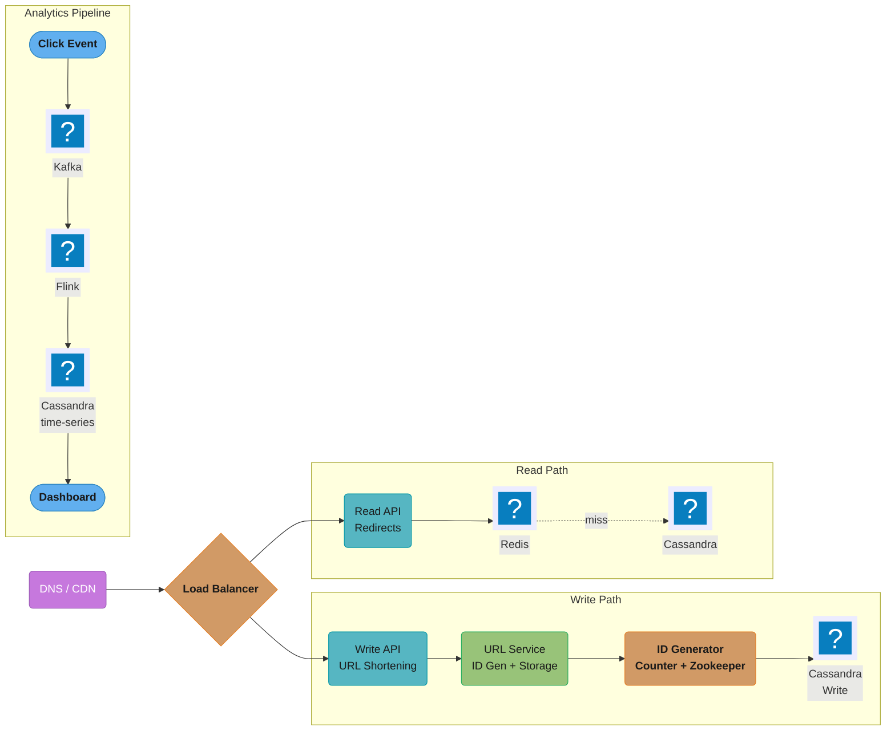
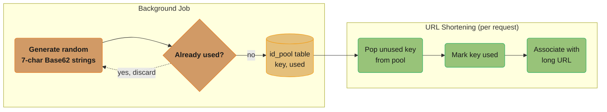
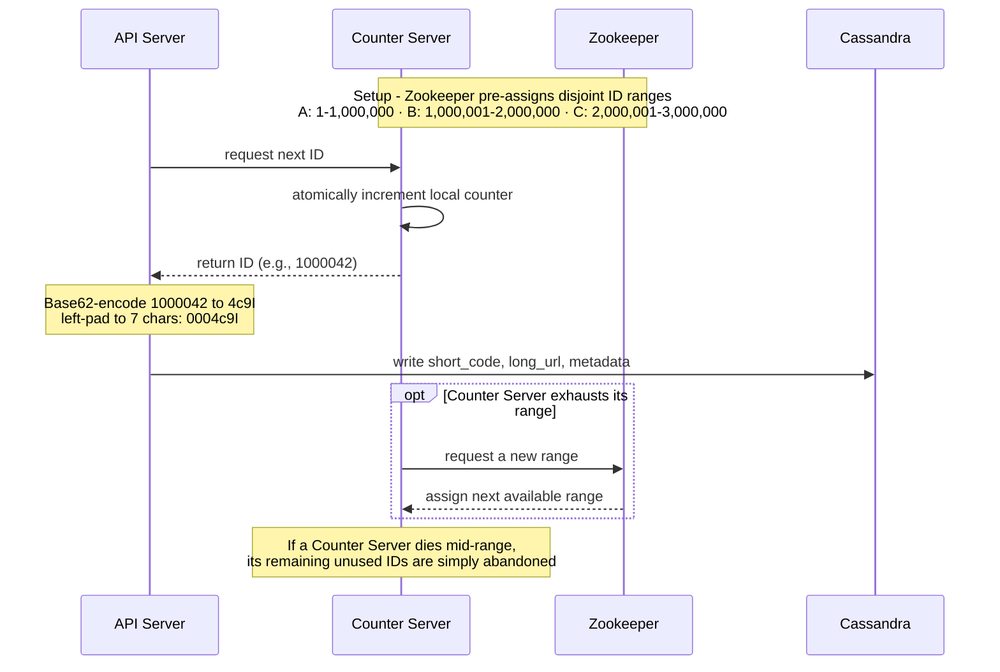
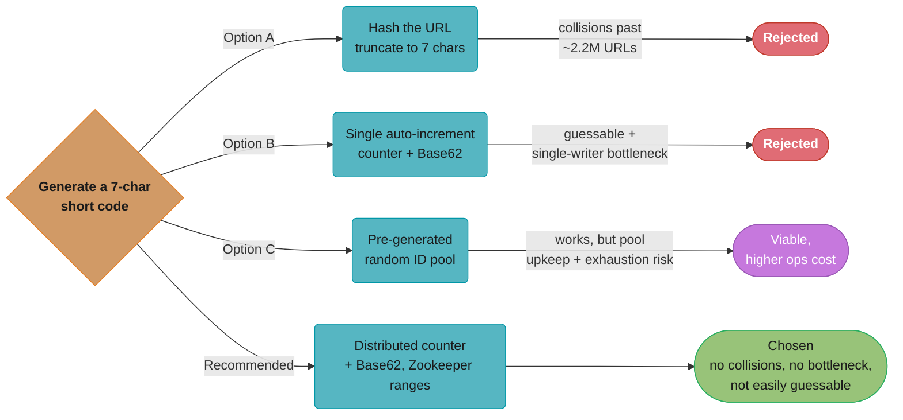
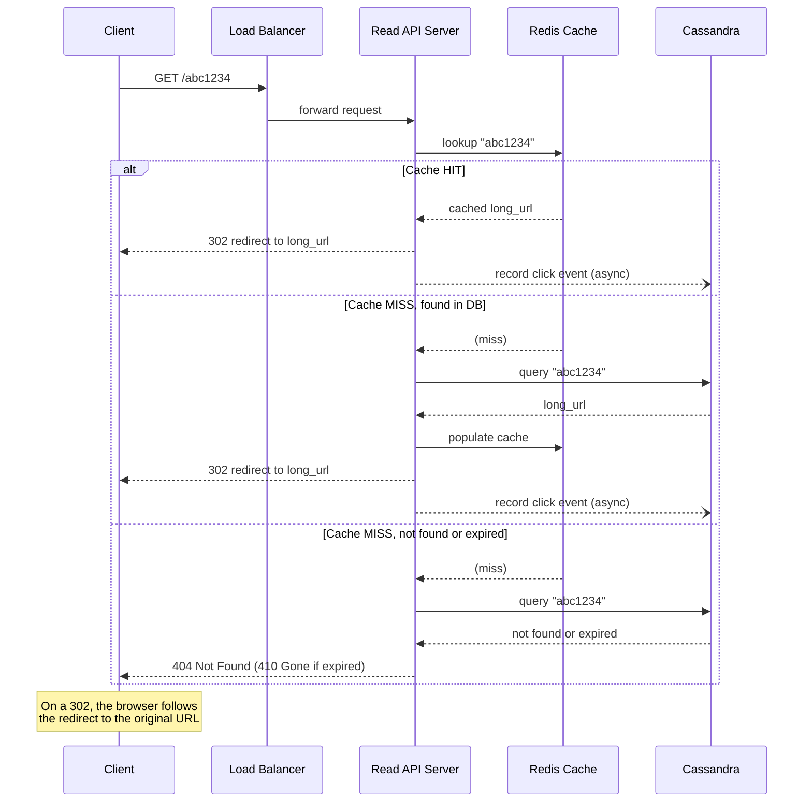
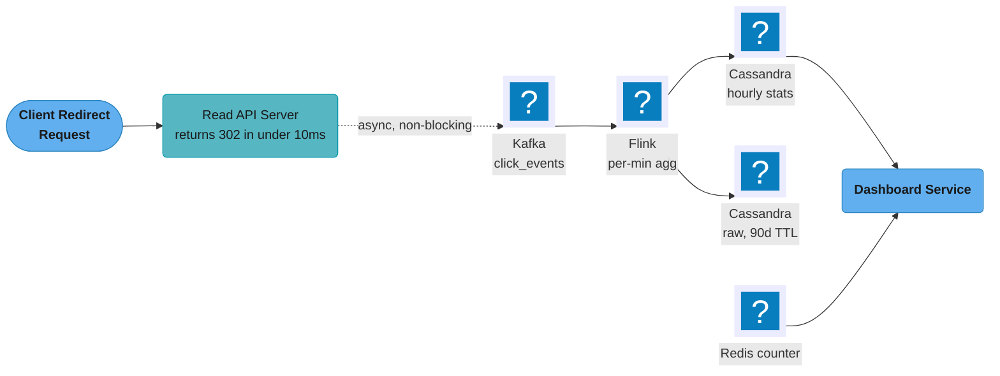
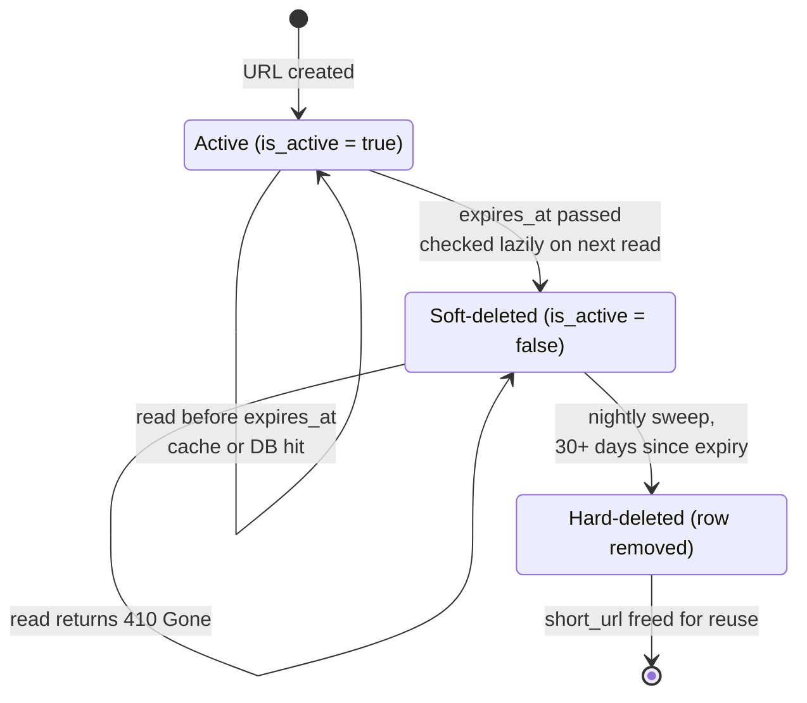

# System Design: URL Shortener (like bit.ly)
## Intuition

> **Design intuition**: A URL shortener is the "Hello World" of system design — it seems simple (store a mapping, redirect on lookup) but teaches all the fundamentals: hash function choice, database schema, caching strategy (reads are 100:1 over writes), and analytics pipeline. Master this and you understand distributed system basics.

**Key insight**: The redirect is the hot path — 10 billion redirects/day means ~116,000 RPS. A Redis cache in front of the database turns this from a 10ms database lookup into a 1ms cache hit, enabling the system to handle massive read scale on modest hardware.

---

## 1. Requirements Clarification

### Functional Requirements
- **Shorten URL**: Given a long URL, generate a short unique alias (e.g., `bit.ly/abc1234`)
- **Redirect**: When a user visits the short URL, redirect them to the original long URL
- **Analytics**: Track click count, geographic distribution, device type, referrer per short URL
- **Custom Aliases**: Allow users to specify a custom short code (e.g., `bit.ly/my-brand`)
- **Expiration**: Short URLs can have an optional expiry date after which they no longer redirect
- **User Accounts**: Registered users can view and manage their shortened URLs

### Non-Functional Requirements
- **High Availability**: Redirects must work 99.99% of the time — downtime means broken links
- **Low Latency**: Redirect should complete in < 10ms (users expect instant redirects)
- **Read-Heavy**: 100:1 read-to-write ratio (most traffic is redirects, not URL creation)
- **Durable**: Once created, short URLs must not be lost
- **Unpredictable IDs**: Short codes should not be guessable (security)
- **Scale**: Handle 10B redirects/day at peak

### Out of Scope
- QR code generation (separate feature, can be layered on top)
- Link-in-bio pages
- Team/collaboration features

---

## 2. Scale Estimation

### Write Traffic
- 100M new URLs shortened per day
- 100M / 86,400 sec = **1,157 writes/sec** (~1,200/sec)
- Peak: 3x average = **3,600 writes/sec**

### Read Traffic
- 10B redirects per day (100:1 read-to-write ratio)
- 10B / 86,400 sec = **115,740 reads/sec** (~116K/sec)
- Peak: 3x = **350K reads/sec**

### Storage Calculation
- Per URL record:
  - short_url: 7 bytes
  - long_url: avg 100 bytes (URLs vary, 2048 max)
  - user_id: 8 bytes
  - created_at: 8 bytes
  - expires_at: 8 bytes
  - metadata: ~20 bytes
  - **Total: ~150 bytes per URL**
- 5-year storage:
  - 100M URLs/day * 365 * 5 = **182.5B URLs**
  - 182.5B * 150 bytes = **27 TB** for URL mapping data
  - Analytics data (click events): much larger (~1 KB per click event)
  - 10B clicks/day * 1 KB * 365 * 5 = **18.25 PB** (aggregated, not raw: ~18 TB)

### URL Space
- Short code length 7, Base62 alphabet (a-z, A-Z, 0-9):
- 62^7 = **3.5 trillion** unique short codes — sufficient for decades

---

## 3. High-Level Architecture



*Write and read traffic are split into separate API tiers behind the load balancer, so the read-heavy redirect path (right) never contends with the write-heavy shortening path (left) for capacity; the Analytics Pipeline runs fully out-of-band from both.*

---

## 4. Component Deep Dives

### URL Shortening Algorithm

### The Core Problem
Given a long URL, generate a short unique code of length 7.

### Option A: Cryptographic Hash (MD5/SHA256)
```
long_url = "https://example.com/very/long/path"
hash = MD5(long_url)  # = "e3d70bc1b4ece4..."
short_code = hash[:7] = "e3d70bc"
```
**Pros**: Stateless, no central coordinator needed, same URL always gets same short code

**Cons**:
- **Hash collisions**: Two different URLs can produce same first 7 chars
  - With 3.5T possibilities, the birthday bound puts a 50% chance of at least one collision at ~2.2M URLs (1.177 x sqrt(62^7))
- Must query DB to check if short_code is taken (on collision, take next 7 chars)
- Non-sequential: no natural ordering

### Option B: Base62 Encoding of Auto-Increment ID
```
alphabet = "0123456789abcdefghijklmnopqrstuvwxyzABCDEFGHIJKLMNOPQRSTUVWXYZ"
            index 0-9 -> '0'-'9',  10-35 -> 'a'-'z',  36-61 -> 'A'-'Z'

auto_increment_id = 100000
  100000 / 62 = 1612  remainder 56  -> alphabet[56] = 'U'
    1612 / 62 =   26  remainder  0  -> alphabet[0]  = '0'
      26 / 62 =    0  remainder 26  -> alphabet[26] = 'q'

Digits fall out least-significant first, so read them back to front:
short_code = "q0U"   (left-pad to the fixed 7-char width: "0000q0U")
```
**Pros**: No collisions, predictable length, naturally unique

**Cons**:
- Sequential IDs are guessable (attacker can enumerate all URLs: `aaaaaa1`, `aaaaaa2`, ...)
- Single auto-increment DB is a bottleneck at high write rates
- Solution: Use distributed ID generators

### Option C: Pre-Generated Random IDs (ID Pool)


*The background job (top) keeps a pool of pre-verified codes ready; the request path (bottom) only ever pops a ready key, so collision-checking never happens on the hot path.*

**Pros**: Truly random (not guessable), no collision risk at point of use, fast lookup

**Cons**: Key pool must be maintained; potential for pool exhaustion under extreme load

### Recommended Approach: Counter + Base62 with Distributed Counter

Use a distributed counter (Zookeeper or dedicated counter service) with Base62 encoding:



**Why this is best**: No collisions, distributed (no single bottleneck), not easily guessable (IDs are non-sequential when interleaved across multiple counter servers), fast.



*Each rejected branch traces back to the Pros/Cons above: hashing collides past ~2.2M URLs (birthday bound on the 62^7 ~ 3.5T-code space, §2), a plain counter is sequential and single-writer, and a pre-generated pool works but adds ongoing maintenance — leaving the distributed counter as the only option with no collisions and no write bottleneck.*

---

### Redirect Mechanism

### HTTP 301 vs. 302
| | 301 Permanent Redirect | 302 Temporary Redirect |
|---|---|---|
| Browser behavior | Caches the redirect; future clicks go directly to long URL (bypasses short URL server) | Always hits the short URL server |
| Analytics | Breaks analytics after first click — browser never calls our server again | Every click goes through our server → can track all clicks |
| Performance | Faster for repeat visits (no server hit) | Slight latency on every visit (server roundtrip) |
| Use case | When the mapping is permanent and analytics aren't needed | When analytics tracking is required |

**Decision: Use 302 for analytics tracking.** This is the expected answer in system design interviews when analytics is a requirement.

```
HTTP Request:  GET http://short.url/abc1234
HTTP Response: HTTP/1.1 302 Found
               Location: https://original-long-url.com/path
               Cache-Control: public, max-age=0, s-maxage=3600
```

A 302 is not cacheable by default under RFC 9110, so the response must opt in explicitly. `s-maxage` lets the shared CDN cache hold it (the edge-caching path in §8 and War Story 4) while `max-age=0` keeps the *browser* coming back, preserving per-click analytics. For link owners who prefer performance over analytics, offer an option to use 301 (common in enterprise plans).

### Redirect Flow


*The redirect hot path: a cache hit returns in about 1ms with the click logged asynchronously; a miss falls through to Cassandra and repopulates the cache before returning, so only the next request for that code benefits — only a missing mapping reaches 404, and an expired one 410 Gone (§4, Expiration and Cleanup).*

---

### Database Design

### Why Cassandra?
- Write-heavy (1,200 new URLs/sec) + read-heavy (116K redirects/sec after cache)
- Simple key-value access pattern (lookup by short_url)
- No complex joins needed
- Horizontal scalability across multiple data centers
- Cassandra is a perfect fit for this access pattern

### Schema
```sql
-- Primary URL mapping. CQL has no length-parameterized types and no
-- NOT NULL / DEFAULT column constraints: both live in the application layer.
CREATE TABLE url_mapping (
    short_url    text PRIMARY KEY,
    long_url     text,
    user_id      uuid,
    created_at   timestamp,
    expires_at   timestamp,       -- null means no expiration
    is_active    boolean,
    custom_alias boolean
);

-- User's URL history (lookup all URLs by user)
CREATE TABLE urls_by_user (
    user_id     uuid,
    created_at  timestamp,
    short_url   text,
    long_url    text,
    click_count bigint,
    PRIMARY KEY (user_id, created_at, short_url)
) WITH CLUSTERING ORDER BY (created_at DESC);

-- Analytics: click events (time-series)
CREATE TABLE click_events (
    short_url   text,
    clicked_at  timestamp,
    country     text,
    device      text,           -- mobile, desktop, tablet
    browser     text,
    referrer    text,
    ip_address  inet,
    PRIMARY KEY (short_url, clicked_at)
) WITH CLUSTERING ORDER BY (clicked_at DESC)
  AND default_time_to_live = 7776000;  -- 90 days TTL for raw click events

-- Analytics: aggregated stats
CREATE TABLE url_stats_hourly (
    short_url   text,
    hour_bucket timestamp,       -- truncated to hour
    click_count bigint,
    country_counts map<text, bigint>,
    device_counts  map<text, bigint>,
    PRIMARY KEY (short_url, hour_bucket)
) WITH CLUSTERING ORDER BY (hour_bucket DESC);
```

---

### Caching Strategy

### Why Cache?
- 116K reads/sec — even fast Cassandra can't handle this efficiently without caching
- 80/20 rule: **20% of URLs get 80% of traffic** (viral links, popular campaigns)
- A cached redirect = ~0.1ms vs. a DB read = ~5-10ms

### Redis Cache Configuration
```bash
# Set URL in cache with TTL matching expiration
SET url:abc1234 "https://original-url.com/path" EX 86400  # 1 day TTL

# For URLs with explicit expiration: TTL = time until expiry
SET url:xyz789 "https://example.com" EXAT 1798761600  # Unix timestamp of expiry (2027-01-01)

# For permanent URLs: use long TTL (30 days), rely on LRU eviction for cold URLs
SET url:pqr123 "https://example.com" EX 2592000  # 30 days
```

### Cache Eviction Policy
- Use **LRU (Least Recently Used)** eviction — evict the least recently accessed URLs
- In Redis: `maxmemory-policy allkeys-lru`
- Memory sizing:
  - 20% of 100M URLs = 20M keys * (7 + 100 bytes of payload) = ~2.1 GB of *data*
  - Redis charges roughly 60-100 bytes per key on top of that (`dictEntry`, `robj`, SDS
    headers, expire table), so budget ~20M * ~200 bytes = **~4 GB resident**
  - Allocate a 10-20 GB Redis cluster to cache the hot 20% with room to grow

### Cache-Aside Pattern
```
function getRedirectUrl(short_url):
  1. Try Redis: url = cache.get("url:" + short_url)
  2. If found:
       log_click_event_async(short_url)
       return url
  3. If not found (cache miss):
       url = cassandra.get(short_url)
       if url is None or url.expired:
           return 404
       cache.set("url:" + short_url, url.long_url, ttl=...)
       log_click_event_async(short_url)
       return url.long_url
```

### Cache Hit Rate
- Target: > 95% cache hit rate (only 5% of redirects hit Cassandra)
- Monitor: track cache hit/miss ratio in metrics dashboard

---

### Consistent Hashing

### The Problem
Multiple Redis cache nodes. When we add or remove a node, how do we redistribute keys without invalidating most of the cache?

### Consistent Hashing Solution
```
                  0
               /    \
          300 /      \ 60
             /   (A)  \
            /          \
       240 |            | 120
            \    (B)   /
             \        /
              \      / (C)
               \    /
                180
```
- Hash ring with virtual nodes (150 virtual nodes per physical node)
- Key `url:abc1234` is hashed to a point on the ring
- Key is served by the first physical node clockwise from that point
- Adding a new node: only keys between the new node and its predecessor need to migrate
- Removing a node: its keys are absorbed by the next clockwise node

**Benefit**: Adding or removing a Redis node invalidates only ~1/N of the cache (not the whole thing).

---

### Analytics

### Requirements
- Click count per URL (near-real-time)
- Geographic distribution (country-level)
- Device and browser breakdown
- Referrer analysis
- Time-series chart (clicks over time)

### Pipeline


*The redirect response is synchronous and fast; everything from the click event onward — Kafka, Flink, and both Cassandra tables — runs asynchronously, so a Flink backlog (War Story 6, §9) delays dashboards but never delays a redirect.*

### Why Kafka?
- Decouples click recording from redirect response (redirect is synchronous; analytics is async)
- Handles bursts (viral link gets 100K clicks/sec momentarily — Kafka buffers the spike)
- Multiple consumers: one for Cassandra writes, one for real-time dashboard, one for fraud detection

### Real-Time Click Counter
For the simple click count display (most frequent analytics query):
```bash
INCR url:count:abc1234  # O(1), atomic increment in Redis
GET url:count:abc1234   # returns current count
```
Persist to Cassandra via periodic flush (every minute), not per-click.

---

### Custom Aliases

### Requirements
- User specifies desired short code: e.g., `bit.ly/launch-event`
- Must be unique — check against existing URLs
- Restricted characters: alphanumeric + hyphen, length 4-50 chars
- Reserved words blocked: `api`, `admin`, `health`, `login`, `static`, etc.

### Implementation
```python
def create_custom_alias(custom_code, long_url, user_id):
    # 1. Validate format
    if not is_valid_format(custom_code):
        raise ValidationError("Invalid format")

    # 2. Check reserved words
    if custom_code in RESERVED_WORDS:
        raise ValidationError("Reserved alias")

    # 3. Atomic check-and-insert (avoid race condition)
    success = cassandra.insert_if_not_exists(
        short_url=custom_code,
        long_url=long_url,
        user_id=user_id,
        custom_alias=True
    )
    # Cassandra LWT (IF NOT EXISTS):
    # INSERT INTO url_mapping (...) VALUES (...) IF NOT EXISTS

    if not success:
        raise ConflictError("Alias already taken")

    return custom_code
```

### Reserved Words Blocklist
Store in-memory (loaded from config file at startup):
```python
RESERVED_WORDS = {
    "api", "admin", "login", "logout", "static", "assets",
    "dashboard", "health", "metrics", "signup", "register",
    # ... ~500 words
}
```

---

### Expiration and Cleanup

### TTL in Redis
- Set TTL when caching: `SET url:abc1234 "..." EX {seconds_until_expiry}`
- Redis automatically evicts the key when TTL expires
- After expiry, cache misses fall through to Cassandra, which checks `expires_at`

### Database Cleanup
- Expired URLs remain in Cassandra (DB doesn't auto-delete)
- Cleanup approach: **Lazy deletion + Background sweep**

**Lazy deletion**: On every read, check `expires_at`. If expired, return 410 Gone, and mark `is_active = false`.

**Background sweep** (runs nightly):
```sql
-- Query and delete URLs expired more than 30 days ago
SELECT short_url FROM url_mapping
WHERE expires_at < (NOW() - 30 days)
AND is_active = false
LIMIT 10000;
-- Delete batch
```

### Soft Delete vs. Hard Delete
- **Choice**: Soft delete first (is_active = false), hard delete after 30 days
- **Reason**: User accidentally creates URL with wrong expiry, can restore within grace period
- **Hard delete**: reclaims storage and frees short_url for reuse (important for custom aliases)



*The 30-day gap between soft-delete and hard-delete is the grace period for recovering from an accidental wrong-expiry setting; only the hard-delete transition frees the short_url string for reuse, which matters most for custom aliases (§4).*

---

### Rate Limiting

### Why Rate Limiting?
- Prevent abuse: bots creating millions of URLs to spam
- Protect service from overload
- Enforce plan limits (free tier: 100 URLs/hour, paid: unlimited)

### Implementation (Fixed-Window Counter per User)
```bash
# Redis-based rate limiter: INCR + EXPIRE is a FIXED-window counter -- not a
# token bucket and not a sliding window. It admits up to 2x the limit across a
# window boundary; use a sorted-set sliding log or a Lua token bucket when that
# burst matters (see ../rate_limiting/README.md).
function is_rate_limited(user_id, limit=100, window=3600):
    key = "ratelimit:" + user_id
    count = redis.INCR(key)
    if count == 1:
        redis.EXPIRE(key, window)  # set TTL on first request
    if count > limit:
        return True  # rate limited
    return False
```

### For Anonymous Users
- Rate limit by IP address: `ratelimit:ip:{ip_address}`
- Stricter limits: 10 URLs/hour per IP
- Use X-Forwarded-For header (behind load balancer) but be careful of shared IPs (NAT)

### Distributed Rate Limiting
- Redis is shared across all API servers
- Atomic INCR ensures no double-counting across servers
- For more sophisticated rate limiting: use Redis + Lua script for atomic check-and-increment

---

## 5. Design Decisions & Tradeoffs

### 302 vs. 301 Redirect
- **Choice**: 302 for analytics, option to use 301 for users who opt out
- **Reason**: Analytics is a key feature; 302 ensures every click is tracked
- **Trade-off**: Slight latency on every click vs. data completeness

### Cassandra vs. MySQL for URL Storage
- **Choice**: Cassandra
- **Reason**: Simple key-value access by short_url, 116K reads/sec post-cache, write-heavy, no complex queries
- **Trade-off**: No ACID transactions (use Cassandra LWT for custom alias creation)

### Counter + Base62 vs. Pre-generated Pool
- **Choice**: Counter + Base62 with distributed counter service
- **Reason**: No key pool maintenance, predictable behavior, no risk of pool exhaustion
- **Trade-off**: Sequential IDs with slight predictability (mitigated by multiple counter servers interleaving)

### Redis LRU Cache Eviction
- **Choice**: LRU eviction for URL cache
- **Reason**: Recently accessed URLs are likely to be accessed again (recency = popularity for viral links)
- **Trade-off**: An old URL that becomes viral again will have a cold start (one cache miss before re-caching)

### Async Analytics vs. Synchronous
- **Choice**: Log click event to Kafka asynchronously, return redirect immediately
- **Reason**: Redirect latency is critical (must be < 10ms); analytics can tolerate a few seconds delay
- **Trade-off**: If Kafka consumer is down, click events may be lost temporarily (use Kafka's durability to mitigate)

---

## 6. Real-World Implementations

### URL Shorteners in Production

- **Bitly**: The reference implementation for this case study, serving billions of redirects per month. Bitly does not publish its storage topology, so treat the specific backend in §4 and §10 as *this design's* choice rather than a description of Bitly's; what is public and worth copying is the shape — a separate hot redirect path, an out-of-band analytics pipeline (Bitly wrote and open-sourced NSQ, a distributed messaging platform, for exactly this kind of decoupling), and click analytics (geography, referrer, device) exposed as a first-class product feature rather than an afterthought.
- **TinyURL**: One of the oldest URL shorteners (since 2002), historically built on a single large MySQL instance with an auto-increment primary key directly Base36/Base62-encoded — a textbook example of the "Option B" approach in §4, simple enough to run for two decades with minimal re-architecture because read traffic, while large, is geographically less concentrated than a viral-content platform.
- **t.co (Twitter/X)**: Every link posted to Twitter is automatically rewritten to a `t.co/...` short link — not for brevity (the t.co link is often *longer* than the original), but for **security scanning** (malicious URL detection at click-time, not just post-time) and **click analytics**. This is the canonical example of a shortener used as a security/analytics proxy rather than a length-reduction tool.
- **goo.gl (Google)**: A cautionary tale in two acts. Google stopped accepting new URLs to shorten in 2018-19, then announced in 2024 that *every* goo.gl link would stop resolving on 25 August 2025 — which would have broken links baked into printed signage, QR codes and shipped app binaries. After the backlash Google narrowed the plan: on 25 August 2025 it deactivated only links that had shown no activity in late 2024, and all other goo.gl links (including those minted by Google apps such as Maps sharing) still resolve. The lesson for any shortener design: **short URLs are a long-term commitment** — the "Expiration and Cleanup" design decision (§4) has product and reputational consequences that outlive the original engineering team, and the retirement policy you publish is itself part of the product.
- **Firebase Dynamic Links (Google, deprecation announced August 2023, shut down 25 August 2025)**: A repeat of the same lesson with no reprieve — every FDL link, on `page.link` subdomains and custom domains alike, began returning 404 on the shutdown date — a "dynamic" shortener (the "Dynamic destination" future capability in §8) that resolved differently per platform (iOS deep link vs. Android vs. web) was sunset, again forcing every dependent app to migrate. Reinforces that "Custom Aliases" and "Dynamic destination" features (§4, §8) need an explicit, published deprecation policy from day one.

### Comparable Systems for Cross-Reference

- **DNS**: Structurally the same problem one layer down the stack — a short, human-readable name (`example.com`) resolves to a long machine address (an IP), with heavy caching (resolver caches, TTLs) for the hot path and a hierarchical, eventually-consistent backing store (the global DNS system) for the cold path. The cache-aside-with-TTL pattern in §4's Caching Strategy is directly analogous to a DNS resolver cache.
- **Pastebin / paste services**: Share the ID-generation problem (generate a short, unique, hard-to-guess identifier for a piece of content) but flip the read pattern — a paste is typically read a handful of times, not millions, so a paste service's caching tier is far smaller relative to its storage tier than a URL shortener's.
- **CDN edge redirects**: A CDN serving a 301/302 from its edge PoPs (§8's Multi-Region section) solves the same "redirect at the edge without an origin round-trip" problem that media CDNs solve for asset URLs — the difference is that a URL shortener's "asset" is a single HTTP redirect response rather than a multi-megabyte file.

---

## 7. Technologies & Tools

| Component | Technology | Why |
|---|---|---|
| ID generation | Distributed counter (Zookeeper-coordinated ranges) + Base62 | No collisions, no central bottleneck, predictable 7-character length |
| Hot redirect cache | Redis Cluster (`allkeys-lru`) | Sub-millisecond reads for the >95% cache-hit hot path |
| Primary URL store | Cassandra | Simple key-value access by `short_url`, write-heavy, horizontal scale, `IF NOT EXISTS` LWT for custom aliases |
| Edge / CDN | CloudFlare / Fastly | Caches 301/302 responses at the edge (Cloudflare: 330+ cities); near-zero origin latency for repeat clicks |
| Analytics ingestion | Kafka | Decouples click recording from the redirect response; absorbs viral-link bursts |
| Stream aggregation | Flink | Real-time per-minute click aggregation by country, device, referrer |
| Analytics store | ClickHouse / Cassandra (time-series) | Compressed columnar storage for billions of click events |
| Rate limiting | Redis (`INCR` + `EXPIRE`) | Atomic distributed counters shared across all API servers |
| Malicious URL detection | Kafka consumer + Google Safe Browsing API | Async scanning that doesn't block URL creation latency |
| Coordination | Zookeeper | Counter range allocation, leader election for counter servers |

---

## 8. Operational Playbook

### Multi-Region and Global Deployment

#### Edge-First Architecture
- URL shorteners are read-heavy and globally consumed → **CDN at edge is critical**.
- 301/302 redirects cached at CloudFlare/Fastly PoPs (Cloudflare alone runs in 330+ cities).
- **Cache hit at edge**: 0ms origin latency, ~10ms p99 globally.
- **Cache miss**: ~15ms to origin (regional) + ~5ms DB/cache lookup = **~20ms p99**.

#### Active-Active Origins
- 3 origin regions (us-east, eu-west, ap-southeast).
- Each region has its own Redis tier + read replicas.
- Writes (URL creation) go to a primary region; eventually replicated to others.
- Reads served from local region only (no cross-region read needed because edge cache handles freshness).

#### Replication
- Cassandra `NetworkTopologyStrategy` with a replica set in each origin region; writes at `LOCAL_QUORUM`, cross-region replication asynchronous.
- Replication lag: typically 50–500ms; acceptable because edge cache hides this.
- Redis cross-region: not replicated; each region builds its own cache on read.

#### Conflict Resolution
- Short codes are immutable once assigned: no conflict possible.
- Counter ranges: Zookeeper or a global counter service allocates non-overlapping ranges to each region (e.g., us-east gets [0, 1B], eu-west gets [1B, 2B]).
- User-supplied custom aliases (e.g., bit.ly/my-link): globally coordinated to prevent duplicates; uses a global lookup before assignment.

#### Data Residency
- GDPR: EU user click analytics (IP, geo, user agent) stored only in EU.
- URL records themselves are not PII (just URL strings), replicated globally for low-latency lookup.

### Deployment and Alerting

#### Critical Alerts
| Metric | Threshold | Why |
|--------|-----------|-----|
| Redirect p99 latency | > 50ms (at edge) | UX degradation; clicks abandoned |
| Redis cache hit ratio | < 90% | DB about to be overloaded |
| URL creation error rate | > 0.1% | DB or counter issue |
| Counter range exhaustion warning | < 10% remaining | Run out of IDs imminent |
| Phishing flag rate | > 1% of new URLs | Abuse campaign in progress |
| Analytics pipeline lag | > 5 min | Stale dashboards; OK for hours, not days |
| CDN egress cost spike | > 2× baseline | Possible attack or viral URL |

#### Deployment Strategy
- **Blue/green**: Two parallel fleets; LB cuts over after smoke tests.
- **Canary**: 1% traffic to new build for 1 hour; auto-rollback on error rate or latency regression.
- **Feature flags** for new URL features (custom aliases, branded short domains, expiration policies).
- **Schema migrations**: backward-compatible only; multi-step (add column → backfill → switch reads → drop old column) to avoid downtime.

#### On-Call Runbook: Redirect Latency Spike
1. Check edge CDN dashboards: is cache hit rate dropping?
2. If yes: check for a viral URL or attacker pattern (lots of misses for non-existent codes).
3. If origin-side: check Redis health, then DB health.
4. Mitigation: increase edge cache TTL temporarily (e.g., from 1 hour to 24 hours); accept some staleness.

#### On-Call Runbook: Phishing Campaign Detected
1. Identify pattern: same destination domain, same creator IP, same user account?
2. Block at source: ban account, IP, or destination domain.
3. Bulk-flag existing URLs from the same source.
4. Notify abuse@ team and partners (Google Safe Browsing).
5. Post-mortem: did our auto-detector miss the pattern? Tune classifier.

### Evolution and Future Improvements

#### At 10× Scale (3B URLs/month, 100B redirects/month)
- Edge caching becomes existential: 1M redirects/sec average; without 99%+ edge cache hit, origin cost explodes.
- Database sharding required for URL table; Cassandra or Cosmos DB candidates.
- Counter coordination shifts to a distributed sequence service (Twitter Snowflake-style with per-DC range allocation).
- Analytics moves from ClickHouse to a streaming-only architecture (Materialize, RisingWave) for sub-second freshness.

#### Technical Debt
- Custom short codes (vanity URLs) bypass the counter scheme — separate code path with global coordination overhead.
- Click analytics schemas evolved organically; many legacy columns retained for backward compatibility.
- Multi-domain support (bit.ly + custom branded domains) complicates routing logic.

#### Future Capabilities
- **Dynamic destination**: Short code resolves to different URLs based on context (geo, device, time of day, A/B test bucket). E.g., `bit.ly/promo` → mobile app store on phones, web page on desktop.
- **Programmable redirects**: User-defined logic via WASM at the edge.
- **Privacy-preserving analytics**: Differential privacy on aggregated click counts; no raw IP logging.
- **Decentralized short URLs**: IPFS-based or blockchain-anchored short URLs that don't depend on a central service.
- **AI-powered abuse detection**: LLM-based phishing detection beyond URL pattern matching; analyzes landing page content in real time.

---

## 9. Common Pitfalls & War Stories

### Pitfall Summary

| Pitfall | Impact | Fix |
|---|---|---|
| 116K redirect reads/sec hitting the database directly | Database overloaded, redirects time out | Redis cache-aside (>95% hit rate cuts DB load by 20x) |
| Single ID-generator instance | URL creation is a single point of failure | Distributed counter with multiple servers + Zookeeper range assignment |
| Sequential counter IDs encoded naively | Write hotspot on one DB shard | Base62 spreads encoded IDs across the key space; shard by hashed short_url |
| Cache TTL not tied to expires_at | Expired URLs still served from cache | Cache TTL = min(time until expires_at, max_cache_ttl) |
| Kafka consumer falls behind | Analytics dashboards show stale data | Partition Kafka by short_url, scale out consumer group, monitor lag |
| Custom alias race (two users pick same alias) | One user's alias silently overwritten | Cassandra `INSERT ... IF NOT EXISTS` (LWT) |
| Viral link with no warm cache | Cache stampede — thousands of identical DB queries simultaneously | Singleflight/request-coalescing + proactive cache warming for trending URLs |

### War Story 1: Primary Database Failover Mid-Traffic

**What happened**: The primary database holding the URL mapping table failed (hardware fault) during normal daytime traffic.

**Impact**:
- Redirect traffic was unaffected — Redis serves >95% of redirects, and the remaining reads fell back to read replicas.
- New URL creation paused for 30–60 seconds while a replica was promoted to primary.
- Short-code generation paused during the same window, since counter state lived in the database/Zookeeper.
- Every already-issued short code kept working throughout the incident — the cache layer fully insulated the read path from the database outage.

**Fix**: Automated failover (Orchestrator/Patroni) promoted a replica within 30–60 seconds; manual intervention would have taken 5–15 minutes had automation failed.

**Lesson**: A read-heavy system's availability is bounded by its *cache* tier's availability, not its database's — which is exactly why Redis itself becoming a single point of failure (War Story 2) is the more dangerous failure mode of the two.

### War Story 2: Redis Cache Tier Wipeout (Cold Cache)
**Scenario**: Redis cluster restarted (config change, OOM, OS patch). All 20K reads/sec peak load now hits the database directly.

**Math of the catastrophe**:
- DB historically handles ~1K reads/sec comfortably; suddenly receives 20× load.
- Connection pool exhausts; queries queue up; p99 latency explodes from 5ms to 5s.
- Cascading: API gateway timeouts, client retries amplify load further.

**Mitigation**:
- **Cache warming**: Before re-enabling traffic post-Redis restart, run a batch job to pre-populate top 20% of URLs (those that account for 80% of traffic) from Cassandra.
- **Request coalescing**: 1000 simultaneous misses for the same short code result in a single DB query (singleflight pattern).
- **Probabilistic early expiration**: Keys near TTL expiry have a small chance of being treated as expired by individual requests, spreading refresh load.

**TTR**: With proper warming, <5 min. Without: 30 min of degraded service.

### War Story 3: Counter Coordinator (Zookeeper) Failure
**Scenario**: Zookeeper ensemble (managing ID ranges for short code generation) loses quorum.

**Behavior**:
- Each application server has a pre-allocated range of IDs (e.g., 1M IDs).
- Servers continue generating short codes until their local range exhausts.
- Once exhausted, new URL creations fail with retryable error.

**TTR**: Zookeeper quorum recovery typically <5 min; until then, ~1 hour of creation capacity from pre-allocated ranges.

### War Story 4: Cache Stampede on Viral Link
**Scenario**: A celebrity tweets a shortened URL; 100K requests/sec hit a single short code that's not yet cached.

**Behavior without mitigation**:
- All 100K requests miss Redis simultaneously.
- All 100K queries hit Cassandra for the same key → the owning partition's replicas melt down.

**Mitigation**:
- **Singleflight**: Application layer ensures only 1 of the 100K concurrent requests actually queries the DB; the rest wait for the result.
- After first response, populate Redis with longer TTL for viral keys (auto-detected by request rate).
- Edge CDN (CloudFlare/Fastly) caches 301/302 responses at PoP; second request to same PoP is served at edge without origin hit.

**TTR**: 100ms for first request; subsequent requests served from edge cache at 0ms latency.

### War Story 5: Abuse Storm (Phishing Campaign)
**Scenario**: An attacker creates 10M short URLs all pointing to phishing pages in a 1-hour burst.

**Behavior**:
- Rate limits (100 URLs/hour per IP for free tier) cap individual attackers.
- Attacker uses botnet (10K IPs × 100 URLs = 1M URLs/hour); still detectable.

**Mitigation**:
- **Async malicious URL scanning**: Every new URL submitted to a Kafka topic; consumers check against Google Safe Browsing API and a custom phishing classifier.
- Flagged URLs are blocked (redirect to a warning page) within minutes.
- Domains with >5% phishing rate (e.g., a new TLD abused) are added to a domain-level blocklist.
- Repeat-offender IPs/accounts banned automatically.

**TTR**: 1–5 minutes to flag and block individual URLs; minutes to hours to detect campaigns.

### War Story 6: Analytics Pipeline Backlog
**Scenario**: Kafka → Flink → ClickHouse analytics pipeline lags due to Flink job failure.

**Behavior**:
- Redirects continue working (analytics is async, not on critical path).
- Click count dashboards show stale data.
- Real-time analytics (e.g., "trending URLs") shows data from N minutes ago.

**TTR**: Flink job restart from checkpoint: 2–10 min; backlog drains at 2-3× normal throughput.

---

## 10. Capacity Planning

**Basis note**: §2 sizes the *design ceiling* asked for in §1 (100M new URLs/day, 10B redirects/day). This section sizes a running deployment at roughly one-tenth of that — ~300M URLs and ~10B redirects per **month** — because that is the order of magnitude a production shortener of this kind actually operates at, and it is the basis the cost envelope below is built from. Where §2 and §10 differ by 10-30x, that is the gap between the ceiling and the running system, not an inconsistency.

### URL Generation
- **300M URLs/month** (Bitly public number) = 300M / 30 / 86400 = **~115 URLs/sec average**, ~1K/sec peak.
- 6-character base62: 62^6 = **56.8 billion combinations**.
- At 300M/month = 3.6B/year, exhaustion approaches in ~16 years.
- **Birthday-paradox collision math**: for *random* generation, `n ~= sqrt(2m*ln(1/(1-p)))`. A 50% chance of at least one collision arrives at ~280K codes (~1.177 x sqrt(56.8B), where sqrt(56.8B) = 238K); a **1%** chance arrives far earlier, at only **~34K codes**.
- **Conclusion**: random 6-char generation needs retry-on-collision from almost the first day, and by ~10M live codes roughly 1 in 5,700 inserts collides and must be retried. Use 7-char (3.5 trillion combos) or a sequential counter encoded to base62 (§4), which collides never.

### Storage
- 6-char short code (6 bytes) + URL (~150 bytes average) + metadata (user_id, created_at, expires_at, click_count: ~50 bytes) = **~200 bytes/record**.
- With indexes and overhead: **~500 bytes/record**.
- **1 year of generation**: 3.6B URLs × 500 bytes = **1.8 TB**.
- **5 years**: ~9 TB.
- With RF=3: **27 TB**.

### Read Traffic
- **10B redirects/month** = 3,800/sec average, **~20K/sec peak**.
- 80/20 rule: 20% of URLs (720M URLs) generate 80% of clicks (8B/month = 3K/sec).
- Hot 20%: 720M × 500 bytes = **~360 GB** → fits in a 500GB Redis cluster (4-8 nodes).
- Cache hit rate target: >95%.
- Cache misses to DB: 20K × 0.05 = 1K/sec → comfortably inside one Cassandra replica set.

### Bandwidth
- Each redirect response: ~500 bytes (HTTP headers + Location header).
- 20K/sec × 500 = **10 MB/sec egress** at peak.
- Trivial bandwidth; CDN offloads most of it.

### Analytics
- 10B click events/month = **3,800 events/sec average, 20K peak**.
- Each event: ~200 bytes (short_code, timestamp, IP, user agent, referrer, geo).
- Kafka throughput: easily handled by 3 brokers (~50K events/sec capacity each).
- ClickHouse storage: 10B events × 200 bytes = **2 TB/month** raw, so **~120 TB** over 5 years; at ~5× columnar compression that is **~24 TB** on disk, ~48 TB with a second replica.

### Cost Envelope
- App servers (URL gen + redirect handling): ~20 servers at $5K/year = **$100K/year**.
- Redis cluster: 8 nodes at $10K/year = **$80K/year**.
- Cassandra ring (RF=3, ~12 nodes across 3 regions): **$200K/year**.
- Kafka + Flink + ClickHouse: **$150K/year**.
- CDN egress: ~$50K/year.
- **Total**: ~$600K/year for a Bitly-scale system. Order-of-magnitude cheaper than the WhatsApp/Netflix scale.

---

## 11. Interview Discussion Points

### How to Structure a 45-Minute Answer
1. **Requirements** (5 min): shorten, redirect, analytics, custom alias, expiration.
2. **Scale estimation** (5 min): write out the numbers explicitly — ~1,200 writes/sec, ~116K reads/sec, 100:1 ratio, ~27TB 5-year storage.
3. **High-level architecture** (5 min): draw the diagram with write path and read path separated.
4. **URL shortening algorithm** (10 min): the most interview-worthy part — walk through hash-based, counter-based, and pre-generated-pool options and justify your choice.
5. **Redirect mechanism** (3 min): explain the 301 vs 302 trade-off.
6. **Caching strategy** (5 min): Redis cache-aside, LRU eviction, the 80/20 rule.
7. **Database design** (5 min): Cassandra schema with partition-key reasoning.
8. **Analytics pipeline** (3 min): Kafka -> Flink -> Cassandra/ClickHouse.
9. **Rate limiting** (3 min): Redis INCR fixed-window counter, and when to upgrade it to a token bucket.
10. **Trade-offs and wrap-up** (1 min).

**Q: Why is hashing the long URL with MD5/SHA256 and truncating it a bad approach for short-code generation?**
A: Truncating a cryptographic hash to 7 characters throws away almost all of its collision resistance. With only 62^7 ~ 3.5 trillion possible codes, the birthday bound puts a 50% chance of at least one collision at ~2.2 million URLs (1.177 x sqrt(62^7)) — reached in under an hour at the 100M URLs/day this system targets. Every collision requires a database round-trip to detect and a retry with a different hash slice, adding latency and complexity exactly on the write path. A counter-based or pre-generated-pool approach (§4) avoids collisions entirely by construction.

**Q: Walk through Base62 encoding — why base62 and not base64 or base36?**
A: Base62 uses [a-z, A-Z, 0-9] — 62 characters, all URL-safe without escaping, unlike base64's `+`, `/`, and `=` characters which need percent-encoding in a URL path. Base36 (lowercase letters + digits only) would need 8 characters instead of 7 to cover a comparable ID space (36^8 ~ 2.8 trillion vs. 62^7 ~ 3.5 trillion), making URLs longer for no benefit. Base62 is the sweet spot: maximum information density per character while staying URL-safe.

**Q: 301 vs. 302 redirect — which do you choose and why?**
A: Choose 302, because per-click analytics requires the browser to reach your server on every click. A 301 gets cached by the browser after the first visit, and subsequent clicks never reach your servers again. The trade-off is a small latency cost on every redirect (a server round-trip instead of a browser-cached jump), acceptable because the redirect itself is already optimized to ~1ms via cache. Some shorteners offer 301 as an opt-in for users who explicitly don't need analytics and want maximum redirect speed.

**Q: How do you prevent the ID generator from becoming a write bottleneck or single point of failure?**
A: Run multiple counter servers, each pre-allocated a disjoint range of IDs by Zookeeper (e.g., server A gets IDs 1-1,000,000, server B gets 1,000,001-2,000,000). Each server issues IDs from its local range without coordination, only contacting Zookeeper when its range is exhausted — turning a potential per-request bottleneck into an infrequent, amortized coordination cost. If a counter server crashes mid-range, its remaining unused IDs are simply abandoned, a tiny acceptable waste given 3.5 trillion total IDs available.

**Q: Why Cassandra over MySQL/Postgres for the URL mapping table?**
A: The access pattern is pure key-value — look up `long_url` by `short_url`, with no joins, no complex queries, and a 100:1 read-to-write ratio dominated by simple point lookups. Cassandra's partitioned, masterless architecture scales horizontally for both the write volume (1,200+ URLs/sec) and the post-cache read volume, and its `INSERT ... IF NOT EXISTS` lightweight transaction gives just enough consistency for the one place it's needed: custom alias creation. A relational database's transactional and join capabilities would be unused overhead here.

**Q: How does the cache-aside pattern work for redirects, and what happens on a cache miss?**
A: On a request, the read API checks Redis first (`GET url:abc1234`); a hit returns the long URL immediately (~0.1-1ms) and logs the click event asynchronously to Kafka. On a miss, the API queries Cassandra, checks the `expires_at` field, populates Redis with an appropriate TTL if the URL is still valid, and then returns the redirect — so the *next* request for that code becomes a cache hit. The cache is populated lazily and never holds data the database doesn't also have, so a cache wipe is recoverable (just slower), not a data-loss event.

**Q: How do you handle a cache stampede when a previously-cold link suddenly goes viral?**
A: Collapse the concurrent misses into one database query with the "singleflight" request-coalescing pattern. When 100,000 concurrent requests miss the cache for the same short code, only the first actually queries the database; the other 99,999 wait on that single in-flight query and share its result. Combine this with auto-detection of high request-rate keys so that key's cache TTL is extended preemptively, and with edge-CDN caching of the 301/302 response itself so repeat requests from the same region never reach the origin after the first one.

**Q: How do you implement custom aliases without a race condition between two users requesting the same alias?**
A: The check ("is this alias available?") and the write ("claim this alias") must be a single atomic operation, not two separate steps — otherwise two concurrent requests can both pass the check before either writes. Cassandra's `INSERT INTO url_mapping (...) VALUES (...) IF NOT EXISTS` is a lightweight transaction (Paxos-based) that performs both atomically: it succeeds for exactly one of the two concurrent requests and fails for the other, which then returns an "alias already taken" error to its user.

**Q: How do you handle URL expiration cleanly — both in cache and in the database?**
A: Tie the cache TTL to `expires_at` and delete lazily in the database, with a nightly sweep behind it. Set the Redis TTL to match (or undercut) the URL's `expires_at` so the cache entry disappears on its own; on a cache miss, the database read checks `expires_at` directly, returns 410 Gone for expired URLs, and marks them `is_active = false`. A nightly background sweep then hard-deletes URLs inactive for 30+ days, freeing the short code for reuse — the 30-day grace period exists so a user who set the wrong expiration date can recover their link.

**Q: How would you detect and block malicious or phishing URLs without slowing down legitimate URL creation?**
A: Don't put the check on the synchronous creation path — publish every newly-created URL to a Kafka topic, and have async consumers check it against the Google Safe Browsing API and an internal phishing classifier. If a URL is flagged within the first few minutes, mark it inactive and serve a warning page on subsequent redirects instead of the destination; if a domain accumulates a high flag rate across many short URLs, blocklist the entire domain and flag the originating account for review.

**Q: Why is consistent hashing needed for the Redis cache layer, and what would happen without it?**
A: Without it, adding or removing a single Redis node remaps almost every key and effectively wipes the whole cache. Under a naive `hash(key) % N` scheme that is exactly what happens, and (per War Story 2) it can multiply database load by 20x or more for the duration of the rewarm. Consistent hashing with virtual nodes (~150 per physical node) means adding or removing a node only remaps the keys in the affected arc of the hash ring — roughly 1/N of all keys — so the cache stays mostly warm through routine scaling and node failures.

**Q: At 10x scale (3B URLs/month, 100B redirects/month), what's the first thing that breaks, and what changes?**
A: Origin infrastructure cost becomes the binding constraint, and edge cache hit rate becomes the lever that controls it. At ~1M redirects/sec average, even a 99% edge-cache hit rate still sends ~10K requests/sec to origin, so the hit rate has to push toward 99.9%+ via longer TTLs and smarter pre-warming of trending links. The URL table needs sharding (Cassandra handles this natively, but operational complexity grows), counter coordination moves toward a Snowflake-style per-datacenter ID allocation to avoid cross-region coordination, and the analytics pipeline likely moves from a batch-aggregated ClickHouse model to a fully streaming architecture for near-real-time dashboards.

### Numbers to Remember
- 100M URL creations/day -> ~1,200 writes/sec average, ~3,600/sec peak.
- 10B redirects/day -> ~116K reads/sec average, ~350K/sec peak.
- 100:1 read-to-write ratio.
- 62^7 ~ 3.5 trillion possible 7-character short codes.
- 5-year URL storage: ~27 TB (with RF=3).
- 80/20 rule: 20% of URLs generate 80% of traffic; that hot set fits in ~2-10 GB of Redis.
- Target cache hit rate: >95%; redirect latency <10ms (p99 ~20ms on cache miss).
- Total infra cost at Bitly scale: ~$600K/year.

---

## Cross-References

- **Consistent hashing for the Redis cluster (§4)** -> [`../consistent_hashing/README.md`](../consistent_hashing/consistent_hashing.md)
- **Distributed rate limiting (§4)** -> [`../rate_limiting/README.md`](../rate_limiting/rate_limiting.md)
- **Cassandra / wide-column storage internals (§4 Database Design)** -> [`../../database/wide_column_databases/README.md`](../../database/wide_column_databases/wide_column_databases.md)
- **Redis internals for the redirect cache** -> [`../../database/key_value_stores/README.md`](../../database/key_value_stores/key_value_stores.md)
- **Cache-aside, stampede prevention, and TTL strategy** -> [`../../backend/caching_strategies_deep_dive/README.md`](../../backend/caching_strategies_deep_dive/caching_strategies_deep_dive.md), [`../../database/database_caching_patterns/README.md`](../../database/database_caching_patterns/database_caching_patterns.md)
- **Kafka internals for the analytics pipeline** -> [`../../backend/kafka_deep_dive/README.md`](../../backend/kafka_deep_dive/kafka_deep_dive.md)
- **Distributed ID generation (counter/Snowflake-style alternatives)** -> [`../../java/case_studies/design_snowflake_id_generator_java.md`](../../java/case_studies/design_snowflake_id_generator_java.md)
- **CDN edge caching for 301/302 responses** -> [`../../devops/cloud_networking_and_cdn/README.md`](../../devops/cloud_networking_and_cdn/cloud_networking_and_cdn.md)

