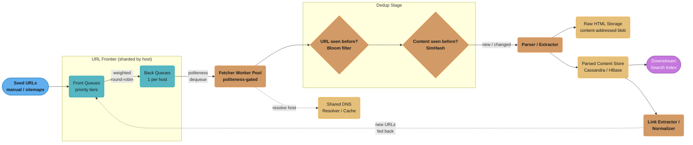
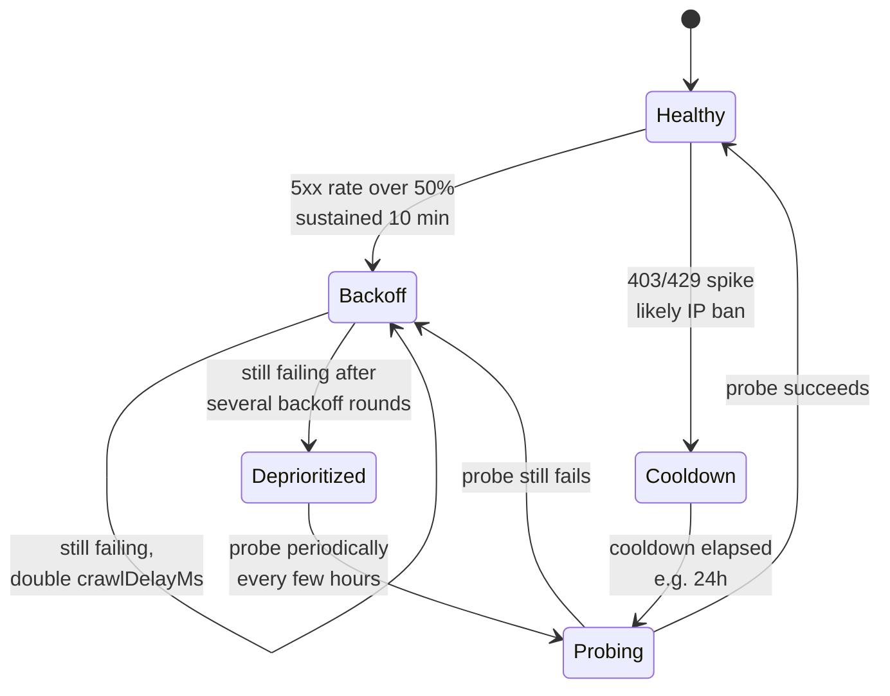
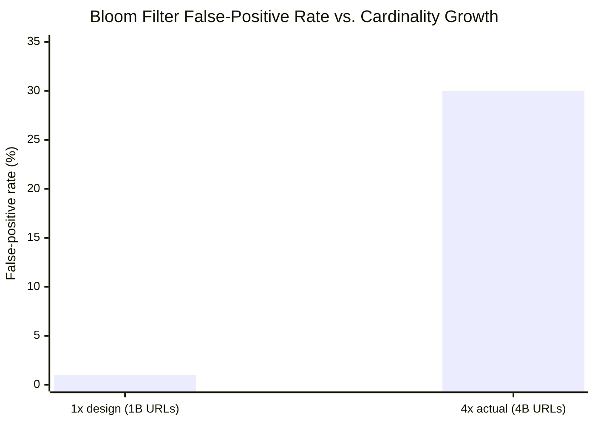

# System Design: Web Crawler

## Intuition

> **Design intuition**: A web crawler is a graph traversal algorithm wearing a distributed-systems trench coat. The "graph" is the entire web — billions of nodes (pages) and tens of billions of edges (hyperlinks) — and you're doing a giant, never-terminating BFS/priority-traversal over it. The hard parts aren't the traversal logic (that's a queue and a visited-set from Algorithms 101); the hard parts are everything that graph theory pretends doesn't exist: the graph is infinite (crawler traps generate new nodes forever), adversarial (some nodes actively try to ban you), and owned by millions of independent operators who will get angry — and block your IP range — if you visit their node too fast.

**Key insight**: The single most important constraint in this entire system is **politeness** — the requirement that no single web server ever receives more than a small number of requests per second from your crawler, no matter how many machines your crawler runs on. Every other design decision (how the URL frontier is sharded, how DNS is cached, how dedup works) either serves this constraint or is shaped by it. Get politeness wrong and your crawler doesn't just perform badly — it gets your entire IP range banned from the websites you're trying to index, which is an existential failure for a search engine.

---

## 1. Requirements Clarification

### Functional Requirements
- **Seeded crawl**: Given a set of seed URLs, fetch each page and follow its outbound hyperlinks to discover new pages, recursively
- **Content extraction**: For each fetched page, extract the raw HTML, the visible text content, page metadata (title, meta description, language, last-modified date), and the list of outbound links
- **Politeness compliance**: Fetch and respect each site's `robots.txt` — honor `Disallow` rules and `Crawl-delay` directives
- **Recrawl for freshness**: Periodically revisit previously-crawled pages to detect changes; recrawl frequency should be proportional to how often a page actually changes and how important the page is
- **Deduplication**: Avoid re-crawling URLs already visited, and avoid re-storing content that is identical or near-identical to content already stored (mirrors, syndicated articles, tracking-parameter variants of the same URL)
- **Feed downstream systems**: Hand off extracted content (text, metadata, links) to a downstream indexing/search pipeline

### Non-Functional Requirements
- **Politeness**: Strict per-domain rate limiting — never exceed a target site's stated (or a conservative default) crawl rate, regardless of how many fetcher machines are running
- **Planet-scale**: Support a frontier and visited-set covering billions of URLs, with a target of crawling on the order of 1 billion pages per monthly cycle
- **Robustness**: Tolerate malformed HTML, slow or unresponsive servers, HTTP error codes, redirect loops, and adversarial "crawler trap" pages designed to consume infinite crawl budget
- **Freshness**: A page that changes hourly (e.g., a news homepage) should be recrawled far more often than a page that hasn't changed in years (e.g., an archived PDF)
- **Scalability & fault tolerance**: The crawler runs as a long-lived (effectively permanent) distributed job; individual fetcher/frontier nodes will fail routinely and must not lose significant crawl state
- **Storage efficiency**: Don't store duplicate copies of the same content fetched from different URLs

### Out of Scope
- **Building the search index and ranking algorithm** — this system's output (extracted text, links, metadata) is the *input* to a downstream indexing/ranking pipeline (see [`../../database/search_engines/README.md`](../../database/search_engines/README.md)); we don't design the inverted index or PageRank-style scoring here, beyond using a precomputed importance score to prioritize the frontier
- **Full JavaScript rendering for every page** — most of the web is crawlable from raw HTML; full headless-browser rendering for SPA-heavy sites is discussed as an extension in §7 and §11, not as the default fetch path (it's 10-100x more expensive per page)
- **Real-time/streaming crawl of breaking news** (a "freshness-first" crawler with sub-minute latency is a related but distinct system with much tighter SLAs)

---

## 2. Scale Estimation

### Crawl Throughput
- **Target**: 1 billion pages crawled per monthly cycle
- Average rate: 1,000,000,000 / (30 days * 86,400 sec/day) = 1,000,000,000 / 2,592,000 ~= **386 pages/sec average**
- Peak (accounting for non-uniform scheduling, retries, and re-crawl bursts): ~**1,000 pages/sec peak**
- This is the number that drives the fetcher fleet size (§10) — but note the gotcha: per-host politeness, not raw fetcher count, is the real bottleneck (more on this below and in §10)

### Bandwidth and Raw Storage
- Average fetched HTML size: ~100 KB/page (real-world pages range from a few KB to several MB, but 100 KB is a reasonable blended average including images' surrounding markup, not the images themselves)
- Raw HTML per monthly cycle: 1,000,000,000 pages * 100 KB = **100 TB of raw HTML per cycle**
- At 386 pages/sec * 100 KB = **~38.6 MB/sec average ingest bandwidth**, ~100 MB/sec at peak
- Over a year (12 cycles, with overlap and recrawl): raw HTML storage easily reaches **multiple petabytes** before any compression or dedup — this is why blob storage with lifecycle policies and content-addressed dedup matters (§4.3, §7)

### URL Frontier and Visited-Set Sizing
- The "have I seen this URL before" set must track on the order of **billions of URLs** — at 1B pages/month and multi-year operation, the cumulative set of discovered URLs (crawled + queued + rejected) can reach **tens of billions**
- **Exact set (hash set of URL strings/hashes)**: storing 10 billion URLs as 8-byte hashes in a hash table (with typical 2-3x overhead for open addressing / pointers) costs roughly 10B * (8 bytes * 2.5) = **~200 GB**, and that's *before* accounting for the fact that a naive hash set of strings (rather than fixed-width hashes) would be 5-10x larger still — easily into the **terabyte range**
- **Bloom filter (probabilistic set)**: for 1 billion elements at a 1% false-positive rate, the optimal bit-array size is:

```
m = -n * ln(p) / (ln 2)^2
  = -(1,000,000,000 * ln(0.01)) / (0.6931)^2
  = -(1,000,000,000 * -4.6052) / 0.4805
  = 4,605,200,000 / 0.4805
  ~= 9,584,000,000 bits
  ~= 1.198 * 10^9 bytes
  ~= 1.2 GB
```

  That works out to **~9.6 bits per element** — roughly 1.2 GB for 1 billion URLs, vs. ~20-50x more for an exact hash set of the same cardinality.

- **Why the false-positive cost is acceptable**: a 1% false positive on "have I seen this URL" means that, on average, 1 in 100 *genuinely new* URLs gets incorrectly skipped as "already seen." At planet scale, where the crawler can never visit every URL on the web anyway (the web is effectively infinite due to dynamically generated pages), occasionally missing 1% of new URLs — most of which are low-value duplicates, tracking-parameter variants, or low-importance pages anyway — is a far better trade than spending 20-50x the memory to be exact. The memory saved (tens of GB down to ~1.2 GB per billion URLs) can instead fund a larger frontier, more DNS cache entries, or more in-flight fetches. §9 (War Story 4) covers what happens when this filter is *not* periodically resized as cardinality grows past its design point.

### Metadata and Link Graph Storage
- Each crawled page produces: ~5-10 outbound links on average (some pages have hundreds, many have none)
- 1B pages * 7.5 links average = **~7.5 billion link-graph edges** discovered per cycle (with heavy overlap/dedup against previously-discovered URLs)
- Per-page metadata record (URL, fetch timestamp, HTTP status, content hash, SimHash signature, extracted title/description, language, outbound link count): ~500 bytes-1 KB
- 1B pages * 1 KB = **~1 TB of metadata per cycle** in the document store (before compression)

---

## 3. High-Level Architecture



**Read of the diagram**: URLs flow Seed -> Frontier -> Fetcher -> Dedup -> Parser -> Storage, with the Link Extractor closing the loop by feeding newly discovered URLs back into the Frontier. The Frontier is the system's central nervous system — it is sharded by `consistent-hash(host)` (cross-ref [`../consistent_hashing/README.md`](../consistent_hashing/README.md)) so that *all* URLs for a given host always land on the *same* shard, which is what makes per-host politeness enforceable even across hundreds of fetcher machines (§4.1, §4.6). The DNS Resolver/Cache is drawn as a separate shared service because, without it, every fetcher independently performing synchronous DNS lookups becomes a severe latency drain (§9, War Story 2).

---

## 4. Component Deep Dives

### 4.1 URL Frontier Internals — The Politeness-Enforcing Dequeue

The URL Frontier is conceptually two layers, following the Mercator design (§6):

- **Front queues**: a small number of priority queues (e.g., 1-5 priority tiers). A "prioritizer" assigns each URL a priority score based on estimated importance (PageRank-like score) and freshness need (how overdue is this page for a recrawl). URLs are enqueued into the front queue matching their priority tier.
- **Back queues**: one logical queue *per host*. A "front-to-back" router pulls URLs from front queues (biased toward higher-priority tiers via weighted selection) and routes each URL into the back queue for its host. Each back queue has an associated `nextAllowedFetchTime`.

A fetcher worker can only dequeue a URL for host `H` if `now >= nextAllowedFetchTime[H]`. After fetching from `H`, the worker sets `nextAllowedFetchTime[H] = now + crawlDelay[H]`. This single rule is what makes the whole system polite, *as long as all URLs for host H are routed to back queues that the same scheduling logic governs* — which is why frontier sharding by host (§4.6) is so important: it guarantees there's exactly one `nextAllowedFetchTime[H]` in the whole distributed system, not one per fetcher machine.

```java
import java.util.*;
import java.util.concurrent.*;

/**
 * Politeness-enforcing URL frontier dequeue.
 *
 * Each host has:
 *   - its own back-queue of pending URLs (FIFO within a host)
 *   - a "next allowed fetch time" timestamp
 *   - a configured crawl delay (from robots.txt, default if absent)
 *
 * A worker calling dequeueNext() will only ever receive a URL for a host
 * whose nextAllowedFetchTime has passed. Hosts that are not yet "due"
 * are skipped. If no host is due, the caller should back off briefly.
 */
public class PolitenessFrontier {

    /** Default politeness delay if robots.txt has no Crawl-delay: 1 request/sec/host. */
    private static final long DEFAULT_CRAWL_DELAY_MS = 1000L;

    /** Per-host FIFO queue of URLs awaiting fetch. */
    private final Map<String, Deque<String>> backQueues = new ConcurrentHashMap<>();

    /** host -> earliest time (epoch millis) this host may be fetched again. */
    private final Map<String, Long> nextAllowedFetchTime = new ConcurrentHashMap<>();

    /** host -> crawl delay in ms, learned from robots.txt (or default). */
    private final Map<String, Long> crawlDelayMs = new ConcurrentHashMap<>();

    /**
     * A simple "ready" priority structure: hosts ordered by their
     * nextAllowedFetchTime, so we can efficiently find the host that
     * becomes eligible soonest. In production this would be sharded
     * and partitioned across frontier nodes by consistent-hash(host).
     */
    private final PriorityQueue<HostSchedule> readyHeap =
            new PriorityQueue<>(Comparator.comparingLong(h -> h.nextAllowedFetchTime));

    private static final class HostSchedule {
        final String host;
        long nextAllowedFetchTime;
        HostSchedule(String host, long nextAllowedFetchTime) {
            this.host = host;
            this.nextAllowedFetchTime = nextAllowedFetchTime;
        }
    }

    /** Enqueue a URL discovered for the given host. */
    public synchronized void enqueue(String host, String url) {
        backQueues.computeIfAbsent(host, h -> new ArrayDeque<>()).addLast(url);
        // If this is a brand-new host, it's immediately eligible.
        if (!nextAllowedFetchTime.containsKey(host)) {
            nextAllowedFetchTime.put(host, 0L);
            crawlDelayMs.putIfAbsent(host, DEFAULT_CRAWL_DELAY_MS);
            readyHeap.offer(new HostSchedule(host, 0L));
        }
    }

    /**
     * Called by a fetcher worker. Returns the next (host, url) pair that is
     * due for fetching right now, or null if no host is currently eligible
     * (caller should sleep briefly and retry).
     */
    public synchronized FetchTask dequeueNext(long now) {
        // Peek the host that becomes eligible soonest.
        while (!readyHeap.isEmpty()) {
            HostSchedule top = readyHeap.peek();
            Deque<String> queue = backQueues.get(top.host);

            if (queue == null || queue.isEmpty()) {
                // Nothing left for this host right now; drop it from the heap.
                readyHeap.poll();
                continue;
            }

            if (top.nextAllowedFetchTime > now) {
                // Soonest-eligible host isn't due yet -> nothing is due.
                return null;
            }

            // This host is due. Pop it, dequeue its next URL.
            readyHeap.poll();
            String url = queue.pollFirst();
            return new FetchTask(top.host, url);
        }
        return null;
    }

    /**
     * Called by a fetcher worker after completing a fetch (success or
     * failure) for the given host. Reschedules the host according to its
     * crawl delay and re-enqueues it into the ready heap if it still has
     * pending URLs.
     */
    public synchronized void onFetchComplete(String host, long now) {
        long delay = crawlDelayMs.getOrDefault(host, DEFAULT_CRAWL_DELAY_MS);
        long next = now + delay;
        nextAllowedFetchTime.put(host, next);

        Deque<String> queue = backQueues.get(host);
        if (queue != null && !queue.isEmpty()) {
            readyHeap.offer(new HostSchedule(host, next));
        }
        // If the queue is empty, the host simply isn't re-added; enqueue()
        // will re-add it when (if) a new URL for this host arrives.
    }

    /** Update the crawl delay for a host, e.g. after parsing robots.txt. */
    public synchronized void setCrawlDelay(String host, long delayMs) {
        crawlDelayMs.put(host, Math.max(delayMs, 1L));
    }

    public static final class FetchTask {
        public final String host;
        public final String url;
        FetchTask(String host, String url) {
            this.host = host;
            this.url = url;
        }
    }
}
```

Notes on this implementation:
- `dequeueNext` never returns a URL for a host whose `nextAllowedFetchTime` is in the future — that host is simply skipped, and if it's the *soonest* not-yet-due host, the method returns `null` (no work available right now), so the worker should briefly back off rather than busy-loop.
- `onFetchComplete` is the single place that advances `nextAllowedFetchTime[host]`, ensuring exactly one "clock" per host regardless of which worker fetched it last.
- In production this single in-memory structure becomes a **sharded service**: each frontier shard owns a disjoint set of hosts (assigned via consistent hashing, §4.6) and runs its own instance of this exact logic, backed by a durable queue (Kafka partitions or a custom persistent queue) so that frontier state survives node restarts.

---

### 4.2 Politeness in Depth — robots.txt and Crawl-delay

Before a fetcher issues its *first* request to a host, and periodically thereafter, it must fetch and cache that host's `robots.txt`:

- **Fetch**: `GET http://{host}/robots.txt` (a fixed, well-known path per the Robots Exclusion Protocol)
- **Cache with its own TTL**: robots.txt is cached independently of any individual page's cache policy — typical TTL is 24 hours, since robots.txt changes rarely but a stale "everything disallowed" cache entry could permanently block a host that *un-blocked* itself
- **Parse `Disallow` rules**: build a list of path prefixes the crawler must not fetch (e.g., `Disallow: /admin/`, `Disallow: /search?`); before enqueuing *any* URL for this host, check it against these rules and drop it if disallowed
- **Parse `Crawl-delay`**: if present, this directly sets `crawlDelayMs[host]` in §4.1's frontier (e.g., `Crawl-delay: 5` means at most 1 request every 5 seconds to this host)
- **Default if absent**: many sites don't specify `Crawl-delay`. Default to a conservative **1 request/sec/host** (`DEFAULT_CRAWL_DELAY_MS = 1000`) — aggressive enough to make progress on large sites, conservative enough not to look like a DoS attack on small ones
- **robots.txt fetch failure**: if the host is unreachable or returns a 5xx for robots.txt, treat it conservatively — either skip the host temporarily (retry robots.txt later) or fall back to the strictest known default, never assume "no robots.txt means everything is allowed and crawl as fast as possible"

**Why sharding the frontier by host hash naturally serializes per-host requests, even across machines**: imagine 200 fetcher machines, each running 50 worker threads — 10,000 concurrent fetch slots. Without coordination, if a small site `tinyblog.example` has 30 URLs discovered simultaneously, up to 30 of those 10,000 slots could *all* pick up a `tinyblog.example` URL in the same instant, hitting the site with 30 simultaneous requests — a politeness violation and a likely IP ban (§9, War Story 3). By assigning `consistent-hash(tinyblog.example) -> shard 47`, **all** URLs for `tinyblog.example`, no matter which fetcher machine discovered them, get routed to frontier shard 47's back queue for that host. Only the fetcher workers attached to shard 47 ever dequeue `tinyblog.example` URLs, and they do so through the single `nextAllowedFetchTime[tinyblog.example]` gate in §4.1. The sharding key (host) and the politeness key (host) are the same key — that's the dual benefit explored further in §5.

---

### 4.3 Dedup — URL-Seen Check via Bloom Filter

Before enqueuing a newly-discovered URL into the frontier, the Link Extractor checks "have we ever seen this URL before?" using a Bloom filter — a probabilistic set that trades a small false-positive rate for massive memory savings (worked out in §2 and §10).

```java
import java.nio.charset.StandardCharsets;
import java.util.BitSet;
import java.util.function.ToIntFunction;

/**
 * A simple Bloom filter for the "URL seen before" check.
 *
 * add(url)         : marks a URL as seen (sets k bits)
 * mightContain(url): true => "possibly seen" (could be a false positive)
 *                    false => "definitely never seen"
 *
 * False-positive rate after n insertions, with m bits and k hash functions:
 *   p ~= (1 - e^(-k*n/m))^k
 *
 * For m sized via m = -n*ln(p)/(ln2)^2 and k = (m/n)*ln2, the filter
 * achieves approximately the target false-positive rate p.
 */
public class UrlBloomFilter {

    private final BitSet bits;
    private final int numBits;
    private final int numHashes;

    /**
     * @param expectedInsertions estimated number of distinct URLs (n)
     * @param falsePositiveRate  target false-positive rate (p), e.g. 0.01
     */
    public UrlBloomFilter(long expectedInsertions, double falsePositiveRate) {
        this.numBits = optimalNumBits(expectedInsertions, falsePositiveRate);
        this.numHashes = optimalNumHashes(expectedInsertions, numBits);
        this.bits = new BitSet(numBits);
    }

    /** m = -n * ln(p) / (ln 2)^2 */
    private static int optimalNumBits(long n, double p) {
        double m = -n * Math.log(p) / (Math.log(2) * Math.log(2));
        return (int) Math.ceil(m);
    }

    /** k = (m / n) * ln 2 */
    private static int optimalNumHashes(long n, int m) {
        int k = (int) Math.round((m / (double) n) * Math.log(2));
        return Math.max(1, k);
    }

    /** Adds a URL to the filter, setting k bit positions. */
    public void add(String url) {
        for (int i = 0; i < numHashes; i++) {
            int position = hash(url, i);
            bits.set(position);
        }
    }

    /**
     * Returns true if the URL MIGHT have been added before (could be a
     * false positive); returns false only if it is DEFINITELY new.
     */
    public boolean mightContain(String url) {
        for (int i = 0; i < numHashes; i++) {
            int position = hash(url, i);
            if (!bits.get(position)) {
                return false; // definitely not present
            }
        }
        return true; // possibly present
    }

    /**
     * Derives the i-th hash by combining two independent hash functions
     * (the standard "double hashing" trick: h_i(x) = h1(x) + i*h2(x)).
     */
    private int hash(String url, int i) {
        byte[] data = url.getBytes(StandardCharsets.UTF_8);
        long h1 = murmur64A(data, 0x9747b28cL);
        long h2 = murmur64A(data, 0x12345678L);
        long combined = h1 + (long) i * h2;
        int position = (int) (Math.floorMod(combined, (long) numBits));
        return position;
    }

    /** Simplified 64-bit Murmur-style hash (illustrative, not a full implementation). */
    private static long murmur64A(byte[] data, long seed) {
        long m = 0xc6a4a7935bd1e995L;
        int r = 47;
        long h = seed ^ (data.length * m);
        for (int i = 0; i + 8 <= data.length; i += 8) {
            long k = 0;
            for (int j = 0; j < 8; j++) {
                k |= (data[i + j] & 0xFFL) << (8 * j);
            }
            k *= m; k ^= k >>> r; k *= m;
            h ^= k; h *= m;
        }
        int rem = data.length & 7;
        for (int j = 0; j < rem; j++) {
            h ^= (data[data.length - rem + j] & 0xFFL) << (8 * j);
        }
        h ^= h >>> r; h *= m; h ^= h >>> r;
        return h;
    }
}
```

**Worked example of the false-positive-rate formula**: with `n = 1,000,000,000` URLs and `p = 0.01`:

```
m = -n*ln(p) / (ln2)^2 ~= 9.585 * 10^9 bits ~= 1.2 GB
k = (m/n) * ln2 ~= (9.585) * 0.6931 ~= 6.64 -> round to 7 hash functions
```

With `m ~= 9.6` bits/element and `k = 7`, the *actual* false-positive rate after inserting exactly `n` elements is:

```
p ~= (1 - e^(-k*n/m))^k = (1 - e^(-7*1/9.6))^7 ~= (1 - e^(-0.729))^7 ~= (1 - 0.4824)^7 ~= 0.5176^7 ~= 0.0099
```

...which lands right at the targeted ~1%. §9 (War Story 4) covers what happens when `n` grows well past the design value of 1 billion without resizing the filter.

---

### 4.4 Dedup — Near-Duplicate Content via SimHash

The Bloom filter answers "have we seen this *URL* before?" — but the same content often lives at *many different URLs* (mirrors, syndicated news articles republished verbatim, pages differing only by a tracking parameter or a timestamp footer). SimHash produces a fixed-width fingerprint of a document's *content* such that near-duplicate documents produce fingerprints that differ in only a few bits, detectable via Hamming distance.

```java
import java.nio.charset.StandardCharsets;
import java.util.HashSet;
import java.util.Set;

/**
 * Simplified SimHash for near-duplicate content detection.
 *
 * Algorithm:
 *  1. Break the page's text into overlapping word "shingles" (n-grams).
 *  2. Hash each shingle to a 64-bit value.
 *  3. For each bit position 0..63, sum +1 if the bit is 1 in the shingle's
 *     hash, -1 if it's 0, across all shingles.
 *  4. The final signature bit i is 1 if the sum for position i is positive,
 *     else 0.
 *
 * Two documents with similar shingle sets produce signatures that differ
 * in only a small number of bits -- measured via Hamming distance.
 * A common threshold: Hamming distance <= 3 (out of 64 bits) => near-duplicate.
 */
public class SimHash {

    private static final int SIGNATURE_BITS = 64;
    private static final int SHINGLE_SIZE = 4; // 4-word shingles

    /** Computes the 64-bit SimHash signature for the given page text. */
    public long computeSignature(String text) {
        String[] words = text.toLowerCase().trim().split("\\s+");
        Set<String> shingles = buildShingles(words, SHINGLE_SIZE);

        int[] bitWeights = new int[SIGNATURE_BITS];

        for (String shingle : shingles) {
            long h = hash64(shingle);
            for (int bit = 0; bit < SIGNATURE_BITS; bit++) {
                boolean bitIsSet = ((h >>> bit) & 1L) == 1L;
                bitWeights[bit] += bitIsSet ? 1 : -1;
            }
        }

        long signature = 0L;
        for (int bit = 0; bit < SIGNATURE_BITS; bit++) {
            if (bitWeights[bit] > 0) {
                signature |= (1L << bit);
            }
        }
        return signature;
    }

    /** Builds the set of overlapping word n-grams ("shingles"). */
    private Set<String> buildShingles(String[] words, int shingleSize) {
        Set<String> shingles = new HashSet<>();
        if (words.length < shingleSize) {
            shingles.add(String.join(" ", words));
            return shingles;
        }
        for (int i = 0; i <= words.length - shingleSize; i++) {
            StringBuilder sb = new StringBuilder();
            for (int j = 0; j < shingleSize; j++) {
                if (j > 0) sb.append(' ');
                sb.append(words[i + j]);
            }
            shingles.add(sb.toString());
        }
        return shingles;
    }

    /** Hamming distance between two signatures: number of differing bits. */
    public int hammingDistance(long sig1, long sig2) {
        return Long.bitCount(sig1 ^ sig2);
    }

    /**
     * Returns true if two documents are near-duplicates: their signatures
     * differ in at most `threshold` of the 64 bits.
     */
    public boolean isNearDuplicate(long sig1, long sig2, int threshold) {
        return hammingDistance(sig1, sig2) <= threshold;
    }

    /** Simple 64-bit FNV-1a style hash (illustrative). */
    private long hash64(String s) {
        long hash = 0xcbf29ce484222325L; // FNV offset basis
        long prime = 0x100000001b3L;     // FNV prime
        for (byte b : s.getBytes(StandardCharsets.UTF_8)) {
            hash ^= (b & 0xFF);
            hash *= prime;
        }
        return hash;
    }
}
```

**How this fits the pipeline**: after extraction, the parser computes `SimHash.computeSignature(extractedText)` for the page. The Dedup stage maintains a (sharded, LSH-bucketed in production) index of recently-seen signatures. If the new signature's Hamming distance to an existing signature is `<= 3` (a common threshold for 64-bit signatures), the page is treated as a near-duplicate of already-stored content: its outbound links are still extracted and followed (the page might link to *new* content even if its own body is a duplicate), but the content itself is not re-stored — instead, a reference/alias to the canonical copy is recorded. This is how a crawler avoids storing 50 copies of the same syndicated wire-service article republished across 50 news sites with only a byline and a footer ad changed.

---

### 4.5 Crawler-Trap Detection

A "crawler trap" is a page (often unintentional, occasionally adversarial) that generates an effectively infinite number of distinct URLs, each linking to more URLs of the same shape — calendar pages that link "next month" forever, faceted-search pages with combinatorial filter parameters, or session-ID-embedded URLs that are unique per request. Without detection, a single trapped host can consume the *entire* crawl budget for days (§9, War Story 1).

Three complementary heuristics, applied at the Link Extractor before a URL is ever enqueued:

1. **Repeating path segments**: a URL like `/a/a/a/a/a/a/...` or `/category/category/category/...` — detect by checking whether any path segment appears more than `N` times (e.g., `N = 3`) consecutively or in total within the URL path. Reject URLs exceeding this threshold.

2. **Monotonically incrementing / unbounded query parameters**: a URL like `/events?month=13`, `/events?month=14`, ..., `/events?month=99999999` — detect by tracking, per (host, path, query-param-name) tuple, the *range* of observed values for that parameter. If a parameter's value exceeds a sane bound (e.g., `month` should be 1-12; `page` beyond a few thousand is suspicious for almost any site) or the crawler has already enqueued more than `K` distinct values for the same parameter on the same path, stop enqueuing further variants.

3. **Per-host max-crawl-depth cutoff**: track the "link depth" of each URL — the seed has depth 0, pages linked directly from the seed have depth 1, and so on. Cap the depth per host (e.g., depth <= 15-20 for most sites, configurable higher for known-large legitimate sites like large e-commerce catalogs). A page at depth 200 on a small blog is almost certainly a trap, not legitimate content.

These three checks run cheaply (string/regex operations and small per-host counters) and catch the overwhelming majority of traps without needing to actually fetch the suspect pages.

---

### 4.6 Distributed Coordination — Consistent Hashing of Domains

Tying §4.1-§4.5 together: the Frontier, the per-host politeness clocks, the robots.txt cache, and the DNS cache (described next) all need a single, consistent answer to "which shard owns host H?" The system uses **consistent hashing over the registrable domain** (e.g., `news.example.com` and `shop.example.com` might both hash to the *eTLD+1* `example.com` if politeness should be enforced at the organization level, or independently if per-subdomain politeness is acceptable — a configurable choice):

```
shard_id = consistent_hash(domain) mod num_shards   (with virtual nodes for balance)
```

Each shard is a frontier partition co-located with:
- its own back queues and `nextAllowedFetchTime` map (§4.1) for every host assigned to it
- its own robots.txt cache (§4.2) for those hosts
- a slice of fetcher worker capacity dedicated to pulling from that shard's back queues
- its own **DNS cache** (host -> IP, with TTL-based refresh) — since a shard only ever fetches from its assigned hosts, its DNS cache has a high hit rate without needing to be globally synchronized

This is the same consistent-hashing ring structure used for cache-cluster sharding (cross-ref [`../consistent_hashing/README.md`](../consistent_hashing/README.md)): adding or removing frontier shards (to scale the fleet up or down) only remaps ~1/N of the hosts to new shards, rather than reshuffling the entire frontier. Crucially, this is *also* the mechanism that delivers planet-scale politeness "for free" — see §5 for why sharding-for-scale and enforcing-politeness turn out to be the same mechanism.

### 4.7 Fault Tolerance — Frontier Checkpointing and Crash Recovery

Each frontier shard's in-memory state — its back queues (§4.1) and `nextAllowedFetchTime` map — represents hours or days of accumulated link-discovery work that hasn't been acted on yet. Losing it on a routine restart is not cosmetic: the only way to "rediscover" a queued URL wiped from memory is for the Link Extractor to re-encounter it via the page that originally linked to it, which won't happen again until that parent page's next scheduled recrawl, potentially weeks away (§4.1's freshness scoring). §9's War Story 5 covers what this looked like in practice before checkpointing existed.

**What gets checkpointed, and what doesn't**: the back-queue contents and `nextAllowedFetchTime` map are checkpointed, because they represent *decisions already made and not yet acted on* — if lost, that work simply never happens. The robots.txt cache (§4.2) and DNS cache (§4.6) are deliberately **not** checkpointed: losing them on restart just means the shard re-fetches `robots.txt` and re-resolves DNS for the first post-restart request to each host — slower for a handful of requests, never *incorrect*, since the external source of truth (the actual `robots.txt` file, the actual DNS record) still exists. This is a generally useful framing for "what needs durability" in any stateful service: checkpoint state that represents pending decisions, skip state that's cheaply re-derivable from an external source of truth.

```java
import java.io.*;
import java.nio.file.*;
import java.util.*;

/**
 * Periodic checkpoint/restore for a single frontier shard's durable state:
 * back-queue contents and nextAllowedFetchTime map (NOT the robots.txt or
 * DNS caches -- those are rebuilt lazily, see prose above).
 *
 * In production the snapshot target is a replicated KV store or a Kafka
 * compacted topic keyed by shardId; this illustrates the on-disk format
 * and the recover() control flow with simple file I/O.
 */
public class FrontierCheckpoint {

    private final int shardId;
    private final Path snapshotDir;

    public FrontierCheckpoint(int shardId, Path snapshotDir) {
        this.shardId = shardId;
        this.snapshotDir = snapshotDir;
    }

    /**
     * Serializes the frontier's back queues + nextAllowedFetchTime map to a
     * snapshot file, alongside the Kafka offset up to which discovered-URL
     * events have already been folded into this snapshot.
     */
    public void writeSnapshot(Map<String, Deque<String>> backQueues,
                               Map<String, Long> nextAllowedFetchTime,
                               long kafkaOffset) throws IOException {
        Path tmp = snapshotDir.resolve("shard-" + shardId + ".snapshot.tmp");
        Path target = snapshotDir.resolve("shard-" + shardId + ".snapshot");

        try (DataOutputStream out = new DataOutputStream(
                new BufferedOutputStream(Files.newOutputStream(tmp)))) {

            out.writeLong(kafkaOffset);
            out.writeInt(backQueues.size());

            for (Map.Entry<String, Deque<String>> entry : backQueues.entrySet()) {
                String host = entry.getKey();
                Deque<String> urls = entry.getValue();

                out.writeUTF(host);
                out.writeLong(nextAllowedFetchTime.getOrDefault(host, 0L));
                out.writeInt(urls.size());
                for (String url : urls) {
                    out.writeUTF(url);
                }
            }
        }

        // Atomic rename: a reader never observes a partially-written
        // snapshot file, even if this process crashes mid-write.
        Files.move(tmp, target, StandardCopyOption.ATOMIC_MOVE,
                StandardCopyOption.REPLACE_EXISTING);
    }

    /**
     * Restores back queues + nextAllowedFetchTime from the most recent
     * snapshot, returning the Kafka offset to resume consuming
     * frontier-update events from. Returns -1 if no snapshot exists yet
     * (cold start: consume from the earliest offset).
     */
    public long restoreSnapshot(Map<String, Deque<String>> backQueuesOut,
                                 Map<String, Long> nextAllowedFetchTimeOut)
            throws IOException {
        Path target = snapshotDir.resolve("shard-" + shardId + ".snapshot");
        if (!Files.exists(target)) {
            return -1L;
        }

        try (DataInputStream in = new DataInputStream(
                new BufferedInputStream(Files.newInputStream(target)))) {

            long kafkaOffset = in.readLong();
            int hostCount = in.readInt();

            for (int i = 0; i < hostCount; i++) {
                String host = in.readUTF();
                long nextAllowed = in.readLong();
                int urlCount = in.readInt();

                Deque<String> urls = new ArrayDeque<>(urlCount);
                for (int j = 0; j < urlCount; j++) {
                    urls.addLast(in.readUTF());
                }

                backQueuesOut.put(host, urls);
                nextAllowedFetchTimeOut.put(host, nextAllowed);
            }

            return kafkaOffset;
        }
    }

    /**
     * Full recovery flow on shard startup: load the snapshot (if any), seed
     * a fresh PolitenessFrontier from it, then replay frontier-update events
     * from Kafka starting after the snapshot's recorded offset -- these are
     * URL discoveries that happened after the snapshot was taken.
     */
    public PolitenessFrontier recover(Map<String, Long> crawlDelayOverrides,
                                       Iterable<FrontierUpdateEvent> kafkaReplay)
            throws IOException {
        Map<String, Deque<String>> backQueues = new HashMap<>();
        Map<String, Long> nextAllowedFetchTime = new HashMap<>();

        long lastCheckpointedOffset = restoreSnapshot(backQueues, nextAllowedFetchTime);

        PolitenessFrontier frontier = new PolitenessFrontier();
        for (Map.Entry<String, Deque<String>> entry : backQueues.entrySet()) {
            String host = entry.getKey();
            for (String url : entry.getValue()) {
                frontier.enqueue(host, url);
            }
        }
        crawlDelayOverrides.forEach(frontier::setCrawlDelay);

        for (FrontierUpdateEvent event : kafkaReplay) {
            if (event.kafkaOffset() > lastCheckpointedOffset) {
                frontier.enqueue(event.host(), event.url());
            }
        }

        return frontier;
    }

    /** A single "new URL discovered" event read from the frontier-update Kafka topic. */
    public record FrontierUpdateEvent(long kafkaOffset, String host, String url) {}
}
```

**Recovery time, worked example**: at ~5 million actively-tracked hosts spread across ~3,000 shards (§10), each shard owns roughly 1,700 hosts. With an average of ~50 queued URLs per host at ~100 bytes each (URL string plus minimal metadata), a shard's snapshot is roughly `1,700 * 50 * 100 bytes ~= 8.5 MB`. Loading an 8.5 MB snapshot and replaying 30-60 seconds of Kafka events takes low single-digit seconds — a routine restart becomes a brief blip in that shard's throughput, not an hours-long rebuild of crawl state.

**Permanent shard loss vs. routine restart**: a routine restart (deploy, crash-and-restart on the same assignment) recovers via snapshot-and-replay above with no change to host-to-shard assignment — this path must be lossless. A *permanent* shard loss (the underlying machine is gone for good) is a different, much rarer event: the consistent-hashing ring (§4.6) remaps that shard's ~1,700 hosts to the remaining shards, and each newly-assigned shard cold-starts for its newly-acquired hosts — there's no snapshot to load for hosts it didn't previously own, so it simply starts accepting frontier-update events for them going forward, accepting a brief coverage gap for those hosts' previously-queued-but-now-orphaned URLs. This is treated as an acceptable, infrequent cost, distinct from the routine-restart path.

---

## 5. Design Decisions & Tradeoffs

### Breadth-First vs. Priority/Importance-Based Crawling

| | Breadth-First Crawl | Priority/Importance-Based Crawl |
|---|---|---|
| **Order** | Crawl all depth-1 pages, then all depth-2, etc. | Crawl order driven by an importance score (PageRank-like) and freshness need |
| **Simplicity** | Simple FIFO frontier; easy to reason about and implement | Requires a scoring function, multiple priority tiers, and a scheduler that biases toward high-priority work |
| **Initial coverage** | Good — quickly establishes broad coverage of the "shape" of the web from the seeds | Can over-focus on a few high-scoring hubs early, delaying broad discovery |
| **At planet scale** | Poor — the web is effectively infinite (dynamically generated pages, infinite calendars, etc.), so a pure FIFO crawl never "catches up" and treats a random forum post the same as a homepage | Wins decisively — since you can *never* crawl everything, crawling the *most important and most likely to have changed* pages first maximizes the value of a fixed crawl budget |
| **Recrawl behavior** | No inherent notion of recrawl priority — would need a separate mechanism | Naturally extends to recrawl: a page's score combines importance *and* "time since last crawl weighted by observed change frequency" |

**Decision**: priority/importance-based crawling, implemented via the front-queue/back-queue split in §4.1. Breadth-first is the right *mental model* for understanding the algorithm and a reasonable implementation for a small, bounded crawl (e.g., crawling a single company's documentation site), but it does not scale to "crawl what matters first" at planet scale.

### Centralized Frontier vs. Frontier Sharded by Domain Hash

| | Centralized Frontier | Frontier Sharded by `consistent_hash(domain)` |
|---|---|---|
| **Throughput** | Single queue/service becomes a bottleneck — every fetcher across the entire fleet contends on the same dequeue operation | Each shard independently serves its assigned fetchers; total throughput scales linearly with shard count |
| **Single point of failure** | Yes — if the central frontier is down, the entire crawl halts | No — a shard outage only pauses crawling for the hosts assigned to that shard |
| **Politeness enforcement** | Requires a separate, *additional* coordination mechanism (e.g., a distributed lock or rate-limit service per host) layered on top of the queue | **Comes for free as a side effect of sharding** — because all URLs for a host land in the same shard's back queue, that shard's single `nextAllowedFetchTime[host]` (§4.1) is sufficient; no separate cross-shard coordination needed |
| **Operational complexity** | Lower (one thing to run and monitor) | Higher (N shards to run, monitor, and rebalance — though this is the same well-understood operational pattern as any sharded cache or database) |

**Decision**: shard the frontier by `consistent_hash(domain)`. The **dual benefit** is the crux of this whole design: sharding by host simultaneously (1) gives horizontal scalability — add shards, add fetcher capacity, linearly — and (2) gives correct distributed politeness *without any additional locking, leases, or cross-shard RPCs*, because the politeness state (`nextAllowedFetchTime[host]`) and the routing key (`host`) are the same value. A centralized frontier with a bolted-on distributed rate limiter would need a network round-trip to a shared rate-limit store on *every single fetch* (cross-ref [`../rate_limiting/README.md`](../rate_limiting/README.md) for what that would look like) — the sharded design eliminates that round-trip entirely by making the check a local in-memory map lookup.

### Bloom Filter vs. Exact Hash Set for the Visited-URL Set

| | Bloom Filter | Exact Hash Set |
|---|---|---|
| **Memory at 1B URLs, 1% FP rate** | ~1.2 GB (§2, §10) | Tens of GB to low-TB depending on representation (§2) |
| **Correctness** | Bounded false-positive rate (occasionally treats a new URL as "seen" and skips it) — never a false negative (never re-crawls something already marked seen, *unless* explicitly evicted) | Exact — no false positives or negatives |
| **Growth behavior** | Requires periodic monitoring and rebuild/resize as cardinality approaches the design capacity (§9, War Story 4) — or use a scalable/layered Bloom filter (a chain of filters, each sized for the next order of magnitude) | Grows linearly and exactly with cardinality; no "rebuild" event, but memory cost grows linearly too — at planet scale this becomes prohibitive long before a Bloom filter would |
| **Operational fit** | Fits comfortably in memory per shard even at billions of URLs; the ~1% miss rate is an acceptable cost given the web is effectively infinite anyway | Exactness is rarely *necessary* for this use case — the cost of "definitely never re-crawl a URL" is not worth tens of GB+ per shard |

**Decision**: Bloom filter per frontier shard (or a small number of regional Bloom filters), sized generously above the expected per-shard cardinality, with a scheduled job that tracks observed insertions vs. design capacity and triggers a resize/rebuild well before the false-positive rate degrades materially (§9, War Story 4, and §10).

---

## 6. Real-World Implementations

- **Googlebot**: Google's crawler is the most sophisticated implementation of the priority/freshness model in §5 — it maintains per-URL "crawl budget" allocations driven by a combination of PageRank-like importance and observed change frequency, and it strictly respects `robots.txt` (Google has publicly open-sourced its robots.txt parser). Critically, Googlebot performs **JavaScript rendering via a headless Chromium** ("Web Rendering Service") for a significant fraction of the web, because modern SPA-heavy sites return near-empty HTML until client-side JS executes — this is the production analog of the "extension" mentioned in §1 and discussed further in §11. Googlebot also dynamically adjusts its crawl rate per site based on how quickly the site's server responds (a server that starts responding slowly gets crawled more slowly, an implicit, automatic form of the politeness backoff in §8).

- **Mercator** (Heydon & Najork, DEC/Compaq Systems Research Center, late 1990s): the canonical academic reference architecture for exactly the politeness-frontier design used in this case study. Mercator's frontier introduced the front-queue/back-queue split (§4.1) specifically to decouple "what order should we crawl in" (front queues, priority-based) from "how do we guarantee politeness per host" (back queues, one per host, with a minimum-delay gate). Mercator was written in Java and was notable for being extensible via pluggable modules for protocol handling (HTTP, FTP, gopher), content processing, and link extraction — a design philosophy that influenced essentially every general-purpose crawler built afterward, including the open-source Apache Nutch.

- **Common Crawl**: a non-profit that runs open, periodic, planet-scale crawls and publishes the results as public datasets on AWS S3 (the `s3://commoncrawl` bucket), free for anyone to use. Each monthly Common Crawl snapshot covers roughly **3-5 billion pages** and produces tens of terabytes of compressed WARC (Web ARChive) files — a useful real-world data point that validates the "1 billion pages/month, 100 TB raw HTML" scale estimate in §2 is actually on the *conservative* end for a planet-scale crawl. Common Crawl's dataset is widely used as pretraining data for large language models, which has made crawler design (and the `robots.txt`/licensing questions around it) a topic of broader public discussion in recent years.

- **Bingbot**: Microsoft's crawler for Bing, operating at a scale comparable to Googlebot. Bingbot publishes its IP ranges and user-agent strings so site operators can identify and, if desired, configure `robots.txt` rules specifically for it — a practical illustration of §4.2's robots.txt parsing needing to handle *per-user-agent* `Disallow`/`Crawl-delay` blocks (a site might allow Googlebot a faster crawl rate than other bots via separate `User-agent:` sections in the same `robots.txt` file).

- **Apache Nutch**: the direct open-source successor to the Mercator design philosophy (§6, Mercator), and historically the crawl layer beneath early Lucene/Solr search deployments. Nutch implements the same front-queue/back-queue politeness split (§4.1) and a pluggable-module architecture for protocol handlers (HTTP, FTP), parsers (HTML, PDF, Office formats), and "scoring filters" that compute the importance score driving §4.1's prioritization — Nutch's `generate -> fetch -> parse -> updatedb` cycle is essentially the offline-batch equivalent of this design's continuously-running pipeline, run in discrete passes over a Hadoop cluster rather than as always-on services.

- **Heritrix vs. StormCrawler — two opposite points on the freshness/completeness spectrum**: the Internet Archive's **Heritrix** is an *archival* crawler — its goal is a complete, faithful snapshot of a site at a point in time (every page, every asset, preserved verbatim in WARC files for the Wayback Machine), so it deliberately runs in long, deep, batch-oriented crawl jobs per site rather than continuously balancing freshness against importance. **StormCrawler**, by contrast, is built on a streaming framework (Apache Storm) specifically to minimize the seed-to-fetch latency for *individual* URLs, making it a better fit for "freshness-first" use cases (§1's explicitly out-of-scope streaming-crawl variant) than for planet-scale breadth. Contrasting these two against this design's priority/freshness hybrid (§5) is a useful interview move: it shows the "crawl what matters first" architecture is a deliberate middle point between "crawl everything, slowly and completely" (Heritrix) and "crawl this one thing, as fast as possible" (StormCrawler), not the only valid design.

---

## 7. Technologies & Tools

| Component | Technology | Why |
|---|---|---|
| URL Frontier transport | Kafka (custom partitioning) or a custom frontier service | A plain FIFO queue (e.g., SQS) doesn't fit: SQS has no notion of "per-host delay gating" or "priority re-ordering," and its visibility-timeout model doesn't map cleanly onto the front-queue/back-queue split (§4.1). Kafka, partitioned by `consistent_hash(domain)`, gives the sharding-for-politeness property (§5) directly via partition assignment, though the front-queue prioritization and `nextAllowedFetchTime` bookkeeping still need a custom layer (often an in-memory structure per consumer, checkpointed for recovery) |
| URL/content dedup | Redis with a Bloom filter module (e.g., RedisBloom) | In-memory, sub-millisecond `mightContain`/`add` operations; RedisBloom natively supports the `BF.ADD`/`BF.EXISTS` operations and scalable filters that auto-grow, directly addressing §9's Bloom-saturation war story |
| Crawled-content metadata | Cassandra / HBase | The historical Nutch/Mercator precedent — wide-column stores handle the access pattern well: write-heavy (every crawled page is a write), keyed by URL or URL-hash, with flexible columns for metadata, content hash, SimHash signature, and outbound-link lists |
| Raw HTML storage | S3-compatible blob storage (content-addressed by hash) | Cheap, durable, lifecycle-policy-friendly (move cold raw HTML to Glacier-class storage after N days) storage for the ~100 TB/cycle of raw HTML (§2); content-addressing (key = hash of content) gives free deduplication of byte-identical pages across different URLs |
| JS rendering for SPAs | Headless Chrome (Puppeteer / Playwright) | For sites where the raw HTML response is a near-empty SPA shell, route the URL to a headless-browser fetch pool instead of (or in addition to) the plain HTTP fetcher — far more expensive per page (full browser process, JS execution, network waits), so used selectively, typically triggered by a heuristic (e.g., raw HTML body is suspiciously small relative to the page's `<script>` tag footprint) |
| DNS cache | Shared in-memory cache (e.g., a small Redis instance or local cache per shard) with TTL-respecting refresh | Eliminates synchronous per-request DNS lookups (§9, War Story 2); pre-resolves hosts asynchronously ahead of when the fetcher needs them |
| Frontier/fetcher sharding | Consistent hashing ring (cross-ref [`../consistent_hashing/README.md`](../consistent_hashing/README.md)) | Standard ring-with-virtual-nodes implementation; rebalances ~1/N of hosts when shard count changes |
| Link graph / search handoff | Document store feeding a search index (cross-ref [`../../database/search_engines/README.md`](../../database/search_engines/README.md)) | Out of scope for this design, but the parsed-content store's schema is the contract with the indexing pipeline |

---

## 8. Operational Playbook

### Key Metrics to Monitor

Following the **RED method** (Rate, Errors, Duration — cross-ref [`../observability/README.md`](../observability/README.md)) applied per-host and per-shard:

- **Crawl rate per domain**: requests/sec actually issued to each host, compared against `crawlDelayMs[host]` — should never exceed the configured rate; a sustained excess indicates a frontier-sharding bug (§9, War Story 3)
- **Frontier queue depth per shard**: number of URLs waiting in each shard's back queues; a shard with persistently growing depth relative to its peers indicates either a hot/large domain assigned to it or insufficient fetcher capacity for that shard
- **Dedup hit rate**: fraction of discovered URLs rejected by the Bloom filter (§4.3) and fraction of fetched pages rejected as near-duplicates by SimHash (§4.4) — a sudden drop in the URL dedup hit rate combined with growing memory pressure is the leading indicator for §9's Bloom-saturation war story
- **robots.txt fetch failure rate**: per host and in aggregate; a spike suggests either a broad outage affecting many sites or a network/DNS issue on the crawler's side
- **HTTP error rate (Errors)**: 4xx/5xx rates per host; a host trending toward 100% errors needs the §8 sustained-5xx runbook
- **Fetch duration (Duration)**: p50/p99 fetch latency per host and in aggregate; rising latency for a specific host is itself a politeness signal — Googlebot-style crawlers automatically slow down for hosts whose responses are getting slower

### Runbook: Domain Returning Sustained 5xx

1. Detect: a host's error rate (5xx responses / total requests) exceeds a threshold (e.g., >50%) over a sustained window (e.g., 10 minutes).
2. Apply exponential backoff: increase that host's `crawlDelayMs` (e.g., double it, up to a cap) on each consecutive failure, rather than continuing at the configured rate against a struggling server.
3. If the error rate remains high after several backoff intervals, **deprioritize** the host's queue — move its remaining URLs to the lowest front-queue priority tier so they don't consume fetch slots that could go to healthy hosts.
4. Periodically (e.g., every few hours), issue a single "probe" request to check if the host has recovered; if so, restore normal `crawlDelayMs` and priority.
5. This mirrors the circuit-breaker pattern (cross-ref [`../resilience_patterns/README.md`](../resilience_patterns/README.md)): the host's back queue effectively "trips open" under sustained failure and "half-opens" via the periodic probe.

### Runbook: IP-Ban Detection

1. Detect: a spike in `403 Forbidden` or `429 Too Many Requests` responses from a single domain, especially if it follows a period of normal `200` responses — this pattern indicates the *target site* has started blocking the crawler's IP range, not that the site itself is broadly down (other domains continue returning `200`s normally).
2. Immediate mitigation: drastically increase that host's `crawlDelayMs` (e.g., 10x) or pause its queue entirely for a cooldown period (e.g., 24 hours) — continuing to hammer a host that has just banned you risks the ban escalating from "this URL pattern" to "this entire IP range, permanently."
3. Investigate: check whether the host's `robots.txt` `Crawl-delay` changed recently, or whether the crawler's effective rate to this host briefly exceeded the configured limit (this is the failure mode that frontier sharding by host, §4.6, is specifically designed to prevent — if this runbook fires often, audit the sharding assignment for that domain).
4. Long-term: maintain a per-host "trust" or "sensitivity" score; hosts that have triggered bans before get a more conservative default `crawlDelayMs` even after the ban lifts.

Both runbooks are instances of one underlying host-health lifecycle — sustained errors or a ban signal push a host out of `Healthy` into a backoff/cooldown state, and a periodic probe is the only path back, mirroring the circuit-breaker closed/open/half-open pattern referenced in the 5xx runbook above:



---

## 9. Common Pitfalls & War Stories

### War Story 1: The Infinite Calendar (Crawler Trap) — Broken, Then Fixed

**Broken**: An early version of the crawler had no URL-pattern heuristics and no per-host depth limit. It discovered a small events website whose calendar page included a "next month" link: `/events?month=1`, linking to `/events?month=2`, linking to `/events?month=3`, and so on — the site generated these pages dynamically with no upper bound. With pure breadth-first/priority enqueueing and no trap detection, the crawler treated each `month=N` URL as a legitimate new page worth crawling.

**Impact**: Over the course of about three days, the crawler issued **millions of requests** to this single small domain — `/events?month=13`, `/events?month=14`, all the way past `/events?month=99999999` — while the domain's politeness budget (1 request/sec, per its `Crawl-delay`) meant this single host occupied one fetch slot, continuously, for the entire period. Worse, every one of those pages contained a "next month" link, so the frontier for that host never drained — the crawl effectively got stuck.

**Fixed**: Implemented the three heuristics from §4.5 at the Link Extractor:
- **Monotonic query-parameter detection**: tracked the observed range of the `month` query parameter for `(host=events.example, path=/events)`. After observing values 1 through ~24 (two years' worth — already generous), further increasing values were rejected as a likely trap.
- **Per-host max-crawl-depth cutoff**: set to depth 20 for unfamiliar small hosts. The calendar chain exceeded this depth long before the query-parameter heuristic alone would have caught it, providing defense in depth.
- **Result**: the crawler now spends at most a few hundred requests on this kind of pattern before the heuristics kick in, freeing the host's fetch slot for legitimate content (or simply moving on, since this host had little else worth crawling).

### War Story 2: Synchronous DNS Lookups Starve the Fetcher Pool — Broken, Then Fixed

**Broken**: Each fetcher worker performed a standard blocking DNS resolution (`InetAddress.getByName(host)`) immediately before issuing its HTTP request, with no caching. A typical DNS lookup against a public resolver takes **100ms or more** (often higher for less-common TLDs or under resolver load), while the actual HTTP fetch for a 100 KB page over a fast connection might take only 50-150ms.

**Impact**: Profiling showed fetcher worker threads spending **40-60% of their wall-clock time blocked on DNS resolution** rather than on the network fetch itself — meaning the *effective* throughput of the fetcher fleet was roughly half of what the hardware could otherwise support. At the target of 1,000 pages/sec peak (§2), this translated to needing roughly twice as many fetcher machines as should have been necessary, purely to compensate for DNS latency that was, in principle, entirely cacheable (the same handful of large hosting providers and CDNs back a huge fraction of all domains, so DNS results are highly reusable across the millions of distinct hosts the crawler talks to).

**Fixed**: Introduced the shared DNS Resolver/Cache service shown in §3:
- A `host -> IP` cache with TTL-based expiry (respecting the DNS record's own TTL, with a sane minimum like 60 seconds to avoid re-resolving extremely short-TTL records on every request)
- **Asynchronous, ahead-of-time resolution**: as soon as a URL is dequeued from the frontier (§4.1) and is about to become "due," the fetcher kicks off a DNS resolution for its host *before* the politeness gate even opens, so that by the time `nextAllowedFetchTime[host]` arrives, the IP is already cached
- **Result**: DNS-cache hit rate exceeded 95% in steady state (since the same hosting providers/CDNs back a large fraction of crawled hosts), and fetcher threads were no longer blocked on DNS for the vast majority of requests — restoring the fetcher fleet to its expected throughput-per-machine.

### War Story 3: Cross-Machine Politeness Violation Before Host-Aware Sharding

**Scenario**: In an earlier architecture, the frontier was sharded purely by *URL hash* (not host hash) for load-balancing simplicity — the reasoning at the time was "spread URLs evenly across shards for even load." But this meant that the ~30 URLs discovered for a single small site, `tinyblog.example`, could land on 10+ *different* frontier shards, each with its own independent fetcher pool and its own (shard-local) `nextAllowedFetchTime[tinyblog.example]`.

**Impact**: Each of those 10+ shards independently believed it was the *only* one talking to `tinyblog.example`, and each enforced its own 1 request/sec politeness gate — but combined, the site received on the order of **10 requests/sec**, ten times its configured `Crawl-delay`. Within minutes, `tinyblog.example`'s hosting provider (a shared host serving thousands of small sites from the same IP block) detected the traffic spike as abusive and **null-routed the crawler's entire IP range** at the network level — not just for `tinyblog.example`, but for every other site hosted on that same provider's IP block that the crawler was *also* legitimately and politely crawling.

**Fixed**: This is precisely what motivated the design in §4.6 — re-sharding the frontier by `consistent_hash(domain)` instead of `hash(URL)`. After the fix, **all** URLs for `tinyblog.example` (and indeed for any host) are guaranteed to land in the same shard's back queue, governed by exactly one `nextAllowedFetchTime` entry, regardless of which fetcher machine originally discovered each URL. This war story is the concrete justification for the "dual benefit" claim in §5: host-hash sharding wasn't adopted *despite* a load-balancing cost — it turned out to balance load just as well as URL-hash sharding (most hosts have roughly comparable URL counts in aggregate) while *additionally* fixing politeness for free.

### War Story 4: Bloom Filter Saturation — Silent Loss of New URLs

**Scenario**: The visited-URL Bloom filter was sized at launch for 1 billion URLs at a 1% false-positive rate (~1.2 GB, per §2's worked example). The crawl ran continuously for over a year, and the *cumulative* number of distinct URLs ever inserted into the filter (crawled, queued, and rejected-as-duplicate URLs all get inserted to prevent re-discovery) grew to roughly **4 billion** — 4x the design capacity — with no resize.

**Impact**: The false-positive-rate formula `p ~= (1 - e^(-kn/m))^k` is sharply non-linear in `n/m`. At 4x the design cardinality (`n/m` quadrupled relative to the design point), the *actual* false-positive rate climbed from the targeted ~1% to **roughly 30%**. In practice, this meant that for every ~3 genuinely new URLs the Link Extractor discovered, the Bloom filter incorrectly reported "already seen" for **roughly 1 of them**, silently dropping it from the frontier forever. Because a Bloom filter false positive produces *no error, no log entry, and no metric by default* (it just looks like "this URL was already crawled"), this degradation went undetected for weeks — discovered only when crawl-coverage audits noticed entire categories of new content (e.g., a news site's articles published in the last few months) were missing from the index despite the site being actively crawled.



**The non-linearity made this dangerous**: cardinality only grew 4x, but the false-positive rate grew roughly 30x (1% to 30%) — a small, unmonitored overrun of design capacity produced a wildly disproportionate spike in silently dropped URLs.

**Fixed**: Two changes:
1. **Monitoring**: added a metric tracking *observed insertions* into each Bloom filter against its *designed capacity*, with an alert when observed insertions exceed ~75% of design capacity (giving lead time before the false-positive rate becomes problematic) — this is the kind of metric that should sit alongside the frontier-queue-depth and dedup-hit-rate metrics in §8.
2. **Resize strategy**: rather than a single fixed-size filter, adopted a **scalable/layered Bloom filter** — a chain of Bloom filters where, when the active filter approaches its capacity, a new, larger filter is added to the chain and becomes the active one for new insertions; `mightContain` checks all filters in the chain (a small, bounded number in practice). This avoids both the silent-degradation failure mode and the operational disruption of a full rebuild-and-cutover of a single monolithic filter.

### War Story 5: Frontier Shard Restart Without Checkpointing — Silent Coverage Regression

**Broken**: Before §4.7's checkpointing existed, each frontier shard's back queues and `nextAllowedFetchTime` map lived purely in memory. A routine deployment — rolling out a config change to adjust the default `crawlDelayMs` — restarted every frontier shard, one at a time, as part of a standard rolling-restart procedure. Each shard came back up with **empty back queues**: every URL discovered for that shard's ~1,700 hosts but not yet fetched was simply gone.

**Impact**: The crawler didn't crash, throw errors, or trip any alarm — it simply resumed operation with emptier queues than before, which from a dashboard's perspective looked like "the crawler caught up on its backlog very quickly." In reality, tens of thousands of already-discovered URLs per shard (the ~85,000-URL figure from §4.7's worked example, multiplied across every shard touched during the rolling restart) had been silently dropped. Coverage for the affected hosts regressed: pages that had been discovered (e.g., new articles linked from a news site's homepage) but not yet fetched simply never got fetched, because the *only* record of their existence — the frontier queue entry — was gone, and the Bloom filter (§4.3) had **not** yet marked them as "seen" (they hadn't been fetched yet), so nothing flagged them as missing; they just silently ceased to exist from the crawler's perspective. The regression was discovered weeks later via a coverage audit comparing the link graph extracted from recrawled pages against what had actually been fetched, finding systematic gaps that correlated exactly with the rolling-restart's timing.

**Fixed**: §4.7's checkpoint-and-replay mechanism. With periodic snapshots (every 30-60 seconds) and Kafka-based replay of frontier-update events since the last snapshot, a routine restart now loses at most the last 30-60 seconds of newly-discovered URLs — three orders of magnitude less than the "everything queued but not yet fetched" loss of the broken version. The broader lesson, applicable well beyond crawlers: an in-memory queue representing not-yet-completed work is durable state even if it "looks like" a cache — the failure mode of treating it as disposable is silent, because nothing *errors* when a not-yet-discovered task quietly disappears; it just never runs.

---

## 10. Capacity Planning

### Frontier Partitioning

- Partition the frontier by `consistent_hash(domain)` into a number of shards large enough that no single shard becomes a hotspot from one or a few very large domains, but small enough to keep operational overhead (monitoring, rebalancing) manageable
- A common starting point: **a few thousand shards** (e.g., 2,000-4,000), each handling on the order of a few million distinct hosts (the long tail of the web is enormous — hundreds of millions of distinct domains exist, but the *active, worth-crawling* set is a much smaller fraction)
- Virtual nodes (e.g., 100-200 per physical shard) on the consistent-hashing ring keep the host-to-shard distribution balanced even though individual domains vary wildly in size (a domain with 10 million pages and a domain with 10 pages both map to exactly one shard each, but the *aggregate* assignment across thousands of domains per shard averages out)

### Bloom Filter Sizing (Worked Example, §2 recap)

For the visited-URL set at **1 billion URLs, 1% target false-positive rate**:

```
m = -n*ln(p) / (ln2)^2
  = -(10^9 * ln(0.01)) / (ln2)^2
  ~= 9.585 * 10^9 bits
  ~= 1.2 GB
  -> ~9.6 bits/element
```

Practical guidance: provision the filter for **2-3x the expected steady-state cardinality** (e.g., size for 2-3 billion URLs, ~2.4-3.6 GB) so that the §9 War Story 4 saturation scenario doesn't occur within the filter's expected operational lifetime, and pair this with the monitoring + scalable-filter mitigation from §9 regardless.

### Fetcher Fleet Sizing — The Politeness Gotcha

Naively, sizing the fetcher fleet for the **1,000 pages/sec peak** target (§2) might suggest: "if one fetcher machine can sustain 50 requests/sec, we need 1,000/50 = 20 fetcher machines." **This is the most common interview gotcha in this entire design, and it's wrong** — or at least, dangerously incomplete.

The *real* constraint is per-host politeness, not raw fetcher throughput:

- If the crawler is actively working with, say, 500,000 distinct hosts at any given time, and the *average* `crawlDelayMs` across those hosts is 1 second (the default from §4.2), then the maximum *sustainable* aggregate fetch rate is bounded by:

```
max sustainable rate ~= (number of hosts being actively crawled) / (average crawl delay per host)
                       = 500,000 hosts / 1 sec
                       = 500,000 pages/sec (theoretical ceiling from politeness alone)
```

  This ceiling is *far above* the 1,000 pages/sec target — so politeness isn't the binding constraint *in aggregate*, as long as the crawler is spread across enough distinct hosts at once.

- However, the binding constraint shows up **per host**: a single very large site (e.g., a major news publisher with millions of pages and a `Crawl-delay: 1`) can *never* be crawled faster than 1 page/sec, **no matter how many fetcher machines exist**. Adding more fetcher machines doesn't make a single host's queue drain any faster — it only lets the crawler work on *more hosts in parallel*.
- Therefore, fetcher fleet sizing should be driven by: (peak target rate) / (average per-fetcher-machine *useful* throughput, where "useful" accounts for the fact that each machine's threads will frequently be idle waiting for politeness gates on individual hosts to open). In practice, with a sufficiently large and diverse set of "ready" hosts in the frontier at any time (tens of thousands of distinct hosts with non-overlapping `nextAllowedFetchTime`), each fetcher machine can keep its worker threads close to fully utilized — the diversity of the frontier, not the speed of any individual fetcher, is what makes the 1,000 pages/sec target achievable.
- **The actual sizing formula**: fetcher worker count >= (peak target pages/sec) x (average fetch duration including DNS, robots.txt checks, and HTTP round-trip, e.g., ~200ms) = 1,000 x 0.2 = **200 concurrent worker threads** minimum, distributed across however many machines are convenient (e.g., 10 machines x 20-30 threads each, with headroom). The frontier sharding (§4.6) then ensures these 200 threads are always working on 200 *different* hosts at any instant, so no individual host's politeness gate becomes a queueing bottleneck for the others.

### Storage Capacity Planning Over Time

§2 established ~100 TB of raw HTML and ~1 TB of parsed metadata *per monthly cycle*. Naively multiplying by 12 suggests ~1.2 PB/year of raw HTML — but the actual growth curve depends heavily on lifecycle policy and recrawl overlap:

| Tier | Retention Policy | Steady-State Size |
|---|---|---|
| **Hot raw HTML** (last 30 days, content-addressed S3) | Standard storage class, immediately readable for re-parsing if extraction logic changes | ~100 TB |
| **Warm raw HTML** (30 days - 6 months) | Infrequent-access storage class (lower cost, slightly higher retrieval latency) | ~500 TB (5 cycles, accounting for ~15-20% content-addressed dedup across recrawls of unchanged pages) |
| **Cold raw HTML** (6+ months) | Archive-class storage (e.g., Glacier-equivalent); rarely retrieved, kept mainly for historical/audit purposes | Grows ~80-100 TB/month net of dedup |
| **Parsed metadata + link graph** (Cassandra/HBase, §7) | Always "hot" — this is what the search index is built from | ~1 TB/month, but compresses well (text + structured fields) to roughly ~300-400 GB/month on disk |

**The dedup multiplier matters more over time than it first appears**: content-addressed storage (§4.3, §7) means a page that hasn't changed since its last crawl produces the *same* content hash and is **not stored again** — only a new metadata record (fetch timestamp, "unchanged since X") is written. For a corpus where, say, 70-80% of pages are unchanged between consecutive monthly recrawls, the *effective* raw-HTML growth rate after the first cycle drops to roughly 20-30% of the naive "100 TB/month x 12" figure — closer to **~250-350 TB/year of net new raw HTML**, not 1.2 PB. This is the storage-side analog of the Bloom filter's URL-dedup savings (§2, §4.3): deduplication compounds, and a capacity plan that doesn't account for it will over-provision by 3-4x.

---

## 11. Interview Discussion Points

**Q: How do you guarantee politeness across a distributed fleet of hundreds of fetcher machines — won't multiple machines independently hit the same host?**
A: The fix isn't local rate-limiting on each fetcher — it's sharding the URL frontier by `consistent_hash(host)` so that *every* URL for a given host, regardless of which machine discovered it, is routed to the same frontier shard's back queue (§4.6). That shard maintains a single `nextAllowedFetchTime[host]` value, and only the fetchers attached to that shard ever dequeue URLs for that host. This turns a distributed coordination problem (which would otherwise require a shared lock or rate-limit service consulted on every fetch) into a local in-memory map lookup, because the routing key and the politeness key are the same. §9's War Story 3 is the cautionary tale of what happens when this isn't the case.

**Q: How do you avoid crawler traps like infinite calendar pages or session-ID URLs?**
A: Three heuristics applied before a discovered URL is even enqueued (§4.5): detect repeating path segments (`/a/a/a/a/...`), detect monotonically incrementing or out-of-range query parameters (`?month=99999999`) by tracking the observed range per `(host, path, param)`, and enforce a per-host max-crawl-depth cutoff (e.g., depth 20) so that even a trap pattern not caught by the other two heuristics can't consume unbounded crawl budget. §9's War Story 1 (the infinite calendar) shows what happens without these — a single small site consumed millions of requests over three days.

**Q: How do you detect near-duplicate content vs. exact duplicates, and why do you need both?**
A: Exact duplicates (the same URL, or byte-identical content at a different URL) are caught cheaply: a Bloom filter on the URL itself (§4.3) prevents re-crawling the same URL, and content-addressed blob storage (key = hash of raw bytes) naturally dedups byte-identical content regardless of URL. *Near*-duplicates — the same article syndicated across multiple sites with a different byline or footer ad, or a page with tracking parameters appended — won't have identical bytes or identical URLs, so they need SimHash (§4.4): hash overlapping word-shingles into a 64-bit signature where similar content produces signatures differing in only a few bits, then flag pages as near-duplicates if their Hamming distance is below a threshold (e.g., <= 3 of 64 bits).

**Q: How do you prioritize which pages to crawl or recrawl first?**
A: Each URL gets a priority score combining (a) an importance estimate — a PageRank-like score based on the link graph, since a page linked from many important pages is more likely to be valuable — and (b) a freshness/recrawl-urgency term based on how long it's been since the last crawl relative to that page's *observed* historical change frequency (§4.1). This score determines which front queue (priority tier) the URL is placed in; the front-to-back router then biases dequeuing toward higher-priority tiers. A page that historically changes hourly (a news homepage) accumulates recrawl urgency much faster than a page that hasn't changed in years (an archived PDF), so it naturally gets recrawled more often without any manual scheduling.

**Q: How do you handle and cache robots.txt?**
A: Before the first fetch to any host, fetch `GET http://{host}/robots.txt`, parse its `Disallow` rules (filter against these before enqueueing any URL for that host) and `Crawl-delay` directive (sets `crawlDelayMs[host]` directly, §4.2). Cache the parsed result with its own TTL (commonly 24 hours) — independent of any individual page's caching, since a stale "fully disallowed" robots.txt could permanently block a site that later opened itself up, while a stale "fully allowed" robots.txt could violate a site's newly-added restrictions. If `Crawl-delay` is absent, default to a conservative 1 request/sec/host (`DEFAULT_CRAWL_DELAY_MS = 1000`) rather than assuming an unbounded rate.

**Q: What happens when the Bloom filter's false-positive rate grows too high, and how do you fix it?**
A: As the number of inserted URLs grows past the filter's design capacity, the false-positive rate climbs sharply and non-linearly — §9's War Story 4 saw it go from a designed ~1% to ~30% after the cardinality reached ~4x the design point (1B designed, 4B actual). A high false-positive rate means genuinely new URLs get incorrectly classified as "already seen" and silently dropped — no error, no log, just missing coverage. The fix is twofold: monitor *observed insertions vs. designed capacity* per filter and alert well before saturation (e.g., at 75%), and use a scalable/layered Bloom filter (a chain of progressively larger filters, with `mightContain` checking the whole chain) so capacity grows incrementally without a disruptive full rebuild.

**Q: How do you handle a host that's down or returning errors?**
A: Apply the circuit-breaker pattern (cross-ref [`../resilience_patterns/README.md`](../resilience_patterns/README.md)) at the host level (§8): when a host's error rate exceeds a threshold over a sustained window, exponentially back off its `crawlDelayMs` (double it on each consecutive failure, up to a cap) and demote its remaining frontier entries to the lowest priority tier, so a struggling host doesn't continue consuming fetch slots that healthy hosts could use. Periodically probe the host with a single request; on success, restore normal `crawlDelayMs` and priority. A spike specifically in 403/429 (rather than 5xx) from a previously-healthy host is a different signal — possible IP-ban — and warrants a much longer cooldown (§8's IP-ban runbook).

**Q: How do you decide recrawl frequency for freshness?**
A: Track each page's *observed* change rate over time — compare successive crawls' content hashes (or SimHash signatures, §4.4) and maintain a rolling estimate of "how often does this page actually change." Combine this with the page's importance score to compute recrawl urgency: a high-importance page that changes daily gets recrawled close to daily; a low-importance page that hasn't changed across the last five crawls gets its recrawl interval extended (e.g., doubled, with a cap) each time it's observed unchanged — an adaptive backoff in the *opposite* direction from error backoff, but the same exponential-backoff mechanism.

**Q: How would you scale this to a distributed fleet of fetchers across many machines?**
A: Consistent hashing of domains to frontier shards (§4.6) is the core mechanism — each shard owns a disjoint set of hosts, with co-located back queues, robots.txt cache, and DNS cache, and a dedicated slice of fetcher worker capacity. Adding shards (to add capacity) remaps only ~1/N of hosts to new shards, the same property that makes consistent hashing attractive for cache clusters (cross-ref [`../consistent_hashing/README.md`](../consistent_hashing/README.md)). The key property to call out in an interview: this sharding scheme scales *and* enforces politeness as the same mechanism (§5) — that dual benefit is usually the "aha" the interviewer is listening for.

**Q: How do you handle JavaScript-rendered single-page applications (SPAs)?**
A: The default fetch path (plain HTTP GET, parse raw HTML) returns a near-empty shell for many SPAs — the actual content is rendered client-side after JS execution. The extension is to route such pages to a separate, much more expensive headless-browser fetch pool (Puppeteer/Playwright driving headless Chrome, §7) that executes the page's JS and extracts the *rendered* DOM. Because this is 10-100x more costly per page than a plain HTTP fetch, it's applied selectively — typically triggered by a heuristic (e.g., the raw HTML body is suspiciously small relative to its `<script>` tag footprint, or the host is on an allowlist of known JS-framework-heavy sites). Googlebot's "Web Rendering Service" (§6) is the production-scale example of this two-tier fetch strategy.

**Q: What's your storage strategy for raw HTML vs. parsed/extracted content?**
A: Raw HTML goes to content-addressed blob storage (S3-compatible, key = hash of the raw bytes, §7) — this gives free deduplication of byte-identical content across different URLs, supports lifecycle policies (move cold raw HTML to cheaper storage tiers after N days), and preserves the original for re-parsing if extraction logic improves later. Parsed/extracted content (visible text, metadata, outbound links, content hash, SimHash signature) goes to a wide-column document store (Cassandra/HBase, the Nutch/Mercator precedent, §7) keyed by URL or URL-hash — this is the schema that the downstream search-indexing pipeline consumes (cross-ref [`../../database/search_engines/README.md`](../../database/search_engines/README.md)), and it's far smaller and more queryable than the raw HTML.

**Q: How do you avoid hammering DNS servers given how many distinct hosts you're resolving?**
A: A shared DNS Resolver/Cache service (§3, §7) with TTL-based caching, consulted by all fetchers — without it, every fetch performs a synchronous ~100ms+ DNS lookup, which §9's War Story 2 showed can consume 40-60% of a fetcher thread's wall-clock time, effectively halving fetch throughput. The fix combines caching (since a small number of hosting providers/CDNs back a large fraction of all domains, cache hit rates exceed 95% in steady state) with *asynchronous, ahead-of-time* resolution — as soon as a URL becomes "next up" in the politeness queue (§4.1) but before its `nextAllowedFetchTime` actually arrives, kick off DNS resolution so the IP is ready by the time the fetch can proceed.

**Q: What happens if a frontier shard crashes — do you lose crawl progress?**
A: It depends entirely on whether the shard's back queues and `nextAllowedFetchTime` map were checkpointed (§4.7). Without checkpointing, a restart wipes every queued-but-not-yet-fetched URL for that shard's ~1,700 hosts — §9's War Story 5 describes exactly this happening silently during a routine rolling restart, with the loss undetected for weeks because a Bloom-filter miss isn't an error, just a missing entry. With checkpointing, each shard periodically (every 30-60 seconds) serializes its back queues and `nextAllowedFetchTime` map to durable storage alongside a Kafka offset; on restart, it loads the snapshot and replays frontier-update events after that offset, bounding the loss to the last 30-60 seconds rather than the entire queue. Note what's deliberately *not* checkpointed: the robots.txt and DNS caches (§4.2, §4.6) are safe to lose because they're cheaply rebuildable from an external source of truth — only state representing "discovered but not yet acted on" work needs durability.

---

## Cross-References

- **Consistent hashing for frontier sharding by domain (§3, §4.6, §5)** -> [`../consistent_hashing/README.md`](../consistent_hashing/README.md)
- **Per-host rate limiting and the politeness gate (§4.1, §4.2)** -> [`../rate_limiting/README.md`](../rate_limiting/README.md)
- **Frontier transport and why a plain FIFO queue doesn't fit (§7)** -> [`../message_queues/README.md`](../message_queues/README.md)
- **Circuit breaker / backoff for unhealthy hosts (§8 runbooks)** -> [`../resilience_patterns/README.md`](../resilience_patterns/README.md)
- **Downstream search index that consumes parsed content (§1, §3, §11)** -> [`../../database/search_engines/README.md`](../../database/search_engines/README.md)
- **Key-value/wide-column storage for crawl metadata and DNS cache (§4.6, §7)** -> [`../../database/key_value_stores/README.md`](../../database/key_value_stores/README.md)
