# Content Delivery Networks (CDN)

## Table of Contents
1. [What is a CDN?](#what-is-a-cdn)
2. [How CDN Works](#how-cdn-works)
3. [CDN Architecture](#cdn-architecture)
4. [Content Delivery Models](#content-delivery-models)
5. [Caching at CDN](#caching-at-cdn)
6. [Geographic Routing](#geographic-routing)
7. [CDN for Dynamic Content](#cdn-for-dynamic-content)
8. [Security](#security)
9. [Real-World Examples](#real-world-examples)
10. [CDN Metrics](#cdn-metrics)
11. [Interview Questions](#interview-questions)
12. [Best Practices](#best-practices)

---

## Intuition

> **One-line analogy**: A CDN is like opening local branch offices instead of making everyone drive to headquarters — users get served from the nearest office, reducing both travel time and HQ load.

**Mental model**: Without a CDN, a user in Tokyo requesting images from a US-hosted website waits for a round-trip across the Pacific (~150ms one-way). With a CDN, the same images are cached at a Tokyo edge server — served in <10ms. The CDN's global network of "Points of Presence" (PoPs) caches static content close to users. When the edge cache misses, it fetches from origin once and caches for all subsequent users in that region.

**Why it matters**: CDNs are essential for any globally used service with static assets (images, CSS, JS, videos). They reduce origin server load (99% of static requests never reach origin), improve latency (serve from 10-50ms instead of 150-300ms), and provide DDoS protection (attacks absorbed at edge, far from origin). Netflix serves 100M+ users with ~800 CDN PoPs.

**Key insight**: Cache invalidation (how quickly edge caches pick up content updates) is the main CDN tradeoff. Short TTLs mean fresh content but more origin traffic; long TTLs mean fewer origin hits but stale content risk. Cache busting (include content hash in URL) solves this for static assets.

---

## What is a CDN?

A Content Delivery Network (CDN) is a globally distributed network of servers (called edge servers or Points of Presence — PoPs) strategically placed in data centers around the world. Its primary purpose is to serve content to users from the closest geographic location, dramatically reducing latency and improving performance.

### Core Problems CDN Solves

**1. Latency from Geographic Distance**
The speed of light is a hard physical limit. A user in Tokyo requesting content from a server in New York experiences ~150ms of round-trip latency just from propagation delay, before any processing time. A CDN places copies of that content in Tokyo, reducing latency to <10ms.

**2. Origin Server Overload**
Without a CDN, every user request hits the origin server. For a popular website with millions of users, this creates massive load. A CDN absorbs 80-99% of requests by serving cached content, acting as a shield for the origin.

**In plain terms.** "What a user actually experiences is not the hit latency or the miss latency — it is the two blended in proportion to how often each happens, so the last few percent of hit rate carry far more weight than they look like they should."

The blend is a weighted average, and the weights are wildly lopsided: a miss costs roughly 15x what a hit costs here. That asymmetry is why CDN teams fight for a point of hit rate rather than shaving milliseconds off the hit path.

| Symbol | What it is |
|--------|------------|
| `H` | Cache hit ratio, as a fraction — `0.95` means 95% served at the edge |
| `1 - H` | Miss ratio — the share that pays a full origin round-trip |
| hit latency | Edge serve, `<10ms` (Tokyo PoP in the mental model above) |
| miss latency | Origin round-trip, `~150ms` Tokyo-to-New-York propagation |
| effective latency | `H x hit + (1-H) x miss` — what the average user actually waits |

**Walk one example.** The 10ms edge and 150ms origin figures from above, swept across the 80-99% band this section quotes:

```
  H        hit part          miss part            effective
  -----    -------------     ----------------     ---------
  0.00     0.00 x 10 =  0    1.00 x 150 = 150      150.0 ms   no CDN
  0.80     0.80 x 10 =  8    0.20 x 150 =  30       38.0 ms
  0.95     0.95 x 10 =  9.5  0.05 x 150 =   7.5     17.0 ms
  0.99     0.99 x 10 =  9.9  0.01 x 150 =   1.5     11.4 ms

  80% -> 95% hit rate:  38.0 -> 17.0 ms   (-21.0 ms for 15 points)
  95% -> 99% hit rate:  17.0 -> 11.4 ms   ( -5.6 ms for  4 points)
```

Notice the floor: even at 99% you cannot get below the 10ms hit latency itself. Hit rate buys you the distance from 150ms down to that floor; PoP placement is what lowers the floor.

**3. Network Congestion**
The public internet has congested backbone routes, especially for transoceanic traffic. CDN providers own or peer with major internet exchange points (IXPs) and have optimized private networks between PoPs, bypassing public internet congestion.

**4. Availability**
CDNs provide redundancy. If one PoP fails, traffic is routed to the next closest. Origin failures can be masked by serving stale content ("stale-while-revalidate").

### What CDNs Serve
- Static assets: images, CSS, JavaScript, fonts, videos
- Software downloads and updates
- Streaming media (VOD and live)
- API responses (with appropriate cache headers)
- Dynamic HTML (with edge computing)

---

## How CDN Works

### Step-by-Step Request Flow

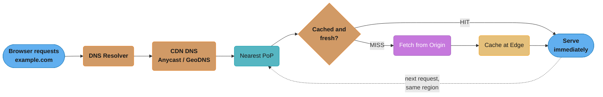

*DNS resolves to the nearest PoP once; every request after that loops back through the same PoP, and only the hit/miss decision determines whether origin is ever touched.*

### DNS Resolution Detail

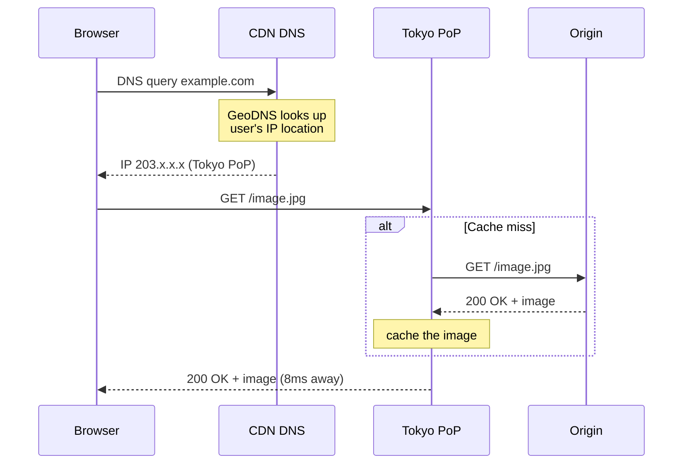

*DNS resolution hands the browser the nearest PoP's IP once; the content fetch is a separate exchange where the edge — not the browser — talks to origin only on a cache miss.*

---

## CDN Architecture

### Components

**Origin Server**
The authoritative source of content. This is your web server or object storage (S3, GCS). CDN fetches content from origin on cache misses. The origin should only receive a small fraction of total traffic in a well-configured CDN setup.

**Edge Servers / PoPs (Points of Presence)**
Physical servers in data centers distributed globally. Each PoP typically has:
- Multiple servers for redundancy
- Local SSD/NVMe cache storage (terabytes)
- High-bandwidth network connectivity
- BGP peering with local ISPs

**CDN Control Plane**
- Configuration management (cache rules, routing policies, SSL certificates)
- Cache purge/invalidation API
- Analytics and reporting pipeline
- Health monitoring of PoPs

### ASCII Architecture Diagram

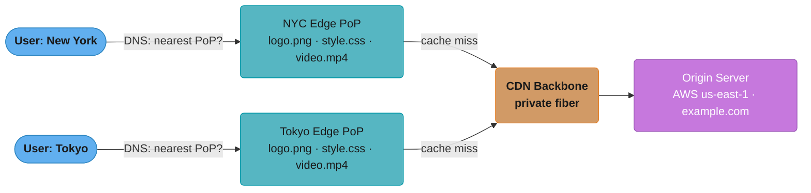

*Two regional users hit two different edge PoPs; both fall back to the same backbone and origin only on a cache miss. Major CDNs run roughly 200-300 such PoPs — e.g. Americas: New York, Los Angeles, São Paulo, Toronto; Europe: London, Frankfurt, Amsterdam, Paris; Asia: Tokyo, Singapore, Mumbai, Sydney (Cloudflare/Akamai scale).*

---

## Content Delivery Models

### Push CDN

In the Push model, the content publisher (you) proactively pushes content to CDN edge servers before any user requests it. Content lives on CDN storage until you delete or update it.

#### How It Works
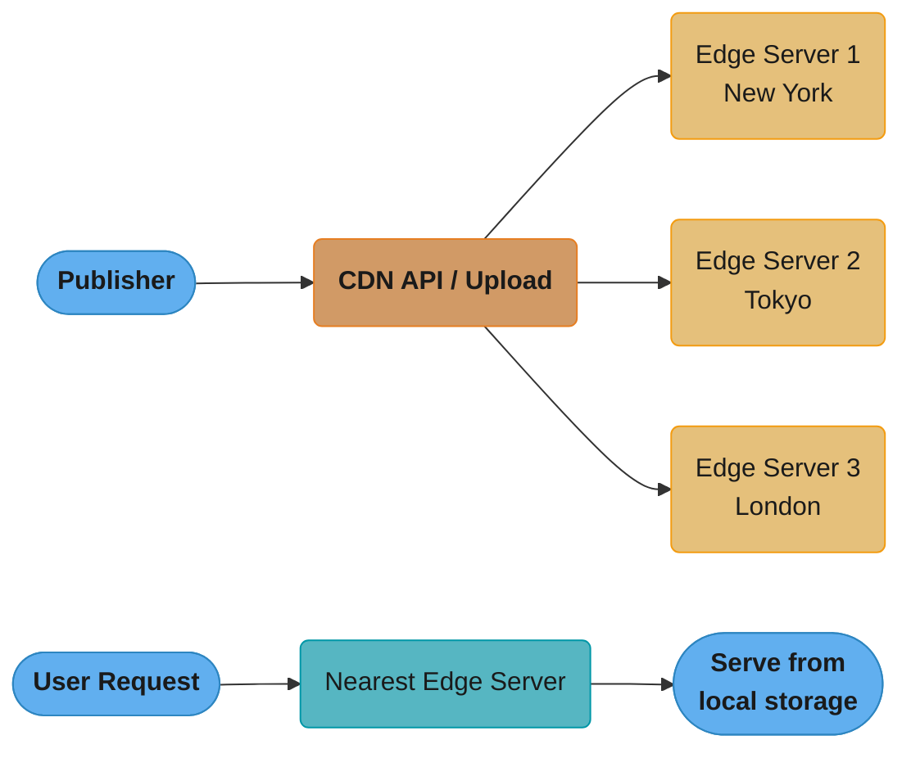

*Content is pushed to every PoP before any user asks for it — all PoPs are pre-populated, so the request path never needs an origin fetch.*

#### When to Use
- Large static files: software installers, game patches, video files
- Content that is known in advance (pre-generated reports, batch-uploaded media)
- Cases where cache-miss latency is unacceptable (first user in a region)
- Low-traffic sites where pull CDN cache might be cold

#### Tradeoffs
| Pros | Cons |
|------|------|
| Zero cache-miss latency — content always ready | Storage cost on CDN (you pay for space) |
| Predictable performance | Must manage content lifecycle (push updates, delete old) |
| Works for low-popularity content | Complexity: need to push to all PoPs |
| Good for time-sensitive releases | Over-provisioning if content is rarely accessed |

---

### Pull CDN

In the Pull model, the CDN fetches content from the origin on the first request (cache miss) and caches it at the edge. Subsequent requests in that region are served from cache. Content expires based on TTL and is re-fetched from origin on the next request after expiry.

#### How It Works
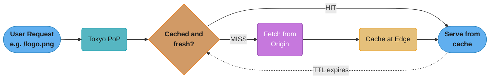

*The first request in a region always misses and populates the cache; every request after that hits until TTL expiry restarts the cycle with a fresh miss.*

#### When to Use
- Websites with large catalogs (millions of URLs) where pre-push is impractical
- Content with unpredictable popularity (you don't know what will be requested)
- Dynamic-ish content that changes but not too frequently

#### Tradeoffs
| Pros | Cons |
|------|------|
| No upfront storage cost on CDN | First request to each PoP has cache-miss latency |
| Automatic: CDN handles caching | Cold cache after TTL expiry |
| Works for large content catalogs | Popular content for first users in a region is slow |
| Simple to set up | Origin must handle cache-miss traffic |

Choosing between the two comes down to a couple of concrete questions:

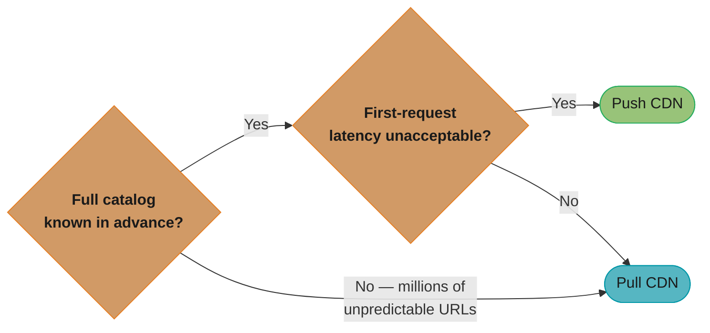

*Push wins only when both conditions hold — a known catalog and zero tolerance for a cold first request (game patches, video releases); everything else defaults to Pull, which is why most CDN traffic is Pull-based.*

---

## Caching at CDN

### TTL and Cache-Control Headers

CDN caching behavior is controlled by HTTP headers sent from the origin server.

```http
# Cache for 1 year (immutable static assets with content-hashed filenames)
Cache-Control: public, max-age=31536000, immutable

# Cache for 10 minutes, serve stale for 1 day while revalidating
Cache-Control: public, max-age=600, stale-while-revalidate=86400

# CDN caches for 1 hour, browser caches for 5 minutes
Cache-Control: public, s-maxage=3600, max-age=300

# Do not cache (private user data)
Cache-Control: private, no-store

# Surrogate-Control (CDN-specific, stripped before sending to browser)
Surrogate-Control: max-age=86400
```

**What it means.** "`max-age` is how long the edge may serve a copy without asking anyone; `stale-while-revalidate` is how much longer it may serve that same copy *while* asking, so the user never waits for the refresh."

Splitting the two is what makes long freshness windows safe. Without `stale-while-revalidate`, the first request after expiry pays the full origin round-trip; with it, that unlucky request is served instantly from the stale copy and the refetch happens in the background.

| Symbol | What it is |
|--------|------------|
| `max-age` | Seconds the object is *fresh*. Served with no origin contact |
| `s-maxage` | Same, but for shared caches (the CDN) — overrides `max-age` at the edge |
| `stale-while-revalidate` | Extra seconds a *stale* copy may be served during a background refetch |
| `immutable` | Promise the bytes will never change; suppresses revalidation entirely |
| origin fetches/day | `86400 / max-age` per cached object — the direct cost of a short TTL |

**Walk one example.** Each header line above, priced as origin fetches per object per day:

```
  header                                    max-age    86400/max-age
  ---------------------------------------   --------   -------------
  max-age=31536000, immutable                1 year      0.0027 /day  (~1 per year)
  s-maxage=3600 (CDN tier)                   1 hour        24   /day
  max-age=600, stale-while-revalidate=86400  10 min       144   /day
  private, no-store                          n/a         every request

  The SWR line in detail:
    fresh window        =   600 s  -> served instantly, no origin contact
    stale-serve window  = 86400 s  -> served instantly, origin refetched in background
    total no-wait window= 87000 s  -> ~24.2 h before any user can block on origin
```

The 10-minute TTL costs 144 origin fetches a day per object, but with a 24-hour stale window not one of those 144 users waits for it. Cut the stale window to zero and 144 users a day eat the full miss latency instead.

### ETag and Conditional Requests

ETags allow efficient cache revalidation without re-downloading unchanged content:

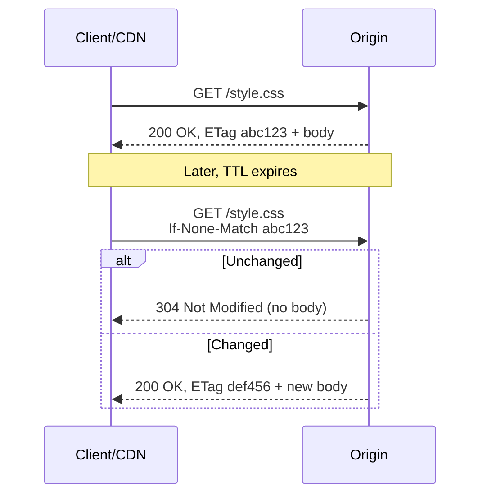

*Revalidation with `If-None-Match` lets the CDN confirm freshness with a tiny 304 instead of re-downloading unchanged bytes.*

### Cache Invalidation / Purging

When content changes before TTL expires, you need to purge the CDN cache:

**Purge by URL**
```bash
# Cloudflare API example
curl -X POST "https://api.cloudflare.com/client/v4/zones/{zone_id}/purge_cache" \
  -H "Authorization: Bearer {token}" \
  -d '{"files": ["https://example.com/style.css"]}'
```

**Purge by Tag (Cache Tags / Surrogate Keys)**
```http
# Origin response includes:
Cache-Tag: product-123, category-electronics, homepage

# Later, when product 123 updates:
# Purge everything tagged "product-123" across all PoPs
```

**Versioned URLs (Best Practice)**
Instead of purging, use content-hashed filenames:
```
style.abc123.css  (version 1)
style.def456.css  (version 2, after changes)
```
The old file stays cached forever, new deployments use new filenames. No purge needed.

### Cache Key Design

CDN cache keys default to the full URL. You can customize:


*A cache key is built by transforming the full URL — e.g. `https://example.com/api/products?sort=asc&page=2` — through normalization, `Vary` headers, and tracking-param stripping before it becomes the effective key CDN nodes hash on.*

---

## Geographic Routing

### Anycast Routing

Anycast assigns the same IP address to multiple servers in different locations. The internet's BGP routing protocol automatically routes traffic to the "nearest" (fewest BGP hops) server with that IP.

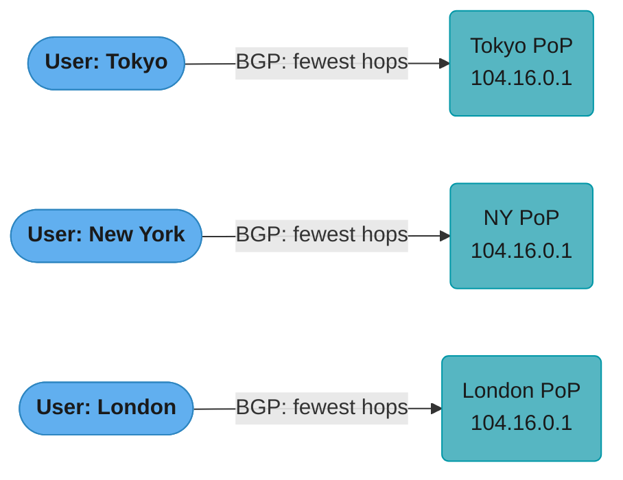

*Every PoP announces the same Anycast IP; BGP alone — with no DNS lookup involved — routes each user to whichever announcement is fewest hops away, giving different physical servers based on network proximity.*

Cloudflare uses Anycast for all traffic. Benefits: automatic failover (if a PoP goes down, BGP re-routes), DDoS absorption (attack traffic distributed across all PoPs).

### GeoDNS

DNS-based routing returns different IP addresses (or CNAME targets) based on the resolver's geographic location.

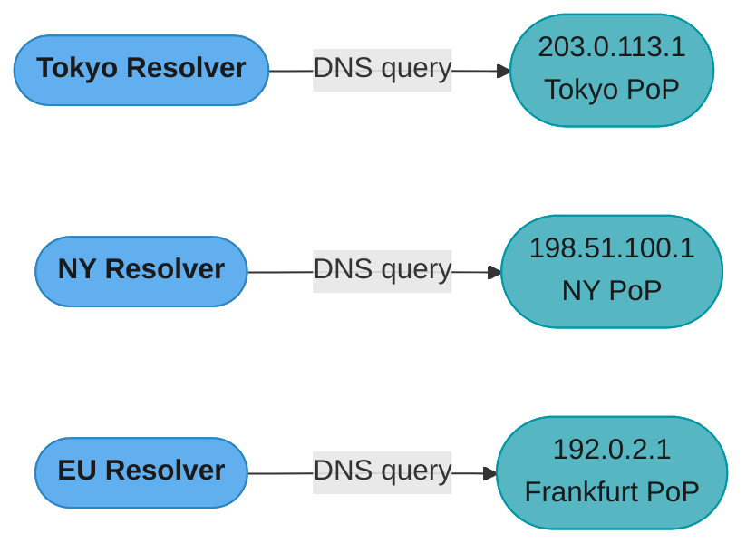

Limitation: DNS TTL means routing changes take time to propagate. Also, DNS resolver location may not match user location (e.g., 1.1.1.1 resolves from Cloudflare's location, not the user's ISP).

### Latency-Based Routing

More sophisticated than GeoDNS — CDN continuously measures round-trip latency from each PoP to major internet prefixes and routes each user to the PoP with the lowest measured latency, not just geographic proximity.

---

## CDN for Dynamic Content

Static content (images, CSS, JS) is the classic CDN use case. But modern CDNs also accelerate dynamic content.

### Edge Computing

Run code at CDN edge nodes, enabling dynamic content generation without a round trip to origin.

**Cloudflare Workers**
```javascript
// Runs at every Cloudflare PoP worldwide
addEventListener('fetch', event => {
  event.respondWith(handleRequest(event.request))
})

async function handleRequest(request) {
  // Personalize at the edge without hitting origin
  const userCountry = request.headers.get('CF-IPCountry')
  const cachedResponse = await caches.default.match(request)

  if (cachedResponse) return cachedResponse

  const response = await fetch(request)
  // Cache for 60 seconds at the edge
  const newResponse = new Response(response.body, response)
  newResponse.headers.set('Cache-Control', 'public, max-age=60')

  event.waitUntil(caches.default.put(request, newResponse.clone()))
  return newResponse
}
```

**AWS Lambda@Edge**
- Functions run at CloudFront edge nodes
- Can modify request/response headers, redirect, A/B test, authenticate
- Latency: ~1ms overhead vs. origin round trip

### Dynamic Caching Strategies

**Micro-caching**: Cache even dynamic content for 1-5 seconds. A page generating 10,000 req/s with 1s micro-caching only hits origin once per second — 9,999x reduction in origin load, with at most 1 second of staleness.

**Fragment Caching (ESI — Edge Side Includes)**
```html
<!-- Serve cached page with dynamic fragment -->
<html>
  <body>
    <esi:include src="/user/header" /> <!-- Dynamic, not cached -->
    <esi:include src="/content/article/123" ttl="300" /> <!-- Cached 5min -->
    <esi:include src="/footer" ttl="3600" /> <!-- Cached 1hr -->
  </body>
</html>
```

### Personalization Challenges

Personalized content (user-specific pages) is the hardest to cache:

- **User-specific content**: Cannot be cached in shared edge cache. Use client-side rendering or inject personalization via JavaScript after serving a cached skeleton.
- **Cookie-based variants**: CDN can create separate cache entries per cookie value, but this fragments the cache badly.
- **Cache by user segment**: Instead of per-user, cache per "segment" (logged-in vs. anonymous, country, language).

The right strategy depends on how many distinct response variants actually exist:

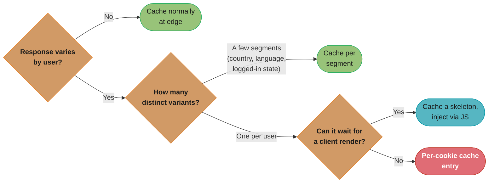

*Per-cookie caching is the last resort because it fragments the shared cache the most — push as much traffic as possible up into the shared or per-segment branches before falling back to it.*

---

## Security

### DDoS Protection at Edge

CDN edge servers absorb volumetric DDoS attacks by:
- Having far more bandwidth capacity than any single origin (Cloudflare: 197 Tbps aggregate)
- Distributing attack traffic across all PoPs (Anycast)
- Applying rate limiting at edge before traffic reaches origin
- IP reputation filtering

### SSL/TLS Termination

CDN terminates SSL at the edge server, establishing a separate connection to origin:


*TLS terminates twice: once at the nearby edge (low latency for the user), and — separately — between edge and origin, which can even be plain HTTP over a private network.*

Benefits:
- TLS handshake with nearby edge (low latency)
- CDN handles certificate renewal (via Let's Encrypt or custom)
- OCSP stapling, TLS 1.3, HTTP/2 negotiated at edge
- Origin can use simpler HTTP internally (if private network)

### WAF (Web Application Firewall)

CDN-level WAF inspects HTTP requests at edge, blocking:
- SQL injection attempts
- XSS payloads
- OWASP Top 10 attacks
- Bad bots (using bot fingerprinting)
- Geographic restrictions (block requests from specific countries)

WAF rules can be: Managed (maintained by CDN vendor), Custom (your own rules), or Rate-based (block IPs with anomalous patterns).

### Signed URLs and Tokens

For private content (paid videos, user documents), restrict access using:

**Signed URLs**
```
# AWS CloudFront signed URL
https://cdn.example.com/video.mp4
  ?Expires=1700010000
  &Signature=AbCdEfGh...
  &Key-Pair-Id=APKAEXAMPLE

# URL is valid only until Expires timestamp
# Signature verifies it was generated by your private key
# Only share URL with the authorized user
```

**Signed Cookies**
For multiple files (e.g., entire video course), set a signed cookie once and all subsequent CDN requests are automatically authorized.

**Token Auth / JWT at Edge**
```javascript
// Cloudflare Worker validates JWT before serving content
async function handleRequest(request) {
  const token = request.headers.get('Authorization')?.split(' ')[1]
  if (!token || !await verifyJWT(token)) {
    return new Response('Unauthorized', { status: 401 })
  }
  return fetch(request)  // forward to origin/cache
}
```

---

## Real-World Examples

### Netflix: Open Connect

Netflix built its own CDN called Open Connect rather than using commercial CDN providers.

- **ISP Partnerships**: Netflix places Open Connect Appliances (OCAs) — custom servers with large NVMe storage — directly inside ISP data centers and internet exchange points
- **Pre-positioning**: Netflix pre-populates popular content during off-peak hours (2-5 AM) so it's ready before users request it
- **Scale**: Open Connect delivers 99%+ of Netflix traffic; at peak, ~700 Gbps per major ISP
- **Why custom?**: Cost at Netflix's scale makes commercial CDN prohibitively expensive; also enables unique optimizations

### Cloudflare vs. AWS CloudFront vs. Akamai

| Feature | Cloudflare | AWS CloudFront | Akamai |
|---------|-----------|----------------|--------|
| PoPs | ~300 cities | ~450 PoPs | ~4,000 PoPs |
| Model | Anycast | GeoDNS-based | GeoDNS-based |
| Edge compute | Workers (V8 isolates) | Lambda@Edge | EdgeWorkers |
| DDoS protection | Best-in-class, free | Separate Shield service | Enterprise tier |
| Pricing | Usage-based + plans | Per-GB + request fees | Enterprise contracts |
| Origin shield | Yes | Origin Shield (extra cost) | Yes |
| Best for | All-in-one, SMB to enterprise | AWS ecosystem integration | Large enterprises, media |

### YouTube: Adaptive Bitrate + CDN

YouTube combines CDN with Adaptive Bitrate Streaming (ABR):
- Videos encoded at multiple quality levels (144p to 4K)
- Player monitors download speed and switches quality in real-time
- CDN caches each quality version separately
- Google's own CDN infrastructure (Google Global Cache) — placed in ISPs
- QUIC protocol (HTTP/3) reduces latency for video streaming

### GitHub: Asset CDN

- Static assets (images, JS bundles) served via Fastly CDN
- Pull CDN model with long TTLs for versioned assets
- Edge caching for GitHub Pages sites
- GitHubs's git protocol traffic goes directly to origin (not cached)

---

## CDN Metrics

### Key Metrics to Track

**Cache Hit Ratio (CHR)**

`CHR = (Cache Hits) / (Total Requests) * 100%`

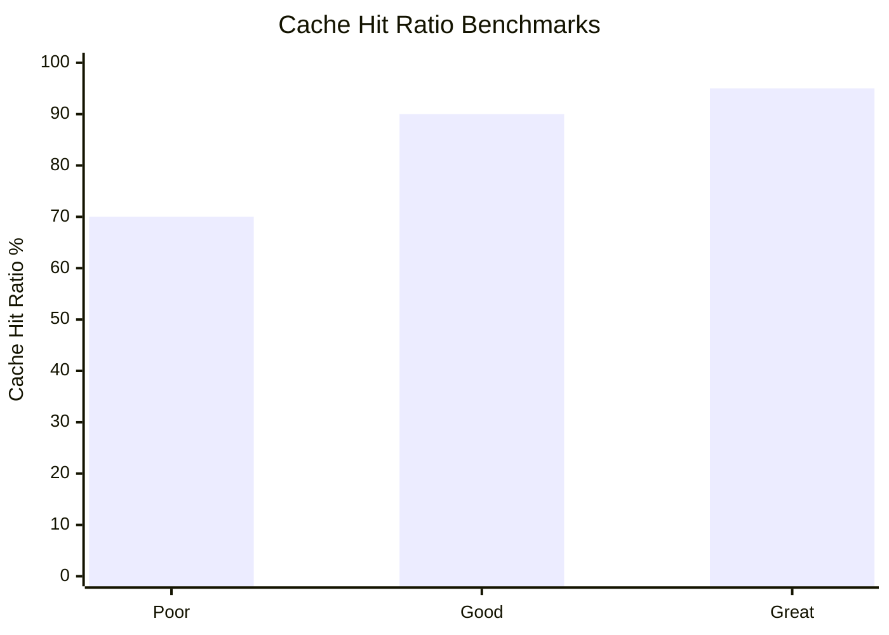

*Below 70% CHR signals a cache-busting or low-TTL misconfiguration worth investigating; 90%+ is healthy and 95%+ is great.*

**Bandwidth Savings**

`Bandwidth Savings = (CDN bandwidth served) / (Total bandwidth) * 100%`

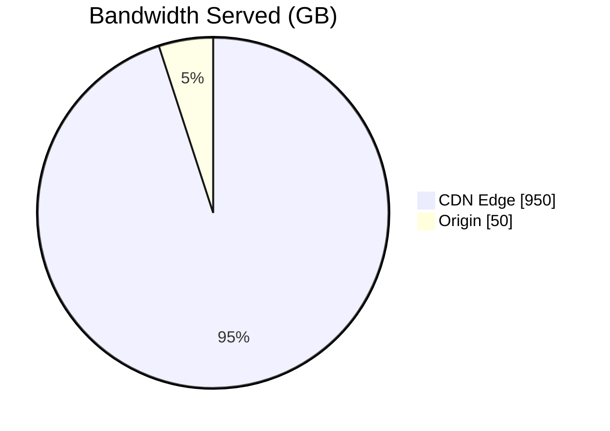

*950 GB of a 1000 GB total is absorbed by the edge, leaving only 50 GB to ever leave the origin — a 95% bandwidth savings.*

**Origin Offload Percentage**

`Origin Offload = 1 - (Origin requests / Total CDN requests)`

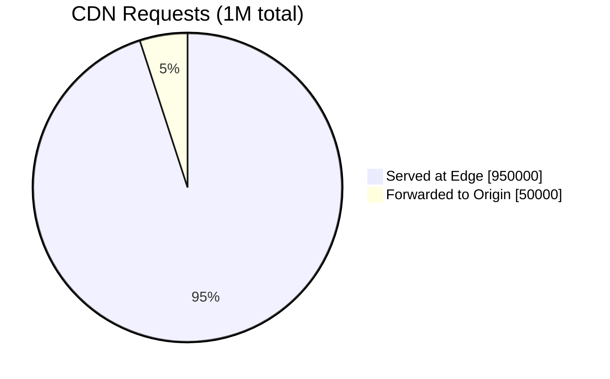

*Only 50,000 of 1,000,000 requests ever reach origin — a 95% origin offload.*

**Read it like this.** "Origin offload is just the cache hit ratio wearing a different name — one counts what the edge served, the other counts what the origin was spared, and they are the same number seen from opposite ends."

Keeping both metrics is still worth it, because they are denominated differently in practice: CHR is usually reported in *requests*, bandwidth savings in *bytes*. They diverge whenever cacheable objects are systematically smaller or larger than uncacheable ones, and that divergence is the signal worth watching.

| Symbol | What it is |
|--------|------------|
| `Total Requests` | Everything arriving at the CDN — `1,000,000` in the pie above |
| `Cache Hits` | Requests served from edge storage — `950,000` |
| `Origin requests` | Requests forwarded upstream — `50,000` |
| `CHR` | `Hits / Total` — the request-counted view |
| `Origin Offload` | `1 - Origin/Total` — the same ratio, origin-counted |
| bytes served | `requests x average object size` — how a request ratio becomes a GB ratio |

**Walk one example.** Both formulas over the same million requests, then converted to bytes:

```
  CHR            =  950,000 / 1,000,000            = 95.0%
  Origin Offload =  1 - (50,000 / 1,000,000)       = 95.0%      identical

  Convert requests to bandwidth, at 1 MB average object:
    edge bytes   =   950,000 x 1 MB  =  950 GB
    origin bytes =    50,000 x 1 MB  =   50 GB
    total                             = 1000 GB
    Bandwidth Savings = 950 / 1000    = 95.0%      matches the pie above

  Now suppose misses skew large -- 4 MB average, hits still 1 MB:
    edge bytes   =   950,000 x 1 MB  =  950 GB
    origin bytes =    50,000 x 4 MB  =  200 GB
    Bandwidth Savings = 950 / 1150   = 82.6%   <- CHR still says 95%
```

That last row is the alarm to know: a 95% CHR sitting next to an 83% bandwidth saving means your misses are the heavy objects. The request metric looks healthy while the egress bill does not.

**Latency by Region**
- Time To First Byte (TTFB) for cached vs. uncached requests
- P50, P95, P99 latency per geographic region
- Cache miss latency (includes origin round-trip)

**Error Rate**
- 5xx errors originating from CDN vs. origin
- Cache poisoning attempts

**Edge Hit vs. Origin Hit Ratio**
- Segment by content type, URL pattern, and geography

---

## Interview Questions

**Q1: What is the difference between a CDN and a regular cache?**

A: A regular cache (like Redis or Varnish) is typically a single centralized server. A CDN is a geographically distributed network of caches. CDN reduces latency by serving content from the edge nearest to the user, whereas a single cache still requires crossing the network to the data center. CDNs also provide redundancy, DDoS protection, and edge computing capabilities.

**Q2: What is the difference between Push CDN and Pull CDN? When would you use each?**

A: Push CDN requires you to proactively upload content to CDN storage; Pull CDN fetches from origin on first request and caches it. Use Push for large static files you know will be requested (game updates, video releases), where first-request performance matters. Use Pull for large content catalogs with unpredictable access patterns, where pre-uploading everything is impractical.

**Q3: How does a CDN handle cache invalidation?**

A: Three main approaches: (1) Wait for TTL expiry — simplest but content can be stale until TTL runs out. (2) API-based purge — call the CDN's purge API to immediately evict specific URLs or cache tags from all PoPs. (3) URL versioning — use content-hashed filenames so new versions have new URLs; old versions expire naturally. URL versioning is the most reliable approach for static assets.

**Q4: How does Anycast routing work in CDN?**

A: Anycast assigns the same IP address to servers in multiple locations. Each CDN PoP announces this IP via BGP. The internet's routing protocol automatically routes packets to the "nearest" BGP node (fewest hops). Users in different regions naturally route to their nearest PoP without DNS lookup. This also provides automatic failover — if a PoP goes down, BGP reconverges and traffic flows to the next nearest PoP.

**Q5: How would you design a CDN architecture for a live streaming platform?**

A: For live streaming: (1) Origin ingest server receives the stream and transcodes it into multiple bitrates. (2) Stream is segmented into small chunks (HLS: .m3u8 manifest + .ts segments, typically 2-6 second chunks). (3) CDN pulls and caches segments with very short TTL (equal to segment duration). (4) Edge caching is shallow — only cache the last N segments since historical segments still get hit. (5) Use CDN with support for chunked streaming to minimize manifest cache lag. (6) Pre-warm edge caches before scheduled events.

**Q6: What is "cache stampede" and how do CDN handle it?**

A: Cache stampede (thundering herd) occurs when a popular cached item expires and thousands of requests simultaneously miss the cache and all race to fetch from origin. CDN solutions: (1) Probabilistic early expiration — each request has a small chance of refreshing before TTL expires, spreading revalidation. (2) Request coalescing — when multiple simultaneous misses occur for the same URL, CDN makes only one request to origin and serves the response to all waiting clients. (3) Stale-while-revalidate — serve stale content immediately while one background request refreshes the cache.

**Q7: How does CDN improve TTFB (Time To First Byte)?**

A: CDN improves TTFB by: (1) Serving from a geographically close PoP — reducing propagation delay from ~150ms transoceanic to <10ms local. (2) TLS termination at the edge — eliminates TLS handshake latency over the WAN. (3) HTTP/2 and HTTP/3 (QUIC) support at edge — multiplexing, 0-RTT resumption. (4) Pre-positioned content — no origin processing delay on cache hits. (5) Persistent connections from edge to origin — avoids TCP handshake overhead for cache misses.

**Q8: What are the tradeoffs of using a CDN for API responses?**

A: Pros: drastically reduces origin load, improves response time for cacheable API responses (search results, product catalogs), natural DDoS protection. Cons: stale data risk if TTL is too long, cache invalidation is complex for mutable resources, user-specific responses cannot be cached in shared edge cache, debugging is harder (need to distinguish CDN vs. origin responses), adds cost per request/GB. Best practice: use CDN for read-heavy, public, cacheable endpoints; bypass CDN for user-specific or write APIs.

**Q9: How would you handle cache poisoning attacks in a CDN?**

A: Cache poisoning occurs when an attacker causes the CDN to cache a malicious response that gets served to all users. Mitigations: (1) Normalize cache keys — strip or normalize query parameters, headers that shouldn't affect cache. (2) Validate responses before caching — don't cache 5xx responses. (3) Use Vary headers correctly — ensure `Vary: Accept-Encoding` doesn't allow different-encoding responses to poison each other. (4) Disable caching for sensitive endpoints. (5) WAF rules to detect and block injection attempts. (6) CDN-level origin verification — only allow known origin IPs.

**Q10: Explain the concept of "Origin Shield" in CDN.**

A: Origin Shield adds an additional caching layer between CDN edge nodes and the origin. Without it, each of 300+ PoPs might independently request a cache miss from origin, creating a large fan-out. With Origin Shield, all PoP cache misses are routed through a single designated shield node, which is the only one that contacts origin. This dramatically reduces origin traffic (especially for low-traffic content) at the cost of slightly higher latency for shield-miss requests. AWS CloudFront calls this "Origin Shield"; Cloudflare calls it "Argo Tiered Caching."

**Q11: How do CDNs support HTTPS and certificate management?**

A: CDN terminates TLS at the edge. Modern CDNs handle: (1) Automatic certificate provisioning via Let's Encrypt (ACME protocol). (2) Certificate renewal before expiry. (3) SNI (Server Name Indication) for hosting multiple domains on shared IP. (4) HSTS preloading, OCSP stapling. (5) Custom certificate upload for Enterprise customers. The connection from CDN edge to origin can be HTTP (if on private network) or HTTPS (end-to-end encryption).

**Q12: What is "stale-while-revalidate" and why is it valuable?**

A: `stale-while-revalidate` is a Cache-Control directive: `Cache-Control: max-age=60, stale-while-revalidate=300`. It means: serve the cached version immediately (even if up to 5 minutes stale) while asynchronously fetching a fresh copy in the background. This eliminates cache-miss latency from the user's perspective — they always get an instant response. The background revalidation updates the cache for the next request. Ideal for content that changes infrequently and where slight staleness is acceptable.

**Q13: What is the difference between `max-age` and `s-maxage` in a `Cache-Control` header?**

A: `max-age` applies to every cache in the chain, including the browser, while `s-maxage` applies only to shared caches like the CDN and is ignored by browsers. A header like `Cache-Control: s-maxage=86400, max-age=3600` lets the CDN hold an object for 24 hours while the browser only trusts it for 1 hour, so you can push an update via a CDN purge without waiting for millions of individual browser caches to expire. This split matters most for content that changes occasionally but should still be cached aggressively at the edge — pair it with `stale-while-revalidate` from the "Caching at CDN" section for a complete freshness policy. When no `s-maxage` is present, the CDN falls back to `max-age`, so omitting it is not an error, just a missed optimization.

**Q14: How do you cache dynamic content that changes every second without hammering the origin on every request?**

A: Use micro-caching — cache the dynamic response at the edge for just 1-5 seconds instead of not caching it at all. The "Dynamic Caching Strategies" section gives the concrete payoff: a page generating 10,000 requests/second with a 1-second micro-cache TTL sends only 1 request/second to origin, a 9,999x reduction in origin load, at the cost of at most 1 second of staleness. This works because most "dynamic" pages (news homepages, trending lists, stock summaries) don't actually need per-request freshness — the perceived staleness window is invisible to users but the origin-load reduction is massive. Combine micro-caching with `stale-while-revalidate` so the very first request after expiry is also served instantly while a background fetch refreshes the cache.

**Q15: What went wrong when an engineer ran a blanket "purge everything" to clear one stale CSS file, and how do you prevent it?**

A: A cache-wide purge clears every cached object, not just the one file you intended to invalidate, so a routine CSS fix can accidentally evict your entire image cache along with it. In the media-platform case study's second lessons-learned pitfall, `cf purge --everything` to clear stale CSS also wiped 200TB of cached images; the next hour saw 500k requests/sec hit origin — exceeding the 500k/sec budget the whole architecture was sized around — and end-user p99 latency rose to 4 seconds. The fix was tag-based purging (`cf purge --tag css:v423`), which clears only the ~200MB of objects carrying that surrogate key and leaves unrelated content untouched. Always scope a purge to a cache tag or URL pattern in production, and reserve "purge everything" for a true full-cache emergency, since its blast radius is every cached byte you have.

**Q16: Why would a company run multiple CDN providers simultaneously instead of picking one?**

A: A multi-CDN strategy protects against a single provider's outage and lets you route each region to whichever CDN performs best there. Best Practices item 4 notes that Fastly, Cloudflare, and Akamai have all had major outages — if your entire traffic depends on one vendor, their bad day becomes your outage. Beyond resilience, running multiple providers creates pricing leverage in contract negotiations and lets you compare actual measured latency per region rather than trusting a single vendor's PoP map. The hard part is operational: DNS-based traffic steering (Route 53, NS1) picks the active CDN per request, but cache invalidation must now be synchronized across every provider, multiplying the purge-coordination work.

---

## Cross-Perspective: LLD Connections

**LLD View — Design Patterns That Implement CDN**

- **Proxy** — A CDN edge node is a caching Proxy: clients request content from the edge; the edge serves from cache on a hit, or delegates to the origin on a miss and stores the response. Transparent to the client — same URL, different responder.
- **Decorator** — CDN capabilities (Brotli/gzip compression, image optimization, SSL/TLS termination, bot detection) layer as Decorators on top of the base content delivery without modifying origin servers.
- **Strategy** — Cache invalidation strategies (TTL-based expiry, event-driven purge, stale-while-revalidate, surrogate keys) and geographic routing strategies (anycast, latency-based, geolocation-based) are interchangeable Strategy implementations per content type.

---

## Best Practices

### 1. Cache Warm-Up
Before a major launch, traffic spike, or new PoP activation, pre-warm the cache:
- Crawl your most popular URLs to seed the cache
- Use CDN APIs to pre-populate content (Push CDN)
- For video: pre-position files at PoPs serving your target markets before release

### 2. Use Content-Hashed URLs for Static Assets
```
style.a1b2c3.css  (hash of file content)
app.x7y8z9.js
```
Cache these with `max-age=31536000, immutable`. When content changes, the URL changes, so no cache invalidation is ever needed. Old files naturally expire.

### 3. Monitoring and Alerting
Track these dashboards:
- Cache hit ratio by URL pattern and region (alert if CHR drops below threshold)
- Origin error rate (CDN should mask origin errors with stale content)
- Edge latency P99 by region (detect PoP performance degradation)
- Bandwidth cost trends (unusual spikes may indicate abuse or misconfiguration)

### 4. Multi-CDN Strategy
Using multiple CDN providers provides:
- Resilience against CDN outages (Fastly, Cloudflare, and Akamai have all had major outages)
- Ability to route to the best-performing CDN per region
- Negotiating leverage on pricing

Implementation: use DNS-based traffic routing (Route 53, NS1) to distribute between CDNs. Keep the same content on all CDNs (synchronized invalidation is the hard part).

### 5. Set Appropriate Cache-Control Headers
- Immutable versioned assets: `max-age=31536000, immutable`
- Frequently updated pages: `max-age=60, stale-while-revalidate=3600`
- User-specific content: `Cache-Control: private, no-store`
- API responses: `max-age=10, stale-while-revalidate=60` (short TTL, graceful fallback)

### 6. Bypass CDN for Non-Cacheable Requests
Configure CDN to pass through:
- Requests with authentication headers (Authorization, Cookie with session tokens)
- POST/PUT/DELETE requests
- Real-time data endpoints
- WebSocket connections (or configure CDN to support WebSockets)

### 7. Test Cache Behavior
Always verify:
- Cache-Control headers are set correctly on origin responses
- CDN respects your headers (some CDNs override TTLs)
- Cache keys are correct (ensure no over/under-caching)
- Purge operations work as expected
- Edge compute functions behave correctly in all PoP environments

### 8. Use Cache Tags for Targeted Invalidation
Tag related content (all pages using a specific product image, all pages in a category) with surrogate keys. When content changes, purge by tag rather than URL-by-URL.

---

**Cross-references:** [devops/cloud_networking_and_cdn](../../devops/cloud_networking_and_cdn/) (CloudFront/Fastly configuration, origin shield, Anycast routing).

---

## Case Study: Cloudflare CDN for an Image-Heavy Media Platform

### Problem Statement

A photo-sharing platform (Unsplash-like) delivers images globally with on-the-fly transformations.

- **Traffic:** 10M req/sec peak (87 billion req/day) for image assets
- **Catalog:** 8B images, 300TB total origin storage
- **Transformations:** WEBP/AVIF conversion, dynamic resize (50+ size variants per image), EXIF stripping, watermarking
- **Latency SLA:** p99 < 100ms globally, p50 < 30ms in-region
- **Cache hit-rate target:** > 95% (origin bandwidth budget is 500k req/sec max)
- **Origin egress cost:** $0.09/GB vs CDN egress $0.02/GB — a 95% hit rate saves $14M/year
- **PoPs:** Cloudflare's 310+ edge locations
- **Cert coverage:** 1.4M customer subdomains (white-label sites pointing CNAMEs at us)

### Architecture Overview

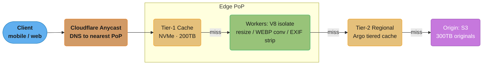

*Each hop fires only on a miss: 96.2% of requests are satisfied at Tier-1, and the Tier-2 regional shield absorbs most of the rest, so only a trickle of the 500k req/sec budget ever reaches the S3 origin.*

### Key Design Decisions

1. **Tiered cache (edge -> regional -> origin).** 310 edge PoPs cache locally; regional Argo tier consolidates misses, multiplexing 1000 edge misses into 1 origin fetch for the same asset. *Alternative rejected:* flat edge-only — cold edges hammer origin in parallel; tiered cache reduces origin requests by 60%.

2. **Cloudflare Workers for on-the-fly image transformation.** Resize/format conversion runs at the edge in a V8 isolate (~5ms cold start, ~50ms transform). *Alternative rejected:* pre-generate all variants at upload — 50 variants x 8B images = 400B objects, 15PB storage, infeasible.

3. **Content-addressed URLs with `immutable` Cache-Control.** Asset URL contains sha256 of bytes (`/img/<hash>/800x600.webp`). Once cached, never invalidated; new versions get a new URL. Header: `Cache-Control: public, max-age=31536000, immutable`. *Alternative rejected:* mutable URLs — cache invalidation storms on every reupload.

4. **Stale-while-revalidate for dynamic thumbnails.** `Cache-Control: max-age=3600, stale-while-revalidate=86400` lets edge serve stale for 24h while refreshing in background. *Alternative rejected:* synchronous refresh — adds origin latency to every read after TTL expiry.

5. **Normalized cache keys.** Cache key built from `host + path + Accept-format + Width-DPR` only, ignoring tracking query params (`utm_*`, `_t`, `fbclid`). *Alternative rejected:* full URL — every UTM-tagged share creates a new cache entry, fragmenting the cache.

6. **Surrogate-key based purge (`Cache-Tag` header).** Each cached object tagged with `product:123, category:shoes, user:42`. Purge by tag instead of URL. *Alternative rejected:* URL-list purge — purging 200k URLs after a deploy takes 40 minutes; tag purge is < 5 seconds.

7. **Wildcard cert + pre-provisioned ACM for white-label domains.** Wildcard `*.imgcdn.example` covers most paths; bespoke customer domains get cert pre-provisioned via Cloudflare for SaaS (issuance < 60s). *Alternative rejected:* per-domain cert at first request — 30-minute propagation delay caused HTTPS failures.

### Implementation

Cloudflare Worker for image transformation:

```javascript
addEventListener("fetch", (event) => event.respondWith(handle(event.request)));

async function handle(request) {
  const url = new URL(request.url);
  const width = parseInt(url.searchParams.get("w")) || 800;
  const accepts = request.headers.get("Accept") || "";
  const format = accepts.includes("image/avif") ? "avif"
               : accepts.includes("image/webp") ? "webp"
               : "jpeg";

  // Normalized cache key (strip tracking params)
  const cacheUrl = new URL(`${url.origin}${url.pathname}?w=${width}&fmt=${format}`);
  const cacheKey = new Request(cacheUrl.toString(), request);
  const cache = caches.default;

  let response = await cache.match(cacheKey);
  if (response) return response;

  // Fetch original from tier-2 / origin
  const original = await fetch(`https://origin.example/${url.pathname}`, {
    cf: { cacheTtl: 86400, cacheEverything: true }
  });

  // Transform via Cloudflare Images binding
  const transformed = await fetch(original.url, {
    cf: {
      image: { width, format, metadata: "none" }   // strip EXIF
    }
  });

  response = new Response(transformed.body, transformed);
  response.headers.set("Cache-Control", "public, max-age=31536000, immutable");
  response.headers.set("Cache-Tag", `img:${url.pathname.split("/")[2]}`);
  event.waitUntil(cache.put(cacheKey, response.clone()));
  return response;
}
```

Cache-Control strategy by asset class:

```nginx
# Content-addressed (immutable)
location ~ ^/img/[0-9a-f]{64}/ {
    add_header Cache-Control "public, max-age=31536000, immutable";
}

# Dynamic resize (SWR)
location ~ ^/render/ {
    add_header Cache-Control "public, max-age=3600, stale-while-revalidate=86400";
}

# User-private (no edge cache)
location ~ ^/user/ {
    add_header Cache-Control "private, max-age=60";
}
```

### Tradeoffs

| Strategy                      | Pre-generate all  | On-demand at edge (chosen) | Origin transform |
|-------------------------------|-------------------|----------------------------|------------------|
| Storage cost                  | 15PB ($330k/mo)   | 300TB ($6.6k/mo)           | 300TB            |
| First-byte latency (cold)     | 30ms              | 80ms (transform)           | 200ms (transit)  |
| First-byte latency (warm)     | 25ms              | 25ms                       | 200ms            |
| Adding a new variant          | Re-process 8B img | Free (next request)        | Free             |
| Origin bandwidth              | 0 (all cached)    | 5% miss rate               | 100%             |
| Compute cost                  | Big upfront batch | Per-request ($0.0001/req)  | Centralized      |

**The idea behind it.** "Pre-generating variants multiplies your object count by the number of variants, and storage cost is linear in bytes — so 50 sizes of every image is a 50x storage bill you pay forever for variants most users never request."

The transform-at-edge alternative inverts the tradeoff: you pay compute per request instead of storage per variant. That only wins because variant demand is long-tailed — a handful of sizes serve almost all traffic, and paying to store the other 45 is pure waste.

| Symbol | What it is |
|--------|------------|
| catalog size | `8B` original images, `300TB` on S3 |
| variants | `50+` size/format combinations per image |
| object count | `catalog x variants` — what pre-generation actually creates |
| storage cost | `bytes x $/GB-month`; S3 Standard is about `$0.023/GB-month` |
| avg variant size | `total bytes / object count` — the number that makes 15PB plausible |

**Walk one example.** Decision 2's rejected alternative, priced out:

```
  objects to pre-generate
    50 variants x 8,000,000,000 images        = 400,000,000,000 objects

  implied average variant size
    15 PB / 400B objects = 15e15 / 4e11       = 37.5 KB each   (thumbnail-sized)

  monthly storage bill at $0.023/GB-month
    pre-generate :  15 PB  = 15,000,000 GB x 0.023 = $345,000/mo  (table: $330k)
    on-demand    : 300 TB  =     300,000 GB x 0.023 = $  6,900/mo  (table: $6.6k)

  ratio  345,000 / 6,900 = 50x     <- exactly the variant count. Not a coincidence.
```

The 50x storage ratio is the variant multiplier showing through unchanged, because storage is perfectly linear in bytes. The chosen design converts that permanent 50x into a per-request `$0.0001` compute charge that is only incurred for variants someone actually asks for.

### Metrics & Results

- **Cache hit rate:** 96.2% (edge), 99.1% (combined edge+tier-2)
- **Origin RPS:** 380k/sec sustained (within 500k budget)
- **p50 / p99 latency:** 22ms / 85ms globally (TLS + connect + serve)
- **Transformation latency at edge:** p50 38ms, p99 110ms
- **Bandwidth cost:** $0.021/GB blended (CDN egress + origin egress * miss rate)
- **Monthly cost:** $1.8M (vs estimated $11.4M for origin-only delivery)
- **Cert provisioning:** 99.7% of new white-label domains live in < 90s

**What the formula is telling you.** "Blended egress is the CDN's own per-GB rate plus the origin's rate charged only on the fraction that missed — so the miss rate is a lever on the *unit price* of every gigabyte you ship, not just on origin load."

That is why the tiered cache earns its keep twice. It cuts origin requests, and because the origin byte is 4.5x the price of an edge byte, each point of miss rate removed is worth 4.5x more than the same point of edge traffic.

| Symbol | What it is |
|--------|------------|
| CDN egress | `$0.02/GB` — paid on every gigabyte delivered |
| origin egress | `$0.09/GB` — paid only on the miss fraction, on top of CDN egress |
| miss rate | `1 - hit rate`. `3.8%` at Tier-1 alone, `0.9%` after the Tier-2 shield |
| blended `$/GB` | `CDN egress + origin egress x miss rate` |
| peak RPS | `10M req/sec`; multiply by a miss rate to get forwarded RPS |

**Walk one example.** Both hit rates run through the same two formulas:

```
  request volumes at 10,000,000 req/sec peak
    Tier-1 miss   10,000,000 x (1 - 0.962) = 380,000 req/s  -> forwarded to Tier-2
    reaches S3    10,000,000 x (1 - 0.991) =  90,000 req/s
    budget                                   500,000 req/s   -> 380k fits, 90k trivially

  blended egress cost per GB
    Tier-1 only   0.02 + 0.09 x 0.038 = 0.02342  $/GB
    with Tier-2   0.02 + 0.09 x 0.009 = 0.02081  $/GB   <- matches the $0.021 reported

  what the Tier-2 shield bought
    unit price    0.02342 -> 0.02081  = 11.1% cheaper per GB
    origin RPS    380,000 -> 90,000   = 4.2x less traffic reaching S3
```

The `$0.021` blended figure reconciles only against the 99.1% combined hit rate, which confirms the reading of the two numbers: the `380k/sec` is Tier-1 misses entering the regional shield, and just `90k/sec` of that survives to touch S3.

### Common Pitfalls / Lessons Learned

1. **Cache poisoning via unkeyed `Host` header.** A bug let attackers send a request with a spoofed `Host: evil.com` header; Workers stored the malicious response under the cache key for `imgcdn.example`. Subsequent legitimate users received the poisoned response for 6 hours.
   - *Broken:* `cacheKey = path` (Host ignored in key)
   - *Fix:* `cacheKey = host + path + normalizedQuery` — include Host in key and validate Host against allowlist before processing.

2. **Purge storm wiped 200TB after a routine deploy.** Engineer ran `cf purge --everything` to clear stale CSS; this also evicted all 200TB of image cache. The next hour saw 500k RPS hitting origin, exceeding the 500k budget and triggering origin throttling. End-user p99 latency rose to 4s.
   - *Broken:* `cf purge --everything` for any cache change.
   - *Fix:* `cf purge --tag css:v423` — tag-based purge clears only CSS assets (200MB), leaving images intact. Combined with surrogate-key strategy enforced at deploy time.

3. **HTTPS certificate propagation delay.** Onboarding a new white-label customer (`images.customer.com`) issued a per-domain cert; propagation across 310 PoPs took 30+ minutes. During that window, 12% of edges served HTTPS errors. Customer churn spiked.
   - *Broken:* lazy per-domain cert issuance at first request.
   - *Fix:* wildcard cert `*.imgcdn.example` for default CNAME path; Cloudflare for SaaS pre-provisions per-customer certs via background job; new customers go live in < 90s with valid HTTPS.

### Interview Discussion Points

**Q: Why not use S3 + CloudFront instead of a custom CDN?**
For 90% of CDN workloads, CloudFront is the right choice. We chose Cloudflare specifically for: (1) Workers running V8 isolates (1ms cold start vs Lambda@Edge 100ms), (2) 310 PoPs vs CloudFront's 600+ but with lower egress price, (3) Cloudflare Images native transform API. The decision is workload-specific.

**Q: How do you handle a viral image causing a hot key?**
Cloudflare PoPs already shard the cache by hash within a PoP, so a single hot URL hits multiple cache nodes per PoP. For truly extreme cases (a single image at > 100k RPS in one PoP), Cloudflare's "tiered cache" plus Argo Smart Routing front-loads the response into all PoPs proactively.

**Q: How do you invalidate a single image globally?**
For content-addressed URLs, you don't — you publish a new URL. For mutable URLs, `cf purge --url https://...` propagates to all 310 PoPs within ~30 seconds via Cloudflare's central control plane. For larger invalidations, use surrogate-key purge to clear groups atomically.

**Q: What is `stale-while-revalidate` and when should you use it?**
SWR (RFC 5861) tells the cache to serve stale content immediately while fetching fresh in background. Use for content where staleness is acceptable but availability is critical — product thumbnails, profile avatars. Do NOT use for pricing, security tokens, or personalized content.

**Q: What's the difference between `max-age` and `s-maxage`?**
`max-age` applies to all caches (browser + CDN). `s-maxage` applies only to shared/CDN caches. Use `s-maxage=86400, max-age=3600` to cache aggressively at edge but conservatively at browser, letting you push updates via CDN purge without waiting for browser caches to expire.

**Q: How do you debug a cache miss in production?**
Cloudflare response headers: `cf-cache-status` (HIT/MISS/EXPIRED/DYNAMIC/BYPASS), `age` (seconds since cached), `cf-ray` (request trace ID). Logpush exports per-request logs to S3 for analysis; we run a daily job that buckets misses by `cf-cache-status` reason and alerts when MISS > 6%.

**Q: How does HTTP/3 (QUIC) affect CDN design?**
QUIC eliminates head-of-line blocking and runs over UDP, so a packet loss does not stall the whole connection — critical for mobile networks. It also has 0-RTT resumption (connection setup in 0 round trips for repeat visitors). Cloudflare auto-negotiates HTTP/3; our images load 12% faster on mobile after enabling it.
