# Consensus Algorithms

## 1. Concept Overview

Consensus algorithms enable a cluster of distributed nodes to agree on a single value despite node failures and network partitions. They are the foundation of every distributed system that requires coordination: leader election, distributed locks, replicated state machines, and configuration stores.

When you run `kubectl apply`, elect a Kafka partition leader, acquire a distributed lock in Consul, or commit a row in CockroachDB, a consensus protocol is silently doing the work of making sure every surviving node agrees on the same outcome — and that the outcome, once committed, can never be silently reverted.

| Attribute | Value |
|-----------|-------|
| Category | Distributed Systems — Coordination |
| Related HLD Modules | `../cap_theorem/`, `../message_queues/`, `../database_sharding/` |
| Backend Deep-Dive | `../../backend/kafka_deep_dive/` (Kafka ISR), `../../database/consistency_models_and_consensus/` |
| Key Algorithms | Raft, Multi-Paxos, PBFT, ZAB |
| Production Systems | etcd, ZooKeeper, Consul, CockroachDB, Kafka |

Consensus is fundamentally about *agreement under uncertainty*. A node cannot tell the difference between a peer that has crashed and a peer whose network is slow. Consensus algorithms turn that uncertainty into a precise contract: a value, once committed by a quorum, is permanent — even across leader changes, crashes, and partitions.

---

## 2. Intuition

**One-line analogy:** Consensus is like a jury reaching a unanimous verdict — every juror (node) may have partial information, some may be slow or absent, and you need to agree on one decision that the court accepts, even if a few jurors are replaced mid-trial.

**Mental model:** The fundamental problem — given N nodes that can fail or be slow, how do we make a decision that at least a quorum (majority) agrees on, such that once committed, the decision is never rolled back even if some nodes crash and rejoin? Consensus algorithms formalize the guarantee that committed values are permanent.

**Why it matters:** etcd (Kubernetes config store), ZooKeeper (Kafka controller election), Consul (service discovery), CockroachDB, and Kafka's ISR mechanism all rely on consensus. Without understanding consensus, you cannot reason about split-brain, leader election timeouts, quorum writes, or why distributed databases sacrifice availability during partitions.

**Key insight:** Safety (never returning an incorrect answer) is non-negotiable. Availability under partition is the tradeoff. Raft and Paxos stop accepting writes without a quorum, guaranteeing consistency at the cost of availability. A consensus system would rather refuse to make progress than make a decision two nodes might disagree about.

---

## 3. Core Principles

Consensus is defined by a small set of formal properties — three safety properties (never do the wrong thing) and one liveness property (eventually do something).

**Safety properties (must always hold):**
- **Agreement** — all non-faulty nodes decide the same value. No two correct nodes ever commit different values for the same slot.
- **Validity** — the decided value was actually proposed by some node. The system cannot fabricate a value out of thin air.
- **Integrity** — each node decides at most once. A committed slot is never re-decided to a different value.

**Liveness property (must eventually hold under reasonable conditions):**
- **Termination** — every non-faulty node eventually decides. The system does not hang forever.

**FLP Impossibility (Fischer, Lynch, Paterson, 1985):** In a fully asynchronous system, no deterministic consensus algorithm can guarantee *both* safety and liveness in the presence of even one faulty process. The reason: in an asynchronous system you cannot distinguish a crashed node from a slow one — any timeout could be a false positive. Practical systems circumvent FLP by assuming *partial synchrony* and using timeouts plus randomized leader election (Raft's randomized election timeout breaks symmetry without ever violating safety).

**Quorum — why majority (N/2 + 1)?** A quorum is the minimum number of nodes that must agree before an operation counts as committed. The majority threshold guarantees that *any two quorums overlap by at least one node*. That overlap node carries the committed state forward, so any future quorum (and any new leader formed from one) is guaranteed to know the last committed value. No committed decision can be lost.

```
N=3:  quorum = 2,  tolerates 1 failure
N=5:  quorum = 3,  tolerates 2 failures
N=7:  quorum = 4,  tolerates 3 failures
```

**Term / Epoch numbers:** A monotonically increasing counter, incremented on each leadership change. Any message carrying a *lower* term is from a stale leader and is rejected; any message with a *higher* term forces the receiver to step down. This single mechanism is what prevents two leaders from both committing.

---

## 4. Types / Architectures / Strategies

### 4.1 Paxos (Single-Decree Paxos)

The original consensus algorithm (Leslie Lamport, 1989). Single-decree Paxos agrees on *one* value.

- **Roles:** Proposer (drives consensus), Acceptor (votes), Learner (observes the committed outcome). A single process often plays multiple roles.
- **Phase 1 — Prepare/Promise:** Proposer picks a proposal number `n` and sends `Prepare(n)`. An Acceptor that has not seen a higher number promises to ignore all proposals `< n` and returns the highest value it has already accepted (if any).
- **Phase 2 — Accept/Accepted:** Proposer sends `Accept(n, v)`, where `v` is the highest-numbered value returned in Phase 1 (or its own value if none). An Acceptor accepts unless it has since promised to a higher `n`.
- **Commit:** when a quorum of Acceptors has accepted `(n, v)`, the value is committed.
- **The critical rule:** in Phase 2 the Proposer must propose the highest-numbered value any Acceptor reported in Phase 1 — not its own value — if any was reported. This is what guarantees Agreement: once a value could have been chosen, every later proposal carries it forward.
- **Multi-Paxos optimization:** elect a stable leader; once elected, Phase 1 is skipped for subsequent log entries, so steady-state commit is a single round-trip (Phase 2 only). This is the production form. The proposal number doubles as the leader's epoch.
- **Dueling proposers (livelock):** two proposers can keep pre-empting each other's proposal numbers, each forcing the other to restart Phase 1, so no value is ever chosen — a liveness failure (consistent with FLP). The practical fix is the same as Raft's: elect one stable leader (with randomized backoff) so only one proposer is active.
- **Variants:** Fast Paxos (one round-trip in the no-conflict case, larger quorum), Cheap Paxos (fewer active acceptors, auxiliary acceptors on standby), Flexible Paxos (decoupled Phase 1 / Phase 2 quorums — see §12), EPaxos (leaderless, commands ordered only when they conflict).

### 4.2 Raft

Designed for understandability (Diego Ongaro, 2014). Raft makes explicit everything Multi-Paxos leaves to the implementer.

- **Three roles:** Leader (handles all client reads/writes), Follower (passive — replicates and votes), Candidate (transient state during an election).
- **Leader Election:** On election timeout (randomized 150–300ms) a Follower becomes a Candidate, increments its term, votes for itself, and sends `RequestVote(term, candidateId, lastLogIndex, lastLogTerm)`. The first Candidate to reach a quorum wins. Randomized timeouts make simultaneous elections rare.
- **Log Replication:** The Leader appends an entry to its log and sends `AppendEntries(term, leaderId, prevLogIndex, prevLogTerm, entries, leaderCommit)` to all Followers in parallel. The entry is *committed* once a quorum (including the leader) has it. Committed entries are applied to the state machine in order.
- **Safety guarantee:** a Candidate can only win if its log is *at least as up-to-date* as a quorum's logs (compared by last log term, then index). This prevents any node with stale state from ever becoming Leader.
- **Heartbeat:** the Leader sends empty `AppendEntries` every 50–150ms. Each Follower resets its election timer on receipt, so a healthy leader is never challenged.
- **Log consistency:** if two log entries on different nodes share the same index and term, they are identical and so is every preceding entry. If a Follower diverges, the Leader decrements `nextIndex[followerId]` until the logs match, then overwrites the divergent suffix.
- **The commit rule that bit early implementers:** a leader may only advance `commitIndex` to an entry from its *current* term once that entry is replicated on a quorum. It may not directly commit an entry from a *prior* term just because it is now on a quorum — doing so could be reverted by a future leader. Entries from prior terms are committed indirectly, once a current-term entry above them is committed. This subtle rule (Raft paper Figure 8) is the most commonly mis-implemented part of Raft.

### 4.3 PBFT (Practical Byzantine Fault Tolerance)

Castro & Liskov, 1999. Tolerates *Byzantine* faults — nodes that lie, equivocate, or behave arbitrarily, not just crash.

- Requires **3f + 1** nodes to tolerate `f` Byzantine failures (vs `2f + 1` for crash-fault tolerance).
- **Three phases:** Pre-prepare (leader assigns a sequence number and broadcasts the ordered request), Prepare (replicas broadcast agreement on the ordering so 2f+1 agree on "this request goes in this slot"), Commit (replicas broadcast that they will execute). A replica executes only after collecting 2f+1 matching Commit messages. Message complexity is **O(n²)** because every phase is an all-to-all broadcast.
- **Why 3f+1 and not 2f+1?** With Byzantine nodes you must tolerate `f` liars *and* tolerate `f` honest nodes being slow/unreachable simultaneously, while still having a majority of honest responses you can trust. The math works out to needing `2f+1` honest nodes out of `3f+1` total, so any quorum of `2f+1` contains at least `f+1` honest nodes — an honest majority within every quorum.
- **View changes:** if the primary is suspected faulty (Byzantine or crashed), replicas run a view-change protocol to elect a new primary — analogous to a Raft election but Byzantine-hardened with cryptographic signatures.
- **Use case:** permissioned ledgers and consortium blockchains where participants do not trust each other (e.g., Hyperledger Fabric ordering, Tendermint/Cosmos, Diem). Impractical beyond ~20–30 nodes due to quadratic messaging.

### 4.4 ZAB (ZooKeeper Atomic Broadcast)

Used exclusively by Apache ZooKeeper. Paxos-like primary-backup replication optimized for total-order delivery.

- **Two modes:** Recovery (elect a new leader and synchronize state) and Broadcast (normal operation — all writes flow through the leader and are totally ordered).
- ZooKeeper maintains a globally consistent transaction sequence via the `zxid` (a 64-bit value = epoch in the high bits + counter in the low bits). The epoch jumps on every new leadership, guaranteeing ordering across leader changes.
- **Why not just Paxos?** Classic Paxos can decide commands out of order, which complicates building a replicated log; ZAB guarantees that if a leader broadcasts transaction `T1` before `T2`, every server delivers `T1` before `T2`, and a new leader must have seen all transactions committed by previous leaders before it begins broadcasting (the *primary order* property). This total-order-with-prefix guarantee is exactly what a configuration store needs.
- **Reads vs writes:** ZooKeeper reads are served locally by any server (fast, but can be slightly stale); writes go through the leader and quorum. Clients that need a fresh read issue a `sync()` first, forcing the server to catch up to the leader before responding.

### 4.5 Raft in Production (etcd)

etcd is the canonical production Raft system; it stores all Kubernetes cluster state (Pods, Services, ConfigMaps, Secrets).

- A **3-node** etcd cluster is standard (quorum=2, tolerates 1 failure). **5-node** for higher availability (quorum=3, tolerates 2 failures).
- Write latency: 1–2ms same-AZ; 5–10ms cross-AZ (consensus is bounded by the slowest quorum member's fsync + network round-trip).
- **Watch API:** clients register watches on keys and are notified of changes — this powers every Kubernetes controller reconciliation loop.
- **Compaction:** event history is periodically compacted (`--auto-compaction-retention`) to bound keyspace storage growth.

---

## 5. Architecture Diagrams

**Raft Leader Election**

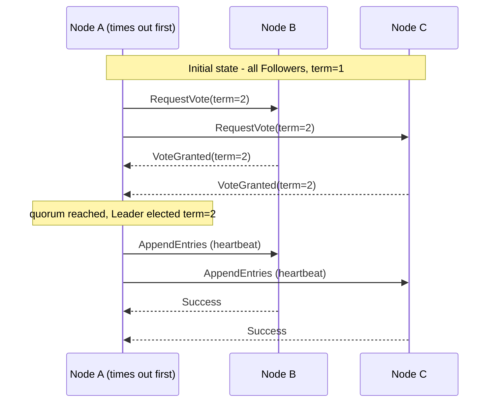

Election timeout is randomized 150–300ms to avoid split votes; once elected, the leader's 50–150ms heartbeat keeps Followers from starting a new election.

**Raft Log Replication**

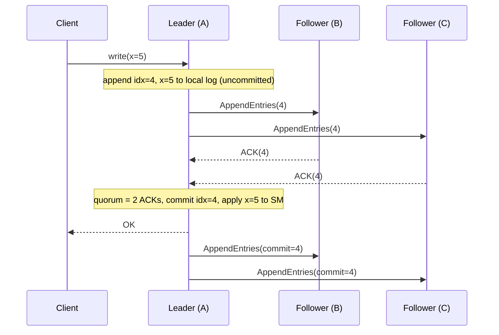

Commit requires a quorum of ACKs (2 of 3 nodes here) before the leader applies the entry and replies to the client; `leaderCommit` is then piggybacked to the remaining followers on the next `AppendEntries`.

**Quorum Sizing**

```
N nodes, f tolerated failures
Crash fault tolerance:     quorum = floor(N/2) + 1;   N = 2f + 1 minimum
Byzantine fault tolerance: quorum = floor(2N/3) + 1;  N = 3f + 1 minimum

N=3: quorum=2, tolerates 1 crash failure
N=5: quorum=3, tolerates 2 crash failures
N=7: quorum=4, tolerates 3 crash failures
```

**Single-Decree Paxos — two phases**

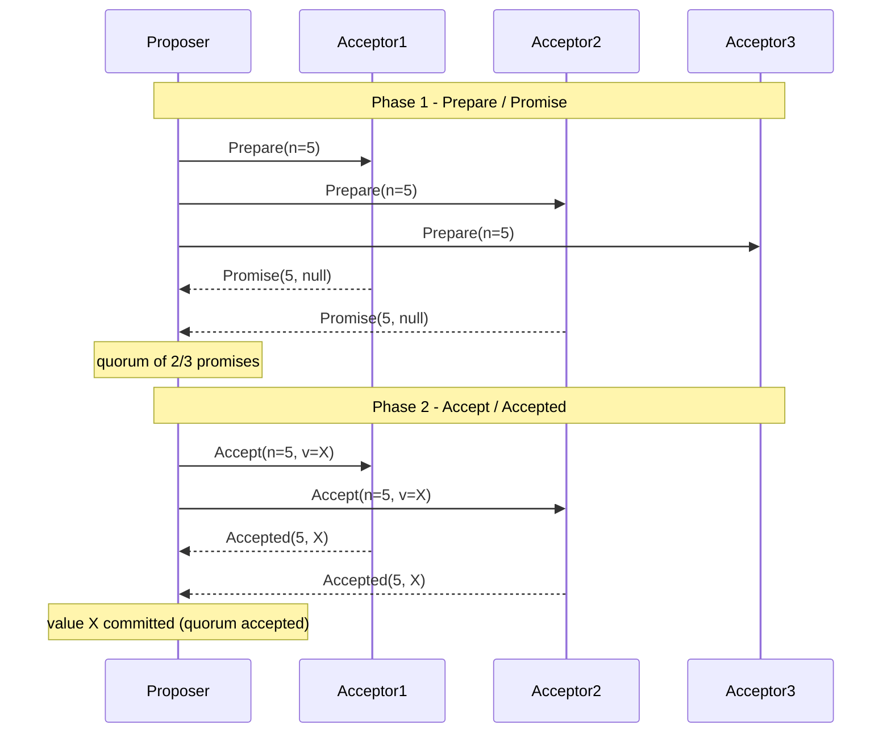

If a Promise returns a previously accepted value, the Proposer MUST re-propose
that value (not its own) in Phase 2 -- this is what preserves Agreement.

**Raft State Transitions**

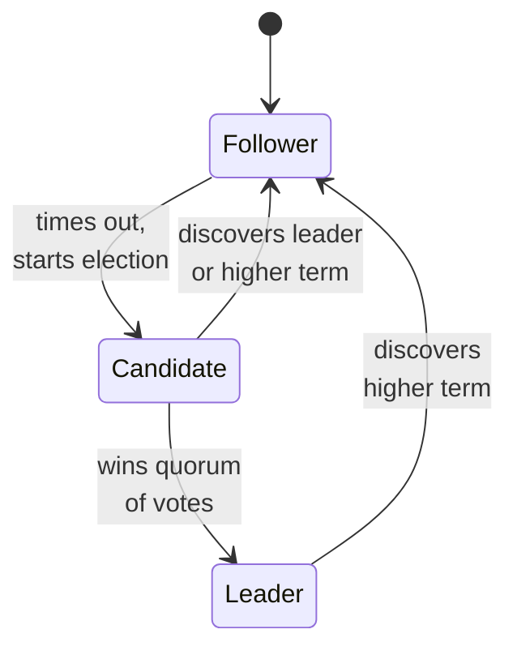

Only a Candidate that wins a quorum of votes becomes Leader; any node that sees a higher term reverts to Follower immediately — the mechanism that makes stale leaders harmless.

---

## 6. How It Works — Detailed Mechanics

**Raft log entry lifecycle (the happy path):**
1. Client sends a write request to the Leader.
2. Leader appends entry `(term=T, index=I, command=C)` to its local log — **not yet committed**.
3. Leader sends `AppendEntries` to all Followers in parallel.
4. Leader waits for a quorum of ACKs (`N/2 + 1` total, counting itself).
5. Leader marks the entry committed and advances `commitIndex`.
6. Leader applies the entry to its state machine and returns the response to the client.
7. In the next `AppendEntries` (or heartbeat), the Leader piggybacks `leaderCommit`; Followers advance their `commitIndex` and apply the entry to their own state machines.

**Per-Follower state the Leader tracks:**
- `nextIndex[i]` — the next log index to send to Follower `i` (initialized to leader's last log index + 1).
- `matchIndex[i]` — the highest log index known to be replicated on Follower `i` (initialized to 0). The Leader advances `commitIndex` to the highest index that `matchIndex` shows is replicated on a quorum.

**BROKEN: naive replication ignores term numbers → split-brain on partition**

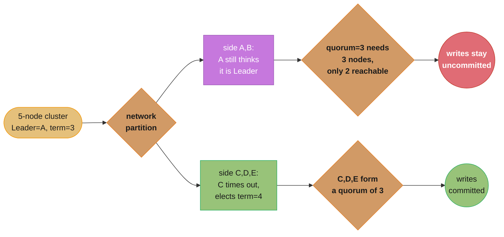

If the algorithm ignored term numbers, A and C would both be "leaders" with divergent committed state — irreconcilable split-brain.

**FIX: term numbers make the stale leader step down**

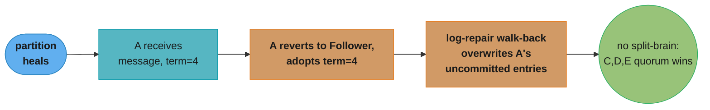

The key invariant: **only one leader can commit per term**, and a stale leader can never reach quorum in the minority partition.

**Log repair walk-back (divergence recovery):**

```
Leader log:    [t1] [t1] [t2] [t3] [t3]      indices 1..5
Follower log:  [t1] [t1] [t2] [t2]           index 4 diverges (t2 vs t3)

Leader sends AppendEntries(prevLogIndex=4, prevLogTerm=3) -> Follower rejects
  (its index-4 term is t2, not t3).
Leader decrements nextIndex to 4, retries prevLogIndex=3, prevLogTerm=2 -> match!
Leader overwrites index 4 onward with [t3] [t3]. Logs now identical.
```

**Snapshot and compaction:** When the log grows large, the Leader serializes the state machine at `commitIndex=K`, ships it to lagging Followers via the `InstallSnapshot` RPC, and discards log entries up to `K`. This bounds log growth without losing committed state — a Follower far behind is caught up in one snapshot transfer rather than thousands of `AppendEntries`.

**Follower-side `AppendEntries` handler (pseudocode):**

```
on AppendEntries(term, leaderId, prevLogIndex, prevLogTerm, entries, leaderCommit):
    # Rule 1: reject stale leaders
    if term < currentTerm:
        return (currentTerm, success=false)

    # Rule 2: any higher/equal term => recognize this leader, reset election timer
    if term >= currentTerm:
        currentTerm = term
        state = FOLLOWER
        resetElectionTimer()       # heartbeat received -> do not start an election

    # Rule 3: log-matching check
    if log[prevLogIndex].term != prevLogTerm:
        return (currentTerm, success=false)   # leader will walk back nextIndex

    # Rule 4: append, overwriting any conflicting suffix
    for e in entries:
        if log[e.index] exists and log[e.index].term != e.term:
            deleteFrom(e.index)               # remove divergent suffix
        log[e.index] = e

    # Rule 5: advance commit index
    if leaderCommit > commitIndex:
        commitIndex = min(leaderCommit, lastNewEntryIndex)
        applyCommittedEntriesToStateMachine()

    return (currentTerm, success=true)
```

The five rules above are the entire safety core of Raft replication. Note that the election timer is reset on *any* valid leader contact — this is why a healthy leader's 50–150ms heartbeat keeps Followers quiet.

**Linearizable reads (ReadIndex):** A naive "read from the leader's local state" can return stale data if the leader was just deposed but does not yet know it. Raft's linearizable read protocol: (1) the leader records the current `commitIndex` as `readIndex`; (2) it sends a round of heartbeats and waits for a quorum to confirm it is still leader; (3) it waits until its state machine has applied up to `readIndex`; (4) only then does it serve the read. This costs one heartbeat round-trip (~1ms same-AZ). Leader leases (see §12) optimize this away when clock skew is bounded.

**Membership changes (joint consensus):** Changing the voting set (e.g., 3 → 5 nodes) is dangerous — if old and new configurations were active at once, two disjoint majorities could elect two leaders. Raft uses *joint consensus*: a transitional configuration `C_old,new` requires quorums from *both* the old and the new set for every decision. Once `C_old,new` is committed, the leader switches to `C_new`. etcd exposes this via single-node add/remove (one membership change at a time) to keep the math simple and avoid losing quorum mid-change.

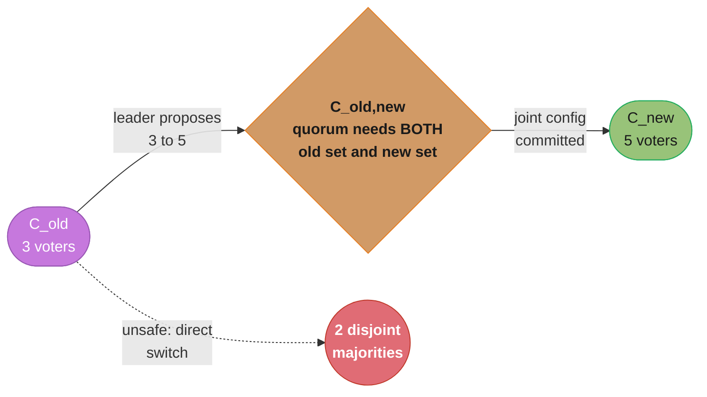

Only after the joint configuration commits does Raft cut over to `C_new` — a direct switch risks two disjoint majorities each electing a leader, which is exactly the danger this two-step protocol closes off.

**Fencing tokens — making distributed locks safe.** A consensus-backed lock service (etcd, ZooKeeper, Chubby) hands out a monotonically increasing *fencing token* with every lock grant. The problem it solves: client A acquires the lock, stalls in a GC pause past the lease TTL, the lock expires, client B acquires it — now both A and B think they hold the lock. Without fencing, A's delayed write corrupts shared state.

**BROKEN — lock without fencing:**

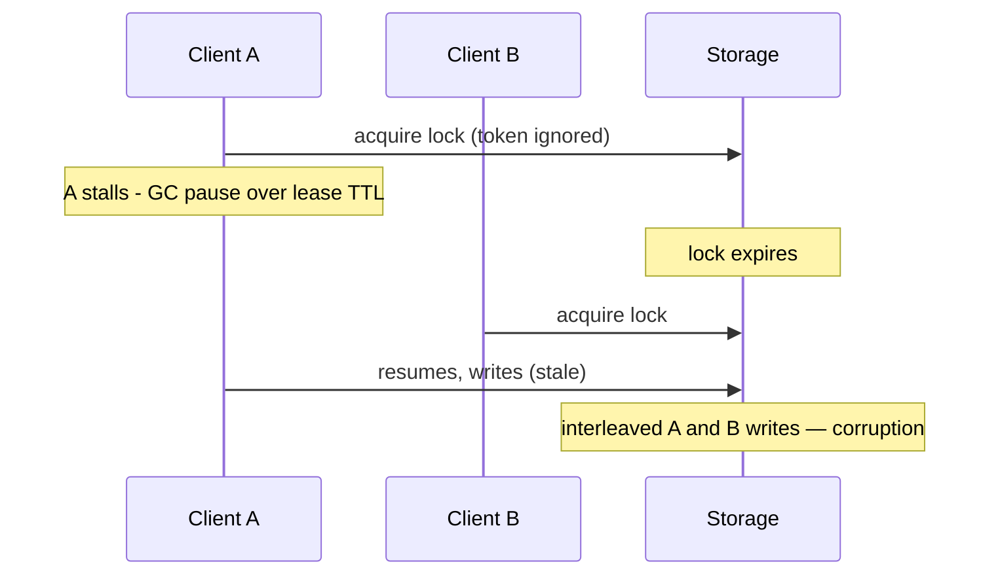

**FIX — every grant carries an increasing token; storage rejects stale tokens:**

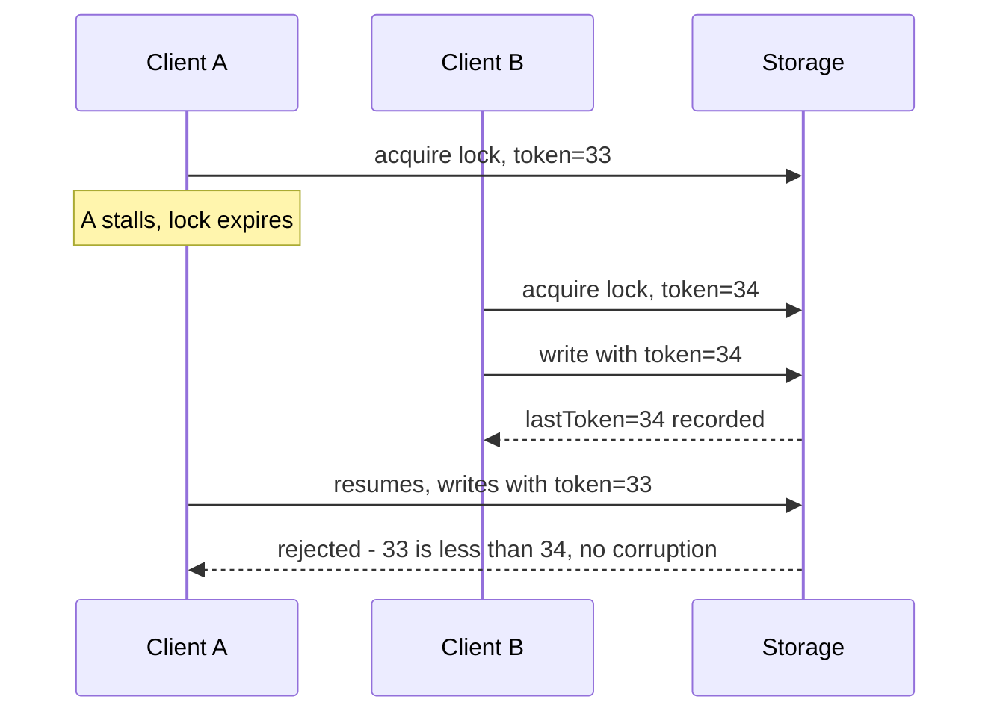

etcd implements this via the key's `mod_revision` (a monotonically increasing revision number); ZooKeeper via the znode's `zxid`/version. The storage layer must enforce the check — the lock service alone cannot prevent a delayed client from writing.

---

## 7. Real-World Examples

**etcd / Kubernetes.** Kubernetes stores *all* cluster state in etcd (a 3-node Raft cluster, typically). Every `kubectl apply` is an etcd write; the Kubernetes API server is stateless and etcd is the single source of truth. Typical write latency is 1–2ms same-AZ. At 5000 nodes with 500 API servers, etcd handles roughly 1000 writes/second. The bottleneck: etcd serializes all writes through the Raft leader — horizontal scaling requires sharding by namespace, which etcd does not do natively (Kine or external sharding proxies fill this gap).

**Apache Kafka ISR / KRaft.** Each partition has a leader broker and a set of In-Sync Replicas (ISR). With `acks=all`, the leader waits for every ISR member to acknowledge before responding to the producer. The controller — elected via ZooKeeper historically, via **KRaft** (Kafka's built-in Raft) in 3.3+ — manages partition leadership. ISR shrinkage (a follower lagging past `replica.lag.time.max.ms`, default 30s) is a classic production alert: under-replicated partitions reduce durability.

**CockroachDB.** A Multi-Raft architecture: the keyspace is split into ranges (~64MB each), and *each range runs its own 3-node Raft group*. A single cluster can run thousands of Raft groups concurrently. Range splits and merges create and destroy Raft groups dynamically. Leader leases let the Raft leader serve reads locally without a per-read consensus round-trip.

**HashiCorp Consul (and Vault, Nomad).** All three use the `hashicorp/raft` Go library. A 3-node server cluster is the minimum HA deployment. Consul handles service registration, health checks, and KV storage; every write is replicated through Raft to a quorum before acknowledgment.

**MongoDB Replica Set.** Uses a Raft-like protocol with term numbers, majority acknowledgment, and oplog-based replication. The `{w: "majority"}` write concern requires quorum acknowledgment before a write is considered durable. Elections use a step-down/priority mechanism equivalent to Raft's election timeout.

---

## 8. Tradeoffs

| Algorithm | Fault Tolerance | Throughput (steady state) | Complexity | Byzantine Tolerance | Leader Required |
|-----------|-----------------|---------------------------|------------|---------------------|-----------------|
| Raft | f failures in 2f+1 | High (pipelined AppendEntries) | Medium (understandable) | No | Yes |
| Multi-Paxos | f failures in 2f+1 | High (Phase 1 skipped) | High (many variants) | No | Yes (implicit) |
| PBFT | f failures in 3f+1 | Low (O(n²) messages) | Very High | Yes | Yes |
| ZAB | f failures in 2f+1 | High | Medium | No | Yes |
| Leaderless Paxos (EPaxos) | f failures in 2f+1 | Very High (no bottleneck leader) | Very High | No | No |

**Raft vs Paxos.** Raft was designed for understandability. It makes explicit what Paxos leaves underspecified: leader election (Paxos assumes a leader but never specifies how to pick one), log structure, snapshots, and membership changes. Raft's *log matching property* and *leader completeness property* make it far easier to implement correctly — the tradeoff is rigidity (a strict single leader), whereas EPaxos trades complexity for leaderless, higher throughput.

**Latency vs durability vs availability — the three-way pull.**

| Choice | Effect | When you pick it |
|--------|--------|------------------|
| `acks=all` / `w:majority` | Higher write latency, no committed-data loss | Money, orders, anything not reproducible |
| `acks=1` / `w:1` | Lower latency, window for data loss on leader crash | Metrics, logs, reproducible data |
| 3 voters | Tolerates 1 failure, lowest quorum latency | Default for most clusters |
| 5 voters | Tolerates 2 failures, slightly higher latency | Control planes needing 99.99%+ |
| Leader lease reads | Local reads, no round-trip | Read-heavy, bounded clock skew |
| ReadIndex reads | One heartbeat per read, no skew assumption | Strict linearizability, untrusted clocks |

**Decision shortcut for interviews.** Need agreement among trusted nodes that may crash? Raft (use etcd/Consul, do not hand-roll). Need it across mutually distrusting organizations? PBFT or a blockchain ordering service. Already on Kafka and need ordering? Use the log directly — do not add a consensus round per message. Need only eventual agreement at huge scale? CRDTs or gossip, not consensus.

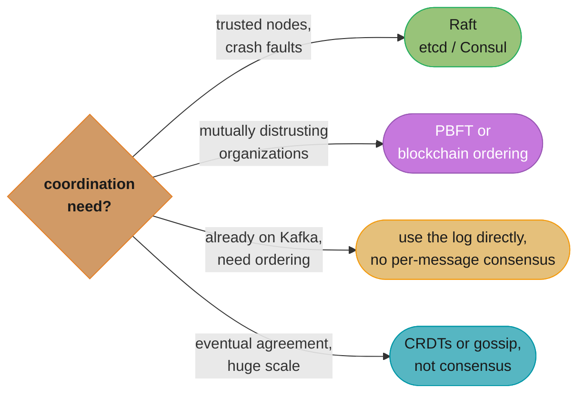

The four branches map directly to the guidance above: match the trust model and existing infrastructure to the right tool before reaching for a full consensus protocol.

**Safety vs availability.** Every algorithm here chooses safety: with no quorum, the system stops accepting writes rather than risk divergence. This is the CP corner of CAP — see `../cap_theorem/`.

---

## 9. When to Use / When NOT to Use

**Use consensus when:**
- Leader election is required (Kafka partition leader, Kubernetes controller, primary database).
- Distributed lock coordination — exactly one process may hold a lock at a time.
- A strongly consistent configuration store is needed (etcd, Consul KV).
- A replicated state machine must stay strongly consistent across nodes.

**Do NOT use consensus when:**
- High-throughput streaming where eventual consistency is acceptable — use Kafka log replication directly, not a consensus round per message.
- Storing large data blobs — consensus is for metadata and coordination; store bulk data in a distributed DB that uses consensus internally for its metadata only.
- BASE / eventually-consistent semantics suffice — use CRDTs or gossip protocols, which scale far better.
- Cluster size exceeds ~20–30 nodes for PBFT — quadratic message complexity makes it impractical; for crash-only faults, keep the voting set to 3, 5, or 7.

---

## 10. Common Pitfalls

1. **Election timeout too short → election storm.** Followers time out before the leader's heartbeat arrives (often during a GC pause or CPU saturation). Every node starts an election at once; none wins; the cluster thrashes. Fix: the election timeout should be at least 10× the heartbeat interval. etcd defaults: `heartbeat=100ms`, `election-timeout=1000ms`.

2. **Quorum misconfiguration (even-sized clusters).** A 4-node Raft cluster (quorum=3) tolerates only 1 failure — the same as a 3-node cluster — but costs an extra node. Worse, a 2+2 network split leaves *neither* side with a quorum, so the whole cluster halts. Always use odd-numbered clusters (3, 5, 7).

3. **etcd write amplification at Kubernetes scale.** All API-server writes flow through etcd's single Raft leader. At 5000+ nodes the leader becomes the bottleneck: high leader CPU, write latency > 5ms. Fix: rate-limit API-server LIST operations, serve reads from informer caches, use `resourceVersion` to avoid watch storms, and mandate NVMe SSD for etcd.

4. **Kafka ISR data loss with `acks=1`.** With `acks=1` the leader acknowledges before replicating to ISR. If the leader dies before replication completes, the acknowledged write is silently lost. Fix: use `acks=all` with `min.insync.replicas=2` for any data that must not be lost.

5. **Split-brain via long GC pause.** A leader stalled in a GC pause longer than the election timeout is deposed; after the pause it resumes believing it is still the leader. New commits from the new leader arrive with a higher term. Raft resolves this automatically — the old leader sees the higher term and steps down — but monitor GC pause duration and use ZGC (sub-1ms pauses) for latency-sensitive consensus participants.

6. **Distributed lock without fencing tokens.** Using etcd/ZooKeeper purely as a lock without passing the fencing token to the storage layer reinvents split-brain at the application level: a paused lock holder resumes after its lease expires and writes anyway. The lock service cannot stop it — only the storage layer, by rejecting stale tokens, can. Always thread the fencing token (etcd `mod_revision`, ZooKeeper version) through to the resource being protected.

7. **Cross-region quorum latency.** Placing the 3 voting members in 3 different regions (us-east, eu-west, ap-south) means every commit waits for a quorum that includes a node ~100–150ms away — commit latency jumps from 1–2ms to 100ms+. Fix: keep all voters in one region across AZs; use non-voting learners or async replicas in remote regions for DR. Consensus latency is bounded by the *median* quorum member's RTT, not the slowest, but cross-region medians are still large.

8. **`min.insync.replicas` equal to replication factor.** Setting `min.insync.replicas=3` with replication factor 3 means a *single* broker failure makes the partition unavailable for writes (the ISR can no longer satisfy the minimum). Fix: keep `min.insync.replicas` one below the replication factor (e.g. 2 with RF=3) so you can lose one broker and still accept writes durably.

---

## 11. Technologies & Tools

| Tool | Algorithm | Use Case |
|------|-----------|----------|
| etcd | Raft | Kubernetes cluster state; distributed locking |
| HashiCorp Raft library | Raft | Powers Consul, Vault, Nomad |
| Apache ZooKeeper | ZAB | Kafka controller (pre-KRaft), HDFS NameNode HA |
| Apache Kafka KRaft | Raft | Kafka's built-in metadata quorum (replaces ZooKeeper) |
| CockroachDB | Multi-Raft | Distributed SQL database |
| TiKV | Raft | Distributed key-value store (powers TiDB) |
| Consul | Raft | Service discovery, health checking, KV |
| Jepsen | Testing framework | Correctness testing of distributed systems under network faults |
| hashicorp/raft | Raft | Open-source Go library; battle-tested Raft implementation |

---

## 12. Interview Questions with Answers

**Q: What is Raft and how does leader election work?**
Raft is a consensus algorithm designed for understandability. Leader election: when a Follower's election timeout fires (randomized 150–300ms), it becomes a Candidate, increments its term, votes for itself, and sends `RequestVote` to all peers. A Candidate wins if it receives votes from a quorum (majority) before its timeout expires. Randomized timeouts prevent ties. A node grants a vote only if (a) it has not voted in this term, and (b) the Candidate's log is at least as up-to-date as the voter's log (the log-completeness safety check). Practical guidance: set the election timeout to at least 10× the heartbeat interval to prevent spurious elections during a leader's GC pauses.

**Q: What is split-brain and how does Raft prevent it?**
Split-brain is when two nodes both believe they are the leader and independently accept writes, producing divergent state that cannot be reconciled. Raft prevents it via term numbers: every message carries the sender's current term. If a leader receives a message with a higher term, it immediately reverts to Follower and can commit nothing more. During a partition, the minority side (old leader) cannot reach quorum, so its writes stay uncommitted and are rolled back when the partition heals; the majority side elects a new leader with a higher term. Only one leader can commit per term.

**Q: What is a quorum and why is majority (N/2+1) the threshold?**
A quorum is the minimum number of nodes that must agree before an operation counts as committed. The majority threshold ensures any two quorums share at least one node. That overlap node carries the committed state, so any new leader formed from a quorum is guaranteed to know the last committed value. For N=3: quorum=2, tolerates 1 failure. For N=5: quorum=3, tolerates 2 failures. Running an even number of nodes (e.g. N=4) gives the same fault tolerance as N=3 but wastes a node and creates partition problems — a 2+2 split has no majority on either side.

**Q: What happens to a Raft cluster when the leader fails?**
Followers stop receiving heartbeats. After the election timeout (150–300ms typical), one Follower becomes a Candidate, requests votes, wins on a quorum, and becomes the new leader, which then begins sending heartbeats. Uncommitted entries from the old leader are either replicated and committed by the new leader (if it has them) or discarded (if its log is more up-to-date). Committed entries are never lost: the election-safety guarantee ensures a Candidate with a stale log cannot win.

**Q: How does Kafka's ISR relate to Raft/consensus?**
Kafka's In-Sync Replica mechanism is a form of quorum replication, though not textbook Raft. With `acks=all`, the partition leader waits for all ISR members to write the message before acknowledging. ISR membership is dynamic — a Follower is removed if it lags more than `replica.lag.time.max.ms` (default 30s). With `min.insync.replicas=2` and `acks=all`, a write needs at least 2 replicas, equivalent to a 3-node quorum tolerating 1 failure. KRaft (Kafka 3.3+) replaces ZooKeeper with a built-in Raft implementation for controller election and metadata.

**Q: Why does etcd exist — can't Kubernetes just use a regular database?**
Kubernetes needs linearizable reads and writes for cluster state: after the API server writes a Pod spec, the next read must return the updated value. A typical SQL setup with read replicas offers only eventual consistency — a follower can return stale data. etcd's Raft guarantees linearizability via the leader (or a quorum-based ReadIndex). etcd also provides the Watch API, letting controllers receive change notifications — a capability standard SQL databases lack, and exactly what makes Kubernetes' declarative reconciliation loops work.

**Q: What is the FLP impossibility result?**
Fischer, Lynch, and Paterson (1985) proved that in a fully asynchronous system, no deterministic consensus algorithm can guarantee both safety and liveness with even one faulty process. The reason: you cannot distinguish a slow node from a crashed one, so any timeout may be a false positive. Practical systems circumvent FLP with timeouts and randomization — Raft's randomized election timeout breaks symmetry without violating safety. FLP applies to perfectly asynchronous systems; real systems assume partial synchrony, which makes Raft correct in practice.

**Q: Raft vs Paxos — what did Raft improve?**
Raft was explicitly designed for understandability (Ongaro, 2014). Paxos describes single-decree consensus; Multi-Paxos — the production form — is underspecified, leaving log structure, leader election, membership changes, and snapshots to the implementer. Raft makes all of these explicit: one leader per term, log entries applied in strict order, an explicit election protocol, and joint-consensus membership changes. Engineers implement Raft correctly far more often than Paxos from the spec alone. The tradeoff: Raft requires a strict leader, while EPaxos achieves higher throughput by allowing leaderless commits.

**Q: When would you choose PBFT over Raft?**
Choose PBFT when you need Byzantine fault tolerance — nodes that actively lie, equivocate, or behave arbitrarily (e.g., a compromised node in a multi-organization consortium). Raft only tolerates crash-stop faults. Use cases: permissioned blockchains (Hyperledger Fabric) and multi-party settlement systems where participants do not trust each other. The cost: PBFT needs 3f+1 nodes (vs 2f+1 for Raft) and O(n²) message complexity, impractical beyond ~20–30 nodes. For internal systems where you trust your own nodes, Raft is the right choice.

**Q: How does Raft handle log divergence after a network partition heals?**
The old leader (now a Follower) receives `AppendEntries` from the new leader carrying a higher term. The new leader decrements `nextIndex[oldLeader]` until it finds the point where the logs agree (matching `prevLogIndex` and `prevLogTerm`), then overwrites everything after that point with its own entries. The old leader's uncommitted entries are discarded. Committed entries are safe because the election-safety property guarantees the new leader's log already contains all committed entries.

**Q: How do you size an etcd cluster for a large Kubernetes deployment?**
A 3-node etcd cluster (quorum=2, tolerates 1 failure) suffices for most clusters up to ~1000 nodes. For 5000+ nodes with high write throughput: (a) use 5 nodes (quorum=3, tolerates 2 failures); (b) use NVMe SSD — rotational disk causes >100ms fsync latency, triggering spurious elections; (c) dedicate etcd to its own nodes to avoid CPU contention with API servers; (d) set `--heartbeat-interval=100 --election-timeout=1000`; (e) enable compaction and periodic defragmentation to prevent storage bloat; (f) consider namespace-level sharding via Kine for very large clusters.

**Q: What is a leader lease and how does it improve read performance?**
A leader lease is a time-bound guarantee that no other leader has been elected, letting the current leader serve reads locally without a quorum round-trip. Normally a Raft read requires a ReadIndex quorum check to confirm the leader is still the leader. With a lease, the leader records when it last renewed (lease length < election timeout, adjusted for clock skew); while the lease is valid, it serves reads locally. The risk is clock skew causing an old leader's lease to overlap a new leader's term, returning stale reads. CockroachDB and etcd use leases with carefully bounded clock skew (NTP, or TrueTime-style bounds).

**Q: What is Flexible Paxos and how does it relax the quorum requirement?**
Flexible Paxos (Heidi Howard, 2016) observes that the two phases of consensus can use different quorum sizes, as long as any Phase 1 quorum overlaps any Phase 2 quorum. This lets you trade leader-election cost for commit latency: use a large Phase 1 quorum (leader election, infrequent) and a small Phase 2 quorum (log replication, frequent). Example on 5 nodes — Phase 1 quorum=4, Phase 2 quorum=2 — gives low-latency writes at the cost of slower elections (needs 4/5 nodes). Useful for write-heavy workloads with stable leadership.

**Q: How does Kafka KRaft improve on ZooKeeper?**
ZooKeeper was an external dependency for Kafka controller election and metadata. Problems: a separate operational burden, slower metadata propagation (ZooKeeper → controller → brokers), and a scalability ceiling for large clusters (10,000+ partitions). KRaft (stable in Kafka 3.3+, default in 4.0) runs a built-in Raft group among brokers for metadata; a controller quorum of 3–5 nodes holds all metadata. Benefits: single deployment (no ZooKeeper), faster propagation via direct Raft replication, and roughly 10× more partitions per cluster. Kafka 3.x supports both modes; 4.0 drops ZooKeeper.

**Q: What is the "term number" mechanism and why is it central to Raft's correctness?**
Every Raft message carries the sender's `currentTerm`, a monotonically increasing integer incremented on each election attempt. Two rules govern it: a node receiving any message with a higher term immediately reverts to Follower and adopts that term; a node rejects any message with a lower term as stale. This makes stale leaders harmless — an old leader that rejoins after a partition sees a higher term and steps down before it can cause split-brain. The term number is the single mechanism that prevents multiple concurrent leaders across every partition and failure scenario.

**Q: What is a fencing token and why is a distributed lock unsafe without one?**
A fencing token is a monotonically increasing number handed out with each lock grant. Without it, a lock is unsafe: a client can acquire the lock, stall in a GC pause beyond the lease TTL, have the lock expire and be granted to another client, then resume and write — two clients writing as if they hold the lock. The fix is for the lock service to issue an increasing token (etcd `mod_revision`, ZooKeeper version) on each grant, and for the *protected storage* to record the highest token it has seen and reject any write with a lower one. Crucially, the lock service alone cannot prevent corruption — the storage layer must enforce the token check.

**Q: Why can't a follower just serve reads locally in Raft, and what is ReadIndex?**
A follower (or even a leader that was just deposed) may have stale state, so serving a read locally can violate linearizability — returning a value that was already overwritten. ReadIndex fixes this on the leader: it records the current `commitIndex` as the read index, confirms via a heartbeat round that it is still the leader (quorum acknowledgment), waits until its state machine has applied up to that index, then serves the read. This costs one round-trip (~1ms same-AZ). Leader leases avoid even that round-trip when clock skew is bounded, at the risk of stale reads if clocks drift.

**Q: Can a 4-node Raft cluster tolerate more failures than a 3-node one?**
No — and this is a common trap. A 4-node cluster has quorum=3, so it tolerates only 1 failure, exactly the same as a 3-node cluster (quorum=2), while costing an extra machine. Worse, a 2+2 network partition leaves neither side with a quorum, halting the whole cluster. Always use odd sizes: 3 tolerates 1, 5 tolerates 2, 7 tolerates 3. Adding nodes also raises commit latency (larger quorum), so do not over-provision voters — use learners/replicas for read scaling and DR instead.

**Q: How does consensus relate to the CAP theorem?**
Consensus algorithms are CP: they choose Consistency and Partition-tolerance over Availability. During a network partition, the minority side cannot reach a quorum and therefore refuses writes (and linearizable reads) rather than risk divergence — that refusal is the loss of availability. The majority side stays consistent and available. This is why etcd, ZooKeeper, and Consul become read-only or unavailable in the minority partition: they would rather stop than return a value that might disagree with the other side. See `../cap_theorem/` for the broader framing.

---

## 13. Best Practices

- Use odd-numbered clusters (3, 5, 7) — even sizes add no fault tolerance and create partition ambiguity.
- Set the election timeout to at least 10× the heartbeat interval to prevent spurious elections during GC pauses.
- Use NVMe SSD for Raft storage — fsync latency directly bounds commit latency; rotational disk (>5ms) triggers elections.
- Monitor `etcd_server_leader_changes_seen_total` in Prometheus — frequent leader changes signal instability (disk, CPU, or network).
- Enable `acks=all` with `min.insync.replicas >= 2` in Kafka — a single ISR member is a single point of data loss.
- Never co-locate etcd with high-CPU workloads — CPU starvation delays heartbeats and triggers elections.
- Run Jepsen tests to verify consensus correctness under network partitions and clock skew before production deployment.

---

**Cross-references:** [database/consistency_models_and_consensus](../../database/consistency_models_and_consensus/) (how consensus underpins linearizable reads/writes), [backend/kafka_deep_dive](../../backend/kafka_deep_dive/) (ISR as a Raft-like replication mechanism), [database/distributed_transactions](../../database/distributed_transactions/).

---

## 14. Case Study

### Design: etcd Cluster for a 5000-node Kubernetes Deployment

**Intuition.** Kubernetes is a giant replicated state machine whose entire truth lives in etcd. Designing this cluster is really about keeping a single Raft leader fast, durable, and never split-brained while 500 API servers and 5000 controllers hammer it.

#### 1. Requirements Clarification
- 5000 worker nodes, 500 API servers.
- ~1000 writes/second to etcd (Pod status updates, ConfigMaps, Secrets).
- Watch API serving ~5000 controllers.
- 99.99% availability target (≈ 52 min downtime/year).
- Strong consistency (linearizable reads/writes) is mandatory — stale cluster state causes scheduling bugs.

#### 2. Scale Estimation
- 1000 writes/s × 86,400 s ≈ 86M writes/day through a single Raft leader.
- Each write = 1 fsync on the leader + replication to a quorum. fsync budget must stay < 1ms (target 100–300µs on NVMe).
- Keyspace: hundreds of thousands of objects; with history, etcd DB size must be bounded by compaction (keep under the 8GB default quota).

#### 3. High-Level Architecture
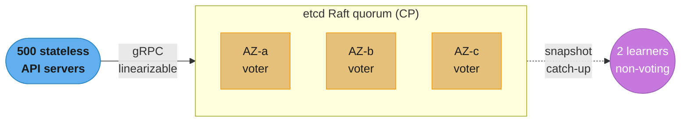
- **5-node** etcd cluster: quorum=3, tolerates 2 simultaneous failures.
- 3 voting members spread across AZ-a, AZ-b, AZ-c; 2 **learners** (non-voting) for DR / fast promotion.

#### 4. Component Deep Dives
- **Write path:** API server → etcd Leader → replicate to a quorum (2 of 4 Followers) → commit → ACK. Latency dominated by the slowest quorum member's fsync + cross-AZ RTT (~5–10ms cross-AZ).
- **Read path:** API servers use `resourceVersion` to avoid unnecessary round-trips; ListWatch with an informer cache serves the vast majority of reads from in-memory cache, *not* from etcd. This is the single biggest lever for keeping etcd write-bound rather than read-saturated.
- **Watch path:** etcd streams events to API-server watch connections; the API server fans out to controller informers, so 5000 controllers do not each open a direct etcd watch.

Broken→fix: a team ran controllers watching etcd directly (5000 watches) → watch storm + leader CPU saturation + leader elections. Fix: route all watches through the API server's shared informer/watch-cache layer, collapsing 5000 etcd watches into a handful.

#### 5. Design Decisions & Tradeoffs
- 5 nodes over 3: +1 tolerated failure for the cost of slightly higher commit latency (larger quorum). Worth it at 99.99%.
- Learners over more voters: extra copies for DR without enlarging the quorum (which would raise latency).

#### 6. Real-World Implementations
- This mirrors managed Kubernetes control planes (EKS, GKE, AKS), which run etcd on dedicated, NVMe-backed, AZ-spread nodes and aggressively cache reads in the API server.

#### 7. Technologies & Tools
- etcd (Raft), NVMe SSD storage, Prometheus (`etcd_server_leader_changes_seen_total`, `etcd_disk_wal_fsync_duration_seconds`), Kine (optional namespace sharding).

#### 8. Operational Playbook
- **Compaction:** `--auto-compaction-retention=5m` to bound keyspace history.
- **Defragmentation:** weekly scheduled maintenance window, one member at a time, to reclaim space without losing quorum.
- **Tuning:** `--heartbeat-interval=100 --election-timeout=1000`.

#### 9. Common Pitfalls & War Stories
- Co-locating etcd with the API server caused CPU contention → delayed heartbeats → leader elections every few minutes. Fix: dedicated etcd nodes; leader changes dropped from dozens/hour to ~0.
- Rotational disk → fsync spikes >100ms → constant elections. Fix: NVMe; commit latency dropped to <1ms.

#### 10. Capacity Planning
- Single Raft leader is the write ceiling (~10k writes/s on good hardware; design for 1000/s with headroom). Past that, shard per-namespace via Kine (SQLite/PostgreSQL backend with a Raft frontend) or reduce write load with server-side apply / patch instead of full-object updates.

#### 11. Interview Discussion Points
- **Why not scale etcd horizontally for writes?** All writes serialize through one Raft leader; you scale by sharding the keyspace, not by adding voters. Adding voters actually *raises* commit latency (larger quorum) while only marginally improving fault tolerance.
- **AZ-a fails (1 of 5 nodes) — what happens?** etcd keeps quorum (3/5), Kubernetes keeps operating; replace the node and it syncs from a leader snapshot. RTO < 2 minutes.
- **Two AZs fail (2 of 5) — what happens?** Still exactly quorum (3/5), still available. A third failure would lose quorum and freeze writes — this is the hard ceiling of a 5-node cluster, and why 99.999% control planes spread voters across 3+ failure domains.
- **Why learners?** Non-voting replicas catch up via snapshots without slowing the quorum, then can be promoted on failure. They also serve as fast-restore DR copies in a remote region without adding cross-region latency to the write path.
- **Why does etcd cap DB size at 8GB by default?** Past a few GB, snapshot transfer to a recovering follower and boot-time replay both slow dramatically, lengthening RTO. The quota forces operators to compact aggressively rather than let the keyspace grow unbounded.
- **What single metric best predicts an etcd outage?** `etcd_disk_wal_fsync_duration_seconds` p99 — when fsync creeps above ~10ms, the leader cannot heartbeat in time, elections begin, and the cluster destabilizes. It is the leading indicator before user-visible latency appears.
